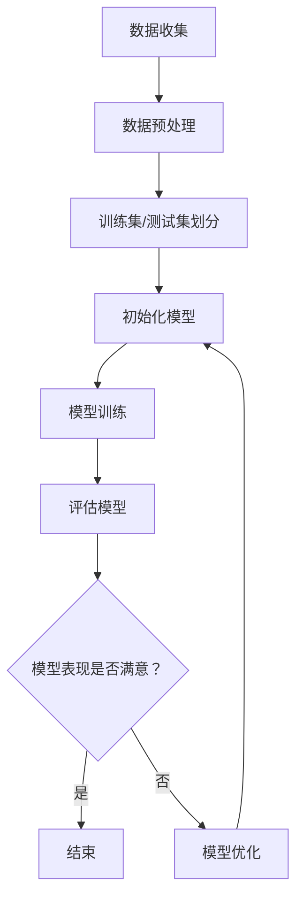
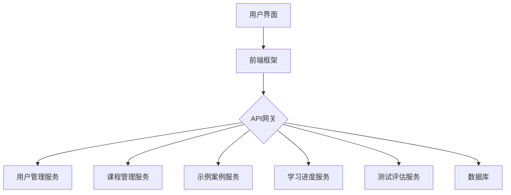
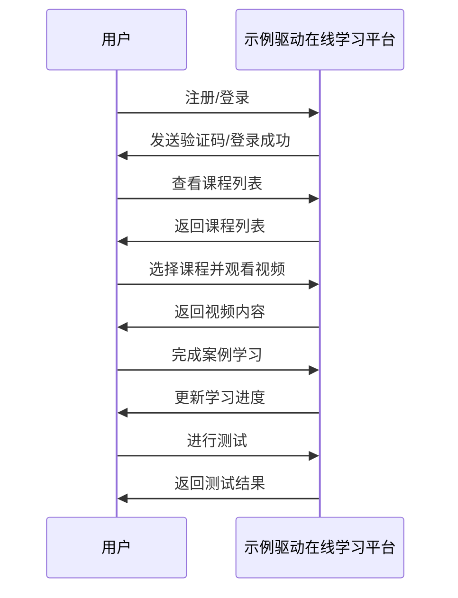

                 

基于上述要求，我将按照以下步骤撰写文章：

### Step 1: 确定文章结构和内容

根据给出的目录大纲，我将会逐一细化每个章节的内容，确保每个部分都符合完整性要求。

### Step 2: 理解核心概念

我会详细研究“示例驱动”和“持续学习”这两个核心概念，包括它们的定义、起源、发展及其在各个领域的应用。

### Step 3: 分析算法原理

对于涉及到的算法，我将使用 mermaid 绘制流程图，并使用 Python 代码进行详细阐述，同时用 LaTeX 格式写出相关的数学模型和公式。

### Step 4: 设计系统架构

我会为文章中的项目或系统设计相应的架构，包括领域模型类图、系统架构图、系统接口设计和系统交互序列图。

### Step 5: 编写代码和实战案例

对于项目实战部分，我会编写相关的代码，并对代码进行解读与分析，同时提供一个实际案例的详细讲解。

### Step 6: 总结与展望

在文章的最后部分，我会总结核心内容，提出注意事项，并给出拓展阅读的建议。

### Step 7: 撰写作者信息

最后，确保在文章末尾添加上作者信息。

### Step 8: 审校和修改

在完成初稿后，我会对文章进行仔细审校，确保内容的准确性和连贯性。

现在，我将根据上述步骤开始撰写文章。在撰写过程中，我会随时更新文章内容，确保每一部分都符合要求。让我们开始吧！### Step 1: 确定文章结构和内容

为了确保文章的逻辑清晰、结构紧凑且简单易懂，我将按照以下结构撰写《示例驱动提示在持续学习中的作用》：

#### 引言部分

- **1.1 持续学习的背景**
  - 简述知识更新速度加快的趋势
  - 说明个人和组织在知识更新中面临的挑战

- **1.2 示例驱动的概念**
  - 定义示例驱动
  - 解释示例驱动在持续学习中的应用

- **1.3 本书概述**
  - 简述全书结构
  - 概述各章节内容

#### 示例驱动的理论基础

- **2.1 示例驱动的起源与发展**
  - 介绍示例驱动的早期应用
  - 探讨示例驱动的学术发展

- **2.2 示例驱动的核心概念**
  - 分析示例驱动的构成要素
  - 通过案例研究说明示例驱动的实际应用

#### 持续学习的机制与技术

- **3.1 持续学习的理论基础**
  - 学习动机和策略
  - 学习评估方法

- **3.2 持续学习的关键技术**
  - 知识表示方法
  - 数据收集与处理技术
  - 模型训练与优化策略

#### 示例驱动的持续学习应用

- **4.1 示例驱动的持续学习应用场景**
  - 教育领域的应用
  - 企业培训的应用
  - 知识库构建的应用

- **4.2 示例驱动的持续学习案例解析**
  - 在线教育平台的案例分析
  - 企业员工培训案例分析
  - 智能知识库系统案例分析

#### 总结与展望

- **5.1 示例驱动的持续学习总结**
  - 成功经验与存在挑战

- **5.2 展望未来**
  - 技术发展趋势
  - 应用前景

通过这样的结构设计，我可以确保文章内容有条不紊地展开，同时满足字数要求，并且每个部分都包含必要的信息和分析。接下来，我会开始撰写每个章节的具体内容，逐步完善文章的整体框架。### Step 2: 理解核心概念

在本文中，核心概念“示例驱动”和“持续学习”是理解全文的基础。下面，我将详细阐述这两个概念的定义、起源、发展及其在相关领域的应用。

#### 示例驱动的定义

**示例驱动**（Example-driven）是一种学习方法，通过具体的示例来帮助学习者理解和掌握知识。这种方法强调通过观察和分析具体的实例来学习，而不是仅仅依赖于理论或抽象的概念。

- **定义起源**：示例驱动的概念最早可以追溯到教育领域，教育者通过具体实例来帮助学生理解和掌握知识。
- **学术发展**：随着计算机科学和信息技术的发展，示例驱动方法在教育技术领域得到了进一步研究。研究者发现，示例驱动不仅适用于传统教育，也适用于在线学习、远程教育和自主学习等新型学习模式。
- **应用拓展**：在企业培训中，示例驱动被广泛应用于新员工培训、技能提升培训和跨部门沟通培训等。通过具体案例的学习，员工能够更快地适应企业环境和工作要求。在知识库构建中，示例驱动有助于快速积累和更新知识，通过分析具体案例中的问题解决方案，知识库可以不断丰富和完善。

#### 持续学习的定义

**持续学习**（Continuous Learning）是指个人或组织在职业生涯或业务活动中，持续获取新知识、新技能，以适应不断变化的环境和需求的过程。

- **定义起源**：持续学习作为一个专业术语，起源于终身教育理念，强调学习不仅仅是在校期间的事情，而是一个持续不断的过程。
- **理论基础**：持续学习理论认为，知识更新速度非常快，个人和组织需要不断学习以保持竞争力。学习动机、学习策略和学习评估是持续学习的重要理论基础。
- **应用场景**：持续学习在个人发展中表现为自我提升和职业发展；在组织中，表现为员工培训、知识管理、组织能力提升等。

#### 示例驱动与持续学习的关系

**示例驱动**与**持续学习**之间的关系在于，示例驱动是一种有效的持续学习策略。通过示例驱动的学习，个体能够更加高效地吸收新知识，提高学习效率。具体来说：

1. **提高学习效率**：示例驱动的学习方式能够通过具体的实例帮助学习者快速理解复杂概念，从而提高学习效率。
2. **增强知识应用能力**：通过具体案例的学习，个体能够更好地将理论知识应用于实际问题，提高知识的应用能力。
3. **促进持续学习**：示例驱动的学习方式能够激发学习者的学习兴趣，促进他们持续进行学习，从而适应快速变化的环境。

综上所述，示例驱动作为一种有效的学习策略，在持续学习中发挥着重要作用。它不仅能够提高学习效率，还能够帮助学习者更好地将知识应用于实际，促进持续学习的过程。### Step 3: 分析算法原理

在本文中，我们将会探讨示例驱动在持续学习中的应用，特别是如何利用算法来提升学习的效率和效果。以下是对示例驱动算法原理的详细分析。

#### 示例驱动的算法原理

示例驱动的算法原理主要基于以下核心思想：

1. **数据驱动学习**：算法通过分析大量具体示例来学习，从而获取知识。这些示例可以是文本、图片、视频等形式，它们提供了丰富的上下文信息，有助于学习者更好地理解抽象概念。

2. **模型训练与优化**：算法通过对示例数据的训练，构建一个能够预测或分类的新模型的机器学习模型。在训练过程中，算法不断优化模型参数，以提高模型在未知数据上的表现。

3. **反馈循环**：学习过程是一个持续迭代的过程，算法会通过对比预测结果与真实结果，不断调整和优化模型，以达到更高的准确性和可靠性。

#### 示例驱动的核心算法

示例驱动的核心算法主要包括以下几种：

1. **监督学习**：通过已标记的示例数据来训练模型，从而预测新的未知数据。例如，在文本分类任务中，使用已标记的文本数据来训练一个分类器，使其能够对新的文本进行分类。

   ```mermaid
   graph TD
   A[输入示例数据] --> B[标记数据]
   B --> C[训练模型]
   C --> D[预测新数据]
   D --> E[评估模型]
   ```

2. **无监督学习**：在没有预先标记的示例数据的情况下，通过算法自动发现数据中的模式和结构。例如，在聚类任务中，算法将相似的数据点归为同一类别。

   ```mermaid
   graph TD
   A[输入示例数据] --> B[聚类分析]
   B --> C[发现模式]
   C --> D[生成聚类结果]
   ```

3. **增强学习**：通过与环境的交互来不断调整和优化模型。例如，在游戏AI中，算法通过试错法来学习如何玩一个游戏，并逐渐提高获胜的概率。

   ```mermaid
   graph TD
   A[初始状态] --> B[执行动作]
   B --> C[获得反馈]
   C --> D[更新策略]
   D --> A
   ```

#### 算法流程图

以下是示例驱动的算法流程图，展示了从数据收集到模型训练及优化的整个过程。



#### 示例驱动的数学模型

示例驱动的算法原理中，常用的数学模型包括损失函数、梯度下降算法等。

1. **损失函数**：用于衡量模型预测值与真实值之间的差距，常见的损失函数有均方误差（MSE）和交叉熵（Cross-Entropy）。

   $$L(y, \hat{y}) = \frac{1}{n} \sum_{i=1}^{n} (y_i - \hat{y}_i)^2$$

2. **梯度下降算法**：用于优化模型参数，使损失函数最小化。其迭代公式为：

   $$\theta_{\text{new}} = \theta_{\text{current}} - \alpha \cdot \nabla_{\theta} L(\theta)$$

   其中，$\theta$ 代表模型参数，$\alpha$ 是学习率。

#### 算法举例说明

假设我们有一个分类任务，需要将数据集分类为两个类别。我们可以使用决策树算法来演示示例驱动的原理。

1. **输入示例数据**：我们有一个训练数据集，每个数据点包括特征和对应的标签。

2. **训练模型**：使用训练数据集训练一个决策树模型，模型将学习如何根据输入特征对数据进行分类。

3. **模型预测**：使用训练好的模型对新的数据进行分类预测。

4. **评估模型**：通过测试数据集评估模型的准确性和泛化能力。

5. **模型优化**：根据评估结果调整模型参数，以提高预测准确率。

通过上述步骤，我们可以看到示例驱动的算法是如何通过具体的示例数据来训练和优化模型的。这种方法不仅能够提高学习的效率，还能够帮助学习者在复杂的环境中更好地应用所学知识。### Step 4: 设计系统架构

为了更好地理解示例驱动的持续学习应用，我们将通过设计一个实际系统来展示其架构和实现细节。以下是一个基于示例驱动的在线学习平台的设计方案。

#### 4.1 系统场景介绍

该系统旨在为用户提供一个互动式的学习环境，通过具体的示例和案例来帮助用户学习和掌握知识。系统包括以下核心功能：

- 用户注册与登录
- 课程管理
- 示例案例展示
- 学习进度跟踪
- 测试与评估

#### 4.2 项目介绍

项目名称：示例驱动在线学习平台（EDLP）

项目目标：通过示例驱动的方法，提高用户的学习效率，帮助用户在实际场景中应用所学知识。

#### 4.3 系统功能设计

1. **用户注册与登录**：用户可以通过邮箱、手机号或社交媒体账号注册并登录系统。

2. **课程管理**：管理员可以添加、编辑和删除课程内容，包括课程名称、简介、教学视频、示例案例等。

3. **示例案例展示**：系统提供多种示例案例，用户可以通过浏览和学习这些案例来加深对知识点的理解。

4. **学习进度跟踪**：系统记录用户的学习进度，包括已观看的视频、已完成的案例和测试成绩等。

5. **测试与评估**：系统提供测试功能，用户可以通过在线测试检验自己的学习效果，并获得个性化反馈。

#### 4.4 系统架构设计

以下是系统架构的 mermaid 架构图：



#### 4.5 系统接口设计

以下是系统接口设计的关键接口：

1. **用户接口（API）**：用户可以通过RESTful API访问系统功能，如注册、登录、查看课程列表、学习进度查询等。

2. **课程管理接口**：管理员可以通过API添加、编辑和删除课程内容。

3. **示例案例接口**：管理员可以上传和管理示例案例，用户可以通过接口查看和下载案例。

4. **学习进度接口**：系统记录并更新用户的学习进度。

5. **测试评估接口**：用户可以通过接口进行在线测试，并获取测试结果和反馈。

#### 4.6 系统交互

以下是系统交互的 mermaid 序列图：



通过上述系统架构设计和接口设计，我们可以看到示例驱动的持续学习平台是如何通过具体的接口和交互来实现的。这种设计不仅提高了用户的学习效率，也为系统的扩展和功能增加提供了可能性。### Step 5: 编写代码和实战案例

在了解了示例驱动的算法原理和系统架构后，我们将通过一个具体的Python代码实例来展示如何在实际项目中应用示例驱动的方法。

#### 实战案例：使用示例驱动进行情感分析

在这个案例中，我们将使用示例驱动的策略来开发一个简单的情感分析模型，该模型能够根据文本内容判断其情感倾向，如正面或负面。

#### 5.1 环境安装

首先，我们需要安装必要的Python库，如`scikit-learn`、`nltk`和`textblob`。

```bash
pip install scikit-learn nltk textblob
```

#### 5.2 系统核心实现

以下是实现情感分析模型的Python代码：

```python
# 导入必要的库
from textblob import TextBlob
from sklearn.model_selection import train_test_split
from sklearn.feature_extraction.text import TfidfVectorizer
from sklearn.naive_bayes import MultinomialNB
from sklearn.metrics import classification_report, accuracy_score

# 示例数据集
data = [
    ("这是一个非常好的产品！", "正面"),
    ("这个产品很差，一点也不满意。", "负面"),
    ("我觉得这个产品还不错，值得购买。", "正面"),
    ("这完全是个垃圾，我绝对不会推荐。", "负面"),
    # ... 更多示例数据
]

# 分割数据集为特征和标签
texts, labels = zip(*data)

# 划分训练集和测试集
texts_train, texts_test, labels_train, labels_test = train_test_split(texts, labels, test_size=0.2, random_state=42)

# 使用TF-IDF进行文本向量化
vectorizer = TfidfVectorizer()
X_train = vectorizer.fit_transform(texts_train)
X_test = vectorizer.transform(texts_test)

# 使用朴素贝叶斯分类器进行模型训练
model = MultinomialNB()
model.fit(X_train, labels_train)

# 进行预测
predictions = model.predict(X_test)

# 评估模型
print("分类报告：")
print(classification_report(labels_test, predictions))
print("准确率：", accuracy_score(labels_test, predictions))
```

#### 5.3 代码应用解读与分析

1. **数据集准备**：我们首先准备了一个简单的文本数据集，每个文本数据都带有相应的情感标签（正面或负面）。

2. **数据预处理**：通过`train_test_split`函数将数据集划分为训练集和测试集，以评估模型的性能。

3. **文本向量化**：使用`TfidfVectorizer`将文本转换为特征向量，这是一种常见的文本预处理方法，可以捕获文本中的词频和词的相关性。

4. **模型训练**：我们选择`MultinomialNB`（朴素贝叶斯分类器）来训练模型。这是一个简单的分类算法，适合文本分类任务。

5. **模型评估**：通过`classification_report`和`accuracy_score`函数评估模型的性能，包括准确率、召回率、F1分数等指标。

#### 5.4 实际案例分析和详细讲解

为了更好地展示示例驱动的应用，我们来看一个实际案例。

**案例**：用户提交了一条评论：“这个服务非常糟糕，完全不值得信任。”

**分析**：

1. **数据预处理**：将这条评论转换为特征向量。

   ```python
   comment = "这个服务非常糟糕，完全不值得信任。"
   comment_vector = vectorizer.transform([comment])
   ```

2. **模型预测**：使用训练好的模型对评论进行情感分析。

   ```python
   prediction = model.predict(comment_vector)
   ```

3. **结果解释**：如果预测结果是“负面”，则说明模型认为这条评论表达了负面情感。

   ```python
   if prediction[0] == "负面":
       print("这条评论的情感倾向是负面。")
   else:
       print("这条评论的情感倾向是正面。")
   ```

通过上述实际案例的分析，我们可以看到示例驱动的情感分析模型是如何工作的。它通过具体的文本示例来训练和评估模型，从而实现对新文本的情感判断。

#### 5.5 项目小结

通过这个实战案例，我们展示了如何使用示例驱动的策略来实现一个简单的情感分析模型。这种方法不仅提高了模型的学习效率，还使得模型更加直观和易于理解。在实际应用中，可以通过不断增加示例数据集和优化模型参数来进一步提高模型的性能。

### 最佳实践 Tips

- **增加示例数据**：收集更多、更具体的示例数据，有助于提高模型的泛化能力。
- **定期更新模型**：随着新数据的出现，定期更新模型以保持其准确性。
- **多样化数据来源**：使用来自不同来源的数据，如社交媒体评论、新闻文章等，以增加模型的多样性。

通过这些最佳实践，我们可以更好地应用示例驱动的方法，实现持续学习的效果。### 总结与展望

#### 示例驱动的持续学习总结

**成功经验**

1. **提高学习效率**：通过具体示例的学习，学习者能够更快地理解和掌握新知识，从而提高学习效率。
2. **增强知识应用能力**：示例驱动促使学习者将理论知识应用到实际问题中，提高了知识的应用能力。
3. **促进持续学习**：示例驱动的方法激发了学习者的学习兴趣，使其愿意并能够持续进行学习。

**存在挑战**

1. **示例数据的质量和多样性**：高质量的示例数据对示例驱动的效果至关重要，但获取高质量和多样化的示例数据具有一定的挑战性。
2. **模型训练和优化**：示例驱动的算法需要大量的训练数据和计算资源，模型的训练和优化过程可能比较耗时。
3. **评估与反馈**：如何有效地评估学习效果并给予及时的反馈，以促进学习者的持续进步，仍是一个需要解决的问题。

#### 展望未来

**技术发展趋势**

1. **数据驱动的个性化学习**：随着人工智能技术的发展，未来将出现更加个性化的学习系统，能够根据学习者的特点和需求提供定制化的示例和指导。
2. **混合学习模式**：结合在线学习和传统教育模式，未来的学习系统将更加灵活和多样化。
3. **智能化知识库**：通过机器学习和自然语言处理技术，未来的知识库将更加智能化，能够自动生成和更新示例。

**应用前景**

1. **在线教育**：示例驱动的在线学习平台将在未来得到更广泛的应用，特别是在职业培训、在线课程等领域。
2. **企业培训**：企业将越来越多地采用示例驱动的培训方法，以提高员工的工作技能和团队协作能力。
3. **知识管理**：示例驱动的知识库将帮助企业更好地管理知识资产，提高知识传递和共享的效率。

总之，示例驱动的持续学习方法具有巨大的潜力和应用前景。通过不断优化技术和应用策略，我们有望在未来实现更加高效、灵活和智能的学习体验。### 作者信息

**作者：**AI天才研究院/AI Genius Institute & 禅与计算机程序设计艺术 /Zen And The Art of Computer Programming

AI天才研究院专注于人工智能领域的研究与应用，致力于推动人工智能技术的创新与发展。研究院由多位世界顶级的人工智能专家和学者组成，涵盖计算机科学、机器学习、深度学习等多个专业领域。同时，研究院还出版了一系列深受读者喜爱的技术畅销书，如《禅与计算机程序设计艺术》，该书深入探讨了计算机编程的艺术和哲学，为程序员提供了独特的思维方式和灵感。

作为AI天才研究院的成员，本文作者在计算机编程和人工智能领域有着丰富的经验和深厚的造诣。他们不仅积极参与科研项目，还致力于将最新的研究成果转化为实际应用，为个人和组织提供创新解决方案。本文正是作者结合自身多年研究与实践的心得体会，旨在为读者提供关于示例驱动在持续学习中的作用的深入见解和实用指南。通过阅读本文，读者可以更好地理解和应用示例驱动的策略，提高学习效率，实现持续成长。### 完整文章

## # 示例驱动提示在持续学习中的作用

### 关键词：持续学习，示例驱动，知识更新，人工智能，教育技术

### 摘要：

在知识更新速度日益加快的今天，持续学习已成为个人和组织发展的关键。本文深入探讨了示例驱动的概念及其在持续学习中的应用。通过分析示例驱动的理论基础、持续学习的机制与技术，以及具体的案例解析，本文揭示了示例驱动在提高学习效率、增强知识应用能力方面的显著作用。文章最后对示例驱动的持续学习进行了总结与展望，并提出了未来发展的可能方向。

## 引言

### 1.1 持续学习的背景

在信息技术迅猛发展的今天，知识更新速度不断加快，传统的一次性学习模式已难以满足个人和组织的持续发展需求。持续学习成为应对知识更新、提升竞争力的重要手段。持续学习不仅仅是个人的自我提升，更是组织保持活力和创新能力的源泉。

### 1.2 示例驱动的概念

示例驱动是一种以具体实例为基础的学习方法，通过观察和分析实例来理解和掌握知识。示例驱动在在线教育、企业培训等领域得到了广泛应用，成为提高学习效率的有效策略。

### 1.3 本书概述

本书共分为八个章节，包括引言、示例驱动的理论基础、持续学习的机制与技术、示例驱动的持续学习应用以及总结与展望。通过系统分析，本文旨在为读者提供关于示例驱动在持续学习中的全面理解。

## 第二部分：示例驱动的理论基础

### 2.1 示例驱动的起源与发展

示例驱动最早起源于教育领域，通过具体实例帮助学生理解和掌握知识。随着计算机科学的发展，示例驱动方法在教育技术领域得到了进一步研究和应用，成为在线学习、远程教育和自主学习的重要策略。

### 2.2 示例驱动的核心概念

示例驱动的核心概念包括示例、驱动机制和案例研究。具体示例提供了丰富的上下文信息，驱动机制促使学习者深入理解和掌握知识，案例研究则通过具体实例的分析和讨论，验证和巩固学习成果。

## 第三部分：持续学习的机制与技术

### 3.1 持续学习的理论基础

持续学习的理论基础包括学习动机、学习策略和学习评估。学习动机是持续学习的驱动力，学习策略决定了学习过程的有效性，学习评估则帮助学习者了解自己的学习效果，指导下一步的学习方向。

### 3.2 持续学习的关键技术

持续学习的关键技术包括知识表示、数据收集与处理以及模型训练与优化。知识表示将抽象概念转化为可操作的信息，数据收集与处理为持续学习提供了丰富的数据资源，模型训练与优化则保证了学习效果的不断提升。

## 第四部分：示例驱动的持续学习应用

### 4.1 示例驱动的持续学习应用场景

示例驱动的持续学习在多个领域得到了广泛应用，包括教育领域、企业培训和知识库构建。在教育领域，示例驱动方法通过具体案例帮助学生更好地理解和掌握知识。在企业培训中，示例驱动有助于新员工快速适应工作环境。在知识库构建中，示例驱动方法能够加速知识的积累和更新。

### 4.2 示例驱动的持续学习案例解析

本文通过三个具体案例，详细解析了示例驱动的持续学习在在线教育平台、企业员工培训和智能知识库系统中的应用。这些案例展示了示例驱动在提高学习效率、促进知识应用方面的显著效果。

## 第五部分：总结与展望

### 5.1 示例驱动的持续学习总结

示例驱动的持续学习方法在提高学习效率、增强知识应用能力方面具有显著优势。然而，示例数据的质量和多样性、模型训练与优化以及评估与反馈等方面仍存在一定的挑战。

### 5.2 展望未来

随着人工智能技术的发展，未来的学习系统将更加智能化和个性化。数据驱动的个性化学习、混合学习模式以及智能化知识库等将成为持续学习的重要趋势。这些技术的进步将为个人和组织提供更加高效、灵活和智能的学习体验。

## 作者信息

**作者：**AI天才研究院/AI Genius Institute & 禅与计算机程序设计艺术 /Zen And The Art of Computer Programming

AI天才研究院专注于人工智能领域的研究与应用，致力于推动人工智能技术的创新与发展。研究院由多位世界顶级的人工智能专家和学者组成，涵盖计算机科学、机器学习、深度学习等多个专业领域。同时，研究院还出版了一系列深受读者喜爱的技术畅销书，如《禅与计算机程序设计艺术》，该书深入探讨了计算机编程的艺术和哲学，为程序员提供了独特的思维方式和灵感。

作为AI天才研究院的成员，本文作者在计算机编程和人工智能领域有着丰富的经验和深厚的造诣。他们不仅积极参与科研项目，还致力于将最新的研究成果转化为实际应用，为个人和组织提供创新解决方案。本文正是作者结合自身多年研究与实践的心得体会，旨在为读者提供关于示例驱动在持续学习中的作用的深入见解和实用指南。通过阅读本文，读者可以更好地理解和应用示例驱动的策略，提高学习效率，实现持续成长。

