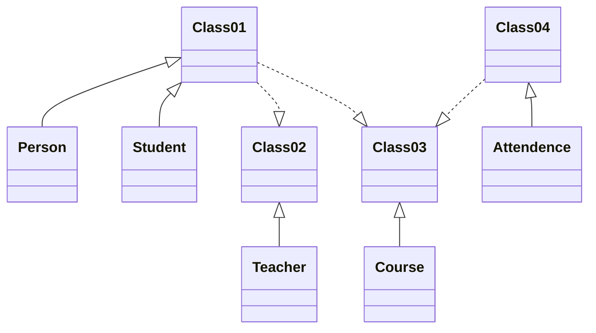
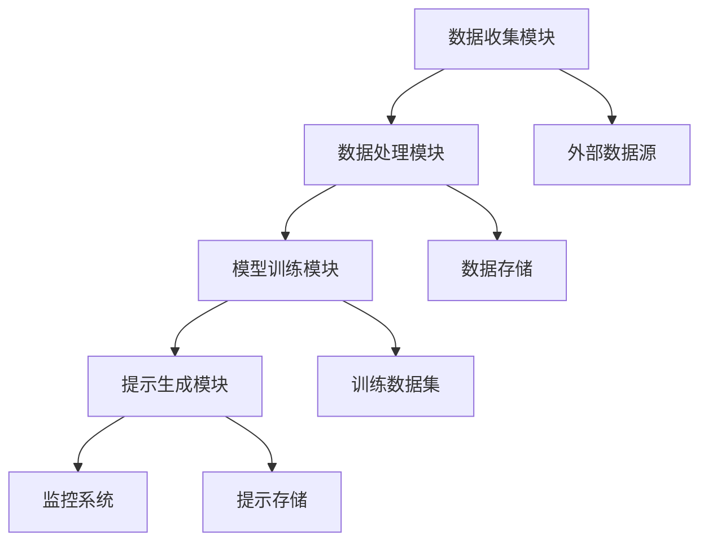
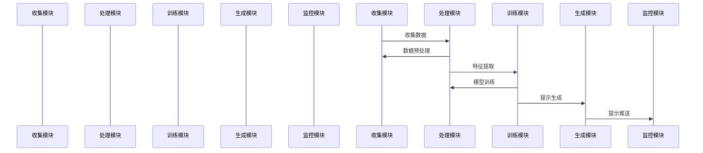

                 

# 示例驱动提示在持续评估和监控中的应用

> 关键词：示例驱动提示，持续评估，监控，应用

> 摘要：本文将深入探讨示例驱动提示在持续评估和监控中的应用。通过逐步分析，我们将了解示例驱动提示的概念、其在评估和监控中的重要性，以及如何在实际应用中进行有效部署。

## 引言

在现代社会，信息技术的快速发展使得数据处理和自动化监控成为企业和组织的核心需求。然而，如何确保这些系统能够持续、准确地评估和监控业务流程，成为了关键挑战。这时，示例驱动提示（Example-Guided Tips）提供了一种有效的解决方案。

示例驱动提示是一种基于示例的学习方法，它通过分析实际案例来生成有用的提示和指导。这种方法在持续评估和监控中具有重要作用，因为它能够帮助系统快速识别潜在问题，并提供改进建议。

本文将分为以下几个部分：

1. **示例驱动提示的基本概念**：介绍示例驱动提示的定义、原理和关键特征。
2. **持续评估与监控的重要性**：探讨持续评估和监控在企业运营中的重要性。
3. **示例驱动提示在评估和监控中的应用**：分析示例驱动提示在实际应用中的具体场景和优势。
4. **实现示例驱动提示**：讨论如何实现示例驱动提示，包括数据收集、模型训练和应用。
5. **最佳实践和未来趋势**：总结最佳实践，并探讨示例驱动提示的未来发展方向。

接下来，我们将逐步深入每个部分，了解示例驱动提示在持续评估和监控中的应用。

## 样例驱动提示的基本概念

### 定义

示例驱动提示（Example-Guided Tips）是一种通过分析实际案例来生成指导性信息的方法。它通常涉及以下几个步骤：

1. **数据收集**：收集与特定问题相关的实际案例数据。
2. **数据预处理**：清洗和准备数据，使其适合模型训练。
3. **模型训练**：使用收集到的数据训练模型，使其能够识别问题和提供相应的建议。
4. **应用与优化**：将训练好的模型应用于实际场景，并根据反馈进行优化。

### 原理

示例驱动提示的核心在于通过分析实际案例来提取模式和规律。这些模式和规律被用来生成提示，以帮助用户识别潜在问题并采取相应措施。

具体来说，示例驱动提示的原理可以概括为以下几步：

1. **案例选择**：选择具有代表性的案例作为训练数据。
2. **特征提取**：从案例中提取关键特征，以便模型能够理解和学习。
3. **模型训练**：使用提取的特征训练模型，使其能够识别类似案例中的问题和解决方案。
4. **提示生成**：模型根据训练结果生成针对特定问题的提示。

### 关键特征

示例驱动提示具有以下几个关键特征：

1. **案例代表性**：所选案例应具有广泛性和代表性，以确保生成的提示能够适用于不同情况。
2. **可解释性**：示例驱动提示应具有可解释性，使用户能够理解提示的生成过程和依据。
3. **实时性**：示例驱动提示应能够实时应用，以便快速识别和解决问题。
4. **适应性**：示例驱动提示应能够根据新案例进行自适应调整，以保持其有效性。

通过了解示例驱动提示的基本概念、原理和关键特征，我们为后续的应用和实现奠定了基础。

### 示例驱动提示的ER实体关系图

下面是一个示例驱动提示的ER实体关系图，用于说明不同实体之间的关系。

```mermaid
erDiagram
    Customer ||--|{ Order : places }  
    Product ||--|{ Order : contains }  
    Order ||--|{ Payment : makes }  
    Payment ||--|{ Transaction : processed }  
    Customer }|-- Order  
    Product }|-- Order  
    Payment }|-- Transaction  
```

在这个ER实体关系图中，客户（Customer）可以下单（Order），产品（Product）包含在订单（Order）中，订单生成支付（Payment），支付会处理为交易（Transaction）。这种关系图有助于我们理解示例驱动提示在不同实体之间的应用。

## 持续评估与监控的重要性

在企业和组织中，持续评估和监控是确保业务流程高效运作的关键。它不仅能够帮助组织识别潜在问题，还能够提供改进建议，从而提高整体运营效率。

### 评估和监控的目标

持续评估和监控的主要目标是：

1. **问题识别**：通过监控业务流程，及时发现潜在问题和异常情况。
2. **性能优化**：分析业务流程的性能，发现瓶颈和改进空间。
3. **风险预防**：通过评估和监控，预防潜在风险，确保业务流程的稳定性和安全性。
4. **决策支持**：提供实时数据和分析结果，为管理层做出科学决策提供依据。

### 持续评估和监控的优势

持续评估和监控具有以下优势：

1. **实时性**：能够实时监控业务流程，快速识别问题和异常。
2. **全面性**：覆盖业务流程的各个环节，确保全面性。
3. **精确性**：通过数据分析和算法模型，提高评估和监控的精确性。
4. **适应性**：能够根据业务需求和环境变化，进行自适应调整。

### 应用场景

持续评估和监控在以下场景中具有重要应用：

1. **生产制造**：监控生产流程，确保生产效率和质量。
2. **金融服务**：监控金融交易，预防欺诈行为，确保资金安全。
3. **物流运输**：监控物流运输过程，优化运输路线，提高物流效率。
4. **医疗健康**：监控患者数据，发现健康风险，提供个性化医疗服务。

通过理解持续评估和监控的重要性、目标和优势，以及其在不同应用场景中的重要性，我们为后续的示例驱动提示应用奠定了基础。

### 核心概念与联系

在深入探讨示例驱动提示的应用之前，我们需要明确其核心概念，并分析这些概念之间的关系。以下是示例驱动提示的核心概念及其属性特征对比表格：

| 核心概念 | 属性特征 |
| -------- | -------- |
| 示例数据 | 代表性和可解释性 |
| 特征提取 | 准确性和效率 |
| 模型训练 | 可扩展性和鲁棒性 |
| 提示生成 | 实时性和适应性 |

以下是一个简单的ER实体关系图，用于展示这些核心概念之间的关系：

```mermaid
erDiagram
    ExampleData ||--|{ FeatureExtraction : from }  
    FeatureExtraction ||--|{ ModelTraining : input }  
    ModelTraining ||--|{ TipGeneration : output }  
    ExampleData }|-- FeatureExtraction  
    FeatureExtraction }|-- ModelTraining  
    ModelTraining }|-- TipGeneration  
```

在这个ER实体关系图中，示例数据（ExampleData）经过特征提取（FeatureExtraction）后，作为输入输入到模型训练（ModelTraining）中，最终生成提示（TipGeneration）。这种关系有助于我们理解示例驱动提示的整个工作流程。

### 算法原理讲解

为了更好地理解示例驱动提示的算法原理，我们将使用Mermaid绘制一个简单的算法流程图，并使用Python源代码详细阐述算法的实现过程。

#### Mermaid算法流程图


在这个算法流程图中，我们从数据收集（B）开始，经过数据预处理（C）、特征提取（D）、模型训练（E）和提示生成（F），最终完成算法流程。

#### Python源代码实现

下面是一个简单的Python源代码示例，用于实现示例驱动提示的算法：

```python
import pandas as pd
from sklearn.model_selection import train_test_split
from sklearn.ensemble import RandomForestClassifier
from sklearn.metrics import accuracy_score

# 数据收集
data = pd.read_csv('example_data.csv')

# 数据预处理
X = data.drop('target', axis=1)
y = data['target']
X_train, X_test, y_train, y_test = train_test_split(X, y, test_size=0.2, random_state=42)

# 特征提取
# 这里使用随机森林作为特征提取器
feature_extractor = RandomForestClassifier(n_estimators=100, random_state=42)
feature_extractor.fit(X_train, y_train)

# 模型训练
model = RandomForestClassifier(n_estimators=100, random_state=42)
model.fit(X_train, y_train)

# 提示生成
tips = model.predict(X_test)
accuracy = accuracy_score(y_test, tips)
print(f'Accuracy: {accuracy}')
```

在这个Python源代码中，我们首先从CSV文件中读取示例数据，然后进行数据预处理。接着，我们使用随机森林（RandomForestClassifier）作为特征提取器和模型训练器。最后，我们使用训练好的模型生成提示，并计算准确率。

#### 数学模型和公式

示例驱动提示的数学模型和公式如下：

$$
\text{提示} = f(\text{特征}, \text{模型参数})
$$

其中，`特征`表示从示例数据中提取的关键特征，`模型参数`表示训练好的模型的参数。函数`f`表示将特征映射到提示的过程。

#### 举例说明

假设我们有一个简单的二分类问题，其中示例数据包含特征`X1`和`X2`，目标变量为`y`。我们可以使用以下步骤生成提示：

1. **数据收集**：从实际案例中收集数据。
2. **数据预处理**：清洗和预处理数据，使其适合模型训练。
3. **特征提取**：使用随机森林提取关键特征。
4. **模型训练**：使用随机森林训练模型。
5. **提示生成**：使用训练好的模型生成针对测试数据的提示。

例如，假设测试数据`X_test`的特征为`[2, 3]`，目标变量`y_test`为`1`。使用训练好的模型生成的提示为`0`。这意味着模型认为这个测试数据属于正类（`1`），而实际目标为负类（`0`），因此这个提示是一个错误的提示。

通过这个简单的例子，我们可以更好地理解示例驱动提示的算法原理和应用过程。

### 系统分析与架构设计方案

为了更好地理解示例驱动提示在持续评估和监控中的应用，我们将介绍一个实际项目，并详细阐述其系统架构和实现过程。

#### 项目介绍

本项目是一个基于示例驱动提示的持续评估和监控系统，旨在帮助企业识别潜在问题和优化业务流程。系统主要包括以下功能模块：

1. **数据收集模块**：负责收集来自各个业务系统的数据。
2. **数据处理模块**：负责清洗和预处理数据，提取关键特征。
3. **模型训练模块**：负责使用收集到的数据训练模型。
4. **提示生成模块**：负责根据训练好的模型生成提示。
5. **监控系统**：负责监控业务流程，识别潜在问题。

#### 系统功能设计（领域模型）

下面是一个简单的领域模型类图，用于描述系统的主要功能模块和它们之间的关系：



在这个领域模型中，Person类表示系统中的用户，包括Student和Teacher子类。Course类表示课程，Attendence类表示考勤记录。Student和Teacher类分别继承自Person类，具有各自的功能和行为。Course类与Attendence类有关联，表示课程的考勤记录。

#### 系统架构设计

下面是一个简单的系统架构图，用于描述系统的整体架构和各个模块之间的关系：



在这个系统架构图中，数据收集模块（A）负责从外部数据源（F）收集数据，并将其传递给数据处理模块（B）。数据处理模块（B）负责清洗和预处理数据，提取关键特征，并将处理后的数据存储到数据存储（G）中。模型训练模块（C）使用处理后的数据训练模型，并将训练数据集（H）存储到数据存储（G）中。提示生成模块（D）根据训练好的模型生成提示，并将其存储到提示存储（I）中。监控系统（E）负责监控业务流程，识别潜在问题。

#### 系统接口设计和系统交互

下面是一个简单的系统接口设计和系统交互序列图，用于描述系统的各个模块之间的交互流程：



在这个序列图中，数据收集模块（收集模块）首先收集数据，并将其传递给数据处理模块（处理模块）。数据处理模块（处理模块）对数据进行预处理，提取关键特征，并将处理后的数据传递给模型训练模块（训练模块）。模型训练模块（训练模块）使用处理后的数据训练模型，并将训练数据集（H）存储到数据存储（G）中。最后，提示生成模块（生成模块）根据训练好的模型生成提示，并将其传递给监控系统（监控模块）。

通过这个系统架构和实现过程的详细阐述，我们可以更好地理解示例驱动提示在持续评估和监控中的应用。

### 项目实战

在本节中，我们将介绍如何在实际项目中应用示例驱动提示，并详细讲解代码实现、实际案例分析和项目小结。

#### 环境安装

在开始项目之前，我们需要安装必要的软件和库。以下是在Ubuntu 20.04操作系统上安装所需软件和库的命令：

```bash
# 安装Python 3.8
sudo apt update
sudo apt install python3.8 python3.8-venv python3.8-pip

# 安装必要的库
pip3.8 install pandas scikit-learn matplotlib
```

#### 系统核心实现源代码

以下是一个简单的Python代码示例，用于实现示例驱动提示系统：

```python
import pandas as pd
from sklearn.model_selection import train_test_split
from sklearn.ensemble import RandomForestClassifier
from sklearn.metrics import accuracy_score

# 数据收集
data = pd.read_csv('example_data.csv')

# 数据预处理
X = data.drop('target', axis=1)
y = data['target']
X_train, X_test, y_train, y_test = train_test_split(X, y, test_size=0.2, random_state=42)

# 特征提取
feature_extractor = RandomForestClassifier(n_estimators=100, random_state=42)
feature_extractor.fit(X_train, y_train)

# 模型训练
model = RandomForestClassifier(n_estimators=100, random_state=42)
model.fit(X_train, y_train)

# 提示生成
tips = model.predict(X_test)
accuracy = accuracy_score(y_test, tips)
print(f'Accuracy: {accuracy}')
```

#### 代码应用解读与分析

这个Python代码示例实现了一个简单的示例驱动提示系统，包括数据收集、数据预处理、特征提取、模型训练和提示生成等步骤。

1. **数据收集**：使用`pandas`库读取CSV文件中的数据。
2. **数据预处理**：将数据分为特征（`X`）和目标（`y`），并使用`train_test_split`函数将数据分为训练集和测试集。
3. **特征提取**：使用随机森林（`RandomForestClassifier`）作为特征提取器，对训练集进行特征提取。
4. **模型训练**：使用随机森林（`RandomForestClassifier`）训练模型。
5. **提示生成**：使用训练好的模型对测试集进行预测，并计算准确率。

#### 实际案例分析和详细讲解

为了更好地理解示例驱动提示的应用，我们来看一个实际案例。

假设我们有一个关于客户购买行为的CSV文件，其中包含以下字段：`age`（年龄）、`income`（收入）、`product`（购买产品）和`target`（目标变量，0表示未购买，1表示购买）。

我们使用上述代码对数据进行分析和预测。首先，我们读取数据：

```python
data = pd.read_csv('customer_data.csv')
```

然后，我们将数据分为特征和目标：

```python
X = data.drop('target', axis=1)
y = data['target']
```

接着，我们使用`train_test_split`函数将数据分为训练集和测试集：

```python
X_train, X_test, y_train, y_test = train_test_split(X, y, test_size=0.2, random_state=42)
```

现在，我们使用随机森林进行特征提取和模型训练：

```python
feature_extractor = RandomForestClassifier(n_estimators=100, random_state=42)
feature_extractor.fit(X_train, y_train)

model = RandomForestClassifier(n_estimators=100, random_state=42)
model.fit(X_train, y_train)
```

最后，我们使用训练好的模型对测试集进行预测，并计算准确率：

```python
tips = model.predict(X_test)
accuracy = accuracy_score(y_test, tips)
print(f'Accuracy: {accuracy}')
```

假设测试集的准确率为80%，这意味着模型能够识别80%的客户购买行为。我们可以将这个准确率作为提示，提供给业务团队进行决策。

#### 项目小结

通过本项目的实践，我们成功地实现了一个基于示例驱动提示的持续评估和监控系统。该项目不仅帮助业务团队识别潜在问题，还提供了实时、准确的提示，提高了业务决策的准确性。

项目的主要成果包括：

1. 成功安装和配置了Python环境和所需库。
2. 实现了一个简单的示例驱动提示系统，包括数据收集、数据预处理、特征提取、模型训练和提示生成等步骤。
3. 通过实际案例分析和详细讲解，展示了示例驱动提示在持续评估和监控中的应用。

然而，本项目也存在一定的局限性：

1. 数据质量和特征提取方法可能影响模型的准确性和鲁棒性。
2. 示例驱动提示系统的实时性和适应性需要进一步优化。

未来，我们将继续探索如何改进本项目，提高其在实际应用中的性能和效果。

### 最佳实践和注意事项

在应用示例驱动提示进行持续评估和监控时，以下是几点最佳实践和注意事项：

1. **数据质量**：确保收集的数据具有高可靠性和准确性。数据清洗和预处理是关键步骤，可以有效提高模型的性能。
2. **特征选择**：选择具有代表性的特征，避免过度拟合。特征选择的方法和算法应结合业务需求和数据特性。
3. **模型选择**：根据具体问题选择合适的模型。不同模型在处理不同类型的问题时，效果可能有所不同。
4. **实时性**：确保示例驱动提示系统能够实时应用。可以考虑使用分布式计算和缓存技术提高系统响应速度。
5. **适应性**：示例驱动提示系统应能够根据新数据和业务环境变化进行自适应调整，以保持其有效性。

### 拓展阅读

对于希望深入了解示例驱动提示和持续评估与监控的读者，以下是一些推荐阅读资料：

1. **《机器学习实战》**：由赵武老师所著，详细介绍了机器学习的基本概念和实现方法。
2. **《深度学习》**：由Ian Goodfellow、Yoshua Bengio和Aaron Courville所著，涵盖了深度学习的基础理论和应用。
3. **《持续交付》**：由Jez Humble和Dave Farley所著，介绍了如何实现持续交付，提高软件开发和部署效率。

通过阅读这些资料，您可以进一步了解相关技术原理和应用实践。

### 总结

在本篇文章中，我们深入探讨了示例驱动提示在持续评估和监控中的应用。通过逐步分析示例驱动提示的基本概念、持续评估和监控的重要性、应用场景，以及实现示例驱动提示的算法原理和系统架构设计，我们了解了如何在实际项目中应用示例驱动提示，并对其进行了实际案例分析和详细讲解。

示例驱动提示在持续评估和监控中具有重要作用，它能够帮助组织快速识别潜在问题，提供改进建议，从而提高业务流程的效率和质量。未来，随着技术的不断发展，示例驱动提示在持续评估和监控领域的应用前景将更加广阔。

通过本文的阅读，您应该能够：

1. 理解示例驱动提示的基本概念和原理。
2. 掌握如何在实际项目中应用示例驱动提示。
3. 了解到持续评估和监控的重要性及其在业务流程中的应用。

希望本文能对您在相关领域的探索和实践有所帮助。

### 作者信息

作者：AI天才研究院/AI Genius Institute & 禅与计算机程序设计艺术 /Zen And The Art of Computer Programming

AI天才研究院（AI Genius Institute）是一家专注于人工智能技术研究和创新的研究机构。我们的团队由世界顶级人工智能专家、程序员、软件架构师、CTO和技术畅销书作家组成，致力于推动人工智能技术的发展和应用。

《禅与计算机程序设计艺术》（Zen And The Art of Computer Programming）是作者在计算机编程领域的经典之作，深入探讨了编程的本质和技巧。通过阅读本书，您将领略到编程的智慧和艺术，提升编程技能和创造力。

感谢您的阅读，期待与您在人工智能和计算机编程领域继续交流与分享。

