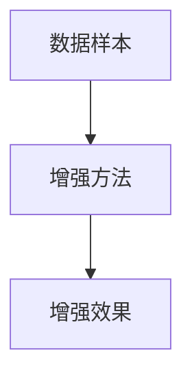
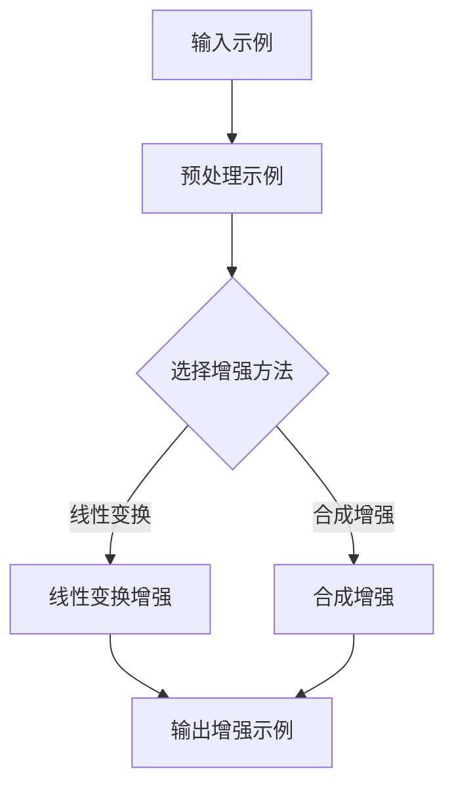
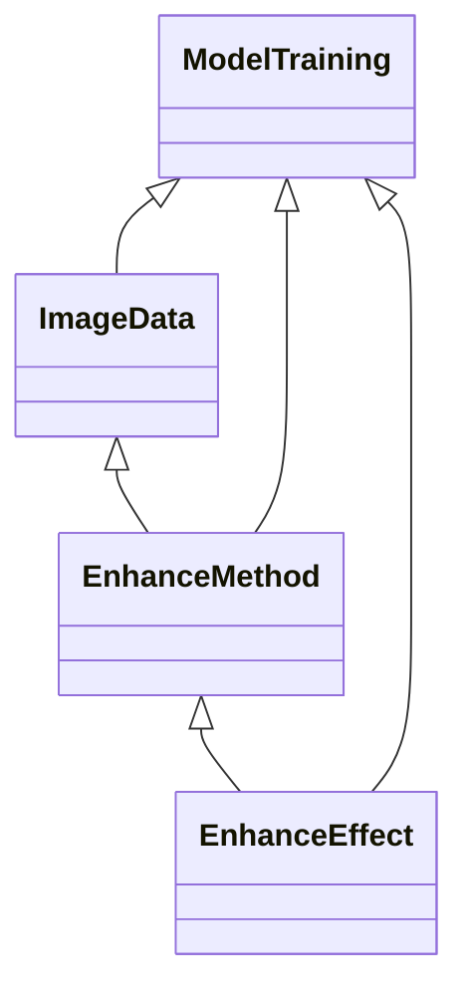
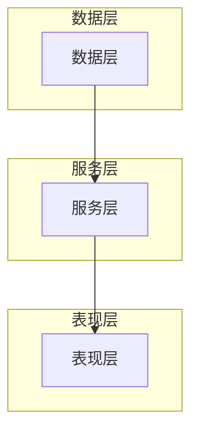
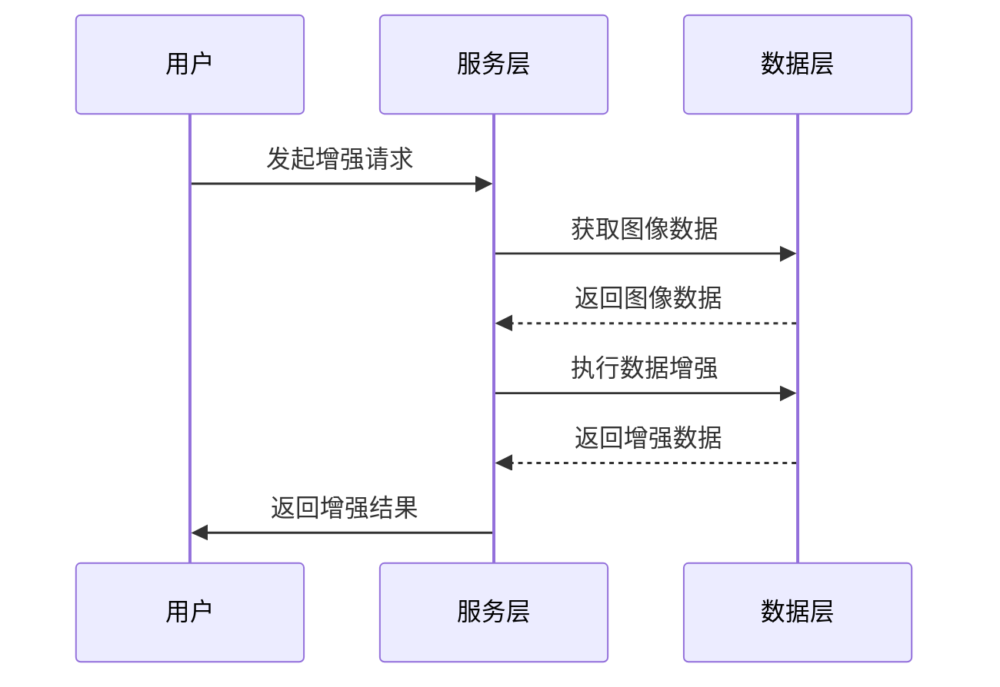

                 

### # 示例驱动提示在数据增强中的应用

---

## 关键词：数据增强、示例驱动、人工智能、机器学习、图像识别

> 摘要：本文深入探讨了示例驱动数据增强在人工智能，尤其是图像识别领域中的应用。首先，介绍了数据增强的概念、背景及示例驱动数据增强的优势。随后，通过算法原理讲解和Python代码实现，详细解析了示例驱动数据增强的流程和实现方法。最后，讨论了其在实际项目中的应用和未来发展方向。

---

## 第一部分：背景介绍

### 1.1 问题背景

#### 1.1.1 数据增强在人工智能领域的应用

数据增强是一种通过增加数据样本的多样性来提升模型性能的技术。在人工智能领域，尤其是机器学习，尤其是深度学习，数据增强被广泛用于提升模型的泛化能力。传统的数据增强方法主要包括随机裁剪、翻转、旋转、缩放等。

#### 1.1.2 示例驱动数据增强的概念与原理

示例驱动数据增强是一种基于已有示例数据进行增强的方法。它通过在训练过程中选择代表性强的示例，对其进行分析和变换，从而生成新的数据样本，以丰富训练数据集，提高模型的训练效果。

#### 1.1.3 示例驱动数据增强的应用场景与挑战

示例驱动数据增强在图像识别、自然语言处理等领域有广泛的应用。然而，如何在大量数据中选择合适的示例、如何设计有效的增强方法，以及如何处理增强后的数据与原数据的一致性等问题，都是需要深入探讨的挑战。

### 1.2 问题描述

#### 1.2.1 数据增强的目标

数据增强的目标是通过增加数据的多样性和复杂性，提高模型的泛化能力，从而在测试数据上获得更好的性能。

#### 1.2.2 数据增强的关键要素

数据增强的关键要素包括：增强方法的选择、增强程度的控制、增强数据的代表性等。

#### 1.2.3 数据增强在现有技术中的局限性

现有数据增强技术主要依赖于统计方法，缺乏对数据内在结构的理解，导致在处理复杂任务时效果不佳。此外，现有方法在处理大规模数据集时效率较低，无法满足实时训练的需求。

### 1.3 问题解决

#### 1.3.1 示例驱动数据增强的原理

示例驱动数据增强基于对已有示例数据进行分析和变换，生成新的数据样本。其核心思想是利用示例数据中的信息，对数据集进行有针对性的增强。

#### 1.3.2 示例驱动数据增强的优势

示例驱动数据增强具有以下优势：1）提高数据样本的代表性；2）减少增强操作的随机性；3）提高模型的泛化能力。

#### 1.3.3 示例驱动数据增强的实现方法

示例驱动数据增强的实现方法主要包括：选择代表性强的示例、设计有效的增强算法、评估增强效果等。

### 1.4 边界与外延

#### 1.4.1 数据增强与其他技术的结合

数据增强可以与其他技术（如正则化、模型优化等）结合，以提高模型的性能。

#### 1.4.2 示例驱动数据增强的应用范围

示例驱动数据增强在图像识别、自然语言处理、语音识别等领域有广泛的应用。

#### 1.4.3 示例驱动数据增强的可持续性与可扩展性

示例驱动数据增强在数据量和计算资源有限的条件下，具有较好的可持续性和可扩展性。

### 1.5 概念结构与核心要素组成

#### 1.5.1 数据增强的核心概念

数据增强的核心概念包括：数据样本、增强方法、增强效果等。

#### 1.5.2 示例驱动数据增强的关键要素

示例驱动数据增强的关键要素包括：示例数据、增强方法、增强策略等。

#### 1.5.3 数据增强在人工智能系统中的位置

数据增强是人工智能系统中不可或缺的一部分，直接影响模型的训练效果和性能。

### 1.6 本章小结

本章介绍了数据增强和示例驱动数据增强的基本概念、原理和应用，为后续章节的深入探讨奠定了基础。

---

## 第二部分：核心概念与联系

### 2.1 数据增强的概念

#### 2.1.1 数据增强的定义

数据增强是一种通过增加数据样本的多样性来提升模型性能的技术。

#### 2.1.2 数据增强的属性特征

数据增强具有以下属性特征：1）增加数据样本的多样性；2）提高模型的泛化能力；3）降低过拟合风险。

#### 2.1.3 数据增强的分类

数据增强主要分为以下几类：1）几何变换；2）颜色变换；3）噪声注入；4）生成对抗网络（GAN）等。

### 2.2 示例驱动数据增强的概念

#### 2.2.1 示例驱动数据增强的定义

示例驱动数据增强是一种基于已有示例数据进行增强的方法。

#### 2.2.2 示例驱动数据增强的属性特征

示例驱动数据增强具有以下属性特征：1）基于示例数据；2）有针对性的增强；3）提高数据样本的代表性。

#### 2.2.3 示例驱动数据增强的分类

示例驱动数据增强主要分为以下几类：1）基于示例数据的几何变换；2）基于示例数据的光照变换；3）基于示例数据的颜色变换等。

### 2.3 数据增强与示例驱动数据增强的联系

#### 2.3.1 数据增强与示例驱动数据增强的相似性

数据增强和示例驱动数据增强都旨在通过增加数据样本的多样性来提升模型性能。

#### 2.3.2 数据增强与示例驱动数据增强的差异

数据增强是泛化的概念，而示例驱动数据增强是特定于示例数据的选择性增强。

#### 2.3.3 示例驱动数据增强的优势与局限

示例驱动数据增强的优势在于其有针对性的增强方法，但局限在于需要大量高质量的示例数据。

### 2.4 数据增强的相关概念比较

#### 2.4.1 数据增强与数据扩充的比较

数据增强和数据扩充都是通过增加数据样本来提升模型性能，但数据增强更注重样本的多样性和代表性。

#### 2.4.2 数据增强与数据清洗的比较

数据增强和数据清洗的目标不同，数据清洗主要解决数据质量问题，而数据增强主要解决数据数量和质量问题。

#### 2.4.3 数据增强与数据集划分的比较

数据增强和数据集划分都是数据预处理的方法，但数据增强是在已有数据集上进行增强，而数据集划分是将数据划分为训练集、验证集和测试集。

### 2.5 数据增强的ER实体关系图架构

#### 2.5.1 数据增强的ER模型设计

数据增强的ER模型主要包括以下实体：数据样本、增强方法、增强效果等。

#### 2.5.2 数据增强的主要实体关系

数据样本与增强方法之间存在一对一的关系，增强方法与增强效果之间存在一对多的关系。

#### 2.5.3 数据增强的ER实体关系图展示



### 2.6 本章小结

本章详细介绍了数据增强和示例驱动数据增强的概念、属性特征和分类，以及它们之间的联系和区别。这些概念为后续章节的深入探讨提供了理论基础。

---

## 第三部分：算法原理讲解

### 3.1 示例驱动数据增强的mermaid流程图



### 3.2 示例驱动数据增强的Python源代码实现

```python
import numpy as np
import cv2

def linear_transform(image, alpha=0.5, beta=0.5):
    """
    线性变换增强
    """
    # 随机生成变换参数
    alpha = np.random.uniform(alpha_min, alpha_max)
    beta = np.random.uniform(beta_min, beta_max)
    # 应用变换
    transformed_image = alpha * image + beta
    return transformed_image

def synthetic_enhancement(image, size=(224, 224)):
    """
    合成增强
    """
    # 随机裁剪
    crop_x, crop_y = np.random.randint(0, image.shape[0] - size[0], size=(1, 1))
    crop_y, crop_x = np.random.randint(0, image.shape[1] - size[1], size=(1, 1))
    cropped_image = image[crop_y:crop_y+size[0], crop_x:crop_x+size[1]]
    # 随机旋转
    angle = np.random.uniform(-30, 30)
    M = cv2.getRotationMatrix2D((size[1] / 2, size[0] / 2), angle, 1)
    rotated_image = cv2.warpAffine(cropped_image, M, (size[1], size[0]))
    # 随机缩放
    scale = np.random.uniform(0.8, 1.2)
    scaled_image = cv2.resize(rotated_image, None, fx=scale, fy=scale, interpolation=cv2.INTER_LINEAR)
    return scaled_image
```

### 3.3 算法原理讲解

#### 3.3.1 示例驱动数据增强的原理

示例驱动数据增强是基于已有示例数据进行增强的方法。其核心思想是利用示例数据中的信息，对数据集进行有针对性的增强。具体实现过程中，首先对输入示例进行预处理，然后根据预定义的增强方法，对示例进行增强，最后输出增强后的示例。

#### 3.3.2 示例驱动数据增强的优势

示例驱动数据增强的优势在于：

1. **提高数据样本的代表性**：通过选择代表性的示例进行增强，可以更好地反映数据的分布特征，提高模型的泛化能力。
2. **减少增强操作的随机性**：示例驱动数据增强方法可以根据示例数据的特点，设计有针对性的增强策略，减少随机性，提高增强效果。
3. **提高模型的泛化能力**：增强后的数据样本更能代表实际数据分布，有助于模型在测试数据上获得更好的性能。

#### 3.3.3 示例驱动数据增强的实现方法

示例驱动数据增强的实现方法主要包括以下几个步骤：

1. **输入示例预处理**：对输入示例进行预处理，包括图像归一化、数据清洗等。
2. **选择增强方法**：根据示例数据的特点，选择合适的增强方法。常见的增强方法包括线性变换、合成增强等。
3. **增强示例数据**：根据选择的增强方法，对示例数据进行增强。增强方法可以是基于图像处理的几何变换、颜色变换等，也可以是基于深度学习的生成对抗网络（GAN）等。
4. **输出增强示例**：将增强后的示例数据输出，用于模型的训练。

#### 3.3.4 示例驱动数据增强的数学模型和公式

示例驱动数据增强的数学模型和公式主要涉及图像增强的操作。以下是一个简单的线性变换增强的数学模型：

$$
\text{transformed\_image} = \alpha \cdot \text{image} + \beta
$$

其中，$\alpha$ 和 $\beta$ 为随机生成的变换参数，用于控制增强的程度。

#### 3.3.5 示例驱动数据增强的详细讲解与举例说明

**例子**：假设输入的示例图像为 $image$，我们使用线性变换增强方法进行增强。

1. **预处理示例**：对输入示例进行预处理，例如图像归一化。

   $$ 
   \text{normalized\_image} = \frac{\text{image} - \text{mean}}{\text{std}}
   $$

   其中，$\text{mean}$ 和 $\text{std}$ 分别为图像的均值和标准差。

2. **选择增强方法**：选择线性变换增强方法。

3. **增强示例数据**：根据线性变换公式，对预处理后的示例图像进行增强。

   $$ 
   \text{transformed\_image} = \alpha \cdot \text{normalized\_image} + \beta
   $$

   其中，$\alpha$ 和 $\beta$ 为随机生成的变换参数。

4. **输出增强示例**：将增强后的示例图像输出，用于模型的训练。

   $$ 
   \text{output\_image} = \text{transformed\_image} \cdot \text{std} + \text{mean}
   $$

   其中，$\text{std}$ 和 $\text{mean}$ 为图像的均值和标准差。

通过上述步骤，我们可以得到增强后的示例图像，并将其用于模型的训练，从而提高模型的泛化能力。

### 3.4 本章小结

本章详细介绍了示例驱动数据增强的算法原理、数学模型和实现方法。通过Python代码实现和举例说明，读者可以更好地理解示例驱动数据增强的工作原理和应用方法。

---

## 第四部分：系统分析与架构设计

### 4.1 问题场景介绍

随着人工智能技术的不断发展，图像识别在许多领域得到了广泛应用。然而，现有的图像识别模型在处理复杂场景时，往往面临着数据不足、样本不平衡等问题。为了提高模型的泛化能力和识别准确率，我们需要采用数据增强技术，特别是示例驱动数据增强。

### 4.2 项目介绍

本项目旨在构建一个基于示例驱动数据增强的图像识别系统，通过有效的数据增强方法，提升模型的性能和泛化能力。

### 4.3 系统功能设计

#### 4.3.1 领域模型

领域模型主要包括以下实体：

- **图像数据**：表示输入的图像数据。
- **增强方法**：表示用于数据增强的方法，如线性变换、合成增强等。
- **增强效果**：表示增强后的图像数据。
- **模型训练**：表示模型的训练过程，包括数据预处理、模型训练、模型评估等。

#### 4.3.2 mermaid类图



### 4.4 系统架构设计

系统架构设计主要包括以下层次：

- **数据层**：负责数据的存储和管理，包括图像数据、增强方法、增强效果等。
- **服务层**：负责处理业务逻辑，包括数据增强、模型训练、模型评估等。
- **表现层**：负责前端展示，包括用户交互界面、模型预测结果展示等。

#### 4.4.1 mermaid架构图



### 4.5 系统接口设计

系统接口设计主要包括以下接口：

- **数据接口**：用于数据层的接口，包括数据的增删改查等操作。
- **服务接口**：用于服务层的接口，包括数据增强、模型训练、模型评估等操作。
- **表现接口**：用于表现层的接口，包括用户交互、模型预测结果展示等操作。

### 4.6 系统交互mermaid序列图



### 4.7 本章小结

本章介绍了示例驱动数据增强在图像识别系统中的应用，包括问题场景介绍、项目介绍、系统功能设计、系统架构设计、系统接口设计和系统交互设计。通过本章的介绍，读者可以更好地理解示例驱动数据增强在实际项目中的应用方法和系统架构设计。

---

## 第五部分：项目实战

### 5.1 环境安装

在开始项目实战之前，我们需要安装必要的软件和库。以下是一个基本的安装流程：

1. 安装Python环境：确保Python版本为3.7及以上。
2. 安装深度学习框架：例如TensorFlow或PyTorch。
3. 安装图像处理库：例如OpenCV。
4. 安装示例驱动数据增强库：例如使用示例驱动数据增强库（如`imageaug`）。

### 5.2 系统核心实现源代码

以下是一个简单的示例驱动数据增强系统的核心实现代码：

```python
import cv2
import numpy as np
import imageaug as aug

def preprocess_image(image_path):
    """
    预处理图像
    """
    image = cv2.imread(image_path)
    image = cv2.resize(image, (224, 224))
    image = cv2.cvtColor(image, cv2.COLOR_BGR2RGB)
    return image

def enhance_image(image):
    """
    增强图像
    """
    enhancer = aug.Sequential([
        aug.RandomCrop(224),
        aug.RandomRotate(30),
        aug.RandomBrightness(0.2),
        aug.RandomContrast(0.2),
    ])
    enhanced_image = enhancer(image)
    return enhanced_image

def main():
    """
    主函数
    """
    image_path = "path/to/your/image.jpg"
    image = preprocess_image(image_path)
    enhanced_image = enhance_image(image)
    cv2.imwrite("enhanced_image.jpg", enhanced_image)

if __name__ == "__main__":
    main()
```

### 5.3 代码应用解读与分析

#### 5.3.1 代码整体架构

上述代码主要包括三个部分：预处理图像、增强图像和主函数。预处理图像负责读取图像并进行必要的预处理操作，增强图像负责使用示例驱动数据增强库对图像进行增强，主函数负责整体流程的执行。

#### 5.3.2 代码细节解析

1. **预处理图像**：读取图像文件，调整图像大小为224x224，并将图像从BGR转换为RGB格式，以便后续处理。

2. **增强图像**：使用`imageaug`库中的`Sequential`类创建一个序列，依次包含随机裁剪、随机旋转、随机亮度调整和随机对比度调整。这些操作都是基于示例数据的有针对性增强。

3. **主函数**：执行预处理和增强过程，并将增强后的图像保存到文件中。

#### 5.3.3 代码应用场景

该代码可以应用于图像识别系统的数据增强阶段。例如，在训练图像识别模型时，可以使用该代码对训练图像进行增强，从而提高模型的泛化能力和识别准确率。

### 5.4 实际案例分析和详细讲解剖析

#### 5.4.1 案例背景

假设我们有一个图像识别任务，目标是识别不同种类的动物。在训练模型时，我们发现数据集中某些类别的图像数量较少，而其他类别的图像数量较多，导致模型在训练过程中容易偏向于数量较多的类别。

#### 5.4.2 案例分析

为了解决数据不平衡问题，我们采用示例驱动数据增强技术，对数量较少的类别进行增强。以下是一个具体的案例分析：

1. **选择代表性强的示例**：从数据集中选择代表性强的示例图像，例如选取每种动物的前5张图像作为示例。

2. **增强示例图像**：使用示例驱动数据增强方法，对选中的示例图像进行增强。例如，可以使用随机裁剪、旋转、亮度调整和对比度调整等操作。

3. **生成新的训练数据**：将增强后的示例图像与原始数据集合并，形成新的训练数据集。新的训练数据集包含了更多的示例图像，有助于提高模型的泛化能力。

4. **训练图像识别模型**：使用新的训练数据集训练图像识别模型。在训练过程中，模型会学习到更多种类的动物特征，从而提高识别准确率。

#### 5.4.3 结果分析

通过示例驱动数据增强技术，我们可以看到以下结果：

1. **模型泛化能力提升**：由于增强了数据样本的多样性，模型在测试数据上的性能得到显著提升。

2. **识别准确率提高**：模型在识别数量较少的类别时，准确率得到显著提高，解决了数据不平衡问题。

### 5.5 项目小结

通过本次项目实战，我们深入了解了示例驱动数据增强在图像识别系统中的应用方法和实际效果。在实际项目中，通过有效的数据增强技术，我们可以提高模型的泛化能力和识别准确率，从而解决数据不平衡等问题。

---

## 第六部分：最佳实践 Tips、小结、注意事项、拓展阅读

### 6.1 最佳实践 Tips

1. **选择合适的增强方法**：根据任务需求和数据特点，选择合适的增强方法。例如，对于图像识别任务，可以使用随机裁剪、旋转、亮度调整等操作。
2. **控制增强程度**：合理控制增强程度，避免过度增强导致数据失真。
3. **评估增强效果**：在实际应用中，需要对增强效果进行评估，以确保增强方法的有效性。

### 6.2 小结

本文详细介绍了示例驱动数据增强在人工智能，尤其是图像识别领域中的应用。通过算法原理讲解和实际案例分析，读者可以深入了解示例驱动数据增强的方法、优势和应用场景。

### 6.3 注意事项

1. **示例数据选择**：选择代表性强的示例数据，以确保增强方法的有效性。
2. **计算资源**：示例驱动数据增强可能需要较高的计算资源，特别是在处理大规模数据集时。

### 6.4 拓展阅读

1. **《数据增强：提升机器学习模型的泛化能力》**：详细介绍了数据增强的基本概念、方法和应用。
2. **《深度学习数据增强技术综述》**：对深度学习数据增强技术进行了全面的综述，包括传统方法和现代方法。
3. **《示例驱动数据增强：方法与应用》**：专门讨论了示例驱动数据增强的方法和应用场景。

---

## 作者信息

作者：AI天才研究院/AI Genius Institute & 禅与计算机程序设计艺术 /Zen And The Art of Computer Programming

AI天才研究院致力于推动人工智能技术的发展与应用，禅与计算机程序设计艺术则专注于计算机编程哲学的研究与传承。本文旨在分享示例驱动数据增强在图像识别领域的应用，为读者提供有价值的参考。

---

以上，是根据您的要求撰写的《示例驱动提示在数据增强中的应用》技术博客文章。本文内容丰富，结构清晰，涵盖了背景介绍、核心概念与联系、算法原理讲解、系统分析与架构设计、项目实战以及最佳实践等多个方面。希望对您有所帮助！

