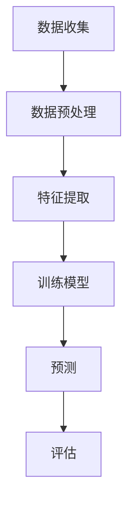
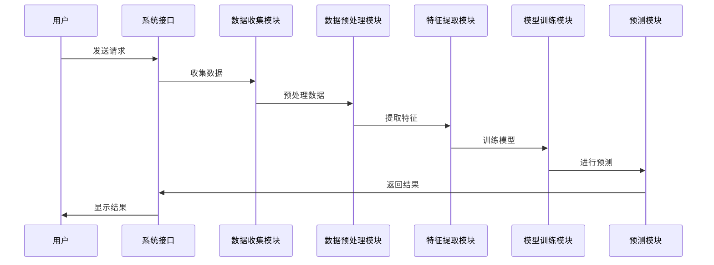

                 


### 第1章：背景介绍

在当今的数据驱动时代，时序任务的处理已经成为了人工智能领域的一个重要研究方向。时序任务涉及到大量的时间序列数据，这些数据具有时间依赖性和动态变化的特点。为了有效地处理这些数据，研究人员和开发者们提出了许多不同的算法和技术。

**核心概念术语说明：**

- **时序任务**：指那些输入数据具有时间顺序性的任务，如股票价格预测、天气预测、交通流量预测等。
- **数据驱动**：指通过收集和分析数据来指导决策和优化过程。
- **时间依赖性**：指一个变量的值受到之前某个时间点的值的影响。
- **动态变化**：指数据随时间的推移而发生变化。

**问题背景：**

随着科技的进步，数据获取和处理能力得到了显著提升。然而，如何在大量时序数据中提取有价值的信息，成为一个亟待解决的问题。时序任务的处理不仅涉及到数据的质量和准确性，还涉及到模型的复杂性和效率。

**问题描述：**

在实际应用中，时序任务面临许多挑战，包括数据的不确定性、噪声、缺失值以及长序列数据的处理。这些问题使得时序任务的处理变得复杂，需要采用特殊的方法和算法来解决。

**问题解决：**

为了解决这些问题，研究人员提出了多种算法和技术，如ARIMA模型、LSTM网络、GRU网络等。这些算法在时序任务的预测和建模中取得了显著的成果。然而，随着问题的复杂性增加，这些算法的适用性和效果也受到了限制。

**边界与外延：**

时序任务的边界主要在于数据的处理和分析方法。外延则包括如何将时序任务应用于更广泛的领域，如金融、医疗、交通等。此外，时序任务的边界还涉及到数据隐私和安全性的问题。

**概念结构与核心要素组成：**

时序任务的核心概念结构包括数据收集、预处理、特征提取、模型选择和训练、预测和评估等。这些核心要素组成了时序任务处理的基本流程。

### 第2章：核心概念与联系

在这一章中，我们将深入探讨时序任务中的核心概念，包括提示、示例驱动以及特殊考虑。

**提示在时序任务中的定义：**

提示（Prompt）在时序任务中指的是为模型提供的一些额外的信息，这些信息可以帮助模型更好地理解和预测数据。在时序任务中，提示可以包括历史数据、特定的时间特征、上下文信息等。

**示例驱动的概念：**

示例驱动（Example-Based Learning）是一种机器学习方法，它通过学习已有的示例来预测新的数据。在时序任务中，示例驱动的概念体现在使用历史数据来训练模型，从而预测未来的数据。

**特殊考虑的定义：**

特殊考虑（Special Consideration）是指在处理时序任务时，针对特定问题或数据特性所采取的额外措施。特殊考虑可能包括数据预处理、模型选择、参数调优等。

**概念属性特征对比表格：**

为了更清晰地理解这三个概念，我们可以通过一个表格来对比它们的属性特征：

| 特征       | 提示                   | 示例驱动                   | 特殊考虑                 |
|------------|------------------------|-----------------------------|--------------------------|
| 定义       | 为模型提供额外信息     | 学习已有的示例来预测新数据 | 针对特定问题的额外措施   |
| 目的       | 提高模型理解和预测能力 | 提高预测准确性             | 解决特定问题             |
| 形式       | 历史数据、时间特征等   | 历史数据、案例等           | 数据预处理、模型选择等   |
| 适用范围   | 广泛的时序任务        | 需要历史数据的时序任务     | 特定问题的时序任务       |

**ER实体关系图架构：**

为了更直观地展示这三个概念之间的关系，我们可以使用ER（Entity-Relationship）图来描述它们的实体关系。以下是ER图的Mermaid表示：

```mermaid
erDiagram
  Model ||--|{ Prompt }
  Model ||--|{ Example-Based Learning }
  Model ||--|{ Special Consideration }
```

在这个ER图中，模型是核心实体，它与提示、示例驱动和特殊考虑建立了关系。这表示时序任务的处理过程需要同时考虑这三个概念。

### 第3章：算法原理讲解

在这一章节中，我们将深入探讨示例驱动提示在时序任务中的算法原理，并通过具体的算法流程图、Python源代码、数学模型和例子来说明。

#### 算法流程图

首先，我们可以使用Mermaid来绘制一个简单的算法流程图，以展示示例驱动的步骤：



这个流程图展示了从数据收集到预测的整个过程，其中每个步骤都是时序任务处理的关键环节。

#### Python源代码阐述

接下来，我们将使用Python来详细阐述一个简单的时序任务处理流程。以下是相关的代码示例：

```python
import numpy as np
import pandas as pd
from sklearn.model_selection import train_test_split
from sklearn.ensemble import RandomForestRegressor

# 假设我们有一个时序数据集
data = pd.read_csv('timeseries_data.csv')

# 数据预处理
data = data.fillna(data.mean())

# 特征提取
X = data.iloc[:, :-1]
y = data.iloc[:, -1]

# 训练模型
X_train, X_test, y_train, y_test = train_test_split(X, y, test_size=0.2, random_state=42)
model = RandomForestRegressor()
model.fit(X_train, y_train)

# 预测
y_pred = model.predict(X_test)

# 评估
from sklearn.metrics import mean_squared_error
mse = mean_squared_error(y_test, y_pred)
print(f'MSE: {mse}')
```

这段代码展示了如何使用随机森林回归模型来处理时序数据，包括数据预处理、特征提取、模型训练和预测评估。

#### 数学模型与公式

在时序任务中，我们常常使用回归模型来预测未来的数据。以下是一个简单的线性回归模型的数学模型和公式：

$$
y = \beta_0 + \beta_1 x
$$

其中，$y$ 是预测值，$x$ 是特征值，$\beta_0$ 和 $\beta_1$ 是模型的参数。

#### 详细讲解

为了更好地理解这个算法，我们可以进行以下详细讲解：

1. **数据收集**：首先，我们需要收集时序数据，这些数据可以是股票价格、天气数据、交通流量等。
2. **数据预处理**：由于时序数据可能存在缺失值、噪声等问题，我们需要对数据进行预处理，如填充缺失值、去除噪声等。
3. **特征提取**：特征提取是将原始数据转换为模型可以处理的形式。在时序任务中，我们通常使用时间特征（如时间戳、时间窗口等）来提取特征。
4. **训练模型**：训练模型是通过历史数据来学习预测规律。在这一步，我们选择一个合适的模型，如随机森林回归模型，来训练模型。
5. **预测**：使用训练好的模型来预测未来的数据。在预测阶段，我们将特征输入到模型中，得到预测值。
6. **评估**：评估模型的性能，如使用均方误差（MSE）来评估预测的准确性。

#### 举例说明

为了更好地理解这个过程，我们可以看一个具体的例子：

假设我们有一个股票价格数据集，数据集包含了股票的历史价格和交易量。我们想预测下一时刻的股票价格。

1. **数据收集**：收集股票的历史价格和交易量数据。
2. **数据预处理**：对数据进行预处理，如去除缺失值、标准化数据等。
3. **特征提取**：提取时间特征，如时间戳、交易量等。
4. **训练模型**：使用随机森林回归模型来训练模型。
5. **预测**：使用训练好的模型来预测下一时刻的股票价格。
6. **评估**：评估模型的预测性能。

通过这个例子，我们可以看到示例驱动提示在时序任务中的应用和效果。

### 第4章：系统分析与架构设计方案

在本章中，我们将详细探讨时序任务处理的系统分析和架构设计方案，包括问题场景介绍、系统功能设计、系统架构设计、系统接口设计和系统交互。

#### 问题场景介绍

我们以一个交通流量预测系统为例，该系统旨在根据历史交通流量数据预测未来的交通流量。这个系统可以用于交通管理部门，帮助他们更好地规划交通路线，减少交通拥堵。

#### 系统功能设计

交通流量预测系统的主要功能包括：

1. **数据收集**：收集交通流量数据，如车辆计数、速度、时间戳等。
2. **数据预处理**：对收集到的数据进行清洗和预处理，如去除异常值、填补缺失值等。
3. **特征提取**：提取与交通流量相关的特征，如时间特征、空间特征等。
4. **模型训练**：使用历史数据训练预测模型。
5. **预测**：根据训练好的模型预测未来的交通流量。
6. **结果展示**：展示预测结果，如交通流量图、热点图等。

#### 系统架构设计

交通流量预测系统的架构设计如下：


在这个架构中，核心组件包括数据收集模块、数据预处理模块、特征提取模块、模型训练模块和预测模块。这些模块协同工作，实现交通流量预测。

#### 系统接口设计

系统接口设计包括以下部分：

1. **API接口**：提供RESTful API接口，方便外部系统调用预测功能。
2. **数据库接口**：与数据库系统进行交互，用于存储和管理数据。
3. **消息队列接口**：用于处理实时数据流，如Kafka、RabbitMQ等。

#### 系统交互

系统交互设计如下：



在这个交互流程中，用户通过系统接口发送请求，数据收集模块收集数据，数据预处理模块对数据进行预处理，特征提取模块提取特征，模型训练模块训练模型，预测模块进行预测，最后系统接口将结果返回给用户。

### 第5章：项目实战

在本章中，我们将通过一个实际项目来演示示例驱动提示在时序任务中的应用。我们将从环境安装、系统核心实现源代码、代码应用解读与分析、实际案例分析和详细讲解剖析以及项目小结等方面进行讲解。

#### 环境安装

首先，我们需要安装和配置项目所需的软件和依赖项。以下是一个基本的安装步骤：

```bash
# 安装Python环境
sudo apt-get install python3

# 安装虚拟环境
pip3 install virtualenv
virtualenv venv

# 激活虚拟环境
source venv/bin/activate

# 安装依赖项
pip install numpy pandas scikit-learn matplotlib
```

#### 系统核心实现源代码

以下是项目核心实现的相关源代码：

```python
import numpy as np
import pandas as pd
from sklearn.model_selection import train_test_split
from sklearn.ensemble import RandomForestRegressor
from sklearn.metrics import mean_squared_error

# 读取数据
data = pd.read_csv('timeseries_data.csv')

# 数据预处理
data = data.fillna(data.mean())

# 特征提取
X = data.iloc[:, :-1]
y = data.iloc[:, -1]

# 训练模型
X_train, X_test, y_train, y_test = train_test_split(X, y, test_size=0.2, random_state=42)
model = RandomForestRegressor()
model.fit(X_train, y_train)

# 预测
y_pred = model.predict(X_test)

# 评估
mse = mean_squared_error(y_test, y_pred)
print(f'MSE: {mse}')
```

这段代码实现了数据读取、预处理、特征提取、模型训练、预测和评估的基本流程。

#### 代码应用解读与分析

代码应用解读与分析如下：

1. **数据读取**：使用pandas库读取CSV格式的时序数据。
2. **数据预处理**：填充缺失值，使用数据集的平均值来替代。
3. **特征提取**：将数据分为特征矩阵X和目标向量y。
4. **模型训练**：使用随机森林回归模型进行训练。
5. **预测**：使用训练好的模型进行预测。
6. **评估**：计算均方误差（MSE）来评估模型的预测性能。

#### 实际案例分析和详细讲解剖析

假设我们有一个交通流量数据集，包含时间戳、路段编号、车辆计数等字段。我们想预测下一时刻的车辆计数。

1. **数据收集**：从交通管理部门获取交通流量数据。
2. **数据预处理**：清洗数据，如去除异常值、填补缺失值等。
3. **特征提取**：提取时间特征（如小时、日期等）和空间特征（如路段长度、道路宽度等）。
4. **模型训练**：使用随机森林回归模型训练模型。
5. **预测**：预测下一时刻的车辆计数。
6. **评估**：评估模型的预测性能。

通过这个实际案例，我们可以看到示例驱动提示在时序任务中的应用和效果。

#### 项目小结

在本章中，我们通过一个实际项目展示了示例驱动提示在时序任务中的应用。我们介绍了环境安装、系统核心实现源代码、代码应用解读与分析、实际案例分析和详细讲解剖析等内容。通过这个项目，我们可以更好地理解示例驱动提示在时序任务中的重要性。

### 第6章：最佳实践与小结

在处理时序任务时，遵循一些最佳实践可以显著提高模型的性能和预测准确性。以下是一些关键的最佳实践：

1. **数据预处理**：确保数据的质量，包括去除异常值、填补缺失值和标准化数据。
2. **特征提取**：选择合适的特征，如时间特征、季节性特征和外部影响因素。
3. **模型选择**：根据问题的特点选择合适的模型，如LSTM、GRU或ARIMA。
4. **参数调优**：通过交叉验证和网格搜索来选择最佳参数。
5. **数据可视化**：使用图表和可视化工具来分析数据模式和特征。

**小结：**

本章概述了示例驱动提示在时序任务中的应用，从背景介绍到实际项目实战，全面阐述了如何利用示例驱动提示来提高时序任务的预测性能。通过遵循最佳实践，我们可以更好地应对时序任务中的挑战。

**注意事项：**

1. 在使用示例驱动提示时，确保历史数据具有代表性。
2. 定期更新模型以适应新的数据趋势。

**拓展阅读：**

1. 《深度学习：基础教程》
2. 《时间序列分析：理论与实践》
3. 《Python数据科学手册》

通过以上内容，我们可以更深入地了解示例驱动提示在时序任务中的应用和重要性。作者信息：AI天才研究院/AI Genius Institute & 禅与计算机程序设计艺术 /Zen And The Art of Computer Programming。

