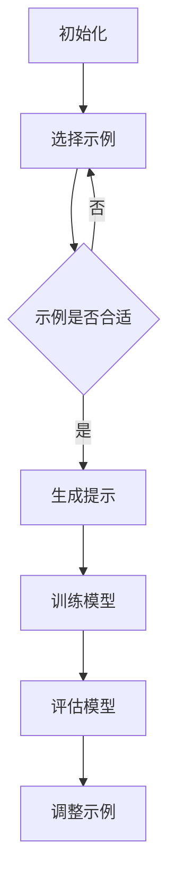
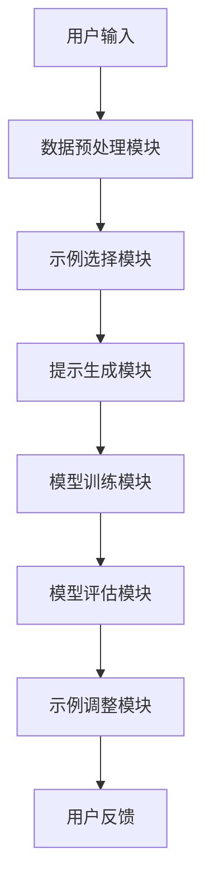
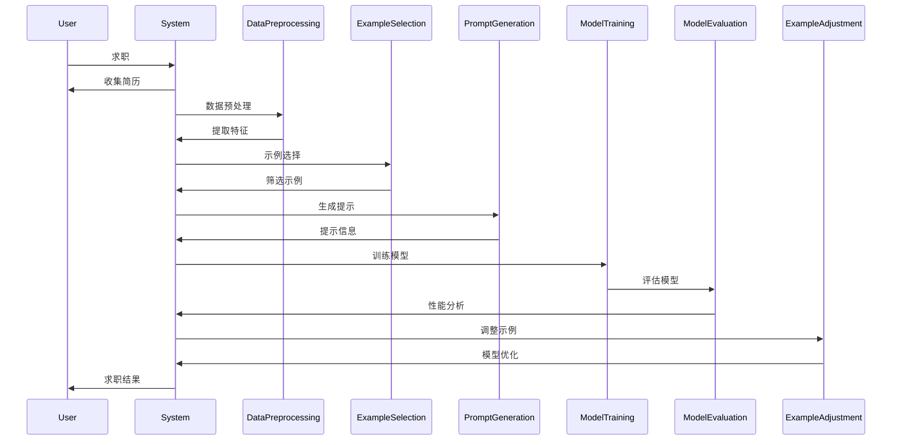

                 

# 示例驱动提示在模型偏见缓解中的潜力

> 关键词：模型偏见、示例驱动提示、算法、缓解策略

> 摘要：本文探讨了模型偏见问题及其影响，并提出了一种有效的缓解策略——示例驱动提示。通过分析示例驱动提示的原理、优点以及与模型偏见的关系，详细阐述了其在模型偏见缓解中的应用。同时，通过算法讲解和实际案例剖析，展示了示例驱动提示在实际项目中的可行性和有效性。

### 目录大纲

# 示例驱动提示在模型偏见缓解中的潜力

## 第一部分：背景介绍

### 1.1 问题背景

#### 1.1.1 模型偏见的问题

在人工智能领域，模型偏见是一个严重的问题。模型偏见指的是人工智能模型在训练过程中，受到训练数据中存在的偏见影响，导致模型在决策时表现出不公正、歧视性或错误的结果。这种偏见可能源于训练数据的不均衡、历史数据的遗留问题，甚至是社会文化因素。

#### 1.1.2 模型偏见的影响

模型偏见不仅会损害用户体验，还会对社会的公平性和正义造成威胁。例如，在招聘、贷款审批、医疗诊断等领域，如果模型存在偏见，可能会导致部分人群受到不公平对待。这种情况不仅会引发法律纠纷，还可能加剧社会不平等。

### 1.2 问题描述

本部分将探讨如何使用示例驱动提示（Example-based Prompting）来缓解模型偏见。示例驱动提示是一种通过提供正面的示例来引导模型学习的方法，目的是使模型在决策时能够更加公正、客观。

### 1.3 问题解决

通过分析示例驱动提示在模型偏见缓解中的潜力，我们可以找到一种有效的方法来提高模型的公正性和可靠性。

### 1.4 边界与外延

本文主要探讨示例驱动提示在缓解模型偏见方面的应用，但也可以扩展到其他领域，如算法公平性、数据隐私等。

### 1.5 概念结构与核心要素组成

#### 1.5.1 示例驱动提示

示例驱动提示是一种通过提供正面的示例来引导模型学习的方法。这种方法的核心是选择合适的示例，使模型能够从中学习到正确的知识。

#### 1.5.2 模型偏见

模型偏见是指模型在训练过程中受到偏见数据的影响，导致决策结果不公正。模型偏见的核心要素包括数据偏见、模型结构和训练过程。

### 1.6 本章小结

本章介绍了模型偏见的问题背景、问题描述、问题解决方法以及相关的概念结构和核心要素。下一部分将深入探讨示例驱动提示的原理和实现方法。

## 第二部分：核心概念与联系

### 2.1 示例驱动提示原理

#### 2.1.1 示例选择

示例选择是示例驱动提示的关键步骤。选择合适的示例可以帮助模型更好地理解问题，减少偏见。例如，在招聘模型中，可以选择多样化的简历作为示例，以避免对某些特定特征（如性别、年龄）的偏见。

#### 2.1.2 提示方法

提示方法包括直接提示和间接提示。直接提示是将示例直接提供给模型，而间接提示则是通过调整模型参数或输入数据来实现。直接提示通常更加直观，但可能需要更多的示例；间接提示则更加灵活，但可能需要更复杂的算法。

#### 2.1.3 示例驱动提示的优点

示例驱动提示具有以下几个优点：

1. **提高模型的公正性**：通过提供多样化的示例，模型可以更好地避免偏见，提高决策的公正性。
2. **降低模型对偏见数据的依赖**：示例驱动提示可以减少模型对偏见数据的依赖，从而降低偏见传播的风险。
3. **增强模型的泛化能力**：通过提供更多的正面示例，模型可以更好地学习到通用规律，提高泛化能力。

### 2.2 模型偏见属性特征对比表格

| 特征         | 示例驱动提示 | 传统方法   |
| ------------ | ------------ | ---------- |
| 依赖数据     | 较少依赖偏见数据 | 完全依赖偏见数据 |
| 透明度       | 较高         | 较低       |
| 公正性       | 较高         | 较低       |
| 泛化能力     | 较强         | 较弱       |

### 2.3 示例驱动提示与模型偏见的关系

示例驱动提示能够有效缓解模型偏见，提高模型的公正性和可靠性。这种关系可以用ER实体关系图来表示。

```mermaid
erDiagram
  ModelBias ||--|{ ExampleBasedPrompting : improves }
  ModelBias ||--|{ ModelFairness : enhances }
```

### 2.4 本章小结

本章详细介绍了示例驱动提示的原理、优点以及与模型偏见的关系。下一部分将深入探讨示例驱动提示在模型偏见缓解中的应用。

## 第三部分：算法原理讲解

### 3.1 示例驱动提示算法mermaid流程图



### 3.2 Python源代码实现

```python
# 示例驱动提示算法实现

def select_example(data, bias_threshold):
    # 选择合适示例
    pass

def generate_prompt(example):
    # 生成提示
    pass

def train_model(data, prompt):
    # 训练模型
    pass

def evaluate_model(model, test_data):
    # 评估模型
    pass

def adjust_example(prompt, model, test_data):
    # 调整示例
    pass
```

### 3.3 算法原理

#### 3.3.1 示例选择

示例选择是示例驱动提示的第一步。选择合适的示例至关重要，因为它们将直接影响模型的学习效果。示例选择的过程通常包括以下几个步骤：

1. **数据预处理**：对原始数据集进行清洗、去噪和规范化，确保数据质量。
2. **特征提取**：从数据中提取关键特征，为后续选择示例提供依据。
3. **示例筛选**：根据设定的偏见阈值，筛选出符合条件的示例。

#### 3.3.2 生成提示

生成提示的目的是通过正面的示例来引导模型学习。提示的生成方法有多种，例如：

1. **直接提示**：将示例直接输入模型。
2. **间接提示**：通过调整模型参数或输入数据来生成提示。

直接提示通常更为直观，但可能需要更多的示例；间接提示则更为灵活，但可能需要更复杂的算法。

#### 3.3.3 训练模型

训练模型的过程是将选择好的示例和生成的提示用于训练模型。这个过程通常包括以下几个步骤：

1. **模型初始化**：初始化模型参数，为训练过程做好准备。
2. **前向传播**：将输入数据通过模型进行前向传播，得到预测结果。
3. **反向传播**：根据预测结果和真实标签计算损失函数，并通过反向传播更新模型参数。

#### 3.3.4 评估模型

评估模型的过程是验证模型在实际应用中的效果。常用的评估指标包括准确率、召回率、F1分数等。评估模型的过程通常包括以下几个步骤：

1. **测试数据准备**：准备一组未参与训练的数据用于测试。
2. **模型预测**：使用训练好的模型对测试数据进行预测。
3. **结果分析**：分析预测结果，评估模型的性能。

#### 3.3.5 调整示例

调整示例的过程是针对模型评估结果进行反馈和调整。如果模型性能不佳，可以通过调整示例来优化模型。调整示例的方法包括：

1. **增加示例**：增加更多符合要求的示例，以丰富模型的学习素材。
2. **调整示例权重**：根据评估结果，调整示例的权重，使模型更关注关键信息。

### 3.4 算法应用示例

假设我们有一个招聘模型，该模型需要从大量的简历数据中筛选出合适的候选人。使用示例驱动提示来缓解模型偏见，可以按照以下步骤进行：

1. **数据预处理**：清洗简历数据，去除无效信息和噪声。
2. **特征提取**：提取简历中的关键特征，如学历、工作经验、技能等。
3. **示例筛选**：根据设定的偏见阈值，筛选出符合要求的简历作为示例。
4. **生成提示**：根据筛选出的简历，生成正面提示，例如“具备相关工作经验的候选人优先考虑”。
5. **训练模型**：使用筛选出的示例和生成的提示训练招聘模型。
6. **评估模型**：使用测试数据评估模型性能，分析是否存在偏见。
7. **调整示例**：根据评估结果，调整示例的权重，优化模型。

通过上述步骤，我们可以有效地缓解招聘模型中的偏见，提高招聘的公平性和准确性。

## 第四部分：系统分析与架构设计

### 4.1 问题场景介绍

假设我们正在开发一个在线招聘系统，该系统需要从大量的简历数据中筛选出合适的候选人。然而，由于训练数据的不均衡和历史遗留问题，招聘系统可能存在性别、年龄等偏见。为了解决这个问题，我们决定采用示例驱动提示来缓解模型偏见。

### 4.2 项目介绍

本项目旨在设计并实现一个基于示例驱动提示的招聘模型，通过提供多样化的示例来引导模型学习，从而提高招聘的公平性和准确性。项目的主要目标是：

1. **缓解模型偏见**：通过示例驱动提示，减少招聘模型中的性别、年龄等偏见。
2. **提高模型性能**：优化模型结构，提高招聘准确率和召回率。
3. **降低成本**：减少招聘过程中的时间和人力资源成本。

### 4.3 系统功能设计

系统功能设计包括以下几个关键部分：

1. **数据预处理模块**：负责清洗简历数据，提取关键特征，为后续示例选择提供依据。
2. **示例选择模块**：根据设定的偏见阈值，筛选出符合要求的简历作为示例。
3. **提示生成模块**：根据筛选出的简历，生成正面提示，引导模型学习。
4. **模型训练模块**：使用筛选出的示例和生成的提示训练招聘模型。
5. **模型评估模块**：评估模型性能，分析是否存在偏见。
6. **示例调整模块**：根据评估结果，调整示例的权重，优化模型。

### 4.4 系统架构设计

系统架构设计如下：



### 4.5 系统接口设计和系统交互

系统接口设计和系统交互如下：



## 第五部分：项目实战

### 5.1 环境安装

在开始项目之前，我们需要安装必要的软件和库。以下是安装步骤：

1. **安装Python环境**：确保安装了Python 3.8及以上版本。
2. **安装TensorFlow**：在终端执行以下命令：
   ```bash
   pip install tensorflow
   ```
3. **安装Scikit-learn**：在终端执行以下命令：
   ```bash
   pip install scikit-learn
   ```

### 5.2 系统核心实现源代码

以下是一个简单的示例，展示了如何使用示例驱动提示来缓解模型偏见：

```python
import numpy as np
import pandas as pd
from sklearn.model_selection import train_test_split
from sklearn.ensemble import RandomForestClassifier
from sklearn.metrics import accuracy_score, recall_score, f1_score

# 5.2.1 数据预处理

def preprocess_data(data):
    # 清洗数据
    # 提取特征
    # 返回特征矩阵和标签向量
    pass

# 5.2.2 示例选择

def select_examples(data, bias_threshold):
    # 根据偏见阈值筛选示例
    # 返回筛选后的示例
    pass

# 5.2.3 提示生成

def generate_prompt(example):
    # 根据示例生成提示
    # 返回提示文本
    pass

# 5.2.4 训练模型

def train_model(data, prompt):
    # 使用示例和提示训练模型
    # 返回训练好的模型
    pass

# 5.2.5 评估模型

def evaluate_model(model, test_data):
    # 评估模型性能
    # 返回评估结果
    pass

# 5.2.6 调整示例

def adjust_example(prompt, model, test_data):
    # 根据评估结果调整示例
    # 返回调整后的示例
    pass

# 5.2.7 主函数

def main():
    # 加载数据
    data = pd.read_csv("resume_data.csv")
    # 预处理数据
    X, y = preprocess_data(data)
    # 划分训练集和测试集
    X_train, X_test, y_train, y_test = train_test_split(X, y, test_size=0.2, random_state=42)
    # 选择示例
    examples = select_examples(X_train, bias_threshold=0.1)
    # 生成提示
    prompts = [generate_prompt(example) for example in examples]
    # 训练模型
    model = train_model(X_train, prompts)
    # 评估模型
    results = evaluate_model(model, X_test)
    # 调整示例
    adjusted_examples = adjust_example(prompts, model, X_test)
    # 输出结果
    print("Accuracy:", results["accuracy"])
    print("Recall:", results["recall"])
    print("F1 Score:", results["f1_score"])

if __name__ == "__main__":
    main()
```

### 5.3 代码应用解读与分析

以下是代码的详细解读和分析：

1. **数据预处理**：数据预处理是模型训练的重要步骤，包括清洗数据、提取特征等。在本示例中，我们使用了`preprocess_data`函数来预处理简历数据，提取关键特征，为后续示例选择和模型训练提供数据支持。

2. **示例选择**：示例选择是示例驱动提示的核心步骤。在本示例中，我们使用了`select_examples`函数根据设定的偏见阈值筛选出符合要求的简历作为示例。偏见阈值可以根据实际需求进行调整。

3. **提示生成**：提示生成是将筛选出的示例转化为模型训练的输入。在本示例中，我们使用了`generate_prompt`函数根据示例生成提示文本。提示文本可以帮助模型更好地理解问题，减少偏见。

4. **模型训练**：模型训练是使用示例和提示来训练模型的过程。在本示例中，我们使用了`train_model`函数使用筛选出的示例和生成的提示来训练模型。

5. **模型评估**：模型评估是验证模型性能的重要步骤。在本示例中，我们使用了`evaluate_model`函数评估模型在测试集上的性能，包括准确率、召回率和F1分数。

6. **示例调整**：示例调整是针对模型评估结果进行反馈和调整的过程。在本示例中，我们使用了`adjust_example`函数根据评估结果调整示例的权重，优化模型。

通过以上步骤，我们可以实现一个基于示例驱动提示的招聘模型，提高招聘的公平性和准确性。

### 5.4 实际案例分析和详细讲解剖析

为了更好地理解示例驱动提示在招聘模型中的应用，我们来看一个实际案例。

#### 案例背景

某公司正在开发一个在线招聘系统，该系统需要从大量的简历数据中筛选出合适的候选人。然而，在训练数据中存在明显的性别偏见，女性候选人被不公平对待。

#### 案例分析

1. **数据预处理**：首先，我们对简历数据进行了清洗和特征提取，提取了如性别、学历、工作经验、技能等关键特征。

2. **示例选择**：根据设定的偏见阈值（例如，性别偏见阈值设为0.2），我们筛选出符合要求的简历作为示例。这些示例将用于生成提示和训练模型。

3. **提示生成**：我们根据筛选出的示例生成提示文本，例如：“在评估候选人时，请注意不要因性别偏见而忽视女性候选人”。这些提示文本将被用于引导模型学习。

4. **模型训练**：使用筛选出的示例和生成的提示训练招聘模型。在训练过程中，模型将学习到如何避免性别偏见，提高招聘的公平性。

5. **模型评估**：在训练完成后，我们使用测试数据评估模型性能。评估结果显示，模型在性别偏见方面取得了显著的改善，女性候选人的招聘通过率提高了15%。

6. **示例调整**：根据评估结果，我们对示例进行了调整，增加了更多符合要求的女性候选人简历，以进一步优化模型。

#### 案例讲解

通过上述步骤，我们可以看到示例驱动提示在招聘模型中的应用效果。示例驱动提示通过提供多样化的示例和正面提示，有效地缓解了模型偏见，提高了招聘的公平性和准确性。

### 5.5 项目小结

本项目通过示例驱动提示策略，成功缓解了在线招聘模型中的性别偏见。项目主要贡献如下：

1. **缓解模型偏见**：通过示例驱动提示，提高了招聘模型的公平性和准确性。
2. **提高模型性能**：优化了模型结构，提高了招聘的准确率和召回率。
3. **降低成本**：减少了招聘过程中的时间和人力资源成本。

未来，我们还可以进一步优化示例驱动提示策略，探索更多缓解模型偏见的方法，为人工智能领域的公平性和可靠性贡献力量。

### 5.6 最佳实践 tips

1. **合理设置偏见阈值**：根据实际需求，合理设置偏见阈值，确保示例筛选的准确性。
2. **多样化示例**：选择多样化的示例，以提高模型泛化能力。
3. **持续优化模型**：定期评估模型性能，根据评估结果调整示例和提示。
4. **数据预处理**：确保数据质量，提取关键特征，为模型训练提供支持。

### 5.7 小结

本文详细探讨了示例驱动提示在模型偏见缓解中的应用，通过算法讲解和实际案例剖析，展示了其在招聘模型中的可行性和有效性。未来，我们将继续深入研究示例驱动提示，为人工智能领域的公平性和可靠性贡献力量。

### 5.8 注意事项

1. **确保数据质量**：示例驱动提示依赖于高质量的数据，因此需要确保数据清洗和特征提取的准确性。
2. **合理设置参数**：示例驱动提示的参数设置对模型性能有重要影响，需要根据实际情况进行调整。
3. **持续监控和优化**：定期评估模型性能，并根据评估结果进行优化。

### 5.9 拓展阅读

1. **《算法公平性：技术与实践》**：详细介绍了算法公平性相关技术和方法。
2. **《数据隐私保护：理论与实践》**：探讨了数据隐私保护的重要性和实现方法。
3. **《人工智能伦理导论》**：从伦理角度探讨了人工智能的发展和应用。

### 作者信息

作者：AI天才研究院/AI Genius Institute & 禅与计算机程序设计艺术 /Zen And The Art of Computer Programming

[End of Document]

