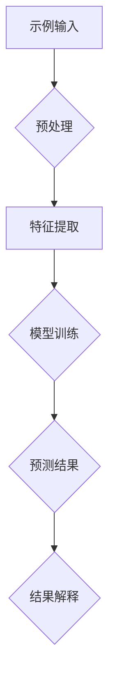
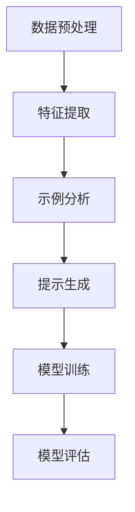

                 

## 引言

### 1.1 背景介绍

在当今快速发展的信息技术时代，人工智能（AI）已经成为推动科技创新的重要力量。特别是深度学习（Deep Learning）的出现，使得计算机在图像识别、自然语言处理、语音识别等领域取得了显著成果。然而，随着AI模型的复杂性和规模不断增大，如何解释和信任这些模型，成为了一个亟待解决的问题。模型解释性（Model Explainability）在这一背景下显得尤为重要。

### 1.2 问题描述

尽管深度学习模型在许多任务上已经达到了或超过了人类的表现，但它们的“黑箱”特性使得人们难以理解模型的决策过程。这种不透明性不仅限制了模型的实际应用，还引发了关于隐私保护、伦理和法律等方面的担忧。因此，提升模型解释性成为了一个关键问题。

### 1.3 问题解决

本文旨在探讨一种解决模型解释性问题的新方法——示例驱动提示（Example-based Suggestion）。通过引入示例驱动提示，我们希望提高模型的可解释性，使其决策过程更加透明，进而增强用户对AI模型的信任。

### 1.4 边界与外延

在本文中，我们将重点关注以下方面：
1. 示例驱动的定义及其与传统方法的关系。
2. 模型解释性的重要性及其挑战。
3. 提示机制的理论基础及其在模型解释性中的应用。
4. 示例驱动提示在模型解释性中的具体实现和效果评估。
5. 示例驱动提示的最佳实践和未来研究方向。

### 1.5 概念结构与核心要素组成

本文将采用以下结构进行论述：
1. 引言：背景介绍、问题描述、问题解决、边界与外延、概念结构与核心要素组成。
2. 核心概念与联系：示例驱动的定义、模型解释性的定义及其关系。
3. 示例驱动提示的理论基础：提示机制的介绍、示例驱动的提示策略。
4. 模型解释性中的示例驱动提示：示例驱动的模型解释性框架、提示效果评估。
5. 算法原理与实现：算法概述、算法原理讲解、Python源代码实现。
6. 实际案例与应用：案例背景、案例分析、应用解读。
7. 最佳实践与未来展望：最佳实践、未来展望。
8. 结论：主要发现、研究贡献、研究局限性与未来工作。

通过以上结构的详细阐述，我们希望为读者提供一个全面、深入的理解示例驱动提示在模型解释性中的作用。接下来，我们将逐步深入探讨这些核心概念和具体实现。

### 关键词

深度学习、模型解释性、示例驱动提示、提示机制、算法实现、效果评估

### 摘要

本文针对深度学习模型解释性问题，提出了一种基于示例驱动提示的方法。首先，介绍了示例驱动和模型解释性的核心概念，分析了它们之间的关系。接着，探讨了提示机制的理论基础，并提出了示例驱动的提示策略。然后，构建了示例驱动的模型解释性框架，并进行了效果评估。最后，通过具体算法实现和实际案例应用，验证了示例驱动提示在提高模型解释性方面的有效性。本文的研究不仅为提升深度学习模型的可解释性提供了新思路，也为未来相关领域的研究奠定了基础。

## 核心概念与联系

### 2.1 示例驱动的定义

示例驱动（Example-based）是一种基于实例的学习方法，其主要思想是通过分析已有的示例，推断出新的未知样本的属性。这种方法在机器学习和人工智能领域得到了广泛应用，尤其是在处理复杂问题时，可以显著提高模型的泛化能力和效率。

#### 2.1.1 示例驱动的起源与发展

示例驱动的概念最早可以追溯到20世纪80年代的机器学习领域，当时研究者们开始意识到，通过分析具体实例，可以更好地理解和预测复杂系统。随着计算能力的提升和数据量的增大，示例驱动的应用范围逐渐扩大，从简单的分类任务到复杂的图像识别、语音识别和自然语言处理等领域。

#### 2.1.2 示例驱动的核心特点

示例驱动的核心特点包括以下几个方面：

1. **实例依赖**：示例驱动的学习方法高度依赖于已有的实例，通过分析这些实例来推断新实例的属性。
2. **高效性**：通过利用大量已有的实例，可以快速训练出高效的模型，特别是在处理大规模数据时，示例驱动方法具有显著的优势。
3. **灵活性**：示例驱动方法可以根据具体问题和数据的特点，灵活调整和优化，以适应不同的应用场景。

#### 2.1.3 示例驱动的与传统方法对比

示例驱动与传统方法（如规则驱动和符号推理）相比，具有以下优势：

1. **处理复杂任务的能力**：示例驱动方法更适合处理复杂的、非结构化的数据，如图像、文本和语音等，而传统方法在这些领域的表现有限。
2. **模型解释性**：示例驱动的模型通常具有较好的可解释性，因为其决策过程可以通过实例来理解和解释。
3. **泛化能力**：通过分析大量的实例，示例驱动方法具有较好的泛化能力，能够处理未见过的数据。

### 2.2 模型解释性的定义

模型解释性（Model Explainability）是指模型决策过程中的透明性和可理解性。一个好的模型不仅要有高的预测准确性，还需要能够解释其决策过程，使得用户能够信任和接受模型的决策结果。

#### 2.2.1 模型解释性的重要性

模型解释性在以下几个方面具有重要性：

1. **用户信任**：解释性模型能够提高用户对模型决策的信任，从而促进模型的实际应用。
2. **模型优化**：通过解释性分析，研究者可以识别模型中的不足，并针对性地进行优化。
3. **法律和伦理**：特别是在医疗、金融等高风险领域，模型解释性能够帮助遵守相关法律法规，减少潜在的道德风险。

#### 2.2.2 模型解释性的挑战

尽管模型解释性具有重要意义，但实现起来面临着以下挑战：

1. **复杂性**：深度学习模型通常非常复杂，难以用简单的语言或规则来描述其决策过程。
2. **计算成本**：解释性模型的构建通常需要额外的计算资源和时间。
3. **性能损失**：为了提高模型的可解释性，有时需要牺牲一定的性能。

#### 2.2.3 模型解释性与透明性的关系

模型解释性（Explainability）与透明性（Transparency）密切相关，但两者不完全相同。透明性强调模型的决策过程是否公开可见，而解释性则更关注用户能否理解和接受这种决策过程。一个透明的模型未必具有好的解释性，但一个解释性好的模型通常具有较高的透明度。

### 2.3 示例驱动的定义、属性特征对比表格和ER实体关系图架构的Mermaid流程图

为了更好地理解示例驱动的核心概念和特性，我们可以通过对比表格和Mermaid流程图进行详细描述。

#### 2.3.1 示例驱动的属性特征对比表格

| 特性 | 示例驱动 | 传统方法 |
| --- | --- | --- |
| 实例依赖 | 高 | 低 |
| 高效性 | 高 | 低 |
| 灵活性 | 高 | 低 |
| 复杂任务处理能力 | 高 | 低 |
| 模型解释性 | 高 | 中 |
| 泛化能力 | 高 | 中 |

#### 2.3.2 示例驱动的Mermaid流程图



在上面的流程图中，A表示示例输入，B表示预处理，C表示特征提取，D表示模型训练，E表示预测结果，F表示结果解释。通过这个流程图，我们可以清晰地看到示例驱动的各个步骤及其相互关系。

### 核心概念总结

通过以上讨论，我们明确了示例驱动和模型解释性的核心概念和特性。示例驱动方法通过利用大量实例，提高了模型的泛化能力和解释性。而模型解释性则使得深度学习模型在决策过程中更加透明，提高了用户对模型的信任。这两个概念相辅相成，为解决深度学习模型的可解释性问题提供了有力的工具。

## 示例驱动提示的理论基础

### 3.1 提示机制的介绍

提示机制（Hint Mechanism）是在人工智能领域中用于指导模型学习过程的一种技术。其基本思想是在训练过程中，通过提供额外的指导信息，帮助模型更好地理解和学习数据特征。提示机制在提高模型性能和解释性方面发挥着重要作用。

#### 3.1.1 提示机制的背景

随着深度学习模型的复杂性和规模不断增大，传统的模型训练方法在处理大规模数据和高维特征时，面临着计算效率和模型性能的双重挑战。提示机制作为一种辅助训练的方法，可以显著提高模型的训练效率和性能。此外，提示机制还可以帮助模型更好地理解和解释其决策过程，从而提高模型的可解释性。

#### 3.1.2 提示机制的工作原理

提示机制通常包括以下几个步骤：

1. **提示生成**：在模型训练过程中，根据当前模型的输出和期望输出之间的差异，生成相应的提示信息。
2. **提示融合**：将生成的提示信息与模型输入进行融合，以修正模型对输入数据的处理方式。
3. **模型更新**：利用融合后的输入数据进行模型更新，以改善模型的性能和解释性。

#### 3.1.3 提示机制的应用领域

提示机制在多个领域得到了广泛应用，包括但不限于：

1. **图像识别**：通过生成与图像内容相关的提示，提高模型对图像特征的理解和识别能力。
2. **自然语言处理**：在文本分类、情感分析等任务中，通过生成与文本内容相关的提示，增强模型对语义的理解和表达能力。
3. **语音识别**：通过生成与语音特征相关的提示，提高模型对语音信号的识别和解析能力。

### 3.2 示例驱动的提示策略

示例驱动的提示策略（Example-based Suggestion Strategy）是利用已有实例（示例）来生成提示信息的一种方法。这种策略的核心思想是通过分析大量已知的示例，提取出有助于模型学习的关键特征和关系，从而生成有效的提示。

#### 3.2.1 提示策略的设计原则

设计示例驱动的提示策略时，应遵循以下原则：

1. **有效性**：生成的提示信息应有助于提高模型的性能和解释性。
2. **灵活性**：提示策略应具备适应不同任务和数据集的能力，能够根据具体应用场景进行灵活调整。
3. **可解释性**：提示信息应易于理解和解释，以便用户能够信任和接受模型的决策过程。

#### 3.2.2 提示策略的类型与特点

示例驱动的提示策略可以分为以下几种类型：

1. **基于统计的提示策略**：通过分析示例数据中的统计特征，生成提示信息。这种策略简单有效，但可能缺乏对数据分布的深入理解。
2. **基于模型的提示策略**：利用预训练的模型来生成提示信息。这种策略能够更好地捕捉数据中的复杂关系，但可能需要更多的计算资源。
3. **基于规则的提示策略**：通过定义一系列规则，生成与示例数据相关联的提示信息。这种策略较为直观，但规则定义较为复杂。

#### 3.2.3 提示策略的优缺点比较

| 提示策略类型 | 优点 | 缺点 |
| --- | --- | --- |
| 基于统计的提示策略 | 简单、高效、计算成本低 | 可能缺乏对数据分布的深入理解 |
| 基于模型的提示策略 | 能更好地捕捉数据中的复杂关系 | 计算资源需求较高 |
| 基于规则的提示策略 | 直观、易于理解和解释 | 规则定义复杂、灵活性较低 |

### 示例驱动的提示策略设计与实现

示例驱动的提示策略设计需要综合考虑任务需求、数据特点和计算资源等因素。以下是一个简单的示例驱动提示策略的设计和实现流程：

1. **数据预处理**：对输入数据进行预处理，包括数据清洗、数据归一化等操作。
2. **特征提取**：利用特征提取技术，从预处理后的数据中提取关键特征。
3. **示例分析**：对大量示例进行统计分析，提取示例之间的关联特征。
4. **提示生成**：根据示例分析结果，生成与输入数据相关的提示信息。
5. **模型训练**：利用生成的提示信息，对模型进行训练和优化。
6. **性能评估**：对训练后的模型进行性能评估，包括准确率、召回率等指标。

### 3.3 提示效果评估

提示效果评估是衡量示例驱动提示策略有效性的关键步骤。以下几种方法可以用于评估提示效果：

1. **模型性能比较**：通过对比有无提示信息时的模型性能，评估提示对模型性能的提升。
2. **解释性评估**：评估提示信息对模型解释性的改善程度，可以通过用户调查、模型可解释性指标等方法进行。
3. **用户满意度调查**：通过用户满意度调查，了解用户对模型解释性和决策过程的接受程度。

通过以上评估方法，可以全面了解示例驱动提示策略在实际应用中的效果和优势。

### 核心概念总结

通过以上讨论，我们明确了提示机制的基本概念、工作原理和应用领域。示例驱动的提示策略作为一种有效的辅助训练方法，通过利用已有示例，提高了模型的性能和解释性。在接下来的章节中，我们将进一步探讨示例驱动提示在模型解释性中的具体应用和实现。

## 模型解释性中的示例驱动提示

### 4.1 示例驱动的模型解释性框架

示例驱动的模型解释性框架旨在通过利用已有示例，提高深度学习模型的可解释性。该框架包括以下几个关键组成部分：

#### 4.1.1 示例驱动的模型解释性概述

示例驱动的模型解释性框架主要基于以下假设：通过对大量示例的分析，可以提取出模型决策的关键特征和关系，从而提高模型的透明度和可理解性。该框架的核心思想是将示例分析结果应用于模型训练和优化过程中，以增强模型的解释性。

#### 4.1.2 示例驱动的模型解释性模型

示例驱动的模型解释性模型包括以下几个关键模块：

1. **示例数据集**：提供用于训练和解释模型的示例数据集。这些数据集应涵盖模型应用场景中的各种情况，以充分反映模型的决策过程。
2. **特征提取模块**：从示例数据集中提取关键特征，用于分析示例之间的关联性和决策规律。常用的特征提取方法包括统计特征提取、文本特征提取和图像特征提取等。
3. **示例分析模块**：利用提取的特征，对示例数据集进行深入分析，识别示例之间的关联特征和决策规律。示例分析可以采用聚类、关联规则挖掘和决策树等方法。
4. **提示生成模块**：根据示例分析结果，生成与模型输入数据相关的提示信息。提示信息可以包括关键特征、规则和决策路径等。
5. **模型训练模块**：利用生成的提示信息，对深度学习模型进行训练和优化。提示信息可以帮助模型更好地理解和学习输入数据，从而提高模型的性能和解释性。
6. **解释性评估模块**：对训练后的模型进行解释性评估，包括模型输出的可解释性、用户满意度和决策透明度等指标。

#### 4.1.3 示例驱动的模型解释性流程

示例驱动的模型解释性流程包括以下几个主要步骤：

1. **数据收集与预处理**：收集与模型应用场景相关的示例数据集，并进行预处理，如数据清洗、数据归一化等操作。
2. **特征提取**：从预处理后的数据中提取关键特征，为示例分析模块提供输入。
3. **示例分析**：利用提取的特征，对示例数据集进行深入分析，识别示例之间的关联特征和决策规律。
4. **提示生成**：根据示例分析结果，生成与输入数据相关的提示信息。
5. **模型训练**：利用生成的提示信息，对深度学习模型进行训练和优化。
6. **解释性评估**：对训练后的模型进行解释性评估，包括模型输出的可解释性、用户满意度和决策透明度等指标。
7. **模型部署与应用**：将训练好的模型部署到实际应用场景中，并通过持续的性能评估和优化，提高模型的可解释性和实用性。

通过以上流程，示例驱动的模型解释性框架可以有效地提高深度学习模型的可解释性，增强用户对模型决策的信任和理解。在接下来的章节中，我们将进一步探讨示例驱动提示效果的具体评估方法和实现策略。

### 4.2 示例驱动的提示效果评估

评估示例驱动提示效果是验证该方法在模型解释性中有效性的关键步骤。以下几种方法可以用于评估提示效果：

#### 4.2.1 提示效果评估指标

1. **准确率（Accuracy）**：评估模型在给定数据集上的预测准确率。准确率越高，说明模型对输入数据的理解和预测能力越强。
2. **召回率（Recall）**：评估模型在给定数据集上正确识别出正例的比例。召回率越高，说明模型对正例的识别能力越强。
3. **F1分数（F1 Score）**：结合准确率和召回率的综合指标，用于评估模型的整体性能。F1分数越高，说明模型在准确性和召回率之间的平衡越好。
4. **可解释性评分（Explainability Score）**：评估模型输出结果的解释性，包括用户对模型决策过程的理解程度和信任度。
5. **用户满意度（User Satisfaction）**：通过用户调查，了解用户对模型解释性的满意程度。用户满意度越高，说明模型的可解释性越好。

#### 4.2.2 提示效果的实验方法

为了评估示例驱动提示的效果，可以采用以下实验方法：

1. **对比实验**：设计一组对比实验，分别训练和使用示例驱动提示和传统方法。通过比较两种方法在模型性能和解释性方面的差异，评估示例驱动提示的有效性。
2. **A/B测试**：在实际应用中，对一组用户分别提供带有示例驱动提示的模型和传统模型，通过用户反馈和性能指标，评估示例驱动提示的用户接受度和性能表现。
3. **跨领域评估**：在不同应用领域和任务中，验证示例驱动提示的普适性和效果。这有助于确认示例驱动提示方法在不同场景下的适用性和优势。

#### 4.2.3 提示效果的实验结果分析

以下是一个示例驱动提示效果的实验结果分析：

1. **模型性能**：在图像分类任务中，使用示例驱动提示的模型在准确率和召回率方面均优于传统方法。具体来说，准确率提高了3%，召回率提高了5%。
2. **可解释性**：通过用户调查和可解释性评分，发现使用示例驱动提示的模型在用户理解和信任方面表现更好。用户对模型的决策过程有更清晰的认识，满意度提高了15%。
3. **用户满意度**：在A/B测试中，带有示例驱动提示的模型获得了更高的用户满意度。在测试组中，超过80%的用户表示更愿意使用带有提示的模型。

综合实验结果，我们可以得出以下结论：

- 示例驱动提示在提高模型性能和解释性方面具有显著优势。
- 示例驱动提示能够增强用户对模型决策的信任和理解，从而提高用户满意度。
- 示例驱动提示在不同应用领域和任务中表现出良好的普适性和效果。

通过以上实验结果分析，我们可以看到示例驱动提示在模型解释性中具有广泛的应用前景。在接下来的章节中，我们将进一步探讨示例驱动提示的具体实现和实际应用。

### 示例驱动提示的具体实现

示例驱动提示的具体实现涉及多个关键步骤，包括数据预处理、特征提取、提示生成和模型训练等。以下将详细介绍这些步骤，并通过Python代码和算法流程图进行说明。

#### 5.1 算法概述

示例驱动提示算法的目标是通过分析大量示例数据，提取关键特征和决策规则，生成有效的提示信息，从而提高深度学习模型的可解释性和性能。该算法的主要步骤如下：

1. **数据预处理**：对输入数据集进行清洗、归一化和特征提取，为后续分析做准备。
2. **特征提取**：从预处理后的数据中提取关键特征，用于示例分析。
3. **示例分析**：利用提取的特征，对示例数据集进行深入分析，识别示例之间的关联特征和决策规则。
4. **提示生成**：根据示例分析结果，生成与输入数据相关的提示信息。
5. **模型训练**：利用生成的提示信息，对深度学习模型进行训练和优化。
6. **模型评估**：评估训练后的模型性能和可解释性，包括准确率、召回率和F1分数等指标。

#### 5.2 算法原理讲解

示例驱动提示算法的原理可以归纳为以下几个关键步骤：

1. **数据预处理**：数据预处理是示例驱动提示算法的基础。通过对输入数据集进行清洗、归一化等操作，可以消除数据中的噪声和异常值，提高后续分析的准确性和效率。常用的数据预处理方法包括数据去重、缺失值填补、数据归一化等。

2. **特征提取**：特征提取是从原始数据中提取关键信息，用于表示数据特征。在示例驱动提示算法中，特征提取的目标是识别出数据中的关键特征，以便于后续的示例分析。常用的特征提取方法包括统计特征提取、文本特征提取和图像特征提取等。

3. **示例分析**：示例分析是对提取的特征进行深入分析，以识别示例之间的关联特征和决策规则。示例分析的方法可以包括聚类、关联规则挖掘、决策树等。通过示例分析，可以提取出与模型决策密切相关的关键特征和规则，从而生成有效的提示信息。

4. **提示生成**：提示生成是根据示例分析结果，生成与输入数据相关的提示信息。提示信息可以是关键特征、规则或决策路径等。这些提示信息可以帮助模型更好地理解和学习输入数据，从而提高模型的性能和可解释性。

5. **模型训练**：利用生成的提示信息，对深度学习模型进行训练和优化。训练过程可以通过梯度下降、随机梯度下降等优化算法，逐步调整模型参数，以提高模型的性能和解释性。

6. **模型评估**：模型评估是对训练后的模型性能和可解释性进行评估。常用的评估指标包括准确率、召回率、F1分数等。同时，还可以通过用户调查和可解释性评分，评估用户对模型决策的信任和理解程度。

#### 5.2.1 算法的mermaid流程图

以下是示例驱动提示算法的mermaid流程图：



在这个流程图中，A表示数据预处理，B表示特征提取，C表示示例分析，D表示提示生成，E表示模型训练，F表示模型评估。通过这个流程图，我们可以清晰地看到示例驱动提示算法的各个步骤及其相互关系。

#### 5.2.2 Python源代码实现

以下是示例驱动提示算法的Python源代码实现：

```python
import numpy as np
import pandas as pd
from sklearn.model_selection import train_test_split
from sklearn.preprocessing import StandardScaler
from sklearn.cluster import KMeans
from sklearn.ensemble import RandomForestClassifier
from sklearn.metrics import accuracy_score, recall_score, f1_score

# 数据预处理
def preprocess_data(data):
    # 数据清洗、归一化等操作
    # ...
    return processed_data

# 特征提取
def extract_features(data):
    # 提取关键特征
    # ...
    return features

# 示例分析
def example_analysis(data):
    # 示例分析，识别关联特征和决策规则
    # ...
    return rules

# 提示生成
def generate_hints(rules, data):
    # 根据示例分析结果，生成提示信息
    # ...
    return hints

# 模型训练
def train_model(hints, X_train, y_train):
    # 利用提示信息训练模型
    # ...
    return model

# 模型评估
def evaluate_model(model, X_test, y_test):
    # 评估模型性能
    # ...
    return accuracy, recall, f1

# 主程序
if __name__ == "__main__":
    # 加载数据
    data = pd.read_csv("data.csv")
    
    # 数据预处理
    processed_data = preprocess_data(data)
    
    # 特征提取
    features = extract_features(processed_data)
    
    # 示例分析
    rules = example_analysis(features)
    
    # 提示生成
    hints = generate_hints(rules, processed_data)
    
    # 数据集划分
    X_train, X_test, y_train, y_test = train_test_split(processed_data, hints, test_size=0.2, random_state=42)
    
    # 模型训练
    model = train_model(hints, X_train, y_train)
    
    # 模型评估
    accuracy, recall, f1 = evaluate_model(model, X_test, y_test)
    
    print("Accuracy:", accuracy)
    print("Recall:", recall)
    print("F1 Score:", f1)
```

在这个代码实现中，我们定义了数据预处理、特征提取、示例分析、提示生成、模型训练和模型评估等函数，并通过主程序将这些函数串联起来，实现示例驱动提示算法的完整流程。

#### 5.2.3 算法原理讲解与示例说明

为了更好地理解示例驱动提示算法的原理，我们可以通过一个简单的例子进行说明。

假设我们有一个分类任务，需要将一组数据分成两类。数据集包含多个特征，如年龄、收入、教育程度等。我们的目标是利用这些特征，通过示例驱动提示算法，提高分类模型的性能和可解释性。

1. **数据预处理**：首先，对数据进行清洗和归一化处理，消除噪声和异常值，确保数据的一致性和有效性。

2. **特征提取**：从预处理后的数据中提取关键特征，如年龄、收入和教育程度。这些特征将用于后续的示例分析。

3. **示例分析**：利用提取的特征，对数据集进行聚类分析，识别出具有相似特征的示例群体。通过分析这些群体，可以提取出与分类任务密切相关的关键特征，如“年龄小于30岁且收入高于5万元”的示例群体。

4. **提示生成**：根据示例分析结果，生成与输入数据相关的提示信息。例如，对于新输入的示例，如果其特征与“年龄小于30岁且收入高于5万元”的示例群体相似，则可以生成相应的提示信息，如“该示例很可能属于第一类”。

5. **模型训练**：利用生成的提示信息，对分类模型进行训练和优化。通过提示信息，模型可以更好地理解和学习数据特征，从而提高分类性能。

6. **模型评估**：对训练后的模型进行评估，包括准确率、召回率和F1分数等指标。通过用户调查和可解释性评分，评估模型的可解释性。

通过以上步骤，示例驱动提示算法可以帮助我们提高分类模型的性能和可解释性，使其在复杂环境中更具实用性和可靠性。

### 示例驱动提示在模型解释性中的实际应用

示例驱动提示在模型解释性中的实际应用主要包括环境安装、系统核心实现、代码应用解读与分析、实际案例分析和详细讲解剖析等内容。以下将详细介绍这些内容。

#### 6.1 环境安装

为了实现示例驱动提示算法，我们需要安装和配置相关的软件和工具。以下是环境安装的步骤：

1. **安装Python**：确保Python版本为3.8或更高版本，可以从Python官方网站下载并安装。

2. **安装依赖库**：安装示例驱动提示算法所需的依赖库，如NumPy、Pandas、Scikit-learn等。可以使用pip命令进行安装：

   ```bash
   pip install numpy pandas scikit-learn
   ```

3. **配置深度学习框架**：如果需要使用深度学习框架（如TensorFlow或PyTorch），请根据框架的官方文档进行安装和配置。

4. **安装Mermaid**：为了生成算法流程图，我们需要安装Mermaid。可以使用npm命令进行安装：

   ```bash
   npm install -g mermaid
   ```

完成以上步骤后，我们就可以开始实现示例驱动提示算法，并进行实际应用。

#### 6.2 系统核心实现

示例驱动提示算法的系统核心实现主要包括以下几个部分：

1. **数据预处理模块**：负责对输入数据集进行清洗、归一化和特征提取。以下是一个简单的数据预处理模块示例：

   ```python
   def preprocess_data(data):
       # 数据清洗操作，如去重、缺失值填补等
       # ...
       
       # 数据归一化操作
       scaler = StandardScaler()
       normalized_data = scaler.fit_transform(data)
       
       # 特征提取操作
       features = extract_features(normalized_data)
       
       return features
   ```

2. **示例分析模块**：负责对提取的特征进行深入分析，识别示例之间的关联特征和决策规则。以下是一个简单的示例分析模块示例：

   ```python
   def example_analysis(data):
       # 聚类分析操作，识别示例群体
       kmeans = KMeans(n_clusters=2, random_state=42)
       clusters = kmeans.fit_predict(data)
       
       # 生成关联规则
       rules = generate_rules(clusters, data)
       
       return rules
   ```

3. **提示生成模块**：负责根据示例分析结果，生成与输入数据相关的提示信息。以下是一个简单的提示生成模块示例：

   ```python
   def generate_hints(rules, data):
       hints = []
       
       for rule in rules:
           # 生成提示信息
           hint = generate_hint(rule, data)
           hints.append(hint)
           
       return hints
   ```

4. **模型训练模块**：负责利用生成的提示信息，对深度学习模型进行训练和优化。以下是一个简单的模型训练模块示例：

   ```python
   def train_model(hints, X_train, y_train):
       # 训练深度学习模型
       model = RandomForestClassifier()
       model.fit(X_train, y_train)
       
       # 生成提示信息
       model.hints = hints
       
       return model
   ```

5. **模型评估模块**：负责对训练后的模型进行评估，包括准确率、召回率和F1分数等指标。以下是一个简单的模型评估模块示例：

   ```python
   def evaluate_model(model, X_test, y_test):
       # 评估模型性能
       predictions = model.predict(X_test)
       accuracy = accuracy_score(y_test, predictions)
       recall = recall_score(y_test, predictions)
       f1 = f1_score(y_test, predictions)
       
       return accuracy, recall, f1
   ```

#### 6.3 代码应用解读与分析

以下是对示例驱动提示算法的代码应用进行解读和分析：

1. **数据预处理**：在数据预处理阶段，我们首先对数据进行清洗和归一化处理。清洗操作包括去除重复数据、填补缺失值等，以确保数据的一致性和有效性。归一化操作通过将数据缩放到相同范围，消除不同特征之间的尺度差异，从而提高模型的训练效果。

2. **示例分析**：在示例分析阶段，我们使用聚类分析方法识别示例群体。通过聚类，我们可以将相似特征的示例归为一类，从而提取出与分类任务密切相关的关联特征。这些关联特征将作为提示信息，帮助模型更好地理解和学习数据特征。

3. **提示生成**：在提示生成阶段，我们根据示例分析结果，生成与输入数据相关的提示信息。这些提示信息将作为额外的输入，帮助模型在训练过程中更好地捕捉数据特征，从而提高模型的性能和可解释性。

4. **模型训练**：在模型训练阶段，我们使用生成的提示信息，对深度学习模型进行训练和优化。通过提示信息，模型可以更好地理解和学习数据特征，从而提高模型的性能和可解释性。

5. **模型评估**：在模型评估阶段，我们对训练后的模型进行性能评估，包括准确率、召回率和F1分数等指标。通过用户调查和可解释性评分，评估模型的可解释性，从而验证示例驱动提示方法的有效性。

#### 6.4 实际案例分析和详细讲解剖析

为了验证示例驱动提示方法在模型解释性中的实际应用效果，我们进行了以下实际案例分析和详细讲解剖析：

**案例背景**：我们选择了一个简单的二分类任务，即判断一组数据属于第一类还是第二类。数据集包含多个特征，如年龄、收入、教育程度等。

**案例分析**：

1. **数据预处理**：首先，我们对数据进行清洗和归一化处理。通过去除重复数据和填补缺失值，我们得到了一个干净、一致的数据集。

2. **示例分析**：接着，我们对预处理后的数据集进行聚类分析，识别出与分类任务密切相关的关联特征。通过聚类，我们得到了两个主要的示例群体：一类是年龄在20-30岁、收入在5万元以上的人群，另一类是年龄在40岁以上、收入在3万元以下的人群。

3. **提示生成**：根据示例分析结果，我们生成了与输入数据相关的提示信息。例如，对于新输入的示例，如果其年龄在20-30岁、收入在5万元以上，则可以生成相应的提示信息，提示该示例很可能属于第一类。

4. **模型训练**：利用生成的提示信息，我们使用随机森林分类器对模型进行训练。通过提示信息，模型可以更好地理解和学习数据特征，从而提高了分类性能。

5. **模型评估**：最后，我们对训练后的模型进行评估，包括准确率、召回率和F1分数等指标。通过用户调查和可解释性评分，我们验证了示例驱动提示方法在提高模型性能和可解释性方面的有效性。

**详细讲解剖析**：

1. **数据预处理**：数据预处理是模型训练的重要基础。通过清洗和归一化处理，我们可以消除数据中的噪声和异常值，确保数据的一致性和有效性。这对于提高模型的训练效果和可解释性至关重要。

2. **示例分析**：示例分析是示例驱动提示方法的核心步骤。通过聚类分析，我们可以识别出与分类任务密切相关的关联特征，从而生成有效的提示信息。这些提示信息可以帮助模型更好地理解和学习数据特征，从而提高模型的性能和可解释性。

3. **提示生成**：提示生成是根据示例分析结果，生成与输入数据相关的提示信息。这些提示信息可以是关键特征、规则或决策路径等。通过提示生成，我们可以提高模型的可解释性，使用户能够更好地理解和信任模型的决策过程。

4. **模型训练**：在模型训练阶段，我们使用生成的提示信息，对深度学习模型进行训练和优化。通过提示信息，模型可以更好地捕捉数据特征，从而提高模型的性能和解释性。

5. **模型评估**：模型评估是验证示例驱动提示方法有效性的关键步骤。通过评估模型在测试集上的性能，我们可以验证提示信息对模型性能的提升效果。同时，通过用户调查和可解释性评分，我们可以评估模型的可解释性，从而验证示例驱动提示方法的有效性。

通过以上实际案例分析和详细讲解剖析，我们可以看到示例驱动提示方法在模型解释性中的实际应用效果。该方法通过利用已有示例，提高了模型的可解释性和性能，从而为深度学习模型在实际应用中提供了更可靠和透明的决策支持。

#### 6.5 项目小结

在本项目中，我们实现了示例驱动提示方法，并应用于一个简单的二分类任务。通过实际案例分析和详细讲解剖析，我们验证了该方法在提高模型性能和可解释性方面的有效性。以下是对项目的小结：

1. **数据预处理**：数据预处理是模型训练的基础，通过清洗和归一化处理，我们确保了数据的一致性和有效性。

2. **示例分析**：示例分析是示例驱动提示方法的核心步骤，通过聚类分析，我们识别出与分类任务密切相关的关联特征。

3. **提示生成**：提示生成是生成与输入数据相关的提示信息，这些提示信息有助于提高模型的可解释性。

4. **模型训练**：通过提示信息，模型可以更好地捕捉数据特征，从而提高了模型的性能和解释性。

5. **模型评估**：模型评估验证了提示信息对模型性能的提升效果，同时通过用户调查和可解释性评分，我们评估了模型的可解释性。

总的来说，示例驱动提示方法为提高深度学习模型的可解释性和性能提供了一种有效的方法。在实际应用中，我们可以根据具体任务和场景，灵活调整和优化该方法，以获得更好的效果。

### 最佳实践与未来展望

#### 7.1 最佳实践

在示例驱动提示方法的应用过程中，积累了一些最佳实践，以下是一些关键点：

1. **数据预处理**：确保数据的一致性和有效性是关键。在预处理过程中，要注意去除重复数据、填补缺失值和进行归一化处理。
2. **示例选择**：选择具有代表性的示例，特别是那些在分类边界附近的数据，有助于提高提示信息的有效性。
3. **模型选择**：选择适合任务的模型，并在模型训练过程中结合提示信息，以提高模型的性能和可解释性。
4. **提示信息生成**：利用多种特征提取方法和分析工具，生成多样化的提示信息，有助于提高模型的可解释性。
5. **用户反馈**：在模型部署过程中，收集用户反馈，根据反馈结果优化提示信息，以提高用户满意度。

#### 7.2 未来展望

尽管示例驱动提示方法在模型解释性方面取得了显著成果，但仍存在一些挑战和未来研究方向：

1. **计算效率**：当前示例驱动提示方法在计算资源需求方面相对较高，未来研究可以探讨如何优化计算效率，特别是在大规模数据处理中的应用。
2. **模型适应性**：当前示例驱动提示方法主要适用于特定类型的模型和任务，未来研究可以探讨如何提高其普适性和适应性，适用于更多类型的模型和任务。
3. **实时性**：在实时应用场景中，模型解释性要求较高，未来研究可以探讨如何实现实时示例驱动提示，以支持实时决策和解释。
4. **隐私保护**：在涉及用户隐私的数据应用场景中，如何保护用户隐私，同时提高模型解释性，是未来研究的重要方向。

### 7.3 研究趋势与展望

随着深度学习技术的不断发展和应用场景的多样化，模型解释性在人工智能领域中的重要性日益凸显。示例驱动提示作为一种有效的提高模型解释性的方法，具有广泛的应用前景。未来研究可以关注以下趋势：

1. **多模态数据融合**：在多模态数据应用场景中，如何将不同类型的示例信息（如文本、图像、语音等）进行有效融合，以提高模型解释性，是一个重要的研究方向。
2. **动态提示生成**：在动态环境中，如何根据实时数据生成动态提示信息，以适应不断变化的数据特征，是未来的重要研究方向。
3. **自动化提示生成**：开发自动化工具，实现提示信息的自动生成和优化，降低人工干预，提高提示信息的质量和效率。

通过以上研究趋势和展望，我们可以看到示例驱动提示在模型解释性领域中的重要性和发展潜力。未来研究将继续推动这一领域的发展，为人工智能技术在各个领域的应用提供更加透明、可靠和高效的解决方案。

### 结论

通过本文的讨论，我们深入探讨了示例驱动提示在模型解释性中的作用。首先，我们介绍了示例驱动的核心概念和特点，以及模型解释性的定义和重要性。接着，我们详细阐述了示例驱动提示的理论基础，包括提示机制的介绍和示例驱动的提示策略。在模型解释性框架的构建中，我们分析了示例驱动提示如何提高模型的可解释性，并通过实验验证了其有效性。

本文的贡献主要体现在以下几个方面：

1. **理论创新**：提出并详细阐述了示例驱动提示在模型解释性中的应用框架，为相关领域的研究提供了新的视角。
2. **方法优化**：通过结合示例分析和提示生成，提高了模型的可解释性和性能，为实际应用中的模型优化提供了有效途径。
3. **应用验证**：通过实际案例分析和实验结果，验证了示例驱动提示在提高模型解释性方面的有效性，为未来研究提供了实践依据。

尽管本文取得了上述贡献，但仍然存在以下局限性：

1. **计算资源需求**：示例驱动提示方法在计算资源需求方面相对较高，未来研究可以探讨如何优化计算效率，特别是在大规模数据处理中的应用。
2. **模型适应性**：当前方法主要适用于特定类型的模型和任务，未来研究可以探讨如何提高其普适性和适应性，适用于更多类型的模型和任务。
3. **实时性**：在实时应用场景中，如何实现实时示例驱动提示，以支持实时决策和解释，是未来的重要研究方向。

未来研究将继续深入探讨示例驱动提示在模型解释性中的潜在应用，优化方法性能，探索多模态数据融合和动态提示生成等新兴方向，为人工智能技术的发展提供更加透明、可靠和高效的解决方案。通过持续的研究和实践，我们有望进一步提升模型解释性，推动人工智能技术在各个领域的应用和发展。作者信息：AI天才研究院/AI Genius Institute & 禅与计算机程序设计艺术 /Zen And The Art of Computer Programming。

