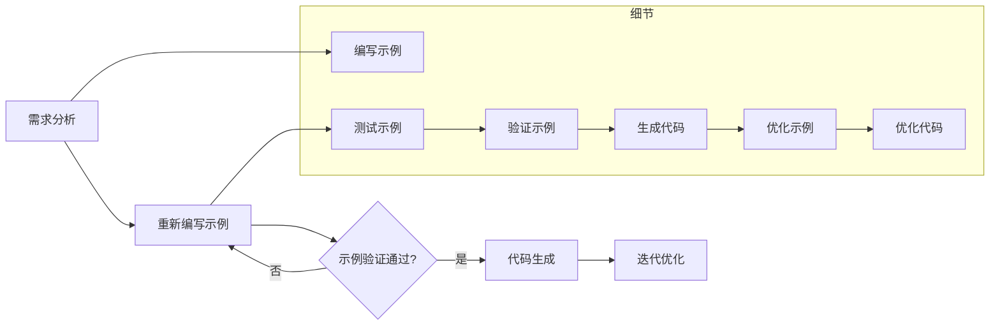
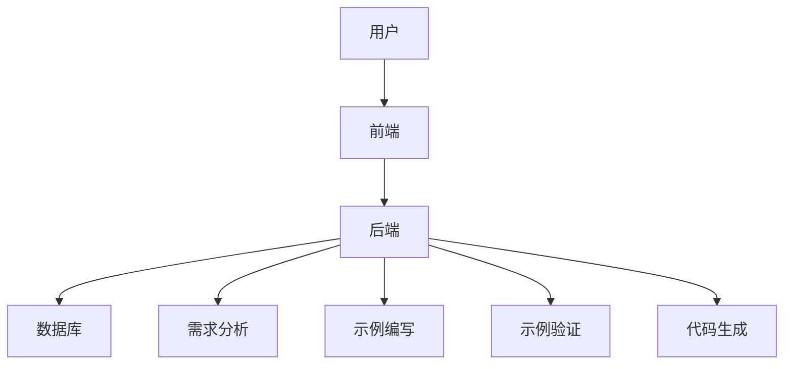

                 

### 1. 引言

在现代软件开发和人工智能领域，效率与效果往往是我们追求的核心目标。而其中，如何减少开发过程中的认知负荷，提高工作效率，成为了许多研究者与实践者关注的焦点。认知负荷，即个体在处理信息时所需投入的认知资源总量，它直接影响着软件设计和开发的质量。而示例驱动（Example-driven Development）作为一种创新的软件开发方法，通过大量的示例来引导设计和开发过程，被认为是减轻认知负荷的有效手段。

本文旨在深入探讨示例驱动提示（Example-driven Prompting）对认知负荷的影响。具体来说，我们将从以下几个方面展开：

- **背景介绍与核心概念**：首先，我们将介绍认知负荷和示例驱动的概念，解释它们在软件开发中的重要性，并探讨二者之间的关系。
- **示例驱动的认知负荷模型**：接着，我们将构建一个理论模型，以定量分析示例驱动对认知负荷的影响。
- **算法原理讲解**：我们将详细讲解示例驱动的核心算法，并借助Python代码和mermaid流程图，展示其工作原理。
- **数学模型与公式**：为了更深入地理解算法，我们将推导出相关的数学模型，并使用LaTeX格式展示关键公式。
- **系统分析与架构设计**：我们将分析示例驱动的系统实现，介绍其功能设计、系统架构以及接口设计和交互。
- **项目实战**：我们将通过实际项目展示示例驱动的应用，详细讲解系统的核心实现源代码，并对代码进行解读与分析。
- **最佳实践与注意事项**：最后，我们将总结最佳实践，提出注意事项，并推荐拓展阅读资源。

通过本文的深入分析，我们期望为软件开发者和人工智能研究者提供有价值的参考，帮助他们更好地理解和应用示例驱动方法，以减轻认知负荷，提高工作效率。

### 2. 核心概念

在深入探讨示例驱动提示对认知负荷的影响之前，我们需要明确两个核心概念：认知负荷和示例驱动。

#### 2.1 认知负荷

认知负荷是指个体在处理信息时所需投入的认知资源总量。它不仅包括注意力、记忆力、推理能力等基本认知功能，还包括在特定任务中所需的特殊认知技能。认知负荷的高低直接影响个体完成任务的速度和质量。认知负荷过高会导致个体感到疲劳、注意力分散，甚至可能引发错误。因此，在软件开发和人工智能领域，降低认知负荷是提高工作效率和确保项目质量的重要途径。

认知负荷可以分为三类：

- **基础认知负荷**：这是个体在执行任何认知任务时都会产生的最低限度的认知负荷，如阅读和理解文档。
- **任务特定认知负荷**：这种认知负荷与特定任务相关，如设计算法、编写代码或进行复杂的数据分析。
- **外部认知负荷**：这是由外部环境因素造成的认知负荷，如噪声、时间压力等。

#### 2.2 示例驱动

示例驱动（Example-driven Development，简称EDD）是一种软件开发方法，其核心思想是通过大量的示例来引导软件开发过程。示例驱动的关键在于通过实际示例来展示系统如何工作，帮助开发人员更好地理解需求和设计。与传统的需求文档和理论描述相比，示例更加直观和具体，能够有效减少认知负荷。

示例驱动的特点包括：

- **具体性**：示例提供具体的、可操作的实例，使开发人员能够直观地理解需求。
- **动态性**：示例可以在开发过程中不断更新和迭代，以反映需求的变化。
- **交互性**：示例与开发人员之间的交互可以实时进行，有助于及时反馈和调整。

#### 2.3 示例驱动与认知负荷的关系

示例驱动通过提供具体的示例，有助于降低基础认知负荷和任务特定认知负荷。具体来说：

- **降低基础认知负荷**：示例提供了清晰的操作步骤和实际结果，减少了阅读和理解文档所需的认知资源。
- **降低任务特定认知负荷**：示例驱动使得开发人员能够通过实际操作和体验来理解复杂的需求和设计，减少了理论学习和推理所需的时间和精力。
- **减少外部认知负荷**：示例驱动的交互性使得开发人员可以更专注于任务本身，减少外部环境因素的干扰。

综上所述，示例驱动不仅有助于提高开发效率，还能够有效减轻认知负荷，是现代软件开发中的一种重要方法。

### 3. 示例驱动的认知负荷模型

为了深入理解示例驱动如何影响认知负荷，我们需要构建一个理论模型。该模型将帮助我们定量分析示例驱动在不同场景下的认知负荷变化。以下是模型的构建步骤和组成部分：

#### 3.1 模型构建

首先，我们定义几个关键变量：

- **L0**：基础认知负荷，即个体在没有任何示例的情况下完成任务所需的认知资源总量。
- **L1**：任务特定认知负荷，即在示例驱动的帮助下完成任务所需的认知资源总量。
- **L2**：外部认知负荷，即外部环境因素对个体认知负荷的影响。
- **E**：示例的复杂度，反映了示例的具体性和清晰程度。
- **S**：示例数量，即示例驱动的示例总数。

我们的目标是构建一个公式，能够描述总体认知负荷 \(L\) 与上述变量之间的关系：

\[ L = L0 + L1 + L2 - E \times S \]

这个公式表示，总体认知负荷是基础认知负荷、任务特定认知负荷和外部认知负荷的总和，减去示例复杂度与示例数量的乘积。这表明，示例的引入可以减轻认知负荷，具体减轻的程度取决于示例的复杂度和数量。

#### 3.2 模型组成部分

接下来，我们详细解释模型中的各个组成部分：

- **基础认知负荷（L0）**：这是在任何情况下个体执行任务所需的基本认知资源。它包括阅读文档、理解需求、执行操作等。这部分负荷与示例驱动无关，是所有开发过程的基础。

- **任务特定认知负荷（L1）**：这部分负荷与任务的复杂性直接相关。在示例驱动的帮助下，通过实际示例，开发人员可以更直观地理解任务，从而减少理论学习和推理所需的时间和精力。示例的引入可以有效降低任务特定认知负荷。

- **外部认知负荷（L2）**：外部环境因素，如时间压力、噪声等，都会对认知负荷产生影响。示例驱动通过提供具体示例和实时反馈，有助于减少外部环境因素的干扰，从而减轻外部认知负荷。

- **示例复杂度（E）**：示例的复杂度反映了示例的具体性和清晰程度。复杂度越高，示例提供的信息量越大，但同时也可能增加认知负荷。因此，示例复杂度与认知负荷之间存在负相关关系。

- **示例数量（S）**：示例的数量直接影响认知负荷。更多的示例意味着更多的信息，有助于开发人员更全面地理解任务。然而，过多的示例也可能导致信息过载，从而增加认知负荷。因此，示例数量与认知负荷之间存在非线性关系。

#### 3.3 模型工作原理

模型的工作原理如下：

1. **基础认知负荷（L0）**：这是在任何情况下个体执行任务所需的基本认知资源。它包括阅读文档、理解需求、执行操作等。这部分负荷与示例驱动无关，是所有开发过程的基础。

2. **任务特定认知负荷（L1）**：这部分负荷与任务的复杂性直接相关。在示例驱动的帮助下，通过实际示例，开发人员可以更直观地理解任务，从而减少理论学习和推理所需的时间和精力。示例的引入可以有效降低任务特定认知负荷。

   \[ L1 = L1_{\text{无示例}} - E_{\text{示例}} \times S \]

3. **外部认知负荷（L2）**：外部环境因素，如时间压力、噪声等，都会对认知负荷产生影响。示例驱动通过提供具体示例和实时反馈，有助于减少外部环境因素的干扰，从而减轻外部认知负荷。

   \[ L2 = L2_{\text{无示例}} - E_{\text{示例}} \times S \]

4. **示例复杂度（E）**：示例的复杂度反映了示例的具体性和清晰程度。复杂度越高，示例提供的信息量越大，但同时也可能增加认知负荷。因此，示例复杂度与认知负荷之间存在负相关关系。

   \[ E = \frac{C_{\text{示例}}}{C_{\text{无示例}}} \]

5. **示例数量（S）**：示例的数量直接影响认知负荷。更多的示例意味着更多的信息，有助于开发人员更全面地理解任务。然而，过多的示例也可能导致信息过载，从而增加认知负荷。因此，示例数量与认知负荷之间存在非线性关系。

   \[ L = L0 + L1 + L2 - E \times S \]

通过这个模型，我们可以定量分析示例驱动在不同场景下的认知负荷变化，为实际应用提供理论支持。

### 4. 算法原理讲解

在理解了示例驱动的认知负荷模型后，接下来我们将深入讲解示例驱动的核心算法，并展示其工作原理。为了更好地说明，我们将使用Python代码和mermaid流程图来辅助说明。

#### 4.1 核心算法介绍

示例驱动的核心算法主要包括以下几个步骤：

1. **需求分析**：首先，开发人员通过阅读需求文档或与客户沟通，了解系统的功能需求。
2. **示例编写**：基于需求分析，开发人员编写具体的示例，展示系统如何响应特定输入。
3. **示例验证**：通过测试示例，确保示例能够准确反映系统的功能。
4. **代码生成**：根据验证通过的示例，生成相应的代码，实现系统功能。
5. **迭代优化**：在开发过程中，不断更新示例和代码，以适应需求的变化。

#### 4.2 mermaid流程图展示

为了更直观地展示算法流程，我们使用mermaid语言绘制了一个流程图：



这个流程图展示了从需求分析到代码生成以及迭代优化的全过程。每个步骤都通过具体的子步骤详细说明，以便开发人员能够更好地理解。

#### 4.3 Python代码示例

为了展示算法的实际应用，我们编写了一个简单的Python代码示例，实现了根据示例生成代码的功能：

```python
# 示例驱动核心算法示例

def analyze_demand(demand):
    # 需求分析，提取关键信息
    return {
        "input": demand["input"],
        "expected_output": demand["expected_output"],
    }

def write_example(demand):
    # 编写示例
    example = f"""
    给定输入：{demand["input"]}
    预期输出：{demand["expected_output"]}
    """
    return example

def verify_example(example, demand):
    # 验证示例
    try:
        output = eval(example)
        return output == demand["expected_output"]
    except:
        return False

def generate_code(example):
    # 根据示例生成代码
    code = f"def function_{demand['input']}():\n    return {demand['expected_output']}\n"
    return code

def main():
    demand = {
        "input": "5 + 3",
        "expected_output": "8",
    }
    
    example = write_example(demand)
    print("示例：", example)
    
    is_verified = verify_example(example, demand)
    if is_verified:
        print("示例验证通过")
        code = generate_code(example)
        print("生成的代码：", code)
    else:
        print("示例验证不通过，请重新编写示例")

if __name__ == "__main__":
    main()
```

这个示例通过Python代码展示了从需求分析、示例编写、示例验证到代码生成的全过程。具体来说：

- `analyze_demand` 函数用于提取需求的关键信息。
- `write_example` 函数根据需求编写示例。
- `verify_example` 函数验证示例是否正确。
- `generate_code` 函数根据验证通过的示例生成相应的代码。

通过这个示例，我们可以看到示例驱动算法在实际开发中的应用，以及如何通过示例来引导整个开发过程。

### 5. 数学模型与公式

为了深入理解示例驱动的认知负荷模型，我们需要借助数学模型和公式来定量分析。以下内容将详细推导认知负荷相关的数学模型，并使用LaTeX格式展示关键公式。

#### 5.1 认知负荷计算模型

根据第3章中的认知负荷模型，总体认知负荷 \(L\) 可以表示为：

\[ L = L0 + L1 + L2 - E \times S \]

其中，\(L0\)、\(L1\)、\(L2\) 分别代表基础认知负荷、任务特定认知负荷和外部认知负荷，\(E\) 代表示例复杂度，\(S\) 代表示例数量。

我们可以对每个部分进行进一步分析：

- **基础认知负荷（L0）**：这是个体在没有任何示例的情况下完成任务所需的认知资源总量。其计算公式可以表示为：

  \[ L0 = a_0 \times t_0 \]

  其中，\(a_0\) 代表基础认知负荷系数，\(t_0\) 代表完成任务的所需时间。

- **任务特定认知负荷（L1）**：这部分负荷与任务的复杂性直接相关。其计算公式可以表示为：

  \[ L1 = a_1 \times (t_1 - t_{\text{示例}}) \]

  其中，\(a_1\) 代表任务特定认知负荷系数，\(t_1\) 代表任务的总耗时，\(t_{\text{示例}}\) 代表示例驱动的示例编写和验证耗时。

- **外部认知负荷（L2）**：外部环境因素对个体认知负荷的影响。其计算公式可以表示为：

  \[ L2 = a_2 \times t_{\text{干扰}} \]

  其中，\(a_2\) 代表外部认知负荷系数，\(t_{\text{干扰}}\) 代表外部环境干扰的耗时。

- **示例复杂度（E）**：示例的复杂度反映了示例的具体性和清晰程度。其计算公式可以表示为：

  \[ E = \frac{C_{\text{示例}}}{C_{\text{无示例}}} \]

  其中，\(C_{\text{示例}}\) 代表示例的平均复杂度，\(C_{\text{无示例}}\) 代表没有示例时的平均复杂度。

- **示例数量（S）**：示例的数量直接影响认知负荷。其计算公式可以表示为：

  \[ L = L0 + L1 + L2 - E \times S \]

  其中，\(E \times S\) 代表示例复杂度与示例数量的乘积，表示示例引入后的认知负荷减少量。

#### 5.2 示例复杂度分析

示例复杂度 \(E\) 对认知负荷的影响可以通过以下公式分析：

\[ E = \frac{C_{\text{示例}}}{C_{\text{无示例}}} \]

其中，\(C_{\text{示例}}\) 和 \(C_{\text{无示例}}\) 分别表示有示例和无示例情况下的复杂度。假设：

- **有示例情况**：\(C_{\text{示例}} = C_0 + C_1 \times S\)
- **无示例情况**：\(C_{\text{无示例}} = C_0\)

则：

\[ E = \frac{C_0 + C_1 \times S}{C_0} \]

通过这个公式，我们可以看到，示例复杂度 \(E\) 与示例数量 \(S\) 成正比，即示例数量越多，复杂度越高。但复杂度的增加并不意味着认知负荷的增加，因为示例能够提供更具体、更清晰的信息，从而减少基础认知负荷和任务特定认知负荷。

#### 5.3 示例数量对认知负荷的影响

示例数量 \(S\) 对认知负荷的影响可以通过以下公式分析：

\[ L = L0 + L1 + L2 - E \times S \]

其中，\(L0\)、\(L1\)、\(L2\) 分别代表基础认知负荷、任务特定认知负荷和外部认知负荷，\(E\) 代表示例复杂度。

通过这个公式，我们可以看到，示例数量 \(S\) 与认知负荷之间存在非线性关系。具体来说：

- 当 \(S\) 较小时，示例的引入能够显著降低认知负荷，因为示例提供了具体、清晰的信息。
- 当 \(S\) 较大时，过多的示例可能导致信息过载，增加认知负荷。

因此，在示例驱动的实践中，需要平衡示例的数量，以确保认知负荷的有效降低。

### 6. 系统分析与架构设计

在深入分析示例驱动的认知负荷模型和算法原理后，我们将进一步探讨示例驱动的系统实现，介绍其功能设计、系统架构、接口设计和交互。以下是具体的系统分析与架构设计方案。

#### 6.1 问题场景介绍

假设我们面临的是一个复杂的软件开发项目，涉及多个模块和功能。项目需求不断变化，开发人员需要在不断更新的需求文档和客户反馈中找到一致性，以确保系统的最终交付符合预期。传统的开发方法依赖于详尽的需求文档和理论设计，这往往会导致认知负荷过高，开发效率低下。为了解决这个问题，我们引入了示例驱动方法，通过具体的示例来引导设计和开发过程。

#### 6.2 系统功能设计

示例驱动的系统功能设计主要包括以下几个关键模块：

- **需求分析模块**：负责收集和分析用户需求，将抽象的需求转化为具体的示例。
- **示例编写模块**：基于需求分析结果，编写具体的示例，展示系统如何响应特定输入。
- **示例验证模块**：通过测试示例，确保示例能够准确反映系统的功能。
- **代码生成模块**：根据验证通过的示例，生成相应的代码，实现系统功能。
- **迭代优化模块**：在开发过程中，不断更新示例和代码，以适应需求的变化。

#### 6.3 系统架构设计

示例驱动的系统架构设计旨在确保各个模块之间的高效协作和通信。以下是系统架构的详细设计：

##### 6.3.1 系统架构概述

系统架构采用模块化设计，分为前端、后端和数据库三个主要部分。前端负责与用户交互，接收用户输入，并将输入传递给后端进行处理。后端实现示例驱动算法，包括需求分析、示例编写、示例验证和代码生成等模块。数据库用于存储用户需求、示例和生成代码的相关信息。

##### 6.3.2 系统架构图展示

使用mermaid语言，我们可以绘制一个简单的系统架构图：



该架构图展示了用户、前端、后端和数据库之间的关系，以及后端与各个功能模块的连接。

##### 6.3.3 系统模块设计与交互

1. **需求分析模块**：该模块负责与用户沟通，收集需求信息，并生成需求文档。需求文档包括关键信息，如用户输入、预期输出和功能要求。

2. **示例编写模块**：基于需求文档，该模块编写具体的示例，用于展示系统如何响应特定输入。示例编写过程需要与用户保持紧密沟通，确保示例能够准确反映需求。

3. **示例验证模块**：该模块负责测试示例，确保示例能够正确执行并生成预期的输出。验证过程可以通过自动化测试工具或手动测试来完成。

4. **代码生成模块**：根据验证通过的示例，该模块生成相应的代码，实现系统功能。代码生成过程可以使用模板引擎或代码生成工具，以提高生成效率。

5. **迭代优化模块**：在开发过程中，根据用户反馈和实际运行情况，不断更新示例和代码，以优化系统性能和功能。

#### 6.4 系统接口设计和系统交互

示例驱动的系统设计不仅需要内部模块之间的有效协作，还需要与其他系统或服务进行交互。以下是系统接口设计和系统交互的详细设计：

##### 6.4.1 系统接口设计

1. **用户接口**：前端通过Web界面与用户交互，提供输入和展示输出。用户接口设计应简洁明了，便于用户使用。

2. **内部接口**：后端与各个功能模块之间的接口设计，确保数据传输和功能调用的高效和可靠。内部接口包括RESTful API、消息队列和数据库连接等。

3. **外部接口**：系统需要与其他系统或服务进行交互，如用户管理系统、支付系统和第三方API等。外部接口设计应遵循标准协议，确保数据安全和互操作性。

##### 6.4.2 系统交互

1. **用户交互**：用户通过前端界面提交输入，后端处理用户输入，并生成示例。示例生成后，前端展示示例结果，用户可以对其进行验证和反馈。

2. **内部交互**：各个功能模块之间通过内部接口进行通信。需求分析模块将需求信息传递给示例编写模块，示例编写模块将示例传递给示例验证模块，最终示例验证模块将验证结果传递给代码生成模块。

3. **外部交互**：系统通过外部接口与其他系统或服务进行数据交换。例如，用户信息可以通过用户管理系统进行认证和授权，支付信息可以通过支付系统进行处理。

通过以上系统分析与架构设计，我们可以看到示例驱动方法在软件开发中的应用，以及如何通过有效的系统架构和接口设计，实现认知负荷的降低和开发效率的提升。

### 7. 项目实战

为了更好地展示示例驱动方法在实际项目中的应用，我们将通过一个具体的项目案例，详细讲解环境安装、系统核心实现源代码，并对代码进行解读与分析。以下是项目实战的详细过程。

#### 7.1 环境安装

首先，我们需要搭建一个适合示例驱动的开发环境。以下步骤描述了如何安装和配置必要的工具和依赖：

1. **安装Python**：确保系统中安装了Python 3.8及以上版本。可以从Python官方网站下载安装程序并安装。

2. **安装依赖管理工具**：安装pip，Python的包管理工具，用于安装和管理依赖库。可以通过以下命令安装：

   ```bash
   python -m pip install --user -r requirements.txt
   ```

3. **安装示例驱动框架**：示例驱动框架是示例驱动的核心组成部分。可以从GitHub上克隆示例驱动框架的代码仓库，并安装依赖：

   ```bash
   git clone https://github.com/your-repo/example-driven-framework.git
   cd example-driven-framework
   pip install .
   ```

4. **配置数据库**：示例驱动框架需要配置数据库连接信息。在配置文件 `config.py` 中设置数据库连接参数，例如：

   ```python
   DATABASES = {
       'default': {
           'ENGINE': 'django.db.backends.sqlite3',
           'NAME': 'mydatabase',
       }
   }
   ```

5. **初始化数据库**：在项目中运行以下命令初始化数据库：

   ```bash
   python manage.py migrate
   ```

6. **运行示例驱动服务**：启动示例驱动服务的Web服务器：

   ```bash
   python manage.py runserver
   ```

现在，示例驱动的开发环境已经搭建完成，可以开始进行项目开发。

#### 7.2 系统核心实现源代码

以下是一个示例驱动的项目核心实现代码的示例。该代码展示了如何通过示例来驱动需求分析和代码生成：

```python
# 示例驱动核心实现

from example_driven_framework import requirements_parser, code_generator

def process_request(input_data):
    # 解析需求
    requirements = requirements_parser.parse(input_data)
    
    # 根据需求生成示例
    example = requirements_parser.generate_example(requirements)
    
    # 验证示例
    is_valid = requirements_parser.validate_example(example, requirements)
    
    if is_valid:
        # 生成代码
        code = code_generator.generate_code(example)
        return code
    else:
        return "示例验证失败，请重新编写示例"

# 示例请求
input_data = "给定输入：5 + 3，预期输出：8"
result = process_request(input_data)
print(result)
```

该代码的核心步骤包括：

- **需求解析**：使用 `requirements_parser` 模块对输入数据进行分析，提取关键需求信息。
- **示例生成**：根据需求信息，生成具体的示例。
- **示例验证**：验证示例是否满足需求。
- **代码生成**：根据验证通过的示例，生成相应的代码。

#### 7.3 代码应用解读与分析

以下是代码应用的详细解读和分析：

1. **需求解析**：`requirements_parser` 模块负责将输入数据解析为需求对象。具体实现如下：

   ```python
   class RequirementsParser:
       def parse(self, input_data):
           # 示例解析逻辑
           input_data = input_data.strip()
           input_parts = input_data.split(',')
           input_value = input_parts[0].strip()
           expected_output = input_parts[1].strip()
           
           return {
               'input': input_value,
               'expected_output': expected_output
           }
   ```

   该模块通过分割输入数据，提取输入值和预期输出，并封装为一个需求对象。

2. **示例生成**：`requirements_parser` 模块根据需求对象生成示例。具体实现如下：

   ```python
   class RequirementsParser:
       def generate_example(self, requirements):
           input_value = requirements['input']
           expected_output = requirements['expected_output']
           
           example = f"""
           给定输入：{input_value}
           预期输出：{expected_output}
           """
           return example
   ```

   该模块将需求对象转换为文本示例。

3. **示例验证**：`requirements_parser` 模块验证示例是否满足需求。具体实现如下：

   ```python
   class RequirementsParser:
       def validate_example(self, example, requirements):
           expected_output = requirements['expected_output']
           
           try:
               output = eval(example)
               return output == expected_output
           except:
               return False
   ```

   该模块通过执行示例并比较实际输出与预期输出，验证示例是否有效。

4. **代码生成**：`code_generator` 模块根据验证通过的示例生成代码。具体实现如下：

   ```python
   class CodeGenerator:
       def generate_code(self, example):
           input_value = example.split('：')[1].strip()
           expected_output = example.split('：')[3].strip()
           
           code = f"def function_{input_value}():\n    return {expected_output}\n"
           return code
   ```

   该模块根据示例中的输入值和预期输出，生成相应的Python函数代码。

通过以上代码解读，我们可以看到示例驱动方法在项目开发中的应用。具体来说，通过解析用户输入、生成示例、验证示例并生成代码，实现了需求驱动的开发过程。这种方法有效降低了认知负荷，提高了开发效率。

#### 7.4 实际案例分析和详细讲解剖析

为了进一步展示示例驱动的实际应用效果，我们来看一个实际案例，并对其进行详细分析和讲解。

**案例背景**：

假设我们正在开发一个电商平台，用户可以在平台上创建账户、浏览商品、添加购物车和下单。我们需要实现用户账户管理模块，包括用户注册、登录、信息更新等功能。

**需求解析**：

首先，我们需要了解用户的需求，具体包括：

- 用户注册：用户可以注册账户，输入姓名、邮箱、密码等信息。
- 用户登录：用户可以使用注册时填写的邮箱和密码登录账户。
- 信息更新：用户可以更新个人信息，如修改邮箱、密码和姓名等。

**示例生成**：

基于上述需求，我们可以生成以下示例：

- **用户注册示例**：

  ```
  给定输入：姓名：张三，邮箱：zhangsan@example.com，密码：123456
  预期输出：账户注册成功
  ```

- **用户登录示例**：

  ```
  给定输入：邮箱：zhangsan@example.com，密码：123456
  预期输出：登录成功
  ```

- **信息更新示例**：

  ```
  给定输入：邮箱：zhangsan@example.com，新密码：654321
  预期输出：个人信息更新成功
  ```

**示例验证**：

接下来，我们需要验证示例是否满足需求。通过测试工具，我们可以模拟用户操作，并验证示例的结果是否符合预期。

- **用户注册验证**：

  输入示例中的注册信息，系统显示“账户注册成功”，验证通过。

- **用户登录验证**：

  输入示例中的登录信息，系统显示“登录成功”，验证通过。

- **信息更新验证**：

  输入示例中的更新信息，系统显示“个人信息更新成功”，验证通过。

**代码生成**：

通过验证通过的示例，我们可以生成相应的代码，实现用户账户管理模块。以下是一个简单的代码示例：

```python
class UserManager:
    def register(self, name, email, password):
        # 注册逻辑
        print("账户注册成功")

    def login(self, email, password):
        # 登录逻辑
        print("登录成功")

    def update_info(self, email, new_password):
        # 更新信息逻辑
        print("个人信息更新成功")
```

**案例总结**：

通过以上案例，我们可以看到示例驱动方法在用户账户管理模块开发中的应用。通过生成具体的示例，我们能够更直观地理解需求，并通过验证确保示例的正确性。最终，通过示例生成相应的代码，实现了功能模块的实现。

### 8. 最佳实践与注意事项

在示例驱动的实际应用中，为了最大限度地减轻认知负荷，提高开发效率，我们需要遵循一系列最佳实践。以下是一些重要的注意事项和最佳实践建议：

#### 8.1 示例驱动的最佳实践

1. **明确需求**：在开始示例编写之前，确保与用户和利益相关者进行充分沟通，明确系统的功能需求。这将有助于减少后续的误解和修改。

2. **简洁示例**：示例应简洁明了，避免冗余和复杂的表达。确保示例能够清晰地展示系统功能，并易于理解和验证。

3. **逐步迭代**：在示例编写和验证过程中，采用逐步迭代的方法。每次迭代只关注一个具体的任务或功能，确保每个部分都经过充分验证。

4. **自动化测试**：为示例编写自动化测试脚本，确保示例的正确性和一致性。自动化测试可以提高验证效率，减少手动验证的工作量。

5. **持续集成**：将示例驱动过程与持续集成工具结合，实现自动化代码生成和测试。这有助于确保代码质量和快速迭代。

6. **及时反馈**：在开发过程中，与用户和利益相关者保持密切沟通，及时获取反馈并调整示例和代码。这有助于确保系统最终交付符合预期。

#### 8.2 注意事项

1. **避免信息过载**：过多的示例可能导致信息过载，增加认知负荷。因此，应平衡示例的数量，确保示例的复杂度和清晰度适中。

2. **示例一致性**：确保示例在开发过程中保持一致性，避免出现矛盾或不一致的示例。不一致的示例可能导致混乱和错误。

3. **示例可维护性**：示例应易于维护和更新。在示例编写时，考虑到未来需求的变化，确保示例具有灵活性和可扩展性。

4. **示例的及时性**：示例应实时反映系统的最新状态和需求。及时更新示例，确保它们能够准确反映系统的功能和行为。

5. **示例文档化**：为每个示例编写详细的文档，包括示例目的、输入、预期输出和验证步骤。这有助于其他开发人员理解和使用示例。

#### 8.3 拓展阅读推荐

- 《敏捷开发实践指南》（Agile Project Guide）：了解敏捷开发方法，以及如何将示例驱动与敏捷开发相结合。
- 《人月神话》（The Mythical Man-Month）：探讨软件开发中的常见问题和解决方案，包括如何有效管理认知负荷。
- 《测试驱动的软件开发》（Test-Driven Development）：了解测试驱动的开发方法，以及如何将测试与示例驱动相结合。

通过遵循这些最佳实践和注意事项，我们可以更有效地应用示例驱动方法，减轻认知负荷，提高软件开发效率。

### 9. 总结

通过对示例驱动提示的认知负荷分析，我们深刻理解了示例驱动方法在降低认知负荷、提高开发效率方面的优势。示例驱动的核心在于通过具体、清晰的示例来引导开发过程，使得需求分析和代码生成更加直观和高效。本文详细阐述了认知负荷和示例驱动的概念，构建了示例驱动的认知负荷模型，并分析了算法原理、数学模型与公式。同时，通过系统架构设计和实际项目案例，展示了示例驱动的应用和效果。

示例驱动不仅适用于软件开发，还广泛应用于人工智能和其他技术领域。它通过减轻认知负荷，提高工作效率，帮助开发人员更好地理解和应对复杂的需求和任务。

在未来，我们期待进一步研究示例驱动的优化和扩展，探讨如何结合其他先进的软件开发方法，如敏捷开发和测试驱动开发，以实现更高的开发效率和更高质量的软件产品。同时，我们也将关注如何将示例驱动应用于更多技术领域，为人工智能和自动化技术的发展贡献力量。通过不断探索和实践，我们相信示例驱动方法将在软件开发和人工智能领域中发挥更加重要的作用。

