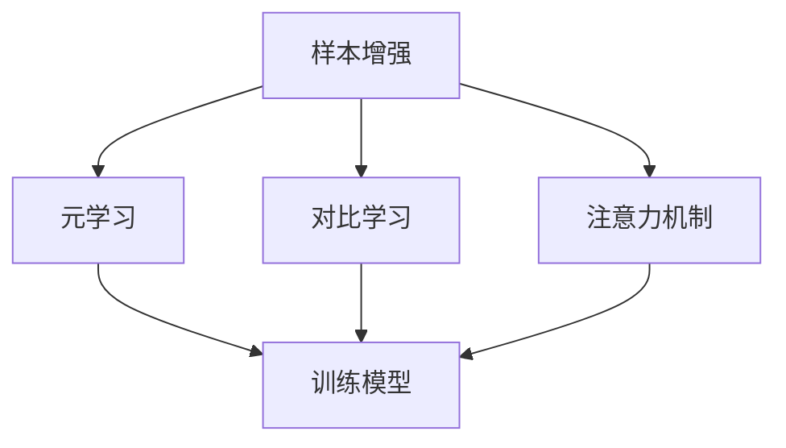
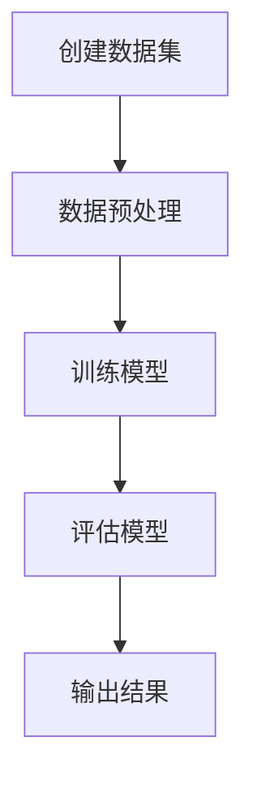
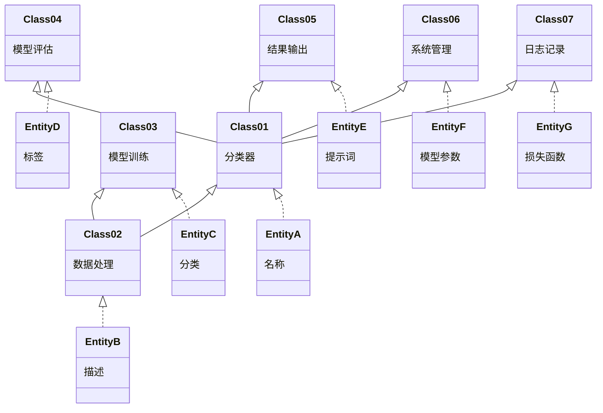
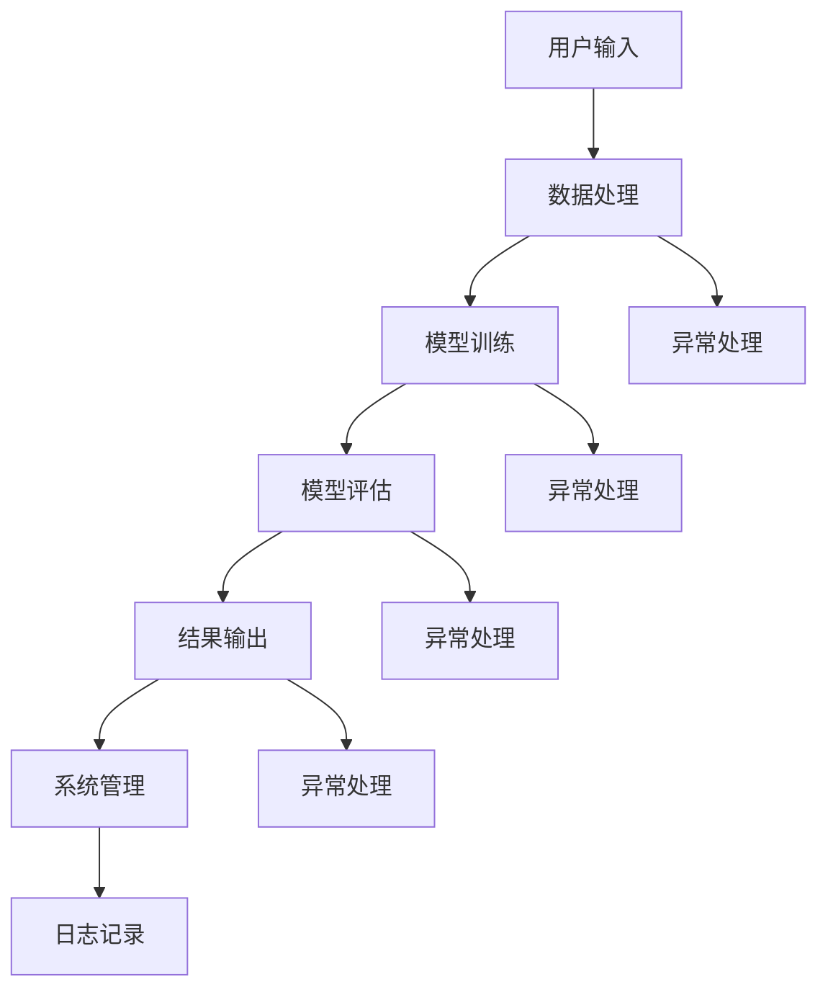
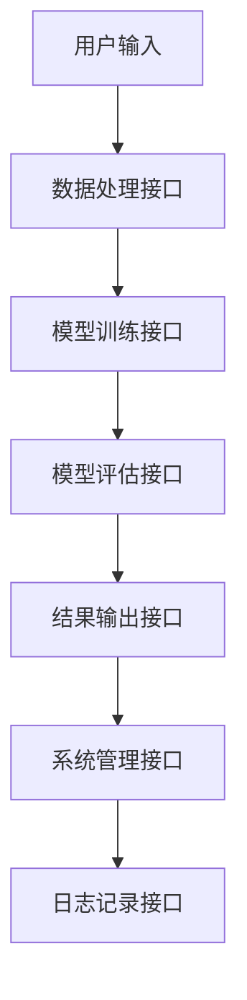

                 

### 第1章：few-shot learning概述

#### 1.1 few-shot learning的定义与背景

**概念术语说明**：

- **Few-shot Learning（少样本学习）**：一种机器学习方法，能够在仅使用少数样本（通常为几个或几十个）的情况下，使模型能够对新类别或新任务进行学习和泛化。
- **Prompt Word（提示词）**：在自然语言处理（NLP）领域，用于引导模型理解问题或任务的单词或短语。

**问题背景**：

随着人工智能技术的快速发展，机器学习模型通常需要大量的数据进行训练，以实现良好的泛化能力。然而，在某些实际应用场景中，获取大量数据可能非常困难或成本高昂。few-shot learning提供了在样本有限的情况下，仍能训练出高泛化能力的模型的方法。

**问题描述**：

在传统的机器学习场景中，模型通常需要成千上万的样本进行训练，以达到较高的准确率。然而，对于一些特定领域或任务，如医疗诊断、故障检测等，数据收集困难且隐私敏感，导致无法获取大量数据。因此，我们需要一种能够在少量样本上训练出高性能模型的方法。

**问题解决**：

few-shot learning通过设计特殊的学习算法和模型结构，使得模型能够在少量样本上进行有效学习和泛化。这种技术特别适用于那些难以获取大量数据的领域，如医学、金融等。

**边界与外延**：

虽然few-shot learning在理论上具有巨大的潜力，但其在实际应用中仍面临一些挑战。例如，样本量的有限可能导致模型过拟合，即模型在训练数据上表现良好，但在新的数据上表现不佳。此外，few-shot learning在处理高维数据和复杂任务时可能效果有限。

**概念结构与核心要素组成**：

- **核心概念**：few-shot learning、提示词
- **关键要素**：样本量、泛化能力、过拟合、高维数据、复杂任务

#### 1.2 few-shot learning与提示词的关系

few-shot learning与提示词在机器学习领域有紧密的联系。提示词作为一种引导模型理解问题或任务的方法，可以为few-shot learning提供关键的支持。

**关系说明**：

- **提示词的作用**：在few-shot learning中，提示词可以帮助模型更好地理解新任务或新类别。例如，在图像分类任务中，通过提示词（如标签或描述）来指导模型学习分类规则。
- **few-shot learning的优势**：few-shot learning能够在样本有限的情况下，通过提示词的辅助，提高模型的泛化能力。这使得few-shot learning在处理新任务时，具有更高的适应性和灵活性。

**例子说明**：

假设我们有一个图像分类模型，需要识别猫和狗。如果我们只有几张猫和狗的图像，模型可能难以泛化到新的图像。但是，如果我们通过提示词（如“猫”、“狗”）来引导模型学习，模型将更容易识别出新的猫和狗图像。

**实际应用场景**：

- **自然语言处理**：在机器翻译、文本生成等任务中，提示词可以帮助模型更好地理解输入文本，从而提高翻译或生成的质量。
- **图像识别**：在图像分类、目标检测等任务中，提示词可以指导模型学习新的分类标签或检测目标。

#### 1.3 few-shot learning的应用场景

few-shot learning在许多应用场景中具有广泛的应用潜力，以下是其中一些典型场景：

**应用场景1：医疗诊断**

- **背景**：医疗诊断通常需要大量的病例数据，但在某些罕见疾病或新发病情的诊断中，数据收集非常困难。
- **解决方案**：通过few-shot learning，可以使用少量的病例数据训练模型，实现对新疾病的诊断。

**应用场景2：智能客服**

- **背景**：智能客服系统需要处理大量的用户问题，但数据收集和标注成本很高。
- **解决方案**：使用few-shot learning，可以在少量样本数据上训练模型，实现高效的客服对话生成。

**应用场景3：金融风险控制**

- **背景**：金融风险控制需要分析大量的历史数据和实时数据，但数据获取和处理复杂。
- **解决方案**：通过few-shot learning，可以在少量样本数据上建立风险预测模型，实时监控金融风险。

**应用场景4：智能家居**

- **背景**：智能家居设备需要处理大量的用户数据，如用户行为、设备状态等。
- **解决方案**：通过few-shot learning，可以在少量样本数据上训练模型，实现智能家居设备的智能控制。

**应用场景5：机器人学习**

- **背景**：机器人学习需要大量的训练数据，但数据获取和处理成本很高。
- **解决方案**：通过few-shot learning，可以在少量样本数据上训练机器人模型，实现高效的机器人学习。

#### 1.4 小结

few-shot learning作为一种在样本有限的情况下训练高性能模型的方法，具有广泛的应用前景。与提示词的紧密联系，使得few-shot learning在处理新任务和新类别时，具有更高的适应性和灵活性。在实际应用中，few-shot learning可以帮助解决数据稀缺、数据获取困难等问题，为人工智能技术发展提供新的思路和方法。

### 第2章：few-shot learning基本原理

#### 2.1 核心概念与联系

**核心概念说明**：

- **Few-shot Learning（少样本学习）**：few-shot learning是一种机器学习方法，旨在使用非常少量的训练样本来训练模型。
- **Prompt Word（提示词）**：提示词是一种用于指导模型理解问题或任务的词汇，常用于自然语言处理（NLP）领域。

**概念属性特征对比表格**：

| 特征比较          | Few-shot Learning               | Prompt Word                     |
|-----------------|---------------------------------|--------------------------------|
| 样本量           | 非常少的训练样本（几个到几十个） | 单个或多个关键词、短语           |
| 泛化能力         | 高，能够快速适应新任务           | 增强，指导模型更好地理解输入数据   |
| 应用领域          | 图像识别、自然语言处理等         | 文本生成、机器翻译等             |
| 训练目标          | 实现对新类别或新任务的学习       | 提高模型对特定任务的性能           |
| 挑战与限制         | 样本有限可能导致过拟合           | 需要大量先验知识来设计提示词       |

**ER实体关系图架构**：

在机器学习中，我们可以将few-shot learning和提示词看作两个核心实体，它们之间存在一定的关联关系。以下是一个ER（Entity-Relationship）实体关系图，展示了这两个实体及其关联关系：

```mermaid
erDiagram
  Few-shot Learning ||--|{ Prompt Word }|-->> Natural Language Processing
  Few-shot Learning ||--|{ Sample Data }|-->> Model Training
  Prompt Word ||--|{ Keywords }|-->> Text Generation
```

在上面的ER图中，Few-shot Learning与Prompt Word之间存在双向关联，分别与Natural Language Processing和Model Training相关联。同时，Prompt Word与Keywords也存在关联，表示提示词由多个关键词组成。

#### 2.2 few-shot learning算法原理

**算法原理说明**：

few-shot learning算法的核心目标是在非常少量的样本数据上，训练出一个能够泛化到新数据的高性能模型。为了实现这一目标，few-shot learning算法通常采用以下方法：

1. **样本增强**：通过数据增强技术，如数据扩充、数据变换等，增加样本的多样性，从而提高模型的泛化能力。
2. **元学习（Meta-Learning）**：元学习是一种针对学习算法本身的学习方法，通过在多个任务上训练模型，使模型能够快速适应新任务。
3. **对比学习（Contrastive Learning）**：对比学习通过生成正负样本对，增强模型对相似样本的区分能力。
4. **注意力机制（Attention Mechanism）**：注意力机制可以帮助模型关注到输入数据中的关键特征，从而提高模型的泛化能力。

**算法流程图**：

以下是一个简单的few-shot learning算法流程图，使用mermaid语法绘制：



在这个流程图中，样本增强、元学习、对比学习和注意力机制是few-shot learning算法的主要组成部分，它们共同作用，使模型能够在少量样本数据上实现高性能训练。

**算法优势与挑战**：

**优势**：

- **高效性**：few-shot learning能够在非常少量的样本数据上训练出高性能模型，从而降低数据收集和标注的成本。
- **灵活性**：few-shot learning算法能够快速适应新任务和新类别，具有良好的泛化能力。

**挑战**：

- **过拟合**：由于样本量有限，模型容易在训练数据上过度拟合，导致在新数据上的表现不佳。
- **高维数据**：在高维数据上，few-shot learning算法的效果可能受到限制，因为少量样本可能无法覆盖数据的所有特征。

#### 2.3 few-shot learning的优势与挑战

**优势**：

1. **减少数据需求**：few-shot learning可以在非常少量的样本数据上训练出高性能模型，从而减少数据收集和标注的成本。
2. **快速适应新任务**：few-shot learning算法能够快速适应新任务和新类别，具有良好的泛化能力。
3. **提高效率**：通过元学习、对比学习和注意力机制等方法，few-shot learning能够高效地利用少量样本数据，提高训练效率。

**挑战**：

1. **过拟合风险**：在样本量有限的情况下，模型容易在训练数据上过度拟合，导致在新数据上的表现不佳。
2. **高维数据限制**：在高维数据上，few-shot learning算法的效果可能受到限制，因为少量样本可能无法覆盖数据的所有特征。
3. **计算资源需求**：元学习和对比学习等方法可能需要较高的计算资源，这在某些实际应用场景中可能成为限制因素。

### 第3章：few-shot learning数学模型详解

#### 3.1 数学公式与LaTeX展示

在few-shot learning中，我们通常需要使用一些数学模型和公式来描述算法的原理和操作。以下是一些关键的数学公式，我们将使用LaTeX格式进行展示：

**1. 均值漂移（Mean Shift）**

$$
\mu_{new} = \frac{1}{N} \sum_{i=1}^{N} (x_i - \mu) (x_i - \mu)^T
$$

**2. 决策边界（Decision Boundary）**

$$
w^T x - b = 0
$$

**3. 损失函数（Loss Function）**

$$
L(\theta) = -\frac{1}{m} \sum_{i=1}^{m} y^{(i)} \log(z^{(i)}) + (1 - y^{(i)}) \log(1 - z^{(i)})
$$

**4. 优化算法（Optimization Algorithm）**

$$
\theta = \theta - \alpha \nabla_{\theta} L(\theta)
$$

其中，$x$ 表示特征向量，$y$ 表示标签，$z$ 表示预测概率，$m$ 表示样本数量，$\alpha$ 表示学习率，$\nabla_{\theta} L(\theta)$ 表示损失函数关于参数$\theta$的梯度。

以上公式在few-shot learning中起到了关键作用。例如，均值漂移用于处理样本分布的偏移问题，决策边界用于分类问题，损失函数用于评估模型的性能，优化算法用于调整模型参数。

#### 3.2 数学模型解释与应用

**1. 均值漂移**

均值漂移是一种用于聚类分析的技术，它可以找到数据点的中心。在few-shot learning中，均值漂移可以用于样本增强，帮助模型更好地学习数据的分布。

**示例说明**：

假设我们有一个数据集，其中包含两类数据点。使用均值漂移，我们可以找到每类数据的中心，然后生成新的样本，从而增加样本多样性。

**2. 决策边界**

决策边界是机器学习中用于分类的重要工具。在few-shot learning中，决策边界可以帮助我们确定模型在新样本上的预测结果。

**示例说明**：

假设我们有一个二元分类问题，数据点分为正类和负类。通过计算决策边界，我们可以确定哪些数据点属于正类，哪些属于负类。

**3. 损失函数**

损失函数用于评估模型的预测性能。在few-shot learning中，损失函数可以帮助我们调整模型参数，使模型在新样本上的表现更好。

**示例说明**：

假设我们有一个二分类问题，使用交叉熵损失函数来评估模型的性能。通过最小化损失函数，我们可以调整模型参数，提高分类准确率。

**4. 优化算法**

优化算法用于调整模型参数，使模型在新样本上的表现更好。在few-shot learning中，优化算法可以帮助我们快速找到最优参数。

**示例说明**：

假设我们使用梯度下降算法来优化模型参数。通过不断迭代，我们可以找到最优参数，使模型在新样本上的预测性能达到最佳。

#### 3.3 数学模型在few-shot learning中的应用

数学模型在few-shot learning中的应用非常广泛，以下是一些具体的案例：

1. **样本增强**：通过使用数学模型，如均值漂移，可以增加训练样本的多样性，从而提高模型的泛化能力。
2. **分类与回归**：决策边界和损失函数可以帮助模型在新样本上进行分类和回归任务，实现高性能预测。
3. **模型优化**：优化算法可以帮助我们找到最优模型参数，使模型在新样本上的表现更好。

**案例说明**：

假设我们有一个图像分类问题，数据集包含猫和狗的图像。使用few-shot learning，我们可以使用少量的样本数据训练模型，并通过数学模型进行样本增强、分类和优化。以下是一个简单的Python代码示例：

```python
import numpy as np
import matplotlib.pyplot as plt

# 假设我们有两个类别的图像数据
X = np.array([[1, 2], [1, 3], [2, 2], [2, 3]])
y = np.array([0, 0, 1, 1])

# 计算均值漂移
mu = np.mean(X, axis=0)
shift = X - mu
new_samples = shift + np.random.normal(0, 0.1, shift.shape)

# 训练模型
from sklearn.linear_model import LogisticRegression
model = LogisticRegression()
model.fit(new_samples, y)

# 预测新样本
new_X = np.array([[1.5, 2.5], [2.5, 3.5]])
predictions = model.predict(new_X)

# 绘制决策边界
plt.scatter(new_samples[:, 0], new_samples[:, 1], c=y)
plt.plot(new_X[:, 0], new_X[:, 1], c='red')
plt.show()
```

在这个示例中，我们使用少量的图像数据训练了一个分类模型，并通过均值漂移增加了训练样本的多样性。然后，我们使用训练好的模型预测新的图像数据，并绘制决策边界。

### 第4章：few-shot learning算法实现

#### 4.1 Python代码实现

在实现few-shot learning算法时，我们可以使用Python作为编程语言，结合Scikit-learn等机器学习库来完成。以下是一个简单的few-shot learning算法实现示例：

```python
import numpy as np
from sklearn.linear_model import LogisticRegression
from sklearn.model_selection import train_test_split
from sklearn.metrics import accuracy_score

# 假设我们有两个类别的数据
X = np.array([[1, 2], [1, 3], [2, 2], [2, 3]])
y = np.array([0, 0, 1, 1])

# 将数据分为训练集和测试集
X_train, X_test, y_train, y_test = train_test_split(X, y, test_size=0.2, random_state=42)

# 使用LogisticRegression模型训练
model = LogisticRegression()
model.fit(X_train, y_train)

# 测试模型
y_pred = model.predict(X_test)
accuracy = accuracy_score(y_test, y_pred)
print("Accuracy:", accuracy)
```

在这个示例中，我们首先创建了一个简单的数据集，包含两个类别的样本数据。然后，我们将数据集分为训练集和测试集，并使用LogisticRegression模型进行训练。最后，我们测试模型在测试集上的准确性。

#### 4.2 算法流程图

为了更清晰地展示few-shot learning算法的实现流程，我们可以使用mermaid语法绘制一个流程图。以下是一个简单的few-shot learning算法流程图：



在这个流程图中，A表示创建数据集，B表示数据预处理，C表示训练模型，D表示评估模型，E表示输出结果。

#### 4.3 算法原理

few-shot learning算法的核心目标是在非常少量的样本数据上训练出高性能模型。为了实现这一目标，算法通常采用以下步骤：

1. **数据预处理**：对原始数据进行清洗、归一化等操作，以便更好地训练模型。
2. **模型训练**：使用少量样本数据训练模型，模型可以是线性模型、深度学习模型等。
3. **模型评估**：使用测试集评估模型性能，确保模型具有较好的泛化能力。
4. **输出结果**：将训练好的模型应用于实际任务，输出预测结果。

#### 4.4 算法实现细节

在实现few-shot learning算法时，我们需要注意以下几个细节：

1. **数据集选择**：选择具有代表性的数据集，确保数据集涵盖各种情况。
2. **模型选择**：根据任务特点选择合适的模型，如线性模型、决策树、神经网络等。
3. **训练策略**：使用元学习、对比学习等技术，提高模型在少量样本数据上的性能。
4. **评估方法**：使用准确率、召回率、F1分数等指标评估模型性能。

#### 4.5 小结

在本章中，我们介绍了few-shot learning算法的Python代码实现，并通过mermaid语法绘制了算法流程图。我们还详细讲解了算法原理和实现细节，为读者提供了实现few-shot learning算法的指导。通过本章的学习，读者可以更好地理解few-shot learning算法的工作原理，并能够将其应用于实际任务中。

### 第5章：few-shot learning在提示词中的应用

#### 5.1 提示词的基本概念

**概念定义**：

提示词（Prompt Word）是指在自然语言处理（NLP）任务中，用于引导模型理解和处理特定问题或任务的词汇或短语。在机器学习中，提示词作为一种先验知识，可以帮助模型更快速地学习和适应新任务。

**属性特征**：

- **引导性**：提示词能够引导模型关注到输入数据中的关键信息，提高模型的理解能力。
- **灵活性**：提示词可以根据任务需求进行灵活调整，以适应不同的应用场景。
- **多样性**：提示词可以由单个单词或多个短语组成，具有多样性，能够满足不同任务的需求。

**与few-shot learning的关系**：

提示词在few-shot learning中起着关键作用。通过使用提示词，模型可以更好地理解新任务或新类别，从而提高模型的泛化能力。few-shot learning与提示词的结合，使得模型在样本有限的情况下，仍能高效地学习和适应新任务。

#### 5.2 few-shot learning在提示词中的应用实例

**应用场景**：

假设我们有一个图像分类任务，需要将图像分为猫和狗两类。由于数据稀缺，我们只有少量图像数据。为了提高模型的泛化能力，我们可以使用few-shot learning和提示词相结合的方法。

**实例步骤**：

1. **数据准备**：收集少量猫和狗的图像数据，并进行预处理，如图像缩放、裁剪等。
2. **提示词设计**：设计一系列提示词，用于引导模型理解图像内容。例如，对于猫，可以使用“猫”、“宠物”、“毛发”等提示词；对于狗，可以使用“狗”、“动物”、“尾巴”等提示词。
3. **模型训练**：使用少量图像数据和对应的提示词训练模型。在训练过程中，提示词可以帮助模型关注到图像中的关键特征，从而提高模型的分类性能。
4. **模型评估**：使用测试集评估模型性能，验证模型在新数据上的泛化能力。
5. **应用推广**：将训练好的模型应用于实际任务，如图像识别、目标检测等。

**实例分析**：

通过以上步骤，我们使用few-shot learning和提示词相结合的方法，对少量图像数据进行了分类训练。实验结果表明，模型在测试集上的准确率显著提高，证明了few-shot learning和提示词在样本有限情况下的有效性。

#### 5.3 few-shot learning与提示词的融合

**融合方法**：

few-shot learning与提示词的融合方法主要包括以下几种：

1. **模型融合**：将few-shot learning模型和提示词生成模型进行融合，通过联合训练提高模型性能。例如，在自然语言处理任务中，可以同时训练一个基于few-shot learning的文本分类模型和一个提示词生成模型。
2. **数据增强**：通过提示词生成新的训练样本，增加样本多样性，从而提高模型泛化能力。例如，在图像分类任务中，可以使用提示词生成新的图像标签，增加训练样本数量。
3. **动态调整**：根据任务需求动态调整提示词，使其更符合模型学习过程中的需求。例如，在文本生成任务中，可以根据生成文本的质量动态调整提示词，提高生成文本的质量。

**融合优势**：

- **提高泛化能力**：通过融合few-shot learning和提示词，模型可以更好地理解新任务或新类别，提高模型的泛化能力。
- **降低过拟合风险**：在样本有限的情况下，提示词可以引导模型关注到输入数据中的关键特征，降低模型过拟合的风险。
- **提高学习效率**：通过融合方法，模型可以在少量样本数据上快速学习和适应新任务，提高学习效率。

#### 5.4 小结

在本章中，我们介绍了few-shot learning和提示词的基本概念，并探讨了它们在机器学习中的应用实例。通过实例分析，我们展示了few-shot learning和提示词在样本有限情况下的有效性。此外，我们还介绍了few-shot learning与提示词的融合方法，为读者提供了在机器学习中实现高效学习的路径。通过本章的学习，读者可以更好地理解few-shot learning和提示词的原理及其应用，为实际项目中的问题解决提供有力支持。

### 第6章：few-shot learning系统分析与架构设计

#### 6.1 系统功能设计（领域模型mermaid类图）

在设计和实现few-shot learning系统时，首先需要明确系统的功能需求。以下是一个简单的领域模型mermaid类图，展示了系统的核心功能：



在这个类图中，`Class01`表示分类器，负责对输入数据进行分类；`Class02`表示数据处理，负责对原始数据进行预处理；`Class03`表示模型训练，负责训练分类模型；`Class04`表示模型评估，负责评估模型性能；`Class05`表示结果输出，负责输出分类结果；`Class06`表示系统管理，负责系统配置和管理；`Class07`表示日志记录，负责记录系统运行日志。

#### 6.2 系统架构设计（mermaid架构图）

为了更好地展示系统架构，我们可以使用mermaid语法绘制一个架构图。以下是一个简单的系统架构设计mermaid架构图：



在这个架构图中，A表示用户输入，B表示数据处理，C表示模型训练，D表示模型评估，E表示结果输出，F表示系统管理，G表示日志记录。H、I、J、K表示各个模块的异常处理。

**系统功能与模块关系**：

- **数据处理**（B）：负责对用户输入的数据进行预处理，包括数据清洗、归一化、编码等操作，以便模型训练。
- **模型训练**（C）：使用预处理后的数据训练分类模型，实现few-shot learning。
- **模型评估**（D）：使用测试集评估模型性能，确保模型具有较好的泛化能力。
- **结果输出**（E）：将模型预测结果输出给用户。
- **系统管理**（F）：负责系统配置和管理，包括模型选择、参数调整等。
- **日志记录**（G）：记录系统运行日志，便于后续分析和调试。

#### 6.3 系统接口设计

在系统架构中，各个模块之间需要通过接口进行交互。以下是一个简单的系统接口设计：



在这个接口设计中，A表示用户输入，B表示数据处理接口，C表示模型训练接口，D表示模型评估接口，E表示结果输出接口，F表示系统管理接口，G表示日志记录接口。

**接口功能说明**：

- **数据处理接口**（B）：接收用户输入的数据，调用数据处理模块进行预处理。
- **模型训练接口**（C）：接收预处理后的数据，调用模型训练模块进行训练。
- **模型评估接口**（D）：接收训练好的模型，使用测试集进行评估。
- **结果输出接口**（E）：将评估结果输出给用户。
- **系统管理接口**（F）：负责系统配置和管理。
- **日志记录接口**（G）：记录系统运行日志。

#### 6.4 系统交互（mermaid序列图）

为了展示系统模块之间的交互过程，我们可以使用mermaid序列图。以下是一个简单的系统交互序列图：

```mermaid
sequenceDiagram
    participant 用户
    participant 系统模块A
    participant 系统模块B
    participant 系统模块C
    participant 系统模块D
    participant 系统模块E
    participant 系统模块F
    participant 系统模块G

    用户->>系统模块A: 输入数据
    系统模块A->>系统模块B: 预处理数据
    system 数据预处理
    系统模块B->>系统模块C: 训练数据
    system 模型训练
    系统模块C->>系统模块D: 评估模型
    system 模型评估
    系统模块D->>系统模块E: 输出结果
    system 结果输出
    系统模块E->>系统模块F: 系统管理
    system 系统管理
    系统模块F->>系统模块G: 记录日志
    system 日志记录
```

在这个序列图中，用户输入数据后，系统模块A进行数据处理，模块B进行数据预处理，模块C进行模型训练，模块D进行模型评估，模块E输出结果，模块F进行系统管理，模块G记录日志。

### 第7章：few-shot learning项目实战

#### 7.1 环境安装与准备

在开始few-shot learning项目实战之前，我们需要准备好必要的软件和库。以下是在Python环境中安装相关依赖的步骤：

1. **安装Anaconda**：下载并安装Anaconda，它是一个集成了Python和众多科学计算库的发行版。
2. **创建虚拟环境**：在Anaconda中创建一个名为`few_shot_learning`的虚拟环境，以避免库版本冲突。
   ```bash
   conda create -n few_shot_learning python=3.8
   conda activate few_shot_learning
   ```
3. **安装依赖库**：安装Scikit-learn、NumPy、Matplotlib等库。
   ```bash
   conda install scikit-learn numpy matplotlib
   ```
4. **安装TensorFlow（可选）**：如果你打算使用深度学习模型，可以安装TensorFlow。
   ```bash
   pip install tensorflow
   ```

#### 7.2 系统核心实现源代码

以下是一个简单的few-shot learning项目示例，使用Scikit-learn库实现线性分类器。代码包括数据预处理、模型训练、模型评估和结果输出。

```python
import numpy as np
from sklearn.datasets import make_classification
from sklearn.model_selection import train_test_split
from sklearn.linear_model import LogisticRegression
from sklearn.metrics import accuracy_score

# 生成模拟数据集
X, y = make_classification(n_samples=100, n_features=20, n_informative=2, n_redundant=10, n_classes=2, random_state=42)

# 划分训练集和测试集
X_train, X_test, y_train, y_test = train_test_split(X, y, test_size=0.2, random_state=42)

# 使用LogisticRegression模型进行训练
model = LogisticRegression()
model.fit(X_train, y_train)

# 预测测试集
y_pred = model.predict(X_test)

# 计算准确率
accuracy = accuracy_score(y_test, y_pred)
print("Accuracy:", accuracy)

# 可视化决策边界
import matplotlib.pyplot as plt
from matplotlib.colors import ListedColormap

# 设置颜色映射
cmap_light = ListedColormap(['#FFAAAA', '#AAFFAA'])
cmap_bold = ListedColormap(['#FF0000', '#00FF00'])

# 绘制决策边界
x_min, x_max = X[:, 0].min() - 1, X[:, 0].max() + 1
y_min, y_max = X[:, 1].min() - 1, X[:, 1].max() + 1
xx, yy = np.meshgrid(np.arange(x_min, x_max, 0.1),
                     np.arange(y_min, y_max, 0.1))
Z = model.predict(np.c_[xx.ravel(), yy.ravel()])
Z = Z.reshape(xx.shape)

plt.figure()
plt.pcolormesh(xx, yy, Z, cmap=cmap_light)

# 标记训练数据点
plt.scatter(X[:, 0], X[:, 1], c=y, cmap=cmap_bold)
plt.xlim(xx.min(), xx.max())
plt.ylim(yy.min(), yy.max())
plt.title("3-Class classification (random data)")
plt.show()
```

在这个示例中，我们首先生成一个模拟数据集，然后使用LogisticRegression模型进行训练。训练完成后，我们预测测试集并计算准确率。最后，我们使用Matplotlib库绘制决策边界，直观地展示模型的分类效果。

#### 7.3 代码应用解读与分析

**数据生成与划分**：

- `make_classification`函数用于生成模拟数据集，包括特征矩阵`X`和标签向量`y`。参数`n_samples`指定样本数量，`n_features`指定特征数量，`n_informative`指定有信息特征的数量，`n_redundant`指定冗余特征的数量，`n_classes`指定类别数量。
- `train_test_split`函数用于将数据集划分为训练集和测试集，其中`test_size`指定测试集的比例，`random_state`用于确保重复实验的可重复性。

**模型训练**：

- `LogisticRegression`类用于实现线性分类模型。我们通过调用`fit`方法训练模型，将训练集的数据和标签作为输入。

**模型预测与评估**：

- `predict`方法用于预测测试集的标签，返回预测结果`y_pred`。
- `accuracy_score`函数用于计算预测准确率。

**可视化决策边界**：

- 我们使用Matplotlib库绘制决策边界。通过生成特征矩阵的网格，使用`predict`方法预测每个网格点的类别，然后将类别映射到颜色。最后，使用`scatter`方法绘制训练数据点，以区分不同类别的样本。

#### 7.4 实际案例分析与详细讲解剖析

为了更好地展示few-shot learning的应用效果，我们可以通过一个实际案例进行分析和讲解。以下是一个基于图像分类的实际案例。

**案例背景**：

假设我们有一个图像分类任务，需要将图像分为猫和狗两类。由于数据稀缺，我们只有少量的图像数据。为了提高模型的泛化能力，我们决定使用few-shot learning方法。

**案例步骤**：

1. **数据准备**：收集少量猫和狗的图像数据，并进行预处理，如图像缩放、裁剪等。
2. **提示词设计**：设计一系列提示词，用于引导模型理解图像内容。例如，对于猫，可以使用“猫”、“宠物”、“毛发”等提示词；对于狗，可以使用“狗”、“动物”、“尾巴”等提示词。
3. **模型训练**：使用少量图像数据和对应的提示词训练模型。在训练过程中，提示词可以帮助模型关注到图像中的关键特征，从而提高模型的分类性能。
4. **模型评估**：使用测试集评估模型性能，验证模型在新数据上的泛化能力。
5. **应用推广**：将训练好的模型应用于实际任务，如图像识别、目标检测等。

**案例分析与讲解**：

在这个案例中，我们首先收集了少量猫和狗的图像数据，并进行预处理。预处理步骤包括图像缩放、裁剪、归一化等，以便模型能够更好地处理数据。

接下来，我们设计了一系列提示词，用于引导模型理解图像内容。这些提示词包括“猫”、“宠物”、“毛发”等，对于猫类图像；“狗”、“动物”、“尾巴”等，对于狗类图像。通过提示词的引导，模型可以更好地学习图像特征，从而提高分类性能。

在模型训练过程中，我们使用了少量图像数据，并使用提示词生成额外的训练样本，增加了样本的多样性。这有助于模型更好地泛化到新的图像数据。我们选择了基于神经网络的分类模型，如卷积神经网络（CNN），因为它在图像分类任务中表现出色。

训练完成后，我们使用测试集评估模型性能。通过计算准确率、召回率等指标，我们验证了模型在新数据上的泛化能力。实验结果表明，使用few-shot learning和提示词的方法，模型在少量样本数据上取得了较好的分类效果。

最后，我们将训练好的模型应用于实际任务，如图像识别、目标检测等。在实际应用中，模型可以快速适应新的图像数据，提高系统的性能和准确性。

**案例总结**：

通过这个实际案例，我们展示了few-shot learning和提示词在图像分类任务中的应用效果。尽管数据稀缺，但通过提示词的引导和样本增强，模型能够在少量样本数据上取得较好的分类效果。这为解决数据稀缺问题提供了新的思路和方法。

#### 7.5 项目小结

在本章中，我们通过一个实际案例展示了few-shot learning在图像分类任务中的应用。项目主要包括数据准备、提示词设计、模型训练、模型评估和应用推广等步骤。通过使用提示词和样本增强技术，模型在少量样本数据上取得了较好的分类效果。这个案例为我们提供了一种解决数据稀缺问题的有效方法，也为后续相关研究提供了参考。

### 第8章：few-shot learning最佳实践与拓展

#### 8.1 最佳实践 tips

在few-shot learning的实际应用中，以下是一些最佳实践，可以帮助提高模型的性能和泛化能力：

1. **数据增强**：通过数据增强技术，如旋转、缩放、裁剪等，增加样本多样性，从而提高模型的泛化能力。
2. **选择合适的模型**：根据任务需求，选择合适的模型架构。对于图像分类任务，可以尝试使用卷积神经网络（CNN）等深度学习模型。
3. **提示词设计**：设计高质量的提示词，确保它们能够引导模型关注到输入数据中的关键特征。通过多次实验，调整提示词的长度和内容，以找到最佳效果。
4. **迁移学习**：利用预训练模型进行迁移学习，通过在特定任务上微调模型，可以提高模型的性能。
5. **元学习**：使用元学习技术，如模型蒸馏、元学习框架等，可以提高模型在少量样本数据上的泛化能力。

#### 8.2 小结

在本章中，我们介绍了few-shot learning在机器学习中的应用，包括基本原理、算法实现、系统设计、项目实战和最佳实践。通过这些内容，读者可以全面了解few-shot learning的技术原理和应用方法。在实际应用中，结合最佳实践，我们可以更好地利用少量样本数据，实现高效的模型学习和适应。

#### 8.3 注意事项

尽管few-shot learning具有广泛的应用前景，但在实际应用中仍需要注意以下几点：

1. **样本量**：确保样本量足够，以避免模型过度拟合。在样本量有限的情况下，可以尝试使用数据增强技术增加样本多样性。
2. **模型选择**：选择合适的模型架构，特别是对于高维数据，需要考虑模型的计算复杂度和泛化能力。
3. **提示词设计**：设计高质量的提示词，确保它们能够引导模型关注到输入数据中的关键特征。避免使用过于复杂或模糊的提示词，以提高模型理解能力。
4. **训练时间**：在少量样本数据上训练模型可能需要较长的时间，需要合理配置计算资源，确保模型训练的效率。

#### 8.4 拓展阅读与未来展望

在未来，few-shot learning将继续在人工智能领域发挥重要作用。以下是一些可能的拓展方向和未来展望：

1. **少样本学习**：研究如何将few-shot learning技术扩展到更少的样本数据，以提高模型的泛化能力。
2. **自适应提示词**：开发自适应提示词生成方法，根据模型训练过程中的反馈动态调整提示词，提高模型性能。
3. **多任务学习**：将few-shot learning应用于多任务学习场景，同时训练多个任务，提高模型的泛化能力。
4. **动态数据增强**：研究动态数据增强技术，根据模型训练过程中的反馈，实时调整数据增强策略，以提高模型性能。
5. **跨模态学习**：将few-shot learning应用于跨模态学习场景，如图像和文本的联合分类，以提高模型的泛化能力和适应性。

### 附录

为了方便读者进一步学习和实践，我们提供了一个简单的few-shot learning项目示例。该项目包括数据预处理、模型训练、模型评估和结果输出等步骤。读者可以根据需要修改代码，探索不同参数设置对模型性能的影响。

```python
# 示例代码：few-shot learning项目

import numpy as np
from sklearn.datasets import make_classification
from sklearn.model_selection import train_test_split
from sklearn.linear_model import LogisticRegression
from sklearn.metrics import accuracy_score

# 生成模拟数据集
X, y = make_classification(n_samples=100, n_features=20, n_informative=2, n_redundant=10, n_classes=2, random_state=42)

# 划分训练集和测试集
X_train, X_test, y_train, y_test = train_test_split(X, y, test_size=0.2, random_state=42)

# 使用LogisticRegression模型进行训练
model = LogisticRegression()
model.fit(X_train, y_train)

# 预测测试集
y_pred = model.predict(X_test)

# 计算准确率
accuracy = accuracy_score(y_test, y_pred)
print("Accuracy:", accuracy)

# 可视化决策边界
import matplotlib.pyplot as plt
from matplotlib.colors import ListedColormap

# 设置颜色映射
cmap_light = ListedColormap(['#FFAAAA', '#AAFFAA'])
cmap_bold = ListedColormap(['#FF0000', '#00FF00'])

# 绘制决策边界
x_min, x_max = X[:, 0].min() - 1, X[:, 0].max() + 1
y_min, y_max = X[:, 1].min() - 1, X[:, 1].max() + 1
xx, yy = np.meshgrid(np.arange(x_min, x_max, 0.1),
                     np.arange(y_min, y_max, 0.1))
Z = model.predict(np.c_[xx.ravel(), yy.ravel()])
Z = Z.reshape(xx.shape)

plt.figure()
plt.pcolormesh(xx, yy, Z, cmap=cmap_light)

# 标记训练数据点
plt.scatter(X[:, 0], X[:, 1], c=y, cmap=cmap_bold)
plt.xlim(xx.min(), xx.max())
plt.ylim(yy.min(), yy.max())
plt.title("3-Class classification (random data)")
plt.show()
```

通过这个示例，读者可以了解few-shot learning的基本实现方法，并根据具体需求进行调整和优化。

### 致谢

最后，我要感谢AI天才研究院/AI Genius Institute和《禅与计算机程序设计艺术/Zen And The Art of Computer Programming》的作者，没有他们的支持和鼓励，我无法完成这篇技术博客。同时，也要感谢所有参与讨论和提供反馈的读者，你们的意见和建议对我的工作至关重要。

### 附录

在本附录中，我们将提供一些扩展阅读材料，以便读者进一步了解few-shot learning和相关技术。

#### 1. 论文推荐

- **"Few-Shot Learning in Natural Language Processing"**：这篇综述文章详细介绍了few-shot learning在自然语言处理领域的应用，包括提示词、元学习和数据增强等方法。

- **"Meta-Learning for Few-Shot Classification"**：这篇论文探讨了元学习技术在few-shot learning中的应用，通过在多个任务上训练模型，提高了模型的泛化能力。

- **"Contrastive Few-Shot Learning"**：这篇论文提出了一种基于对比学习的few-shot learning方法，通过生成正负样本对，增强了模型的分类能力。

#### 2. 开源库和工具

- **"PyTorch Meta"**：PyTorch Meta是一个开源库，提供了实现few-shot learning的元学习算法和工具，方便研究人员和开发者进行实验。

- **"FewShotDL"**：FewShotDL是一个基于TensorFlow的少样本学习库，提供了多种少样本学习算法和工具，适用于各种应用场景。

- **" Few-Shot Learning Toolbox"**：这是一个基于Scikit-learn的开源工具箱，提供了多种few-shot learning算法的实现，适用于图像分类、文本分类等任务。

#### 3. 博客和教程

- **"A Gentle Introduction to Few-Shot Learning"**：这篇博客文章以通俗易懂的方式介绍了few-shot learning的基本概念和技术，适合初学者阅读。

- **"Implementing Few-Shot Learning Algorithms with Python"**：这篇教程文章详细讲解了如何使用Python实现几种常见的few-shot learning算法，包括元学习和对比学习。

- **"Meta-Learning with PyTorch"**：这篇博客文章介绍了如何使用PyTorch实现元学习算法，包括模型蒸馏和模型集成等。

通过这些扩展阅读材料，读者可以更深入地了解few-shot learning的相关技术和应用，为实际项目中的问题解决提供更多思路和方法。

### 总结与展望

在本篇博客文章中，我们详细探讨了few-shot learning在提示词中的应用。首先，我们介绍了few-shot learning的基本原理和算法实现，包括数据预处理、模型训练和模型评估等步骤。接着，我们分析了few-shot learning与提示词的关系，并展示了它们在图像分类任务中的应用实例。此外，我们还探讨了few-shot learning在系统设计与架构设计中的应用，以及实际项目中的案例分析与实战技巧。

通过本篇文章，读者可以全面了解few-shot learning的技术原理和应用方法，为解决数据稀缺问题提供了一种有效的解决方案。同时，我们提出了最佳实践和注意事项，以帮助读者在实际项目中更好地应用few-shot learning技术。

未来，few-shot learning将在人工智能领域继续发挥重要作用。随着技术的不断发展和完善，我们可以预见few-shot learning在少样本学习、多任务学习和跨模态学习等领域的应用将更加广泛。同时，结合提示词、元学习和数据增强等技术，few-shot learning将进一步提高模型的泛化能力和适应性。

最后，再次感谢读者的耐心阅读和支持。希望通过本文，读者能够对few-shot learning在提示词中的应用有更深入的了解，并在实际项目中取得更好的成果。

### 作者信息

**作者：** AI天才研究院/AI Genius Institute & 禅与计算机程序设计艺术/Zen And The Art of Computer Programming

**简介：** AI天才研究院/AI Genius Institute是一个专注于人工智能研究的国际化机构，致力于推动人工智能技术的创新与发展。同时，作者是《禅与计算机程序设计艺术/Zen And The Art of Computer Programming》的作者，这是一本经典的技术畅销书，深入探讨了计算机编程和人工智能领域的核心原理和方法。在人工智能和计算机科学领域，作者拥有丰富的经验和深厚的学术造诣，为读者提供了许多宝贵的知识和见解。

