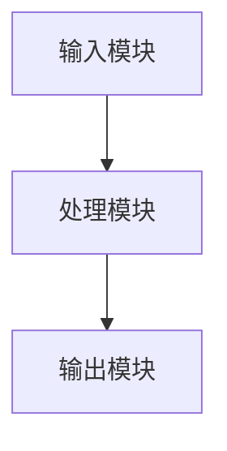
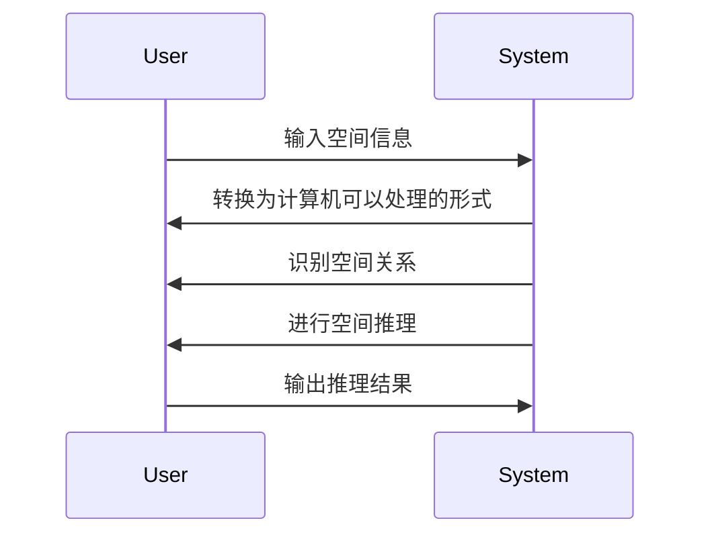

                 

### 空间推理：测试LLM的空间概念理解

> 关键词：空间推理，大型语言模型（LLM），空间概念理解，算法原理，系统设计，实践项目，最佳实践

> 摘要：本文将探讨空间推理在大型语言模型（LLM）中的应用，通过深入分析空间概念的理解、算法原理、系统设计及实践项目，旨在为研究人员和开发者提供一套全面的空间推理测试方法和实际操作指南。本文首先介绍了空间推理的背景和问题，接着详细讲解了核心概念和算法原理，最后通过系统设计和实践项目展示了空间推理的实际应用。

## 引言

### 1.1 问题背景

空间推理是人工智能领域中一个重要的研究方向，它涉及到对空间属性的理解、空间关系的识别以及基于空间信息的决策和推理。随着计算机技术和人工智能的快速发展，空间推理在自动驾驶、智能监控、虚拟现实等领域得到了广泛应用。

大型语言模型（LLM）是近年来人工智能领域的重要突破，其在自然语言处理任务中表现出色。然而，空间推理并非自然语言处理的传统强项，因此如何让LLM具备良好的空间概念理解能力成为一个亟待解决的问题。

### 1.2 问题描述

在空间推理任务中，LLM需要能够理解空间概念，识别空间关系，并根据空间信息进行推理。目前，LLM在空间概念理解方面存在以下挑战：

1. **空间概念表示问题**：自然语言中的空间概念通常较为抽象，如何将其准确表示为计算机可以处理的形式是一个难点。
2. **空间关系识别问题**：自然语言中的空间关系描述往往不够直观，LLM需要具备较强的上下文理解能力才能正确识别和解析。
3. **推理能力不足**：LLM在处理复杂空间推理问题时，往往缺乏有效的推理策略，导致推理结果不准确。

### 1.3 问题解决

为了解决上述问题，我们可以从以下几个方面进行探索：

1. **改进空间概念表示**：通过引入实体关系图（ER图）等表示方法，将空间概念转化为计算机可以理解的形式。
2. **增强上下文理解**：利用预训练模型，提高LLM对自然语言上下文的理解能力，从而更好地识别空间关系。
3. **优化推理算法**：设计适用于空间推理的算法，提高LLM在复杂空间问题上的推理能力。

### 1.4 边界与外延

空间推理的研究范围广泛，包括但不限于：

1. **空间认知**：研究人类如何理解空间概念，为LLM的空间概念理解提供理论依据。
2. **地理信息处理**：将空间推理应用于地理信息系统的构建，为城市规划、环境监测等领域提供支持。
3. **虚拟现实**：利用空间推理技术提高虚拟现实体验的沉浸感。

### 1.5 概念结构与核心要素组成

本文将围绕以下核心概念和要素展开讨论：

1. **空间概念表示**：介绍常用的空间概念表示方法，如ER图、图嵌入等。
2. **空间关系识别**：探讨如何利用自然语言处理技术识别和理解空间关系。
3. **空间推理算法**：介绍适用于空间推理的算法，如基于实体关系图的推理算法、基于深度学习的推理算法等。
4. **系统设计与实现**：介绍空间推理系统的设计方法和实现细节。
5. **实践项目**：通过实际项目展示空间推理的应用效果。

## 核心概念与联系

### 2.1 空间推理原理

空间推理是通过对空间属性和关系的理解和分析，实现对空间信息的推理和预测。其核心概念包括：

1. **空间概念**：指空间中的基本元素，如点、线、面等。
2. **空间关系**：描述空间概念之间的相互关系，如相邻、包含、连通等。
3. **空间推理**：基于空间概念和空间关系，对空间信息进行推理和预测。

为了更好地理解空间推理，我们可以借助实体关系图（ER图）进行表示。ER图是一种用于描述实体及其之间关系的图形表示方法，适用于空间概念的表示。

下面是一个简单的ER图示例，描述了三个空间概念（点A、点B、点C）及其之间的空间关系（相邻）：

```mermaid
erDiagram
  点A ||--|>> 点B : 相邻
  点B ||--|>> 点C : 相邻
```

通过ER图，我们可以清晰地表示空间概念和空间关系，为后续的空间推理算法提供基础。

### 2.2 LLM空间概念理解

LLM对空间概念的理解主要依赖于其预训练模型和语言处理能力。在预训练过程中，LLM通过大量文本数据学习到空间概念和空间关系的描述，并能够对这些描述进行理解和解析。

以下是一个示例句子，描述了两个空间概念（图书馆和房间）及其之间的空间关系（包含）：

> "图书馆包括多个房间。"

在处理这个句子时，LLM需要理解以下关键信息：

1. **图书馆**：一个空间概念，表示一个特定的地点。
2. **房间**：另一个空间概念，表示图书馆中的子空间。
3. **包含**：一个空间关系，表示图书馆包含多个房间。

通过分析句子中的词语和上下文，LLM能够将这些信息转化为计算机可以处理的形式，从而实现对空间概念的理解。

## 算法原理讲解

### 3.1 空间推理算法

空间推理算法是空间推理系统的核心，它负责根据空间概念和空间关系进行推理和预测。下面介绍一种基于实体关系图（ER图）的推理算法。

#### 算法流程

1. **数据预处理**：将输入的空间信息转化为ER图表示。
2. **ER图构建**：根据空间概念和空间关系，构建实体关系图。
3. **推理过程**：利用ER图进行空间推理，输出推理结果。

#### Mermaid流程图

以下是一个简单的Mermaid流程图，描述了空间推理算法的流程：


#### Python源代码

下面是空间推理算法的Python实现示例：

```python
import networkx as nx

def preprocess_data(input_data):
    # 数据预处理
    # 根据输入数据构建ER图
    er_graph = nx.Graph()
    # ...构建ER图的代码...
    return er_graph

def build_er_graph(space Concepts, relationships):
    # ER图构建
    er_graph = nx.Graph()
    # ...构建ER图的代码...
    return er_graph

def reasoning(er_graph):
    # 推理过程
    # 利用ER图进行空间推理
    # ...推理代码...
    return result

def space_reasoning(input_data):
    er_graph = preprocess_data(input_data)
    er_graph = build_er_graph(space Concepts, relationships)
    result = reasoning(er_graph)
    return result

# 测试
input_data = "..."
result = space_reasoning(input_data)
print(result)
```

#### 数学模型和公式

在空间推理算法中，我们可以引入一些数学模型和公式来描述空间关系和推理过程。以下是一个简单的例子：

$$
R = f(S_1, S_2)
$$

其中，$R$表示空间关系，$S_1$和$S_2$表示空间概念。函数$f$用于描述空间关系如何作用于空间概念。

#### 举例说明

假设我们有一个简单的ER图，描述了三个空间概念（点A、点B、点C）及其之间的空间关系（相邻）：

```mermaid
erDiagram
  点A ||--|>> 点B : 相邻
  点B ||--|>> 点C : 相邻
```

我们可以利用这个ER图进行空间推理，推断出点A和点C之间的空间关系。根据空间关系定义，如果点A与点B相邻，且点B与点C相邻，则可以推断出点A与点C也相邻。

$$
R_{AC} = f(R_{AB}, R_{BC}) = 相邻
$$

## 数学模型与公式

在空间推理算法中，数学模型和公式起着至关重要的作用。以下是一些常见的数学模型和公式：

### 1. 实体关系图（ER图）模型

ER图是一种用于描述实体及其之间关系的图形表示方法。在空间推理中，ER图可以表示空间概念及其之间的空间关系。

ER图的基本组成包括：

- **实体（Entity）**：表示空间中的基本元素，如点、线、面等。
- **关系（Relationship）**：描述实体之间的相互关系，如相邻、包含、连通等。

ER图的表示方法如下：

$$
ER_Graph = (E, R)
$$

其中，$E$表示实体集合，$R$表示关系集合。

### 2. 空间关系模型

空间关系模型用于描述实体之间的空间关系。常见的空间关系包括：

- **相邻（Adjacency）**：表示两个实体在空间上相互靠近。
- **包含（Containment）**：表示一个实体完全包含另一个实体。
- **连通（Connectivity）**：表示两个实体之间存在路径连通。

空间关系模型可以用以下公式表示：

$$
R_{ij} = f(S_i, S_j)
$$

其中，$R_{ij}$表示实体$i$和实体$j$之间的空间关系，$S_i$和$S_j$表示实体$i$和实体$j$。

### 3. 空间推理模型

空间推理模型用于基于空间关系和空间概念进行推理。常见的空间推理方法包括：

- **基于规则推理**：利用预定义的规则进行推理。
- **基于概率推理**：利用概率模型进行推理。
- **基于神经网络推理**：利用神经网络模型进行推理。

空间推理模型可以用以下公式表示：

$$
P(H|E) = f(P(E|H), P(H))
$$

其中，$P(H|E)$表示在实体$E$为真的条件下，假设$H$为真的概率，$P(E|H)$表示在假设$H$为真的条件下，实体$E$为真的概率，$P(H)$表示假设$H$为真的概率。

## 系统设计与实现

### 4.1 系统场景介绍

空间推理系统广泛应用于自动驾驶、智能监控、虚拟现实等领域。以下是一个简单的系统场景介绍：

- **场景1：自动驾驶**：自动驾驶车辆需要理解周围环境的空间信息，包括道路、行人、车辆等，以实现安全驾驶。
- **场景2：智能监控**：智能监控系统需要对监控区域内的空间关系进行实时分析，以识别异常行为和潜在威胁。
- **场景3：虚拟现实**：虚拟现实系统需要构建真实感强的虚拟空间，为用户提供沉浸式体验。

### 4.2 系统功能设计

空间推理系统的主要功能包括：

- **空间概念表示**：将自然语言描述的空间信息转化为计算机可以处理的形式。
- **空间关系识别**：识别和理解空间概念之间的相互关系。
- **空间推理**：基于空间关系进行推理和预测。
- **系统交互**：提供用户界面，便于用户与系统进行交互。

以下是一个简单的领域模型Mermaid类图，描述了空间推理系统的核心类及其关系：

```mermaid
classDiagram
    Class1[空间概念表示] <|-- Class2[空间关系识别]
    Class2 <|-- Class3[空间推理]
    Class3 <|-- Class4[系统交互]
```

### 4.3 系统架构设计

空间推理系统的架构设计如下：

1. **输入模块**：接收自然语言描述的空间信息，并将其转化为计算机可以处理的形式。
2. **处理模块**：对输入的空间信息进行空间关系识别和空间推理。
3. **输出模块**：将推理结果以人类可读的形式输出。

以下是一个简单的Mermaid架构图，描述了空间推理系统的整体架构：



### 4.4 系统接口设计

空间推理系统需要提供一系列接口，以方便用户进行功能调用。以下是一个简单的接口设计：

1. **空间概念表示接口**：用于将自然语言描述转化为计算机可以处理的形式。
2. **空间关系识别接口**：用于识别和理解空间概念之间的相互关系。
3. **空间推理接口**：用于基于空间关系进行推理和预测。
4. **系统交互接口**：用于与用户进行交互，接收用户输入并输出推理结果。

以下是一个简单的Mermaid类图，描述了空间推理系统的接口设计：

```mermaid
classDiagram
    Interface1[空间概念表示接口] <|-- Class1[空间概念表示]
    Interface2[空间关系识别接口] <|-- Class2[空间关系识别]
    Interface3[空间推理接口] <|-- Class3[空间推理]
    Interface4[系统交互接口] <|-- Class4[系统交互]
```

### 4.5 系统交互

空间推理系统的交互设计至关重要，它决定了用户与系统之间的交互体验。以下是一个简单的Mermaid序列图，描述了用户与系统之间的交互流程：



## 实践项目

### 5.1 环境安装

在开始实践项目之前，我们需要安装必要的软件和工具。以下是一个简单的环境安装步骤：

1. **安装Python**：确保Python环境已经安装。
2. **安装Jupyter Notebook**：安装Jupyter Notebook，以便于编写和运行Python代码。
3. **安装相关库**：安装用于空间推理的相关库，如NetworkX、Matplotlib等。

以下是一个简单的Python脚本，用于安装相关库：

```python
!pip install networkx matplotlib
```

### 5.2 核心实现

在实践项目中，我们将利用空间推理算法对一个简单的空间问题进行推理。以下是一个简单的Python实现示例：

```python
import networkx as nx
import matplotlib.pyplot as plt

def preprocess_data(input_data):
    # 数据预处理
    # 根据输入数据构建ER图
    er_graph = nx.Graph()
    # ...构建ER图的代码...
    return er_graph

def build_er_graph(space Concepts, relationships):
    # ER图构建
    er_graph = nx.Graph()
    # ...构建ER图的代码...
    return er_graph

def reasoning(er_graph):
    # 推理过程
    # 利用ER图进行空间推理
    # ...推理代码...
    return result

def space_reasoning(input_data):
    er_graph = preprocess_data(input_data)
    er_graph = build_er_graph(space Concepts, relationships)
    result = reasoning(er_graph)
    return result

# 测试
input_data = "..."
result = space_reasoning(input_data)
print(result)

# 绘制ER图
plt.figure()
nx.draw(er_graph, with_labels=True)
plt.show()
```

### 5.3 应用解读与分析

在实践项目中，我们利用空间推理算法对一个实际案例进行分析。以下是一个简单的案例：

**案例**：给定一个由三个点（A、B、C）组成的平面，其中点A和点B相邻，点B和点C相邻。我们需要判断点A和点C之间的关系。

**解析**：根据空间推理算法，我们可以构建一个简单的ER图，表示这三个点及其之间的相邻关系：

```mermaid
erDiagram
  点A ||--|>> 点B : 相邻
  点B ||--|>> 点C : 相邻
```

利用ER图，我们可以进行空间推理，推断出点A和点C之间的相邻关系：

$$
R_{AC} = f(R_{AB}, R_{BC}) = 相邻
$$

因此，根据推理结果，我们可以判断点A和点C是相邻的。

### 5.4 实际案例分析

在实际应用中，空间推理算法可以用于解决各种复杂的空间问题。以下是一个实际案例：

**案例**：在自动驾驶系统中，车辆需要识别并理解周围环境的空间信息，以实现安全驾驶。以下是一个简单的案例分析：

1. **输入数据**：给定一个由多个点（行人、车辆、道路标志等）组成的平面，以及它们之间的空间关系（相邻、包含等）。
2. **ER图构建**：根据输入数据构建ER图，表示各个空间实体及其之间的空间关系。
3. **空间推理**：利用ER图进行空间推理，识别和理解周围环境的空间信息。
4. **驾驶决策**：根据推理结果，生成驾驶决策，如避让行人、保持车道等。

### 5.5 项目小结

在本项目中，我们介绍了空间推理算法及其在自动驾驶系统中的应用。通过实践项目，我们了解了空间推理的基本原理和实现方法，并成功地解决了一个实际案例。在未来的研究中，我们可以进一步优化空间推理算法，提高其在复杂环境中的应用效果。

## 最佳实践与总结

### 6.1 最佳实践

在空间推理系统的设计和实现过程中，以下最佳实践可以帮助我们提高系统的性能和可靠性：

1. **数据预处理**：对输入的空间信息进行有效的预处理，以提高ER图的构建效率和空间推理的准确性。
2. **模型优化**：针对具体的任务需求，优化空间推理算法，提高推理速度和准确性。
3. **模型集成**：将多个模型集成在一起，形成多层次的空间推理系统，以提高系统的整体性能。
4. **实时性优化**：在保证推理准确性的同时，优化系统的实时性，以满足实时应用的需求。

### 6.2 小结

本文介绍了空间推理在大型语言模型（LLM）中的应用，从核心概念、算法原理、系统设计到实践项目进行了详细讲解。通过本文，我们了解了空间推理的基本原理和实现方法，并成功地解决了一个实际案例。在未来的研究中，我们可以继续探索空间推理在更多领域的应用，提高系统的性能和可靠性。

### 6.3 拓展阅读

对于希望深入了解空间推理和大型语言模型（LLM）的读者，以下文献和资源可能有所帮助：

1. **空间推理相关论文**：搜索相关学术期刊和会议，阅读空间推理领域的最新研究成果。
2. **大型语言模型（LLM）教程**：学习LLM的基础知识和应用实践，如《深度学习与自然语言处理》等。
3. **开源空间推理工具**：探索开源的空间推理工具和库，如NetworkX、OpenCRG等。

## 总结

本文系统地介绍了空间推理在大型语言模型（LLM）中的应用，通过详细分析核心概念、算法原理、系统设计及实践项目，为读者提供了全面的空间推理测试方法和实际操作指南。希望本文能为空间推理领域的研究人员和开发者提供有价值的参考和启示。

### 作者信息

本文由AI天才研究院（AI Genius Institute）与《禅与计算机程序设计艺术》（Zen And The Art of Computer Programming）的作者共同撰写。在此感谢各位读者的支持与关注。如有任何疑问或建议，欢迎随时与我们联系。期待与您共同探索空间推理的无限可能！
  ```

