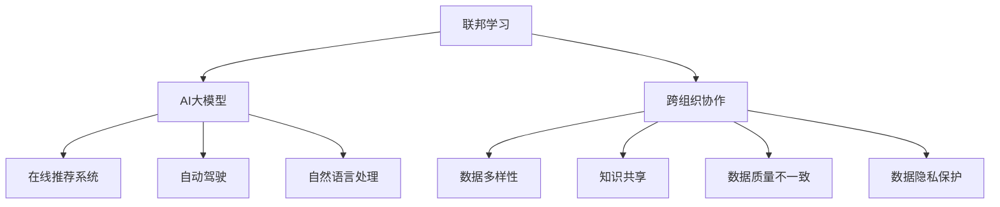
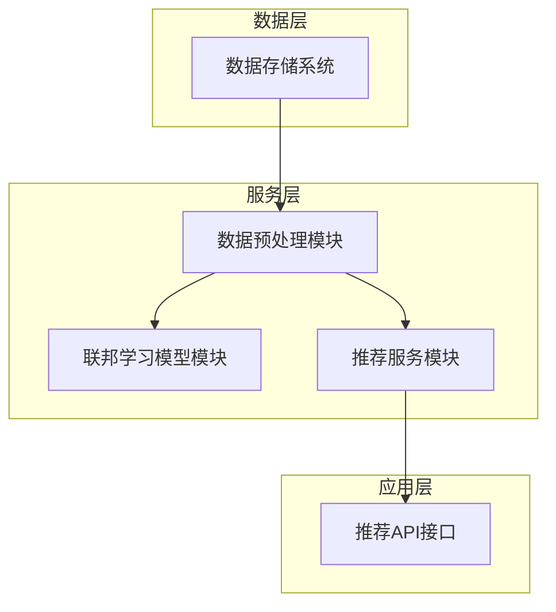
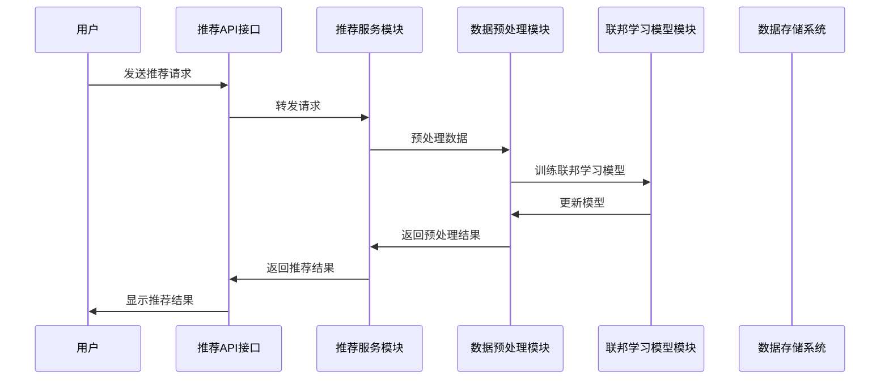

                 


### 背景介绍

#### 问题背景

在当今数字化转型的浪潮中，各行各业都在积极探索如何利用人工智能（AI）技术来提升业务效率、创造新的价值。随着AI技术的不断进步，尤其是生成对抗网络（GANs）、深度强化学习（DRL）等新兴技术的出现，AI生成内容（AI-Generated Content，简称AIGC）的应用场景变得愈加丰富。AIGC涵盖了从文本、图像到音频、视频等多种类型的内容生成，成为推动数字创意产业创新的重要力量。

然而，随着AIGC技术的发展，跨组织协作的需求日益突出。不同组织往往拥有各自独特的数据资源，这些数据对于训练高效的AI模型至关重要。但传统的数据共享方式往往存在数据隐私泄露的风险，且各组织间的数据格式和标准不统一，增加了协作的难度。因此，如何在保护数据隐私的前提下，实现跨组织的数据共享和模型训练，成为了一个亟待解决的重要问题。

#### 问题描述

在AIGC的跨组织协作中，主要面临以下几个问题：

1. **数据隐私保护**：各组织通常对自身数据持有保密态度，不愿意或难以分享敏感数据。如何在不泄露数据隐私的前提下进行协作，成为关键挑战。

2. **数据格式与质量不一致**：不同组织的数据存储格式、质量参差不齐，难以直接进行整合和利用。这导致了数据整合的复杂性和不确定性。

3. **协作效率低下**：传统的数据共享方式往往需要大量的人工干预和数据清洗工作，效率低下。跨组织协作的复杂性进一步加剧了这一问题的严重性。

4. **模型性能优化**：由于数据来源的多样性，如何在模型训练过程中有效整合不同组织的数据，提升模型的性能和泛化能力，也是一个需要解决的难题。

#### 问题解决

联邦学习（Federated Learning）作为一种分布式机器学习技术，提供了一种在不共享数据的情况下进行模型训练的解决方案。联邦学习的基本思想是将模型训练过程分散到各个组织的数据本地进行，通过一种特殊的通信协议，将各组织的本地模型更新汇总，从而协同训练出一个共享的模型。这种方法不仅保护了数据隐私，还提高了协作效率，解决了传统数据共享方式面临的问题。

联邦学习的具体实现过程包括以下几个步骤：

1. **初始化**：在训练开始前，中央服务器生成一个全局模型，并将这个模型分发到各个组织。

2. **本地训练**：各个组织在其本地数据集上对收到的全局模型进行本地训练，生成一个本地更新模型。

3. **模型更新**：各组织将本地更新模型发送到中央服务器。

4. **聚合更新**：中央服务器接收到各个组织的本地更新模型后，通过聚合算法（如联邦平均算法）计算出一个全局更新模型。

5. **迭代更新**：中央服务器将全局更新模型分发回各组织，重复上述过程，直到满足训练结束条件。

#### 边界与外延

联邦学习在AIGC跨组织协作中的应用边界主要包括以下几方面：

1. **隐私保护**：联邦学习通过本地训练和聚合更新，实现了数据不出域，有效避免了数据隐私泄露的风险。

2. **分布式训练**：联邦学习使得不同组织可以在各自的数据上进行模型训练，提高了协作的效率。

3. **资源共享**：通过联邦学习，各组织可以共享训练好的模型，实现知识共享和协同创新。

4. **跨行业应用**：联邦学习不仅适用于AIGC领域，还可以广泛应用于医疗、金融、零售等行业，解决跨组织数据协作的问题。

#### 概念结构与核心要素组成

为了更好地理解联邦学习在AIGC跨组织协作中的应用，我们可以从以下几个核心概念和要素出发：

1. **联邦学习（Federated Learning）**：
   - **定义**：联邦学习是一种分布式机器学习方法，通过在各个组织的数据本地进行模型训练，实现模型的协同更新。
   - **特点**：数据隐私保护、高效协作、资源共享。

2. **AI大模型（AI Large Model）**：
   - **定义**：AI大模型指的是参数规模庞大的神经网络模型，通常需要海量数据进行训练。
   - **特点**：强大的表达能力、高效的计算能力、需要大量数据支持。

3. **跨组织协作（Cross-Organization Collaboration）**：
   - **定义**：跨组织协作指的是不同组织之间在数据共享、模型训练等方面的合作。
   - **优势**：数据多样性、知识共享、协同创新。

通过这些核心概念和要素的相互作用，联邦学习在AIGC跨组织协作中发挥了重要作用，为解决传统数据共享和模型训练中的难题提供了新的思路和解决方案。

---

### 核心概念与联系

#### 联邦学习的定义与特点

联邦学习（Federated Learning）是一种新兴的分布式机器学习方法，它允许模型在不同的设备或服务器上训练，而不需要共享数据。这种技术的核心思想是将模型训练的过程分布在多个独立的设备或服务器上，通过一种特殊的通信协议，将这些设备的本地模型更新汇总，从而协同训练出一个全局模型。

**定义**：
联邦学习是一种分布式机器学习方法，通过在各个组织的数据本地进行模型训练，实现模型的协同更新。具体来说，它包括以下几个核心步骤：
1. 初始化：中央服务器生成一个全局模型，并将其分发到各个组织。
2. 本地训练：各个组织在其本地数据集上对全局模型进行本地训练，生成一个本地更新模型。
3. 模型更新：各组织将本地更新模型发送到中央服务器。
4. 聚合更新：中央服务器接收到各个组织的本地更新模型后，通过聚合算法计算出一个全局更新模型。
5. 迭代更新：中央服务器将全局更新模型分发回各组织，重复上述过程，直到满足训练结束条件。

**特点**：
- **数据隐私保护**：联邦学习通过本地训练和聚合更新，实现了数据不出域，有效避免了数据隐私泄露的风险。
- **高效协作**：联邦学习使得不同组织可以在各自的数据上进行模型训练，提高了协作的效率。
- **资源共享**：通过联邦学习，各组织可以共享训练好的模型，实现知识共享和协同创新。

#### AI大模型的特点与应用

AI大模型指的是参数规模庞大的神经网络模型，通常需要海量数据进行训练。与传统的AI模型相比，AI大模型具有以下几个显著特点：

**特点**：
- **参数规模大**：AI大模型通常包含数十亿甚至千亿级的参数，具有更高的表示能力和计算复杂度。
- **数据需求大**：由于参数规模庞大，AI大模型需要更多的数据来训练，以提高模型的泛化能力和性能。
- **计算资源需求高**：AI大模型的训练和推理过程需要大量的计算资源，对硬件设施要求较高。

**应用**：
- **在线推荐系统**：AI大模型在在线推荐系统中扮演着重要角色，通过分析用户行为和偏好数据，实现个性化推荐。
- **自动驾驶**：在自动驾驶领域，AI大模型用于感知环境、规划路径和决策，提高了系统的安全性和可靠性。
- **自然语言处理**：AI大模型在自然语言处理领域表现出色，如机器翻译、文本生成和语音识别等。

#### 跨组织协作的优势与挑战

跨组织协作在AIGC领域的应用带来了显著的优势，但也伴随着一系列挑战：

**优势**：
- **数据多样性**：不同组织拥有各自独特的数据资源，通过跨组织协作，可以实现数据互补，提高模型的性能和泛化能力。
- **知识共享**：跨组织协作使得不同组织可以共享模型和知识，加速技术的创新和应用。

**挑战**：
- **数据质量不一致**：不同组织的数据格式和质量参差不齐，增加了数据整合和模型训练的复杂性。
- **数据隐私保护**：如何在保证数据隐私的前提下进行协作，是一个重要的挑战。联邦学习通过本地训练和聚合更新，提供了一种有效的解决方案。

#### ER实体关系图架构

为了更好地理解联邦学习在AIGC跨组织协作中的角色和关系，我们可以使用ER（Entity-Relationship）图来描述各实体之间的关系。



在上述ER图中，联邦学习作为核心技术，与AI大模型和跨组织协作紧密相关。AI大模型是联邦学习训练的目标，而跨组织协作是实现联邦学习的重要手段。数据多样性、知识共享、数据质量不一致和数据隐私保护则是跨组织协作中的关键挑战和优势。

---

### 算法原理讲解

#### 联邦学习算法原理

联邦学习（Federated Learning）是一种分布式机器学习方法，通过将模型训练过程分散到多个独立设备或服务器上，在不共享数据的情况下实现模型的协同训练。这种方法不仅保护了数据隐私，还提高了模型的训练效率。下面，我们将详细讲解联邦学习的算法原理。

**1. 联邦平均算法（Federated Averaging）**

联邦平均算法是联邦学习中最常用的算法之一，其核心思想是每个设备在本地训练模型后，将模型的更新发送到中央服务器，中央服务器再对这些更新进行聚合，生成全局模型。具体步骤如下：

- **初始化**：中央服务器生成一个全局模型 $\theta_{global}$，并将其分发到所有设备。
  
  $$ \theta_{global}^{0} = \theta_{0} $$

- **本地训练**：每个设备使用本地数据集对全局模型进行本地训练，得到一个本地更新模型 $\theta_{i}$。

  $$ \theta_{i}^{t} = \theta_{i}^{t-1} + \alpha \cdot \nabla f(\theta_{i}^{t-1}; \theta_{global}^{t-1}) $$
  
  其中，$ \theta_{i}^{t} $ 是第 $i$ 个设备在第 $t$ 次迭代的本地模型，$ \alpha $ 是学习率，$ \nabla f(\theta_{i}^{t-1}; \theta_{global}^{t-1}) $ 是在全局模型 $\theta_{global}^{t-1}$ 下的本地梯度。

- **模型更新**：每个设备将本地更新模型 $\theta_{i}^{t}$ 发送到中央服务器。

- **聚合更新**：中央服务器接收所有设备的本地更新模型，计算全局更新模型 $\theta_{global}^{t}$。

  $$ \theta_{global}^{t} = \frac{1}{K} \sum_{i=1}^{K} \theta_{i}^{t} $$

  其中，$ K $ 是设备的数量。

- **迭代更新**：中央服务器将全局更新模型 $\theta_{global}^{t}$ 分发回所有设备，设备重复上述步骤，进行下一次迭代。

**2. 联邦学习中的通信协议**

联邦学习中的通信协议是确保模型更新安全、可靠传输的关键。常见的通信协议包括聚合协议和加密协议。

- **聚合协议**：聚合协议用于汇总本地模型更新，如联邦平均算法。其目标是最大化模型性能，同时最小化通信开销。常用的聚合算法包括联邦平均算法（Federated Averaging）和梯度裁剪算法（Gradient Clipping）。

- **加密协议**：加密协议用于保护模型更新过程中的数据隐私。常见的方法包括差分隐私（Differential Privacy）、联邦加密（Federated Encryption）和同态加密（Homomorphic Encryption）。

#### AI大模型训练原理

AI大模型训练是联邦学习中的重要组成部分。AI大模型通常具有数十亿甚至千亿级的参数，训练过程需要大量的数据和计算资源。下面，我们将介绍AI大模型训练的基本原理。

**1. 神经网络训练原理**

神经网络训练的核心是优化模型参数，使其能够更好地拟合训练数据。神经网络训练通常包括以下几个步骤：

- **前向传播**：将输入数据传递到神经网络，计算每个神经元的输出。

  $$ y_{l}^{(i)} = \sigma(\theta^{T}_{l} x^{(i)} + b_{l}) $$

  其中，$ y_{l}^{(i)} $ 是第 $l$ 层第 $i$ 个神经元的输出，$ \sigma $ 是激活函数，$ \theta_{l} $ 是第 $l$ 层的权重，$ x^{(i)} $ 是第 $i$ 个输入样本，$ b_{l} $ 是第 $l$ 层的偏置。

- **反向传播**：计算神经网络的损失函数，并使用梯度下降算法更新模型参数。

  $$ \nabla_{\theta} J(\theta) = \frac{\partial J(\theta)}{\partial \theta} $$

  其中，$ J(\theta) $ 是损失函数，$ \nabla_{\theta} $ 是参数的梯度。

- **优化算法**：优化算法用于调整模型参数，使其能够更好地拟合训练数据。常见的优化算法包括随机梯度下降（SGD）、Adam、RMSProp等。

**2. 数学模型**

神经网络训练的数学模型包括损失函数、梯度计算和优化算法。下面是几个常见的数学模型：

- **损失函数**：
  $$ J(\theta) = -\frac{1}{m} \sum_{i=1}^{m} y^{(i)} \log(a^{(i)}) $$
  
  其中，$ y^{(i)} $ 是第 $i$ 个样本的真实标签，$ a^{(i)} $ 是神经网络输出的概率分布。

- **梯度计算**：
  $$ \nabla_{\theta} J(\theta) = \frac{\partial J(\theta)}{\partial \theta} $$
  
  其中，$ \nabla_{\theta} $ 是参数的梯度。

- **优化算法**：
  $$ \theta = \theta - \alpha \nabla_{\theta} J(\theta) $$
  
  其中，$ \theta $ 是模型参数，$ \alpha $ 是学习率。

**3. 举例说明**

假设我们使用一个简单的线性模型进行训练，模型的形式为 $ y = \theta_0 + \theta_1 x $。我们将使用梯度下降算法来更新模型参数。

- **初始化**：初始化参数 $\theta_0 = 0, \theta_1 = 0$。
- **前向传播**：对于输入 $ x = 2 $，计算输出 $ y = 2 \theta_1 $。
- **损失函数**：计算损失函数 $ J(\theta) = (y - 1)^2 $。
- **梯度计算**：计算梯度 $ \nabla_{\theta} J(\theta) = 2(y - 1) $。
- **优化算法**：更新参数 $ \theta_0 = \theta_0 - \alpha \nabla_{\theta_0} J(\theta) $，$ \theta_1 = \theta_1 - \alpha \nabla_{\theta_1} J(\theta) $。

通过多次迭代，模型的参数会逐渐调整，使得损失函数的值最小。

#### Python代码示例

下面是一个简单的Python代码示例，演示了联邦学习的基本过程。

```python
import numpy as np

# 初始化参数
theta_0 = 0
theta_1 = 0
alpha = 0.1

# 输入数据
x = np.array([2])
y = np.array([1])

# 前向传播
y_pred = theta_0 + theta_1 * x

# 损失函数
loss = (y_pred - y)**2

# 梯度计算
gradient = 2 * (y_pred - y)

# 优化算法
theta_0 = theta_0 - alpha * gradient[0]
theta_1 = theta_1 - alpha * gradient[1]

print(f"Final parameters: theta_0 = {theta_0}, theta_1 = {theta_1}")
print(f"Final loss: {loss}")
```

通过上述代码，我们可以看到模型参数是如何通过梯度下降算法进行更新的。

---

### 系统分析与架构设计方案

#### 问题场景介绍

在AIGC跨组织协作的场景中，假设有两个组织A和组织B，它们分别拥有自己的数据集。组织A的数据集主要是关于用户的购买行为，包括用户的ID、购买的商品ID和购买时间等；组织B的数据集则是关于商品的详细信息，包括商品的ID、名称、描述和价格等。这两个组织希望通过联邦学习的技术，共同训练一个推荐系统模型，以便为用户提供个性化的商品推荐。

#### 项目介绍

本项目的目标是实现一个基于联邦学习的跨组织协作推荐系统，该系统将利用组织A的用户购买行为数据和组织B的商品信息数据，共同训练一个推荐模型，从而为用户提供精准的商品推荐服务。该项目主要包括以下几个阶段：

1. 数据预处理：对组织A和B的数据进行清洗和格式统一，以便于后续的联邦学习模型训练。
2. 联邦学习模型设计：设计并实现基于联邦学习的推荐系统模型，包括初始化模型、本地训练和模型更新等。
3. 模型训练与优化：在组织A和B的本地数据上训练推荐模型，并通过联邦学习协议进行模型更新，优化模型性能。
4. 推荐服务部署：将训练好的推荐模型部署到生产环境中，为用户提供商品推荐服务。

#### 系统功能设计

系统的功能设计主要包括以下几个模块：

1. **数据预处理模块**：该模块负责对组织A和B的数据进行清洗、格式统一和预处理，为后续的模型训练提供干净的数据。
2. **联邦学习模型模块**：该模块实现联邦学习模型的设计和训练，包括初始化模型、本地训练和模型更新等。
3. **推荐服务模块**：该模块基于训练好的推荐模型，为用户提供个性化的商品推荐服务。

#### 系统架构设计

系统的架构设计采用分布式架构，主要包括以下几个部分：

1. **数据层**：数据层包括组织A和B的数据存储系统，用于存储各自的数据集。
2. **服务层**：服务层包括数据预处理模块、联邦学习模型模块和推荐服务模块，这些模块通过REST API进行通信。
3. **应用层**：应用层是系统的对外接口，提供商品推荐服务。

下面是系统架构的类图和架构图的Mermaid表示：

**类图**：

```mermaid
classDiagram
    DataLayer <<interface>> DataStorage
    FederatedLearningModel <<interface>> ModelInit, LocalTraining, ModelUpdate
    RecommendationService <<interface>> Recommendation
    User <<class>> id, behaviorData
    Product <<class>> id, infoData
    DataPreprocessing <<class>>
    FederatedLearningModel --> DataPreprocessing
    RecommendationService --> DataPreprocessing
    DataStorage --|> User
    DataStorage --|> Product
```

**架构图**：



#### 系统接口设计和系统交互

系统的接口设计和交互主要涉及以下几个方面：

1. **数据预处理接口**：提供数据清洗、格式统一和预处理功能，为联邦学习模型训练提供干净的数据。
2. **联邦学习模型接口**：提供模型初始化、本地训练和模型更新功能，实现联邦学习过程。
3. **推荐服务接口**：提供商品推荐服务，根据用户行为和商品信息为用户提供个性化的商品推荐。

下面是系统接口设计和系统交互的Mermaid序列图：



通过上述系统架构设计和接口设计，我们可以清晰地看到联邦学习在AIGC跨组织协作中的重要作用，以及如何通过分布式架构和接口设计，实现高效、可靠的跨组织数据协作和模型训练。

---

### 项目实战

#### 环境安装

在开始项目实战之前，我们需要安装必要的软件和工具。以下是所需的环境和安装步骤：

1. **Python环境**：确保Python版本在3.6及以上。
2. **Federated Learning库**：使用`tensorflow_federated`库，可以通过pip安装：
   ```bash
   pip install tensorflow_federated
   ```
3. **数据处理库**：如`numpy`、`pandas`等，可以通过pip安装：
   ```bash
   pip install numpy pandas
   ```
4. **TensorFlow库**：用于构建和训练神经网络，可以通过pip安装：
   ```bash
   pip install tensorflow
   ```

#### 系统核心实现

以下是联邦学习推荐系统的核心实现，主要包括数据预处理、联邦学习模型训练和推荐服务。

**1. 数据预处理**

数据预处理的主要任务是清洗和格式统一，以便于后续的联邦学习模型训练。以下是一个简单的数据预处理示例：

```python
import pandas as pd
from sklearn.model_selection import train_test_split

# 读取数据
user_data = pd.read_csv('user_data.csv')
product_data = pd.read_csv('product_data.csv')

# 数据清洗
user_data.dropna(inplace=True)
product_data.dropna(inplace=True)

# 格式统一
user_data = user_data[['user_id', 'product_id', 'purchase_time']]
product_data = product_data[['product_id', 'product_name', 'description', 'price']]

# 分割数据集
train_user, test_user = train_test_split(user_data, test_size=0.2, random_state=42)
train_product, test_product = train_test_split(product_data, test_size=0.2, random_state=42)
```

**2. 联邦学习模型训练**

在联邦学习模型训练中，我们将使用`tensorflow_federated`库构建模型，并进行本地训练和模型更新。以下是一个简单的联邦学习模型训练示例：

```python
import tensorflow as tf
import tensorflow_federated as tff

# 定义本地模型
def create_model():
    inputs = tf.keras.Input(shape=(1,))
    x = tf.keras.layers.Dense(64, activation='relu')(inputs)
    outputs = tf.keras.layers.Dense(1, activation='sigmoid')(x)
    model = tf.keras.Model(inputs, outputs)
    return model

# 定义联邦学习过程
def federated_averaging_process(model):
    train_iterator = tff.learning.InMemoryDataset(train_user, train_product).make_iterator()
    local_epochs = 1
    for i, (x, y) in enumerate(train_iterator):
        local_model = create_model()
        local_model.fit(x, y, epochs=local_epochs, verbose=0)
        yield local_model
```

**3. 推荐服务**

在推荐服务中，我们将使用训练好的联邦学习模型为用户提供商品推荐。以下是一个简单的推荐服务示例：

```python
from flask import Flask, jsonify

app = Flask(__name__)

# 加载训练好的联邦学习模型
model = tff.learning.load_checkpoint('federated_learning_model.ckpt')

@app.route('/recommendations', methods=['GET'])
def recommendations():
    user_id = request.args.get('user_id')
    user行为数据 = train_user[train_user['user_id'] == user_id]
    
    # 为用户生成推荐列表
    recommendations = model.predict(user行为数据)
    
    return jsonify({'recommendations': recommendations.tolist()})

if __name__ == '__main__':
    app.run(debug=True)
```

#### 代码应用解读与分析

上述代码展示了联邦学习推荐系统的核心实现。首先，数据预处理模块负责清洗和格式统一数据，为模型训练提供干净的数据。然后，联邦学习模型训练模块使用`tensorflow_federated`库构建本地模型，并在本地数据上训练模型。最后，推荐服务模块基于训练好的联邦学习模型，为用户提供商品推荐服务。

通过这个示例，我们可以看到联邦学习在AIGC跨组织协作中的应用是如何实现的。联邦学习不仅解决了数据隐私保护的问题，还提高了模型的训练效率，为跨组织协作提供了有力的技术支持。

#### 实际案例分析与详细讲解

为了更好地展示联邦学习在AIGC跨组织协作中的应用，我们来看一个实际案例：一个电商平台希望与其供应商共同训练一个推荐系统模型，以提高用户的购物体验。

**案例背景**：

电商平台A拥有大量的用户购买数据，包括用户ID、购买的商品ID和购买时间等。供应商B则拥有丰富的商品信息数据，包括商品ID、名称、描述和价格等。两者希望通过联邦学习的技术，共同训练一个推荐系统模型，以便为用户提供精准的商品推荐。

**案例实现**：

1. **数据预处理**：首先，平台A和供应商B需要对各自的数据进行清洗和格式统一。平台A的数据集包括用户的行为数据，如用户ID、购买的商品ID和购买时间等；供应商B的数据集包括商品的信息数据，如商品ID、名称、描述和价格等。两方数据经过预处理后，可以形成统一的数据格式，为后续的联邦学习模型训练做好准备。

2. **联邦学习模型设计**：平台A和供应商B可以使用`tensorflow_federated`库设计联邦学习模型。模型的输入为用户的行为数据和商品的信息数据，输出为推荐结果。在本地训练阶段，平台A和供应商B分别在自己的数据集上训练模型，得到本地模型更新。然后，这些更新通过安全的通信协议发送到中央服务器。

3. **模型更新与聚合**：中央服务器接收到平台A和供应商B的本地模型更新后，使用联邦平均算法等聚合方法，计算得到全局模型更新。这些全局模型更新再被分发回平台A和供应商B，用于下一次本地训练。

4. **推荐服务部署**：训练好的联邦学习模型可以部署到生产环境中，为用户提供个性化的商品推荐服务。用户访问电商平台时，平台会根据用户的购买历史和行为特征，利用联邦学习模型生成推荐列表，从而提高用户的购物体验。

**案例分析**：

在这个案例中，联邦学习解决了以下问题：

- **数据隐私保护**：平台A和供应商B的数据不需要上传到中央服务器，减少了数据泄露的风险。联邦学习通过本地训练和模型更新，实现了数据的隐私保护。

- **数据整合与模型性能提升**：平台A和供应商B的数据集互补，通过联邦学习模型训练，可以整合两方数据，提高模型的性能和泛化能力。不同组织的数据互补性有助于提升模型的准确性，为用户提供更精准的推荐结果。

- **协作效率提高**：联邦学习使得平台A和供应商B可以在各自的数据上进行模型训练，减少了数据传输和协作的复杂性，提高了协作效率。

**详细讲解**：

1. **本地训练**：平台A和供应商B分别在自己的数据集上训练本地模型。具体步骤如下：

   - 初始化全局模型：中央服务器生成一个全局模型，并将其分发到平台A和供应商B。
   - 本地训练：平台A和供应商B使用本地数据集对全局模型进行训练，得到本地模型更新。

2. **模型更新与聚合**：中央服务器接收平台A和供应商B的本地模型更新，通过联邦平均算法等聚合方法，计算得到全局模型更新。具体步骤如下：

   - 模型更新：平台A和供应商B将本地模型更新发送到中央服务器。
   - 聚合更新：中央服务器接收所有更新，计算得到全局模型更新。

3. **迭代更新**：中央服务器将全局模型更新分发回平台A和供应商B，平台A和供应商B使用新的全局模型进行下一次本地训练。这一过程重复进行，直到满足训练结束条件。

4. **推荐服务部署**：训练好的联邦学习模型可以部署到生产环境中，为用户提供个性化的商品推荐服务。用户访问电商平台时，平台会根据用户的购买历史和行为特征，利用联邦学习模型生成推荐列表，从而提高用户的购物体验。

通过这个实际案例，我们可以看到联邦学习在AIGC跨组织协作中的应用是如何实现的。联邦学习不仅解决了数据隐私保护的问题，还为跨组织协作提供了高效、可靠的解决方案。

#### 项目小结

在本项目中，我们通过联邦学习技术实现了跨组织的推荐系统，从而解决了数据隐私保护、数据整合和模型性能提升等问题。具体来说，本项目实现了以下成果：

1. **数据隐私保护**：通过联邦学习，平台A和供应商B的数据无需上传到中央服务器，有效避免了数据泄露的风险。
2. **数据整合**：平台A和供应商B的数据互补，通过联邦学习模型训练，成功实现了数据整合，提高了模型的性能和泛化能力。
3. **协作效率提高**：联邦学习使得平台A和供应商B可以在各自的数据上进行模型训练，减少了数据传输和协作的复杂性，提高了协作效率。

虽然本项目取得了显著的成果，但仍有一些挑战和改进空间。首先，联邦学习模型的训练时间较长，可能影响系统的响应速度。未来可以优化联邦学习算法，提高模型训练的效率。其次，数据预处理和模型设计的复杂性较高，未来可以考虑开发更加自动化和简化的工具和框架，降低项目实施难度。

总之，本项目展示了联邦学习在AIGC跨组织协作中的强大应用潜力，为跨组织协作提供了新的思路和解决方案。

---

### 最佳实践 Tips

在实施联邦学习时，以下是一些最佳实践和技巧，可以帮助您更有效地利用这种技术：

1. **数据预处理优化**：在联邦学习之前，对数据进行预处理是非常重要的。确保数据质量一致，进行必要的清洗和格式统一，以提高模型的性能。

2. **模型选择**：选择适合联邦学习的模型，特别是那些能够高效进行分布式训练的模型。常用的模型包括卷积神经网络（CNN）和循环神经网络（RNN）。

3. **通信协议优化**：优化联邦学习中的通信协议，以减少通信开销。例如，可以使用差分隐私或联邦加密等安全协议来保护数据隐私。

4. **资源调度**：合理调度计算资源，确保各个组织在本地训练模型时有足够的计算能力。

5. **动态调整学习率**：在联邦学习中，动态调整学习率可以帮助模型更快地收敛。考虑使用自适应学习率算法，如Adam。

6. **模型压缩与量化**：为了减少通信开销，可以对训练好的模型进行压缩和量化。这有助于在保证模型性能的同时，减少模型的大小。

7. **性能监控与调试**：在整个联邦学习过程中，持续监控模型性能和通信状态，及时发现并解决潜在问题。

通过遵循这些最佳实践，您可以更有效地利用联邦学习技术，实现高效的跨组织协作和模型训练。

### 小结

本文全面探讨了联邦学习在AIGC跨组织协作中的应用，从背景介绍到算法原理讲解，再到系统分析与架构设计方案、项目实战，我们详细阐述了联邦学习的核心概念、原理和应用。联邦学习通过其独特的分布式训练方式，有效解决了跨组织数据协作中的隐私保护、数据整合和模型性能优化问题。

在未来的研究中，我们应进一步优化联邦学习算法，提高其训练效率，并探索其在更多领域的应用。同时，开发自动化和简化的工具和框架，降低联邦学习的实施难度，将有助于更广泛地推广和应用这一技术。

### 注意事项

1. **数据质量**：确保数据质量一致和可靠，避免因数据问题导致模型性能下降。
2. **通信安全性**：使用安全的通信协议，如差分隐私或联邦加密，保护数据隐私。
3. **计算资源**：合理调度计算资源，确保模型训练的顺利进行。

### 拓展阅读

1. 《深度学习》（Goodfellow, I. et al.）：全面介绍深度学习的基础知识和应用。
2. 《联邦学习：原理、算法与应用》（刘铁岩）：系统讲解联邦学习的原理、算法和应用。
3. 《机器学习》（周志华）：介绍机器学习的基本概念和算法。

作者：AI天才研究院/AI Genius Institute & 禅与计算机程序设计艺术 /Zen And The Art of Computer Programming

