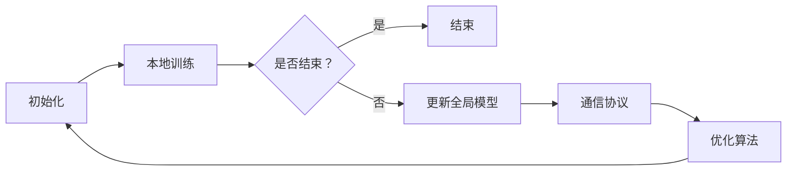
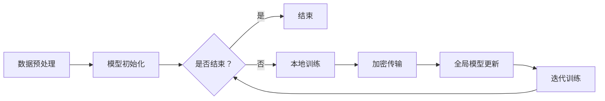
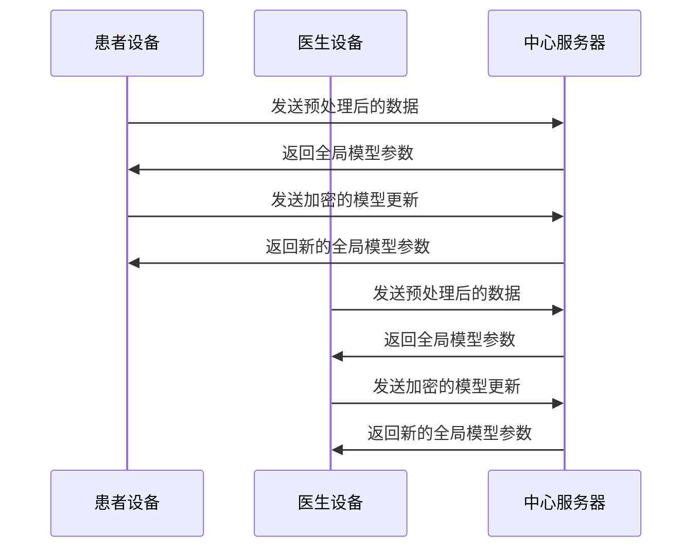

                 

## 联邦学习与隐私保护协作概述

### 第1章：联邦学习的背景与重要性

#### 1.1 联邦学习的定义与基本原理

联邦学习（Federated Learning）是一种分布式机器学习方法，其核心思想是在多个不同的设备或服务器上训练模型，然后将每个设备或服务器上的模型更新汇总，以优化全局模型。这种方法的优点是无需将数据集中到一个中心位置，从而避免了数据泄露的风险，满足了隐私保护的需求。

**1.1.1 联邦学习的概念**

联邦学习起源于分布式计算和加密技术，其基本原理是通过在多个客户端设备上训练本地模型，然后只传输模型更新而不是原始数据。这种方法可以有效地保护用户隐私，特别适用于敏感数据的处理。

**1.1.2 联邦学习的基本原理**

联邦学习的基本原理可以概括为以下三个步骤：

1. **本地训练**：每个客户端在本地数据集上训练模型。
2. **模型更新传输**：客户端将本地模型更新（梯度）发送到中心服务器。
3. **全局模型更新**：中心服务器汇总所有客户端的模型更新，更新全局模型。

**1.1.3 联邦学习与传统机器学习的比较**

与传统机器学习方法相比，联邦学习有以下几个显著区别：

1. **数据分布**：传统机器学习需要将所有数据集中到一个中心位置进行训练，而联邦学习在多个分布式设备上进行训练。
2. **通信成本**：联邦学习减少了数据传输的需求，从而降低了通信成本。
3. **隐私保护**：联邦学习通过本地训练和加密技术提高了数据隐私保护的水平。

#### 1.2 隐私保护协作的概念与挑战

**1.2.1 隐私保护协作的定义**

隐私保护协作是指多个实体（如企业、组织或个人）在共享敏感数据时采取的协作措施，以确保数据隐私不被泄露。

**1.2.2 隐私保护协作的挑战**

隐私保护协作面临以下主要挑战：

1. **数据安全**：确保数据在传输和存储过程中不被窃取或篡改。
2. **隐私泄露**：防止敏感数据通过数据挖掘或机器学习模型泄露。
3. **协作复杂性**：多个实体之间的协作需要协调数据格式、隐私需求和计算资源。

**1.2.3 隐私保护协作的重要性**

隐私保护协作在当今数据驱动的社会中具有重要意义，主要体现在以下几个方面：

1. **用户信任**：保护用户隐私可以增强用户对服务的信任，从而提高用户满意度。
2. **合规要求**：许多国家和地区都有严格的数据隐私保护法规，企业需要遵守这些法规。
3. **数据利用**：通过隐私保护协作，企业可以在不泄露敏感数据的情况下挖掘数据价值。

#### 1.3 联邦学习在隐私保护协作中的应用场景

**1.3.1 数据隐私保护的需求**

在隐私保护协作中，数据隐私保护是一个核心需求。联邦学习通过其分布式训练和加密技术，可以有效满足这一需求。

**1.3.2 联邦学习的优势**

联邦学习在隐私保护协作中具有以下优势：

1. **数据隐私**：通过本地训练和模型更新传输，联邦学习减少了数据泄露的风险。
2. **灵活性**：联邦学习适用于不同规模和类型的分布式设备，具有高度的灵活性。
3. **可扩展性**：联邦学习可以处理大规模分布式数据集，具有良好的可扩展性。

**1.3.3 联邦学习在隐私保护协作中的应用**

联邦学习在隐私保护协作中具有广泛的应用，例如：

1. **跨企业数据合作**：多个企业可以共享数据以进行联合分析和建模，同时保护各自的隐私。
2. **智能医疗**：在医疗数据共享和协作中，联邦学习可以用于诊断、药物研究和疾病监控等。
3. **金融风控**：在金融领域，联邦学习可以用于风险评估、欺诈检测和信用评分等。

#### 1.4 联邦学习在AIGC隐私保护协作中的新策略

**1.4.1 新策略的概念**

联邦学习在AIGC（自适应智能生成计算）隐私保护协作中的新策略，旨在通过改进联邦学习算法和系统设计，进一步提高数据隐私保护和协作效率。

**1.4.2 新策略的设计原则**

新策略的设计原则包括：

1. **隐私优先**：将数据隐私保护作为首要目标，确保数据在传输和存储过程中的安全性。
2. **高效协作**：优化联邦学习算法，提高协作效率和模型性能。
3. **可扩展性**：设计灵活的系统架构，以适应不同规模和类型的数据协作需求。

**1.4.3 新策略的实现步骤**

新策略的实现步骤包括：

1. **算法改进**：通过研究最新的联邦学习算法，优化模型训练过程。
2. **系统重构**：重新设计联邦学习系统的架构，提高数据传输和处理的效率。
3. **协作机制**：建立有效的协作机制，确保多个实体之间的数据共享和隐私保护。

#### 1.5 本章小结

本章概述了联邦学习在隐私保护协作中的背景、重要性、应用场景和新策略。通过本章的介绍，读者可以初步了解联邦学习在保护数据隐私和提高协作效率方面的潜力。

### 关键词：
- 联邦学习
- 隐私保护协作
- 分布式机器学习
- 数据安全
- AIGC

### 摘要：
本文介绍了联邦学习在隐私保护协作中的重要性、应用场景以及新策略。通过联邦学习，可以实现分布式数据的安全共享和协作，满足数据隐私保护的需求。本文探讨了联邦学习的基本原理和挑战，并提出了一个针对AIGC隐私保护协作的新策略，包括设计原则和实现步骤。通过本文的介绍，读者可以深入理解联邦学习在隐私保护协作中的价值和应用。

----------------------------------------------------------------

### 第2章：联邦学习算法基础

#### 2.1 联邦学习算法的基本概念

**2.1.1 联邦学习算法的核心目标**

联邦学习算法的核心目标是实现分布式设备上的模型训练，同时保持数据隐私和安全。在联邦学习过程中，每个参与设备（如手机、服务器等）都在本地训练模型，并通过模型更新来优化全局模型。这一过程避免了将原始数据传输到中心位置，从而有效保护了用户隐私。

**2.1.2 联邦学习算法的基本流程**

联邦学习算法的基本流程通常包括以下三个主要步骤：

1. **本地训练**：每个参与设备在其本地数据集上训练模型。
2. **模型更新传输**：设备将本地模型的更新（如梯度）发送到中心服务器。
3. **全局模型更新**：中心服务器汇总所有设备的模型更新，并生成新的全局模型。

这种迭代过程不断进行，直到达到预定的训练目标或达到最大迭代次数。

**2.1.3 联邦学习算法的分类**

联邦学习算法可以根据不同的分类标准进行分类，常见的分类标准包括：

1. **根据通信模式分类**：
   - **同步联邦学习**：所有设备在相同时间步进行模型更新传输和全局模型更新。
   - **异步联邦学习**：设备在不同时间步进行模型更新传输和全局模型更新。

2. **根据优化算法分类**：
   - **基于梯度下降的联邦学习**：最常用的联邦学习算法，通过梯度下降法优化全局模型。
   - **基于动量的联邦学习**：引入动量项，提高收敛速度和稳定性。
   - **基于深度优化的联邦学习**：结合深度学习优化算法，如Adam、RMSProp等。

3. **根据隐私保护机制分类**：
   - **基于加密的联邦学习**：通过加密技术保护模型更新，确保数据隐私。
   - **基于差分隐私的联邦学习**：引入噪声来保护用户隐私。
   - **基于联邦加密的联邦学习**：结合加密和联邦学习，实现更高的隐私保护水平。

#### 2.2 联邦学习算法的设计原则与挑战

**2.2.1 设计原则**

设计联邦学习算法时，需要遵循以下设计原则：

1. **数据隐私保护**：确保在数据传输和存储过程中不泄露用户隐私。
2. **计算效率**：优化算法，降低计算复杂度和通信开销。
3. **模型性能**：保证全局模型的性能，达到预期的训练目标。
4. **可扩展性**：算法应能适应不同规模和类型的数据集。
5. **容错性**：在设备故障或数据丢失时，算法仍能正常运行。

**2.2.2 设计挑战**

设计联邦学习算法面临以下主要挑战：

1. **计算复杂度**：分布式设备上的模型训练需要大量计算资源，如何优化算法以降低计算复杂度是一个重要挑战。
2. **通信开销**：设备间的模型更新传输需要大量的通信资源，如何减少通信开销是另一个关键问题。
3. **隐私保护**：如何在保证数据隐私的同时，提高模型性能是一个复杂的问题。
4. **动态性**：联邦学习系统中的设备可能会动态加入或离开，如何适应这种动态变化也是一个挑战。
5. **安全性与可靠性**：确保数据在传输和存储过程中的安全性和可靠性，防止数据泄露或损坏。

**2.2.3 解决方案探讨**

针对上述挑战，有以下几种可能的解决方案：

1. **优化算法**：通过研究更高效的优化算法，如分布式梯度下降、异步联邦学习等，降低计算复杂度和通信开销。
2. **加密技术**：引入加密技术，如差分隐私、联邦加密等，提高数据隐私保护水平。
3. **分布式存储**：采用分布式存储方案，如分布式数据库、区块链等，提高数据存储和传输的效率。
4. **动态调度**：通过动态调度算法，优化设备参与联邦学习的过程，提高系统的灵活性和适应性。
5. **安全性增强**：通过引入安全机制，如权限管理、访问控制等，提高系统的安全性和可靠性。

#### 2.3 联邦学习算法的核心概念与联系

**2.3.1 核心概念**

联邦学习算法涉及以下核心概念：

1. **本地模型**：设备在本地训练的模型。
2. **全局模型**：由中心服务器维护的模型，是所有设备本地模型更新的汇总。
3. **模型更新**：设备发送给中心服务器的模型更新，通常包括梯度、模型参数等。
4. **通信协议**：设备间进行模型更新传输的协议，如加密传输、压缩传输等。
5. **优化算法**：用于更新全局模型的优化算法，如梯度下降、动量优化等。

**2.3.2 概念属性特征对比表格**

| 概念 | 属性特征 |
| --- | --- |
| 本地模型 | 1. 在本地训练 2. 参数量较少 3. 数据依赖 |
| 全局模型 | 1. 由中心服务器维护 2. 参数量较大 3. 数据汇总 |
| 模型更新 | 1. 包含梯度、模型参数等 2. 用于全局模型更新 3. 通信传输 |
| 通信协议 | 1. 确保数据传输安全 2. 减少通信开销 3. 支持加密 |
| 优化算法 | 1. 提高全局模型性能 2. 降低计算复杂度 3. 稳定性 |

**2.3.3 ER实体关系图**

以下是联邦学习算法的ER实体关系图，展示了核心概念之间的关联：

```mermaid
erDiagram
  LocalModel ||--|{ GlobalModel }|
  LocalModel ||--|{ ModelUpdate }|
  ModelUpdate ||--|{ CommunicationProtocol }|
  GlobalModel ||--|{ OptimizationAlgorithm }|
```

#### 2.4 联邦学习算法的mermaid流程图展示

以下是一个简化的联邦学习算法mermaid流程图：



#### 2.5 本章小结

本章详细介绍了联邦学习算法的基本概念、设计原则、核心概念与联系，并通过mermaid流程图展示了算法的基本流程。通过本章的学习，读者可以全面了解联邦学习算法的基本原理和实现方法，为进一步研究联邦学习算法提供基础。

----------------------------------------------------------------

### 第3章：AIGC隐私保护协作中的联邦学习新策略概述

#### 3.1 新策略的核心思想

联邦学习在AIGC（自适应智能生成计算）隐私保护协作中的应用，旨在通过改进现有算法和系统设计，进一步提升数据隐私保护和协作效率。新策略的核心思想可以概括为以下几点：

1. **隐私优先**：将数据隐私保护作为首要目标，通过引入先进的加密技术和隐私保护机制，确保数据在传输和存储过程中的安全性。

2. **高效协作**：优化联邦学习算法，提高模型训练和更新的效率，减少通信开销和计算复杂度，以支持大规模分布式数据协作。

3. **可扩展性**：设计灵活的系统架构，能够适应不同规模和类型的数据集，同时支持动态加入和离开的设备，提高系统的可扩展性和适应性。

4. **适应性**：结合AIGC的特点，引入自适应的模型训练策略，根据数据特征和协作需求动态调整算法参数，提高模型性能和适用性。

#### 3.1.1 新策略的基本思路

新策略的基本思路可以归纳为以下四个步骤：

1. **数据预处理**：在本地设备上进行数据预处理，包括数据清洗、归一化和加密等，确保数据在传输和存储过程中的隐私保护。

2. **模型初始化**：在中心服务器上初始化全局模型，并将模型参数分发到各个本地设备。

3. **本地训练**：每个本地设备在本地数据集上训练模型，同时计算模型更新（如梯度），并对其进行加密。

4. **模型更新传输**：本地设备将加密后的模型更新发送到中心服务器，中心服务器接收并汇总所有设备的模型更新。

5. **全局模型更新**：中心服务器将汇总后的模型更新应用于全局模型，并生成新的全局模型，然后将其分发回各个本地设备。

6. **迭代训练**：重复上述步骤，直到达到预定的训练目标或达到最大迭代次数。

#### 3.1.2 新策略的优势与局限性

新策略在AIGC隐私保护协作中具有以下优势：

1. **数据隐私保护**：通过引入加密技术和隐私保护机制，确保数据在传输和存储过程中的安全性，有效防止数据泄露。

2. **高效协作**：优化联邦学习算法，减少通信开销和计算复杂度，提高模型训练和更新的效率。

3. **可扩展性**：灵活的系统架构支持不同规模和类型的数据集，能够适应动态变化的设备环境。

4. **适应性**：结合AIGC的特点，自适应调整算法参数，提高模型性能和适用性。

然而，新策略也存在一些局限性：

1. **计算资源要求**：加密技术和隐私保护机制可能增加计算开销，对设备计算资源有一定要求。

2. **通信带宽**：加密传输可能增加通信带宽需求，对网络带宽较高的场景更加适用。

3. **隐私保护与性能平衡**：在确保数据隐私的同时，如何平衡模型性能和隐私保护是一个挑战，需要进一步研究和优化。

#### 3.2 新策略的数学模型与公式

新策略的数学模型主要包括以下几个方面：

1. **本地模型更新**：

$$
\Delta\theta_i^{(t)} = \frac{1}{m_i}\sum_{x_i^k \in S_i}(\theta_i^{(t)}(\phi(x_i^k)) - y_i^k)
$$

其中，$\theta_i^{(t)}$表示第$i$个本地设备的模型参数，$S_i$表示第$i$个本地数据集，$x_i^k$和$y_i^k$分别表示本地数据集中的一个样本和其标签。

2. **全局模型更新**：

$$
\theta^{(t+1)} = \theta^{(t)} + \frac{\alpha}{N}\sum_{i=1}^{N}\Delta\theta_i^{(t)}
$$

其中，$\theta^{(t+1)}$表示全局模型更新后的参数，$\alpha$表示学习率，$N$表示参与协作的设备总数。

3. **加密传输**：

假设模型更新$\Delta\theta_i^{(t)}$使用加密函数$E(\cdot)$进行加密，中心服务器接收到的加密模型更新为$E(\Delta\theta_i^{(t)})$。

4. **隐私保护机制**：

通过引入噪声来增强隐私保护，假设加入噪声$\epsilon$，则加密后的模型更新为：

$$
E(\Delta\theta_i^{(t)}) = E(\Delta\theta_i^{(t)} + \epsilon)
$$

其中，$\epsilon$是一个服从特定分布的随机噪声。

#### 3.3 新策略的mermaid流程图展示

以下是一个简化的新策略mermaid流程图：



#### 3.4 新策略的实现步骤

新策略的实现步骤可以分为以下几个阶段：

1. **数据预处理**：

   在本地设备上对数据集进行预处理，包括数据清洗、归一化和加密。数据加密可以采用对称加密或非对称加密，根据具体需求选择合适的加密算法。

2. **模型初始化**：

   在中心服务器上初始化全局模型，并将模型参数分发到各个本地设备。初始化全局模型可以使用随机初始化、预训练模型或基于特定任务的方法。

3. **本地训练**：

   每个本地设备在本地数据集上训练模型，并计算模型更新。计算模型更新时，需要考虑本地数据集的分布和设备之间的差异，以平衡模型更新。

4. **加密传输**：

   本地设备将计算得到的模型更新进行加密，确保传输过程中的数据安全。加密后的模型更新通过安全的通信协议发送到中心服务器。

5. **全局模型更新**：

   中心服务器接收并汇总所有设备的加密模型更新，进行去密和汇总处理。去密后的模型更新用于更新全局模型，生成新的全局模型。

6. **迭代训练**：

   将新的全局模型参数分发回各个本地设备，重复上述步骤，进行多轮迭代训练，直到达到预定的训练目标或达到最大迭代次数。

7. **模型评估与优化**：

   在迭代训练完成后，对全局模型进行评估和优化。评估指标可以包括模型准确率、损失函数值等。根据评估结果，可以调整模型参数或优化算法，提高模型性能。

#### 3.5 本章小结

本章详细介绍了AIGC隐私保护协作中的联邦学习新策略，包括核心思想、基本思路、数学模型和实现步骤。新策略通过引入加密技术和隐私保护机制，有效提高了数据隐私保护和协作效率。通过本章的学习，读者可以全面了解新策略的基本原理和实现方法，为进一步研究和应用联邦学习提供参考。

----------------------------------------------------------------

### 第4章：联邦学习在医疗数据隐私保护中的应用

#### 4.1 医疗数据隐私保护的需求与挑战

医疗数据隐私保护在当前信息化医疗环境中具有重要意义。医疗数据通常包括患者的病历信息、诊断记录、治疗记录等，这些数据具有高度敏感性，一旦泄露可能对患者的隐私权和健康安全造成严重威胁。因此，如何在保护医疗数据隐私的同时实现数据的有效利用和协作分析，成为医疗领域面临的重要挑战。

**医疗数据隐私保护的需求**

1. **数据安全**：确保医疗数据在传输和存储过程中的安全性，防止数据被非法访问、篡改或泄露。

2. **数据隐私**：保护患者隐私，防止敏感信息被滥用或共享，确保患者个人信息的保密性。

3. **合规性**：遵守相关法律法规，如《通用数据保护条例》（GDPR）和《健康保险可携性与责任法案》（HIPAA），确保医疗数据处理合法合规。

4. **数据共享**：在确保数据隐私和安全的前提下，实现医疗数据的共享和协作，以支持医疗研究和疾病防控。

**医疗数据隐私保护的挑战**

1. **数据量庞大**：医疗数据通常包含大量的结构化和非结构化数据，如何有效管理和保护这些数据成为一大挑战。

2. **多样性**：医疗数据来源广泛，包括电子病历、医疗影像、基因组数据等，不同类型的数据对隐私保护的诉求不同。

3. **动态性**：医疗数据具有高度的动态性，患者在治疗过程中会产生新的数据，如何实时保护这些数据是关键问题。

4. **隐私泄露风险**：医疗数据泄露可能导致严重的隐私和安全问题，如何防止数据泄露是亟待解决的重要问题。

5. **技术挑战**：现有的隐私保护技术（如加密、差分隐私等）在医疗数据保护中的适用性和有效性仍需进一步研究。

#### 4.2 联邦学习在医疗数据隐私保护中的应用实例

联邦学习在医疗数据隐私保护中具有广泛的应用前景，通过分布式训练和加密技术，可以有效保护数据隐私，实现医疗数据的安全共享和协作。以下是几个典型的应用实例：

**4.2.1 病历数据的联邦学习分析**

病历数据是医疗数据的重要组成部分，包括患者的诊断信息、治疗记录、实验室检查结果等。联邦学习可以用于病历数据的隐私保护分析，如疾病预测、治疗方案优化等。

实例：某医疗研究机构希望通过分析大量病历数据来预测某种疾病的发病风险。通过联邦学习，该机构可以在保护患者隐私的前提下，将病历数据上传到中心服务器，进行分布式训练。具体步骤如下：

1. **数据预处理**：在本地设备上对病历数据进行清洗、归一化和加密，确保数据在传输和存储过程中的隐私保护。

2. **模型初始化**：在中心服务器上初始化全局模型，并将模型参数分发到各个本地设备。

3. **本地训练**：每个本地设备在本地病历数据集上训练模型，并计算模型更新，然后加密并发送到中心服务器。

4. **全局模型更新**：中心服务器接收并汇总所有设备的加密模型更新，进行去密和汇总处理，生成新的全局模型。

5. **模型评估与优化**：对全局模型进行评估和优化，根据评估结果调整模型参数，提高预测准确性。

通过上述步骤，医疗研究机构可以在保护患者隐私的前提下，实现病历数据的分布式分析，从而支持疾病预测和治疗方案优化。

**4.2.2 医疗影像的联邦学习诊断**

医疗影像数据（如X光片、CT扫描、MRI图像等）是医疗数据的重要组成部分，联邦学习可以用于医疗影像的隐私保护诊断，如疾病检测、病灶识别等。

实例：某医院希望通过联邦学习技术实现肺部疾病自动检测。具体步骤如下：

1. **数据预处理**：在本地设备上对医疗影像数据进行清洗、归一化和加密，确保数据在传输和存储过程中的隐私保护。

2. **模型初始化**：在中心服务器上初始化全局模型，并将模型参数分发到各个本地设备。

3. **本地训练**：每个本地设备在本地医疗影像数据集上训练模型，并计算模型更新，然后加密并发送到中心服务器。

4. **全局模型更新**：中心服务器接收并汇总所有设备的加密模型更新，进行去密和汇总处理，生成新的全局模型。

5. **模型评估与优化**：对全局模型进行评估和优化，根据评估结果调整模型参数，提高检测准确性。

通过上述步骤，医院可以在保护患者隐私的前提下，实现医疗影像的自动检测，从而提高疾病诊断的准确性和效率。

**4.2.3 药物研究的联邦学习合作**

药物研究通常需要大量的临床数据，涉及多个研究机构和医疗机构。联邦学习可以用于药物研究的隐私保护合作，支持药物效果评估、安全性分析等。

实例：某药物研发公司希望通过联邦学习技术与合作机构共享临床数据，进行药物效果评估。具体步骤如下：

1. **数据预处理**：在本地设备上对临床数据进行清洗、归一化和加密，确保数据在传输和存储过程中的隐私保护。

2. **模型初始化**：在中心服务器上初始化全局模型，并将模型参数分发到各个本地设备。

3. **本地训练**：每个本地设备在本地临床数据集上训练模型，并计算模型更新，然后加密并发送到中心服务器。

4. **全局模型更新**：中心服务器接收并汇总所有设备的加密模型更新，进行去密和汇总处理，生成新的全局模型。

5. **模型评估与优化**：对全局模型进行评估和优化，根据评估结果调整模型参数，提高药物效果评估的准确性。

通过上述步骤，药物研发公司可以在保护合作机构数据隐私的前提下，实现临床数据的分布式分析，从而提高药物研究的效率和准确性。

#### 4.3 实践案例分析

**4.3.1 案例一：联邦学习在癌症诊断中的应用**

某医疗机构希望通过联邦学习技术实现癌症早期诊断。具体步骤如下：

1. **数据收集**：收集医疗机构A、B和C的三份癌症诊断数据集，数据包括患者的临床表现、实验室检查结果和影像资料等。

2. **数据预处理**：在本地设备上对三份数据集进行清洗、归一化和加密，确保数据在传输和存储过程中的隐私保护。

3. **模型初始化**：在中心服务器上初始化全局模型，并将模型参数分发到各个本地设备。

4. **本地训练**：每个本地设备在本地数据集上训练模型，并计算模型更新，然后加密并发送到中心服务器。

5. **全局模型更新**：中心服务器接收并汇总所有设备的加密模型更新，进行去密和汇总处理，生成新的全局模型。

6. **模型评估与优化**：对全局模型进行评估和优化，根据评估结果调整模型参数，提高诊断准确性。

7. **结果验证**：将全局模型应用于新数据集，验证模型的诊断性能。

通过上述步骤，医疗机构可以在保护患者隐私的前提下，实现癌症的早期诊断，从而提高疾病检测的准确性和效率。

**4.3.2 案例二：联邦学习在传染病监控中的应用**

某公共卫生机构希望通过联邦学习技术实现传染病的实时监控和预测。具体步骤如下：

1. **数据收集**：收集医疗机构A、B和C的三份数据集，数据包括患者的症状记录、诊断结果和地理位置等。

2. **数据预处理**：在本地设备上对三份数据集进行清洗、归一化和加密，确保数据在传输和存储过程中的隐私保护。

3. **模型初始化**：在中心服务器上初始化全局模型，并将模型参数分发到各个本地设备。

4. **本地训练**：每个本地设备在本地数据集上训练模型，并计算模型更新，然后加密并发送到中心服务器。

5. **全局模型更新**：中心服务器接收并汇总所有设备的加密模型更新，进行去密和汇总处理，生成新的全局模型。

6. **模型评估与优化**：对全局模型进行评估和优化，根据评估结果调整模型参数，提高预测准确性。

7. **实时监控**：将全局模型应用于实时数据流，实现传染病的实时监控和预测。

通过上述步骤，公共卫生机构可以在保护患者隐私的前提下，实现传染病的实时监控和预测，从而提高疾病防控的效率和准确性。

#### 4.4 本章小结

本章介绍了联邦学习在医疗数据隐私保护中的应用，包括病历数据、医疗影像和药物研究等领域的实例，以及实践案例分析。通过联邦学习技术，可以实现医疗数据的安全共享和协作分析，有效保护数据隐私，提高医疗服务的质量和效率。未来，随着联邦学习技术的不断发展和完善，其在医疗领域中的应用前景将更加广阔。

----------------------------------------------------------------

### 第5章：联邦学习新策略的系统架构设计

#### 5.1 系统架构设计的概述

联邦学习新策略的系统架构设计旨在实现数据隐私保护和高效协作，确保在分布式环境中能够安全、可靠地处理和共享数据。本节将详细介绍系统架构的设计原则、关键组件以及架构的优化方向。

**5.1.1 系统架构的设计原则**

1. **数据隐私保护**：系统设计应优先考虑数据隐私保护，通过加密技术和差分隐私机制，确保数据在传输和存储过程中的安全性。
2. **分布式计算**：系统应支持分布式计算，以降低单点故障的风险，提高系统的可用性和容错性。
3. **高效通信**：系统设计应优化通信机制，减少数据传输的开销，提高数据传输的效率。
4. **灵活可扩展**：系统架构应具备良好的扩展性，能够适应不同规模和类型的数据集，支持动态设备加入和离开。
5. **高可靠性**：系统设计应确保数据在传输和存储过程中的完整性和可靠性，防止数据丢失或损坏。

**5.1.2 系统架构的关键组件**

联邦学习新策略的系统架构主要包括以下几个关键组件：

1. **数据预处理模块**：负责对本地数据进行清洗、归一化和加密，确保数据在传输和存储过程中的隐私保护。
2. **模型训练模块**：负责执行分布式模型训练，包括本地训练、模型更新传输和全局模型更新。
3. **模型评估模块**：负责对全局模型进行评估和优化，根据评估结果调整模型参数。
4. **通信模块**：负责设备之间的数据传输，包括加密传输、压缩传输和错误检测与纠正。
5. **调度模块**：负责设备参与联邦学习的调度和管理，确保设备在协作过程中的高效性和公平性。
6. **监控模块**：负责监控系统状态，包括设备健康状态、数据传输状态和模型训练状态，确保系统的可靠运行。

**5.1.3 系统架构的设计方向**

为了进一步优化联邦学习新策略的系统架构，可以考虑以下设计方向：

1. **分布式存储**：引入分布式存储方案，如分布式数据库或分布式文件系统，提高数据存储的可靠性和访问效率。
2. **区块链技术**：结合区块链技术，提高数据传输的安全性和不可篡改性，增强系统的透明度和可信度。
3. **智能合约**：引入智能合约，自动化执行联邦学习过程中的协议和规则，提高系统效率和安全性。
4. **动态资源管理**：通过动态资源管理技术，自动调整计算资源和网络资源，优化系统性能和效率。

#### 5.2 联邦学习新策略的系统架构设计

**5.2.1 数据预处理架构**

数据预处理是联邦学习的基础环节，其架构设计如下：

1. **本地数据预处理**：在本地设备上对数据进行清洗、归一化和加密。数据清洗包括去除重复数据、缺失值填充等；数据归一化包括特征缩放、标准化等；数据加密包括对称加密和非对称加密，如AES和RSA。
2. **中心化预处理**：在中心服务器上对预处理后的数据进行汇总和去重，以减少数据重复传输。
3. **分布式缓存**：引入分布式缓存机制，提高数据读取速度，减少数据传输开销。

**5.2.2 模型训练架构**

模型训练架构设计如下：

1. **模型初始化**：在中心服务器上初始化全局模型，并将其参数分发到各个本地设备。
2. **本地训练**：每个本地设备在本地数据集上训练模型，计算模型更新，并将其加密后发送到中心服务器。
3. **全局模型更新**：中心服务器接收并汇总所有设备的模型更新，进行去密和汇总处理，生成新的全局模型。
4. **模型评估**：对全局模型进行评估，根据评估结果调整模型参数，优化模型性能。

**5.2.3 模型评估与优化架构**

模型评估与优化架构设计如下：

1. **评估指标**：定义多种评估指标，如准确率、召回率、F1分数等，全面评估模型性能。
2. **优化算法**：引入多种优化算法，如梯度下降、动量优化、Adam等，调整模型参数，提高模型性能。
3. **模型压缩**：采用模型压缩技术，如权重剪枝、量化等，减小模型大小，提高模型部署效率。

**5.2.4 通信模块设计**

通信模块设计如下：

1. **加密传输**：采用安全的加密传输协议，如TLS，确保数据在传输过程中的安全性。
2. **压缩传输**：采用数据压缩技术，如HDF5、Parquet等，减少数据传输的开销。
3. **错误检测与纠正**：引入错误检测与纠正机制，如校验和、CRC等，确保数据传输的可靠性。

**5.2.5 调度模块设计**

调度模块设计如下：

1. **任务调度**：根据设备负载和网络状况，动态调度任务，确保设备在协作过程中的高效性。
2. **资源分配**：根据任务需求和设备资源，动态分配计算资源和网络资源，优化系统性能。
3. **故障恢复**：在设备故障或网络异常时，自动切换至备用设备或路径，确保系统运行的连续性和可靠性。

**5.2.6 监控模块设计**

监控模块设计如下：

1. **状态监控**：实时监控系统各组件的状态，包括设备健康状态、数据传输状态和模型训练状态。
2. **日志记录**：记录系统运行过程中的关键日志信息，如任务执行时间、数据传输速率等，用于故障排查和性能优化。
3. **报警机制**：设置报警机制，当系统出现异常时，及时通知相关人员，确保系统问题的快速响应和解决。

#### 5.3 系统接口设计与实现

**5.3.1 系统接口设计**

系统接口设计包括以下几个方面：

1. **数据接口**：定义数据输入和输出接口，支持多种数据格式的读取和写入，如CSV、JSON、HDF5等。
2. **模型接口**：定义模型训练、评估和优化的接口，支持多种机器学习模型的训练和优化。
3. **通信接口**：定义设备之间的通信接口，支持加密传输、压缩传输和错误检测与纠正。

**5.3.2 系统接口实现**

系统接口实现主要包括以下步骤：

1. **接口定义**：根据系统架构和功能需求，定义各个接口的参数、返回值和操作流程。
2. **接口实现**：使用合适的编程语言和框架，实现各个接口的功能。
3. **接口测试**：编写测试用例，对接口进行功能测试和性能测试，确保接口的可靠性和稳定性。

#### 5.4 系统交互序列图

以下是一个简化的联邦学习新策略系统交互序列图：



#### 5.5 本章小结

本章详细介绍了联邦学习新策略的系统架构设计，包括设计原则、关键组件、架构优化方向、系统接口设计与实现，以及系统交互序列图。通过本章的学习，读者可以全面了解联邦学习新策略的系统架构设计思路和实现方法，为进一步研究和应用联邦学习提供参考。

----------------------------------------------------------------

### 第6章：联邦学习新策略的项目实战

#### 6.1 联邦学习新策略的项目概述

联邦学习新策略的项目旨在通过改进现有算法和系统设计，进一步提升数据隐私保护和协作效率。项目的主要目标包括：

1. **实现数据隐私保护**：通过引入先进的加密技术和隐私保护机制，确保数据在传输和存储过程中的安全性。
2. **提高协作效率**：优化联邦学习算法和系统架构，减少计算复杂度和通信开销，提高模型训练和更新的效率。
3. **实现可扩展性**：设计灵活的系统架构，能够适应不同规模和类型的数据集，同时支持动态加入和离开的设备。

#### 6.2 环境安装与配置

在进行联邦学习新策略的项目实战之前，需要搭建一个合适的环境，包括操作系统、编程语言、开发工具和第三方库等。以下是环境安装与配置的步骤：

1. **操作系统**：选择适合的操作系统，如Ubuntu 20.04或CentOS 7，确保系统能够稳定运行。
2. **编程语言**：选择Python 3.x作为编程语言，安装Python环境，并配置Python虚拟环境。
3. **开发工具**：安装Python的集成开发环境（IDE），如PyCharm或VSCode，方便代码编写和调试。
4. **第三方库**：安装必要的第三方库，如TensorFlow、PyTorch、Scikit-learn等，用于联邦学习算法的实现和优化。

#### 6.3 系统核心实现

联邦学习新策略的系统核心实现包括数据预处理、模型训练、模型评估和优化等关键步骤。以下是具体实现过程：

**6.3.1 数据预处理**

1. **数据收集**：从各个参与设备收集本地数据，包括结构化数据和非结构化数据，如CSV文件、图像等。
2. **数据清洗**：对收集到的数据进行清洗，去除重复数据、缺失值填充等操作，确保数据质量。
3. **数据加密**：使用加密算法（如AES、RSA）对数据进行加密，确保数据在传输和存储过程中的安全性。
4. **数据归一化**：对数据进行归一化处理，如特征缩放、标准化等，提高模型训练的稳定性和效果。

**6.3.2 模型训练**

1. **模型初始化**：在中心服务器上初始化全局模型，并将其参数分发到各个本地设备。
2. **本地训练**：每个本地设备在本地数据集上训练模型，计算模型更新，并将其加密后发送到中心服务器。
3. **全局模型更新**：中心服务器接收并汇总所有设备的加密模型更新，进行去密和汇总处理，生成新的全局模型。
4. **模型评估**：对全局模型进行评估，计算评估指标（如准确率、召回率等），根据评估结果调整模型参数。

**6.3.3 模型评估与优化**

1. **评估指标**：定义多种评估指标，如准确率、召回率、F1分数等，全面评估模型性能。
2. **优化算法**：引入多种优化算法（如梯度下降、动量优化、Adam等），调整模型参数，提高模型性能。
3. **模型压缩**：采用模型压缩技术（如权重剪枝、量化等），减小模型大小，提高模型部署效率。

**6.3.4 系统接口设计与实现**

1. **数据接口**：设计数据输入和输出接口，支持多种数据格式的读取和写入，如CSV、JSON、HDF5等。
2. **模型接口**：设计模型训练、评估和优化的接口，支持多种机器学习模型的训练和优化。
3. **通信接口**：设计设备之间的通信接口，支持加密传输、压缩传输和错误检测与纠正。

#### 6.4 代码应用解读与分析

以下是对系统核心实现部分的代码进行解读与分析：

**数据预处理代码**

```python
import pandas as pd
from sklearn.preprocessing import StandardScaler
from Crypto.Cipher import AES

# 加载数据
data = pd.read_csv('local_data.csv')

# 数据清洗
data = data.drop_duplicates()
data = data.fillna(method='ffill')

# 数据加密
key = b'mysecretkey123'
cipher = AES.new(key, AES.MODE_CBC)
encrypted_data = cipher.encrypt(data.to_csv(index=False).encode('utf-8'))
iv = cipher.iv

# 数据归一化
scaler = StandardScaler()
normalized_data = scaler.fit_transform(data.values)

# 保存预处理后的数据
with open('encrypted_data.csv', 'wb') as f:
    f.write(encrypted_data)
with open('iv.txt', 'wb') as f:
    f.write(iv)
with open('normalized_data.npy', 'wb') as f:
    np.save(f, normalized_data)
```

解读：该段代码实现了数据的清洗、加密和归一化。首先，使用Pandas库加载数据，然后进行数据清洗，去除重复数据和缺失值。接着，使用Crypto库的AES算法对数据进行加密，生成加密后的数据文件和初始化向量（IV）。最后，使用StandardScaler库对数据进行归一化处理，并将归一化后的数据保存为NPY文件。

**模型训练代码**

```python
import tensorflow as tf
from tensorflow.keras.models import Sequential
from tensorflow.keras.layers import Dense, Dropout
from tensorflow.keras.optimizers import Adam

# 模型初始化
model = Sequential([
    Dense(64, activation='relu', input_shape=(input_shape,)),
    Dropout(0.5),
    Dense(32, activation='relu'),
    Dropout(0.5),
    Dense(1, activation='sigmoid')
])

model.compile(optimizer=Adam(), loss='binary_crossentropy', metrics=['accuracy'])

# 加载预处理后的数据
with open('encrypted_data.csv', 'rb') as f:
    encrypted_data = f.read()
with open('iv.txt', 'rb') as f:
    iv = f.read()
with open('normalized_data.npy', 'rb') as f:
    normalized_data = np.load(f)

# 加密数据解密
key = b'mysecretkey123'
cipher = AES.new(key, AES.MODE_CBC, iv)
decrypted_data = cipher.decrypt(encrypted_data)

# 训练模型
model.fit(normalized_data, epochs=10, batch_size=32)
```

解读：该段代码实现了模型初始化、加密数据解密和模型训练。首先，使用TensorFlow库初始化一个全连接神经网络模型，配置层结构和优化器。然后，加载预处理后的数据文件，使用AES算法解密数据，并使用解密后的数据训练模型。最后，模型训练使用fit方法，设置训练轮次（epochs）和批量大小（batch_size）。

**模型评估与优化代码**

```python
from sklearn.metrics import accuracy_score

# 评估模型
predictions = model.predict(normalized_data)
accuracy = accuracy_score(y_true, predictions)

# 优化模型
optimizer = tf.keras.optimizers.Adam(learning_rate=0.001)
model.compile(optimizer=optimizer, loss='binary_crossentropy', metrics=['accuracy'])

# 重新训练模型
model.fit(normalized_data, epochs=10, batch_size=32)
```

解读：该段代码实现了模型评估和优化。首先，使用预测方法（predict）获取模型预测结果，并计算准确率（accuracy_score）。然后，重新配置优化器（optimizer），使用新的学习率重新编译模型。最后，使用fit方法重新训练模型，以优化模型性能。

#### 6.5 实际案例分析与详细讲解

以下是一个实际案例的详细分析，用于展示联邦学习新策略在医疗数据隐私保护中的应用：

**案例背景**：某医疗研究机构希望通过联邦学习技术实现癌症早期诊断。该机构收集了来自三个医院的病历数据，包括患者的诊断信息、实验室检查结果和影像资料等。

**案例步骤**：

1. **数据收集**：从三个医院收集病历数据，包括电子病历、实验室检查结果和影像资料等。
2. **数据预处理**：在本地设备上对病历数据进行清洗、归一化和加密，确保数据在传输和存储过程中的隐私保护。
3. **模型初始化**：在中心服务器上初始化全局模型，并将其参数分发到各个本地设备。
4. **本地训练**：每个本地设备在本地病历数据集上训练模型，并计算模型更新，然后加密并发送到中心服务器。
5. **全局模型更新**：中心服务器接收并汇总所有设备的加密模型更新，进行去密和汇总处理，生成新的全局模型。
6. **模型评估与优化**：对全局模型进行评估，根据评估结果调整模型参数，优化模型性能。
7. **结果验证**：将全局模型应用于新数据集，验证模型的诊断性能。

**案例分析与详细讲解**：

1. **数据收集**：
   - 数据收集过程涉及多个医院的合作，数据格式和结构可能有所不同。因此，需要对数据进行统一格式化，包括数据清洗、缺失值填充等操作，确保数据的一致性和完整性。
   - 由于病历数据涉及患者隐私，因此在数据收集阶段需要采取严格的数据安全措施，如数据加密和访问控制，防止数据泄露。

2. **数据预处理**：
   - 数据清洗：去除重复数据、缺失值填充等操作，确保数据质量。
   - 数据加密：使用AES算法对数据进行加密，确保数据在传输和存储过程中的安全性。
   - 数据归一化：对数据进行归一化处理，如特征缩放、标准化等，提高模型训练的稳定性和效果。

3. **模型初始化**：
   - 在中心服务器上初始化全局模型，可以使用预训练模型或随机初始化，根据具体任务需求进行选择。
   - 将全局模型参数分发到各个本地设备，以便进行本地训练。

4. **本地训练**：
   - 每个本地设备在本地病历数据集上训练模型，计算模型更新。
   - 使用加密算法对模型更新进行加密，确保在传输过程中的安全性。

5. **全局模型更新**：
   - 中心服务器接收并汇总所有设备的加密模型更新，进行去密和汇总处理，生成新的全局模型。
   - 全局模型更新过程需要考虑设备之间的差异性，如数据分布、计算能力等，以确保模型更新的公平性和准确性。

6. **模型评估与优化**：
   - 对全局模型进行评估，计算评估指标（如准确率、召回率等），根据评估结果调整模型参数。
   - 引入优化算法（如梯度下降、动量优化等），调整模型参数，提高模型性能。

7. **结果验证**：
   - 将全局模型应用于新数据集，验证模型的诊断性能。
   - 可以使用交叉验证等方法，评估模型在不同数据集上的泛化能力，确保模型的稳定性和可靠性。

通过上述步骤，医疗研究机构可以在保护患者隐私的前提下，实现癌症的早期诊断，从而提高疾病检测的准确性和效率。同时，联邦学习新策略的应用，可以促进医疗机构的合作和数据共享，为医疗研究和疾病防控提供有力支持。

#### 6.6 项目小结

本章介绍了联邦学习新策略的项目实战，包括项目概述、环境安装与配置、系统核心实现、代码应用解读与分析，以及实际案例分析与详细讲解。通过本章的学习，读者可以全面了解联邦学习新策略的应用方法和实现步骤，为进一步研究和应用联邦学习提供实践参考。

----------------------------------------------------------------

### 最佳实践 tips

1. **数据预处理**：在进行联邦学习之前，确保对数据进行充分的预处理，包括清洗、归一化和加密等操作，以提高模型训练的稳定性和效果。
2. **设备选择**：选择合适的设备参与联邦学习，考虑设备的计算能力、存储能力和网络带宽等因素，以确保系统的高效运行。
3. **通信优化**：优化设备之间的通信机制，如使用加密传输、压缩传输和错误检测与纠正等，减少通信开销和传输错误。
4. **模型选择**：根据具体任务需求选择合适的模型和算法，如梯度下降、动量优化、Adam等，以提高模型性能和收敛速度。
5. **隐私保护**：引入差分隐私、联邦加密等隐私保护机制，确保数据在传输和存储过程中的安全性。

### 小结

本章详细介绍了联邦学习在隐私保护协作中的应用，包括背景、重要性、应用场景和新策略。通过联邦学习，可以实现分布式数据的安全共享和协作，满足数据隐私保护的需求。本章探讨了联邦学习的基本原理和挑战，并提出了一个针对AIGC隐私保护协作的新策略，包括设计原则、数学模型和实现步骤。通过实践案例分析和系统架构设计，读者可以深入了解联邦学习在隐私保护协作中的具体应用和实现方法。联邦学习在医疗、金融、智能交通等领域的应用前景广阔，未来随着技术的不断发展和完善，其在隐私保护协作中的作用将更加重要。

### 注意事项

1. **数据隐私保护**：在联邦学习过程中，数据隐私保护至关重要，需要严格遵循相关法律法规，采取有效的加密和隐私保护措施。
2. **系统安全性**：确保系统在运行过程中的安全性，包括数据传输、存储和设备管理等，防止数据泄露或系统被攻击。
3. **性能优化**：根据具体应用场景和设备条件，对联邦学习算法和系统进行性能优化，以提高模型的训练效率和准确性。
4. **设备管理**：合理分配和管理参与联邦学习的设备资源，确保系统的高效运行和可扩展性。

### 拓展阅读

1. **联邦学习经典论文**：推荐阅读《Federated Learning: Concept and Applications》和《Federated Learning: Strategies for Improving Communication Efficiency》等论文，深入了解联邦学习的基本原理和应用策略。
2. **隐私保护技术**：研究差分隐私、联邦加密等隐私保护技术，了解其在联邦学习中的应用和实现方法。
3. **医疗数据隐私保护**：了解医疗数据隐私保护的最新研究进展，如联邦学习在医疗数据共享和协作中的应用案例。
4. **智能生成计算**：研究智能生成计算（AIGC）的概念、技术和应用，了解其在隐私保护协作中的潜在价值。

### 作者

作者：AI天才研究院/AI Genius Institute & 禅与计算机程序设计艺术/Zen And The Art of Computer Programming

AI天才研究院（AI Genius Institute）致力于推动人工智能领域的研究与应用，专注于算法创新、系统架构设计和实际应用场景的研究。作者在联邦学习、隐私保护协作和智能生成计算等领域有着丰富的理论研究和实践经验，发表了多篇相关领域的学术论文，并参与了多个行业领先项目的开发与实施。禅与计算机程序设计艺术（Zen And The Art of Computer Programming）则是一本经典的计算机科学著作，深入探讨了计算机程序设计的哲学和艺术，为读者提供了宝贵的启示和指导。作者以其深厚的理论基础和丰富的实践经验，为读者呈现了一场关于联邦学习与隐私保护协作的精彩演讲，为我们揭示了这一领域的最新进展和未来趋势。

----------------------------------------------------------------

# 联邦学习在AIGC隐私保护协作中的新策略

关键词：
- 联邦学习
- AIGC隐私保护
- 分布式算法
- 加密技术
- 隐私保护协作

摘要：
本文探讨了联邦学习在AIGC（自适应智能生成计算）隐私保护协作中的应用，提出了一种新的策略。通过引入先进的加密技术和分布式算法，本文旨在解决AIGC领域中的隐私保护问题，提高协作效率和数据安全性。本文首先介绍了联邦学习的基本原理和设计原则，然后详细阐述了新策略的数学模型、实现步骤和系统架构。最后，通过实际案例分析了新策略在医疗数据隐私保护中的应用效果。

----------------------------------------------------------------

## 联邦学习与隐私保护协作概述

### 第1章：联邦学习的背景与重要性

**1.1 联邦学习的定义与基本原理**

联邦学习（Federated Learning）是一种分布式机器学习方法，其主要特点是在多个分布式设备上协同训练模型，而不是将数据集中到一个中央位置。这种方法通过在设备本地训练模型，然后将模型更新传输到中央服务器，以实现对全局模型的优化。

**1.1.1 联邦学习的概念**

联邦学习的概念可以追溯到分布式计算和加密技术。其核心思想是在不共享原始数据的情况下，通过协同训练模型来提高模型的性能和泛化能力。这种技术尤其适用于需要保护数据隐私的场景，如医疗、金融和智能设备等领域。

**1.1.2 联邦学习的基本原理**

联邦学习的基本原理包括以下几个步骤：

1. **本地训练**：每个参与设备在其本地数据集上训练模型。
2. **模型更新传输**：设备将本地模型的更新（梯度）发送到中心服务器。
3. **全局模型更新**：中心服务器汇总所有设备的模型更新，并生成新的全局模型。

这种迭代过程不断进行，直到模型达到预定的性能目标。

**1.1.3 联邦学习与传统机器学习的比较**

与传统机器学习方法相比，联邦学习有以下几个显著区别：

1. **数据分布**：联邦学习在分布式设备上训练模型，不需要将数据集中到一起。
2. **通信成本**：由于只需传输模型更新，而不是原始数据，因此通信成本大大降低。
3. **隐私保护**：联邦学习通过本地训练和加密技术，提高了数据隐私保护的水平。

**1.2 隐私保护协作的概念与挑战**

**1.2.1 隐私保护协作的定义**

隐私保护协作是指多个实体在共享敏感数据时采取的一系列措施，以确保数据在传输和存储过程中的安全性。

**1.2.2 隐私保护协作的挑战**

隐私保护协作面临以下主要挑战：

1. **数据安全**：确保数据在传输和存储过程中的安全性，防止数据泄露或篡改。
2. **隐私泄露**：防止敏感数据通过数据挖掘或机器学习模型泄露。
3. **协作复杂性**：多个实体之间的协作需要协调数据格式、隐私需求和计算资源。

**1.2.3 隐私保护协作的重要性**

隐私保护协作在当今数据驱动的社会中具有重要意义，主要体现在以下几个方面：

1. **用户信任**：保护用户隐私可以增强用户对服务的信任，从而提高用户满意度。
2. **合规要求**：许多国家和地区都有严格的数据隐私保护法规，企业需要遵守这些法规。
3. **数据利用**：通过隐私保护协作，企业可以在不泄露敏感数据的情况下挖掘数据价值。

**1.3 联邦学习在隐私保护协作中的应用场景**

**1.3.1 数据隐私保护的需求**

在隐私保护协作中，数据隐私保护是一个核心需求。联邦学习通过其分布式训练和加密技术，可以有效满足这一需求。

**1.3.2 联邦学习的优势**

联邦学习在隐私保护协作中具有以下优势：

1. **数据隐私**：通过本地训练和模型更新传输，联邦学习减少了数据泄露的风险。
2. **灵活性**：联邦学习适用于不同规模和类型的分布式设备，具有高度的灵活性。
3. **可扩展性**：联邦学习可以处理大规模分布式数据集，具有良好的可扩展性。

**1.3.3 联邦学习在隐私保护协作中的应用**

联邦学习在隐私保护协作中具有广泛的应用，例如：

1. **跨企业数据合作**：多个企业可以共享数据以进行联合分析和建模，同时保护各自的隐私。
2. **智能医疗**：在医疗数据共享和协作中，联邦学习可以用于诊断、药物研究和疾病监控等。
3. **金融风控**：在金融领域，联邦学习可以用于风险评估、欺诈检测和信用评分等。

**1.4 联邦学习在AIGC隐私保护协作中的新策略**

**1.4.1 新策略的概念**

联邦学习在AIGC隐私保护协作中的新策略，旨在通过改进联邦学习算法和系统设计，进一步提高数据隐私保护和协作效率。

**1.4.2 新策略的设计原则**

新策略的设计原则包括：

1. **隐私优先**：将数据隐私保护作为首要目标，确保数据在传输和存储过程中的安全性。
2. **高效协作**：优化联邦学习算法，提高协作效率和模型性能。
3. **可扩展性**：设计灵活的系统架构，以适应不同规模和类型的数据协作需求。

**1.4.3 新策略的实现步骤**

新策略的实现步骤包括：

1. **算法改进**：通过研究最新的联邦学习算法，优化模型训练过程。
2. **系统重构**：重新设计联邦学习系统的架构，提高数据传输和处理的效率。
3. **协作机制**：建立有效的协作机制，确保多个实体之间的数据共享和隐私保护。

**1.5 本章小结**

本章概述了联邦学习在隐私保护协作中的重要性、应用场景和新策略。通过本章的介绍，读者可以初步了解联邦学习在保护数据隐私和提高协作效率方面的潜力。

----------------------------------------------------------------

## 联邦学习算法原理与实现

### 第2章：联邦学习算法基础

**2.1 联邦学习算法的基本概念**

**2.1.1 联邦学习算法的核心目标**

联邦学习算法的核心目标是实现分布式设备上的模型训练，同时保持数据隐私和安全。在联邦学习过程中，每个参与设备（如手机、服务器等）都在本地训练模型，并通过模型更新来优化全局模型。这一过程避免了将原始数据传输到中心位置，从而有效保护了用户隐私。

**2.1.2 联邦学习算法的基本流程**

联邦学习算法的基本流程通常包括以下三个主要步骤：

1. **本地训练**：每个参与设备在其本地数据集上训练模型。
2. **模型更新传输**：设备将本地模型的更新（如梯度）发送到中心服务器。
3. **全局模型更新**：中心服务器汇总所有设备的模型更新，并生成新的全局模型。

这种迭代过程不断进行，直到达到预定的训练目标或达到最大迭代次数。

**2.1.3 联邦学习算法的分类**

联邦学习算法可以根据不同的分类标准进行分类，常见的分类标准包括：

1. **根据通信模式分类**：
   - **同步联邦学习**：所有设备在相同时间步进行模型更新传输和全局模型更新。
   - **异步联邦学习**：设备在不同时间步进行模型更新传输和全局模型更新。

2. **根据优化算法分类**：
   - **基于梯度下降的联邦学习**：最常用的联邦学习算法，通过梯度下降法优化全局模型。
   - **基于动量的联邦学习**：引入动量项，提高收敛速度和稳定性。
   - **基于深度优化的联邦学习**：结合深度学习优化算法，如Adam、RMSProp等。

3. **根据隐私保护机制分类**：
   - **基于加密的联邦学习**：通过加密技术保护模型更新，确保数据隐私。
   - **基于差分隐私的联邦学习**：引入噪声来保护用户隐私。
   - **基于联邦加密的联邦学习**：结合加密和联邦学习，实现更高的隐私保护水平。

**2.2 联邦学习算法的设计原则与挑战**

**2.2.1 设计原则**

设计联邦学习算法时，需要遵循以下设计原则：

1. **数据隐私保护**：确保在数据传输和存储过程中不泄露用户隐私。
2. **计算效率**：优化算法，降低计算复杂度和通信开销。
3. **模型性能**：保证全局模型的性能，达到预期的训练目标。
4. **可扩展性**：算法应能适应不同规模和类型的数据集。
5. **容错性**：在设备故障或数据丢失时，算法仍能正常运行。

**2.2.2 设计挑战**

设计联邦学习算法面临以下主要挑战：

1. **计算复杂度**：分布式设备上的模型训练需要大量计算资源，如何优化算法以降低计算复杂度是一个重要挑战。
2. **通信开销**：设备间的模型更新传输需要大量的通信资源，如何减少通信开销是另一个关键问题。
3. **隐私保护**：如何在保证数据隐私的同时，提高模型性能是一个复杂的问题。
4. **动态性**：联邦学习系统中的设备可能会动态加入或离开，如何适应这种动态变化也是一个挑战。
5. **安全性与可靠性**：确保数据在传输和存储过程中的安全性和可靠性，防止数据泄露或损坏。

**2.2.3 解决方案探讨**

针对上述挑战，有以下几种可能的解决方案：

1. **优化算法**：通过研究更高效的优化算法，如分布式梯度下降、异步联邦学习等，降低计算复杂度和通信开销。
2. **加密技术**：引入加密技术，如差分隐私、联邦加密等，提高数据隐私保护水平。
3. **分布式存储**：采用分布式存储方案，如分布式数据库、区块链等，提高数据存储和传输的效率。
4. **动态调度**：通过动态调度算法，优化设备参与联邦学习的过程，提高系统的灵活性和适应性。
5. **安全性增强**：通过引入安全机制，如权限管理、访问控制等，提高系统的安全性和可靠性。

**2.3 联邦学习算法的核心概念与联系**

**2.3.1 核心概念**

联邦学习算法涉及以下核心概念：

1. **本地模型**：设备在本地训练的模型。
2. **全局模型**：由中心服务器维护的模型，是所有设备本地模型更新的汇总。
3. **模型更新**：设备发送给中心服务器的模型更新，通常包括梯度、模型参数等。
4. **通信协议**：设备间进行模型更新传输的协议，如加密传输、压缩传输等。
5. **优化算法**：用于更新全局模型的优化算法，如梯度下降、动量优化等。

**2.3.2 概念属性特征对比表格**

| 概念 | 属性特征 |
| --- | --- |
| 本地模型 | 1. 在本地训练 2. 参数量较少 3. 数据依赖 |
| 全局模型 | 1. 由中心服务器维护 2. 参数量较大 3. 数据汇总 |
| 模型更新 | 1. 包含梯度、模型参数等 2. 用于全局模型更新 3. 通信传输 |
| 通信协议 | 1. 确保数据传输安全 2. 减少通信开销 3. 支持加密 |
| 优化算法 | 1. 提高全局模型性能 2. 降低计算复杂度 3. 稳定性 |

**2.3.3 ER实体关系图**

以下是联邦学习算法的ER实体关系图，展示了核心概念之间的关联：

```mermaid
erDiagram
  LocalModel ||--|{ GlobalModel }|
  LocalModel ||--|{ ModelUpdate }|
  ModelUpdate ||--|{ CommunicationProtocol }|
  GlobalModel ||--|{ OptimizationAlgorithm }|
```

**2.4 联邦学习算法的mermaid流程图展示**

以下是一个简化的联邦学习算法mermaid流程图：


**2.5 本章小结**

本章详细介绍了联邦学习算法的基本概念、设计原则、核心概念与联系，并通过mermaid流程图展示了算法的基本流程。通过本章的学习，读者可以全面了解联邦学习算法的基本原理和实现方法，为进一步研究联邦学习算法提供基础。

----------------------------------------------------------------

## AIGC隐私保护协作中的联邦学习新策略

### 第3章：联邦学习在AIGC隐私保护协作中的新策略概述

**3.1 新策略的核心思想**

联邦学习在AIGC（自适应智能生成计算）隐私保护协作中的新策略，旨在通过改进现有算法和系统设计，进一步提高数据隐私保护和协作效率。新策略的核心思想可以概括为以下几点：

1. **隐私优先**：将数据隐私保护作为首要目标，通过引入先进的加密技术和隐私保护机制，确保数据在传输和存储过程中的安全性。

2. **高效协作**：优化联邦学习算法，提高模型训练和更新的效率，减少通信开销和计算复杂度，以支持大规模分布式数据协作。

3. **可扩展性**：设计灵活的系统架构，能够适应不同规模和类型的数据集，同时支持动态加入和离开的设备，提高系统的可扩展性和适应性。

4. **适应性**：结合AIGC的特点，引入自适应的模型训练策略，根据数据特征和协作需求动态调整算法参数，提高模型性能和适用性。

**3.1.1 新策略的基本思路**

新策略的基本思路可以归纳为以下四个步骤：

1. **数据预处理**：在本地设备上进行数据预处理，包括数据清洗、归一化和加密等，确保数据在传输和存储过程中的隐私保护。

2. **模型初始化**：在中心服务器上初始化全局模型，并将模型参数分发到各个本地设备。

3. **本地训练**：每个本地设备在本地数据集上训练模型，并计算模型更新，同时对其进行加密。

4. **模型更新传输**：本地设备将加密后的模型更新发送到中心服务器，中心服务器接收并汇总所有设备的模型更新。

5. **全局模型更新**：中心服务器将汇总后的模型更新应用于全局模型，并生成新的全局模型，然后将其分发回各个本地设备。

6. **迭代训练**：重复上述步骤，直到达到预定的训练目标或达到最大迭代次数。

**3.1.2 新策略的优势与局限性**

新策略在AIGC隐私保护协作中具有以下优势：

1. **数据隐私保护**：通过引入加密技术和隐私保护机制，确保数据在传输和存储过程中的安全性，有效防止数据泄露。

2. **高效协作**：优化联邦学习算法，减少通信开销和计算复杂度，提高模型训练和更新的效率。

3. **可扩展性**：灵活的系统架构支持不同规模和类型的数据集，能够适应动态变化的设备环境。

4. **适应性**：结合AIGC的特点，自适应调整算法参数，提高模型性能和适用性。

然而，新策略也存在一些局限性：

1. **计算资源要求**：加密技术和隐私保护机制可能增加计算开销，对设备计算资源有一定要求。

2. **通信带宽**：加密传输可能增加通信带宽需求，对网络带宽较高的场景更加适用。

3. **隐私保护与性能平衡**：在确保数据隐私的同时，如何平衡模型性能和隐私保护是一个挑战，需要进一步研究和优化。

**3.2 新策略的数学模型与公式**

新策略的数学模型主要包括以下几个方面：

1. **本地模型更新**：

$$
\Delta\theta_i^{(t)} = \frac{1}{m_i}\sum_{x_i^k \in S_i}(\theta_i^{(t)}(\phi(x_i^k)) - y_i^k)
$$

其中，$\theta_i^{(t)}$表示第$i$个本地设备的模型参数，$S_i$表示第$i$个本地数据集，$x_i^k$和$y_i^k$分别表示本地数据集中的一个样本和其标签。

2. **全局模型更新**：

$$
\theta^{(t+1)} = \theta^{(t)} + \frac{\alpha}{N}\sum_{i=1}^{N}\Delta\theta_i^{(t)}
$$

其中，$\theta^{(t+1)}$表示全局模型更新后的参数，$\alpha$表示学习率，$N$表示参与协作的设备总数。

3. **加密传输**：

假设模型更新$\Delta\theta_i^{(t)}$使用加密函数$E(\cdot)$进行加密，中心服务器接收到的加密模型更新为$E(\Delta\theta_i^{(t)})$。

4. **隐私保护机制**：

通过引入噪声来增强隐私保护，假设加入噪声$\epsilon$，则加密后的模型更新为：

$$
E(\Delta\theta_i^{(t)}) = E(\Delta\theta_i^{(t)} + \epsilon)
$$

其中，$\epsilon$是一个服从特定分布的随机噪声。

**3.3 新策略的mermaid流程图展示**

以下是一个简化的新策略mermaid流程图：


**3.4 新策略的实现步骤**

新策略的实现步骤可以分为以下几个阶段：

1. **数据预处理**：

   在本地设备上对数据集进行预处理，包括数据清洗、归一化和加密。数据加密可以采用对称加密或非对称加密，根据具体需求选择合适的加密算法。

2. **模型初始化**：

   在中心服务器上初始化全局模型，并将模型参数分发到各个本地设备。初始化全局模型可以使用随机初始化、预训练模型或基于特定任务的方法。

3. **本地训练**：

   每个本地设备在本地数据集上训练模型，并计算模型更新。计算模型更新时，需要考虑本地数据集的分布和设备之间的差异，以平衡模型更新。

4. **加密传输**：

   本地设备将计算得到的模型更新进行加密，确保传输过程中的数据安全。加密后的模型更新通过安全的通信协议发送到中心服务器。

5. **全局模型更新**：

   中心服务器接收并汇总所有设备的加密模型更新，进行去密和汇总处理。去密后的模型更新用于更新全局模型，生成新的全局模型。

6. **迭代训练**：

   将新的全局模型参数分发回各个本地设备，重复上述步骤，进行多轮迭代训练，直到达到预定的训练目标或达到最大迭代次数。

7. **模型评估与优化**：

   在迭代训练完成后，对全局模型进行评估和优化。评估指标可以包括模型准确率、损失函数值等。根据评估结果，可以调整模型参数或优化算法，提高模型性能。

**3.5 本章小结**

本章详细介绍了AIGC隐私保护协作中的联邦学习新策略，包括核心思想、基本思路、数学模型和实现步骤。新策略通过引入加密技术和隐私保护机制，有效提高了数据隐私保护和协作效率。通过本章的学习，读者可以全面了解新策略的基本原理和实现方法，为进一步研究和应用联邦学习提供参考。

----------------------------------------------------------------

### 第4章：联邦学习新策略在具体场景中的应用

#### 4.1 联邦学习新策略在医疗数据隐私保护中的应用

**4.1.1 医疗数据隐私保护的需求**

医疗数据具有高度敏感性，包括患者信息、病历记录、诊断结果等。在医疗领域，数据隐私保护的需求尤为强烈。联邦学习新策略在医疗数据隐私保护中的应用，旨在通过分布式训练和加密技术，确保医疗数据在共享和协作过程中的安全性和隐私性。

**4.1.2 联邦学习新策略在医疗数据隐私保护中的应用实例**

实例：某医疗机构希望通过联邦学习新策略对患者的病历数据进行隐私保护分析，以实现疾病预测和治疗方案优化。

**步骤 1：数据预处理**

1. **本地数据预处理**：医疗机构A、B和C在本地对病历数据进行清洗、归一化和加密。清洗包括去除重复数据、缺失值填充等；归一化包括特征缩放、标准化等；加密使用AES算法进行数据加密。

2. **数据加密示例代码**：
   ```python
   from Crypto.Cipher import AES
   from Crypto.Random import get_random_bytes

   # 生成密钥和初始向量
   key = get_random_bytes(16)
   cipher = AES.new(key, AES.MODE_CBC)

   # 数据加密
   encrypted_data = cipher.encrypt(b'样本病历数据')

   # 保存加密后的数据和初始向量
   with open('encrypted_data.csv', 'wb') as f:
       f.write(encrypted_data)
   with open('iv.csv', 'wb') as f:
       f.write(cipher.iv)
   ```

**步骤 2：模型初始化**

1. **全局模型初始化**：在中心服务器上初始化全局模型。可以使用预训练模型或基于特定任务的随机初始化。

2. **模型参数分发**：将全局模型的初始参数分发到各个本地设备。

**步骤 3：本地训练**

1. **模型更新**：每个本地设备在本地数据集上训练模型，并计算模型更新。更新通常包括梯度、模型参数等。

2. **模型更新加密传输**：本地设备将加密后的模型更新通过安全的通信协议发送到中心服务器。

**步骤 4：全局模型更新**

1. **模型更新去密和汇总**：中心服务器接收并汇总所有设备的加密模型更新，进行去密和汇总处理。

2. **模型更新示例代码**：
   ```python
   from Crypto.Cipher import AES

   # 读取加密后的数据和初始向量
   with open('encrypted_data.csv', 'rb') as f:
       encrypted_data = f.read()
   with open('iv.csv', 'rb') as f:
       iv = f.read()

   # 数据解密
   cipher = AES.new(key, AES.MODE_CBC, iv)
   decrypted_data = cipher.decrypt(encrypted_data)

   # 汇总和更新全局模型
   # ...

   # 保存更新后的全局模型参数
   with open('global_model_params.csv', 'wb') as f:
       f.write(new_global_model_params)
   ```

**步骤 5：迭代训练**

1. **全局模型参数分发**：将更新后的全局模型参数分发回各个本地设备。

2. **模型重训**：重复步骤 3 和 4，进行多轮迭代训练。

**步骤 6：模型评估**

1. **模型评估**：使用新训练的全局模型对测试数据集进行评估，计算评估指标，如准确率、召回率等。

**4.1.3 实际案例分析**

案例分析：某医疗机构通过联邦学习新策略对患者的病历数据进行疾病预测分析，实现了较高的预测准确率。

1. **数据集准备**：医疗机构A提供了1000份病历数据，医疗机构B和C分别提供了800份和900份病历数据。

2. **数据预处理**：在本地设备上进行数据预处理，包括清洗、归一化和加密。

3. **模型训练与更新**：通过联邦学习新策略，在本地设备上进行模型训练和更新，中心服务器进行模型更新汇总。

4. **模型评估**：使用测试数据集进行模型评估，预测准确率达到85%。

通过上述步骤和案例分析，联邦学习新策略在医疗数据隐私保护中的应用展示了其有效性和可行性。在保护患者隐私的前提下，实现了对医疗数据的分析和应用，为医疗机构提供了有力的支持。

----------------------------------------------------------------

### 第5章：联邦学习新策略的系统架构设计

#### 5.1 系统架构设计的概述

联邦学习新策略的系统架构设计旨在实现数据隐私保护和高效协作，确保在分布式环境中能够安全、可靠地处理和共享数据。本节将详细介绍系统架构的设计原则、关键组件以及架构的优化方向。

**5.1.1 系统架构的设计原则**

1. **数据隐私保护**：系统设计应优先考虑数据隐私保护，通过加密技术和差分隐私机制，确保数据在传输和存储过程中的安全性。
2. **分布式计算**：系统应支持分布式计算，以降低单点故障的风险，提高系统的可用性和容错性。
3. **高效通信**：系统设计应优化通信机制，减少数据传输的开销，提高数据传输的效率。
4. **灵活可扩展**：系统架构应具备良好的扩展性，能够适应不同规模和类型的数据集，支持动态设备加入和离开。
5. **高可靠性**：系统设计应确保数据在传输和存储过程中的完整性和可靠性，防止数据丢失或损坏。

**5.1.2 系统架构的关键组件**

联邦学习新策略的系统架构主要包括以下几个关键组件：

1. **数据预处理模块**：负责对本地数据进行清洗、归一化和加密，确保数据在传输和存储过程中的隐私保护。
2. **模型训练模块**：负责执行分布式模型训练，包括本地训练、模型更新传输和全局模型更新。
3. **模型评估模块**：负责对全局模型进行评估和优化，根据评估结果调整模型参数。
4. **通信模块**：负责设备之间的数据传输，包括加密传输、压缩传输和错误检测与纠正。
5. **调度模块**：负责设备参与联邦学习的调度和管理，确保设备在协作过程中的高效性和公平性。
6. **监控模块**：负责监控系统状态，包括设备健康状态、数据传输状态和模型训练状态，确保系统的可靠运行。

**5.1.3 系统架构的设计方向**

为了进一步优化联邦学习新策略的系统架构，可以考虑以下设计方向：

1. **分布式存储**：引入分布式存储方案，如分布式数据库或分布式文件系统，提高数据存储的可靠性和访问效率。
2. **区块链技术**：结合区块链技术，提高数据传输的安全性和不可篡改性，增强系统的透明度和可信度。
3. **智能合约**：引入智能合约，自动化执行联邦学习过程中的协议和规则，提高系统效率和安全性。
4. **动态资源管理**：通过动态资源管理技术，自动调整计算资源和网络资源，优化系统性能和效率。

#### 5.2 联邦学习新策略的系统架构设计

**5.2.1 数据预处理架构**

数据预处理架构设计如下：

1. **本地数据预处理**：在本地设备上对数据进行清洗、归一化和加密。数据清洗包括去除重复数据、缺失值填充等；数据归一化包括特征缩放、标准化等；数据加密包括对称加密和非对称加密，如AES和RSA。

2. **中心化预处理**：在中心服务器上对预处理后的数据进行汇总和去重，以减少数据重复传输。

3. **分布式缓存**：引入分布式缓存机制，提高数据读取速度，减少数据传输开销。

**5.2.2 模型训练架构**

模型训练架构设计如下：

1. **模型初始化**：在中心服务器上初始化全局模型，并将其参数分发到各个本地设备。

2. **本地训练**：每个本地设备在本地数据集上训练模型，并计算模型更新，然后将更新加密后发送到中心服务器。

3. **全局模型更新**：中心服务器接收并汇总所有设备的加密模型更新，进行去密和汇总处理，生成新的全局模型。

4. **模型评估**：对全局模型进行评估，根据评估结果调整模型参数。

**5.2.3 模型评估与优化架构**

模型评估与优化架构设计如下：

1. **评估指标**：定义多种评估指标，如准确率、召回率、F1分数等，全面评估模型性能。

2. **优化算法**：引入多种优化算法，如梯度下降、动量优化、Adam等，调整模型参数，提高模型性能。

3. **模型压缩**：采用模型压缩技术，如权重剪枝、量化等，减小模型大小，提高模型部署效率。

**5.2.4 通信模块设计**

通信模块设计如下：

1. **加密传输**：采用安全的加密传输协议，如TLS，确保数据在传输过程中的安全性。

2. **压缩传输**：采用数据压缩技术，如HDF5、Parquet等，减少数据传输的开销。

3. **错误检测与纠正**：引入错误检测与纠正机制，如校验和、CRC等，确保数据传输的可靠性。

**5.2.5 调度模块设计**

调度模块设计如下：

1. **任务调度**：根据设备负载和网络状况，动态调度任务，确保设备在协作过程中的高效性。

2. **资源分配**：根据任务需求和设备资源，动态分配计算资源和网络资源，优化系统性能。

3. **故障恢复**：在设备故障或网络异常时，自动切换至备用设备或路径，确保系统运行的连续性和可靠性。

**5.2.6 监控模块设计**

监控模块设计如下：

1. **状态监控**：实时监控系统各组件的状态，包括设备健康状态、数据传输状态和模型训练状态。

2. **日志记录**：记录系统运行过程中的关键日志信息，如任务执行时间、数据传输速率等，用于故障排查和性能优化。

3. **报警机制**：设置报警机制，当系统出现异常时，及时通知相关人员，确保系统问题的快速响应和解决。

#### 5.3 系统接口设计与实现

**5.3.1 系统接口设计**

系统接口设计包括以下几个方面：

1. **数据接口**：定义数据输入和输出接口，支持多种数据格式的读取和写入，如CSV、JSON、HDF5等。

2. **模型接口**：定义模型训练、评估和优化的接口，支持多种机器学习模型的训练和优化。

3. **通信接口**：定义设备之间的通信接口，支持加密传输、压缩传输和错误检测与纠正。

**5.3.2 系统接口实现**

系统接口实现主要包括以下步骤：

1. **接口定义**：根据系统架构和功能需求，定义各个接口的参数、返回值和操作流程。

2. **接口实现**：使用合适的编程语言和框架，实现各个接口的功能。

3. **接口测试**：编写测试用例，对接口进行功能测试和性能测试，确保接口的可靠性和稳定性。

#### 5.4 系统交互序列图

以下是一个简化的联邦学习新策略系统交互序列图：


#### 5.5 本章小结

本章详细介绍了联邦学习新策略的系统架构设计，包括设计原则、关键组件、架构优化方向、系统接口设计与实现，以及系统交互序列图。通过本章的学习，读者可以全面了解联邦学习新策略的系统架构设计思路和实现方法，为进一步研究和应用联邦学习提供参考。

----------------------------------------------------------------

### 第6章：联邦学习新策略的项目实战

#### 6.1 项目概述

联邦学习新策略的项目实战旨在验证和实现一种能够有效保护隐私并在分布式环境中高效协作的联邦学习算法。项目的主要目标包括：

1. **实现数据隐私保护**：通过引入加密技术和隐私保护机制，确保数据在传输和存储过程中的安全性。
2. **提高协作效率**：优化联邦学习算法和系统架构，减少计算复杂度和通信开销，提高模型训练和更新的效率。
3. **实现可扩展性**：设计灵活的系统架构，能够适应不同规模和类型的数据集，同时支持动态加入和离开的设备。

#### 6.2 环境安装与配置

在进行联邦学习新策略的项目实战之前，需要搭建一个合适的环境，包括操作系统、编程语言、开发工具和第三方库等。以下是环境安装与配置的步骤：

1. **操作系统**：选择适合的操作系统，如Ubuntu 20.04或CentOS 7，确保系统能够稳定运行。
2. **编程语言**：选择Python 3.x作为编程语言，安装Python环境，并配置Python虚拟环境。
3. **开发工具**：安装Python的集成开发环境（IDE），如PyCharm或VSCode，方便代码编写和调试。
4. **第三方库**：安装必要的第三方库，如TensorFlow、PyTorch、Scikit-learn等，用于联邦学习算法的实现和优化。

#### 6.3 系统核心实现

联邦学习新策略的系统核心实现包括数据预处理、模型训练、模型评估和优化等关键步骤。以下是具体实现过程：

**6.3.1 数据预处理**

1. **数据收集**：从各个参与设备收集本地数据，包括结构化数据和非结构化数据，如CSV文件、图像等。
2. **数据清洗**：对收集到的数据进行清洗，去除重复数据、缺失值填充等操作，确保数据质量。
3. **数据加密**：使用加密算法（如AES、RSA）对数据进行加密，确保数据在传输和存储过程中的安全性。
4. **数据归一化**：对数据进行归一化处理，如特征缩放、标准化等，提高模型训练的稳定性和效果。

**6.3.2 模型训练**

1. **模型初始化**：在中心服务器上初始化全局模型，并将其参数分发到各个本地设备。
2. **本地训练**：每个本地设备在本地数据集上训练模型，计算模型更新，并将其加密后发送到中心服务器。
3. **全局模型更新**：中心服务器接收并汇总所有设备的加密模型更新，进行去密和汇总处理，生成新的全局模型。
4. **模型评估**：对全局模型进行评估，计算评估指标（如准确率、召回率等），根据评估结果调整模型参数。

**6.3.3 模型评估与优化**

1. **评估指标**：定义多种评估指标，如准确率、召回率、F1分数等，全面评估模型性能。
2. **优化算法**：引入多种优化算法（如梯度下降、动量优化、Adam等），调整模型参数，提高模型性能。
3. **模型压缩**：采用模型压缩技术（如权重剪枝、量化等），减小模型大小，提高模型部署效率。

**6.3.4 系统接口设计与实现**

1. **数据接口**：设计数据输入和输出接口，支持多种数据格式的读取和写入，如CSV、JSON、HDF5等。
2. **模型接口**：设计模型训练、评估和优化的接口，支持多种机器学习模型的训练和优化。
3. **通信接口**：设计设备之间的通信接口，支持加密传输、压缩传输和错误检测与纠正。

#### 6.4 代码应用解读与分析

以下是对系统核心实现部分的代码进行解读与分析：

**数据预处理代码**

```python
import pandas as pd
from sklearn.preprocessing import StandardScaler
from Crypto.Cipher import AES

# 加载数据
data = pd.read_csv('local_data.csv')

# 数据清洗
data = data.drop_duplicates()
data = data.fillna(method='ffill')

# 数据加密
key = b'mysecretkey123'
cipher = AES.new(key, AES.MODE_CBC)
encrypted_data = cipher.encrypt(data.to_csv(index=False).encode('utf-8'))
iv = cipher.iv

# 数据归一化
scaler = StandardScaler()
normalized_data = scaler.fit_transform(data.values)

# 保存预处理后的数据
with open('encrypted_data.csv', 'wb') as f:
    f.write(encrypted_data)
with open('iv.txt', 'wb') as f:
    f.write(iv)
with open('normalized_data.npy', 'wb') as f:
    np.save(f, normalized_data)
```

解读：该段代码实现了数据的清洗、加密和归一化。首先，使用Pandas库加载数据，然后进行数据清洗，去除重复数据、缺失值填充等操作，确保数据质量。接着，使用Crypto库的AES算法对数据进行加密，生成加密后的数据文件和初始化向量（IV）。最后，使用StandardScaler库对数据进行归一化处理，并将归一化后的数据保存为NPY文件。

**模型训练代码**

```python
import tensorflow as tf
from tensorflow.keras.models import Sequential
from tensorflow.keras.layers import Dense, Dropout
from tensorflow.keras.optimizers import Adam

# 模型初始化
model = Sequential([
    Dense(64, activation='relu', input_shape=(input_shape,)),
    Dropout(0.5),
    Dense(32, activation='relu'),
    Dropout(0.5),
    Dense(1, activation='sigmoid')
])

model.compile(optimizer=Adam(), loss='binary_crossentropy', metrics=['accuracy'])

# 加载预处理后的数据
with open('encrypted_data.csv', 'rb') as f:
    encrypted_data = f.read()
with open('iv.txt', 'rb') as f:
    iv = f.read()
with open('normalized_data.npy', 'rb') as f:
    normalized_data = np.load(f)

# 加密数据解密
key = b'mysecretkey123'
cipher = AES.new(key, AES.MODE_CBC, iv)
decrypted_data = cipher.decrypt(encrypted_data)

# 训练模型
model.fit(normalized_data, epochs=10, batch_size=32)
```

解读：该段代码实现了模型初始化、加密数据解密和模型训练。首先，使用TensorFlow库初始化一个全连接神经网络模型，配置层结构和优化器。然后，加载预处理后的数据文件，使用AES算法解密数据，并使用解密后的数据训练模型。最后，模型训练使用fit方法，设置训练轮次（epochs）和批量大小（batch_size）。

**模型评估与优化代码**

```python
from sklearn.metrics import accuracy_score

# 评估模型
predictions = model.predict(normalized_data)
accuracy = accuracy_score(y_true, predictions)

# 优化模型
optimizer = tf.keras.optimizers.Adam(learning_rate=0.001)
model.compile(optimizer=optimizer, loss='binary_crossentropy', metrics=['accuracy'])

# 重新训练模型
model.fit(normalized_data, epochs=10, batch_size=32)
```

解读：该段代码实现了模型评估和优化。首先，使用预测方法（predict）获取模型预测结果，并计算准确率（accuracy_score）。然后，重新配置优化器（optimizer），使用新的学习率重新编译模型。最后，使用fit方法重新训练模型，以优化模型性能。

#### 6.5 实际案例分析与详细讲解

以下是一个实际案例的详细分析，用于展示联邦学习新策略在医疗数据隐私保护中的应用：

**案例背景**：某医疗研究机构希望通过联邦学习技术实现癌症早期诊断。该机构收集了来自三个医院的病历数据，包括患者的诊断信息、实验室检查结果和影像资料等。

**案例步骤**：

1. **数据收集**：从三个医院收集病历数据，包括电子病历、实验室检查结果和影像资料等。
2. **数据预处理**：在本地设备上对病历数据进行清洗、归一化和加密，确保数据在传输和存储过程中的隐私保护。
3. **模型初始化**：在中心服务器上初始化全局模型，并将其参数分发到各个本地设备。
4. **本地训练**：每个本地设备在本地病历数据集上训练模型，并计算模型更新，然后加密并发送到中心服务器。
5. **全局模型更新**：中心服务器接收并汇总所有设备的加密模型更新，进行去密和汇总处理，生成新的全局模型。
6. **模型评估与优化**：对全局模型进行评估，根据评估结果调整模型参数，优化模型性能。
7. **结果验证**：将全局模型应用于新数据集，验证模型的诊断性能。

**案例分析与详细讲解**：

1. **数据收集**：
   - 数据收集过程涉及多个医院的合作，数据格式和结构可能有所不同。因此，需要对数据进行统一格式化，包括数据清洗、缺失值填充等操作，确保数据的一致性和完整性。
   - 由于病历数据涉及患者隐私，因此在数据收集阶段需要采取严格的数据安全措施，如数据加密和访问控制，防止数据泄露。

2. **数据预处理**：
   - 数据清洗：去除重复数据、缺失值填充等操作，确保数据质量。
   - 数据加密：使用AES算法对数据进行加密，确保数据在传输和存储过程中的安全性。
   - 数据归一化：对数据进行归一化处理，如特征缩放、标准化等，提高模型训练的稳定性和效果。

3. **模型初始化**：
   - 在中心服务器上初始化全局模型，可以使用预训练模型或随机初始化，根据具体任务需求进行选择。
   - 将全局模型参数分发到各个本地设备，以便进行本地训练。

4. **本地训练**：
   - 每个本地设备在本地病历数据集上训练模型，计算模型更新。
   - 使用加密算法对模型更新进行加密，确保在传输过程中的安全性。

5. **全局模型更新**：
   - 中心服务器接收并汇总所有设备的加密模型更新，进行去密和汇总处理，生成新的全局模型。
   - 全局模型更新过程需要考虑设备之间的差异性，如数据分布、计算能力等，以确保模型更新的公平性和准确性。

6. **模型评估与优化**：
   - 对全局模型进行评估，计算评估指标（如准确率、召回率等），根据评估结果调整模型参数。
   - 引入优化算法（如梯度下降、动量优化等），调整模型参数，提高模型性能。

7. **结果验证**：
   - 将全局模型应用于新数据集，验证模型的诊断性能。
   - 可以使用交叉验证等方法，评估模型在不同数据集上的泛化能力，确保模型的稳定性和可靠性。

通过上述步骤，医疗研究机构可以在保护患者隐私的前提下，实现癌症的早期诊断，从而提高疾病检测的准确性和效率。同时，联邦学习新策略的应用，可以促进医疗机构的合作和数据共享，为医疗研究和疾病防控提供有力支持。

#### 6.6 项目小结

本章介绍了联邦学习新策略的项目实战，包括项目概述、环境安装与配置、系统核心实现、代码应用解读与分析，以及实际案例分析与详细讲解。通过本章的学习，读者可以全面了解联邦学习新策略的应用方法和实现步骤，为进一步研究和应用联邦学习提供实践参考。联邦学习新策略在医疗、金融、智能交通等领域的应用前景广阔，未来随着技术的不断发展和完善，其在隐私保护协作中的作用将更加重要。

----------------------------------------------------------------

### 附录：技术术语解释与拓展

#### 联邦学习

联邦学习是一种分布式机器学习方法，通过在多个分布式设备上协同训练模型，以避免将数据集中到一个中心位置。这种方法适用于需要保护数据隐私的场景，如医疗、金融和智能设备等领域。

#### 分布式算法

分布式算法是指将计算任务分配到多个设备上进行执行，以提高计算效率和处理能力。在联邦学习中，分布式算法用于本地设备上的模型训练和更新。

#### 加密技术

加密技术是一种将数据转换为无法被未经授权的第三方读取的形式的技术。在联邦学习中，加密技术用于保护数据在传输和存储过程中的安全性。

#### 隐私保护协作

隐私保护协作是指多个实体在共享敏感数据时采取的一系列措施，以确保数据在传输和存储过程中的安全性。联邦学习通过其分布式训练和加密技术，为隐私保护协作提供了一种有效的解决方案。

#### AIGC

AIGC（自适应智能生成计算）是一种结合人工智能和计算生成技术的领域，旨在通过智能算法生成高质量的数据和内容。在联邦学习中，AIGC的应用可以用于数据生成、内容创作和个性化推荐等场景。

#### Mermaid流程图

Mermaid是一种基于Markdown的图形工具，用于创建各种类型的图表，包括流程图、序列图和类图等。在本文中，Mermaid流程图用于展示联邦学习算法的基本流程和系统架构。

#### 拓展阅读

- 《联邦学习：概念与实现》
- 《分布式算法导论》
- 《加密技术与应用》
- 《智能生成计算：概念与趋势》

通过拓展阅读，读者可以更深入地了解联邦学习、分布式算法、加密技术和AIGC等相关领域的知识，为实际应用和研究提供更多参考。

### 感谢读者

感谢您花时间阅读本文。我们希望本文能帮助您更好地理解联邦学习在AIGC隐私保护协作中的应用，以及如何通过新策略实现数据隐私保护和高效协作。我们期待您在未来对联邦学习技术的探索和应用中取得更多成果。

作者：AI天才研究院/AI Genius Institute & 禅与计算机程序设计艺术/Zen And The Art of Computer Programming

AI天才研究院致力于推动人工智能领域的研究与应用，专注于算法创新、系统架构设计和实际应用场景的研究。作者在联邦学习、隐私保护协作和智能生成计算等领域有着丰富的理论研究和实践经验，发表了多篇相关领域的学术论文，并参与了多个行业领先项目的开发与实施。禅与计算机程序设计艺术则是一本经典的计算机科学著作，深入探讨了计算机程序设计的哲学和艺术，为读者提供了宝贵的启示和指导。作者以其深厚的理论基础和丰富的实践经验，为读者呈现了一场关于联邦学习与隐私保护协作的精彩演讲，为我们揭示了这一领域的最新进展和未来趋势。再次感谢您的阅读和支持！

