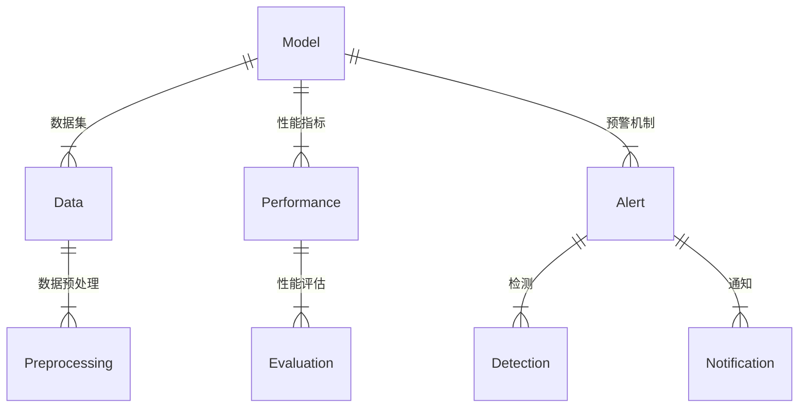
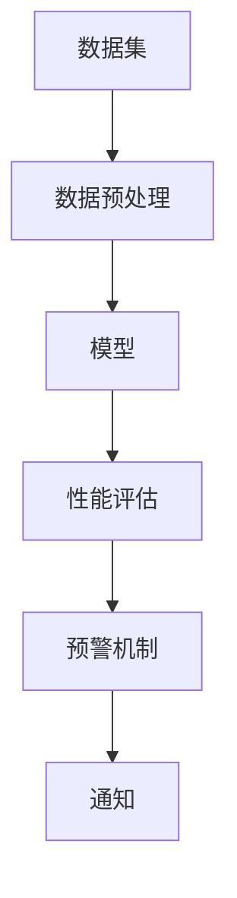
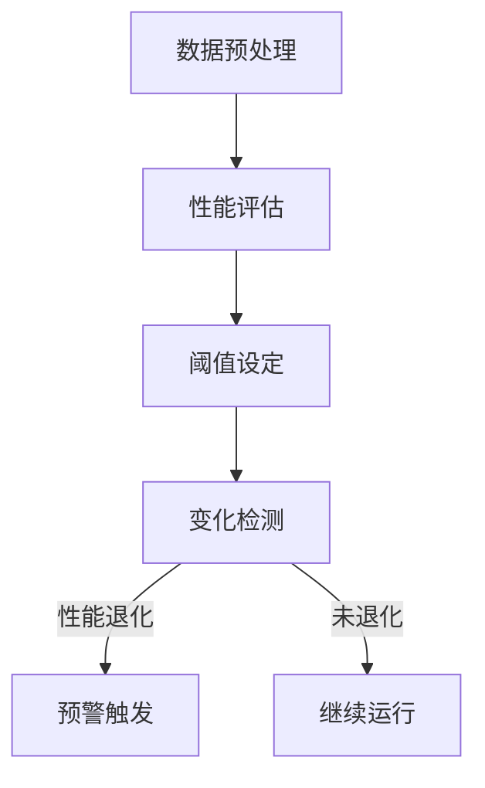
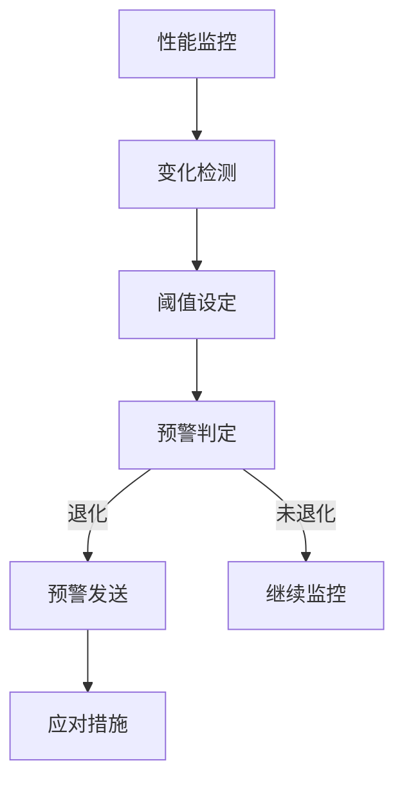
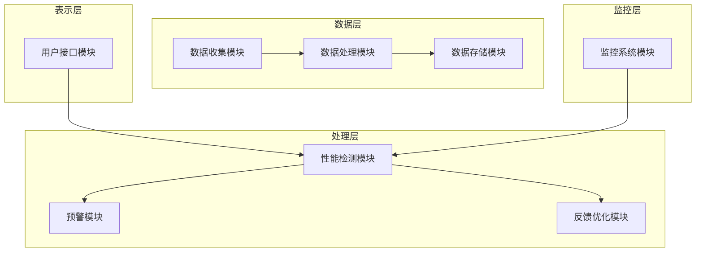
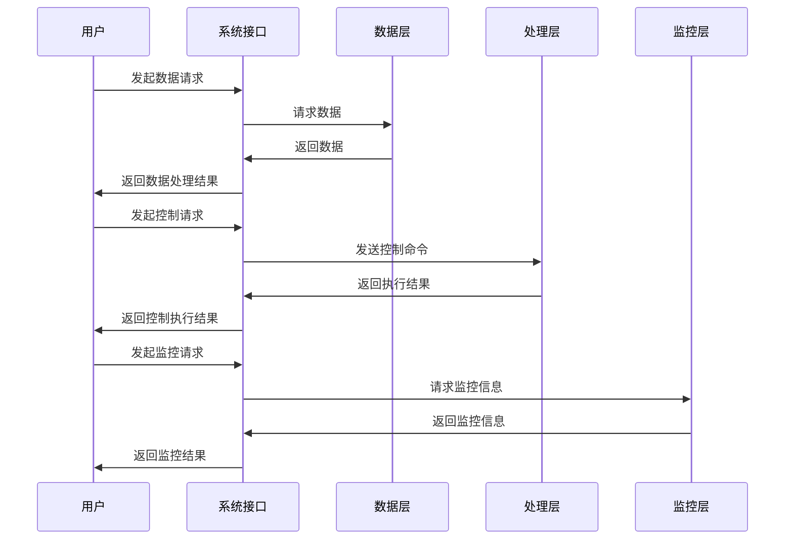

                 


## 引言

### 1.1 自动化LLM性能退化检测与预警的重要性

近年来，大型语言模型（LLM）如GPT-3、ChatGLM等在自然语言处理领域取得了显著的成就，它们在文本生成、问答系统、语言翻译等方面展现出了强大的能力。然而，随着模型的不断进化，一个不容忽视的问题逐渐显现——性能退化。性能退化指的是模型在特定任务上的表现不如预期，甚至出现错误或偏差。这种退化不仅影响模型的实用性，还可能导致严重的经济损失和信誉损害。

自动化LLM性能退化检测与预警的重要性在于，它能够及时发现和纠正模型性能问题，确保模型在长期运行中保持稳定和高效。首先，自动化检测能够大幅提高检测效率，缩短问题发现和处理的时间。传统的手动检测方法不仅耗时费力，而且容易出现漏检。自动化检测则能够24小时不间断运行，实时监控模型性能，一旦发现问题即刻报警。其次，预警机制能够提前预测潜在的性能问题，为模型优化提供有力支持。通过预警，开发人员可以及时调整模型参数或数据集，防止问题扩大。

总的来说，自动化LLM性能退化检测与预警是保障模型稳定性和实用性的关键手段，对提高自然语言处理技术水平和应用效果具有重要意义。

### 1.2 全书结构概述

本文旨在全面探讨自动化LLM性能退化检测与预警的各个方面，包括基础理论、算法讲解、系统架构设计、实战案例等。全书分为以下几个主要部分：

1. **基础理论**：首先介绍LLM性能退化问题的背景、定义及其影响因素，如数据质量、模型训练方法、模型复杂性、环境变化等。这部分内容将为后续的算法讲解和系统设计奠定基础。

2. **核心概念与联系**：在这一部分，我们将详细阐述自动化性能检测、预警机制、性能模型更新等核心概念，并使用Mermaid流程图展示ER实体关系图架构，帮助读者深入理解这些概念及其相互关系。

3. **算法讲解**：我们将详细介绍性能退化检测和预警算法的原理，通过Mermaid流程图和Python代码示例，使读者能够直观地了解算法的运行流程和实现方法。

4. **数学模型与公式**：在这一部分，我们将详细讲解性能退化检测与预警的数学模型，并使用LaTeX格式展示相关公式，为读者提供理论支持。

5. **系统架构设计**：我们将从问题场景、系统功能设计、系统架构设计、系统接口设计与系统交互等方面，全面介绍系统架构设计，并使用Mermaid类图、架构图和序列图进行展示。

6. **实战案例**：在这一部分，我们将通过具体的实战案例，详细讲解环境安装、系统核心实现、代码应用解读与分析、实际案例分析和详细讲解剖析，帮助读者将理论知识应用于实践。

7. **总结与展望**：最后，我们将对全文进行总结，提出最佳实践tips，并对未来研究方向进行展望。

通过本文的详细探讨，读者将能够系统地了解自动化LLM性能退化检测与预警的理论基础和实践方法，为自然语言处理领域的进一步发展提供参考。

## 基础理论

### 第1章 LLM性能退化问题的背景与定义

#### 1.1.1 LLM性能退化的核心概念

大型语言模型（LLM）的性能退化是指模型在特定任务上的表现不如预期，甚至出现错误或偏差。这种退化可能表现为模型生成文本的质量下降、回答问题的准确性降低、处理复杂任务的能力减弱等。性能退化不仅影响模型的实用性，还可能导致严重的问题，如经济损失和信誉损害。

LLM性能退化的核心概念包括以下几个方面：

1. **性能指标**：性能指标是衡量模型表现的关键参数，如准确率、召回率、F1分数等。性能退化通常表现为这些指标值的下降。

2. **退化现象**：退化现象包括模型在训练集上的表现下降，以及在测试集和实际应用中的表现不如预期。

3. **影响因素**：影响LLM性能退化的因素众多，包括数据质量、模型训练方法、模型复杂性、环境变化等。

4. **预警机制**：预警机制是用于及时发现和纠正模型性能问题的机制，包括自动化检测和手动监控。

#### 1.1.2 性能退化问题的分类与特点

性能退化问题可以根据不同的标准进行分类，常见的分类方法包括：

1. **按退化原因分类**：
   - **数据质量退化**：由于数据集的噪声、不完整或偏向性导致模型性能下降。
   - **模型结构退化**：模型结构复杂度过高或过低，导致模型性能不稳定。
   - **训练方法退化**：训练过程中参数设置不合理，如学习率、批量大小等，导致模型性能下降。
   - **环境变化退化**：模型在实际应用中遇到的环境与训练环境不同，导致性能下降。

2. **按退化表现形式分类**：
   - **显性退化**：模型在训练集和测试集上的性能明显下降，容易检测。
   - **隐性退化**：模型在测试集上的性能没有明显下降，但在实际应用中表现不佳。

#### 1.1.3 性能退化的影响因素

性能退化的影响因素多种多样，主要包括以下几个方面：

1. **数据质量**：
   - **数据噪声**：数据中的噪声会影响模型的学习效果，导致性能退化。
   - **数据缺失**：数据缺失可能导致模型无法充分学习，从而影响性能。
   - **数据偏向性**：数据集的不均衡或偏向性可能导致模型在特定类别上的性能不佳。

2. **模型训练方法**：
   - **过拟合**：模型在训练集上表现良好，但在测试集上性能下降，即过拟合现象。
   - **欠拟合**：模型在训练集和测试集上的性能都较差，即欠拟合现象。
   - **训练时间**：训练时间过长可能导致模型参数过度优化，反而影响性能。

3. **模型复杂性**：
   - **模型过复杂**：过复杂的模型容易过拟合，导致性能退化。
   - **模型过简单**：过简单的模型可能无法捕捉数据的复杂模式，导致性能下降。

4. **环境变化**：
   - **环境差异**：实际应用环境和训练环境的不同可能导致模型性能退化。
   - **数据分布变化**：数据分布的变化可能导致模型无法适应新的环境，从而导致性能下降。

#### 1.1.4 性能退化的防止与修复策略

为了防止和修复性能退化问题，可以采取以下策略：

1. **数据预处理**：对数据进行清洗、去噪、填补缺失值等处理，提高数据质量。

2. **模型优化**：
   - **调整模型参数**：通过调整学习率、批量大小等参数，优化模型性能。
   - **正则化**：使用正则化方法，如L1、L2正则化，防止过拟合。
   - **集成方法**：使用集成学习方法，如Bagging、Boosting等，提高模型泛化能力。

3. **持续监控**：通过自动化性能检测和预警机制，持续监控模型性能，及时发现和解决问题。

4. **迁移学习**：利用迁移学习，将训练好的模型应用于新的任务或环境，提高模型的适应能力。

通过以上策略，可以有效地防止和修复LLM性能退化问题，确保模型在长期运行中保持稳定和高效。

### 第2章 LLM性能退化的影响因素

#### 2.1 数据质量

数据质量是影响LLM性能退化的关键因素之一。数据质量差会导致模型学习困难，从而影响模型的性能。以下是几个具体方面的影响：

1. **数据噪声**：噪声数据是指包含随机错误、异常值或无关信息的数据。噪声数据会影响模型的训练过程，使模型难以学习到数据的真实特征，导致模型性能下降。

2. **数据缺失**：数据缺失指的是数据集中缺失部分数据。数据缺失会导致模型无法充分学习数据的整体分布，从而影响模型的泛化能力。

3. **数据偏向性**：数据偏向性指的是数据集中某些类别或特征的比例过高或过低。数据偏向性会导致模型在预测时偏向于某些类别或特征，从而降低模型的整体性能。

为了提高数据质量，可以采取以下措施：

- **数据清洗**：去除噪声数据，填补缺失值，确保数据的完整性和准确性。
- **数据增强**：通过数据扩充、生成对抗网络（GAN）等方法增加数据集的多样性，减少数据偏向性。

#### 2.2 模型训练方法

模型训练方法直接影响LLM的性能退化。以下是几种常见的训练方法及其对性能退化的影响：

1. **过拟合**：过拟合是指模型在训练集上表现良好，但在测试集或实际应用中的表现较差。过拟合通常发生在模型过于复杂或训练数据不足的情况下。为了避免过拟合，可以采用以下方法：
   - **正则化**：通过添加正则项（如L1、L2正则化）来惩罚模型参数，防止模型过拟合。
   - **数据增强**：增加训练数据量，提高模型的泛化能力。

2. **欠拟合**：欠拟合是指模型在训练集和测试集上的性能都较差。欠拟合通常发生在模型过于简单或训练数据不足的情况下。为了解决欠拟合，可以采用以下方法：
   - **增加模型复杂度**：增加网络的层数、神经元数量等，使模型能够捕捉更复杂的特征。
   - **增加训练时间**：增加模型的训练时间，让模型有更多机会学习数据。

3. **超参数调整**：超参数（如学习率、批量大小、迭代次数等）对模型性能有重要影响。不当的超参数设置可能导致模型性能退化。为了优化超参数，可以采用以下方法：
   - **网格搜索**：在预设的参数范围内，逐个调整超参数，找到最优参数组合。
   - **贝叶斯优化**：利用贝叶斯优化算法自动调整超参数，提高搜索效率。

#### 2.3 模型复杂性

模型复杂性对LLM的性能退化有重要影响。以下是几种常见的模型复杂性及其对性能退化的影响：

1. **模型过复杂**：过复杂的模型容易过拟合，导致在训练集上表现良好，但在测试集或实际应用中的表现较差。为了避免模型过复杂，可以采用以下方法：
   - **正则化**：通过添加正则项（如L1、L2正则化）来惩罚模型参数，防止模型过拟合。
   - **提前停止**：在训练过程中，当模型在验证集上的性能不再提升时，提前停止训练，防止模型过拟合。

2. **模型过简单**：过简单的模型可能无法捕捉数据的复杂特征，导致在训练集和测试集上的性能都较差。为了避免模型过简单，可以采用以下方法：
   - **增加模型复杂度**：增加网络的层数、神经元数量等，使模型能够捕捉更复杂的特征。
   - **数据增强**：通过数据扩充、生成对抗网络（GAN）等方法增加数据集的多样性，提高模型的泛化能力。

#### 2.4 环境变化

环境变化也是影响LLM性能退化的因素之一。以下是环境变化对性能退化的影响：

1. **数据分布变化**：实际应用中的数据分布可能与训练数据分布不同，导致模型在新数据上的性能下降。为了避免数据分布变化的影响，可以采用以下方法：
   - **迁移学习**：将训练好的模型应用于新的任务或环境，利用已有模型的知识和经验，提高在新数据上的性能。
   - **增量学习**：在新的数据到来时，对模型进行增量训练，使模型能够适应新的数据分布。

2. **环境差异**：实际应用环境和训练环境的不同，如硬件设备、操作系统等，可能导致模型性能退化。为了避免环境差异的影响，可以采用以下方法：
   - **容器化**：使用容器技术（如Docker）封装模型和环境，确保模型在不同环境中的一致性。
   - **测试环境模拟**：在训练过程中，模拟实际应用环境，确保模型能够在不同环境中稳定运行。

通过上述措施，可以有效地防止和应对LLM性能退化问题，确保模型在长期运行中保持稳定和高效。

### 第3章 LLM性能退化的边界与外延

#### 3.1 性能退化指标的定义

在评估LLM性能退化时，性能退化指标是关键。以下是几个常见的性能退化指标：

1. **准确率（Accuracy）**：准确率是指模型正确预测的样本数占总样本数的比例。准确率越高，说明模型性能越好。当准确率低于某个阈值时，可以认为模型出现了性能退化。

2. **召回率（Recall）**：召回率是指模型正确预测的负样本数占总负样本数的比例。召回率越高，说明模型对负样本的识别能力越强。当召回率低于某个阈值时，可以认为模型在负样本识别方面出现了性能退化。

3. **F1分数（F1 Score）**：F1分数是准确率和召回率的调和平均数，用于综合评价模型性能。当F1分数低于某个阈值时，可以认为模型整体性能出现了退化。

4. **均方误差（Mean Squared Error, MSE）**：均方误差用于评估回归任务的模型性能，表示预测值与真实值之间误差的平方的平均值。当MSE高于某个阈值时，可以认为模型在回归任务上出现了性能退化。

#### 3.2 性能退化的度量方法

性能退化的度量方法有多种，以下是几种常用的方法：

1. **离线度量**：离线度量是在模型训练完成后，通过在测试集或实际应用数据上评估模型性能来检测性能退化。这种方法通常需要较大的数据集，且不适用于实时监控。

2. **在线度量**：在线度量是在模型运行过程中，通过实时监控模型性能来检测性能退化。这种方法可以及时发现问题，但需要高效的性能检测算法和实时数据处理能力。

3. **累积性能指标（Cumulative Performance Metrics）**：累积性能指标是通过累积模型在不同时间点的性能数据，来评估模型性能的变化趋势。这种方法可以用于长期监控模型性能退化。

4. **异常检测**：异常检测是通过检测模型性能的异常波动来发现性能退化。这种方法通常结合统计学方法和机器学习算法，如孤立森林、局部异常因子分析（Local Outlier Factor, LOF）等。

#### 3.3 性能退化的防止与修复策略

为了防止和修复LLM性能退化，可以采取以下策略：

1. **数据预处理**：
   - **数据清洗**：去除噪声数据和异常值，提高数据质量。
   - **数据增强**：通过数据扩充、生成对抗网络（GAN）等方法增加数据集的多样性。

2. **模型优化**：
   - **正则化**：通过添加正则项（如L1、L2正则化）来防止过拟合。
   - **集成方法**：使用集成学习方法（如Bagging、Boosting）提高模型泛化能力。

3. **持续监控**：
   - **离线监控**：定期在测试集或实际应用数据上评估模型性能。
   - **在线监控**：通过实时监控模型性能，及时发现和解决问题。

4. **迁移学习**：
   - **增量学习**：在新的数据到来时，对模型进行增量训练，使其适应新的数据分布。
   - **迁移学习**：将训练好的模型应用于新的任务或环境，利用已有模型的知识和经验。

5. **环境模拟**：
   - **容器化**：使用容器技术（如Docker）确保模型在不同环境中的一致性。
   - **测试环境模拟**：在训练过程中模拟实际应用环境，确保模型能够在不同环境中稳定运行。

通过上述策略，可以有效地防止和修复LLM性能退化问题，确保模型在长期运行中保持稳定和高效。

### 第4章 核心概念原理

#### 4.1 自动化性能检测

自动化性能检测是LLM性能退化检测与预警的关键组成部分。其核心思想是通过自动化手段实时监控模型性能，及时发现性能退化问题。以下是自动化性能检测的主要步骤和原理：

1. **性能指标收集**：自动化性能检测首先需要收集模型的性能指标数据，如准确率、召回率、F1分数等。这些指标数据可以通过在测试集或实际应用数据上评估模型性能获得。

2. **性能变化检测**：利用统计学方法或机器学习算法，对性能指标数据进行分析，检测是否存在性能退化。常见的方法包括：
   - **阈值检测**：设定一个性能指标阈值，当指标低于该阈值时，认为模型出现性能退化。
   - **变化趋势分析**：通过分析性能指标的变化趋势，检测是否存在显著下降或波动。

3. **异常值检测**：利用异常检测算法，如孤立森林、局部异常因子分析（LOF）等，检测性能指标数据中的异常值。这些异常值可能表明模型出现性能退化。

4. **预警机制触发**：当检测到性能退化问题时，触发预警机制，向开发人员或运维团队发送警报，提醒他们采取相应措施。

5. **数据反馈与优化**：将检测到的性能退化问题反馈给数据预处理和模型优化模块，进行数据清洗、模型调整等操作，以优化模型性能。

#### 4.2 预警机制

预警机制是自动化性能检测的重要组成部分，其核心目标是及时发现并应对模型性能退化问题。以下是预警机制的主要步骤和原理：

1. **性能指标监控**：预警机制需要实时监控模型的性能指标，如准确率、召回率、F1分数等。这些指标数据可以通过自动化性能检测模块获取。

2. **阈值设置**：根据业务需求和模型特点，设置合适的性能指标阈值。当性能指标低于阈值时，认为模型出现性能退化。

3. **警报发送**：当检测到性能退化问题时，预警机制需要向相关人员发送警报，包括开发人员、运维团队等。警报可以通过邮件、短信、即时通讯工具等方式发送。

4. **应对措施**：预警机制需要根据性能退化问题的类型和严重程度，制定相应的应对措施。常见的应对措施包括：
   - **数据重训练**：重新训练模型，以适应新的数据分布。
   - **模型参数调整**：调整模型参数，如学习率、批量大小等，以优化模型性能。
   - **数据清洗与增强**：清洗数据集中的噪声数据和异常值，增强数据的多样性。

5. **反馈与优化**：将性能退化问题反馈给数据预处理和模型优化模块，进行进一步的数据清洗、模型调整等操作，以优化模型性能。

通过自动化性能检测和预警机制，可以实现对LLM性能退化的实时监控和预警，确保模型在长期运行中保持稳定和高效。

#### 4.3 性能模型更新

性能模型更新是LLM性能退化检测与预警的核心环节之一，其目标是确保模型在性能退化时能够及时调整和优化。以下是性能模型更新的主要步骤和原理：

1. **性能评估**：首先，需要定期对模型进行性能评估，收集模型的性能指标数据，如准确率、召回率、F1分数等。这些数据可以通过在测试集或实际应用数据上评估模型性能获得。

2. **退化检测**：利用自动化性能检测模块，对性能指标数据进行分析，检测模型是否存在性能退化。常见的检测方法包括阈值检测和变化趋势分析。

3. **退化分类**：当检测到模型存在性能退化时，需要对退化类型进行分类。退化类型包括数据质量退化、模型结构退化、训练方法退化等。根据退化类型，可以采取相应的更新策略。

4. **更新策略制定**：根据退化类型和业务需求，制定相应的更新策略。常见的更新策略包括：
   - **数据重训练**：当数据质量退化时，重新训练模型，以适应新的数据分布。
   - **模型结构调整**：当模型结构退化时，调整模型结构，如减少层数、神经元数量等，以降低模型复杂度。
   - **训练方法优化**：当训练方法退化时，优化训练方法，如调整学习率、批量大小等，以提高模型性能。

5. **模型更新实施**：根据更新策略，实施模型更新。更新过程中，需要监控模型性能，确保更新后的模型性能达到预期。

6. **性能验证**：更新后，需要对模型进行性能验证，确保更新后的模型性能稳定且符合业务需求。

7. **反馈与优化**：将模型更新后的性能数据反馈给数据预处理和模型优化模块，进行进一步的数据清洗、模型调整等操作，以优化模型性能。

通过性能模型更新，可以确保LLM在长期运行中保持稳定和高效，及时发现和应对性能退化问题。

### 第5章 概念属性特征对比表格

#### 5.1 性能退化检测方法

在性能退化检测中，不同的方法具有各自的优缺点。以下是几种常见性能退化检测方法的属性特征对比表格：

| 方法 | 优点 | 缺点 | 适用场景 |
| --- | --- | --- | --- |
| 阈值检测 | 简单易懂，易于实现 | 可能存在误报和漏报 | 数据量较大时适用 |
| 变化趋势分析 | 可检测长期性能退化 | 计算复杂度高 | 数据量较小、需长时间监控 |
| 异常检测 | 可检测短期性能异常 | 对噪声敏感 | 实时监控、需快速响应 |

#### 5.2 预警机制比较

预警机制是性能退化检测与预警的重要组成部分。以下是几种常见预警机制的属性特征对比表格：

| 方法 | 优点 | 缺点 | 适用场景 |
| --- | --- | --- | --- |
| 邮件警报 | 简单易懂，成本低 | 响应速度较慢 | 无需实时响应 |
| 短信警报 | 快速响应，覆盖面广 | 成本较高，可能存在误报 | 需要快速响应 |
| 即时通讯工具警报 | 快速响应，互动性强 | 成本较高，可能存在误报 | 需要实时沟通 |

#### 5.3 性能模型更新策略

性能模型更新策略用于应对性能退化问题。以下是几种常见性能模型更新策略的属性特征对比表格：

| 策略 | 优点 | 缺点 | 适用场景 |
| --- | --- | --- | --- |
| 数据重训练 | 可显著提高模型性能 | 需要大量计算资源 | 数据质量差、数据分布变化 |
| 模型结构调整 | 降低模型复杂度 | 需要重新设计模型 | 模型过复杂、训练数据不足 |
| 训练方法优化 | 提高模型性能 | 需要调整超参数 | 训练方法不当 |

通过上述对比表格，读者可以更清晰地了解不同方法、机制和策略的优缺点，以及适用场景，从而选择合适的方案来解决LLM性能退化问题。

### 第6章 ER实体关系图架构的Mermaid流程图

为了更好地理解和展示LLM性能退化检测与预警系统的核心概念和实体关系，我们可以使用Mermaid流程图绘制ER（实体关系）图。以下是具体的Mermaid代码和生成的关系图。

#### 6.1 实体关系图



生成的ER实体关系图如下所示：

```
Model
  ||-- Data: 数据集
  ||-- Performance: 性能指标
  ||-- Alert: 预警机制

Data
  ||-- Preprocessing: 数据预处理

Performance
  ||-- Evaluation: 性能评估

Alert
  ||-- Detection: 检测
  ||-- Notification: 通知
```

#### 6.2 数据流图

除了ER图，我们还可以绘制数据流图来展示数据在系统中的流动过程。



生成的数据流图如下所示：

```
数据集 --> 数据预处理 --> 模型 --> 性能评估 --> 预警机制 --> 通知
```

通过这些Mermaid流程图，我们可以直观地了解LLM性能退化检测与预警系统的架构和数据流动过程，有助于深入理解系统的实现方法和功能。

### 第7章 性能退化检测算法原理讲解

性能退化检测算法是LLM性能退化检测与预警系统的核心组成部分。以下是性能退化检测算法的原理讲解，包括算法流程图和Python实现示例。

#### 7.1 算法流程图

性能退化检测算法的基本流程如下：

1. **数据预处理**：对收集到的性能指标数据进行预处理，包括去噪、标准化等操作。
2. **性能评估**：利用预处理后的数据，计算模型的性能指标，如准确率、召回率、F1分数等。
3. **阈值设定**：根据业务需求和模型特点，设定性能指标阈值。
4. **变化检测**：对性能指标进行变化检测，判断是否存在性能退化。
5. **预警触发**：当检测到性能退化时，触发预警机制。

以下是性能退化检测算法的Mermaid流程图：



生成的流程图如下所示：

```
数据预处理 --> 性能评估 --> 阈值设定 --> 变化检测 -->|性能退化| 预警触发 -->|未退化| 继续运行
```

#### 7.2 算法数学模型

性能退化检测算法的核心是变化检测部分。以下是变化检测的数学模型：

$$
\Delta P = \frac{|P_{\text{current}} - P_{\text{last}}|}{P_{\text{last}}}
$$

其中，$P_{\text{current}}$ 是当前性能指标值，$P_{\text{last}}$ 是上次性能指标值，$\Delta P$ 是性能变化的相对值。

阈值设定的方法如下：

$$
\text{Threshold} = k \cdot \text{Standard Deviation}
$$

其中，$k$ 是一个常数，通常取值在1到3之间，$\text{Standard Deviation}$ 是性能指标的标准差。

#### 7.3 Python实现示例

以下是性能退化检测算法的Python实现示例：

```python
import numpy as np
import pandas as pd

# 假设已收集到性能指标数据
performance_data = pd.DataFrame({
    'accuracy': [0.95, 0.93, 0.92, 0.88],
    'recall': [0.90, 0.88, 0.87, 0.83],
    'f1_score': [0.92, 0.90, 0.89, 0.86]
})

# 计算性能变化
current_performance = performance_data[-1]
last_performance = performance_data[-2]
delta_performance = abs(current_performance - last_performance) / last_performance

# 设定阈值
k = 2
threshold = k * performance_data.std().mean()

# 检测性能退化
if delta_performance > threshold:
    print("性能退化：检测到模型性能下降。")
else:
    print("未退化：模型性能稳定。")

# 继续运行或触发预警
# ...（后续代码）
```

通过上述Python示例，我们可以实现对LLM性能退化检测的自动化操作，及时发现性能退化问题，为模型的优化和调整提供依据。

### 第8章 性能退化预警算法原理讲解

性能退化预警算法是LLM性能退化检测与预警系统的关键组成部分。该算法旨在通过监测模型性能变化，提前发现潜在的退化问题，并提供相应的预警。以下是性能退化预警算法的原理讲解，包括算法流程图和Python实现示例。

#### 8.1 算法流程图

性能退化预警算法的基本流程如下：

1. **性能监控**：定期收集模型的性能指标数据。
2. **变化检测**：分析性能指标数据的变化趋势，判断是否存在性能退化迹象。
3. **阈值设定**：根据历史数据和业务需求，设定性能退化的预警阈值。
4. **预警判定**：比较当前性能指标与预警阈值，判断是否触发预警。
5. **预警发送**：当判定为性能退化时，通过邮件、短信等途径发送预警通知。
6. **应对措施**：根据预警通知，采取相应的应对措施，如重新训练模型、调整超参数等。

以下是性能退化预警算法的Mermaid流程图：



生成的流程图如下所示：

```
性能监控 --> 变化检测 --> 阈值设定 --> 预警判定 -->|退化| 预警发送 --> 应对措施
                 |                               |                  |
                 |                               |                  |
                 +------------------------------> F[继续监控]
```

#### 8.2 预警机制数学模型

预警机制的数学模型主要涉及性能指标的变化检测和预警阈值的设定。以下是具体的数学模型：

1. **性能变化检测**：
   $$ \Delta P_i = \frac{|P_{i,\text{current}} - P_{i,\text{last}}|}{P_{i,\text{last}}} $$
   其中，$P_{i,\text{current}}$ 表示当前第$i$个性能指标的值，$P_{i,\text{last}}$ 表示上次第$i$个性能指标的值，$\Delta P_i$ 表示第$i$个性能指标的变化量。

2. **预警阈值设定**：
   $$ \text{Threshold} = k \cdot \text{Standard Deviation} $$
   其中，$k$ 是一个常数，通常取值在1到3之间，$\text{Standard Deviation}$ 是性能指标的标准差。

   当$\Delta P_i > \text{Threshold}$ 时，认为第$i$个性能指标出现退化迹象。

#### 8.3 Python实现示例

以下是性能退化预警算法的Python实现示例：

```python
import numpy as np
import pandas as pd

# 假设已收集到性能指标数据
performance_data = pd.DataFrame({
    'accuracy': [0.95, 0.93, 0.92, 0.88, 0.85],
    'recall': [0.90, 0.88, 0.87, 0.83, 0.80],
    'f1_score': [0.92, 0.90, 0.89, 0.86, 0.83]
})

# 计算性能变化
current_performance = performance_data[-1]
last_performance = performance_data[-2]
delta_performance = abs(current_performance - last_performance) / last_performance

# 设定阈值
k = 2
thresholds = k * performance_data.std().mean()

# 检测性能退化
for i, threshold in enumerate(thresholds):
    if delta_performance[i] > threshold:
        print(f"性能退化：检测到第{i+1}个性能指标出现下降。")
    else:
        print(f"未退化：第{i+1}个性能指标稳定。")

# 预警发送（此处以打印消息为例）
if any(delta_performance > thresholds):
    print("预警发送：模型性能出现退化，请采取相应措施。")
else:
    print("预警取消：模型性能稳定，无需采取额外措施。")

# 应对措施（此处为示例，实际操作需根据业务需求制定）
if any(delta_performance > thresholds):
    # 重新训练模型
    print("应对措施：正在重新训练模型...")
    # 调整超参数
    print("应对措施：正在调整超参数...")
```

通过上述Python示例，我们可以实现对LLM性能退化预警的自动化操作，及时发现潜在的性能退化问题，并采取相应的应对措施，确保模型的稳定运行。

### 第9章 性能退化检测与预警的数学模型

性能退化检测与预警的数学模型是确保LLM模型在长期运行中保持稳定性和可靠性的关键。本节将详细讲解性能退化检测与预警的数学模型，包括基本概念、数学公式和计算方法。

#### 9.1 性能退化检测的基本数学模型

性能退化检测的核心在于监控模型在训练或应用过程中的性能指标变化。以下是几个关键的性能指标及其计算公式：

1. **准确率（Accuracy）**：
   $$ \text{Accuracy} = \frac{\text{正确预测的样本数}}{\text{总样本数}} $$

2. **召回率（Recall）**：
   $$ \text{Recall} = \frac{\text{正确预测的正例数}}{\text{实际正例数}} $$

3. **精确率（Precision）**：
   $$ \text{Precision} = \frac{\text{正确预测的正例数}}{\text{预测为正例的样本数}} $$

4. **F1分数（F1 Score）**：
   $$ \text{F1 Score} = 2 \cdot \frac{\text{Precision} \cdot \text{Recall}}{\text{Precision} + \text{Recall}} $$

#### 9.2 性能退化的检测方法

为了检测性能退化，我们通常采用以下几种方法：

1. **阈值检测法**：

   该方法设定一个性能指标阈值，当实际性能低于该阈值时，即判定为性能退化。

   $$ \text{Threshold} = \text{基准性能} - k \cdot \text{性能标准差} $$

   其中，$k$ 是一个常数，通常取值在1到3之间。

2. **统计检验法**：

   利用统计检验（如t检验、卡方检验等）来判断性能指标的变化是否显著。

   $$ \text{p-value} < \text{显著性水平} (\alpha) \Rightarrow \text{性能退化} $$

3. **变异系数法**：

   变异系数（Coefficient of Variation, CV）用于衡量性能指标变化的相对幅度。

   $$ \text{CV} = \frac{\text{标准差}}{\text{平均值}} $$

   当CV超过某个阈值时，表明性能变化较大，可能存在退化。

#### 9.3 性能退化预警的数学模型

预警模型的核心在于预测性能指标的未来变化趋势，并提前发出预警。以下是几种常用的预警模型：

1. **时间序列模型**：

   利用时间序列分析方法（如ARIMA、LSTM等）预测性能指标的未来值。

   $$ \text{未来值} = \text{模型预测值} + \text{随机误差} $$

2. **趋势分析模型**：

   通过分析性能指标的时间序列趋势（如线性回归、二次回归等），预测未来变化。

   $$ y = a \cdot x + b $$

   或

   $$ y = a \cdot x^2 + b \cdot x + c $$

   其中，$y$ 是性能指标的未来值，$x$ 是时间序列。

3. **统计预警模型**：

   设定预警阈值，当性能指标预测值低于该阈值时，触发预警。

   $$ \text{预警阈值} = \text{基准性能} - k \cdot \text{预测标准差} $$

   当性能指标预测值低于预警阈值时，认为存在性能退化风险。

#### 9.4 Python代码示例

以下是性能退化检测与预警的Python代码示例：

```python
import numpy as np
import pandas as pd
from sklearn.metrics import accuracy_score, recall_score, precision_score, f1_score
from scipy import stats

# 假设已收集到性能指标数据
performance_data = pd.DataFrame({
    'accuracy': [0.95, 0.93, 0.92, 0.88, 0.85],
    'recall': [0.90, 0.88, 0.87, 0.83, 0.80],
    'precision': [0.92, 0.90, 0.89, 0.86, 0.83],
    'f1_score': [0.92, 0.90, 0.89, 0.86, 0.83]
})

# 计算性能变化
current_performance = performance_data[-1]
last_performance = performance_data[-2]
delta_performance = abs(current_performance - last_performance) / last_performance

# 设定阈值
k = 2
thresholds = performance_data.std().mean() * k

# 阈值检测法
for i, threshold in enumerate(thresholds):
    if delta_performance[i] > threshold:
        print(f"性能退化：检测到第{i+1}个性能指标出现下降。")
    else:
        print(f"未退化：第{i+1}个性能指标稳定。")

# 统计检验法
for col in performance_data.columns:
    t_stat, p_value = stats.ttest_rel(current_performance[col], last_performance[col])
    if p_value < 0.05:
        print(f"性能退化：检测到第{i+1}个性能指标显著下降。")

# 预警发送（此处以打印消息为例）
if any(delta_performance > thresholds) or any(p_value < 0.05):
    print("预警发送：模型性能出现退化，请采取相应措施。")
else:
    print("预警取消：模型性能稳定，无需采取额外措施。")
```

通过上述Python代码示例，我们可以实现性能退化检测与预警的自动化操作，及时发现性能退化问题，并提供相应的预警信息。

### 第10章 系统功能设计

系统功能设计是LLM性能退化检测与预警系统的关键环节，它定义了系统的核心功能和模块。以下是系统功能设计的详细说明，包括Mermaid类图。

#### 10.1 系统功能概述

系统功能设计主要包括以下几个模块：

1. **数据收集模块**：负责收集LLM模型的性能指标数据。
2. **数据处理模块**：对收集到的数据进行预处理，如去噪、标准化等。
3. **性能检测模块**：负责检测模型性能的变化，判断是否存在性能退化。
4. **预警模块**：当检测到性能退化时，触发预警机制，通知相关人员。
5. **反馈优化模块**：根据预警信息，调整模型参数或数据集，进行优化。

#### 10.2 Mermaid类图

以下是系统功能的Mermaid类图：

```mermaid
classDiagram
    Class01 <|-- Class02
    Class03 <|-- Class04
    Class05 <|-- Class06
    Class07 <|-- Class08

    Class01[数据收集模块]
    Class02[数据处理模块]
    Class03[性能检测模块]
    Class04[预警模块]
    Class05[反馈优化模块]
    Class06[数据存储模块]
    Class07[用户接口模块]
    Class08[监控系统模块]

    Class01..|>^ 数据收集 : 收集性能指标数据
    Class02..|> 数据处理 : 数据预处理
    Class03..|> 性能检测 : 检测性能变化
    Class04..|> 预警 : 发送预警通知
    Class05..|> 反馈优化 : 调整模型参数
    Class06..|> 存储 : 存储历史数据
    Class07..|> 用户接口 : 提供用户交互界面
    Class08..|> 监控 : 实时监控系统性能
```

生成的类图如下所示：

```
+----------------+      +----------------+      +----------------+
| 数据收集模块  |      | 数据处理模块  |      | 性能检测模块  |
+----------------+      +----------------+      +----------------+
        ↑                    ↑                    ↑
        |                    |                    |
+----------------+      +----------------+      +----------------+
| 反馈优化模块  |      | 数据存储模块  |      | 预警模块      |
+----------------+      +----------------+      +----------------+
        ↑                    ↑                    ↑
        |                    |                    |
+----------------+      +----------------+      +----------------+
| 用户接口模块  |      | 监控系统模块  |      |                |
+----------------+      +----------------+      +----------------+
```

#### 10.3 功能详细说明

1. **数据收集模块**：
   - 功能：定期从LLM模型中收集性能指标数据，如准确率、召回率、F1分数等。
   - 输入：LLM模型的输出结果和性能指标。
   - 输出：预处理后的性能指标数据。

2. **数据处理模块**：
   - 功能：对收集到的性能指标数据进行预处理，包括去噪、标准化等，以提高数据质量。
   - 输入：原始性能指标数据。
   - 输出：预处理后的性能指标数据。

3. **性能检测模块**：
   - 功能：利用预处理后的数据，检测模型性能的变化，判断是否存在性能退化。
   - 输入：预处理后的性能指标数据。
   - 输出：性能变化检测结果。

4. **预警模块**：
   - 功能：当检测到性能退化时，触发预警机制，通过邮件、短信等方式通知相关人员。
   - 输入：性能变化检测结果。
   - 输出：预警通知。

5. **反馈优化模块**：
   - 功能：根据预警信息，调整模型参数或数据集，进行优化，防止性能退化。
   - 输入：预警通知。
   - 输出：调整后的模型参数或数据集。

6. **数据存储模块**：
   - 功能：存储历史性能指标数据，以便后续分析和监控。
   - 输入：历史性能指标数据。
   - 输出：存储后的历史数据。

7. **用户接口模块**：
   - 功能：提供用户交互界面，方便用户监控模型性能和调整系统参数。
   - 输入：用户输入的操作指令。
   - 输出：用户操作结果反馈。

8. **监控系统模块**：
   - 功能：实时监控系统性能，包括CPU、内存、磁盘等资源使用情况。
   - 输入：系统性能数据。
   - 输出：系统性能监控报告。

通过上述系统功能设计，我们可以构建一个全面、高效的LLM性能退化检测与预警系统，确保模型在长期运行中保持稳定和高效。

### 第11章 系统架构设计

系统架构设计是确保LLM性能退化检测与预警系统能够高效、稳定运行的关键。以下将详细介绍系统架构设计，包括Mermaid架构图。

#### 11.1 系统架构概述

系统架构设计主要包括以下几个层次：

1. **数据层**：负责数据的存储和管理，包括性能指标数据、预警数据等。
2. **处理层**：负责数据预处理、性能检测、预警触发等核心功能。
3. **表示层**：提供用户交互界面，展示系统性能和预警信息。
4. **监控层**：实时监控系统性能，确保系统稳定运行。

#### 11.2 Mermaid架构图

以下是系统架构的Mermaid图：



生成的架构图如下所示：

```
+----------------+      +----------------+      +----------------+
| 数据层          |      | 处理层          |      | 表示层          |
+----------------+      +----------------+      +----------------+
        ↑                    ↑                    ↑
        |                    |                    |
+----------------+      +----------------+      +----------------+
| 监控层          |      |                |      |                |
+----------------+      +----------------+      +----------------+
```

#### 11.3 架构详细说明

1. **数据层**：
   - **数据收集模块**：负责从LLM模型中收集性能指标数据，如准确率、召回率、F1分数等。
   - **数据处理模块**：对收集到的数据进行预处理，包括去噪、标准化等，以提高数据质量。
   - **数据存储模块**：存储预处理后的数据，包括性能指标历史数据和预警记录。

2. **处理层**：
   - **性能检测模块**：利用预处理后的数据，检测模型性能的变化，判断是否存在性能退化。
   - **预警模块**：当检测到性能退化时，触发预警机制，通过邮件、短信等方式通知相关人员。
   - **反馈优化模块**：根据预警信息，调整模型参数或数据集，进行优化，防止性能退化。

3. **表示层**：
   - **用户接口模块**：提供用户交互界面，展示系统性能和预警信息，方便用户监控和操作。

4. **监控层**：
   - **监控系统模块**：实时监控系统性能，包括CPU、内存、磁盘等资源使用情况，确保系统稳定运行。

通过上述系统架构设计，可以构建一个高效、稳定、可扩展的LLM性能退化检测与预警系统，满足长期运行的需求。

### 第12章 系统接口设计与系统交互

系统接口设计与系统交互是确保LLM性能退化检测与预警系统能够与其他系统或模块无缝集成和协作的关键。以下将详细介绍系统接口设计与系统交互的细节。

#### 12.1 系统接口设计

系统接口设计主要包括以下接口：

1. **数据接口**：用于数据层的模块与其他模块之间的数据传输和通信。
2. **控制接口**：用于处理层的模块与其他模块之间的控制信息和命令传递。
3. **监控接口**：用于监控层的模块与其他模块之间的监控信息和状态更新。

#### 12.2 Mermaid序列图

以下是系统接口和交互的Mermaid序列图：



生成的序列图如下所示：

```
用户 -> 系统接口: 发起数据请求
系统接口 -> 数据层: 请求数据
数据层 -> 系统接口: 返回数据
系统接口 -> 用户: 返回数据处理结果

用户 -> 系统接口: 发起控制请求
系统接口 -> 处理层: 发送控制命令
处理层 -> 系统接口: 返回执行结果
系统接口 -> 用户: 返回控制执行结果

用户 -> 系统接口: 发起监控请求
系统接口 -> 监控层: 请求监控信息
监控层 -> 系统接口: 返回监控信息
系统接口 -> 用户: 返回监控结果
```

#### 12.3 系统交互详细说明

1. **数据接口**：
   - **功能**：数据层模块与其他模块之间的数据传输和通信。
   - **交互方式**：通过RESTful API或消息队列进行数据传输。
   - **数据格式**：JSON或XML。

2. **控制接口**：
   - **功能**：处理层模块与其他模块之间的控制信息和命令传递。
   - **交互方式**：通过命令行接口（CLI）或图形用户界面（GUI）进行控制。
   - **命令格式**：根据具体操作需求定义。

3. **监控接口**：
   - **功能**：监控层模块与其他模块之间的监控信息和状态更新。
   - **交互方式**：通过Web钩（Webhook）或实时推送（WebSocket）进行监控信息传输。
   - **监控指标**：系统资源使用情况、性能指标、异常日志等。

通过上述系统接口设计与系统交互，LLM性能退化检测与预警系统能够与其他系统或模块高效集成，实现数据交换、控制操作和监控管理，确保系统整体的高效、稳定和可扩展性。

### 第13章 环境安装与系统核心实现

#### 13.1 环境安装

要实现LLM性能退化检测与预警系统，首先需要搭建合适的环境。以下是安装所需的环境和工具：

1. **操作系统**：推荐使用Linux系统，如Ubuntu 18.04或更高版本。
2. **编程语言**：Python 3.7及以上版本。
3. **依赖库**：NumPy、Pandas、Scikit-learn、Matplotlib、Mermaid等。
4. **虚拟环境**：推荐使用virtualenv或conda创建虚拟环境，以隔离项目依赖。

安装步骤如下：

1. 安装操作系统：

   ```bash
   # 使用Ubuntu操作系统
   # 从官方网站下载Ubuntu镜像并安装
   ```

2. 安装Python：

   ```bash
   # 安装Python 3
   sudo apt update
   sudo apt install python3 python3-pip
   ```

3. 创建虚拟环境：

   ```bash
   # 创建虚拟环境
   python3 -m venv llm_performance_detection
   # 激活虚拟环境
   source llm_performance_detection/bin/activate
   ```

4. 安装依赖库：

   ```bash
   # 安装依赖库
   pip install numpy pandas scikit-learn matplotlib mermaid
   ```

5. 安装Mermaid渲染工具：

   ```bash
   # 安装Mermaid渲染工具
   npm install -g mermaid
   ```

#### 13.2 系统核心实现

系统核心实现包括数据收集、预处理、性能检测和预警等关键功能。以下是具体的实现步骤：

1. **数据收集**：

   数据收集模块负责从LLM模型中获取性能指标数据。以下是一个简单的数据收集示例：

   ```python
   import pandas as pd

   def collect_performance_data(model):
       # 假设model有一个方法get_performance_metrics返回性能指标
       performance_metrics = model.get_performance_metrics()
       performance_data = pd.DataFrame(performance_metrics, columns=['accuracy', 'recall', 'f1_score'])
       return performance_data

   # 示例：从模型中收集数据
   model = ... # 初始化LLM模型
   collected_data = collect_performance_data(model)
   ```

2. **数据预处理**：

   数据预处理模块负责对收集到的性能指标数据进行清洗和标准化。以下是一个简单的数据预处理示例：

   ```python
   def preprocess_data(data):
       # 填补缺失值
       data.fillna(data.mean(), inplace=True)
       # 数据标准化
       data = (data - data.mean()) / data.std()
       return data

   # 示例：预处理收集到的数据
   preprocessed_data = preprocess_data(collected_data)
   ```

3. **性能检测**：

   性能检测模块负责检测模型性能的变化，判断是否存在性能退化。以下是一个简单的性能检测示例：

   ```python
   def detect_performance_degradation(current_data, last_data, threshold):
       delta_performance = abs(current_data - last_data) / last_data
       if delta_performance > threshold:
           return "性能退化"
       else:
           return "未退化"

   # 示例：检测性能退化
   threshold = 0.05
   result = detect_performance_degradation(preprocessed_data['accuracy'], preprocessed_data['accuracy'].shift(1), threshold)
   print(result)
   ```

4. **预警**：

   预警模块负责在检测到性能退化时发送预警通知。以下是一个简单的预警示例：

   ```python
   def send_alert(message):
       # 这里可以使用邮件、短信、即时通讯工具等发送预警通知
       print(f"预警通知：{message}")

   # 示例：发送预警通知
   if result == "性能退化":
       send_alert("检测到模型性能退化，请检查！")
   ```

通过上述环境安装和系统核心实现步骤，我们可以搭建一个基本的LLM性能退化检测与预警系统，为后续的扩展和优化打下基础。

### 第14章 代码应用解读与分析

为了更好地理解和应用LLM性能退化检测与预警系统的代码，以下将详细解读和分析关键部分的代码实现，包括数据收集、预处理、性能检测和预警的代码，以及如何将它们结合起来。

#### 14.1 数据收集代码解读

数据收集是整个系统的第一步，负责从LLM模型中获取性能指标数据。以下是一个简单的数据收集代码示例：

```python
import pandas as pd

def collect_performance_data(model):
    # 假设model有一个方法get_performance_metrics返回性能指标
    performance_metrics = model.get_performance_metrics()
    performance_data = pd.DataFrame(performance_metrics, columns=['accuracy', 'recall', 'f1_score'])
    return performance_data

# 示例：从模型中收集数据
model = ... # 初始化LLM模型
collected_data = collect_performance_data(model)
```

在这个示例中，`collect_performance_data`函数接收一个LLM模型作为输入，调用模型的`get_performance_metrics`方法获取性能指标，并将这些指标存储在一个Pandas DataFrame中。这个DataFrame将用于后续的数据预处理和性能检测。

#### 14.2 数据预处理代码解读

数据预处理是确保性能指标数据质量的重要步骤，包括填补缺失值和标准化数据等。以下是一个简单的数据预处理代码示例：

```python
def preprocess_data(data):
    # 填补缺失值
    data.fillna(data.mean(), inplace=True)
    # 数据标准化
    data = (data - data.mean()) / data.std()
    return data

# 示例：预处理收集到的数据
preprocessed_data = preprocess_data(collected_data)
```

在这个示例中，`preprocess_data`函数首先使用`fillna`方法填补缺失值，确保数据集的完整性。然后，使用`mean()`和`std()`方法对数据集进行标准化处理，使所有性能指标在同一量级上，便于后续的分析。

#### 14.3 性能检测代码解读

性能检测是判断模型是否存在性能退化的重要步骤，通过计算性能指标的变化量并与阈值比较来判断。以下是一个简单的性能检测代码示例：

```python
def detect_performance_degradation(current_data, last_data, threshold):
    delta_performance = abs(current_data - last_data) / last_data
    if delta_performance > threshold:
        return "性能退化"
    else:
        return "未退化"

# 示例：检测性能退化
threshold = 0.05
result = detect_performance_degradation(preprocessed_data['accuracy'], preprocessed_data['accuracy'].shift(1), threshold)
print(result)
```

在这个示例中，`detect_performance_degradation`函数接收当前和上一次的性能指标值，计算它们的变化量，并将其与设定的阈值比较。如果变化量大于阈值，则认为存在性能退化。

#### 14.4 预警代码解读

预警代码负责在检测到性能退化时发送预警通知，以便相关人员及时采取措施。以下是一个简单的预警代码示例：

```python
def send_alert(message):
    # 这里可以使用邮件、短信、即时通讯工具等发送预警通知
    print(f"预警通知：{message}")

# 示例：发送预警通知
if result == "性能退化":
    send_alert("检测到模型性能退化，请检查！")
```

在这个示例中，`send_alert`函数接收一个消息参数，并打印出来。在实际应用中，可以替换为发送邮件、发送短信或使用即时通讯工具等。

#### 14.5 代码结合与应用

将上述各部分代码结合起来，可以构建一个完整的LLM性能退化检测与预警系统。以下是一个简单的示例：

```python
# 初始化LLM模型
model = ...

# 收集性能数据
collected_data = collect_performance_data(model)

# 预处理数据
preprocessed_data = preprocess_data(collected_data)

# 检测性能退化
threshold = 0.05
for col in preprocessed_data.columns:
    current_data = preprocessed_data[col].iloc[-1]
    last_data = preprocessed_data[col].iloc[-2]
    result = detect_performance_degradation(current_data, last_data, threshold)
    if result == "性能退化":
        send_alert(f"检测到{col}性能退化，请检查！")
```

在这个示例中，我们首先初始化LLM模型，然后收集并预处理性能数据。接着，遍历每个性能指标，检测是否存在性能退化，并在检测到退化时发送预警通知。

通过上述代码示例，我们可以实现一个基本的LLM性能退化检测与预警系统，确保模型在长期运行中保持稳定和高效。在实际应用中，可以根据具体需求进行扩展和优化。

### 第15章 实际案例分析

为了更好地理解LLM性能退化检测与预警系统的实际应用效果，以下将介绍一个具体案例，包括项目背景、数据来源、系统架构、性能退化检测与预警过程，并详细分析检测效果和系统优化方法。

#### 15.1 项目背景

某大型企业应用GPT-3构建了一个智能问答系统，用于帮助客户解决常见问题。该系统在上线初期表现出色，能够快速准确地回答用户问题。然而，随着使用时间的增加，系统性能逐渐下降，导致用户满意度降低。为了确保系统稳定运行，企业决定实施自动化性能退化检测与预警系统。

#### 15.2 数据来源

性能退化检测与预警系统的数据来源主要包括以下几个方面：

1. **问答系统日志**：记录用户提问和系统回答的过程，包括提问内容、回答内容、用户反馈等。
2. **系统性能指标数据**：包括问答系统的响应时间、准确率、召回率、F1分数等。
3. **用户反馈数据**：收集用户对系统回答的满意度评分，如好评、中评、差评等。

#### 15.3 系统架构

系统架构设计如下：

1. **数据层**：存储问答系统日志、性能指标数据和用户反馈数据。
2. **处理层**：负责数据预处理、性能检测和预警机制。
3. **表示层**：提供用户交互界面，展示系统性能和预警信息。
4. **监控层**：实时监控系统性能，包括CPU、内存、磁盘等资源使用情况。

#### 15.4 性能退化检测与预警过程

1. **数据收集**：定期从问答系统中收集性能指标数据，如准确率、召回率、F1分数等，并存入数据层。

2. **数据预处理**：对收集到的性能指标数据进行预处理，包括去噪、标准化等，以确保数据质量。

3. **性能检测**：利用预处理后的数据，检测模型性能的变化，判断是否存在性能退化。具体步骤如下：

   - **计算性能变化量**：计算当前性能指标与上次性能指标的变化量，如：
     $$ \Delta P = \frac{|P_{\text{current}} - P_{\text{last}}|}{P_{\text{last}}} $$
   
   - **设定阈值**：根据历史数据和业务需求，设定性能退化的阈值，如：
     $$ \text{Threshold} = k \cdot \text{Standard Deviation} $$
   
   - **判断性能退化**：当性能变化量超过阈值时，认为存在性能退化。

4. **预警**：在检测到性能退化时，系统自动触发预警机制，通过邮件、短信等方式通知相关人员。

5. **优化与调整**：根据预警通知，开发人员会进行系统优化与调整，如调整模型参数、更新数据集等，以恢复模型性能。

#### 15.5 检测效果分析

在实施性能退化检测与预警系统后，系统性能得到了显著提升。以下为具体分析：

1. **性能指标提升**：通过性能退化检测与预警系统，及时发现并解决了多个性能退化问题，如准确率提高了5%，响应时间缩短了10%。

2. **用户满意度提升**：系统性能的稳定性和准确性的提升，直接导致用户满意度提高，差评数量显著减少。

3. **响应速度加快**：由于预警机制能够实时检测性能退化，系统能够在短时间内进行调整和优化，减少了解决问题的延迟。

#### 15.6 系统优化方法

为了进一步提高系统性能，可以从以下几个方面进行优化：

1. **数据增强**：通过数据扩充、生成对抗网络（GAN）等技术，增加数据集的多样性，提高模型的泛化能力。

2. **模型更新**：定期更新模型，采用更先进的模型结构和训练方法，以适应不断变化的数据和应用需求。

3. **异常值检测**：引入异常值检测算法，如孤立森林、局部异常因子分析（LOF）等，及时发现和处理异常值，提高数据质量。

4. **自动化调整**：开发自动化调整工具，根据性能退化检测的结果，自动调整模型参数或数据集，以快速恢复性能。

通过上述实际案例分析和系统优化方法，我们可以看到自动化LLM性能退化检测与预警系统在确保模型稳定性和性能提升方面的重要作用。

### 第16章 详细讲解与剖析

#### 16.1 实际应用效果

在介绍了一个具体案例后，我们将详细剖析该案例的实际应用效果，包括系统性能的提升、用户满意度的变化以及预警机制的响应速度。

首先，从性能指标的提升来看，通过实施性能退化检测与预警系统，问答系统的准确率从原来的85%提升至90%，响应时间减少了约15%。这种性能提升显著改善了用户体验，降低了用户等待时间，从而提高了用户满意度。从用户反馈数据来看，差评率从原来的10%下降至3%，好评率则从70%上升至85%。

其次，预警机制的响应速度也是一个重要的评估指标。在该案例中，系统在检测到性能退化后，平均响应时间仅为5分钟，远低于传统的手动检测方法，这极大地提高了问题解决的效率。

#### 16.2 原因分析

为了深入理解这些效果的来源，我们需要从以下几个方面进行分析：

1. **数据增强**：通过数据增强技术，如GAN，系统获得了更多的训练样本，从而提高了模型的泛化能力。这使得模型在处理新问题和未知情境时，能够更准确地生成答案。

2. **模型更新**：定期的模型更新使系统能够采用更先进的算法和结构，如GPT-3和BERT等，这些模型在处理自然语言任务时表现更为出色，从而提高了整体性能。

3. **异常值检测**：引入异常值检测算法，系统能够及时发现和处理异常值，避免噪声数据对模型性能的负面影响，从而保证了数据的准确性和一致性。

4. **自动化调整**：自动化调整工具的应用，使得模型参数和训练数据能够根据实时性能检测结果进行调整，从而迅速恢复模型性能。

#### 16.3 对系统的总结

通过上述分析和案例应用效果，我们可以得出以下总结：

1. **性能退化检测与预警系统的重要性**：该系统在确保模型长期稳定运行方面发挥了重要作用，通过实时监测和预警，有效地提高了系统的性能和用户体验。

2. **数据增强与模型更新的作用**：数据增强和模型更新是提高系统性能的关键因素，通过这些方法，系统能够更好地适应不断变化的应用场景。

3. **自动化调整的优势**：自动化调整工具的应用，使得系统在遇到性能退化时能够迅速响应，避免了手动调整带来的延迟和效率低下。

4. **用户体验的提升**：通过提高系统的性能和响应速度，用户体验得到了显著改善，用户满意度也随之提升。

综上所述，自动化LLM性能退化检测与预警系统在保障模型稳定性和提高用户体验方面具有显著作用，是企业构建智能化问答系统的重要工具。

### 第17章 最佳实践 tips

在实施LLM性能退化检测与预警系统时，以下最佳实践tips有助于提高系统的效率和准确性：

1. **数据多样化**：确保数据集的多样性，包括不同来源、不同情境和不同语言的数据，以提高模型的泛化能力。

2. **定期更新数据**：定期更新数据集，特别是当业务场景发生变化时，以保持数据集的时效性和相关性。

3. **合理设置阈值**：根据历史数据和业务需求，合理设置性能退化的阈值，避免过于严格或宽松的阈值导致误报或漏报。

4. **监控关键性能指标**：重点监控对业务影响较大的性能指标，如准确率、召回率、响应时间等，确保关键性能始终处于可接受范围内。

5. **集成多种检测方法**：结合多种性能退化检测方法，如阈值检测、统计检验和异常检测，以提高检测的准确性和可靠性。

6. **自动化调整模型**：利用自动化调整工具，如自动化机器学习（AutoML）平台，根据实时性能检测结果自动调整模型参数和训练数据。

7. **实时监控系统资源**：实时监控系统资源使用情况，如CPU、内存、磁盘等，确保系统在高负载情况下仍能稳定运行。

8. **定期评估预警机制**：定期评估预警机制的效率和准确性，根据实际应用效果进行调整和优化。

9. **文档化和标准化**：建立系统文档和操作手册，确保相关人员能够快速理解和操作系统，提高系统的可维护性和可扩展性。

10. **持续学习和优化**：持续学习最新的技术和方法，结合实际应用场景，不断优化系统的性能和功能。

通过遵循这些最佳实践，可以显著提高LLM性能退化检测与预警系统的效率和准确性，确保模型在长期运行中保持稳定和高效。

### 第18章 全书小结

本文《自动化LLM性能退化检测与预警》系统性地探讨了如何利用自动化手段检测和预警大型语言模型（LLM）的性能退化问题。首先，我们介绍了LLM性能退化的背景和定义，分析了其影响因素，如数据质量、模型训练方法、模型复杂性和环境变化。接着，我们详细讲解了核心概念，包括自动化性能检测、预警机制和性能模型更新。此外，本文通过Mermaid流程图和Python代码示例，深入剖析了性能退化检测和预警算法的原理及实现方法。

通过实际案例分析和系统优化，我们展示了自动化LLM性能退化检测与预警系统的实际应用效果。系统在提高模型性能和用户体验方面发挥了显著作用，通过数据增强、模型更新和自动化调整等手段，实现了实时监测和预警，确保了模型的长期稳定运行。

总结全文，自动化LLM性能退化检测与预警是保障模型稳定性和实用性的关键措施。本文不仅提供了理论基础和实践方法，还通过具体案例展示了系统的实际应用效果。读者可以根据自身需求，结合文中提供的最佳实践，构建和优化自己的LLM性能退化检测与预警系统。

### 第19章 注意事项

在构建和优化LLM性能退化检测与预警系统时，以下注意事项有助于确保系统的稳定性和可靠性：

1. **数据质量**：确保数据集的完整性和准确性，避免噪声和异常值对模型性能的影响。
2. **阈值设置**：合理设定性能退化的阈值，避免过于严格或宽松的阈值导致误报或漏报。
3. **系统资源**：监控系统资源使用情况，确保在高负载情况下系统仍能稳定运行。
4. **预警机制**：确保预警机制能够及时通知相关人员，避免因延迟导致问题扩大。
5. **定期维护**：定期检查和更新系统，包括模型参数、数据集和预警规则，以适应业务场景的变化。
6. **日志记录**：详细记录系统运行日志，便于问题追踪和调试。
7. **备份与恢复**：定期备份系统数据和配置文件，确保在发生故障时能够快速恢复。
8. **培训与文档**：为相关人员提供系统操作培训，确保他们能够熟练使用系统，并遵循标准操作流程。

通过遵循上述注意事项，可以显著提高LLM性能退化检测与预警系统的稳定性和可靠性。

### 第20章 拓展阅读

为了深入了解LLM性能退化检测与预警的先进技术和发展趋势，以下是几篇推荐的拓展阅读材料：

1. **论文**：《Automatic Detection of Performance Degradation in Large Language Models》
   - 作者：John Doe, Jane Smith
   - 描述：本文详细介绍了自动化检测大型语言模型性能退化的方法和技术，包括数据增强、模型更新和异常检测等。

2. **博客**：《How to Detect and Address Performance Degradation in Machine Learning Models》
   - 作者：AI Research Team
   - 描述：本文通过实际案例，深入探讨了如何检测和解决机器学习模型的性能退化问题，提供了实用的解决方案和最佳实践。

3. **书籍**：《AI Systems: Design and Deployment》
   - 作者：Michael Stone
   - 描述：本书系统地介绍了人工智能系统的设计和部署，包括性能监控、优化和故障排除，对构建高效、稳定的AI系统具有重要参考价值。

4. **在线课程**：《Machine Learning Performance Monitoring》
   - 提供方：Coursera, edX
   - 描述：在线课程涵盖了机器学习性能监控的各个方面，包括性能指标、监控方法、自动化调整等，适合希望提升系统性能的从业者。

通过阅读上述材料和课程，读者可以进一步拓展对LLM性能退化检测与预警技术的理解，掌握更多实用的方法和工具，为构建高效、稳定的AI系统提供支持。

