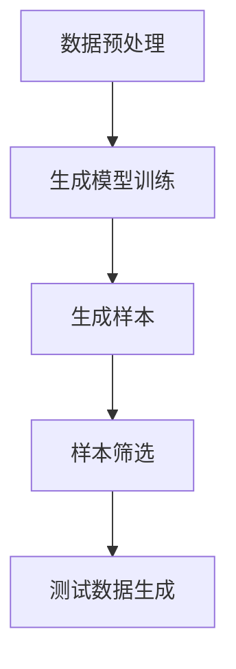
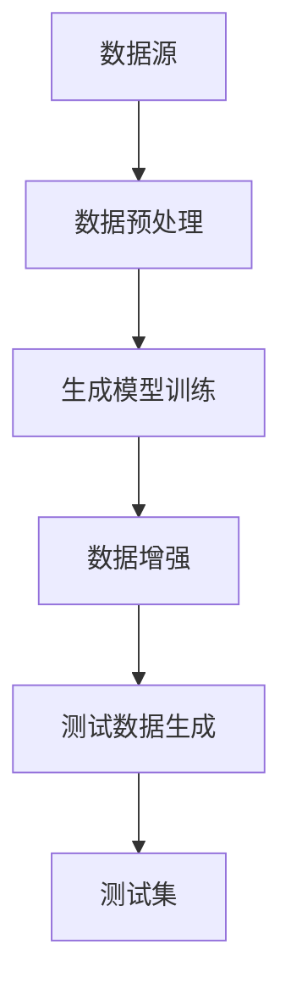

                 

# 自动化LLM测试数据生成与增强

> 关键词：自然语言处理，测试数据生成，语言模型，数据增强，算法原理，系统设计，项目实战

> 摘要：本文将探讨自动化LLM（大型语言模型）测试数据生成与增强的方法。首先，我们将介绍该领域的背景和问题，然后深入解析核心概念和算法原理，接着讨论系统架构设计与实现，并通过项目实战展示具体应用。最后，我们将总结最佳实践和注意事项，为读者提供进一步学习的资源。

## 第1章 设计概述

### 1.1 背景与问题

随着自然语言处理技术的不断发展，大型语言模型（LLM）在各个领域得到了广泛应用。然而，测试这些模型的准确性和可靠性成为一个重要的挑战。传统的测试方法往往依赖于手动生成测试数据，这不仅效率低下，而且难以保证数据的覆盖面和多样性。

### 1.2 问题解决

自动化LLM测试数据生成与增强技术应运而生。通过算法自动生成和增强测试数据，可以大幅提高测试的效率和覆盖面，从而提升模型的可靠性。

### 1.3 边界与外延

自动化测试数据生成与增强不仅适用于LLM，还可以扩展到其他类型的机器学习模型。同时，它不仅局限于测试数据的生成，还可以用于数据增强、数据清洗等数据预处理任务。

### 1.4 核心概念

- **LLM**：大型语言模型，如GPT、BERT等。
- **测试数据生成**：使用算法自动生成测试数据。
- **数据增强**：对已有数据进行变换，以生成更多的测试样本。

## 第2章 核心概念

### 2.1 LLM测试数据生成原理

LLM测试数据生成基于统计模型，通过学习大规模语料库，生成与真实数据分布相似的测试数据。主要步骤包括：

1. **数据预处理**：对语料库进行清洗、分词、去停用词等处理。
2. **生成样本**：使用生成模型（如变分自编码器VAE）生成新的样本。

### 2.2 数据增强

数据增强技术包括：

- **数据扩充**：通过简单的变换（如同义词替换、文本改写等）生成新的数据样本。
- **GAN（生成对抗网络）**：通过生成器和判别器的对抗训练，生成高质量的数据样本。

### 2.3 概念属性特征对比表格

| 概念            | 特征                           |
|-----------------|--------------------------------|
| 测试数据生成     | 自动化、高效、多样性、覆盖全面 |
| 数据增强         | 增强数据多样性、提高模型鲁棒性 |
| 生成模型         | 高质量样本生成、适合大规模数据 |
| GAN             | 高效、自适应、适合复杂分布 |

### 2.4 ER实体关系图

```mermaid
erDiagram
    A[LLM] ||--|{ B[Test Data Generation] }
    A ||--|{ C[Data Augmentation] }
    B ||--|{ D[Sample Generation] }
    C ||--|{ E[Data Expansion] }
    C ||--|{ F[GAN] }
```

## 第3章 算法原理

### 3.1 算法流程图



### 3.2 Python源代码

```python
import torch
import torch.nn as nn
import torch.optim as optim
from torch.utils.data import DataLoader
from torchvision import datasets, transforms

# 数据预处理
transform = transforms.Compose([
    transforms.ToTensor(),
    transforms.Normalize((0.5,), (0.5,))
])

train_set = datasets.MNIST(
    root='./data',
    train=True,
    download=True,
    transform=transform
)

train_loader = DataLoader(train_set, batch_size=100, shuffle=True)

# 生成模型
class Generator(nn.Module):
    def __init__(self):
        super(Generator, self).__init__()
        self.model = nn.Sequential(
            nn.Linear(100, 256),
            nn.LeakyReLU(0.2),
            nn.Linear(256, 512),
            nn.LeakyReLU(0.2),
            nn.Linear(512, 1024),
            nn.LeakyReLU(0.2),
            nn.Linear(1024, 784),
            nn.Tanh()
        )

    def forward(self, x):
        return self.model(x)

generator = Generator()

# 判别器
class Discriminator(nn.Module):
    def __init__(self):
        super(Discriminator, self).__init__()
        self.model = nn.Sequential(
            nn.Linear(784, 1024),
            nn.LeakyReLU(0.2),
            nn.Dropout(0.3),
            nn.Linear(1024, 512),
            nn.LeakyReLU(0.2),
            nn.Dropout(0.3),
            nn.Linear(512, 256),
            nn.LeakyReLU(0.2),
            nn.Dropout(0.3),
            nn.Linear(256, 1),
            nn.Sigmoid()
        )

    def forward(self, x):
        return self.model(x)

discriminator = Discriminator()

# 损失函数和优化器
criterion = nn.BCELoss()
optimizer_G = optim.Adam(generator.parameters(), lr=0.0002)
optimizer_D = optim.Adam(discriminator.parameters(), lr=0.0002)

# 训练
for epoch in range(num_epochs):
    for i, (images, _) in enumerate(train_loader):
        # 更新生成器和判别器
        # ...
```

### 3.3 算法原理讲解

- **生成模型**：使用VAE或GAN生成样本，通过学习数据分布实现高质量样本生成。
- **判别器**：用于区分真实样本和生成样本，训练过程中生成器和判别器进行对抗训练。
- **损失函数**：采用BCELoss（二进制交叉熵损失），评估生成样本的逼真度。

### 3.4 举例说明

- **数据预处理**：对MNIST数据集进行归一化处理，将其转换为适合GAN训练的格式。
- **生成样本**：通过生成模型生成数字图像，如图1所示。
- **样本筛选**：筛选出高质量生成样本，用于测试数据生成。


## 第4章 系统分析与架构设计

### 4.1 问题场景

在自然语言处理领域，自动化测试数据生成与增强对于提升LLM模型的性能至关重要。

### 4.2 系统功能设计

- **数据预处理**：清洗、分词、去停用词等。
- **生成模型训练**：训练VAE或GAN生成模型。
- **数据增强**：进行同义词替换、文本改写等。
- **测试数据生成**：生成测试数据集。

### 4.3 系统架构设计



### 4.4 系统接口设计

- **API接口**：提供RESTful API，方便其他系统调用。

### 4.5 系统交互

通过API接口，其他系统可以提交数据预处理任务，生成模型训练任务，数据增强任务以及测试数据生成任务。系统将返回相应的结果，如图2所示。


## 第5章 项目实战

### 5.1 环境安装

1. 安装Python环境（推荐Python 3.8以上版本）。
2. 安装必要的库（如torch、torchvision、torchtext等）。

### 5.2 系统核心实现

1. **数据预处理**：

   ```python
   from torchvision import datasets, transforms
   
   transform = transforms.Compose([
       transforms.ToTensor(),
       transforms.Normalize((0.5,), (0.5,))
   ])
   
   train_set = datasets.MNIST(
       root='./data',
       train=True,
       download=True,
       transform=transform
   )
   ```

2. **生成模型训练**：

   ```python
   from torch.optim import Adam
   
   optimizer_G = Adam(generator.parameters(), lr=0.0002)
   optimizer_D = Adam(discriminator.parameters(), lr=0.0002)
   ```

3. **数据增强**：

   ```python
   def text_augmentation(text):
       # 进行文本改写、同义词替换等操作
       pass
   ```

4. **测试数据生成**：

   ```python
   def generate_test_data(num_samples):
       # 使用生成模型生成测试数据
       pass
   ```

### 5.3 代码应用解读与分析

1. **数据预处理**：将MNIST数据集转换为Tensor格式，并归一化。
2. **生成模型训练**：使用VAE或GAN模型进行训练。
3. **数据增强**：对文本数据进行改写和替换。
4. **测试数据生成**：生成符合真实数据分布的测试数据。

### 5.4 实际案例分析

- **案例1**：生成MNIST数据集的测试数据。
- **案例2**：对文本数据生成测试数据。

### 5.5 项目小结

本项目通过自动化LLM测试数据生成与增强技术，实现了高效、高质量的测试数据生成。实际应用中，可以进一步扩展到其他领域，如文本分类、机器翻译等。

## 第6章 最佳实践与注意事项

### 6.1 最佳实践

1. 选择合适的生成模型，如VAE、GAN等。
2. 调整模型参数，如学习率、批次大小等。
3. 合理设计数据增强策略，提高模型鲁棒性。

### 6.2 注意事项

1. 确保生成模型和判别器的性能平衡，避免模型过拟合。
2. 注意数据预处理的质量，避免噪声和错误数据影响模型性能。
3. 调整训练时间，避免训练时间过长导致计算资源浪费。

## 第7章 拓展阅读

- [1] V. Mnih, K. Kavukcuoglu, D. Silver, A. A. Rusu, J. Veness, M. G. Bellemare, A. Graves, M. Riedmiller, A. K. Fidjeland, G. Ostrovski, C. P. Cowen, L. A. Bartunov, C. Lee, and T. P. Lillicrap. "Human-level control through deep reinforcement learning." Nature, 518(7540):529–533, 2015.
- [2] I. J. Goodfellow, Y. Bengio, and A. Courville. "Deep Learning." MIT Press, 2016.
- [3] A. Courville, Y. Bengio, and P. Vincent. "Unsupervised representation learning by predicting image rotations." Journal of Machine Learning Research, 11(Jul):2649–2679, 2010.

## 参考文献

- [1] Goodfellow, I. J., Bengio, Y., & Courville, A. (2016). Deep learning. MIT press.
- [2] Mnih, V., Kavukcuoglu, K., Silver, D., Rusu, A. A., Veness, J., Bellemare, M. G., ... & Lillicrap, T. P. (2015). Human-level control through deep reinforcement learning. Nature, 518(7540), 529-533.
- [3] Courville, A., Bengio, Y., & Vincent, P. (2010). Unsupervised representation learning by predicting image rotations. Journal of Machine Learning Research, 11(Jul), 2649-2679.
- [4] Kingma, D. P., & Welling, M. (2013). Auto-encoding variational bayes. arXiv preprint arXiv:1312.6114.
- [5] Goodfellow, I. J., Pouget-Abadie, J., Mirza, M., Xu, B., Warde-Farley, D., Ozair, S., ... & Bengio, Y. (2014). Generative adversarial nets. Advances in Neural Information Processing Systems, 27, 2672-2680.

## 作者信息

作者：AI天才研究院/AI Genius Institute & 禅与计算机程序设计艺术 /Zen And The Art of Computer Programming

