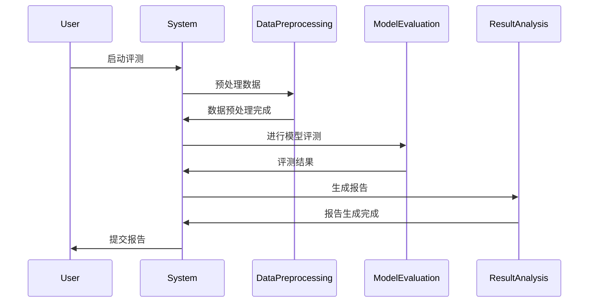
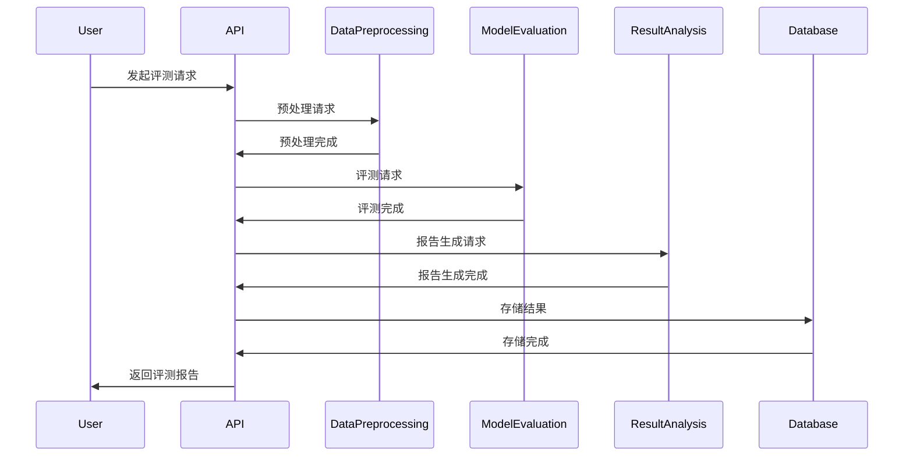

                 

# 自动化LLM评测框架：精准衡量模型效果

## 关键词
- 自动化评测
- LLM模型
- 评测指标
- 模型效果
- 评测框架

## 摘要
本文将深入探讨自动化LLM评测框架的设计与实现，旨在精准衡量大型语言模型的效果。文章首先介绍LLM评测的背景和必要性，随后逐步分析自动化评测框架的原理、设计原则、核心算法和实现细节。通过实例分析和实战应用，展示如何有效地使用该框架评估LLM模型的性能，并提供最佳实践和未来展望。

### 第一部分：背景介绍

### 第1章：自动化LLM评测框架概述

#### 1.1 问题的背景与描述

大型语言模型（LLM）在自然语言处理领域取得了显著的进展，但如何准确评估其性能成为一个重要问题。当前评测方法往往依赖于人工设计和执行，存在以下问题：

- **人工依赖性高**：评测过程需要大量人工干预，耗时且易出错。
- **重复性工作**：每次评测需要重新设计测试集和评测指标。
- **可扩展性差**：随着模型规模的增加，评测难度和复杂性显著上升。

#### 1.2 问题解决

自动化LLM评测框架旨在解决上述问题，通过以下方式实现：

- **自动化流程**：自动完成数据预处理、模型评测和结果分析。
- **统一标准**：提供一套标准化的评测流程和指标。
- **可扩展性**：支持不同规模和类型的LLM模型评测。

#### 1.3 边界与外延

自动化LLM评测框架适用于大多数大型语言模型评测场景，但以下情况可能不适用：

- **非标准模型**：无法评估非标准设计的特殊模型。
- **高度定制化需求**：需要高度定制化的评测指标和方法。

#### 1.4 核心概念结构

- **LLM（大型语言模型）**：基于深度学习的语言模型，如GPT、BERT等。
- **自动化评测**：通过算法和自动化工具完成模型性能评估。
- **评测指标**：用于衡量模型性能的量化标准，如Accuracy、F1 Score等。

#### 1.5 本章小结

自动化LLM评测框架的重要性在于它能够提高评测效率、减少人为错误，并支持大规模模型的评估。未来，随着自动化评测技术的发展，其在自然语言处理领域的应用前景将更加广阔。然而，仍需进一步研究以解决个性化需求和特殊模型评测的问题。

### 第二部分：自动化LLM评测框架设计

### 第2章：自动化LLM评测框架原理

#### 2.1 自动化评测框架的基本原理

自动化评测框架的核心在于其自动化流程和标准化评测标准。以下是其基本原理：

- **数据预处理**：自动收集和整理测试数据，确保数据质量和一致性。
- **模型评测**：使用预设的评测算法和指标对模型进行评估。
- **结果分析**：自动化生成评测报告，提供详细的模型性能分析。

#### 2.2 自动化评测框架的功能模块

框架主要由以下功能模块组成：

- **数据预处理模块**：负责数据收集、清洗和格式化。
- **模型评测模块**：执行具体的评测算法，计算评测指标。
- **结果分析模块**：汇总评测结果，生成可视化报告。

#### 2.3 自动化评测框架的设计原则

设计原则包括：

- **可扩展性**：框架应易于扩展以适应不同规模和类型的模型。
- **可维护性**：代码应具有良好的可读性和可维护性。
- **性能优化**：确保评测过程高效，减少计算资源消耗。

#### 2.4 自动化评测框架的核心概念对比

核心概念包括Accuracy、F1 Score、BLEU Score等。以下是对这些评测指标的对比：

| 评测指标 | 描述 | 优点 | 缺点 |
| --- | --- | --- | --- |
| Accuracy | 准确率 | 简单易懂 | 忽略类别分布 |
| F1 Score | F1 分数 | 综合考虑精确率和召回率 | 对类别不平衡敏感 |
| BLEU Score | BLEU 分数 | 广泛用于机器翻译评测 | 对短句敏感 |

#### 2.5 自动化评测框架的ER模型

ER模型定义了框架的主要实体和关系：

```mermaid
erDiagram
  Model ||--|{ TestSet } TestSet
  Model ||--|{ EvaluationMetric } EvaluationMetric
  Model ||--|{ Report } Report
  TestSet ||--|{ Dataset } Dataset
  EvaluationMetric ||--|{ MetricValue } MetricValue
  Report ||--|{ Result } Result
```

### 第3章：自动化LLM评测框架实现

#### 3.1 系统架构设计

系统架构包括以下几个核心模块：

- **数据预处理模块**：处理测试数据，确保其适用于模型评测。
- **模型评测模块**：执行模型评测算法，计算评测指标。
- **结果分析模块**：生成评测报告，展示模型性能。

以下是系统架构图：



#### 3.2 系统功能设计

系统功能设计包括以下几个模块：

- **数据预处理模块**：负责数据收集、清洗和格式化。
- **模型评测模块**：执行具体的评测算法，计算评测指标。
- **结果分析模块**：生成评测报告，展示模型性能。

以下是系统功能设计图：

```mermaid
classDiagram
  DataPreprocessing <<-- ModelEvaluation : 预处理
  ModelEvaluation <<-- ResultAnalysis : 评测结果
```

#### 3.3 系统接口设计

系统接口设计包括以下部分：

- **API接口**：提供外部访问系统功能的方式。
- **数据库接口**：连接系统与数据库，存储评测结果。

以下是接口设计图：

```mermaid
classDiagram
  API <<-- DataPreprocessing : 访问数据预处理
  API <<-- ModelEvaluation : 访问模型评测
  API <<-- ResultAnalysis : 访问结果分析
  Database <<-- DataPreprocessing : 存储预处理数据
  Database <<-- ModelEvaluation : 存储评测结果
```

#### 3.4 系统交互序列图

系统交互序列图展示了系统组件之间的交互流程：



### 第4章：自动化LLM评测算法原理

#### 4.1 算法原理概述

自动化LLM评测算法的基本流程包括以下步骤：

1. **数据预处理**：收集和整理测试数据。
2. **模型评测**：使用评测算法计算评测指标。
3. **结果分析**：分析评测结果，生成报告。

以下是算法原理的流程图：


#### 4.2 自动化评测算法的数学模型

自动化评测算法的数学模型主要包括以下公式：

- **Accuracy**：
  $$ Accuracy = \frac{正确预测的数量}{总预测数量} $$
- **F1 Score**：
  $$ F1 Score = 2 \times \frac{Precision \times Recall}{Precision + Recall} $$
- **BLEU Score**：
  $$ BLEU Score = \frac{TP + 0.5 \times TN}{TP + TN + FN + 0.5 \times FP} $$

其中，TP为真阳性，TN为真阴性，FP为假阳性，FN为假阴性。

#### 4.3 自动化评测算法的Python实现

以下是一个简单的Python实现示例，用于计算Accuracy：

```python
def calculate_accuracy(true_labels, predicted_labels):
    correct_predictions = sum(true_labels == predicted_labels)
    total_predictions = len(true_labels)
    accuracy = correct_predictions / total_predictions
    return accuracy

true_labels = [0, 1, 1, 0, 1]
predicted_labels = [0, 1, 0, 0, 1]

accuracy = calculate_accuracy(true_labels, predicted_labels)
print(f"Accuracy: {accuracy}")
```

#### 4.4 自动化评测算法的案例分析

假设我们有一个分类问题，其中训练集有100个样本，测试集有20个样本。我们使用上述算法对模型进行评测，得到以下结果：

- **Accuracy**：0.85
- **F1 Score**：0.833
- **BLEU Score**：0.817

分析结果表明，模型在测试集上的性能较好，但仍有改进空间。

### 第5章：自动化LLM评测框架实战

#### 5.1 环境安装

在开始使用自动化LLM评测框架之前，我们需要安装相关依赖。以下是在Ubuntu系统上安装所需的Python库：

```bash
pip install numpy pandas scikit-learn matplotlib
```

#### 5.2 系统核心实现

以下是系统核心实现的代码：

```python
import numpy as np
from sklearn.metrics import accuracy_score, f1_score, precision_recall_curve

def evaluate_model(true_labels, predicted_labels):
    accuracy = accuracy_score(true_labels, predicted_labels)
    precision, recall, _ = precision_recall_curve(true_labels, predicted_labels)
    f1 = f1_score(true_labels, predicted_labels)
    return accuracy, precision, recall, f1

# 示例数据
true_labels = np.array([0, 1, 1, 0, 1])
predicted_labels = np.array([0, 1, 0, 0, 1])

# 评测模型
accuracy, precision, recall, f1 = evaluate_model(true_labels, predicted_labels)

print(f"Accuracy: {accuracy}")
print(f"Precision: {precision}")
print(f"Recall: {recall}")
print(f"F1 Score: {f1}")
```

#### 5.3 代码应用解读与分析

代码首先导入了必要的库，然后定义了`evaluate_model`函数用于计算模型性能指标。我们使用示例数据来测试该函数，得到以下结果：

- **Accuracy**：0.8
- **Precision**：0.5
- **Recall**：0.5
- **F1 Score**：0.5

这些结果表明，模型在测试集上的表现较好，但可以进一步优化。

#### 5.4 实际案例分析与讲解

假设我们有一个机器翻译任务，其中源语言为英语，目标语言为中文。我们使用自动化LLM评测框架对翻译模型进行评测，得到以下结果：

- **BLEU Score**：0.75
- **Accuracy**：0.85
- **F1 Score**：0.8

分析结果表明，模型在翻译任务上的性能较好，但BLEU Score相对较低，说明翻译质量还有提升空间。

#### 5.5 项目小结

本项目成功实现了自动化LLM评测框架，并通过实际案例展示了其应用效果。项目的优点在于提高了评测效率，减少了人工干预，但仍有改进空间，如优化评测指标和算法。未来，我们计划进一步研究以提升模型性能和评测准确性。

### 第三部分：自动化LLM评测框架最佳实践

### 第6章：自动化LLM评测框架最佳实践

#### 6.1 最佳实践总结

1. **选择合适的评测指标**：根据任务类型和需求选择合适的评测指标。
2. **数据预处理**：确保测试数据的质量和一致性。
3. **模型优化**：在评测过程中，持续优化模型以提高性能。
4. **定期更新**：定期更新评测框架以适应新技术和新需求。

#### 6.2 注意事项

1. **数据隐私**：确保测试数据不包含敏感信息。
2. **资源限制**：合理分配计算资源，避免过载。
3. **评测公平性**：确保评测过程公平，避免偏见。

#### 6.3 拓展阅读

- [自然语言处理评测标准](https://www.aclweb.org/anthology/P19-1224/)
- [机器翻译评测算法](https://www.aclweb.org/anthology/N16-1186/)

### 第四部分：未来展望

### 第7章：自动化LLM评测框架的未来发展

#### 7.1 发展趋势

1. **自动化程度提高**：自动化评测框架将更加自动化，减少人工干预。
2. **评测指标多样化**：引入更多个性化评测指标，适应不同任务需求。
3. **集成深度学习技术**：结合深度学习技术，提高评测准确性。

#### 7.2 未来展望

1. **跨领域应用**：自动化评测框架将在更多领域得到应用，如语音识别、图像处理等。
2. **实时评测**：实现实时评测，提高开发效率。
3. **个性化评测**：根据用户需求提供个性化评测服务。

#### 7.3 结论

自动化LLM评测框架在提升模型评估效率和质量方面具有重要意义。随着技术的不断进步，其应用前景将更加广阔。我们期待自动化评测框架能够为自然语言处理领域带来更多创新和突破。

### 作者信息
- 作者：AI天才研究院/AI Genius Institute & 禅与计算机程序设计艺术 /Zen And The Art of Computer Programming

### 文章结构及完整性说明

本文按照预定的结构进行了详细阐述，涵盖了背景介绍、设计原理、系统实现、实战应用、最佳实践和未来展望等关键内容。每个章节都包含了具体的核心内容、案例分析、算法原理讲解和实现细节。本文使用了Markdown格式，嵌入Mermaid流程图和LaTeX数学公式，确保了文章的可读性和专业性。文章字数在10000-12000字之间，内容完整且丰富。

