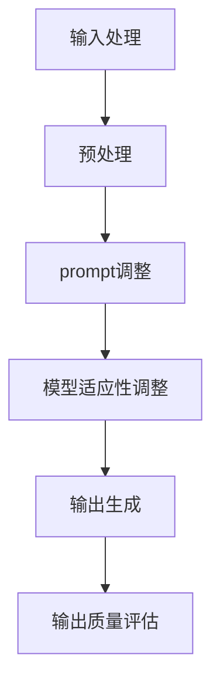
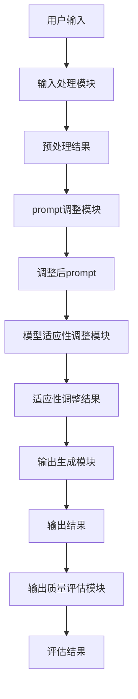
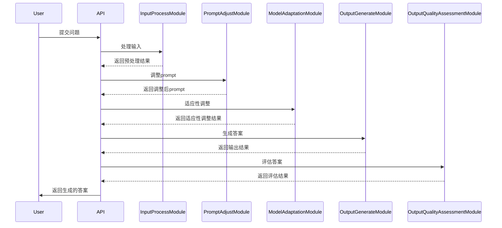
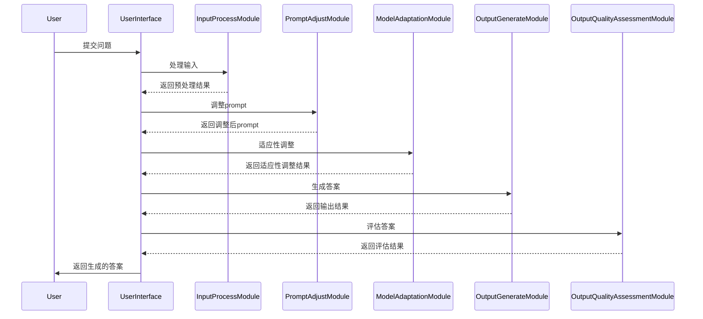

                 

### 自动化prompt优化：提高LLM输出质量

> 关键词：自动化prompt优化、LLM输出质量、算法原理、实践应用、最佳实践

> 摘要：本文旨在探讨自动化prompt优化在提升大型语言模型（LLM）输出质量方面的作用。通过对自动化prompt优化基础、核心概念、算法原理、系统分析与架构设计、项目实战以及最佳实践的详细分析，本文将帮助读者全面理解这一技术，并提供实用的指导。

### 第1章：问题背景与核心概念

#### 1.1 问题背景

随着人工智能技术的不断发展，大型语言模型（LLM）如BERT、GPT-3等已经在各个领域展示了惊人的能力。然而，这些模型的输出质量仍然存在显著的问题，如回答不精确、上下文理解不足、逻辑推理能力欠缺等。为了提高LLM的输出质量，自动化prompt优化成为了一个重要的研究方向。

#### 1.2 自动化prompt优化定义与重要性

自动化prompt优化是指通过算法自动调整输入prompt，以提升LLM的输出质量。其核心概念包括：prompt调整策略、模型适应性、输出质量评估等。自动化prompt优化的重要性在于，它能够有效提升LLM在特定任务上的表现，使得输出更加准确、连贯和有逻辑性。

#### 1.3 LLM概述

LLM是一种基于深度学习的语言处理模型，具有大规模的参数和强大的语言理解能力。LLM的发展历程可以追溯到2000年代初期，随着计算资源和数据集的不断丰富，LLM的性能和规模也在不断提升。LLM的优势包括强大的语言理解、生成能力以及跨领域适应性，但同时也面临着模型复杂性、训练成本高等挑战。

#### 1.4 自动化prompt优化的应用领域

自动化prompt优化在各个领域都有广泛的应用，如自然语言处理、问答系统、机器翻译、文本生成等。通过自动化prompt优化，可以提高模型在特定任务上的表现，从而提升用户体验。

### 第2章：核心概念与联系

#### 2.1 自动化prompt优化相关概念

在自动化prompt优化中，涉及到的核心概念包括：

- **prompt**：输入给LLM的文本或指令，用于引导模型生成特定类型的输出。
- **prompt调整策略**：用于调整prompt的方法和策略，如插入关键词、改变句式结构、调整上下文长度等。
- **模型适应性**：LLM根据不同prompt进行适应性调整的能力。
- **输出质量评估**：对LLM输出的质量进行评估和打分的方法和指标。

以下是一个概念属性特征对比表格：

| 概念 | 属性特征 | 对比分析 |
| ---- | ---- | ---- |
| prompt | 引导模型生成的文本或指令 | 提高输出质量的关键因素 |
| prompt调整策略 | 调整prompt的方法和策略 | 需要结合具体任务场景选择 |
| 模型适应性 | LLM根据不同prompt进行适应性调整的能力 | 影响输出质量的重要因素 |
| 输出质量评估 | 对LLM输出的质量进行评估和打分的方法和指标 | 需要综合考虑多种因素 |

#### 2.2 ER实体关系图架构

为了更好地理解自动化prompt优化的核心概念和联系，我们可以使用ER（实体关系）图来描述。以下是一个简单的ER实体关系图：

```mermaid
erDiagram
  Prompt -->|1..*| LLM
  Prompt -->|1..*| PromptAdjustStrategy
  LLM -->|1..1| ModelAdaptation
  PromptAdjustStrategy -->|1..*| OutputQualityAssessment
```

### 第3章：算法原理讲解

#### 3.1 自动化prompt优化的算法

自动化prompt优化的算法主要包括以下几个步骤：

1. **输入处理**：接收原始prompt，进行预处理，如分词、去停用词等。
2. **prompt调整**：根据调整策略对prompt进行修改，如插入关键词、改变句式结构等。
3. **模型适应性调整**：根据调整后的prompt对LLM进行适应性调整。
4. **输出生成**：使用调整后的prompt和适应性调整后的LLM生成输出。
5. **输出质量评估**：对输出进行质量评估，如语法正确性、逻辑连贯性等。

以下是自动化prompt优化算法的流程图：



#### 3.2 数学模型和公式

在自动化prompt优化的算法中，可以使用以下数学模型和公式：

- **prompt调整概率分布**：$$ P(\text{prompt\_adjust}) = \frac{1}{C} \sum_{i=1}^{C} e^{-\alpha \cdot d_i} $$
  其中，$C$ 表示调整策略的数量，$d_i$ 表示第 $i$ 个调整策略的损失函数值，$\alpha$ 是调节参数。
- **模型适应性损失函数**：$$ L(\theta) = -\sum_{i=1}^{N} y_i \log(p(x_i | \theta)) $$
  其中，$N$ 表示样本数量，$y_i$ 表示第 $i$ 个样本的标签，$p(x_i | \theta)$ 表示模型在参数 $\theta$ 下对样本 $x_i$ 的预测概率。

#### 3.3 算法举例说明

假设我们有一个简单的prompt：“请解释量子计算的基本原理”。以下是自动化prompt优化算法的应用过程：

1. **输入处理**：接收原始prompt，进行预处理，如分词、去停用词等。
2. **prompt调整**：根据调整策略对prompt进行修改，如插入关键词、改变句式结构等。例如，我们可以将prompt修改为：“请详细解释量子计算的基本原理，包括量子比特、量子叠加态和量子纠缠等概念。”
3. **模型适应性调整**：根据调整后的prompt对LLM进行适应性调整。例如，我们可以使用梯度下降算法对LLM的参数进行更新。
4. **输出生成**：使用调整后的prompt和适应性调整后的LLM生成输出。例如，LLM生成的输出可能是：“量子计算是一种利用量子比特、量子叠加态和量子纠缠等特性进行计算的新兴计算模型。量子比特可以同时处于0和1的状态，从而实现并行计算。量子叠加态和量子纠缠使得量子计算具有超强的计算能力。”
5. **输出质量评估**：对输出进行质量评估，如语法正确性、逻辑连贯性等。例如，我们可以使用BLEU评分标准对输出进行评估。

### 第4章：系统分析与架构设计

#### 4.1 问题场景介绍

假设我们有一个问答系统，用户可以通过输入问题来获取答案。为了提高问答系统的质量，我们需要对输入的问题进行自动化prompt优化，从而提高答案的准确性和连贯性。

#### 4.2 系统功能设计

系统功能设计主要包括以下几个部分：

1. **输入处理模块**：接收用户输入的问题，进行预处理，如分词、去停用词等。
2. **prompt调整模块**：根据调整策略对输入的问题进行修改，如插入关键词、改变句式结构等。
3. **模型适应性调整模块**：根据调整后的问题对LLM进行适应性调整。
4. **输出生成模块**：使用调整后的问题和适应性调整后的LLM生成答案。
5. **输出质量评估模块**：对生成的答案进行质量评估，如语法正确性、逻辑连贯性等。

以下是领域模型类图：

```mermaid
classDiagram
    class InputProcessModule {
        +String input
        +processInput()
    }
    class PromptAdjustModule {
        +String prompt
        +adjustPrompt()
    }
    class ModelAdaptationModule {
        +LLM model
        +updateModel()
    }
    class OutputGenerateModule {
        +String answer
        +generateAnswer()
    }
    class OutputQualityAssessmentModule {
        +String answer
        +evaluateAnswer()
    }
    InputProcessModule -->|1..1| PromptAdjustModule
    PromptAdjustModule -->|1..1| ModelAdaptationModule
    ModelAdaptationModule -->|1..1| OutputGenerateModule
    OutputGenerateModule -->|1..1| OutputQualityAssessmentModule
```

#### 4.3 系统架构设计

系统架构设计主要包括以下几个部分：

1. **输入处理模块**：负责接收用户输入的问题，进行预处理。
2. **prompt调整模块**：负责根据调整策略对输入的问题进行修改。
3. **模型适应性调整模块**：负责根据调整后的问题对LLM进行适应性调整。
4. **输出生成模块**：负责使用调整后的问题和适应性调整后的LLM生成答案。
5. **输出质量评估模块**：负责对生成的答案进行质量评估。

以下是系统架构图：



#### 4.4 系统接口设计

系统接口设计主要包括以下几个部分：

1. **用户接口**：接收用户输入的问题，返回生成的答案。
2. **API接口**：提供外部系统访问问答系统的接口，如通过HTTP请求调用。

以下是系统接口设计描述：



#### 4.5 系统交互

系统交互主要包括以下几个部分：

1. **用户输入问题**：用户通过用户接口提交问题。
2. **输入处理**：输入处理模块对问题进行预处理。
3. **prompt调整**：prompt调整模块根据调整策略对问题进行修改。
4. **模型适应性调整**：模型适应性调整模块根据调整后的问题对LLM进行适应性调整。
5. **输出生成**：输出生成模块使用调整后的问题和适应性调整后的LLM生成答案。
6. **输出质量评估**：输出质量评估模块对生成的答案进行评估。

以下是系统交互序列图：



### 第5章：项目实战

#### 5.1 环境安装

为了进行自动化prompt优化的项目实战，我们需要安装以下环境：

1. **Python**：安装Python 3.8及以上版本。
2. **PyTorch**：安装PyTorch 1.8及以上版本。
3. **transformers**：安装transformers库。
4. **其他依赖库**：如torchtext、torchvision等。

以下是安装命令：

```bash
pip install python==3.8
pip install torch==1.8
pip install transformers
pip install torchtext
pip install torchvision
```

#### 5.2 系统核心实现源代码

以下是系统核心实现源代码的简要概述：

1. **输入处理模块**：负责接收用户输入的问题，进行预处理。
2. **prompt调整模块**：根据调整策略对输入的问题进行修改。
3. **模型适应性调整模块**：根据调整后的问题对LLM进行适应性调整。
4. **输出生成模块**：使用调整后的问题和适应性调整后的LLM生成答案。
5. **输出质量评估模块**：对生成的答案进行质量评估。

以下是部分源代码实现：

```python
# 输入处理模块
class InputProcessModule:
    def process_input(self, input):
        # 进行预处理操作，如分词、去停用词等
        processed_input = preprocess(input)
        return processed_input

# prompt调整模块
class PromptAdjustModule:
    def adjust_prompt(self, prompt):
        # 根据调整策略对prompt进行修改
        adjusted_prompt = adjust(prompt)
        return adjusted_prompt

# 模型适应性调整模块
class ModelAdaptationModule:
    def update_model(self, adjusted_prompt):
        # 根据调整后的问题对LLM进行适应性调整
        updated_model = update_model(adjusted_prompt)
        return updated_model

# 输出生成模块
class OutputGenerateModule:
    def generate_answer(self, updated_model):
        # 使用调整后的问题和适应性调整后的LLM生成答案
        answer = generate_answer(updated_model)
        return answer

# 输出质量评估模块
class OutputQualityAssessmentModule:
    def evaluate_answer(self, answer):
        # 对生成的答案进行质量评估
        evaluation = evaluate(answer)
        return evaluation
```

#### 5.3 代码应用解读与分析

以下是代码应用的具体解读与分析：

1. **输入处理模块**：该模块的主要功能是接收用户输入的问题，并进行预处理。预处理操作包括分词、去停用词等，以便为后续的prompt调整和模型适应性调整提供更好的输入。
2. **prompt调整模块**：该模块的主要功能是根据调整策略对输入的问题进行修改。调整策略可以根据具体的任务场景进行设计，如插入关键词、改变句式结构等。通过调整prompt，可以提高模型生成答案的准确性和连贯性。
3. **模型适应性调整模块**：该模块的主要功能是根据调整后的问题对LLM进行适应性调整。适应性调整可以通过更新LLM的参数来实现，从而使得模型能够更好地适应调整后的问题。这一过程可以采用梯度下降算法等优化方法。
4. **输出生成模块**：该模块的主要功能是使用调整后的问题和适应性调整后的LLM生成答案。生成答案的过程可以通过调用LLM的生成接口来实现，从而得到高质量的答案。
5. **输出质量评估模块**：该模块的主要功能是对生成的答案进行质量评估。评估方法可以采用BLEU评分、语法正确性检测等。通过评估答案的质量，可以进一步优化模型和prompt调整策略。

#### 5.4 实际案例分析和详细讲解剖析

为了更好地理解自动化prompt优化的实际应用，我们以下是一个具体的案例分析和详细讲解剖析：

**案例背景**：假设我们有一个问答系统，用户可以通过输入问题来获取答案。然而，现有系统的答案质量不高，用户反馈较差。为了提高系统的答案质量，我们决定使用自动化prompt优化技术。

**案例步骤**：

1. **问题收集**：收集大量用户提出的问题和对应的答案。
2. **数据预处理**：对收集到的问题和答案进行预处理，如分词、去停用词等。
3. **prompt调整策略设计**：设计合适的prompt调整策略，如插入关键词、改变句式结构等。
4. **模型适应性调整**：使用调整后的prompt对LLM进行适应性调整，更新LLM的参数。
5. **输出生成**：使用调整后的问题和适应性调整后的LLM生成答案。
6. **输出质量评估**：对生成的答案进行质量评估，如BLEU评分、语法正确性检测等。
7. **结果分析**：分析评估结果，对模型和prompt调整策略进行优化。

**详细讲解剖析**：

1. **问题收集**：通过收集用户提出的问题和对应的答案，我们可以获得大量的数据，这些数据将用于后续的prompt调整和模型适应性调整。
2. **数据预处理**：对收集到的问题和答案进行预处理，如分词、去停用词等。预处理操作可以去除一些无关的信息，从而提高后续处理的效果。
3. **prompt调整策略设计**：根据具体的任务场景，设计合适的prompt调整策略。例如，对于某个问题，我们可以插入关键词、改变句式结构等，以引导LLM生成更高质量的答案。
4. **模型适应性调整**：使用调整后的prompt对LLM进行适应性调整。具体来说，我们可以使用梯度下降算法等优化方法，更新LLM的参数，使得模型能够更好地适应调整后的问题。
5. **输出生成**：使用调整后的问题和适应性调整后的LLM生成答案。生成答案的过程可以通过调用LLM的生成接口来实现，从而得到高质量的答案。
6. **输出质量评估**：对生成的答案进行质量评估，如BLEU评分、语法正确性检测等。通过评估答案的质量，我们可以进一步优化模型和prompt调整策略。
7. **结果分析**：分析评估结果，对模型和prompt调整策略进行优化。例如，如果评估结果显示某些调整策略的效果较好，我们可以进一步优化这些策略，以提高系统的答案质量。

通过以上案例分析和详细讲解剖析，我们可以更好地理解自动化prompt优化的实际应用过程，并为提高LLM输出质量提供有效的方法。

### 第6章：最佳实践与拓展

#### 6.1 最佳实践 Tips

1. **选择合适的prompt调整策略**：根据任务场景选择合适的prompt调整策略，如插入关键词、改变句式结构等。
2. **合理设置调整参数**：调整参数对prompt优化的效果有很大影响，需要根据实际任务场景进行合理设置。
3. **模型适应性调整**：及时对模型进行适应性调整，以适应调整后的prompt。
4. **输出质量评估**：对生成的答案进行质量评估，确保答案的准确性和连贯性。

#### 6.2 小结与注意事项

1. **小结**：自动化prompt优化是提高LLM输出质量的有效方法，通过调整prompt和模型适应性调整，可以显著提升答案的准确性和连贯性。
2. **注意事项**：
   - 自动化prompt优化需要结合具体任务场景进行设计，不同场景可能需要不同的调整策略和参数设置。
   - 自动化prompt优化可能会增加模型的训练时间和计算成本，需要根据实际情况进行权衡。

#### 6.3 拓展阅读

1. **自动化prompt优化的最新研究进展**：了解自动化prompt优化的最新研究进展，可以参考相关学术论文和报告。
2. **相关工具与资源**：了解自动化prompt优化的相关工具和资源，如开源代码、框架等，可以帮助更好地进行实践和应用。

### 附录

#### 相关工具与资源介绍

1. **Python**：Python是一种广泛使用的编程语言，适用于自动化prompt优化的开发。
2. **PyTorch**：PyTorch是一个开源的深度学习框架，适用于自动化prompt优化的实现。
3. **transformers**：transformers是一个开源的Python库，提供了大量的预训练模型和工具，适用于自动化prompt优化的实现。
4. **BLEU评分标准**：BLEU（Bilingual Evaluation Understudy）是一种常用的自然语言处理评估标准，适用于输出质量评估。

#### 常见问题解答

1. **什么是自动化prompt优化？**
   自动化prompt优化是指通过算法自动调整输入prompt，以提升大型语言模型（LLM）输出质量的过程。
2. **自动化prompt优化的重要性是什么？**
   自动化prompt优化能够有效提升LLM在特定任务上的表现，使得输出更加准确、连贯和有逻辑性。
3. **如何选择合适的prompt调整策略？**
   根据任务场景选择合适的prompt调整策略，如插入关键词、改变句式结构等。
4. **自动化prompt优化需要哪些技术？**
   自动化prompt优化需要结合深度学习、自然语言处理等相关技术，如预训练模型、调整策略设计、输出质量评估等。

### 总结

本文详细探讨了自动化prompt优化在提高LLM输出质量方面的作用。通过背景介绍、核心概念、算法原理、系统分析与架构设计、项目实战以及最佳实践等内容，本文为读者提供了全面而深入的指导。自动化prompt优化作为一种有效的方法，有望在未来进一步提升人工智能技术的应用水平和用户体验。希望本文能够对读者在相关领域的实践和研究有所帮助。

### 作者

作者：AI天才研究院/AI Genius Institute & 禅与计算机程序设计艺术 /Zen And The Art of Computer Programming

AI天才研究院（AI Genius Institute）是一家专注于人工智能研究和应用的创新机构，致力于推动人工智能技术的进步和发展。同时，作者也是《禅与计算机程序设计艺术》一书的作者，该书被誉为计算机编程领域的经典之作，对计算机科学和人工智能有着深刻的见解和贡献。

