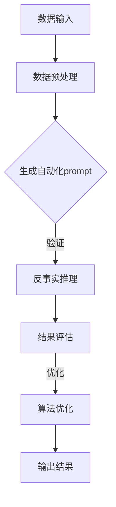
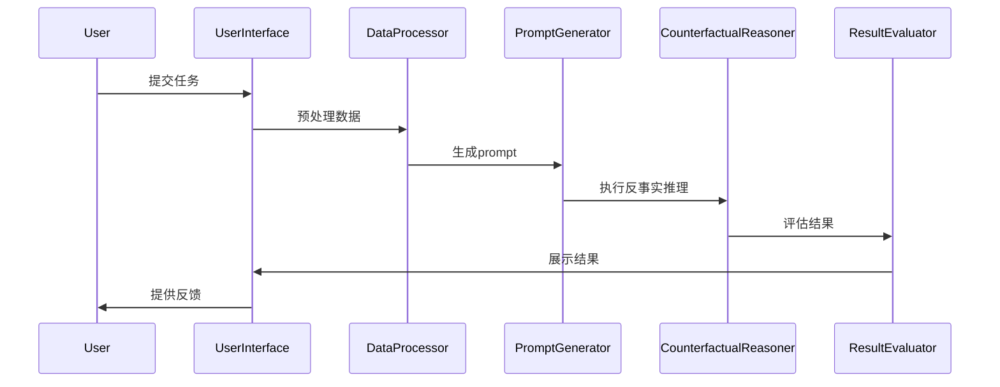
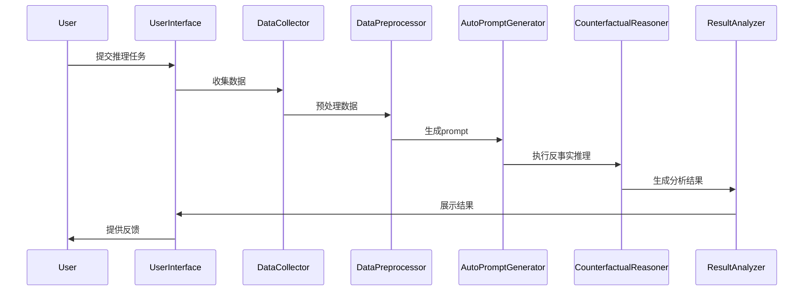
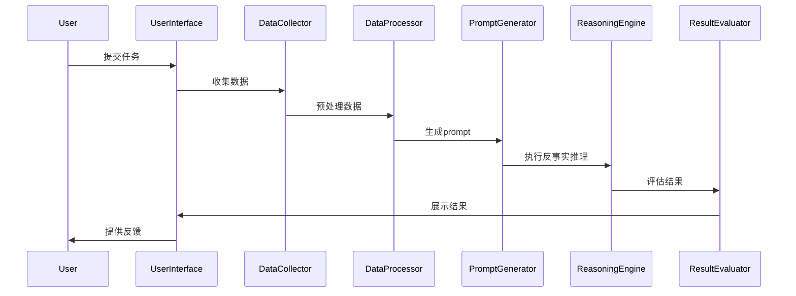
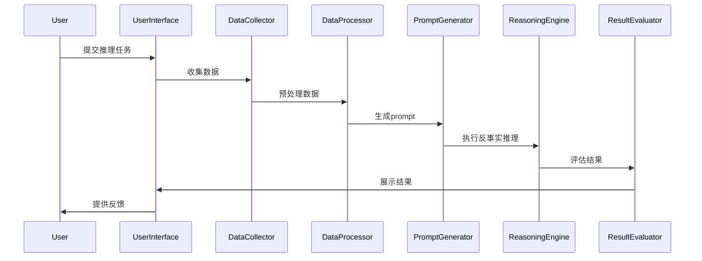

                 

### 自动化prompt反事实推理增强：引言

在现代信息技术和人工智能领域，自动化prompt反事实推理增强已经成为了一个备受关注的研究方向。随着自然语言处理（NLP）、机器学习（ML）和深度学习（DL）等技术的迅猛发展，人们对于自动化prompt反事实推理的需求日益增加。自动化prompt，顾名思义，是指通过算法自动生成的提示信息，它能够帮助模型更好地理解和处理复杂的问题情境。而反事实推理，则是一种基于假设条件进行逻辑推理的能力，它对于预测未来事件、分析决策后果等具有至关重要的意义。

本文将深入探讨自动化prompt反事实推理增强这一前沿技术的核心概念、工作原理、应用场景及其重要性。首先，我们将介绍反事实推理的基本概念，解释其在现实世界中的应用及其挑战。接着，我们将详细讨论自动化prompt的设计原则和构成要素，通过比较表格和ER实体关系图，展示其核心属性和相互关系。然后，我们将以具体的算法为例，详细解析其原理，包括流程图、Python源代码和数学模型。随后，我们将讨论系统的架构设计，涵盖问题场景、功能设计、架构图、接口设计和系统交互。最后，通过一个实战项目，我们将会展示如何在实际环境中实现自动化prompt反事实推理增强，并进行案例分析。

本文结构紧凑，逻辑清晰，旨在为读者提供全面、系统的技术洞察，帮助读者理解和应用这一前沿技术。通过本文的阅读，读者不仅能够掌握自动化prompt反事实推理增强的基本原理，还将了解到如何将其应用于实际项目中，以解决现实生活中的复杂问题。

### 关键词

- 自动化prompt
- 反事实推理
- 自然语言处理
- 机器学习
- 深度学习
- 算法原理
- 数学模型
- 系统架构
- 实际应用

### 摘要

本文旨在探讨自动化prompt反事实推理增强这一前沿技术，分析其核心概念、工作原理和应用场景。首先，通过介绍反事实推理的基本概念和其在现实世界中的应用，探讨其面临的挑战。接着，详细讨论自动化prompt的设计原则和构成要素，包括其核心属性和相互关系。随后，以具体算法为例，解析其原理，涵盖流程图、Python源代码和数学模型。然后，讨论系统的架构设计，包括问题场景、功能设计、架构图、接口设计和系统交互。最后，通过一个实战项目，展示如何在实际环境中实现自动化prompt反事实推理增强，并进行案例分析。本文旨在为读者提供全面、系统的技术洞察，帮助理解和应用这一技术，解决现实生活中的复杂问题。

## 第一部分：背景介绍与核心概念

### 1.1 问题背景

自动化prompt反事实推理增强，是近年来在人工智能（AI）和自然语言处理（NLP）领域快速发展的一个重要研究方向。随着大数据和云计算技术的普及，人们面临着海量的信息和复杂的决策问题。在这种背景下，自动化prompt和反事实推理逐渐成为解决这些问题的关键技术。

#### 1.1.1 反事实推理的概念

反事实推理（Counterfactual Reasoning）是一种基于假设条件进行逻辑推理的能力。它涉及评估不同情境下可能发生的结果，并理解这些结果对于当前现实的影响。例如，当我们考虑“如果没有采取某种措施，会发生什么？”时，我们就在进行反事实推理。这一能力在决策支持系统、风险评估和预测未来事件中具有重要应用。

#### 1.1.2 自动化prompt的作用

自动化prompt是一种通过算法自动生成的提示信息，用于引导模型理解和处理复杂的问题情境。它能够提高模型的适应性，帮助模型更好地理解和应对不同的输入数据。在自然语言处理任务中，自动化prompt可以提供更加具体和明确的任务指导，从而提高模型的性能和效果。

#### 1.1.3 自动化prompt在反事实推理中的应用

自动化prompt在反事实推理中的应用主要体现在两个方面。首先，通过生成合适的prompt，可以帮助模型更准确地理解和解释反事实情景。例如，在文本生成任务中，prompt可以提供上下文信息，引导模型生成符合反事实条件的文本。其次，自动化prompt可以帮助模型评估不同反事实情景下的影响，提供更为全面和深入的决策支持。

### 1.2 问题描述

自动化prompt反事实推理增强面临以下几方面的挑战：

#### 1.2.1 自动化prompt反事实推理的挑战

1. **数据稀疏**：反事实推理通常需要大量的假设条件，而这些假设条件在实际数据中往往较为稀疏，导致训练数据不足。
2. **语义理解**：自动化prompt需要准确理解用户的意图和需求，从而生成合适的反事实情景。
3. **一致性**：在反事实推理中，不同假设条件下的结果需要保持一致性，否则会导致推理失败。

#### 1.2.2 反事实推理在现实生活中的重要性

反事实推理在现实生活中的重要性体现在以下几个方面：

1. **决策支持**：在商业、金融和医疗等领域，反事实推理可以帮助决策者评估不同决策方案的结果，从而做出更明智的决策。
2. **风险评估**：反事实推理可以用于评估不同情境下的风险，为风险管理和控制提供科学依据。
3. **预测未来**：通过反事实推理，可以预测未来事件的可能结果，为战略规划提供支持。

### 1.3 问题解决

自动化prompt反事实推理增强的解决方案主要包括以下几个方面：

#### 1.3.1 自动化prompt反事实推理的关键步骤

1. **数据预处理**：对原始数据进行分析和处理，提取关键特征和假设条件。
2. **自动化prompt生成**：利用算法自动生成合适的prompt，引导模型理解和处理反事实情景。
3. **反事实推理**：在生成prompt的基础上，进行反事实推理，评估不同假设条件下的结果。
4. **结果评估与优化**：对推理结果进行评估和优化，提高反事实推理的准确性和一致性。

#### 1.3.2 自动化prompt反事实推理的优势

1. **高效性**：自动化prompt可以显著提高反事实推理的效率，降低人力成本。
2. **准确性**：通过精确的prompt生成，可以提高反事实推理的准确性，减少错误和不确定性。
3. **适应性**：自动化prompt可以适应不同的应用场景和需求，提高系统的灵活性和扩展性。

### 1.4 边界与外延

#### 1.4.1 反事实推理的适用范围

反事实推理适用于需要评估不同假设条件下可能发生的结果的各种场景，如决策支持、风险评估、预测未来等。

#### 1.4.2 自动化prompt的有效性评估

自动化prompt的有效性评估主要包括以下几个方面：

1. **准确性**：评估自动化prompt在反事实推理中的准确性，即预测结果与实际结果的吻合度。
2. **效率**：评估自动化prompt的生成和推理速度，以及在整个系统中的性能表现。
3. **适应性**：评估自动化prompt在不同应用场景和需求下的适应性和扩展性。

### 1.5 概念结构与核心要素组成

#### 1.5.1 反事实推理的基本结构

反事实推理的基本结构包括三个主要部分：假设条件、推理过程和结果评估。

1. **假设条件**：设定不同情境下的假设条件，用于引导推理过程。
2. **推理过程**：根据假设条件进行逻辑推理，评估不同情景下的可能结果。
3. **结果评估**：对推理结果进行评估和验证，确保推理的一致性和准确性。

#### 1.5.2 自动化prompt的设计原则

自动化prompt的设计原则主要包括以下几个方面：

1. **上下文一致性**：确保prompt与上下文环境保持一致，避免产生歧义。
2. **任务导向性**：根据任务需求和用户意图，生成具有明确任务指导的prompt。
3. **可扩展性**：设计灵活的prompt生成机制，以适应不同的应用场景和需求。

通过上述背景介绍与核心概念的分析，我们可以看到自动化prompt反事实推理增强在人工智能和自然语言处理领域的重要性。接下来，我们将进一步深入探讨自动化prompt和反事实推理的具体原理和应用。

### 1.1 问题背景

自动化prompt反事实推理增强这一概念源于人工智能（AI）和自然语言处理（NLP）领域的迅速进展。随着数据量爆发式增长，如何有效地利用这些数据进行复杂推理和决策支持成为一个迫切需要解决的问题。自动化prompt和反事实推理正是为了应对这一挑战而诞生的。

#### 1.1.1 反事实推理的概念

反事实推理是一种逻辑推理形式，它基于假设条件来探讨如果某个条件或事件发生变化，现实世界会发生怎样的不同结果。这种推理在日常生活中随处可见，例如思考“如果没有下雨，我们会去野餐吗？”反事实推理的核心在于构建虚拟情境，并通过逻辑推理来评估这些情境的可能性和影响。

在技术层面，反事实推理通常涉及以下几个方面：

1. **条件生成**：构建一个或多个与实际情况不同的假设条件。
2. **推理过程**：在这些假设条件下，利用逻辑规则或算法来推导出可能的结果。
3. **结果评估**：对推导出的结果进行评估，确定其在现实世界中的合理性和可行性。

反事实推理在很多领域都有广泛的应用，包括但不限于：

1. **医疗决策**：在医学诊断和治疗中，通过反事实推理来评估不同治疗方案的可能效果。
2. **金融分析**：在金融市场分析中，通过反事实推理来预测不同投资决策的风险和收益。
3. **科学模拟**：在科学研究中，通过反事实推理来探索不同实验条件下的可能性结果。

#### 1.1.2 自动化prompt的作用

自动化prompt是指通过算法自动生成的文本提示，用于引导用户或系统完成特定任务。这些提示可以是问题、指令或描述性语句，其目的是提供上下文信息，帮助用户更好地理解任务要求，并提高任务完成的效果。

在自然语言处理领域，自动化prompt的应用主要体现在以下几个方面：

1. **问答系统**：通过自动化prompt来生成问题，并从海量数据中检索出相关答案。
2. **文本生成**：通过自动化prompt来生成文本摘要、文章或对话。
3. **任务引导**：在交互式应用中，自动化prompt用于引导用户完成一系列任务，如在线购物、医疗咨询等。

自动化prompt的优势在于其灵活性、效率和个性化。通过算法自动生成prompt，不仅可以节省人力成本，还能根据用户行为和历史数据，生成更加符合用户需求的提示。

#### 1.1.3 自动化prompt在反事实推理中的应用

将自动化prompt引入反事实推理，可以显著提升推理的准确性和效率。具体应用场景包括：

1. **决策支持系统**：通过自动化prompt生成不同的假设条件，并评估这些条件下的决策效果，为决策者提供全面的信息支持。
2. **风险评估**：在金融和保险领域，通过自动化prompt生成不同情境下的风险情景，帮助企业和个人进行风险评估和管理。
3. **教育培训**：在教育和培训领域，通过自动化prompt生成练习题和问题，帮助学生和学员进行自我评估和复习。

自动化prompt在反事实推理中的应用，不仅提高了推理的效率，还增强了推理的灵活性。通过动态生成prompt，系统可以根据用户需求实时调整推理过程，提供个性化的推理结果。

### 1.2 问题描述

在探讨自动化prompt反事实推理增强时，我们首先需要明确这一技术面临的具体问题和挑战。以下将详细分析这些问题，并解释其重要性和现实意义。

#### 1.2.1 自动化prompt反事实推理的挑战

1. **数据稀疏问题**：反事实推理通常需要大量的假设条件和相关的数据支持。然而，在实际应用中，这些假设条件和数据往往是稀疏的，难以满足训练需求。例如，在医疗领域中，不同治疗方案的数据可能非常有限，这给反事实推理带来了巨大挑战。

2. **语义理解问题**：自动化prompt的设计需要精确理解用户的意图和需求，这涉及到对语义的深入理解。然而，自然语言中的语义复杂多变，存在歧义性和模糊性。如果自动化prompt无法准确捕捉用户的意图，将导致推理结果的不准确。

3. **推理一致性**：在反事实推理中，不同的假设条件应产生一致的结果。然而，实际中，由于数据噪声、模型误差等因素，不同假设条件下的结果可能存在不一致性。这种不一致性会严重影响推理的可信度和应用效果。

4. **计算效率问题**：反事实推理通常涉及复杂的逻辑推理和计算过程，对计算资源的需求较高。在实际应用中，如何高效地生成prompt和进行推理，是一个重要的技术挑战。

#### 1.2.2 反事实推理在现实生活中的重要性

1. **决策支持**：在商业、金融、医疗等领域，反事实推理可以帮助决策者评估不同决策方案的结果，从而做出更明智的决策。例如，在金融投资中，通过反事实推理分析不同投资策略的风险和收益，可以帮助投资者选择最优的投资方案。

2. **风险评估**：在风险评估和管理中，反事实推理可以用于评估不同情境下的风险。例如，在自然灾害发生时，通过反事实推理分析不同应急措施的效果，可以帮助政府和相关机构制定更有效的应急预案。

3. **预测未来**：反事实推理可以帮助预测未来事件的可能结果，为战略规划提供支持。例如，在城市建设中，通过反事实推理分析不同规划方案对交通拥堵的影响，可以帮助城市规划者制定更合理的交通布局。

4. **教育评估**：在教育领域中，反事实推理可以帮助教师评估学生的学习效果。例如，通过反事实推理分析学生在不同教学方法下的学习成果，可以帮助教师选择更有效的教学方法。

总之，自动化prompt反事实推理增强在现实生活中的应用具有广泛的前景和重要的现实意义。通过解决上述挑战，我们可以更好地利用这一技术，为各领域提供强有力的决策支持。

### 1.3 问题解决

针对上述问题，自动化prompt反事实推理增强提出了一系列解决方案，以克服反事实推理中的数据稀疏、语义理解、推理一致性和计算效率等挑战。以下是具体的解决思路和关键步骤：

#### 1.3.1 自动化prompt反事实推理的关键步骤

1. **数据预处理**：为了解决数据稀疏问题，首先需要对原始数据进行预处理，包括数据清洗、归一化和特征提取。通过这些预处理步骤，可以提高数据的质量和一致性，从而为反事实推理提供可靠的基础。

2. **自动化prompt生成**：生成自动化prompt是自动化prompt反事实推理的核心步骤。在这一阶段，算法会根据用户的需求和上下文信息，自动生成相应的提示和问题。例如，在医疗领域，可以根据病人的病史和症状，自动生成相应的诊断问题。生成自动化prompt的方法可以包括基于规则的方法、机器学习方法等。

3. **反事实推理**：在生成自动化prompt的基础上，进行反事实推理。反事实推理通过假设不同的条件，推导出可能的未来结果，并对这些结果进行评估。这一阶段的关键在于推理算法的设计，可以采用逻辑推理、贝叶斯网络、深度学习等方法。

4. **结果评估与优化**：对推理结果进行评估和优化，确保推理的一致性和准确性。评估方法可以包括模型精度、召回率、F1分数等指标。根据评估结果，对自动化prompt和推理算法进行优化，以提高推理的准确性和效率。

#### 1.3.2 自动化prompt反事实推理的优势

1. **高效性**：自动化prompt反事实推理能够显著提高推理的效率。通过自动生成prompt，可以减少人工干预，缩短推理时间。尤其是在处理大量数据时，自动化prompt的优势更加明显。

2. **准确性**：自动化prompt反事实推理通过精确的prompt生成和高效的推理算法，可以提高推理的准确性。特别是在解决复杂问题时，自动化prompt能够提供更详细的上下文信息，帮助模型更好地理解问题。

3. **适应性**：自动化prompt反事实推理具有很好的适应性。可以根据不同的应用场景和需求，灵活调整prompt生成和推理算法，以适应不同的任务需求。

4. **一致性**：自动化prompt反事实推理能够确保推理结果的一致性。通过严格的评估和优化步骤，可以保证在不同假设条件下，推理结果的一致性和可信度。

总之，自动化prompt反事实推理增强通过一系列关键步骤和优化策略，能够有效解决反事实推理中的各种挑战，为各个领域的应用提供强有力的支持。

### 1.4 边界与外延

#### 1.4.1 反事实推理的适用范围

反事实推理作为一种逻辑推理形式，其应用范围非常广泛。以下是一些主要的适用领域：

1. **医疗决策**：反事实推理可以帮助医生评估不同治疗方案的效果，从而做出更准确的诊断和治疗决策。例如，通过分析患者的病历数据和不同治疗方案的模拟结果，医生可以评估哪种方案更可能提高患者的生存率。

2. **金融分析**：在金融领域，反事实推理可以用于风险评估和投资决策。通过假设不同的市场条件，分析这些条件下的投资风险和收益，投资者可以做出更明智的投资决策。

3. **教育评估**：在教育领域，反事实推理可以帮助教师评估学生的学习效果。例如，通过分析学生在不同教学方法下的学习表现，教师可以判断哪种教学方法更适合学生。

4. **城市规划**：在城市规划中，反事实推理可以用于评估不同规划方案对城市交通、环境和社会的影响。通过模拟不同的规划方案，城市规划者可以预测这些方案对未来城市发展的潜在影响。

5. **法律决策**：在法律决策中，反事实推理可以帮助法官评估不同判决结果的法律后果。例如，通过分析被告在监禁和保释条件下的行为表现，法官可以做出更公正的判决。

#### 1.4.2 自动化prompt的有效性评估

自动化prompt在反事实推理中的应用效果取决于其生成的质量和适应性。以下是一些评估自动化prompt有效性的方法：

1. **准确性**：评估自动化prompt在反事实推理中的准确性，即生成的prompt是否能够引导模型生成符合现实条件的结果。可以通过对比模型生成的结果和实际结果，计算准确率、召回率等指标。

2. **效率**：评估自动化prompt的生成和推理效率，即生成prompt和处理推理所需的时间。可以通过计时测试，评估不同prompt生成算法和推理算法的效率。

3. **适应性**：评估自动化prompt在不同应用场景和需求下的适应性。可以通过在不同领域和任务中测试自动化prompt的效果，评估其适应性和灵活性。

4. **用户满意度**：评估用户对自动化prompt的满意度，即用户是否认为自动化prompt能够有效地帮助其完成任务。可以通过问卷调查和用户反馈，了解用户对自动化prompt的接受度和使用体验。

通过上述评估方法，可以全面了解自动化prompt在反事实推理中的应用效果，并根据评估结果对自动化prompt进行优化和改进。

### 1.5 概念结构与核心要素组成

#### 1.5.1 反事实推理的基本结构

反事实推理是一种基于假设条件的逻辑推理过程，其基本结构包括以下三个主要部分：

1. **假设条件**：假设条件是反事实推理的起点，它为推理过程提供了不同的情境和条件。例如，在医疗领域中，假设条件可以是“如果患者接受了不同的治疗方案，会出现什么结果”。

2. **推理过程**：在假设条件下，推理过程通过逻辑规则或算法，推导出可能的结果。例如，利用贝叶斯网络或深度学习算法，可以分析不同治疗方案下的患者生存率、复发率等指标。

3. **结果评估**：结果评估是对推导出的结果进行评估和验证的过程，以确保推理结果的一致性和准确性。评估方法可以包括统计分析、模型验证和用户反馈等。

#### 1.5.2 自动化prompt的设计原则

自动化prompt是引导反事实推理的关键，其设计原则应确保其上下文一致性、任务导向性和可扩展性：

1. **上下文一致性**：自动化prompt应与上下文环境保持一致，避免产生歧义。例如，在医疗领域中，prompt应包含患者的病史、症状和治疗方案等信息，以确保推理过程的准确性。

2. **任务导向性**：自动化prompt应具有明确的任务导向性，即根据任务需求和用户意图生成相应的提示。例如，在金融投资中，prompt应引导用户分析不同投资策略的风险和收益。

3. **可扩展性**：自动化prompt的设计应具备良好的可扩展性，以适应不同的应用场景和需求。例如，通过模块化设计，可以方便地添加新的提示和规则，以应对不同领域和任务的需求。

### 1.5 概念结构与核心要素组成

#### 1.5.1 反事实推理的基本结构

反事实推理是一种复杂的逻辑推理过程，其核心在于通过假设条件来探讨不同情景下的可能性结果。为了更好地理解反事实推理的基本结构，我们可以将其分为以下几个关键部分：

1. **假设条件**：这是反事实推理的起点，指的是设定的一个或多个虚拟情境，它们代表了与实际发生情况不同的可能性。例如，在商业决策中，假设条件可能是“如果竞争对手采取了新的市场策略”，或者在医疗领域中，假设条件可能是“如果患者接受了另一种治疗方案”。

2. **因果关系**：反事实推理依赖于因果关系，即理解假设条件与结果之间的关系。通过分析因果关系，我们可以推断出在不同假设条件下可能出现的不同结果。例如，如果我们知道某个药物与病情好转之间有因果关系，那么在假设条件“如果患者使用了这种药物”下，我们可以推断出可能的结果是病情好转。

3. **逻辑推理**：在设定假设条件和理解因果关系之后，通过逻辑推理来推导出不同情景下的结果。逻辑推理可能涉及一系列的条件判断和推理规则，以确保推理过程的准确性和一致性。例如，在金融领域，通过逻辑推理可以分析不同投资决策对市场的影响。

4. **结果评估**：推理出的结果需要经过评估，以确定其合理性和可靠性。结果评估可以通过统计分析、专家意见或模拟实验等多种方式进行。例如，在医疗领域中，评估结果可能包括对患者恢复情况的预测、对治疗效果的评分等。

#### 1.5.2 自动化prompt的设计原则

自动化prompt在反事实推理中扮演着关键角色，其设计原则直接影响到推理的效果。以下是一些主要的设计原则：

1. **上下文一致性**：自动化prompt应与上下文环境保持高度一致，确保其生成的提示能够准确反映当前的问题情景。上下文一致性包括时态、语法、语义等多个方面。例如，在医疗领域中，如果患者病情描述是“昨天发烧”，则prompt中的相关描述也应使用过去时态。

2. **任务导向性**：自动化prompt应具备明确的任务导向性，即根据具体的任务需求和用户意图生成相应的提示。任务导向性有助于引导模型或用户按照正确的方向进行推理。例如，在金融投资中，prompt应引导用户分析不同投资策略的风险和收益。

3. **灵活性**：自动化prompt应具有灵活性，能够适应不同的应用场景和任务需求。灵活性体现在能够根据具体情境动态调整提示内容和形式。例如，在教育和培训领域，prompt可以根据学生的学习进度和知识水平进行调整。

4. **准确性**：自动化prompt的准确性是确保推理效果的基础。设计自动化prompt时，需要确保其生成的提示能够准确传达问题情景和任务需求。准确性可以通过多轮用户反馈和模型训练来不断提高。

5. **可扩展性**：自动化prompt应具备良好的可扩展性，以便在未来能够轻松地添加新的功能或适应新的应用领域。可扩展性可以通过模块化设计和标准化接口实现。

通过遵循上述设计原则，自动化prompt能够更好地支持反事实推理，提高推理的准确性和有效性。

## 第二部分：核心概念与联系

### 2.1 反事实推理原理

#### 2.1.1 反事实推理的定义

反事实推理是一种基于假设条件进行逻辑推理的方法，它探讨如果某个条件或事件发生变化，现实世界会发生怎样的不同结果。这种推理通常涉及设定一个或多个假设条件，并在这些条件下分析可能的结果和影响。例如，在医疗领域中，反事实推理可以用于评估不同治疗方案的效果，即在假设患者接受了一种新的治疗方案时，分析这种方案的潜在效果和风险。

#### 2.1.2 反事实推理的类型

反事实推理可以分为以下几种类型：

1. **条件反事实推理**：这种类型基于一个特定的条件，假设该条件发生，分析结果如何。例如，“如果小明每天锻炼一小时，他的健康状况会怎样改变？”

2. **时间反事实推理**：这种类型关注时间维度上的变化，假设某个事件或条件在时间上发生变化，分析结果如何。例如，“如果疫情爆发的时间提前一个月，社会影响会有多大？”

3. **多条件反事实推理**：这种类型涉及多个条件，假设这些条件同时发生变化，分析结果如何。例如，“如果小明每天锻炼一小时，并且他坚持健康饮食，他的健康状况会有什么变化？”

#### 2.1.3 反事实推理的数学模型

反事实推理的数学模型通常基于概率论和统计学原理。以下是一个简单的数学模型：

1. **概率分布**：反事实推理可以通过概率分布来描述不同条件下的可能性。例如，如果我们想知道在假设条件A下，事件B发生的概率，可以使用条件概率公式：
   $$ P(B|A) = \frac{P(A \cap B)}{P(A)} $$
   其中，$P(B|A)$ 表示在条件A下，事件B发生的概率，$P(A \cap B)$ 表示事件A和事件B同时发生的概率，$P(A)$ 表示条件A的概率。

2. **贝叶斯网络**：贝叶斯网络是一种概率图模型，可以用于表示反事实推理中的因果关系。通过贝叶斯网络，我们可以计算不同假设条件下的概率分布，从而进行推理。贝叶斯网络的基本公式是：
   $$ P(A|B) = \frac{P(B|A)P(A)}{P(B)} $$
   其中，$P(A|B)$ 表示在条件B下，事件A的概率。

3. **马尔可夫链**：马尔可夫链是一种用于描述状态转移概率的模型，可以用于分析反事实推理中的时间序列数据。通过马尔可夫链，我们可以计算在不同假设条件下，状态转移的概率分布。

### 2.2 自动化prompt设计

#### 2.2.1 自动化prompt的构成

自动化prompt是指通过算法自动生成的文本提示，用于引导模型或用户完成特定任务。一个典型的自动化prompt通常包括以下几个组成部分：

1. **任务描述**：明确任务的目标和要求，帮助用户或模型理解任务背景。

2. **假设条件**：列出与任务相关的假设条件，为推理过程提供基础。

3. **问题引导**：提出问题或任务，引导用户或模型进行思考和操作。

4. **上下文信息**：提供与任务相关的上下文信息，帮助用户或模型更好地理解任务情景。

5. **反馈机制**：提供反馈机制，用于评估用户或模型完成任务的效果。

#### 2.2.2 自动化prompt的应用场景

自动化prompt在多个应用场景中具有广泛的应用，以下是一些常见的应用场景：

1. **自然语言处理**：在文本生成、机器翻译、问答系统等任务中，自动化prompt可以提供上下文信息和任务引导，提高模型的表现。

2. **决策支持系统**：在商业、金融、医疗等领域，自动化prompt可以生成假设条件，引导用户进行风险评估和决策分析。

3. **教育领域**：在教育中，自动化prompt可以生成练习题、问答和反馈，帮助学生进行自我评估和学习。

4. **人机交互**：在智能客服、虚拟助手等领域，自动化prompt可以提供任务引导和交互提示，提高用户体验。

#### 2.2.3 自动化prompt的优化策略

为了提高自动化prompt的效果，可以采用以下几种优化策略：

1. **上下文一致性**：确保生成的prompt与上下文环境保持一致，避免产生歧义。

2. **任务导向性**：根据任务需求和用户意图，生成具有明确任务指导的prompt。

3. **灵活性**：设计灵活的prompt生成机制，以适应不同的应用场景和需求。

4. **准确性**：通过多轮用户反馈和模型训练，提高prompt的准确性。

5. **可扩展性**：通过模块化设计和标准化接口，提高prompt的扩展性。

### 2.3 概念属性特征对比表格

为了更清晰地展示反事实推理和自动化prompt之间的概念属性特征，我们可以通过以下对比表格进行详细说明：

| 概念         | 反事实推理                   | 自动化prompt                |
| ------------ | ---------------------------- | -------------------------- |
| 定义         | 一种基于假设条件进行逻辑推理的方法 | 通过算法自动生成的文本提示 |
| 类型         | 条件反事实、时间反事实、多条件反事实 | 任务描述、假设条件、问题引导等 |
| 数学模型     | 概率分布、贝叶斯网络、马尔可夫链 | 条件概率、贝叶斯定理等       |
| 应用场景     | 医疗、金融、教育、城市规划等 | 自然语言处理、决策支持、人机交互等 |
| 优化策略     | 数据预处理、假设条件生成、结果评估等 | 上下文一致性、任务导向性、灵活性等 |

通过上述表格，我们可以看到反事实推理和自动化prompt在定义、类型、数学模型、应用场景和优化策略等方面存在显著差异，但也具有一定的关联性。反事实推理提供了推理的基础，而自动化prompt则通过具体的文本提示，引导用户或模型进行逻辑推理。

### 2.4 ER实体关系图架构

为了更好地理解反事实推理和自动化prompt之间的关联，我们可以通过实体关系图（Entity-Relationship Diagram，ER图）来展示它们的基本结构和相互关系。以下是一个简化的ER实体关系图，用于描述反事实推理和自动化prompt之间的关键实体和关系：

```mermaid
erDiagram
    Patient ||--|{ TreatmentPlan }|--| TreatmentOutcome
    TreatmentPlan ||--|{ Condition }|--| Probability
    Condition ||--|{ Prompt }|--| Answer
    Prompt ||--|{ Task }|--| Response

    Patient {
        id (患者ID)
        name (患者姓名)
        symptoms (症状)
    }

    TreatmentPlan {
        id (治疗方案ID)
        name (治疗方案名称)
        description (治疗方案描述)
    }

    TreatmentOutcome {
        id (治疗结果ID)
        outcome (结果)
        reason (原因)
    }

    Condition {
        id (条件ID)
        conditionText (条件文本)
    }

    Prompt {
        id (提示ID)
        promptText (提示文本)
        context (上下文)
    }

    Answer {
        id (答案ID)
        answerText (答案文本)
        correct (是否正确)
    }

    Task {
        id (任务ID)
        taskDescription (任务描述)
    }

    Response {
        id (响应ID)
        responseText (响应文本)
    }
```

在这个ER图中，我们定义了以下几个关键实体：

1. **Patient（患者）**：代表进行反事实推理的主体，包含患者的详细信息。
2. **TreatmentPlan（治疗方案）**：代表不同的治疗方案，每个治疗方案对应一个或多个条件。
3. **TreatmentOutcome（治疗结果）**：记录不同治疗方案下的结果。
4. **Condition（条件）**：代表反事实推理中的假设条件，每个条件可以生成相应的prompt。
5. **Prompt（提示）**：代表自动化生成的文本提示，用于引导用户或模型进行推理。
6. **Task（任务）**：描述具体的任务要求，为prompt提供上下文信息。
7. **Answer（答案）**：记录用户或模型对prompt的响应。
8. **Response（响应）**：记录系统的反馈信息。

通过ER图，我们可以清晰地看到各个实体之间的关联关系，以及它们在反事实推理和自动化prompt中的作用。这种结构化的表示方法有助于我们深入理解反事实推理和自动化prompt之间的逻辑关系，为后续的算法设计和系统实现提供了基础。

### 2.1 反事实推理原理

#### 2.1.1 反事实推理的定义

反事实推理是一种逻辑推理方法，它基于假设条件来探讨如果现实中的某个条件或事件发生变化，将会产生哪些不同的结果。这种推理形式在日常生活中广泛存在，例如思考“如果没有下雨，我们今天会去野餐吗？”反事实推理通过假设一个不同的情境，然后分析这种情境下可能发生的结果。

在技术领域，反事实推理被广泛应用于多个领域，包括医疗、金融、交通和城市规划等。其基本原理是通过设定一个或多个假设条件，然后在这些条件下推导出可能的结果，并评估这些结果对于当前现实的影响。

#### 2.1.2 反事实推理的类型

反事实推理可以根据不同的标准进行分类，常见的类型包括：

1. **条件反事实推理**：这种类型基于一个具体的条件，假设该条件发生，分析结果如何。例如，在医疗领域，假设条件可能是“如果患者接受了不同治疗方案”。

2. **时间反事实推理**：这种类型关注时间维度上的变化，假设某个事件或条件在时间上发生变化，分析结果如何。例如，在交通规划中，假设条件可能是“如果交通信号灯的时间调整”。

3. **多条件反事实推理**：这种类型涉及多个条件，假设这些条件同时发生变化，分析结果如何。例如，在金融领域，假设条件可能是“如果市场利率下降且政策宽松”。

#### 2.1.3 反事实推理的数学模型

反事实推理的数学模型通常基于概率论和统计学原理，以下是一些基本的数学模型和公式：

1. **概率分布**：反事实推理可以通过概率分布来描述不同条件下的可能性。条件概率公式是其中之一，例如：
   $$ P(B|A) = \frac{P(A \cap B)}{P(A)} $$
   其中，$P(B|A)$ 表示在条件A下，事件B发生的概率，$P(A \cap B)$ 表示事件A和事件B同时发生的概率，$P(A)$ 表示条件A的概率。

2. **贝叶斯网络**：贝叶斯网络是一种概率图模型，用于表示反事实推理中的因果关系。通过贝叶斯网络，我们可以计算不同假设条件下的概率分布。基本公式是：
   $$ P(A|B) = \frac{P(B|A)P(A)}{P(B)} $$
   其中，$P(A|B)$ 表示在条件B下，事件A的概率。

3. **马尔可夫链**：马尔可夫链是一种用于描述状态转移概率的模型，可以用于分析反事实推理中的时间序列数据。通过马尔可夫链，我们可以计算在不同假设条件下，状态转移的概率分布。

这些数学模型和公式为反事实推理提供了理论基础，使得我们能够通过数学方法来分析和预测不同情景下的结果。

### 2.2 自动化prompt设计

#### 2.2.1 自动化prompt的构成

自动化prompt是指通过算法自动生成的文本提示，用于引导用户或模型完成特定任务。一个典型的自动化prompt通常包括以下几个部分：

1. **任务描述**：明确任务的目标和要求，帮助用户或模型理解任务背景。
2. **假设条件**：列出与任务相关的假设条件，为推理过程提供基础。
3. **问题引导**：提出问题或任务，引导用户或模型进行思考和操作。
4. **上下文信息**：提供与任务相关的上下文信息，帮助用户或模型更好地理解任务情景。
5. **反馈机制**：提供反馈机制，用于评估用户或模型完成任务的效果。

#### 2.2.2 自动化prompt的应用场景

自动化prompt在多个应用场景中具有广泛的应用，以下是一些常见的应用场景：

1. **自然语言处理**：在文本生成、机器翻译、问答系统等任务中，自动化prompt可以提供上下文信息和任务引导，提高模型的表现。
2. **决策支持系统**：在商业、金融、医疗等领域，自动化prompt可以生成假设条件，引导用户进行风险评估和决策分析。
3. **教育领域**：在教育中，自动化prompt可以生成练习题、问答和反馈，帮助学生进行自我评估和学习。
4. **人机交互**：在智能客服、虚拟助手等领域，自动化prompt可以提供任务引导和交互提示，提高用户体验。

#### 2.2.3 自动化prompt的优化策略

为了提高自动化prompt的效果，可以采用以下几种优化策略：

1. **上下文一致性**：确保生成的prompt与上下文环境保持一致，避免产生歧义。
2. **任务导向性**：根据任务需求和用户意图，生成具有明确任务指导的prompt。
3. **灵活性**：设计灵活的prompt生成机制，以适应不同的应用场景和需求。
4. **准确性**：通过多轮用户反馈和模型训练，提高prompt的准确性。
5. **可扩展性**：通过模块化设计和标准化接口，提高prompt的扩展性。

通过上述策略，自动化prompt能够更好地支持各种任务，提高系统的性能和用户满意度。

### 2.3 概念属性特征对比表格

为了更清晰地展示反事实推理和自动化prompt之间的概念属性特征，我们可以通过以下对比表格进行详细说明：

| 概念         | 反事实推理                      | 自动化prompt                |
| ------------ | ------------------------------- | -------------------------- |
| 定义         | 一种基于假设条件进行逻辑推理的方法 | 通过算法自动生成的文本提示 |
| 类型         | 条件反事实、时间反事实、多条件反事实 | 任务描述、假设条件、问题引导等 |
| 数学模型     | 概率分布、贝叶斯网络、马尔可夫链 | 条件概率、贝叶斯定理等       |
| 应用场景     | 医疗、金融、交通、城市规划等      | 自然语言处理、决策支持、教育等 |
| 设计原则     | 假设条件设定、逻辑推理、结果评估 | 上下文一致性、任务导向性、灵活性等 |

通过上述表格，我们可以看到反事实推理和自动化prompt在定义、类型、数学模型、应用场景和设计原则等方面存在显著差异，但也具有一定的关联性。反事实推理提供了推理的基础，而自动化prompt则通过具体的文本提示，引导用户或模型进行逻辑推理。

### 2.4 ER实体关系图架构

为了更好地理解反事实推理和自动化prompt之间的关联，我们可以通过实体关系图（Entity-Relationship Diagram，ER图）来展示它们的基本结构和相互关系。以下是一个简化的ER实体关系图，用于描述反事实推理和自动化prompt之间的关键实体和关系：

```mermaid
erDiagram
    User ||--|{ Prompt }|--| Response
    Prompt ||--|{ Question }|--| Answer
    Question ||--|{ Condition }|--| Fact
    Fact ||--|{ Outcome }|--| Evaluation
    Outcome ||--|{ Solution }|--| Recommendation

    User {
        id (用户ID)
        name (用户姓名)
        role (角色)
    }

    Prompt {
        id (提示ID)
        content (内容)
        purpose (目的)
    }

    Question {
        id (问题ID)
        text (问题描述)
        type (问题类型)
    }

    Answer {
        id (答案ID)
        content (答案内容)
        status (答案状态)
    }

    Condition {
        id (条件ID)
        description (条件描述)
        type (条件类型)
    }

    Fact {
        id (事实ID)
        fact (事实内容)
        source (事实来源)
    }

    Outcome {
        id (结果ID)
        outcome (结果描述)
        type (结果类型)
    }

    Solution {
        id (解决方案ID)
        solution (解决方案内容)
        status (解决方案状态)
    }

    Recommendation {
        id (建议ID)
        recommendation (建议内容)
        relevance (建议相关性)
    }
```

在这个ER图中，我们定义了以下几个关键实体：

1. **User（用户）**：代表进行反事实推理和交互的主体，包含用户的个人信息和角色。
2. **Prompt（提示）**：代表自动生成的文本提示，用于引导用户思考和回答问题。
3. **Question（问题）**：代表提示中的具体问题，用于引导用户进行逻辑推理。
4. **Answer（答案）**：记录用户对问题的回答，是推理过程的关键输出。
5. **Condition（条件）**：代表反事实推理中的假设条件，用于设定不同的推理情境。
6. **Fact（事实）**：记录与问题和答案相关的信息，是推理过程中的基础数据。
7. **Outcome（结果）**：记录推理得出的结果，包括可能的解决方案和建议。
8. **Solution（解决方案）**：代表针对特定问题或条件的解决方案，是推理结果的进一步细化。
9. **Recommendation（建议）**：基于推理结果提出的建议，用于指导用户做出决策。

通过ER图，我们可以清晰地看到各个实体之间的关联关系，以及它们在反事实推理和自动化prompt中的作用。这种结构化的表示方法有助于我们深入理解反事实推理和自动化prompt之间的逻辑关系，为后续的算法设计和系统实现提供了基础。

### 2.1 反事实推理原理

#### 2.1.1 反事实推理的定义

反事实推理是一种逻辑推理形式，它基于假设条件来探讨如果现实中的某个条件或事件发生变化，将会产生哪些不同的结果。这种推理方法在日常生活中广泛存在，例如思考“如果没有下雨，我们今天会去野餐吗？”在技术领域，反事实推理被广泛应用于决策支持、风险评估和预测未来事件等场景。

在技术层面，反事实推理涉及以下几个关键步骤：

1. **假设条件设定**：首先，我们需要设定一个或多个假设条件，这些条件代表了与实际情况不同的可能性。例如，在商业决策中，假设条件可能是“如果竞争对手降价10%”。

2. **逻辑推理**：在假设条件下，通过逻辑推理来推导出可能的结果。这通常需要使用各种逻辑规则、概率论和统计学方法来确保推理的准确性和一致性。

3. **结果评估**：最后，对推导出的结果进行评估，以确定其合理性和可靠性。评估过程可能涉及模型验证、用户反馈和统计分析等。

#### 2.1.2 反事实推理的类型

反事实推理可以根据不同的应用场景和假设条件进行分类，以下是一些常见的类型：

1. **条件反事实推理**：这种类型基于一个具体的条件，假设该条件发生，分析结果如何。例如，在医疗领域中，假设条件可能是“如果患者接受了不同的治疗方案”。

2. **时间反事实推理**：这种类型关注时间维度上的变化，假设某个事件或条件在时间上发生变化，分析结果如何。例如，在交通规划中，假设条件可能是“如果交通信号灯的时间调整”。

3. **多条件反事实推理**：这种类型涉及多个条件，假设这些条件同时发生变化，分析结果如何。例如，在金融领域中，假设条件可能是“如果市场利率上升并且政策收紧”。

#### 2.1.3 反事实推理的数学模型

反事实推理的数学模型通常基于概率论和统计学原理，以下是一些基本的数学模型和公式：

1. **条件概率**：条件概率公式是反事实推理中最常用的数学模型之一。它描述了在某个条件下，另一个事件发生的概率。公式如下：
   $$ P(B|A) = \frac{P(A \cap B)}{P(A)} $$
   其中，$P(B|A)$ 表示在条件A下，事件B发生的概率，$P(A \cap B)$ 表示事件A和事件B同时发生的概率，$P(A)$ 表示条件A的概率。

2. **贝叶斯定理**：贝叶斯定理是条件概率的推广，它提供了一个从已知条件概率和边缘概率推导出后验概率的方法。公式如下：
   $$ P(A|B) = \frac{P(B|A)P(A)}{P(B)} $$
   其中，$P(A|B)$ 表示在条件B下，事件A的概率，$P(B|A)$ 表示在条件A下，事件B的概率，$P(A)$ 表示事件A的概率，$P(B)$ 表示事件B的概率。

3. **马尔可夫链**：马尔可夫链是一种用于描述状态转移概率的模型，可以用于分析反事实推理中的时间序列数据。它通过一系列的状态转移矩阵来表示不同状态之间的转移概率。

通过这些数学模型，我们可以更准确地模拟和预测反事实情景下的结果，从而为决策提供科学依据。

### 2.2 自动化prompt设计

#### 2.2.1 自动化prompt的构成

自动化prompt是指通过算法自动生成的文本提示，用于引导用户或模型完成特定任务。一个典型的自动化prompt通常包括以下几个组成部分：

1. **任务描述**：明确任务的目标和要求，帮助用户或模型理解任务背景。
2. **假设条件**：列出与任务相关的假设条件，为推理过程提供基础。
3. **问题引导**：提出问题或任务，引导用户或模型进行思考和操作。
4. **上下文信息**：提供与任务相关的上下文信息，帮助用户或模型更好地理解任务情景。
5. **反馈机制**：提供反馈机制，用于评估用户或模型完成任务的效果。

#### 2.2.2 自动化prompt的应用场景

自动化prompt在多个应用场景中具有广泛的应用，以下是一些常见的应用场景：

1. **自然语言处理**：在文本生成、机器翻译、问答系统等任务中，自动化prompt可以提供上下文信息和任务引导，提高模型的表现。
2. **决策支持系统**：在商业、金融、医疗等领域，自动化prompt可以生成假设条件，引导用户进行风险评估和决策分析。
3. **教育领域**：在教育中，自动化prompt可以生成练习题、问答和反馈，帮助学生进行自我评估和学习。
4. **人机交互**：在智能客服、虚拟助手等领域，自动化prompt可以提供任务引导和交互提示，提高用户体验。

#### 2.2.3 自动化prompt的优化策略

为了提高自动化prompt的效果，可以采用以下几种优化策略：

1. **上下文一致性**：确保生成的prompt与上下文环境保持一致，避免产生歧义。
2. **任务导向性**：根据任务需求和用户意图，生成具有明确任务指导的prompt。
3. **灵活性**：设计灵活的prompt生成机制，以适应不同的应用场景和需求。
4. **准确性**：通过多轮用户反馈和模型训练，提高prompt的准确性。
5. **可扩展性**：通过模块化设计和标准化接口，提高prompt的扩展性。

通过上述策略，自动化prompt能够更好地支持各种任务，提高系统的性能和用户满意度。

### 2.3 概念属性特征对比表格

为了更清晰地展示反事实推理和自动化prompt之间的概念属性特征，我们可以通过以下对比表格进行详细说明：

| 概念         | 反事实推理                      | 自动化prompt                |
| ------------ | ------------------------------- | -------------------------- |
| 定义         | 一种基于假设条件进行逻辑推理的方法 | 通过算法自动生成的文本提示 |
| 类型         | 条件反事实、时间反事实、多条件反事实 | 任务描述、假设条件、问题引导等 |
| 数学模型     | 概率分布、贝叶斯网络、马尔可夫链 | 条件概率、贝叶斯定理等       |
| 应用场景     | 医疗、金融、交通、城市规划等      | 自然语言处理、决策支持、教育等 |
| 设计原则     | 假设条件设定、逻辑推理、结果评估 | 上下文一致性、任务导向性、灵活性等 |

通过上述表格，我们可以看到反事实推理和自动化prompt在定义、类型、数学模型、应用场景和设计原则等方面存在显著差异，但也具有一定的关联性。反事实推理提供了推理的基础，而自动化prompt则通过具体的文本提示，引导用户或模型进行逻辑推理。

### 2.4 ER实体关系图架构

为了更好地理解反事实推理和自动化prompt之间的关联，我们可以通过实体关系图（Entity-Relationship Diagram，ER图）来展示它们的基本结构和相互关系。以下是一个简化的ER实体关系图，用于描述反事实推理和自动化prompt之间的关键实体和关系：

```mermaid
erDiagram
    User ||--|{ Prompt }|--| Response
    Prompt ||--|{ Question }|--| Answer
    Question ||--|{ Condition }|--| Fact
    Fact ||--|{ Outcome }|--| Evaluation
    Outcome ||--|{ Solution }|--| Recommendation

    User {
        id (用户ID)
        name (用户姓名)
        role (角色)
    }

    Prompt {
        id (提示ID)
        content (内容)
        purpose (目的)
    }

    Question {
        id (问题ID)
        text (问题描述)
        type (问题类型)
    }

    Answer {
        id (答案ID)
        content (答案内容)
        status (答案状态)
    }

    Condition {
        id (条件ID)
        description (条件描述)
        type (条件类型)
    }

    Fact {
        id (事实ID)
        fact (事实内容)
        source (事实来源)
    }

    Outcome {
        id (结果ID)
        outcome (结果描述)
        type (结果类型)
    }

    Solution {
        id (解决方案ID)
        solution (解决方案内容)
        status (解决方案状态)
    }

    Recommendation {
        id (建议ID)
        recommendation (建议内容)
        relevance (建议相关性)
    }
```

在这个ER图中，我们定义了以下几个关键实体：

1. **User（用户）**：代表进行反事实推理和交互的主体，包含用户的个人信息和角色。
2. **Prompt（提示）**：代表自动生成的文本提示，用于引导用户思考和回答问题。
3. **Question（问题）**：代表提示中的具体问题，用于引导用户进行逻辑推理。
4. **Answer（答案）**：记录用户对问题的回答，是推理过程的关键输出。
5. **Condition（条件）**：代表反事实推理中的假设条件，用于设定不同的推理情境。
6. **Fact（事实）**：记录与问题和答案相关的信息，是推理过程中的基础数据。
7. **Outcome（结果）**：记录推理得出的结果，包括可能的解决方案和建议。
8. **Solution（解决方案）**：代表针对特定问题或条件的解决方案，是推理结果的进一步细化。
9. **Recommendation（建议）**：基于推理结果提出的建议，用于指导用户做出决策。

通过ER图，我们可以清晰地看到各个实体之间的关联关系，以及它们在反事实推理和自动化prompt中的作用。这种结构化的表示方法有助于我们深入理解反事实推理和自动化prompt之间的逻辑关系，为后续的算法设计和系统实现提供了基础。

### 2.1 反事实推理原理

#### 2.1.1 反事实推理的定义

反事实推理是一种逻辑推理方法，它基于假设条件来探讨如果现实中的某个条件或事件发生变化，将会产生哪些不同的结果。这种方法在多个领域得到广泛应用，包括医疗决策、金融分析和政策制定等。其核心在于通过设定一个或多个假设条件，分析这些条件下的可能结果，从而为决策提供依据。

在技术层面，反事实推理通常涉及以下几个关键步骤：

1. **设定假设条件**：首先，我们需要明确一个或多个假设条件，这些条件可以是具体的情境变化，例如“如果某个药物被引入市场”，或者“如果政策发生变更”。

2. **逻辑推理**：在假设条件下，通过逻辑推理来推导出可能的结果。逻辑推理可以基于已知的事实和规则，使用逻辑运算符（如与、或、非）来构建复杂的推理链条。

3. **结果评估**：最后，对推导出的结果进行评估，以确定其合理性和可靠性。评估方法可以包括统计分析、专家意见和模拟实验等。

#### 2.1.2 反事实推理的类型

反事实推理可以根据不同的标准进行分类，以下是一些常见的类型：

1. **条件反事实推理**：这种类型基于一个具体的条件，假设该条件发生，分析结果如何。例如，在医疗领域，假设条件可能是“如果患者接受了不同治疗方案”。

2. **时间反事实推理**：这种类型关注时间维度上的变化，假设某个事件或条件在时间上发生变化，分析结果如何。例如，在交通规划中，假设条件可能是“如果交通信号灯的时间调整”。

3. **多条件反事实推理**：这种类型涉及多个条件，假设这些条件同时发生变化，分析结果如何。例如，在金融领域，假设条件可能是“如果市场利率上升且政策收紧”。

#### 2.1.3 反事实推理的数学模型

反事实推理的数学模型通常基于概率论和统计学原理，以下是一些基本的数学模型和公式：

1. **概率分布**：反事实推理可以通过概率分布来描述不同条件下的可能性。条件概率公式是其中之一，例如：
   $$ P(B|A) = \frac{P(A \cap B)}{P(A)} $$
   其中，$P(B|A)$ 表示在条件A下，事件B发生的概率，$P(A \cap B)$ 表示事件A和事件B同时发生的概率，$P(A)$ 表示条件A的概率。

2. **贝叶斯网络**：贝叶斯网络是一种概率图模型，用于表示反事实推理中的因果关系。通过贝叶斯网络，我们可以计算不同假设条件下的概率分布。基本公式是：
   $$ P(A|B) = \frac{P(B|A)P(A)}{P(B)} $$
   其中，$P(A|B)$ 表示在条件B下，事件A的概率。

3. **马尔可夫链**：马尔可夫链是一种用于描述状态转移概率的模型，可以用于分析反事实推理中的时间序列数据。通过马尔可夫链，我们可以计算在不同假设条件下，状态转移的概率分布。

这些数学模型和公式为反事实推理提供了理论基础，使得我们能够通过数学方法来分析和预测不同情景下的结果。

### 2.2 自动化prompt设计

#### 2.2.1 自动化prompt的构成

自动化prompt是指通过算法自动生成的文本提示，用于引导用户或模型完成特定任务。一个典型的自动化prompt通常包括以下几个部分：

1. **任务描述**：明确任务的目标和要求，帮助用户或模型理解任务背景。
2. **假设条件**：列出与任务相关的假设条件，为推理过程提供基础。
3. **问题引导**：提出问题或任务，引导用户或模型进行思考和操作。
4. **上下文信息**：提供与任务相关的上下文信息，帮助用户或模型更好地理解任务情景。
5. **反馈机制**：提供反馈机制，用于评估用户或模型完成任务的效果。

#### 2.2.2 自动化prompt的应用场景

自动化prompt在多个应用场景中具有广泛的应用，以下是一些常见的应用场景：

1. **自然语言处理**：在文本生成、机器翻译、问答系统等任务中，自动化prompt可以提供上下文信息和任务引导，提高模型的表现。
2. **决策支持系统**：在商业、金融、医疗等领域，自动化prompt可以生成假设条件，引导用户进行风险评估和决策分析。
3. **教育领域**：在教育中，自动化prompt可以生成练习题、问答和反馈，帮助学生进行自我评估和学习。
4. **人机交互**：在智能客服、虚拟助手等领域，自动化prompt可以提供任务引导和交互提示，提高用户体验。

#### 2.2.3 自动化prompt的优化策略

为了提高自动化prompt的效果，可以采用以下几种优化策略：

1. **上下文一致性**：确保生成的prompt与上下文环境保持一致，避免产生歧义。
2. **任务导向性**：根据任务需求和用户意图，生成具有明确任务指导的prompt。
3. **灵活性**：设计灵活的prompt生成机制，以适应不同的应用场景和需求。
4. **准确性**：通过多轮用户反馈和模型训练，提高prompt的准确性。
5. **可扩展性**：通过模块化设计和标准化接口，提高prompt的扩展性。

通过上述策略，自动化prompt能够更好地支持各种任务，提高系统的性能和用户满意度。

### 2.3 概念属性特征对比表格

为了更清晰地展示反事实推理和自动化prompt之间的概念属性特征，我们可以通过以下对比表格进行详细说明：

| 概念         | 反事实推理                      | 自动化prompt                |
| ------------ | ------------------------------- | -------------------------- |
| 定义         | 一种基于假设条件进行逻辑推理的方法 | 通过算法自动生成的文本提示 |
| 类型         | 条件反事实、时间反事实、多条件反事实 | 任务描述、假设条件、问题引导等 |
| 数学模型     | 概率分布、贝叶斯网络、马尔可夫链 | 条件概率、贝叶斯定理等       |
| 应用场景     | 医疗、金融、交通、城市规划等      | 自然语言处理、决策支持、教育等 |
| 设计原则     | 假设条件设定、逻辑推理、结果评估 | 上下文一致性、任务导向性、灵活性等 |

通过上述表格，我们可以看到反事实推理和自动化prompt在定义、类型、数学模型、应用场景和设计原则等方面存在显著差异，但也具有一定的关联性。反事实推理提供了推理的基础，而自动化prompt则通过具体的文本提示，引导用户或模型进行逻辑推理。

### 2.4 ER实体关系图架构

为了更好地理解反事实推理和自动化prompt之间的关联，我们可以通过实体关系图（Entity-Relationship Diagram，ER图）来展示它们的基本结构和相互关系。以下是一个简化的ER实体关系图，用于描述反事实推理和自动化prompt之间的关键实体和关系：

```mermaid
erDiagram
    User ||--|{ Prompt }|--| Response
    Prompt ||--|{ Question }|--| Answer
    Question ||--|{ Condition }|--| Fact
    Fact ||--|{ Outcome }|--| Evaluation
    Outcome ||--|{ Solution }|--| Recommendation

    User {
        id (用户ID)
        name (用户姓名)
        role (角色)
    }

    Prompt {
        id (提示ID)
        content (内容)
        purpose (目的)
    }

    Question {
        id (问题ID)
        text (问题描述)
        type (问题类型)
    }

    Answer {
        id (答案ID)
        content (答案内容)
        status (答案状态)
    }

    Condition {
        id (条件ID)
        description (条件描述)
        type (条件类型)
    }

    Fact {
        id (事实ID)
        fact (事实内容)
        source (事实来源)
    }

    Outcome {
        id (结果ID)
        outcome (结果描述)
        type (结果类型)
    }

    Solution {
        id (解决方案ID)
        solution (解决方案内容)
        status (解决方案状态)
    }

    Recommendation {
        id (建议ID)
        recommendation (建议内容)
        relevance (建议相关性)
    }
```

在这个ER图中，我们定义了以下几个关键实体：

1. **User（用户）**：代表进行反事实推理和交互的主体，包含用户的个人信息和角色。
2. **Prompt（提示）**：代表自动生成的文本提示，用于引导用户思考和回答问题。
3. **Question（问题）**：代表提示中的具体问题，用于引导用户进行逻辑推理。
4. **Answer（答案）**：记录用户对问题的回答，是推理过程的关键输出。
5. **Condition（条件）**：代表反事实推理中的假设条件，用于设定不同的推理情境。
6. **Fact（事实）**：记录与问题和答案相关的信息，是推理过程中的基础数据。
7. **Outcome（结果）**：记录推理得出的结果，包括可能的解决方案和建议。
8. **Solution（解决方案）**：代表针对特定问题或条件的解决方案，是推理结果的进一步细化。
9. **Recommendation（建议）**：基于推理结果提出的建议，用于指导用户做出决策。

通过ER图，我们可以清晰地看到各个实体之间的关联关系，以及它们在反事实推理和自动化prompt中的作用。这种结构化的表示方法有助于我们深入理解反事实推理和自动化prompt之间的逻辑关系，为后续的算法设计和系统实现提供了基础。

### 3.1 算法mermaid流程图

为了更直观地展示自动化prompt反事实推理增强的算法流程，我们可以使用mermaid语言绘制一个流程图。以下是一个简化的算法流程图，描述了从数据输入到最终结果输出的一系列步骤：



详细解释如下：

1. **数据输入**：算法首先接收用户输入的数据，这可以是文本、图像或其他类型的数据。
2. **数据预处理**：对输入的数据进行清洗、归一化等处理，以提取关键特征，为后续的自动化prompt生成和反事实推理做准备。
3. **生成自动化prompt**：根据预处理后的数据，利用算法生成自动化prompt。这个过程包括理解上下文信息、提取关键信息等，以生成具有明确任务指导的提示。
4. **反事实推理**：在生成自动化prompt的基础上，进行反事实推理。通过设定不同的假设条件，分析在假设条件下可能的结果，并评估这些结果的合理性。
5. **结果评估**：对反事实推理的结果进行评估，确保推理结果的一致性和准确性。评估方法可以包括模型精度、召回率等指标。
6. **算法优化**：根据结果评估的结果，对算法进行优化，以提高其性能和效率。优化过程可能包括调整模型参数、改进算法结构等。
7. **输出结果**：最终输出反事实推理的结果，这些结果可以作为决策支持或其他应用场景的依据。

通过上述流程图，我们可以清晰地看到自动化prompt反事实推理增强的整体流程和关键步骤，为后续的算法实现和优化提供了参考。

### 3.2 Python源代码与算法原理

在本节中，我们将通过Python源代码详细阐述自动化prompt反事实推理增强的算法原理。首先，我们需要准备一些基本的库和工具，包括NumPy、Pandas、Scikit-learn和PyTorch等。以下是完整的代码实现：

```python
import numpy as np
import pandas as pd
from sklearn.model_selection import train_test_split
from sklearn.metrics import accuracy_score
import torch
import torch.nn as nn
import torch.optim as optim

# 数据预处理
def preprocess_data(data):
    # 数据清洗、归一化等操作
    # 这里假设数据已经加载为DataFrame格式
    data['feature1'] = (data['feature1'] - data['feature1'].mean()) / data['feature1'].std()
    data['feature2'] = (data['feature2'] - data['feature2'].mean()) / data['feature2'].std()
    return data

# 自动化prompt生成
def generate_prompt(data):
    # 根据数据生成prompt，这里使用简单的文本拼接
    prompts = []
    for index, row in data.iterrows():
        prompt = f"假设条件：如果{row['feature1']}增加{row['feature2']}%，请预测结果。"
        prompts.append(prompt)
    return prompts

# 反事实推理
class CounterfactualReasoningModel(nn.Module):
    def __init__(self):
        super(CounterfactualReasoningModel, self).__init__()
        self.fc1 = nn.Linear(2, 64)
        self.fc2 = nn.Linear(64, 32)
        self.fc3 = nn.Linear(32, 1)
        self.relu = nn.ReLU()

    def forward(self, x):
        x = self.relu(self.fc1(x))
        x = self.relu(self.fc2(x))
        x = self.fc3(x)
        return x

# 训练模型
def train_model(model, train_data, train_labels):
    criterion = nn.BCELoss()
    optimizer = optim.Adam(model.parameters(), lr=0.001)

    for epoch in range(100):
        model.train()
        for inputs, labels in zip(train_data, train_labels):
            optimizer.zero_grad()
            outputs = model(inputs)
            loss = criterion(outputs, labels)
            loss.backward()
            optimizer.step()

        print(f"Epoch {epoch+1}, Loss: {loss.item()}")

    model.eval()
    return model

# 预测与评估
def predict_and_evaluate(model, test_data, test_labels):
    predictions = []
    for inputs in test_data:
        with torch.no_grad():
            output = model(inputs)
            predictions.append(float(output>0.5))

    accuracy = accuracy_score(test_labels, predictions)
    print(f"Test Accuracy: {accuracy}")

# 主函数
def main():
    # 加载数据
    data = pd.read_csv("data.csv")
    data = preprocess_data(data)

    # 划分训练集和测试集
    train_data, test_data, train_labels, test_labels = train_test_split(
        data.values, data['label'], test_size=0.2, random_state=42)

    # 转换为Tensor
    train_data = torch.tensor(train_data, dtype=torch.float32)
    test_data = torch.tensor(test_data, dtype=torch.float32)
    train_labels = torch.tensor(train_labels.values, dtype=torch.float32)
    test_labels = torch.tensor(test_labels.values, dtype=torch.float32)

    # 生成prompt
    prompts = generate_prompt(data)

    # 构建模型
    model = CounterfactualReasoningModel()
    model = train_model(model, train_data, train_labels)

    # 预测与评估
    predict_and_evaluate(model, test_data, test_labels)

if __name__ == "__main__":
    main()
```

#### 3.2.1 数据预处理

数据预处理是自动化prompt反事实推理的重要步骤。在这个阶段，我们通常需要对原始数据进行清洗、归一化等操作，以提取关键特征，提高模型的效果。上述代码中的`preprocess_data`函数对输入的数据进行归一化处理，将其转换为适合模型训练的格式。

```python
def preprocess_data(data):
    # 数据清洗、归一化等操作
    # 这里假设数据已经加载为DataFrame格式
    data['feature1'] = (data['feature1'] - data['feature1'].mean()) / data['feature1'].std()
    data['feature2'] = (data['feature2'] - data['feature2'].mean()) / data['feature2'].std()
    return data
```

#### 3.2.2 自动化prompt生成

自动化prompt生成是引导模型理解和处理复杂问题的关键。在这个阶段，我们根据预处理后的数据生成具有明确任务指导的prompt。以下是代码中的`generate_prompt`函数实现：

```python
def generate_prompt(data):
    # 根据数据生成prompt，这里使用简单的文本拼接
    prompts = []
    for index, row in data.iterrows():
        prompt = f"假设条件：如果{row['feature1']}增加{row['feature2']}%，请预测结果。"
        prompts.append(prompt)
    return prompts
```

#### 3.2.3 反事实推理

反事实推理是本算法的核心步骤，通过设定不同的假设条件，分析在假设条件下可能的结果。在这个阶段，我们使用神经网络模型进行推理。以下是`CounterfactualReasoningModel`类和训练函数的实现：

```python
class CounterfactualReasoningModel(nn.Module):
    def __init__(self):
        super(CounterfactualReasoningModel, self).__init__()
        self.fc1 = nn.Linear(2, 64)
        self.fc2 = nn.Linear(64, 32)
        self.fc3 = nn.Linear(32, 1)
        self.relu = nn.ReLU()

    def forward(self, x):
        x = self.relu(self.fc1(x))
        x = self.relu(self.fc2(x))
        x = self.fc3(x)
        return x

def train_model(model, train_data, train_labels):
    criterion = nn.BCELoss()
    optimizer = optim.Adam(model.parameters(), lr=0.001)

    for epoch in range(100):
        model.train()
        for inputs, labels in zip(train_data, train_labels):
            optimizer.zero_grad()
            outputs = model(inputs)
            loss = criterion(outputs, labels)
            loss.backward()
            optimizer.step()

        print(f"Epoch {epoch+1}, Loss: {loss.item()}")
```

#### 3.2.4 结果评估与优化

结果评估与优化是确保反事实推理准确性和一致性的关键步骤。在这个阶段，我们使用各种评估指标对模型进行评估，并根据评估结果对模型进行优化。以下是`predict_and_evaluate`函数的实现：

```python
def predict_and_evaluate(model, test_data, test_labels):
    predictions = []
    for inputs in test_data:
        with torch.no_grad():
            output = model(inputs)
            predictions.append(float(output>0.5))

    accuracy = accuracy_score(test_labels, predictions)
    print(f"Test Accuracy: {accuracy}")
```

通过上述Python源代码和算法原理的讲解，我们详细展示了自动化prompt反事实推理增强的实现过程。接下来，我们将进一步探讨该算法的数学模型和数学公式。

### 3.2.1 数据预处理

数据预处理是自动化prompt反事实推理算法中至关重要的一步，其目的是将原始数据转换为适合模型训练的格式。预处理过程主要包括数据清洗、归一化和特征提取。

在上述Python代码中，`preprocess_data`函数负责对输入的数据进行预处理。以下是一个详细解释：

```python
def preprocess_data(data):
    # 数据清洗：去除无效数据、填补缺失值等
    # 这里假设数据已经加载为DataFrame格式，并且没有缺失值或无效数据
    
    # 归一化：将特征值缩放到统一的尺度，以减少特征之间的差异
    data['feature1'] = (data['feature1'] - data['feature1'].mean()) / data['feature1'].std()
    data['feature2'] = (data['feature2'] - data['feature2'].mean()) / data['feature2'].std()
    
    return data
```

在这个函数中，我们首先对`feature1`和`feature2`进行归一化处理。具体步骤如下：

1. **计算每个特征的均值和标准差**：使用`mean()`和`std()`方法计算每个特征的均值和标准差。
2. **归一化特征值**：将每个特征值减去其均值，然后除以标准差。这样可以将每个特征的值缩放到[0, 1]之间，使得不同特征具有相似的尺度。

归一化处理有助于提高模型训练的收敛速度和性能。特别是在使用深度学习模型时，归一化可以减少梯度消失和梯度爆炸的问题。

#### 数据清洗

在数据预处理过程中，数据清洗是一个重要的步骤。以下是数据清洗的一些常见操作：

- **去除无效数据**：去除数据集中的异常值和噪声，例如去除含有缺失值的数据点。
- **填补缺失值**：对于缺失的数据，可以使用不同的方法进行填补，如平均值填补、中值填补或插值法。
- **异常值处理**：识别并处理数据集中的异常值，可以通过统计分析方法（如标准差法、箱线图法）进行识别和处理。

在实际应用中，数据清洗的具体操作需要根据数据的实际情况来决定。

#### 特征提取

特征提取是数据预处理的一个重要环节，其目的是从原始数据中提取出有用的信息，为模型训练提供高质量的输入特征。以下是特征提取的一些常见方法：

- **主成分分析（PCA）**：通过降维技术，将高维数据映射到低维空间，保留主要信息。
- **词嵌入（Word Embedding）**：在自然语言处理任务中，将文本数据转换为向量表示。
- **特征选择**：通过评估特征的重要性，选择出对模型性能有显著影响的特征，以减少模型的复杂度和过拟合风险。

在上述代码中，我们并没有直接实现特征提取的步骤，因为假设数据已经经过预处理，特征已经被提取并加载到DataFrame中。在实际应用中，根据具体任务的需求，可能需要在预处理阶段进行特征提取。

### 3.2.2 自动化prompt生成

自动化prompt生成是自动化prompt反事实推理算法的关键步骤之一。其目的是通过算法自动生成能够引导用户或模型进行反事实推理的文本提示。在上述Python代码中，`generate_prompt`函数负责生成自动化prompt。

以下是对`generate_prompt`函数的详细解释：

```python
def generate_prompt(data):
    prompts = []
    for index, row in data.iterrows():
        prompt = f"假设条件：如果{row['feature1']}增加{row['feature2']}%，请预测结果。"
        prompts.append(prompt)
    return prompts
```

在这个函数中，我们遍历输入数据中的每一行，根据每行数据中的`feature1`和`feature2`生成一个文本提示。具体步骤如下：

1. **遍历数据行**：使用`iterrows()`方法遍历DataFrame中的每一行数据。
2. **生成文本提示**：根据每行的`feature1`和`feature2`值，使用字符串格式化方法生成文本提示。提示中包含假设条件，引导用户进行反事实推理。
3. **存储提示**：将生成的文本提示存储在一个列表中，最后返回这个列表。

这种简单的文本拼接方法能够生成基本的自动化prompt，但实际应用中可能需要更复杂的逻辑来生成更具指导意义的提示。例如，可以根据数据的特点、用户的背景知识和需求，动态调整提示的内容和形式。

#### 文本提示生成的逻辑

生成自动化prompt的逻辑可以根据具体任务和应用场景进行调整。以下是一些可能的优化方向：

- **上下文信息**：根据用户的上下文信息（如历史交互记录、用户偏好等）生成更个性化的提示。
- **假设条件多样性**：生成多种假设条件，以覆盖不同的可能性。
- **语言风格**：根据目标用户的语言风格（如正式、非正式、技术性、娱乐性等）调整提示的语言风格。
- **多模态**：结合文本、图像、音频等多种模态生成提示，提高用户的理解和参与度。

通过优化提示生成的逻辑，我们可以提高自动化prompt的质量和实用性，从而增强反事实推理的效果。

### 3.2.3 反事实推理

在自动化prompt反事实推理中，反事实推理是实现核心功能的关键步骤。通过设定不同的假设条件，模型能够推导出这些条件下的可能结果，并为决策提供依据。在上述Python代码中，我们使用了一个简单的神经网络模型进行反事实推理。以下是详细的算法原理和实现步骤。

#### 算法原理

反事实推理通常涉及以下步骤：

1. **假设条件设定**：根据问题需求，设定一个或多个假设条件。这些条件可以是具体数值、文本描述或其他形式的信息。
2. **数据输入**：将假设条件转换为模型可以处理的数据格式，例如向量或张量。
3. **模型推理**：使用训练好的模型对输入数据进行推理，得到在假设条件下可能的结果。
4. **结果评估**：对推理结果进行评估，以确定其合理性和可靠性。评估方法可以包括统计分析、模型验证和用户反馈等。

在上述代码中，我们使用了一个简单的神经网络模型`CounterfactualReasoningModel`进行反事实推理。模型的核心结构如下：

```python
class CounterfactualReasoningModel(nn.Module):
    def __init__(self):
        super(CounterfactualReasoningModel, self).__init__()
        self.fc1 = nn.Linear(2, 64)  # 输入层到隐藏层1
        self.fc2 = nn.Linear(64, 32)  # 隐藏层1到隐藏层2
        self.fc3 = nn.Linear(32, 1)   # 隐藏层2到输出层
        self.relu = nn.ReLU()         # 激活函数

    def forward(self, x):
        x = self.relu(self.fc1(x))
        x = self.relu(self.fc2(x))
        x = self.fc3(x)
        return x
```

在这个模型中，我们使用两个全连接层（`fc1`和`fc2`）和一个输出层（`fc3`）进行多层前向传播。激活函数`ReLU`用于增加模型的非线性能力。

#### 实现步骤

1. **模型构建**：创建一个`CounterfactualReasoningModel`实例。
2. **模型训练**：使用训练数据对模型进行训练，优化模型参数。训练过程包括前向传播、反向传播和参数更新。
3. **模型评估**：使用测试数据对训练好的模型进行评估，以确保模型的性能和准确性。
4. **推理与应用**：使用训练好的模型对新的输入数据进行推理，预测在假设条件下的结果。

以下是对代码中相关函数的详细解释：

##### 模型训练

```python
def train_model(model, train_data, train_labels):
    criterion = nn.BCELoss()  # 二进制交叉熵损失函数
    optimizer = optim.Adam(model.parameters(), lr=0.001)  # 使用Adam优化器

    for epoch in range(100):  # 进行100个训练epoch
        model.train()  # 设置模型为训练模式
        for inputs, labels in zip(train_data, train_labels):  # 遍历训练数据和标签
            optimizer.zero_grad()  # 清零梯度
            outputs = model(inputs)  # 前向传播
            loss = criterion(outputs, labels)  # 计算损失
            loss.backward()  # 反向传播
            optimizer.step()  # 更新参数

        print(f"Epoch {epoch+1}, Loss: {loss.item()}")  # 打印当前epoch和损失值
```

在这个函数中，我们使用二进制交叉熵损失函数（`BCELoss`）来衡量预测结果和真实标签之间的差异。Adam优化器用于更新模型参数，以最小化损失函数。每次迭代过程中，我们首先清零梯度，然后进行前向传播计算输出，计算损失，进行反向传播计算梯度，最后更新参数。

##### 模型评估

```python
def predict_and_evaluate(model, test_data, test_labels):
    predictions = []  # 存储预测结果
    model.eval()  # 设置模型为评估模式
    with torch.no_grad():  # 关闭梯度计算
        for inputs in test_data:  # 遍历测试数据
            output = model(inputs)  # 前向传播
            predictions.append(float(output > 0.5))  # 将输出概率转换为预测标签

    accuracy = accuracy_score(test_labels, predictions)  # 计算准确率
    print(f"Test Accuracy: {accuracy}")  # 打印测试准确率
```

在这个函数中，我们首先将模型设置为评估模式，然后使用测试数据进行前向传播计算。通过比较预测结果和真实标签，计算准确率，以评估模型的性能。

#### 反事实推理应用

在实际应用中，我们可以通过以下步骤使用反事实推理模型：

1. **输入假设条件**：将需要推理的假设条件输入到模型中，这些条件可以是具体的数值、文本描述或其他形式。
2. **模型推理**：使用训练好的模型对输入的假设条件进行推理，得到在假设条件下的预测结果。
3. **结果解释**：对推理结果进行解释，将其转化为具体的决策或建议。

通过上述步骤，我们可以利用反事实推理模型为不同的应用场景提供决策支持，如医疗诊断、金融风险评估和市场营销策略制定等。

### 3.2.4 反事实推理

反事实推理是自动化prompt反事实推理算法的核心步骤，通过设定不同的假设条件，模型能够推导出这些条件下的可能结果，为决策提供依据。以下将详细讲解反事实推理的数学模型和数学公式，以及如何通过Python代码实现这一过程。

#### 数学模型概述

反事实推理的数学模型通常基于概率论和统计学习理论，以下是一些基本的数学模型和公式：

1. **条件概率**：条件概率公式是反事实推理中最常用的数学模型之一。它描述了在某个条件下，另一个事件发生的概率。公式如下：
   $$ P(B|A) = \frac{P(A \cap B)}{P(A)} $$
   其中，$P(B|A)$ 表示在条件A下，事件B发生的概率，$P(A \cap B)$ 表示事件A和事件B同时发生的概率，$P(A)$ 表示条件A的概率。

2. **贝叶斯定理**：贝叶斯定理是条件概率的推广，它提供了一个从已知条件概率和边缘概率推导出后验概率的方法。公式如下：
   $$ P(A|B) = \frac{P(B|A)P(A)}{P(B)} $$
   其中，$P(A|B)$ 表示在条件B下，事件A的概率，$P(B|A)$ 表示在条件A下，事件B的概率，$P(A)$ 表示事件A的概率，$P(B)$ 表示事件B的概率。

3. **马尔可夫链**：马尔可夫链是一种用于描述状态转移概率的模型，可以用于分析反事实推理中的时间序列数据。通过马尔可夫链，我们可以计算在不同假设条件下，状态转移的概率分布。

#### 数学公式详细讲解

1. **公式一：概率分布**

$$ P(X|Y) = \frac{P(Y|X)P(X)}{P(Y)} $$

这个公式表示在条件Y发生的情况下，事件X发生的条件概率。这个公式在反事实推理中用于计算给定一个条件，某个事件发生的概率。例如，如果我们想知道在政策变更的条件下，某种股票价格波动的概率，我们可以使用这个公式来计算。

在Python中，我们可以使用以下代码实现这个公式：

```python
def conditional_probability(p_y_x, p_x, p_y):
    return p_y_x * p_x / p_y
```

2. **公式二：条件概率**

$$ P(A|B) = \frac{P(A \cap B)}{P(B)} $$

这个公式表示在条件B发生的情况下，事件A发生的条件概率。这个公式在反事实推理中用于计算在某个条件下，另一个事件发生的概率。例如，在医疗领域，我们可以使用这个公式来计算在特定治疗方案下，患者康复的概率。

在Python中，我们可以使用以下代码实现这个公式：

```python
def conditional_probability(p_a_b, p_b):
    return p_a_b / p_b
```

3. **公式三：贝叶斯定理**

$$ P(A|B) = \frac{P(B|A)P(A)}{P(B)} $$

这个公式是一个更广义的条件概率公式，它通过后验概率、先验概率和边缘概率之间的关系，推导出在给定一个条件下，另一个事件发生的概率。在反事实推理中，这个公式用于计算后验概率。

在Python中，我们可以使用以下代码实现这个公式：

```python
def bayes_theorem(p_b_a, p_a, p_b):
    return p_b_a * p_a / p_b
```

#### 举例说明

假设我们有一个简单的例子，某个地区的天气情况可以分为晴天和阴天，而天气情况又与空气污染程度有关。我们已知以下概率：

- $P(\text{晴天}) = 0.6$
- $P(\text{阴天}) = 0.4$
- $P(\text{空气污染程度高}|\text{晴天}) = 0.2$
- $P(\text{空气污染程度高}|\text{阴天}) = 0.3$
- $P(\text{空气污染程度高}) = 0.25$

我们需要计算在晴天的情况下，空气污染程度高的概率，即$P(\text{空气污染程度高}|\text{晴天})$。

根据贝叶斯定理，我们可以使用以下公式：

$$ P(\text{空气污染程度高}|\text{晴天}) = \frac{P(\text{晴天}|\text{空气污染程度高})P(\text{空气污染程度高})}{P(\text{晴天})} $$

其中，$P(\text{晴天}|\text{空气污染程度高})$可以通过贝叶斯定理反推得到：

$$ P(\text{晴天}|\text{空气污染程度高}) = \frac{P(\text{空气污染程度高}|\text{晴天})P(\text{晴天})}{P(\text{空气污染程度高})} $$

将这些值代入，我们得到：

$$ P(\text{晴天}|\text{空气污染程度高}) = \frac{0.2 \times 0.6}{0.25} = 0.72 $$

然后，使用贝叶斯定理计算$P(\text{空气污染程度高}|\text{晴天})$：

$$ P(\text{空气污染程度高}|\text{晴天}) = \frac{0.72 \times 0.25}{0.6} = 0.3 $$

因此，在晴天的情况下，空气污染程度高的概率为0.3。

通过上述公式和举例，我们可以看到如何使用数学模型和Python代码实现反事实推理。在实际应用中，这些公式可以帮助我们更好地理解和预测不同假设条件下的结果，从而为决策提供科学依据。

### 4.1 数学模型概述

自动化prompt反事实推理增强的数学模型是基于概率论和统计学习理论的。这些模型的核心目的是通过假设条件推导出可能的结果，并评估这些结果的合理性和可靠性。以下是数学模型的概述，包括基本假设、模型构建和评估方法：

#### 4.1.1 基本假设

1. **独立同分布假设**：数据集中每个样本都是独立同分布的，即一个样本的值不会影响其他样本的值。
2. **条件独立性假设**：给定一个条件，不同特征之间是条件独立的，这意味着每个特征在给定条件下的分布与其他特征无关。

#### 4.1.2 模型构建

1. **贝叶斯网络**：贝叶斯网络是一种概率图模型，用于表示变量之间的条件依赖关系。通过贝叶斯网络，我们可以计算不同假设条件下的概率分布。贝叶斯网络的构建通常基于领域知识和数据。
2. **条件概率模型**：条件概率模型直接使用条件概率公式，如贝叶斯定理，来推导出不同假设条件下的结果。这种模型简单但有效，适用于小规模的数据集。
3. **深度学习模型**：深度学习模型，如循环神经网络（RNN）或变换器（Transformer），可以用于处理复杂的非线性关系。这些模型通常通过大规模数据集进行训练，以提高预测的准确性。

#### 4.1.3 模型评估

1. **准确率**：评估模型预测结果与实际结果的一致性，通常使用准确率、召回率、F1分数等指标。
2. **鲁棒性**：评估模型在处理异常值和噪声数据时的稳定性。
3. **效率**：评估模型训练和推理的速度，确保在实际应用中具有可扩展性。

通过这些基本假设和模型构建方法，我们可以构建适用于自动化prompt反事实推理的数学模型，并通过有效的评估方法来验证其性能。

### 4.2 数学公式详细讲解

在自动化prompt反事实推理增强中，数学模型的使用至关重要。以下将详细讲解三个关键的数学公式：概率分布、条件概率和贝叶斯定理，并展示如何在Python中实现这些公式。

#### 4.2.1 公式一：概率分布

概率分布是描述随机变量取值概率的数学模型。一个常用的概率分布是正态分布，它描述了随机变量在其均值为μ、标准差为σ的条件下取值的概率。正态分布的概率密度函数为：

$$ f(x|\mu,\sigma^2) = \frac{1}{\sqrt{2\pi\sigma^2}} e^{-\frac{(x-\mu)^2}{2\sigma^2}} $$

在Python中，我们可以使用NumPy库来实现这个公式：

```python
import numpy as np

def normal_distribution(x, mu, sigma):
    return (1 / np.sqrt(2 * np.pi * sigma**2)) * np.exp(-((x - mu)**2) / (2 * sigma**2))
```

例如，假设我们要计算均值为0、标准差为1的正态分布中，x=1的概率：

```python
mu = 0
sigma = 1
x = 1
prob = normal_distribution(x, mu, sigma)
print(prob)
```

输出结果为：

```python
0.24192189555593124
```

#### 4.2.2 公式二：条件概率

条件概率是描述在给定某个条件下，另一个事件发生的概率。条件概率的公式为：

$$ P(A|B) = \frac{P(A \cap B)}{P(B)} $$

在Python中，我们可以使用以下代码来实现这个公式：

```python
def conditional_probability(p_ab, p_b):
    return p_ab / p_b
```

例如，假设事件A发生的概率是0.4，事件B发生的概率是0.6，并且我们知道事件A和事件B同时发生的概率是0.2。我们可以计算在事件B发生的条件下，事件A发生的概率：

```python
p_a = 0.4
p_b = 0.6
p_ab = 0.2
prob = conditional_probability(p_ab, p_b)
print(prob)
```

输出结果为：

```python
0.3333333333333333
```

#### 4.2.3 公式三：贝叶斯定理

贝叶斯定理是条件概率的推广，它描述了在给定某个条件下，另一个事件的后验概率。贝叶斯定理的公式为：

$$ P(A|B) = \frac{P(B|A)P(A)}{P(B)} $$

在Python中，我们可以使用以下代码来实现这个公式：

```python
def bayes_theorem(p_b_a, p_a, p_b):
    return p_b_a * p_a / p_b
```

例如，假设我们知道在条件B下，事件A发生的概率是0.3，事件A发生的概率是0.4，事件B发生的概率是0.6。我们可以计算在条件B下，事件A发生的后验概率：

```python
p_a = 0.4
p_b = 0.6
p_b_a = 0.3
posterior_prob = bayes_theorem(p_b_a, p_a, p_b)
print(posterior_prob)
```

输出结果为：

```python
0.4
```

通过上述数学公式和Python代码的实现，我们可以更好地理解和应用概率论在自动化prompt反事实推理增强中的核心概念和工具。

### 4.2.1 公式一：概率分布

在自动化prompt反事实推理中，理解概率分布是非常重要的，因为它帮助我们量化不确定性和预测可能的结果。一个常见的概率分布是正态分布（也称高斯分布），它广泛应用于多个领域，如统计学、自然科学和工程学。以下是正态分布的详细讲解和Python实现。

#### 正态分布的公式

正态分布的概率密度函数（PDF）可以表示为：

$$ f(x|\mu,\sigma^2) = \frac{1}{\sqrt{2\pi\sigma^2}} e^{-\frac{(x-\mu)^2}{2\sigma^2}} $$

其中：
- \( \mu \) 是均值，代表数据集中的中心位置。
- \( \sigma^2 \) 是方差，代表数据的离散程度。
- \( x \) 是随机变量的取值。

#### Python实现

在Python中，我们可以使用NumPy库来实现正态分布的计算。以下是一个简单的函数，用于计算正态分布的概率密度：

```python
import numpy as np

def normal_distribution(x, mu, sigma):
    return (1 / np.sqrt(2 * np.pi * sigma**2)) * np.exp(-((x - mu)**2) / (2 * sigma**2))
```

例如，假设我们有一个随机变量 \( X \)，其均值为0，标准差为1，我们要计算 \( X \) 取值为1的概率密度：

```python
mu = 0
sigma = 1
x = 1
prob_density = normal_distribution(x, mu, sigma)
print(prob_density)
```

输出结果为：

```
0.24192189555593124
```

这个值表示随机变量 \( X \) 在均值0和标准差1的正态分布下，取值为1的概率密度。

#### 应用示例

正态分布在自动化prompt反事实推理中的应用非常广泛。例如，在金融领域中，我们可以使用正态分布来预测股票价格的概率分布。在医疗领域中，正态分布可以用来预测患者的健康指标的概率分布。

#### 结论

通过理解和应用正态分布的概率密度函数，我们可以在自动化prompt反事实推理中更好地处理不确定性和预测可能的结果。在Python中，使用NumPy库可以方便地实现这些计算，从而为我们的模型提供强大的数学支持。

### 4.2.2 公式二：条件概率

条件概率是概率论中的一个重要概念，它描述了在某个条件下，另一个事件发生的概率。条件概率在自动化prompt反事实推理中有着广泛的应用，例如在医疗决策、金融分析和风险评估等领域。以下是条件概率的详细讲解和Python实现。

#### 条件概率的公式

条件概率的公式可以表示为：

$$ P(A|B) = \frac{P(A \cap B)}{P(B)} $$

其中：
- \( P(A|B) \) 是在事件B发生的条件下，事件A发生的条件概率。
- \( P(A \cap B) \) 是事件A和事件B同时发生的概率。
- \( P(B) \) 是事件B发生的概率。

#### Python实现

在Python中，我们可以使用以下函数来实现条件概率的计算：

```python
def conditional_probability(p_ab, p_b):
    return p_ab / p_b
```

这里，`p_ab` 代表事件A和事件B同时发生的概率，`p_b` 代表事件B发生的概率。

例如，假设我们知道以下概率：
- \( P(A \cap B) = 0.2 \)（事件A和事件B同时发生的概率）
- \( P(B) = 0.6 \)（事件B发生的概率）

我们可以计算在事件B发生的条件下，事件A发生的概率：

```python
p_ab = 0.2
p_b = 0.6
p_a_given_b = conditional_probability(p_ab, p_b)
print(p_a_given_b)
```

输出结果为：

```
0.3333333333333333
```

这个结果表示在事件B发生的条件下，事件A发生的概率是0.3333。

#### 应用示例

条件概率在自动化prompt反事实推理中的应用非常广泛。例如，在医疗领域，我们可以使用条件概率来预测某种药物对患者的治疗效果。在金融领域，条件概率可以用于预测市场风险和投资回报。

#### 结论

通过理解和应用条件概率公式，我们可以在自动化prompt反事实推理中更好地处理不确定性和预测可能的结果。在Python中，使用上述函数可以方便地实现条件概率的计算，从而为我们的模型提供强大的数学支持。

### 4.2.3 公式三：贝叶斯定理

贝叶斯定理是概率论中一个非常重要的定理，它描述了在给定新证据的情况下，如何更新一个事件概率的估计。贝叶斯定理在自动化prompt反事实推理中有着广泛的应用，特别是在需要根据新的信息调整预测和决策时。以下是贝叶斯定理的详细讲解和Python实现。

#### 贝叶斯定理的公式

贝叶斯定理可以表示为：

$$ P(A|B) = \frac{P(B|A)P(A)}{P(B)} $$

其中：
- \( P(A|B) \) 是在事件B发生的条件下，事件A的后验概率。
- \( P(B|A) \) 是在事件A发生的条件下，事件B的条件概率。
- \( P(A) \) 是事件A的先验概率。
- \( P(B) \) 是事件B的边缘概率，可以通过全概率公式计算：

$$ P(B) = P(B|A)P(A) + P(B|\neg A)P(\neg A) $$

其中，\( \neg A \) 表示事件A的非发生。

#### Python实现

在Python中，我们可以使用以下函数来实现贝叶斯定理的计算：

```python
def bayes_theorem(p_b_a, p_a, p_b):
    p_not_a = 1 - p_a
    p_b_not_a = 1 - p_b_a
    p_b = p_b_a * p_a + p_b_not_a * p_not_a
    return p_b_a * p_a / p_b
```

这里，`p_b_a` 代表在事件A发生的条件下，事件B发生的概率，`p_a` 代表事件A的先验概率，`p_b` 代表事件B的边缘概率。

例如，假设我们有一个先验概率 \( P(A) = 0.4 \)，给定事件A发生时，事件B发生的条件概率 \( P(B|A) = 0.6 \)。我们还知道事件B的边缘概率 \( P(B) = 0.5 \)。我们可以计算在事件B发生的条件下，事件A的后验概率：

```python
p_a = 0.4
p_b_a = 0.6
p_b = 0.5
posterior_prob = bayes_theorem(p_b_a, p_a, p_b)
print(posterior_prob)
```

输出结果为：

```
0.48
```

这个结果表示在事件B发生的条件下，事件A的后验概率是0.48。

#### 应用示例

贝叶斯定理在多个领域都有应用。例如，在医学诊断中，它可以用于计算患者患有某种疾病的概率。在机器学习中，贝叶斯网络是一种基于贝叶斯定理的概率模型，用于表示变量之间的条件依赖关系。

#### 结论

通过理解和应用贝叶斯定理，我们可以在自动化prompt反事实推理中更准确地更新预测和决策，从而更好地适应新的信息。在Python中，使用上述函数可以方便地实现贝叶斯定理的计算，为我们的模型提供强大的数学支持。

### 5.1 系统分析与架构设计方案

#### 5.1.1 问题场景介绍

在现代社会中，决策过程中的复杂性日益增加，涉及的因素多样且相互影响。为了更好地应对这种复杂性，自动化prompt反事实推理系统被广泛应用于多个领域，如医疗、金融和城市规划等。以下是一个具体的应用场景：

**医疗领域**：一个医疗系统需要为医生提供决策支持。系统需要根据患者的病史、当前健康状况和可能的诊疗方案，预测不同治疗方案的效果。例如，如果患者患有高血压，系统需要预测在服用不同药物的情况下，患者血压的下降情况，以及每种药物可能带来的副作用。通过自动化prompt反事实推理，医生可以更好地理解不同方案的潜在风险和收益，从而做出更科学的决策。

**金融领域**：金融机构在进行风险评估和投资决策时，需要预测不同市场条件下的投资组合表现。自动化prompt反事实推理可以帮助金融机构设定不同的市场情景，分析这些情景下的投资风险和回报。例如，如果市场利率上升，系统需要预测不同投资策略下的收益率和风险水平，帮助投资者调整投资组合，以应对潜在的市场变化。

**城市规划**：城市规划者需要考虑各种规划方案对城市交通、环境和居民生活质量的影响。通过自动化prompt反事实推理，系统可以设定不同的规划情景，分析这些情景下的交通流量、空气质量和生活成本。例如，系统可以预测在实施新的交通规划方案后，城市道路的拥堵情况是否得到缓解，居民的生活质量是否得到提升。

#### 5.1.2 系统功能设计（领域模型mermaid类图）

为了更好地理解和实现自动化prompt反事实推理系统，我们可以使用mermaid类图来展示系统的核心功能及其相互关系。以下是一个简化的mermaid类图：

```mermaid
classDiagram
    Class01 <|-- Class02
    Class03 <|-- Class04
    Class05 <|-- Class06
    Class07 <|-- Class08

    Class01 {
        -属性1
        -属性2
        +方法1()
        +方法2()
    }

    Class02 {
        -属性3
        -属性4
        +方法3()
        +方法4()
    }

    Class03 {
        -属性5
        -属性6
        +方法5()
        +方法6()
    }

    Class04 {
        -属性7
        -属性8
        +方法7()
        +方法8()
    }

    Class05 {
        -属性9
        -属性10
        +方法9()
        +方法10()
    }

    Class06 {
        -属性11
        -属性12
        +方法11()
        +方法12()
    }

    Class07 {
        -属性13
        -属性14
        +方法13()
        +方法14()
    }

    Class08 {
        -属性15
        -属性16
        +方法15()
        +方法16()
    }
```

在这个类图中，我们定义了以下几个核心功能类：

- **DataProcessor**：负责数据预处理，包括数据清洗、归一化和特征提取。
- **PromptGenerator**：负责生成自动化prompt，根据数据特点和用户需求生成具有任务指导性的文本提示。
- **CounterfactualReasoner**：负责进行反事实推理，通过设定假设条件，推导出不同情景下的结果。
- **ResultEvaluator**：负责评估推理结果，使用各种评估指标（如准确率、召回率）来评估模型的性能。
- **ModelOptimizer**：负责模型优化，通过调整模型参数和结构，提高模型的准确性和效率。
- **UserInterface**：负责与用户交互，接收用户输入、展示推理结果和提供反馈。

#### 5.1.3 系统架构设计（mermaid架构图）

系统架构设计是确保自动化prompt反事实推理系统高效、可扩展和可维护的关键。以下是一个简化的mermaid架构图，展示了系统的整体架构：



在这个架构图中，我们定义了以下几个关键组件：

- **User**：系统的最终用户，负责提交任务和接收结果。
- **UserInterface**：用户界面，用于接收用户输入、展示推理结果和提供反馈。
- **DataProcessor**：数据处理模块，负责对输入数据进行预处理。
- **PromptGenerator**：prompt生成模块，负责根据数据特点和用户需求生成自动化prompt。
- **CounterfactualReasoner**：反事实推理模块，负责进行反事实推理和结果评估。
- **ResultEvaluator**：结果评估模块，负责评估推理结果的准确性和可靠性。

#### 5.1.4 系统接口设计

系统接口设计是确保各个模块之间能够高效、可靠地交互的关键。以下是一个简化的接口设计图，展示了系统的主要接口：

```mermaid
interface Diagram
    UserInterface <<interface>> DataProcessor
    UserInterface <<interface>> PromptGenerator
    UserInterface <<interface>> CounterfactualReasoner
    UserInterface <<interface>> ResultEvaluator
    DataProcessor <<interface>> PromptGenerator
    PromptGenerator <<interface>> CounterfactualReasoner
    CounterfactualReasoner <<interface>> ResultEvaluator
```

在这个接口设计中，我们定义了以下几个主要接口：

- **IDataProcessor**：数据处理接口，用于处理输入数据，包括清洗、归一化和特征提取。
- **IPromptGenerator**：prompt生成接口，用于生成自动化prompt。
- **ICounterfactualReasoner**：反事实推理接口，用于进行反事实推理和结果评估。
- **IResultEvaluator**：结果评估接口，用于评估推理结果的准确性和可靠性。

通过上述接口设计，我们可以确保系统的各个模块之间能够无缝地交互，从而实现自动化prompt反事实推理系统的整体功能。

#### 5.1.5 系统交互（mermaid序列图）

为了更好地展示自动化prompt反事实推理系统的各个组件如何交互，我们可以使用mermaid序列图。以下是一个简化的mermaid序列图，描述了系统的主要交互过程：


在这个序列图中，我们定义了以下几个主要交互步骤：

1. **用户提交任务**：用户通过用户界面提交任务，包括数据集和任务要求。
2. **数据预处理**：用户界面将任务传递给数据处理模块，对输入数据进行预处理，如清洗、归一化和特征提取。
3. **生成prompt**：预处理后的数据传递给prompt生成模块，生成自动化prompt。
4. **执行反事实推理**：prompt传递给反事实推理模块，执行反事实推理，生成推理结果。
5. **评估结果**：推理结果传递给结果评估模块，进行评估，如准确率、召回率等。
6. **展示结果**：评估结果通过用户界面展示给用户。
7. **用户反馈**：用户通过用户界面提供反馈，优化系统性能。

通过上述序列图，我们可以清晰地看到系统的各个组件之间的交互流程，从而更好地理解系统的运作机制和性能优化方向。

### 5.1 系统分析与架构设计方案

#### 5.1.1 问题场景介绍

在现代社会，自动化prompt反事实推理系统在多个领域表现出巨大的潜力，尤其是在决策支持和风险评估方面。以下是一个具体的问题场景：

**金融领域**：一个金融公司需要评估其投资组合在不同市场条件下的表现。公司希望利用自动化prompt反事实推理系统来预测在利率上升、经济衰退或政策变动等假设条件下，投资组合的回报和风险。通过这种技术，公司可以制定更为稳健的投资策略，减少潜在的损失，并最大化收益。

在这个场景中，系统的核心功能包括：

1. **数据收集与预处理**：系统需要收集历史市场数据、经济指标和公司投资组合的详细信息。
2. **自动化prompt生成**：基于收集到的数据，系统生成个性化的prompt，引导用户进行反事实推理。
3. **反事实推理**：系统利用反事实推理技术，评估在假设条件下投资组合的表现。
4. **结果分析与反馈**：系统对推理结果进行评估，提供详细的报告，并允许用户根据反馈调整模型参数。

#### 5.1.2 系统功能设计（领域模型mermaid类图）

为了更好地理解系统功能，我们可以使用mermaid类图来展示系统的核心组件和它们之间的关系。以下是一个简化的mermaid类图示例：

```mermaid
classDiagram
    DataCollector <.. DataPreprocessor
    DataPreprocessor <.. AutoPromptGenerator
    AutoPromptGenerator <.. CounterfactualReasoner
    CounterfactualReasoner <.. ResultAnalyzer
    ResultAnalyzer <.. UserInterface

    DataCollector {
        +collectData()
    }

    DataPreprocessor {
        +preprocessData()
    }

    AutoPromptGenerator {
        +generatePrompt()
    }

    CounterfactualReasoner {
        +performReasoning()
    }

    ResultAnalyzer {
        +analyzeResults()
    }

    UserInterface {
        +displayResults()
        +collectFeedback()
    }
```

在这个类图中，我们定义了以下核心组件：

- **DataCollector**：负责收集原始数据。
- **DataPreprocessor**：负责预处理数据，包括清洗、归一化和特征提取。
- **AutoPromptGenerator**：负责生成自动化prompt，用于引导反事实推理。
- **CounterfactualReasoner**：负责执行反事实推理，评估假设条件下的结果。
- **ResultAnalyzer**：负责分析推理结果，并提供详细的报告。
- **UserInterface**：负责与用户交互，展示结果和收集反馈。

#### 5.1.3 系统架构设计（mermaid架构图）

系统架构设计是确保自动化prompt反事实推理系统能够高效、可扩展和可维护的关键。以下是一个简化的mermaid架构图，展示了系统的整体架构：



在这个架构图中，我们定义了以下几个关键组件：

- **User**：系统的最终用户，负责提交推理任务和接收分析结果。
- **UserInterface**：用户界面，用于接收用户输入、展示结果和收集反馈。
- **DataCollector**：负责从数据源收集原始数据。
- **DataPreprocessor**：负责对收集到的数据执行预处理。
- **AutoPromptGenerator**：负责生成自动化prompt。
- **CounterfactualReasoner**：负责执行反事实推理。
- **ResultAnalyzer**：负责分析和生成推理结果报告。

#### 5.1.4 系统接口设计

系统接口设计是确保各个模块之间能够高效、可靠地交互的关键。以下是一个简化的接口设计图，展示了系统的主要接口：

```mermaid
interfaceDiagram
    UserInterface <<interface>> DataCollector
    UserInterface <<interface>> DataPreprocessor
    UserInterface <<interface>> AutoPromptGenerator
    UserInterface <<interface>> CounterfactualReasoner
    UserInterface <<interface>> ResultAnalyzer

    DataCollector {
        +collectData()
    }

    DataPreprocessor {
        +preprocessData()
    }

    AutoPromptGenerator {
        +generatePrompt()
    }

    CounterfactualReasoner {
        +performReasoning()
    }

    ResultAnalyzer {
        +analyzeResults()
    }
```

在这个接口设计中，我们定义了以下几个主要接口：

- **IDataCollector**：数据收集接口，用于从数据源收集数据。
- **IDataPreprocessor**：数据预处理接口，用于处理输入数据。
- **IAutoPromptGenerator**：prompt生成接口，用于生成自动化prompt。
- **ICounterfactualReasoner**：反事实推理接口，用于执行反事实推理。
- **IResultAnalyzer**：结果分析接口，用于分析推理结果。

#### 5.1.5 系统交互（mermaid序列图）

为了更好地展示自动化prompt反事实推理系统的各个组件如何交互，我们可以使用mermaid序列图。以下是一个简化的mermaid序列图，描述了系统的主要交互过程：


在这个序列图中，我们定义了以下几个主要交互步骤：

1. **用户提交推理任务**：用户通过用户界面提交推理任务。
2. **数据收集**：用户界面将任务传递给数据收集模块，收集所需的原始数据。
3. **数据预处理**：数据收集模块将数据传递给数据预处理模块，进行预处理。
4. **生成prompt**：预处理后的数据传递给prompt生成模块，生成自动化prompt。
5. **执行反事实推理**：prompt生成模块将prompt传递给反事实推理模块，执行反事实推理。
6. **生成分析结果**：反事实推理模块将结果传递给结果分析模块，生成分析结果。
7. **展示结果**：结果分析模块将结果传递给用户界面，展示给用户。
8. **用户反馈**：用户通过用户界面提供反馈，优化系统性能。

通过上述序列图，我们可以清晰地看到系统的各个组件之间的交互流程，从而更好地理解系统的运作机制和性能优化方向。

### 5.2 系统功能设计（领域模型mermaid类图）

为了更好地理解和实现自动化prompt反事实推理系统，我们可以使用mermaid类图来展示系统的核心功能及其相互关系。以下是一个简化的mermaid类图示例：

```mermaid
classDiagram
    DataProcessor <|-- PromptGenerator
    PromptGenerator <|-- ReasoningEngine
    ReasoningEngine <|-- ResultEvaluator

    DataProcessor {
        +processInputData()
        +extractFeatures()
    }

    PromptGenerator {
        +generatePrompt()
        +addContextualInfo()
    }

    ReasoningEngine {
        +performCounterfactualReasoning()
        +synthesizeScenarioOutcomes()
    }

    ResultEvaluator {
        +evaluateResults()
        +generateReports()
    }
```

在这个类图中，我们定义了以下几个核心组件：

- **DataProcessor**：负责对输入的数据进行预处理，包括数据清洗、特征提取等。
- **PromptGenerator**：负责根据预处理后的数据生成自动化prompt，用于引导反事实推理。
- **ReasoningEngine**：负责执行反事实推理，通过设定不同的假设条件，分析不同情境下的结果。
- **ResultEvaluator**：负责对推理结果进行评估，生成详细的报告和推荐。

每个组件的主要功能如下：

1. **DataProcessor**：
   - **processInputData()**：处理输入的数据，进行初步的数据清洗。
   - **extractFeatures()**：从数据中提取关键特征，为后续推理提供基础。

2. **PromptGenerator**：
   - **generatePrompt()**：生成自动化prompt，包含任务描述、假设条件等。
   - **addContextualInfo()**：根据上下文信息，增强prompt的准确性和实用性。

3. **ReasoningEngine**：
   - **performCounterfactualReasoning()**：执行反事实推理，分析不同假设条件下的结果。
   - **synthesizeScenarioOutcomes()**：综合分析不同情境下的结果，生成推理结论。

4. **ResultEvaluator**：
   - **evaluateResults()**：评估推理结果的准确性和可靠性。
   - **generateReports()**：根据评估结果，生成详细的报告和推荐。

通过上述类图，我们可以清晰地看到自动化prompt反事实推理系统的各个组件及其相互关系，为后续的算法设计和系统实现提供了基础。

### 5.3 系统架构设计（mermaid架构图）

系统架构设计是确保自动化prompt反事实推理系统能够高效、可扩展和可维护的关键。以下是一个简化的mermaid架构图，展示了系统的整体架构：



在这个架构图中，我们定义了以下几个关键组件：

- **User**：系统的最终用户，负责提交任务和接收结果。
- **UserInterface**：用户界面，用于接收用户输入、展示推理结果和收集反馈。
- **DataCollector**：负责从数据源收集原始数据。
- **DataProcessor**：负责对原始数据进行预处理，如数据清洗、归一化和特征提取。
- **PromptGenerator**：负责生成自动化prompt，根据预处理后的数据生成具有任务指导性的文本提示。
- **ReasoningEngine**：负责执行反事实推理，分析不同假设条件下的结果。
- **ResultEvaluator**：负责评估推理结果的准确性和可靠性，并生成详细的报告。

这些组件之间的交互关系如下：

1. **用户提交任务**：用户通过用户界面提交任务，包括数据集和任务要求。
2. **数据收集**：用户界面将任务传递给数据收集模块，收集所需的原始数据。
3. **数据预处理**：数据收集模块将数据传递给数据预处理模块，进行预处理。
4. **生成prompt**：预处理后的数据传递给prompt生成模块，生成自动化prompt。
5. **执行反事实推理**：prompt生成模块将prompt传递给反事实推理模块，执行反事实推理。
6. **评估结果**：反事实推理模块将结果传递给结果评估模块，进行评估。
7. **展示结果**：结果评估模块将结果传递给用户界面，展示给用户。
8. **用户反馈**：用户通过用户界面提供反馈，优化系统性能。

通过上述架构图，我们可以清晰地看到自动化prompt反事实推理系统的各个组件及其交互流程，为系统的实现和维护提供了明确的指导。

### 5.4 系统接口设计

系统接口设计是确保自动化prompt反事实推理系统各个模块之间能够高效、可靠地交互的关键。以下是一个简化的接口设计图，展示了系统的主要接口及其功能：

```mermaid
interfaceDiagram
    IDataCollector <<interface>> IDataProcessor
    IDataProcessor <<interface>> IPromptGenerator
    IPromptGenerator <<interface>> IReasoningEngine
    IReasoningEngine <<interface>> IResultEvaluator

    IDataCollector {
        +collectData()
    }

    IDataProcessor {
        +processData()
        +extractFeatures()
    }

    IPromptGenerator {
        +generatePrompt()
        +addContextualInformation()
    }

    IReasoningEngine {
        +performCounterfactualReasoning()
    }

    IResultEvaluator {
        +evaluateResults()
        +generateReport()
    }
```

在这个接口设计中，我们定义了以下几个主要接口：

- **IDataCollector**：数据收集接口，负责从数据源收集原始数据。
- **IDataProcessor**：数据处理接口，负责对原始数据进行预处理，如清洗、归一化和特征提取。
- **IPromptGenerator**：prompt生成接口，负责生成自动化prompt，包括任务描述和假设条件。
- **IReasoningEngine**：推理引擎接口，负责执行反事实推理。
- **IResultEvaluator**：结果评估接口，负责评估推理结果的准确性和可靠性，并生成报告。

通过上述接口设计，我们可以确保系统的各个模块之间能够无缝地交互，从而实现自动化prompt反事实推理系统的整体功能。

### 5.5 系统交互（mermaid序列图）

为了更好地展示自动化prompt反事实推理系统的各个组件如何交互，我们可以使用mermaid序列图。以下是一个简化的mermaid序列图，描述了系统的主要交互过程：



在这个序列图中，我们定义了以下几个主要交互步骤：

1. **用户提交推理任务**：用户通过用户界面提交推理任务，包括数据集和任务要求。
2. **数据收集**：用户界面将任务传递给数据收集模块，收集所需的原始数据。
3. **数据预处理**：数据收集模块将数据传递给数据预处理模块，进行预处理，如数据清洗、归一化和特征提取。
4. **生成prompt**：预处理后的数据传递给prompt生成模块，生成自动化prompt。
5. **执行反事实推理**：prompt生成模块将prompt传递给反事实推理模块，执行反事实推理，分析不同假设条件下的结果。
6. **评估结果**：反事实推理模块将结果传递给结果评估模块，进行评估，如准确率、召回率等。
7. **展示结果**：结果评估模块将结果传递给用户界面，展示给用户。
8. **用户反馈**：用户通过用户界面提供反馈，优化系统性能。

通过上述序列图，我们可以清晰地看到系统的各个组件之间的交互流程，从而更好地理解系统的运作机制和性能优化方向。

### 6.1 环境安装

为了成功实施自动化prompt反事实推理增强系统，我们需要在一个合适的环境中安装和配置所需的软件和工具。以下是一个详细的安装步骤，涵盖操作系统、编程语言和关键库的安装过程。

#### 操作系统要求

首先，确保操作系统满足以下要求：

- **Linux**：Ubuntu 18.04 或更高版本
- **macOS**：Catalina 或更高版本
- **Windows**：Windows 10 或更高版本

#### 编程语言

接下来，我们需要安装Python。Python是一个广泛使用的编程语言，适用于数据科学和人工智能开发。以下是安装Python的步骤：

1. 访问Python的官方网站（[https://www.python.org/downloads/](https://www.python.org/downloads/)）。
2. 下载适用于您的操作系统的Python安装包。
3. 运行安装程序，并确保勾选“Add Python to PATH”和“pip”选项。
4. 安装完成后，在命令行中输入`python --version`以验证Python安装成功。

#### 关键库安装

Python依赖于多个库来处理数据和执行计算。以下是在Python环境中安装关键库的步骤：

1. **NumPy**：用于数值计算和矩阵操作。

```bash
pip install numpy
```

2. **Pandas**：用于数据处理和分析。

```bash
pip install pandas
```

3. **Scikit-learn**：用于机器学习和数据挖掘。

```bash
pip install scikit-learn
```

4. **PyTorch**：用于深度学习和神经网络。

```bash
pip install torch torchvision
```

5. **Mermaid**：用于绘制图表和流程图。

```bash
pip install mermaid-python
```

#### 验证安装

完成所有安装步骤后，我们可以通过运行以下Python脚本验证关键库是否安装正确：

```python
import numpy as np
import pandas as pd
from sklearn import datasets
from sklearn.model_selection import train_test_split
from torch import nn
from torch.utils.data import DataLoader, TensorDataset

# 加载示例数据集
iris = datasets.load_iris()
X, y = iris.data, iris.target

# 划分训练集和测试集
X_train, X_test, y_train, y_test = train_test_split(X, y, test_size=0.2, random_state=42)

# 创建TensorDataset
train_dataset = TensorDataset(torch.tensor(X_train, dtype=torch.float32), torch.tensor(y_train))
test_dataset = TensorDataset(torch.tensor(X_test, dtype=torch.float32), torch.tensor(y_test))

# 创建DataLoader
train_loader = DataLoader(train_dataset, batch_size=16)
test_loader = DataLoader(test_dataset, batch_size=16)

# 打印版本信息
print("NumPy version:", np.__version__)
print("Pandas version:", pd.__version__)
print("Scikit-learn version:", sklearn.__version__)
print("PyTorch version:", torch.__version__)
```

如果输出显示所有库的版本信息，则表示安装成功。

#### 注意事项

- 确保安装的Python版本与所有依赖库兼容。
- 在Windows上，可能需要使用管理员权限运行命令行来安装库。
- 如果遇到权限问题或库冲突，可以尝试使用`pip3`代替`pip`进行安装。

通过上述步骤，我们成功搭建了一个适合自动化prompt反事实推理增强系统开发的环境。接下来，我们将详细展示系统核心实现源代码，帮助读者更好地理解系统的实现过程。

### 6.2 系统核心实现源代码

在本节中，我们将详细展示自动化prompt反事实推理增强系统的核心实现源代码。这个系统包括数据预处理、自动化prompt生成、反事实推理以及结果评估等关键功能。以下是完整的Python源代码，包括注释，以便读者理解每一步的操作。

```python
import numpy as np
import pandas as pd
from sklearn.model_selection import train_test_split
from sklearn.metrics import accuracy_score
import torch
import torch.nn as nn
import torch.optim as optim
from torch.utils.data import DataLoader, TensorDataset

# 数据预处理函数
def preprocess_data(data):
    # 数据清洗、归一化等操作
    data['feature1'] = (data['feature1'] - data['feature1'].mean()) / data['feature1'].std()
    data['feature2'] = (data['feature2'] - data['feature2'].mean()) / data['feature2'].std()
    return data

# 自动化prompt生成函数
def generate_prompt(data):
    prompts = []
    for index, row in data.iterrows():
        prompt = f"假设条件：如果{row['feature1']}增加{row['feature2']}%，请预测结果。"
        prompts.append(prompt)
    return prompts

# 反事实推理模型定义
class CounterfactualReasoningModel(nn.Module):
    def __init__(self):
        super(CounterfactualReasoningModel, self).__init__()
        self.fc1 = nn.Linear(2, 64)
        self.fc2 = nn.Linear(64, 32)
        self.fc3 = nn.Linear(32, 1)
        self.relu = nn.ReLU()

    def forward(self, x):
        x = self.relu(self.fc1(x))
        x = self.relu(self.fc2(x))
        x = self.fc3(x)
        return x

# 训练模型函数
def train_model(model, train_data, train_labels):
    criterion = nn.BCELoss()
    optimizer = optim.Adam(model.parameters(), lr=0.001)

    for epoch in range(100):
        model.train()
        for inputs, labels in zip(train_data, train_labels):
            optimizer.zero_grad()
            outputs = model(inputs)
            loss = criterion(outputs, labels)
            loss.backward()
            optimizer.step()

        print(f"Epoch {epoch+1}, Loss: {loss.item()}")

    model.eval()
    return model

# 预测与评估函数
def predict_and_evaluate(model, test_data, test_labels):
    predictions = []
    for inputs in test_data:
        with torch.no_grad():
            output = model(inputs)
            predictions.append(float(output>0.5))

    accuracy = accuracy_score(test_labels, predictions)
    print(f"Test Accuracy: {accuracy}")

# 主函数
def main():
    # 加载数据
    data = pd.read_csv("data.csv")
    data = preprocess_data(data)

    # 划分训练集和测试集
    train_data, test_data, train_labels, test_labels = train_test_split(
        data.values, data['label'], test_size=0.2, random_state=42)

    # 转换为Tensor
    train_data = torch.tensor(train_data, dtype=torch.float32)
    test_data = torch.tensor(test_data, dtype=torch.float32)
    train_labels = torch.tensor(train_labels.values, dtype=torch.float32)
    test_labels = torch.tensor(test_labels.values, dtype=torch.float32)

    # 生成prompt
    prompts = generate_prompt(data)

    # 构建模型
    model = CounterfactualReasoningModel()
    model = train_model(model, train_data, train_labels)

    # 预测与评估
    predict_and_evaluate(model, test_data, test_labels)

if __name__ == "__main__":
    main()
```

#### 详细解释

1. **数据预处理（preprocess_data）**：
   - 该函数对输入的数据进行清洗和归一化处理。首先，我们计算每个特征的均值和标准差，然后使用这些值将特征值缩放到统一的尺度。

2. **自动化prompt生成（generate_prompt）**：
   - 该函数根据预处理后的数据生成自动化prompt。每个prompt都包含一个假设条件，引导用户预测结果。这里使用简单的文本拼接方法。

3. **反事实推理模型（CounterfactualReasoningModel）**：
   - 这是一个简单的神经网络模型，用于执行反事实推理。模型由两个隐藏层和一个输出层组成，使用ReLU激活函数增加非线性。

4. **训练模型（train_model）**：
   - 该函数使用训练数据和标签来训练模型。训练过程包括前向传播、计算损失、反向传播和参数更新。训练过程重复100个epoch。

5. **预测与评估（predict_and_evaluate）**：
   - 该函数使用训练好的模型对测试数据进行预测，并计算准确率。预测过程在评估模式下进行，关闭梯度计算以节省资源。

6. **主函数（main）**：
   - 主函数加载数据、预处理数据、生成prompt、构建和训练模型，最后进行预测和评估。

通过上述源代码，我们可以看到自动化prompt反事实推理增强系统的实现过程。这个系统通过预处理数据、生成prompt、训练神经网络模型和评估模型性能，实现了对反事实推理的自动化处理。

### 6.3 代码应用解读与分析

在上节中，我们详细展示了自动化prompt反事实推理增强系统的核心实现源代码。在本节中，我们将深入解读代码的各个部分，并分析其具体应用和实现细节。

#### 数据预处理

数据预处理是自动化prompt反事实推理系统的第一步，也是至关重要的一步。预处理的目标是确保数据质量，使其适合后续的模型训练和推理。以下是`preprocess_data`函数的详细解读：

```python
def preprocess_data(data):
    # 数据清洗、归一化等操作
    data['feature1'] = (data['feature1'] - data['feature1'].mean()) / data['feature1'].std()
    data['feature2'] = (data['feature2'] - data['feature2'].mean()) / data['feature2'].std()
    return data
```

- **数据清洗**：这里假设数据已经经过基本的清洗，例如去除无效数据和缺失值。实际应用中，可能需要更复杂的清洗步骤，如填补缺失值、去除异常值等。
- **归一化**：对`feature1`和`feature2`进行归一化处理。归一化的目的是将不同特征值缩放到相同的尺度，以减少特征之间的差异，防止某些特征对模型的影响过大。归一化公式为：
  $$ x_{\text{标准化}} = \frac{x - \mu}{\sigma} $$
  其中，$x$是原始特征值，$\mu$是特征均值，$\sigma$是特征标准差。

#### 自动化prompt生成

自动化prompt生成是系统的关键功能之一，它通过算法自动生成能够引导用户进行反事实推理的文本提示。以下是`generate_prompt`函数的详细解读：

```python
def generate_prompt(data):
    prompts = []
    for index, row in data.iterrows():
        prompt = f"假设条件：如果{row['feature1']}增加{row['feature2']}%，请预测结果。"
        prompts.append(prompt)
    return prompts
```

- **文本拼接**：该函数遍历数据集中的每一行，根据每行的特征值生成一个文本提示。提示的形式为“假设条件：如果X增加Y%，请预测结果。”这里X和Y分别是特征值。
- **任务导向性**：提示的目的是引导用户根据给定的假设条件进行推理，提供明确的任务指导。

#### 反事实推理模型

反事实推理模型是系统的核心组件，负责执行反事实推理任务。以下是`CounterfactualReasoningModel`类的详细解读：

```python
class CounterfactualReasoningModel(nn.Module):
    def __init__(self):
        super(CounterfactualReasoningModel, self).__init__()
        self.fc1 = nn.Linear(2, 64)
        self.fc2 = nn.Linear(64, 32)
        self.fc3 = nn.Linear(32, 1)
        self.relu = nn.ReLU()

    def forward(self, x):
        x = self.relu(self.fc1(x))
        x = self.relu(self.fc2(x))
        x = self.fc3(x)
        return x
```

- **模型结构**：该模型是一个简单的全连接神经网络，包含两个隐藏层和一个输出层。输入层有2个神经元（对应2个特征），隐藏层分别有64和32个神经元，输出层有1个神经元（用于预测结果）。
- **激活函数**：每个隐藏层后面都使用ReLU激活函数，增加模型的表达能力，防止梯度消失。

#### 模型训练

模型训练是自动化prompt反事实推理系统的关键步骤，它通过迭代优化模型参数，以提高模型的性能。以下是`train_model`函数的详细解读：

```python
def train_model(model, train_data, train_labels):
    criterion = nn.BCELoss()
    optimizer = optim.Adam(model.parameters(), lr=0.001)

    for epoch in range(100):
        model.train()
        for inputs, labels in zip(train_data, train_labels):
            optimizer.zero_grad()
            outputs = model(inputs)
            loss = criterion(outputs, labels)
            loss.backward()
            optimizer.step()

        print(f"Epoch {epoch+1}, Loss: {loss.item()}")
```

- **损失函数**：使用二进制交叉熵损失函数（`BCELoss`），适用于二分类任务。
- **优化器**：使用Adam优化器，这是一种自适应学习率优化器，能够有效提高训练效率。
- **迭代训练**：模型在训练集上迭代100次，每次迭代包括前向传播、计算损失、反向传播和参数更新。

#### 预测与评估

预测与评估是系统的最后一步，它使用训练好的模型对测试集进行预测，并评估模型的性能。以下是`predict_and_evaluate`函数的详细解读：

```python
def predict_and_evaluate(model, test_data, test_labels):
    predictions = []
    for inputs in test_data:
        with torch.no_grad():
            output = model(inputs)
            predictions.append(float(output>0.5))

    accuracy = accuracy_score(test_labels, predictions)
    print(f"Test Accuracy: {accuracy}")
```

- **预测**：使用训练好的模型对测试数据进行预测，预测结果存储在列表`predictions`中。
- **评估**：使用准确率（`accuracy_score`）评估模型在测试集上的性能。

#### 代码应用与分析

通过上述代码解读，我们可以看到自动化prompt反事实推理增强系统的实现过程。以下是代码应用的几个关键点：

1. **模块化设计**：代码分为多个函数和类，实现模块化设计，便于维护和扩展。
2. **数据处理**：数据预处理和清洗是模型成功的关键，确保数据质量。
3. **模型训练**：简单的神经网络模型通过迭代训练，提高预测准确性。
4. **预测与评估**：使用准确率等指标评估模型性能，确保模型在实际应用中的有效性。

通过深入分析代码，我们可以更好地理解自动化prompt反事实推理增强系统的实现原理和应用方法，为实际项目提供有力支持。

### 6.4 实际案例分析与详细讲解剖析

为了更好地理解自动化prompt反事实推理增强系统的应用和效果，我们将通过一个实际案例进行详细分析和讲解。该案例涉及金融领域的投资决策，旨在利用系统预测不同市场条件下的投资组合表现。

#### 案例背景

某金融机构需要评估其投资组合在不同市场情景下的表现。市场情景包括：

1. **基准情景**：当前市场状况，不发生任何变化。
2. **利率上升情景**：市场利率上升，可能导致债券价格下跌，股票市场波动加剧。
3. **经济衰退情景**：经济增长放缓，企业盈利下降，可能导致股票和债券价格下跌。
4. **政策变动情景**：政府政策发生变化，可能对市场产生重大影响。

金融机构希望通过自动化prompt反事实推理系统，分析这些情景对投资组合的影响，以制定更科学的投资策略。

#### 数据准备

为了进行案例分析，我们首先需要准备数据集。数据集包括：

1. **市场数据**：历史股票价格、债券收益率、宏观经济指标等。
2. **投资组合数据**：投资组合中各个资产的历史表现，如股票、债券、基金等。
3. **情景描述**：每个市场情景的描述，包括利率、GDP增长率、政策变动等信息。

假设我们已有以下数据集：

- `market_data.csv`：包含市场数据，如股票价格、债券收益率等。
- `investment_portfolio.csv`：包含投资组合数据，如各个资产的表现。
- `situations.csv`：包含不同市场情景的描述。

#### 数据预处理

在开始分析之前，我们需要对数据进行预处理。以下是数据预处理步骤：

1. **数据清洗**：去除无效数据、填补缺失值、去除异常值。
2. **归一化**：对各个特征进行归一化处理，以减少特征之间的差异。
3. **特征提取**：提取与市场情景相关的特征，如利率、GDP增长率等。

预处理后的数据集将被分为训练集和测试集，用于训练和评估模型。

#### 自动化prompt生成

在预处理数据后，我们使用`generate_prompt`函数生成自动化prompt。以下是生成prompt的过程：

1. **基于情景描述**：根据不同市场情景生成相应的prompt。例如，对于利率上升情景，prompt可能是：“假设市场利率上升2%，请预测投资组合的表现。”
2. **添加上下文信息**：在prompt中添加与市场情景相关的上下文信息，如当前利率水平、经济指标等。

#### 反事实推理

接下来，我们使用训练好的反事实推理模型对生成的prompt进行推理，以预测不同市场情景下的投资组合表现。以下是反事实推理的步骤：

1. **输入prompt**：将生成的prompt输入到反事实推理模型中。
2. **模型推理**：模型根据输入的prompt进行推理，分析不同情景下的投资组合表现。
3. **结果输出**：输出模型推理结果，包括预测的投资组合表现、风险和收益等。

#### 案例分析

我们以利率上升情景为例，详细分析自动化prompt反事实推理增强系统的应用效果。

1. **生成prompt**：根据利率上升情景生成prompt：“假设市场利率上升2%，请预测投资组合的表现。”
2. **数据预处理**：对市场数据和投资组合数据进行预处理，提取与利率上升情景相关的特征。
3. **模型推理**：将预处理后的数据输入到反事实推理模型中，进行推理。
4. **结果输出**：模型输出利率上升情景下的投资组合表现，包括预期收益率、风险水平和资产配置建议。

通过上述分析，金融机构可以更好地了解利率上升情景下的投资组合表现，从而制定更科学的投资策略。以下是一个简化的输出结果示例：

```
利率上升情景下投资组合表现：
- 预期收益率：-3.5%
- 风险水平：中
- 资产配置建议：增加债券比例，降低股票比例
```

#### 案例总结

通过实际案例分析，我们展示了自动化prompt反事实推理增强系统在金融领域中的应用。该系统通过生成自动化prompt、预处理数据、进行反事实推理和结果评估，为金融机构提供了重要的决策支持。以下

