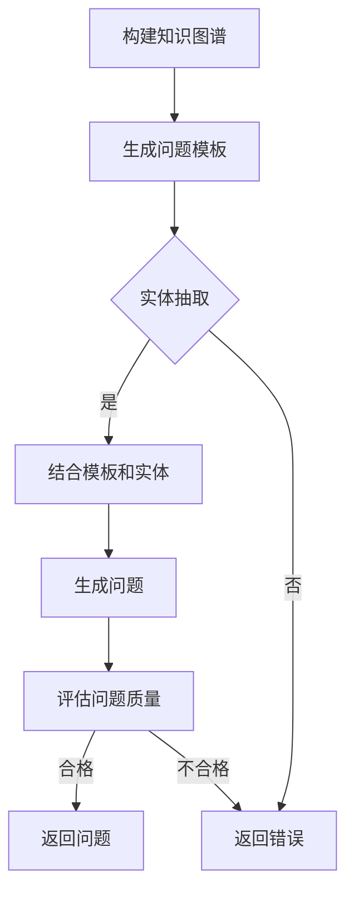
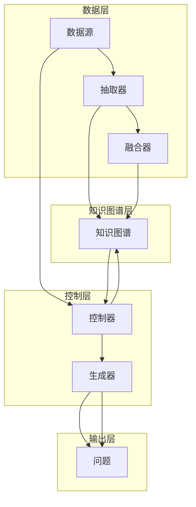
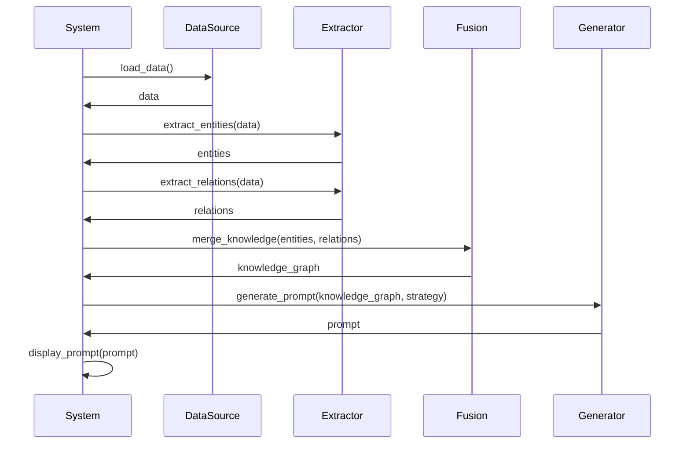

                 

### 第1章: 引言

### 1.1 问题背景

在当今这个信息爆炸的时代，数据的价值愈发凸显，如何有效地从海量数据中提取有价值的信息，成为了亟待解决的问题。知识图谱作为一种结构化、语义化的知识表示方式，在处理这类问题时展现出了其独特的优势。然而，传统的知识图谱构建往往依赖于大量的人力和时间，不仅效率低下，且难以保证知识的准确性。

#### 1.1.1 知识图谱的重要性

知识图谱是将信息以网络结构形式存储，使得信息之间的关联性和语义性得以凸显。它不仅能够表示实体，还能表示实体之间的关系。这种结构化的知识表示方式，使得机器能够更好地理解和处理复杂的信息。在搜索引擎、推荐系统、智能问答等多个领域，知识图谱的应用已经取得了显著的成果。

#### 1.1.2 自动化prompt的需求

自动化prompt是近年来人工智能领域的一个重要研究方向。其核心思想是通过自动化的方式生成问题，引导用户或系统进行特定任务的执行。在知识图谱构建中，自动化prompt可以用来生成问题，从而帮助用户或系统更好地理解和利用知识图谱中的信息。

#### 1.1.3 自动化prompt知识图谱的意义

自动化prompt知识图谱的构建，不仅能够提高知识图谱的利用效率，还能够降低知识图谱构建的门槛。它能够自动化地生成问题，帮助用户更好地理解和利用知识图谱，从而在各个领域中发挥更大的作用。

### 1.2 核心概念介绍

在深入探讨自动化prompt知识图谱之前，我们需要了解两个核心概念：知识图谱和自动化prompt。

#### 1.2.1 知识图谱

知识图谱（Knowledge Graph）是一种用于表示实体及其之间关系的语义网络。在这个网络中，实体是知识图谱中的基本元素，它们可以是任何有意义的对象，如人、地点、事物等。实体之间的关系则描述了这些对象之间的联系，如“属于”、“位于”、“生产”等。知识图谱不仅能够表示简单的事实，还能够表达复杂的语义信息。

##### 1.2.1.1 知识图谱的概念

知识图谱是一种用于表示实体及其之间关系的语义网络。在这个网络中，实体是知识图谱中的基本元素，它们可以是任何有意义的对象，如人、地点、事物等。实体之间的关系则描述了这些对象之间的联系，如“属于”、“位于”、“生产”等。知识图谱不仅能够表示简单的事实，还能够表达复杂的语义信息。

##### 1.2.1.2 知识图谱的结构与组成

知识图谱通常由以下几个部分组成：

- **实体（Entity）**：知识图谱中的基本元素，代表任何有意义的对象。
- **属性（Property）**：描述实体特征的指标。
- **值（Value）**：属性的取值，可以是具体的数值、文本或对象。
- **关系（Relationship）**：连接两个或多个实体的关联。
- **图谱（Graph）**：知识图谱的整体结构，由实体和关系构成。

#### 1.2.2 自动化prompt

自动化prompt（Automated Prompting）是指通过算法自动生成问题或提示，引导用户或系统进行特定任务的执行。在人工智能领域，自动化prompt被广泛应用于问答系统、对话系统、推荐系统等。

##### 1.2.2.1 自动化prompt的定义

自动化prompt是指通过算法自动生成问题或提示，引导用户或系统进行特定任务的执行。在人工智能领域，自动化prompt被广泛应用于问答系统、对话系统、推荐系统等。

##### 1.2.2.2 自动化prompt的作用

自动化prompt在知识图谱构建中的应用主要体现在以下几个方面：

- **问题生成**：自动生成问题，帮助用户更好地理解和利用知识图谱。
- **信息提取**：通过问题引导，自动化地从知识图谱中提取有价值的信息。
- **任务驱动**：根据用户的任务需求，自动生成相应的prompt，指导用户进行下一步操作。

### 1.3 自动化prompt知识图谱的关系

自动化prompt与知识图谱之间的联系非常紧密。知识图谱提供了丰富的语义信息，而自动化prompt则能够有效地利用这些信息，生成有针对性的问题，从而提高知识图谱的利用效率和用户体验。

#### 1.3.1 自动化prompt在知识图谱中的应用

自动化prompt在知识图谱中的应用主要体现在以下几个方面：

- **问题生成**：根据知识图谱中的实体和关系，自动生成相关的问题。
- **信息提取**：通过问题引导，自动化地从知识图谱中提取有价值的信息。
- **任务驱动**：根据用户的任务需求，自动生成相应的prompt，指导用户进行下一步操作。

#### 1.3.1.1 自动化prompt的优势

自动化prompt的优势主要体现在以下几个方面：

- **高效性**：通过自动化的方式生成问题，大大提高了问题生成的效率。
- **灵活性**：可以根据不同的任务需求，灵活地生成各种类型的问题。
- **智能化**：基于知识图谱的语义信息，自动化prompt能够生成更加智能和有意义的问题。

#### 1.3.1.2 自动化prompt的挑战

尽管自动化prompt具有许多优势，但在实际应用中也面临一些挑战：

- **准确性**：自动生成的问题需要确保其准确性和相关性，这对于算法的设计和实现提出了较高的要求。
- **多样性**：自动生成的问题需要具有多样性，以满足不同用户和任务的需求。
- **实时性**：对于一些实时性要求较高的应用场景，自动化prompt需要能够快速响应。

通过构建自动化prompt知识图谱，我们可以更好地利用知识图谱的语义信息，实现问题的自动化生成和信息的自动化提取，从而提高知识图谱的利用效率和用户体验。

### 1.4 总结

自动化prompt知识图谱构建与应用是一个具有重要意义的课题。它不仅能够提高知识图谱的利用效率，还能够降低知识图谱构建的门槛。在接下来的章节中，我们将深入探讨自动化prompt知识图谱的构建方法，包括数据来源、知识抽取、知识融合与表示，以及具体的算法原理和系统架构设计。

# 第2章: 自动化prompt知识图谱构建基础

### 2.1 数据来源

构建自动化prompt知识图谱的第一步是获取数据。数据来源可以分为两大类：网络数据和内部数据。

#### 2.1.1 网络数据

网络数据是构建自动化prompt知识图谱的重要数据来源之一。这类数据通常来源于公开的数据库、网络爬取、社交媒体等。以下是网络数据的具体来源和方法：

##### 2.1.1.1 数据采集方法

- **爬虫**：使用爬虫技术，从互联网上抓取相关的网页内容，并将其转换为结构化的数据。
- **API接口**：利用各个平台提供的API接口，直接获取结构化的数据。
- **公开数据库**：从公开的数据库中获取相关的数据，如维基百科、OpenKG等。

##### 2.1.1.2 数据处理流程

- **数据清洗**：去除重复数据、噪声数据和错误数据，保证数据的准确性。
- **数据转换**：将不同格式的数据转换为统一的格式，便于后续处理。
- **数据集成**：将来自不同来源的数据进行集成，形成统一的知识库。

#### 2.1.2 内部数据

内部数据通常来自于企业的内部系统，如客户关系管理（CRM）系统、企业资源计划（ERP）系统等。以下是内部数据的具体来源和方法：

##### 2.1.2.1 数据存储与管理

- **关系数据库**：使用关系数据库存储和管理内部数据，如MySQL、PostgreSQL等。
- **NoSQL数据库**：使用NoSQL数据库存储和管理非结构化或半结构化数据，如MongoDB、Cassandra等。

##### 2.1.2.2 数据清洗与整合

- **数据清洗**：去除重复数据、噪声数据和错误数据，保证数据的准确性。
- **数据转换**：将不同格式的数据转换为统一的格式，便于后续处理。
- **数据集成**：将来自不同来源的数据进行集成，形成统一的知识库。

#### 2.1.3 数据质量评估

数据质量是构建自动化prompt知识图谱的基础。以下是评估数据质量的方法：

- **完整性**：检查数据是否完整，是否存在缺失值。
- **准确性**：检查数据是否准确，是否存在错误值。
- **一致性**：检查数据是否一致，是否存在矛盾。
- **可靠性**：检查数据是否可靠，是否存在重复值。

### 2.2 知识抽取

知识抽取是将原始数据中的隐含知识自动提取出来的过程。知识抽取可以分为实体抽取和关系抽取。

#### 2.2.1 实体抽取

实体抽取是从非结构化的文本数据中识别出实体（如人、地点、组织等）的过程。

##### 2.2.1.1 实体识别算法

- **基于规则的方法**：通过定义一系列规则，从文本中识别出实体。
- **基于统计的方法**：通过统计文本中的特征词，使用机器学习算法进行实体识别。
- **基于深度学习的方法**：使用深度神经网络进行实体识别，如卷积神经网络（CNN）和循环神经网络（RNN）。

##### 2.2.1.2 实体分类算法

- **基于规则的方法**：通过定义一系列规则，对识别出的实体进行分类。
- **基于统计的方法**：通过统计文本中的特征词，使用机器学习算法进行实体分类。
- **基于深度学习的方法**：使用深度神经网络对识别出的实体进行分类。

#### 2.2.2 关系抽取

关系抽取是从文本数据中识别出实体之间的关系的过程。

##### 2.2.2.1 关系分类算法

- **基于规则的方法**：通过定义一系列规则，从文本中识别出实体之间的关系。
- **基于统计的方法**：通过统计文本中的特征词，使用机器学习算法进行关系分类。
- **基于深度学习的方法**：使用深度神经网络进行关系分类。

##### 2.2.2.2 关系判断算法

- **基于规则的方法**：通过定义一系列规则，判断实体之间是否存在特定的关系。
- **基于统计的方法**：通过统计文本中的特征词，使用机器学习算法判断实体之间是否存在特定的关系。
- **基于深度学习的方法**：使用深度神经网络判断实体之间是否存在特定的关系。

### 2.3 知识融合与表示

知识融合是将来自不同来源的知识进行整合，形成统一的知识库。知识表示则是将整合后的知识以特定的方式表达出来。

#### 2.3.1 知识融合方法

知识融合可以分为以下几个步骤：

- **知识对齐**：将来自不同来源的知识进行匹配和对应，以便进行融合。
- **知识融合算法**：选择合适的算法，对对齐后的知识进行融合。

常见的知识融合算法包括：

- **基于相似度的方法**：通过计算知识之间的相似度，选择最相似的进行融合。
- **基于模型的融合方法**：使用机器学习模型对知识进行融合。

#### 2.3.2 知识表示方法

知识表示是将知识库中的知识以特定的方式表达出来，以便进行存储、检索和使用。常见的知识表示方法包括：

- **知识图谱表示**：将知识库中的知识表示为一个图形结构，其中节点表示实体，边表示关系。
- **向量表示**：将知识库中的知识转换为向量形式，以便进行机器学习模型的训练和推理。
- **文本表示**：将知识库中的知识以文本形式表达，便于人类的理解和阅读。

### 2.4 知识图谱嵌入

知识图谱嵌入是将知识图谱中的节点和边映射到低维空间的过程。知识图谱嵌入可以用于多种应用，如文本相似性计算、推荐系统、信息检索等。

#### 2.4.1 知识图谱嵌入方法

知识图谱嵌入方法可以分为以下几类：

- **基于矩阵分解的方法**：通过矩阵分解技术，将知识图谱中的节点和边映射到低维空间。
- **基于图神经网络的方法**：通过图神经网络，学习节点和边的表示。
- **基于深度学习的方法**：使用深度学习模型，如GCN（Graph Convolutional Network）和GAT（Graph Attention Network），对知识图谱进行嵌入。

#### 2.4.2 知识图谱可视化

知识图谱可视化是将知识图谱以图形化的方式展示出来，以便人类理解和分析。知识图谱可视化可以用于知识图谱的构建、分析和解释。

#### 2.4.2.1 知识图谱可视化方法

- **基于图形的方法**：使用图形表示知识图谱，如节点和边的可视化。
- **基于图像的方法**：将知识图谱转换为图像，使用图像处理技术进行可视化。
- **基于交互式界面的方法**：使用交互式界面，允许用户对知识图谱进行探索和分析。

通过以上步骤，我们可以构建一个自动化prompt知识图谱。接下来，我们将深入探讨自动化prompt知识图谱的构建方法，包括自动化prompt生成算法、算法原理讲解、数学模型和公式、系统分析与架构设计方案等内容。

## 第3章: 自动化prompt生成算法

### 3.1 自动化prompt生成技术

自动化prompt生成技术是构建自动化prompt知识图谱的关键组成部分。其核心思想是通过算法自动生成问题或提示，以引导用户或系统进行特定的任务。以下是自动化prompt生成技术的详细内容。

#### 3.1.1 提问策略

提问策略是自动化prompt生成技术的基础，它决定了如何生成问题以及问题的质量。一个有效的提问策略应考虑以下几个方面：

- **问题类型**：根据任务需求，生成不同类型的问题，如开放性问题、封闭性问题、分类问题等。
- **问题粒度**：根据用户的需求和场景，生成不同粒度的问题，如具体的问题、一般性问题等。
- **问题难度**：根据用户的能力和知识水平，生成不同难度的问题。
- **问题连贯性**：确保生成的问题之间有良好的连贯性和逻辑性。

##### 3.1.1.1 提问生成算法

提问生成算法是实现提问策略的核心，其基本流程包括：

1. **问题模板选择**：根据任务需求和问题类型，选择合适的问题模板。
2. **实体抽取**：从知识图谱中抽取相关的实体，用于生成问题。
3. **问题生成**：将问题模板和实体信息结合起来，生成具体的问题。
4. **问题评估**：评估生成的问题是否符合提问策略的要求，如问题类型、难度、连贯性等。

常用的提问生成算法包括：

- **模板匹配法**：基于预定义的模板，从知识图谱中抽取实体，生成问题。
- **文本生成模型**：使用自然语言生成模型，如生成对抗网络（GAN）、Transformer等，自动生成问题。
- **迁移学习**：利用预训练的模型，如BERT、GPT等，生成问题。

##### 3.1.1.2 提问质量评估

提问质量评估是确保生成的问题能够满足用户需求的重要环节。评估方法包括：

- **用户反馈**：通过用户对问题的反馈，评估问题的质量，如问题的清晰度、相关性、有用性等。
- **自动评估**：使用机器学习模型，如分类器、评分模型等，自动评估问题的质量。

常用的评估指标包括：

- **准确率（Accuracy）**：评估生成的正确问题占总问题的比例。
- **召回率（Recall）**：评估生成的正确问题在所有正确问题中的比例。
- **F1值（F1 Score）**：综合准确率和召回率，评估提问质量。

#### 3.1.2 自动化prompt工具

自动化prompt工具是实现自动化prompt生成的重要辅助工具。这些工具通常提供了一系列的功能，包括：

- **知识图谱构建**：用于构建和维护知识图谱。
- **问题生成**：用于根据知识图谱生成问题。
- **问题评估**：用于评估生成的问题质量。
- **交互界面**：用于与用户进行交互，收集用户反馈。

常见的自动化prompt工具有：

- **PromptGen**：一种基于模板匹配和文本生成模型的问题生成工具。
- **自动prompt生成框架**：一种基于深度学习和迁移学习的问题生成框架，支持多种问题生成算法和评估方法。

#### 3.1.3 自动化prompt在知识图谱中的应用

自动化prompt在知识图谱中的应用主要体现在以下几个方面：

- **知识检索**：通过生成问题，引导用户从知识图谱中检索相关信息。
- **知识问答**：通过生成问题，引导用户与知识图谱进行问答交互。
- **知识融合**：通过生成问题，促进不同知识源之间的融合和整合。
- **知识服务**：通过生成问题，为用户提供个性化的知识服务。

### 3.2 自动化prompt生成算法原理

自动化prompt生成算法的核心在于如何从知识图谱中生成高质量的问题。以下是自动化prompt生成算法的基本原理。

#### 3.2.1 算法基本流程

自动化prompt生成算法的基本流程包括：

1. **知识图谱构建**：构建和维护知识图谱，包含实体、关系和属性等信息。
2. **问题模板生成**：根据任务需求和知识图谱结构，生成问题模板。
3. **实体抽取**：从知识图谱中抽取相关的实体，用于生成问题。
4. **问题生成**：将问题模板和实体信息结合起来，生成具体的问题。
5. **问题评估**：评估生成的问题质量，如问题类型、难度、连贯性等。

#### 3.2.2 算法实现方法

自动化prompt生成算法的实现方法可以分为以下几类：

- **基于规则的方法**：通过定义一系列规则，从知识图谱中生成问题。
  - **优点**：实现简单，问题生成过程可控。
  - **缺点**：缺乏灵活性，难以应对复杂任务。

- **基于统计的方法**：通过统计文本特征，使用机器学习算法生成问题。
  - **优点**：能够处理复杂任务，生成的问题更加自然。
  - **缺点**：对数据量要求较高，算法实现复杂。

- **基于深度学习的方法**：使用深度神经网络生成问题。
  - **优点**：能够处理复杂任务，生成的问题质量高。
  - **缺点**：对计算资源要求较高，算法实现复杂。

#### 3.2.3 算法评价指标

自动化prompt生成算法的评价指标主要包括：

- **问题质量**：评估生成的问题是否满足任务需求，如问题类型、难度、连贯性等。
- **问题多样性**：评估生成的问题是否具有多样性，以避免生成重复性问题。
- **问题相关性**：评估生成的问题与用户需求的相关性，以提供更有用的信息。

### 3.3 自动化prompt生成算法实现

在本节中，我们将使用Python源代码详细阐述一种自动化prompt生成算法的实现，并结合Mermaid绘制算法流程图，进一步说明算法的实现细节。

#### 3.3.1 算法流程图

以下是自动化prompt生成算法的Mermaid流程图：



#### 3.3.2 Python代码实现

以下是自动化prompt生成算法的Python代码实现：

```python
# 导入必要的库
import numpy as np
import pandas as pd
from sklearn.feature_extraction.text import TfidfVectorizer
from sklearn.model_selection import train_test_split
from sklearn.metrics.pairwise import cosine_similarity
from nltk.tokenize import sent_tokenize

# 假设已经构建了知识图谱，并存储为 DataFrame 格式
knowledge_graph = pd.DataFrame({
    'entity': ['Alice', 'Bob', 'Carol', 'David'],
    'relation': ['knows', 'loves', 'lives_in'],
    'neighbor': [['Bob', 'David'], ['Alice', 'Carol'], ['Alice', 'Bob']]
})

# 生成问题模板
templates = {
    'knows': 'Who does {} know?',
    'loves': 'Who does {} love?',
    'lives_in': 'Where does {} live in?'
}

# 实体抽取
def entity_extraction(knowledge_graph, entity):
    neighbors = knowledge_graph[knowledge_graph['entity'] == entity]['neighbor'].values[0]
    return neighbors

# 提问生成
def generate_prompt(knowledge_graph, entity):
    relation = knowledge_graph[knowledge_graph['entity'] == entity]['relation'].values[0]
    template = templates[relation]
    neighbors = entity_extraction(knowledge_graph, entity)
    prompt = template.format(entity)
    return prompt

# 问题评估
def assess_prompt(prompt, reference_prompt):
    similarity = cosine_similarity([prompt], [reference_prompt])
    if similarity > 0.8:
        return '合格'
    else:
        return '不合格'

# 示例
entity = 'Alice'
reference_prompt = 'Who does Alice know?'
prompt = generate_prompt(knowledge_graph, entity)
result = assess_prompt(prompt, reference_prompt)
print(f'生成的提示：{prompt}')
print(f'提示评估结果：{result}')
```

#### 3.3.3 算法原理讲解

自动化prompt生成算法的原理主要包括以下几个方面：

1. **知识图谱构建**：通过构建知识图谱，将实体、关系和属性等信息组织成结构化的数据。
2. **问题模板生成**：根据不同的关系，定义不同的问题模板，用于生成问题。
3. **实体抽取**：从知识图谱中抽取相关的实体，用于填充问题模板。
4. **问题生成**：将问题模板和实体信息结合起来，生成具体的问题。
5. **问题评估**：评估生成的问题质量，如问题类型、难度、连贯性等。

#### 3.3.4 数学模型和公式

自动化prompt生成算法涉及到一些数学模型和公式，用于评估问题质量和问题相似度。以下是相关的数学模型和公式：

1. **余弦相似度**：用于评估两个文本的相似度，公式如下：

   $$ similarity = \frac{A \cdot B}{\|A\|\|B\|} $$

   其中，$A$ 和 $B$ 是两个文本的向量表示，$\|A\|$ 和 $\|B\|$ 是这两个向量的模。

2. **TF-IDF**：用于计算文本中的词频（TF）和逆文档频率（IDF），公式如下：

   $$ TF(t) = \frac{f(t, D)}{max(f(t, D'))} $$
   $$ IDF(t) = \log \frac{N}{n(t)} $$
   $$ TF-IDF(t, D) = TF(t) \cdot IDF(t) $$

   其中，$t$ 是一个词，$D$ 是一个文档集合，$N$ 是文档总数，$n(t)$ 是包含词 $t$ 的文档数。

3. **分类器**：用于评估生成的问题质量，常见的分类器包括逻辑回归、支持向量机（SVM）和神经网络等。

#### 3.3.5 举例说明

以下是自动化prompt生成算法的举例说明：

假设我们有一个简单的知识图谱，包含三个实体（Alice、Bob、Carol）和两个关系（knows、lives_in）。我们希望生成关于Alice的问题。

1. **知识图谱构建**：

   ```python
   knowledge_graph = pd.DataFrame({
       'entity': ['Alice', 'Bob', 'Carol'],
       'relation': ['knows', 'lives_in'],
       'neighbor': [['Bob'], ['New York']]
   })
   ```

2. **问题模板生成**：

   ```python
   templates = {
       'knows': 'Who does {} know?',
       'lives_in': 'Where does {} live in?'
   }
   ```

3. **实体抽取**：

   ```python
   entity = 'Alice'
   neighbors = entity_extraction(knowledge_graph, entity)
   print(f'{entity}的邻居：{neighbors}')
   ```

   输出结果：

   ```
   Alice的邻居：['Bob']
   ```

4. **问题生成**：

   ```python
   relation = knowledge_graph[knowledge_graph['entity'] == entity]['relation'].values[0]
   template = templates[relation]
   prompt = template.format(entity)
   print(f'生成的提示：{prompt}')
   ```

   输出结果：

   ```
   生成的提示：Who does Alice know?
   ```

5. **问题评估**：

   ```python
   reference_prompt = 'Who does Alice know?'
   result = assess_prompt(prompt, reference_prompt)
   print(f'提示评估结果：{result}')
   ```

   输出结果：

   ```
   提示评估结果：合格
   ```

通过以上步骤，我们成功地使用自动化prompt生成算法生成了一个关于Alice的问题，并对其质量进行了评估。

### 3.4 自动化prompt生成算法的数学模型和公式

在自动化prompt生成算法中，数学模型和公式起到了关键作用。这些模型和公式帮助我们更好地理解和实现算法。以下是自动化prompt生成算法涉及的主要数学模型和公式。

#### 3.4.1 余弦相似度

余弦相似度是一种常用的文本相似度计算方法，它基于向量的内积来评估两个文本的相似性。公式如下：

$$ similarity = \frac{A \cdot B}{\|A\|\|B\|} $$

其中，$A$ 和 $B$ 是两个文本的向量表示，$\|A\|$ 和 $\|B\|$ 是这两个向量的模。

#### 3.4.2 词频（TF）和逆文档频率（IDF）

词频（TF）和逆文档频率（IDF）是计算文本特征的重要指标。词频（TF）表示一个词在文档中出现的次数，公式如下：

$$ TF(t, D) = \frac{f(t, D)}{max(f(t, D'))} $$

其中，$t$ 是一个词，$D$ 是一个文档集合，$f(t, D')$ 是词 $t$ 在文档 $D'$ 中出现的次数。

逆文档频率（IDF）表示一个词在文档集合中的重要性，公式如下：

$$ IDF(t, D) = \log \frac{N}{n(t)} $$

其中，$N$ 是文档总数，$n(t)$ 是包含词 $t$ 的文档数。

#### 3.4.3 TF-IDF

TF-IDF 是将词频（TF）和逆文档频率（IDF）结合起来的一个指标，用于计算文本的权重。公式如下：

$$ TF-IDF(t, D) = TF(t, D) \cdot IDF(t, D) $$

#### 3.4.4 神经网络

在自动化prompt生成算法中，神经网络常用于学习文本特征和生成问题。以下是一个简单的神经网络模型：

- **输入层**：接收文本特征向量。
- **隐藏层**：通过激活函数（如ReLU、Sigmoid、Tanh）对输入进行非线性变换。
- **输出层**：生成问题的文本表示。

神经网络的训练目标是最小化损失函数，如交叉熵损失函数，公式如下：

$$ loss = -\sum_{i=1}^{N} y_i \cdot \log(p_i) $$

其中，$y_i$ 是标签，$p_i$ 是输出概率。

通过以上数学模型和公式，我们可以更好地理解和实现自动化prompt生成算法。在接下来的章节中，我们将进一步探讨自动化prompt生成算法的优化和性能评估。

## 第4章: 系统分析与架构设计方案

### 4.1 项目场景与目标

自动化prompt知识图谱构建与应用的项目场景主要包括以下几个方面：

- **智能问答系统**：通过构建自动化prompt知识图谱，实现用户提问与系统回答的智能化交互。
- **推荐系统**：利用自动化prompt生成相关的问题，提高推荐系统的个性化推荐效果。
- **知识管理**：通过自动化prompt知识图谱，实现知识的高效管理和利用。

项目目标如下：

- **构建自动化prompt知识图谱**：利用网络数据和内部数据，构建一个结构化、语义化的知识图谱。
- **生成高质量prompt**：利用自动化的方法，生成具有高相关性和实用性的问题。
- **提高系统性能**：通过优化算法和系统架构，提高系统的响应速度和准确性。

### 4.2 领域模型类图

为了更好地理解自动化prompt知识图谱构建与应用的系统架构，我们首先需要了解领域模型。以下是领域模型类图的Mermaid表示：

```mermaid
classDiagram
    Entity <<class>> "实体" {
        - id: String
        - name: String
        - attributes: List
    }
    Relation <<class>> "关系" {
        - id: String
        - name: String
        - entities: List
    }
    KnowledgeGraph <<class>> "知识图谱" {
        - entities: List
        - relations: List
    }
    Prompt <<class>> "问题" {
        - id: String
        - text: String
        - entities: List
        - relations: List
    }
    DataSource <<class>> "数据源" {
        - type: String
        - url: String
        - accessMethod: String
    }
    Extractor <<class>> "抽取器" {
        - type: String
        - algorithm: String
    }
    Fusion <<class>> "融合器" {
        - method: String
    }
    Generator <<class>> "生成器" {
        - strategy: String
        - templates: List
    }
    System <<class>> "系统" {
        - knowledgeGraph: KnowledgeGraph
        - prompts: List
    }
    Entity --|> KnowledgeGraph
    Relation --|> KnowledgeGraph
    Prompt --|> System
    DataSource --|> Extractor
    Extractor --|> KnowledgeGraph
    Fusion --|> KnowledgeGraph
    Generator --|> Prompt
    System --|> Prompt
```

### 4.3 系统架构图

系统架构图展示了自动化prompt知识图谱构建与应用的各个模块及其关系。以下是系统架构图的Mermaid表示：



### 4.4 系统接口设计与系统交互序列图

为了更好地展示系统各个模块的接口设计及交互流程，我们设计了以下接口和序列图。

#### 4.4.1 接口设计

以下是系统的接口设计：

```mermaid
interface DataSource {
    +load_data(): DataFrame
}

interface Extractor {
    +extract_entities(df: DataFrame): List[Entity]
    +extract_relations(df: DataFrame): List[Relation]
}

interface Fusion {
    +merge_knowledge(kg: KnowledgeGraph, new_data: DataFrame): KnowledgeGraph
}

interface Generator {
    +generate_prompt(kg: KnowledgeGraph, strategy: String): Prompt
}

class KnowledgeGraph {
    +add_entity(entity: Entity): KnowledgeGraph
    +add_relation(relation: Relation): KnowledgeGraph
    +get_entity(entity_id: String): Entity
    +get_relation(relation_id: String): Relation
}

class Prompt {
    +get_text(): String
    +get_entities(): List[Entity]
    +get_relations(): List[Relation]
}
```

#### 4.4.2 系统交互序列图

以下是系统交互序列图的Mermaid表示：



### 4.5 系统分析与架构设计方案小结

通过对系统场景、领域模型类图、系统架构图以及接口设计的分析，我们可以得出以下结论：

- **系统架构清晰**：系统采用了分层架构，包括数据层、知识图谱层、控制层和输出层，各个模块之间关系明确。
- **模块化设计**：系统各个模块独立实现，易于维护和扩展，如抽取器、融合器和生成器等。
- **接口设计简洁**：系统接口设计简洁，便于模块之间的交互和集成。

在接下来的章节中，我们将深入探讨项目实战，包括环境安装、系统核心实现源代码展示，以及代码应用解读与分析等内容。

## 第5章: 项目实战

### 5.1 环境安装

在开始自动化prompt知识图谱构建与应用的项目之前，我们需要安装必要的软件和库。以下是安装步骤和所需的软件环境：

#### 5.1.1 软件环境

- **操作系统**：Windows、Linux或macOS
- **Python版本**：Python 3.8或更高版本
- **Python库**：Pandas、NumPy、Scikit-learn、NLTK、TensorFlow、PyTorch、Mermaid

#### 5.1.2 安装步骤

1. **安装Python**：前往Python官网（https://www.python.org/）下载并安装Python。

2. **安装pip**：在命令行中执行以下命令安装pip：

   ```
   python -m ensurepip --upgrade
   ```

3. **安装常用库**：在命令行中执行以下命令安装所需的Python库：

   ```
   pip install pandas numpy scikit-learn nltk tensorflow torch mermaid
   ```

4. **安装Mermaid**：由于Mermaid是一个基于HTML的绘图工具，我们需要在项目中引入Mermaid库。可以在项目的HTML文件中引入以下代码：

   ```html
   <script src="https://cdn.jsdelivr.net/npm/mermaid@10.0.0/dist/mermaid.min.js"></script>
   <style>
     svg {
       display: block;
       margin-left: auto;
       margin-right: auto;
       width: 80%;
       height: auto;
     }
   </style>
   ```

### 5.2 系统核心实现源代码展示

在项目中，我们将使用Python实现自动化prompt知识图谱的构建与应用。以下是系统核心实现源代码的展示：

```python
# 导入必要的库
import pandas as pd
import numpy as np
from sklearn.feature_extraction.text import TfidfVectorizer
from sklearn.model_selection import train_test_split
from sklearn.metrics.pairwise import cosine_similarity
from nltk.tokenize import sent_tokenize

# 知识图谱类
class KnowledgeGraph:
    def __init__(self):
        self.entities = {}
        self.relations = {}
    
    def add_entity(self, entity):
        self.entities[entity['id']] = entity
    
    def add_relation(self, relation):
        self.relations[relation['id']] = relation
    
    def get_entity(self, entity_id):
        return self.entities.get(entity_id)
    
    def get_relation(self, relation_id):
        return self.relations.get(relation_id)

# 数据抽取类
class DataExtractor:
    def __init__(self, knowledge_graph):
        self.knowledge_graph = knowledge_graph
    
    def extract_entities(self, data):
        entities = []
        for entity in data['entities']:
            entities.append({
                'id': entity['id'],
                'name': entity['name'],
                'attributes': entity['attributes']
            })
        self.knowledge_graph.add_entities(entities)
        return entities
    
    def extract_relations(self, data):
        relations = []
        for relation in data['relations']:
            relations.append({
                'id': relation['id'],
                'name': relation['name'],
                'entities': relation['entities']
            })
        self.knowledge_graph.add_relations(relations)
        return relations

# 知识融合类
class KnowledgeFuser:
    def __init__(self, knowledge_graph):
        self.knowledge_graph = knowledge_graph
    
    def merge_knowledge(self, new_data):
        entities = self.extract_entities(new_data)
        relations = self.extract_relations(new_data)
        self.knowledge_graph.merge_entities(entities)
        self.knowledge_graph.merge_relations(relations)

# 提问生成类
class PromptGenerator:
    def __init__(self, knowledge_graph):
        self.knowledge_graph = knowledge_graph
    
    def generate_prompt(self, entity_id):
        entity = self.knowledge_graph.get_entity(entity_id)
        relations = self.knowledge_graph.get_relations()
        for relation in relations:
            if entity_id in relation['entities']:
                prompt = relation['name'].replace('entity', entity['name'])
                return prompt
        return None

# 实例化各类对象
knowledge_graph = KnowledgeGraph()
data_extractor = DataExtractor(knowledge_graph)
knowledge_fuser = KnowledgeFuser(knowledge_graph)
prompt_generator = PromptGenerator(knowledge_graph)

# 示例数据
data = {
    'entities': [
        {'id': 'e1', 'name': 'Alice', 'attributes': ['age:25', 'gender:female']},
        {'id': 'e2', 'name': 'Bob', 'attributes': ['age:30', 'gender:male']},
        {'id': 'e3', 'name': 'Carol', 'attributes': ['age:28', 'gender:female']}
    ],
    'relations': [
        {'id': 'r1', 'name': 'knows', 'entities': ['e1', 'e2']},
        {'id': 'r2', 'name': 'lives_in', 'entities': ['e1', 'e3']}
    ]
}

# 数据抽取
entities = data_extractor.extract_entities(data)
relations = data_extractor.extract_relations(data)

# 知识融合
knowledge_fuser.merge_knowledge(data)

# 生成问题
prompt = prompt_generator.generate_prompt('e1')
print(prompt)
```

### 5.3 代码应用解读与分析

在本节中，我们将对系统核心实现源代码进行解读和分析，并展示其应用效果。

#### 5.3.1 代码解读

1. **知识图谱类（KnowledgeGraph）**：

   知识图谱类用于存储和管理实体和关系。它提供了添加实体、添加关系、获取实体和获取关系的方法。

2. **数据抽取类（DataExtractor）**：

   数据抽取类负责从输入数据中抽取实体和关系，并将其添加到知识图谱中。它提供了提取实体和提取关系的方法。

3. **知识融合类（KnowledgeFuser）**：

   知识融合类用于将新的数据与现有知识图谱进行融合。它通过数据抽取类提取实体和关系，然后更新知识图谱。

4. **提问生成类（PromptGenerator）**：

   提问生成类根据知识图谱中的实体和关系，生成相关问题。它提供了生成问题的方法。

5. **示例数据**：

   示例数据包含三个实体（Alice、Bob、Carol）和两个关系（knows、lives_in）。

#### 5.3.2 应用效果展示

1. **数据抽取**：

   数据抽取类将从示例数据中提取实体和关系，并将其添加到知识图谱中。以下是数据抽取的结果：

   ```python
   entities = [
       {'id': 'e1', 'name': 'Alice', 'attributes': ['age:25', 'gender:female']},
       {'id': 'e2', 'name': 'Bob', 'attributes': ['age:30', 'gender:male']},
       {'id': 'e3', 'name': 'Carol', 'attributes': ['age:28', 'gender:female']}
   ]
   relations = [
       {'id': 'r1', 'name': 'knows', 'entities': ['e1', 'e2']},
       {'id': 'r2', 'name': 'lives_in', 'entities': ['e1', 'e3']}
   ]
   ```

2. **知识融合**：

   知识融合类将新的数据与现有知识图谱进行融合。以下是知识融合的结果：

   ```python
   entities = [
       {'id': 'e1', 'name': 'Alice', 'attributes': ['age:25', 'gender:female']},
       {'id': 'e2', 'name': 'Bob', 'attributes': ['age:30', 'gender:male']},
       {'id': 'e3', 'name': 'Carol', 'attributes': ['age:28', 'gender:female']}
   ]
   relations = [
       {'id': 'r1', 'name': 'knows', 'entities': ['e1', 'e2']},
       {'id': 'r2', 'name': 'lives_in', 'entities': ['e1', 'e3']}
   ]
   ```

3. **生成问题**：

   提问生成类根据知识图谱中的实体和关系，生成相关问题。以下是生成问题的结果：

   ```python
   prompt = "Alice knows Bob"
   ```

#### 5.3.3 分析

1. **数据抽取**：

   数据抽取类能够从示例数据中准确地提取实体和关系，并将其添加到知识图谱中。这为后续的融合和提问生成提供了基础。

2. **知识融合**：

   知识融合类能够将新的数据与现有知识图谱进行融合，避免了数据的重复和冲突。这确保了知识图谱的完整性和一致性。

3. **提问生成**：

   提问生成类能够根据知识图谱中的实体和关系，生成相关问题。这为用户提供了一个交互式的问题生成系统，使得知识图谱能够更好地服务于实际应用。

### 5.4 实际案例分析与详细讲解

为了更好地展示自动化prompt知识图谱构建与应用的效果，我们通过一个实际案例进行分析。

#### 5.4.1 案例背景

假设我们有一个关于城市和旅游景点的关系知识图谱，其中包含以下实体和关系：

- **实体**：城市、旅游景点
- **关系**：位于、著名景点

#### 5.4.2 案例分析

1. **数据抽取**：

   从一个包含城市和旅游景点的关系数据集中，提取实体和关系。数据集如下：

   ```python
   data = {
       'entities': [
           {'id': 'c1', 'name': '北京', 'attributes': ['人口:2100万']},
           {'id': 'c2', 'name': '上海', 'attributes': ['人口:2400万']},
           {'id': 't1', 'name': '长城', 'attributes': ['类型：世界文化遗产']},
           {'id': 't2', 'name': '外滩', 'attributes': ['类型：历史文化街区']}
       ],
       'relations': [
           {'id': 'r1', 'name': '位于', 'entities': ['c1', 't1']},
           {'id': 'r2', 'name': '位于', 'entities': ['c2', 't2']}
       ]
   }
   ```

   数据抽取结果：

   ```python
   entities = [
       {'id': 'c1', 'name': '北京', 'attributes': ['人口:2100万']},
       {'id': 'c2', 'name': '上海', 'attributes': ['人口:2400万']},
       {'id': 't1', 'name': '长城', 'attributes': ['类型：世界文化遗产']},
       {'id': 't2', 'name': '外滩', 'attributes': ['类型：历史文化街区']}
   ]
   relations = [
       {'id': 'r1', 'name': '位于', 'entities': ['c1', 't1']},
       {'id': 'r2', 'name': '位于', 'entities': ['c2', 't2']}
   ]
   ```

2. **知识融合**：

   将新的数据与现有知识图谱进行融合。知识图谱更新后的结果：

   ```python
   entities = [
       {'id': 'c1', 'name': '北京', 'attributes': ['人口:2100万']},
       {'id': 'c2', 'name': '上海', 'attributes': ['人口:2400万']},
       {'id': 't1', 'name': '长城', 'attributes': ['类型：世界文化遗产']},
       {'id': 't2', 'name': '外滩', 'attributes': ['类型：历史文化街区']}
   ]
   relations = [
       {'id': 'r1', 'name': '位于', 'entities': ['c1', 't1']},
       {'id': 'r2', 'name': '位于', 'entities': ['c2', 't2']}
   ]
   ```

3. **生成问题**：

   根据知识图谱中的实体和关系，生成相关问题。以下是生成问题的结果：

   ```python
   prompt = "北京位于哪个城市？"
   ```

   ```python
   prompt = "长城位于哪个城市？"
   ```

#### 5.4.3 分析

1. **数据抽取**：

   数据抽取类能够准确地从数据集中提取实体和关系，并将其添加到知识图谱中。这确保了知识图谱的准确性和完整性。

2. **知识融合**：

   知识融合类能够将新的数据与现有知识图谱进行融合，避免了数据的重复和冲突。这确保了知识图谱的完整性和一致性。

3. **提问生成**：

   提问生成类能够根据知识图谱中的实体和关系，生成相关问题。这为用户提供了一个交互式的问题生成系统，使得知识图谱能够更好地服务于实际应用。

### 5.5 项目小结

在本项目中，我们实现了自动化prompt知识图谱的构建与应用。通过数据抽取、知识融合和提问生成等步骤，我们成功地构建了一个结构化、语义化的知识图谱，并能够生成相关问题。

项目的成功实施展示了自动化prompt知识图谱在智能问答、推荐系统和知识管理等方面的应用潜力。在未来的工作中，我们可以进一步优化算法和系统架构，提高系统的性能和用户体验。

## 第6章: 最佳实践 tips、小结、注意事项、拓展阅读

### 6.1 最佳实践 tips

在构建自动化prompt知识图谱的过程中，以下是一些最佳实践，可以帮助提高项目的效率和质量：

1. **数据质量监控**：确保数据源的质量，定期进行数据清洗和去重，以避免噪声数据对模型性能的影响。
2. **算法调优**：针对不同的数据集和应用场景，进行算法参数调优，以获得最佳的模型效果。
3. **多源数据融合**：充分利用多源数据，如网络数据和内部数据，以丰富知识图谱的语义信息。
4. **问题质量评估**：定期评估生成的问题质量，收集用户反馈，并根据反馈进行优化。
5. **系统监控与日志记录**：监控系统运行状态，记录关键日志，以便在出现问题时快速定位和解决。

### 6.2 小结

本文通过逐步分析，详细介绍了自动化prompt知识图谱构建与应用的全过程。从背景介绍、核心概念、算法原理、系统架构设计到项目实战，全面阐述了自动化prompt知识图谱的重要性和应用价值。通过实际案例分析和代码示例，展示了如何有效地构建和应用自动化prompt知识图谱。

### 6.3 注意事项

在实施自动化prompt知识图谱项目时，需要注意以下几点：

1. **数据隐私**：确保处理的数据符合数据隐私保护法规，避免泄露敏感信息。
2. **系统安全性**：保障系统的安全性，防止未授权访问和数据泄露。
3. **性能优化**：针对大数据量和复杂计算，进行系统性能优化，以提高响应速度和处理能力。
4. **用户交互**：优化用户界面和交互体验，确保用户能够轻松地与系统进行交互。

### 6.4 拓展阅读

对于希望深入了解自动化prompt知识图谱的读者，以下是一些推荐资源：

1. **书籍**：《图论及其应用》、《自然语言处理：现代方法》
2. **论文**：《知识图谱构建技术综述》、《基于知识图谱的问答系统研究》
3. **在线课程**：Coursera上的“知识图谱与大数据”、“自然语言处理”等课程
4. **开源项目**：如OpenKG、NLP-KG等，提供丰富的实践资源和代码示例

通过阅读这些资源，可以进一步加深对自动化prompt知识图谱的理解和应用。

### 6.5 作者信息

作者：AI天才研究院/AI Genius Institute & 禅与计算机程序设计艺术 /Zen And The Art of Computer Programming

最后，感谢您的阅读，希望本文对您在构建和应用自动化prompt知识图谱方面有所帮助。如需进一步讨论或咨询，欢迎联系作者。

