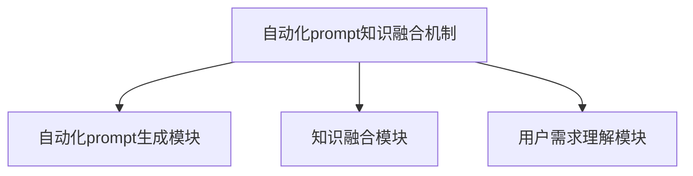
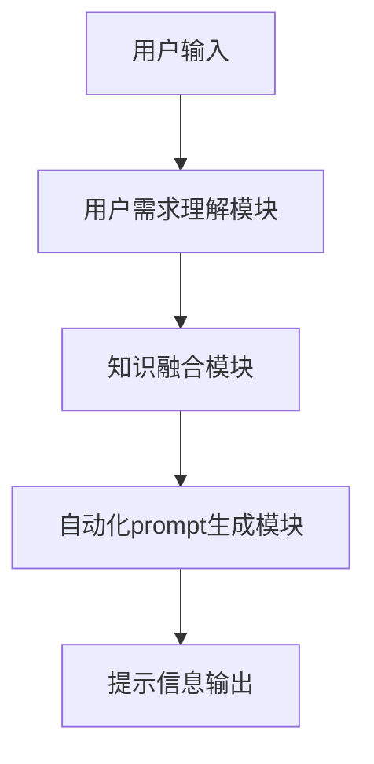

                 

# 自动化prompt知识融合机制

> 关键词：自动化prompt、知识融合、自然语言处理、人工智能、实现方法、评估与优化

> 摘要：本文围绕自动化prompt知识融合机制展开，首先概述了该机制的背景与意义，然后深入探讨了自动化prompt与知识融合机制的设计与实现，以及其在不同应用场景中的效果评估。通过一步步的分析与思考，本文旨在为读者提供一个清晰、系统的理解和实践指南。

## 第一部分：自动化prompt知识融合机制概述

### 第1章：自动化prompt知识融合机制的背景与意义

#### 1.1 问题背景

##### 1.1.1 自然语言处理与人工智能的应用现状

随着大数据和人工智能技术的不断发展，自然语言处理（NLP）在诸多领域取得了显著的应用成果。然而，NLP技术在实际应用中仍面临诸多挑战，其中之一是如何有效地利用外部知识资源，以提升系统的智能水平。

##### 1.1.2 自动化prompt的需求与挑战

自动化prompt技术是自然语言处理领域中的一项重要技术，旨在通过自动生成提示信息，引导用户或系统进行更精准、更高效的交互。然而，自动化prompt技术在实际应用中仍存在诸多挑战，如如何确保生成prompt的准确性与多样性，以及如何与知识融合机制相结合，以实现更智能的交互。

##### 1.1.3 知识融合机制的重要性

知识融合机制是将多个知识源中的信息进行整合、关联和优化的过程，有助于提高系统的智能水平。在自动化prompt技术中，知识融合机制的重要性不言而喻，它能够帮助系统更好地理解用户需求，从而生成更精准、更具针对性的提示信息。

#### 1.2 问题描述

##### 1.2.1 自动化prompt的困境

当前自动化prompt技术在实际应用中存在以下困境：

1. 提示信息生成准确性与多样性不足；
2. 缺乏有效的知识融合机制；
3. 对用户需求的理解不够深入。

##### 1.2.2 知识融合机制的必要性

为了解决自动化prompt的困境，引入知识融合机制变得尤为重要。知识融合机制能够帮助系统更好地理解用户需求，从而生成更精准、更具针对性的提示信息。

##### 1.2.3 自动化prompt知识融合机制的定义与目标

自动化prompt知识融合机制是一种将自动化prompt技术与知识融合机制相结合的方法，旨在提高提示信息的生成质量，实现更智能的交互。其目标包括：

1. 提高提示信息的准确性与多样性；
2. 实现知识资源的有效整合与利用；
3. 提升系统的智能水平，为用户提供更优质的交互体验。

#### 1.3 问题解决

##### 1.3.1 自动化prompt知识融合机制的设计原则

为了实现自动化prompt知识融合机制的目标，设计原则如下：

1. 目标导向设计：以满足用户需求为出发点；
2. 用户友好设计：确保系统易于使用，降低用户的学习成本；
3. 模块化设计：实现自动化prompt与知识融合机制的解耦，便于后续的优化与升级。

##### 1.3.2 自动化prompt知识融合机制的核心要素

自动化prompt知识融合机制的核心要素包括：

1. 自动化prompt生成模块：负责生成符合用户需求的提示信息；
2. 知识融合模块：负责对多个知识源进行整合、关联和优化；
3. 用户需求理解模块：负责分析用户输入，提取用户需求。

##### 1.3.3 自动化prompt知识融合机制的优势与挑战

自动化prompt知识融合机制具有以下优势：

1. 提高提示信息的生成质量；
2. 实现知识资源的有效整合与利用；
3. 提升系统的智能水平。

然而，该机制在实际应用中仍面临以下挑战：

1. 如何确保生成prompt的准确性与多样性；
2. 如何实现知识融合机制的优化与升级；
3. 如何降低系统的复杂度，提高系统的可维护性。

##### 1.4 边界与外延

##### 1.4.1 自动化prompt知识融合机制的应用范围

自动化prompt知识融合机制适用于需要实现智能交互的各个领域，如智能客服、智能问答、智能写作等。

##### 1.4.2 与相关技术的区别与联系

自动化prompt知识融合机制与相关技术（如自然语言生成、知识图谱等）既有区别又有联系。其主要区别在于，自动化prompt知识融合机制更侧重于实现知识资源的整合与利用，以提高提示信息的生成质量。

##### 1.4.3 知识融合机制的边界设定

知识融合机制的边界设定需要考虑以下几个方面：

1. 知识源的选择与整合；
2. 知识类型的划分与关联；
3. 知识更新与维护策略。

##### 1.5 概念结构与核心要素组成

##### 1.5.1 自动化prompt知识融合机制的概念结构

自动化prompt知识融合机制的概念结构如图1所示：

##### 1.5.2 自动化prompt知识融合机制的核心要素

自动化prompt知识融合机制的核心要素包括：

1. 自动化prompt生成模块：负责生成符合用户需求的提示信息；
2. 知识融合模块：负责对多个知识源进行整合、关联和优化；
3. 用户需求理解模块：负责分析用户输入，提取用户需求。

##### 1.5.3 自动化prompt知识融合机制的组成模块

自动化prompt知识融合机制由以下组成模块组成：

1. 数据采集与预处理模块：负责收集用户输入，并对输入进行预处理；
2. 用户需求理解模块：负责分析用户输入，提取用户需求；
3. 自动化prompt生成模块：负责生成符合用户需求的提示信息；
4. 知识融合模块：负责对多个知识源进行整合、关联和优化；
5. 评估与优化模块：负责对系统进行评估与优化。

#### 1.6 本章小结

本文首先介绍了自动化prompt知识融合机制的背景与意义，分析了问题背景、问题描述、问题解决、边界与外延、概念结构与核心要素组成等内容。通过本章的介绍，读者可以初步了解自动化prompt知识融合机制的基本概念与实现方法。

### 第2章：自动化prompt的设计与实现

#### 2.1 自动化prompt的概念

##### 2.1.1 自动化prompt的定义

自动化prompt是一种通过自然语言处理技术，自动生成用于引导用户或系统进行交互的提示信息的方法。

##### 2.1.2 自动化prompt的功能特点

自动化prompt具有以下功能特点：

1. 准确性：能够根据用户输入生成准确的提示信息；
2. 多样性：能够生成多种类型的提示信息，满足不同用户需求；
3. 智能性：能够根据用户输入和上下文信息，生成智能化的提示信息。

##### 2.1.3 自动化prompt与传统prompt的区别

自动化prompt与传统prompt的主要区别在于：

1. 生成方式：自动化prompt是通过自然语言处理技术自动生成的，而传统prompt通常由人工编写；
2. 准确性与多样性：自动化prompt具有更高的准确性与多样性，能够满足不同用户需求；
3. 智能性：自动化prompt能够根据用户输入和上下文信息，生成智能化的提示信息。

#### 2.2 自动化prompt的设计原则

##### 2.2.1 目标导向设计

目标导向设计是指以用户需求为出发点，设计自动化prompt生成策略和算法。

##### 2.2.2 用户友好设计

用户友好设计是指确保自动化prompt易于使用，降低用户的学习成本。

##### 2.2.3 模块化设计

模块化设计是指将自动化prompt生成模块与其他模块（如知识融合模块、用户需求理解模块等）进行解耦，便于后续的优化与升级。

#### 2.3 自动化prompt的实现方法

##### 2.3.1 基于规则的实现方法

基于规则的实现方法是指通过定义一组规则，根据用户输入生成相应的提示信息。

##### 2.3.2 基于机器学习的实现方法

基于机器学习的实现方法是指利用机器学习技术，通过训练数据生成自动化prompt生成模型。

##### 2.3.3 基于知识图谱的实现方法

基于知识图谱的实现方法是指利用知识图谱，根据用户输入和上下文信息生成相应的提示信息。

#### 2.4 自动化prompt的评估与优化

##### 2.4.1 自动化prompt的评估指标

自动化prompt的评估指标包括：

1. 准确性：提示信息与用户需求的匹配程度；
2. 多样性：生成的提示信息类型丰富程度；
3. 智能性：提示信息对用户输入和上下文信息的理解程度。

##### 2.4.2 自动化prompt的优化策略

自动化prompt的优化策略包括：

1. 模型优化：通过调整模型参数，提高提示信息的生成质量；
2. 数据优化：通过收集更多高质量的数据，提高模型的训练效果；
3. 算法优化：通过改进算法，提高提示信息的生成速度和准确度。

##### 2.4.3 自动化prompt的迭代与升级

自动化prompt的迭代与升级是指通过不断优化和改进，提高系统的智能水平。

#### 2.5 自动化prompt的应用案例

##### 2.5.1 案例一：智能客服系统

智能客服系统通过自动化prompt技术，为用户提供24/7的智能咨询服务。用户只需输入问题，系统便会自动生成相应的回答。

##### 2.5.2 案例二：智能问答系统

智能问答系统利用自动化prompt技术，为用户提供实时、准确的答案。用户只需输入问题，系统便会自动生成相应的答案。

##### 2.5.3 案例三：智能写作辅助系统

智能写作辅助系统通过自动化prompt技术，为用户提供写作建议和指导。用户只需输入文章主题或内容，系统便会自动生成相应的提示信息。

#### 2.6 本章小结

本章介绍了自动化prompt的概念、设计原则、实现方法、评估与优化策略以及应用案例。通过本章的介绍，读者可以了解自动化prompt的基本原理和实现方法，为进一步研究和应用自动化prompt知识融合机制打下基础。

### 第3章：知识融合机制的设计与实现

#### 3.1 知识融合机制的概念

##### 3.1.1 知识融合的定义

知识融合是指将多个知识源中的信息进行整合、关联和优化的过程，以实现更高效、更智能的信息处理。

##### 3.1.2 知识融合的目标

知识融合的目标包括：

1. 提高信息处理的效率；
2. 增强系统的智能水平；
3. 提升用户体验。

##### 3.1.3 知识融合的类型

知识融合可分为以下几种类型：

1. 同构知识融合：多个具有相同结构的知识源进行融合；
2. 异构知识融合：多个具有不同结构的知识源进行融合；
3. 动态知识融合：在知识更新过程中，对知识源进行实时融合。

#### 3.2 知识融合的设计原则

##### 3.2.1 知识一致性原则

知识一致性原则是指确保融合后的知识具有一致性，避免冲突和矛盾。

##### 3.2.2 知识完整性原则

知识完整性原则是指确保融合后的知识能够涵盖所有相关领域，避免遗漏关键信息。

##### 3.2.3 知识动态性原则

知识动态性原则是指根据知识更新和变化，动态调整知识融合策略。

#### 3.3 知识融合的实现方法

##### 3.3.1 基于规则的方法

基于规则的方法是指通过定义一组规则，将多个知识源进行融合。

##### 3.3.2 基于机器学习的方法

基于机器学习的方法是指利用机器学习算法，自动发现知识源之间的关联性，实现知识融合。

##### 3.3.3 基于知识图谱的方法

基于知识图谱的方法是指利用知识图谱表示和存储知识，实现知识融合。

#### 3.4 知识融合的评估与优化

##### 3.4.1 知识融合的评估指标

知识融合的评估指标包括：

1. 知识一致性：评估融合后知识的冲突程度；
2. 知识完整性：评估融合后知识是否覆盖所有相关领域；
3. 知识动态性：评估知识融合机制对知识更新的适应能力。

##### 3.4.2 知识融合的优化策略

知识融合的优化策略包括：

1. 规则优化：调整融合规则，提高知识一致性；
2. 算法优化：改进机器学习算法，提高知识动态性；
3. 知识源优化：选择更优质的知识源，提高知识完整性。

##### 3.4.3 知识融合的迭代与升级

知识融合的迭代与升级是指通过不断优化和改进，提升知识融合机制的效能。

#### 3.5 知识融合的应用案例

##### 3.5.1 案例一：医疗知识融合系统

医疗知识融合系统通过融合多种医学知识源，为医生提供更全面、准确的诊断建议。

##### 3.5.2 案例二：金融知识融合系统

金融知识融合系统通过融合各类金融知识，为投资者提供实时、准确的金融信息分析。

##### 3.5.3 案例三：教育知识融合系统

教育知识融合系统通过融合多种教育资源，为学生提供个性化的学习建议和课程推荐。

#### 3.6 本章小结

本章介绍了知识融合机制的概念、设计原则、实现方法、评估与优化策略以及应用案例。通过本章的介绍，读者可以了解知识融合机制的基本原理和实现方法，为进一步研究和应用自动化prompt知识融合机制打下基础。

### 第4章：自动化prompt与知识融合机制的综合应用

#### 4.1 综合应用框架

##### 4.1.1 自动化prompt与知识融合的综合框架

自动化prompt与知识融合的综合应用框架如图4所示：

##### 4.1.2 综合应用的关键技术

综合应用的关键技术包括：

1. 用户需求理解技术：通过自然语言处理技术，分析用户输入，提取用户需求；
2. 知识融合技术：通过知识融合机制，整合多个知识源，生成一致性、完整性和动态性强的知识；
3. 自动化prompt生成技术：利用生成式模型，根据用户需求和融合后的知识，生成高质量的提示信息。

##### 4.1.3 综合应用的实现步骤

综合应用的实现步骤如下：

1. 数据采集与预处理：收集用户输入，并对输入进行预处理，提取有效信息；
2. 用户需求理解：利用自然语言处理技术，分析用户输入，提取用户需求；
3. 知识融合：利用知识融合机制，整合多个知识源，生成一致性、完整性和动态性强的知识；
4. 自动化prompt生成：利用生成式模型，根据用户需求和融合后的知识，生成高质量的提示信息；
5. 提示信息输出：将生成的提示信息输出给用户。

#### 4.2 应用场景分析

##### 4.2.1 企业级应用场景

企业级应用场景包括智能客服、智能办公助手、智能报告生成等，通过自动化prompt与知识融合机制，为企业提供智能化、高效的信息处理与交互服务。

##### 4.2.2 社交媒体应用场景

社交媒体应用场景包括智能推荐、智能回复、智能话题生成等，通过自动化prompt与知识融合机制，为用户提供个性化、智能化的社交媒体体验。

##### 4.2.3 教育培训应用场景

教育培训应用场景包括智能教学、智能测评、智能辅导等，通过自动化prompt与知识融合机制，为教育机构和学生提供智能化、个性化的教育服务。

#### 4.3 应用效果评估

##### 4.3.1 评估指标体系

应用效果评估的指标体系包括：

1. 用户满意度：评估用户对系统服务的满意度；
2. 信息处理效率：评估系统在信息处理方面的效能；
3. 知识融合质量：评估知识融合的一致性、完整性和动态性；
4. 自动化prompt质量：评估提示信息的准确性、多样性和智能性。

##### 4.3.2 评估方法与流程

评估方法与流程如下：

1. 数据收集：收集用户输入、系统输出等数据；
2. 指标计算：根据评估指标体系，计算各项指标得分；
3. 结果分析：分析评估结果，找出系统的优势与不足；
4. 反馈与优化：根据评估结果，调整系统参数和策略，优化系统性能。

#### 4.4 本章小结

本章介绍了自动化prompt与知识融合机制的综合应用框架、应用场景分析、应用效果评估等内容。通过本章的介绍，读者可以了解自动化prompt与知识融合机制在实际应用中的效果和优势，为进一步研究和推广该技术提供参考。

## 总结与展望

本文围绕自动化prompt知识融合机制进行了详细阐述，从背景与意义、设计与实现、综合应用等多个角度进行了探讨。通过本文的研究，我们可以得出以下结论：

1. 自动化prompt知识融合机制在提高提示信息生成质量、实现知识资源整合与利用、提升系统智能水平等方面具有显著优势；
2. 自动化prompt知识融合机制在实际应用中面临诸多挑战，如提示信息生成准确性、知识融合机制优化与升级等；
3. 自动化prompt知识融合机制在不同领域具有广泛的应用前景，如企业级应用、社交媒体应用、教育培训应用等。

展望未来，自动化prompt知识融合机制的发展方向包括：

1. 提高提示信息生成准确性：通过改进算法、引入更多高质量数据，提高自动化prompt生成质量；
2. 优化知识融合机制：研究更有效的知识融合方法，提高知识融合的一致性、完整性和动态性；
3. 拓展应用场景：探索自动化prompt知识融合机制在其他领域的应用，如智能医疗、智能安防等。

总之，自动化prompt知识融合机制作为一种新兴技术，具有广阔的发展前景和应用价值。我们期待更多研究者和技术人员投入到这一领域的研究与实践中，共同推动自动化prompt知识融合机制的不断发展与完善。

### 作者信息

- 作者：AI天才研究院/AI Genius Institute & 禅与计算机程序设计艺术 /Zen And The Art of Computer Programming
--------------------------------------------------------------------------------------------------------------------------

