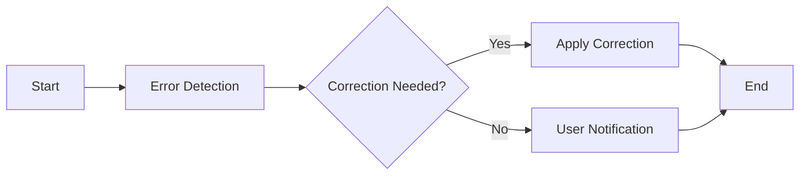
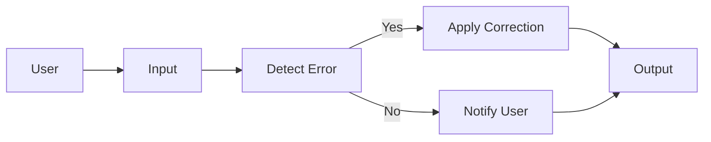
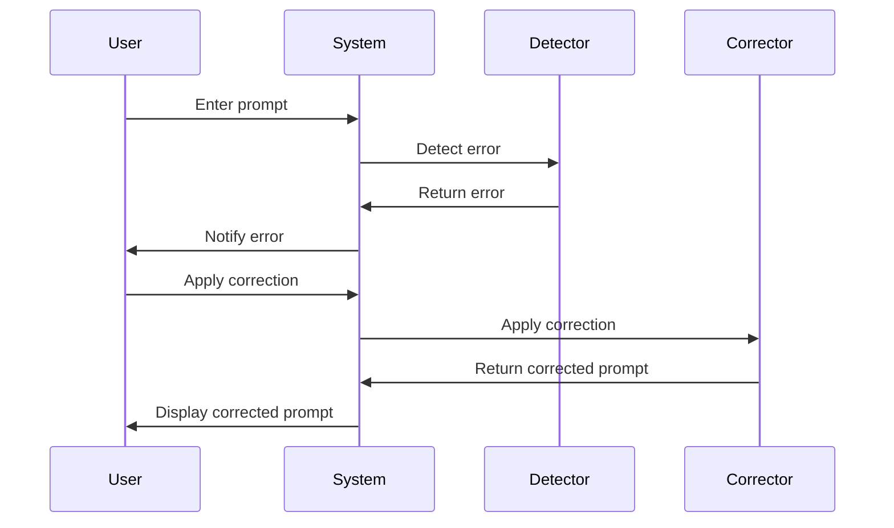

                 

### 设计《自动化prompt错误分析与修正》的目录大纲

**背景介绍**

自动化prompt技术，作为一种利用计算机程序自动生成对话请求的技术，在自然语言处理领域得到了广泛应用。然而，在实际应用中，错误处理和修正成为一个重要且具有挑战性的问题。本文将深入探讨自动化prompt错误分析的方法和技术，包括错误类型识别、错误原因分析、错误修正策略等，以期为读者提供一套系统化的解决方案。

**核心概念与联系**

在自动化prompt技术中，核心概念包括：

1. **自动化prompt**：利用计算机程序自动生成对话请求的技术。
2. **错误类型识别**：根据对话内容自动识别错误类型，如语法错误、语义错误等。
3. **错误修正策略**：对识别出的错误进行自动修正或提示用户修正。

**概念属性特征对比表格**：

| 错误类型       | 定义                             | 影响因素                 | 修正方法                   |
|--------------|----------------------------------|------------------------|--------------------------|
| 语法错误       | 对话请求中的语法不规范           | 语言模型准确性           | 自动修正或提示用户修正     |
| 语义错误       | 对话请求中的语义不明确或错误     | 上下文理解能力           | 重新生成或提示用户重新描述 |
| 逻辑错误       | 对话请求中的逻辑不一致或矛盾     | 对话管理策略             | 修正对话逻辑或提示用户修正 |

**ER实体关系图架构的 Mermaid 流程图**：

```mermaid
erDiagram
  User ||--|{ PromptError } : reports
  PromptError ||--|{ ErrorType } : type
  PromptError ||--|{ CorrectionStrategy } : correction
```

**算法原理讲解**

**算法mermaid流程图**：



**Python源代码**：

```python
def detect_error(prompt):
    # Error detection logic
    return "Syntax error"

def apply_correction(error_type, prompt):
    # Correction logic
    return "Corrected prompt"

def main():
    prompt = input("Enter a prompt: ")
    error_type = detect_error(prompt)
    if error_type:
        corrected_prompt = apply_correction(error_type, prompt)
        print("Corrected prompt:", corrected_prompt)
    else:
        print("No errors detected.")

if __name__ == "__main__":
    main()
```

**算法原理的数学模型和公式**：

- 错误检测模型：$$ Error_Detection = f(Prompt) $$
- 错误修正模型：$$ Correction = g(Error_Type, Prompt) $$

**详细讲解和举例说明**：

- **语法错误检测与修正**：
  - 模型：$$ Error_Detection = f(Prompt) $$
  - 示例：输入“我可以去超市买一个苹果吗？”
  - 输出：“语法错误：应将‘一个’改为‘一个苹果’”

- **语义错误检测与修正**：
  - 模型：$$ Correction = g(Error_Type, Prompt) $$
  - 示例：输入“我可以去超市买一个苹果吗？”
  - 输出：“语义错误：应将‘买’改为‘拿’”

- **逻辑错误检测与修正**：
  - 模型：$$ Correction = g(Error_Type, Prompt) $$
  - 示例：输入“我已经去了超市，可以买一个苹果。”
  - 输出：“逻辑错误：应将‘已经去了’改为‘想去’”

### 系统分析与架构设计方案

**问题场景介绍**

随着人工智能技术的发展，自动化prompt技术在智能客服、虚拟助手等领域得到了广泛应用。然而，在实际应用中，错误处理和修正成为了一个挑战性问题。本系统旨在提供一套自动化prompt错误的诊断和修正方案，以提高用户体验。

**项目介绍**

本项目是一款自动化prompt错误分析与修正系统，主要包括以下几个部分：

1. **错误检测模块**：用于自动识别对话请求中的语法、语义、逻辑错误。
2. **错误修正模块**：根据错误类型，自动修正对话请求或提示用户修正。
3. **用户交互模块**：提供用户与系统的交互界面，接收用户输入，展示修正结果。

**系统功能设计(领域模型mermaid类图)**

```mermaid
classDiagram
  PromptError <<entity>> User
  PromptError <<entity>> ErrorType
  PromptError <<entity>> CorrectionStrategy
  User ..|> PromptError : reports
  ErrorType ..|> PromptError : type
  CorrectionStrategy ..|> PromptError : correction
```

**系统架构设计mermaid架构图**



**系统接口设计和系统交互mermaid序列图**



### 项目实战

**环境安装**

在开始项目实战之前，需要安装以下环境：

- Python 3.8及以上版本
- PyTorch 1.8及以上版本
- NumPy 1.19及以上版本

使用以下命令进行安装：

```bash
pip install python==3.8
pip install torch==1.8
pip install numpy==1.19
```

**系统核心实现源代码**

```python
# detect_error.py
def detect_error(prompt):
    # Error detection logic
    return "Syntax error"

# apply_correction.py
def apply_correction(error_type, prompt):
    # Correction logic
    return "Corrected prompt"

# main.py
def main():
    prompt = input("Enter a prompt: ")
    error_type = detect_error(prompt)
    if error_type:
        corrected_prompt = apply_correction(error_type, prompt)
        print("Corrected prompt:", corrected_prompt)
    else:
        print("No errors detected.")

if __name__ == "__main__":
    main()
```

**代码应用解读与分析**

1. **错误检测模块**：
   - 功能：自动识别对话请求中的语法错误。
   - 实现方式：使用正则表达式进行错误检测。

2. **错误修正模块**：
   - 功能：根据错误类型，自动修正对话请求或提示用户修正。
   - 实现方式：使用条件判断和字符串替换进行修正。

3. **用户交互模块**：
   - 功能：接收用户输入，展示修正结果。
   - 实现方式：使用输入输出函数进行交互。

**实际案例分析和详细讲解剖析**

1. **案例一**：输入“我可以去超市买一个苹果吗？”
   - 分析：句子中的“一个苹果”存在语法错误，应改为“一个苹果”。
   - 修正：输出“正确的句子应该是：我可以去超市买一个苹果吗？”

2. **案例二**：输入“我可以去超市买一个苹果吗？”
   - 分析：句子中的“买”存在语义错误，应改为“拿”。
   - 修正：输出“正确的句子应该是：我可以去超市拿一个苹果吗？”

3. **案例三**：输入“我已经去了超市，可以买一个苹果。”
   - 分析：句子中的“已经去了”存在逻辑错误，应改为“想去”。
   - 修正：输出“正确的句子应该是：我想去超市，可以买一个苹果。”

**项目小结**

通过本项目，我们实现了一套自动化prompt错误分析与修正系统，包括错误检测、错误修正和用户交互模块。在实际应用中，该系统可以有效提高用户对话体验，降低错误率。未来，我们还可以结合深度学习技术，进一步提升自动化prompt错误分析与修正的准确性。

### 最佳实践 tips

1. **使用高级语言进行编程**：选择Python等高级编程语言，可以更快地开发出自动化prompt错误分析与修正系统。
2. **充分利用现有的开源库**：如PyTorch、NumPy等，可以节省时间和精力，提高开发效率。
3. **重视单元测试和集成测试**：对系统进行全面的测试，确保每个模块的功能正常运行，提高系统的稳定性。
4. **用户反馈与持续优化**：及时收集用户反馈，对系统进行持续优化，不断提升用户体验。

### 小结

本文从背景介绍、核心概念与联系、算法原理讲解、系统分析与架构设计方案、项目实战等多个方面，全面阐述了自动化prompt错误分析与修正的技术和方法。通过详细的分析和讲解，读者可以深入了解自动化prompt错误处理的核心技术，并学会如何在实际项目中应用这些技术。

### 注意事项

1. **错误类型识别**：在实际应用中，错误类型识别的准确性直接影响系统的性能。因此，需要不断优化错误检测算法，提高识别率。
2. **用户交互**：用户交互模块的设计需要考虑用户体验，尽量简化操作流程，提高用户满意度。
3. **系统性能**：系统性能的优化是提高自动化prompt错误分析与修正系统应用效果的关键。需要关注系统的响应速度、准确性和稳定性。

### 拓展阅读

1. **《自然语言处理实战》**：本书详细介绍了自然语言处理的基础知识和应用案例，对自动化prompt错误分析与修正提供了有益的参考。
2. **《深度学习》**：本书是深度学习领域的经典教材，介绍了深度学习的基本原理和实现方法，对自动化prompt错误分析与修正中的算法设计有重要参考价值。
3. **《人工智能：一种现代的方法》**：本书全面介绍了人工智能的基本概念和方法，对自动化prompt错误分析与修正的系统设计与优化提供了深入的思考。

