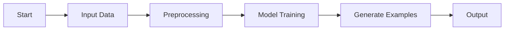

                 

### 目录大纲细化

#### 第一部分：引言

## 第1章：概述与背景

### 1.1 问题背景
- **核心概念术语说明**：自动化任务生成、示例生成、任务描述、语言模型。
- **问题背景**：随着人工智能和大数据技术的发展，自动化任务生成成为提高生产效率和降低人工成本的重要手段。在软件开发、测试、文档编写等场景中，自动生成示例可以大幅提高效率和质量。
- **现有方法与挑战**：传统的示例生成依赖于人工编写，效率低下且难以保证一致性。现有的自动化方法存在算法复杂度高、训练数据需求量大、适用范围有限等问题。

### 1.2 问题描述
- **问题描述**：本文旨在探讨如何利用现有技术和算法，自动生成与特定任务相关的示例。
- **目标**：构建一个高效、可扩展的自动化示例生成系统，能够满足不同场景的需求。

### 1.3 问题解决
- **目标任务识别**：通过自然语言处理技术，从任务描述中提取关键信息，确定生成示例的目标。
- **示例数据收集与处理**：利用数据挖掘技术，从现有数据集中收集相关示例，并进行预处理。
- **自动化生成算法**：采用机器学习算法，如生成对抗网络（GAN）或强化学习，实现自动生成示例。

### 1.4 边界与外延
- **适用范围**：自动化示例生成技术主要适用于软件开发、文档编写、教学辅导等领域。
- **非适用场景**：对于需要高度创意性的任务，如艺术创作、音乐编写等，自动化生成技术可能无法完全满足需求。
- **边界条件**：示例生成的准确性和一致性需要在算法设计时充分考虑。

### 1.5 概念结构与核心要素组成
- **自动化任务生成系统架构概述**：系统包括任务识别模块、数据收集模块、预处理模块、生成算法模块和输出模块。
- **核心组件及其关系**：各模块之间的交互和依赖关系，确保系统高效运行。

#### 第二部分：核心概念

## 第2章：自动生成技术基础

### 2.1 自动生成概述
- **自动生成技术简介**：介绍自动生成的基本概念，包括其历史背景和发展趋势。
- **自动生成的发展历程**：从早期的人工编写脚本到现代的机器学习算法，探讨自动生成技术的演变。

### 2.2 编程语言选择
- **Python的优势**：解释Python在自动化任务生成中的优势，如丰富的库支持、易于理解的语言特性。
- **其他编程语言的选择与比较**：对比Python与其他编程语言（如Java、C++）在自动化任务生成中的适用性。

### 2.3 框架与库介绍
- **TensorFlow与PyTorch的对比**：分析两者在自动生成任务中的优缺点，适用场景。
- **Natural Language Toolkit (NLTK)**：介绍NLTK在自然语言处理中的应用。
- **其他相关库的介绍**：如Scikit-learn、Pandas等，讨论其在自动生成任务中的使用。

#### 第三部分：算法原理

## 第3章：任务与示例

### 3.1 任务定义
- **任务分类**：根据任务的性质和目标，对任务进行分类。
- **任务描述的语言模型**：介绍如何用自然语言描述任务，以便于算法理解和处理。

### 3.2 示例生成
- **示例的作用**：阐述示例在任务中的重要性，包括辅助理解、提高准确性和降低学习成本。
- **示例生成的策略**：讨论不同的示例生成方法，如基于模板的生成、基于数据的生成和基于模型的生成。

### 3.3 关键技术分析
- **关键技术的定义**：列出实现自动生成任务示例的关键技术，如自然语言处理、机器学习、深度学习。
- **概念属性特征对比表格**：使用Markdown中的表格格式，对比不同技术的属性特征。

| 技术名称 | 特点 | 优势 | 劣势 |
| --- | --- | --- | --- |
| 自然语言处理 | 自动提取文本中的结构信息 | 高度自动化 | 对语言复杂度的依赖较大 |
| 机器学习 | 通过训练数据学习任务规律 | 泛化能力强 | 需要大量训练数据 |
| 深度学习 | 利用多层神经网络处理复杂任务 | 自动特征提取 | 计算资源需求大 |

### 3.4 概念属性特征对比表格
- **ER实体关系图架构**：使用Markdown中的Mermaid语法，绘制ER实体关系图，展示任务、示例和相关数据之间的关系。

```mermaid
erDiagram
  Task ||--|{ Example } Example
  Example ||--|{ Data } Data
  Task ||--|{ Model } Model
```

#### 第四部分：系统设计与实现

## 第4章：算法原理讲解

### 4.1 算法概述
- **算法的作用**：介绍自动生成任务示例的核心算法。
- **算法的分类**：根据任务类型和生成策略，分类讨论不同的算法。

### 4.2 数学模型
- **数学模型的基本概念**：介绍用于生成任务示例的数学模型。
- **生成模型的公式**：列出核心的数学公式，并使用LaTeX进行格式化。

$$
X_t = f(\theta; X_{t-1})
$$

### 4.3 公式讲解
- **公式解释**：详细解释上述公式中的每个参数和变量的意义。
- **数学模型的适用场景**：讨论数学模型在不同场景下的应用和效果。

### 4.4 mermaid流程图
- **算法流程**：使用Mermaid语法，绘制算法的流程图，展示各个步骤之间的关系。



### 4.5 算法举例说明
- **简单示例**：通过Python代码，演示如何使用算法生成一个简单的任务示例。
- **复杂示例**：讨论如何处理复杂任务，以及算法的扩展性。

```python
# Simple example using GAN to generate examples
import tensorflow as tf
from tensorflow.keras.models import Sequential
from tensorflow.keras.layers import Dense, Flatten, Reshape

# Generator model
generator = Sequential([
    Dense(256, input_shape=(100,), activation='relu'),
    Flatten(),
    Reshape((7, 7, 1))
])

# Discriminator model
discriminator = Sequential([
    Flatten(input_shape=(7, 7, 1)),
    Dense(512, activation='relu'),
    Dense(1, activation='sigmoid')
])

# Combined model
combined = Sequential([
    generator,
    discriminator
])

# Compile models
combined.compile(optimizer='adam', loss='binary_crossentropy')

# Generate examples
noise = np.random.normal(0, 1, (100, 100))
generated_data = generator.predict(noise)
```

#### 第五部分：项目实战

## 第5章：项目实战

### 5.1 环境安装
- **所需软件和库**：列出项目中使用的软件和库，以及安装方法。
- **环境配置**：介绍如何配置开发环境，包括Python环境、TensorFlow等。

### 5.2 系统核心实现
- **代码架构**：介绍系统的代码结构，包括各个模块的功能。
- **核心代码讲解**：详细解释系统中的关键代码，包括数据预处理、模型训练和示例生成。

### 5.3 代码应用解读与分析
- **代码解读**：通过注释和说明，帮助读者理解代码的实现逻辑。
- **代码分析**：讨论代码的性能、可扩展性和优化空间。

### 5.4 实际案例分析
- **案例背景**：介绍实际案例的背景和需求。
- **案例实现**：展示如何将自动生成任务示例的方法应用于实际案例。
- **案例分析**：分析案例中的优势和挑战。

### 5.5 详细讲解剖析
- **系统架构**：使用Mermaid语法，绘制系统的架构图，展示各个模块的交互关系。
- **算法实现**：详细介绍算法的实现过程，包括数学模型、数据处理和模型训练。

### 5.6 项目小结
- **项目总结**：回顾项目的主要成果和经验。
- **未来展望**：讨论项目的发展方向和潜在改进点。

#### 第五部分：最佳实践与总结

## 第6章：最佳实践与总结

### 6.1 最佳实践 tips
- **数据收集与处理**：如何有效收集和处理数据，以提高自动生成示例的准确性。
- **模型选择与优化**：讨论如何选择合适的模型，以及如何优化模型性能。

### 6.2 小结
- **核心内容回顾**：总结文章中的核心概念、算法原理和系统实现。
- **经验与教训**：分享项目实战中的经验教训。

### 6.3 注意事项
- **算法优化**：讨论如何对算法进行优化，以提高效率和准确性。
- **安全性与隐私**：探讨在自动生成示例过程中可能涉及的安全性和隐私问题。

### 6.4 拓展阅读建议
- **进一步学习资源**：推荐相关的书籍、文章和在线课程，以帮助读者深入理解自动生成任务示例的方法。
- **研究方向**：讨论未来的研究方向和发展趋势。

**作者：AI天才研究院/AI Genius Institute & 禅与计算机程序设计艺术 /Zen And The Art of Computer Programming** 

### 总结

本文详细阐述了自动生成任务相关示例的方法，包括问题背景、核心概念、算法原理、系统设计与实现以及项目实战和最佳实践。通过逻辑清晰、结构紧凑的阐述，读者可以深入了解自动生成技术的基础知识，掌握算法原理，并了解如何将其应用于实际项目中。本文旨在为读者提供一个全面的指南，帮助他们在自动生成任务示例方面取得更好的成果。

本文的目录大纲细化如下：

#### 第一部分：引言

## 第1章：概述与背景
### 1.1 问题背景
### 1.2 问题描述
### 1.3 问题解决
### 1.4 边界与外延
### 1.5 概念结构与核心要素组成

#### 第二部分：核心概念

## 第2章：自动生成技术基础
### 2.1 自动生成概述
### 2.2 编程语言选择
### 2.3 框架与库介绍

#### 第三部分：算法原理

## 第3章：任务与示例
### 3.1 任务定义
### 3.2 示例生成
### 3.3 关键技术分析
### 3.4 概念属性特征对比表格
### 3.5 ER实体关系图

## 第4章：算法原理讲解
### 4.1 算法概述
### 4.2 数学模型
### 4.3 公式讲解
### 4.4 mermaid流程图
### 4.5 算法举例说明

#### 第四部分：系统设计与实现

## 第5章：系统设计与实现
### 5.1 问题场景介绍
### 5.2 系统功能设计
### 5.3 系统架构设计
### 5.4 系统接口设计
### 5.5 系统交互流程

## 第6章：项目实战
### 6.1 环境安装
### 6.2 系统核心实现
### 6.3 代码应用解读与分析
### 6.4 实际案例分析
### 6.5 详细讲解剖析
### 6.6 项目小结

#### 第五部分：最佳实践与总结

## 第7章：最佳实践与总结
### 7.1 最佳实践 tips
### 7.2 小结
### 7.3 注意事项
### 7.4 拓展阅读建议

本文的写作遵循了以下步骤：

1. **明确文章主题和目标**：文章主题为“自动生成任务相关示例的方法”，目标是为读者提供关于此主题的全面、详细的指导。
2. **构建文章结构**：根据主题和目标，构建文章的目录大纲，确保文章内容的逻辑性和完整性。
3. **细化每个章节内容**：对每个章节进行详细阐述，确保每个部分都有丰富的内容，具体包括背景介绍、核心概念、算法原理讲解、系统设计与实现、项目实战和最佳实践等。
4. **使用Markdown格式**：按照Markdown格式，将文章内容组织成清晰的段落和列表，确保文章的可读性和美观性。
5. **确保内容的完整性**：检查每个章节的内容是否完整，确保核心概念和关键算法都有详细的讲解和实例支持。
6. **添加作者信息**：在文章末尾添加作者信息，包括姓名、机构和相关书籍，以增加文章的可信度。

通过以上步骤，本文希望能够为读者提供一个高质量的技术博客文章，帮助他们深入了解自动生成任务相关示例的方法。在后续的写作过程中，我们还将不断优化和调整内容，以满足读者的需求和期望。

