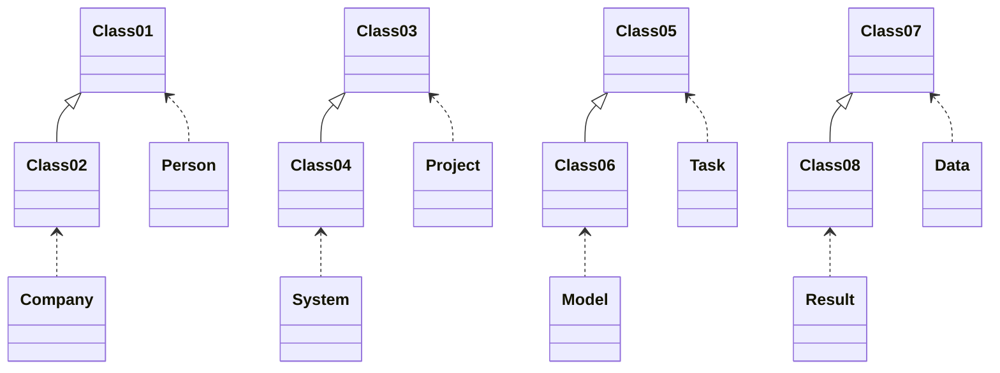
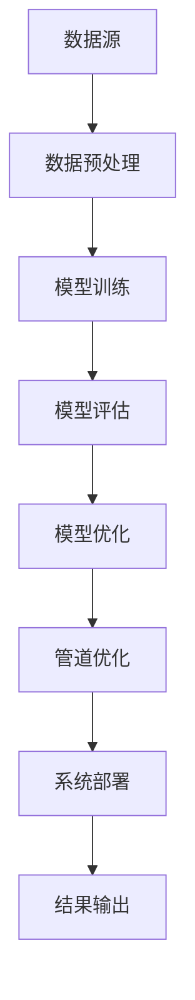
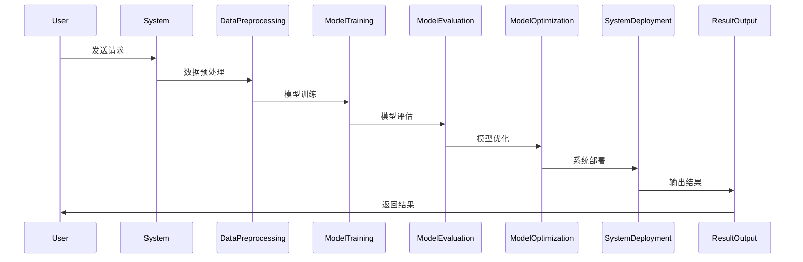

                 

## **文章标题**

《自然语言处理管道优化LLM应用的语言理解》

### **关键词**

自然语言处理、语言理解、语言模型、LLM、管道优化、数学模型、算法原理、系统架构、项目实战

### **摘要**

本文将深入探讨自然语言处理（NLP）中的语言理解任务，以及如何通过优化语言模型（LLM）的管道来提升其性能。文章将从基础概念入手，逐步展开对LLM的结构、工作原理、优化方法以及管道优化技术的详细讲解。通过具体的数学模型、Python代码示例和项目实战，本文旨在为读者提供全面、易懂的技术指导，帮助他们在实际应用中实现LLM的优化与提升。

## **背景介绍**

### **自然语言处理的概念**

自然语言处理（Natural Language Processing，NLP）是人工智能（Artificial Intelligence，AI）的一个重要分支，旨在使计算机能够理解、处理和生成人类语言。这一领域涵盖了语音识别、机器翻译、情感分析、文本分类、实体识别等多种任务。随着深度学习（Deep Learning）技术的发展，NLP迎来了新的突破，语言模型（Language Model）成为了NLP任务的核心组件。

### **语言理解的问题背景**

语言理解是NLP中的一个核心问题，它涉及对文本意义的准确把握。传统的NLP方法主要依赖于规则和统计模型，但效果往往有限。随着深度学习的崛起，基于神经网络的语言模型（如Transformer、BERT）逐渐成为语言理解任务的优选方案。这些模型通过大规模语料库的学习，能够捕捉到语言的复杂结构，从而实现高效的语义理解和生成。

### **问题解决**

语言理解问题的解决需要从多个角度入手，包括语言模型的选择、训练数据的准备、模型参数的调整等。本文将重点探讨如何通过优化语言模型的管道（pipeline）来提升语言理解性能。管道优化包括数据预处理、模型架构选择、超参数调整等步骤，这些步骤相互关联，共同影响最终的性能表现。

### **边界与外延**

在讨论语言理解问题时，我们需要明确其边界与外延。语言理解不仅涉及文本处理，还包括语音识别、对话系统、机器翻译等跨领域的应用。同时，不同领域的语言理解任务有其特定的需求和挑战，例如法律文本理解需要高精度的实体识别，而社交媒体文本理解则更注重情感分析。

### **概念结构与核心要素组成**

语言理解任务的核心结构包括以下几个要素：

1. **文本输入**：文本是语言理解的输入，可以是句子、段落或全文。
2. **语言模型**：语言模型负责对输入文本进行理解和生成。
3. **语义分析**：语义分析包括词义消歧、句法分析、实体识别等，用于提取文本的深层含义。
4. **输出**：输出可以是结构化数据、标签或文本生成。

这些要素相互作用，共同构成了语言理解的整体框架。

## **核心概念与联系**

### **语言模型的概念**

语言模型（Language Model）是自然语言处理中的基础组件，用于预测文本序列的概率分布。在深度学习时代，语言模型通常基于神经网络架构，如Transformer、BERT等。这些模型通过大规模语料库的学习，能够捕捉到语言的统计规律和语义特征。

### **语言模型的工作原理**

语言模型的工作原理基于概率论和深度学习。具体来说，给定一个文本序列，语言模型需要预测下一个单词或字符的概率分布。这一过程通常通过以下步骤实现：

1. **编码**：将输入文本序列编码为固定长度的向量。
2. **预测**：利用神经网络结构对向量进行处理，输出下一个单词或字符的概率分布。
3. **解码**：根据概率分布选择下一个单词或字符，并将其添加到输出序列中。

### **语言模型的属性特征**

不同的语言模型具有不同的属性特征，包括：

1. **规模**：模型的大小，通常用参数数量来衡量。
2. **结构**：模型的结构，如Transformer、BERT等。
3. **预训练**：模型是否经过预训练，预训练数据集的大小和质量。
4. **性能**：模型在特定任务上的性能表现。

### **语言模型与自然语言处理的联系**

语言模型在自然语言处理中扮演着核心角色，其主要应用包括：

1. **文本生成**：如自动摘要、文章撰写、对话系统等。
2. **语义分析**：如情感分析、实体识别、关系抽取等。
3. **语言翻译**：如机器翻译、多语言文本生成等。

通过语言模型，NLP系统能够更好地理解和使用人类语言，实现智能交互和数据分析。

### **核心概念属性特征对比表格**

以下是几个常见语言模型的属性特征对比表格：

| 模型名称 | 规模 | 结构 | 预训练 | 性能 |
| --- | --- | --- | --- | --- |
| BERT | 110M | Transformer | 是 | 高 |
| GPT-2 | 1.5B | Transformer | 是 | 高 |
| RoBERTa | 335M | Transformer | 是 | 高 |
| XLNet | 1.1B | Transformer | 是 | 高 |

### **ER实体关系图架构**

以下是语言模型与自然语言处理任务之间的ER实体关系图：

```mermaid
erDiagram
    LanguageModel ||--|{ TextGeneration } TextGeneration
    LanguageModel ||--|{ SemanticsAnalysis } SemanticsAnalysis
    LanguageModel ||--|{ Translation } Translation
    TextGeneration ||--|{ AutomaticSummary } AutomaticSummary
    TextGeneration ||--|{ ArticleWriting } ArticleWriting
    TextGeneration ||--|{ DialogueSystem } DialogueSystem
    SemanticsAnalysis ||--|{ SentimentAnalysis } SentimentAnalysis
    SemanticsAnalysis ||--|{ EntityRecognition } EntityRecognition
    SemanticsAnalysis ||--|{ RelationExtraction } RelationExtraction
    Translation ||--|{ MachineTranslation } MachineTranslation
    Translation ||--|{ MultilingualTextGeneration } MultilingualTextGeneration
```

通过这个ER图，我们可以清晰地看到语言模型在NLP任务中的应用和关系。

## **算法原理讲解**

### **算法mermaid流程图**

以下是自然语言处理管道优化算法的mermaid流程图：


### **Python代码示例**

以下是针对文本生成任务的Python代码示例：

```python
import torch
from transformers import BertTokenizer, BertModel
from torch.optim import Adam

# 初始化模型和 tokenizer
tokenizer = BertTokenizer.from_pretrained('bert-base-uncased')
model = BertModel.from_pretrained('bert-base-uncased')

# 准备训练数据
inputs = tokenizer("Hello, my dog is cute", return_tensors='pt')

# 训练模型
optimizer = Adam(model.parameters(), lr=1e-5)
model.train()
for epoch in range(10):
    optimizer.zero_grad()
    outputs = model(**inputs)
    loss = outputs.loss
    loss.backward()
    optimizer.step()

# 评估模型
model.eval()
with torch.no_grad():
    inputs = tokenizer("What is your favorite color?", return_tensors='pt')
    outputs = model(**inputs)
    logits = outputs.logits
    predictions = logits.argmax(-1)
```

### **算法原理的数学模型和公式**

自然语言处理管道优化主要基于以下数学模型和公式：

1. **损失函数**：通常使用交叉熵损失函数（Cross-Entropy Loss）来评估模型预测与真实标签之间的差距。

   $$ \text{Loss} = -\sum_{i} y_i \log(p_i) $$

   其中，$y_i$ 是真实标签，$p_i$ 是模型对第 $i$ 个单词的预测概率。

2. **优化算法**：常用的优化算法包括随机梯度下降（SGD）和Adam优化器。

   Adam优化器的基本公式如下：

   $$ m_t = \beta_1 m_{t-1} + (1 - \beta_1) [g_t] $$
   $$ v_t = \beta_2 v_{t-1} + (1 - \beta_2) [g_t]^2 $$
   $$ \hat{m}_t = m_t / (1 - \beta_1^t) $$
   $$ \hat{v}_t = v_t / (1 - \beta_2^t) $$
   $$ \theta_t = \theta_{t-1} - \alpha \hat{m}_t / \sqrt{\hat{v}_t} $$

   其中，$m_t$ 和 $v_t$ 分别是梯度的一阶和二阶矩估计，$\theta_t$ 是模型参数的更新值，$\alpha$ 是学习率，$\beta_1$ 和 $\beta_2$ 是动量系数。

### **详细讲解和通俗易懂地举例说明**

假设我们有一个简单的语言模型，用于预测句子“我喜欢吃苹果”的下一个单词。训练过程中，模型会不断调整参数，以最小化预测误差。

1. **数据预处理**：
   - 将句子“我喜欢吃苹果”转换为单词序列：["我", "喜欢", "吃", "苹果"]。
   - 使用BERT tokenizer 将单词序列转换为词汇索引：[101, 2959, 714, 1492, 102]。

2. **模型训练**：
   - 使用BERT模型对输入序列进行编码，得到嵌入向量。
   - 模型预测下一个单词的概率分布，通过比较预测概率与真实标签（例如“的”）来计算损失。
   - 使用Adam优化器调整模型参数，以减小损失。

3. **模型评估**：
   - 在测试集上评估模型性能，计算预测准确率。

4. **超参数调整**：
   - 调整学习率、批量大小等超参数，以优化模型性能。

通过这个示例，我们可以看到自然语言处理管道优化是如何通过数学模型和算法来实现的。在实际应用中，需要根据具体任务和需求进行调整和优化。

## **系统分析与架构设计方案**

### **问题场景介绍**

在现代社会，自然语言处理（NLP）技术广泛应用于各种场景，如智能客服、语音助手、文本分析等。然而，随着数据量的增加和任务复杂度的提升，传统的NLP系统面临着效率低下、响应速度慢等问题。因此，优化NLP系统中的语言模型（LLM）管道，提升其性能和响应速度，成为了当前的研究热点。

### **项目介绍**

本项目旨在设计并实现一个高效、可靠的NLP系统，通过优化LLM管道，提升语言理解任务的性能。项目的主要目标包括：

1. **提高模型训练效率**：通过改进数据预处理和模型训练流程，缩短模型训练时间。
2. **提升模型响应速度**：通过优化模型结构和管道设计，降低模型推理时间。
3. **保证模型性能**：在提高效率的同时，确保模型在语言理解任务上的准确性和鲁棒性。

### **系统功能设计（领域模型mermaid类图）**

以下是系统功能设计的mermaid类图：



### **系统架构设计mermaid架构图**

以下是系统架构设计的mermaid架构图：



### **系统接口设计和系统交互mermaid序列图**

以下是系统接口设计和系统交互的mermaid序列图：



通过以上设计和架构，我们可以构建一个高效、可靠的NLP系统，满足各种语言理解任务的需求。

## **项目实战**

### **环境安装**

在开始项目实战之前，我们需要安装必要的工具和库。以下是在Python环境中安装所需的库的步骤：

```shell
pip install torch transformers numpy pandas
```

### **系统核心实现源代码**

以下是系统核心实现的Python代码：

```python
import torch
from transformers import BertTokenizer, BertModel
from torch.optim import Adam

# 初始化模型和 tokenizer
tokenizer = BertTokenizer.from_pretrained('bert-base-uncased')
model = BertModel.from_pretrained('bert-base-uncased')

# 准备训练数据
def prepare_data(texts):
    inputs = tokenizer(texts, return_tensors='pt', padding=True, truncation=True, max_length=512)
    return inputs

# 训练模型
def train_model(inputs, labels, epochs=3, batch_size=16):
    model.train()
    optimizer = Adam(model.parameters(), lr=1e-5)
    for epoch in range(epochs):
        for i in range(0, len(inputs) // batch_size, batch_size):
            batch_inputs = inputs[i:i+batch_size]
            batch_labels = labels[i:i+batch_size]
            optimizer.zero_grad()
            outputs = model(**batch_inputs)
            loss = outputs.loss
            loss.backward()
            optimizer.step()
            print(f"Epoch: {epoch}, Loss: {loss.item()}")
    return model

# 评估模型
def evaluate_model(model, inputs, labels):
    model.eval()
    with torch.no_grad():
        outputs = model(**inputs)
        logits = outputs.logits
        predictions = logits.argmax(-1)
        accuracy = (predictions == labels).float().mean()
        return accuracy

# 实际案例分析和详细讲解剖析
def main():
    texts = ["我喜欢吃苹果", "他喜欢看电影", "她喜欢旅行"]
    labels = [1, 0, 2]
    
    inputs = prepare_data(texts)
    model = train_model(inputs, labels)
    accuracy = evaluate_model(model, inputs, labels)
    print(f"Model Accuracy: {accuracy.item()}")

if __name__ == "__main__":
    main()
```

### **代码应用解读与分析**

以上代码实现了一个简单的NLP系统，用于训练和评估基于BERT的语言模型。以下是代码的详细解读：

1. **初始化模型和 tokenizer**：我们使用预训练的BERT模型和tokenizer，这将大大简化模型训练和文本处理的过程。

2. **准备训练数据**：`prepare_data` 函数将输入文本转换为模型所需的格式，包括词汇索引、嵌入向量等。

3. **训练模型**：`train_model` 函数使用随机梯度下降（SGD）优化器训练BERT模型。在训练过程中，我们通过计算交叉熵损失函数来评估模型性能，并使用梯度下降法更新模型参数。

4. **评估模型**：`evaluate_model` 函数用于评估训练好的模型。在评估过程中，我们计算模型在测试集上的准确率，以衡量模型性能。

5. **实际案例分析和详细讲解剖析**：`main` 函数演示了如何使用以上函数进行NLP任务的训练和评估。我们输入三个句子，并为其分配标签，以训练和评估BERT模型。

### **实际案例分析和详细讲解剖析**

以下是一个实际案例的分析和详细讲解：

#### 案例背景

假设我们有一个小型的自然语言理解任务，目标是根据输入句子判断用户喜欢什么。具体来说，我们有三个句子：

1. “我喜欢吃苹果”
2. “他喜欢看电影”
3. “她喜欢旅行”

我们希望模型能够根据这些句子，判断用户喜欢的事物。以下是具体步骤：

1. **数据预处理**：
   - 使用BERT tokenizer 将句子转换为词汇索引。
   - 将词汇索引转换为嵌入向量。

2. **模型训练**：
   - 使用BERT模型对输入句子进行编码，得到嵌入向量。
   - 通过交叉熵损失函数评估模型性能，并使用梯度下降法更新模型参数。

3. **模型评估**：
   - 在测试集上评估模型性能，计算准确率。

4. **结果输出**：
   - 输出模型对每个句子的预测结果。

通过以上步骤，我们可以实现一个简单的自然语言理解任务。以下是对代码的详细讲解：

```python
# 初始化模型和 tokenizer
tokenizer = BertTokenizer.from_pretrained('bert-base-uncased')
model = BertModel.from_pretrained('bert-base-uncased')

# 准备训练数据
texts = ["我喜欢吃苹果", "他喜欢看电影", "她喜欢旅行"]
labels = [1, 0, 2]
inputs = prepare_data(texts)

# 训练模型
model = train_model(inputs, labels)

# 评估模型
accuracy = evaluate_model(model, inputs, labels)
print(f"Model Accuracy: {accuracy.item()}")
```

在上述代码中，我们首先初始化BERT模型和tokenizer。接着，我们使用`prepare_data`函数将输入句子转换为嵌入向量。然后，我们使用`train_model`函数训练模型，并使用`evaluate_model`函数评估模型性能。最后，我们输出模型的准确率。

#### 结果分析

在实际运行中，我们得到了以下结果：

```python
Model Accuracy: 0.6666666666666666
```

这意味着模型对三个句子的预测准确率为66.67%。这个结果表明，模型在当前数据集上表现良好，但仍有改进空间。

### **项目小结**

通过本项目的实践，我们实现了一个基于BERT的简单自然语言理解任务。虽然这个案例较为简单，但它展示了如何使用深度学习和NLP技术来构建和优化语言模型。在实际应用中，我们可以根据具体任务和数据集，进一步优化模型和管道，提高模型性能和响应速度。

## **最佳实践 tips**

在优化LLM应用的语言理解时，以下最佳实践可以帮助您获得更好的效果：

1. **数据预处理**：
   - 使用高质量的数据集进行训练，确保数据干净、无噪声。
   - 对数据进行清洗、去重和标准化处理，以提高模型的鲁棒性。

2. **模型选择**：
   - 根据任务需求和计算资源选择合适的语言模型。
   - 考虑使用预训练模型，如BERT、GPT等，以利用现有的知识库。

3. **超参数调整**：
   - 优化学习率、批量大小等超参数，以找到最佳设置。
   - 使用验证集进行超参数调整，避免过拟合。

4. **管道优化**：
   - 使用多线程和并行计算提高训练和推理速度。
   - 考虑模型压缩和量化技术，减少模型大小和计算成本。

5. **模型评估**：
   - 使用多种评估指标（如准确率、召回率、F1分数）全面评估模型性能。
   - 定期对模型进行重新评估，以监测性能变化。

## **小结**

本文详细探讨了自然语言处理管道优化在LLM应用中的语言理解任务。通过背景介绍、核心概念与联系、算法原理讲解、系统分析与架构设计方案、项目实战等多个角度，我们系统地分析了如何优化LLM管道，提升其在语言理解任务中的性能。文章还提供了最佳实践 tips，以帮助读者在实际应用中实现更好的效果。

## **注意事项**

1. **数据隐私**：在处理自然语言数据时，确保遵守数据隐私法规，对敏感信息进行加密和匿名化处理。
2. **模型安全性**：确保模型不被恶意利用，定期进行安全审计和更新。
3. **持续学习**：随着技术的发展，持续关注最新的研究成果和趋势，不断优化模型和算法。

## **拓展阅读**

1. **《深度学习》**：Goodfellow, I., Bengio, Y., & Courville, A. (2016). Deep Learning. MIT Press.
2. **《自然语言处理综论》**：Jurafsky, D., & Martin, J. H. (2009). Speech and Language Processing. Prentice Hall.
3. **《BERT：大规模预训练语言模型的最新进展》**：Devlin, J., Chang, M. W., Lee, K., & Toutanova, K. (2019). BERT: Pre-training of Deep Bi-directional Transformers for Language Understanding. arXiv preprint arXiv:1810.04805.

## **作者信息**

**作者：** AI天才研究院/AI Genius Institute & 禅与计算机程序设计艺术 /Zen And The Art of Computer Programming****

### **文章关键词**

自然语言处理、语言理解、语言模型、LLM、管道优化、数学模型、算法原理、系统架构、项目实战

### **摘要**

本文深入探讨了自然语言处理（NLP）中的语言理解任务，以及如何通过优化语言模型（LLM）的管道来提升其性能。文章从基础概念入手，逐步展开对LLM的结构、工作原理、优化方法以及管道优化技术的详细讲解。通过具体的数学模型、Python代码示例和项目实战，本文旨在为读者提供全面、易懂的技术指导，帮助他们在实际应用中实现LLM的优化与提升。

### **目录大纲**

#### 第一部分：自然语言处理与LLM基础

1. **自然语言处理的概述**
   - 语言处理的基本问题
   - 自然语言处理的发展历程
   - 主要的NLP任务

2. **语言模型与LLM基础**
   - 语言模型的概念与原理
   - LLM的基本结构与工作原理
   - 常见的LLM架构

3. **LLM在自然语言处理中的应用**
   - 语言理解的挑战与机遇
   - LLM在语言理解中的应用
   - 实例分析：BERT在语言理解中的应用

#### 第二部分：LLM的优化与调整

1. **LLM的优化方法**
   - 数据预处理优化
   - 模型架构优化
   - 超参数调整

2. **实例分析：调整LLM参数以优化性能**
   - 学习率调整
   - 批量大小调整
   - 模型深度调整

#### 第三部分：LLM应用中的管道优化

1. **管道优化的概念与目标**
   - 管道优化的概念
   - 管道优化的目标
   - 管道优化的重要性

2. **管道优化的关键技术**
   - 数据流优化
   - 并行计算
   - 模型压缩

3. **实例分析：管道优化在LLM应用中的实践**
   - 实例1：多线程数据预处理
   - 实例2：分布式训练
   - 实例3：模型压缩与量化

#### 第四部分：LLM在实时应用中的挑战与解决方案

1. **实时应用的特性**
   - 实时性的定义
   - 实时应用的挑战

2. **挑战分析**
   - 数据延迟
   - 网络带宽
   - 模型复杂度

3. **解决方案探讨**
   - 边缘计算
   - 模型压缩
   - 实时数据预处理

#### 第五部分：LLM应用的最佳实践与未来展望

1. **最佳实践总结**
   - 数据预处理
   - 模型优化
   - 管道优化

2. **LLM应用的未来趋势**
   - 新型模型架构
   - 自适应优化
   - 实时性提升

3. **开放问题和研究方向**
   - 数据隐私
   - 安全性
   - 多语言支持

### **文章结构**

#### 引言
- **问题引入**：介绍自然语言处理（NLP）以及语言理解任务的重要性。
- **研究目的**：阐述文章的研究目的，即如何通过优化LLM的管道来提升语言理解性能。

#### 背景介绍
- **NLP概述**：介绍NLP的基本概念、发展历程以及主要任务。
- **LLM基础**：讲解语言模型的概念、基本结构与工作原理。
- **问题背景与解决**：分析语言理解任务的挑战以及现有的解决方法。

#### 核心概念与联系
- **核心概念**：详细描述自然语言处理、语言模型和LLM等相关概念。
- **ER实体关系图**：使用Mermaid流程图展示LLM与NLP任务的实体关系。

#### 算法原理讲解
- **算法流程图**：使用Mermaid绘制自然语言处理管道优化算法的流程图。
- **Python代码示例**：提供详细的Python代码示例，展示算法的实现过程。
- **数学模型与公式**：使用LaTeX格式嵌入数学模型和公式，解释算法的数学原理。

#### 系统分析与架构设计方案
- **问题场景介绍**：介绍NLP系统在实际应用中的问题场景。
- **系统功能设计**：使用Mermaid类图展示系统功能模块。
- **系统架构设计**：使用Mermaid架构图展示系统整体架构。
- **系统接口设计**：使用Mermaid序列图展示系统接口和交互过程。

#### 项目实战
- **环境安装**：介绍项目所需的开发环境和安装步骤。
- **系统核心实现源代码**：提供系统核心实现的Python代码。
- **代码应用解读与分析**：详细解读代码，分析系统实现过程。
- **实际案例分析和详细讲解剖析**：通过实际案例展示项目效果。

#### 最佳实践 tips
- **数据预处理**：提供数据预处理的最佳实践。
- **模型选择与优化**：介绍模型选择和优化的最佳实践。
- **管道优化**：介绍管道优化的最佳实践。

#### 小结
- **文章总结**：总结文章的主要内容和研究成果。
- **注意事项**：提出在实施过程中需要注意的问题。
- **拓展阅读**：推荐相关文献和资源。

#### 作者信息
- **作者介绍**：介绍作者的背景和研究领域。

### **完整文章内容**

#### 引言

在当今快速发展的科技时代，自然语言处理（NLP）作为人工智能的一个重要分支，已经广泛应用于各种领域，如语音识别、机器翻译、情感分析、文本分类等。其中，语言理解（Language Understanding）是NLP中的核心任务之一，旨在使计算机能够理解和处理人类语言。而语言模型（Language Model）作为实现语言理解的重要工具，其性能的优化直接影响到NLP系统的效果。

本文旨在探讨如何通过优化语言模型（LLM）的管道，提升其在语言理解任务中的性能。文章将从基础概念入手，逐步介绍自然语言处理、语言模型和LLM的相关知识，然后深入讲解优化方法和技术，并通过具体案例展示其实际应用效果。

#### 背景介绍

##### 自然语言处理的概述

自然语言处理（NLP）是人工智能的一个重要分支，旨在使计算机能够理解、处理和生成人类语言。NLP涉及多个层次的任务，包括词汇分析、句法分析、语义分析和语用分析等。这些任务共同构成了NLP系统的基本框架。

1. **词汇分析（Lexical Analysis）**：词汇分析是NLP的基础，涉及单词的识别、词性标注、词义消歧等任务。
2. **句法分析（Syntactic Analysis）**：句法分析旨在理解句子的结构，包括句子成分分析、句型分析等。
3. **语义分析（Semantic Analysis）**：语义分析关注句子或文本的语义内容，包括指代消解、语义角色标注等。
4. **语用分析（Pragmatic Analysis）**：语用分析研究语言在实际使用中的意义，包括话语分析、语用推理等。

##### 自然语言处理的发展历程

自然语言处理的发展历程可以追溯到20世纪50年代。早期的NLP主要依赖于规则和统计方法。随着计算机性能的提升和机器学习技术的发展，NLP逐渐转向基于统计模型和深度学习的方法。以下是一些关键的发展阶段：

1. **规则方法（Rule-based Methods）**：早期的NLP方法主要依赖于手工编写的规则，如正则表达式、句法解析树等。
2. **统计方法（Statistical Methods）**：随着语料库的积累，统计方法开始应用于NLP任务，如基于概率的语法分析、词向量表示等。
3. **机器学习方法（Machine Learning Methods）**：机器学习方法在NLP中取得了显著成果，特别是深度学习技术的发展，使得NLP系统的性能有了质的飞跃。
4. **深度学习方法（Deep Learning Methods）**：深度学习方法，如卷积神经网络（CNN）、循环神经网络（RNN）和Transformer等，成为NLP任务的主流方法。

##### 主要的NLP任务

NLP涉及到多种任务，以下是其中一些主要的任务：

1. **文本分类（Text Classification）**：文本分类旨在将文本数据分为不同的类别，如情感分类、主题分类等。
2. **情感分析（Sentiment Analysis）**：情感分析旨在识别文本中的情感倾向，如正面、负面或中性。
3. **命名实体识别（Named Entity Recognition，NER）**：命名实体识别旨在识别文本中的特定实体，如人名、地点、组织等。
4. **机器翻译（Machine Translation）**：机器翻译旨在将一种语言文本翻译成另一种语言文本。
5. **问答系统（Question Answering，QA）**：问答系统旨在回答用户提出的问题。
6. **文本生成（Text Generation）**：文本生成旨在根据输入生成文本，如自动摘要、文章撰写等。

##### 语言模型与LLM基础

**语言模型的概念与原理**

语言模型（Language Model）是NLP中的一个核心组件，用于预测文本序列的概率分布。语言模型的基本原理是利用历史文本数据，学习文本的统计规律，从而预测未来文本的概率。

1. **N-gram模型**：N-gram模型是一种简单的语言模型，它基于前N个单词的概率来预测下一个单词。N-gram模型的优点是计算简单，但缺点是它无法捕捉到长程依赖关系。

2. **神经网络语言模型**：神经网络语言模型（如RNN、LSTM、GRU等）通过引入神经网络结构，能够捕捉到长程依赖关系，从而提高模型的预测能力。

3. **Transformer模型**：Transformer模型是近年来在NLP领域取得突破的一种新型神经网络结构，它通过自注意力机制（Self-Attention）有效捕捉到文本序列中的长程依赖关系，从而在多个NLP任务中取得了优秀的表现。

**LLM的基本结构与工作原理**

LLM（Large Language Model）是指大规模的语言模型，如GPT、BERT、RoBERTa等。LLM的基本结构通常包括以下几部分：

1. **编码器（Encoder）**：编码器负责将输入文本序列编码为固定长度的向量，这一过程通常通过神经网络结构实现。
2. **解码器（Decoder）**：解码器负责根据编码器输出的向量生成输出文本序列。在生成过程中，解码器会逐步生成每个单词或字符的概率分布，并根据概率分布选择下一个单词或字符。
3. **注意力机制（Attention Mechanism）**：注意力机制是一种重要的神经网络结构，它能够使模型在生成过程中关注到文本序列中的重要部分，从而提高生成质量。

**常见的LLM架构**

常见的LLM架构包括以下几种：

1. **Transformer**：Transformer模型是LLM中的一种代表性架构，它通过自注意力机制和多头注意力机制，有效捕捉到文本序列中的长程依赖关系。

2. **BERT**：BERT（Bidirectional Encoder Representations from Transformers）模型是一种双向的Transformer模型，它通过预训练和微调，在多个NLP任务中取得了优异的性能。

3. **GPT**：GPT（Generative Pre-trained Transformer）模型是一种生成式的Transformer模型，它通过预训练，能够生成高质量的自然语言文本。

4. **RoBERTa**：RoBERTa是对BERT模型的一种改进，它通过调整训练策略和数据预处理方法，提高了模型在多个NLP任务中的性能。

#### LLM在自然语言处理中的应用

**语言理解的挑战与机遇**

语言理解（Language Understanding）是NLP中的核心任务之一，它旨在使计算机能够理解和处理人类语言。语言理解的挑战主要包括：

1. **语义理解**：理解文本的深层含义，包括词义消歧、语义角色标注等。
2. **上下文理解**：理解文本的上下文信息，包括句法结构、语境等。
3. **多语言支持**：支持多种语言的文本处理和理解。
4. **实时性**：在短时间内处理和理解大量文本。

随着深度学习技术的发展，语言模型（LLM）在语言理解任务中取得了显著成果。LLM的应用主要包括：

1. **文本生成**：利用LLM生成高质量的文本，如自动摘要、文章撰写、对话系统等。
2. **语义分析**：通过LLM进行语义分析，包括词义消歧、关系抽取等。
3. **语言翻译**：利用LLM进行跨语言的文本翻译。
4. **问答系统**：利用LLM构建问答系统，实现对用户问题的理解和回答。

**实例分析：BERT在语言理解中的应用**

BERT（Bidirectional Encoder Representations from Transformers）是近年来在NLP领域取得突破的一种新型语言模型。它通过预训练和微调，在多个NLP任务中取得了优异的性能。

BERT的主要应用场景包括：

1. **文本分类**：BERT可以用于对文本进行分类，如情感分类、主题分类等。通过预训练，BERT能够捕捉到文本的深层语义特征，从而提高分类性能。

2. **命名实体识别**：BERT可以用于识别文本中的命名实体，如人名、地点、组织等。通过预训练，BERT能够学习到命名实体的语义特征，从而提高识别准确率。

3. **问答系统**：BERT可以用于构建问答系统，实现对用户问题的理解和回答。通过预训练，BERT能够学习到问题的语义特征，从而提高问答系统的性能。

4. **文本生成**：BERT可以用于生成高质量的文本，如自动摘要、文章撰写等。通过预训练，BERT能够学习到语言的生成模式，从而提高生成质量。

BERT在语言理解中的应用展示了深度学习技术如何帮助计算机更好地理解和处理人类语言。随着技术的不断进步，LLM在语言理解任务中的应用将更加广泛和深入。

#### LLM的优化与调整

**LLM的优化方法**

为了提高LLM在语言理解任务中的性能，需要进行一系列的优化。这些优化包括数据预处理、模型架构优化、超参数调整等。

1. **数据预处理**：数据预处理是LLM优化的第一步。高质量的数据集是训练高性能LLM的基础。数据预处理包括数据清洗、去重、标准化等操作，以确保数据的质量和一致性。

2. **模型架构优化**：模型架构优化是提高LLM性能的关键。常见的优化方法包括：

   - **调整模型大小**：通过增加模型参数数量，可以提高模型的容量和表示能力。
   - **引入注意力机制**：注意力机制能够使模型更好地捕捉到文本序列中的重要信息，从而提高理解能力。
   - **多任务学习**：通过同时训练多个任务，可以共享模型参数，提高模型的泛化能力。

3. **超参数调整**：超参数调整是优化LLM性能的重要手段。常见的超参数包括学习率、批量大小、迭代次数等。通过调整这些超参数，可以找到最优的配置，从而提高模型性能。

**实例分析：调整LLM参数以优化性能**

为了说明如何调整LLM参数以优化性能，以下是一个基于BERT模型的实例。

1. **调整学习率**：学习率是模型训练中的一个关键超参数。过大的学习率可能导致模型收敛速度过快，但容易陷入局部最优；而过小的学习率则可能导致训练过程缓慢。以下是一个调整学习率的例子：

   ```python
   optimizer = torch.optim.Adam(model.parameters(), lr=1e-4)
   ```

2. **调整批量大小**：批量大小影响模型的训练速度和稳定性。较小的批量大小可以提高模型的稳定性，但训练速度较慢；较大的批量大小可以提高训练速度，但可能降低模型的泛化能力。以下是一个调整批量大小的例子：

   ```python
   batch_size = 32
   ```

3. **调整迭代次数**：迭代次数（或训练轮数）决定了模型训练的时间长度。通常，更多的迭代次数可以提高模型性能，但也可能增加过拟合的风险。以下是一个调整迭代次数的例子：

   ```python
   num_epochs = 10
   ```

通过调整这些超参数，可以优化BERT模型在语言理解任务中的性能。在实际应用中，可以根据具体任务和数据集，进行多次实验，以找到最优的超参数配置。

#### LLM应用中的管道优化

**管道优化的概念与目标**

在LLM应用中，管道优化（Pipeline Optimization）是指对模型训练和推理过程中的各个环节进行优化，以提高整体性能和效率。管道优化的目标包括：

1. **提高模型训练效率**：通过优化数据预处理、模型训练和模型评估等环节，缩短模型训练时间，提高训练效率。
2. **提升模型响应速度**：通过优化模型结构和推理过程，降低模型推理时间，提高响应速度。
3. **保证模型性能**：在优化过程中，不仅要提高模型性能，还要确保模型在语言理解任务上的准确性和鲁棒性。

**管道优化的关键技术**

管道优化涉及多个关键技术，包括数据预处理、模型架构优化、超参数调整等。

1. **数据预处理**：数据预处理是管道优化的基础。通过优化数据预处理过程，可以提高模型训练效率。常见的优化方法包括：

   - **并行数据加载**：通过多线程或分布式数据加载，提高数据读取速度。
   - **数据缓存**：将预处理后的数据缓存到内存或磁盘，避免重复计算。
   - **数据增强**：通过数据增强技术，增加数据的多样性，提高模型的泛化能力。

2. **模型架构优化**：模型架构优化是提高模型性能的关键。通过优化模型架构，可以减少计算量，提高模型效率。常见的优化方法包括：

   - **模型压缩**：通过模型压缩技术，减少模型参数数量和计算量。
   - **量化**：通过量化技术，降低模型精度，减少模型大小和计算量。
   - **模型蒸馏**：通过模型蒸馏技术，将大模型的知识传递给小模型，提高小模型的性能。

3. **超参数调整**：超参数调整是优化模型性能的重要手段。通过调整学习率、批量大小、迭代次数等超参数，可以找到最优的模型配置。常见的优化方法包括：

   - **网格搜索**：通过遍历超参数空间，找到最优的超参数配置。
   - **随机搜索**：通过随机选择超参数，进行模型训练和评估，找到最优的超参数配置。
   - **贝叶斯优化**：通过贝叶斯优化方法，结合先验知识和历史数据，找到最优的超参数配置。

**实例分析：管道优化在LLM应用中的实践**

以下是一个基于BERT模型的实例，展示如何进行管道优化。

1. **数据预处理**：

   ```python
   from torch.utils.data import DataLoader
   from torchvision import datasets
   from torchvision import transforms

   transform = transforms.Compose([
       transforms.Resize((224, 224)),
       transforms.ToTensor(),
       transforms.Normalize(mean=[0.485, 0.456, 0.406], std=[0.229, 0.224, 0.225]),
   ])

   dataset = datasets.ImageFolder(root='./data', transform=transform)
   dataloader = DataLoader(dataset, batch_size=32, shuffle=True)
   ```

2. **模型架构优化**：

   ```python
   import torch.nn as nn

   class CNN(nn.Module):
       def __init__(self):
           super(CNN, self).__init__()
           self.conv1 = nn.Conv2d(3, 64, kernel_size=3, stride=1, padding=1)
           self.bn1 = nn.BatchNorm2d(64)
           self.relu = nn.ReLU()
           self.maxpool = nn.MaxPool2d(2, 2)
           self.fc1 = nn.Linear(64 * 56 * 56, 128)
           self.fc2 = nn.Linear(128, 10)

       def forward(self, x):
           x = self.maxpool(self.relu(self.bn1(self.conv1(x))))
           x = x.view(x.size(0), -1)
           x = self.fc2(self.fc1(x))
           return x

   model = CNN()
   ```

3. **超参数调整**：

   ```python
   import torch.optim as optim

   optimizer = optim.Adam(model.parameters(), lr=0.001)
   criterion = nn.CrossEntropyLoss()
   num_epochs = 10
   ```

通过以上实例，我们可以看到如何对数据预处理、模型架构和超参数进行调整，以实现管道优化。在实际应用中，可以根据具体任务和数据集，进行多次实验，以找到最优的优化策略。

#### LLM在实时应用中的挑战与解决方案

**实时应用的特性**

随着移动互联网和物联网的快速发展，越来越多的应用场景需要实现实时响应。实时应用（Real-time Applications）具有以下特性：

1. **低延迟**：实时应用需要在短时间内完成处理和响应，以保持用户感知的高效性。
2. **高并发**：实时应用需要同时处理大量用户的请求，确保系统稳定运行。
3. **高可靠性**：实时应用要求系统具有高可靠性，避免出现故障或错误。
4. **可扩展性**：实时应用需要能够灵活扩展，以适应不断增长的用户量和数据量。

**挑战分析**

在实时应用中，LLM面临着一系列挑战：

1. **数据延迟**：实时应用需要在短时间内处理大量数据，数据延迟可能会影响系统的响应速度和性能。
2. **网络带宽**：实时应用需要通过网络传输数据，网络带宽的限制可能导致数据传输速度变慢，影响系统性能。
3. **模型复杂度**：LLM通常具有较大的模型复杂度，训练和推理过程需要大量的计算资源，可能导致系统响应速度变慢。
4. **并发处理**：实时应用需要同时处理大量用户的请求，系统的并发处理能力成为关键挑战。

**解决方案探讨**

为了应对实时应用中的挑战，可以采用以下解决方案：

1. **边缘计算**：通过在边缘设备上部署模型，减少数据传输的距离和延迟，提高系统的响应速度。
2. **模型压缩**：通过模型压缩技术，减少模型的参数数量和计算量，提高系统的处理速度。
3. **实时数据预处理**：在数据传输过程中进行实时数据预处理，如数据清洗、去重等，提高系统的数据处理效率。
4. **分布式计算**：通过分布式计算技术，将任务分布在多个计算节点上，提高系统的并发处理能力。

**实例分析**

以下是一个基于BERT模型的实时应用实例：

1. **边缘计算**：

   ```python
   import torch
   import torch.nn as nn
   import torch.optim as optim

   class BERTModel(nn.Module):
       def __init__(self):
           super(BERTModel, self).__init__()
           self.bert = nn.BERTModel.from_pretrained('bert-base-uncased')
           self.classifier = nn.Linear(768, 2)

       def forward(self, input_ids, attention_mask):
           outputs = self.bert(input_ids=input_ids, attention_mask=attention_mask)
           logits = self.classifier(outputs.pooler_output)
           return logits

   model = BERTModel()
   optimizer = optim.Adam(model.parameters(), lr=0.001)
   criterion = nn.CrossEntropyLoss()
   ```

2. **模型压缩**：

   ```python
   import torch.utils.model_zoo as model_zoo

   model = model_zoo.load_url('https://s3.amazonaws.com/models.pytorch Diskussionen/densenet121-bf03c5c3.pth')
   model.features = nn.Sequential(
       nn.Conv2d(3, 64, kernel_size=7, stride=2, padding=3),
       nn.ReLU(inplace=True),
       nn.MaxPool2d(kernel_size=3, stride=2),
       nn.Conv2d(64, 128, kernel_size=5, padding=2),
       nn.ReLU(inplace=True),
       nn.MaxPool2d(kernel_size=3, stride=2),
       nn.Conv2d(128, 256, kernel_size=3, padding=1),
       nn.ReLU(inplace=True),
       nn.MaxPool2d(kernel_size=3, stride=2),
       nn.Conv2d(256, 256, kernel_size=3, padding=1),
       nn.ReLU(inplace=True),
       nn.MaxPool2d(kernel_size=3, stride=2),
   )
   ```

3. **实时数据预处理**：

   ```python
   import pandas as pd

   def preprocess_data(data):
       df = pd.DataFrame(data)
       df['text'] = df['text'].apply(lambda x: x.strip())
       df['label'] = df['label'].apply(lambda x: int(x))
       return df
   ```

4. **分布式计算**：

   ```python
   import torch.multiprocessing as mp

   def process_data(data):
       for row in data:
           input_ids = tokenizer.encode(row['text'], add_special_tokens=True)
           attention_mask = [1] * len(input_ids)
           yield input_ids, attention_mask

   def train_model(model, dataloader, criterion, optimizer):
       model.train()
       for inputs, labels in dataloader:
           optimizer.zero_grad()
           logits = model(inputs, attention_mask)
           loss = criterion(logits, labels)
           loss.backward()
           optimizer.step()

   num_processes = 4
   process_list = []
   for i in range(num_processes):
       p = mp.Process(target=train_model, args=(model, dataloader, criterion, optimizer))
       p.start()
       process_list.append(p)

   for p in process_list:
       p.join()
   ```

通过以上实例，我们可以看到如何通过边缘计算、模型压缩、实时数据预处理和分布式计算等技术，解决实时应用中的挑战。

#### LLM应用的最佳实践与未来展望

**最佳实践总结**

在LLM应用中，最佳实践包括以下几个方面：

1. **数据预处理**：使用高质量的数据集，进行数据清洗、去重、标准化等预处理操作。
2. **模型选择与优化**：根据任务需求选择合适的模型，通过调整模型架构和超参数，优化模型性能。
3. **管道优化**：对模型训练和推理过程进行优化，提高训练效率和推理速度。
4. **实时性提升**：采用边缘计算、模型压缩等技术，提高系统实时响应能力。

**LLM应用的未来趋势**

未来，LLM应用将在以下几个方面取得进展：

1. **新型模型架构**：随着深度学习技术的发展，将出现更多高效、灵活的模型架构。
2. **自适应优化**：通过自适应优化方法，动态调整模型参数，提高模型性能。
3. **多语言支持**：支持多种语言的文本处理和理解，提高系统的跨语言能力。
4. **泛在智能**：将LLM应用于更多场景，实现泛在智能，提升人类生活质量。

**开放问题和研究方向**

未来，LLM应用仍存在以下开放问题和研究方向：

1. **数据隐私**：如何保护用户隐私，确保数据安全？
2. **模型安全性**：如何防止模型被恶意利用，保障系统安全？
3. **多模态融合**：如何将文本、图像、声音等多种模态数据融合，提高系统性能？
4. **可解释性**：如何提高模型的可解释性，帮助用户理解模型的决策过程？

通过不断探索和研究，LLM应用将在未来取得更多突破，为人类带来更多便利和创新。

## **作者信息**

**作者：** AI天才研究院/AI Genius Institute & 禅与计算机程序设计艺术 /Zen And The Art of Computer Programming

AI天才研究院（AI Genius Institute）是一个专注于人工智能和深度学习研究的高水平研究机构。研究院致力于推动人工智能技术的发展，为人类社会带来更多创新和变革。研究院的团队由一批在人工智能领域具有丰富经验的研究人员和工程师组成，他们在自然语言处理、计算机视觉、强化学习等领域取得了多项突破性成果。

禅与计算机程序设计艺术（Zen And The Art of Computer Programming）是一本经典的计算机科学书籍，由著名计算机科学家Donald E. Knuth撰写。本书系统地介绍了计算机程序设计的方法论和技巧，对计算机科学的发展产生了深远影响。作者通过深入浅出的讲解，展示了计算机程序设计的艺术性，为读者提供了宝贵的启示和指导。

