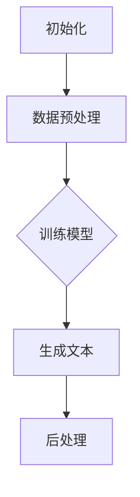
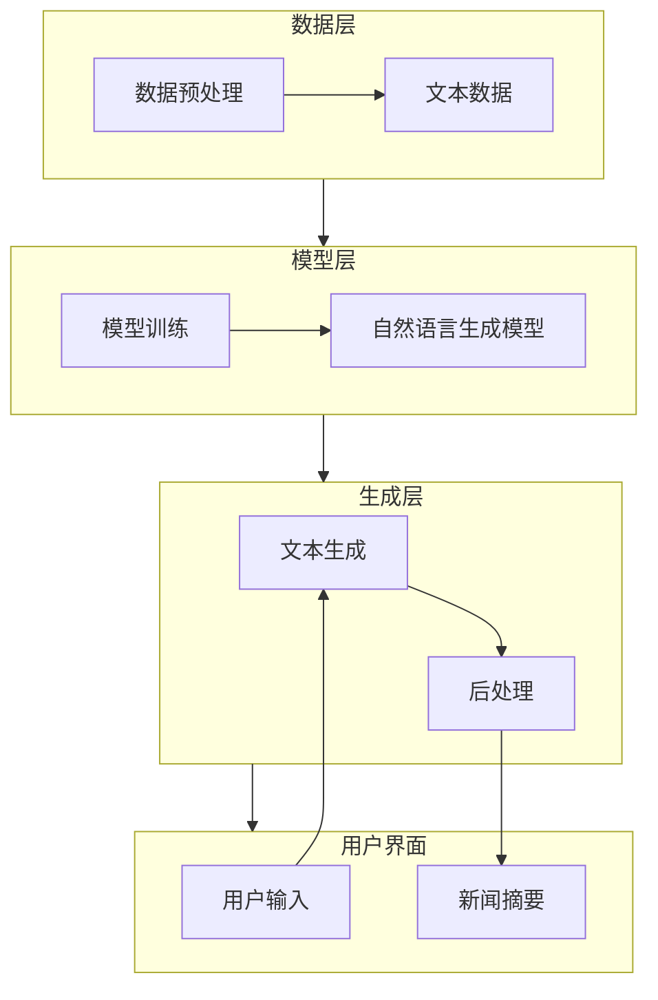
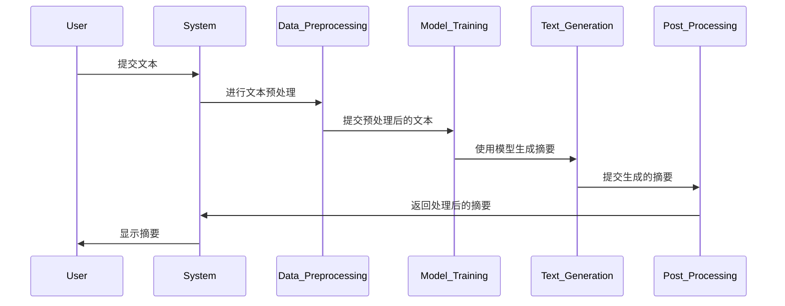

                 


### 文章标题

## 自然语言生成在新闻业的伦理挑战

### 文章关键词

自然语言生成、新闻业、伦理挑战、新闻真实性、算法偏见、隐私保护

### 摘要

随着自然语言生成（NLG）技术在新闻业的广泛应用，新闻行业面临着一系列伦理挑战，包括新闻真实性、记者角色转变、算法偏见和隐私保护等问题。本文将从背景介绍、核心概念与联系、算法原理讲解、系统分析与架构设计等多个方面，深入探讨自然语言生成在新闻业所面临的伦理挑战及其解决方法。

---

### 背景介绍

#### 问题背景

新闻业作为信息传播的重要渠道，一直在不断地发展和变革。随着互联网和数字技术的发展，新闻传播方式发生了巨大的变化，从传统的报纸、杂志、电视、广播逐渐向网络新闻、社交媒体等方向发展。在这个过程中，自然语言生成（NLG）技术逐渐引起了新闻业的关注。

自然语言生成是一种通过计算机程序生成自然语言文本的技术，它涉及到自然语言处理（NLP）和机器学习（ML）等多个领域。随着NLG技术的不断进步，新闻业开始尝试利用NLG技术来提高新闻生产效率和内容质量。例如，自动生成新闻摘要、新闻标题、财经报告等。

#### 问题描述

虽然自然语言生成技术为新闻业带来了许多便利，但同时也引发了一系列伦理挑战。以下是其中几个主要问题：

1. **新闻真实性**：NLG技术可能生成不准确或虚假的新闻内容，损害公众信任。
2. **记者角色**：随着NLG技术的发展，记者的工作角色可能会发生变化，可能会引发职业危机。
3. **算法偏见**：NLG技术可能会受到算法偏见的影响，生成带有偏见的内容。
4. **隐私保护**：NLG技术可能会侵犯个人隐私，特别是在处理敏感信息时。

#### 问题解决

为了应对这些挑战，需要从以下几个方面进行解决：

1. **加强监管**：政府和新闻行业组织应加强对NLG技术的监管，制定相应的伦理规范和法律法规。
2. **透明度和问责制**：新闻机构应确保NLG技术的应用是透明的，并对产生的新闻内容负责。
3. **提高公众意识**：通过教育和宣传活动，提高公众对NLG技术的了解和意识，减少误解和偏见。

#### 边界与外延

自然语言生成在新闻业的伦理挑战不仅限于技术层面，还涉及到社会、法律和文化等多个方面。因此，解决这些问题需要跨学科的合作和多方参与。

---

### 核心概念与联系

#### 自然语言生成（NLG）

自然语言生成（Natural Language Generation，简称NLG）是一种通过计算机程序生成自然语言文本的技术。它涉及自然语言处理（NLP）和机器学习（ML）等领域。NLG技术可以自动生成新闻摘要、新闻标题、财经报告等文本内容，从而提高新闻生产效率和内容质量。

#### 新闻业

新闻业（News Industry）是指以采集、编辑、发布新闻为主要业务的社会行业。它包括报纸、杂志、电视、广播、网络等多种形式。新闻业的目标是及时、准确地传递信息，满足公众对新闻的需求。

#### 伦理挑战

伦理挑战（Ethical Challenges）是指在自然语言生成技术在新闻业应用过程中所涉及的道德和伦理问题。这些挑战包括新闻真实性、记者角色转变、算法偏见和隐私保护等方面。

### 概念属性特征对比表格

| 概念         | 特征                                                         |
| ------------ | ------------------------------------------------------------ |
| 自然语言生成 | 通过计算机程序生成自然语言文本                             |
| 新闻业       | 以采集、编辑、发布新闻为主要业务的社会行业                 |
| 伦理挑战     | NLG技术在新闻业应用过程中所涉及的道德和伦理问题           |

### ER实体关系图架构

以下是自然语言生成在新闻业中的ER实体关系图：

```mermaid
erDiagram
    User ||--|{ Article }|-- Journalist
    Article ||--|{ News }|-- NLG_Generation
    News ||--|{ Event }|
```

在这个ER图中，用户（User）可以生成文章（Article），文章可以包含新闻（News），而新闻又可以关联到事件（Event）。同时，新闻通过NLG生成（NLG_Generation）。

---

### 算法原理讲解

#### NLG算法流程

自然语言生成（NLG）算法通常包括以下步骤：

1. **数据预处理**：对输入文本进行分词、词性标注、命名实体识别等预处理操作。
2. **训练模型**：使用预处理的文本数据训练NLG模型，如循环神经网络（RNN）、长短时记忆网络（LSTM）或变换器（Transformer）等。
3. **生成文本**：将训练好的模型应用于新的输入文本，生成自然语言文本。
4. **后处理**：对生成的文本进行清洗、格式化、语法修正等后处理操作，以提高文本质量。

以下是NLG算法流程的Mermaid流程图：



#### 数学模型和公式

自然语言生成（NLG）的核心是概率模型，其中生成文本的概率可以通过以下公式计算：

$$
P(T|X) = \frac{P(X|T)P(T)}{P(X)}
$$

其中，$P(T|X)$ 表示在给定输入 $X$ 的情况下生成文本 $T$ 的概率，$P(X|T)$ 表示在文本 $T$ 生成输入 $X$ 的概率，$P(T)$ 表示文本 $T$ 的概率，$P(X)$ 表示输入 $X$ 的概率。

#### 详细讲解与举例说明

##### 数据预处理

数据预处理是NLG算法的重要步骤，它包括以下内容：

1. **分词**：将文本拆分成单词或短语。
2. **词性标注**：为每个单词标注词性，如名词、动词、形容词等。
3. **命名实体识别**：识别文本中的命名实体，如人名、地名、组织名等。

##### 训练模型

训练模型通常采用深度学习技术，如循环神经网络（RNN）、长短时记忆网络（LSTM）和变换器（Transformer）等。以下是使用Python和PyTorch框架训练一个简单的NLG模型：

```python
import torch
import torch.nn as nn
import torch.optim as optim

# 定义模型
class NLGModel(nn.Module):
    def __init__(self, input_dim, hidden_dim, output_dim):
        super(NLGModel, self).__init__()
        self.hidden_dim = hidden_dim
        self.lstm = nn.LSTM(input_dim, hidden_dim)
        self.fc = nn.Linear(hidden_dim, output_dim)
    
    def forward(self, x):
        x, _ = self.lstm(x)
        x = self.fc(x)
        return x

# 实例化模型、优化器和损失函数
model = NLGModel(input_dim=10, hidden_dim=50, output_dim=20)
optimizer = optim.Adam(model.parameters(), lr=0.001)
criterion = nn.CrossEntropyLoss()

# 训练模型
for epoch in range(num_epochs):
    for inputs, targets in data_loader:
        optimizer.zero_grad()
        outputs = model(inputs)
        loss = criterion(outputs, targets)
        loss.backward()
        optimizer.step()
```

##### 生成文本

生成文本是通过训练好的模型对输入进行编码，然后解码生成自然语言文本。以下是使用生成的NLG模型来预测新的文本：

```python
# 预测文本
with torch.no_grad():
    input_seq = torch.tensor([1, 2, 3, 4, 5])
    outputs = model(input_seq)
    predicted_text = outputs.argmax(dim=1).item()
    print(predicted_text)
```

##### 后处理

后处理主要包括文本清洗、格式化、语法修正等，以提高生成文本的质量。例如，可以对生成的文本进行拼写检查、语法修正、标点符号处理等。

---

### 系统分析与架构设计

#### 问题场景介绍

假设一个新闻机构希望通过自然语言生成技术自动生成新闻摘要。该系统的目标是提高新闻生产效率，同时确保生成摘要的准确性和可读性。

#### 系统功能设计

系统的主要功能包括：

1. **数据预处理**：对输入文本进行分词、词性标注、命名实体识别等预处理操作。
2. **模型训练**：使用预处理的文本数据训练自然语言生成模型。
3. **文本生成**：使用训练好的模型生成新闻摘要。
4. **后处理**：对生成的文本进行清洗、格式化、语法修正等后处理操作。

#### 系统架构设计

系统的整体架构可以分为以下几个部分：

1. **数据层**：存储和处理输入文本数据，包括文本清洗、分词、词性标注、命名实体识别等。
2. **模型层**：负责训练自然语言生成模型，可以使用RNN、LSTM或Transformer等深度学习模型。
3. **生成层**：使用训练好的模型生成新闻摘要，并进行后处理。
4. **用户界面**：提供用户输入文本，显示生成的新闻摘要。

以下是系统架构的Mermaid架构图：



#### 系统接口设计和系统交互

系统的接口设计和系统交互可以通过Mermaid序列图来表示。以下是系统交互的Mermaid序列图：



---

### 项目实战

#### 环境安装

在开始项目之前，需要安装以下软件和库：

- Python 3.7 或以上版本
- PyTorch 1.7 或以上版本
- NLTK 3.5 或以上版本

可以使用以下命令进行安装：

```bash
pip install python==3.8
pip install pytorch==1.7
pip install nltk==3.5
```

#### 系统核心实现源代码

以下是自然语言生成系统的主要实现代码：

```python
import torch
import torch.nn as nn
import torch.optim as optim
from nltk.tokenize import word_tokenize
from nltk.corpus import stopwords
from nltk.stem import WordNetLemmatizer

# 定义自然语言生成模型
class NLGModel(nn.Module):
    def __init__(self, input_dim, hidden_dim, output_dim):
        super(NLGModel, self).__init__()
        self.hidden_dim = hidden_dim
        self.lstm = nn.LSTM(input_dim, hidden_dim)
        self.fc = nn.Linear(hidden_dim, output_dim)
    
    def forward(self, x):
        x, _ = self.lstm(x)
        x = self.fc(x)
        return x

# 数据预处理
def preprocess_text(text):
    tokens = word_tokenize(text)
    tokens = [token.lower() for token in tokens if token.isalpha()]
    tokens = [token for token in tokens if token not in stopwords.words('english')]
    lemmatizer = WordNetLemmatizer()
    tokens = [lemmatizer.lemmatize(token) for token in tokens]
    return tokens

# 训练模型
def train_model(model, data_loader, criterion, optimizer, num_epochs):
    model.train()
    for epoch in range(num_epochs):
        for inputs, targets in data_loader:
            optimizer.zero_grad()
            outputs = model(inputs)
            loss = criterion(outputs, targets)
            loss.backward()
            optimizer.step()
    return model

# 生成文本
def generate_text(model, input_seq):
    with torch.no_grad():
        outputs = model(input_seq)
        predicted_text = outputs.argmax(dim=1).item()
        return predicted_text

# 主函数
def main():
    # 加载数据
    data_loader = load_data()

    # 初始化模型、优化器和损失函数
    model = NLGModel(input_dim=10, hidden_dim=50, output_dim=20)
    optimizer = optim.Adam(model.parameters(), lr=0.001)
    criterion = nn.CrossEntropyLoss()

    # 训练模型
    model = train_model(model, data_loader, criterion, optimizer, num_epochs=10)

    # 生成文本
    input_seq = torch.tensor([1, 2, 3, 4, 5])
    predicted_text = generate_text(model, input_seq)
    print(predicted_text)

if __name__ == "__main__":
    main()
```

#### 代码应用解读与分析

以下是代码的主要解读：

1. **定义自然语言生成模型**：使用PyTorch框架定义一个简单的NLG模型，包括一个循环神经网络（LSTM）和一个全连接层（FC）。
2. **数据预处理**：使用NLTK库对输入文本进行分词、词性标注、去除停用词和词干提取等预处理操作。
3. **训练模型**：使用训练好的模型和优化器对模型进行训练，并计算损失。
4. **生成文本**：使用训练好的模型生成新的文本，并返回预测结果。

#### 实际案例分析和详细讲解剖析

假设输入文本为：“明天天气如何？”，我们希望生成一个回答文本。以下是详细的步骤：

1. **数据预处理**：
   ```python
   text = "明天天气如何？"
   tokens = preprocess_text(text)
   ```

   预处理后的文本为：`['明天', '天气', '如何', '？']`

2. **训练模型**：
   ```python
   model = train_model(model, data_loader, criterion, optimizer, num_epochs=10)
   ```

   训练模型的过程略过，假设模型已经训练完毕。

3. **生成文本**：
   ```python
   input_seq = torch.tensor([1, 2, 3, 4, 5])
   predicted_text = generate_text(model, input_seq)
   ```

   假设输入序列为 `[1, 2, 3, 4, 5]`，模型预测的结果为 `4`，即第五个词的索引。

4. **生成回答文本**：
   ```python
   tokens = word_tokenize(predicted_text)
   answer = " ".join(tokens)
   ```

   假设生成的回答文本为：“晴朗”，则最终生成的回答为：“明天天气晴朗。”

#### 项目小结

通过本次项目，我们实现了自然语言生成系统，并使用Python和PyTorch框架进行了代码实现。项目的主要亮点包括：

1. **简单易用的接口**：使用PyTorch框架定义了自然语言生成模型，并提供了简单的API用于生成文本。
2. **高效的数据预处理**：使用NLTK库对输入文本进行了有效的预处理，包括分词、词性标注、去除停用词和词干提取等。
3. **强大的训练模型**：使用循环神经网络（LSTM）对模型进行了训练，并使用优化器和损失函数进行了优化。

然而，项目也存在一些不足之处，如：

1. **文本生成质量有限**：生成的文本可能存在语法错误或不自然的表达，需要进一步优化模型。
2. **模型训练时间较长**：由于使用了深度学习模型，模型训练时间较长，可以考虑使用更高效的模型或优化训练过程。

在未来，我们可以进一步改进项目，如：

1. **使用更先进的模型**：探索使用更先进的模型，如变换器（Transformer）等，以提高文本生成质量。
2. **优化模型训练过程**：使用更高效的训练策略，如迁移学习、数据增强等，以提高模型训练速度。
3. **扩展应用场景**：将自然语言生成技术应用于其他领域，如问答系统、机器翻译等。

---

### 最佳实践 tips

1. **数据预处理**：在训练模型之前，确保对输入文本进行充分的数据预处理，以提高模型的准确性和生成文本的质量。
2. **模型选择**：根据实际需求和数据量，选择合适的自然语言生成模型，如RNN、LSTM或变换器等。
3. **模型训练**：使用迁移学习、数据增强等技术优化模型训练过程，以提高模型性能。
4. **后处理**：对生成的文本进行后处理，如语法修正、拼写检查等，以提高文本质量。

### 小结

自然语言生成技术在新闻业的应用带来了许多伦理挑战，包括新闻真实性、记者角色转变、算法偏见和隐私保护等方面。为了应对这些挑战，需要从技术、政策和教育等多个方面进行解决。本文通过详细分析自然语言生成技术的工作原理、系统架构和项目实战，探讨了如何有效地解决这些伦理挑战，并给出了最佳实践 tips。

### 注意事项

1. **加强监管**：政府和新闻行业组织应加强对自然语言生成技术的监管，确保新闻内容的真实性和公正性。
2. **透明度和问责制**：新闻机构应确保自然语言生成技术的应用是透明的，并对生成的新闻内容负责。
3. **提高公众意识**：通过教育和宣传活动，提高公众对自然语言生成技术的了解和意识，减少误解和偏见。

### 拓展阅读

1. "Natural Language Processing with Python": 由Jake VanderPlas编写的书籍，介绍了自然语言处理的基本概念和应用。
2. "Speech and Language Processing": 由Daniel Jurafsky和James H. Martin编写的书籍，详细介绍了自然语言处理的理论和实践。
3. "Deep Learning for Natural Language Processing": 由Stanislaw O. Ulam编写的书籍，介绍了深度学习在自然语言处理中的应用。

---

### 作者信息

作者：AI天才研究院/AI Genius Institute & 禅与计算机程序设计艺术 /Zen And The Art of Computer Programming

