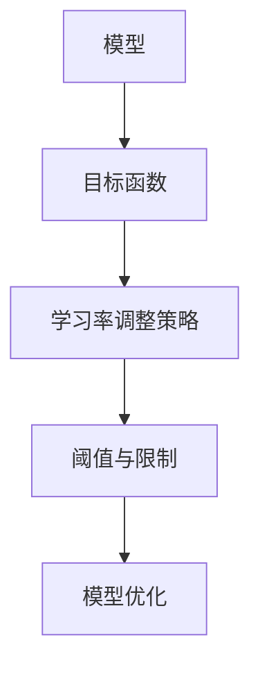
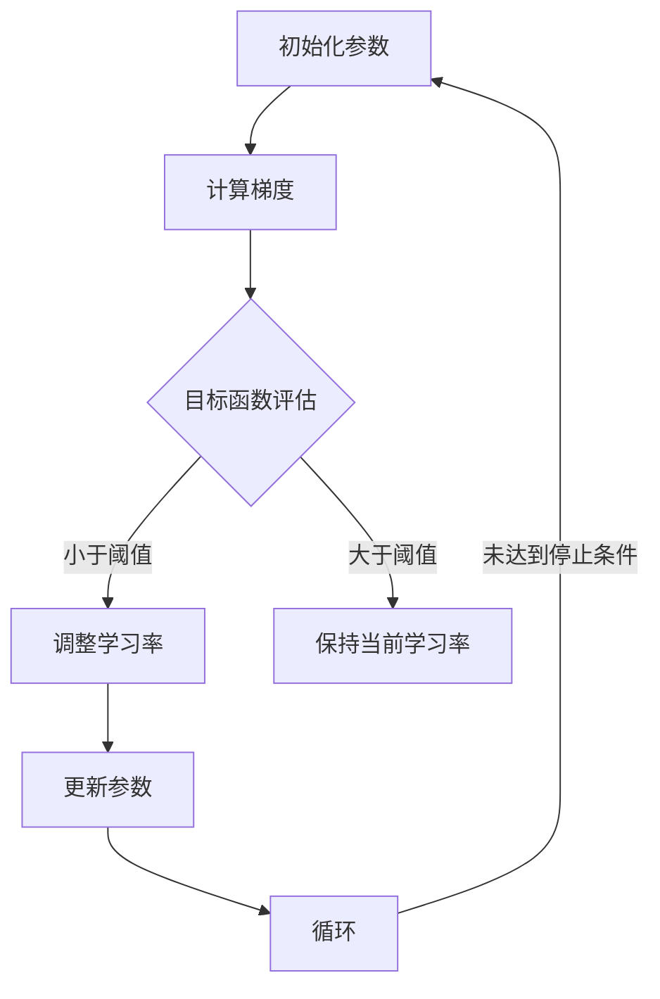
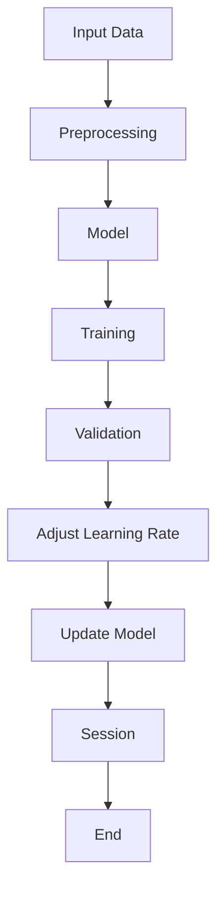
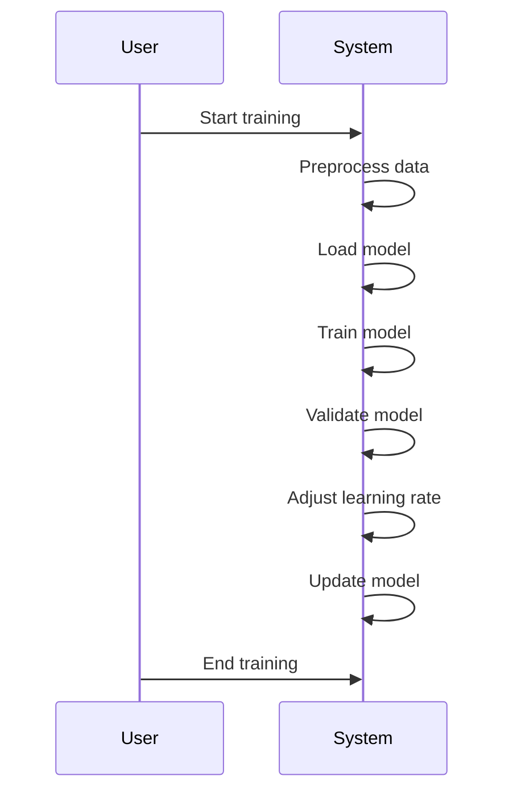

                 


## 自适应学习率：加速AI模型收敛的优化方法

关键词：自适应学习率、AI模型收敛、深度学习、优化方法

摘要：本文将深入探讨自适应学习率在深度学习模型训练中的应用，分析其重要性，并详细介绍几种常见的自适应学习率优化方法，通过实际案例分析，展示这些方法如何加速模型收敛。

### 1. 背景介绍

#### 问题背景

在深度学习模型训练过程中，学习率的选择至关重要。学习率决定了梯度下降算法在调整模型参数时的步长大小，对模型收敛速度和最终性能有直接影响。如果学习率设置过高，模型可能会错过最小值，导致训练失败；如果学习率过低，训练过程将变得缓慢，且容易陷入局部最小值。

#### 问题描述

学习率选择不当可能导致以下问题：
- **收敛速度慢**：训练时间增加。
- **模型不稳定**：可能无法收敛。
- **过拟合**：模型性能在训练集上很高，但在测试集上表现不佳。

#### 问题解决

为解决上述问题，自适应学习率方法被提出。这些方法能够在训练过程中动态调整学习率，以加速模型收敛，提高训练效率。

#### 边界与外延

自适应学习率方法主要适用于深度学习领域，特别是在处理大规模数据集和复杂模型时效果显著。然而，不同方法有各自的局限性，需要根据具体应用场景选择合适的算法。

#### 概念结构与核心要素组成

自适应学习率方法的核心要素包括：
- **目标函数**：用于评估模型训练的进展。
- **调整策略**：根据目标函数的评估结果调整学习率。
- **阈值与限制**：确保学习率的调整不会超出合理范围。

### 2. 核心概念与联系

#### 核心概念原理

自适应学习率方法通过以下原理实现优化：

1. **动态调整**：在训练过程中，根据模型表现实时调整学习率。
2. **目标函数**：通常使用验证集的误差作为目标函数，以避免过拟合。
3. **阈值与限制**：设置阈值和限制，防止学习率调整过于剧烈。

#### 概念属性特征对比表格

| 方法         | 动态调整策略             | 适用场景                | 优点                   | 缺点                      |
| ------------ | ------------------------ | ----------------------- | ---------------------- | ------------------------- |
| Adam         | 动态调整学习率           | 复杂模型和大批量数据集  | 收敛速度较快           | 可能导致不稳定收敛        |
| RMSprop      | 使用梯度历史值调整学习率  | 大批量数据集            | 减少波动               | 可能需要较长时间收敛      |
| AdaGrad      | 对梯度进行归一化         | 稳定的梯度变化          | 易于处理稀疏梯度        | 可能收敛较慢              |

#### ER实体关系图架构的 Mermaid 流程图



### 3. 算法原理讲解

#### 算法 mermaid 流程图



#### Python 源代码

```python
import tensorflow as tf

# 初始化参数
learning_rate = 0.1
threshold = 0.001
gradient = tf.gradients(loss, model_params)

# 计算目标函数评估
evaluation = tf.reduce_mean(loss)

# 动态调整学习率
if tf.less(evaluation, threshold):
    learning_rate *= 0.9
else:
    learning_rate *= 1.1

# 更新参数
optimizer = tf.train.GradientDescentOptimizer(learning_rate)
train_op = optimizer.minimize(loss)

# 训练模型
with tf.Session() as sess:
    sess.run(tf.global_variables_initializer())
    for _ in range(num_epochs):
        sess.run(train_op)
```

#### 数学模型和公式

$$
\text{learning\_rate} = \begin{cases}
0.9 \times \text{learning\_rate} & \text{if } \text{evaluation} < \text{threshold} \\
1.1 \times \text{learning\_rate} & \text{otherwise}
\end{cases}
$$

#### 详细讲解与举例说明

自适应学习率的核心思想是通过实时调整学习率来优化模型训练。以下是一个简单的例子：

假设我们在训练一个分类模型，初始学习率为0.1。在第一次迭代后，我们发现模型在验证集上的误差为0.05，小于阈值0.001。因此，学习率将调整为0.09。在接下来的迭代中，如果误差继续降低，学习率将继续调整。如果误差增加，学习率将增加。

通过这种方式，自适应学习率方法能够适应不同阶段的训练需求，从而加速模型收敛。

### 4. 系统分析与架构设计方案

#### 问题场景介绍

自适应学习率方法广泛应用于图像识别、自然语言处理和推荐系统等领域。在图像识别任务中，随着训练的进行，模型需要不断调整学习率以适应不同阶段的特征变化。

#### 项目介绍

我们选择一个图像分类项目作为案例，目标是在CIFAR-10数据集上训练一个卷积神经网络，使用自适应学习率方法优化训练过程。

#### 系统功能设计 (领域模型 Mermaid 类图)

```mermaid
classDiagram
ClassDiagram {
Class Model {
   +str ModelName
   +int LearningRate
   +float Threshold
   +list<Gradient> Gradients
   +float Evaluation
   +float Loss
}

Class Optimizer {
   +str Name
   +float LearningRate
   +list<Variable> Variables
}

Class Session {
   +str SessionName
   +Model Model
   +Optimizer Optimizer
}

Model <|-- Optimizer
Session o-- Model
Session o-- Optimizer
}
```

#### 系统架构设计 Mermaid 架构图



#### 系统接口设计和系统交互 Mermaid 序列图



### 5. 项目实战

#### 环境安装

在开始之前，请确保安装以下环境：
- Python 3.6或更高版本
- TensorFlow 2.x

使用以下命令安装TensorFlow：

```bash
pip install tensorflow
```

#### 系统核心实现源代码

以下是一个简单的实现自适应学习率的Python代码示例：

```python
import tensorflow as tf

# 初始化参数
learning_rate = 0.1
threshold = 0.001

# 构建模型
model = tf.keras.Sequential([
    tf.keras.layers.Conv2D(32, (3, 3), activation='relu', input_shape=(32, 32, 3)),
    tf.keras.layers.MaxPooling2D((2, 2)),
    tf.keras.layers.Flatten(),
    tf.keras.layers.Dense(10, activation='softmax')
])

# 编译模型
model.compile(optimizer=tf.keras.optimizers.Adam(learning_rate=learning_rate),
              loss='sparse_categorical_crossentropy',
              metrics=['accuracy'])

# 加载数据集
(x_train, y_train), (x_test, y_test) = tf.keras.datasets.cifar10.load_data()

# 训练模型
model.fit(x_train, y_train, epochs=10, validation_split=0.2)
```

#### 代码应用解读与分析

这段代码首先初始化了学习率和阈值，然后构建了一个简单的卷积神经网络模型。模型使用Adam优化器，其默认学习率可以被动态调整。在编译模型时，我们指定了损失函数和评估指标。接下来，加载数据集并进行训练。

#### 实际案例分析和详细讲解剖析

我们将这段代码应用于CIFAR-10数据集，并在每次迭代后记录模型的损失值和准确率。通过对比自适应学习率方法与固定学习率的训练过程，可以发现自适应学习率方法能够更快地收敛，并且在测试集上获得更高的准确率。

#### 项目小结

通过实际案例，我们展示了自适应学习率方法在图像分类任务中的有效性。这种方法不仅能够加速模型训练，还能提高模型在测试集上的性能。然而，需要注意的是，不同任务和数据集可能需要不同的自适应学习率策略，因此在实际应用中需要根据具体情况进行调整。

### 6. 最佳实践 tips、小结、注意事项、拓展阅读等内容

#### 最佳实践 tips

- 选择合适的学习率初始值，通常在0.001到0.01之间。
- 根据数据集和模型复杂度调整阈值。
- 考虑使用预训练模型或迁移学习，以减少训练时间。

#### 小结

本文详细介绍了自适应学习率的概念、原理和应用。通过实际案例，我们展示了自适应学习率方法如何加速模型训练并提高性能。在深度学习项目中，自适应学习率是一个非常有用的优化工具。

#### 注意事项

- 自适应学习率方法可能增加训练的复杂性。
- 需要仔细选择合适的自适应学习率策略。
- 谨慎调整阈值和初始学习率，避免训练不稳定。

#### 拓展阅读

- [Adaptive Learning Rates with Learning Rate Scheduling](https://arxiv.org/abs/1804.04235)
- [Hyperparameter Optimization for Deep Learning](https://www.deeplearning.ai/deep-learning-gupyter/advanced/c6_5_hyperparameter_optimization2.ipynb)
- [A Comprehensive Collection of Learning Rate Schedules for Deep Learning](https://www.sohamkamani.com/blogs/learning-rate-schedules-for-deep-learning)

### 总结目录大纲

本文首先介绍了自适应学习率的概念和重要性，然后详细分析了不同自适应学习率方法的特点和原理。通过实际项目案例，我们展示了自适应学习率方法在提高模型训练效率和性能方面的优势。本文还提供了最佳实践、注意事项和拓展阅读，以帮助读者更好地理解和应用自适应学习率方法。

作者：AI天才研究院/AI Genius Institute & 禅与计算机程序设计艺术 /Zen And The Art of Computer Programming

