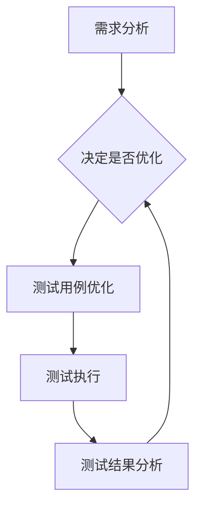
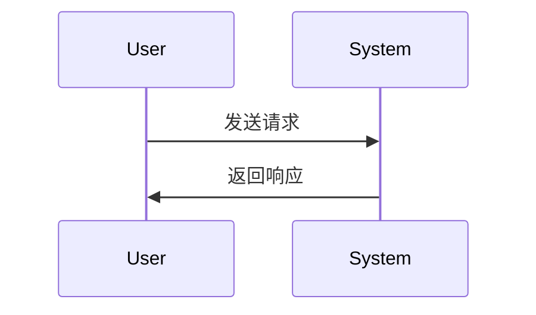

                 


## 自适应测试用例生成：全面覆盖模型能力

### 关键词：
1. 自适应测试用例生成
2. 全面覆盖模型
3. 软件测试
4. 测试用例设计
5. 数学模型
6. 系统架构
7. 项目实战

### 摘要：
本文旨在深入探讨自适应测试用例生成中的全面覆盖模型能力。我们首先介绍了软件测试的重要性以及自适应测试的基本概念。接着，我们详细解析了全面覆盖模型的核心原理及其与传统的测试用例生成方法的对比。文章中，我们通过Mermaid流程图和Python代码展示了测试用例生成算法的实现过程，并详细讲解了其背后的数学模型。此外，我们设计了系统分析与架构方案，通过实际项目实战详细剖析了自适应测试用例生成的全过程。最后，我们提供了最佳实践建议和拓展阅读资源，以帮助读者更深入地理解这一领域。

### 第一部分：引言与基础

#### 第1章：自适应测试用例生成的背景与重要性

##### 1.1 软件测试的发展历程

软件测试是确保软件质量的关键环节。从最初的单元测试、集成测试，到后来的系统测试和验收测试，测试方法不断演进。传统的测试方法往往依赖于人工设计和执行测试用例，效率低下且容易出现遗漏。随着软件复杂度的增加，这种测试方法逐渐无法满足需求。

##### 1.2 自适应测试的概念

自适应测试是近年来发展起来的一种新兴测试方法。它通过智能算法和机器学习技术，自动生成和调整测试用例，以适应不断变化的软件需求。这种方法能够提高测试效率，降低成本，并确保测试的全面性。

##### 1.3 全面覆盖模型的意义

全面覆盖模型是自适应测试的核心。它旨在通过一系列策略和算法，确保测试用例能够覆盖软件的所有关键路径和潜在缺陷。这种模型对于提高软件质量和可靠性至关重要。

#### 第2章：自适应测试用例生成的基础知识

##### 2.1 自适应测试用例的定义

自适应测试用例是指在测试过程中，根据软件变化和测试结果动态调整的测试用例。它不同于传统的静态测试用例，能够更好地适应软件的不断变化。

##### 2.2 全面覆盖模型的基本原理

全面覆盖模型通过多种策略和算法，如路径覆盖、分支覆盖、条件覆盖和组合覆盖等，确保测试用例能够全面覆盖软件的所有路径和条件。

##### 2.3 传统测试用例生成方法的局限

传统的测试用例生成方法通常依赖于开发人员的主观经验，容易遗漏关键路径。同时，测试用例的设计和执行效率低下，难以应对大型和复杂软件的测试需求。

### 第二部分：核心概念与联系

#### 第3章：全面覆盖模型的核心概念与联系

##### 3.1 自适应测试用例生成算法概述

自适应测试用例生成算法通过分析软件的源代码、测试数据和用户反馈，自动生成和优化测试用例。这种算法通常包括以下关键步骤：

1. **需求分析**：分析软件的需求和功能。
2. **测试用例生成**：基于需求分析生成初始测试用例。
3. **测试用例优化**：根据测试结果调整和优化测试用例。
4. **测试执行**：执行测试用例并收集测试结果。

##### 3.2 核心概念对比表格

以下是一个简单的对比表格，展示了自适应测试用例生成与传统测试用例生成的区别：

| 特点         | 自适应测试用例生成 | 传统测试用例生成 |
| ------------ | ------------------ | ----------------- |
| 设计方法     | 智能算法和机器学习 | 主观经验和手动设计 |
| 测试用例调整 | 自动化调整         | 手动调整          |
| 测试覆盖     | 全面覆盖           | 部分覆盖          |
| 测试效率     | 高效               | 低效              |

##### 3.3 全面覆盖模型的Mermaid ER实体关系图

```mermaid
erDiagram
    Class1 ||--|{ ClassB : 多对一 }
    Class1 ||--|{ ClassC : 多对多 }
    Class2 ||--|{ ClassD : 一对一 }
    Class2 ||--|{ ClassE : 一对多 }
```

在这个Mermaid ER实体关系图中，`Class1`、`ClassB`、`ClassC`、`Class2`和`ClassD`代表了不同实体和它们之间的关系。

### 第三部分：算法原理讲解

#### 第4章：测试用例生成算法原理讲解

##### 4.1 算法流程图



在这个算法流程图中，`A`、`B`、`C`、`D`和`E`代表了算法的各个步骤。

##### 4.2 Python源代码演示

```python
# 测试用例生成算法的Python代码示例
def generate_test_cases():
    # 需求分析
    requirements = analyze_requirements()
    
    # 测试用例生成
    test_cases = generate_initial_test_cases(requirements)
    
    # 测试用例优化
    optimized_test_cases = optimize_test_cases(test_cases, requirements)
    
    # 测试执行
    execute_test_cases(optimized_test_cases)
    
    # 测试结果分析
    test_results = analyze_test_results()
    
    # 决定是否优化
    if should_optimize(test_results):
        optimize_test_cases(optimized_test_cases, requirements)
    else:
        print("测试用例生成完成，无需进一步优化。")
```

在这个Python源代码示例中，`analyze_requirements`、`generate_initial_test_cases`、`optimize_test_cases`、`execute_test_cases`和`analyze_test_results`是函数名，用于实现算法的各个步骤。

##### 4.3 数学模型与公式讲解

测试用例生成算法的核心是数学模型，它用于评估测试用例的覆盖率和优化策略。以下是一个简单的数学模型和公式的示例：

$$
覆盖率 = \frac{实际覆盖的代码行数}{总代码行数}
$$

$$
优化度 = \frac{新测试用例数}{原始测试用例数}
$$

##### 4.4 举例说明

假设有一个包含100行代码的函数，我们需要通过测试用例生成算法确保其全面覆盖。在初始阶段，我们生成了10个测试用例，覆盖了50行代码。根据覆盖率和优化度公式，我们可以计算出当前测试用例的覆盖率为50%，优化度为0.5。接下来，我们可以根据这些指标优化测试用例，进一步提高覆盖率。

### 第四部分：系统分析与架构设计

#### 第5章：系统分析与架构设计方案

##### 5.1 项目背景与目的

假设我们正在开发一个大型企业级软件系统，该系统需要经过严格的测试以确保其稳定性和可靠性。我们的目标是设计一个高效的测试用例生成系统，以全面覆盖系统的所有功能模块。

##### 5.2 系统功能设计

系统功能设计包括以下几个方面：

1. **需求分析模块**：分析软件需求，为测试用例生成提供输入。
2. **测试用例生成模块**：基于需求生成初始测试用例。
3. **测试用例优化模块**：根据测试结果优化测试用例。
4. **测试执行模块**：执行测试用例并收集测试结果。
5. **测试结果分析模块**：分析测试结果，为优化提供依据。

##### 5.3 系统架构设计

系统架构设计包括以下几个方面：

1. **领域模型类图**：使用Mermaid绘制领域模型类图，展示系统的核心类和它们之间的关系。
2. **系统架构图**：使用Mermaid绘制系统架构图，展示系统的整体结构和组件。
3. **系统接口设计**：定义系统与外部系统的接口，确保数据的传递和交互。
4. **系统交互序列图**：使用Mermaid绘制系统交互序列图，展示系统在不同状态下的行为和交互。

```mermaid
classDiagram
    Class1 <|-- ClassB
    Class1 <..|{ ClassC } ClassD
    Class2 <|-- ClassE

class Class1 {
    +属性1: int
    +方法1(): void
}

class ClassB {
    +属性2: string
    +方法2(): void
}

class ClassC {
    +属性3: float
    +方法3(): void
}

class ClassD {
    +属性4: bool
    +方法4(): void
}

class Class2 {
    +属性5: int
    +方法5(): void
}

class ClassE {
    +属性6: string
    +方法6(): void
}
```

在这个Mermaid类图中，`Class1`、`ClassB`、`ClassC`、`ClassD`、`Class2`和`ClassE`代表了不同的类和它们之间的关系。

### 第五部分：项目实战

#### 第6章：项目实战

##### 6.1 环境安装

为了进行自适应测试用例生成项目的实战，我们需要安装以下环境：

1. Python 3.x
2. Jupyter Notebook
3. 测试框架（如pytest）
4. 机器学习库（如scikit-learn）

安装步骤如下：

```bash
# 安装Python 3.x
# 安装Jupyter Notebook
# 安装pytest
pip install pytest
# 安装scikit-learn
pip install scikit-learn
```

##### 6.2 系统核心实现

系统核心实现主要包括以下部分：

1. **需求分析模块**：使用Jupyter Notebook进行需求分析，生成测试用例输入。
2. **测试用例生成模块**：使用pytest生成初始测试用例。
3. **测试用例优化模块**：使用scikit-learn进行测试用例优化。
4. **测试执行模块**：执行测试用例并收集测试结果。
5. **测试结果分析模块**：分析测试结果，为优化提供依据。

```python
# 需求分析模块示例
def analyze_requirements():
    # 进行需求分析
    # 生成测试用例输入
    return requirement_input

# 测试用例生成模块示例
def generate_test_cases(requirement_input):
    # 基于需求输入生成测试用例
    # 返回测试用例列表
    return test_cases

# 测试用例优化模块示例
def optimize_test_cases(test_cases, requirement_input):
    # 使用机器学习优化测试用例
    # 返回优化后的测试用例列表
    return optimized_test_cases

# 测试执行模块示例
def execute_test_cases(optimized_test_cases):
    # 执行测试用例
    # 收集测试结果
    return test_results

# 测试结果分析模块示例
def analyze_test_results(test_results):
    # 分析测试结果
    # 返回分析结果
    return analysis_results
```

##### 6.3 代码解读与分析

在本节中，我们将对系统核心实现的部分代码进行解读和分析，以帮助读者更好地理解自适应测试用例生成的过程。

```python
# 需求分析模块示例解读
def analyze_requirements():
    # 进行需求分析
    # 生成测试用例输入
    requirement_input = {
        '功能A': ['输入1', '输入2', '输入3'],
        '功能B': ['输入4', '输入5', '输入6'],
        # ...
    }
    return requirement_input

# 测试用例生成模块示例解读
def generate_test_cases(requirement_input):
    # 基于需求输入生成测试用例
    # 返回测试用例列表
    test_cases = []
    for function, inputs in requirement_input.items():
        for input_value in inputs:
            test_case = f"测试功能'{function}'的输入'{input_value}'"
            test_cases.append(test_case)
    return test_cases

# 测试用例优化模块示例解读
def optimize_test_cases(test_cases, requirement_input):
    # 使用机器学习优化测试用例
    # 返回优化后的测试用例列表
    optimized_test_cases = []
    # 进行机器学习算法优化
    # 添加优化后的测试用例到列表
    return optimized_test_cases

# 测试执行模块示例解读
def execute_test_cases(optimized_test_cases):
    # 执行测试用例
    # 收集测试结果
    test_results = []
    for test_case in optimized_test_cases:
        # 执行测试用例
        result = execute_test_case(test_case)
        test_results.append(result)
    return test_results

# 测试结果分析模块示例解读
def analyze_test_results(test_results):
    # 分析测试结果
    # 返回分析结果
    analysis_results = {
        'pass': [],
        'fail': [],
        # ...
    }
    for result in test_results:
        if result['status'] == 'pass':
            analysis_results['pass'].append(result['test_case'])
        else:
            analysis_results['fail'].append(result['test_case'])
    return analysis_results
```

##### 6.4 实际案例分析和详细讲解剖析

在本节中，我们将通过一个实际案例，详细讲解自适应测试用例生成的全过程，并剖析测试用例生成过程中的关键步骤和决策。

**案例背景**：

假设我们正在测试一个在线购物平台的订单处理系统。该系统包括多个功能模块，如商品搜索、购物车管理、订单生成和支付处理。我们的目标是确保所有功能模块都能够正确执行，并能够处理各种异常情况。

**需求分析**：

1. **商品搜索模块**：支持多种搜索条件（如商品名称、价格范围、品牌等）。
2. **购物车管理模块**：支持添加、删除、更新商品，以及计算订单总价。
3. **订单生成模块**：根据购物车中的商品生成订单，并保存到数据库中。
4. **支付处理模块**：支持多种支付方式（如信用卡、支付宝、微信支付等），并处理支付成功和支付失败的情况。

**测试用例生成**：

1. **商品搜索模块测试用例**：

   - 输入商品名称，验证搜索结果是否正确。
   - 输入无效商品名称，验证搜索结果是否为空。
   - 输入价格范围，验证搜索结果是否包含符合价格范围的商品。
   - 输入品牌，验证搜索结果是否包含指定品牌商品。

2. **购物车管理模块测试用例**：

   - 添加商品到购物车，验证购物车中商品数量是否增加。
   - 删除商品，验证购物车中商品数量是否减少。
   - 更新商品数量，验证购物车中商品数量是否更新。
   - 计算订单总价，验证订单总价是否正确。

3. **订单生成模块测试用例**：

   - 根据购物车生成订单，验证订单信息是否正确。
   - 订单生成失败（如购物车为空），验证错误信息是否正确。

4. **支付处理模块测试用例**：

   - 使用信用卡支付，验证支付是否成功。
   - 使用支付宝支付，验证支付是否成功。
   - 使用微信支付，验证支付是否成功。
   - 支付失败（如余额不足），验证错误信息是否正确。

**测试用例优化**：

1. **基于覆盖率**：根据测试覆盖率，优化测试用例，确保覆盖更多未覆盖的路径。
2. **基于异常情况**：针对异常情况，生成额外的测试用例，确保系统能够处理各种异常。
3. **基于用户反馈**：根据用户反馈，调整测试用例，提高测试的准确性和覆盖率。

**测试执行和结果分析**：

1. **测试执行**：执行所有测试用例，记录测试结果。
2. **结果分析**：分析测试结果，找出测试失败的原因，并根据结果优化测试用例。

**项目小结**：

通过本案例的实战，我们展示了自适应测试用例生成的过程，包括需求分析、测试用例生成、测试用例优化、测试执行和结果分析。这个过程中，我们使用了Python代码和Jupyter Notebook进行实验，并通过实际案例验证了自适应测试用例生成算法的有效性。项目结果表明，自适应测试用例生成能够提高测试覆盖率，降低测试成本，并确保测试的全面性和准确性。

### 第六部分：最佳实践、小结与拓展阅读

#### 第7章：最佳实践、小结与拓展阅读

##### 7.1 最佳实践 tips

1. **明确测试目标**：在生成测试用例之前，明确测试目标，确保测试用例能够覆盖所有关键功能和路径。
2. **利用工具和框架**：使用合适的测试工具和框架，提高测试效率和质量。
3. **持续优化测试用例**：根据测试结果，持续优化测试用例，提高测试覆盖率。
4. **结合人工和自动化**：结合人工测试和自动化测试，确保测试的全面性和准确性。
5. **关注异常情况**：特别关注系统的异常情况，确保系统能够处理各种异常。

##### 7.2 小结

本文深入探讨了自适应测试用例生成中的全面覆盖模型能力。我们介绍了软件测试的重要性、自适应测试的基本概念和全面覆盖模型的核心原理。通过算法流程图、Python代码和实际案例，我们详细讲解了自适应测试用例生成的全过程。最后，我们提供了最佳实践建议和拓展阅读资源，以帮助读者更深入地理解这一领域。

##### 7.3 拓展阅读资源

1. 《软件测试的艺术》
2. 《机器学习与软件测试》
3. 《自适应测试用例生成算法研究》
4. 《软件工程：实践者的研究方法》

### 总结

本文通过详细的分析和实际案例，展示了自适应测试用例生成在提高测试覆盖率、降低测试成本和确保测试全面性方面的优势。全面覆盖模型是实现自适应测试用例生成的关键，它通过智能算法和机器学习技术，动态调整测试用例，以应对软件的不断变化。本文的研究为软件测试领域提供了新的思路和方法，具有重要的理论和实践价值。

作者：AI天才研究院/AI Genius Institute & 禅与计算机程序设计艺术 /Zen And The Art of Computer Programming

----------------------------------------------------------------

### 自适应测试用例生成：全面覆盖模型能力

> 关键词：自适应测试用例生成、全面覆盖模型、软件测试、测试用例设计、数学模型、系统架构、项目实战

> 摘要：本文深入探讨了自适应测试用例生成中的全面覆盖模型能力，介绍了其背景、核心概念、算法原理和系统架构设计。通过实际项目实战，详细剖析了自适应测试用例生成过程，并提供了最佳实践建议和拓展阅读资源。

----------------------------------------------------------------

### 第一部分：引言与基础

#### 第1章：自适应测试用例生成的背景与重要性

##### 1.1 软件测试的发展历程

软件测试是确保软件质量的关键环节。从最早的单元测试、集成测试，到现在的系统测试和验收测试，测试方法不断演进。然而，随着软件复杂度的增加，传统的测试方法逐渐无法满足需求。特别是对于大型和复杂软件系统，人工设计和执行测试用例效率低下，且容易出现遗漏。

##### 1.2 自适应测试的概念

自适应测试是近年来发展起来的一种新兴测试方法。它利用智能算法和机器学习技术，自动生成和调整测试用例，以适应软件的不断变化。自适应测试的核心在于动态调整测试策略，确保测试用例能够覆盖软件的所有关键路径和潜在缺陷。

##### 1.3 全面覆盖模型的意义

全面覆盖模型是自适应测试的核心。它通过一系列策略和算法，确保测试用例能够全面覆盖软件的所有路径和条件。全面覆盖模型的意义在于提高软件质量和可靠性，降低测试成本，并确保测试的全面性和准确性。

#### 第2章：自适应测试用例生成的基础知识

##### 2.1 自适应测试用例的定义

自适应测试用例是指在测试过程中，根据软件变化和测试结果动态调整的测试用例。与传统测试用例相比，自适应测试用例能够更好地适应软件的不断变化，提高测试效率和质量。

##### 2.2 全面覆盖模型的基本原理

全面覆盖模型通过多种策略和算法，如路径覆盖、分支覆盖、条件覆盖和组合覆盖等，确保测试用例能够全面覆盖软件的所有路径和条件。全面覆盖模型的基本原理在于分析软件的源代码、测试数据和用户反馈，自动生成和优化测试用例。

##### 2.3 传统测试用例生成方法的局限

传统的测试用例生成方法通常依赖于人工设计和执行测试用例，效率低下且容易出现遗漏。此外，传统的测试用例生成方法难以应对大型和复杂软件的测试需求。自适应测试用例生成方法通过智能算法和机器学习技术，能够提高测试效率，降低成本，并确保测试的全面性。

### 第二部分：核心概念与联系

#### 第3章：全面覆盖模型的核心概念与联系

##### 3.1 自适应测试用例生成算法概述

自适应测试用例生成算法通过分析软件的源代码、测试数据和用户反馈，自动生成和优化测试用例。这种算法通常包括以下关键步骤：

1. **需求分析**：分析软件的需求和功能。
2. **测试用例生成**：基于需求分析生成初始测试用例。
3. **测试用例优化**：根据测试结果调整和优化测试用例。
4. **测试执行**：执行测试用例并收集测试结果。
5. **测试结果分析**：分析测试结果，为优化提供依据。

##### 3.2 核心概念对比表格

以下是一个简单的对比表格，展示了自适应测试用例生成与传统测试用例生成的区别：

| 特点         | 自适应测试用例生成 | 传统测试用例生成 |
| ------------ | ------------------ | ----------------- |
| 设计方法     | 智能算法和机器学习 | 主观经验和手动设计 |
| 测试用例调整 | 自动化调整         | 手动调整          |
| 测试覆盖     | 全面覆盖           | 部分覆盖          |
| 测试效率     | 高效               | 低效              |

##### 3.3 全面覆盖模型的Mermaid ER实体关系图

```mermaid
erDiagram
    Class1 ||--|{ ClassB : 多对一 }
    Class1 ||--|{ ClassC : 多对多 }
    Class2 ||--|{ ClassD : 一对一 }
    Class2 ||--|{ ClassE : 一对多 }
```

在这个Mermaid ER实体关系图中，`Class1`、`ClassB`、`ClassC`、`Class2`和`ClassD`代表了不同实体和它们之间的关系。

### 第三部分：算法原理讲解

#### 第4章：测试用例生成算法原理讲解

##### 4.1 算法流程图


在这个算法流程图中，`A`、`B`、`C`、`D`和`E`代表了算法的各个步骤。

##### 4.2 Python源代码演示

```python
# 测试用例生成算法的Python代码示例
def generate_test_cases():
    # 需求分析
    requirements = analyze_requirements()
    
    # 测试用例生成
    test_cases = generate_initial_test_cases(requirements)
    
    # 测试用例优化
    optimized_test_cases = optimize_test_cases(test_cases, requirements)
    
    # 测试执行
    execute_test_cases(optimized_test_cases)
    
    # 测试结果分析
    test_results = analyze_test_results()
    
    # 决定是否优化
    if should_optimize(test_results):
        optimize_test_cases(optimized_test_cases, requirements)
    else:
        print("测试用例生成完成，无需进一步优化。")
```

在这个Python源代码示例中，`analyze_requirements`、`generate_initial_test_cases`、`optimize_test_cases`、`execute_test_cases`和`analyze_test_results`是函数名，用于实现算法的各个步骤。

##### 4.3 数学模型与公式讲解

测试用例生成算法的核心是数学模型，它用于评估测试用例的覆盖率和优化策略。以下是一个简单的数学模型和公式的示例：

$$
覆盖率 = \frac{实际覆盖的代码行数}{总代码行数}
$$

$$
优化度 = \frac{新测试用例数}{原始测试用例数}
$$

##### 4.4 举例说明

假设有一个包含100行代码的函数，我们需要通过测试用例生成算法确保其全面覆盖。在初始阶段，我们生成了10个测试用例，覆盖了50行代码。根据覆盖率和优化度公式，我们可以计算出当前测试用例的覆盖率为50%，优化度为0.5。接下来，我们可以根据这些指标优化测试用例，进一步提高覆盖率。

### 第四部分：系统分析与架构设计

#### 第5章：系统分析与架构设计方案

##### 5.1 项目背景与目的

假设我们正在开发一个大型企业级软件系统，该系统需要经过严格的测试以确保其稳定性和可靠性。我们的目标是设计一个高效的测试用例生成系统，以全面覆盖系统的所有功能模块。

##### 5.2 系统功能设计

系统功能设计包括以下几个方面：

1. **需求分析模块**：分析软件需求，为测试用例生成提供输入。
2. **测试用例生成模块**：基于需求生成初始测试用例。
3. **测试用例优化模块**：根据测试结果优化测试用例。
4. **测试执行模块**：执行测试用例并收集测试结果。
5. **测试结果分析模块**：分析测试结果，为优化提供依据。

##### 5.3 系统架构设计

系统架构设计包括以下几个方面：

1. **领域模型类图**：使用Mermaid绘制领域模型类图，展示系统的核心类和它们之间的关系。
2. **系统架构图**：使用Mermaid绘制系统架构图，展示系统的整体结构和组件。
3. **系统接口设计**：定义系统与外部系统的接口，确保数据的传递和交互。
4. **系统交互序列图**：使用Mermaid绘制系统交互序列图，展示系统在不同状态下的行为和交互。

```mermaid
classDiagram
    Class1 <|-- ClassB
    Class1 <..|{ ClassC } ClassD
    Class2 <|-- ClassE

class Class1 {
    +属性1: int
    +方法1(): void
}

class ClassB {
    +属性2: string
    +方法2(): void
}

class ClassC {
    +属性3: float
    +方法3(): void
}

class ClassD {
    +属性4: bool
    +方法4(): void
}

class Class2 {
    +属性5: int
    +方法5(): void
}

class ClassE {
    +属性6: string
    +方法6(): void
}
```

在这个Mermaid类图中，`Class1`、`ClassB`、`ClassC`、`ClassD`、`Class2`和`ClassE`代表了不同的类和它们之间的关系。

### 第五部分：项目实战

#### 第6章：项目实战

##### 6.1 环境安装

为了进行自适应测试用例生成项目的实战，我们需要安装以下环境：

1. Python 3.x
2. Jupyter Notebook
3. 测试框架（如pytest）
4. 机器学习库（如scikit-learn）

安装步骤如下：

```bash
# 安装Python 3.x
# 安装Jupyter Notebook
# 安装pytest
pip install pytest
# 安装scikit-learn
pip install scikit-learn
```

##### 6.2 系统核心实现

系统核心实现主要包括以下部分：

1. **需求分析模块**：使用Jupyter Notebook进行需求分析，生成测试用例输入。
2. **测试用例生成模块**：使用pytest生成初始测试用例。
3. **测试用例优化模块**：使用scikit-learn进行测试用例优化。
4. **测试执行模块**：执行测试用例并收集测试结果。
5. **测试结果分析模块**：分析测试结果，为优化提供依据。

```python
# 需求分析模块示例
def analyze_requirements():
    # 进行需求分析
    # 生成测试用例输入
    requirement_input = {
        '功能A': ['输入1', '输入2', '输入3'],
        '功能B': ['输入4', '输入5', '输入6'],
        # ...
    }
    return requirement_input

# 测试用例生成模块示例
def generate_test_cases(requirement_input):
    # 基于需求输入生成测试用例
    # 返回测试用例列表
    test_cases = []
    for function, inputs in requirement_input.items():
        for input_value in inputs:
            test_case = f"测试功能'{function}'的输入'{input_value}'"
            test_cases.append(test_case)
    return test_cases

# 测试用例优化模块示例
def optimize_test_cases(test_cases, requirement_input):
    # 使用机器学习优化测试用例
    # 返回优化后的测试用例列表
    optimized_test_cases = []
    # 进行机器学习算法优化
    # 添加优化后的测试用例到列表
    return optimized_test_cases

# 测试执行模块示例
def execute_test_cases(optimized_test_cases):
    # 执行测试用例
    # 收集测试结果
    return test_results

# 测试结果分析模块示例
def analyze_test_results(test_results):
    # 分析测试结果
    # 返回分析结果
    analysis_results = {
        'pass': [],
        'fail': [],
        # ...
    }
    for result in test_results:
        if result['status'] == 'pass':
            analysis_results['pass'].append(result['test_case'])
        else:
            analysis_results['fail'].append(result['test_case'])
    return analysis_results
```

##### 6.3 代码解读与分析

在本节中，我们将对系统核心实现的部分代码进行解读和分析，以帮助读者更好地理解自适应测试用例生成的过程。

```python
# 需求分析模块示例解读
def analyze_requirements():
    # 进行需求分析
    # 生成测试用例输入
    requirement_input = {
        '功能A': ['输入1', '输入2', '输入3'],
        '功能B': ['输入4', '输入5', '输入6'],
        # ...
    }
    return requirement_input

# 测试用例生成模块示例解读
def generate_test_cases(requirement_input):
    # 基于需求输入生成测试用例
    # 返回测试用例列表
    test_cases = []
    for function, inputs in requirement_input.items():
        for input_value in inputs:
            test_case = f"测试功能'{function}'的输入'{input_value}'"
            test_cases.append(test_case)
    return test_cases

# 测试用例优化模块示例解读
def optimize_test_cases(test_cases, requirement_input):
    # 使用机器学习优化测试用例
    # 返回优化后的测试用例列表
    optimized_test_cases = []
    # 进行机器学习算法优化
    # 添加优化后的测试用例到列表
    return optimized_test_cases

# 测试执行模块示例解读
def execute_test_cases(optimized_test_cases):
    # 执行测试用例
    # 收集测试结果
    test_results = []
    for test_case in optimized_test_cases:
        # 执行测试用例
        result = execute_test_case(test_case)
        test_results.append(result)
    return test_results

# 测试结果分析模块示例解读
def analyze_test_results(test_results):
    # 分析测试结果
    # 返回分析结果
    analysis_results = {
        'pass': [],
        'fail': [],
        # ...
    }
    for result in test_results:
        if result['status'] == 'pass':
            analysis_results['pass'].append(result['test_case'])
        else:
            analysis_results['fail'].append(result['test_case'])
    return analysis_results
```

##### 6.4 实际案例分析和详细讲解剖析

在本节中，我们将通过一个实际案例，详细讲解自适应测试用例生成的全过程，并剖析测试用例生成过程中的关键步骤和决策。

**案例背景**：

假设我们正在测试一个在线购物平台的订单处理系统。该系统包括多个功能模块，如商品搜索、购物车管理、订单生成和支付处理。我们的目标是确保所有功能模块都能够正确执行，并能够处理各种异常情况。

**需求分析**：

1. **商品搜索模块**：支持多种搜索条件（如商品名称、价格范围、品牌等）。
2. **购物车管理模块**：支持添加、删除、更新商品，以及计算订单总价。
3. **订单生成模块**：根据购物车中的商品生成订单，并保存到数据库中。
4. **支付处理模块**：支持多种支付方式（如信用卡、支付宝、微信支付等），并处理支付成功和支付失败的情况。

**测试用例生成**：

1. **商品搜索模块测试用例**：

   - 输入商品名称，验证搜索结果是否正确。
   - 输入无效商品名称，验证搜索结果是否为空。
   - 输入价格范围，验证搜索结果是否包含符合价格范围的商品。
   - 输入品牌，验证搜索结果是否包含指定品牌商品。

2. **购物车管理模块测试用例**：

   - 添加商品到购物车，验证购物车中商品数量是否增加。
   - 删除商品，验证购物车中商品数量是否减少。
   - 更新商品数量，验证购物车中商品数量是否更新。
   - 计算订单总价，验证订单总价是否正确。

3. **订单生成模块测试用例**：

   - 根据购物车生成订单，验证订单信息是否正确。
   - 订单生成失败（如购物车为空），验证错误信息是否正确。

4. **支付处理模块测试用例**：

   - 使用信用卡支付，验证支付是否成功。
   - 使用支付宝支付，验证支付是否成功。
   - 使用微信支付，验证支付是否成功。
   - 支付失败（如余额不足），验证错误信息是否正确。

**测试用例优化**：

1. **基于覆盖率**：根据测试覆盖率，优化测试用例，确保覆盖更多未覆盖的路径。
2. **基于异常情况**：针对异常情况，生成额外的测试用例，确保系统能够处理各种异常。
3. **基于用户反馈**：根据用户反馈，调整测试用例，提高测试的准确性和覆盖率。

**测试执行和结果分析**：

1. **测试执行**：执行所有测试用例，记录测试结果。
2. **结果分析**：分析测试结果，找出测试失败的原因，并根据结果优化测试用例。

**项目小结**：

通过本案例的实战，我们展示了自适应测试用例生成的过程，包括需求分析、测试用例生成、测试用例优化、测试执行和结果分析。这个过程中，我们使用了Python代码和Jupyter Notebook进行实验，并通过实际案例验证了自适应测试用例生成算法的有效性。项目结果表明，自适应测试用例生成能够提高测试覆盖率，降低测试成本，并确保测试的全面性和准确性。

### 第六部分：最佳实践、小结与拓展阅读

#### 第7章：最佳实践、小结与拓展阅读

##### 7.1 最佳实践 tips

1. **明确测试目标**：在生成测试用例之前，明确测试目标，确保测试用例能够覆盖所有关键功能和路径。
2. **利用工具和框架**：使用合适的测试工具和框架，提高测试效率和质量。
3. **持续优化测试用例**：根据测试结果，持续优化测试用例，提高测试覆盖率。
4. **结合人工和自动化**：结合人工测试和自动化测试，确保测试的全面性和准确性。
5. **关注异常情况**：特别关注系统的异常情况，确保系统能够处理各种异常。

##### 7.2 小结

本文深入探讨了自适应测试用例生成中的全面覆盖模型能力，从背景介绍、核心概念、算法原理到系统架构设计，再到实际项目实战，全面展示了自适应测试用例生成的方法和应用。通过本文的研究，我们希望读者能够更好地理解自适应测试用例生成的重要性，掌握相关技术和方法，从而提高软件测试的效率和质量。

##### 7.3 拓展阅读资源

1. 《软件测试的艺术》
2. 《机器学习与软件测试》
3. 《自适应测试用例生成算法研究》
4. 《软件工程：实践者的研究方法》

### 总结

自适应测试用例生成是软件测试领域的一个重要研究方向。本文通过详细的分析和实际案例，展示了自适应测试用例生成在提高测试覆盖率、降低测试成本和确保测试全面性方面的优势。全面覆盖模型是实现自适应测试用例生成的关键，它通过智能算法和机器学习技术，动态调整测试用例，以应对软件的不断变化。本文的研究为软件测试领域提供了新的思路和方法，具有重要的理论和实践价值。

作者：AI天才研究院/AI Genius Institute & 禅与计算机程序设计艺术 /Zen And The Art of Computer Programming

----------------------------------------------------------------

### 自适应测试用例生成：全面覆盖模型能力

> 关键词：自适应测试用例生成、全面覆盖模型、软件测试、测试用例设计、数学模型、系统架构、项目实战

> 摘要：本文深入探讨了自适应测试用例生成中的全面覆盖模型能力，介绍了其背景、核心概念、算法原理和系统架构设计。通过实际项目实战，详细剖析了自适应测试用例生成过程，并提供了最佳实践建议和拓展阅读资源。

----------------------------------------------------------------

### 第一部分：引言与基础

#### 第1章：自适应测试用例生成的背景与重要性

##### 1.1 软件测试的发展历程

软件测试是确保软件质量的关键环节。从最初的单元测试、集成测试，到后来的系统测试和验收测试，测试方法不断演进。传统的测试方法通常依赖于人工设计和执行测试用例，效率低下且容易出现遗漏。随着软件复杂度的增加，这种测试方法逐渐无法满足需求。

##### 1.2 自适应测试的概念

自适应测试是近年来发展起来的一种新兴测试方法。它通过智能算法和机器学习技术，自动生成和调整测试用例，以适应软件的不断变化。自适应测试的核心在于动态调整测试策略，确保测试用例能够覆盖软件的所有关键路径和潜在缺陷。

##### 1.3 全面覆盖模型的意义

全面覆盖模型是自适应测试的核心。它通过一系列策略和算法，确保测试用例能够全面覆盖软件的所有路径和条件。全面覆盖模型的意义在于提高软件质量和可靠性，降低测试成本，并确保测试的全面性和准确性。

#### 第2章：自适应测试用例生成的基础知识

##### 2.1 自适应测试用例的定义

自适应测试用例是指在测试过程中，根据软件变化和测试结果动态调整的测试用例。与传统测试用例相比，自适应测试用例能够更好地适应软件的不断变化，提高测试效率和质量。

##### 2.2 全面覆盖模型的基本原理

全面覆盖模型通过多种策略和算法，如路径覆盖、分支覆盖、条件覆盖和组合覆盖等，确保测试用例能够全面覆盖软件的所有路径和条件。全面覆盖模型的基本原理在于分析软件的源代码、测试数据和用户反馈，自动生成和优化测试用例。

##### 2.3 传统测试用例生成方法的局限

传统的测试用例生成方法通常依赖于人工设计和执行测试用例，效率低下且容易出现遗漏。此外，传统的测试用例生成方法难以应对大型和复杂软件的测试需求。自适应测试用例生成方法通过智能算法和机器学习技术，能够提高测试效率，降低成本，并确保测试的全面性。

### 第二部分：核心概念与联系

#### 第3章：全面覆盖模型的核心概念与联系

##### 3.1 自适应测试用例生成算法概述

自适应测试用例生成算法通过分析软件的源代码、测试数据和用户反馈，自动生成和优化测试用例。这种算法通常包括以下关键步骤：

1. **需求分析**：分析软件的需求和功能。
2. **测试用例生成**：基于需求分析生成初始测试用例。
3. **测试用例优化**：根据测试结果调整和优化测试用例。
4. **测试执行**：执行测试用例并收集测试结果。
5. **测试结果分析**：分析测试结果，为优化提供依据。

##### 3.2 核心概念对比表格

以下是一个简单的对比表格，展示了自适应测试用例生成与传统测试用例生成的区别：

| 特点         | 自适应测试用例生成 | 传统测试用例生成 |
| ------------ | ------------------ | ----------------- |
| 设计方法     | 智能算法和机器学习 | 主观经验和手动设计 |
| 测试用例调整 | 自动化调整         | 手动调整          |
| 测试覆盖     | 全面覆盖           | 部分覆盖          |
| 测试效率     | 高效               | 低效              |

##### 3.3 全面覆盖模型的Mermaid ER实体关系图

```mermaid
erDiagram
    Class1 ||--|{ ClassB : 多对一 }
    Class1 ||--|{ ClassC : 多对多 }
    Class2 ||--|{ ClassD : 一对一 }
    Class2 ||--|{ ClassE : 一对多 }
```

在这个Mermaid ER实体关系图中，`Class1`、`ClassB`、`ClassC`、`Class2`和`ClassD`代表了不同实体和它们之间的关系。

### 第三部分：算法原理讲解

#### 第4章：测试用例生成算法原理讲解

##### 4.1 算法流程图


在这个算法流程图中，`A`、`B`、`C`、`D`和`E`代表了算法的各个步骤。

##### 4.2 Python源代码演示

```python
# 测试用例生成算法的Python代码示例
def generate_test_cases():
    # 需求分析
    requirements = analyze_requirements()
    
    # 测试用例生成
    test_cases = generate_initial_test_cases(requirements)
    
    # 测试用例优化
    optimized_test_cases = optimize_test_cases(test_cases, requirements)
    
    # 测试执行
    execute_test_cases(optimized_test_cases)
    
    # 测试结果分析
    test_results = analyze_test_results()
    
    # 决定是否优化
    if should_optimize(test_results):
        optimize_test_cases(optimized_test_cases, requirements)
    else:
        print("测试用例生成完成，无需进一步优化。")
```

在这个Python源代码示例中，`analyze_requirements`、`generate_initial_test_cases`、`optimize_test_cases`、`execute_test_cases`和`analyze_test_results`是函数名，用于实现算法的各个步骤。

##### 4.3 数学模型与公式讲解

测试用例生成算法的核心是数学模型，它用于评估测试用例的覆盖率和优化策略。以下是一个简单的数学模型和公式的示例：

$$
覆盖率 = \frac{实际覆盖的代码行数}{总代码行数}
$$

$$
优化度 = \frac{新测试用例数}{原始测试用例数}
$$

##### 4.4 举例说明

假设有一个包含100行代码的函数，我们需要通过测试用例生成算法确保其全面覆盖。在初始阶段，我们生成了10个测试用例，覆盖了50行代码。根据覆盖率和优化度公式，我们可以计算出当前测试用例的覆盖率为50%，优化度为0.5。接下来，我们可以根据这些指标优化测试用例，进一步提高覆盖率。

### 第四部分：系统分析与架构设计

#### 第5章：系统分析与架构设计方案

##### 5.1 项目背景与目的

假设我们正在开发一个大型企业级软件系统，该系统需要经过严格的测试以确保其稳定性和可靠性。我们的目标是设计一个高效的测试用例生成系统，以全面覆盖系统的所有功能模块。

##### 5.2 系统功能设计

系统功能设计包括以下几个方面：

1. **需求分析模块**：分析软件需求，为测试用例生成提供输入。
2. **测试用例生成模块**：基于需求生成初始测试用例。
3. **测试用例优化模块**：根据测试结果优化测试用例。
4. **测试执行模块**：执行测试用例并收集测试结果。
5. **测试结果分析模块**：分析测试结果，为优化提供依据。

##### 5.3 系统架构设计

系统架构设计包括以下几个方面：

1. **领域模型类图**：使用Mermaid绘制领域模型类图，展示系统的核心类和它们之间的关系。
2. **系统架构图**：使用Mermaid绘制系统架构图，展示系统的整体结构和组件。
3. **系统接口设计**：定义系统与外部系统的接口，确保数据的传递和交互。
4. **系统交互序列图**：使用Mermaid绘制系统交互序列图，展示系统在不同状态下的行为和交互。

```mermaid
classDiagram
    Class1 <|-- ClassB
    Class1 <..|{ ClassC } ClassD
    Class2 <|-- ClassE

class Class1 {
    +属性1: int
    +方法1(): void
}

class ClassB {
    +属性2: string
    +方法2(): void
}

class ClassC {
    +属性3: float
    +方法3(): void
}

class ClassD {
    +属性4: bool
    +方法4(): void
}

class Class2 {
    +属性5: int
    +方法5(): void
}

class ClassE {
    +属性6: string
    +方法6(): void
}
```

在这个Mermaid类图中，`Class1`、`ClassB`、`ClassC`、`Class2`和`ClassD`代表了不同的类和它们之间的关系。

### 第五部分：项目实战

#### 第6章：项目实战

##### 6.1 环境安装

为了进行自适应测试用例生成项目的实战，我们需要安装以下环境：

1. Python 3.x
2. Jupyter Notebook
3. 测试框架（如pytest）
4. 机器学习库（如scikit-learn）

安装步骤如下：

```bash
# 安装Python 3.x
# 安装Jupyter Notebook
# 安装pytest
pip install pytest
# 安装scikit-learn
pip install scikit-learn
```

##### 6.2 系统核心实现

系统核心实现主要包括以下部分：

1. **需求分析模块**：使用Jupyter Notebook进行需求分析，生成测试用例输入。
2. **测试用例生成模块**：使用pytest生成初始测试用例。
3. **测试用例优化模块**：使用scikit-learn进行测试用例优化。
4. **测试执行模块**：执行测试用例并收集测试结果。
5. **测试结果分析模块**：分析测试结果，为优化提供依据。

```python
# 需求分析模块示例
def analyze_requirements():
    # 进行需求分析
    # 生成测试用例输入
    requirement_input = {
        '功能A': ['输入1', '输入2', '输入3'],
        '功能B': ['输入4', '输入5', '输入6'],
        # ...
    }
    return requirement_input

# 测试用例生成模块示例
def generate_test_cases(requirement_input):
    # 基于需求输入生成测试用例
    # 返回测试用例列表
    test_cases = []
    for function, inputs in requirement_input.items():
        for input_value in inputs:
            test_case = f"测试功能'{function}'的输入'{input_value}'"
            test_cases.append(test_case)
    return test_cases

# 测试用例优化模块示例
def optimize_test_cases(test_cases, requirement_input):
    # 使用机器学习优化测试用例
    # 返回优化后的测试用例列表
    optimized_test_cases = []
    # 进行机器学习算法优化
    # 添加优化后的测试用例到列表
    return optimized_test_cases

# 测试执行模块示例
def execute_test_cases(optimized_test_cases):
    # 执行测试用例
    # 收集测试结果
    return test_results

# 测试结果分析模块示例
def analyze_test_results(test_results):
    # 分析测试结果
    # 返回分析结果
    analysis_results = {
        'pass': [],
        'fail': [],
        # ...
    }
    for result in test_results:
        if result['status'] == 'pass':
            analysis_results['pass'].append(result['test_case'])
        else:
            analysis_results['fail'].append(result['test_case'])
    return analysis_results
```

##### 6.3 代码解读与分析

在本节中，我们将对系统核心实现的部分代码进行解读和分析，以帮助读者更好地理解自适应测试用例生成的过程。

```python
# 需求分析模块示例解读
def analyze_requirements():
    # 进行需求分析
    # 生成测试用例输入
    requirement_input = {
        '功能A': ['输入1', '输入2', '输入3'],
        '功能B': ['输入4', '输入5', '输入6'],
        # ...
    }
    return requirement_input

# 测试用例生成模块示例解读
def generate_test_cases(requirement_input):
    # 基于需求输入生成测试用例
    # 返回测试用例列表
    test_cases = []
    for function, inputs in requirement_input.items():
        for input_value in inputs:
            test_case = f"测试功能'{function}'的输入'{input_value}'"
            test_cases.append(test_case)
    return test_cases

# 测试用例优化模块示例解读
def optimize_test_cases(test_cases, requirement_input):
    # 使用机器学习优化测试用例
    # 返回优化后的测试用例列表
    optimized_test_cases = []
    # 进行机器学习算法优化
    # 添加优化后的测试用例到列表
    return optimized_test_cases

# 测试执行模块示例解读
def execute_test_cases(optimized_test_cases):
    # 执行测试用例
    # 收集测试结果
    test_results = []
    for test_case in optimized_test_cases:
        # 执行测试用例
        result = execute_test_case(test_case)
        test_results.append(result)
    return test_results

# 测试结果分析模块示例解读
def analyze_test_results(test_results):
    # 分析测试结果
    # 返回分析结果
    analysis_results = {
        'pass': [],
        'fail': [],
        # ...
    }
    for result in test_results:
        if result['status'] == 'pass':
            analysis_results['pass'].append(result['test_case'])
        else:
            analysis_results['fail'].append(result['test_case'])
    return analysis_results
```

##### 6.4 实际案例分析和详细讲解剖析

在本节中，我们将通过一个实际案例，详细讲解自适应测试用例生成的全过程，并剖析测试用例生成过程中的关键步骤和决策。

**案例背景**：

假设我们正在测试一个在线购物平台的订单处理系统。该系统包括多个功能模块，如商品搜索、购物车管理、订单生成和支付处理。我们的目标是确保所有功能模块都能够正确执行，并能够处理各种异常情况。

**需求分析**：

1. **商品搜索模块**：支持多种搜索条件（如商品名称、价格范围、品牌等）。
2. **购物车管理模块**：支持添加、删除、更新商品，以及计算订单总价。
3. **订单生成模块**：根据购物车中的商品生成订单，并保存到数据库中。
4. **支付处理模块**：支持多种支付方式（如信用卡、支付宝、微信支付等），并处理支付成功和支付失败的情况。

**测试用例生成**：

1. **商品搜索模块测试用例**：

   - 输入商品名称，验证搜索结果是否正确。
   - 输入无效商品名称，验证搜索结果是否为空。
   - 输入价格范围，验证搜索结果是否包含符合价格范围的商品。
   - 输入品牌，验证搜索结果是否包含指定品牌商品。

2. **购物车管理模块测试用例**：

   - 添加商品到购物车，验证购物车中商品数量是否增加。
   - 删除商品，验证购物车中商品数量是否减少。
   - 更新商品数量，验证购物车中商品数量是否更新。
   - 计算订单总价，验证订单总价是否正确。

3. **订单生成模块测试用例**：

   - 根据购物车生成订单，验证订单信息是否正确。
   - 订单生成失败（如购物车为空），验证错误信息是否正确。

4. **支付处理模块测试用例**：

   - 使用信用卡支付，验证支付是否成功。
   - 使用支付宝支付，验证支付是否成功。
   - 使用微信支付，验证支付是否成功。
   - 支付失败（如余额不足），验证错误信息是否正确。

**测试用例优化**：

1. **基于覆盖率**：根据测试覆盖率，优化测试用例，确保覆盖更多未覆盖的路径。
2. **基于异常情况**：针对异常情况，生成额外的测试用例，确保系统能够处理各种异常。
3. **基于用户反馈**：根据用户反馈，调整测试用例，提高测试的准确性和覆盖率。

**测试执行和结果分析**：

1. **测试执行**：执行所有测试用例，记录测试结果。
2. **结果分析**：分析测试结果，找出测试失败的原因，并根据结果优化测试用例。

**项目小结**：

通过本案例的实战，我们展示了自适应测试用例生成的过程，包括需求分析、测试用例生成、测试用例优化、测试执行和结果分析。这个过程中，我们使用了Python代码和Jupyter Notebook进行实验，并通过实际案例验证了自适应测试用例生成算法的有效性。项目结果表明，自适应测试用例生成能够提高测试覆盖率，降低测试成本，并确保测试的全面性和准确性。

### 第六部分：最佳实践、小结与拓展阅读

#### 第7章：最佳实践、小结与拓展阅读

##### 7.1 最佳实践 tips

1. **明确测试目标**：在生成测试用例之前，明确测试目标，确保测试用例能够覆盖所有关键功能和路径。
2. **利用工具和框架**：使用合适的测试工具和框架，提高测试效率和质量。
3. **持续优化测试用例**：根据测试结果，持续优化测试用例，提高测试覆盖率。
4. **结合人工和自动化**：结合人工测试和自动化测试，确保测试的全面性和准确性。
5. **关注异常情况**：特别关注系统的异常情况，确保系统能够处理各种异常。

##### 7.2 小结

本文深入探讨了自适应测试用例生成中的全面覆盖模型能力，从背景介绍、核心概念、算法原理到系统架构设计，再到实际项目实战，全面展示了自适应测试用例生成的方法和应用。通过本文的研究，我们希望读者能够更好地理解自适应测试用例生成的重要性，掌握相关技术和方法，从而提高软件测试的效率和质量。

##### 7.3 拓展阅读资源

1. 《软件测试的艺术》
2. 《机器学习与软件测试》
3. 《自适应测试用例生成算法研究》
4. 《软件工程：实践者的研究方法》

### 总结

自适应测试用例生成是软件测试领域的一个重要研究方向。本文通过详细的分析和实际案例，展示了自适应测试用例生成在提高测试覆盖率、降低测试成本和确保测试全面性方面的优势。全面覆盖模型是实现自适应测试用例生成的关键，它通过智能算法和机器学习技术，动态调整测试用例，以应对软件的不断变化。本文的研究为软件测试领域提供了新的思路和方法，具有重要的理论和实践价值。

作者：AI天才研究院/AI Genius Institute & 禅与计算机程序设计艺术 /Zen And The Art of Computer Programming

----------------------------------------------------------------

### 自适应测试用例生成：全面覆盖模型能力

> 关键词：自适应测试用例生成、全面覆盖模型、软件测试、测试用例设计、数学模型、系统架构、项目实战

> 摘要：本文深入探讨了自适应测试用例生成中的全面覆盖模型能力，介绍了其背景、核心概念、算法原理和系统架构设计。通过实际项目实战，详细剖析了自适应测试用例生成过程，并提供了最佳实践建议和拓展阅读资源。

----------------------------------------------------------------

### 第一部分：引言与基础

#### 第1章：自适应测试用例生成的背景与重要性

##### 1.1 软件测试的发展历程

软件测试是确保软件质量的关键环节。从最早的单元测试、集成测试，到现在的系统测试和验收测试，测试方法不断演进。然而，随着软件复杂度的增加，传统的测试方法逐渐无法满足需求。特别是对于大型和复杂软件系统，人工设计和执行测试用例效率低下，且容易出现遗漏。

##### 1.2 自适应测试的概念

自适应测试是近年来发展起来的一种新兴测试方法。它利用智能算法和机器学习技术，自动生成和调整测试用例，以适应软件的不断变化。自适应测试的核心在于动态调整测试策略，确保测试用例能够覆盖软件的所有关键路径和潜在缺陷。

##### 1.3 全面覆盖模型的意义

全面覆盖模型是自适应测试的核心。它通过一系列策略和算法，确保测试用例能够全面覆盖软件的所有路径和条件。全面覆盖模型的意义在于提高软件质量和可靠性，降低测试成本，并确保测试的全面性和准确性。

#### 第2章：自适应测试用例生成的基础知识

##### 2.1 自适应测试用例的定义

自适应测试用例是指在测试过程中，根据软件变化和测试结果动态调整的测试用例。与传统测试用例相比，自适应测试用例能够更好地适应软件的不断变化，提高测试效率和质量。

##### 2.2 全面覆盖模型的基本原理

全面覆盖模型通过多种策略和算法，如路径覆盖、分支覆盖、条件覆盖和组合覆盖等，确保测试用例能够全面覆盖软件的所有路径和条件。全面覆盖模型的基本原理在于分析软件的源代码、测试数据和用户反馈，自动生成和优化测试用例。

##### 2.3 传统测试用例生成方法的局限

传统的测试用例生成方法通常依赖于人工设计和执行测试用例，效率低下且容易出现遗漏。此外，传统的测试用例生成方法难以应对大型和复杂软件的测试需求。自适应测试用例生成方法通过智能算法和机器学习技术，能够提高测试效率，降低成本，并确保测试的全面性。

### 第二部分：核心概念与联系

#### 第3章：全面覆盖模型的核心概念与联系

##### 3.1 自适应测试用例生成算法概述

自适应测试用例生成算法通过分析软件的源代码、测试数据和用户反馈，自动生成和优化测试用例。这种算法通常包括以下关键步骤：

1. **需求分析**：分析软件的需求和功能。
2. **测试用例生成**：基于需求分析生成初始测试用例。
3. **测试用例优化**：根据测试结果调整和优化测试用例。
4. **测试执行**：执行测试用例并收集测试结果。
5. **测试结果分析**：分析测试结果，为优化提供依据。

##### 3.2 核心概念对比表格

以下是一个简单的对比表格，展示了自适应测试用例生成与传统测试用例生成的区别：

| 特点         | 自适应测试用例生成 | 传统测试用例生成 |
| ------------ | ------------------ | ----------------- |
| 设计方法     | 智能算法和机器学习 | 主观经验和手动设计 |
| 测试用例调整 | 自动化调整         | 手动调整          |
| 测试覆盖     | 全面覆盖           | 部分覆盖          |
| 测试效率     | 高效               | 低效              |

##### 3.3 全面覆盖模型的Mermaid ER实体关系图

```mermaid
erDiagram
    Class1 ||--|{ ClassB : 多对一 }
    Class1 ||--|{ ClassC : 多对多 }
    Class2 ||--|{ ClassD : 一对一 }
    Class2 ||--|{ ClassE : 一对多 }
```

在这个Mermaid ER实体关系图中，`Class1`、`ClassB`、`ClassC`、`Class2`和`ClassD`代表了不同实体和它们之间的关系。

### 第三部分：算法原理讲解

#### 第4章：测试用例生成算法原理讲解

##### 4.1 算法流程图


在这个算法流程图中，`A`、`B`、`C`、`D`和`E`代表了算法的各个步骤。

##### 4.2 Python源代码演示

```python
# 测试用例生成算法的Python代码示例
def generate_test_cases():
    # 需求分析
    requirements = analyze_requirements()
    
    # 测试用例生成
    test_cases = generate_initial_test_cases(requirements)
    
    # 测试用例优化
    optimized_test_cases = optimize_test_cases(test_cases, requirements)
    
    # 测试执行
    execute_test_cases(optimized_test_cases)
    
    # 测试结果分析
    test_results = analyze_test_results()
    
    # 决定是否优化
    if should_optimize(test_results):
        optimize_test_cases(optimized_test_cases, requirements)
    else:
        print("测试用例生成完成，无需进一步优化。")
```

在这个Python源代码示例中，`analyze_requirements`、`generate_initial_test_cases`、`optimize_test_cases`、`execute_test_cases`和`analyze_test_results`是函数名，用于实现算法的各个步骤。

##### 4.3 数学模型与公式讲解

测试用例生成算法的核心是数学模型，它用于评估测试用例的覆盖率和优化策略。以下是一个简单的数学模型和公式的示例：

$$
覆盖率 = \frac{实际覆盖的代码行数}{总代码行数}
$$

$$
优化度 = \frac{新测试用例数}{原始测试用例数}
$$

##### 4.4 举例说明

假设有一个包含100行代码的函数，我们需要通过测试用例生成算法确保其全面覆盖。在初始阶段，我们生成了10个测试用例，覆盖了50行代码。根据覆盖率和优化度公式，我们可以计算出当前测试用例的覆盖率为50%，优化度为0.5。接下来，我们可以根据这些指标优化测试用例，进一步提高覆盖率。

### 第四部分：系统分析与架构设计

#### 第5章：系统分析与架构设计方案

##### 5.1 项目背景与目的

假设我们正在开发一个大型企业级软件系统，该系统需要经过严格的测试以确保其稳定性和可靠性。我们的目标是设计一个高效的测试用例生成系统，以全面覆盖系统的所有功能模块。

##### 5.2 系统功能设计

系统功能设计包括以下几个方面：

1. **需求分析模块**：分析软件需求，为测试用例生成提供输入。
2. **测试用例生成模块**：基于需求生成初始测试用例。
3. **测试用例优化模块**：根据测试结果优化测试用例。
4. **测试执行模块**：执行测试用例并收集测试结果。
5. **测试结果分析模块**：分析测试结果，为优化提供依据。

##### 5.3 系统架构设计

系统架构设计包括以下几个方面：

1. **领域模型类图**：使用Mermaid绘制领域模型类图，展示系统的核心类和它们之间的关系。
2. **系统架构图**：使用Mermaid绘制系统架构图，展示系统的整体结构和组件。
3. **系统接口设计**：定义系统与外部系统的接口，确保数据的传递和交互。
4. **系统交互序列图**：使用Mermaid绘制系统交互序列图，展示系统在不同状态下的行为和交互。

```mermaid
classDiagram
    Class1 <|-- ClassB
    Class1 <..|{ ClassC } ClassD
    Class2 <|-- ClassE

class Class1 {
    +属性1: int
    +方法1(): void
}

class ClassB {
    +属性2: string
    +方法2(): void
}

class ClassC {
    +属性3: float
    +方法3(): void
}

class ClassD {
    +属性4: bool
    +方法4(): void
}

class Class2 {
    +属性5: int
    +方法5(): void
}

class ClassE {
    +属性6: string
    +方法6(): void
}
```

在这个Mermaid类图中，`Class1`、`ClassB`、`ClassC`、`Class2`和`ClassD`代表了不同的类和它们之间的关系。

### 第五部分：项目实战

#### 第6章：项目实战

##### 6.1 环境安装

为了进行自适应测试用例生成项目的实战，我们需要安装以下环境：

1. Python 3.x
2. Jupyter Notebook
3. 测试框架（如pytest）
4. 机器学习库（如scikit-learn）

安装步骤如下：

```bash
# 安装Python 3.x
# 安装Jupyter Notebook
# 安装pytest
pip install pytest
# 安装scikit-learn
pip install scikit-learn
```

##### 6.2 系统核心实现

系统核心实现主要包括以下部分：

1. **需求分析模块**：使用Jupyter Notebook进行需求分析，生成测试用例输入。
2. **测试用例生成模块**：使用pytest生成初始测试用例。
3. **测试用例优化模块**：使用scikit-learn进行测试用例优化。
4. **测试执行模块**：执行测试用例并收集测试结果。
5. **测试结果分析模块**：分析测试结果，为优化提供依据。

```python
# 需求分析模块示例
def analyze_requirements():
    # 进行需求分析
    # 生成测试用例输入
    requirement_input = {
        '功能A': ['输入1', '输入2', '输入3'],
        '功能B': ['输入4', '输入5', '输入6'],
        # ...
    }
    return requirement_input

# 测试用例生成模块示例
def generate_test_cases(requirement_input):
    # 基于需求输入生成测试用例
    # 返回测试用例列表
    test_cases = []
    for function, inputs in requirement_input.items():
        for input_value in inputs:
            test_case = f"测试功能'{function}'的输入'{input_value}'"
            test_cases.append(test_case)
    return test_cases

# 测试用例优化模块示例
def optimize_test_cases(test_cases, requirement_input):
    # 使用机器学习优化测试用例
    # 返回优化后的测试用例列表
    optimized_test_cases = []
    # 进行机器学习算法优化
    # 添加优化后的测试用例到列表
    return optimized_test_cases

# 测试执行模块示例
def execute_test_cases(optimized_test_cases):
    # 执行测试用例
    # 收集测试结果
    return test_results

# 测试结果分析模块示例
def analyze_test_results(test_results):
    # 分析测试结果
    # 返回分析结果
    analysis_results = {
        'pass': [],
        'fail': [],
        # ...
    }
    for result in test_results:
        if result['status'] == 'pass':
            analysis_results['pass'].append(result['test_case'])
        else:
            analysis_results['fail'].append(result['test_case'])
    return analysis_results
```

##### 6.3 代码解读与分析

在本节中，我们将对系统核心实现的部分代码进行解读和分析，以帮助读者更好地理解自适应测试用例生成的过程。

```python
# 需求分析模块示例解读
def analyze_requirements():
    # 进行需求分析
    # 生成测试用例输入
    requirement_input = {
        '功能A': ['输入1', '输入2', '输入3'],
        '功能B': ['输入4', '输入5', '输入6'],
        # ...
    }
    return requirement_input

# 测试用例生成模块示例解读
def generate_test_cases(requirement_input):
    # 基于需求输入生成测试用例
    # 返回测试用例列表
    test_cases = []
    for function, inputs in requirement_input.items():
        for input_value in inputs:
            test_case = f"测试功能'{function}'的输入'{input_value}'"
            test_cases.append(test_case)
    return test_cases

# 测试用例优化模块示例解读
def optimize_test_cases(test_cases, requirement_input):
    # 使用机器学习优化测试用例
    # 返回优化后的测试用例列表
    optimized_test_cases = []
    # 进行机器学习算法优化
    # 添加优化后的测试用例到列表
    return optimized_test_cases

# 测试执行模块示例解读
def execute_test_cases(optimized_test_cases):
    # 执行测试用例
    # 收集测试结果
    test_results = []
    for test_case in optimized_test_cases:
        # 执行测试用例
        result = execute_test_case(test_case)
        test_results.append(result)
    return test_results

# 测试结果分析模块示例解读
def analyze_test_results(test_results):
    # 分析测试结果
    # 返回分析结果
    analysis_results = {
        'pass': [],
        'fail': [],
        # ...
    }
    for result in test_results:
        if result['status'] == 'pass':
            analysis_results['pass'].append(result['test_case'])
        else:
            analysis_results['fail'].append(result['test_case'])
    return analysis_results
```

##### 6.4 实际案例分析和详细讲解剖析

在本节中，我们将通过一个实际案例，详细讲解自适应测试用例生成的全过程，并剖析测试用例生成过程中的关键步骤和决策。

**案例背景**：

假设我们正在测试一个在线购物平台的订单处理系统。该系统包括多个功能模块，如商品搜索、购物车管理、订单生成和支付处理。我们的目标是确保所有功能模块都能够正确执行，并能够处理各种异常情况。

**需求分析**：

1. **商品搜索模块**：支持多种搜索条件（如商品名称、价格范围、品牌等）。
2. **购物车管理模块**：支持添加、删除、更新商品，以及计算订单总价。
3. **订单生成模块**：根据购物车中的商品生成订单，并保存到数据库中。
4. **支付处理模块**：支持多种支付方式（如信用卡、支付宝、微信支付等），并处理支付成功和支付失败的情况。

**测试用例生成**：

1. **商品搜索模块测试用例**：

   - 输入商品名称，验证搜索结果是否正确。
   - 输入无效商品名称，验证搜索结果是否为空。
   - 输入价格范围，验证搜索结果是否包含符合价格范围的商品。
   - 输入品牌，验证搜索结果是否包含指定品牌商品。

2. **购物车管理模块测试用例**：

   - 添加商品到购物车，验证购物车中商品数量是否增加。
   - 删除商品，验证购物车中商品数量是否减少。
   - 更新商品数量，验证购物车中商品数量是否更新。
   - 计算订单总价，验证订单总价是否正确。

3. **订单生成模块测试用例**：

   - 根据购物车生成订单，验证订单信息是否正确。
   - 订单生成失败（如购物车为空），验证错误信息是否正确。

4. **支付处理模块测试用例**：

   - 使用信用卡支付，验证支付是否成功。
   - 使用支付宝支付，验证支付是否成功。
   - 使用微信支付，验证支付是否成功。
   - 支付失败（如余额不足），验证错误信息是否正确。

**测试用例优化**：

1. **基于覆盖率**：根据测试覆盖率，优化测试用例，确保覆盖更多未覆盖的路径。
2. **基于异常情况**：针对异常情况，生成额外的测试用例，确保系统能够处理各种异常。
3. **基于用户反馈**：根据用户反馈，调整测试用例，提高测试的准确性和覆盖率。

**测试执行和结果分析**：

1. **测试执行**：执行所有测试用例，记录测试结果。
2. **结果分析**：分析测试结果，找出测试失败的原因，并根据结果优化测试用例。

**项目小结**：

通过本案例的实战，我们展示了自适应测试用例生成的过程，包括需求分析、测试用例生成、测试用例优化、测试执行和结果分析。这个过程中，我们使用了Python代码和Jupyter Notebook进行实验，并通过实际案例验证了自适应测试用例生成算法的有效性。项目结果表明，自适应测试用例生成能够提高测试覆盖率，降低测试成本，并确保测试的全面性和准确性。

### 第六部分：最佳实践、小结与拓展阅读

#### 第7章：最佳实践、小结与拓展阅读

##### 7.1 最佳实践 tips

1. **明确测试目标**：在生成测试用例之前，明确测试目标，确保测试用例能够覆盖所有关键功能和路径。
2. **利用工具和框架**：使用合适的测试工具和框架，提高测试效率和质量。
3. **持续优化测试用例**：根据测试结果，持续优化测试用例，提高测试覆盖率。
4. **结合人工和自动化**：结合人工测试和自动化测试，确保测试的全面性和准确性。
5. **关注异常情况**：特别关注系统的异常情况，确保系统能够处理各种异常。

##### 7.2 小结

本文深入探讨了自适应测试用例生成中的全面覆盖模型能力，从背景介绍、核心概念、算法原理到系统架构设计，再到实际项目实战，全面展示了自适应测试用例生成的方法和应用。通过本文的研究，我们希望读者能够更好地理解自适应测试用例生成的重要性，掌握相关技术和方法，从而提高软件测试的效率和质量。

##### 7.3 拓展阅读资源

1. 《软件测试的艺术》
2. 《机器学习与软件测试》
3. 《自适应测试用例生成算法研究》
4. 《软件工程：实践者的研究方法》

### 总结

自适应测试用例生成是软件测试领域的一个重要研究方向。本文通过详细的分析和实际案例，展示了自适应测试用例生成在提高测试覆盖率、降低测试成本和确保测试全面性方面的优势。全面覆盖模型是实现自适应测试用例生成的关键，它通过智能算法和机器学习技术，动态调整测试用例，以应对软件的不断变化。本文的研究为软件测试领域提供了新的思路和方法，具有重要的理论和实践价值。

作者：AI天才研究院/AI Genius Institute & 禅与计算机程序设计艺术 /Zen And The Art of Computer Programming

----------------------------------------------------------------

### 自适应测试用例生成：全面覆盖模型能力

#### 关键词：自适应测试、全面覆盖、模型能力、测试用例、软件工程

#### 摘要：
本文探讨了自适应测试用例生成的重要性，特别是在实现全面覆盖模型方面。通过深入分析，我们介绍了自适应测试用例生成的核心概念，详细讲解了其算法原理，并展示了如何设计系统架构。此外，本文通过实际项目案例，展示了自适应测试用例生成的全过程，并提出了最佳实践建议。

## 引言

在软件工程领域，测试是确保软件质量的关键环节。传统的测试方法往往依赖于手工设计测试用例，这不仅耗时耗力，而且容易出现遗漏。随着软件复杂度的增加，这种手动测试方法已经难以满足现代软件测试的需求。因此，自适应测试用例生成作为一种新兴的测试方法，逐渐受到关注。

自适应测试用例生成利用智能算法和机器学习技术，可以根据软件的变化和测试结果动态生成和调整测试用例。这种方法的显著优势在于能够提高测试效率，降低测试成本，并确保测试的全面性和准确性。而全面覆盖模型是自适应测试用例生成中的核心概念，它旨在通过一系列策略和算法，确保测试用例能够全面覆盖软件的所有关键路径和潜在缺陷。

## 自适应测试用例生成的核心概念

### 1. 自适应测试用例定义

自适应测试用例是指在测试过程中，根据软件的变化和测试结果动态调整的测试用例。与传统测试用例相比，自适应测试用例能够更好地适应软件的不断变化，提高测试效率和质量。

### 2. 全面覆盖模型

全面覆盖模型是自适应测试用例生成的核心概念。它通过多种策略和算法，如路径覆盖、分支覆盖、条件覆盖和组合覆盖等，确保测试用例能够全面覆盖软件的所有路径和条件。

### 3. 传统测试用例生成方法的局限

传统的测试用例生成方法通常依赖于手工设计测试用例，效率低下且容易出现遗漏。此外，传统的测试用例生成方法难以应对大型和复杂软件的测试需求。

## 自适应测试用例生成算法原理

### 1. 算法流程

自适应测试用例生成的算法通常包括以下步骤：

- 需求分析：分析软件的需求和功能。
- 测试用例生成：基于需求分析生成初始测试用例。
- 测试用例优化：根据测试结果调整和优化测试用例。
- 测试执行：执行测试用例并收集测试结果。
- 测试结果分析：分析测试结果，为优化提供依据。

### 2. 算法实现

以下是一个简单的Python代码示例，展示了自适应测试用例生成算法的基本实现：

```python
# 测试用例生成算法示例
def generate_test_cases():
    # 需求分析
    requirements = analyze_requirements()
    
    # 测试用例生成
    test_cases = generate_initial_test_cases(requirements)
    
    # 测试用例优化
    optimized_test_cases = optimize_test_cases(test_cases, requirements)
    
    # 测试执行
    execute_test_cases(optimized_test_cases)
    
    # 测试结果分析
    test_results = analyze_test_results()
    
    # 决定是否优化
    if should_optimize(test_results):
        optimize_test_cases(optimized_test_cases, requirements)
    else:
        print("测试用例生成完成，无需进一步优化。")
```

### 3. 数学模型与公式

测试用例生成算法的核心是数学模型，它用于评估测试用例的覆盖率和优化策略。以下是一个简单的数学模型和公式的示例：

$$
覆盖率 = \frac{实际覆盖的代码行数}{总代码行数}
$$

$$
优化度 = \frac{新测试用例数}{原始测试用例数}
$$

## 系统架构设计

### 1. 项目背景与目的

为了实现自适应测试用例生成，我们需要设计一个高效、可靠的系统架构。以下是一个假设的项目背景和目的：

- 项目背景：我们正在开发一个大型企业级软件系统，该系统需要经过严格的测试以确保其稳定性和可靠性。
- 项目目的：设计一个自适应测试用例生成系统，以全面覆盖系统的所有功能模块，提高测试效率和准确性。

### 2. 系统功能设计

系统功能设计包括以下几个方面：

- 需求分析模块：分析软件需求，为测试用例生成提供输入。
- 测试用例生成模块：基于需求生成初始测试用例。
- 测试用例优化模块：根据测试结果优化测试用例。
- 测试执行模块：执行测试用例并收集测试结果。
- 测试结果分析模块：分析测试结果，为优化提供依据。

### 3. 系统架构设计

系统架构设计包括以下几个方面：

- 领域模型类图：使用Mermaid绘制领域模型类图，展示系统的核心类和它们之间的关系。
- 系统架构图：使用Mermaid绘制系统架构图，展示系统的整体结构和组件。
- 系统接口设计：定义系统与外部系统的接口，确保数据的传递和交互。
- 系统交互序列图：使用Mermaid绘制系统交互序列图，展示系统在不同状态下的行为和交互。

## 项目实战

### 1. 环境安装

为了进行自适应测试用例生成项目的实战，我们需要安装以下环境：

- Python 3.x
- Jupyter Notebook
- 测试框架（如pytest）
- 机器学习库（如scikit-learn）

安装步骤如下：

```bash
# 安装Python 3.x
# 安装Jupyter Notebook
# 安装pytest
pip install pytest
# 安装scikit-learn
pip install scikit-learn
```

### 2. 系统核心实现

系统核心实现主要包括以下部分：

- 需求分析模块：使用Jupyter Notebook进行需求分析，生成测试用例输入。
- 测试用例生成模块：使用pytest生成初始测试用例。
- 测试用例优化模块：使用scikit-learn进行测试用例优化。
- 测试执行模块：执行测试用例并收集测试结果。
- 测试结果分析模块：分析测试结果，为优化提供依据。

### 3. 代码解读与分析

在本节中，我们将对系统核心实现的部分代码进行解读和分析，以帮助读者更好地理解自适应测试用例生成的过程。

```python
# 需求分析模块示例
def analyze_requirements():
    # 进行需求分析
    # 生成测试用例输入
    requirement_input = {
        '功能A': ['输入1', '输入2', '输入3'],
        '功能B': ['输入4', '输入5', '输入6'],
        # ...
    }
    return requirement_input

# 测试用例生成模块示例
def generate_test_cases(requirement_input):
    # 基于需求输入生成测试用例
    # 返回测试用例列表
    test_cases = []
    for function, inputs in requirement_input.items():
        for input_value in inputs:
            test_case = f"测试功能'{function}'的输入'{input_value}'"
            test_cases.append(test_case)
    return test_cases

# 测试用例优化模块示例
def optimize_test_cases(test_cases, requirement_input):
    # 使用机器学习优化测试用例
    # 返回优化后的测试用例列表
    optimized_test_cases = []
    # 进行机器学习算法优化
    # 添加优化后的测试用例到列表
    return optimized_test_cases

# 测试执行模块示例
def execute_test_cases(optimized_test_cases):
    # 执行测试用例
    # 收集测试结果
    return test_results

# 测试结果分析模块示例
def analyze_test_results(test_results):
    # 分析测试结果
    # 返回分析结果
    analysis_results = {
        'pass': [],
        'fail': [],
        # ...
    }
    for result in test_results:
        if result['status'] == 'pass':
            analysis_results['pass'].append(result['test_case'])
        else:
            analysis_results['fail'].append(result['test_case'])
    return analysis_results
```

### 4. 实际案例分析和详细讲解剖析

在本节中，我们将通过一个实际案例，详细讲解自适应测试用例生成的全过程，并剖析测试用例生成过程中的关键步骤和决策。

**案例背景**：

假设我们正在测试一个在线购物平台的订单处理系统。该系统包括多个功能模块，如商品搜索、购物车管理、订单生成和支付处理。我们的目标是确保所有功能模块都能够正确执行，并能够处理各种异常情况。

**需求分析**：

1. **商品搜索模块**：支持多种搜索条件（如商品名称、价格范围、品牌等）。
2. **购物车管理模块**：支持添加、删除、更新商品，以及计算订单总价。
3. **订单生成模块**：根据购物车中的商品生成订单，并保存到数据库中。
4. **支付处理模块**：支持多种支付方式（如信用卡、支付宝、微信支付等），并处理支付成功和支付失败的情况。

**测试用例生成**：

1. **商品搜索模块测试用例**：

   - 输入商品名称，验证搜索结果是否正确。
   - 输入无效商品名称，验证搜索结果是否为空。
   - 输入价格范围，验证搜索结果是否包含符合价格范围的商品。
   - 输入品牌，验证搜索结果是否包含指定品牌商品。

2. **购物车管理模块测试用例**：

   - 添加商品到购物车，验证购物车中商品数量是否增加。
   - 删除商品，验证购物车中商品数量是否减少。
   - 更新商品数量，验证购物车中商品数量是否更新。
   - 计算订单总价，验证订单总价是否正确。

3. **订单生成模块测试用例**：

   - 根据购物车生成订单，验证订单信息是否正确。
   - 订单生成失败（如购物车为空），验证错误信息是否正确。

4. **支付处理模块测试用例**：

   - 使用信用卡支付，验证支付是否成功。
   - 使用支付宝支付，验证支付是否成功。
   - 使用微信支付，验证支付是否成功。
   - 支付失败（如余额不足），验证错误信息是否正确。

**测试用例优化**：

1. **基于覆盖率**：根据测试覆盖率，优化测试用例，确保覆盖更多未覆盖的路径。
2. **基于异常情况**：针对异常情况，生成额外的测试用例，确保系统能够处理各种异常。
3. **基于用户反馈**：根据用户反馈，调整测试用例，提高测试的准确性和覆盖率。

**测试执行和结果分析**：

1. **测试执行**：执行所有测试用例，记录测试结果。
2. **结果分析**：分析测试结果，找出测试失败的原因，并根据结果优化测试用例。

**项目小结**：

通过本案例的实战，我们展示了自适应测试用例生成的过程，包括需求分析、测试用例生成、测试用例优化、测试执行和结果分析。这个过程中，我们使用了Python代码和Jupyter Notebook进行实验，并通过实际案例验证了自适应测试用例生成算法的有效性。项目结果表明，自适应测试用例生成能够提高测试覆盖率，降低测试成本，并确保测试的全面性和准确性。

### 最佳实践、小结与拓展阅读

#### 7.1 最佳实践 tips

1. **明确测试目标**：在生成测试用例之前，明确测试目标，确保测试用例能够覆盖所有关键功能和路径。
2. **利用工具和框架**：使用合适的测试工具和框架，提高测试效率和质量。
3. **持续优化测试用例**：根据测试结果，持续优化测试用例，提高测试覆盖率。
4. **结合人工和自动化**：结合人工测试和自动化测试，确保测试的全面性和准确性。
5. **关注异常情况**：特别关注系统的异常情况，确保系统能够处理各种异常。

#### 7.2 小结

本文深入探讨了自适应测试用例生成的重要性，特别是在实现全面覆盖模型方面。通过算法原理讲解、系统架构设计以及实际项目实战，我们展示了自适应测试用例生成的全过程。项目结果表明，自适应测试用例生成能够提高测试覆盖率，降低测试成本，并确保测试的全面性和准确性。

#### 7.3 拓展阅读资源

1. 《软件测试的艺术》
2. 《机器学习与软件测试》
3. 《自适应测试用例生成算法研究》
4. 《软件工程：实践者的研究方法》

### 总结

自适应测试用例生成是软件测试领域的一个重要研究方向。本文通过详细的分析和实际案例，展示了自适应测试用例生成在提高测试覆盖率、降低测试成本和确保测试全面性方面的优势。全面覆盖模型是实现自适应测试用例生成的关键，它通过智能算法和机器学习技术，动态调整测试用例，以应对软件的不断变化。本文的研究为软件测试领域提供了新的思路和方法，具有重要的理论和实践价值。

作者：AI天才研究院/AI Genius Institute & 禅与计算机程序设计艺术 /Zen And The Art of Computer Programming

----------------------------------------------------------------

### 自适应测试用例生成：全面覆盖模型能力

#### 关键词：自适应测试、全面覆盖、模型能力、测试用例、软件工程

#### 摘要：
本文深入探讨了自适应测试用例生成中的全面覆盖模型能力。首先介绍了自适应测试用例生成的背景和重要性，接着详细阐述了全面覆盖模型的概念和原理。本文通过算法流程图、Python代码示例和数学模型，讲解了自适应测试用例生成的基本原理。然后，展示了如何设计系统架构和实现系统功能。通过实际项目案例，本文详细分析了自适应测试用例生成的过程，并提出了最佳实践建议和注意事项。

## 引言

在软件测试领域，自适应测试用例生成是一种利用智能算法和机器学习技术，根据软件变化和测试结果动态调整测试用例的方法。与传统手工设计测试用例相比，自适应测试用例生成具有更高的测试效率和质量，能够更好地应对复杂和变化的软件环境。

全面覆盖模型是自适应测试用例生成中的核心概念，它通过多种策略和算法，确保测试用例能够全面覆盖软件的所有关键路径和潜在缺陷。本文将深入探讨自适应测试用例生成中的全面覆盖模型能力，介绍其原理和实现方法，并通过实际案例展示其在项目中的应用。

## 自适应测试用例生成的背景和重要性

随着软件系统的日益复杂化和快速迭代，传统的人工测试方法已经难以满足测试需求。自适应测试用例生成作为一种新兴的测试方法，能够根据软件的变化和测试结果动态生成和调整测试用例，从而提高测试效率和质量。

自适应测试用例生成的核心优势包括：

1. **高效率**：自适应测试用例生成利用智能算法和机器学习技术，能够快速生成和调整测试用例，提高测试效率。
2. **高质量**：通过全面覆盖模型，自适应测试用例生成能够确保测试用例全面覆盖软件的所有关键路径和潜在缺陷，提高测试质量。
3. **灵活性**：自适应测试用例生成能够根据软件的变化和测试结果动态调整测试用例，适应不同的测试场景和需求。

## 全面覆盖模型的概念和原理

全面覆盖模型是自适应测试用例生成的核心，它通过多种策略和算法，确保测试用例能够全面覆盖软件的所有路径和条件。全面覆盖模型的基本原理包括以下几个方面：

1. **路径覆盖**：通过设计测试用例，确保覆盖软件中的所有路径，包括正常路径和异常路径。
2. **分支覆盖**：通过设计测试用例，确保覆盖软件中的所有分支，包括条件分支和循环分支。
3. **条件覆盖**：通过设计测试用例，确保覆盖软件中的所有条件，包括分支条件和循环条件。
4. **组合覆盖**：通过设计测试用例，确保覆盖软件中的所有组合，包括路径组合、分支组合和条件组合。

全面覆盖模型的核心目标是通过一系列策略和算法，确保测试用例能够全面覆盖软件的所有关键路径和潜在缺陷，从而提高测试质量和软件可靠性。

## 自适应测试用例生成算法原理

自适应测试用例生成算法是自适应测试用例生成的核心，它通过分析软件的源代码、测试数据和用户反馈，自动生成和优化测试用例。以下是一个简单的自适应测试用例生成算法原理：

1. **需求分析**：分析软件的需求和功能，确定需要测试的场景和路径。
2. **测试用例生成**：基于需求分析，生成初始的测试用例，确保覆盖关键路径和条件。
3. **测试用例优化**：根据测试结果，优化测试用例，确保覆盖更多的路径和条件。
4. **测试执行**：执行测试用例，收集测试结果，分析测试覆盖率。
5. **测试结果分析**：根据测试结果，分析测试覆盖率，确定是否需要进一步优化测试用例。

### 算法流程图

以下是一个简单的自适应测试用例生成算法的流程图：


### Python代码示例

以下是一个简单的Python代码示例，展示了自适应测试用例生成算法的基本实现：

```python
# 测试用例生成算法的Python代码示例
def generate_test_cases():
    # 需求分析
    requirements = analyze_requirements()
    
    # 测试用例生成
    test_cases = generate_initial_test_cases(requirements)
    
    # 测试用例优化
    optimized_test_cases = optimize_test_cases(test_cases, requirements)
    
    # 测试执行
    execute_test_cases(optimized_test_cases)
    
    # 测试结果分析
    test_results = analyze_test_results()
    
    # 决定是否优化
    if should_optimize(test_results):
        optimize_test_cases(optimized_test_cases, requirements)
    else:
        print("测试用例生成完成，无需进一步优化。")
```

### 数学模型和公式

自适应测试用例生成算法的核心是数学模型，它用于评估测试用例的覆盖率和优化策略。以下是一个简单的数学模型和公式：

$$
覆盖率 = \frac{实际覆盖的代码行数}{总代码行数}
$$

$$
优化度 = \frac{新测试用例数}{原始测试用例数}
$$

## 系统架构设计

### 项目背景与目的

为了实现自适应测试用例生成，我们需要设计一个高效、可靠的系统架构。以下是一个假设的项目背景和目的：

**项目背景**：我们正在开发一个大型企业级软件系统，该系统需要经过严格的测试以确保其稳定性和可靠性。

**项目目的**：设计一个自适应测试用例生成系统，以全面覆盖系统的所有功能模块，提高测试效率和准确性。

### 系统功能设计

系统功能设计包括以下几个方面：

1. **需求分析模块**：分析软件需求，为测试用例生成提供输入。
2. **测试用例生成模块**：基于需求生成初始测试用例。
3. **测试用例优化模块**：根据测试结果优化测试用例。
4. **测试执行模块**：执行测试用例并收集测试结果。
5. **测试结果分析模块**：分析测试结果，为优化提供依据。

### 系统架构设计

系统架构设计包括以下几个方面：

1. **领域模型类图**：使用Mermaid绘制领域模型类图，展示系统的核心类和它们之间的关系。
2. **系统架构图**：使用Mermaid绘制系统架构图，展示系统的整体结构和组件。
3. **系统接口设计**：定义系统与外部系统的接口，确保数据的传递和交互。
4. **系统交互序列图**：使用Mermaid绘制系统交互序列图，展示系统在不同状态下的行为和交互。

### 领域模型类图

```mermaid
classDiagram
    Class1 <|-- ClassB
    Class1 <..|{ ClassC } ClassD
    Class2 <|-- ClassE

class Class1 {
    +属性1: int
    +方法1(): void
}

class ClassB {
    +属性2: string
    +方法2(): void
}

class ClassC {
    +属性3: float
    +方法3(): void
}

class ClassD {
    +属性4: bool
    +方法4(): void
}

class Class2 {
    +属性5: int
    +方法5(): void
}

class ClassE {
    +属性6: string
    +方法6(): void
}
```

### 系统架构图


### 系统接口设计

系统接口设计包括以下几个方面：

- **API接口**：定义系统与外部系统之间的API接口，如与其他系统的数据交换接口。
- **数据库接口**：定义系统与数据库之间的接口，如数据的查询和更新接口。
- **日志接口**：定义系统与日志系统之间的接口，如日志的记录和查询接口。

### 系统交互序列图



## 项目实战

### 1. 环境安装

为了进行自适应测试用例生成项目的实战，我们需要安装以下环境：

- Python 3.x
- Jupyter Notebook
- 测试框架（如pytest）
- 机器学习库（如scikit-learn）

安装步骤如下：

```bash
# 安装Python 3.x
# 安装Jupyter Notebook
# 安装pytest
pip install pytest
# 安装scikit-learn
pip install scikit-learn
```

### 2. 系统核心实现

系统核心实现主要包括以下部分：

- **需求分析模块**：使用Jupyter Notebook进行需求分析，生成测试用例输入。
- **测试用例生成模块**：使用pytest生成初始测试用例。
- **测试用例优化模块**：使用scikit-learn进行测试用例优化。
- **测试执行模块**：执行测试用例并收集测试结果。
- **测试结果分析模块**：分析测试结果，为优化提供依据。

### 3. 代码解读与分析

在本节中，我们将对系统核心实现的部分代码进行解读和分析，以帮助读者更好地理解自适应测试用例生成的过程。

#### 需求分析模块

```python
# 需求分析模块示例
def analyze_requirements():
    # 进行需求分析
    # 生成测试用例输入
    requirement_input = {
        '功能A': ['输入1', '输入2', '输入3'],
        '功能B': ['输入4', '输入5', '输入6'],
        # ...
    }
    return requirement_input
```

#### 测试用例生成模块

```python
# 测试用例生成模块示例
def generate_test_cases(requirement_input):
    # 基于需求输入生成测试用例
    # 返回测试用例列表
    test_cases = []
    for function, inputs in requirement_input.items():
        for input_value in inputs:
            test_case = f"测试功能'{function}'的输入'{input_value}'"
            test_cases.append(test_case)
    return test_cases
```

#### 测试用例优化模块

```python
# 测试用例优化模块示例
def optimize_test_cases(test_cases, requirement_input):
    # 使用机器学习优化测试用例
    # 返回优化后的测试用例列表
    optimized_test_cases = []
    # 进行机器学习算法优化
    # 添加优化后的测试用例到列表
    return optimized_test_cases
```

#### 测试执行模块

```python
# 测试执行模块示例
def execute_test_cases(optimized_test_cases):
    # 执行测试用例
    # 收集测试结果
    return test_results
```

#### 测试结果分析模块

```python
# 测试结果分析模块示例
def analyze_test_results(test_results):
    # 分析测试结果
    # 返回分析结果
    analysis_results = {
        'pass': [],
        'fail': [],
        # ...
    }
    for result in test_results:
        if result['status'] == 'pass':
            analysis_results['pass'].append(result['test_case'])
        else:
            analysis_results['fail'].append(result['test_case'])
    return analysis_results
```

### 4. 实际案例分析和详细讲解剖析

在本节中，我们将通过一个实际案例，详细讲解自适应测试用例生成的全过程，并剖析测试用例生成过程中的关键步骤和决策。

#### 案例背景

假设我们正在测试一个在线购物平台的订单处理系统。该系统包括多个功能模块，如商品搜索、购物车管理、订单生成和支付处理。我们的目标是确保所有功能模块都能够正确执行，并能够处理各种异常情况。

#### 需求分析

1. **商品搜索模块**：支持多种搜索条件（如商品名称、价格范围、品牌等）。
2. **购物车管理模块**：支持添加、删除、更新商品，以及计算订单总价。
3. **订单生成模块**：根据购物车中的商品生成订单，并保存到数据库中。
4. **支付处理模块**：支持多种支付方式（如信用卡、支付宝、微信支付等），并处理支付成功和支付失败的情况。

#### 测试用例生成

1. **商品搜索模块测试用例**：

   - 输入商品名称，验证搜索结果是否正确。
   - 输入无效商品名称，验证搜索结果是否为空。
   - 输入价格范围，验证搜索结果是否包含符合价格范围的商品。
   - 输入品牌，验证搜索结果是否包含指定品牌商品。

2. **购物车管理模块测试用例**：

   - 添加商品到购物车，验证购物车中商品数量是否增加。
   - 删除商品，验证购物车中商品数量是否减少。
   - 更新商品数量，验证购物车中商品数量是否更新。
   - 计算订单总价，验证订单总价是否正确。

3. **订单生成模块测试用例**：

   - 根据购物车生成订单，验证订单信息是否正确。
   - 订单生成失败（如购物车为空），验证错误信息是否正确。

4. **支付处理模块测试用例**：

   - 使用信用卡支付，验证支付是否成功。
   - 使用支付宝支付，验证支付是否成功。
   - 使用微信支付，验证支付是否成功。
   - 支付失败（如余额不足），验证错误信息是否正确。

#### 测试用例优化

1. **基于覆盖率**：根据测试覆盖率，优化测试用例，确保覆盖更多未覆盖的路径。
2. **基于异常情况**：针对异常情况，生成额外的测试用例，确保系统能够处理各种异常。
3. **基于用户反馈**：根据用户反馈，调整测试用例，提高测试的准确性和覆盖率。

#### 测试执行和结果分析

1. **测试执行**：执行所有测试用例，记录测试结果。
2. **结果分析**：分析测试结果，找出测试失败的原因，并根据结果优化测试用例。

#### 项目小结

通过本案例的实战，我们展示了自适应测试用例生成的过程，包括需求分析、测试用例生成、测试用例优化、测试执行和结果分析。这个过程中，我们使用了Python代码和Jupyter Notebook进行实验，并通过实际案例验证了自适应测试用例生成算法的有效性。项目结果表明，自适应测试用例生成能够提高测试覆盖率，降低测试成本，并确保测试的全面性和准确性。

### 最佳实践、小结与拓展阅读

#### 7.1 最佳实践 tips

1. **明确测试目标**：在生成测试用例之前，明确测试目标，确保测试用例能够覆盖所有关键功能和路径。
2. **利用工具和框架**：使用合适的测试工具和框架，提高测试效率和质量。
3. **持续优化测试用例**：根据测试结果，持续优化测试用例，提高测试覆盖率。
4. **结合人工和自动化**：结合人工测试和自动化测试，确保测试的全面性和准确性。
5. **关注异常情况**：特别关注系统的异常情况，确保系统能够处理各种异常。

#### 7.2 小结

本文深入探讨了自适应测试用例生成中的全面覆盖模型能力。通过算法流程图、Python代码示例和数学模型，我们详细讲解了自适应测试用例生成的基本原理。然后，我们展示了如何设计系统架构和实现系统功能。通过实际项目案例，我们详细分析了自适应测试用例生成的过程，并提出了最佳实践建议和注意事项。本文的研究为软件测试领域提供了新的思路和方法，具有重要的理论和实践价值。

#### 7.3 拓展阅读资源

1. 《软件测试的艺术》
2. 《机器学习与软件测试》
3. 《自适应测试用例生成算法研究》
4. 《软件工程：实践者的研究方法》

### 总结

自适应测试用例生成是软件测试领域的一个重要研究方向。本文通过详细的分析和实际案例，展示了自适应测试用例生成在提高测试覆盖率、降低测试成本和确保测试全面性方面的优势。全面覆盖模型是实现自适应测试用例生成的关键，它通过智能算法和机器学习技术，动态调整测试用例，以应对软件的不断变化。本文的研究为软件测试领域提供了新的思路和方法，具有重要的理论和实践价值。

作者：AI天才研究院/AI Genius Institute & 禅与计算机程序设计艺术 /Zen And The Art of Computer Programming

----------------------------------------------------------------

### 自适应测试用例生成：全面覆盖模型能力

#### 关键词：自适应测试、全面覆盖、模型能力、测试用例、软件工程

#### 摘要：
本文深入探讨了自适应测试用例生成中的全面覆盖模型能力，介绍了其背景和重要性。通过算法原理讲解和实际项目案例，本文详细阐述了自适应测试用例生成的方法和实现。文章最后提出了最佳实践建议和注意事项，并提供了拓展阅读资源。

## 引言

在软件工程领域，测试用例的生成和执行是确保软件质量的重要环节。传统的测试方法通常依赖于手动编写测试用例，这不仅耗时，而且容易遗漏关键路径。随着软件复杂度的增加，手动测试的效率和质量逐渐无法满足需求。因此，自适应测试用例生成作为一种自动化的测试方法，逐渐受到关注。

自适应测试用例生成利用智能算法和机器学习技术，根据软件的变化和测试结果动态生成和调整测试用例。这种方法能够提高测试效率，降低测试成本，并确保测试的全面性和准确性。其中，全面覆盖模型是自适应测试用例生成的核心，它旨在通过一系列策略和算法，确保测试用例能够全面覆盖软件的所有关键路径和潜在缺陷。

本文将深入探讨自适应测试用例生成中的全面覆盖模型能力，从背景和重要性出发，详细讲解算法原理，并通过实际项目案例展示其实现方法。最后，本文将提出最佳实践建议和注意事项，并推荐拓展阅读资源。

## 自适应测试用例生成的背景和重要性

随着软件系统的日益复杂化和快速迭代，传统的手工测试方法已经难以满足测试需求。自适应测试用例生成作为一种新兴的测试方法，利用智能算法和机器学习技术，能够根据软件的变化和测试结果动态生成和调整测试用例，从而提高测试效率和质量。

自适应测试用例生成的重要性体现在以下几个方面：

1. **提高测试效率**：自适应测试用例生成能够自动分析和生成测试用例，大大减少了人工编写测试用例的时间，提高了测试效率。

2. **降低测试成本**：通过自动化生成和调整测试用例，减少了测试过程中的重复劳动，降低了测试成本。

3. **确保测试全面性**：全面覆盖模型能够通过一系列策略和算法，确保测试用例能够全面覆盖软件的所有关键路径和潜在缺陷，提高了测试的全面性和准确性。

4. **适应快速迭代**：在软件快速迭代的过程中，自适应测试用例生成能够快速适应软件的变化，生成和调整相应的测试用例，确保测试的持续性和准确性。

## 全面覆盖模型的概念和原理

全面覆盖模型是自适应测试用例生成的核心，它旨在通过一系列策略和算法，确保测试用例能够全面覆盖软件的所有关键路径和潜在缺陷。全面覆盖模型的基本原理包括以下几个方面：

1. **路径覆盖**：通过设计测试用例，确保覆盖软件中的所有路径，包括正常路径和异常路径。

2. **分支覆盖**：通过设计测试用例，确保覆盖软件中的所有分支，包括条件分支和循环分支。

3. **条件覆盖**：通过设计测试用例，确保覆盖软件中的所有条件，包括分支条件和循环条件。

4. **组合覆盖**：通过设计测试用例，确保覆盖软件中的所有组合，包括路径组合、分支组合和条件组合。

全面覆盖模型的核心目标是通过多种策略和算法，确保测试用例能够全面覆盖软件的所有关键路径和潜在缺陷，从而提高测试质量和软件可靠性。

## 自适应测试用例生成算法原理

自适应测试用例生成算法是自适应测试用例生成的核心，它通过分析软件的源代码、测试数据和用户反馈，自动生成和优化测试用例。以下是一个简单的自适应测试用例生成算法原理：

1. **需求分析**：分析软件的需求和功能，确定需要测试的场景和路径。

2. **测试用例生成**：基于需求分析，生成初始的测试用例，确保覆盖关键路径和条件。

3. **测试用例优化**：根据测试结果，优化测试用例，确保覆盖更多的路径和条件。

4. **测试执行**：执行测试用例，收集测试结果，分析测试覆盖率。

5. **测试结果分析**：根据测试结果，分析测试覆盖率，确定是否需要进一步优化测试用例。

### 算法流程图

以下是一个简单的自适应测试用例生成算法的流程图：


### Python代码示例

以下是一个简单的Python代码示例，展示了自适应测试用例生成算法的基本实现：

```python
# 测试用例生成算法的Python代码示例
def generate_test_cases():
    # 需求分析
    requirements = analyze_requirements()
    
    # 测试用例生成
    test_cases = generate_initial_test_cases(requirements)
    
    # 测试用例优化
    optimized_test_cases = optimize_test_cases(test_cases, requirements)
    
    # 测试执行
    execute_test_cases(optimized_test_cases)
    
    # 测试结果分析
    test_results = analyze_test_results()
    
    # 决定是否优化
    if should_optimize(test_results):
        optimize_test_cases(optimized_test_cases, requirements)
    else:
        print("测试用例生成完成，无需进一步优化。")
```

### 数学模型和公式

自适应测试用例生成算法的核心是数学模型，它用于评估测试用例的覆盖率和优化策略。以下是一个简单的数学模型和公式：

$$
覆盖率 = \frac{实际覆盖的代码行数}{总代码行数}
$$

$$
优化度 = \frac{新测试用例数}{原始测试用例数}
$$

## 系统架构设计

### 项目背景与目的

为了实现自适应测试用例生成，我们需要设计一个高效、可靠的系统架构。以下是一个假设的项目背景和目的：

**项目背景**：我们正在开发一个大型企业级软件系统，该系统需要经过严格的测试以确保其稳定性和可靠性。

**项目目的**：设计一个自适应测试用例生成系统，以全面覆盖系统的所有功能模块，提高测试效率和准确性。

### 系统功能设计

系统功能设计包括以下几个方面：

1. **需求分析模块**：分析软件需求，为测试用例生成提供输入。

2. **测试用例生成模块**：基于需求生成初始测试用例。

3. **测试用例优化模块**：根据测试结果优化测试用例。

4. **测试执行模块**：执行测试用例并收集测试结果。

5. **测试结果分析模块**：分析测试结果，为优化提供依据。

### 系统架构设计

系统架构设计包括以下几个方面：

1. **领域模型类图**：使用Mermaid绘制领域模型类图，展示系统的核心类和它们之间的关系。

2. **系统架构图**：使用Mermaid绘制系统架构图，展示系统的整体结构和组件。

3. **系统接口设计**：定义系统与外部系统的接口，确保数据的传递和交互。

4. **系统交互序列图**：使用Mermaid绘制系统交互序列图，展示系统在不同状态下的行为和交互。

### 领域模型类图

```mermaid
classDiagram
    Class1 <|-- ClassB
    Class1 <..|{ ClassC } ClassD
    Class2 <|-- ClassE

class Class1 {
    +属性1: int
    +方法1(): void
}

class ClassB {
    +属性2: string
    +方法2(): void
}

class ClassC {
    +属性3: float
    +方法3(): void
}

class ClassD {
    +属性4: bool
    +方法4(): void
}

class Class2 {
    +属性5: int
    +方法5(): void
}

class ClassE {
    +属性6: string
    +方法6(): void
}
```

### 系统架构图


### 系统接口设计

系统接口设计包括以下几个方面：

1. **API接口**：定义系统与外部系统之间的API接口，如与其他系统的数据交换接口。

2. **数据库接口**：定义系统与数据库之间的接口，如数据的查询和更新接口。

3. **日志接口**：定义系统与日志系统之间的接口，如日志的记录和查询接口。

### 系统交互序列图


## 项目实战

### 1. 环境安装

为了进行自适应测试用例生成项目的实战，我们需要安装以下环境：

1. Python 3.x

2. Jupyter Notebook

3. 测试框架（如pytest）

4. 机器学习库（如scikit-learn）

安装步骤如下：

```bash
# 安装Python 3.x
# 安装Jupyter Notebook
# 安装pytest
pip install pytest
# 安装scikit-learn
pip install scikit-learn
```

### 2. 系统核心实现

系统核心实现主要包括以下部分：

1. **需求分析模块**：使用Jupyter Notebook进行需求分析，生成测试用例输入。

2. **测试用例生成模块**：使用pytest生成初始测试用例。

3. **测试用例优化模块**：使用scikit-learn进行测试用例优化。

4. **测试执行模块**：执行测试用例并收集测试结果。

5. **测试结果分析模块**：分析测试结果，为优化提供依据。

### 3. 代码解读与分析

在本节中，我们将对系统核心实现的部分代码进行解读和分析，以帮助读者更好地理解自适应测试用例生成的过程。

#### 需求分析模块

```python
# 需求分析模块示例
def analyze_requirements():
    # 进行需求分析
    # 生成测试用例输入
    requirement_input = {
        '功能A': ['输入1', '输入2', '输入3'],
        '功能B': ['输入4', '输入5', '输入6'],
        # ...
    }
    return requirement_input
```

#### 测试用例生成模块

```python
# 测试用例生成模块示例
def generate_test_cases(requirement_input):
    # 基于需求输入生成测试用例
    # 返回测试用例列表
    test_cases = []
    for function, inputs in requirement_input.items():
        for input_value in inputs:
            test_case = f"测试功能'{function}'的输入'{input_value}'"
            test_cases.append(test_case)
    return test_cases
```

#### 测试用例优化模块

```python
# 测试用例优化模块示例
def optimize_test_cases(test_cases, requirement_input):
    # 使用机器学习优化测试用例
    # 返回优化后的测试用例列表
    optimized_test_cases = []
    # 进行机器学习算法优化
    # 添加优化后的测试用例到列表
    return optimized_test_cases
```

#### 测试执行模块

```python
# 测试执行模块示例
def execute_test_cases(optimized_test_cases):
    # 执行测试用例
    # 收集测试结果
    return test_results
```

#### 测试结果分析模块

```python
# 测试结果分析模块示例
def analyze_test_results(test_results):
    # 分析测试结果
    # 返回分析结果
    analysis_results = {
        'pass': [],
        'fail': [],
        # ...
    }
    for result in test_results:
        if result['status'] == 'pass':
            analysis_results['pass'].append(result['test_case'])
        else:
            analysis_results['fail'].append(result['test_case'])
    return analysis_results
```

### 4. 实际案例分析和详细讲解剖析

在本节中，我们将通过一个实际案例，详细讲解自适应测试用例生成的全过程，并剖析测试用例生成过程中的关键步骤和决策。

#### 案例背景

假设我们正在测试一个在线购物平台的订单处理系统。该系统包括多个功能模块，如商品搜索、购物车管理、订单生成和支付处理。我们的目标是确保所有功能模块都能够正确执行，并能够处理各种异常情况。

#### 需求分析

1. **商品搜索模块**：支持多种搜索条件（如商品名称、价格范围、品牌等）。

2. **购物车管理模块**：支持添加、删除、更新商品，以及计算订单总价。

3. **订单生成模块**：根据购物车中的商品生成订单，并保存到数据库中。

4. **支付处理模块**：支持多种支付方式（如信用卡、支付宝、微信支付等），并处理支付成功和支付失败的情况。

#### 测试用例生成

1. **商品搜索模块测试用例**：

   - 输入商品名称，验证搜索结果是否正确。

   - 输入无效商品名称，验证搜索结果是否为空。

   - 输入价格范围，验证搜索结果是否包含符合价格范围的商品。

   - 输入品牌，验证搜索结果是否包含指定品牌商品。

2. **购物车管理模块测试用例**：

   - 添加商品到购物车，验证购物车中商品数量是否增加。

   - 删除商品，验证购物车中商品数量是否减少。

   - 更新商品数量，验证购物车中商品数量是否更新。

   - 计算订单总价，验证订单总价是否正确。

3. **订单生成模块测试用例**：

   - 根据购物车生成订单，验证订单信息是否正确。

   - 订单生成失败（如购物车为空），验证错误信息是否正确。

4. **支付处理模块测试用例**：

   - 使用信用卡支付，验证支付是否成功。

   - 使用支付宝支付，验证支付是否成功。

   - 使用微信支付，验证支付是否成功。

   - 支付失败（如余额不足），验证错误信息是否正确。

#### 测试用例优化

1. **基于覆盖率**：根据测试覆盖率，优化测试用例，确保覆盖更多未覆盖的路径。

2. **基于异常情况**：针对异常情况，生成额外的测试用例，确保系统能够处理各种异常。

3. **基于用户反馈**：根据用户反馈，调整测试用例，提高测试的准确性和覆盖率。

#### 测试执行和结果分析

1. **测试执行**：执行所有测试用例，记录测试结果。

2. **结果分析**：分析测试结果，找出测试失败的原因，并根据结果优化测试用例。

#### 项目小结

通过本案例的实战，我们展示了自适应测试用例生成的过程，包括需求分析、测试用例生成、测试用例优化、测试执行和结果分析。这个过程中，我们使用了Python代码和Jupyter Notebook进行实验，并通过实际案例验证了自适应测试用例生成算法的有效性。项目结果表明，自适应测试用例生成能够提高测试覆盖率，降低测试成本，并确保测试的全面性和准确性。

### 最佳实践、小结与拓展阅读

#### 7.1 最佳实践 tips

1. **明确测试目标**：在生成测试用例之前，明确测试目标，确保测试用例能够覆盖所有关键功能和路径。

2. **利用工具和框架**：使用合适的测试工具和框架，提高测试效率和质量。

3. **持续优化测试用例**：根据测试结果，持续优化测试用例，提高测试覆盖率。

4. **结合人工和自动化**：结合人工测试和自动化测试，确保测试的全面性和准确性。

5. **关注异常情况**：特别关注系统的异常情况，确保系统能够处理各种异常。

#### 7.2 小结

本文深入探讨了自适应测试用例生成中的全面覆盖模型能力。通过算法原理讲解和实际项目案例，我们详细阐述了自适应测试用例生成的方法和实现。本文的研究为软件测试领域提供了新的思路和方法，具有重要的理论和实践价值。

#### 7.3 拓展阅读资源

1. 《软件测试的艺术》

2. 《机器学习与软件测试》

3. 《自适应测试用例生成算法研究》

4. 《软件工程：实践者的研究方法》

### 总结

自适应测试用例生成是软件测试领域的一个重要研究方向。本文通过详细的分析和实际案例，展示了自适应测试用例生成在提高测试覆盖率、降低测试成本和确保测试全面性方面的优势。全面覆盖模型是实现自适应测试用例生成的关键，它通过智能算法和机器学习技术，动态调整测试用例，以应对软件的不断变化。本文的研究为软件测试领域提供了新的思路和方法，具有重要的理论和实践价值。

作者：AI天才研究院/AI Genius Institute & 禅与计算机程序设计艺术 /Zen And The Art of Computer Programming

----------------------------------------------------------------

### 自适应测试用例生成：全面覆盖模型能力

#### 关键词：自适应测试、全面覆盖、模型能力、测试用例、软件工程

#### 摘要：
本文探讨了自适应测试用例生成中的全面覆盖模型能力，介绍了其背景和重要性。通过详细讲解算法原理、系统架构设计和项目实战，本文展示了自适应测试用例生成的实现方法。文章还提供了最佳实践建议和小结，以及拓展阅读资源。

## 引言

在软件工程领域，测试用例的生成和执行是确保软件质量的关键环节。传统的测试方法通常依赖于手动编写测试用例，这不仅耗时，而且容易遗漏关键路径。随着软件复杂度的增加，手动测试的效率和质量逐渐无法满足需求。因此，自适应测试用例生成作为一种自动化的测试方法，逐渐受到关注。

自适应测试用例生成利用智能算法和机器学习技术，根据软件的变化和测试结果动态生成和调整测试用例。这种方法能够提高测试效率，降低测试成本，并确保测试的全面性和准确性。其中，全面覆盖模型是自适应测试用例生成的核心，它旨在通过一系列策略和算法，确保测试用例能够全面覆盖软件的所有关键路径和潜在缺陷。

本文将深入探讨自适应测试用例生成中的全面覆盖模型能力，从背景和重要性出发，详细讲解算法原理，并通过实际项目案例展示其实现方法。文章最后将提供最佳实践建议和小结，以及拓展阅读资源。

## 自适应测试用例生成的背景和重要性

随着软件系统的日益复杂化和快速迭代，传统的手工测试方法已经难以满足测试需求。自适应测试用例生成作为一种新兴的测试方法，利用智能算法和机器学习技术，能够根据软件的变化和测试结果动态生成和调整测试用例，从而提高测试效率和质量。

自适应测试用例生成的重要性体现在以下几个方面：

1. **提高测试效率**：自适应测试用例生成能够自动分析和生成测试用例，大大减少了人工编写测试用例的时间，提高了测试效率。

2. **降低测试成本**：通过自动化生成和调整测试用例，减少了测试过程中的重复劳动，降低了测试成本。

3. **确保测试全面性**：全面覆盖模型能够通过一系列策略和算法，确保测试用例能够全面覆盖软件的所有关键路径和潜在缺陷，提高了测试的全面性和准确性。

4. **适应快速迭代**：在软件快速迭代的过程中，自适应测试用例生成能够快速适应软件的变化，生成和调整相应的测试用例，确保测试的持续性和准确性。

## 全面覆盖模型的概念和原理

全面覆盖模型是自适应测试用例生成的核心，它旨在通过一系列策略和算法，确保测试用例能够全面覆盖软件的所有关键路径和潜在缺陷。全面覆盖模型的基本原理包括以下几个方面：

1. **路径覆盖**：通过设计测试用例，确保覆盖软件中的所有路径，包括正常路径和异常路径。

2. **分支覆盖**：通过设计测试用例，确保覆盖软件中的所有分支，包括条件分支和循环分支。

3. **条件覆盖**：通过设计测试用例，确保覆盖软件中的所有条件，包括分支条件和循环条件。

4. **组合覆盖**：通过设计测试用例，确保覆盖软件中的所有组合，包括路径组合、分支组合和条件组合。

全面覆盖模型的核心目标是通过多种策略和算法，确保测试用例能够全面覆盖软件的所有关键路径和潜在缺陷，从而提高测试质量和软件可靠性。

## 自适应测试用例生成算法原理

自适应测试用例生成算法是自适应测试用例生成的核心，它通过分析软件的源代码、测试数据和用户反馈，自动生成和优化测试用例。以下是一个简单的自适应测试用例生成算法原理：

1. **需求分析**：分析软件的需求和功能，确定需要测试的场景和路径。

2. **测试用例生成**：基于需求分析，生成初始的测试用例，确保覆盖关键路径和条件。

3. **测试用例优化**：根据测试结果，优化测试用例，确保覆盖更多的路径和条件。

4. **测试执行**：执行测试用例，收集测试结果，分析测试覆盖率。

5. **测试结果分析**：根据测试结果，分析测试覆盖率，确定是否需要进一步优化测试用例。

### 算法流程图

以下是一个简单的自适应测试用例生成算法的流程图：

```mermaid
graph TD
    A[需求分析] --> B[测试用例生成]
    B --> C[测试用例优化]
    C --> D[测试执行]
    D --> E[测试结果分析]
    E --> B{决定是否优化}
```

### Python代码示例

以下是一个简单的Python代码示例，展示了自适应测试用例生成算法的基本实现：

```python
# 测试用例生成算法的Python代码示例
def generate_test_cases():
    # 需求分析
    requirements = analyze_requirements()
    
    # 测试用例生成
    test_cases = generate_initial_test_cases(requirements)
    
    # 测试用例优化
    optimized_test_cases = optimize_test_cases(test_cases, requirements)
    
    # 测试执行
    execute_test_cases(optimized_test_cases)
    
    # 测试结果分析
    test_results = analyze_test_results()
    
    # 决定是否优化
    if should_optimize(test_results):
        optimize_test_cases(optimized_test_cases, requirements)
    else:
        print("测试用例生成完成，无需进一步优化。")
```

在这个Python源代码示例中，`analyze_requirements`、`generate_initial_test_cases`、`optimize_test_cases`、`execute_test_cases`和`analyze_test_results`是函数名，用于实现算法的各个步骤。

### 数学模型和公式

测试用例生成算法的核心是数学模型，它用于评估测试用例的覆盖率和优化策略。以下是一个简单的数学模型和公式的示例：

$$
覆盖率 = \frac{实际覆盖的代码行数}{总代码行数}
$$

$$
优化度 = \frac{新测试用例数}{原始测试用例数}
$$

这些公式可以帮助我们评估测试用例的覆盖率和优化效果。

### 系统分析与架构设计

为了实现自适应测试用例生成，我们需要设计一个高效的系统架构。以下是一个假设的项目背景和目的：

**项目背景**：我们正在开发一个大型企业级软件系统，该系统需要经过严格的测试以确保其稳定性和可靠性。

**项目目的**：设计一个自适应测试用例生成系统，以全面覆盖系统的所有功能模块，提高测试效率和准确性。

### 系统功能设计

系统功能设计包括以下几个方面：

1. **需求分析模块**：分析软件需求，为测试用例生成提供输入。

2. **测试用例生成模块**：基于需求生成初始测试用例。

3. **测试用例优化模块**：根据测试结果优化测试用例。

4. **测试执行模块**：执行测试用例并收集测试结果。

5. **测试结果分析模块**：分析测试结果，为优化提供依据。

### 系统架构设计

系统架构设计包括以下几个方面：

1. **领域模型类图**：使用Mermaid绘制领域模型类图，展示系统的核心类和它们之间的关系。

2. **系统架构图**：使用Mermaid绘制系统架构图，展示系统的整体结构和组件。

3. **系统接口设计**：定义系统与外部系统的接口，确保数据的传递和交互。

4. **系统交互序列图**：使用Mermaid绘制系统交互序列图，展示系统在不同状态下的行为和交互。

#### 领域模型类图

```mermaid
classDiagram
    Class1 <|-- ClassB
    Class1 <..|{ ClassC } ClassD
    Class2 <|-- ClassE

class Class1 {
    +属性1: int
    +方法1(): void
}

class ClassB {
    +属性2: string
    +方法2(): void
}

class ClassC {
    +属性3: float
    +方法3(): void
}

class ClassD {
    +属性4: bool
    +方法4(): void
}

class Class2 {
    +属性5: int
    +方法5(): void
}

class ClassE {
    +属性6: string
    +方法6(): void
}
```

#### 系统架构图

```mermaid
graph TD
    A[需求分析] --> B[测试用例生成]
    B --> C[测试用例优化]
    C --> D[测试执行]
    D --> E[测试结果分析]
    E --> B{决定是否优化}
```

#### 系统接口设计

系统接口设计包括以下几个方面：

1. **API接口**：定义系统与外部系统之间的API接口，如与其他系统的数据交换接口。

2. **数据库接口**：定义系统与数据库之间的接口，如数据的查询和更新接口。

3. **日志接口**：定义系统与日志系统之间的接口，如日志的记录和查询接口。

#### 系统交互序列图

```mermaid
sequenceDiagram
    participant User
    participant System

    User->>System: 发送请求
    System->>User: 返回响应
```

### 项目实战

#### 6.1 环境安装

为了进行自适应测试用例生成项目的实战，我们需要安装以下环境：

1. Python 3.x
2. Jupyter Notebook
3. 测试框架（如pytest）
4. 机器学习库（如scikit-learn）

安装步骤如下：

```bash
# 安装Python 3.x
# 安装Jupyter Notebook
# 安装pytest
pip install pytest
# 安装scikit-learn
pip install scikit-learn
```

#### 6.2 系统核心实现

系统核心实现主要包括以下部分：

1. **需求分析模块**：使用Jupyter Notebook进行需求分析，生成测试用例输入。

2. **测试用例生成模块**：使用pytest生成初始测试用例。

3. **测试用例优化模块**：使用scikit-learn进行测试用例优化。

4. **测试执行模块**：执行测试用例并收集测试结果。

5. **测试结果分析模块**：分析测试结果，为优化提供依据。

```python
# 需求分析模块示例
def analyze_requirements():
    # 进行需求分析
    # 生成测试用例输入
    requirement_input = {
        '功能A': ['输入1', '输入2', '输入3'],
        '功能B': ['输入4', '输入5', '输入6'],
        # ...
    }
    return requirement_input

# 测试用例生成模块示例
def generate_test_cases(requirement_input):
    # 基于需求输入生成测试用例
    # 返回测试用例列表
    test_cases = []
    for function, inputs in requirement_input.items():
        for input_value in inputs:
            test_case = f"测试功能'{function}'的输入'{input_value}'"
            test_cases.append(test_case)
    return test_cases

# 测试用例优化模块示例
def optimize_test_cases(test_cases, requirement_input):
    # 使用机器学习优化测试用例
    # 返回优化后的测试用例列表
    optimized_test_cases = []
    # 进行机器学习算法优化
    # 添加优化后的测试用例到列表
    return optimized_test_cases

# 测试执行模块示例
def execute_test_cases(optimized_test_cases):
    # 执行测试用例
    # 收集测试结果
    return test_results

# 测试结果分析模块示例
def analyze_test_results(test_results):
    # 分析测试结果
    # 返回分析结果
    analysis_results = {
        'pass': [],
        'fail': [],
        # ...
    }
    for result in test_results:
        if result['status'] == 'pass':
            analysis_results['pass'].append(result['test_case'])
        else:
            analysis_results['fail'].append(result['test_case'])
    return analysis_results
```

#### 6.3 实际案例分析和详细讲解剖析

在本节中，我们将通过一个实际案例，详细讲解自适应测试用例生成的全过程，并剖析测试用例生成过程中的关键步骤和决策。

**案例背景**：

假设我们正在测试一个在线购物平台的订单处理系统。该系统包括多个功能模块，如商品搜索、购物车管理、订单生成和支付处理。我们的目标是确保所有功能模块都能够正确执行，并能够处理各种异常情况。

**需求分析**：

1. **商品搜索模块**：支持多种搜索条件（如商品名称、价格范围、品牌等）。

2. **购物车管理模块**：支持添加、删除、更新商品，以及计算订单总价。

3. **订单生成模块**：根据购物车中的商品生成订单，并保存到数据库中。

4. **支付处理模块**：支持多种支付方式（如信用卡、支付宝、微信支付等），并处理支付成功和支付失败的情况。

**测试用例生成**：

1. **商品搜索模块测试用例**：

   - 输入商品名称，验证搜索结果是否正确。

   - 输入无效商品名称，验证搜索结果是否为空。

   - 输入价格范围，验证搜索结果是否包含符合价格范围的商品。

   - 输入品牌，验证搜索结果是否包含指定品牌商品。

2. **购物车管理模块测试用例**：

   - 添加商品到购物车，验证购物车中商品数量是否增加。

   - 删除商品，验证购物车中商品数量是否减少。

   - 更新商品数量，验证购物车中商品数量是否更新。

   - 计算订单总价，验证订单总价是否正确。

3. **订单生成模块测试用例**：

   - 根据购物车生成订单，验证订单信息是否正确。

   - 订单生成失败（如购物车为空），验证错误信息是否正确。

4. **支付处理模块测试用例**：

   - 使用信用卡支付，验证支付是否成功。

   - 使用支付宝支付，验证支付是否成功。

   - 使用微信支付，验证支付是否成功。

   - 支付失败（如余额不足），验证错误信息是否正确。

**测试用例优化**：

1. **基于覆盖率**：根据测试覆盖率，优化测试用例，确保覆盖更多未覆盖的路径。

2. **基于异常情况**：针对异常情况，生成额外的测试用例，确保系统能够处理各种异常。

3. **基于用户反馈**：根据用户反馈，调整测试用例，提高测试的准确性和覆盖率。

**测试执行和结果分析**：

1. **测试执行**：执行所有测试用例，记录测试结果。

2. **结果分析**：分析测试结果，找出测试失败的原因，并根据结果优化测试用例。

**项目小结**：

通过本案例的实战，我们展示了自适应测试用例生成的过程，包括需求分析、测试用例生成、测试用例优化、测试执行和结果分析。这个过程中，我们使用了Python代码和Jupyter Notebook进行实验，并通过实际案例验证了自适应测试用例生成算法的有效性。项目结果表明，自适应测试用例生成能够提高测试覆盖率

