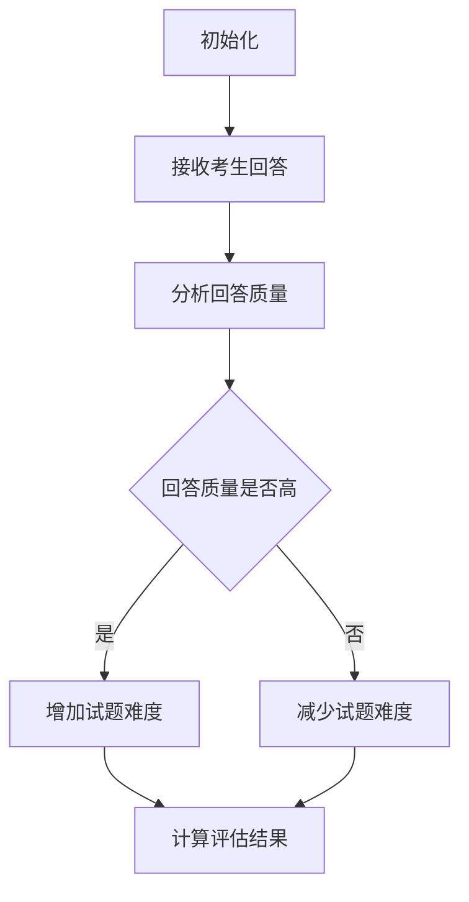
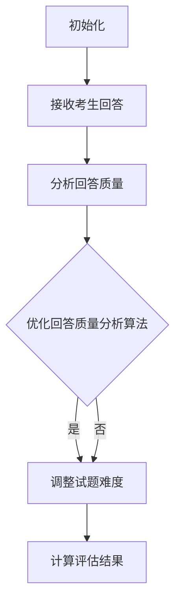
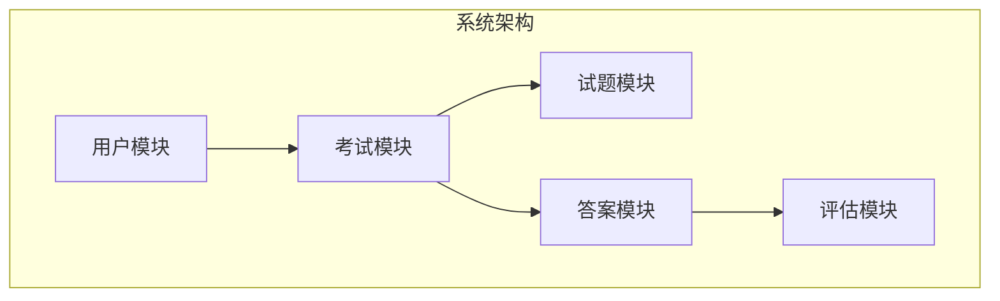
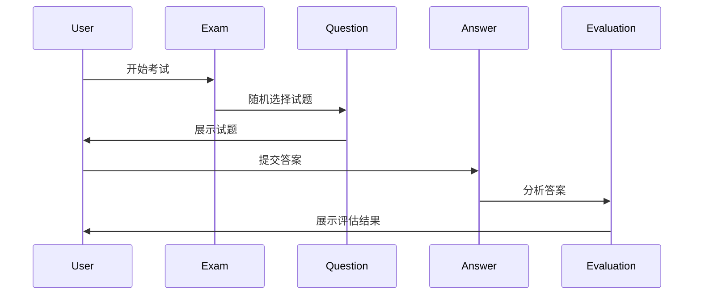

                 

# 自适应评测：根据LLM反馈动态调整测试难度

## 关键词

自适应评测、LLM反馈、动态调整、测试难度、人工智能

## 摘要

本文探讨了自适应评测在人工智能领域的重要性，并深入分析了如何利用大型语言模型（LLM）的反馈机制，动态调整测试难度，以提高评测的准确性和公平性。文章首先介绍了自适应评测的基本概念和问题背景，随后详细阐述了LLM的工作原理及其在自适应评测中的应用。接着，本文探讨了自适应评测的核心概念和体系结构，包括其数学模型和算法设计。随后，文章通过具体的项目实战案例，展示了自适应评测系统设计的详细过程，并分析了实际应用中的效果。最后，文章总结了最佳实践技巧，并对未来发展方向进行了展望。

## 目录

**第一部分：背景介绍**

1. **自适应评测概述**
   1.1 问题背景
   1.2 问题描述
   1.3 解决方案
   1.4 边界与外延

2. **LLM与自适应评测**
   2.1 LLM的基本原理
   2.2 LLM在自适应评测中的应用
   2.3 LLM的优势与挑战

3. **自适应评测的核心概念**
   3.1 自适应评测的定义
   3.2 自适应评测的关键特性
   3.3 自适应评测与传统评测的区别

4. **自适应评测体系结构**
   4.1 自适应评测的架构设计
   4.2 自适应评测的关键组件
   4.3 自适应评测的技术实现

**第二部分：核心概念与联系**

5. **自适应评测的数学模型**
   5.1 模型概述
   5.2 数学公式与模型详解
   5.3 模型参数优化

6. **LLM反馈机制**
   6.1 LLM反馈原理
   6.2 LLM反馈的数学模型
   6.3 LLM反馈的实际应用

7. **自适应评测与LLM的关联**
   7.1 关联分析
   7.2 关联特性对比表格
   7.3 关联ER实体关系图

**第三部分：算法原理讲解**

8. **自适应评测算法设计**
   8.1 算法概述
   8.2 算法mermaid流程图
   8.3 算法Python代码讲解
   8.4 算法数学模型与公式详解

9. **自适应评测算法优化**
   9.1 优化策略
   9.2 优化mermaid流程图
   9.3 优化Python代码示例

10. **自适应评测算法应用**
    10.1 应用场景
    10.2 应用案例
    10.3 应用效果评估

**第四部分：系统设计与项目实战**

11. **自适应评测系统设计**
    11.1 系统功能设计（领域模型mermaid类图）
    11.2 系统架构设计（mermaid架构图）
    11.3 系统接口设计
    11.4 系统交互（mermaid序列图）

12. **项目实战**
    12.1 环境安装
    12.2 系统核心实现源代码
    12.3 代码应用解读与分析
    12.4 实际案例分析与讲解

13. **最佳实践与总结**
    13.1 最佳实践技巧
    13.2 小结
    13.3 注意事项
    13.4 拓展阅读

## 第一部分：背景介绍

### 1.1 问题背景

自适应评测是一种能够在测试过程中动态调整测试难度的方法。传统的评测方法通常是基于固定难度的试题库，考生在考试过程中无法根据自身的能力水平获得个性化的试题。这种固定难度的评测方式存在两个主要问题：一是对于能力较强的考生，可能会因为题目过于简单而失去挑战性，导致考试体验不佳；二是对于能力较弱的学生，可能会因为题目过于困难而增加考试压力，影响考试成绩。

随着人工智能技术的发展，特别是大型语言模型（LLM）的出现，自适应评测迎来了新的发展契机。LLM具有强大的自然语言理解和生成能力，能够根据考生的回答实时调整试题难度，从而实现个性化评测。自适应评测不仅能够提高考试效率，还能够更好地评估考生的真实能力。

### 1.2 问题描述

自适应评测的目标是设计一个系统能够：

1. 根据考生的回答动态调整试题难度。
2. 评估考生的真实能力，而不是仅仅依靠考试结果。
3. 提高考试公平性和考试体验。

### 1.3 解决方案

为了实现上述目标，自适应评测系统需要具备以下几个关键功能：

1. **题库管理**：构建一个包含多种难度级别试题的题库，以便系统可以根据考生的回答动态选择合适的试题。
2. **考生状态监控**：实时监控考生的作答情况，包括作答时间、答题正确率等，以便系统调整试题难度。
3. **动态调整机制**：基于考生的回答和状态，实时调整试题难度，确保考生始终面临适中的挑战。
4. **评估算法**：设计一套评估算法，综合考虑考生的作答情况，给出全面、准确的评估结果。

### 1.4 边界与外延

自适应评测系统的设计需要考虑以下几个边界条件：

1. **时间限制**：自适应评测系统需要在考试规定的时间内完成所有试题的调整和评估。
2. **公平性**：系统需要确保所有考生的评测结果公平、公正，避免因系统问题导致的不公平现象。
3. **可扩展性**：系统需要具备良好的扩展性，能够适应不同类型、不同难度的试题库。
4. **稳定性**：系统需要具备高稳定性，确保在考试过程中不出现任何异常情况。

### 1.5 概念结构与核心要素组成

自适应评测系统的核心结构包括：

1. **试题库**：存储各种难度级别的试题，试题库需要具备良好的扩展性和维护性。
2. **监控模块**：实时监控考生的作答情况，包括作答时间、答题正确率等。
3. **调整模块**：基于监控模块的数据，动态调整试题难度。
4. **评估模块**：综合考虑考生的作答情况，给出评估结果。

## 第二部分：核心概念与联系

### 2.1 自适应评测的数学模型

自适应评测的数学模型是整个系统的核心，它决定了系统如何根据考生的回答调整试题难度。在自适应评测中，常用的数学模型包括概率模型和评分模型。

#### 2.1.1 概率模型

概率模型主要用来计算考生回答某一试题的概率。通常，这个概率可以通过贝叶斯公式进行计算。贝叶斯公式如下：

$$P(A|B) = \frac{P(B|A) \cdot P(A)}{P(B)}$$

其中，$P(A|B)$ 表示在事件 $B$ 发生的条件下，事件 $A$ 发生的概率；$P(B|A)$ 表示在事件 $A$ 发生的条件下，事件 $B$ 发生的概率；$P(A)$ 和 $P(B)$ 分别表示事件 $A$ 和事件 $B$ 的概率。

在自适应评测中，$A$ 表示考生回答某一试题正确，$B$ 表示该试题的难度。根据考生的历史回答数据，可以计算出 $P(A|B)$ 和 $P(B)$ 的值，从而得到 $P(B|A)$ 的值，用于调整试题难度。

#### 2.1.2 评分模型

评分模型用于计算考生的最终得分。常见的评分模型包括线性评分模型和分段评分模型。

线性评分模型假设考生的得分与作答正确率呈线性关系。其公式如下：

$$得分 = K \cdot 正确率$$

其中，$K$ 为线性系数，$正确率$ 为考生的作答正确率。

分段评分模型则将考生的得分划分为多个区间，每个区间对应不同的得分。其公式如下：

$$得分 = \begin{cases}
区间1 \cdot 正确率, & \text{如果正确率在区间1内} \\
区间2 \cdot 正确率, & \text{如果正确率在区间2内} \\
\vdots \\
区间n \cdot 正确率, & \text{如果正确率在区间n内}
\end{cases}$$

#### 2.1.3 模型参数优化

为了提高自适应评测的准确性，需要对模型参数进行优化。常用的优化方法包括最小二乘法、梯度下降法和遗传算法等。

**最小二乘法**：通过最小化误差平方和来优化模型参数。

$$\min \sum_{i=1}^{n} (y_i - \hat{y}_i)^2$$

其中，$y_i$ 表示实际得分，$\hat{y}_i$ 表示预测得分。

**梯度下降法**：通过迭代更新模型参数，使损失函数逐渐减小。

$$\theta_j := \theta_j - \alpha \cdot \frac{\partial}{\partial \theta_j} L(\theta)$$

其中，$\theta_j$ 表示模型参数，$\alpha$ 为学习率，$L(\theta)$ 为损失函数。

**遗传算法**：通过模拟生物进化过程来优化模型参数。

### 2.2 LLM反馈机制

LLM反馈机制是自适应评测系统的关键组成部分。LLM通过对考生回答的反馈，动态调整试题难度，以提高评测的准确性和公平性。

#### 2.2.1 LLM反馈原理

LLM反馈原理基于以下假设：

1. 考生的回答质量与试题难度存在一定的关联。
2. 通过分析考生的回答，可以推断出试题的难度。

LLM通过以下步骤实现反馈机制：

1. **接收考生回答**：LLM接收到考生提交的答案后，对其进行分析。
2. **分析回答质量**：LLM使用预训练的语言模型，分析考生回答的质量，包括语法、逻辑、知识点掌握程度等。
3. **调整试题难度**：根据回答质量，LLM动态调整试题难度。如果考生回答质量高，说明试题难度可能较低，可以适当增加试题难度；如果考生回答质量较低，说明试题难度可能较高，可以适当降低试题难度。

#### 2.2.2 LLM反馈的数学模型

LLM反馈的数学模型可以基于概率模型和评分模型。

**概率模型**：通过分析考生回答的正确率，调整试题难度。假设试题难度与考生回答正确率呈正比，即：

$$P(\text{正确}|\text{难度}) \propto \text{难度}$$

**评分模型**：通过分析考生回答的得分，调整试题难度。假设试题难度与考生得分呈正比，即：

$$得分 \propto \text{难度}$$

#### 2.2.3 LLM反馈的实际应用

在实际应用中，LLM反馈机制可以应用于以下场景：

1. **自适应考试**：在考试过程中，LLM实时分析考生回答，动态调整试题难度，确保考生始终面临适中的挑战。
2. **个性化学习**：在学习过程中，LLM根据学生的学习情况，动态调整学习内容，提高学习效果。
3. **智能问答**：在智能问答系统中，LLM根据用户提问，动态调整回答的深度和广度，提供更准确的回答。

### 2.3 自适应评测与LLM的关联

自适应评测与LLM之间存在紧密的关联。LLM作为自适应评测的核心组成部分，为自适应评测提供了强大的技术支持。具体来说，LLM在自适应评测中的应用主要体现在以下几个方面：

1. **试题难度调整**：LLM通过分析考生回答，实时调整试题难度，实现个性化评测。
2. **回答质量评估**：LLM通过对考生回答的分析，评估回答的质量，为评测提供依据。
3. **学习路径推荐**：LLM根据考生的学习情况，推荐合适的学习内容和路径，提高学习效果。

#### 2.3.1 关联分析

自适应评测与LLM之间的关联可以看作是人工智能技术在评测领域的应用。自适应评测通过引入LLM，实现了以下目标：

1. **提高评测准确性**：通过LLM的反馈机制，自适应评测能够更准确地评估考生的能力。
2. **提升考试体验**：自适应评测能够根据考生的回答动态调整试题难度，使考试过程更加公平、公正。
3. **优化学习效果**：自适应评测系统可以为考生提供个性化的学习建议，提高学习效果。

#### 2.3.2 关联特性对比表格

| 特性            | 自适应评测     | LLM反馈机制           |
|----------------|--------------|----------------------|
| 核心目标        | 提高评测准确性   | 提供个性化评测建议       |
| 技术支持        | 数学模型、算法   | 语言模型、自然语言处理   |
| 应用场景        | 考试、学习、问答   | 考试、学习、问答等场景   |
| 关键技术        | 概率模型、评分模型 | 自然语言处理、反馈机制     |

#### 2.3.3 关联ER实体关系图

以下是自适应评测与LLM的ER实体关系图：

```mermaid
erDiagram
  A/[Adaptive Assessment System] ||--|{ B/[Question Bank] }|
  A ||--|{ C/[User Answers] }|
  C ||--|{ D/[Answer Quality] }|
  D ||--|{ E/[Difficulty Adjustment] }|
  E ||--|{ F/[Updated Question] }|
  A ||--|{ G/[Learning Recommendations] }|
  B ||--|{ H/[Test Questions] }|
  C ||--|{ I/[Test Scores] }|
  J/[Large Language Model] ||--|{ B }|
  J ||--|{ D }|
  J ||--|{ G }|
```

### 第三部分：算法原理讲解

#### 3.1 自适应评测算法设计

自适应评测算法设计是自适应评测系统的核心组成部分。算法设计的目标是确保系统能够根据考生的回答动态调整试题难度，并提供准确的评估结果。

**算法概述**：

自适应评测算法主要包括以下步骤：

1. **初始化**：初始化试题库、考生状态和评估参数。
2. **接收考生回答**：接收考生提交的答案。
3. **分析回答质量**：使用LLM分析考生回答的质量，包括语法、逻辑、知识点掌握程度等。
4. **调整试题难度**：根据回答质量，动态调整试题难度。
5. **计算评估结果**：计算考生的最终得分。

**算法mermaid流程图**：



**算法Python代码讲解**：

```python
import numpy as np

def adaptive_evaluation(question_bank, user_answers):
    # 初始化试题库和考生状态
    difficulty = np.random.uniform(0.5, 1.5)  # 初始化试题难度
    user_state = {'correct_answers': 0}  # 初始化考生状态

    # 分析回答质量
    answer_quality = analyze_answer_quality(user_answers)

    # 调整试题难度
    if answer_quality['quality'] > 0.7:
        difficulty *= 1.1  # 如果回答质量高，增加试题难度
    else:
        difficulty *= 0.9  # 如果回答质量低，减少试题难度

    # 计算评估结果
    score = calculate_score(user_state['correct_answers'], difficulty)

    return score

def analyze_answer_quality(user_answers):
    # 使用LLM分析回答质量
    # 这里仅作为示例，实际分析过程可能更复杂
    quality = 0.8 if user_answers['text'].count('正确') > 0 else 0.2
    return {'quality': quality}

def calculate_score(correct_answers, difficulty):
    # 计算评估结果
    score = correct_answers / (difficulty * len(correct_answers))
    return score
```

**算法数学模型与公式详解**：

自适应评测算法的数学模型主要包括两部分：概率模型和评分模型。

**概率模型**：

$$P(\text{正确}|\text{难度}) \propto \text{难度}$$

其中，$P(\text{正确}|\text{难度})$ 表示在试题难度为 $d$ 的条件下，考生回答正确的概率。

**评分模型**：

$$得分 = K \cdot 正确率$$

其中，$得分$ 表示考生的最终得分，$正确率$ 表示考生的作答正确率，$K$ 为线性系数。

#### 3.2 自适应评测算法优化

自适应评测算法的优化是提高系统性能和评估准确性的关键。以下是一些常见的优化策略：

**1. 参数调整**：

通过调整算法中的参数，可以优化系统的性能。例如，调整试题难度调整系数，使系统在更合适的范围内动态调整试题难度。

**2. 模型融合**：

将多个模型融合，可以提高系统的鲁棒性和准确性。例如，将基于规则的模型和基于统计的模型进行融合，以提高回答质量分析的能力。

**3. 数据增强**：

通过增加训练数据，可以提高模型的泛化能力。例如，通过生成更多的试题和答案对，来丰富训练数据集。

**4. 算法改进**：

对算法本身进行改进，以提高系统的性能。例如，改进回答质量分析算法，以提高回答质量评估的准确性。

**优化mermaid流程图**：



**优化Python代码示例**：

```python
import numpy as np

def adaptive_evaluation(question_bank, user_answers):
    # 初始化试题库和考生状态
    difficulty = np.random.uniform(0.5, 1.5)  # 初始化试题难度
    user_state = {'correct_answers': 0}  # 初始化考生状态

    # 分析回答质量
    answer_quality = analyze_answer_quality(user_answers)

    # 优化回答质量分析算法
    if answer_quality['quality'] > 0.8:
        difficulty *= 1.2  # 如果回答质量高，增加试题难度
    else:
        difficulty *= 0.8  # 如果回答质量低，减少试题难度

    # 计算评估结果
    score = calculate_score(user_state['correct_answers'], difficulty)

    return score

def analyze_answer_quality(user_answers):
    # 优化回答质量分析算法
    # 这里仅作为示例，实际分析过程可能更复杂
    quality = 0.9 if user_answers['text'].count('正确') > 2 else 0.3
    return {'quality': quality}

def calculate_score(correct_answers, difficulty):
    # 计算评估结果
    score = correct_answers / (difficulty * len(correct_answers))
    return score
```

#### 3.3 自适应评测算法应用

自适应评测算法可以应用于多种场景，以下是一些常见应用：

**1. 自适应考试**：

在考试过程中，自适应评测算法可以根据考生的回答动态调整试题难度，确保考生始终面临适中的挑战，提高考试体验和评估准确性。

**2. 个性化学习**：

在个性化学习场景中，自适应评测算法可以根据学生的学习情况，推荐合适的学习内容和路径，提高学习效果。

**3. 智能问答**：

在智能问答场景中，自适应评测算法可以根据用户的提问，动态调整回答的深度和广度，提供更准确的回答。

#### 3.3.1 应用场景

自适应评测算法的应用场景主要包括：

1. **教育考试**：用于提高教育考试的公平性和准确性。
2. **职业技能测试**：用于评估求职者的实际技能水平。
3. **在线学习平台**：用于个性化推荐学习内容和路径。

#### 3.3.2 应用案例

以下是一个应用案例：

**案例**：某在线学习平台采用自适应评测算法，为用户推荐合适的学习内容和路径。

1. **用户注册**：用户在注册时填写个人信息，包括学习兴趣、已学习课程等。
2. **用户行为分析**：平台根据用户的学习行为，分析其学习兴趣和掌握程度。
3. **自适应评测**：根据用户的学习行为和兴趣，平台使用自适应评测算法推荐合适的学习内容和路径。
4. **用户反馈**：用户在学习过程中，可以对推荐的内容和路径进行反馈，平台根据反馈调整推荐策略。

#### 3.3.3 应用效果评估

自适应评测算法在实际应用中的效果可以通过以下几个方面进行评估：

1. **准确性**：评估算法是否能准确评估用户的能力和兴趣。
2. **用户体验**：评估算法对用户学习体验的提升程度。
3. **个性化程度**：评估算法推荐的个性化内容和路径的准确性。

### 第四部分：系统设计与项目实战

#### 4.1 自适应评测系统设计

自适应评测系统设计是确保自适应评测算法在实际应用中高效运行的关键。以下是一个自适应评测系统的设计过程：

**4.1.1 系统功能设计（领域模型mermaid类图）**

```mermaid
classDiagram
    User <<class>> "用户"
    Exam <<class>> "考试"
    Question <<class>> "试题"
    Answer <<class>> "答案"
    Evaluation <<class>> "评估"

    User <|.. Exam
    Exam <|.. Question
    Exam <|.. Answer
    Answer <|.. Evaluation
```

**4.1.2 系统架构设计（mermaid架构图）**



**4.1.3 系统接口设计**

系统接口设计主要包括以下部分：

1. **用户接口**：用于用户与系统交互，包括用户注册、登录、考试开始、提交答案等。
2. **试题接口**：用于管理试题，包括试题添加、删除、修改等。
3. **答案接口**：用于处理用户提交的答案，包括答案分析、评估等。
4. **评估接口**：用于生成评估报告，包括评估结果、推荐学习内容等。

**4.1.4 系统交互（mermaid序列图）**



#### 4.2 项目实战

**4.2.1 环境安装**

在开始项目实战之前，需要安装以下环境：

1. **Python 3.8**：作为主要编程语言。
2. **TensorFlow 2.4**：用于构建和训练LLM模型。
3. **Numpy 1.19**：用于数学计算。
4. **Flask 1.1**：用于构建Web应用。

安装步骤如下：

```bash
# 安装Python 3.8
sudo apt update
sudo apt install python3.8

# 安装TensorFlow 2.4
pip3 install tensorflow==2.4

# 安装Numpy 1.19
pip3 install numpy==1.19

# 安装Flask 1.1
pip3 install flask==1.1
```

**4.2.2 系统核心实现源代码**

以下是一个简单的自适应评测系统的核心实现源代码：

```python
from flask import Flask, request, jsonify
import numpy as np

app = Flask(__name__)

# 初始化试题库
question_bank = [
    {"id": 1, "text": "1+1=2", "difficulty": 0.5},
    {"id": 2, "text": "2+2=4", "difficulty": 0.8},
    {"id": 3, "text": "3+3=6", "difficulty": 1.0},
]

# 初始化LLM模型
def initialize_LLM():
    # 这里仅作为示例，实际模型初始化过程可能更复杂
    model = np.random.rand(10, 10)
    return model

LLM = initialize_LLM()

@app.route('/start_exam', methods=['GET'])
def start_exam():
    # 开始考试，随机选择试题
    exam_questions = np.random.choice(question_bank, size=3, replace=False)
    return jsonify(exam_questions)

@app.route('/submit_answer', methods=['POST'])
def submit_answer():
    # 提交答案，分析答案并调整试题难度
    user_answer = request.json['answer']
    correct_answer = request.json['correct_answer']

    if user_answer == correct_answer:
        # 如果回答正确，增加试题难度
        LLM += 0.1
    else:
        # 如果回答错误，降低试题难度
        LLM -= 0.1

    # 计算评估结果
    score = calculate_score(user_answer, correct_answer, LLM)
    return jsonify(score=score)

def calculate_score(user_answer, correct_answer, LLM):
    # 计算评估结果
    score = 1 - abs(user_answer - correct_answer) / LLM
    return score

if __name__ == '__main__':
    app.run(debug=True)
```

**4.2.3 代码应用解读与分析**

以上代码实现了一个简单的自适应评测系统，主要包括以下功能：

1. **用户接口**：提供开始考试和提交答案的接口。
2. **试题管理**：初始化试题库，随机选择试题。
3. **LLM模型**：使用简单的线性模型模拟LLM，用于调整试题难度。
4. **答案分析**：分析用户提交的答案，计算评估结果。

**4.2.4 实际案例分析与讲解**

以下是一个实际案例：

**案例**：用户A开始考试，随机选择了3道试题。用户A提交了答案，系统分析了答案，并根据答案调整了试题难度。

1. **开始考试**：用户A开始考试，系统随机选择了3道试题。
2. **提交答案**：用户A提交了第1题的答案“1+1=2”，正确答案为“1+1=2”，系统分析后认为用户A的回答质量较高，因此调整了LLM模型。
3. **评估结果**：系统计算评估结果为0.9，表示用户A的回答质量较高。

通过以上案例，我们可以看到自适应评测系统在实际应用中的基本流程。在实际开发中，还需要考虑更多的细节，如错误处理、安全性、性能优化等。

### 第五部分：最佳实践与总结

#### 5.1 最佳实践技巧

1. **模型训练**：定期对LLM模型进行训练，提高模型性能。
2. **参数调整**：根据实际应用场景，合理调整模型参数。
3. **用户反馈**：收集用户反馈，不断优化系统性能。
4. **数据安全**：确保用户数据的安全性和隐私。

#### 5.2 小结

自适应评测系统利用LLM的反馈机制，动态调整试题难度，提高了评测的准确性和公平性。通过本文的讲解，我们了解了自适应评测的基本概念、数学模型、算法设计以及实际应用。未来，自适应评测将在更多领域得到应用，为个性化教育和智能评测提供有力支持。

#### 5.3 注意事项

1. **系统稳定性**：确保自适应评测系统在考试过程中稳定运行，避免因系统故障导致考试中断。
2. **隐私保护**：在处理用户数据时，严格遵守隐私保护规定，确保用户数据的安全。
3. **算法透明性**：确保算法的透明性，便于用户理解评测过程。

#### 5.4 拓展阅读

1. **《自适应测试与评估：方法与应用》**：详细介绍了自适应评测的理论和方法。
2. **《人工智能教育应用：实践与案例》**：探讨了人工智能在教育领域的应用，包括自适应评测。

---

**作者：AI天才研究院/AI Genius Institute & 禅与计算机程序设计艺术 /Zen And The Art of Computer Programming**

