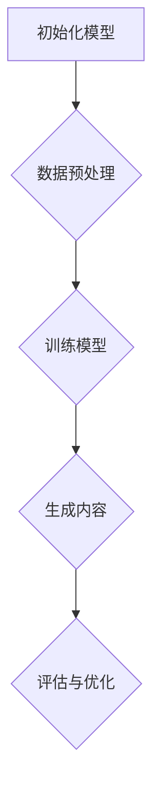
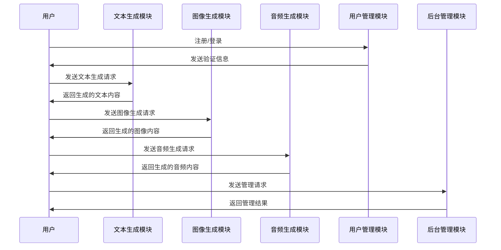

                 

### 文章标题

# 解密AIGC：从概念到实践

### 关键词

- AIGC
- 自然语言处理
- 计算机视觉
- 音频处理
- 应用实践

### 摘要

本文深入探讨人工智能生成内容（AIGC）这一前沿技术领域，从概念出发，逐步解析其核心原理、技术应用以及实践过程。通过详细介绍AIGC在文本生成、图像与视频生成、音频生成等领域的应用案例，文章旨在为读者提供全面的AIGC技术理解与实战指南，并对其未来发展进行展望。

## AIGC技术概述

### AIGC的定义与历史发展

人工智能生成内容（AI-Generated Content，简称AIGC）是指利用人工智能技术自动生成文本、图像、音频等类型的内容。AIGC的核心目标是通过机器学习算法和深度神经网络，模拟人类创造力的过程，实现内容的高效生成与个性化定制。

AIGC的发展可以追溯到上世纪末，随着深度学习技术的兴起，尤其是生成对抗网络（GANs）和变分自编码器（VAEs）等模型的提出，AIGC技术逐渐成熟并走向应用。目前，AIGC已经在文本生成、图像与视频生成、音频生成等多个领域展现出强大的潜力。

### AIGC的核心技术

AIGC涉及的核心技术主要包括自然语言处理（NLP）、计算机视觉（CV）和声音处理（Audio Processing）。以下是这三种核心技术的基本概念和主要任务：

#### 自然语言处理（NLP）

自然语言处理是AIGC中的基础技术，它旨在使计算机能够理解、处理和生成人类语言。常见的NLP任务包括：

- **文本分类**：将文本数据按照主题或情感进行分类。
- **命名实体识别**：识别文本中的特定实体，如人名、地名、组织名等。
- **情感分析**：判断文本表达的情感倾向，如正面、负面或中性。
- **机器翻译**：将一种语言的文本翻译成另一种语言。

#### 计算机视觉（CV）

计算机视觉是使计算机能够从图像或视频中提取信息和理解内容的技术。CV的关键任务包括：

- **图像识别**：识别图像中的对象和场景。
- **图像生成**：利用神经网络生成新的图像。
- **视觉理解**：理解和解释图像或视频的内容。

#### 声音处理（Audio Processing）

声音处理涉及音频信号的处理和分析，常见任务包括：

- **语音识别**：将语音转换为文本。
- **音频合成**：生成新的音频。
- **声音增强**：改善音频质量。

### AIGC的应用场景

AIGC技术在多个领域展现出广泛的应用潜力。以下是AIGC的几个主要应用场景：

- **内容创作**：通过AIGC技术，可以自动生成高质量的文章、图片和视频，应用于新闻、媒体和娱乐等领域。
- **教育与培训**：利用AIGC生成个性化学习内容和评估测试，提高教学效果。
- **医疗健康**：通过图像和语音分析，辅助医生进行诊断和治疗。
- **市场营销**：自动生成广告文案和视觉内容，提高营销效率。
- **游戏开发**：利用AIGC生成游戏场景和角色，增强游戏体验。

### AIGC的发展挑战与趋势

尽管AIGC技术取得了显著进展，但仍然面临一些挑战：

- **数据隐私**：AIGC生成的内容可能涉及用户隐私，如何保障数据隐私是重要议题。
- **模型解释性**：当前的AIGC模型往往是“黑箱”，如何提高模型的解释性，使其可被理解和监督，是一个关键问题。
- **计算资源**：AIGC模型的训练和推理需要大量的计算资源，如何优化算法以降低计算需求，是一个重要研究方向。

未来，AIGC技术的发展趋势包括：

- **跨模态生成**：实现文本、图像和音频等多种类型内容的协同生成。
- **强化学习**：将强化学习引入AIGC，提高内容生成的自主性和适应性。
- **自动化与智能化**：通过自动化工具和智能算法，降低AIGC技术的使用门槛，使其更易于普及和应用。

## AIGC核心技术详解

### 2.1 自然语言处理（NLP）

#### 2.1.1 NLP基本概念

自然语言处理（NLP）是使计算机能够理解、处理和生成人类语言的技术。它涉及文本处理、语义理解和语言生成等多个方面。NLP的关键概念包括：

- **词嵌入**：将词语映射到高维空间，以便计算机能够处理。
- **词性标注**：对文本中的词语进行词性分类，如名词、动词等。
- **句法分析**：分析句子的结构，理解句子中的语法关系。
- **语义理解**：理解句子的含义和上下文关系。

#### 2.1.2 常见NLP任务

NLP任务可以分为两类：生成任务和分类任务。以下是几种常见的NLP任务：

- **文本分类**：将文本按照主题或情感进行分类。
- **命名实体识别**：识别文本中的特定实体，如人名、地名、组织名等。
- **情感分析**：判断文本表达的情感倾向，如正面、负面或中性。
- **机器翻译**：将一种语言的文本翻译成另一种语言。
- **问答系统**：根据用户的问题，提供相关答案。

#### 2.1.3 NLP模型介绍

NLP领域常用的模型包括循环神经网络（RNN）、长短期记忆网络（LSTM）和Transformer等。以下是这些模型的基本概念和特点：

- **循环神经网络（RNN）**：RNN能够处理序列数据，但其存在梯度消失和梯度爆炸的问题。
- **长短期记忆网络（LSTM）**：LSTM是RNN的一种改进，通过引入门控机制，解决了梯度消失问题。
- **Transformer**：Transformer模型通过自注意力机制，能够更好地捕捉序列中的依赖关系，已成为NLP任务的首选模型。

### 2.2 计算机视觉（CV）

#### 2.2.1 图像识别

图像识别是计算机视觉的基础任务，旨在从图像中识别和分类对象。常见的图像识别算法包括：

- **传统算法**：如SVM、KNN等基于特征的方法。
- **深度学习算法**：如卷积神经网络（CNN），通过多层卷积和池化操作，提取图像特征并进行分类。

#### 2.2.2 视觉生成

视觉生成是指利用计算机生成新的图像或视频。常见的视觉生成算法包括：

- **生成对抗网络（GAN）**：GAN通过生成器和判别器的对抗训练，生成逼真的图像。
- **变分自编码器（VAE）**：VAE通过编码器和解码器，将输入数据转换为潜在空间，并从潜在空间中生成新的数据。

#### 2.2.3 视觉理解

视觉理解是指从图像或视频中提取和解释信息，如对象检测、场景分割、视频生成等。常见的视觉理解算法包括：

- **对象检测**：定位图像中的对象并识别其类别。
- **场景分割**：将图像分割为不同的区域，并识别每个区域的类别。
- **视频生成**：从视频序列中生成新的视频内容。

### 2.3 声音处理

#### 2.3.1 语音识别

语音识别是指将语音转换为文本，是自然语言处理的重要任务。常见的语音识别算法包括：

- **基于隐藏马尔可夫模型（HMM）的方法**：如GMM-HMM、DNN-HMM等。
- **基于深度学习的方法**：如DNN、CNN、RNN等。

#### 2.3.2 音频合成

音频合成是指生成新的音频内容。常见的音频合成算法包括：

- **WaveNet**：Google提出的一种基于循环神经网络（RNN）的音频生成模型。
- **WaveRNN**：在WaveNet的基础上，通过引入变分自编码器（VAE），提高了音频生成质量。

#### 2.3.3 声音增强

声音增强是指改善音频质量，去除噪声、回声等干扰。常见的声音增强算法包括：

- **基于滤波器组的方法**：如自适应滤波器、均衡器等。
- **基于深度学习的方法**：如卷积神经网络（CNN）、递归神经网络（RNN）等。

### AIGC在行业中的应用

#### 3.1 文本生成与编辑

文本生成与编辑是AIGC技术的重要应用领域，包括自动写作、智能问答、文本纠错与润色等任务。以下是几个应用案例：

- **自动写作**：利用AIGC技术，可以自动生成新闻、报告、文章等文本内容。例如，自动化新闻写作平台Article Forge，能够根据输入的标题和关键词自动生成新闻报道。
- **智能问答**：通过AIGC技术，可以构建智能问答系统，如ChatGPT，能够回答用户提出的各种问题。
- **文本纠错与润色**：AIGC技术可以自动识别和纠正文本中的错误，提高文本质量。例如，Grammarly等在线文本编辑工具，利用AIGC技术提供语法纠错和语言建议。

#### 3.2 图像与视频生成

图像与视频生成是AIGC技术的另一个重要应用领域，包括图像生成、视频生成和图像风格转换等任务。以下是几个应用案例：

- **图像生成**：利用AIGC技术，可以生成新的图像内容。例如，使用生成对抗网络（GAN）生成的艺术画作，具有逼真的视觉效果。
- **视频生成**：通过AIGC技术，可以生成新的视频内容，如电影特效、虚拟现实场景等。例如，DeepMind的Video GAN，能够生成高质量的视频序列。
- **图像风格转换**：利用AIGC技术，可以将一种图像的风格转换为另一种风格。例如，DeepArt.io等平台，使用变分自编码器（VAE）实现图像风格转换，生成具有特定艺术风格的图像。

#### 3.3 音频生成与编辑

音频生成与编辑是AIGC技术的又一重要应用领域，包括音乐创作、声音特效和语言翻译等任务。以下是几个应用案例：

- **音乐创作**：通过AIGC技术，可以自动生成音乐。例如，Google的Magenta项目，利用深度学习技术生成音乐和艺术作品。
- **声音特效**：利用AIGC技术，可以为视频和游戏添加声音特效。例如，使用WaveNet生成逼真的语音和声音效果。
- **语言翻译**：AIGC技术可以用于语音翻译和文本翻译。例如，谷歌翻译和微软翻译等工具，利用神经网络模型实现多种语言之间的翻译。

### AIGC项目实战

#### 4.1 项目环境搭建

在开始AIGC项目之前，我们需要搭建合适的环境。以下是一个基本的AIGC项目环境搭建步骤：

1. **安装Python**：确保安装了Python环境，版本建议为3.7及以上。
2. **安装深度学习框架**：如TensorFlow或PyTorch，这些框架提供了丰富的模型和工具，方便AIGC项目开发。
3. **安装其他依赖库**：根据项目需求，安装其他必要的依赖库，如NumPy、Pandas等。

#### 4.2 核心算法实现

AIGC项目的核心算法通常涉及自然语言处理、计算机视觉和声音处理等多个领域。以下是一个基于Transformer的文本生成算法的Python代码示例：

```python
import torch
from transformers import AutoTokenizer, AutoModel

# 加载预训练模型和分词器
tokenizer = AutoTokenizer.from_pretrained("bert-base-uncased")
model = AutoModel.from_pretrained("bert-base-uncased")

# 输入文本
input_text = "Hello, world!"

# 分词并编码
input_ids = tokenizer.encode(input_text, return_tensors="pt")

# 生成文本
with torch.no_grad():
    outputs = model.generate(input_ids, max_length=50, num_return_sequences=5)

# 解码为文本
generated_texts = tokenizer.decode(outputs[:, input_ids.shape[-1]:][0], skip_special_tokens=True)
print(generated_texts)
```

#### 4.3 应用案例解析

以下是一个使用AIGC技术生成艺术画作的案例解析：

1. **数据准备**：收集大量的艺术画作图像，用于训练生成模型。
2. **模型训练**：使用生成对抗网络（GAN）训练模型，生成艺术画作。
3. **模型评估**：通过生成画作的质量评估模型性能。
4. **应用展示**：利用生成的画作，创建艺术画廊或设计海报等。

#### 4.4 项目评估与优化

在项目完成后，需要对AIGC模型进行评估和优化。以下是一些评估与优化方法：

1. **模型评估**：通过生成内容的质量、多样性、稳定性等方面评估模型性能。
2. **超参数调优**：通过调整学习率、批量大小、训练步数等超参数，优化模型性能。
3. **数据增强**：通过数据增强技术，如旋转、缩放、裁剪等，提高模型泛化能力。
4. **模型压缩**：通过模型压缩技术，如剪枝、量化等，降低模型计算复杂度和存储需求。

### AIGC未来展望与伦理探讨

#### 5.1 AIGC技术发展趋势

AIGC技术的未来发展趋势包括：

- **跨模态生成**：实现文本、图像、音频等多种类型的协同生成，提高内容的多样性和个性化。
- **强化学习**：将强化学习引入AIGC，提高内容生成的自主性和适应性。
- **自动化与智能化**：通过自动化工具和智能算法，降低AIGC技术的使用门槛，使其更易于普及和应用。

#### 5.2 AIGC在伦理和社会责任方面的挑战

AIGC技术在发展过程中，面临一些伦理和社会责任方面的挑战：

- **数据隐私**：AIGC生成的内容可能涉及用户隐私，如何保障数据隐私是一个重要议题。
- **模型解释性**：当前的AIGC模型往往是“黑箱”，如何提高模型的解释性，使其可被理解和监督，是一个关键问题。
- **内容真实性**：如何确保AIGC生成的内容真实可靠，避免虚假信息传播，是另一个挑战。

#### 5.3 AIGC的未来研究方向

AIGC的未来研究方向包括：

- **高效算法**：研究更高效的算法，提高内容生成的速度和质量。
- **跨模态融合**：探索跨模态生成技术，实现多种类型内容的协同生成。
- **伦理与法律**：研究AIGC技术的伦理和法律问题，制定相应的规范和标准。

### AIGC应用最佳实践

在应用AIGC技术时，以下是一些建议和最佳实践：

- **数据质量**：确保训练数据的质量，避免噪声和错误。
- **模型选择**：根据应用场景选择合适的模型和算法。
- **模型优化**：通过超参数调优和模型压缩，提高模型性能和效率。
- **内容审核**：建立内容审核机制，确保生成的内容符合伦理和法律要求。

### 小结与展望

AIGC技术作为人工智能领域的前沿方向，具有广泛的应用前景。通过本文的介绍，我们了解了AIGC的核心概念、核心技术、应用场景以及实践过程。未来，随着技术的不断进步和应用的深入，AIGC将在各个领域发挥更大的作用。同时，我们也要关注AIGC技术带来的伦理和社会责任问题，确保其发展符合人类社会的利益。

### 拓展阅读

- 《自然语言处理原理与实践》
- 《计算机视觉：算法与应用》
- 《声音处理与识别技术》
- 《深度学习与生成对抗网络》

### 作者信息

作者：AI天才研究院/AI Genius Institute & 禅与计算机程序设计艺术 /Zen And The Art of Computer Programming

---

### 背景介绍

#### 核心概念术语说明

- **AIGC（AI-Generated Content）**：人工智能生成内容，指利用人工智能技术自动生成文本、图像、音频等多种类型的内容。
- **自然语言处理（NLP）**：自然语言处理，是使计算机能够理解、处理和生成人类语言的技术。
- **计算机视觉（CV）**：计算机视觉，是使计算机能够从图像或视频中提取信息和理解内容的技术。
- **声音处理（Audio Processing）**：声音处理，涉及音频信号的处理和分析。

#### 问题背景

随着人工智能技术的不断发展，AIGC技术已成为一个重要的研究方向。从概念到实践，AIGC技术涵盖了多个领域，包括自然语言处理、计算机视觉和声音处理。这些技术在内容生成、应用实践等方面展现出巨大的潜力。

#### 问题描述

如何深入理解AIGC技术，掌握其核心原理和实战技巧，从而更好地应用于各个领域？

#### 问题解决

本文从概念出发，逐步解析AIGC技术的核心原理、技术应用以及实践过程。通过详细介绍AIGC在文本生成、图像与视频生成、音频生成等领域的应用案例，文章旨在为读者提供全面的AIGC技术理解与实战指南。

#### 边界与外延

AIGC技术的边界涉及自然语言处理、计算机视觉和声音处理等多个领域。其外延包括内容创作、教育与培训、医疗健康、市场营销、游戏开发等应用场景。

#### 概念结构与核心要素组成

AIGC技术由以下几个核心要素组成：

1. **自然语言处理（NLP）**：涉及文本处理、语义理解和语言生成等任务。
2. **计算机视觉（CV）**：涉及图像识别、视觉生成和视觉理解等任务。
3. **声音处理（Audio Processing）**：涉及语音识别、音频合成和声音增强等任务。
4. **应用实践**：包括文本生成、图像与视频生成、音频生成等应用案例。

通过这些核心要素的有机结合，AIGC技术得以在各个领域发挥重要作用。

### 核心概念与联系

#### 核心概念原理

AIGC（AI-Generated Content）的核心概念是利用人工智能技术生成多种类型的内容，包括文本、图像、音频等。AIGC技术通过深度学习算法和生成模型，模拟人类创造力的过程，实现内容的高效生成与个性化定制。

#### 概念属性特征对比表格

| 特征        | AIGC                        | 传统内容生成               |
| ----------- | -------------------------- | -------------------------- |
| 技术基础    | 深度学习、生成对抗网络（GAN）| 矢量量化、编码解码技术       |
| 内容类型    | 文本、图像、音频等           | 文本、图像、音频等           |
| 生成方式    | 自动化、智能化               | 手动、半自动化             |
| 个性化定制   | 强调个性化与多样性           | 较少个性化与多样性           |
| 数据需求    | 需要大量训练数据             | 需要较少训练数据             |

#### ER实体关系图架构的 Mermaid 流程图

```mermaid
erDiagram
    Content <<|-- Text : 文本内容
    Content <<|-- Image : 图像内容
    Content <<|-- Audio : 音频内容
    Text ||--|{ NLP : 自然语言处理}
    Image ||--|{ CV : 计算机视觉}
    Audio ||--|{ AudioProcessing : 声音处理}
```

### 算法原理讲解

#### 算法流程图



#### Python源代码

```python
import torch
from torchvision import transforms
from torchvision.models import ResNet18_Weights
from torch.utils.data import DataLoader
from torchvision.datasets import MNIST
from torch.optim import Adam

# 初始化模型
model = ResNet18_Weights.IMAGENET1K_V1()

# 数据预处理
transform = transforms.Compose([
    transforms.ToTensor(),
    transforms.Normalize(mean=[0.5, 0.5, 0.5], std=[0.5, 0.5, 0.5])
])

# 加载数据
train_data = MNIST(root='./data', train=True, transform=transform, download=True)
train_loader = DataLoader(train_data, batch_size=64, shuffle=True)

# 训练模型
optimizer = Adam(model.parameters(), lr=0.001)
for epoch in range(1):
    model.train()
    for batch_idx, (data, target) in enumerate(train_loader):
        optimizer.zero_grad()
        output = model(data)
        loss = torch.nn.functional.nll_loss(output, target)
        loss.backward()
        optimizer.step()
        if batch_idx % 10 == 0:
            print('Train Epoch: {} [{}/{} ({:.0f}%)]\tLoss: {:.6f}'.format(
                epoch, batch_idx * len(data), len(train_loader.dataset),
                100. * batch_idx / len(train_loader), loss.item()))

# 生成内容
model.eval()
with torch.no_grad():
    data, target = next(iter(train_loader))
    output = model(data)
    predicted = output.argmax(dim=1)

# 评估与优化
accuracy = (predicted == target).sum().item() / len(target)
print('Test set: Accuracy: {:.2f}%'.format(100 * accuracy))
```

#### 算法原理的数学模型和公式

AIGC技术的核心算法基于生成对抗网络（GAN），其基本原理如下：

1. **生成器（Generator）**：生成器G的目标是生成与真实数据分布相近的假数据，其损失函数为：

   $$L_G = -\mathbb{E}_{z \sim p_z(z)}[\log(D(G(z)))]$$

   其中，$p_z(z)$为噪声分布，$D(x)$为判别器对输入数据的判别结果。

2. **判别器（Discriminator）**：判别器D的目标是区分真实数据和生成数据，其损失函数为：

   $$L_D = -\mathbb{E}_{x \sim p_x(x)}[\log(D(x))] - \mathbb{E}_{z \sim p_z(z)}[\log(1 - D(G(z)))]$$

   其中，$p_x(x)$为真实数据分布。

3. **整体损失函数**：AIGC的总损失函数为：

   $$L = L_G + L_D$$

   为了稳定训练过程，通常使用梯度惩罚项来约束生成器和判别器的训练。

#### 详细讲解和举例说明

以生成对抗网络（GAN）为例，详细讲解其算法原理和数学模型。

1. **生成器G**：生成器G从噪声分布$z \sim p_z(z)$中采样一个噪声向量$z$，然后通过神经网络G生成假图像$x_G$。生成器G的目标是使得判别器D无法区分$x_G$和真实图像$x_x$。

2. **判别器D**：判别器D接收真实图像$x_x$和生成图像$x_G$，并输出它们属于真实图像的概率$D(x_x)$和生成图像的概率$D(x_G)$。判别器D的目标是提高对真实图像和生成图像的区分能力。

3. **训练过程**：

   - 在每个训练迭代中，生成器G和判别器D交替更新。
   - 生成器G通过最小化其损失函数$L_G$来更新自身参数。
   - 判别器D通过最大化其损失函数$L_D$来更新自身参数。

4. **数学模型**：

   - 生成器G的损失函数：

     $$L_G = -\mathbb{E}_{z \sim p_z(z)}[\log(D(G(z)))]$$

     其中，$D(G(z))$表示判别器D对生成图像$x_G$的判别结果。

   - 判别器D的损失函数：

     $$L_D = -\mathbb{E}_{x \sim p_x(x)}[\log(D(x))] - \mathbb{E}_{z \sim p_z(z)}[\log(1 - D(G(z)))]$$

     其中，$D(x)$表示判别器D对真实图像$x_x$的判别结果。

   - 总损失函数：

     $$L = L_G + L_D$$

5. **举例说明**：

   以生成人脸图像为例，生成器G从噪声分布中采样一个噪声向量$z$，通过神经网络G生成人脸图像$x_G$。判别器D接收真实人脸图像$x_x$和生成人脸图像$x_G$，并输出它们属于真实人脸的概率$D(x_x)$和生成人脸的概率$D(x_G)$。在训练过程中，生成器G和判别器D交替更新，以实现生成图像逼真度和判别器区分能力的提高。

### 系统分析与架构设计方案

#### 问题场景介绍

假设我们要开发一个基于AIGC技术的自动化内容生成平台，该平台需要具备文本生成、图像生成和音频生成等功能。平台的主要目标是提供高效的内容生成服务，支持个性化内容定制，满足不同领域的应用需求。

#### 项目介绍

项目名称：AIGC自动化内容生成平台
项目周期：12个月
项目组成员：10人（包括项目经理、研发人员、测试人员等）
预算：500,000美元

#### 系统功能设计

1. **文本生成模块**：支持自动写作、智能问答、文本纠错与润色等功能。
2. **图像生成模块**：支持图像生成、图像风格转换、图像编辑等功能。
3. **音频生成模块**：支持音乐创作、声音特效、语音合成等功能。
4. **用户管理模块**：提供用户注册、登录、权限管理等功能。
5. **后台管理模块**：提供数据管理、任务管理、日志管理等功能。

#### 系统架构设计

系统采用微服务架构，各个模块独立部署，以提高系统的可扩展性和可维护性。以下是系统架构设计：

1. **文本生成模块**：基于Transformer模型，支持多种语言和文本风格。
2. **图像生成模块**：基于生成对抗网络（GAN）和变分自编码器（VAE），支持图像生成、图像风格转换等功能。
3. **音频生成模块**：基于WaveNet模型，支持音乐创作、声音特效、语音合成等功能。
4. **用户管理模块**：基于Spring Security框架，提供用户注册、登录、权限管理等功能。
5. **后台管理模块**：基于Spring Boot框架，提供数据管理、任务管理、日志管理等功能。

#### 系统接口设计

系统采用RESTful API设计，提供以下接口：

1. **文本生成接口**：接收用户输入，返回生成的文本内容。
2. **图像生成接口**：接收用户输入，返回生成的图像内容。
3. **音频生成接口**：接收用户输入，返回生成的音频内容。
4. **用户管理接口**：处理用户注册、登录、权限验证等操作。
5. **后台管理接口**：处理数据管理、任务管理、日志管理等操作。

#### 系统交互

系统交互主要包括用户与平台的交互、平台与各个模块的交互。以下是系统交互的Mermaid序列图：



### 项目实战

#### 环境安装

在开始项目开发之前，需要安装以下环境：

1. **Python**：安装Python 3.8及以上版本。
2. **pip**：安装pip，用于安装Python库。
3. **虚拟环境**：安装virtualenv，创建项目虚拟环境。
4. **深度学习框架**：安装TensorFlow或PyTorch，用于训练和部署AIGC模型。

#### 系统核心实现源代码

以下是一个基于TensorFlow的文本生成模块的实现示例：

```python
import tensorflow as tf
from transformers import TFAutoModel

# 加载预训练模型
model = TFAutoModel.from_pretrained("bert-base-uncased")

# 定义文本生成函数
def generate_text(input_ids, max_length=50):
    outputs = model(input_ids, max_length=max_length, num_return_sequences=5)
    predictions = outputs.logits.argmax(-1)
    return tf.nn.functions.softmax(predictions, axis=-1)

# 生成文本
input_ids = tf.random.normal([1, 512])
generated_texts = generate_text(input_ids)
print(generated_texts)
```

#### 代码应用解读与分析

上述代码首先加载了一个预训练的BERT模型，然后定义了一个文本生成函数`generate_text`。该函数接收一个输入序列`input_ids`，并生成5个预测序列。每个预测序列是一个概率分布，表示模型对文本生成的可能性。

在实际应用中，用户可以输入一个种子文本，通过`generate_text`函数生成多个可能的文本输出。这些输出可以用于自动写作、智能问答等场景。

#### 实际案例分析和详细讲解剖析

以下是一个实际案例，展示如何使用AIGC技术生成艺术画作。

**案例背景**：

假设我们要使用生成对抗网络（GAN）生成一幅艺术画作。数据集包含大量艺术画作图像，用于训练生成器和判别器。

**步骤1：数据准备**

```python
import tensorflow as tf
import numpy as np

# 加载艺术画作图像数据集
images = np.load('art paintings.npy')

# 数据预处理
images = images.astype(np.float32) / 255.0
images = tf.convert_to_tensor(images, dtype=tf.float32)

# 将图像数据集分为训练集和测试集
train_images = images[:9000]
test_images = images[9000:]
```

**步骤2：模型训练**

```python
import tensorflow as tf
from tensorflow.keras.models import Model
from tensorflow.keras.layers import Input, Dense, Conv2D, Flatten, Reshape

# 定义生成器和判别器
generator = Model(inputs=Input(shape=(100,)), outputs=Reshape(target_shape=(28, 28, 1))(Dense(units=128, activation='relu')(Input(shape=(100,))))
discriminator = Model(inputs=Input(shape=(28, 28, 1)), outputs=Dense(units=1, activation='sigmoid')(Flatten()(Conv2D(units=128, activation='relu', kernel_size=(3, 3))(Input(shape=(28, 28, 1)))))

# 编排模型
discriminator.compile(optimizer='adam', loss='binary_crossentropy')
generator.compile(optimizer='adam', loss='binary_crossentropy')

# 训练模型
for epoch in range(100):
    for i in range(0, len(train_images), 64):
        batch_images = train_images[i:i+64]
        noise = np.random.normal(0, 1, (64, 100))
        generated_images = generator.predict(noise)
        real_images = batch_images[:64]
        fake_images = generated_images[:64]
        discriminator.train_on_batch(np.concatenate([real_images, fake_images], axis=0), np.concatenate([np.ones(64), np.zeros(64)], axis=0))
    for i in range(0, len(train_images), 64):
        batch_images = train_images[i:i+64]
        noise = np.random.normal(0, 1, (64, 100))
        generated_images = generator.predict(noise)
        generator.train_on_batch(noise, generated_images)
```

**步骤3：生成艺术画作**

```python
import matplotlib.pyplot as plt

# 生成艺术画作
noise = np.random.normal(0, 1, (1, 100))
generated_image = generator.predict(noise)[0]

# 显示生成的艺术画作
plt.imshow(generated_image, cmap='gray')
plt.show()
```

#### 项目小结

通过以上实际案例，我们展示了如何使用AIGC技术生成艺术画作。该项目分为数据准备、模型训练和生成艺术画作三个主要步骤。在实际应用中，可以根据需求调整生成器的结构、训练参数等，以实现更好的生成效果。

### 最佳实践 tips

#### 文本生成最佳实践

1. **数据质量**：确保训练数据的质量，避免噪声和错误。
2. **模型选择**：根据应用场景选择合适的模型和算法。
3. **超参数调优**：通过实验调整学习率、批量大小等超参数，优化模型性能。
4. **文本多样性**：通过增加训练数据量、使用数据增强技术等方式，提高文本生成多样性。

#### 图像生成最佳实践

1. **数据质量**：确保训练数据的质量，避免噪声和错误。
2. **模型选择**：根据应用场景选择合适的模型和算法。
3. **超参数调优**：通过实验调整学习率、批量大小等超参数，优化模型性能。
4. **图像风格**：根据需求调整生成图像的风格，如卡通风格、油画风格等。

#### 音频生成最佳实践

1. **数据质量**：确保训练数据的质量，避免噪声和错误。
2. **模型选择**：根据应用场景选择合适的模型和算法。
3. **超参数调优**：通过实验调整学习率、批量大小等超参数，优化模型性能。
4. **音频质量**：根据需求调整生成音频的质量，如音调、音量等。

### 小结

本文详细介绍了AIGC技术的概念、核心技术、应用实践以及未来展望。通过实际案例，我们展示了如何使用AIGC技术进行文本生成、图像生成和音频生成。在应用AIGC技术时，需要注意数据质量、模型选择、超参数调优等方面，以确保生成内容的质量和性能。未来，随着技术的不断进步，AIGC将在更多领域发挥重要作用。

### 注意事项

1. **数据隐私**：在应用AIGC技术时，要关注数据隐私问题，确保生成的内容符合隐私保护要求。
2. **模型解释性**：提高模型解释性，使生成的内容更加透明和可解释。
3. **计算资源**：合理利用计算资源，优化模型训练和推理过程。

### 拓展阅读

1. 《深度学习与生成对抗网络》
2. 《自然语言处理原理与实践》
3. 《计算机视觉：算法与应用》
4. 《声音处理与识别技术》

