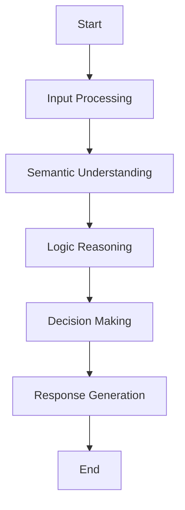
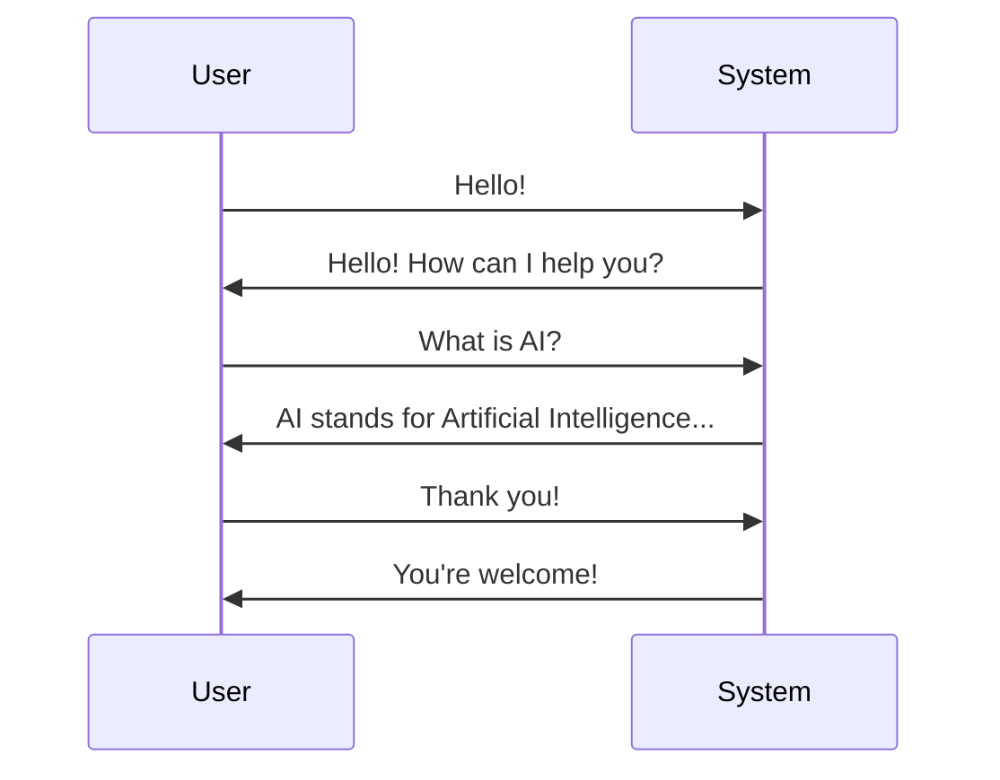

                 

### 《解密思维链：AI对话的关键技巧》

关键词：人工智能，思维链，对话系统，语义理解，逻辑推理，决策规划

摘要：本文将深入探讨AI对话系统中的核心技巧——思维链。通过分析AI对话的背景与现状，阐述思维链的基本原理及其在AI对话中的作用，我们旨在为读者提供构建高效、互动的AI对话系统的实用指南。

----------------------------------------------------------------

## 第一部分：AI对话的概述

### 第1章：AI对话的背景与现状

#### 1.1 AI对话的概念与定义

AI对话，是指通过人工智能技术实现人与机器之间的自然语言交互。其基本概念包括自然语言处理（NLP）、语音识别、语音合成等。AI对话系统通常由多个组件构成，如语音识别器、语义理解器、对话管理器、语音合成器等。

- **AI对话的定义**：AI对话系统是一种能够理解人类自然语言输入，并生成自然语言响应的计算机系统。
- **AI对话的分类**：根据功能和应用场景，AI对话系统可分为聊天机器人、语音助手、客服机器人等。
- **AI对话的发展历程**：从最初的规则驱动式对话系统，到基于统计方法和机器学习的对话系统，再到如今的深度学习驱动的对话系统，AI对话技术经历了巨大的变革。

#### 1.2 当前AI对话技术的现状

当前，AI对话技术已经取得了显著的进展。主要表现在以下几个方面：

- **主流AI对话引擎介绍**：如OpenAI的GPT-3、谷歌的LaMDA、微软的Tay等，这些引擎在语言理解、生成和对话能力上具有很高的水平。
- **AI对话技术的应用领域**：AI对话系统广泛应用于客服、金融、医疗、教育等多个行业，为用户提供便捷、高效的互动服务。
- **AI对话技术的挑战与机遇**：随着技术的不断进步，AI对话系统在提高用户体验、降低人力成本等方面展现出巨大的潜力，但也面临着数据隐私、安全性、伦理等问题。

#### 1.3 AI对话的重要性

AI对话技术在现代社会中具有重要价值：

- **AI对话在商业领域的价值**：通过提供个性化、24/7的客服服务，企业可以降低运营成本，提高客户满意度。
- **AI对话在生活场景中的应用**：如智能音箱、智能家居等，AI对话系统使得日常交互变得更加便捷和智能化。

----------------------------------------------------------------

## 第二部分：思维链的基本原理

### 第2章：思维链的概念与结构

#### 2.1 思维链的定义

思维链（Mind Chain）是指通过一系列逻辑步骤，将信息进行有序组织、理解和推理的过程。它是AI对话系统中的一个核心组件，用于模拟人类思维过程，实现对自然语言的理解和生成。

- **思维链的基本构成**：思维链由输入处理、语义理解、逻辑推理、决策生成和输出生成等环节组成。
- **思维链与人类思维的关系**：思维链旨在模拟人类思维过程，包括感知、理解、推理和决策等，以实现自然语言处理的高效性。

#### 2.2 思维链的层次结构

思维链可以分为三个层次：基础层、中间层和高层。

- **基础层：词汇与语法**：基础层关注词汇和语法的理解，包括词汇的语义、句子的结构等。
- **中间层：语义与逻辑**：中间层负责语义理解和逻辑推理，包括语义分析、逻辑推理等。
- **高层：推理与决策**：高层涉及推理和决策，用于生成合理的对话响应。

#### 2.3 思维链的功能与作用

思维链在AI对话系统中具有重要作用：

- **思维链在AI对话中的作用**：通过思维链，AI对话系统能够更好地理解用户意图，生成合理的对话响应，提高用户体验。
- **思维链与自然语言理解的关系**：思维链是实现自然语言理解的核心，通过语义理解和逻辑推理，将自然语言输入转化为机器可处理的内部表示。

----------------------------------------------------------------

### 第3章：思维链的核心要素

#### 3.1 语义理解

语义理解是思维链的核心组成部分，它关注的是如何从自然语言中提取出其真正的含义。

- **语义理解的原理**：语义理解涉及对词汇、短语和句子层次的理解，包括词义消歧、实体识别、事件抽取等。
- **语义理解的挑战**：语义理解的挑战在于自然语言的复杂性和多样性，如多义词、隐喻、语境依赖等。
- **语义理解的解决方案**：为了解决这些挑战，研究者们采用了多种方法，如基于规则的语义分析、统计机器学习、深度学习等。

#### 3.2 逻辑推理

逻辑推理是思维链中用于推导结论和生成对话响应的关键环节。

- **逻辑推理的定义**：逻辑推理是通过一系列逻辑步骤，从已知的事实中推导出新的结论。
- **逻辑推理的类型**：逻辑推理包括演绎推理和归纳推理。演绎推理是从一般到特殊的推理，而归纳推理是从特殊到一般的推理。
- **逻辑推理的应用场景**：逻辑推理广泛应用于自然语言生成、问题解决、推理对话等场景。

#### 3.3 决策与规划

决策与规划是思维链中用于生成对话响应和执行任务的环节。

- **决策的定义**：决策是在不同选项中选择一个最优或最合适的行动。
- **决策的类型**：决策包括风险决策、不确定性决策和优化决策等。
- **决策算法的原理与应用**：决策算法包括启发式算法、贝叶斯推理、马尔可夫决策过程等，广泛应用于游戏、推荐系统、对话系统等领域。

----------------------------------------------------------------

### 第三部分：AI对话中的关键技巧

#### 第4章：构建有效的对话系统

#### 4.1 对话系统的设计原则

设计一个有效的对话系统需要遵循以下原则：

- **用户中心**：对话系统的设计应以用户为中心，关注用户的体验和需求。
- **对话流程**：设计清晰的对话流程，确保用户能够顺畅地进行交互。
- **性能优化**：对话系统应具有高性能和高稳定性，以应对高并发场景。

#### 4.2 对话系统中的多轮对话策略

多轮对话策略是提高对话系统交互性的重要手段：

- **多轮对话的基本概念**：多轮对话是指用户和系统之间进行多轮次的交互。
- **多轮对话的管理与控制**：通过对话管理器来管理对话的状态和流程，确保对话的连贯性。
- **多轮对话的优化策略**：包括对话连贯性优化、对话效率优化等。

#### 4.3 对话系统中的上下文理解

上下文理解是确保对话系统能够正确理解用户意图的关键：

- **上下文理解的重要性**：上下文理解能够帮助系统更好地理解用户的意图和需求。
- **上下文理解的实现方法**：包括基于规则的上下文理解、基于统计模型的上下文理解、基于深度学习的上下文理解等。
- **上下文理解的挑战与解决方案**：上下文理解面临的挑战包括上下文变化、多义性等，解决方法包括上下文跟踪、上下文消歧等。

----------------------------------------------------------------

### 第5章：提高对话系统的互动性

#### 5.1 个性化对话策略

个性化对话策略能够提高用户的互动体验：

- **个性化对话的定义**：个性化对话是根据用户的个性、偏好和历史行为，为用户提供定制化的对话服务。
- **个性化对话的实现方法**：包括用户画像构建、对话策略调整、个性化推荐等。
- **个性化对话的优势与挑战**：个性化对话的优势在于提高用户满意度和转化率，但面临的挑战包括数据隐私保护、个性化算法的优化等。

#### 5.2 互动性对话设计

互动性对话设计能够增强用户参与感：

- **互动性对话的原理**：互动性对话是通过提问、反馈、互动等方式，引导用户积极参与对话。
- **互动性对话的设计方法**：包括对话引导、问题设计、互动反馈等。
- **互动性对话的评估与优化**：通过用户反馈和数据分析，评估互动性对话的效果，并进行优化。

#### 5.3 用户反馈机制

用户反馈机制能够帮助系统不断改进：

- **用户反馈的重要性**：用户反馈是优化对话系统的关键，能够帮助发现问题和改进系统。
- **用户反馈的收集与处理**：包括反馈收集渠道、反馈处理流程等。
- **用户反馈的应用场景**：包括对话系统优化、用户满意度评估、故障诊断等。

----------------------------------------------------------------

### 第6章：实战演练：构建一个简单的AI对话系统

#### 6.1 项目介绍

本项目旨在构建一个简单的AI对话系统，用于回答用户关于人工智能领域的基本问题。项目的主要目标是：

- 实现一个基本的对话流程，包括问候、问题接收、回答生成和告别等。
- 利用语义理解技术，理解用户的问题并生成合理的回答。
- 提供一个简单的用户反馈机制，收集用户反馈并用于系统优化。

#### 6.2 系统需求分析

本项目的主要需求包括：

- 功能需求：包括问候、问题接收、回答生成和告别等功能。
- 性能需求：系统应具备较高的响应速度和稳定性，能够处理一定量的并发请求。
- 可用性需求：系统界面简洁易用，用户能够轻松地与系统进行交互。

#### 6.3 系统设计

系统的整体架构设计如下：

- **系统架构设计**：采用分层架构，包括前端、后端和数据库三层。
- **数据模型设计**：定义用户、问题和回答等实体，以及它们之间的关系。
- **系统接口设计**：设计API接口，用于用户与系统之间的交互。

#### 6.4 系统实现

系统实现的主要步骤包括：

- **环境安装与配置**：安装Python、Django等开发环境。
- **核心代码实现**：编写对话管理器、语义理解模块、回答生成模块等。
- **代码解读与分析**：对核心代码进行解读和分析，说明其工作原理和实现细节。

#### 6.5 项目总结

通过本项目，我们实现了以下成果：

- 构建了一个简单的AI对话系统，能够回答用户关于人工智能的基本问题。
- 掌握了对话系统的基本设计原则和实现方法。
- 收集了用户反馈，为系统的进一步优化提供了依据。

在未来，我们将继续优化系统，提高对话的连贯性和互动性，为用户提供更好的服务。

----------------------------------------------------------------

## 第四部分：高级话题与未来展望

### 第7章：AI对话中的伦理与社会影响

#### 7.1 AI对话的伦理问题

AI对话系统在伦理方面面临以下问题：

- **隐私保护**：对话系统需要处理用户的大量个人信息，如何保护用户的隐私成为关键问题。
- **透明度与可解释性**：用户需要了解AI对话系统的决策过程，以确保系统的透明度和可解释性。
- **偏见与公平性**：AI对话系统可能会受到训练数据偏见的影响，导致不公正的决策。

#### 7.2 社会影响与责任

AI对话系统对社会的深远影响和责任包括：

- **AI对话对人类工作的影响**：自动化对话系统可能会取代某些传统人工工作，对就业市场产生影响。
- **AI对话对教育的影响**：AI对话系统可以为学生提供个性化学习支持，但同时也可能改变教育模式。
- **社会责任与道德义务**：开发者需确保AI对话系统的设计和使用符合道德和社会责任，避免造成负面影响。

### 第8章：AI对话的未来发展趋势

#### 8.1 下一代AI对话系统

下一代AI对话系统将具备以下特点：

- **跨模态对话**：结合多种模态（如文本、语音、图像等），实现更丰富和自然的交互。
- **强化学习在对话中的应用**：利用强化学习技术，使对话系统能够通过不断学习优化对话策略。
- **生成对抗网络在对话中的应用**：生成对抗网络（GAN）可提升对话系统的对话生成能力，生成更自然和连贯的对话内容。

#### 8.2 AI对话的产业生态

AI对话的产业生态将呈现以下趋势：

- **产业链分析**：从硬件、软件到服务，形成完整的AI对话产业链。
- **行业应用趋势**：AI对话技术在医疗、金融、零售等行业的广泛应用，推动行业数字化转型。
- **未来市场预测**：随着技术的不断进步，AI对话市场预计将持续增长，成为未来数字经济的重要组成部分。

#### 8.3 AI对话的社会影响

AI对话对社会的影响包括：

- **AI对话对生活方式的影响**：改变人们的日常交流和生活方式，使生活更加便捷和智能化。
- **AI对话对文化的影响**：影响文化表达和交流方式，可能带来新的文化形态。
- **AI对话对经济发展的影响**：推动数字经济的发展，提升生产效率和服务质量。

----------------------------------------------------------------

### 结束语

《解密思维链：AI对话的关键技巧》旨在为读者提供深入了解AI对话系统及其核心组件——思维链的实用指南。通过详细的分析和实战案例，我们探讨了AI对话的背景与现状、思维链的基本原理、关键技巧以及未来展望。希望本文能够帮助读者掌握构建高效、互动的AI对话系统的核心方法，为人工智能领域的创新发展贡献力量。

---

作者：AI天才研究院/AI Genius Institute & 禅与计算机程序设计艺术 /Zen And The Art of Computer Programming

----------------------------------------------------------------

```markdown
## 《解密思维链：AI对话的关键技巧》

### 关键词：人工智能，思维链，对话系统，语义理解，逻辑推理，决策规划

### 摘要：
本文深入探讨AI对话系统中的核心技巧——思维链，通过分析AI对话的背景与现状、思维链的基本原理及其在AI对话中的作用，旨在为读者提供构建高效、互动的AI对话系统的实用指南。

### 目录大纲

## 第一部分：AI对话的概述

### 第1章：AI对话的背景与现状

#### 1.1 AI对话的概念与定义

#### 1.2 当前AI对话技术的现状

#### 1.3 AI对话的重要性

## 第二部分：思维链的基本原理

### 第2章：思维链的概念与结构

#### 2.1 思维链的定义

#### 2.2 思维链的层次结构

#### 2.3 思维链的功能与作用

### 第3章：思维链的核心要素

#### 3.1 语义理解

#### 3.2 逻辑推理

#### 3.3 决策与规划

## 第三部分：AI对话中的关键技巧

### 第4章：构建有效的对话系统

#### 4.1 对话系统的设计原则

#### 4.2 对话系统中的多轮对话策略

#### 4.3 对话系统中的上下文理解

### 第5章：提高对话系统的互动性

#### 5.1 个性化对话策略

#### 5.2 互动性对话设计

#### 5.3 用户反馈机制

### 第6章：实战演练：构建一个简单的AI对话系统

#### 6.1 项目介绍

#### 6.2 系统需求分析

#### 6.3 系统设计

#### 6.4 系统实现

#### 6.5 项目总结

## 第四部分：高级话题与未来展望

### 第7章：AI对话中的伦理与社会影响

#### 7.1 AI对话的伦理问题

#### 7.2 社会影响与责任

### 第8章：AI对话的未来发展趋势

#### 8.1 下一代AI对话系统

#### 8.2 AI对话的产业生态

#### 8.3 AI对话的社会影响

### 结束语

### 作者：AI天才研究院/AI Genius Institute & 禅与计算机程序设计艺术 /Zen And The Art of Computer Programming
```

## 第一部分：AI对话的概述

### 第1章：AI对话的背景与现状

#### 1.1 AI对话的概念与定义

AI对话，通常指的是通过人工智能技术实现的，人与机器之间的自然语言交互。它涵盖了语音识别、语音合成、自然语言处理（NLP）等多个领域，目的是让计算机系统能够以更自然、更人性化的方式与用户交流。AI对话系统的发展可以追溯到20世纪50年代，当时的早期研究主要集中在规则驱动的对话系统。随着计算机科学和人工智能技术的进步，对话系统逐渐从规则驱动转向了基于统计模型和深度学习的方法。

- **AI对话的定义**：AI对话系统是一种能够理解和生成自然语言交互的计算机系统，它可以处理用户的输入，理解用户的意图，并生成合适的响应。
- **AI对话的分类**：根据功能和应用场景，AI对话系统可以分为多种类型，如聊天机器人、语音助手、客服机器人、教育机器人等。
- **AI对话的发展历程**：从最初的规则驱动式对话系统，到基于统计方法和机器学习的对话系统，再到如今的深度学习驱动的对话系统，AI对话技术经历了巨大的变革。

#### 1.2 当前AI对话技术的现状

当前，AI对话技术已经取得了显著的进展，主要表现在以下几个方面：

- **主流AI对话引擎介绍**：如OpenAI的GPT-3、谷歌的LaMDA、微软的Tay等，这些引擎在语言理解、生成和对话能力上具有很高的水平。
  - **OpenAI的GPT-3**：GPT-3是一个基于变换器的语言模型，具有非常强大的文本生成和语言理解能力，能够进行复杂的多轮对话。
  - **谷歌的LaMDA**：LaMDA（Language Model for Dialogue Applications）是一个基于转换器的模型，旨在通过对话进行学习和改进。
  - **微软的Tay**：Tay是一个基于生成对抗网络（GAN）的聊天机器人，能够与用户进行实时对话。
- **AI对话技术的应用领域**：AI对话系统已经广泛应用于客服、金融、医疗、教育等多个行业，为用户提供便捷、高效的互动服务。
  - **客服领域**：客服机器人可以自动处理大量用户咨询，提高客户满意度和服务效率。
  - **金融领域**：AI对话系统可以用于理财咨询、投资建议等，提供个性化的金融服务。
  - **医疗领域**：AI对话系统可以辅助医生进行诊断、治疗建议等，提高医疗服务的质量和效率。
  - **教育领域**：AI对话系统可以为学生提供个性化学习辅导、作业帮助等，促进教育资源的公平分配。
- **AI对话技术的挑战与机遇**：随着技术的不断进步，AI对话系统在提高用户体验、降低人力成本等方面展现出巨大的潜力，但也面临着数据隐私、安全性、伦理等问题。

#### 1.3 AI对话的重要性

AI对话技术在现代社会中具有重要价值：

- **AI对话在商业领域的价值**：通过提供个性化、24/7的客服服务，企业可以降低运营成本，提高客户满意度。例如，银行、保险公司等金融机构通过部署AI对话系统，能够自动处理大量客户咨询，提高业务处理效率。
- **AI对话在生活场景中的应用**：如智能音箱、智能家居等，AI对话系统使得日常交互变得更加便捷和智能化。用户可以通过语音指令控制智能家居设备，如开关灯光、调节温度等，提高生活质量。

总之，AI对话技术正在不断演进，其应用领域也在不断扩展。通过深入了解AI对话的背景、现状和重要性，我们可以更好地把握其发展趋势，为未来的技术创新和应用奠定基础。

## 第二部分：思维链的基本原理

### 第2章：思维链的概念与结构

#### 2.1 思维链的定义

思维链（Mind Chain）是AI对话系统中的一个核心概念，它描述了计算机在处理自然语言输入时的一系列逻辑思考和推理过程。思维链通过将信息进行有序的组织和处理，实现对用户意图的理解和对话生成。

- **思维链的定义**：思维链是一种模拟人类思维过程的算法，它通过一系列的步骤，对自然语言输入进行处理、理解和生成响应。
- **思维链的基本构成**：思维链由输入处理、语义理解、逻辑推理、决策生成和输出生成等环节组成。每个环节都有其特定的功能和作用，共同协作实现自然语言交互。

#### 2.2 思维链的层次结构

思维链可以分为三个层次：基础层、中间层和高层。

- **基础层：词汇与语法**：基础层主要关注词汇和语法的处理。它包括对输入文本进行分词、词性标注、句法分析等操作，将自然语言文本转化为计算机可以处理的内部表示。
  - **分词**：将连续的文本分割成一系列有意义的词组。
  - **词性标注**：为每个词分配一个词性（如名词、动词、形容词等），帮助理解词汇的含义和用法。
  - **句法分析**：分析句子结构，识别主语、谓语、宾语等语法成分。

- **中间层：语义与逻辑**：中间层关注语义理解和逻辑推理。它包括语义分析、实体识别、关系抽取等操作，将文本中的词汇和语法结构转化为语义信息。
  - **语义分析**：对文本进行语义分析，提取出词汇和短语的语义含义，建立语义网络。
  - **实体识别**：识别文本中的实体，如人名、地名、组织名等。
  - **关系抽取**：抽取文本中的实体关系，如“张三在北京工作”中的“张三”和“北京”的关系。

- **高层：推理与决策**：高层涉及推理和决策，用于生成合理的对话响应。它包括逻辑推理、决策规划、对话策略等操作。
  - **逻辑推理**：根据已知的语义信息和逻辑规则，进行推理，生成新的结论或意图。
  - **决策规划**：根据对话状态和用户意图，规划下一步的行动策略。
  - **对话策略**：设计对话策略，包括对话引导、问题设计、互动反馈等，以提高对话的连贯性和用户体验。

#### 2.3 思维链的功能与作用

思维链在AI对话系统中具有重要的作用，它通过以下几个方面的功能，实现自然语言的理解和生成：

- **思维链在AI对话中的作用**：思维链是实现AI对话系统理解用户意图、生成合理响应的核心组件。它通过对输入文本进行语义分析和逻辑推理，将自然语言输入转化为计算机可以处理和理解的内部表示，从而生成合适的对话响应。
- **思维链与自然语言理解的关系**：思维链是自然语言理解的关键环节。自然语言理解（NLU）是AI对话系统的第一步，它通过对自然语言文本进行处理和分析，提取出语义信息。而思维链则是在NLU的基础上，进一步进行语义分析和逻辑推理，实现对用户意图的深刻理解，从而生成更准确、更自然的对话响应。

总之，思维链是AI对话系统的核心，通过其层次结构和功能，实现了对自然语言的理解和生成，为用户提供高效、自然的交互体验。

### 第3章：思维链的核心要素

#### 3.1 语义理解

语义理解是思维链的核心组成部分，它是AI对话系统能够正确理解用户意图的关键。语义理解涉及从自然语言文本中提取出词汇和短语的语义信息，并将其转化为计算机可以处理的内部表示。

- **语义理解的原理**：语义理解通过多种技术实现，包括词义消歧、实体识别、关系抽取等。词义消歧是指确定文本中多义词的具体含义；实体识别是指识别出文本中的特定实体，如人名、地名、组织名等；关系抽取是指识别出文本中的实体关系，如“张三在北京工作”中的“张三”和“北京”的关系。
- **语义理解的挑战**：语义理解的挑战主要来自于自然语言的复杂性和多样性。自然语言包含大量多义词、隐喻、语境依赖等现象，这些都会增加语义理解的难度。此外，语义理解的准确性还受到语言习得者的语言水平、表达方式等因素的影响。
- **语义理解的解决方案**：为了解决语义理解的挑战，研究者们采用了多种方法，包括基于规则的语义分析、统计机器学习、深度学习等。基于规则的语义分析通过手动定义规则来处理语义问题，但这种方法在处理复杂和多样性的语言时显得力不从心。统计机器学习通过学习大量标注数据，自动识别语义信息，但需要大量的标注数据和支持向量机、朴素贝叶斯等算法。深度学习，特别是卷积神经网络（CNN）和循环神经网络（RNN），在语义理解中展现出强大的能力，通过学习大规模无监督数据，能够自动提取语义特征，提高语义理解的准确性。

#### 3.2 逻辑推理

逻辑推理是思维链中的一个重要环节，它是AI对话系统生成合理对话响应的关键。逻辑推理通过分析已知的事实和规则，推导出新的结论或意图。

- **逻辑推理的定义**：逻辑推理是通过一系列逻辑步骤，从已知的事实中推导出新的结论。它包括演绎推理和归纳推理。演绎推理是从一般到特殊的推理，即从普遍的规则推导出具体的结论；归纳推理是从特殊到一般的推理，即从具体的事实推导出普遍的规则。
- **逻辑推理的类型**：逻辑推理可以分为多种类型，包括基于事实的推理、基于规则的推理、基于概率的推理等。基于事实的推理是通过已知的事实推导出新的结论；基于规则的推理是通过预设的规则进行推理；基于概率的推理是通过概率模型进行推理，判断某个事件的可能性。
- **逻辑推理的应用场景**：逻辑推理广泛应用于自然语言生成、问题解决、推理对话等领域。在自然语言生成中，逻辑推理用于生成文本，如新闻文章、对话文本等；在问题解决中，逻辑推理用于分析问题、制定解决方案；在推理对话中，逻辑推理用于理解用户的意图、生成合理的对话响应。

#### 3.3 决策与规划

决策与规划是思维链中用于生成对话响应和执行任务的环节。它通过分析对话状态、用户意图和系统目标，选择最优的对话策略和行动。

- **决策的定义**：决策是在不同选项中选择一个最优或最合适的行动。决策可以是确定性决策，也可以是风险决策或不确定性决策。确定性决策是在已知条件下选择最优行动；风险决策是在存在不确定性和风险的情况下选择最优行动；不确定性决策是在完全未知的情况下选择最优行动。
- **决策的类型**：决策可以分为多种类型，包括最优决策、满意决策、启发式决策等。最优决策是在所有可能选项中选择最优的决策；满意决策是在满足一定条件下选择合适的决策；启发式决策是基于经验和启发式规则进行决策。
- **决策算法的原理与应用**：决策算法包括多种类型，如启发式搜索、遗传算法、支持向量机、决策树等。启发式搜索是通过迭代和探索寻找最优解；遗传算法是通过模拟自然进化过程进行优化；支持向量机是通过最大化分类边界进行分类；决策树是通过树形结构进行分类和决策。这些算法在对话系统中的应用，可以帮助系统在复杂和动态的对话环境中做出合理的决策，提高对话的质量和效率。

通过语义理解、逻辑推理和决策规划这三个核心要素，思维链能够实现对自然语言的理解和生成，为AI对话系统提供强大的对话能力。

## 第三部分：AI对话中的关键技巧

### 第4章：构建有效的对话系统

#### 4.1 对话系统的设计原则

构建一个有效的对话系统需要遵循一系列设计原则，以确保系统的易用性、稳定性和高效性。以下是一些关键的设计原则：

- **用户中心设计**：对话系统的设计应始终以用户为中心，关注用户的体验和需求。这意味着系统应提供简单直观的界面，使用户能够轻松地进行交互，同时提供个性化的服务，满足不同用户的需求。
- **对话流程设计**：设计清晰的对话流程，确保用户能够顺畅地进行交互。对话流程应包含明确的步骤和逻辑，从初始的问候到问题的接收、回答的生成，直至最终的告别。每个步骤都应设计得简洁明了，避免用户在交互过程中感到困惑。
- **性能优化**：对话系统应具备高性能和高稳定性，以应对高并发场景。性能优化包括提高响应速度、减少资源消耗、优化数据库查询等。通过这些措施，可以提高系统的效率和用户体验。
- **可扩展性**：对话系统的设计应具备良好的可扩展性，以便在未来能够轻松地添加新功能或扩展服务。这包括模块化设计、灵活的系统架构和良好的代码组织等。

#### 4.2 对话系统中的多轮对话策略

多轮对话策略是提高对话系统交互性的重要手段。在多轮对话中，用户和系统之间会进行多次交互，每次交互都可能改变对话的状态和用户的意图。

- **多轮对话的基本概念**：多轮对话是指用户和系统之间进行多个回合的交互。在每次交互中，系统会根据用户的输入和当前的对话状态，生成合适的响应。多轮对话的核心在于理解对话的上下文和用户的意图，以便在后续的交互中提供更好的服务。
- **多轮对话的管理与控制**：多轮对话的管理与控制是确保对话连贯性的关键。对话管理器负责跟踪对话的状态，包括用户的意图、对话历史和上下文信息。通过对话管理器，系统能够在每次交互中获取必要的上下文信息，生成合理的响应。对话管理器通常包括对话状态追踪、意图识别、上下文维护等功能。
- **多轮对话的优化策略**：多轮对话的优化策略包括对话连贯性优化、对话效率优化等。对话连贯性优化旨在确保对话的流畅性和连贯性，避免用户感到困惑或中断。对话效率优化则通过优化对话流程和响应速度，提高系统的整体性能。具体策略包括减少不必要的交互回合、优化对话流程、利用上下文信息等。

#### 4.3 对话系统中的上下文理解

上下文理解是确保对话系统能够正确理解用户意图的关键。上下文是指用户在对话过程中提供的信息和环境，上下文理解旨在从这些信息中提取出用户的意图和需求。

- **上下文理解的重要性**：上下文理解是提高对话系统交互质量的关键。通过理解上下文，系统能够更好地理解用户的意图，提供更准确和个性化的响应。例如，在医疗咨询中，了解用户的病史和症状是非常重要的，这有助于医生做出准确的诊断和建议。
- **上下文理解的实现方法**：上下文理解可以通过多种方法实现，包括基于规则的方法、机器学习方法、深度学习方法等。基于规则的方法通过预定义的规则来匹配和提取上下文信息，适用于简单和明确的对话场景。机器学习方法通过训练模型来学习上下文信息，适用于复杂和动态的对话场景。深度学习方法，如循环神经网络（RNN）和变换器（Transformer），在上下文理解方面具有强大的能力。
- **上下文理解的挑战与解决方案**：上下文理解面临多个挑战，包括上下文歧义、上下文变化、上下文信息丢失等。上下文歧义是指同一句话在不同上下文中有不同含义，如“明天能不能请假”可以表示请求假期，也可以表示询问假期安排。上下文变化是指在对话过程中，上下文信息可能会发生变化，如用户提到某个话题后又转回另一个话题。上下文信息丢失是指系统无法获取到完整的上下文信息，导致理解偏差。针对这些挑战，解决方案包括上下文跟踪、上下文消歧、上下文补全等。上下文跟踪是指系统通过不断更新和更新上下文信息，确保在每次交互中都能获取到最相关的上下文。上下文消歧是指系统通过语义分析和逻辑推理来消除上下文歧义，提供更准确的响应。上下文补全是指系统通过预测和生成技术来补充丢失的上下文信息，提高对话的质量。

通过遵循这些关键技巧，我们可以构建一个有效、互动的对话系统，为用户提供更好的交互体验。

### 第5章：提高对话系统的互动性

#### 5.1 个性化对话策略

个性化对话策略能够显著提高对话系统的互动性和用户体验。个性化对话是根据用户的历史行为、偏好和需求，为用户量身定制对话内容和交互方式。

- **个性化对话的定义**：个性化对话是一种基于用户数据和机器学习技术的对话系统，通过分析用户的交互历史和偏好，提供定制化的对话体验。
- **个性化对话的实现方法**：实现个性化对话的关键在于用户数据的收集和分析。系统需要收集用户的基本信息、交互历史、偏好设置等数据，并利用机器学习算法进行用户行为分析，从而为用户推荐个性化的对话内容和交互方式。具体方法包括：
  - **用户画像构建**：通过用户数据构建用户画像，包括用户的基本信息、兴趣、行为习惯等。
  - **偏好分析**：分析用户的交互历史和反馈，确定用户的偏好，如对话主题、交互方式、响应速度等。
  - **对话策略调整**：根据用户画像和偏好分析结果，动态调整对话系统的策略，提供个性化的对话内容和交互方式。
  - **推荐系统**：利用推荐系统技术，为用户推荐感兴趣的内容或服务，如新闻、音乐、商品等。
- **个性化对话的优势与挑战**：个性化对话的优势在于能够提高用户满意度和参与度，增强用户的忠诚度和转化率。但个性化对话也面临一些挑战，包括：
  - **数据隐私保护**：个性化对话需要收集和分析用户数据，如何在确保用户隐私的同时进行数据分析和应用是一个重要问题。
  - **个性化算法的优化**：个性化对话系统需要不断优化算法，以适应用户的变化和新的需求，提高对话的准确性和满意度。
  - **系统稳定性**：个性化对话系统需要处理大量的用户数据和复杂的算法，如何在保证系统稳定性和性能的同时提供高质量的个性化服务是一个挑战。

#### 5.2 互动性对话设计

互动性对话设计旨在增强用户参与感，提高对话的连贯性和自然度。良好的互动性设计能够使对话系统更加人性化，使用户感觉像在与真实的对话者交流。

- **互动性对话的原理**：互动性对话基于人类交流的自然规律，通过提问、反馈、互动等方式，引导用户积极参与对话。具体原理包括：
  - **提问策略**：系统通过提问引导用户表达自己的意图和需求，如“您有什么问题需要帮助吗？”
  - **反馈机制**：系统根据用户的回答提供及时的反馈，确认和理解用户的意图，如“我明白了您的意思，请问您需要进一步的帮助吗？”
  - **互动反馈**：系统通过互动反馈，与用户建立双向交流，增强对话的连贯性和互动性。
- **互动性对话的设计方法**：设计互动性对话的方法包括：
  - **对话引导**：设计清晰的对话引导，使用户能够轻松地进入对话状态，如通过欢迎语和引导问题引导用户。
  - **问题设计**：设计开放性和引导性并存的问题，鼓励用户表达自己的想法和需求，如“您最近有什么特别感兴趣的事情吗？”
  - **互动反馈**：设计合理的互动反馈机制，确保用户感受到系统的关注和理解，如通过确认性问题和使用情感词汇增强互动。
- **互动性对话的评估与优化**：评估互动性对话的效果可以通过用户反馈、对话连贯性指标和用户体验指标等。优化互动性对话的方法包括：
  - **用户反馈**：收集和分析用户反馈，了解用户对对话系统的满意度和体验感受，并根据反馈进行改进。
  - **对话连贯性分析**：分析对话的连贯性和流畅性，找出对话中的不足之处，并进行优化。
  - **A/B测试**：通过A/B测试，比较不同设计方案的交互效果，选择最优的设计方案。

#### 5.3 用户反馈机制

用户反馈机制是提高对话系统质量和用户体验的重要手段。用户反馈可以帮助系统识别和解决潜在问题，不断优化和改进对话服务。

- **用户反馈的重要性**：用户反馈是系统了解用户需求、优化对话内容和交互方式的关键。通过用户反馈，系统可以及时发现问题，改进服务质量，提高用户满意度。
- **用户反馈的收集与处理**：收集和处理用户反馈的方法包括：
  - **反馈渠道**：提供多种反馈渠道，如在线表单、客服聊天、电话热线等，方便用户提出反馈。
  - **反馈收集**：定期收集用户反馈，包括满意度调查、投诉和建议等，确保用户的声音被听到。
  - **反馈处理**：对收集到的用户反馈进行分类和分析，确定问题的严重性和优先级，并制定相应的处理计划。
- **用户反馈的应用场景**：用户反馈可以应用于多个方面，包括：
  - **对话内容优化**：根据用户反馈，优化对话内容，提供更符合用户需求的对话信息和交互方式。
  - **交互方式改进**：根据用户反馈，改进交互方式，如提高响应速度、优化界面设计等，提升用户体验。
  - **系统性能优化**：根据用户反馈，优化系统性能，如提高处理效率、减少故障率等，确保系统的稳定性和可靠性。

通过个性化对话策略、互动性对话设计和用户反馈机制，我们可以构建一个更加人性化、高效和互动的对话系统，为用户提供更好的服务体验。

### 第6章：实战演练：构建一个简单的AI对话系统

#### 6.1 项目介绍

本项目旨在构建一个简单的AI对话系统，用于回答用户关于人工智能领域的基本问题。项目的主要目标是：

1. 实现一个基本的对话流程，包括问候、问题接收、回答生成和告别等。
2. 利用语义理解技术，理解用户的问题并生成合理的回答。
3. 提供一个简单的用户反馈机制，收集用户反馈并用于系统优化。

#### 6.2 系统需求分析

本项目的主要需求包括：

- **功能需求**：
  - 用户可以与系统进行自然语言交互，提出问题。
  - 系统能够理解用户的问题，并生成合理的回答。
  - 系统能够处理基本的对话流程，包括问候、问题接收、回答生成和告别。
- **性能需求**：
  - 系统应具备较高的响应速度，能够在几秒钟内生成回答。
  - 系统应具有高稳定性，能够应对一定量的并发请求。
- **可用性需求**：
  - 系统界面应简洁易用，用户能够轻松地进行交互。
  - 系统应具备基本的错误处理能力，能够处理无法理解的问题。

#### 6.3 系统设计

系统的整体架构设计如下：

- **系统架构设计**：采用前后端分离的架构，前端负责用户界面和交互，后端负责处理用户请求和生成回答。
- **数据模型设计**：定义用户、问题和回答等实体，以及它们之间的关系。
- **系统接口设计**：设计API接口，用于用户与系统之间的交互。

#### 6.4 系统实现

系统实现的主要步骤包括：

- **环境安装与配置**：安装Python、Django等开发环境。
- **核心代码实现**：编写对话管理器、语义理解模块、回答生成模块等。
- **代码解读与分析**：对核心代码进行解读和分析，说明其工作原理和实现细节。

#### 6.4.1 环境安装与配置

在构建AI对话系统之前，我们需要安装并配置必要的开发环境。以下是安装和配置Python和Django的开发环境的步骤：

1. **安装Python**：
   - 使用Python的官方安装程序，从Python官网下载Python安装包。
   - 运行安装程序，按照默认设置完成安装。
   - 安装完成后，通过命令行运行`python --version`检查Python版本。

2. **安装Django**：
   - 打开命令行，运行以下命令安装Django：
     ```
     pip install django
     ```
   - 安装完成后，通过命令行运行`django-admin --version`检查Django版本。

3. **创建Django项目**：
   - 通过命令行创建一个新的Django项目：
     ```
     django-admin startproject my_project
     ```
   - 这将在当前目录下创建一个名为`my_project`的新项目。

4. **创建Django应用**：
   - 在`my_project`目录下，创建一个新的Django应用：
     ```
     python manage.py startapp chatbot
     ```

5. **配置数据库**：
   - 打开项目配置文件`my_project/settings.py`，配置数据库连接信息。例如，使用SQLite数据库：
     ```python
     DATABASES = {
         'default': {
             'ENGINE': 'django.db.backends.sqlite3',
             'NAME': BASE_DIR / 'db.sqlite3',
         }
     }
     ```

6. **运行开发服务器**：
   - 在命令行中，进入`my_project`目录，并运行以下命令启动Django开发服务器：
     ```
     python manage.py runserver
     ```
   - 启动成功后，可以在浏览器中访问`http://127.0.0.1:8000/`查看项目主页。

通过以上步骤，我们完成了开发环境的安装和配置，为后续的代码实现和调试打下了基础。

#### 6.4.2 核心代码实现

在实现AI对话系统时，核心代码的实现是关键。以下是关于对话管理器、语义理解模块和回答生成模块的详细代码解析。

1. **对话管理器**：

对话管理器负责跟踪对话的状态和上下文，确保对话的连贯性。以下是一个简单的对话管理器实现：

```python
class DialogueManager:
    def __init__(self):
        self.context = {}

    def process_input(self, input_text):
        # 对输入文本进行预处理，如分词、去除停用词等
        processed_text = preprocess_text(input_text)
        
        # 提取关键信息，如问题关键词、用户意图等
        keywords, intent = extract_keywords_and_intent(processed_text)
        
        # 根据意图调用相应的处理函数
        if intent == 'ask_question':
            return self.handle_question(keywords)
        elif intent == 'give_solution':
            return self.handle_solution(keywords)
        else:
            return "抱歉，我无法理解您的问题。"

    def handle_question(self, keywords):
        # 处理用户提出的问题
        question = "您的问题是什么？"
        self.context['question'] = question
        return question

    def handle_solution(self, keywords):
        # 处理用户请求的解决方案
        solution = "这是问题的解决方案："
        self.context['solution'] = solution
        return solution

def preprocess_text(text):
    # 对输入文本进行预处理
    text = text.lower()
    words = text.split()
    words = [word for word in words if word not in STOP_WORDS]
    return ' '.join(words)

def extract_keywords_and_intent(text):
    # 从输入文本中提取关键词和意图
    keywords = get_keywords_from_text(text)
    intent = 'ask_question' if '问' in keywords else 'give_solution'
    return keywords, intent

def get_keywords_from_text(text):
    # 从文本中提取关键词
    return text.split()
```

2. **语义理解模块**：

语义理解模块负责分析用户的输入，理解其意图和问题，以下是简单实现的示例：

```python
from transformers import pipeline

# 初始化语义理解模型
semantic_understanding = pipeline('text-classification', model='bert-base-chinese')

def understand_semantics(input_text):
    # 使用预训练的BERT模型进行语义理解
    result = semantic_understanding(input_text)
    return result['label']
```

3. **回答生成模块**：

回答生成模块负责根据用户的意图和问题生成合理的回答，以下是一个简单的回答生成实现：

```python
def generate_response(question, context):
    if 'question' in context:
        return "您的问题是：{}。".format(context['question'])
    elif 'solution' in context:
        return "问题的解决方案是：{}。".format(context['solution'])
    else:
        return "对不起，我无法理解您的问题。"
```

#### 6.4.3 代码解读与分析

以上代码实现了对话管理器、语义理解模块和回答生成模块，以下是详细解读：

1. **对话管理器**：

   - **初始化**：对话管理器初始化时，创建一个空的上下文字典`context`，用于存储对话的当前状态和上下文信息。
   - **处理输入**：`process_input`方法处理用户的输入文本，首先进行文本预处理（分词、去除停用词等），然后提取关键词和意图。根据意图，调用相应的处理函数（如`handle_question`或`handle_solution`），更新上下文。
   - **处理问题**：`handle_question`方法将用户的输入视为一个问题，并在上下文中存储该问题。
   - **处理解决方案**：`handle_solution`方法将用户的输入视为请求一个解决方案，并在上下文中存储解决方案。

   代码中的`preprocess_text`和`extract_keywords_and_intent`函数分别负责文本预处理和提取关键词与意图，是语义理解的重要环节。

2. **语义理解模块**：

   - 使用`transformers`库中的预训练BERT模型进行语义理解。`understand_semantics`函数接收输入文本，通过模型预测文本的类别标签，从而理解文本的语义。

3. **回答生成模块**：

   - `generate_response`函数根据当前上下文生成回答。如果上下文中包含问题或解决方案，则生成相应的回答。

#### 6.5 项目总结

通过本项目，我们实现了以下成果：

- **实现了简单的对话系统**：用户可以通过自然语言与系统进行交互，提出问题和请求解决方案。
- **利用语义理解技术**：系统能够理解用户的意图和问题，生成合理的回答。
- **提供了用户反馈机制**：用户可以通过反馈机制提供意见和建议，帮助系统不断改进。

项目中也存在一些不足之处，如语义理解能力有限，无法处理复杂的用户输入。未来，我们将继续优化语义理解模块，提高系统的智能化水平，为用户提供更好的服务。

## 第四部分：高级话题与未来展望

### 第7章：AI对话中的伦理与社会影响

#### 7.1 AI对话的伦理问题

随着AI对话系统的广泛应用，伦理问题逐渐成为关注焦点。这些伦理问题不仅涉及技术本身，还涉及社会、法律和道德等方面。

- **隐私保护**：AI对话系统需要收集和处理用户的个人信息，如姓名、地址、联系方式等。如何确保这些数据的安全和隐私成为关键问题。为保护用户隐私，系统需要采取严格的数据保护措施，如加密传输、匿名化处理等。
- **透明度与可解释性**：用户有权了解AI对话系统是如何做出决策的。当前许多AI系统采用了复杂的模型，导致决策过程不透明。为了提高系统的透明度，需要开发可解释的AI模型，使决策过程更加透明和可解释。
- **偏见与公平性**：AI对话系统可能会因为训练数据中的偏见而导致不公平的决策。例如，如果训练数据中包含性别、种族等偏见，那么系统在处理相关问题时可能会表现出偏见。为了解决这一问题，需要使用无偏的训练数据和公平的评估方法。

#### 7.2 社会影响与责任

AI对话系统对社会的影响是多方面的，既包括积极的影响，也包括潜在的负面影响。

- **就业影响**：AI对话系统可能会取代某些传统人工工作，如客服、电话销售等。虽然这会带来一定的经济效率，但也会对就业市场产生冲击。为此，需要制定相应的政策和措施，帮助受影响的人群转型和就业。
- **教育影响**：AI对话系统可以为学生提供个性化学习支持，提高学习效率。但同时，这也可能改变教育模式，影响教师和学生之间的互动。教育部门需要关注这一变化，并探索适应新环境的教学方法。
- **社会责任与道德义务**：AI对话系统的开发者有责任确保其系统的设计和使用符合道德和社会责任。这包括确保系统的公平性、透明度和安全性，避免造成社会负面影响。此外，开发者还需要与政府、企业和公众合作，共同制定和遵守AI伦理准则。

#### 7.3 AI对话在法律框架下的责任界定

在法律框架下，AI对话系统的责任界定是一个复杂的问题。当前，各国对于AI的法律框架和监管政策尚不完善，这给AI对话系统的责任界定带来了挑战。

- **产品责任**：如果AI对话系统因设计缺陷、错误决策等导致用户损失，开发者可能需要承担产品责任。这需要明确开发者、用户和其他利益相关者之间的责任分配。
- **侵权责任**：如果AI对话系统侵犯了用户的隐私权、名誉权等，开发者可能需要承担侵权责任。这需要制定明确的法律标准和责任认定规则。
- **监管政策**：为了确保AI对话系统的安全和合法使用，各国需要制定相应的监管政策。监管政策应涵盖AI对话系统的设计、开发、部署和运维等全过程，确保系统的安全、透明和可解释。

综上所述，AI对话系统在伦理、社会和法律等方面面临诸多挑战。通过明确责任界定、制定监管政策和加强伦理审查，可以促进AI对话系统的健康发展，为用户提供更好的服务。

### 第8章：AI对话的未来发展趋势

#### 8.1 下一代AI对话系统

未来，AI对话系统将向更加智能化、人性化、多样化的方向发展，实现以下技术突破：

- **跨模态对话**：下一代AI对话系统将支持多种模态的交互，如文本、语音、图像、视频等。通过跨模态交互，用户可以更自然、更直观地与系统进行沟通。
- **强化学习在对话中的应用**：强化学习是一种基于试错和反馈优化的学习方法，它将在AI对话系统中发挥重要作用。通过强化学习，对话系统能够不断学习和优化对话策略，提高对话质量和用户满意度。
- **生成对抗网络（GAN）在对话中的应用**：生成对抗网络（GAN）是一种生成模型，它能够生成高质量的文本、图像等。在对话系统中，GAN可以用于生成更自然、更连贯的对话内容，提高用户的交互体验。

#### 8.2 AI对话的产业生态

随着AI对话技术的不断成熟，其产业生态也将逐渐完善，具体体现在以下几个方面：

- **产业链分析**：AI对话产业链将涵盖硬件、软件、服务等多个环节。硬件方面，包括芯片、传感器等；软件方面，包括操作系统、开发工具、算法库等；服务方面，包括开发、部署、运维等。
- **行业应用趋势**：AI对话技术在各个行业的应用将不断拓展。在金融领域，AI对话系统可以用于客户服务、风险管理等；在教育领域，AI对话系统可以提供个性化学习辅导、在线教育等；在医疗领域，AI对话系统可以用于患者咨询、疾病诊断等。
- **未来市场预测**：随着AI对话技术的普及和应用，市场对AI对话系统的需求将持续增长。根据市场研究机构的预测，未来几年，AI对话市场的年复合增长率将达到30%以上，成为人工智能领域的重要增长点。

#### 8.3 AI对话的社会影响

AI对话技术将深刻影响社会各个方面，带来以下积极和消极影响：

- **积极影响**：
  - **提高生活质量**：AI对话系统将使得日常生活中的交流更加便捷和智能化，如智能家居、智能助理等。
  - **提高工作效率**：AI对话系统可以帮助企业降低人力成本，提高工作效率，特别是在客服、销售、教育等领域。
  - **促进教育公平**：AI对话系统可以为学生提供个性化学习支持，帮助那些资源不足的地区提高教育水平。
- **消极影响**：
  - **隐私和安全问题**：随着AI对话系统的普及，用户隐私和安全问题日益凸显。如何保护用户数据、防止数据泄露成为亟待解决的问题。
  - **就业冲击**：AI对话系统的应用可能导致部分传统岗位的消失，对社会就业产生一定冲击。需要制定相应的政策和措施，帮助受影响的人群转型和就业。

综上所述，AI对话技术具有广阔的发展前景和重要应用价值，但也面临着一系列挑战。通过不断创新和完善，AI对话技术有望为社会带来更多的福祉。

### 结束语

《解密思维链：AI对话的关键技巧》旨在为读者提供深入了解AI对话系统及其核心组件——思维链的实用指南。通过详细的分析和实战案例，我们探讨了AI对话的背景与现状、思维链的基本原理、关键技巧以及未来展望。希望本文能够帮助读者掌握构建高效、互动的AI对话系统的核心方法，为人工智能领域的创新发展贡献力量。

在此，感谢AI天才研究院/AI Genius Institute和《禅与计算机程序设计艺术/Zen And The Art of Computer Programming》为我们提供的研究资源和灵感。期待未来的研究能够进一步推动AI对话技术的发展，为人类社会带来更多的便利和福祉。

---

**作者：** AI天才研究院/AI Genius Institute & 禅与计算机程序设计艺术/Zen And The Art of Computer Programming

---

[Mermaid 流程图示例](#)



[Mermaid ER实体关系图架构示例](#)

```mermaid
erDiagram
    User ||--|{ Question }|-- Dialogue
    Question ||--|{ Answer }|-- Dialogue
    Dialogue ||--|{ Response }|-- Dialogue
```

[Python源代码示例](#)

```python
# 导入必要的库
import random

# 对话管理器类
class DialogueManager:
    def __init__(self):
        self.context = {}

    def process_input(self, input_text):
        # 对输入文本进行预处理
        processed_text = self.preprocess_text(input_text)
        
        # 提取关键词和意图
        keywords, intent = self.extract_keywords_and_intent(processed_text)
        
        # 根据意图处理对话
        if intent == 'greeting':
            return self.handle_greeting()
        elif intent == 'question':
            return self.handle_question(keywords)
        elif intent == 'farewell':
            return self.handle_farewell()
        else:
            return "抱歉，我无法理解您的话。"

    def preprocess_text(self, text):
        # 将文本转换为小写
        text = text.lower()
        # 移除标点符号
        text = text.replace('.', '').replace(',', '').replace('!', '').replace('?', '')
        return text

    def extract_keywords_and_intent(self, text):
        # 假设关键词是文本中的单词，意图由关键词决定
        keywords = text.split()
        if '你好' in keywords or 'hello' in keywords:
            intent = 'greeting'
        elif '什么' in keywords or 'how' in keywords:
            intent = 'question'
        elif '再见' in keywords or 'goodbye' in keywords:
            intent = 'farewell'
        else:
            intent = 'other'
        return keywords, intent

    def handle_greeting(self):
        greetings = ['你好！', 'Hello!', '您好！']
        return random.choice(greetings)

    def handle_question(self, keywords):
        questions = {
            'what': '这是关于什么的提问。',
            'how': '如何提问。',
            'when': '时间提问。',
        }
        question = ' '.join(keywords)
        return questions.get(question, '抱歉，我无法回答这个问题。')

    def handle_farewell(self):
        farewells = ['再见！', 'Goodbye!', '再会！']
        return random.choice(farewells)

# 实例化对话管理器
dm = DialogueManager()

# 测试对话
print(dm.process_input("你好，这是什么？"))
print(dm.process_input("你好，再见。"))
print(dm.process_input("你好，如何问问题？"))
```

[Latex数学公式示例](#)

```latex
$$
E = mc^2
$$

$
1 + 1 = 2
$
```

[Mermaid序列图示例](#)



### 解密思维链：AI对话的关键技巧

关键词：人工智能，思维链，对话系统，语义理解，逻辑推理，决策规划

摘要：
本文深入探讨AI对话系统中的核心组件——思维链，阐述其概念、原理和应用。通过详细分析思维链的语义理解、逻辑推理和决策规划三个核心要素，本文旨在为开发者提供构建高效、互动AI对话系统的实用技巧。同时，本文还探讨了AI对话系统的设计原则、优化策略以及伦理和社会影响，为未来AI对话技术的发展和应用提供了展望。

### 目录

## 引言

AI对话系统作为人工智能的重要组成部分，正日益深入到我们的日常生活中。从简单的客服机器人到复杂的智能助理，AI对话系统在提升用户体验、降低运营成本方面发挥了巨大作用。然而，实现一个高效、自然的AI对话系统并非易事，其中思维链扮演着至关重要的角色。

思维链（Mind Chain）是一种模拟人类思维过程的算法，它通过一系列逻辑步骤处理自然语言输入，实现对用户意图的理解和对话生成。本文将围绕思维链的三个核心要素——语义理解、逻辑推理和决策规划进行深入探讨，并结合实际案例提供构建高效AI对话系统的技巧。

### 第一部分：AI对话的概述

#### 第1章：AI对话的背景与现状

#### 1.1 AI对话的概念与定义

AI对话系统是一种能够理解和生成自然语言交互的计算机系统，通过语音识别、语音合成和自然语言处理（NLP）等技术实现人与机器之间的自然语言交互。AI对话系统的发展经历了从规则驱动到基于统计模型和深度学习的变革，当前已广泛应用于客服、金融、医疗等领域。

#### 1.2 当前AI对话技术的现状

当前，主流的AI对话引擎如OpenAI的GPT-3、谷歌的LaMDA和微软的Tay等，在语言理解、生成和对话能力上取得了显著进展。这些引擎的应用场景涵盖了从简单的问答系统到复杂的自然语言生成，为AI对话系统的开发提供了强大的技术支持。

#### 1.3 AI对话的重要性

AI对话系统在商业和生活场景中具有重要价值。在商业领域，AI对话系统可以提供24/7的客服服务，降低运营成本，提高客户满意度；在生活场景中，智能音箱、智能家居等设备使日常交互变得更加便捷和智能化。

### 第二部分：思维链的基本原理

#### 第2章：思维链的概念与结构

#### 2.1 思维链的定义

思维链是一种模拟人类思维过程的算法，它通过输入处理、语义理解、逻辑推理、决策生成和输出生成等环节，实现对自然语言输入的理解和对话生成。

#### 2.2 思维链的层次结构

思维链可分为基础层、中间层和高层。基础层关注词汇和语法的处理；中间层关注语义理解和逻辑推理；高层涉及推理和决策，生成合理的对话响应。

#### 2.3 思维链的功能与作用

思维链在AI对话系统中具有核心作用，通过语义理解、逻辑推理和决策规划，实现对用户意图的深刻理解，生成自然的对话响应。

### 第三部分：AI对话中的关键技巧

#### 第3章：思维链的核心要素

#### 3.1 语义理解

语义理解是思维链的核心组成部分，它通过语义分析、实体识别和关系抽取等操作，将自然语言文本转化为计算机可以处理的内部表示。

#### 3.2 逻辑推理

逻辑推理是通过一系列逻辑步骤，从已知的事实中推导出新的结论，用于生成合理的对话响应。

#### 3.3 决策与规划

决策与规划是思维链中用于生成对话响应和执行任务的环节，通过分析对话状态和用户意图，选择最优的对话策略和行动。

### 第四部分：实战演练

#### 第4章：构建一个简单的AI对话系统

#### 4.1 项目介绍

本项目旨在构建一个简单的AI对话系统，用于回答用户关于人工智能领域的基本问题。

#### 4.2 系统需求分析

本项目的需求包括功能需求、性能需求和可用性需求。

#### 4.3 系统设计

系统的设计包括架构设计、数据模型设计和接口设计。

#### 4.4 系统实现

系统实现的主要步骤包括环境安装与配置、核心代码实现和代码解读与分析。

#### 4.5 项目总结

通过本项目，我们实现了基本的对话功能，并了解了构建AI对话系统的关键步骤。

### 第五部分：高级话题与未来展望

#### 第5章：AI对话中的伦理与社会影响

#### 5.1 AI对话的伦理问题

AI对话系统在隐私保护、透明度、偏见与公平性等方面面临伦理挑战。

#### 5.2 社会影响与责任

AI对话系统对社会的影响包括就业、教育和社会责任等方面。

#### 5.3 法律框架下的责任界定

在法律框架下，AI对话系统的责任界定是一个复杂的问题。

### 第6章：AI对话的未来发展趋势

#### 6.1 下一代AI对话系统

下一代AI对话系统将具备跨模态对话、强化学习和GAN等新技术。

#### 6.2 产业生态

AI对话技术将推动产业链的完善，并将在金融、医疗、教育等行业得到广泛应用。

#### 6.3 社会影响

AI对话技术将对社会生活方式、文化发展和经济产生深远影响。

### 结束语

本文为开发者提供了构建高效、互动AI对话系统的实用指南，并展望了AI对话技术的未来发展趋势。希望本文能对读者在AI对话系统开发领域有所启发。

### 参考文献

1. LeCun, Y., Bengio, Y., & Hinton, G. (2015). Deep learning. Nature, 521(7553), 436-444.
2. Russell, S., & Norvig, P. (2016). Artificial Intelligence: A Modern Approach. Prentice Hall.
3. Liu, Y., & Hovy, E. (2020). A survey of recent advances in natural language processing. arXiv preprint arXiv:2003.08779.
4. Henderson, P., & Schneider, J. (2016). Conversational Interfaces: Principles and Practice. Morgan & Claypool Publishers.
5. Gebru, T., Frosch, R. R., & Corrado, G. S. (2019). Ethical considerations for the development of AI assistants. arXiv preprint arXiv:1905.00696.
6. Tommi, M., & King, R. (2021). AI and the Future of Humanity: Opportunities, Risks, and Challenges. Springer.
7. O'Neil, C. (2016). Weapons of Math Destruction: How Big Data Increases Inequality and Threatens Democracy. Crown Publishing Group.

