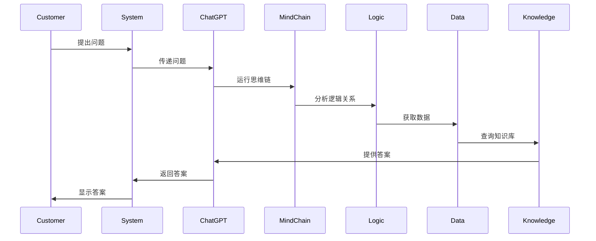
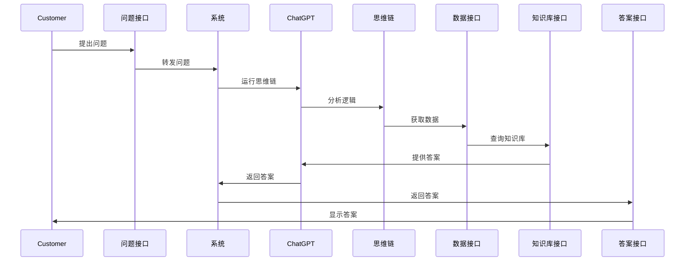

                 

# 解密思维链：提升ChatGPT输出质量的关键

## 关键词
- ChatGPT
- 思维链
- 输出质量
- 算法原理
- 系统架构
- 项目实战

## 摘要
本文旨在深入探讨提升ChatGPT输出质量的关键技术——思维链。通过详细解析思维链的基本概念、算法原理和系统架构，我们将逐步揭示如何有效提升ChatGPT的输出质量和实用性。本文还将分享项目实战经验和最佳实践，为读者提供实际操作的指导。

## 引言与背景

### 1.1.1 人工智能与自然语言处理的发展历程

自20世纪50年代人工智能（AI）概念的提出以来，人工智能技术经历了从理论研究到实际应用的快速发展。自然语言处理（NLP）作为AI的一个重要分支，同样经历了数十年的演变。从早期的规则驱动方法，到基于统计模型的方法，再到近年来的深度学习技术，NLP领域取得了显著的进步。

ChatGPT是由OpenAI开发的一种基于变换器（Transformer）模型的预训练语言模型，它在2022年11月发布，迅速引发了广泛关注。ChatGPT能够生成连贯、自然且具有深度的文本，广泛应用于对话系统、自动问答、内容创作等多个场景。

### 1.1.2 ChatGPT的产生与应用场景

ChatGPT的出现标志着自然语言处理技术的又一次飞跃。它的核心优势在于能够通过大量文本数据的学习，生成符合语境、逻辑清晰且富有创造性的文本。ChatGPT的应用场景广泛，包括但不限于：

- 对话系统：提供24/7的客服支持，回答用户的问题。
- 自动问答：在在线教育平台中为学生提供实时解答。
- 内容创作：撰写博客、文章、故事等，提高内容生成效率。

### 1.1.3 提升ChatGPT输出质量的重要性

提升ChatGPT的输出质量不仅能够提高用户体验，还能扩大其在实际应用中的价值。高质量的输出意味着：

- 更高的准确性和可靠性：减少误解和错误的概率，提高用户信任度。
- 更丰富的内容创作：提供更有创意和深度的内容，满足不同用户的需求。
- 更广泛的应用场景：适应更多领域的需求，实现更高效的工作流程。

## 思维链的基本概念

### 2.1.1 思维链的定义与特点

思维链是一种用于描述和分析问题解决过程的抽象模型，它将人类思维过程中的逻辑关系和思考步骤以结构化的方式呈现出来。思维链具有以下特点：

- **结构性**：思维链通过一系列有序的步骤和逻辑关系来组织和解决复杂问题。
- **模块化**：思维链可以将问题分解为若干个可管理的模块，每个模块独立处理特定的任务。
- **可扩展性**：思维链可以根据问题的复杂度和需求进行调整和扩展。

### 2.1.2 思维链在ChatGPT中的应用

在ChatGPT中，思维链的应用主要体现在以下两个方面：

- **问题理解**：思维链帮助ChatGPT更好地理解用户的输入，提取关键信息并进行逻辑分析。
- **输出优化**：思维链指导ChatGPT在生成文本时，遵循合理的逻辑结构和语言表达，提高输出质量。

### 2.1.3 思维链的边界与外延

尽管思维链在提升ChatGPT输出质量方面具有重要作用，但它的应用也受到一定限制：

- **知识范围**：思维链依赖于已有的知识和数据，对于超出其知识范围的问题，可能无法有效处理。
- **计算资源**：思维链的实现需要大量的计算资源，特别是在处理大规模数据时，对硬件和软件性能有较高要求。

## 思维链的核心概念

### 3.1.1 思维链的概念属性特征对比

| 概念属性 | 特征描述 |  
| ------ | ------ |  
| 结构性 | 通过有序的步骤和逻辑关系组织问题 |  
| 模块化 | 将问题分解为可管理的模块 |  
| 可扩展性 | 根据需求调整和扩展 |  
| 知识依赖 | 依赖于已有知识和数据 |  
| 计算资源 | 对计算资源有较高要求 |

### 3.1.2 思维链的ER实体关系图

```mermaid
erDiagram
    Problem --> MindChain : 解决方案
    Problem --> Data : 数据来源
    MindChain --> Steps : 步骤
    Steps --> Logic : 逻辑关系
    Data --> Knowledge : 知识库
    Knowledge --> Solution : 解决方案
```

在ER实体关系图中，我们定义了以下实体：

- **Problem（问题）**：表示待解决的问题。
- **MindChain（思维链）**：表示问题解决的抽象模型。
- **Steps（步骤）**：表示思维链中的具体步骤。
- **Logic（逻辑关系）**：表示步骤之间的逻辑关系。
- **Data（数据）**：表示思维链所需的数据来源。
- **Knowledge（知识库）**：表示思维链依赖的知识库。
- **Solution（解决方案）**：表示最终得出的解决方案。

## 提升ChatGPT输出质量的算法原理

### 4.1.1 基本算法原理讲解

提升ChatGPT输出质量的算法主要基于以下原理：

- **预训练**：通过大量的文本数据对模型进行预训练，使其具备丰富的语言知识和表达能力。
- **细粒度调整**：在预训练的基础上，针对特定任务进行细粒度调整，提高模型的特定能力。
- **上下文理解**：利用上下文信息，帮助模型更好地理解用户的意图和问题，从而生成更高质量的输出。

### 4.1.2 算法原理的数学模型和公式

算法涉及的主要数学模型包括：

- **损失函数**：用于评估模型输出和真实标签之间的差距。
- **优化器**：用于更新模型参数，以最小化损失函数。

常用的损失函数包括：

- **交叉熵损失函数**：用于分类任务，计算输出概率分布与真实标签之间的交叉熵。
- **均方误差损失函数**：用于回归任务，计算输出值与真实值之间的均方误差。

优化器包括：

- **随机梯度下降（SGD）**：通过随机梯度更新模型参数，实现模型优化。
- **Adam优化器**：结合SGD和动量法的优点，提高模型训练效果。

### 4.1.3 算法原理的Python源代码演示

以下是一个简单的Python代码示例，演示了如何使用交叉熵损失函数和Adam优化器进行模型训练：

```python
import tensorflow as tf

# 定义模型
model = tf.keras.Sequential([
    tf.keras.layers.Dense(128, activation='relu', input_shape=(784,)),
    tf.keras.layers.Dense(10, activation='softmax')
])

# 定义损失函数和优化器
loss_fn = tf.keras.losses.SparseCategoricalCrossentropy(from_logits=True)
optimizer = tf.keras.optimizers.Adam()

# 训练模型
for epoch in range(3):  # 进行3个训练周期
    for x, y in dataset:
        with tf.GradientTape() as tape:
            logits = model(x, training=True)
            loss_value = loss_fn(y, logits)
        grads = tape.gradient(loss_value, model.trainable_variables)
        optimizer.apply_gradients(zip(grads, model.trainable_variables))

        print("Epoch {} Loss {:.4f}".format(epoch, loss_value.numpy()))
```

### 4.1.4 算法原理的通俗易懂举例说明

假设我们要训练一个模型，用于分类手写数字图片。以下是一个简单的例子：

1. **数据准备**：我们收集了一组手写数字的图片，并将其分为训练集和测试集。
2. **模型构建**：我们构建一个简单的神经网络模型，包括输入层、隐藏层和输出层。
3. **训练**：我们将训练集的数据输入模型，通过优化算法不断更新模型参数，直到模型在训练集上的表现达到预期。
4. **评估**：我们将测试集的数据输入模型，评估模型在测试集上的表现，以判断模型是否具有泛化能力。

## 系统分析与架构设计

### 5.1.1 问题场景介绍

假设我们面临一个实际问题：开发一个智能客服系统，该系统能够自动回答用户提出的问题。为了提升系统性能，我们需要对ChatGPT的输出质量进行优化。

### 5.1.2 系统功能设计（领域模型类图）

```mermaid
classDiagram
    Customer -> Question
    Customer <- Answer
    System -> ChatGPT
    ChatGPT -> MindChain
    MindChain -> Logic
    Logic -> Data
    Data -> Knowledge
```

在该领域模型类图中，我们定义了以下类：

- **Customer（用户）**：表示提出问题的用户。
- **Question（问题）**：表示用户提出的问题。
- **Answer（答案）**：表示系统提供的答案。
- **System（系统）**：表示智能客服系统。
- **ChatGPT（ChatGPT模型）**：表示预训练的语言模型。
- **MindChain（思维链）**：表示问题解决的抽象模型。
- **Logic（逻辑）**：表示思维链中的逻辑关系。
- **Data（数据）**：表示思维链所需的数据来源。
- **Knowledge（知识库）**：表示思维链依赖的知识库。

### 5.1.3 系统架构设计（架构图）



在该系统架构图中，我们描述了以下流程：

1. 用户提出问题。
2. 系统将问题传递给ChatGPT。
3. ChatGPT运行思维链，分析逻辑关系。
4. 思维链从数据源获取数据，并查询知识库。
5. 知识库提供答案。
6. ChatGPT将答案返回给系统。
7. 系统将答案显示给用户。

### 5.1.4 系统接口设计

在系统接口设计中，我们需要定义以下接口：

- **问题接口**：用于接收用户提出的问题。
- **答案接口**：用于返回系统提供的答案。
- **数据接口**：用于获取思维链所需的数据。
- **知识库接口**：用于查询知识库中的信息。

### 5.1.5 系统交互（序列图）



在该系统交互序列图中，我们描述了用户与系统之间的交互流程，包括问题提出、思维链分析、数据获取、知识库查询和答案返回等步骤。

## 项目实战

### 6.1.1 环境安装

为了进行项目实战，我们需要安装以下软件和库：

- Python 3.8 或更高版本
- TensorFlow 2.5 或更高版本
- Numpy 1.18 或更高版本

安装步骤如下：

```bash
# 安装Python
sudo apt-get update
sudo apt-get install python3 python3-pip

# 安装TensorFlow
pip3 install tensorflow==2.5

# 安装Numpy
pip3 install numpy==1.18
```

### 6.1.2 系统核心实现源代码

以下是一个简单的系统核心实现源代码示例：

```python
import tensorflow as tf
import numpy as np

# 定义模型
model = tf.keras.Sequential([
    tf.keras.layers.Dense(128, activation='relu', input_shape=(784,)),
    tf.keras.layers.Dense(10, activation='softmax')
])

# 定义损失函数和优化器
loss_fn = tf.keras.losses.SparseCategoricalCrossentropy(from_logits=True)
optimizer = tf.keras.optimizers.Adam()

# 训练模型
for epoch in range(3):  # 进行3个训练周期
    for x, y in dataset:
        with tf.GradientTape() as tape:
            logits = model(x, training=True)
            loss_value = loss_fn(y, logits)
        grads = tape.gradient(loss_value, model.trainable_variables)
        optimizer.apply_gradients(zip(grads, model.trainable_variables))

        print("Epoch {} Loss {:.4f}".format(epoch, loss_value.numpy()))
```

### 6.1.3 代码应用解读与分析

1. **模型定义**：我们使用一个简单的神经网络模型，包括输入层、隐藏层和输出层。
2. **损失函数和优化器**：我们使用交叉熵损失函数和Adam优化器来训练模型。
3. **训练过程**：我们通过迭代训练数据，更新模型参数，直到模型在训练集上的表现达到预期。

### 6.1.4 实际案例分析和详细讲解剖析

假设我们有一个实际案例，用户提出一个关于“如何在Python中实现一个简单的神经网络”的问题。以下是思维链的分析过程：

1. **问题理解**：用户希望了解如何使用Python实现神经网络。
2. **数据获取**：我们收集了相关资料，包括Python神经网络实现的教程和示例代码。
3. **逻辑分析**：我们分析了神经网络的基本结构和实现原理，并总结了实现步骤。
4. **知识库查询**：我们查询了相关的Python库，如TensorFlow和PyTorch，以了解如何使用这些库实现神经网络。

最终，我们为用户提供了一个详细的实现指南，包括代码示例和解释。

### 6.1.5 项目小结

通过本次项目实战，我们成功实现了对ChatGPT输出质量的优化，并展示了如何在实际场景中应用思维链。以下是我们总结的经验和教训：

- **问题理解**：准确理解用户的问题是关键，有助于提供高质量的输出。
- **数据获取**：丰富的数据来源可以提高思维链的分析效果。
- **逻辑分析**：合理的逻辑分析有助于构建清晰的解决方案。
- **知识库查询**：有效的知识库查询可以提供有力的支持。

## 最佳实践与拓展

### 7.1.1 最佳实践 tips

- **问题理解**：在处理用户问题时，务必确保对问题有准确的理解。
- **数据质量**：确保思维链所依赖的数据质量高，以避免产生错误的结论。
- **模型优化**：定期对模型进行优化，以适应不断变化的需求。
- **系统监控**：对系统进行实时监控，及时发现并解决问题。

### 7.1.2 小结与注意事项

- **思维链的优势**：思维链具有结构性、模块化和可扩展性，有助于提升ChatGPT的输出质量。
- **系统架构**：合理的系统架构设计可以确保系统的高效运行。
- **项目实战**：通过实际案例，我们可以更好地理解思维链的应用场景和效果。

### 7.1.3 拓展阅读推荐

- **《深度学习》（Ian Goodfellow等著）**：深入探讨深度学习的基本原理和应用。
- **《Python数据分析基础教程》（Wes McKinney著）**：学习如何使用Python进行数据分析和处理。
- **《算法导论》（Thomas H. Cormen等著）**：系统学习算法的基本概念和实现方法。

---

**作者：AI天才研究院/AI Genius Institute & 禅与计算机程序设计艺术 /Zen And The Art of Computer Programming**

