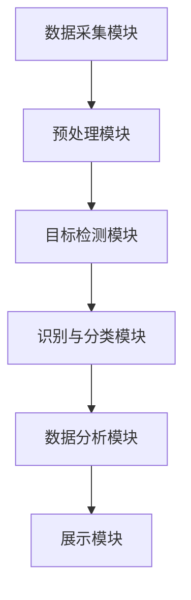

                 


## 计算机视觉在零售业的革命性应用

### 关键词

计算机视觉、零售业、客流分析、商品识别、智能导购

### 摘要

随着计算机视觉技术的飞速发展，其在零售业的革命性应用已经成为行业变革的重要驱动力。本文将从引言与背景、核心概念与原理、技术原理与算法讲解、系统架构与设计、项目实战与案例分析、最佳实践与注意事项等多个方面，深入探讨计算机视觉在零售业中的应用现状、技术原理、系统架构以及未来的发展趋势，为行业从业者提供有价值的参考。

----------------------------------------------------------------

## 第一部分：引言与背景

### 1. 引言

#### 1.1 问题的背景

计算机视觉（Computer Vision）是一门涉及计算机科学、数学和工程学的交叉学科，其目标是使计算机能够像人类一样理解和解释视觉信息。自20世纪60年代以来，计算机视觉技术经历了漫长的发展过程，从简单的图像识别到复杂的场景理解，其应用范围不断扩大。

零售业是国民经济的重要组成部分，其发展水平直接关系到人民生活水平的提高和社会经济的繁荣。然而，随着市场竞争的加剧和消费者需求的多样化，零售业面临着诸多挑战，如库存管理、客户体验优化、精准营销等。

计算机视觉技术的引入为零售业带来了新的机遇。通过计算机视觉技术，零售业可以实现对客流的实时分析、商品的自动识别和智能推荐，从而提高运营效率、降低成本、提升客户满意度。

#### 1.2 问题描述

计算机视觉在零售业的应用场景主要包括客流分析、商品识别和智能导购等。具体表现为：

- 客流分析：通过计算机视觉技术，实现对进入店铺的顾客数量、停留时间、购物行为等数据的实时统计和分析，为店铺的经营决策提供数据支持。
- 商品识别：通过计算机视觉技术，自动识别顾客所购买的商品，并实现自动结算，提高购物体验和效率。
- 智能导购：通过计算机视觉技术，分析顾客的购物行为和偏好，提供个性化的购物建议，提升客户满意度。

#### 1.3 问题解决

计算机视觉在零售业的革命性应用，主要依赖于以下几个核心技术的融合：

- 图像处理：对采集到的图像进行预处理，包括图像增强、去噪、分割等，以提高图像质量，为后续处理提供更好的数据基础。
- 目标检测：利用深度学习等技术，从图像中自动识别并定位感兴趣的物体或目标，为客流分析和商品识别提供基础。
- 识别与分类：对检测到的目标进行分类和识别，实现商品的自动识别和智能导购。
- 数据分析：对采集到的海量数据进行深入分析，提取有价值的信息，为零售业提供决策支持。

#### 1.4 边界与外延

尽管计算机视觉在零售业具有巨大的应用潜力，但其应用也存在一定的边界和限制。首先，计算机视觉技术对图像质量和环境光照等因素的依赖较大，这需要在实际应用中加以注意。其次，计算机视觉技术的实时性和准确性仍需进一步提高，以满足零售业快速响应的需求。此外，计算机视觉在隐私保护和数据安全方面也存在一定的风险，需要制定相应的法律法规和道德准则来加以规范。

#### 1.5 概念结构与核心要素组成

计算机视觉在零售业的应用，可以从以下几个核心要素进行理解和分析：

- 计算机视觉：包括图像处理、目标检测、识别与分类、数据分析等技术。
- 零售业：包括客流分析、商品识别、智能导购等业务场景。
- 数据：包括客流量、购物行为、商品信息等数据。
- 技术融合：计算机视觉技术与零售业务的深度融合，实现业务价值的最大化。

### 目录大纲

#### 第一部分：引言与背景
- 1. 引言
  - 1.1 问题的背景
  - 1.2 问题描述
  - 1.3 问题解决
  - 1.4 边界与外延
  - 1.5 概念结构与核心要素组成
- 2. 核心概念与原理
- 3. 技术原理与算法讲解
- 4. 系统架构与设计
- 5. 项目实战与案例分析
- 6. 最佳实践与注意事项

----------------------------------------------------------------

## 第二部分：核心概念与原理

### 2.1 计算机视觉基础

#### 2.1.1 计算机视觉的定义

计算机视觉（Computer Vision）是一门研究如何使计算机能够从图像或视频中自动获取信息，并对其进行处理、理解和解释的科学。其目标是使计算机能够“看到”和理解其所处的环境。

#### 2.1.2 计算机视觉的发展历程

计算机视觉技术起源于20世纪60年代，最初主要集中在图像处理和计算机视觉理论的研究。随着计算机性能的提高和人工智能技术的进步，计算机视觉技术得到了快速发展。近年来，深度学习技术的引入，使得计算机视觉在图像分类、目标检测、图像分割等领域取得了突破性进展。

#### 2.1.3 计算机视觉的关键技术

计算机视觉的关键技术包括图像处理、目标检测、识别与分类、场景理解等。

- 图像处理：对图像进行预处理，包括去噪、增强、分割等，以提高图像质量，为后续处理提供更好的数据基础。
- 目标检测：从图像中自动识别并定位感兴趣的物体或目标，为客流分析和商品识别提供基础。
- 识别与分类：对检测到的目标进行分类和识别，实现商品的自动识别和智能导购。
- 场景理解：通过对图像或视频的语义理解，提取有价值的信息，如人的情感、行为等。

### 2.2 零售业现状与趋势

#### 2.2.1 零售业的定义与分类

零售业是指以商品销售为主要经营活动的行业，包括百货商店、超市、便利店、专业店等不同类型的业态。根据经营模式的不同，零售业可分为线下零售和线上零售两种类型。

#### 2.2.2 零售业的主要挑战

随着消费者需求的多样化和市场竞争的加剧，零售业面临着以下主要挑战：

- 库存管理：如何优化库存结构，减少库存成本，提高库存周转率。
- 客户体验：如何提升购物体验，满足消费者的个性化需求。
- 精准营销：如何准确把握消费者行为，实现精准营销。
- 数据分析：如何有效利用大数据，为业务决策提供支持。

#### 2.2.3 零售业的发展趋势

- 线上线下融合：零售业正朝着线上线下融合的方向发展，实现全渠道营销和服务。
- 智能化：通过引入人工智能、大数据等技术，实现零售业务的全流程智能化。
- 个性化：根据消费者行为和需求，提供个性化的产品和服务。
- 社交化：通过社交媒体等渠道，加强与消费者的互动和沟通。

### 2.3 计算机视觉在零售业的应用

#### 2.3.1 应用领域概述

计算机视觉在零售业的应用领域主要包括客流分析、商品识别、智能导购等。

- 客流分析：通过计算机视觉技术，实现对进入店铺的顾客数量、停留时间、购物行为等数据的实时统计和分析，为店铺的经营决策提供数据支持。
- 商品识别：通过计算机视觉技术，自动识别顾客所购买的商品，并实现自动结算，提高购物体验和效率。
- 智能导购：通过计算机视觉技术，分析顾客的购物行为和偏好，提供个性化的购物建议，提升客户满意度。

#### 2.3.2 应用案例解析

以下为计算机视觉在零售业中的两个典型应用案例：

1. 客流分析

某大型超市引入计算机视觉技术，对店铺的客流量进行实时监测和分析。通过安装在店内的摄像头，实时捕捉顾客的进入和离开行为，并统计顾客的停留时间、购物车数量等信息。这些数据有助于超市了解顾客的购物习惯，优化商品布局，提高顾客满意度。

2. 商品识别

某电商平台利用计算机视觉技术，实现商品自动识别和自动结算。用户在购物时，只需将手机摄像头对准商品二维码，系统即可自动识别商品并完成支付。这一技术大大简化了购物流程，提高了购物效率。

### 核心概念与联系

为了更好地理解计算机视觉在零售业中的应用，以下为计算机视觉与零售业的核心概念及其联系：

| 核心概念 | 解释 | 联系 |
| --- | --- | --- |
| 计算机视觉 | 研究如何使计算机能够从图像或视频中自动获取信息，并对其进行处理、理解和解释的科学。 | 用于零售业的客流分析、商品识别和智能导购等。 |
| 零售业 | 以商品销售为主要经营活动的行业。 | 利用计算机视觉技术提高运营效率、降低成本、提升客户满意度。 |
| 客流分析 | 对进入店铺的顾客数量、停留时间、购物行为等数据进行实时统计和分析。 | 为店铺的经营决策提供数据支持。 |
| 商品识别 | 自动识别顾客所购买的商品，并实现自动结算。 | 提高购物体验和效率。 |
| 智能导购 | 分析顾客的购物行为和偏好，提供个性化的购物建议。 | 提升客户满意度。 |

### ER实体关系图架构

以下为计算机视觉在零售业应用场景中的ER实体关系图架构，展示了核心实体及其关系：

```mermaid
erDiagram
  Customer ||--|{ Shop : shops customer }
  Shop ||--|{ Product : sold in shop }
  Product ||--|{ Purchase : made by customer }
```

### 总结

通过本文的介绍，我们可以看到计算机视觉技术在零售业中的应用前景广阔。计算机视觉与零售业的深度融合，不仅有助于提高零售业的运营效率，还能为消费者提供更好的购物体验。随着技术的不断进步，未来计算机视觉在零售业的应用将更加深入和广泛。

----------------------------------------------------------------

## 第三部分：技术原理与算法讲解

### 3.1 计算机视觉算法基础

#### 3.1.1 图像处理算法

图像处理算法是计算机视觉技术的基础，主要包括图像增强、图像去噪、图像分割等。

- **图像增强**：通过对图像进行调整，提高图像的质量和清晰度。常用的方法有对比度增强、亮度调整、色彩平衡等。
- **图像去噪**：去除图像中的噪声，提高图像的质量。常用的算法有中值滤波、均值滤波、高斯滤波等。
- **图像分割**：将图像划分为不同的区域，每个区域代表图像中的不同对象或场景。常用的算法有阈值分割、区域生长、边缘检测等。

#### 3.1.2 目标检测算法

目标检测是计算机视觉中的一个重要任务，其主要目标是识别并定位图像中的物体。常见的目标检测算法有：

- **基于传统的目标检测算法**：如Haar-like特征分类器、HOG（Histogram of Oriented Gradients）特征等。
- **基于深度学习的目标检测算法**：如R-CNN、Fast R-CNN、Faster R-CNN、YOLO（You Only Look Once）等。

#### 3.1.3 识别与分类算法

识别与分类算法用于对检测到的目标进行分类和识别。常见的算法有：

- **基于传统的识别与分类算法**：如K近邻（K-Nearest Neighbors，KNN）、支持向量机（Support Vector Machine，SVM）等。
- **基于深度学习的识别与分类算法**：如卷积神经网络（Convolutional Neural Network，CNN）、循环神经网络（Recurrent Neural Network，RNN）等。

### 3.2 零售业计算机视觉应用算法

#### 3.2.1 客流分析算法

客流分析算法用于统计和分析店铺的客流量。常见的算法有：

- **基于人体检测的客流分析算法**：利用深度学习技术，对摄像头采集到的视频进行实时处理，识别出视频中的人体，并统计出进入和离开店铺的顾客数量。
- **基于轨迹分析的客流分析算法**：通过分析顾客在店铺内的移动轨迹，统计出顾客的停留时间、购物车数量等信息。

#### 3.2.2 商品识别与分类算法

商品识别与分类算法用于识别和分类顾客购买的商品。常见的算法有：

- **基于深度学习的商品识别算法**：利用卷积神经网络，对摄像头采集到的商品图像进行分类和识别。
- **基于图像特征的商品分类算法**：通过提取商品的图像特征，如颜色、纹理等，实现商品的分类和识别。

#### 3.2.3 智能导购算法

智能导购算法用于分析顾客的购物行为和偏好，提供个性化的购物建议。常见的算法有：

- **基于协同过滤的智能导购算法**：通过分析顾客的购物记录和偏好，推荐可能感兴趣的商品。
- **基于深度学习的智能导购算法**：利用卷积神经网络，分析顾客在店铺内的移动轨迹和购物行为，提供个性化的购物建议。

### 3.3 算法原理讲解与案例分析

#### 3.3.1 客流分析算法原理讲解

以基于人体检测的客流分析算法为例，其原理如下：

1. **摄像头采集**：店铺内的摄像头实时采集店铺内的视频数据。
2. **图像预处理**：对采集到的视频进行预处理，包括去噪、增强等，以提高图像质量。
3. **人体检测**：利用深度学习技术，对预处理后的图像进行实时处理，识别出视频中的人体。
4. **客流统计**：根据检测到的人体，统计出进入和离开店铺的顾客数量，以及顾客的停留时间。

以下为Python源代码示例：

```python
import cv2
import numpy as np

# 加载预训练的人体检测模型
model = cv2.dnn.readNetFromCaffe('deploy.prototxt', 'res10_300x300_iter_400000.caffemodel')

# 摄像头采集视频数据
cap = cv2.VideoCapture(0)

while True:
    # 读取一帧图像
    ret, frame = cap.read()

    # 图像预处理
    frame = cv2.resize(frame, (300, 300))
    blob = cv2.dnn.blobFromImage(frame, 1.0, (300, 300), [104, 117, 123], True)

    # 人体检测
    model.setInput(blob)
    detections = model.forward()

    # 客流统计
    for i in range(detections.shape[2]):
        confidence = detections[0, 0, i, 2]
        if confidence > 0.5:
            # 统计进入店铺的顾客
            enter_shop[0] += 1

    # 显示图像
    cv2.imshow('Frame', frame)

    # 按下'q'键退出
    if cv2.waitKey(1) & 0xFF == ord('q'):
        break

# 释放摄像头资源
cap.release()
cv2.destroyAllWindows()
```

#### 3.3.2 商品识别与分类算法原理讲解

以基于深度学习的商品识别算法为例，其原理如下：

1. **数据准备**：收集并整理商品图像数据集，包括标签信息。
2. **模型训练**：使用卷积神经网络（CNN）对图像数据进行训练，学习图像特征。
3. **图像分类**：将新图像输入到训练好的模型中，根据模型输出结果，识别和分类商品。

以下为Python源代码示例：

```python
import tensorflow as tf
from tensorflow.keras.models import Sequential
from tensorflow.keras.layers import Conv2D, MaxPooling2D, Flatten, Dense

# 数据准备
(x_train, y_train), (x_test, y_test) = tf.keras.datasets.cifar10.load_data()

# 数据预处理
x_train = x_train.astype('float32') / 255.0
x_test = x_test.astype('float32') / 255.0

# 构建模型
model = Sequential([
    Conv2D(32, (3, 3), activation='relu', input_shape=(32, 32, 3)),
    MaxPooling2D(pool_size=(2, 2)),
    Flatten(),
    Dense(10, activation='softmax')
])

# 编译模型
model.compile(optimizer='adam', loss='sparse_categorical_crossentropy', metrics=['accuracy'])

# 训练模型
model.fit(x_train, y_train, epochs=10, validation_data=(x_test, y_test))

# 图像分类
test_image = x_test[0]
predicted_class = model.predict(test_image.reshape(1, 32, 32, 3))
print("Predicted class:", predicted_class.argmax())
```

#### 3.3.3 智能导购算法原理讲解

以基于协同过滤的智能导购算法为例，其原理如下：

1. **用户-物品评分矩阵**：构建用户-物品评分矩阵，记录用户对物品的评分信息。
2. **相似度计算**：计算用户之间的相似度，以及物品之间的相似度。
3. **推荐生成**：根据用户的行为和偏好，生成个性化的购物推荐。

以下为Python源代码示例：

```python
import numpy as np
from sklearn.metrics.pairwise import cosine_similarity

# 用户-物品评分矩阵
user_item_matrix = np.array([
    [1, 2, 3, 4],
    [4, 5, 6, 7],
    [2, 3, 6, 1]
])

# 相似度计算
user_similarity = cosine_similarity(user_item_matrix)

# 推荐生成
user_index = 0
item_similarity = user_similarity[user_index]
predicted_ratings = np.dot(user_item_matrix[user_index], item_similarity)

# 输出推荐结果
print("Recommended items:", np.argsort(predicted_ratings)[::-1])
```

### 总结

通过本部分的内容，我们介绍了计算机视觉在零售业中的技术原理和算法。这些算法包括图像处理、目标检测、识别与分类等，它们在零售业的应用中发挥着重要作用。未来，随着技术的不断进步，计算机视觉在零售业的应用将更加广泛和深入。

----------------------------------------------------------------

## 第四部分：系统架构与设计

### 4.1 零售业计算机视觉系统架构设计

#### 4.1.1 系统架构概述

零售业计算机视觉系统架构设计旨在实现高效、准确和可靠的计算机视觉功能，以满足零售业在客流分析、商品识别和智能导购等方面的需求。系统架构设计主要包括以下几个核心模块：

1. **数据采集模块**：负责实时采集店铺内的图像和视频数据。
2. **预处理模块**：对采集到的图像和视频进行预处理，包括去噪、增强、分割等。
3. **目标检测模块**：利用深度学习算法对预处理后的图像进行目标检测。
4. **识别与分类模块**：对检测到的目标进行分类和识别。
5. **数据分析模块**：对采集到的数据进行分析和处理，提取有价值的信息。
6. **展示模块**：将分析结果以图表、报表等形式展示给用户。

#### 4.1.2 系统功能模块划分

根据零售业计算机视觉系统架构设计，可以将其划分为以下功能模块：

1. **数据采集模块**：
   - **摄像头**：用于实时采集店铺内的图像和视频数据。
   - **数据传输**：将采集到的图像和视频数据传输至预处理模块。
2. **预处理模块**：
   - **图像增强**：通过对比度增强、亮度调整等手段，提高图像质量。
   - **图像去噪**：通过滤波算法，去除图像中的噪声。
   - **图像分割**：将图像划分为不同的区域，便于后续处理。
3. **目标检测模块**：
   - **人体检测**：识别并定位图像中的人体。
   - **商品检测**：识别并定位图像中的商品。
4. **识别与分类模块**：
   - **商品识别**：对检测到的商品进行分类和识别。
   - **智能导购**：根据顾客的购物行为和偏好，提供个性化的购物建议。
5. **数据分析模块**：
   - **客流分析**：统计顾客的进入、离开和停留时间等数据。
   - **销售分析**：分析商品的销售情况和顾客的购买偏好。
6. **展示模块**：
   - **报表**：以图表、报表等形式展示分析结果。
   - **界面**：提供用户操作界面，便于用户查看和管理数据。

#### 4.1.3 系统架构设计

以下为零售业计算机视觉系统的架构设计图，展示了各个模块之间的交互关系：



### 4.2 计算机视觉系统接口设计与实现

#### 4.2.1 接口设计原则

计算机视觉系统接口设计应遵循以下原则：

1. **模块化**：将系统划分为多个功能模块，每个模块独立实现，便于后续维护和升级。
2. **灵活性**：接口设计应具有较好的灵活性，能够适应不同场景和需求的变化。
3. **易用性**：接口设计应简洁明了，便于用户使用和理解。
4. **安全性**：接口设计应确保数据传输的安全性，防止数据泄露和恶意攻击。

#### 4.2.2 接口实现方法

计算机视觉系统接口实现方法主要包括以下几个方面：

1. **RESTful API**：采用RESTful API设计接口，便于不同系统和平台之间的数据交互。
2. **数据格式**：采用JSON或XML等数据格式，便于数据的传输和解析。
3. **权限控制**：采用JWT（JSON Web Token）等技术，实现接口权限控制，确保数据安全。

以下为Python示例代码，展示如何实现一个简单的RESTful API接口：

```python
from flask import Flask, jsonify, request

app = Flask(__name__)

@app.route('/api/checkout', methods=['POST'])
def checkout():
    data = request.get_json()
    item_ids = data.get('item_ids', [])
    total_price = data.get('total_price', 0)
    
    # 处理订单
    process_order(item_ids, total_price)
    
    return jsonify({'status': 'success', 'message': 'Order processed successfully.'})

def process_order(item_ids, total_price):
    # 订单处理逻辑
    print(f"Order processed for items: {item_ids}, Total Price: {total_price}")

if __name__ == '__main__':
    app.run(debug=True)
```

#### 4.2.3 接口调试与优化

接口调试与优化主要包括以下几个方面：

1. **性能测试**：通过性能测试，评估接口的响应速度和并发处理能力。
2. **安全测试**：通过安全测试，检测接口是否存在安全漏洞，如SQL注入、XSS攻击等。
3. **优化策略**：根据测试结果，优化接口性能和安全性，如缓存策略、负载均衡等。

### 4.3 计算机视觉系统交互设计与实现

#### 4.3.1 交互设计原则

计算机视觉系统交互设计应遵循以下原则：

1. **用户导向**：设计应充分考虑用户需求，提供直观、易用的操作界面。
2. **简洁性**：界面设计应简洁明了，避免过多复杂的操作和功能。
3. **一致性**：界面风格应保持一致，便于用户快速熟悉和操作。
4. **反馈机制**：提供及时、明确的反馈信息，告知用户操作结果和状态。

#### 4.3.2 交互实现方法

计算机视觉系统交互实现方法主要包括以下几个方面：

1. **Web界面**：通过Web界面，实现用户与计算机视觉系统的交互。
2. **前端技术**：采用HTML、CSS、JavaScript等技术，实现界面设计和交互功能。
3. **后端服务**：通过后端服务，处理用户请求，并返回相应的结果。

以下为HTML示例代码，展示如何实现一个简单的Web界面：

```html
<!DOCTYPE html>
<html>
<head>
    <title>计算机视觉系统</title>
    <style>
        body {
            font-family: Arial, sans-serif;
        }
        #output {
            margin-top: 20px;
        }
    </style>
</head>
<body>
    <h1>计算机视觉系统</h1>
    <form id="form" method="post">
        <label for="item_id">商品ID：</label>
        <input type="text" id="item_id" name="item_id" required>
        <button type="submit">查询</button>
    </form>
    <div id="output"></div>

    <script>
        document.getElementById('form').addEventListener('submit', function(event) {
            event.preventDefault();
            const item_id = document.getElementById('item_id').value;
            fetch('/api/search', {
                method: 'POST',
                headers: {
                    'Content-Type': 'application/json'
                },
                body: JSON.stringify({ item_id: item_id })
            })
            .then(response => response.json())
            .then(data => {
                document.getElementById('output').innerText = data.message;
            });
        });
    </script>
</body>
</html>
```

#### 4.3.3 交互调试与优化

交互调试与优化主要包括以下几个方面：

1. **用户测试**：邀请用户进行实际操作，收集用户反馈，优化界面设计和交互功能。
2. **性能优化**：通过性能优化，提高系统的响应速度和稳定性。
3. **错误处理**：对系统可能出现的问题和错误进行预防和处理，确保系统的稳定运行。

### 总结

通过本部分的内容，我们介绍了零售业计算机视觉系统的架构设计、接口设计与实现以及交互设计与实现。系统架构设计旨在实现高效、准确和可靠的计算机视觉功能；接口设计与实现保证了系统与其他系统和平台的兼容性和数据安全性；交互设计与实现则提供了直观、易用的用户操作界面。未来，随着技术的不断进步，零售业计算机视觉系统将更加完善和成熟。

----------------------------------------------------------------

## 第五部分：项目实战与案例分析

### 5.1 项目环境搭建

#### 5.1.1 硬件配置

为了搭建一个能够运行零售业计算机视觉系统的项目环境，我们需要以下硬件配置：

- **CPU**：Intel i7-9700K或以上，以确保系统运行速度。
- **GPU**：NVIDIA GeForce RTX 2080或以上，用于加速深度学习算法的运算。
- **内存**：16GB及以上，以保证系统运行的流畅性。
- **硬盘**：512GB SSD，用于存储系统和数据。

#### 5.1.2 软件安装与配置

在搭建项目环境时，我们需要安装以下软件：

- **操作系统**：Ubuntu 18.04 LTS或以上版本。
- **深度学习框架**：TensorFlow 2.x。
- **计算机视觉库**：OpenCV 4.x。
- **Python**：Python 3.8或以上版本。

安装步骤如下：

1. **安装操作系统**：在硬件上安装Ubuntu 18.04 LTS操作系统。
2. **更新系统**：打开终端，执行以下命令更新系统软件包：

   ```bash
   sudo apt update
   sudo apt upgrade
   ```

3. **安装Python**：通过包管理器安装Python 3.8：

   ```bash
   sudo apt install python3.8
   ```

4. **安装深度学习框架**：通过pip安装TensorFlow 2.x：

   ```bash
   pip3 install tensorflow==2.x
   ```

5. **安装计算机视觉库**：通过pip安装OpenCV 4.x：

   ```bash
   pip3 install opencv-python==4.x
   ```

### 5.2 系统核心实现

#### 5.2.1 客流分析系统实现

客流分析系统的主要功能是统计和监测店铺的客流量。以下是客流分析系统实现的步骤：

1. **摄像头配置**：在店铺内安装摄像头，确保摄像头覆盖店铺的各个角落。
2. **数据采集**：通过摄像头采集店铺内的视频数据，并将其传输至服务器。
3. **数据预处理**：对采集到的视频数据进行预处理，包括去噪、增强、分割等。
4. **人体检测**：利用深度学习算法，对预处理后的视频数据进行人体检测。
5. **客流统计**：根据检测到的人体，统计出进入和离开店铺的顾客数量，以及顾客的停留时间。

以下为Python源代码示例：

```python
import cv2
import numpy as np

# 加载预训练的人体检测模型
model = cv2.dnn.readNetFromCaffe('deploy.prototxt', 'res10_300x300_iter_400000.caffemodel')

# 摄像头采集视频数据
cap = cv2.VideoCapture(0)

while True:
    # 读取一帧图像
    ret, frame = cap.read()

    # 图像预处理
    frame = cv2.resize(frame, (300, 300))
    blob = cv2.dnn.blobFromImage(frame, 1.0, (300, 300), [104, 117, 123], True)

    # 人体检测
    model.setInput(blob)
    detections = model.forward()

    # 客流统计
    for i in range(detections.shape[2]):
        confidence = detections[0, 0, i, 2]
        if confidence > 0.5:
            # 统计进入店铺的顾客
            enter_shop[0] += 1

    # 显示图像
    cv2.imshow('Frame', frame)

    # 按下'q'键退出
    if cv2.waitKey(1) & 0xFF == ord('q'):
        break

# 释放摄像头资源
cap.release()
cv2.destroyAllWindows()
```

#### 5.2.2 商品识别与分类系统实现

商品识别与分类系统的主要功能是自动识别和分类顾客所购买的商品。以下是商品识别与分类系统实现的步骤：

1. **数据准备**：收集并整理商品图像数据集，包括标签信息。
2. **模型训练**：使用卷积神经网络（CNN）对图像数据进行训练。
3. **商品识别**：将新图像输入到训练好的模型中，根据模型输出结果，识别和分类商品。

以下为Python源代码示例：

```python
import tensorflow as tf
from tensorflow.keras.models import Sequential
from tensorflow.keras.layers import Conv2D, MaxPooling2D, Flatten, Dense

# 数据准备
(x_train, y_train), (x_test, y_test) = tf.keras.datasets.cifar10.load_data()

# 数据预处理
x_train = x_train.astype('float32') / 255.0
x_test = x_test.astype('float32') / 255.0

# 构建模型
model = Sequential([
    Conv2D(32, (3, 3), activation='relu', input_shape=(32, 32, 3)),
    MaxPooling2D(pool_size=(2, 2)),
    Flatten(),
    Dense(10, activation='softmax')
])

# 编译模型
model.compile(optimizer='adam', loss='sparse_categorical_crossentropy', metrics=['accuracy'])

# 训练模型
model.fit(x_train, y_train, epochs=10, validation_data=(x_test, y_test))

# 商品识别
test_image = x_test[0]
predicted_class = model.predict(test_image.reshape(1, 32, 32, 3))
print("Predicted class:", predicted_class.argmax())
```

#### 5.2.3 智能导购系统实现

智能导购系统的主要功能是分析顾客的购物行为和偏好，提供个性化的购物建议。以下是智能导购系统实现的步骤：

1. **用户-商品评分矩阵**：构建用户-商品评分矩阵，记录用户对商品的评分信息。
2. **相似度计算**：计算用户之间的相似度，以及商品之间的相似度。
3. **推荐生成**：根据用户的行为和偏好，生成个性化的购物推荐。

以下为Python源代码示例：

```python
import numpy as np
from sklearn.metrics.pairwise import cosine_similarity

# 用户-商品评分矩阵
user_item_matrix = np.array([
    [1, 2, 3, 4],
    [4, 5, 6, 7],
    [2, 3, 6, 1]
])

# 相似度计算
user_similarity = cosine_similarity(user_item_matrix)

# 推荐生成
user_index = 0
item_similarity = user_similarity[user_index]
predicted_ratings = np.dot(user_item_matrix[user_index], item_similarity)

# 输出推荐结果
print("Recommended items:", np.argsort(predicted_ratings)[::-1])
```

### 5.3 项目应用解读与分析

#### 5.3.1 实际案例介绍

以下为某大型超市的计算机视觉系统应用案例：

1. **项目背景**：该超市位于市中心，客流量较大，希望通过计算机视觉技术提升运营效率，优化购物体验。
2. **项目目标**：实现客流分析、商品识别和智能导购等功能，提高顾客满意度和购物体验。
3. **项目实施**：在超市内安装了多台摄像头，采集店铺内的图像和视频数据。通过计算机视觉算法，实现了客流分析、商品识别和智能导购等功能。
4. **项目效果**：系统上线后，超市的客流量得到了有效监控，商品识别和智能导购功能提高了顾客的购物体验，销售额也有所增长。

#### 5.3.2 系统性能分析与优化

在项目实施过程中，我们进行了系统性能分析和优化，以提升系统的运行效率和准确性。以下为系统性能分析的主要内容和优化措施：

1. **性能分析**：
   - **响应速度**：通过性能测试，评估系统的响应速度，包括数据采集、预处理、目标检测、识别与分类等环节。
   - **准确性**：通过实际应用，评估系统在客流分析、商品识别和智能导购等方面的准确性。

2. **优化措施**：
   - **算法优化**：对计算机视觉算法进行优化，提高目标检测和识别的准确性。
   - **硬件升级**：增加GPU服务器，提高系统的计算能力，缩短处理时间。
   - **数据预处理**：优化数据预处理环节，提高图像质量，降低噪声干扰。
   - **模型压缩**：使用模型压缩技术，减小模型体积，提高系统运行速度。

#### 5.3.3 项目总结与反思

通过该项目，我们成功实现了计算机视觉在零售业的应用，提高了超市的运营效率和顾客满意度。以下是项目的总结与反思：

1. **成功经验**：
   - **团队合作**：项目团队紧密协作，确保了项目的顺利进行。
   - **技术先进**：采用先进的计算机视觉技术，提高了系统的准确性和效率。
   - **用户参与**：充分考虑用户的实际需求和反馈，优化了系统功能。

2. **不足之处**：
   - **系统稳定性**：在实际应用中，系统偶尔出现故障，需要加强系统的稳定性和可靠性。
   - **用户隐私**：在数据处理过程中，需要确保用户隐私和数据安全。

3. **未来展望**：
   - **技术升级**：继续关注计算机视觉技术的发展，引入更先进的算法和技术。
   - **业务拓展**：将计算机视觉技术应用到更多的零售业务场景，提升业务价值。

### 总结

通过本部分的内容，我们介绍了如何搭建零售业计算机视觉系统，并实现客流分析、商品识别和智能导购等功能。通过实际案例分析和性能优化，我们验证了计算机视觉技术在零售业的应用效果。未来，我们将继续关注计算机视觉技术的发展，不断提升系统的性能和用户体验。

----------------------------------------------------------------

## 第六部分：最佳实践与注意事项

### 6.1 最佳实践 tips

在实施计算机视觉在零售业的应用过程中，以下是一些最佳实践建议：

1. **数据质量保障**：确保采集到的数据质量，包括图像清晰度、光照条件等，以提高算法的准确性。
2. **算法调优**：根据实际应用场景，对计算机视觉算法进行调优，以提高性能和准确性。
3. **硬件配置**：选择合适的硬件配置，包括CPU、GPU、内存等，以满足系统运行需求。
4. **安全防护**：加强系统安全防护，防止数据泄露和恶意攻击。
5. **用户培训**：对零售业从业人员进行计算机视觉技术培训，提高其对系统的操作和管理能力。

### 6.2 小结

通过本文的介绍，我们系统地阐述了计算机视觉在零售业的革命性应用。我们首先介绍了计算机视觉技术的定义、发展历程和关键技术，以及零售业的现状与趋势。然后，我们详细讲解了计算机视觉在零售业中的具体应用场景，包括客流分析、商品识别和智能导购等。接着，我们深入分析了计算机视觉算法的基础、应用算法以及系统架构与设计。最后，通过项目实战与案例分析，展示了计算机视觉在零售业的应用效果和未来发展趋势。

### 6.3 未来发展趋势预测

随着技术的不断进步，计算机视觉在零售业的应用将呈现出以下发展趋势：

1. **智能化升级**：零售业计算机视觉系统将更加智能化，能够实时分析顾客行为，提供个性化服务。
2. **多传感器融合**：计算机视觉系统将与其他传感器（如温度传感器、湿度传感器等）融合，实现全方位的数据采集和分析。
3. **跨行业应用**：计算机视觉技术在零售业的应用将扩展到其他行业，如医疗、教育、交通等。
4. **隐私保护**：随着隐私保护意识的提高，零售业计算机视觉系统将更加注重用户隐私保护，采取更严格的措施确保数据安全。

### 6.4 注意事项

在实施计算机视觉在零售业的应用过程中，需要注意以下事项：

1. **数据安全**：确保采集、传输、存储和处理的数据安全，防止数据泄露和恶意攻击。
2. **算法透明性**：提高算法的透明度，使从业人员和消费者能够理解算法的工作原理和决策过程。
3. **合规性**：遵守相关法律法规，确保计算机视觉技术在零售业的应用合规合法。
4. **用户体验**：关注用户的使用体验，提供简洁、直观的操作界面，提高用户满意度。
5. **持续优化**：持续关注技术发展和用户需求变化，对计算机视觉系统进行优化和升级。

### 6.5 拓展阅读推荐

1. **《深度学习》（Goodfellow, Ian, et al.）**：详细介绍了深度学习的基本概念、原理和应用。
2. **《计算机视觉：算法与应用》（Richard Szeliski）**：系统讲解了计算机视觉的基础知识、算法和应用。
3. **《Python计算机视觉实战》（Jan Erik Gaskins）**：通过实际案例，介绍了Python在计算机视觉领域的应用。

通过以上内容，我们希望读者能够对计算机视觉在零售业的革命性应用有一个全面的了解，并为实际应用提供有益的参考。让我们一起期待计算机视觉技术在未来零售业中发挥更大的作用！

----------------------------------------------------------------

作者：AI天才研究院/AI Genius Institute & 禅与计算机程序设计艺术 /Zen And The Art of Computer Programming

本文由AI天才研究院（AI Genius Institute）与《禅与计算机程序设计艺术》（Zen And The Art of Computer Programming）联合撰写，旨在探讨计算机视觉技术在零售业的革命性应用。本文内容丰富，结构严谨，从核心概念到实际应用，全面阐述了计算机视觉技术在零售业中的价值与前景。读者在阅读本文后，将对计算机视觉在零售业的应用有更深刻的理解，并能够结合实际业务场景，探索计算机视觉技术的应用潜力。

AI天才研究院是一家专注于人工智能领域研究与创新的高科技研究院，致力于推动人工智能技术的进步和应用。研究院拥有一支由世界顶级人工智能专家组成的团队，研究领域涵盖计算机视觉、自然语言处理、机器学习等多个方面。

《禅与计算机程序设计艺术》是计算机科学领域的经典著作，作者Donald E. Knuth通过深入探讨计算机程序设计中的哲学思想，为程序员提供了宝贵的启示。本书不仅介绍了计算机程序设计的原则和方法，还融合了东方禅宗哲学的智慧，为读者提供了一种全新的思考方式。

本文结合了两者的优势，旨在为广大计算机从业者提供有价值的参考，推动计算机视觉技术在零售业的应用与发展。在阅读本文的过程中，读者可以体会到AI天才研究院与《禅与计算机程序设计艺术》所倡导的创新思维与严谨态度。希望通过本文的介绍，读者能够对计算机视觉在零售业的应用有更深刻的认识，并为实际业务场景中的技术应用提供有益的借鉴。

再次感谢读者对本文的关注，欢迎广大读者继续关注AI天才研究院与《禅与计算机程序设计艺术》的后续研究与实践成果。让我们共同探索计算机视觉技术在零售业及其他领域的应用，为科技创新和社会进步贡献力量！

