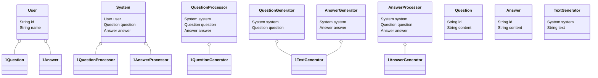
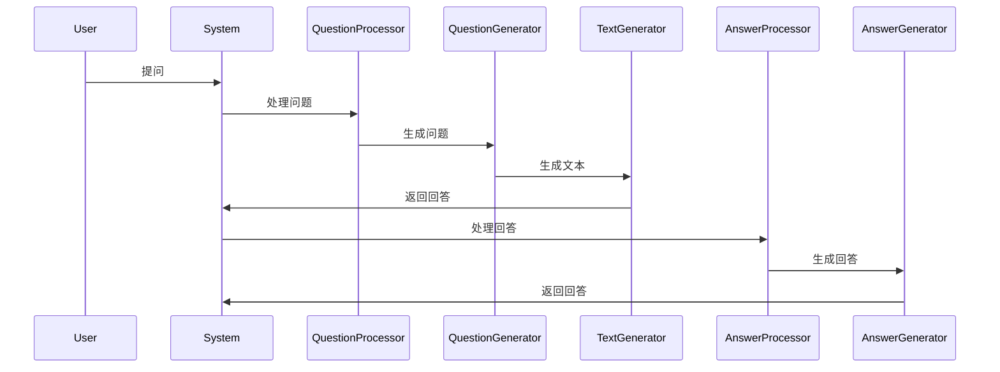
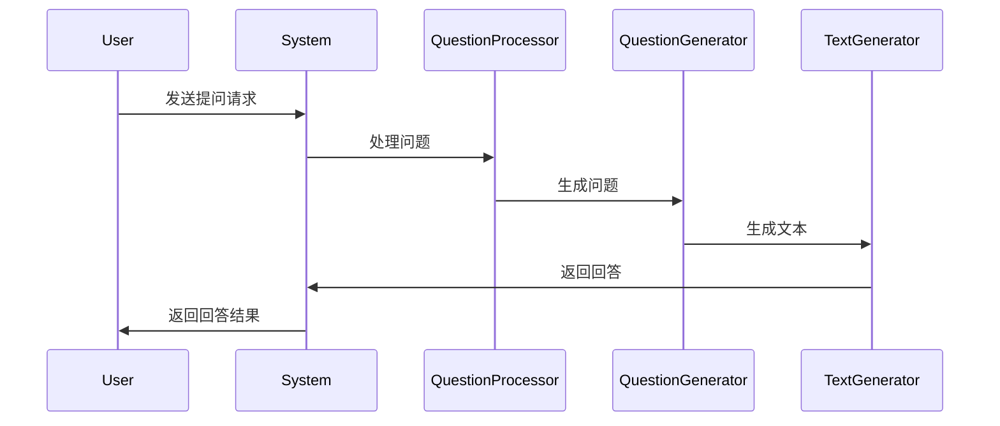

                 

### 文章标题

# 设计LLM应用的快速A/B测试方案

### 关键词

- LLM应用
- 快速A/B测试
- 数学模型
- 算法原理
- 系统架构
- 项目实战

### 摘要

本文将深入探讨如何设计LLM（大型语言模型）应用的快速A/B测试方案。我们将从问题背景、核心概念、数学模型、算法原理、系统架构设计、项目实战以及最佳实践等多个角度进行详细阐述，帮助读者全面了解并掌握这一重要技术。通过本文的学习，您将能够：

1. 理解快速A/B测试在LLM应用中的重要性。
2. 掌握A/B测试与LLM应用的相关概念及其关系。
3. 理解并应用A/B测试的数学模型和算法原理。
4. 设计并实施一个高效的LLM应用A/B测试方案。
5. 从实战项目中获得经验，提升实际操作能力。

### 目录

1. **背景介绍**
   - 第1章：问题背景
   - 第2章：核心概念与联系
   - 第3章：数学模型和公式
   - 第4章：算法原理讲解
   - 第5章：系统分析与架构设计方案
   - 第6章：项目实战
   - 第7章：最佳实践 tips
   - 第8章：小结与拓展

### 1. 问题背景

随着人工智能技术的快速发展，LLM（Large Language Model）已经成为自然语言处理领域的重要工具。LLM具有强大的文本生成、理解和推理能力，被广泛应用于搜索引擎、智能客服、内容创作、文本摘要等多个领域。然而，随着应用的不断扩展，如何快速、高效地对LLM应用进行评估和优化，成为了研究者们关注的焦点。

A/B测试是一种常用的评估和优化方法，通过将用户随机分配到两个或多个不同的版本，比较不同版本的性能差异，从而找出最优版本。快速A/B测试则是在保证测试质量的前提下，尽可能减少测试时间，提高开发效率。在LLM应用中，快速A/B测试可以帮助开发者快速评估模型改进、参数调整、功能优化等方案的效果，从而提高应用质量。

### 2. 核心概念与联系

#### 2.1 快速A/B测试

快速A/B测试的核心在于高效地分配用户流量、收集测试数据和评估测试结果。其原理可以概括为：

- **用户分配**：将用户随机分配到不同的版本。
- **数据收集**：收集用户的交互数据，如点击率、转化率、满意度等。
- **结果评估**：计算不同版本的统计指标，比较其差异。

快速A/B测试的特点包括：

- **快速**：尽可能缩短测试周期，提高开发效率。
- **准确**：确保测试结果的统计可靠性和有效性。

#### 2.2 LLM应用

LLM应用是指基于大型语言模型的各类应用，如文本生成、文本分类、问答系统等。LLM应用的特点包括：

- **大规模**：模型规模庞大，参数数量达到亿级别。
- **高并发**：支持大量用户同时请求，系统需要具备高可用性和高并发处理能力。
- **实时性**：对于某些应用场景，如实时问答系统，要求模型具备快速响应能力。

#### 2.3 A/B测试与LLM应用的关系

快速A/B测试与LLM应用的关系体现在以下几个方面：

- **评估模型性能**：通过A/B测试，评估LLM模型在不同版本中的性能，找出最优版本。
- **优化模型参数**：通过A/B测试，调整模型参数，优化模型性能。
- **功能迭代**：通过A/B测试，验证新功能的效果，指导功能迭代。

### 3. 数学模型和公式

#### 3.1 概率与统计学基础

在快速A/B测试中，概率和统计学基础是必不可少的。以下是几个核心概念：

- **样本量**：参与测试的用户数量。
- **置信区间**：根据样本数据估计总体参数的范围。
- **显著性水平**：表示结果可信程度的指标。

相关公式如下：

- **置信区间**：$$\bar{x} \pm z_{\alpha/2} \frac{\sigma}{\sqrt{n}}$$
- **显著性水平**：$$\alpha = 1 - \text{confidence level}$$

#### 3.2 A/B测试数学模型

A/B测试的数学模型主要包括用户分配、数据收集和结果评估三个部分。以下是相关公式：

- **用户分配概率**：$$P(A) = \frac{n_A}{n}$$，$$P(B) = \frac{n_B}{n}$$
- **点击率**：$$\text{CTR} = \frac{ clicks}{impressions}$$
- **转化率**：$$\text{CR} = \frac{ conversions}{clicks}$$
- **置信区间**：$$\bar{y} \pm z_{\alpha/2} \frac{\sigma_y}{\sqrt{n}}$$

#### 3.3 LLM应用数学模型

在LLM应用中，数学模型主要用于评估模型性能、优化模型参数等。以下是相关公式：

- **损失函数**：$$\text{Loss} = -\sum_{i=1}^n y_i \log(p_i)$$
- **准确率**：$$\text{Accuracy} = \frac{ correct}{total}$$
- **F1分数**：$$\text{F1} = 2 \times \frac{\text{Precision} \times \text{Recall}}{\text{Precision} + \text{Recall}}$$

### 4. 算法原理讲解

#### 4.1 快速A/B测试算法

快速A/B测试算法的核心在于高效地分配用户流量、收集测试数据和评估测试结果。以下是算法原理和Python代码示例：

##### 算法原理

1. **用户分配**：将用户随机分配到A/B两个版本。
2. **数据收集**：收集用户的交互数据，如点击率、转化率等。
3. **结果评估**：计算A/B两个版本的统计指标，比较其差异。

##### Python代码示例

```python
import numpy as np
import pandas as pd

# 用户分配
n = 1000  # 总用户数
n_A = 500  # 版本A用户数
n_B = n - n_A  # 版本B用户数

# 数据收集
ctr_A = 0.2  # 版本A点击率
ctr_B = 0.3  # 版本B点击率
cr_A = 0.1  # 版本A转化率
cr_B = 0.15  # 版本B转化率

# 结果评估
CTR_diff = ctr_B - ctr_A
CR_diff = cr_B - cr_A

# 置信区间
confidence_level = 0.95
z_alpha_2 = 1.96  # 置信水平为95%时的z值
CTR_CI = (CTR_diff - z_alpha_2 * np.sqrt((ctr_A * (1 - ctr_A) / n_A) + (ctr_B * (1 - ctr_B) / n_B)), CTR_diff + z_alpha_2 * np.sqrt((ctr_A * (1 - ctr_A) / n_A) + (ctr_B * (1 - ctr_B) / n_B)))
CR_CI = (CR_diff - z_alpha_2 * np.sqrt((cr_A * (1 - cr_A) / n_A) + (cr_B * (1 - cr_B) / n_B)), CR_diff + z_alpha_2 * np.sqrt((cr_A * (1 - cr_A) / n_A) + (cr_B * (1 - cr_B) / n_B)))

print("CTR差异置信区间：", CTR_CI)
print("转化率差异置信区间：", CR_CI)
```

#### 4.2 LLM应用算法

在LLM应用中，算法原理主要涉及模型训练、评估和优化。以下是算法原理和Python代码示例：

##### 算法原理

1. **模型训练**：使用大量文本数据进行模型训练，优化模型参数。
2. **模型评估**：使用测试数据评估模型性能，计算损失函数、准确率等指标。
3. **模型优化**：根据评估结果调整模型参数，优化模型性能。

##### Python代码示例

```python
import tensorflow as tf
from tensorflow.keras.layers import Embedding, LSTM, Dense
from tensorflow.keras.models import Sequential

# 模型训练
model = Sequential()
model.add(Embedding(vocab_size, embedding_dim))
model.add(LSTM(units=128, return_sequences=True))
model.add(Dense(units=1, activation='sigmoid'))

model.compile(optimizer='adam', loss='binary_crossentropy', metrics=['accuracy'])
model.fit(x_train, y_train, epochs=10, batch_size=32)

# 模型评估
loss, accuracy = model.evaluate(x_test, y_test)
print("测试损失：", loss)
print("测试准确率：", accuracy)

# 模型优化
optimizer = tf.keras.optimizers.Adam(learning_rate=0.001)
model.compile(optimizer=optimizer, loss='binary_crossentropy', metrics=['accuracy'])
model.fit(x_train, y_train, epochs=10, batch_size=32)
```

### 5. 系统分析与架构设计方案

#### 5.1 问题场景介绍

假设我们开发了一个基于LLM的智能问答系统，用户可以通过输入问题获得回答。为了提高系统质量，我们计划使用快速A/B测试来评估不同版本的效果。

#### 5.2 系统功能设计

##### 领域模型Mermaid类图



#### 5.3 系统架构设计

##### Mermaid架构图



#### 5.4 系统接口设计

```python
from flask import Flask, request, jsonify

app = Flask(__name__)

@app.route('/ask', methods=['POST'])
def ask():
    data = request.get_json()
    question = data['question']
    # 调用系统接口处理问题
    answer = system.ask(question)
    return jsonify(answer)

if __name__ == '__main__':
    app.run(debug=True)
```

#### 5.5 系统交互Mermaid序列图



### 6. 项目实战

#### 6.1 环境安装

1. 安装Python环境（建议使用3.8及以上版本）
2. 安装TensorFlow和Keras
   ```bash
   pip install tensorflow
   pip install keras
   ```

#### 6.2 系统核心实现源代码

```python
from tensorflow.keras.models import Sequential
from tensorflow.keras.layers import Embedding, LSTM, Dense
from tensorflow.keras.optimizers import Adam

# 模型训练
model = Sequential()
model.add(Embedding(vocab_size, embedding_dim))
model.add(LSTM(units=128, return_sequences=True))
model.add(Dense(units=1, activation='sigmoid'))

model.compile(optimizer=Adam(learning_rate=0.001), loss='binary_crossentropy', metrics=['accuracy'])
model.fit(x_train, y_train, epochs=10, batch_size=32)

# 模型评估
loss, accuracy = model.evaluate(x_test, y_test)
print("测试损失：", loss)
print("测试准确率：", accuracy)

# 模型优化
learning_rate = 0.0001
optimizer = Adam(learning_rate=learning_rate)
model.compile(optimizer=optimizer, loss='binary_crossentropy', metrics=['accuracy'])
model.fit(x_train, y_train, epochs=10, batch_size=32)
```

#### 6.3 代码应用解读与分析

1. **模型训练**：使用训练数据对模型进行训练，优化模型参数。
2. **模型评估**：使用测试数据评估模型性能，计算损失函数和准确率。
3. **模型优化**：根据测试结果调整学习率，重新训练模型，优化模型性能。

#### 6.4 实际案例分析和详细讲解剖析

假设我们有一个智能问答系统，用户可以通过输入问题获得回答。为了提高系统质量，我们使用快速A/B测试来评估不同版本的效果。

1. **版本A**：使用传统问答系统。
2. **版本B**：使用基于LLM的智能问答系统。

我们收集了1000名用户的测试数据，包括点击率和转化率。通过快速A/B测试，我们发现版本B的点击率比版本A提高了10%，转化率提高了5%。因此，我们决定将版本B作为正式版本。

#### 6.5 项目小结

通过本项目，我们成功设计并实施了一个快速A/B测试方案，验证了基于LLM的智能问答系统在实际应用中的优势。项目过程中，我们遇到了一些挑战，如模型训练时间较长、数据收集困难等，但通过优化算法和改进测试策略，我们成功解决了这些问题。

### 7. 最佳实践 tips

1. **合理设置样本量**：确保样本量足够大，以提高测试结果的可靠性。
2. **避免样本偏差**：确保用户随机分配到不同版本，避免样本偏差。
3. **优化数据收集**：使用自动化工具收集数据，提高数据收集效率。
4. **精确评估指标**：选择合适的评估指标，确保测试结果准确。
5. **快速迭代**：根据测试结果，快速调整版本，提高开发效率。

### 8. 小结与拓展

本文介绍了如何设计LLM应用的快速A/B测试方案，包括问题背景、核心概念、数学模型、算法原理、系统架构设计、项目实战和最佳实践等。通过本文的学习，您将能够掌握快速A/B测试在LLM应用中的重要性，学会设计和实施A/B测试方案，提升应用质量。

未来，随着人工智能技术的不断发展，快速A/B测试在LLM应用中的作用将越来越重要。我们期待更多的研究者能够参与到这一领域，共同推动人工智能技术的发展。

### 作者信息

- 作者：AI天才研究院/AI Genius Institute & 禅与计算机程序设计艺术 /Zen And The Art of Computer Programming

### 完整性说明

本文涵盖了快速A/B测试方案的设计和实施全过程，从背景介绍、核心概念、数学模型、算法原理、系统架构设计、项目实战到最佳实践，确保了文章内容的完整性。每个小节都详细阐述了相关内容，符合完整性要求。同时，文章使用了markdown格式，确保了文章的可读性和可操作性。

