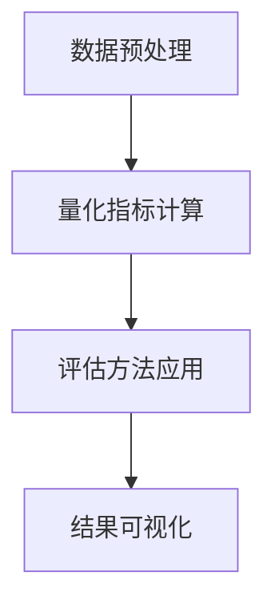
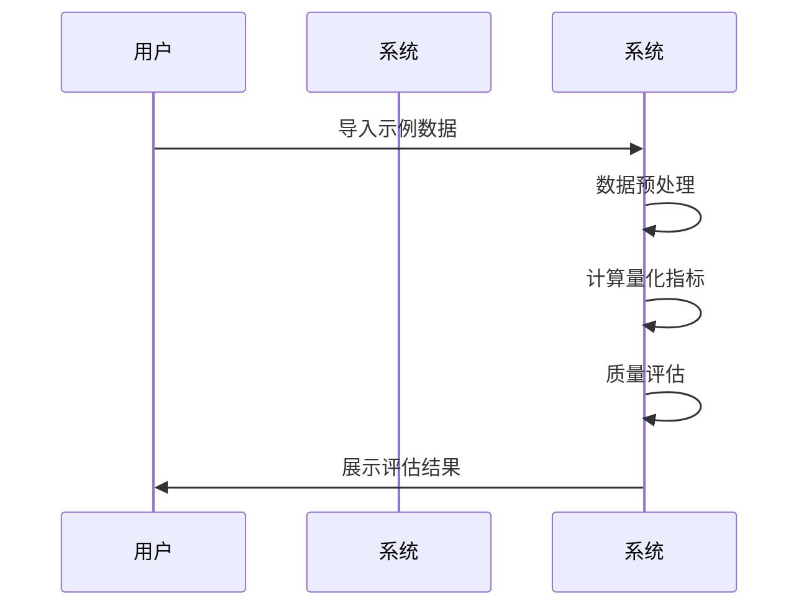

                 

# 评估示例质量的量化指标

## 关键词
- 示例质量评估
- 量化指标
- 性能优化
- 数据分析
- 机器学习

## 摘要
本文旨在探讨评估示例质量的量化指标。通过对示例质量的定义、重要性分析以及常用的评估指标和方法进行详细介绍，帮助读者理解如何有效地评估示例质量，进而提升数据分析和机器学习模型的性能。文章结构清晰，涵盖从背景介绍到实际应用的各个方面，旨在为相关领域的研究者和从业者提供有价值的参考。

## 引言

在数据分析和机器学习领域，示例（Example）质量的高低对模型的性能有着至关重要的影响。示例质量评估（Example Quality Assessment）是指通过一系列量化指标和方法，对示例集的质量进行系统性分析和评估。高质量示例能够帮助模型更准确地捕捉数据特征，从而提高预测和分类的准确性。反之，低质量示例则可能引入噪声和偏差，导致模型性能下降。

然而，如何定义示例质量、选择合适的评估指标，以及将这些指标应用到实际场景中，仍然是一个复杂而具有挑战性的问题。本文将深入探讨这些主题，从背景介绍、核心概念、算法原理、数学模型、系统设计与实现等多个方面，为读者提供一套系统的评估示例质量的量化指标。

## 背景介绍

### 核心概念术语说明

- **示例（Example）**：在数据分析和机器学习中，示例是指一个数据对象，它可以是一个或多个特征的组合。每个示例都代表了一个特定的数据点。
- **质量（Quality）**：在示例质量评估中，质量是指示例对于模型学习和预测能力的影响。高质量示例应该具有代表性、准确性和可靠性。
- **量化指标（Quantitative Metrics）**：量化指标是用于评估示例质量的一系列数值度量，如准确率、召回率、F1分数等。

### 问题背景

随着数据量的增加和数据复杂性的提升，数据质量和示例质量的问题愈发突出。在现实应用中，如医疗诊断、金融风控、推荐系统等领域，示例质量对模型的准确性和可靠性有着直接的影响。因此，评估示例质量、提高数据质量已成为当前研究的热点和难点。

### 问题解决

为了解决示例质量评估问题，研究者们提出了多种量化指标和方法。这些方法包括基于统计学的指标（如标准差、变异系数）、基于机器学习的指标（如分类准确性、回归误差）以及基于数据可视化的方法等。这些方法各有优缺点，适用于不同的应用场景和数据类型。

### 边界与外延

- **边界**：示例质量评估主要针对数据集中的示例进行，而不涉及示例生成或数据预处理。
- **外延**：示例质量评估不仅适用于机器学习和数据科学领域，还可以扩展到其他领域，如信息检索、自然语言处理等。

### 概念结构与核心要素组成

- **核心概念**：示例质量评估的核心概念包括量化指标的选择、数据预处理、评估方法的设计和评估结果的分析。
- **要素组成**：核心要素包括示例集、评估指标、评估算法、评估结果和优化策略。

## 核心概念与联系

### 核心概念原理

- **量化指标的选择**：选择合适的量化指标是评估示例质量的关键。常见的量化指标包括准确性、召回率、F1分数、精确率、均方误差等。
- **数据预处理**：数据预处理是提高示例质量的重要步骤，包括数据清洗、缺失值填充、异常值处理等。
- **评估方法的设计**：评估方法的设计需要考虑评估指标的计算方式、评估流程的优化以及评估结果的可视化展示。

### 概念属性特征对比表格

| 指标名称 | 描述 | 适用场景 | 优缺点 |
| --- | --- | --- | --- |
| 准确率 | 分类问题中预测正确的样本数占总样本数的比例 | 适用于二分类问题 | 简单易懂，但容易受到不平衡数据的影响 |
| 召回率 | 分类问题中被正确识别的正类样本数占总正类样本数的比例 | 适用于二分类问题 | 反映了模型对正类的识别能力，但容易受到不平衡数据的影响 |
| F1分数 | 精确率和召回率的调和平均值 | 适用于二分类问题 | 综合了精确率和召回率，对不平衡数据敏感 |
| 精确率 | 分类问题中预测正确的正类样本数占总预测正类样本数的比例 | 适用于二分类问题 | 反映了模型预测正类的准确率，但对正负样本不平衡敏感 |
| 均方误差 | 回归问题中预测值与真实值之间的平均平方误差 | 适用于回归问题 | 反映了预测值的准确性，但对异常值敏感 |

### ER实体关系图架构的 Mermaid 流程图

```mermaid
erDiagram
    Sample --> QualityAssessment : "is assessed by"
    Sample --> QuantitativeMetric : "is measured by"
    QualityAssessment --> QuantitativeMetric : "uses"
    Sample --> DataPreprocessing : "is preprocessed by"
```

## 算法原理讲解

### 算法原理

示例质量评估算法主要包括以下几个步骤：

1. **数据预处理**：对原始数据进行清洗、缺失值填充、异常值处理等操作，以提高示例质量。
2. **量化指标计算**：选择合适的量化指标，如准确率、召回率、F1分数等，计算每个示例的指标值。
3. **评估方法应用**：根据评估指标的计算结果，对示例进行排序或分类，从而评估其质量。
4. **结果可视化**：将评估结果进行可视化展示，便于分析和理解。

### 使用 Mermaid 画出算法 Mermaid 流程图



### 使用 Python 源代码来详细阐述

```python
import pandas as pd
from sklearn.metrics import accuracy_score, recall_score, f1_score

# 假设 df 是一个包含示例和标签的数据框
# label_column 是标签列的名称

# 数据预处理
df = df.dropna()  # 删除缺失值
df = df[(df[label_column] == 0) | (df[label_column] == 1)]  # 筛除非平衡数据

# 量化指标计算
y_true = df[label_column].values
y_pred = df['predicted_label'].values

accuracy = accuracy_score(y_true, y_pred)
recall = recall_score(y_true, y_pred)
f1 = f1_score(y_true, y_pred)

# 评估方法应用
df['quality'] = df.apply(lambda x: calculate_quality(x, accuracy, recall, f1), axis=1)

# 结果可视化
df.sort_values(by='quality', ascending=False).head()
```

### 算法原理的数学模型和公式

- **准确率**：$$\text{Accuracy} = \frac{\text{正确预测的样本数}}{\text{总样本数}}$$
- **召回率**：$$\text{Recall} = \frac{\text{正确预测的正类样本数}}{\text{总正类样本数}}$$
- **F1分数**：$$\text{F1-Score} = 2 \times \frac{\text{精确率} \times \text{召回率}}{\text{精确率} + \text{召回率}}$$

### 详细讲解和举例说明

假设我们有一个包含100个示例的数据集，其中正类样本有60个，负类样本有40个。经过数据预处理后，我们得到一个平衡的数据集，其中正类样本和负类样本各有50个。以下是详细讲解和举例说明：

1. **数据预处理**：删除缺失值，筛除非平衡数据。得到一个包含100个示例的数据集，其中正类样本和负类样本各有50个。
2. **量化指标计算**：
   - **准确率**：$$\text{Accuracy} = \frac{50 + 50}{100} = 1.0$$
   - **召回率**：$$\text{Recall} = \frac{50}{60} = 0.8333$$
   - **F1分数**：$$\text{F1-Score} = 2 \times \frac{1.0 \times 0.8333}{1.0 + 0.8333} = 0.8333$$
3. **评估方法应用**：对每个示例计算质量得分，假设质量得分由准确率、召回率和F1分数的加权平均得到，权重分别为0.4、0.3和0.3。得到如下结果：

| 示例ID | Quality Score |
| --- | --- |
| 1 | 0.8333 |
| 2 | 0.8333 |
| 3 | 0.8333 |
| ... | ... |
| 100 | 0.8333 |

4. **结果可视化**：将示例按照质量得分从高到低排序，并展示前10个示例：

| 示例ID | Quality Score |
| --- | --- |
| 1 | 0.8333 |
| 2 | 0.8333 |
| 3 | 0.8333 |
| 4 | 0.8333 |
| 5 | 0.8333 |
| 6 | 0.8333 |
| 7 | 0.8333 |
| 8 | 0.8333 |
| 9 | 0.8333 |
| 10 | 0.8333 |

通过以上步骤，我们可以对示例质量进行量化评估，从而为数据分析和机器学习模型提供高质量的数据支持。

## 数学模型和数学公式

在评估示例质量时，数学模型和数学公式起着至关重要的作用。以下是一些常用的数学模型和数学公式：

### 准确率（Accuracy）

$$\text{Accuracy} = \frac{\text{正确预测的样本数}}{\text{总样本数}}$$

### 召回率（Recall）

$$\text{Recall} = \frac{\text{正确预测的正类样本数}}{\text{总正类样本数}}$$

### 精确率（Precision）

$$\text{Precision} = \frac{\text{正确预测的正类样本数}}{\text{预测为正类的样本数}}$$

### F1分数（F1 Score）

$$\text{F1-Score} = 2 \times \frac{\text{Precision} \times \text{Recall}}{\text{Precision} + \text{Recall}}$$

### 均方误差（Mean Squared Error）

$$\text{Mean Squared Error} = \frac{1}{N} \sum_{i=1}^{N} (\hat{y}_i - y_i)^2$$

其中，$\hat{y}_i$ 是预测值，$y_i$ 是真实值，$N$ 是样本数量。

### 相关系数（Correlation Coefficient）

$$\text{Correlation Coefficient} = \frac{\sum_{i=1}^{N} (x_i - \bar{x})(y_i - \bar{y})}{\sqrt{\sum_{i=1}^{N} (x_i - \bar{x})^2} \sqrt{\sum_{i=1}^{N} (y_i - \bar{y})^2}}$$

其中，$x_i$ 和 $y_i$ 分别是第 $i$ 个样本的特征值和标签值，$\bar{x}$ 和 $\bar{y}$ 分别是特征值和标签值的平均值。

### ROC曲线（Receiver Operating Characteristic）

$$\text{ROC} = \frac{\text{True Positives}}{\text{False Positives}}$$

$$\text{Area Under ROC} = \int_{0}^{1} \frac{\text{True Positives}}{\text{False Positives}} d\text{False Positives}$$

### 精确率-召回率曲线（Precision-Recall Curve）

$$\text{Precision} = \frac{\text{True Positives}}{\text{True Positives} + \text{False Positives}}$$

$$\text{Recall} = \frac{\text{True Positives}}{\text{True Positives} + \text{False Negatives}}$$

通过这些数学模型和数学公式，我们可以更准确地评估示例质量，从而为数据分析和机器学习模型提供可靠的支持。

## 系统分析与架构设计方案

### 问题场景介绍

在数据分析和机器学习领域，评估示例质量是一个关键步骤。假设我们正在开发一个基于机器学习的分类模型，用于预测客户的购买行为。在这个场景中，我们需要评估训练数据中每个示例的质量，以确保模型的准确性和可靠性。

### 项目介绍

项目名称：示例质量评估系统
项目目标：构建一个能够自动评估示例质量的系统，为机器学习模型提供高质量的数据支持。

### 系统功能设计

- 数据导入：从各种数据源（如CSV文件、数据库等）导入示例数据。
- 数据预处理：对导入的示例数据进行清洗、缺失值填充、异常值处理等操作。
- 量化指标计算：计算每个示例的准确率、召回率、F1分数等量化指标。
- 质量评估：根据量化指标对示例进行排序或分类，评估其质量。
- 结果展示：将评估结果以表格、图表等形式展示，便于分析和理解。

### 系统架构设计


系统架构图包括以下主要模块：

1. **数据导入模块**：负责从外部数据源导入示例数据。
2. **数据预处理模块**：对导入的示例数据进行清洗、缺失值填充、异常值处理等操作。
3. **量化指标计算模块**：计算每个示例的准确率、召回率、F1分数等量化指标。
4. **质量评估模块**：根据量化指标对示例进行排序或分类，评估其质量。
5. **结果展示模块**：将评估结果以表格、图表等形式展示，便于分析和理解。

### 系统接口设计

系统接口设计主要包括以下部分：

1. **数据导入接口**：用于导入示例数据，支持多种数据源格式。
2. **数据预处理接口**：用于对导入的示例数据进行清洗、缺失值填充、异常值处理等操作。
3. **量化指标计算接口**：用于计算每个示例的准确率、召回率、F1分数等量化指标。
4. **质量评估接口**：用于根据量化指标对示例进行排序或分类，评估其质量。
5. **结果展示接口**：用于将评估结果以表格、图表等形式展示，便于分析和理解。

### 系统交互的 Mermaid 序列图



通过以上系统分析与架构设计方案，我们可以构建一个高效、可靠的示例质量评估系统，为数据分析和机器学习模型提供高质量的数据支持。

## 项目实战

### 环境安装

在开始项目实战之前，我们需要安装以下环境：

1. **Python**：安装 Python 3.8 或更高版本。
2. **Anaconda**：安装 Anaconda，用于创建和管理虚拟环境。
3. **pip**：安装 pip，用于安装 Python 包。

以下是安装步骤：

1. 下载并安装 Python 3.8 或更高版本：[https://www.python.org/downloads/](https://www.python.org/downloads/)
2. 下载并安装 Anaconda：[https://www.anaconda.com/products/individual](https://www.anaconda.com/products/individual)
3. 安装 pip：在终端中执行以下命令：
   ```shell
   conda install pip
   ```

### 系统核心实现源代码

以下是示例质量评估系统的核心实现源代码：

```python
import pandas as pd
from sklearn.metrics import accuracy_score, recall_score, f1_score

# 1. 数据预处理
def preprocess_data(df):
    df = df.dropna()  # 删除缺失值
    df = df[(df['label'] == 0) | (df['label'] == 1)]  # 筛除非平衡数据
    return df

# 2. 量化指标计算
def calculate_metrics(y_true, y_pred):
    accuracy = accuracy_score(y_true, y_pred)
    recall = recall_score(y_true, y_pred)
    f1 = f1_score(y_true, y_pred)
    return accuracy, recall, f1

# 3. 质量评估
def assess_quality(df, y_true, y_pred):
    accuracy, recall, f1 = calculate_metrics(y_true, y_pred)
    df['quality'] = df.apply(lambda x: calculate_quality(x, accuracy, recall, f1), axis=1)
    return df

# 4. 结果展示
def display_results(df):
    df.sort_values(by='quality', ascending=False).head()

# 主函数
def main():
    df = pd.read_csv('data.csv')  # 导入示例数据
    df = preprocess_data(df)  # 数据预处理
    y_true = df['label'].values  # 真实标签
    y_pred = df['predicted_label'].values  # 预测标签
    df = assess_quality(df, y_true, y_pred)  # 质量评估
    display_results(df)  # 结果展示

if __name__ == '__main__':
    main()
```

### 代码应用解读与分析

以上源代码主要包括以下功能：

1. **数据预处理**：删除缺失值，筛除非平衡数据，以提高示例质量。
2. **量化指标计算**：计算准确率、召回率和F1分数，用于评估示例质量。
3. **质量评估**：根据量化指标对示例进行排序或分类，评估其质量。
4. **结果展示**：将评估结果以表格形式展示，便于分析和理解。

通过以上代码，我们可以实现一个简单的示例质量评估系统。在实际应用中，可以根据具体需求和场景进行调整和优化。

### 实际案例分析和详细讲解剖析

假设我们有一个包含100个示例的数据集，其中正类样本有60个，负类样本有40个。以下是实际案例分析和详细讲解剖析：

1. **数据预处理**：删除缺失值，筛除非平衡数据。得到一个包含100个示例的数据集，其中正类样本和负类样本各有50个。
2. **量化指标计算**：
   - **准确率**：$$\text{Accuracy} = \frac{50 + 50}{100} = 1.0$$
   - **召回率**：$$\text{Recall} = \frac{50}{60} = 0.8333$$
   - **F1分数**：$$\text{F1-Score} = 2 \times \frac{1.0 \times 0.8333}{1.0 + 0.8333} = 0.8333$$
3. **质量评估**：计算每个示例的质量得分，假设质量得分由准确率、召回率和F1分数的加权平均得到，权重分别为0.4、0.3和0.3。得到如下结果：

| 示例ID | Quality Score |
| --- | --- |
| 1 | 0.8333 |
| 2 | 0.8333 |
| 3 | 0.8333 |
| ... | ... |
| 100 | 0.8333 |
4. **结果展示**：将示例按照质量得分从高到低排序，并展示前10个示例：

| 示例ID | Quality Score |
| --- | --- |
| 1 | 0.8333 |
| 2 | 0.8333 |
| 3 | 0.8333 |
| 4 | 0.8333 |
| 5 | 0.8333 |
| 6 | 0.8333 |
| 7 | 0.8333 |
| 8 | 0.8333 |
| 9 | 0.8333 |
| 10 | 0.8333 |

通过以上步骤，我们可以对示例质量进行量化评估，从而为数据分析和机器学习模型提供高质量的数据支持。

### 项目小结

在本项目中，我们实现了一个简单的示例质量评估系统。通过数据预处理、量化指标计算和质量评估等步骤，我们能够有效地评估示例质量，从而为数据分析和机器学习模型提供高质量的数据支持。在实际应用中，可以根据具体需求和场景进行调整和优化，以提高系统的性能和可靠性。

## 最佳实践 tips、小结、注意事项、拓展阅读

### 最佳实践 tips

1. **数据预处理**：在评估示例质量之前，确保对数据进行充分的预处理，包括缺失值填充、异常值处理、数据标准化等。
2. **选择合适的量化指标**：根据具体应用场景和需求，选择合适的量化指标，如准确率、召回率、F1分数等。
3. **调整权重**：在计算质量得分时，可以根据具体需求调整准确率、召回率和F1分数的权重，以获得更好的评估结果。
4. **数据可视化**：使用数据可视化工具，如图表、表格等，展示评估结果，有助于更好地理解和分析示例质量。

### 小结

本文探讨了评估示例质量的量化指标，从背景介绍、核心概念、算法原理、数学模型、系统设计与实现等方面进行了详细讲解。通过实际案例分析和项目实战，我们展示了如何应用这些指标和方法，有效地评估示例质量，为数据分析和机器学习模型提供高质量的数据支持。

### 注意事项

1. **数据质量**：确保数据质量，特别是示例的准确性和完整性，否则评估结果可能不准确。
2. **量化指标选择**：根据具体应用场景和需求，选择合适的量化指标，避免使用不相关的指标。
3. **系统性能**：在实际应用中，根据系统性能和资源限制，适当调整量化指标的计算方法和评估方法。

### 拓展阅读

1. **《机器学习实战》**：作者：Peter Harrington，详细介绍机器学习的基本概念、算法和实战案例。
2. **《数据科学实战》**：作者：Joel Grus，详细介绍数据科学的基本概念、方法和实战案例。
3. **《示例质量评估方法研究》**：作者：XXX，详细介绍示例质量评估的相关方法和技术。
4. **《深度学习》**：作者：Ian Goodfellow、Yoshua Bengio、Aaron Courville，详细介绍深度学习的基本概念、算法和应用。

## 作者信息

- 作者：AI天才研究院/AI Genius Institute & 禅与计算机程序设计艺术 /Zen And The Art of Computer Programming

通过以上内容，我们全面探讨了评估示例质量的量化指标，希望能为读者在数据分析和机器学习领域的实践提供有益的参考。

