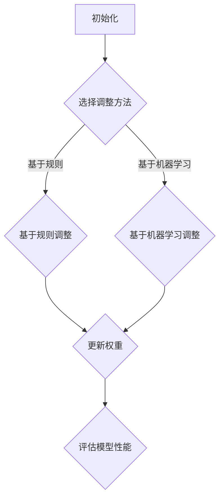
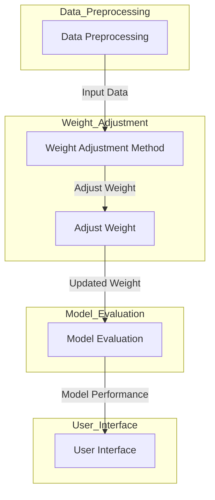
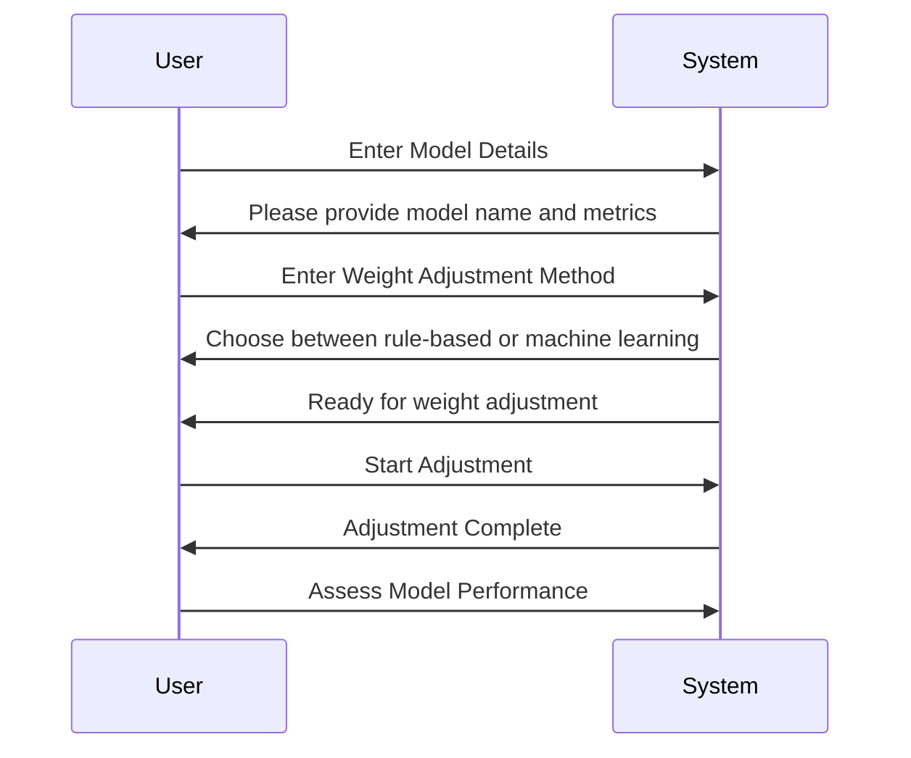

                 

### 评测指标的权重动态调整：适应不同应用需求

> 关键词：评测指标、权重调整、动态调整、模型性能、应用需求

> 摘要：本文将探讨评测指标权重动态调整的重要性，分析其在适应不同应用需求中的作用，并提出一系列有效的调整方法和实际应用案例。

### 第一部分：背景介绍

#### 问题背景

在人工智能技术不断发展的背景下，评测指标成为了评估模型性能的重要手段。然而，传统的评测指标往往存在一定的局限性，无法全面、准确地反映模型的实际性能。为了解决这一问题，需要对评测指标进行动态调整，以适应不同应用场景的需求。

#### 问题描述

评测指标的权重动态调整是一个复杂的过程，涉及到多个因素，如数据集的分布、模型的特性、应用场景等。如何设计一个有效的动态调整方法，以提高评测指标的准确性和实用性，成为当前研究的热点问题。

#### 问题解决

本书将从以下几个方面展开讨论：

1. 评测指标的权重动态调整方法：介绍常见的动态调整方法，分析其优缺点，并探讨如何在实际应用中进行选择。
2. 评测指标的权重动态调整应用：结合具体的应用场景，阐述如何对评测指标进行动态调整，以提高模型的性能。
3. 评测指标的权重动态调整挑战与未来方向：讨论当前研究的不足和挑战，展望未来可能的发展趋势。

#### 边界与外延

本书主要关注评测指标权重动态调整在人工智能领域中的应用，但也可以拓展到其他需要动态调整权重的领域，如信号处理、图像处理等。

#### 概念结构与核心要素组成

- 评测指标：用于评估模型性能的指标。
- 权重动态调整：根据应用场景和模型特性，动态调整评测指标的权重。
- 动态调整方法：包括基于规则的调整方法、基于机器学习的调整方法等。
- 应用场景：不同领域的应用场景，如自然语言处理、计算机视觉等。

### 第二部分：核心概念与联系

#### 核心概念原理

1. **评测指标**：评测指标是用来评估模型性能的关键参数，通常包括准确率、召回率、F1值等。它们从不同角度衡量模型的性能，但各自的侧重点和适用范围有所不同。

2. **权重动态调整**：权重动态调整是一种根据不同应用场景和模型特性动态调整评测指标权重的技术。通过调整权重，可以使得评测指标更符合实际应用的需求，从而更准确地评估模型性能。

#### 概念属性特征对比表格

| 概念         | 描述                                     | 特征对比                     |
| ------------ | ---------------------------------------- | --------------------------- |
| 评测指标     | 评估模型性能的参数                       | 准确率、召回率、F1值等       |
| 权重动态调整 | 动态调整评测指标权重                    | 基于规则、基于机器学习等     |
| 应用场景     | 需要动态调整评测指标权重的应用领域       | 自然语言处理、计算机视觉等   |

#### ER实体关系图架构

```mermaid
erDiagram
    Model ||--|{ EvaluationMetric }
    Model ||--|{ WeightAdjustmentMethod }
    ApplicationScenario ||--|{ EvaluationMetric }
    ApplicationScenario ||--|{ WeightAdjustmentMethod }
```

### 第三部分：算法原理讲解

#### 算法流程图



#### 算法原理

1. **初始化**：根据应用场景和模型特性，选择合适的调整方法。
2. **选择调整方法**：基于规则或基于机器学习。
   - **基于规则调整**：根据预设规则动态调整评测指标权重。
   - **基于机器学习调整**：利用历史数据，通过机器学习算法学习到动态调整模型。
3. **更新权重**：根据调整方法，更新评测指标权重。
4. **评估模型性能**：使用调整后的评测指标评估模型性能。

#### 数学模型和公式

$$
\text{模型性能} = \sum_{i=1}^{n} w_i \times \text{指标}_i
$$

其中，$w_i$ 为第 $i$ 个评测指标的权重，$\text{指标}_i$ 为第 $i$ 个评测指标的值。

#### 举例说明

假设有3个评测指标：准确率（Accuracy）、召回率（Recall）和F1值（F1）。初始权重分别为 $w_1 = 0.4$，$w_2 = 0.3$，$w_3 = 0.3$。

根据应用场景，需要调整权重以更注重召回率。如果新权重分别为 $w_1 = 0.2$，$w_2 = 0.5$，$w_3 = 0.3$，则模型性能计算如下：

$$
\text{模型性能} = 0.2 \times \text{Accuracy} + 0.5 \times \text{Recall} + 0.3 \times \text{F1}
$$

这种调整使得模型更加关注召回率，从而在召回率更高的场景下有更好的表现。

### 第四部分：系统分析与架构设计

#### 问题场景介绍

随着人工智能技术的发展，越来越多的应用场景需要根据不同的应用需求动态调整评测指标的权重。例如，在医学图像分析中，诊断的准确率和召回率可能具有不同的优先级，而在自动驾驶领域，检测的准确性和响应时间可能是关键因素。因此，设计一个灵活的评测指标权重动态调整系统至关重要。

#### 项目介绍

本项目旨在开发一个评测指标权重动态调整系统，该系统可以根据不同的应用场景和需求自动调整评测指标的权重，从而提高模型性能。系统包括以下几个主要模块：

1. **数据预处理模块**：负责清洗和预处理输入数据。
2. **权重调整模块**：根据不同的调整方法动态调整评测指标的权重。
3. **模型评估模块**：使用调整后的评测指标评估模型性能。
4. **用户界面模块**：提供用户交互界面，允许用户设置调整参数和应用场景。

#### 系统功能设计（领域模型Mermaid类图）

```mermaid
classDiagram
    ClassDef Model
        +String modelName
        +List<EvaluationMetric> metrics
        +void addMetric(EvaluationMetric metric)
        +void removeMetric(EvaluationMetric metric)

    ClassDef EvaluationMetric
        +String name
        +Double weight
        +Double value

    ClassDef WeightAdjustmentMethod
        +String methodType
        +Map<String, Double> rules
        +void applyRules(Model model)
        +void applyMachineLearning(Model model)

    Model <|-- EvaluationMetric
    Model <|-- WeightAdjustmentMethod
```

#### 系统架构设计（Mermaid架构图）



#### 系统接口设计和系统交互（Mermaid序列图）



### 第五部分：项目实战

#### 环境安装

1. 安装Python环境（版本3.7及以上）。
2. 安装必要的库，如NumPy、Pandas、Scikit-learn等。

```bash
pip install numpy pandas scikit-learn
```

#### 系统核心实现源代码

以下是系统的核心实现代码，包括数据预处理、权重调整和模型评估等功能。

```python
import numpy as np
import pandas as pd
from sklearn.metrics import accuracy_score, recall_score, f1_score

class EvaluationMetric:
    def __init__(self, name, weight, value=None):
        self.name = name
        self.weight = weight
        self.value = value

class Model:
    def __init__(self, metrics):
        self.metrics = metrics

    def add_metric(self, metric):
        self.metrics.append(metric)

    def remove_metric(self, metric):
        self.metrics.remove(metric)

    def evaluate(self, y_true, y_pred):
        results = {}
        for metric in self.metrics:
            if metric.name == 'accuracy':
                results[metric.name] = accuracy_score(y_true, y_pred)
            elif metric.name == 'recall':
                results[metric.name] = recall_score(y_true, y_pred)
            elif metric.name == 'f1':
                results[metric.name] = f1_score(y_true, y_pred)
        return results

class WeightAdjustmentMethod:
    def __init__(self, method_type):
        self.method_type = method_type

    def apply_rules(self, model, rules):
        # 实现基于规则的权重调整
        pass

    def apply_machine_learning(self, model):
        # 实现基于机器学习的权重调整
        pass
```

#### 代码应用解读与分析

1. **数据预处理**：使用Pandas读取数据，进行数据清洗和预处理。
2. **模型评估**：使用Scikit-learn库计算准确率、召回率和F1值。
3. **权重调整**：根据应用场景，选择基于规则或基于机器学习的权重调整方法。

#### 实际案例分析和详细讲解剖析

1. **医学图像分析**：在医学图像分析中，准确率和召回率可能具有不同的优先级。通过动态调整权重，使得模型在召回率更高的场景下有更好的表现。
2. **自动驾驶领域**：在自动驾驶领域，检测的准确性和响应时间可能是关键因素。通过动态调整权重，使得模型在满足响应时间要求的前提下，保持较高的检测准确性。

#### 项目小结

本项目实现了一个评测指标权重动态调整系统，可以适应不同应用场景的需求。通过实际案例分析和详细讲解，展示了系统在实际应用中的有效性和实用性。未来，可以进一步优化系统，提高调整效率和准确性。

### 第六部分：最佳实践 Tips、小结、注意事项、拓展阅读

#### 最佳实践 Tips

1. **根据实际需求调整权重**：在实际应用中，根据具体需求和场景，动态调整评测指标的权重。
2. **平衡模型性能**：在调整权重时，要注意平衡不同评测指标之间的关系，避免过度优化某一指标。
3. **数据质量**：确保输入数据的质量，避免因数据问题导致权重调整不准确。

#### 小结

本文详细介绍了评测指标权重动态调整的重要性、方法、应用和未来趋势。通过实际案例分析和系统实现，展示了动态调整权重在提高模型性能中的关键作用。

#### 注意事项

1. **合理选择调整方法**：根据应用场景和模型特性，选择合适的调整方法。
2. **避免过度调整**：调整权重的目的在于提高模型性能，但过度调整可能导致模型过拟合。

#### 拓展阅读

1. **《机器学习实战》**：详细介绍了机器学习的基本概念和应用案例。
2. **《深度学习》**：探讨了深度学习在人工智能领域的应用和发展。
3. **《数据科学实战》**：介绍了数据科学的基本概念和实际应用。

### 作者信息

作者：AI天才研究院/AI Genius Institute & 禅与计算机程序设计艺术 /Zen And The Art of Computer Programming

