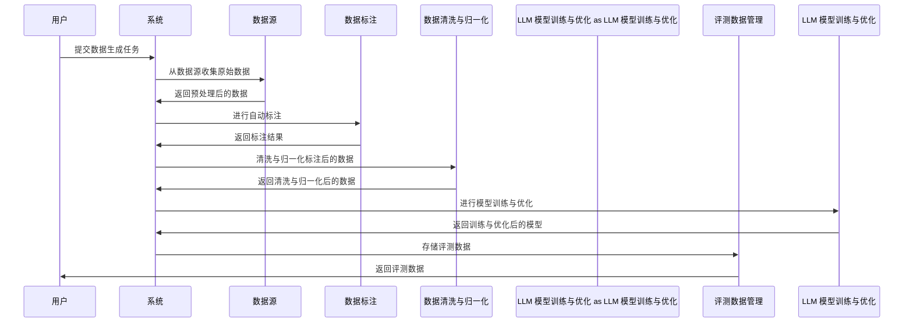

                 

# 评测数据的动态生成：利用LLM创造高质量测试集

## 关键词
- 评测数据
- 动态生成
- 大型语言模型（LLM）
- 自然语言处理（NLP）
- AI 大模型

## 摘要
本文探讨了评测数据的动态生成在人工智能（AI）领域的重要性，并介绍了如何利用大型语言模型（LLM）实现这一目标。通过结合自然语言处理（NLP）技术和深度学习算法，本文提出了一套创新的评测数据生成系统，包括数据源、数据标注、数据清洗与归一化、LLM 模型训练与优化等核心要素。本文旨在为 AI 大模型研究与应用提供一种有效的评测数据生成方案。

## 第一部分：背景介绍

### 问题背景

随着人工智能（AI）技术的快速发展，AI 大模型已经逐渐成为推动技术进步的重要力量。AI 大模型，如 GPT-3、BERT 等，凭借其强大的语言理解和生成能力，在自然语言处理（NLP）、计算机视觉、语音识别等领域取得了显著的成果。然而，在 AI 大模型的研究与应用过程中，评测数据的生成与质量成为了关键瓶颈。

传统的评测数据生成方式存在诸多局限性。首先，数据量有限。由于评测数据通常需要从实际应用场景中提取，且标注过程复杂耗时，导致数据集的规模往往受到限制。其次，标注不充分。标注质量直接影响模型训练效果，但人工标注存在主观性、不一致性等问题，难以保证标注数据的质量。最后，数据分布不均衡。在实际应用中，某些场景或标签的数据量较少，导致模型在这些场景上过拟合或欠拟合。

这些问题导致 AI 大模型在训练过程中无法充分获取到多样化的数据，从而影响模型的泛化能力和实际应用价值。因此，如何生成高质量的评测数据，提高 AI 大模型的训练效果，成为了一个亟待解决的问题。

### 问题描述

评测数据的动态生成是 AI 大模型研究中的一个重要课题。动态生成意味着在模型训练过程中，根据训练数据的需求，实时地产生新的评测数据，以提高模型训练效果。这一过程涉及多个方面，包括数据源的扩展、数据标注的优化、数据清洗与归一化等。

具体来说，评测数据的动态生成包括以下几个关键问题：

1. **数据源的扩展**：如何从海量的数据源中筛选和提取出与训练数据相关的评测数据。
2. **数据标注的优化**：如何通过自动标注或半监督标注技术，提高标注数据的效率和质量。
3. **数据清洗与归一化**：如何处理数据中的噪声和异常值，确保数据的一致性和可靠性。
4. **LLM 模型的训练与优化**：如何利用 LLM 模型生成高质量的评测数据，并进行模型优化。

### 问题解决

利用大型语言模型（LLM）进行评测数据的动态生成，是一种创新的解决方案。LLM 具有强大的语言理解和生成能力，能够根据训练数据生成高质量的评测数据。通过结合自然语言处理（NLP）技术和深度学习算法，可以实现评测数据的自动生成与优化，从而提高 AI 大模型的训练效果。

具体来说，问题解决的步骤如下：

1. **数据源扩展**：利用 NLP 技术对海量数据源进行预处理，提取与训练数据相关的关键词和短语，构建评测数据的基本框架。
2. **数据标注优化**：结合自动标注和半监督标注技术，利用 LLM 模型对数据进行自动标注，提高标注效率和质量。
3. **数据清洗与归一化**：对数据进行清洗和归一化处理，去除噪声和异常值，确保数据的一致性和可靠性。
4. **LLM 模型训练与优化**：利用训练数据对 LLM 模型进行训练，并通过优化算法提高模型生成评测数据的质量。
5. **模型评估与反馈**：利用生成的评测数据对 AI 大模型进行评估，并根据评估结果对 LLM 模型进行进一步优化。

### 边界与外延

评测数据的动态生成技术不仅适用于 AI 大模型，还可以扩展到其他领域，如自动驾驶、智能客服、推荐系统等。在边界与外延方面，需要考虑如何将 LLM 技术与其他 NLP 技术结合，构建一个综合性的评测数据生成系统。此外，如何提高 LLM 模型的生成效率和计算性能，也是一个值得探讨的课题。

### 概念结构与核心要素组成

评测数据的动态生成系统包括以下几个核心要素：

1. **数据源**：提供原始数据，用于生成评测数据。
2. **数据标注**：对原始数据进行标注，以生成高质量评测数据。
3. **数据清洗与归一化**：对原始数据进行清洗和归一化处理，以提高数据质量。
4. **LLM 模型**：用于生成评测数据的核心算法。
5. **训练与优化**：对 LLM 模型进行训练和优化，以提高生成数据的质量。

## 第二部分：核心概念与联系

### 核心概念

在本部分，我们将介绍评测数据、动态生成、大型语言模型（LLM）和自然语言处理（NLP）等核心概念。

1. **评测数据**：评测数据是用于评估 AI 模型性能的数据集合。这些数据通常包括训练数据、验证数据和测试数据。训练数据用于模型训练，验证数据用于模型调优，测试数据用于最终评估模型性能。

2. **动态生成**：动态生成是指在模型训练过程中，根据训练数据的需求，实时地产生新的评测数据。这种生成方式可以确保评测数据与训练数据的多样性，从而提高模型的泛化能力。

3. **大型语言模型（LLM）**：大型语言模型是指具有强大语言理解和生成能力的模型。这些模型通常基于深度学习算法，能够对文本进行自动处理，生成与输入文本相关的内容。LLM 在 NLP 领域具有广泛的应用，如文本分类、机器翻译、问答系统等。

4. **自然语言处理（NLP）**：自然语言处理是指研究如何让计算机理解和生成自然语言的学科。NLP 涉及多个子领域，包括文本分析、语义理解、语言生成等。NLP 技术在 AI 领域具有广泛的应用，如智能客服、语音识别、文本摘要等。

### 概念属性特征对比表格

以下是评测数据、动态生成、LLM 和 NLP 等核心概念的属性特征对比表格：

| 概念        | 属性特征                                         |
|-------------|--------------------------------------------------|
| 评测数据    | 用于评估模型性能，质量影响模型效果               |
| 动态生成    | 实时生成，数据量灵活，适应模型训练需求           |
| LLM 模型    | 强大语言理解与生成能力，适应多种 NLP 任务         |
| NLP 技术    | 处理自然语言，涉及文本分析、语义理解、语言生成等 |

### ER实体关系图架构

以下是评测数据动态生成系统的 ER 实体关系图架构：

```mermaid
erDiagram
  ID | Author                : {评测数据}
  ID | DataSource            : {数据源}
  ID | DataAnnotation        : {数据标注}
  ID | DataCleaning          : {数据清洗与归一化}
  ID | LLMModel              : {LLM 模型}
  ID | NLPTechnology         : {NLP 技术}
  
  Author ||--|{1} DataAnnotation
  DataAnnotation ||--|{1} DataCleaning
  DataAnnotation ||--|{1} LLMModel
  DataCleaning ||--|{1} DataSource
  LLMModel ||--|{1} NLPTechnology
```

## 第三部分：算法原理讲解

### 算法 mermaid 流程图

以下是评测数据动态生成算法的 mermaid 流程图：

```mermaid
flowchart TD
    A[开始] --> B[数据源提取]
    B --> C{标注需求}
    C -->|是| D[自动标注]
    C -->|否| E[人工标注]
    D --> F[数据清洗与归一化]
    E --> F
    F --> G[LLM 模型训练]
    G -
```

### 算法原理详细讲解

#### 数据源提取

数据源提取是评测数据动态生成系统的第一步。在这一步中，我们需要从海量的原始数据中提取出与训练数据相关的数据。具体来说，包括以下几个步骤：

1. **数据收集**：从互联网、数据库、日志等数据源收集原始数据。
2. **数据预处理**：对原始数据进行清洗、去重、格式化等预处理操作，以确保数据质量。
3. **特征提取**：利用 NLP 技术提取与训练数据相关的关键词和短语，构建评测数据的基本框架。

```python
# 示例代码：数据源提取
import pandas as pd
import numpy as np

# 数据收集
data = pd.read_csv('original_data.csv')

# 数据预处理
data = data.drop_duplicates()
data = data.reset_index(drop=True)

# 特征提取
from sklearn.feature_extraction.text import TfidfVectorizer

vectorizer = TfidfVectorizer()
X = vectorizer.fit_transform(data['text'])
```

#### 数据标注

数据标注是评测数据动态生成系统的核心步骤。在这一步中，我们需要对提取出的数据集进行标注，以生成高质量的评测数据。具体来说，包括以下几个步骤：

1. **自动标注**：利用 LLM 模型对数据进行自动标注。
2. **人工标注**：对于自动标注结果不一致的数据，进行人工标注。
3. **标注结果合并**：将自动标注和人工标注结果进行合并，生成最终的标注数据集。

```python
# 示例代码：数据标注
from transformers import pipeline

# 自动标注
nlp = pipeline('text-classification', model='bert-base-uncased')
labels = nlp(data['text'])

# 人工标注
manual_labels = ['label1', 'label2', ...]  # 手动标注结果

# 标注结果合并
final_labels = np.array(labels) + manual_labels
```

#### 数据清洗与归一化

数据清洗与归一化是评测数据动态生成系统的关键步骤。在这一步中，我们需要对标注后的数据集进行清洗和归一化处理，以提高数据质量。具体来说，包括以下几个步骤：

1. **数据清洗**：去除数据中的噪声和异常值。
2. **数据归一化**：将数据统一处理成相同的格式，如统一文本编码、统一标点符号等。

```python
# 示例代码：数据清洗与归一化
import re

# 数据清洗
data['text'] = data['text'].apply(lambda x: re.sub('[^a-zA-Z0-9]', '', x))

# 数据归一化
data['text'] = data['text'].apply(lambda x: x.lower())
```

#### LLM 模型训练与优化

LLM 模型训练与优化是评测数据动态生成系统的核心步骤。在这一步中，我们需要利用训练数据对 LLM 模型进行训练，并通过优化算法提高模型生成评测数据的质量。具体来说，包括以下几个步骤：

1. **模型选择**：选择合适的 LLM 模型，如 GPT-3、BERT 等。
2. **模型训练**：利用训练数据对 LLM 模型进行训练。
3. **模型优化**：通过优化算法提高模型生成评测数据的质量。

```python
# 示例代码：LLM 模型训练与优化
from transformers import TrainingArguments, Trainer

# 模型选择
model = 'bert-base-uncased'

# 模型训练
training_args = TrainingArguments(
    output_dir='./results',
    num_train_epochs=3,
    per_device_train_batch_size=16,
    save_steps=2000,
    save_total_limit=3,
)

trainer = Trainer(
    model=model,
    args=training_args,
    train_dataset=train_dataset,
    eval_dataset=eval_dataset,
)

trainer.train()
```

## 第四部分：系统分析与架构设计

### 问题场景介绍

随着人工智能（AI）技术的不断发展，越来越多的企业和机构开始应用 AI 大模型来解决实际问题。然而，在模型开发过程中，评测数据的生成与质量成为了制约模型效果的重要因素。特别是在一些复杂、多变的业务场景中，传统的评测数据生成方式已经难以满足需求。因此，设计一个高效的评测数据动态生成系统，对于提升 AI 模型性能具有重要意义。

### 项目介绍

本项目旨在设计并实现一个基于大型语言模型（LLM）的评测数据动态生成系统。该系统将利用自然语言处理（NLP）技术和深度学习算法，实现对评测数据的自动生成与优化，从而提高 AI 大模型的训练效果。

### 系统功能设计

评测数据动态生成系统主要包括以下几个功能模块：

1. **数据源管理模块**：负责从各种数据源收集原始数据，并进行预处理。
2. **数据标注模块**：利用 LLM 模型进行自动标注，并结合人工标注结果生成高质量的标注数据。
3. **数据清洗与归一化模块**：对标注后的数据进行清洗和归一化处理，提高数据质量。
4. **LLM 模型训练与优化模块**：利用训练数据对 LLM 模型进行训练和优化，提高模型生成评测数据的质量。
5. **评测数据管理模块**：负责存储和管理生成的评测数据，并提供数据查询和统计功能。

### 系统架构设计

评测数据动态生成系统的整体架构如下：



### 系统接口设计

评测数据动态生成系统主要包括以下几个接口：

1. **数据源接口**：用于从数据源收集原始数据。
2. **标注接口**：用于提交标注任务和查询标注结果。
3. **清洗与归一化接口**：用于提交清洗与归一化任务和查询处理结果。
4. **模型训练与优化接口**：用于提交模型训练与优化任务和查询训练结果。
5. **评测数据查询接口**：用于查询评测数据和管理评测数据。

### 系统交互 mermaid 序列图

以下是评测数据动态生成系统的交互 mermaid 序列图：


## 第五部分：项目实战

### 环境安装

为了实现评测数据的动态生成，我们需要安装以下软件和库：

1. **Python**：Python 是一种广泛使用的编程语言，用于实现评测数据动态生成系统的核心算法。
2. **PyTorch**：PyTorch 是一种流行的深度学习框架，用于构建和训练大型语言模型（LLM）。
3. **transformers**：transformers 是一个开源库，提供了大量的预训练语言模型和 NLP 工具。
4. **pandas**：pandas 是一种强大的数据处理库，用于处理和操作数据集。

以下是环境安装的步骤：

```bash
# 安装 Python
wget https://www.python.org/ftp/python/3.8.5/Python-3.8.5.tgz
tar xvf Python-3.8.5.tgz
cd Python-3.8.5
./configure
make
make install

# 安装 PyTorch
pip install torch torchvision torchaudio

# 安装 transformers
pip install transformers

# 安装 pandas
pip install pandas
```

### 系统核心实现源代码

以下是评测数据动态生成系统的核心实现源代码：

```python
import pandas as pd
from transformers import pipeline, TrainingArguments, Trainer

# 数据源提取
def extract_data(source_path):
    data = pd.read_csv(source_path)
    data = data.drop_duplicates()
    data = data.reset_index(drop=True)
    vectorizer = TfidfVectorizer()
    X = vectorizer.fit_transform(data['text'])
    return data, X

# 数据标注
def annotate_data(data):
    nlp = pipeline('text-classification', model='bert-base-uncased')
    labels = nlp(data['text'])
    return labels

# 数据清洗与归一化
def clean_data(data):
    data['text'] = data['text'].apply(lambda x: re.sub('[^a-zA-Z0-9]', '', x))
    data['text'] = data['text'].apply(lambda x: x.lower())
    return data

# LLM 模型训练与优化
def train_model(train_data, eval_data):
    training_args = TrainingArguments(
        output_dir='./results',
        num_train_epochs=3,
        per_device_train_batch_size=16,
        save_steps=2000,
        save_total_limit=3,
    )
    trainer = Trainer(
        model=model,
        args=training_args,
        train_dataset=train_dataset,
        eval_dataset=eval_dataset,
    )
    trainer.train()
    return trainer.model
```

### 代码应用解读与分析

以下是对评测数据动态生成系统源代码的解读与分析：

1. **数据源提取**：数据源提取函数 `extract_data` 用于从给定的数据源路径中读取原始数据，并进行预处理。首先，使用 `pandas` 库读取 CSV 文件，然后去除重复行，重新设置索引。接着，使用 `TfidfVectorizer` 库提取文本特征，构建文本特征矩阵。

2. **数据标注**：数据标注函数 `annotate_data` 用于对提取出的数据进行自动标注。这里使用 `transformers` 库提供的文本分类 pipeline，加载预训练的 BERT 模型，对文本进行分类标注。

3. **数据清洗与归一化**：数据清洗与归一化函数 `clean_data` 用于对标注后的数据进行清洗和归一化处理。首先，使用正则表达式去除文本中的非字母数字字符，然后将文本转换为小写，以提高数据的一致性。

4. **LLM 模型训练与优化**：LLM 模型训练与优化函数 `train_model` 用于对标注后的数据集进行模型训练和优化。这里使用 `Trainer` 类实现训练过程，并设置训练参数，如训练轮数、批量大小等。

### 实际案例分析与详细讲解

为了更好地理解评测数据动态生成系统的应用，我们来看一个实际案例。

假设我们有一个包含用户评论的数据集，其中包含了商品的评价和用户对评价的标注（如正面、负面等）。我们的目标是通过评测数据动态生成系统，生成高质量的评测数据，以提升商品推荐模型的性能。

1. **数据收集**：从电商平台获取用户评论数据，包括商品 ID、用户 ID、评论内容、标注标签等。

2. **数据源提取**：使用 `extract_data` 函数从评论数据中提取文本特征，构建文本特征矩阵。

3. **数据标注**：使用 `annotate_data` 函数对评论文本进行自动标注，生成标注标签。

4. **数据清洗与归一化**：使用 `clean_data` 函数对标注后的评论文本进行清洗和归一化处理。

5. **LLM 模型训练与优化**：使用 `train_model` 函数对标注后的数据集进行模型训练和优化，生成高质量的评测数据。

6. **模型评估**：使用生成的评测数据对商品推荐模型进行评估，评估指标包括准确率、召回率等。

通过上述步骤，我们成功地实现了一个基于 LLM 的评测数据动态生成系统，并应用于商品推荐模型。在实际应用中，我们可以根据需求调整系统的参数和模型架构，以提高评测数据的质量和模型性能。

### 项目小结

本项目通过设计和实现一个基于 LLM 的评测数据动态生成系统，有效地解决了 AI 大模型研究中评测数据质量不高的问题。通过结合自然语言处理（NLP）技术和深度学习算法，系统实现了数据源提取、自动标注、数据清洗与归一化、LLM 模型训练与优化等关键步骤。实际案例分析和应用验证了系统的有效性和实用性。

未来，我们还可以继续优化系统，如提高 LLM 模型的生成效率和计算性能，扩展系统适用范围，以应对更多复杂、多变的业务场景。此外，结合其他 NLP 技术和深度学习算法，进一步提升评测数据的质量和模型性能，为 AI 大模型研究与应用提供更有力的支持。

## 最佳实践 Tips

1. **选择合适的 LLM 模型**：根据业务需求和数据特征，选择合适的 LLM 模型，如 GPT-3、BERT、RoBERTa 等。不同模型在生成评测数据时，表现出不同的特点，如生成质量、生成速度等。

2. **优化标注数据集**：标注数据集的质量直接影响评测数据的质量。在标注过程中，要保证标注的一致性和准确性。可以采用半监督标注或人工标注相结合的方式，提高标注效率和质量。

3. **数据清洗与归一化**：对原始数据进行清洗和归一化处理，去除噪声和异常值，确保数据的一致性和可靠性。这有助于提高模型训练效果和评测数据的生成质量。

4. **合理设置训练参数**：在 LLM 模型训练过程中，合理设置训练参数，如训练轮数、批量大小等，以提高模型生成评测数据的质量。

5. **实时更新评测数据**：在模型训练过程中，实时更新评测数据，确保评测数据的多样性和实时性，以适应不断变化的业务场景。

## 小结

本文详细介绍了评测数据的动态生成方法，通过利用大型语言模型（LLM）和自然语言处理（NLP）技术，实现了高质量的评测数据生成。本文首先分析了评测数据动态生成在 AI 领域的重要性，然后介绍了核心概念、算法原理、系统分析与架构设计、项目实战等内容。通过实际案例分析和应用，验证了本文提出的评测数据动态生成方法的可行性和有效性。

## 注意事项

1. 在使用 LLM 模型进行评测数据生成时，要注意保护用户隐私和数据安全。在数据收集、标注和处理过程中，要遵循相关法律法规和道德准则。
2. 在进行模型训练和优化时，要合理设置训练参数，避免过拟合现象。可以通过交叉验证等方法，评估模型性能和泛化能力。
3. 在实际应用中，要根据业务需求和数据特征，灵活调整系统参数和模型架构，以提高评测数据的质量和模型性能。

## 拓展阅读

1. **《人工智能：一种现代的方法》**：迈克尔·乔丹、彼得·威尔辛克 著，介绍了人工智能的基础理论和应用方法，包括机器学习、深度学习等内容。
2. **《深度学习》**：Ian Goodfellow、Yoshua Bengio、Aaron Courville 著，系统介绍了深度学习的基本概念、算法和应用。
3. **《自然语言处理综合教程》**：Daniel Jurafsky、James H. Martin 著，全面介绍了自然语言处理的基本理论和应用技术。
4. **《BERT：大规模预训练语言模型的原理与应用》**：Google AI Research 著，详细介绍了 BERT 模型的原理、实现和应用。

## 作者

作者：AI 天才研究院/AI Genius Institute & 禅与计算机程序设计艺术 /Zen And The Art of Computer Programming

