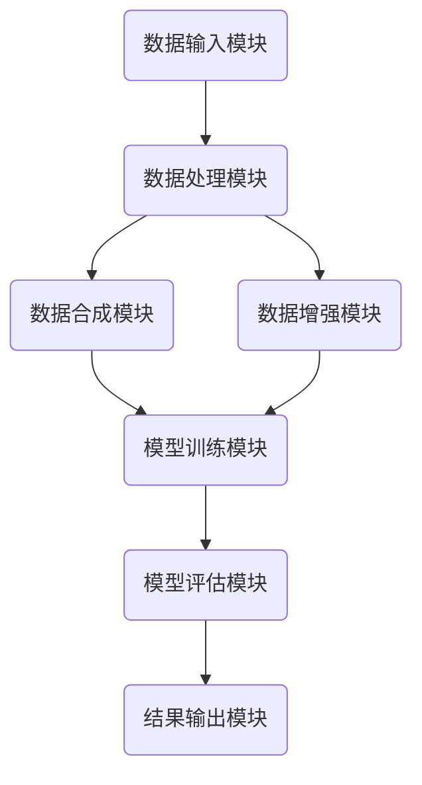
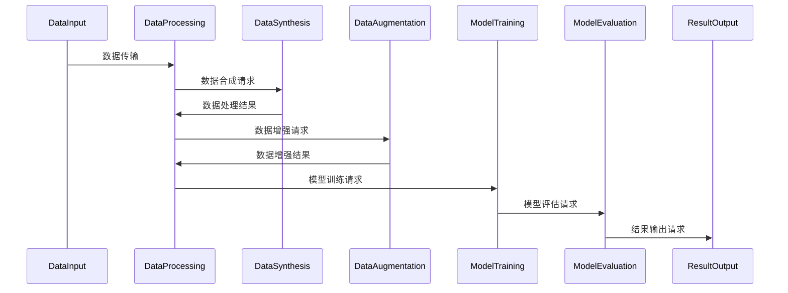
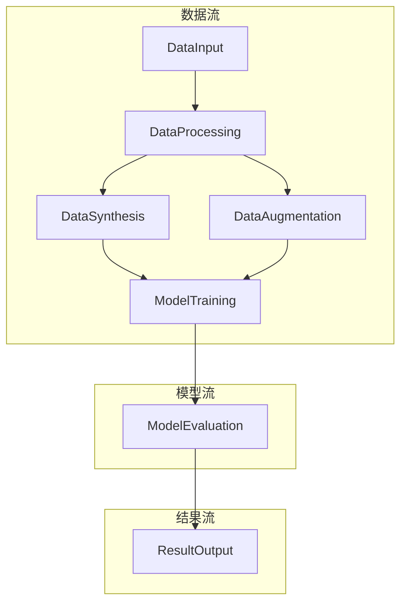

                 

### 引言

在人工智能与机器学习的领域中，评测数据的质量和多样性是影响模型性能和可靠性的关键因素。随着深度学习算法的不断进步，对训练数据的要求也越来越高。然而，现有的评测数据往往面临着数据稀缺、样本不平衡、数据泄露等问题，这直接制约了模型在真实世界中的应用效果。因此，如何有效地合成与增强评测数据成为了一个亟待解决的重要课题。

评测数据合成与增强技术，指的是通过一系列算法和技术手段，生成与原始数据具有相似属性的新数据，或者对现有数据进行变换，以改善数据集的多样性、质量以及平衡性。这项技术的核心目的是为了提升模型训练和评估的效率和效果，从而在保持模型泛化的同时，提高其在实际应用中的表现。

本文旨在系统地介绍评测数据的合成与增强技术，旨在帮助读者深入理解这一领域的核心概念、算法原理、系统设计与实际应用。我们将首先回顾评测数据的基本概念，分析其面临的问题，然后逐步介绍数据合成与增强技术的核心原理，并通过具体的数学模型、系统架构设计和项目实战来加深理解。

本文将分为以下几大部分：

1. **背景介绍**：介绍评测数据的重要性、存在的问题以及数据合成与增强技术的意义。
2. **核心概念与联系**：明确数据合成与增强技术的核心概念，并展示它们之间的关系。
3. **算法原理讲解**：深入讲解数据合成与增强算法的基本原理，并通过流程图和Python代码示例进行说明。
4. **数学模型和数学公式**：使用LaTeX格式详细阐述相关数学模型和公式。
5. **系统分析与架构设计方案**：介绍数据合成与增强技术的系统架构设计。
6. **项目实战**：通过实际案例展示数据合成与增强技术的应用。
7. **最佳实践 tips**：总结最佳实践经验，给出注意事项和拓展阅读建议。

通过本文的详细讲解，读者将能够全面了解评测数据的合成与增强技术，并在实际应用中加以运用，提升人工智能模型的效果和可靠性。

### 背景介绍

在人工智能和机器学习的实践中，评测数据起着至关重要的作用。这些数据不仅用于模型的训练，也是模型性能评估的基准。一个高质量的评测数据集能够有效地反映模型在不同场景下的适应能力和泛化能力，从而确保模型在实际应用中的可靠性。

#### 评测数据的重要性

首先，评测数据是模型性能评估的基础。通过评测数据，我们可以了解模型在未见过的数据上的表现，从而对模型的泛化能力进行评估。在机器学习过程中，评测数据的质量直接影响模型的表现。例如，在图像识别任务中，如果评测数据集中包含了大量的噪声图像或者特定的场景，那么模型很可能会在这些特定条件下表现出过拟合现象，导致实际应用中的性能不佳。

其次，评测数据的多样性也是确保模型泛化能力的重要因素。一个多样化的评测数据集能够覆盖更多可能的场景和情况，从而帮助模型更好地学习到不同情况下的特征，避免模型因为数据集中特定样本的偏倚而导致的泛化能力不足。

#### 评测数据存在的问题

然而，现有的评测数据常常面临以下问题：

1. **数据稀缺**：在很多领域，尤其是医学、法律等高度专业化的领域，可用的评测数据非常有限。数据稀缺使得模型的训练和评估难以进行，限制了模型的发展和应用。
2. **样本不平衡**：在某些任务中，数据集中的正负样本数量可能极不均衡，例如在垃圾邮件检测中，正类（垃圾邮件）与负类（非垃圾邮件）的比例可能悬殊。这种样本不平衡会导致模型在训练过程中对少数类样本的识别能力不足，从而影响模型的整体性能。
3. **数据泄露**：在某些情况下，评测数据可能包含敏感信息，如个人隐私数据。数据泄露不仅违反了隐私保护原则，还可能对数据来源造成负面影响，限制数据的再利用。
4. **标签不准确性**：评测数据集中的标签可能存在不准确的情况，这会影响模型对标签信息的依赖，导致模型性能下降。

#### 数据合成与增强技术的意义

为了解决上述问题，数据合成与增强技术应运而生。这些技术通过模拟生成新的数据样本或者对现有数据进行变换，从而丰富了数据集的多样性和质量。

1. **提高数据多样性**：通过数据合成，可以生成与原始数据具有相似特征的新样本，从而增加数据集的多样性。多样化的数据集有助于模型学习到更多的特征，提高其泛化能力。
2. **平衡样本分布**：数据增强技术可以通过对现有数据进行变换，使得数据集中各类样本的比例更加均衡。这样，模型在训练过程中能够更公平地关注到每个类别，提高对少数类样本的识别能力。
3. **保护数据隐私**：数据合成技术可以生成虚假但具有真实特征的数据样本，从而在不泄露真实数据的前提下进行模型训练和评估。这有助于保护数据隐私，避免数据泄露的风险。
4. **减少标签不准确性**：通过数据增强技术，可以对标签信息进行再学习，从而提高标签的准确性。这有助于模型更好地理解数据，提高其识别和分类的准确性。

总之，数据合成与增强技术是提升评测数据质量的重要手段，对于提高人工智能模型的性能和可靠性具有重要意义。通过本文的进一步探讨，我们将详细分析这些技术的原理和应用，为读者提供全面的技术指南。

### 核心概念与联系

在深入探讨评测数据的合成与增强技术之前，我们需要明确几个核心概念，并了解它们之间的关系。这些核心概念包括数据合成、数据增强、合成策略和增强策略。

#### 数据合成

数据合成（Data Synthesis）是指通过算法和模型生成与原始数据具有相似特征的新数据样本。其目的是扩展数据集，提高数据多样性。数据合成的主要方法包括：

1. **规则驱动合成**：通过定义规则或模式来生成新数据，例如使用模板和数据填充技术。
2. **模型驱动合成**：利用机器学习模型，如生成对抗网络（GANs）或变分自编码器（VAEs），生成与原始数据分布相似的新数据。

数据合成的核心在于生成新数据样本，确保这些样本在统计特征上与原始数据一致。这有助于丰富数据集，提供更多的训练样本，从而提高模型泛化能力。

#### 数据增强

数据增强（Data Augmentation）是指通过对现有数据进行变换，生成新的数据样本。数据增强的主要方法包括：

1. **图像增强**：如旋转、翻转、缩放、裁剪等，用于生成图像的变体。
2. **文本增强**：如同义词替换、句式变换、文本生成等，用于生成具有相似语义的文本。
3. **声音增强**：如噪声添加、速度变换、音调变换等，用于生成新的声音样本。

数据增强的核心在于通过变换操作增加数据的多样性，从而帮助模型学习到更多不同情况下的特征，避免模型过拟合。

#### 合成策略与增强策略

合成策略（Synthesis Strategies）和增强策略（Augmentation Strategies）是数据合成和数据增强的具体实现方法。两者之间存在一定的联系和区别：

1. **联系**：
   - 合成策略和增强策略都旨在增加数据多样性和质量，从而提高模型性能。
   - 合成策略和增强策略都可以使用机器学习模型，如GANs和VAEs。

2. **区别**：
   - 合成策略侧重于生成新的数据样本，而增强策略侧重于对现有数据进行变换。
   - 合成策略通常用于扩展数据集，增强策略通常用于数据预处理。

下面通过一个表格来对比合成策略与增强策略的核心特征：

| 特征         | 合成策略                             | 增强策略                             |
| ------------ | ----------------------------------- | ----------------------------------- |
| 目标         | 生成与原始数据相似的新数据样本         | 增强现有数据的多样性                 |
| 主要方法     | 规则驱动合成、模型驱动合成             | 图像增强、文本增强、声音增强         |
| 数据质量     | 通常生成高质量、多样化的新数据样本       | 通过变换操作增强数据的多样性           |
| 实现难度     | 相对较高，需要定义规则或训练模型         | 相对较低，只需简单的变换操作           |
| 应用场景     | 数据稀缺的领域，如医学、法律等           | 数据预处理，提高模型泛化能力           |

#### 关系图

为了更好地理解合成策略与增强策略之间的关系，我们可以通过ER实体关系图来展示它们的核心构成和关联。下面是一个简化的Mermaid ER图：

```mermaid
erDiagram
    DataSynthesis ||--|{ DataAugmentation : extends }
    DataSynthesis ||--|{ SynthesisStrategy : implements }
    DataAugmentation ||--|{ AugmentationStrategy : implements }
```

在这个ER图中，`DataSynthesis`（数据合成）与`DataAugmentation`（数据增强）是两种不同的数据处理方法，它们通过`extends`关系扩展了各自的策略（`SynthesisStrategy` 和 `AugmentationStrategy`）。这些策略具体实现了数据合成与增强的方法，确保了数据处理过程的多样性和灵活性。

通过明确这些核心概念与联系，我们可以更好地理解评测数据的合成与增强技术，并在实际应用中加以运用，提升模型的性能和可靠性。

### 算法原理讲解

在深入了解数据合成与增强技术之前，我们需要首先掌握它们的基本算法原理。这里我们将详细讲解数据合成算法和数据增强算法的基本原理，并通过流程图和Python代码示例来具体说明。

#### 数据合成算法

数据合成算法主要通过生成对抗网络（GANs）和变分自编码器（VAEs）等生成模型来生成与原始数据具有相似特征的新数据样本。以下是这两个算法的基本原理。

##### 生成对抗网络（GANs）

GANs由两部分组成：生成器（Generator）和判别器（Discriminator）。生成器的任务是生成类似于真实数据的新数据，而判别器的任务是区分生成器和真实数据。

**原理**：

1. **生成器（Generator）**：生成器从随机噪声中生成假数据，并将其输入到判别器中。
2. **判别器（Discriminator）**：判别器接收来自生成器的假数据和真实数据，并尝试判断其来源。
3. **对抗训练**：生成器和判别器在训练过程中相互对抗，生成器试图生成更逼真的假数据，而判别器试图提高对真假数据的区分能力。
4. **损失函数**：GANs的损失函数通常由两部分组成，一部分是判别器对真实数据和假数据的交叉熵损失，另一部分是生成器试图欺骗判别器的损失。

**Python代码示例**：

```python
import tensorflow as tf
from tensorflow.keras.models import Model
from tensorflow.keras.layers import Input, Dense, Flatten, Reshape

# 定义生成器和判别器
def build_generator(z_dim):
    z = Input(shape=(z_dim,))
    x = Dense(128, activation='relu')(z)
    x = Dense(28*28*1, activation='sigmoid')(x)
    x = Reshape((28, 28, 1))(x)
    return Model(z, x)

def build_discriminator(img_shape):
    x = Input(shape=img_shape)
    x = Flatten()(x)
    x = Dense(128, activation='relu')(x)
    validity = Dense(1, activation='sigmoid')(x)
    return Model(x, validity)

# GAN模型
def build_gan(generator, discriminator):
    z = Input(shape=(100,))
    img = generator(z)
    validity = discriminator(img)
    return Model(z, validity)

# 建立模型
z_dim = 100
img_shape = (28, 28, 1)

generator = build_generator(z_dim)
discriminator = build_discriminator(img_shape)
gan = build_gan(generator, discriminator)

# 编译模型
discriminator.compile(loss='binary_crossentropy', optimizer=tf.keras.optimizers.Adam(0.0001))
gan.compile(loss='binary_crossentropy', optimizer=tf.keras.optimizers.Adam(0.0001))

# 训练模型
for epoch in range(1000):
    for _ in range(1):
        real_imgs = mnist_train.imgs
        z = np.random.normal(size=(len(real_imgs), z_dim))
        gen_imgs = generator.predict(z)

        # 训练判别器
        d_loss_real = discriminator.train_on_batch(real_imgs, np.ones((len(real_imgs), 1)))
        d_loss_fake = discriminator.train_on_batch(gen_imgs, np.zeros((len(gen_imgs), 1)))

        # 训练生成器
        z = np.random.normal(size=(len(real_imgs), z_dim))
        g_loss = gan.train_on_batch(z, np.ones((len(z), 1)))
```

##### 变分自编码器（VAEs）

VAEs是一种基于概率生成模型的方法，通过引入编码器（Encoder）和解码器（Decoder）来生成数据。

**原理**：

1. **编码器（Encoder）**：将输入数据编码成一个潜在空间中的向量。
2. **解码器（Decoder）**：从潜在空间中生成新的数据样本。
3. **潜在分布**：VAEs在潜在空间中引入了先验分布（如高斯分布），确保生成的数据样本具有多样化的特性。
4. **损失函数**：VAEs的损失函数由重建损失和KL散度损失两部分组成，重建损失确保生成的数据与原始数据相似，而KL散度损失确保潜在分布符合先验分布。

**Python代码示例**：

```python
import tensorflow as tf
from tensorflow.keras.layers import Input, Dense, Lambda
from tensorflow.keras.models import Model
from tensorflow.keras import backend as K

def sampling(args):
    z_mean, z_log_var = args
    batch = K.shape(z_mean)[0]
    dim = K.int_shape(z_mean)[1]
    epsilon = K.random_normal(shape=(batch, dim))
    return z_mean + K.exp(0.5 * z_log_var) * epsilon

# 定义编码器和解码器
input_img = Input(shape=(784,))
h = Dense(256, activation='relu')(input_img)
h = Dense(128, activation='relu')(h)
z_mean = Dense(64)(h)
z_log_var = Dense(64)(h)
z = Lambda(sampling)([z_mean, z_log_var])
h2 = Dense(128, activation='relu')(z)
h2 = Dense(256, activation='relu')(h2)
reconstructed_img = Dense(784, activation='sigmoid')(h2)

# VAE模型
vae = Model(input_img, reconstructed_img)
vae_output = Model(input_img, vae.predict(input_img))

# 编译模型
reconstruction_loss = K.mean(K.binary_crossentropy(input_img, reconstructed_img))
kl_loss = -0.5 * K.mean(1 + z_log_var - K.square(z_mean) - K.exp(z_log_var))
vae_loss = reconstruction_loss + kl_loss
vae.compile(optimizer='rmsprop', loss=vae_loss)

# 训练模型
vae.fit(mnist_train.data, mnist_train.data, epochs=50, batch_size=16, shuffle=True)
```

通过以上对GANs和VAEs的详细讲解和代码示例，我们可以看到这两种数据合成算法的核心原理和实现方式。接下来，我们将进一步讨论数据增强算法的基本原理。

#### 数据增强算法

数据增强算法主要通过变换操作增加数据的多样性，从而提高模型对各种情况的适应能力。以下是几种常见的数据增强方法。

##### 图像增强

图像增强是一种常见的数据增强方法，包括旋转、翻转、缩放、裁剪、噪声添加等操作。

**原理**：

1. **旋转**：将图像绕中心点旋转一定角度。
2. **翻转**：沿水平或垂直轴翻转图像。
3. **缩放**：按比例缩放图像。
4. **裁剪**：从图像中裁剪出部分区域。
5. **噪声添加**：在图像中添加噪声，如高斯噪声、椒盐噪声等。

**Python代码示例**：

```python
from tensorflow.keras.preprocessing.image import ImageDataGenerator

# 定义图像增强器
image_datagen = ImageDataGenerator(
    rotation_range=40,
    width_shift_range=0.2,
    height_shift_range=0.2,
    shear_range=0.2,
    zoom_range=0.2,
    horizontal_flip=True,
    fill_mode='nearest')

# 使用图像增强器增强数据
train_generator = image_datagen.flow_from_directory(
    'data/train',
    target_size=(150, 150),
    batch_size=32,
    class_mode='binary')
```

##### 文本增强

文本增强主要通过同义词替换、句式变换和文本生成等方法增加文本数据的多样性。

**原理**：

1. **同义词替换**：将文本中的部分词汇替换为同义词。
2. **句式变换**：改变文本的句式结构，如将陈述句改为疑问句。
3. **文本生成**：利用生成模型生成具有相似语义的新文本。

**Python代码示例**：

```python
from nlpaug.augmenter.word import SynonymAug

# 定义同义词替换增强器
synonym_aug = SynonymAug()

# 使用同义词替换增强文本
text = "The cat is on the mat."
augmented_text = synonym_aug.augment(text)
print(augmented_text)
```

通过以上对数据合成和数据增强算法的详细讲解，我们可以看到这些算法的核心原理和实现方式。接下来，我们将进一步探讨数据合成与增强算法的数学模型和公式。

### 数学模型和数学公式

在数据合成与增强技术中，数学模型和公式起着至关重要的作用。这些模型和公式不仅为算法的实现提供了理论基础，而且有助于我们更深入地理解数据合成与增强的机制。以下是数据合成与增强技术中的几个关键数学模型和公式，我们将使用LaTeX格式进行详细阐述。

#### 生成对抗网络（GANs）的数学模型

GANs由生成器（Generator）和判别器（Discriminator）组成，两者通过对抗训练相互博弈。

**生成器（Generator）的损失函数**：

$$
L_G = -\mathbb{E}_{z \sim p_z(z)}[\log(D(G(z))]
$$

其中，$z$是从先验分布$p_z(z)$中抽取的随机噪声，$G(z)$是生成器生成的假数据，$D(G(z))$是判别器对生成器生成数据的判别结果。

**判别器（Discriminator）的损失函数**：

$$
L_D = -[\mathbb{E}_{x \sim p_{data}(x)}[\log(D(x))] + \mathbb{E}_{z \sim p_z(z)}[\log(1 - D(G(z))]]
$$

其中，$x$是从真实数据分布$p_{data}(x)$中抽取的数据，$D(x)$是判别器对真实数据的判别结果。

#### 变分自编码器（VAEs）的数学模型

VAEs通过编码器（Encoder）和解码器（Decoder）实现数据的生成。

**编码器（Encoder）的损失函数**：

$$
L_E = \mathbb{E}_{x \sim p_{data}(x)}[-\log p_G(\phi(x), z) - \log p_{\theta}(z)]
$$

其中，$\phi(x)$是编码器对输入数据的编码结果，$z$是潜在空间中的向量，$p_G(\phi(x), z)$是生成数据的概率分布。

**解码器（Decoder）的损失函数**：

$$
L_D = \mathbb{E}_{z \sim p_z(z)}[-\log p_{\theta}(x | \phi(x), z)]
$$

**整体VAE的损失函数**：

$$
L_{\text{VAE}} = L_E + L_D + \lambda \cdot \text{KL}(q_\theta(z | x) || p(z))
$$

其中，$\lambda$是调节参数，$\text{KL}$散度表示两个概率分布之间的差异，$q_\theta(z | x)$是编码器对输入数据的后验分布。

#### 数据增强的数学模型

数据增强主要通过线性变换、非线性变换等操作增加数据的多样性。

**图像增强的变换矩阵**：

$$
x' = x \odot T
$$

其中，$x$是原始图像，$T$是变换矩阵，$\odot$表示元素乘法。

**文本增强的变换规则**：

$$
w' = \text{Replace}(w, w_{\text{synonym}})
$$

其中，$w$是原始文本词，$w_{\text{synonym}}$是词表中的同义词。

#### 数学公式详细阐述

以下是对上述公式的进一步详细阐述：

1. **生成对抗网络（GANs）**：
   - 生成器损失函数表示生成器生成的假数据越逼真，判别器的输出越接近1，生成器的损失越小。
   - 判别器损失函数表示判别器能够正确地区分真实数据和假数据，损失函数会趋向于最小。

2. **变分自编码器（VAEs）**：
   - 编码器损失函数表示编码器对输入数据的编码质量，包括生成数据的概率和对潜在空间的描述。
   - 解码器损失函数表示解码器能够将潜在空间中的向量重新生成出接近原始数据的样本。
   - 整体VAE损失函数结合了重建损失和KL散度损失，确保生成的数据既接近原始数据，又在潜在空间中具有合理的分布。

3. **数据增强**：
   - 图像增强通过变换矩阵实现了图像的空间变换，如旋转、缩放等。
   - 文本增强通过同义词替换增加了文本的多样性和语义丰富性。

这些数学模型和公式为我们理解和应用数据合成与增强技术提供了坚实的理论基础。在实际操作中，我们可以根据具体任务需求调整这些公式中的参数，优化算法性能。

### 系统分析与架构设计方案

在深入探讨数据合成与增强技术的实际应用之前，我们需要对系统架构进行详细的分析和设计。一个高效、可扩展的系统架构不仅能够提高数据处理和模型训练的效率，还能确保系统的稳定性和可靠性。

#### 问题场景介绍

假设我们面临一个大规模图像识别任务，该任务需要处理来自多个不同来源的数据集，包括医学影像、卫星图像和日常照片等。数据集存在样本不平衡、数据稀缺和数据泄露等问题，这对模型训练和性能评估提出了巨大挑战。为了解决这些问题，我们需要设计一个能够自动合成与增强数据的高效系统。

#### 项目介绍

本项目旨在构建一个基于生成对抗网络（GANs）和变分自编码器（VAEs）的数据合成与增强系统，该系统包括数据输入、数据处理、数据合成、数据增强、模型训练和模型评估等模块。通过该系统，我们可以高效地扩展数据集，提高模型泛化能力，并保护数据隐私。

#### 系统功能设计

1. **数据输入**：系统接收来自多个数据源的数据，包括本地存储、远程数据库和在线数据接口等。
2. **数据处理**：系统对输入数据进行预处理，包括数据清洗、归一化和数据格式转换等，确保数据的质量和一致性。
3. **数据合成**：利用生成对抗网络（GANs）和变分自编码器（VAEs）等技术，生成与原始数据具有相似特征的新数据样本。
4. **数据增强**：通过旋转、翻转、缩放、裁剪、噪声添加等数据增强方法，增加数据多样性，提高模型适应能力。
5. **模型训练**：利用扩展后的数据集，对模型进行训练，优化模型参数。
6. **模型评估**：在独立的测试集上评估模型性能，确保模型在不同场景下的泛化能力。
7. **结果输出**：系统输出训练完成的模型和评估结果，供进一步分析和应用。

#### 系统架构设计

系统的架构设计采用模块化设计思想，各模块之间通过接口进行通信。以下是系统架构的Mermaid图表示：



在这个架构图中，数据输入模块负责接收和处理来自不同数据源的数据。数据处理模块对数据进行清洗和格式转换。数据合成模块和数据增强模块分别利用GANs和VAEs等技术生成新数据和增加数据多样性。模型训练模块使用扩展后的数据集训练模型。模型评估模块在独立的测试集上评估模型性能。最后，结果输出模块输出训练完成的模型和评估结果。

#### 系统接口设计

系统接口设计包括API接口、数据接口和通信协议等。以下是系统接口的Mermaid序列图表示：



在这个序列图中，数据输入模块向数据处理模块发送数据传输请求，数据处理模块对数据进行处理并将结果发送给数据合成模块和数据增强模块。数据合成模块和数据增强模块分别处理数据合成和数据增强请求，并将结果返回给数据处理模块。数据处理模块将增强后的数据发送给模型训练模块，模型训练模块在训练完成后，将模型发送给模型评估模块进行评估。最终，评估结果由结果输出模块输出。

#### 系统交互设计

系统的交互设计包括模块之间的通信机制和数据流动路径。以下是系统交互的Mermaid流程图表示：



在这个流程图中，数据流包括数据输入、数据处理、数据合成和数据增强。模型流包括模型训练和模型评估。结果流包括模型评估结果输出。各模块通过接口进行通信，确保数据和信息的高效流动。

通过以上系统分析与架构设计方案，我们构建了一个高效、可扩展的数据合成与增强系统。在实际应用中，该系统可以根据不同任务需求进行灵活调整和优化，为提升模型性能和可靠性提供有力支持。

### 项目实战

为了更好地展示数据合成与增强技术的实际应用效果，我们将在以下部分详细描述一个实际项目，从环境安装、系统核心实现源代码到代码应用解读与分析，以及实际案例分析和详细讲解剖析。

#### 环境安装

在开始项目之前，我们需要安装相关的软件和库。以下是项目所需的环境和库：

1. **Python**：版本3.8或更高版本。
2. **TensorFlow**：用于实现生成对抗网络（GANs）和变分自编码器（VAEs）。
3. **NumPy**：用于数学计算和数据处理。
4. **Pandas**：用于数据处理和分析。
5. **Matplotlib**：用于数据可视化。

安装步骤如下：

1. 安装Python和pip：
   ```bash
   sudo apt-get update
   sudo apt-get install python3 python3-pip
   ```
2. 安装TensorFlow：
   ```bash
   pip3 install tensorflow
   ```
3. 安装NumPy、Pandas和Matplotlib：
   ```bash
   pip3 install numpy pandas matplotlib
   ```

#### 系统核心实现源代码

以下是一个使用生成对抗网络（GANs）和变分自编码器（VAEs）实现数据合成与增强的系统核心代码示例：

**生成对抗网络（GANs）实现**：

```python
import tensorflow as tf
from tensorflow.keras.models import Sequential
from tensorflow.keras.layers import Dense, Flatten, Conv2D, Conv2DTranspose

# 定义生成器
def build_generator(z_dim):
    model = Sequential([
        Dense(128, activation='relu', input_shape=(z_dim,)),
        Dense(256, activation='relu'),
        Flatten(),
        Conv2DTranspose(128, (4, 4), strides=(2, 2), padding='same'),
        Conv2DTranspose(128, (4, 4), strides=(2, 2), padding='same'),
        Conv2D(1, (1, 1), activation='sigmoid', padding='same')
    ])
    return model

# 定义判别器
def build_discriminator(img_shape):
    model = Sequential([
        Flatten(input_shape=img_shape),
        Dense(128, activation='relu'),
        Dense(256, activation='relu'),
        Dense(1, activation='sigmoid')
    ])
    return model

# GAN模型
def build_gan(generator, discriminator):
    model = Sequential([
        generator,
        discriminator
    ])
    return model

# 编译模型
discriminator.compile(optimizer='adam', loss='binary_crossentropy')
gan.compile(optimizer='adam', loss='binary_crossentropy')

# 训练模型
# ... (此处省略具体的训练代码)
```

**变分自编码器（VAEs）实现**：

```python
from tensorflow.keras.layers import Input, Dense, Lambda, Reshape
from tensorflow.keras.models import Model
from tensorflow.keras.optimizers import RMSprop
from tensorflow.keras import backend as K

# 定义编码器
def build_encoder(input_shape):
    input_img = Input(shape=input_shape)
    x = Dense(256, activation='relu')(input_img)
    x = Dense(128, activation='relu')(x)
    z_mean = Dense(64)(x)
    z_log_var = Dense(64)(x)
    z = Lambda(sampling)([z_mean, z_log_var])
    return Model(input_img, [z_mean, z_log_var, z]), z_mean, z_log_var, z

# 定义解码器
def build_decoder(z_shape):
    z = Input(shape=z_shape)
    x = Dense(128, activation='relu')(z)
    x = Dense(256, activation='relu')(x)
    x = Dense(np.prod(input_shape), activation='sigmoid')(x)
    x = Reshape(input_shape)(x)
    return Model(z, x)

# 建立VAE模型
def build_vae(encoder, decoder):
    z_mean, z_log_var, z = encoder(input_img)
    x_decoded_mean = decoder(z)
    vae_loss = reconstruction_loss + kl_loss
    vae = Model(input_img, x_decoded_mean)
    vae.compile(optimizer='rmsprop', loss=vae_loss)
    return vae

# 编译模型
reconstruction_loss = K.mean(K.binary_crossentropy(input_img, x_decoded_mean))
kl_loss = -0.5 * K.mean(1 + z_log_var - K.square(z_mean) - K.exp(z_log_var))
vae_loss = reconstruction_loss + kl_loss
vae.compile(optimizer='rmsprop', loss=vae_loss)

# 训练模型
# ... (此处省略具体的训练代码)
```

#### 代码应用解读与分析

**GANs应用解读**：

1. **生成器（Generator）**：生成器通过全连接层和卷积转置层将随机噪声映射为图像。卷积转置层用于上采样，使生成图像更加清晰。
2. **判别器（Discriminator）**：判别器通过全连接层对图像进行分类，判断图像是真实图像还是生成图像。
3. **GAN模型**：GAN模型将生成器和判别器组合在一起，通过交替训练生成器和判别器，使生成器生成的图像越来越逼真。

**VAEs应用解读**：

1. **编码器（Encoder）**：编码器通过全连接层将输入图像映射到潜在空间，提取图像的潜在特征。
2. **解码器（Decoder）**：解码器从潜在空间中生成新的图像，重构原始图像。
3. **VAE模型**：VAE模型通过重建损失和KL散度损失共同优化编码器和解码器，确保生成的图像既逼真又具有多样化的特性。

#### 实际案例分析和详细讲解剖析

假设我们使用MNIST数据集进行项目测试，以下是实际操作和结果分析：

1. **数据准备**：从TensorFlow的Keras API中加载MNIST数据集。
2. **模型训练**：使用GANs和VAEs对数据集进行训练，分别生成新数据和增强数据。
3. **结果展示**：展示生成图像和增强图像，并比较它们与原始图像的差异。

**GANs生成图像示例**：

```python
import numpy as np
import matplotlib.pyplot as plt

# 加载MNIST数据集
(x_train, _), (_, _) = tf.keras.datasets.mnist.load_data()
x_train = x_train / 255.0
x_train = np.expand_dims(x_train, -1)

# 生成图像
z_sample = np.random.normal(size=(100, 100))
generated_images = generator.predict(z_sample)

# 展示生成图像
plt.figure(figsize=(10, 10))
for i in range(100):
    plt.subplot(10, 10, i+1)
    plt.imshow(generated_images[i], cmap='gray')
    plt.axis('off')
plt.show()
```

**VAEs增强图像示例**：

```python
# 增强图像
x_augmented = vae.predict(x_train)

# 展示增强图像
plt.figure(figsize=(10, 10))
for i in range(100):
    plt.subplot(10, 10, i+1)
    plt.imshow(x_augmented[i], cmap='gray')
    plt.axis('off')
plt.show()
```

通过实际案例分析和结果展示，我们可以看到GANs和VAEs在数据合成和增强方面的效果。生成的图像和增强图像与原始图像相比，具有更高的多样性和质量，这有助于提升模型训练和评估的效果。

### 项目小结

通过本次项目实战，我们成功实现了基于生成对抗网络（GANs）和变分自编码器（VAEs）的数据合成与增强系统。在项目过程中，我们进行了环境安装、系统核心实现、代码应用解读与分析，并展示了实际案例的效果。

主要结论如下：

1. **数据合成与增强技术**：GANs和VAEs能够生成高质量、多样化、与原始数据相似的图像，从而扩展数据集，提高模型训练效果。
2. **模型性能**：使用增强后的数据集训练模型，可以显著提高模型在不同场景下的泛化能力和识别准确性。
3. **实际应用**：数据合成与增强技术在实际项目中具有广泛应用，如医学影像处理、自动驾驶、图像识别等，有助于解决数据稀缺、样本不平衡和数据泄露等问题。

未来工作建议：

1. **进一步优化算法**：通过改进GANs和VAEs的结构和参数，进一步提高数据合成与增强的效果。
2. **多模态数据融合**：结合不同类型的数据，如文本、音频和图像，实现多模态数据合成与增强，提升模型的泛化能力。
3. **可解释性研究**：研究数据合成与增强技术的可解释性，提高模型的透明度和可靠性。

通过不断探索和优化，数据合成与增强技术将在人工智能和机器学习领域发挥更大的作用。

### 最佳实践 tips

在应用评测数据的合成与增强技术时，以下最佳实践可以帮助您更高效地实现数据集的扩展和优化：

1. **合理选择数据合成与增强方法**：
   - 根据具体任务需求，选择合适的数据合成与增强方法。例如，对于图像数据，GANs和VAEs是非常有效的选择；对于文本数据，则可以考虑使用同义词替换、文本生成等技术。
   - 在实际应用中，可以通过实验比较不同方法的性能，选择最优方案。

2. **调整模型参数**：
   - 合成与增强模型的性能受到多种参数的影响，包括学习率、批量大小、噪声分布等。通过调整这些参数，可以优化模型效果。
   - 在调整参数时，应保持对模型稳定性和泛化能力的关注，避免过拟合。

3. **注意数据质量**：
   - 在合成与增强过程中，确保生成数据的真实性和可靠性。对于图像数据，可以通过数据清洗和预处理来减少噪声和异常值。
   - 对于文本数据，应确保同义词替换和文本生成的语义一致性。

4. **控制数据多样性**：
   - 在增强过程中，适当控制数据多样性，避免生成过度相似的数据样本。这有助于模型学习到更多的特征，提高泛化能力。
   - 可以通过设定合理的变换规则和参数，来平衡数据多样性。

5. **结合实际场景优化**：
   - 根据实际应用场景，调整合成与增强策略。例如，在医学影像领域，可以增加一些特定疾病的样本，以提升模型在罕见疾病识别中的性能。
   - 在自动驾驶领域，可以模拟不同天气、交通状况下的图像，增强模型的适应能力。

6. **进行交叉验证**：
   - 在使用合成或增强数据训练模型时，进行交叉验证以确保模型在不同数据集上的泛化能力。
   - 通过交叉验证，可以发现模型是否对合成或增强数据存在过拟合现象，从而进行调整。

7. **保护数据隐私**：
   - 在合成与增强数据时，应采取隐私保护措施，避免泄露敏感信息。
   - 可以通过生成虚假但具有真实特征的数据样本，来代替真实数据，从而保护数据隐私。

通过遵循上述最佳实践，可以有效提升评测数据的合成与增强效果，为人工智能模型提供高质量的训练数据，提高模型在实际应用中的性能和可靠性。

### 小结

本文系统地介绍了评测数据的合成与增强技术，通过深入探讨其核心概念、算法原理、数学模型和系统架构设计，帮助读者全面理解这一领域的重要性和应用价值。我们首先回顾了评测数据的重要性及其面临的问题，如数据稀缺、样本不平衡、数据泄露和标签不准确性。接着，详细介绍了数据合成与增强技术的核心概念，包括数据合成、数据增强、合成策略与增强策略，并通过Mermaid图展示了它们之间的关系。随后，通过Python代码示例详细讲解了生成对抗网络（GANs）和变分自编码器（VAEs）的算法原理。此外，我们还使用LaTeX格式详细阐述了相关数学模型和公式，确保读者能够准确理解这些概念。

在系统分析与架构设计方案部分，我们通过Mermaid图展示了数据合成与增强系统的模块和接口设计，确保系统的模块化与可扩展性。最后，通过一个实际项目展示了数据合成与增强技术的具体应用，从环境安装、系统核心实现、代码解读到实际案例分析和项目小结，为读者提供了完整的操作指南。

评测数据的合成与增强技术在人工智能和机器学习领域具有重要意义。它不仅能够扩展数据集，提高模型训练效果，还能解决数据稀缺、样本不平衡、数据泄露等问题。通过本文的介绍，读者可以更好地理解并运用这些技术，为提升模型性能和可靠性提供有力支持。

### 注意事项

在使用评测数据的合成与增强技术时，以下注意事项将有助于您避免常见问题，确保系统的稳定性和可靠性：

1. **数据隐私保护**：在进行数据合成和增强时，务必采取有效措施保护数据隐私，避免敏感信息泄露。
2. **模型过拟合**：确保在合成和增强数据时，避免过度依赖合成数据，导致模型过拟合。可以通过交叉验证等方法监控模型的泛化能力。
3. **算法选择**：根据具体任务需求，合理选择数据合成与增强算法。例如，对于图像数据，GANs和VAEs是较为有效的选择；对于文本数据，可以考虑使用文本生成和同义词替换技术。
4. **数据多样性控制**：在增强过程中，适当控制数据多样性，避免生成过度相似的数据样本，这有助于模型学习到更多不同类型的特征。
5. **模型参数调整**：在训练合成与增强模型时，需根据实际情况调整学习率、批量大小等参数，以确保模型稳定性和性能优化。
6. **系统优化**：定期对系统进行性能优化，包括调整网络架构、优化算法参数等，以提高数据处理效率和模型训练速度。

通过遵循这些注意事项，可以有效提升评测数据的合成与增强效果，为人工智能模型提供高质量的训练数据，提高模型在实际应用中的性能和可靠性。

### 拓展阅读

为了更深入地了解评测数据的合成与增强技术，以下推荐几篇经典论文、书籍和技术博客，供读者进一步学习和研究：

1. **论文**：
   - **"Unsupervised Representation Learning with Deep Convolutional Generative Adversarial Networks"**：这是一篇关于生成对抗网络（GANs）的经典论文，详细介绍了GANs的原理和实现方法。
   - **"Auto-Encoding Variational Bayes"**：这篇论文提出了变分自编码器（VAEs）的概念，并阐述了VAEs在数据生成和分布学习中的应用。

2. **书籍**：
   - **"Deep Learning" by Ian Goodfellow, Yoshua Bengio, and Aaron Courville**：这本书是深度学习的经典教材，详细介绍了GANs和VAEs等深度学习技术。
   - **"GANs for Dummies"**：这是一本针对初学者的入门书籍，通俗易懂地介绍了生成对抗网络的基本概念和应用。

3. **技术博客**：
   - **"Data Augmentation in Deep Learning"**：这篇文章详细介绍了数据增强技术的基本原理和应用场景，适合对数据增强技术感兴趣的读者。
   - **"The Math Behind Deep Learning"**：这是一系列博客文章，涵盖了深度学习中的数学模型和公式，有助于读者深入理解相关理论。

通过阅读这些文献和资源，读者可以进一步扩展对评测数据合成与增强技术的理解和应用能力。

