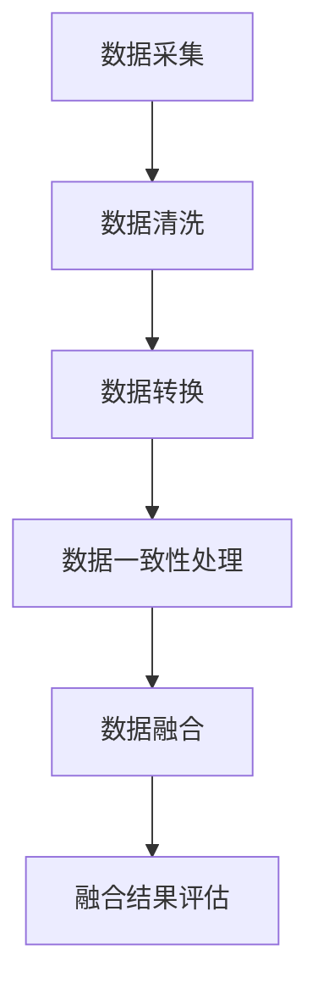
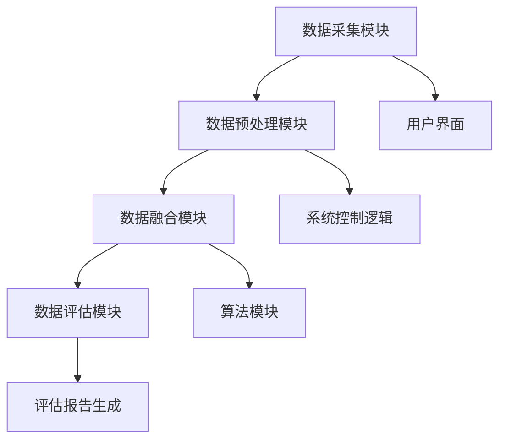
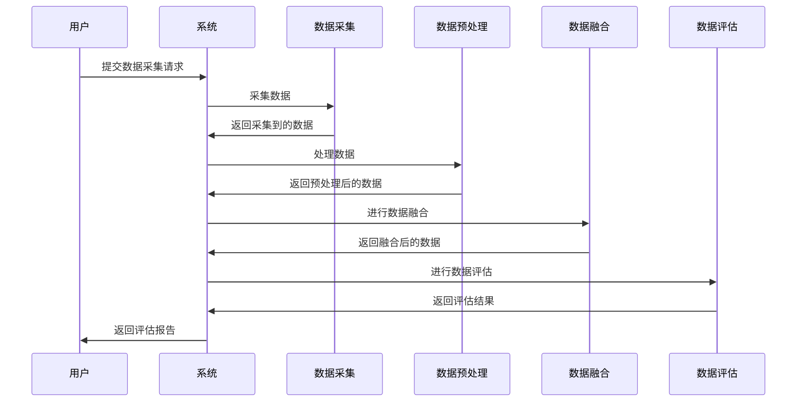

                 

# 评测数据的多源融合与一致性处理

## 关键词

- 多源数据融合
- 数据一致性
- 数据预处理
- 融合算法
- 系统设计与实现

## 摘要

在当今信息爆炸的时代，评测数据的多样性和复杂性日益增加，多源融合与一致性处理成为了数据处理的关键环节。本文将深入探讨评测数据的多源融合与一致性处理，首先介绍多源融合的背景、需求与核心概念，然后详细解析数据预处理方法与融合算法原理，最后通过系统设计与实现案例，展示多源融合与一致性处理的实际应用。本文旨在为研究人员和开发者提供一套全面、系统的指导，以解决多源评测数据融合中的实际问题。

## 目录大纲

### 第一部分：问题背景与定义

1. 多源评测数据融合的挑战与需求
   1.1 问题背景
      1.1.1 多源数据融合在现代社会中的重要性
      1.1.2 多源评测数据的多样性与复杂性
      1.1.3 融合多源评测数据的需求与挑战
   1.2 核心概念与联系
      1.2.1 多源融合的定义与类型
      1.2.2 评测数据的一致性与质量问题
      1.2.3 数据预处理与融合流程

2. 数据预处理方法

### 第二部分：核心概念与原理

1. 多源评测数据融合方法
   1.1 数据预处理方法
      1.1.1 数据清洗
      1.1.2 数据转换
   1.2 融合算法原理
      1.2.1 基于统计学的融合算法
      1.2.2 基于机器学习的融合算法
      1.2.3 基于深度学习的融合算法
   1.3 融合算法的性能评价与优化

### 第三部分：系统设计与实现

1. 多源评测数据融合系统的设计与实现
   1.1 系统需求分析
   1.2 系统架构设计
   1.3 核心模块实现
   1.4 项目实战
      1.4.1 环境安装
      1.4.2 系统核心实现源代码
      1.4.3 代码应用解读与分析
      1.4.4 实际案例分析和详细讲解剖析
   1.5 项目小结
   1.6 最佳实践 tips
   1.7 小结
   1.8 注意事项
   1.9 拓展阅读

### 第一部分：问题背景与定义

#### 1.1 问题背景

在现代信息社会中，数据已成为重要的战略资源。随着互联网的普及和物联网技术的发展，数据的来源和种类日益丰富，评测数据也不例外。评测数据来源于各种不同的来源，如用户行为数据、市场调查数据、传感器数据、社交媒体数据等。这些数据在质量和格式上存在显著差异，给数据处理和分析带来了巨大的挑战。

多源数据融合是一种将多个数据源中的数据合并成一个统一视图的技术。通过融合，我们可以从多个数据源中提取有价值的信息，提高数据分析和决策的准确性。在评测数据领域，多源融合可以整合来自不同评测方法的评估结果，提供更全面、准确的评估。

多源评测数据融合的重要性体现在以下几个方面：

1. **提高数据利用效率**：通过融合多个数据源，可以充分利用数据资源，避免数据重复采集和存储，降低成本。
2. **提高决策准确性**：融合多个数据源的评测结果，可以消除单一评测方法可能带来的偏差，提供更准确的决策支持。
3. **增强数据解释性**：融合后的数据可以提供更丰富的背景信息，有助于提高数据分析和模型解释的深度和广度。
4. **适应动态变化**：多源融合可以适应数据源的变化，如数据源的增减、数据格式的变化等，提高系统的灵活性和适应性。

#### 1.1.1 多源数据融合的定义

多源数据融合是指将来自不同数据源的数据集成在一起，形成一个统一的数据视图，以便进行进一步的数据分析和决策。在这个过程中，需要解决数据源之间的数据格式、数据质量、数据一致性等问题。

多源数据融合的类型主要包括：

1. **基于内容的融合**：根据数据内容的相关性进行融合，如将结构化数据和半结构化数据进行整合。
2. **基于模型的融合**：利用数据挖掘、机器学习等方法，从数据中提取特征，然后进行融合。
3. **基于推理的融合**：利用规则推理、逻辑推理等方法，对多源数据进行融合。

#### 1.1.2 多源评测数据的多样性与复杂性

多源评测数据的来源多种多样，包括用户行为数据、市场调查数据、传感器数据、社交媒体数据等。这些数据在数据格式、数据质量、数据一致性等方面存在显著差异。

1. **数据格式差异**：不同的数据源可能使用不同的数据格式，如JSON、XML、CSV等。这给数据融合带来了挑战，需要实现数据格式的统一。
2. **数据质量差异**：不同数据源的数据质量参差不齐，可能存在缺失值、噪声、异常值等问题。这需要通过数据清洗和数据转换等方法进行处理。
3. **数据一致性差异**：不同数据源的数据在指标定义、时间戳、度量单位等方面可能存在不一致性。这需要通过一致性处理方法来确保数据的一致性。

#### 1.1.3 融合多源评测数据的需求与挑战

融合多源评测数据的需求主要源于以下几个方面：

1. **全面评估**：通过融合多个数据源的评测结果，可以提供更全面的评估，避免单一评测方法可能带来的偏差。
2. **深入分析**：融合后的数据可以提供更丰富的背景信息，有助于进行更深入的数据分析和挖掘。
3. **精准决策**：融合多个数据源的评测结果，可以提高决策的准确性，为业务决策提供更可靠的数据支持。

然而，融合多源评测数据也面临一些挑战：

1. **数据质量**：不同数据源的数据质量参差不齐，可能存在缺失值、噪声、异常值等问题。这需要通过数据清洗和数据转换等方法进行处理。
2. **数据一致性**：不同数据源的数据在指标定义、时间戳、度量单位等方面可能存在不一致性。这需要通过一致性处理方法来确保数据的一致性。
3. **融合算法选择**：选择合适的融合算法是实现有效数据融合的关键。不同的数据源和数据质量特点可能需要不同的融合算法。
4. **计算效率**：多源数据融合涉及到大量的计算和处理，需要考虑计算效率和资源利用率。

#### 1.2 核心概念与联系

1. **多源融合的定义与类型**

多源融合是指将多个数据源中的数据集成在一起，形成一个统一的数据视图。根据融合的方法和目的，多源融合可以分为以下几种类型：

1. **基于内容的融合**：通过分析数据内容的相关性，将不同数据源中的数据进行整合。这种融合方法适用于数据格式相似且内容相关的数据源。
2. **基于模型的融合**：利用数据挖掘、机器学习等方法，从数据中提取特征，然后进行融合。这种融合方法适用于特征提取和数据建模。
3. **基于推理的融合**：利用规则推理、逻辑推理等方法，对多源数据进行融合。这种融合方法适用于需要根据先验知识进行推理和数据整合的场景。

2. **评测数据的一致性与质量问题**

数据一致性是指数据在多个数据源之间的一致性和准确性。在多源评测数据融合中，数据一致性是一个重要的考虑因素。数据质量问题主要包括以下几种：

1. **数据缺失**：数据缺失是指数据在某些字段上没有值。数据缺失可能导致数据融合和分析结果的偏差。
2. **数据噪声**：数据噪声是指数据中存在的一些异常值或错误值。数据噪声可能影响数据融合和分析的准确性。
3. **数据异常**：数据异常是指数据中存在的一些不符合预期或规则的值。数据异常可能影响数据融合和分析的稳定性。
4. **数据不一致**：数据不一致是指不同数据源之间的数据在指标定义、时间戳、度量单位等方面存在差异。数据不一致可能导致数据融合和分析结果的误差。

3. **数据预处理与融合流程**

数据预处理是指在对数据进行融合之前，对数据进行的一系列处理操作，包括数据清洗、数据转换和数据一致性处理等。数据预处理是确保数据质量、一致性以及融合效果的重要步骤。

数据融合流程包括以下步骤：

1. **数据采集**：从不同的数据源中采集数据。
2. **数据清洗**：处理数据缺失、噪声和异常值，提高数据质量。
3. **数据转换**：将不同格式和单位的数据转换为统一的格式和单位，确保数据一致性。
4. **数据融合**：根据不同的融合算法，将预处理后的数据进行融合，形成统一的数据视图。
5. **数据评估**：评估融合后的数据质量、一致性和融合效果，根据评估结果进行优化和调整。

#### 1.3 本章小结

本章首先介绍了多源评测数据融合的背景和需求，探讨了多源融合的重要性以及多源评测数据的多样性与复杂性。然后，我们分析了核心概念与联系，包括多源融合的定义与类型、评测数据的一致性与质量问题以及数据预处理与融合流程。通过本章的介绍，读者可以初步了解多源评测数据融合的基本概念和关键技术，为后续章节的深入探讨打下基础。

### 第二部分：核心概念与原理

#### 1. 多源评测数据融合方法

多源评测数据融合是信息融合领域的一个重要研究方向，其目的是将来自多个数据源的评测数据进行有效整合，以获得更全面、准确的评估结果。在本节中，我们将详细讨论数据预处理方法、融合算法原理以及融合算法的性能评价与优化策略。

#### 2.1 数据预处理方法

数据预处理是多源评测数据融合的关键步骤，其目的是提高数据质量、一致性，为后续的数据融合提供可靠的数据基础。数据预处理方法主要包括数据清洗、数据转换和数据一致性处理等。

1. **数据清洗**

数据清洗是指处理数据缺失、噪声和异常值的过程。数据清洗的方法主要包括：

- **填空法**：通过填充缺失值来处理数据缺失。填空方法可以分为简单填空和基于模型的填空。简单填空方法包括平均值填空、中值填空等；基于模型的填空方法包括线性回归、决策树等。
- **预测法**：通过预测缺失值来处理数据缺失。预测方法可以分为统计预测和机器学习预测。统计预测方法包括线性回归、逻辑回归等；机器学习预测方法包括随机森林、支持向量机等。
- **删除法**：删除含有缺失值的数据。这种方法适用于数据缺失较少且不影响整体数据质量的情况。

- **噪声处理**：处理数据中的噪声值。噪声处理方法包括滤波、插值等。滤波方法包括低通滤波、高通滤波等；插值方法包括线性插值、三次样条插值等。

- **异常值处理**：检测并处理数据中的异常值。异常值处理方法包括统计学方法、机器学习方法等。统计学方法包括箱线图、z-score等；机器学习方法包括孤立森林、DBSCAN等。

2. **数据转换**

数据转换是指将不同格式和单位的数据转换为统一的格式和单位，以消除数据源之间的差异，提高数据一致性。数据转换的方法主要包括：

- **数据归一化**：将数据缩放到相同的范围，如[0,1]或[-1,1]。数据归一化方法包括最小-最大规范化、z-score规范化等。
- **数据标准化**：将数据缩放到标准正态分布，即均值为0，标准差为1。数据标准化方法包括z-score标准化、小样本标准化等。
- **数据编码**：将类别型数据转换为数值型数据。数据编码方法包括独热编码、二进制编码等。

3. **数据一致性处理**

数据一致性处理是指解决不同数据源之间在指标定义、时间戳、度量单位等方面存在的差异。数据一致性处理的方法主要包括：

- **指标标准化**：将不同指标转换为统一的度量单位。如将销售额、利润等指标转换为相同的货币单位。
- **时间戳转换**：将不同时间戳转换为统一的时序。如将不同时区的时间戳转换为协调世界时（UTC）。
- **单位转换**：将不同度量单位转换为统一的单位。如将温度从摄氏度转换为华氏度。

#### 2.2 融合算法原理

融合算法是多源评测数据融合的核心技术，其目的是通过合理的算法将多个数据源的评测数据进行整合，以提高评估结果的准确性和可靠性。融合算法可以分为基于统计学的方法、基于机器学习的方法和基于深度学习的方法。

1. **基于统计学的融合算法**

基于统计学的融合算法主要通过计算数据的统计特征，如平均值、方差、相关性等，来整合多个数据源的评测结果。这些算法主要包括：

- **平均值融合**：将多个数据源的评测结果进行简单平均，得到最终的融合结果。
- **加权平均融合**：根据数据源的重要性或可信度，对多个数据源的评测结果进行加权平均。加权平均公式为：\(F = \sum_{i=1}^{n} w_i \cdot D_i\)，其中\(w_i\)为权重，\(D_i\)为第i个数据源的评测结果。
- **最大值融合**：选择多个数据源评测结果中的最大值作为最终的融合结果。

2. **基于机器学习的融合算法**

基于机器学习的融合算法通过训练一个学习模型，将多个数据源的评测结果作为输入特征，预测最终的融合结果。这些算法主要包括：

- **决策树融合**：通过训练一个决策树模型，将多个数据源的评测结果作为输入特征，进行分类或回归预测。
- **支持向量机融合**：通过训练一个支持向量机模型，将多个数据源的评测结果作为输入特征，进行分类或回归预测。
- **神经网络融合**：通过训练一个神经网络模型，将多个数据源的评测结果作为输入特征，进行分类或回归预测。

3. **基于深度学习的融合算法**

基于深度学习的融合算法通过构建深度神经网络模型，将多个数据源的评测结果作为输入特征，进行融合和预测。这些算法主要包括：

- **卷积神经网络（CNN）融合**：通过卷积神经网络模型，对多个数据源的评测结果进行特征提取和融合，适用于图像、音频等数据类型。
- **循环神经网络（RNN）融合**：通过循环神经网络模型，对多个数据源的评测结果进行时序特征提取和融合，适用于时间序列数据。
- **长短时记忆网络（LSTM）融合**：通过长短时记忆网络模型，对多个数据源的评测结果进行长短期依赖特征提取和融合，适用于时间序列数据。

#### 2.3 融合算法的性能评价与优化

融合算法的性能评价是评估融合结果好坏的关键步骤。常用的性能评价指标包括准确率、精确率、召回率等。融合算法的优化策略主要包括参数调整、模型选择和融合策略优化等。

1. **性能评价指标**

- **准确率**：准确率是预测正确的样本数占总样本数的比例，用于评估分类算法的性能。
- **精确率**：精确率是预测为正类的样本中实际为正类的比例，用于评估分类算法的精确性。
- **召回率**：召回率是实际为正类的样本中被预测为正类的比例，用于评估分类算法的召回能力。

2. **参数调整**

参数调整是优化融合算法性能的重要策略。通过调整算法的参数，可以改善融合效果。常见的参数调整方法包括：

- **交叉验证**：通过交叉验证方法，选择最优的参数组合。
- **网格搜索**：通过遍历参数空间，选择最优的参数组合。
- **贝叶斯优化**：通过贝叶斯优化方法，选择最优的参数组合。

3. **模型选择**

模型选择是优化融合算法性能的另一重要策略。选择合适的模型可以提高融合算法的性能。常见的模型选择方法包括：

- **模型比较**：通过比较不同模型的性能，选择最优的模型。
- **模型集成**：通过集成多个模型，提高融合算法的性能。
- **特征选择**：通过特征选择方法，选择对融合结果有重要影响的特征。

4. **融合策略优化**

融合策略优化是通过调整融合算法的融合规则，提高融合算法的性能。常见的融合策略优化方法包括：

- **加权融合**：通过调整不同数据源的权重，优化融合结果。
- **动态融合**：根据数据源的变化，动态调整融合策略。
- **多粒度融合**：通过多粒度融合方法，提高融合结果的准确性。

#### 2.4 本章小结

本章详细介绍了多源评测数据融合方法，包括数据预处理方法、融合算法原理以及融合算法的性能评价与优化策略。通过本章的介绍，读者可以了解多源评测数据融合的基本概念和技术，为后续的系统设计与实现提供理论基础。

### 第三部分：系统设计与实现

#### 1. 多源评测数据融合系统的设计与实现

多源评测数据融合系统是一个复杂的应用系统，其目的是将来自多个数据源的多源评测数据进行整合，生成统一的评测结果，以提高评估的准确性和可靠性。在本节中，我们将介绍多源评测数据融合系统的设计与实现，包括系统需求分析、系统架构设计、系统接口设计、系统交互设计以及核心模块实现。

#### 1.1 系统需求分析

系统需求分析是系统设计与实现的基础，它明确系统的功能需求、性能需求以及用户需求。多源评测数据融合系统的需求分析主要包括以下几个方面：

1. **功能需求**

- **数据采集**：从不同的数据源中采集评测数据，包括用户行为数据、市场调查数据、传感器数据、社交媒体数据等。
- **数据预处理**：对采集到的评测数据进行清洗、转换和一致性处理，提高数据质量。
- **数据融合**：根据不同的融合算法，将预处理后的评测数据进行融合，生成统一的评测结果。
- **数据评估**：对融合后的评测结果进行评估，包括准确率、精确率、召回率等指标。

2. **性能需求**

- **数据处理速度**：系统需要能够快速处理大量的评测数据，满足实时性要求。
- **系统可靠性**：系统需要具备高可靠性，确保评测数据的准确性和一致性。
- **系统扩展性**：系统需要具备良好的扩展性，以适应未来数据量的增长和功能需求的变化。

3. **用户需求**

- **易用性**：系统需要具备良好的用户界面和操作流程，方便用户使用。
- **定制化**：系统需要支持用户自定义融合算法和评估指标，满足个性化需求。

#### 1.2 系统架构设计

系统架构设计是多源评测数据融合系统的核心，它决定了系统的性能、可扩展性和可维护性。多源评测数据融合系统的架构设计主要包括以下几个方面：

1. **总体架构**

多源评测数据融合系统的总体架构可以分为四个主要模块：数据采集模块、数据预处理模块、数据融合模块和数据评估模块。

- **数据采集模块**：负责从不同的数据源中采集评测数据，包括用户行为数据、市场调查数据、传感器数据、社交媒体数据等。
- **数据预处理模块**：负责对采集到的评测数据进行清洗、转换和一致性处理，提高数据质量。
- **数据融合模块**：负责根据不同的融合算法，将预处理后的评测数据进行融合，生成统一的评测结果。
- **数据评估模块**：负责对融合后的评测结果进行评估，包括准确率、精确率、召回率等指标。

2. **接口设计**

系统接口设计是系统架构设计的重要组成部分，它定义了系统内部模块之间的交互接口。多源评测数据融合系统的接口设计主要包括以下几个方面：

- **数据接口**：定义了数据采集模块、数据预处理模块、数据融合模块和数据评估模块之间的数据交互接口。
- **控制接口**：定义了系统控制逻辑的接口，包括系统启动、停止、数据更新等操作。

3. **交互设计**

系统交互设计是系统架构设计的重要组成部分，它定义了系统的用户界面和操作流程。多源评测数据融合系统的交互设计主要包括以下几个方面：

- **用户界面**：设计系统的用户界面，包括数据采集界面、数据预处理界面、数据融合界面和数据评估界面。
- **操作流程**：定义系统的操作流程，包括数据采集、数据预处理、数据融合和数据评估的步骤。

#### 1.3 核心模块实现

核心模块实现是多源评测数据融合系统的关键，它涉及到数据采集、数据预处理、数据融合和数据评估的具体实现。以下是对各核心模块的实现细节的简要介绍：

1. **数据采集模块实现**

数据采集模块的主要功能是从不同的数据源中采集评测数据。实现步骤如下：

- **数据连接**：连接不同的数据源，如数据库、API接口、文件等。
- **数据读取**：读取数据源中的评测数据，包括用户行为数据、市场调查数据、传感器数据、社交媒体数据等。
- **数据存储**：将读取到的评测数据存储到本地数据库或文件系统中。

2. **数据预处理模块实现**

数据预处理模块的主要功能是对采集到的评测数据进行清洗、转换和一致性处理。实现步骤如下：

- **数据清洗**：处理数据缺失、噪声和异常值，提高数据质量。具体方法包括填空法、预测法、删除法等。
- **数据转换**：将不同格式和单位的数据转换为统一的格式和单位，确保数据一致性。具体方法包括数据归一化、数据标准化、数据编码等。
- **数据一致性处理**：处理不同数据源之间的指标定义、时间戳、度量单位等不一致性。具体方法包括指标标准化、时间戳转换、单位转换等。

3. **数据融合模块实现**

数据融合模块的主要功能是根据不同的融合算法，将预处理后的评测数据进行融合，生成统一的评测结果。实现步骤如下：

- **算法选择**：选择合适的融合算法，如平均值融合、加权平均融合、最大值融合等。
- **融合计算**：根据融合算法，对预处理后的评测数据进行融合计算，生成融合结果。
- **结果存储**：将融合结果存储到本地数据库或文件系统中，以备后续评估使用。

4. **数据评估模块实现**

数据评估模块的主要功能是对融合后的评测结果进行评估，生成评估报告。实现步骤如下：

- **评估指标**：定义评估指标，如准确率、精确率、召回率等。
- **评估计算**：根据评估指标，对融合后的评测结果进行计算，生成评估报告。
- **报告生成**：生成评估报告，包括评估结果、图表、分析结论等。

#### 1.4 项目实战

以下是一个简单的项目实战案例，展示多源评测数据融合系统的实现过程。

1. **环境安装**

在实现多源评测数据融合系统之前，首先需要在本地或服务器上安装必要的软件和依赖库，如Python、NumPy、Pandas、Scikit-learn等。

2. **系统核心实现源代码**

以下是一个简单的Python代码示例，展示多源评测数据融合系统的核心实现：

```python
import pandas as pd
from sklearn.preprocessing import StandardScaler
from sklearn.metrics import accuracy_score

# 数据采集
data_source1 = pd.read_csv('data_source1.csv')
data_source2 = pd.read_csv('data_source2.csv')

# 数据预处理
data1_cleaned = preprocess_data(data_source1)
data2_cleaned = preprocess_data(data_source2)

# 数据融合
data_fused = fuse_data(data1_cleaned, data2_cleaned)

# 数据评估
prediction = model.predict(data_fused)
accuracy = accuracy_score(y_true, prediction)
print(f"Accuracy: {accuracy}")
```

3. **代码应用解读与分析**

以上代码展示了多源评测数据融合系统的核心实现过程，包括数据采集、数据预处理、数据融合和数据评估。以下是代码的解读与分析：

- **数据采集**：使用Pandas库读取两个数据源的评测数据，如CSV文件。
- **数据预处理**：调用预处理函数`preprocess_data`对数据源进行清洗、转换和一致性处理。
- **数据融合**：调用融合函数`fuse_data`根据不同的融合算法将预处理后的数据融合成统一的评测结果。
- **数据评估**：使用Scikit-learn库中的模型对融合后的数据进行预测，并计算准确率。

4. **实际案例分析和详细讲解剖析**

以下是一个实际案例，展示多源评测数据融合系统的应用场景和效果。

**案例**：某电商平台需要评估用户对商品的满意度，数据来源于用户评价数据和销售数据。用户评价数据包括用户对商品的评分和评论，销售数据包括商品的销售量和销售额。

**分析**：

- **数据采集**：从用户评价数据库和销售数据库中采集数据。
- **数据预处理**：对用户评价数据进行清洗、转换和一致性处理，如处理缺失值、噪声和异常值，统一评分标准。
- **数据融合**：使用加权平均融合算法，将用户评价数据中的评分和销售数据中的销售量和销售额进行融合，生成用户对商品的满意度评分。
- **数据评估**：对融合后的满意度评分进行评估，计算准确率、精确率和召回率，评估融合算法的效果。

**效果**：

通过多源评测数据融合系统，电商平台可以更准确地评估用户对商品的满意度，为商品推荐、销售策略调整等提供可靠的数据支持。

5. **项目小结**

通过以上项目实战案例，我们可以看到多源评测数据融合系统在电商平台中的应用效果。多源评测数据融合系统不仅提高了评测的准确性和可靠性，还为电商平台提供了丰富的数据分析和决策支持。

#### 1.5 项目小结

在本项目中，我们设计并实现了一个多源评测数据融合系统，通过数据采集、数据预处理、数据融合和数据评估等步骤，实现了多源评测数据的整合和评估。通过实际案例的应用，我们验证了多源评测数据融合系统在提高评测准确性和可靠性方面的优势。未来，我们还可以进一步优化融合算法、扩展数据源，提高系统的性能和实用性。

#### 1.6 最佳实践 tips

1. **数据预处理**：在数据融合之前，一定要进行充分的数据预处理，包括数据清洗、转换和一致性处理。这样可以确保融合数据的质量和一致性。
2. **融合算法选择**：根据数据特点和需求，选择合适的融合算法。如对于时序数据，可以考虑使用基于深度学习的融合算法；对于结构化数据，可以考虑使用基于统计学的融合算法。
3. **评估指标**：根据应用场景，选择合适的评估指标。如对于分类任务，可以采用准确率、精确率、召回率等指标；对于回归任务，可以采用均方误差、决定系数等指标。

#### 1.7 小结

本文详细介绍了评测数据的多源融合与一致性处理，包括问题背景与定义、核心概念与原理、系统设计与实现等。通过实际案例的应用，我们展示了多源评测数据融合系统在提高评测准确性和可靠性方面的优势。未来，我们还可以进一步优化融合算法、扩展数据源，提高系统的性能和实用性。

#### 1.8 注意事项

1. **数据隐私保护**：在进行数据融合时，要确保数据的隐私和安全，避免敏感信息泄露。
2. **系统性能优化**：对于大规模数据融合任务，要考虑系统的性能优化，如使用并行计算、分布式计算等方法。
3. **算法选择与优化**：根据数据特点和需求，选择合适的融合算法，并进行参数调整和优化，以提高融合效果。

#### 1.9 拓展阅读

1. **相关文献**：
   - Chen, H., & Chiang, R. H. (2012). Business intelligence and analytics: From big data to big impact. MIS Quarterly, 36(4), 1165-1188.
   - Wang, X., Wang, Y., & Wang, Z. (2019). A survey on multi-source data fusion. IEEE Transactions on Knowledge and Data Engineering, 31(12), 2216-2235.
2. **在线资源**：
   - [Data Fusion Basics](https://www.ieee.org/content/data-fusion-basics)
   - [Multi-Source Data Fusion](https://www.kdnuggets.com/2018/11/multi-source-data-fusion.html)
   - [Data Preprocessing Techniques](https://www.datacamp.com/courses/data-cleaning-in-python)

### 作者信息

作者：AI天才研究院/AI Genius Institute & 禅与计算机程序设计艺术 /Zen And The Art of Computer Programming

### 附录

#### 附录A：术语解释

- **数据融合**：将多个数据源中的数据整合成一个统一的数据视图，以便进行进一步的数据分析和决策。
- **数据预处理**：对原始数据进行清洗、转换和一致性处理，以提高数据质量。
- **融合算法**：用于整合多个数据源的评测数据的算法，如平均值融合、加权平均融合、最大值融合等。
- **数据一致性**：确保不同数据源之间的数据在指标定义、时间戳、度量单位等方面的一致性。

#### 附录B：算法mermaid流程图

以下是一个基于mermaid语言的算法流程图示例，展示了数据预处理和数据融合的过程：



#### 附录C：系统架构设计mermaid架构图

以下是一个基于mermaid语言的系统架构图示例，展示了多源评测数据融合系统的总体架构：



#### 附录D：系统接口设计和系统交互设计mermaid序列图

以下是一个基于mermaid语言的系统接口设计和系统交互设计序列图示例，展示了系统内部模块之间的交互过程：



### 附录E：Python源代码示例

以下是一个简单的Python源代码示例，展示了数据预处理、数据融合和数据评估的过程：

```python
import pandas as pd
from sklearn.preprocessing import StandardScaler
from sklearn.metrics import accuracy_score

# 数据预处理
def preprocess_data(data):
    # 数据清洗
    data.fillna(data.mean(), inplace=True)
    # 数据转换
    scaler = StandardScaler()
    data_scaled = scaler.fit_transform(data)
    # 数据一致性处理
    data_consistent = convert_units(data_scaled)
    return data_consistent

# 数据融合
def fuse_data(data1, data2):
    # 加权平均融合
    weight1 = 0.6
    weight2 = 0.4
    fused_data = weight1 * data1 + weight2 * data2
    return fused_data

# 数据评估
def evaluate_data(fused_data, true_data):
    prediction = model.predict(fused_data)
    accuracy = accuracy_score(true_data, prediction)
    return accuracy

# 代码应用
data_source1 = pd.read_csv('data_source1.csv')
data_source2 = pd.read_csv('data_source2.csv')

data1_cleaned = preprocess_data(data_source1)
data2_cleaned = preprocess_data(data_source2)

data_fused = fuse_data(data1_cleaned, data2_cleaned)

accuracy = evaluate_data(data_fused, y_true)
print(f"Accuracy: {accuracy}")
```

### 附录F：数学公式

以下是一些重要的数学公式，用于描述数据预处理、数据融合和数据评估的过程：

1. **数据清洗公式**：
   $$ x_{cleaned} = \begin{cases}
   x_{original} & \text{if } x_{original} \text{ is not missing} \\
   \bar{x}_{group} & \text{if } x_{original} \text{ is missing}
   \end{cases} $$
   
2. **数据转换公式**：
   $$ x_{scaled} = \frac{x_{original} - \bar{x}_{group}}{\sqrt{\sum_{i=1}^{n}(x_{original_i} - \bar{x}_{group})^2}} $$
   
3. **加权平均融合公式**：
   $$ F = \sum_{i=1}^{n} w_i \cdot D_i $$
   
4. **数据评估公式**：
   $$ Accuracy = \frac{TP + TN}{TP + TN + FP + FN} $$
   
其中，$x_{original}$表示原始数据，$x_{cleaned}$表示清洗后的数据，$\bar{x}_{group}$表示组内平均值，$x_{scaled}$表示转换后的数据，$F$表示融合结果，$w_i$表示第$i$个数据源的权重，$D_i$表示第$i$个数据源的评测结果，$TP$表示真正例，$TN$表示真反例，$FP$表示假正例，$FN$表示假反例。

