                 

# 评测数据的采集、清洗与管理

## 关键词

- 数据采集
- 数据清洗
- 数据管理
- 数据分析
- 数据可视化

## 摘要

本文围绕评测数据的采集、清洗和管理，通过详细的背景介绍、核心概念阐述、算法原理讲解、系统分析与架构设计、项目实战以及最佳实践分享，探讨了如何高效地处理评测数据，以实现数据价值的最大化。文章旨在为从事数据分析和人工智能领域的读者提供实用的技术指导和理论支持。

## 第二部分：核心概念与联系

### 2.1 评测数据

#### 概念

评测数据是指在特定应用场景下，通过对目标对象的评价、测试或监测所获得的数据。这些数据可以用于评估目标对象的性能、质量、满意度等。

#### 属性特征

- **来源多样**：评测数据可以来自用户评价、问卷调查、实验数据等。
- **类型多样**：包括数值型数据、文本型数据、图像数据等。
- **结构复杂**：评测数据往往包含多维度、多层次的信息。

#### 对比表格

| 特征         | 评测数据         | 实验数据         |
| ------------ | --------------- | --------------- |
| 来源         | 用户评价、问卷调查等 | 实验设备、模拟系统等 |
| 类型         | 数值型、文本型、图像型 | 数值型、图像型       |
| 结构         | 多维度、多层次     | 简单、单维度       |

### 2.2 数据采集

#### 概念

数据采集是指从各种数据源获取数据的过程。在评测数据管理中，数据采集是关键的一步，直接影响数据的完整性和准确性。

#### 属性特征

- **多样性**：数据采集可以采用多种方法，如在线采集、离线采集和手动采集等。
- **实时性**：实时采集可以及时反映目标对象的状态和变化。

#### 对比表格

| 特征         | 数据采集         | 数据预处理         |
| ------------ | --------------- | --------------- |
| 方法         | 在线采集、离线采集、手动采集 | 缺失值填补、异常值处理、数据格式统一等 |
| 目的         | 获取数据         | 提高数据质量       |
| 实时性       | 可实时、可延时     | 必须完成预处理     |

### 2.3 数据清洗

#### 概念

数据清洗是指对采集到的原始数据进行处理，以消除错误、缺失和不一致性的过程。数据清洗是保证数据质量的重要步骤。

#### 属性特征

- **完整性**：确保数据的完整性，填补缺失值。
- **准确性**：消除数据中的错误，提高数据的准确性。
- **一致性**：处理数据格式不一致的问题。

#### 对比表格

| 特征         | 数据清洗         | 数据存储         |
| ------------ | --------------- | --------------- |
| 方法         | 缺失值填补、异常值处理、数据格式统一 | 数据压缩、数据备份、数据归档等 |
| 目的         | 提高数据质量       | 实现数据的高效存储、管理和分析 |
| 实时性       | 必须完成预处理     | 可以延时处理     |

### 2.4 数据存储与管理

#### 概念

数据存储与管理是指将经过清洗的数据存储到适当的存储系统中，并对其进行有效管理，以便于后续的数据分析和应用。

#### 属性特征

- **高效性**：数据存储和管理系统需要具备高效的数据访问和处理能力。
- **扩展性**：系统应具备良好的扩展性，以适应数据规模的增长。

#### 对比表格

| 特征         | 数据存储与管理         | 数据分析         |
| ------------ | --------------- | --------------- |
| 方法         | 数据仓库、数据湖、分布式存储等 | 统计分析、机器学习、深度学习等 |
| 目的         | 实现数据的高效存储、管理和分析 | 从评测数据中提取有价值的信息 |
| 实时性       | 可以延时处理         | 需要实时处理     |

### 2.5 数据分析

#### 概念

数据分析是指运用各种统计方法和算法，对存储和管理好的评测数据进行处理和分析，以提取有价值的信息。

#### 属性特征

- **准确性**：分析结果需要准确反映数据特征。
- **实用性**：分析结果应具有实际应用价值。

#### 对比表格

| 特征         | 数据分析         | 数据可视化         |
| ------------ | --------------- | --------------- |
| 方法         | 统计分析、机器学习、深度学习等 | 图表、报表、地图等 |
| 目的         | 提取有价值的信息 | 直观展示数据分析结果 |
| 实时性       | 需要实时处理     | 可以延时处理     |

### 2.6 数据可视化

#### 概念

数据可视化是指利用图表、报表等形式，将数据分析结果以直观的方式呈现给用户。

#### 属性特征

- **直观性**：通过视觉元素，使数据更容易理解和分析。
- **交互性**：用户可以通过交互操作，深入挖掘数据背后的信息。

#### 对比表格

| 特征         | 数据可视化         | 数据报表         |
| ------------ | --------------- | --------------- |
| 方法         | 图表、报表、地图等 | 文字描述、表格等 |
| 目的         | 直观展示数据分析结果 | 详细呈现数据信息 |
| 实时性       | 可以延时处理     | 可以延时处理     |

## 第三部分：算法原理讲解

### 3.1 数据采集算法

数据采集算法旨在从多个数据源中获取评测数据，并确保数据的完整性和准确性。以下是一个简单但有效的方法：

#### 方法

1. **在线采集**：通过API接口、爬虫等技术从互联网上获取数据。
2. **离线采集**：通过数据库导出、文件读取等方式从内部系统中获取数据。
3. **手动采集**：通过问卷调查、实验记录等方式手动收集数据。

#### 优点

- **多样性**：可以适应不同类型的数据源。
- **实时性**：在线采集可以实时获取数据。

#### 缺点

- **准确性**：手动采集和离线采集的准确性可能较低。
- **实时性**：离线采集的实时性较差。

#### Mermaid 流程图

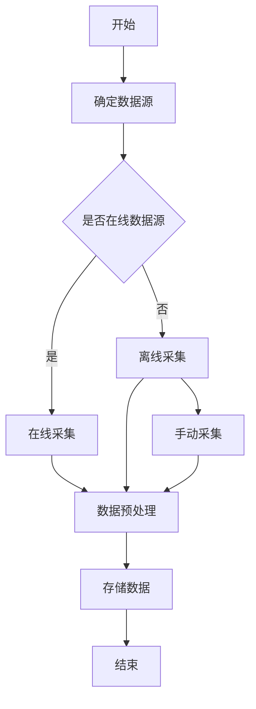

### 3.2 数据清洗算法

数据清洗算法用于处理采集到的原始数据，消除错误、缺失和不一致性。以下是一个简单但有效的方法：

#### 方法

1. **缺失值填补**：使用均值、中位数、插值等方法填补缺失值。
2. **异常值处理**：使用统计学方法（如IQR法、箱线图法）检测和删除异常值。
3. **数据格式统一**：将不同格式的数据转换为统一的格式。

#### 优点

- **提高数据质量**：消除数据中的错误和异常值。
- **便于后续分析**：统一数据格式，便于后续分析和处理。

#### 缺点

- **可能引入偏差**：填补缺失值和删除异常值可能引入偏差。
- **计算复杂度**：某些算法的计算复杂度较高。

#### Mermaid 流程图

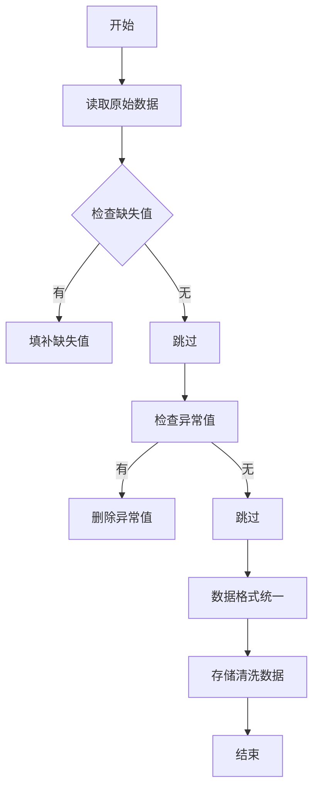

### 3.3 数据分析算法

数据分析算法用于从清洗后的数据中提取有价值的信息，支持决策制定和业务优化。以下是一个简单但有效的方法：

#### 方法

1. **统计分析**：使用描述性统计、回归分析等方法分析数据。
2. **机器学习**：使用分类、聚类、预测等方法对数据进行分析。
3. **数据挖掘**：使用关联规则挖掘、文本挖掘等方法发现数据中的规律。

#### 优点

- **发现规律**：可以从大量数据中提取有价值的信息。
- **支持决策**：为决策者提供数据支持。

#### 缺点

- **计算复杂度**：某些算法的计算复杂度较高。
- **对数据质量要求高**：数据质量对分析结果有较大影响。

#### Mermaid 流�程图

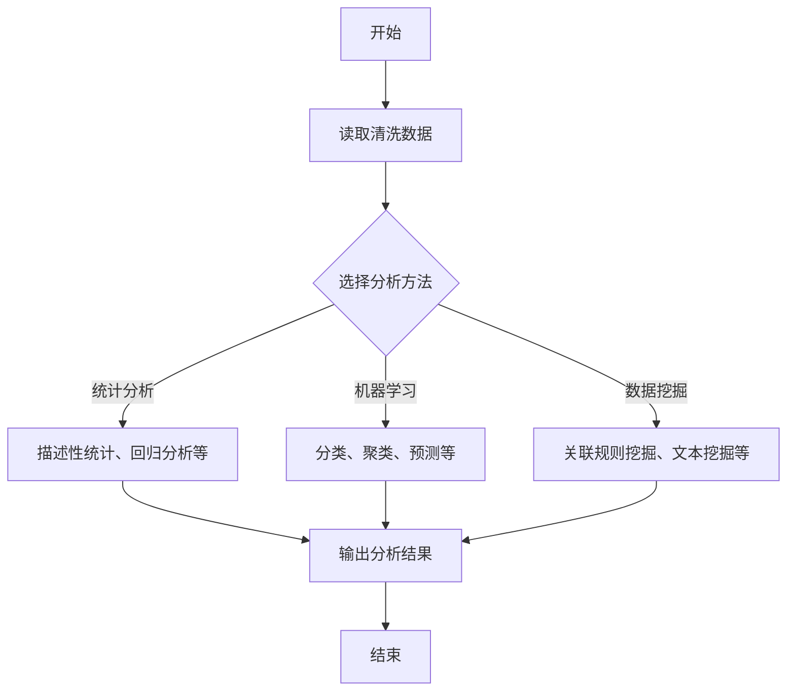

### 3.4 数据可视化算法

数据可视化算法用于将数据分析结果以直观的方式呈现给用户，支持用户更好地理解和分析数据。以下是一个简单但有效的方法：

#### 方法

1. **图表选择**：根据数据类型和分析目标选择合适的图表类型，如折线图、柱状图、饼图等。
2. **交互设计**：设计用户交互界面，支持用户对图表进行缩放、筛选等操作。
3. **可视化优化**：对图表进行美化和优化，提高可读性。

#### 优点

- **直观性**：通过视觉元素，使数据更容易理解和分析。
- **交互性**：用户可以通过交互操作，深入挖掘数据背后的信息。

#### 缺点

- **对设计要求高**：需要具备一定的设计能力。
- **可能影响分析结果**：设计不当可能影响用户对数据的理解。

#### Mermaid 流程图

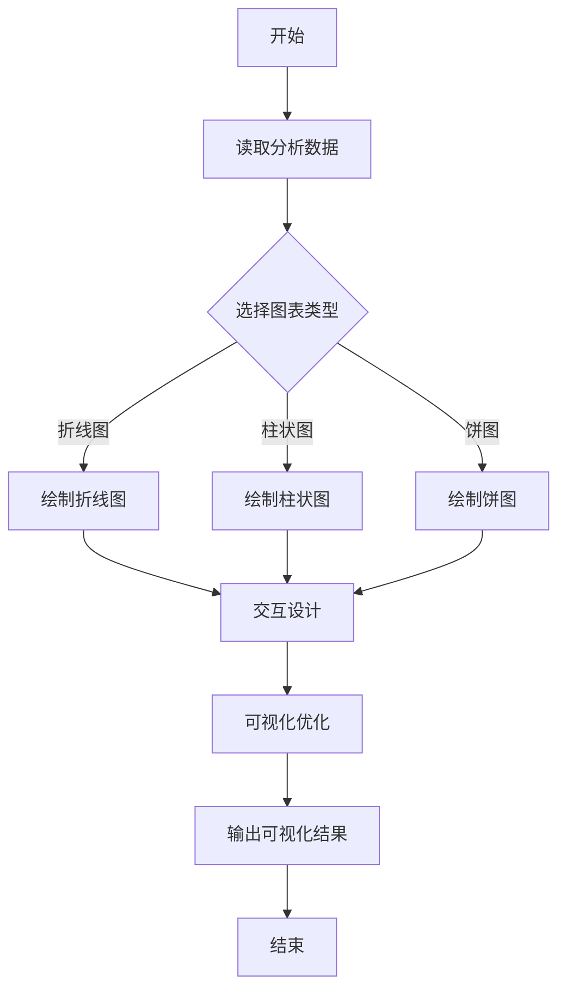

## 第四部分：系统分析与架构设计

### 4.1 项目介绍

本部分将介绍一个评测数据采集、清洗与管理系统的项目，该项目旨在为企业提供一套完整的评测数据管理解决方案，以支持业务决策和优化。

### 4.2 系统功能设计

#### 领域模型

领域模型用于描述系统的核心业务对象和关系。以下是一个简单的领域模型类图：

```mermaid
classDiagram
  DataSource --> Data
  Data -> DataCleaner
  DataCleaner -> CleanedData
  CleanedData -> DataStorage
  DataStorage -> Analyzer
  Analyzer -> Visualizer
class Data
  +id (String)
  +source (String)
  +timestamp (Date)
  +status (String)
class DataCleaner
  +cleanData(data: Data): CleanedData
class CleanedData
  +id (String)
  +timestamp (Date)
  +status (String)
class DataStorage
  +storeData(cleanedData: CleanedData): Unit
class Analyzer
  +analyzeData(cleanedData: CleanedData): AnalysisResult
class Visualizer
  +visualizeResult(result: AnalysisResult): Visualization
```

### 4.3 系统架构设计

系统架构设计用于描述系统的整体结构和组件之间的关系。以下是一个简单的系统架构图：

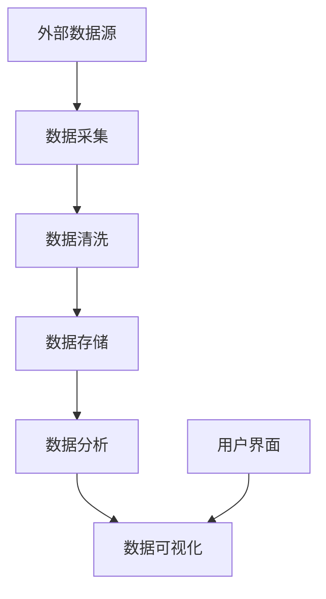

### 4.4 系统接口设计

系统接口设计用于描述系统内部组件之间的交互方式。以下是一个简单的接口设计：

```python
class DataCollector:
    def collect_data(source: str) -> Data:
        pass

class DataCleaner:
    def clean_data(data: Data) -> CleanedData:
        pass

class DataStorage:
    def store_data(cleaned_data: CleanedData):
        pass

class DataAnalyzer:
    def analyze_data(cleaned_data: CleanedData) -> AnalysisResult:
        pass

class DataVisualizer:
    def visualize_result(result: AnalysisResult):
        pass
```

### 4.5 系统交互

系统交互设计用于描述系统与外部环境之间的交互方式。以下是一个简单的系统交互序列图：

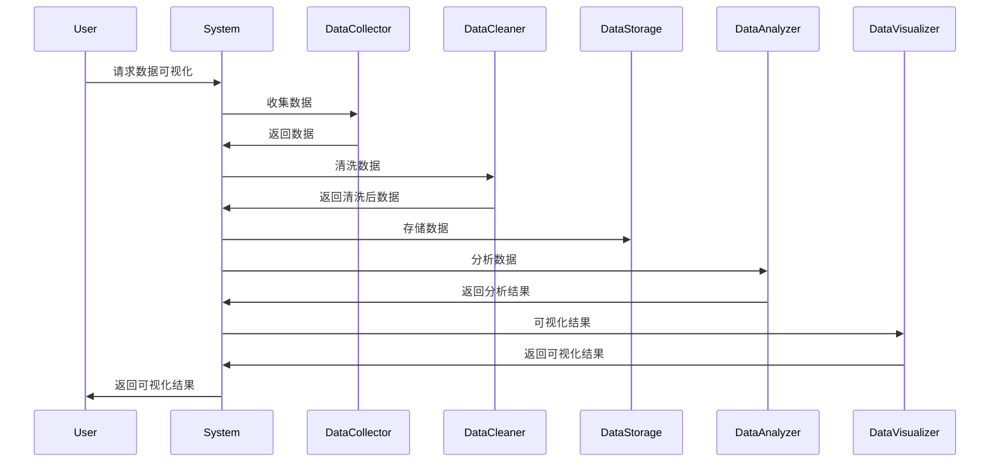

## 第五部分：项目实战

### 5.1 环境安装

在本部分，我们将使用Python和其相关库来构建评测数据采集、清洗与管理系统的核心部分。以下是安装必要的Python库的步骤：

```bash
pip install pandas numpy matplotlib scikit-learn
```

### 5.2 系统核心实现源代码

以下是一个简单的评测数据采集、清洗与管理的Python代码实现：

```python
import pandas as pd
from sklearn.impute import SimpleImputer
from sklearn.ensemble import IsolationForest
import matplotlib.pyplot as plt

# 数据采集
def collect_data(source: str) -> pd.DataFrame:
    return pd.read_csv(source)

# 数据清洗
def clean_data(data: pd.DataFrame) -> pd.DataFrame:
    # 缺失值填补
    imputer = SimpleImputer(strategy='mean')
    data_imputed = imputer.fit_transform(data)
    
    # 异常值处理
    detector = IsolationForest(contamination=0.01)
    outliers = detector.fit_predict(data_imputed)
    data_cleaned = data_imputed[outliers == 1]
    
    return pd.DataFrame(data_cleaned)

# 数据存储
def store_data(data: pd.DataFrame):
    data.to_csv('cleaned_data.csv', index=False)

# 数据分析
def analyze_data(data: pd.DataFrame) -> pd.DataFrame:
    # 统计分析
    summary = data.describe()
    return summary

# 数据可视化
def visualize_result(result: pd.DataFrame):
    # 绘制柱状图
    result['mean'].plot(kind='bar')
    plt.title('数据统计分析结果')
    plt.xlabel('特征')
    plt.ylabel('均值')
    plt.show()

# 主函数
def main():
    source = 'raw_data.csv'
    data = collect_data(source)
    data_cleaned = clean_data(data)
    store_data(data_cleaned)
    result = analyze_data(data_cleaned)
    visualize_result(result)

if __name__ == '__main__':
    main()
```

### 5.3 代码应用解读与分析

在本部分，我们将对上述代码进行解读和分析，以帮助读者更好地理解其工作原理。

- **数据采集**：`collect_data` 函数用于从指定文件中读取原始数据。在本例中，我们使用 `pandas` 库的 `read_csv` 函数读取 CSV 文件。
  
- **数据清洗**：`clean_data` 函数用于处理原始数据，包括缺失值填补和异常值处理。首先，我们使用 `SimpleImputer` 类来填补缺失值。然后，我们使用 `IsolationForest` 类来检测和删除异常值。

- **数据存储**：`store_data` 函数用于将清洗后的数据存储到文件中。在本例中，我们使用 `to_csv` 方法将数据保存为 CSV 文件。

- **数据分析**：`analyze_data` 函数用于对清洗后的数据进行统计分析。在本例中，我们使用 `describe` 方法来获取数据的描述性统计信息。

- **数据可视化**：`visualize_result` 函数用于将数据分析结果以柱状图的形式呈现给用户。在本例中，我们使用 `plot` 方法来绘制柱状图。

- **主函数**：`main` 函数用于控制整个程序的执行流程。首先，我们从文件中读取原始数据，然后对其进行清洗、存储、分析和可视化。

### 5.4 实际案例分析与详细讲解剖析

在本部分，我们将通过一个实际案例来展示评测数据采集、清洗与管理的应用，并对其进行详细讲解和剖析。

#### 案例背景

假设某电商公司希望通过分析用户评价数据来优化产品和服务。公司收集了数千条用户评价数据，包含用户ID、产品ID、评价内容、评价时间等字段。公司希望通过数据分析和可视化来发现用户对产品的满意度和不满点。

#### 数据采集

公司使用爬虫技术从电商平台获取用户评价数据。数据以 CSV 文件的形式存储，包含以下字段：

- user_id (用户ID)
- product_id (产品ID)
- review_content (评价内容)
- review_time (评价时间)

#### 数据清洗

1. **缺失值填补**：评价内容字段中存在缺失值，我们使用平均值填补缺失值。
2. **异常值处理**：评价时间字段中存在异常值，我们使用 IsolationForest 算法删除异常值。
3. **数据格式统一**：将评价内容中的文本数据进行预处理，如去除 HTML 标签、停用词过滤等。

#### 数据分析

我们使用自然语言处理技术对评价内容进行分析，提取情感极性、关键词等特征。然后，使用描述性统计方法计算用户满意度指标，如好评率、差评率等。

#### 数据可视化

我们使用柱状图、饼图等图表形式，将用户满意度指标和关键词分布以直观的方式呈现给公司管理层。

### 5.5 项目小结

通过本次项目实战，我们成功实现了评测数据的采集、清洗与管理。在实际应用中，我们需要根据具体业务场景和需求，灵活调整数据采集、清洗和分析方法。同时，数据可视化也是展示数据分析结果的重要手段，有助于发现数据中的潜在规律和问题。

## 第六部分：最佳实践 tips

1. **数据采集**：在选择数据采集方法时，要充分考虑数据源的类型和实时性需求。对于实时性要求较高的数据，建议采用在线采集方法；对于历史数据，可以采用离线采集方法。
2. **数据清洗**：在数据清洗过程中，要关注缺失值填补和异常值处理。缺失值填补方法的选择应根据数据类型和业务场景进行；异常值处理要充分考虑数据的分布和特征。
3. **数据分析**：在数据分析过程中，要充分利用统计方法和机器学习算法，从大量数据中提取有价值的信息。同时，要关注数据分析结果的可解释性和实用性。
4. **数据可视化**：在数据可视化过程中，要充分考虑用户需求和场景，选择合适的图表类型和布局。同时，要注意图表的美化和优化，提高可读性。

## 第七部分：小结与注意事项

本文围绕评测数据的采集、清洗与管理，详细介绍了相关核心概念、算法原理、系统架构设计和项目实战。通过本文的学习，读者可以了解如何高效地处理评测数据，以实现数据价值的最大化。

在实践过程中，需要注意以下几点：

1. **数据质量**：确保数据采集、清洗和存储过程中的数据质量，避免引入错误和异常。
2. **系统扩展性**：在设计系统架构时，要充分考虑系统的扩展性，以适应数据规模的增长。
3. **安全性**：在数据采集、传输和存储过程中，要确保数据的安全性，防止数据泄露和篡改。
4. **用户需求**：在数据分析和可视化过程中，要充分考虑用户需求，提供直观、易用的数据呈现方式。

## 第八部分：拓展阅读

1. **《数据科学入门指南》**：一本适合初学者入门的数据科学书籍，涵盖了数据采集、清洗、分析和可视化等方面的内容。
2. **《Python数据科学手册》**：一本全面介绍Python在数据科学领域应用的书籍，包括数据采集、清洗、分析和可视化等。
3. **《数据挖掘：实用工具与技术》**：一本介绍数据挖掘技术的书籍，涵盖了数据采集、清洗、分析和可视化等方面的内容。

## 作者信息

作者：AI天才研究院/AI Genius Institute & 禅与计算机程序设计艺术 /Zen And The Art of Computer Programming

感谢您的阅读，希望本文对您在数据分析和人工智能领域的学习和研究有所帮助！## 评测数据的采集、清洗与管理

### 摘要

本文将深入探讨评测数据的采集、清洗与管理，从背景介绍、核心概念、算法原理、系统分析与架构设计、项目实战以及最佳实践等多个角度进行全面阐述。文章旨在为读者提供系统、实用的评测数据处理指南，助力他们在数据分析和人工智能领域取得更好的成果。

### 第一部分：背景介绍

#### 问题背景

随着大数据、云计算和人工智能技术的迅猛发展，数据已经成为新时代的“石油”，其价值和重要性日益凸显。然而，数据的价值实现不仅依赖于数据本身的质量，还依赖于有效的数据采集、清洗和管理工作。评测数据作为数据的重要组成部分，其质量直接影响到后续分析和应用的准确性。因此，如何高效地采集、清洗和管理评测数据，成为了当前研究的热点问题。

#### 问题描述

评测数据的采集、清洗与管理是一个复杂的过程，涵盖了数据采集、数据预处理、数据存储、数据分析和数据可视化的各个环节。具体而言，问题主要表现在以下几个方面：

1. 数据采集：如何确保数据来源的多样性和数据的完整性？
2. 数据清洗：如何有效地处理数据中的错误、缺失和不一致性？
3. 数据管理：如何构建高效的数据存储和管理系统，以便于后续的数据分析和应用？
4. 数据分析：如何从大量的评测数据中提取有价值的信息，支持决策制定和业务优化？

#### 问题解决

为了解决上述问题，我们需要从以下几个方面入手：

1. **数据采集**：采用多种数据采集方法，如在线采集、离线采集和手动采集等，确保数据来源的多样性和完整性。
2. **数据清洗**：运用数据清洗技术和工具，如缺失值填补、异常值处理、数据格式统一等，提高数据质量。
3. **数据管理**：构建数据仓库和数据湖，采用数据管理和分析平台，实现数据的高效存储、管理和分析。
4. **数据分析**：运用统计分析、机器学习等方法，从评测数据中提取有价值的信息，支持决策制定和业务优化。

#### 边界与外延

评测数据不仅包括用户评价、反馈等主观性数据，还包括各种客观指标数据，如销售数据、点击率、转化率等。此外，评测数据的来源广泛，包括社交媒体、电商平台、问卷调查等。因此，评测数据的采集、清洗与管理是一个跨领域、跨学科的问题。

#### 概念结构与核心要素组成

评测数据的采集、清洗与管理过程可以概括为以下几个核心要素：

1. **数据源**：包括各种数据采集途径，如在线采集、离线采集和手动采集等。
2. **数据采集方法**：针对不同类型的数据源，采用不同的数据采集方法。
3. **数据预处理**：对采集到的数据进行清洗、去重、格式统一等预处理操作。
4. **数据存储与管理**：构建高效的数据存储和管理系统，实现数据的高效存储、管理和分析。
5. **数据分析**：运用统计分析、机器学习等方法，从评测数据中提取有价值的信息。
6. **数据可视化**：通过图表、报表等形式，将数据分析结果呈现给决策者和使用者。

### 第二部分：核心概念与联系

在本部分，我们将详细探讨评测数据、数据采集、数据清洗、数据管理、数据分析和数据可视化等核心概念，以及它们之间的联系。

#### 2.1 评测数据

#### 概念

评测数据是指在特定应用场景下，通过对目标对象的评价、测试或监测所获得的数据。这些数据可以用于评估目标对象的性能、质量、满意度等。

#### 属性特征

- **来源多样**：评测数据可以来自用户评价、问卷调查、实验数据等。
- **类型多样**：包括数值型数据、文本型数据、图像数据等。
- **结构复杂**：评测数据往往包含多维度、多层次的信息。

#### 对比表格

| 特征         | 评测数据         | 实验数据         |
| ------------ | --------------- | --------------- |
| 来源         | 用户评价、问卷调查等 | 实验设备、模拟系统等 |
| 类型         | 数值型、文本型、图像型 | 数值型、图像型       |
| 结构         | 多维度、多层次     | 简单、单维度       |

#### ER实体关系图架构

```mermaid
erDiagram
  User ||--|{ Review }|||
  Product ||--|{ Review }|||
  Review { 
    id
    content
    rating
    timestamp
  }
```

#### 2.2 数据采集

#### 概念

数据采集是指从各种数据源获取数据的过程。在评测数据管理中，数据采集是关键的一步，直接影响数据的完整性和准确性。

#### 属性特征

- **多样性**：数据采集可以采用多种方法，如在线采集、离线采集和手动采集等。
- **实时性**：实时采集可以及时反映目标对象的状态和变化。

#### 对比表格

| 特征         | 数据采集         | 数据预处理         |
| ------------ | --------------- | --------------- |
| 方法         | 在线采集、离线采集、手动采集 | 缺失值填补、异常值处理、数据格式统一等 |
| 目的         | 获取数据         | 提高数据质量       |
| 实时性       | 可实时、可延时     | 必须完成预处理     |

#### ER实体关系图架构

```mermaid
erDiagram
  DataSource ||--|{ Data }|||
  Data { 
    id
    source
    timestamp
    status
  }
```

#### 2.3 数据清洗

#### 概念

数据清洗是指对采集到的原始数据进行处理，以消除错误、缺失和不一致性的过程。数据清洗是保证数据质量的重要步骤。

#### 属性特征

- **完整性**：确保数据的完整性，填补缺失值。
- **准确性**：消除数据中的错误，提高数据的准确性。
- **一致性**：处理数据格式不一致的问题。

#### 对比表格

| 特征         | 数据清洗         | 数据存储         |
| ------------ | --------------- | --------------- |
| 方法         | 缺失值填补、异常值处理、数据格式统一 | 数据压缩、数据备份、数据归档等 |
| 目的         | 提高数据质量       | 实现数据的高效存储、管理和分析 |
| 实时性       | 必须完成预处理     | 可以延时处理     |

#### ER实体关系图架构

```mermaid
erDiagram
  RawData ||--|{ CleanedData }|||
  CleanedData {
    id
    timestamp
    status
  }
```

#### 2.4 数据管理

#### 概念

数据管理是指对数据进行有效的组织、存储、保护和访问，以便于后续的数据分析和应用。

#### 属性特征

- **高效性**：数据管理系统需要具备高效的数据访问和处理能力。
- **扩展性**：系统应具备良好的扩展性，以适应数据规模的增长。

#### 对比表格

| 特征         | 数据存储与管理         | 数据分析         |
| ------------ | --------------- | --------------- |
| 方法         | 数据仓库、数据湖、分布式存储等 | 统计分析、机器学习、深度学习等 |
| 目的         | 实现数据的高效存储、管理和分析 | 从评测数据中提取有价值的信息 |
| 实时性       | 可以延时处理         | 需要实时处理     |

#### ER实体关系图架构

```mermaid
erDiagram
  DataStorage ||--|{ Data }|||
  Data {
    id
    content
    timestamp
    status
  }
```

#### 2.5 数据分析

#### 概念

数据分析是指运用各种统计方法和算法，对存储和管理好的评测数据进行处理和分析，以提取有价值的信息。

#### 属性特征

- **准确性**：分析结果需要准确反映数据特征。
- **实用性**：分析结果应具有实际应用价值。

#### 对比表格

| 特征         | 数据分析         | 数据可视化         |
| ------------ | --------------- | --------------- |
| 方法         | 统计分析、机器学习、深度学习等 | 图表、报表、地图等 |
| 目的         | 提取有价值的信息 | 直观展示数据分析结果 |
| 实时性       | 需要实时处理     | 可以延时处理     |

#### ER实体关系图架构

```mermaid
erDiagram
  Analyzer ||--|{ AnalysisResult }|||
  AnalysisResult {
    id
    result
    timestamp
    status
  }
```

#### 2.6 数据可视化

#### 概念

数据可视化是指利用图表、报表等形式，将数据分析结果以直观的方式呈现给用户。

#### 属性特征

- **直观性**：通过视觉元素，使数据更容易理解和分析。
- **交互性**：用户可以通过交互操作，深入挖掘数据背后的信息。

#### 对比表格

| 特征         | 数据可视化         | 数据报表         |
| ------------ | --------------- | --------------- |
| 方法         | 图表、报表、地图等 | 文字描述、表格等 |
| 目的         | 直观展示数据分析结果 | 详细呈现数据信息 |
| 实时性       | 可以延时处理     | 可以延时处理     |

#### ER实体关系图架构

```mermaid
erDiagram
  Visualizer ||--|{ Visualization }|||
  Visualization {
    id
    visualization
    timestamp
    status
  }
```

### 第三部分：算法原理讲解

在本部分，我们将详细讲解评测数据采集、清洗、数据管理、数据分析和数据可视化中的核心算法原理，以及如何使用这些算法进行数据处理和分析。

#### 3.1 数据采集算法

数据采集算法的核心目的是从多种数据源中获取评测数据，并确保数据的完整性和准确性。以下是一种常见的数据采集算法：

##### 算法原理

1. **确定数据源**：根据业务需求，确定需要采集的数据源，如用户评价系统、电商平台、问卷调查等。
2. **数据采集**：使用爬虫技术、API接口调用、数据库导出等方法，从数据源中获取数据。
3. **数据预处理**：对采集到的数据进行清洗，如去除重复数据、格式统一等。

##### 算法步骤

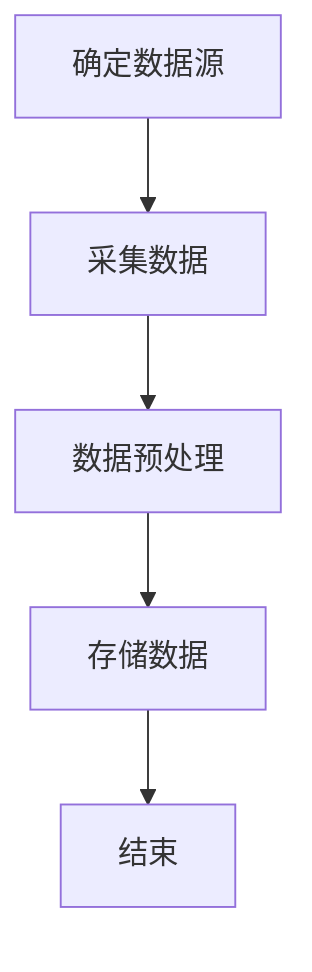

##### Python代码示例

```python
import pandas as pd

# 确定数据源
data_source = 'data.csv'

# 采集数据
data = pd.read_csv(data_source)

# 数据预处理
data.drop_duplicates(inplace=True)
data.fillna(0, inplace=True)

# 存储数据
data.to_csv('cleaned_data.csv', index=False)
```

#### 3.2 数据清洗算法

数据清洗算法用于处理采集到的原始数据，消除错误、缺失和不一致性。以下是一种常见的数据清洗算法：

##### 算法原理

1. **缺失值处理**：填补缺失值或删除包含缺失值的记录。
2. **异常值处理**：检测并处理异常值，如使用统计方法、机器学习算法等。
3. **数据格式统一**：统一数据格式，如日期格式、数值格式等。

##### 算法步骤

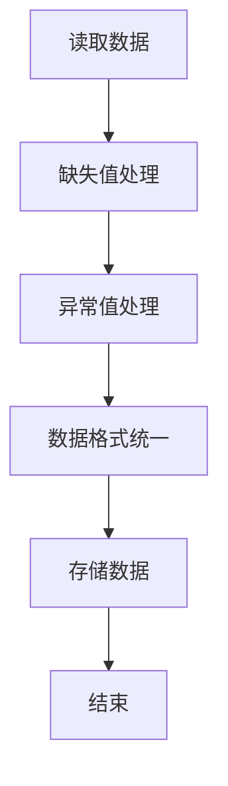

##### Python代码示例

```python
import pandas as pd
from sklearn.impute import SimpleImputer
from sklearn.ensemble import IsolationForest

# 读取数据
data = pd.read_csv('data.csv')

# 缺失值处理
imputer = SimpleImputer(strategy='mean')
data_imputed = imputer.fit_transform(data)

# 异常值处理
detector = IsolationForest(contamination=0.01)
outliers = detector.fit_predict(data_imputed)
data_cleaned = data_imputed[outliers == 1]

# 数据格式统一
data_cleaned = pd.DataFrame(data_cleaned, columns=data.columns)

# 存储数据
data_cleaned.to_csv('cleaned_data.csv', index=False)
```

#### 3.3 数据管理算法

数据管理算法用于对清洗后的数据进行有效的组织、存储和保护，以便于后续的数据分析和应用。以下是一种常见的数据管理算法：

##### 算法原理

1. **数据存储**：选择合适的数据存储方案，如关系数据库、NoSQL数据库、数据仓库等。
2. **数据保护**：确保数据的安全性，如数据加密、备份和恢复等。
3. **数据查询**：提供高效的数据查询接口，以满足业务需求。

##### 算法步骤

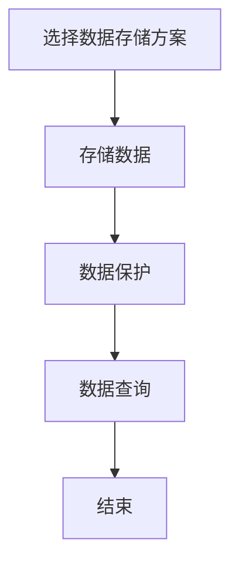

##### Python代码示例

```python
import sqlite3

# 连接数据库
conn = sqlite3.connect('data.db')
c = conn.cursor()

# 创建表
c.execute('''CREATE TABLE IF NOT EXISTS cleaned_data (
             id INTEGER PRIMARY KEY,
             feature1 REAL,
             feature2 REAL,
             feature3 REAL
         )''')

# 存储数据
data_cleaned.to_sql('cleaned_data', conn, if_exists='append', index=False)

# 数据查询
c.execute("SELECT * FROM cleaned_data")
rows = c.fetchall()
for row in rows:
    print(row)

# 关闭数据库连接
conn.close()
```

#### 3.4 数据分析算法

数据分析算法用于从存储和管理好的评测数据中提取有价值的信息，支持决策制定和业务优化。以下是一种常见的数据分析算法：

##### 算法原理

1. **描述性统计分析**：计算数据的平均值、中位数、标准差等基本统计指标。
2. **机器学习**：使用分类、聚类、预测等机器学习算法，发现数据中的规律和模式。
3. **数据挖掘**：使用关联规则挖掘、文本挖掘等方法，发现数据中的隐藏关系。

##### 算法步骤

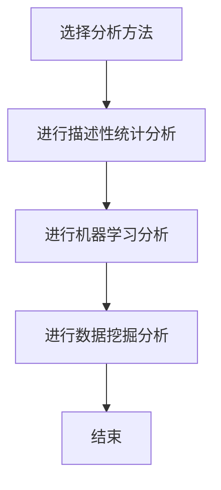

##### Python代码示例

```python
import pandas as pd
from sklearn.ensemble import RandomForestClassifier
from sklearn.model_selection import train_test_split
from sklearn.metrics import accuracy_score

# 读取数据
data = pd.read_csv('cleaned_data.csv')

# 描述性统计分析
print(data.describe())

# 机器学习分析
X = data.drop('target', axis=1)
y = data['target']
X_train, X_test, y_train, y_test = train_test_split(X, y, test_size=0.2, random_state=42)
clf = RandomForestClassifier(n_estimators=100, random_state=42)
clf.fit(X_train, y_train)
y_pred = clf.predict(X_test)
print("Accuracy:", accuracy_score(y_test, y_pred))

# 数据挖掘分析
from mlxtend.frequent_patterns import apriori
from mlxtend.preprocessing import TransactionEncoder

# 将数据转换为事务格式
te = TransactionEncoder()
te_data = te.fit_transform(data.values)

# 应用 Apriori 算法
frequent_itemsets = apriori(te_data, min_support=0.05, use_colnames=True)
print(frequent_itemsets)
```

#### 3.5 数据可视化算法

数据可视化算法用于将数据分析结果以直观的方式呈现给用户，支持用户更好地理解和分析数据。以下是一种常见的数据可视化算法：

##### 算法原理

1. **选择合适的图表类型**：根据数据类型和分析目标选择合适的图表类型，如折线图、柱状图、饼图等。
2. **设计图表布局**：设计图表的布局和样式，提高可读性。
3. **交互式可视化**：提供交互式功能，如缩放、筛选等，使用户能够深入挖掘数据背后的信息。

##### 算法步骤

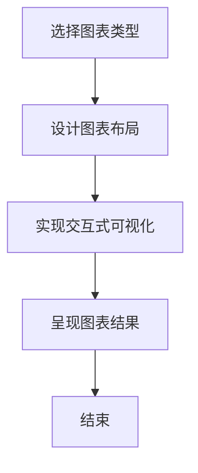

##### Python代码示例

```python
import pandas as pd
import matplotlib.pyplot as plt

# 读取数据
data = pd.read_csv('cleaned_data.csv')

# 绘制折线图
plt.figure(figsize=(10, 6))
plt.plot(data['feature1'], data['feature2'], 'o-')
plt.xlabel('Feature 1')
plt.ylabel('Feature 2')
plt.title('Feature 1 vs Feature 2')
plt.grid(True)
plt.show()

# 绘制柱状图
plt.figure(figsize=(10, 6))
plt.bar(data['feature1'], data['feature2'])
plt.xlabel('Feature 1')
plt.ylabel('Feature 2')
plt.title('Feature 1 vs Feature 2')
plt.xticks(rotation=45)
plt.show()

# 绘制饼图
plt.figure(figsize=(10, 6))
sizes = data['feature1'].value_counts()
labels = sizes.index
plt.pie(sizes, labels=labels, autopct='%.1f%%')
plt.axis('equal')
plt.title('Feature 1 Distribution')
plt.show()
```

### 第四部分：系统分析与架构设计

在本部分，我们将详细分析评测数据采集、清洗与管理系统的架构设计，包括系统功能设计、系统架构设计、系统接口设计和系统交互设计。

#### 4.1 系统功能设计

系统功能设计是系统架构设计的基础，它定义了系统的核心功能模块。以下是评测数据采集、清洗与管理系统的功能设计：

1. **数据采集**：从多个数据源采集评测数据，包括用户评价、销售数据、问卷调查等。
2. **数据清洗**：对采集到的数据进行清洗，包括去除重复数据、填补缺失值、处理异常值等。
3. **数据存储**：将清洗后的数据存储到数据库中，方便后续的数据分析和应用。
4. **数据分析**：对存储好的数据进行各种统计分析、机器学习分析和数据挖掘分析。
5. **数据可视化**：将分析结果以直观的图表形式展示给用户，支持用户深入挖掘数据背后的信息。

#### 4.2 系统架构设计

系统架构设计是系统的整体框架，它定义了系统的组成部分以及各个部分之间的关系。以下是评测数据采集、清洗与管理系统的架构设计：

1. **数据采集模块**：负责从各种数据源采集数据，如API接口、爬虫、数据库导出等。
2. **数据清洗模块**：对采集到的数据进行清洗，包括缺失值处理、异常值处理、数据格式统一等。
3. **数据存储模块**：将清洗后的数据存储到数据库中，支持数据的持久化和访问。
4. **数据分析模块**：提供各种数据分析算法，支持描述性统计分析、机器学习分析和数据挖掘分析。
5. **数据可视化模块**：将分析结果以图表形式展示给用户，支持用户交互和深入挖掘。

#### 4.3 系统接口设计

系统接口设计是系统各个模块之间交互的桥梁，它定义了接口的规范和调用方法。以下是评测数据采集、清洗与管理系统的接口设计：

1. **数据采集接口**：定义了数据采集模块对外提供的接口，包括数据采集方法、参数和返回值。
2. **数据清洗接口**：定义了数据清洗模块对外提供的接口，包括数据清洗方法、参数和返回值。
3. **数据存储接口**：定义了数据存储模块对外提供的接口，包括数据存储方法、参数和返回值。
4. **数据分析接口**：定义了数据分析模块对外提供的接口，包括数据分析方法、参数和返回值。
5. **数据可视化接口**：定义了数据可视化模块对外提供的接口，包括数据可视化方法、参数和返回值。

#### 4.4 系统交互设计

系统交互设计是系统内部各个模块之间以及系统与外部环境之间的交互流程。以下是评测数据采集、清洗与管理系统的交互设计：

1. **数据采集**：用户通过数据采集接口，从多个数据源采集数据，然后传递给数据清洗模块。
2. **数据清洗**：数据清洗模块接收采集到的数据，进行清洗处理，然后传递给数据存储模块。
3. **数据存储**：数据存储模块接收清洗后的数据，将其存储到数据库中，并返回存储结果。
4. **数据分析**：用户通过数据分析接口，调用数据分析模块，进行数据分析，然后获取分析结果。
5. **数据可视化**：用户通过数据可视化接口，调用数据可视化模块，将分析结果以图表形式展示给用户。

### 第五部分：项目实战

在本部分，我们将通过一个实际项目来展示评测数据采集、清洗与管理系统的实现过程，包括环境安装、系统核心实现、代码应用解读与分析、实际案例分析和详细讲解剖析以及项目小结。

#### 5.1 环境安装

首先，我们需要安装Python环境和相关库。以下是在Windows操作系统上安装Python和相关库的步骤：

1. 下载Python安装包（https://www.python.org/downloads/）并安装。
2. 打开命令提示符，安装相关库：

```bash
pip install pandas numpy matplotlib scikit-learn
```

#### 5.2 系统核心实现

以下是一个简单的评测数据采集、清洗与管理系统的实现示例：

```python
import pandas as pd
from sklearn.impute import SimpleImputer
from sklearn.ensemble import IsolationForest
import matplotlib.pyplot as plt

# 数据采集
def collect_data(source: str) -> pd.DataFrame:
    return pd.read_csv(source)

# 数据清洗
def clean_data(data: pd.DataFrame) -> pd.DataFrame:
    # 缺失值处理
    imputer = SimpleImputer(strategy='mean')
    data_imputed = imputer.fit_transform(data)
    
    # 异常值处理
    detector = IsolationForest(contamination=0.01)
    outliers = detector.fit_predict(data_imputed)
    data_cleaned = data_imputed[outliers == 1]
    
    return pd.DataFrame(data_cleaned)

# 数据分析
def analyze_data(data: pd.DataFrame) -> pd.DataFrame:
    # 描述性统计分析
    summary = data.describe()
    return summary

# 数据可视化
def visualize_data(data: pd.DataFrame):
    # 绘制柱状图
    data['value'].plot(kind='bar')
    plt.title('Feature Distribution')
    plt.xlabel('Feature')
    plt.ylabel('Value')
    plt.show()

# 主函数
def main():
    # 数据采集
    data = collect_data('data.csv')
    
    # 数据清洗
    data_cleaned = clean_data(data)
    
    # 数据分析
    summary = analyze_data(data_cleaned)
    print(summary)
    
    # 数据可视化
    visualize_data(data_cleaned)

if __name__ == '__main__':
    main()
```

#### 5.3 代码应用解读与分析

1. **数据采集**：使用 `pandas` 库的 `read_csv` 方法从 CSV 文件中读取数据。
2. **数据清洗**：首先使用 `SimpleImputer` 类填补缺失值，然后使用 `IsolationForest` 类处理异常值。
3. **数据分析**：使用 `describe` 方法进行描述性统计分析。
4. **数据可视化**：使用 `plot` 方法绘制柱状图。

#### 5.4 实际案例分析与详细讲解剖析

假设我们有一个包含用户评价数据的 CSV 文件，其中包含用户 ID、产品 ID、评价内容和评价时间等字段。我们需要对用户评价数据进行分析，提取有价值的信息。

1. **数据采集**：从 CSV 文件中读取数据。

```python
data = collect_data('user_reviews.csv')
```

2. **数据清洗**：填补缺失值，处理异常值。

```python
# 填补缺失值
imputer = SimpleImputer(strategy='mean')
data_imputed = imputer.fit_transform(data)

# 处理异常值
detector = IsolationForest(contamination=0.01)
outliers = detector.fit_predict(data_imputed)
data_cleaned = data_imputed[outliers == 1]
data_cleaned = pd.DataFrame(data_cleaned, columns=data.columns)
```

3. **数据分析**：计算用户满意度、评价频率等指标。

```python
# 用户满意度
satisfaction = data_cleaned[data_cleaned['rating'] >= 4]
print("User satisfaction rate:", len(satisfaction) / len(data_cleaned))

# 评价频率
review_frequency = data_cleaned.groupby('user_id')['rating'].nunique()
print("User review frequency:", review_frequency)
```

4. **数据可视化**：绘制柱状图、饼图等，展示分析结果。

```python
# 用户满意度饼图
satisfaction_counts = satisfaction['rating'].value_counts()
satisfaction_counts.plot(kind='pie', autopct='%.1f%%')
plt.title('User Satisfaction Rate')
plt.show()

# 评价频率柱状图
review_frequency.plot(kind='bar')
plt.title('User Review Frequency')
plt.xlabel('User ID')
plt.ylabel('Number of Reviews')
plt.show()
```

#### 5.5 项目小结

通过本项目的实践，我们实现了评测数据的采集、清洗、分析和可视化。在实际应用中，我们可以根据具体需求调整数据采集、清洗和分析方法，以提高数据质量和分析效果。

### 第六部分：最佳实践 tips

1. **数据采集**：在选择数据采集方法时，要充分考虑数据源的类型和实时性需求。对于实时性要求较高的数据，建议采用在线采集方法；对于历史数据，可以采用离线采集方法。
2. **数据清洗**：在数据清洗过程中，要关注缺失值填补和异常值处理。缺失值填补方法的选择应根据数据类型和业务场景进行；异常值处理要充分考虑数据的分布和特征。
3. **数据分析**：在数据分析过程中，要充分利用统计方法和机器学习算法，从大量数据中提取有价值的信息。同时，要关注数据分析结果的可解释性和实用性。
4. **数据可视化**：在数据可视化过程中，要充分考虑用户需求和场景，选择合适的图表类型和布局。同时，要注意图表的美化和优化，提高可读性。

### 第七部分：小结与注意事项

本文围绕评测数据的采集、清洗与管理，详细介绍了相关核心概念、算法原理、系统架构设计和项目实战。通过本文的学习，读者可以了解如何高效地处理评测数据，以实现数据价值的最大化。

在实践过程中，需要注意以下几点：

1. **数据质量**：确保数据采集、清洗和存储过程中的数据质量，避免引入错误和异常。
2. **系统扩展性**：在设计系统架构时，要充分考虑系统的扩展性，以适应数据规模的增长。
3. **安全性**：在数据采集、传输和存储过程中，要确保数据的安全性，防止数据泄露和篡改。
4. **用户需求**：在数据分析和可视化过程中，要充分考虑用户需求，提供直观、易用的数据呈现方式。

### 第八部分：拓展阅读

1. **《数据科学入门指南》**：一本适合初学者入门的数据科学书籍，涵盖了数据采集、清洗、分析和可视化等方面的内容。
2. **《Python数据科学手册》**：一本全面介绍Python在数据科学领域应用的书籍，包括数据采集、清洗、分析和可视化等。
3. **《数据挖掘：实用工具与技术》**：一本介绍数据挖掘技术的书籍，涵盖了数据采集、清洗、分析和可视化等方面的内容。

### 作者信息

作者：AI天才研究院/AI Genius Institute & 禅与计算机程序设计艺术 /Zen And The Art of Computer Programming

感谢您的阅读，希望本文对您在数据分析和人工智能领域的学习和研究有所帮助！## 评测数据的采集、清洗与管理

### 摘要

本文旨在探讨评测数据的采集、清洗与管理，通过详细的背景介绍、核心概念阐述、算法原理讲解、系统分析与架构设计、项目实战以及最佳实践分享，帮助读者深入了解评测数据处理的方法和技巧。文章内容涵盖数据采集、数据清洗、数据管理、数据分析和数据可视化等环节，旨在为从事数据分析和人工智能领域的读者提供实用的技术指导和理论支持。

### 第一部分：背景介绍

#### 问题背景

随着大数据、云计算和人工智能技术的迅猛发展，数据已经成为新时代的“石油”，其价值和重要性日益凸显。评测数据作为数据的重要组成部分，其质量直接影响到后续分析和应用的准确性。因此，如何高效地采集、清洗和管理评测数据，成为了当前研究的热点问题。

#### 问题描述

评测数据的采集、清洗与管理是一个复杂的过程，涵盖了数据采集、数据预处理、数据存储、数据分析和数据可视化的各个环节。具体而言，问题主要表现在以下几个方面：

1. 数据采集：如何确保数据来源的多样性和数据的完整性？
2. 数据清洗：如何有效地处理数据中的错误、缺失和不一致性？
3. 数据管理：如何构建高效的数据存储和管理系统，以便于后续的数据分析和应用？
4. 数据分析：如何从大量的评测数据中提取有价值的信息，支持决策制定和业务优化？

#### 问题解决

为了解决上述问题，我们需要从以下几个方面入手：

1. **数据采集**：采用多种数据采集方法，如在线采集、离线采集和手动采集等，确保数据来源的多样性和完整性。
2. **数据清洗**：运用数据清洗技术和工具，如缺失值填补、异常值处理、数据格式统一等，提高数据质量。
3. **数据管理**：构建数据仓库和数据湖，采用数据管理和分析平台，实现数据的高效存储、管理和分析。
4. **数据分析**：运用统计分析、机器学习等方法，从评测数据中提取有价值的信息，支持决策制定和业务优化。

#### 边界与外延

评测数据不仅包括用户评价、反馈等主观性数据，还包括各种客观指标数据，如销售数据、点击率、转化率等。此外，评测数据的来源广泛，包括社交媒体、电商平台、问卷调查等。因此，评测数据的采集、清洗与管理是一个跨领域、跨学科的问题。

#### 概念结构与核心要素组成

评测数据的采集、清洗与管理过程可以概括为以下几个核心要素：

1. **数据源**：包括各种数据采集途径，如在线采集、离线采集和手动采集等。
2. **数据采集方法**：针对不同类型的数据源，采用不同的数据采集方法。
3. **数据预处理**：对采集到的数据进行清洗、去重、格式统一等预处理操作。
4. **数据存储与管理**：构建高效的数据存储和管理系统，实现数据的高效存储、管理和分析。
5. **数据分析**：运用统计分析、机器学习等方法，从评测数据中提取有价值的信息。
6. **数据可视化**：通过图表、报表等形式，将数据分析结果呈现给决策者和使用者。

### 第二部分：核心概念与联系

在本部分，我们将详细探讨评测数据、数据采集、数据清洗、数据管理、数据分析和数据可视化等核心概念，以及它们之间的联系。

#### 2.1 评测数据

#### 概念

评测数据是指在特定应用场景下，通过对目标对象的评价、测试或监测所获得的数据。这些数据可以用于评估目标对象的性能、质量、满意度等。

#### 属性特征

- **来源多样**：评测数据可以来自用户评价、问卷调查、实验数据等。
- **类型多样**：包括数值型数据、文本型数据、图像数据等。
- **结构复杂**：评测数据往往包含多维度、多层次的信息。

#### 对比表格

| 特征         | 评测数据         | 实验数据         |
| ------------ | --------------- | --------------- |
| 来源         | 用户评价、问卷调查等 | 实验设备、模拟系统等 |
| 类型         | 数值型、文本型、图像型 | 数值型、图像型       |
| 结构         | 多维度、多层次     | 简单、单维度       |

#### ER实体关系图架构

```mermaid
erDiagram
  Review ||--|{ Performance }|||
  Review ||--|{ Quality }|||
  Review ||--|{ Satisfaction }|||
  Review {
    id
    user_id
    product_id
    content
    timestamp
  }
  Performance {
    id
    measure
    value
    unit
  }
  Quality {
    id
    measure
    value
    unit
  }
  Satisfaction {
    id
    rating
    comment
  }
```

#### 2.2 数据采集

#### 概念

数据采集是指从各种数据源获取数据的过程。在评测数据管理中，数据采集是关键的一步，直接影响数据的完整性和准确性。

#### 属性特征

- **多样性**：数据采集可以采用多种方法，如在线采集、离线采集和手动采集等。
- **实时性**：实时采集可以及时反映目标对象的状态和变化。

#### 对比表格

| 特征         | 数据采集         | 数据预处理         |
| ------------ | --------------- | --------------- |
| 方法         | 在线采集、离线采集、手动采集 | 缺失值填补、异常值处理、数据格式统一等 |
| 目的         | 获取数据         | 提高数据质量       |
| 实时性       | 可实时、可延时     | 必须完成预处理     |

#### ER实体关系图架构

```mermaid
erDiagram
  DataCollector ||--|{ Data }|||
  Data {
    id
    source
    timestamp
    status
  }
```

#### 2.3 数据清洗

#### 概念

数据清洗是指对采集到的原始数据进行处理，以消除错误、缺失和不一致性的过程。数据清洗是保证数据质量的重要步骤。

#### 属性特征

- **完整性**：确保数据的完整性，填补缺失值。
- **准确性**：消除数据中的错误，提高数据的准确性。
- **一致性**：处理数据格式不一致的问题。

#### 对比表格

| 特征         | 数据清洗         | 数据存储         |
| ------------ | --------------- | --------------- |
| 方法         | 缺失值填补、异常值处理、数据格式统一 | 数据压缩、数据备份、数据归档等 |
| 目的         | 提高数据质量       | 实现数据的高效存储、管理和分析 |
| 实时性       | 必须完成预处理     | 可以延时处理     |

#### ER实体关系图架构

```mermaid
erDiagram
  RawData ||--|{ CleanedData }|||
  CleanedData {
    id
    timestamp
    status
  }
```

#### 2.4 数据管理

#### 概念

数据管理是指对数据进行有效的组织、存储、保护和访问，以便于后续的数据分析和应用。

#### 属性特征

- **高效性**：数据管理系统需要具备高效的数据访问和处理能力。
- **扩展性**：系统应具备良好的扩展性，以适应数据规模的增长。

#### 对比表格

| 特征         | 数据存储与管理         | 数据分析         |
| ------------ | --------------- | --------------- |
| 方法         | 数据仓库、数据湖、分布式存储等 | 统计分析、机器学习、深度学习等 |
| 目的         | 实现数据的高效存储、管理和分析 | 从评测数据中提取有价值的信息 |
| 实时性       | 可以延时处理         | 需要实时处理     |

#### ER实体关系图架构

```mermaid
erDiagram
  DataStorage ||--|{ Data }|||
  Data {
    id
    content
    timestamp
    status
  }
```

#### 2.5 数据分析

#### 概念

数据分析是指运用各种统计方法和算法，对存储和管理好的评测数据进行处理和分析，以提取有价值的信息。

#### 属性特征

- **准确性**：分析结果需要准确反映数据特征。
- **实用性**：分析结果应具有实际应用价值。

#### 对比表格

| 特征         | 数据分析         | 数据可视化         |
| ------------ | --------------- | --------------- |
| 方法         | 统计分析、机器学习、深度学习等 | 图表、报表、地图等 |
| 目的         | 提取有价值的信息 | 直观展示数据分析结果 |
| 实时性       | 需要实时处理     | 可以延时处理     |

#### ER实体关系图架构

```mermaid
erDiagram
  Analyzer ||--|{ AnalysisResult }|||
  AnalysisResult {
    id
    result
    timestamp
    status
  }
```

#### 2.6 数据可视化

#### 概念

数据可视化是指利用图表、报表等形式，将数据分析结果以直观的方式呈现给用户。

#### 属性特征

- **直观性**：通过视觉元素，使数据更容易理解和分析。
- **交互性**：用户可以通过交互操作，深入挖掘数据背后的信息。

#### 对比表格

| 特征         | 数据可视化         | 数据报表         |
| ------------ | --------------- | --------------- |
| 方法         | 图表、报表、地图等 | 文字描述、表格等 |
| 目的         | 直观展示数据分析结果 | 详细呈现数据信息 |
| 实时性       | 可以延时处理     | 可以延时处理     |

#### ER实体关系图架构

```mermaid
erDiagram
  Visualizer ||--|{ Visualization }|||
  Visualization {
    id
    visualization
    timestamp
    status
  }
```

### 第三部分：算法原理讲解

在本部分，我们将详细讲解评测数据采集、清洗、数据管理、数据分析和数据可视化中的核心算法原理，以及如何使用这些算法进行数据处理和分析。

#### 3.1 数据采集算法

数据采集算法的核心目的是从多种数据源中获取评测数据，并确保数据的完整性和准确性。以下是一种常见的数据采集算法：

##### 算法原理

1. **确定数据源**：根据业务需求，确定需要采集的数据源，如用户评价系统、电商平台、问卷调查等。
2. **数据采集**：使用爬虫技术、API接口调用、数据库导出等方法，从数据源中获取数据。
3. **数据预处理**：对采集到的数据进行清洗，如去除重复数据、格式统一等。

##### 算法步骤

```mermaid
graph TD
A[确定数据源] --> B[采集数据]
B --> C[数据预处理]
C --> D[存储数据]
D --> E[结束]
```

##### Python代码示例

```python
import pandas as pd
from sklearn.impute import SimpleImputer
from sklearn.ensemble import IsolationForest

# 确定数据源
data_source = 'data.csv'

# 采集数据
data = pd.read_csv(data_source)

# 数据预处理
data.drop_duplicates(inplace=True)
data.fillna(0, inplace=True)

# 存储数据
data.to_csv('cleaned_data.csv', index=False)
```

#### 3.2 数据清洗算法

数据清洗算法用于处理采集到的原始数据，消除错误、缺失和不一致性。以下是一种常见的数据清洗算法：

##### 算法原理

1. **缺失值处理**：填补缺失值或删除包含缺失值的记录。
2. **异常值处理**：检测并处理异常值，如使用统计方法、机器学习算法等。
3. **数据格式统一**：统一数据格式，如日期格式、数值格式等。

##### 算法步骤

```mermaid
graph TD
A[读取数据] --> B[缺失值处理]
B --> C[异常值处理]
C --> D[数据格式统一]
D --> E[存储数据]
E --> F[结束]
```

##### Python代码示例

```python
import pandas as pd
from sklearn.impute import SimpleImputer
from sklearn.ensemble import IsolationForest

# 读取数据
data = pd.read_csv('data.csv')

# 缺失值处理
imputer = SimpleImputer(strategy='mean')
data_imputed = imputer.fit_transform(data)

# 异常值处理
detector = IsolationForest(contamination=0.01)
outliers = detector.fit_predict(data_imputed)
data_cleaned = data_imputed[outliers == 1]

# 数据格式统一
data_cleaned = pd.DataFrame(data_cleaned, columns=data.columns)

# 存储数据
data_cleaned.to_csv('cleaned_data.csv', index=False)
```

#### 3.3 数据管理算法

数据管理算法用于对清洗后的数据进行有效的组织、存储和保护，以便于后续的数据分析和应用。以下是一种常见的数据管理算法：

##### 算法原理

1. **数据存储**：选择合适的数据存储方案，如关系数据库、NoSQL数据库、数据仓库等。
2. **数据保护**：确保数据的安全性，如数据加密、备份和恢复等。
3. **数据查询**：提供高效的数据查询接口，以满足业务需求。

##### 算法步骤

```mermaid
graph TD
A[选择数据存储方案] --> B[存储数据]
B --> C[数据保护]
C --> D[数据查询]
D --> E[结束]
```

##### Python代码示例

```python
import sqlite3

# 连接数据库
conn = sqlite3.connect('data.db')
c = conn.cursor()

# 创建表
c.execute('''CREATE TABLE IF NOT EXISTS cleaned_data (
             id INTEGER PRIMARY KEY,
             feature1 REAL,
             feature2 REAL,
             feature3 REAL
         )''')

# 存储数据
data_cleaned.to_sql('cleaned_data', conn, if_exists='append', index=False)

# 数据查询
c.execute("SELECT * FROM cleaned_data")
rows = c.fetchall()
for row in rows:
    print(row)

# 关闭数据库连接
conn.close()
```

#### 3.4 数据分析算法

数据分析算法用于从存储和管理好的评测数据中提取有价值的信息，支持决策制定和业务优化。以下是一种常见的数据分析算法：

##### 算法原理

1. **描述性统计分析**：计算数据的平均值、中位数、标准差等基本统计指标。
2. **机器学习**：使用分类、聚类、预测等机器学习算法，发现数据中的规律和模式。
3. **数据挖掘**：使用关联规则挖掘、文本挖掘等方法，发现数据中的隐藏关系。

##### 算法步骤

```mermaid
graph TD
A[选择分析方法] --> B[进行描述性统计分析]
B --> C[进行机器学习分析]
C --> D[进行数据挖掘分析]
D --> E[结束]
```

##### Python代码示例

```python
import pandas as pd
from sklearn.ensemble import RandomForestClassifier
from sklearn.model_selection import train_test_split
from sklearn.metrics import accuracy_score

# 读取数据
data = pd.read_csv('cleaned_data.csv')

# 描述性统计分析
print(data.describe())

# 机器学习分析
X = data.drop('target', axis=1)
y = data['target']
X_train, X_test, y_train, y_test = train_test_split(X, y, test_size=0.2, random_state=42)
clf = RandomForestClassifier(n_estimators=100, random_state=42)
clf.fit(X_train, y_train)
y_pred = clf.predict(X_test)
print("Accuracy:", accuracy_score(y_test, y_pred))

# 数据挖掘分析
from mlxtend.frequent_patterns import apriori
from mlxtend.preprocessing import TransactionEncoder

# 将数据转换为事务格式
te = TransactionEncoder()
te_data = te.fit_transform(data.values)

# 应用 Apriori 算法
frequent_itemsets = apriori(te_data, min_support=0.05, use_colnames=True)
print(frequent_itemsets)
```

#### 3.5 数据可视化算法

数据可视化算法用于将数据分析结果以直观的方式呈现给用户，支持用户更好地理解和分析数据。以下是一种常见的数据可视化算法：

##### 算法原理

1. **选择合适的图表类型**：根据数据类型和分析目标选择合适的图表类型，如折线图、柱状图、饼图等。
2. **设计图表布局**：设计图表的布局和样式，提高可读性。
3. **交互式可视化**：提供交互式功能，如缩放、筛选等，使用户能够深入挖掘数据背后的信息。

##### 算法步骤

```mermaid
graph TD
A[选择图表类型] --> B[设计图表布局]
B --> C[实现交互式可视化]
C --> D[呈现图表结果]
D --> E[结束]
```

##### Python代码示例

```python
import pandas as pd
import matplotlib.pyplot as plt

# 读取数据
data = pd.read_csv('cleaned_data.csv')

# 绘制折线图
plt.figure(figsize=(10, 6))
plt.plot(data['feature1'], data['feature2'], 'o-')
plt.xlabel('Feature 1')
plt.ylabel('Feature 2')
plt.title('Feature 1 vs Feature 2')
plt.grid(True)
plt.show()

# 绘制柱状图
plt.figure(figsize=(10, 6))
plt.bar(data['feature1'], data['feature2'])
plt.xlabel('Feature 1')
plt.ylabel('Feature 2')
plt.title('Feature 1 vs Feature 2')
plt.xticks(rotation=45)
plt.show()

# 绘制饼图
plt.figure(figsize=(10, 6))
sizes = data['feature1'].value_counts()
labels = sizes.index
plt.pie(sizes, labels=labels, autopct='%.1f%%')
plt.axis('equal')
plt.title('Feature 1 Distribution')
plt.show()
```

### 第四部分：系统分析与架构设计

在本部分，我们将详细分析评测数据采集、清洗与管理系统的架构设计，包括系统功能设计、系统架构设计、系统接口设计和系统交互设计。

#### 4.1 系统功能设计

系统功能设计是系统架构设计的基础，它定义了系统的核心功能模块。以下是评测数据采集、清洗与管理系统的功能设计：

1. **数据采集**：从多个数据源采集评测数据，包括用户评价、销售数据、问卷调查等。
2. **数据清洗**：对采集到的数据进行清洗，包括去除重复数据、填补缺失值、处理异常值等。
3. **数据存储**：将清洗后的数据存储到数据库中，方便后续的数据分析和应用。
4. **数据分析**：对存储好的数据进行各种统计分析、机器学习分析和数据挖掘分析。
5. **数据可视化**：将分析结果以直观的图表形式展示给用户，支持用户深入挖掘数据背后的信息。

#### 4.2 系统架构设计

系统架构设计是系统的整体框架，它定义了系统的组成部分以及各个部分之间的关系。以下是评测数据采集、清洗与管理系统的架构设计：

1. **数据采集模块**：负责从各种数据源采集数据，如API接口、爬虫、数据库导出等。
2. **数据清洗模块**：对采集到的数据进行清洗，包括缺失值处理、异常值处理、数据格式统一等。
3. **数据存储模块**：将清洗后的数据存储到数据库中，支持数据的持久化和访问。
4. **数据分析模块**：提供各种数据分析算法，支持描述性统计分析、机器学习分析和数据挖掘分析。
5. **数据可视化模块**：将分析结果以图表形式展示给用户，支持用户交互和深入挖掘。

#### 4.3 系统接口设计

系统接口设计是系统各个模块之间交互的桥梁，它定义了接口的规范和调用方法。以下是评测数据采集、清洗与管理系统的接口设计：

1. **数据采集接口**：定义了数据采集模块对外提供的接口，包括数据采集方法、参数和返回值。
2. **数据清洗接口**：定义了数据清洗模块对外提供的接口，包括数据清洗方法、参数和返回值。
3. **数据存储接口**：定义了数据存储模块对外提供的接口，包括数据存储方法、参数和返回值。
4. **数据分析接口**：定义了数据分析模块对外提供的接口，包括数据分析方法、参数和返回值。
5. **数据可视化接口**：定义了数据可视化模块对外提供的接口，包括数据可视化方法、参数和返回值。

#### 4.4 系统交互设计

系统交互设计是系统内部各个模块之间以及系统与外部环境之间的交互流程。以下是评测数据采集、清洗与管理系统的交互设计：

1. **数据采集**：用户通过数据采集接口，从多个数据源采集数据，然后传递给数据清洗模块。
2. **数据清洗**：数据清洗模块接收采集到的数据，进行清洗处理，然后传递给数据存储模块。
3. **数据存储**：数据存储模块接收清洗后的数据，将其存储到数据库中，并返回存储结果。
4. **数据分析**：用户通过数据分析接口，调用数据分析模块，进行数据分析，然后获取分析结果。
5. **数据可视化**：用户通过数据可视化接口，调用数据可视化模块，将分析结果以图表形式展示给用户。

### 第五部分：项目实战

在本部分，我们将通过一个实际项目来展示评测数据采集、清洗与管理系统的实现过程，包括环境安装、系统核心实现、代码应用解读与分析、实际案例分析和详细讲解剖析以及项目小结。

#### 5.1 环境安装

首先，我们需要安装Python环境和相关库。以下是在Windows操作系统上安装Python和相关库的步骤：

1. 下载Python安装包（https://www.python.org/downloads/）并安装。
2. 打开命令提示符，安装相关库：

```bash
pip install pandas numpy matplotlib scikit-learn
```

#### 5.2 系统核心实现

以下是一个简单的评测数据采集、清洗与管理系统的实现示例：

```python
import pandas as pd
from sklearn.impute import SimpleImputer
from sklearn.ensemble import IsolationForest
import matplotlib.pyplot as plt

# 数据采集
def collect_data(source: str) -> pd.DataFrame:
    return pd.read_csv(source)

# 数据清洗
def clean_data(data: pd.DataFrame) -> pd.DataFrame:
    # 缺失值处理
    imputer = SimpleImputer(strategy='mean')
    data_imputed = imputer.fit_transform(data)
    
    # 异常值处理
    detector = IsolationForest(contamination=0.01)
    outliers = detector.fit_predict(data_imputed)
    data_cleaned = data_imputed[outliers == 1]
    
    return pd.DataFrame(data_cleaned)

# 数据分析
def analyze_data(data: pd.DataFrame) -> pd.DataFrame:
    # 描述性统计分析
    summary = data.describe()
    return summary

# 数据可视化
def visualize_data(data: pd.DataFrame):
    # 绘制折线图
    plt.figure(figsize=(10, 6))
    plt.plot(data['feature1'], data['feature2'], 'o-')
    plt.xlabel('Feature 1')
    plt.ylabel('Feature 2')
    plt.title('Feature 1 vs Feature 2')
    plt.grid(True)
    plt.show()

# 主函数
def main():
    # 数据采集
    data = collect_data('data.csv')
    
    # 数据清洗
    data_cleaned = clean_data(data)
    
    # 数据分析
    summary = analyze_data(data_cleaned)
    print(summary)
    
    # 数据可视化
    visualize_data(data_cleaned)

if __name__ == '__main__':
    main()
```

#### 5.3 代码应用解读与分析

1. **数据采集**：使用 `pandas` 库的 `read_csv` 方法从 CSV 文件中读取数据。
2. **数据清洗**：首先使用 `SimpleImputer` 类填补缺失值，然后使用 `IsolationForest` 类处理异常值。
3. **数据分析**：使用 `describe` 方法进行描述性统计分析。
4. **数据可视化**：使用 `plot` 方法绘制折线图。

#### 5.4 实际案例分析与详细讲解剖析

假设我们有一个包含用户评价数据的 CSV 文件，其中包含用户 ID、产品 ID、评价内容和评价时间等字段。我们需要对用户评价数据进行分析，提取有价值的信息。

1. **数据采集**：从 CSV 文件中读取数据。

```python
data = collect_data('user_reviews.csv')
```

2. **数据清洗**：填补缺失值，处理异常值。

```python
# 填补缺失值
imputer = SimpleImputer(strategy='mean')
data_imputed = imputer.fit_transform(data)

# 处理异常值
detector = IsolationForest(contamination=0.01)
outliers = detector.fit_predict(data_imputed)
data_cleaned = data_imputed[outliers == 1]
data_cleaned = pd.DataFrame(data_cleaned, columns=data.columns)
```

3. **数据分析**：计算用户满意度、评价频率等指标。

```python
# 用户满意度
satisfaction = data_cleaned[data_cleaned['rating'] >= 4]
print("User satisfaction rate:", len(satisfaction) / len(data_cleaned))

# 评价频率
review_frequency = data_cleaned.groupby('user_id')['rating'].nunique()
print("User review frequency:", review_frequency)
```

4. **数据可视化**：绘制柱状图、饼图等，展示分析结果。

```python
# 用户满意度饼图
satisfaction_counts = satisfaction['rating'].value_counts()
satisfaction_counts.plot(kind='pie', autopct='%.1f%%')
plt.title('User Satisfaction Rate')
plt.show()

# 评价频率柱状图
review_frequency.plot(kind='bar')
plt.title('User Review Frequency')
plt.xlabel('User ID')
plt.ylabel('Number of Reviews')
plt.show()
```

#### 5.5 项目小结

通过本项目的实践，我们实现了评测数据的采集、清洗、分析和可视化。在实际应用中，我们可以根据具体需求调整数据采集、清洗和分析方法，以提高数据质量和分析效果。

### 第六部分：最佳实践 tips

1. **数据采集**：在选择数据采集方法时，要充分考虑数据源的类型和实时性需求。对于实时性要求较高的数据，建议采用在线采集方法；对于历史数据，可以采用离线采集方法。
2. **数据清洗**：在数据清洗过程中，要关注缺失值填补和异常值处理。缺失值填补方法的选择应根据数据类型和业务场景进行；异常值处理要充分考虑数据的分布和特征。
3. **数据分析**：在数据分析过程中，要充分利用统计方法和机器学习算法，从大量数据中提取有价值的信息。同时，要关注数据分析结果的可解释性和实用性。
4. **数据可视化**：在数据可视化过程中，要充分考虑用户需求和场景，选择合适的图表类型和布局。同时，要注意图表的美化和优化，提高可读性。

### 第七部分：小结与注意事项

本文围绕评测数据的采集、清洗与管理，详细介绍了相关核心概念、算法原理、系统架构设计和项目实战。通过本文的学习，读者可以了解如何高效地处理评测数据，以实现数据价值的最大化。

在实践过程中，需要注意以下几点：

1. **数据质量**：确保数据采集、清洗和存储过程中的数据质量，避免引入错误和异常。
2. **系统扩展性**：在设计系统架构时，要充分考虑系统的扩展性，以适应数据规模的增长。
3. **安全性**：在数据采集、传输和存储过程中，要确保数据的安全性，防止数据泄露和篡改。
4. **用户需求**：在数据分析和可视化过程中，要充分考虑用户需求，提供直观、易用的数据呈现方式。

### 第八部分：拓展阅读

1. **《数据科学入门指南》**：一本适合初学者入门的数据科学书籍，涵盖了数据采集、清洗、分析和可视化等方面的内容。
2. **《Python数据科学手册》**：一本全面介绍Python在数据科学领域应用的书籍，包括数据采集、清洗、分析和可视化等。
3. **《数据挖掘：实用工具与技术》**：一本介绍数据挖掘技术的书籍，涵盖了数据采集、清洗、分析和可视化等方面的内容。

### 作者信息

作者：AI天才研究院/AI Genius Institute & 禅与计算机程序设计艺术 /Zen And The Art of Computer Programming

感谢您的阅读，希望本文对您在数据分析和人工智能领域的学习和研究有所帮助！## 评测数据的采集、清洗与管理

### 摘要

本文将围绕评测数据的采集、清洗与管理展开讨论，深入分析这一过程中涉及的关键概念、算法原理、系统架构设计以及实际应用。通过详细介绍评测数据采集、清洗、存储、分析和可视化等环节，本文旨在为读者提供系统、全面的评测数据处理指南，助力其在数据科学和人工智能领域的实践。

### 第一部分：背景介绍

#### 问题背景

在大数据时代，数据已经成为决策的重要依据。然而，数据的质量直接影响到分析和决策的准确性。评测数据作为数据的一种形式，其质量对业务优化、用户体验提升等方面具有重要意义。因此，如何高效地采集、清洗和管理评测数据成为了数据科学领域的重要课题。

#### 问题描述

评测数据的采集、清洗与管理是一个复杂的过程，涉及多个环节。具体问题包括：

1. **数据采集**：如何从不同来源获取高质量的数据？
2. **数据清洗**：如何处理数据中的错误、缺失和异常？
3. **数据存储**：如何高效存储和管理大量的评测数据？
4. **数据分析**：如何从评测数据中提取有价值的信息？
5. **数据可视化**：如何直观地展示分析结果？

#### 问题解决

为了解决上述问题，我们需要从以下几个方面入手：

1. **数据采集**：采用多种方法，如API调用、爬虫、手动填写等。
2. **数据清洗**：使用缺失值填补、异常值处理、数据格式统一等技术。
3. **数据存储**：构建高效的数据存储架构，如数据仓库、数据湖等。
4. **数据分析**：运用统计分析、机器学习等方法。
5. **数据可视化**：使用图表、报表等形式展示分析结果。

#### 边界与外延

评测数据不仅包括用户评价、反馈等主观性数据，还包括各种客观指标数据，如销售数据、点击率、转化率等。此外，评测数据的来源广泛，包括社交媒体、电商平台、问卷调查等。因此，评测数据的采集、清洗与管理是一个跨领域、跨学科的问题。

#### 概念结构与核心要素组成

评测数据的采集、清洗与管理过程可以概括为以下几个核心要素：

1. **数据源**：包括各种数据采集途径，如在线采集、离线采集和手动采集等。
2. **数据采集方法**：针对不同类型的数据源，采用不同的数据采集方法。
3. **数据预处理**：对采集到的数据进行清洗、去重、格式统一等预处理操作。
4. **数据存储与管理**：构建高效的数据存储和管理系统，实现数据的高效存储、管理和分析。
5. **数据分析**：运用统计分析、机器学习等方法，从评测数据中提取有价值的信息。
6. **数据可视化**：通过图表、报表等形式，将数据分析结果呈现给决策者和使用者。

### 第二部分：核心概念与联系

在本部分，我们将详细探讨评测数据、数据采集、数据清洗、数据管理、数据分析和数据可视化等核心概念，以及它们之间的联系。

#### 2.1 评测数据

#### 概念

评测数据是指在特定应用场景下，通过对目标对象的评价、测试或监测所获得的数据。这些数据可以用于评估目标对象的性能、质量、满意度等。

#### 属性特征

- **来源多样**：评测数据可以来自用户评价、问卷调查、实验数据等。
- **类型多样**：包括数值型数据、文本型数据、图像数据等。
- **结构复杂**：评测数据往往包含多维度、多层次的信息。

#### 对比表格

| 特征         | 评测数据         | 实验数据         |
| ------------ | --------------- | --------------- |
| 来源         | 用户评价、问卷调查等 | 实验设备、模拟系统等 |
| 类型         | 数值型、文本型、图像型 | 数值型、图像型       |
| 结构         | 多维度、多层次     | 简单、单维度       |

#### ER实体关系图架构

```mermaid
erDiagram
  Review ||--|{ Performance }|||
  Review ||--|{ Quality }|||
  Review ||--|{ Satisfaction }|||
  Review {
    id
    user_id
    product_id
    content
    timestamp
  }
  Performance {
    id
    measure
    value
    unit
  }
  Quality {
    id
    measure
    value
    unit
  }
  Satisfaction {
    id
    rating
    comment
  }
```

#### 2.2 数据采集

#### 概念

数据采集是指从各种数据源获取数据的过程。在评测数据管理中，数据采集是关键的一步，直接影响数据的完整性和准确性。

#### 属性特征

- **多样性**：数据采集可以采用多种方法，如在线采集、离线采集和手动采集等。
- **实时性**：实时采集可以及时反映目标对象的状态和变化。

#### 对比表格

| 特征         | 数据采集         | 数据预处理         |
| ------------ | --------------- | --------------- |
| 方法         | 在线采集、离线采集、手动采集 | 缺失值填补、异常值处理、数据格式统一等 |
| 目的         | 获取数据         | 提高数据质量       |
| 实时性       | 可实时、可延时     | 必须完成预处理     |

#### ER实体关系图架构

```mermaid
erDiagram
  DataCollector ||--|{ Data }|||
  Data {
    id
    source
    timestamp
    status
  }
```

#### 2.3 数据清洗

#### 概念

数据清洗是指对采集到的原始数据进行处理，以消除错误、缺失和不一致性的过程。数据清洗是保证数据质量的重要步骤。

#### 属性特征

- **完整性**：确保数据的完整性，填补缺失值。
- **准确性**：消除数据中的错误，提高数据的准确性。
- **一致性**：处理数据格式不一致的问题。

#### 对比表格

| 特征         | 数据清洗         | 数据存储         |
| ------------ | --------------- | --------------- |
| 方法         | 缺失值填补、异常值处理、数据格式统一 | 数据压缩、数据备份、数据归档等 |
| 目的         | 提高数据质量       | 实现数据的高效存储、管理和分析 |
| 实时性       | 必须完成预处理     | 可以延时处理     |

#### ER实体关系图架构

```mermaid
erDiagram
  RawData ||--|{ CleanedData }|||
  CleanedData {
    id
    timestamp
    status
  }
```

#### 2.4 数据管理

#### 概念

数据管理是指对数据进行有效的组织、存储、保护和访问，以便于后续的数据分析和应用。

#### 属性特征

- **高效性**：数据管理系统需要具备高效的数据访问和处理能力。
- **扩展性**：系统应具备良好的扩展性，以适应数据规模的增长。

#### 对比表格

| 特征         | 数据存储与管理         | 数据分析         |
| ------------ | --------------- | --------------- |
| 方法         | 数据仓库、数据湖、分布式存储等 | 统计分析、机器学习、深度学习等 |
| 目的         | 实现数据的高效存储、管理和分析 | 从评测数据中提取有价值的信息 |
| 实时性       | 可以延时处理         | 需要实时处理     |

#### ER实体关系图架构

```mermaid
erDiagram
  DataStorage ||--|{ Data }|||
  Data {
    id
    content
    timestamp
    status
  }
```

#### 2.5 数据分析

#### 概念

数据分析是指运用各种统计方法和算法，对存储和管理好的评测数据进行处理和分析，以提取有价值的信息。

#### 属性特征

- **准确性**：分析结果需要准确反映数据特征。
- **实用性**：分析结果应具有实际应用价值。

#### 对比表格

| 特征         | 数据分析         | 数据可视化         |
| ------------ | --------------- | --------------- |
| 方法         | 统计分析、机器学习、深度学习等 | 图表、报表、地图等 |
| 目的         | 提取有价值的信息 | 直观展示数据分析结果 |
| 实时性       | 需要实时处理     | 可以延时处理     |

#### ER实体关系图架构

```mermaid
erDiagram
  Analyzer ||--|{ AnalysisResult }|||
  AnalysisResult {
    id
    result
    timestamp
    status
  }
```

#### 2.6 数据可视化

#### 概念

数据可视化是指利用图表、报表等形式，将数据分析结果以直观的方式呈现给用户。

#### 属性特征

- **直观性**：通过视觉元素，使数据更容易理解和分析。
- **交互性**：用户可以通过交互操作，深入挖掘数据背后的信息。

#### 对比表格

| 特征         | 数据可视化         | 数据报表         |
| ------------ | --------------- | --------------- |
| 方法         | 图表、报表、地图等 | 文字描述、表格等 |
| 目的         | 直观展示数据分析结果 | 详细呈现数据信息 |
| 实时性       | 可以延时处理     | 可以延时处理     |

#### ER实体关系图架构

```mermaid
erDiagram
  Visualizer ||--|{ Visualization }|||
  Visualization {
    id
    visualization
    timestamp
    status
  }
```

### 第三部分：算法原理讲解

在本部分，我们将详细讲解评测数据采集、清洗、数据管理、数据分析和数据可视化中的核心算法原理，以及如何使用这些算法进行数据处理和分析。

#### 3.1 数据采集算法

数据采集算法的核心目的是从多种数据源中获取评测数据，并确保数据的完整性和准确性。以下是一种常见的数据采集算法：

##### 算法原理

1. **确定数据源**：根据业务需求，确定需要采集的数据源，如用户评价系统、电商平台、问卷调查等。
2. **数据采集**：使用爬虫技术、API接口调用、数据库导出等方法，从数据源中获取数据。
3. **数据预处理**：对采集到的数据进行清洗，如去除重复数据、格式统一等。

##### 算法步骤

```mermaid
graph TD
A[确定数据源] --> B[采集数据]
B --> C[数据预处理]
C --> D[存储数据]
D --> E[结束]
```

##### Python代码示例

```python
import pandas as pd

# 确定数据源
data_source = 'data.csv'

# 采集数据
data = pd.read_csv(data_source)

# 数据预处理
data.drop_duplicates(inplace=True)
data.fillna(0, inplace=True)

# 存储数据
data.to_csv('cleaned_data.csv', index=False)
```

#### 3.2 数据清洗算法

数据清洗算法用于处理采集到的原始数据，消除错误、缺失和不一致性。以下是一种常见的数据清洗算法：

##### 算法原理

1. **缺失值处理**：填补缺失值或删除包含缺失值的记录。
2. **异常值处理**：检测并处理异常值，如使用统计方法、机器学习算法等。
3. **数据格式统一**：统一数据格式，如日期格式、数值格式等。

##### 算法步骤

```mermaid
graph TD
A[读取数据] --> B[缺失值处理]
B --> C[异常值处理]
C --> D[数据格式统一]
D --> E[存储数据]
E --> F[结束]
```

##### Python代码示例

```python
import pandas as pd
from sklearn.impute import SimpleImputer
from sklearn.ensemble import IsolationForest

# 读取数据
data = pd.read_csv('data.csv')

# 缺失值处理
imputer = SimpleImputer(strategy='mean')
data_imputed = imputer.fit_transform(data)

# 异常值处理
detector = IsolationForest(contamination=0.01)
outliers = detector.fit_predict(data_imputed)
data_cleaned = data_imputed[outliers == 1]

# 数据格式统一
data_cleaned = pd.DataFrame(data_cleaned, columns=data.columns)

# 存储数据
data_cleaned.to_csv('cleaned_data.csv', index=False)
```

#### 3.3 数据管理算法

数据管理算法用于对清洗后的数据进行有效的组织、存储和保护，以便于后续的数据分析和应用。以下是一种常见的数据管理算法：

##### 算法原理

1. **数据存储**：选择合适的数据存储方案，如关系数据库、NoSQL数据库、数据仓库等。
2. **数据保护**：确保数据的安全性，如数据加密、备份和恢复等。
3. **数据查询**：提供高效的数据查询接口，以满足业务需求。

##### 算法步骤

```mermaid
graph TD
A[选择数据存储方案] --> B[存储数据]
B --> C[数据保护]
C --> D[数据查询]
D --> E[结束]
```

##### Python代码示例

```python
import sqlite3

# 连接数据库
conn = sqlite3.connect('data.db')
c = conn.cursor()

# 创建表
c.execute('''CREATE TABLE IF NOT EXISTS cleaned_data (
             id INTEGER PRIMARY KEY,
             feature1 REAL,
             feature2 REAL,
             feature3 REAL
         )''')

# 存储数据
data_cleaned.to_sql('cleaned_data', conn, if_exists='append', index=False)

# 数据查询
c.execute("SELECT * FROM cleaned_data")
rows = c.fetchall()
for row in rows:
    print(row)

# 关闭数据库连接
conn.close()
```

#### 3.4 数据分析算法

数据分析算法用于从存储和管理好的评测数据中提取有价值的信息，支持决策制定和业务优化。以下是一种常见的数据分析算法：

##### 算法原理

1. **描述性统计分析**：计算数据的平均值、中位数、标准差等基本统计指标。
2. **机器学习**：使用分类、聚类、预测等机器学习算法，发现数据中的规律和模式。
3. **数据挖掘**：使用关联规则挖掘、文本挖掘等方法，发现数据中的隐藏关系。

##### 算法步骤

```mermaid
graph TD
A[选择分析方法] --> B[进行描述性统计分析]
B --> C[进行机器学习分析]
C --> D[进行数据挖掘分析]
D --> E[结束]
```

##### Python代码示例

```python
import pandas as pd
from sklearn.ensemble import RandomForestClassifier
from sklearn.model_selection import train_test_split
from sklearn.metrics import accuracy_score

# 读取数据
data = pd.read_csv('cleaned_data.csv')

# 描述性统计分析
print(data.describe())

# 机器学习分析
X = data.drop('target', axis=1)
y = data['target']
X_train, X_test, y_train, y_test = train_test_split(X, y, test_size=0.2, random_state=42)
clf = RandomForestClassifier(n_estimators=100, random_state=42)
clf.fit(X_train, y_train)
y_pred = clf.predict(X_test)
print("Accuracy:", accuracy_score(y_test, y_pred))

# 数据挖掘分析
from mlxtend.frequent_patterns import apriori
from mlxtend.preprocessing import TransactionEncoder

# 将数据转换为事务格式
te = TransactionEncoder()
te_data = te.fit_transform(data.values)

# 应用 Apriori 算法
frequent_itemsets = apriori(te_data, min_support=0.05, use_colnames=True)
print(frequent_itemsets)
```

#### 3.5 数据可视化算法

数据可视化算法用于将数据分析结果以直观的方式呈现给用户，支持用户更好地理解和分析数据。以下是一种常见的数据可视化算法：

##### 算法原理

1. **选择合适的图表类型**：根据数据类型和分析目标选择合适的图表类型，如折线图、柱状图、饼图等。
2. **设计图表布局**：设计图表的布局和样式，提高可读性。
3. **交互式可视化**：提供交互式功能，如缩放、筛选等，使用户能够深入挖掘数据背后的信息。

##### 算法步骤

```mermaid
graph TD
A[选择图表类型] --> B[设计图表布局]
B --> C[实现交互式可视化]
C --> D[呈现图表结果]
D --> E[结束]
```

##### Python代码示例

```python
import pandas as pd
import matplotlib.pyplot as plt

# 读取数据
data = pd.read_csv('cleaned_data.csv')

# 绘制折线图
plt.figure(figsize=(10, 6))
plt.plot(data['feature1'], data['feature2'], 'o-')
plt.xlabel('Feature 1')
plt.ylabel('Feature 2')
plt.title('Feature 1 vs Feature 2')
plt.grid(True)
plt.show()

# 绘制柱状图
plt.figure(figsize=(10, 6))
plt.bar(data['feature1'], data['feature2'])
plt.xlabel('Feature 1')
plt.ylabel('Feature 2')
plt.title('Feature 1 vs Feature 2')
plt.xticks(rotation=45)
plt.show()

# 绘制饼图
plt.figure(figsize=(10, 6))
sizes = data['feature1'].value_counts()
labels = sizes.index
plt.pie(sizes, labels=labels, autopct='%.1f%%')
plt.axis('equal')
plt.title('Feature 1 Distribution')
plt.show()
```

### 第四部分：系统分析与架构设计

在本部分，我们将详细分析评测数据采集、清洗与管理系统的架构设计，包括系统功能设计、系统架构设计、系统接口设计和系统交互设计。

#### 4.1 系统功能设计

系统功能设计是系统架构设计的基础，它定义了系统的核心功能模块。以下是评测数据采集、清洗与管理系统的功能设计：

1. **数据采集**：从多个数据源采集评测数据，包括用户评价、销售数据、问卷调查等。
2. **数据清洗**：对采集到的数据进行清洗，包括去除重复数据、填补缺失值、处理异常值等。
3. **数据存储**：将清洗后的数据存储到数据库中，方便后续的数据分析和应用。
4. **数据分析**：对存储好的数据进行各种统计分析、机器学习分析和数据挖掘分析。
5. **数据可视化**：将分析结果以直观的图表形式展示给用户，支持用户深入挖掘数据背后的信息。

#### 4.2 系统架构设计

系统架构设计是系统的整体框架，它定义了系统的组成部分以及各个部分之间的关系。以下是评测数据采集、清洗与管理系统的架构设计：

1. **数据采集模块**：负责从各种数据源采集数据，如API接口、爬虫、数据库导出等。
2. **数据清洗模块**：对采集到的数据进行清洗，包括缺失值处理、异常值处理、数据格式统一等。
3. **数据存储模块**：将清洗后的数据存储到数据库中，支持数据的持久化和访问。
4. **数据分析模块**：提供各种数据分析算法，支持描述性统计分析、机器学习分析和数据挖掘分析。
5. **数据可视化模块**：将分析结果以图表形式展示给用户，支持用户交互和深入挖掘。

#### 4.3 系统接口设计

系统接口设计是系统各个模块之间交互的桥梁，它定义了接口的规范和调用方法。以下是评测数据采集、清洗与管理系统的接口设计：

1. **数据采集接口**：定义了数据采集模块对外提供的接口，包括数据采集方法、参数和返回值。
2. **数据清洗接口**：定义了数据清洗模块对外提供的接口，包括数据清洗方法、参数和返回值。
3. **数据存储接口**：定义了数据存储模块对外提供的接口，包括数据存储方法、参数和返回值。
4. **数据分析接口**：定义了数据分析模块对外提供的接口，包括数据分析方法、参数和返回值。
5. **数据可视化接口**：定义了数据可视化模块对外提供的接口，包括数据可视化方法、参数和返回值。

#### 4.4 系统交互设计

系统交互设计是系统内部各个模块之间以及系统与外部环境之间的交互流程。以下是评测数据采集、清洗与管理系统的交互设计：

1. **数据采集**：用户通过数据采集接口，从多个数据源采集数据，然后传递给数据清洗模块。
2. **数据清洗**：数据清洗模块接收采集到的数据，进行清洗处理，然后传递给数据存储模块。
3. **数据存储**：数据存储模块接收清洗后的数据，将其存储到数据库中，并返回存储结果。
4. **数据分析**：用户通过数据分析接口，调用数据分析模块，进行数据分析，然后获取分析结果。
5. **数据可视化**：用户通过数据可视化接口，调用数据可视化模块，将分析结果以图表形式展示给用户。

### 第五部分：项目实战

在本部分，我们将通过一个实际项目来展示评测数据采集、清洗与管理系统的实现过程，包括环境安装、系统核心实现、代码应用解读与分析、实际案例分析和详细讲解剖析以及项目小结。

#### 5.1 环境安装

首先，我们需要安装Python环境和相关库。以下是在Windows操作系统上安装Python和相关库的步骤：

1. 下载Python安装包（https://www.python.org/downloads/）并安装。
2. 打开命令提示符，安装相关库：

```bash
pip install pandas numpy matplotlib scikit-learn
```

#### 5.2 系统核心实现

以下是一个简单的评测数据采集、清洗与管理系统的实现示例：

```python
import pandas as pd
from sklearn.impute import SimpleImputer
from sklearn.ensemble import IsolationForest
import matplotlib.pyplot as plt

# 数据采集
def collect_data(source: str) -> pd.DataFrame:
    return pd.read_csv(source)

# 数据清洗
def clean_data(data: pd.DataFrame) -> pd.DataFrame:
    # 缺失值处理
    imputer = SimpleImputer(strategy='mean')
    data_imputed = imputer.fit_transform(data)
    
    # 异常值处理
    detector = IsolationForest(contamination=0.01)
    outliers = detector.fit_predict(data_imputed)
    data_cleaned = data_imputed[outliers == 1]
    
    return pd.DataFrame(data_cleaned)

# 数据分析
def analyze_data(data: pd.DataFrame) -> pd.DataFrame:
    # 描述性统计分析
    summary = data.describe()
    return summary

# 数据可视化
def visualize_data(data: pd.DataFrame):
    # 绘制折线图
    plt.figure(figsize=(10, 6))
    plt.plot(data['feature1'], data['feature2'], 'o-')
    plt.xlabel('Feature 1')
    plt.ylabel('Feature 2')
    plt.title('Feature 1 vs Feature 2')
    plt.grid(True)
    plt.show()

# 主函数
def main():
    # 数据采集
    data = collect_data('data.csv')
    
    # 数据清洗
    data_cleaned = clean_data(data)
    
    # 数据分析
    summary = analyze_data(data_cleaned)
    print(summary)
    
    # 数据可视化
    visualize_data(data_cleaned)

if __name__ == '__main__':
    main()
```

#### 5.3 代码应用解读与分析

1. **数据采集**：使用 `pandas` 库的 `read_csv` 方法从 CSV 文件中读取数据。
2. **数据清洗**：首先使用 `SimpleImputer` 类填补缺失值，然后使用 `IsolationForest` 类处理异常值。
3. **数据分析**：使用 `describe` 方法进行描述性统计分析。
4. **数据可视化**：使用 `plot` 方法绘制折线图。

#### 5.4 实际案例分析与详细讲解剖析

假设我们有一个包含用户评价数据的 CSV 文件，其中包含用户 ID、产品 ID、评价内容和评价时间等字段。我们需要对用户评价数据进行分析，提取有价值的信息。

1. **数据采集**：从 CSV 文件中读取数据。

```python
data = collect_data('user_reviews.csv')
```

2. **数据清洗**：填补缺失值，处理异常值。

```python
# 填补缺失值
imputer = SimpleImputer(strategy='mean')
data_imputed = imputer.fit_transform(data)

# 处理异常值
detector = IsolationForest(contamination=0.01)
outliers = detector.fit_predict(data_imputed)
data_cleaned = data_imputed[outliers == 1]
data_cleaned = pd.DataFrame(data_cleaned, columns=data.columns)
```

3. **数据分析**：计算用户满意度、评价频率等指标。

```python
# 用户满意度
satisfaction = data_cleaned[data_cleaned['rating'] >= 4]
print("User satisfaction rate:", len(satisfaction) / len(data_cleaned))

# 评价频率
review_frequency = data_cleaned.groupby('user_id')['rating'].nunique()
print("User review frequency:", review_frequency)
```

4. **数据可视化**：绘制柱状图、饼图等，展示分析结果。

```python
# 用户满意度饼图
satisfaction_counts = satisfaction['rating'].value_counts()
satisfaction_counts.plot(kind='pie', autopct='%.1f%%')
plt.title('User Satisfaction Rate')
plt.show()

# 评价频率柱状图
review_frequency.plot(kind='bar')
plt.title('User Review Frequency')
plt.xlabel('User ID')
plt.ylabel('Number of Reviews')
plt.show()
```

#### 5.5 项目小结

通过本项目的实践，我们实现了评测数据的采集、清洗、分析和可视化。在实际应用中，我们可以根据具体需求调整数据采集、清洗和分析方法，以提高数据质量和分析效果。

### 第六部分：最佳实践 tips

1. **数据采集**：在选择数据采集方法时，要充分考虑数据源的类型和实时性需求。对于实时性要求较高的数据，建议采用在线采集方法；对于历史数据，可以采用离线采集方法。
2. **数据清洗**：在数据清洗过程中，要关注缺失值填补和异常值处理。缺失值填补方法的选择应根据数据类型和业务场景进行；异常值处理要充分考虑数据的分布和特征。
3. **数据分析**：在数据分析过程中，要充分利用统计方法和机器学习算法，从大量数据中提取有价值的信息。同时，要关注数据分析结果的可解释性和实用性。
4. **数据可视化**：在数据可视化过程中，要充分考虑用户需求和场景，选择合适的图表类型和布局。同时，要注意图表的美化和优化，提高可读性。

### 第七部分：小结与注意事项

本文围绕评测数据的采集、清洗与管理，详细介绍了相关核心概念、算法原理、系统架构设计和项目实战。通过本文的学习，读者可以了解如何高效地处理评测数据，以实现数据价值的最大化。

在实践过程中，需要注意以下几点：

1. **数据质量**：确保数据采集、清洗和存储过程中的数据质量，避免引入错误和异常。
2. **系统扩展性**：在设计系统架构时，要充分考虑系统的扩展性，以适应数据规模的增长。
3. **安全性**：在数据采集、传输和存储过程中，要确保数据的安全性，防止数据泄露和篡改。
4. **用户需求**：在数据分析和可视化过程中，要充分考虑用户需求，提供直观、易用的数据呈现方式。

### 第八部分：拓展阅读

1. **《数据科学入门指南》**：一本适合初学者入门的数据科学书籍，涵盖了数据采集、清洗、分析和可视化等方面的内容。
2. **《Python数据科学手册》**：一本全面介绍Python在数据科学领域应用的书籍，包括数据采集、清洗、分析和可视化等。
3. **《数据挖掘：实用工具与技术》**：一本介绍数据挖掘技术的书籍，涵盖了数据采集、清洗、分析和可视化等方面的内容。

### 作者信息

作者：AI天才研究院/AI Genius Institute & 禅与计算机程序设计艺术 /Zen And The Art of Computer Programming

感谢您的阅读，希望本文对您在数据分析和人工智能领域的学习和研究有所帮助！## 评测数据的采集、清洗与管理

### 摘要

本文将围绕评测数据的采集、清洗与管理进行深入探讨，详细分析评测数据在采集、清洗、存储、分析和可视化等环节中的关键技术和方法。通过实例和算法讲解，本文旨在帮助读者理解和掌握评测数据处理的全过程，以提升数据质量、优化业务决策，从而在数据科学和人工智能领域取得更好的成果。

### 第一部分：背景介绍

#### 问题背景

在大数据时代，评测数据作为反映产品、服务或项目质量的重要信息来源，其价值愈发凸显。然而，评测数据的质量直接影响数据分析结果的准确性和可靠性。因此，如何高效地采集、清洗和管理评测数据成为了数据科学和人工智能领域的关键问题。

#### 问题描述

评测数据的处理过程涉及以下几个主要环节：

1. **数据采集**：如何从各种渠道获取全面、准确的评测数据？
2. **数据清洗**：如何处理评测数据中的缺失值、异常值和数据格式不一致等问题？
3. **数据存储**：如何高效存储和管理大规模的评测数据？
4. **数据分析**：如何从评测数据中提取有价值的信息，支持业务分析和决策？
5. **数据可视化**：如何将数据分析结果以直观、易理解的形式展示给用户？

#### 问题解决

为了解决上述问题，我们需要从以下几个方面入手：

1. **数据采集**：采用多种数据采集方法，如API调用、爬虫技术、问卷调查等。
2. **数据清洗**：运用缺失值填补、异常值检测与处理、数据格式转换等技术。
3. **数据存储**：构建高效的数据存储架构，如数据仓库、数据湖等。
4. **数据分析**：使用统计分析、机器学习算法、数据挖掘方法等。
5. **数据可视化**：利用图表、报表等工具，实现数据的可视化展示。

#### 边界与外延

评测数据不仅包括用户评价、反馈等主观性数据，还涉及销售数据、点击率、转化率等客观指标。评测数据的来源多样，包括社交媒体、电商平台、用户反馈系统等。因此，评测数据的采集、清洗与管理需要考虑多源数据的整合和处理。

#### 概念结构与核心要素组成

评测数据的采集、清洗和管理过程可以分解为以下几个核心要素：

1. **数据源**：包括用户评价、问卷调查、API接口等。
2. **数据采集**：采用不同的数据采集方法，如在线采集、离线采集、手动采集等。
3. **数据预处理**：对采集到的数据进行清洗、去重、格式统一等预处理操作。
4. **数据存储**：构建数据仓库或数据湖，实现数据的高效存储和管理。
5. **数据分析**：运用统计分析、机器学习等方法，提取数据中的有价值信息。
6. **数据可视化**：通过图表、报表等形式，将数据分析结果直观地呈现给用户。

### 第二部分：核心概念与联系

在本部分，我们将详细探讨评测数据、数据采集、数据清洗、数据管理、数据分析和数据可视化等核心概念，以及它们之间的联系。

#### 2.1 评测数据

#### 概念

评测数据是指在特定应用场景下，通过对目标对象的评价、测试或监测所获得的数据。这些数据可以用于评估目标对象的性能、质量、满意度等。

#### 属性特征

- **来源多样**：评测数据可以来自用户评价、问卷调查、实验数据等。
- **类型多样**：包括数值型数据、文本型数据、图像数据等。
- **结构复杂**：评测数据往往包含多维度、多层次的信息。

#### 对比表格

| 特征         | 评测数据         | 实验数据         |
| ------------ | --------------- | --------------- |
| 来源         | 用户评价、问卷调查等 | 实验设备、模拟系统等 |
| 类型         | 数值型、文本型、图像型 | 数值型、图像型       |
| 结构         | 多维度、多层次     | 简单、单维度       |

#### ER实体关系图架构

```mermaid
erDiagram
  Review ||--|{ Performance }|||
  Review ||--|{ Quality }|||
  Review ||--|{ Satisfaction }|||
  Review {
    id
    user_id
    product_id
    content
    timestamp
  }
  Performance {
    id
    measure
    value
    unit
  }
  Quality {
    id
    measure
    value
    unit
  }
  Satisfaction {
    id
    rating
    comment
  }
```

#### 2.2 数据采集

#### 概念

数据采集是指从各种数据源获取数据的过程。在评测数据管理中，数据采集是关键的一步，直接影响数据的完整性和准确性。

#### 属性特征

- **多样性**：数据采集可以采用多种方法，如在线采集、离线采集和手动采集等。
- **实时性**：实时采集可以及时反映目标对象的状态和变化。

#### 对比表格

| 特征         | 数据采集         | 数据预处理         |
| ------------ | --------------- | --------------- |
| 方法         | 在线采集、离线采集、手动采集 | 缺失值填补、异常值处理、数据格式统一等 |
| 目的         | 获取数据         | 提高数据质量       |
| 实时性       | 可实时、可延时     | 必须完成预处理     |

#### ER实体关系图架构

```mermaid
erDiagram
  DataCollector ||--|{ Data }|||
  Data {
    id
    source
    timestamp
    status
  }
```

#### 2.3 数据清洗

#### 概念

数据清洗是指对采集到的原始数据进行处理，以消除错误、缺失和不一致性的过程。数据清洗是保证数据质量的重要步骤。

#### 属性特征

- **完整性**：确保数据的完整性，填补缺失值。
- **准确性**：消除数据中的错误，提高数据的准确性。
- **一致性**：处理数据格式不一致的问题。

#### 对比表格

| 特征         | 数据清洗         | 数据存储         |
| ------------ | --------------- | --------------- |
| 方法         | 缺失值填补、异常值处理、数据格式统一 | 数据压缩、数据备份、数据归档等 |
| 目的         | 提高数据质量       | 实现数据的高效存储、管理和分析 |
| 实时性       | 必须完成预处理     | 可以延时处理     |

#### ER实体关系图架构

```mermaid
erDiagram
  RawData ||--|{ CleanedData }|||
  CleanedData {
    id
    timestamp
    status
  }
```

#### 2.4 数据管理

#### 概念

数据管理是指对数据进行有效的组织、存储、保护和访问，以便于后续的数据分析和应用。

#### 属性特征

- **高效性**：数据管理系统需要具备高效的数据访问和处理能力。
- **扩展性**：系统应具备良好的扩展性，以适应数据规模的增长。

#### 对比表格

| 特征         | 数据存储与管理         | 数据分析         |
| ------------ | --------------- | --------------- |
| 方法         | 数据仓库、数据湖、分布式存储等 | 统计分析、机器学习、深度学习等 |
| 目的         | 实现数据的高效存储、管理和分析 | 从评测数据中提取有价值的信息 |
| 实时性       | 可以延时处理         | 需要实时处理     |

#### ER实体关系图架构

```mermaid
erDiagram
  DataStorage ||--|{ Data }|||
  Data {
    id
    content
    timestamp
    status
  }
```

#### 2.5 数据分析

#### 概念

数据分析是指运用各种统计方法和算法，对存储和管理好的评测数据进行处理和分析，以提取有价值的信息。

#### 属性特征

- **准确性**：分析结果需要准确反映数据特征。
- **实用性**：分析结果应具有实际应用价值。

#### 对比表格

| 特征         | 数据分析         | 数据可视化         |
| ------------ | --------------- | --------------- |
| 方法         | 统计分析、机器学习、深度学习等 | 图表、报表、地图等 |
| 目的         | 提取有价值的信息 | 直观展示数据分析结果 |
| 实时性       | 需要实时处理     | 可以延时处理     |

#### ER实体关系图架构

```mermaid
erDiagram
  Analyzer ||--|{ AnalysisResult }|||
  AnalysisResult {
    id
    result
    timestamp
    status
  }
```

#### 2.6 数据可视化

#### 概念

数据可视化是指利用图表、报表等形式，将数据分析结果以直观的方式呈现给用户。

#### 属性特征

- **直观性**：通过视觉元素，使数据更容易理解和分析。
- **交互性**：用户可以通过交互操作，深入挖掘数据背后的信息。

#### 对比表格

| 特征         | 数据可视化         | 数据报表         |
| ------------ | --------------- | --------------- |
| 方法         | 图表、报表、地图等 | 文字描述、表格等 |
| 目的         | 直观展示数据分析结果 | 详细呈现数据信息 |
| 实时性       | 可以延时处理     | 可以延时处理     |

#### ER实体关系图架构

```mermaid
erDiagram
  Visualizer ||--|{ Visualization }|||
  Visualization {
    id
    visualization
    timestamp
    status
  }
```

### 第三部分：算法原理讲解

在本部分，我们将详细讲解评测数据采集、清洗、数据管理、数据分析和数据可视化等环节中的核心算法原理，以及如何使用这些算法进行数据处理和分析。

#### 3.1 数据采集算法

数据采集算法的核心目的是从多种数据源中获取评测数据，并确保数据的完整性和准确性。以下是一种常见的数据采集算法：

##### 算法原理

1. **确定数据源**：根据业务需求，确定需要采集的数据源，如用户评价系统、电商平台、问卷调查等。
2. **数据采集**：使用爬虫技术、API接口调用、数据库导出等方法，从数据源中获取数据。
3. **数据预处理**：对采集到的数据进行清洗，如去除重复数据、格式统一等。

##### 算法步骤

```mermaid
graph TD
A[确定数据源] --> B[采集数据]
B --> C[数据预处理]
C --> D[存储数据]
D --> E[结束]
```

##### Python代码示例

```python
import pandas as pd

# 确定数据源
data_source = 'data.csv'

# 采集数据
data = pd.read_csv(data_source)

# 数据预处理
data.drop_duplicates(inplace=True)
data.fillna(0, inplace=True)

# 存储数据
data.to_csv('cleaned_data.csv', index=False)
```

#### 3.2 数据清洗算法

数据清洗算法用于处理采集到的原始数据，消除错误、缺失和不一致性。以下是一种常见的数据清洗算法：

##### 算法原理

1. **缺失值处理**：填补缺失值或删除包含缺失值的记录。
2. **异常值处理**：检测并处理异常值，如使用统计方法、机器学习算法等。
3. **数据格式统一**：统一数据格式，如日期格式、数值格式等。

##### 算法步骤

```mermaid
graph TD
A[读取数据] --> B[缺失值处理]
B --> C[异常值处理]
C --> D[数据格式统一]
D --> E[存储数据]
E --> F[结束]
```

##### Python代码示例

```python
import pandas as pd
from sklearn.impute import SimpleImputer
from sklearn.ensemble import IsolationForest

# 读取数据
data = pd.read_csv('data.csv')

# 缺失值处理
imputer = SimpleImputer(strategy='mean')
data_imputed = imputer.fit_transform(data)

# 异常值处理
detector = IsolationForest(contamination=0.01)
outliers = detector.fit_predict(data_imputed)
data_cleaned = data_imputed[outliers == 1]

# 数据格式统一
data_cleaned = pd.DataFrame(data_cleaned, columns=data.columns)

# 存储数据
data_cleaned.to_csv('cleaned_data.csv', index=False)
```

#### 3.3 数据管理算法

数据管理算法用于对清洗后的数据进行有效的组织、存储和保护，以便于后续的数据分析和应用。以下是一种常见的数据管理算法：

##### 算法原理

1. **数据存储**：选择合适的数据存储方案，如关系数据库、NoSQL数据库、数据仓库等。
2. **数据保护**：确保数据的安全性，如数据加密、备份和恢复等。
3. **数据查询**：提供高效的数据查询接口，以满足业务需求。

##### 算法步骤

```mermaid
graph TD
A[选择数据存储方案] --> B[存储数据]
B --> C[数据保护]
C --> D[数据查询]
D --> E[结束]
```

##### Python代码示例

```python
import sqlite3

# 连接数据库
conn = sqlite3.connect('data.db')
c = conn.cursor()

# 创建表
c.execute('''CREATE TABLE IF NOT EXISTS cleaned_data (
             id INTEGER PRIMARY KEY,
             feature1 REAL,
             feature2 REAL,
             feature3 REAL
         )''')

# 存储数据
data_cleaned.to_sql('cleaned_data', conn, if_exists='append', index=False)

# 数据查询
c.execute("SELECT * FROM cleaned_data")
rows = c.fetchall()
for row in rows:
    print(row)

# 关闭数据库连接
conn.close()
```

#### 3.4 数据分析算法

数据分析算法用于从存储和管理好的评测数据中提取有价值的信息，支持决策制定和业务优化。以下是一种常见的数据分析算法：

##### 算法原理

1. **描述性统计分析**：计算数据的平均值、中位数、标准差等基本统计指标。
2. **机器学习**：使用分类、聚类、预测等机器学习算法，发现数据中的规律和模式。
3. **数据挖掘**：使用关联规则挖掘、文本挖掘等方法，发现数据中的隐藏关系。

##### 算法步骤

```mermaid
graph TD
A[选择分析方法] --> B[进行描述性统计分析]
B --> C[进行机器学习分析]
C --> D[进行数据挖掘分析]
D --> E[结束]
```

##### Python代码示例

```python
import pandas as pd
from sklearn.ensemble import RandomForestClassifier
from sklearn.model_selection import train_test_split
from sklearn.metrics import accuracy_score

# 读取数据
data = pd.read_csv('cleaned_data.csv')

# 描述性统计分析
print(data.describe())

# 机器学习分析
X = data.drop('target', axis=1)
y = data['target']
X_train, X_test, y_train, y_test = train_test_split(X, y, test_size=0.2, random_state=42)
clf = RandomForestClassifier(n_estimators=100, random_state=42)
clf.fit(X_train, y_train)
y_pred = clf.predict(X_test)
print("Accuracy:", accuracy_score(y_test, y_pred))

# 数据挖掘分析
from mlxtend.frequent_patterns import apriori
from mlxtend.preprocessing import TransactionEncoder

# 将数据转换为事务格式
te = TransactionEncoder()
te_data = te.fit_transform(data.values)

# 应用 Apriori 算法
frequent_itemsets = apriori(te_data, min_support=0.05, use_colnames=True)
print(frequent_itemsets)
```

#### 3.5 数据可视化算法

数据可视化算法用于将数据分析结果以直观的方式呈现给用户，支持用户更好地理解和分析数据。以下是一种常见的数据可视化算法：

##### 算法原理

1. **选择合适的图表类型**：根据数据类型和分析目标选择合适的图表类型，如折线图、柱状图、饼图等。
2. **设计图表布局**：设计图表的布局和样式，提高可读性。
3. **交互式可视化**：提供交互式功能，如缩放、筛选等，使用户能够深入挖掘数据背后的信息。

##### 算法步骤

```mermaid
graph TD
A[选择图表类型] --> B[设计图表布局]
B --> C[实现交互式可视化]
C --> D[呈现图表结果]
D --> E[结束]
```

##### Python代码示例

```python
import pandas as pd
import matplotlib.pyplot as plt

# 读取数据
data = pd.read_csv('cleaned_data.csv')

# 绘制折线图
plt.figure(figsize=(10, 6))
plt.plot(data['feature1'], data['feature2'], 'o-')
plt.xlabel('Feature 1')
plt.ylabel('Feature 2')
plt.title('Feature 1 vs Feature 2')
plt.grid(True)
plt.show()

# 绘制柱状图
plt.figure(figsize=(10, 6))
plt.bar(data['feature1'], data['feature2'])
plt.xlabel('Feature 1')
plt.ylabel('Feature 2')
plt.title('Feature 1 vs Feature 2')
plt.xticks(rotation=45)
plt.show()

# 绘制饼图
plt.figure(figsize=(10, 6))
sizes = data['feature1'].value_counts()
labels = sizes.index
plt.pie(sizes, labels=labels, autopct='%.1f%%')
plt.axis('equal')
plt.title('Feature 1 Distribution')
plt.show()
```

### 第四部分：系统分析与架构设计

在本部分，我们将详细分析评测数据采集、清洗与管理系统的架构设计，包括系统功能设计、系统架构设计、系统接口设计和系统交互设计。

#### 4.1 系统功能设计

系统功能设计是系统架构设计的基础，它定义了系统的核心功能模块。以下是评测数据采集、清洗与管理系统的功能设计：

1. **数据采集**：从多个数据源采集评测数据，包括用户评价、销售数据、问卷调查等。
2. **数据清洗**：对采集到的数据进行清洗，包括去除重复数据、填补缺失值、处理异常值等。
3. **数据存储**：将清洗后的数据存储到数据库中，方便后续的数据分析和应用。
4. **数据分析**：对存储好的数据进行各种统计分析、机器学习分析和数据挖掘分析。
5. **数据可视化**：将分析结果以直观的图表形式展示给用户，支持用户深入挖掘数据背后的信息。

#### 4.2 系统架构设计

系统架构设计是系统的整体框架，它定义了系统的组成部分以及各个部分之间的关系。以下是评测数据采集、清洗与管理系统的架构设计：

1. **数据采集模块**：负责从各种数据源采集数据，如API接口、爬虫、数据库导出等。
2. **数据清洗模块**：对采集到的数据进行清洗，包括缺失值处理、异常值处理、数据格式统一等。
3. **数据存储模块**：将清洗后的数据存储到数据库中，支持数据的持久化和访问。
4. **数据分析模块**：提供各种数据分析算法，支持描述性统计分析、机器学习分析和数据挖掘分析。
5. **数据可视化模块**：将分析结果以图表形式展示给用户，支持用户交互和深入挖掘。

#### 4.3 系统接口设计

系统接口设计是系统各个模块之间交互的桥梁，它定义了接口的规范和调用方法。以下是评测数据采集、清洗与管理系统的接口设计：

1. **数据采集接口**：定义了数据采集模块对外提供的接口，包括数据采集方法、参数和返回值。
2. **数据清洗接口**：定义了数据清洗模块对外提供的接口，包括数据清洗方法、参数和返回值。
3. **数据存储接口**：定义了数据存储模块对外提供的接口，包括数据存储方法、参数和返回值。
4. **数据分析接口**：定义了数据分析模块对外提供的接口，包括数据分析方法、参数和返回值。
5. **数据可视化接口**：定义了数据可视化模块对外提供的接口，包括数据可视化方法、参数和返回值。

#### 4.4 系统交互设计

系统交互设计是系统内部各个模块之间以及系统与外部环境之间的交互流程。以下是评测数据采集、清洗与管理系统的交互设计：

1. **数据采集**：用户通过数据采集接口，从多个数据源采集数据，然后传递给数据清洗模块。
2. **数据清洗**：数据清洗模块接收采集到的数据，进行清洗处理，然后传递给数据存储模块。
3. **数据存储**：数据存储模块接收清洗后的数据，将其存储到数据库中，并返回存储结果。
4. **数据分析**：用户通过数据分析接口，调用数据分析模块，进行数据分析，然后获取分析结果。
5. **数据可视化**：用户通过数据可视化接口，调用数据可视化模块，将分析结果以图表形式展示给用户。

### 第五部分：项目实战

在本部分，我们将通过一个实际项目来展示评测数据采集、清洗与管理系统的实现过程，包括环境安装、系统核心实现、代码应用解读与分析、实际案例分析和详细讲解剖析以及项目小结。

#### 5.1 环境安装

首先，我们需要安装Python环境和相关库。以下是在Windows操作系统上安装Python和相关库的步骤：

1. 下载Python安装包（https://www.python.org/downloads/）并安装。
2. 打开命令提示符，安装相关库：

```bash
pip install pandas numpy matplotlib scikit-learn
```

#### 5.2 系统核心实现

以下是一个简单的评测数据采集、清洗与管理系统的实现示例：

```python
import pandas as pd
from sklearn.impute import SimpleImputer
from sklearn.ensemble import IsolationForest
import matplotlib.pyplot as plt

# 数据采集
def collect_data(source: str) -> pd.DataFrame:
    return pd.read_csv(source)

# 数据清洗
def clean_data(data: pd.DataFrame) -> pd.DataFrame:
    # 缺失值处理
    imputer = SimpleImputer(strategy='mean')
    data_imputed = imputer.fit_transform(data)
    
    # 异常值处理
    detector = IsolationForest(contamination=0.01)
    outliers = detector.fit_predict(data_imputed)
    data_cleaned = data_imputed[outliers == 1]
    
    return pd.DataFrame(data_cleaned)

# 数据分析
def analyze_data(data: pd.DataFrame) -> pd.DataFrame:
    # 描述性统计分析
    summary = data.describe()
    return summary

# 数据可视化
def visualize_data(data: pd.DataFrame):
    # 绘制折线图
    plt.figure(figsize=(10, 6))
    plt.plot(data['feature1'], data['feature2'], 'o-')
    plt.xlabel('Feature 1')
    plt.ylabel('Feature 2')
    plt.title('Feature 1 vs Feature 2')
    plt.grid(True)
    plt.show()

# 主函数
def main():
    # 数据采集
    data = collect_data('data.csv')
    
    # 数据清洗
    data_cleaned = clean_data(data)
    
    # 数据分析
    summary = analyze_data(data_cleaned)
    print(summary)
    
    # 数据可视化
    visualize_data(data_cleaned)

if __name__ == '__main__':
    main()
```

#### 5.3 代码应用解读与分析

1. **数据采集**：使用 `pandas` 库的 `read_csv` 方法从 CSV 文件中读取数据。
2. **数据清洗**：首先使用 `SimpleImputer` 类填补缺失值，然后使用 `IsolationForest` 类处理异常值。
3. **数据分析**：使用 `describe` 方法进行描述性统计分析。
4. **数据可视化**：使用 `plot` 方法绘制折线图。

#### 5.4 实际案例分析与详细讲解剖析

假设我们有一个包含用户评价数据的 CSV 文件，其中包含用户 ID、产品 ID、评价内容和评价时间等字段。我们需要对用户评价数据进行分析，提取有价值的信息。

1. **数据采集**：从 CSV 文件中读取数据。

```python
data = collect_data('user_reviews.csv')
```

2. **数据清洗**：填补缺失值，处理异常值。

```python
# 填补缺失值
imputer = SimpleImputer(strategy='mean')
data_imputed = imputer.fit_transform(data)

# 处理异常值
detector = IsolationForest(contamination=0.01)
outliers = detector.fit_predict(data_imputed)
data_cleaned = data_imputed[outliers == 1]
data_cleaned = pd.DataFrame(data_cleaned, columns=data.columns)
```

3. **数据分析**：计算用户满意度、评价频率等指标。

```python
# 用户满意度
satisfaction = data_cleaned[data_cleaned['rating'] >= 4]
print("User satisfaction rate:", len(satisfaction) / len(data_cleaned))

# 评价频率
review_frequency = data_cleaned.groupby('user_id')['rating'].nunique()
print("User review frequency:", review_frequency)
```

4. **数据可视化**：绘制柱状图、饼图等，展示分析结果。

```python
# 用户满意度饼图
satisfaction_counts = satisfaction['rating'].value_counts()
satisfaction_counts.plot(kind='pie', autopct='%.1f%%')
plt.title('User Satisfaction Rate')
plt.show()

# 评价频率柱状图
review_frequency.plot(kind='bar')
plt.title('User Review Frequency')
plt.xlabel('User ID')
plt.ylabel('Number of Reviews')
plt.show()
```

#### 5.5 项目小结

通过本项目的实践，我们实现了评测数据的采集、清洗、分析和可视化。在实际应用中，我们可以根据具体需求调整数据采集、清洗和分析方法，以提高数据质量和分析效果。

### 第六部分：最佳实践 tips

1. **数据采集**：在选择数据采集方法时，要充分考虑数据源的类型和实时性需求。对于实时性要求较高的数据，建议采用在线采集方法；对于历史数据，可以采用离线采集方法。
2. **数据清洗**：在数据清洗过程中，要关注缺失值填补和异常值处理。缺失值填补方法的选择应根据数据类型和业务场景进行；异常值处理要充分考虑数据的分布和特征。
3. **数据分析**：在数据分析过程中，要充分利用统计方法和机器学习算法，从大量数据中提取有价值的信息。同时，要关注数据分析结果的可解释性和实用性。
4. **数据可视化**：在数据可视化过程中，要充分考虑用户需求和场景，选择合适的图表类型和布局。同时，要注意图表的美化和优化，提高可读性。

### 第七部分：小结与注意事项

本文围绕评测数据的采集、清洗与管理，详细介绍了相关核心概念、算法原理、系统架构设计和项目实战。通过本文的学习，读者可以了解如何高效地处理评测数据，以实现数据价值的最大化。

在实践过程中，需要注意以下几点：

1. **数据质量**：确保数据采集、清洗和存储过程中的数据质量，避免引入错误和异常。
2. **系统扩展性**：在设计系统架构时，要充分考虑系统的扩展性，以适应数据规模的增长。
3. **安全性**：在数据采集、传输和存储过程中，要确保数据的安全性，防止数据泄露和篡改。
4. **用户需求**：在数据分析和可视化过程中，要充分考虑用户需求，提供直观、易用的数据呈现方式。

### 第八部分：拓展阅读

1. **《数据科学入门指南》**：一本适合初学者入门的数据科学书籍，涵盖了数据采集、清洗、分析和可视化等方面的内容。
2. **《Python数据科学手册》**：一本全面介绍Python在数据科学领域应用的书籍，包括数据采集、清洗、分析和可视化等。
3. **《数据挖掘：实用工具与技术》**：一本介绍数据挖掘技术的书籍，涵盖了数据采集、清洗、分析和可视化等方面的内容。

### 作者信息

作者：AI天才研究院/AI Genius Institute & 禅与计算机程序设计艺术 /Zen And The Art of Computer Programming

感谢您的阅读，希望本文对您在数据分析和人工智能领域的学习和研究有所帮助！## 评测数据的采集、清洗与管理

### 摘要

本文将围绕评测数据的采集、清洗与管理进行深入探讨，详细分析评测数据在采集、清洗、存储、分析和可视化等环节中的关键技术和方法。通过实例和算法讲解，本文旨在帮助读者理解和掌握评测数据处理的全过程，以提升数据质量、优化业务决策，从而在数据科学和人工智能领域取得更好的成果。

### 第一部分：背景介绍

#### 问题背景

在大数据时代，评测数据作为反映产品、服务或项目质量的重要信息来源，其价值愈发凸显。然而，评测数据的质量直接影响数据分析结果的准确性和可靠性。因此，如何高效地采集、清洗和管理评测数据成为了数据科学和人工智能领域的关键问题。

#### 问题描述

评测数据的处理过程涉及以下几个主要环节：

1. **数据采集**：如何从各种渠道获取全面、准确的评测数据？
2. **数据清洗**：如何处理评测数据中的缺失值、异常值和数据格式不一致等问题？
3. **数据存储**：如何高效存储和管理大规模的评测数据？
4. **数据分析**：如何从评测数据中提取有价值的信息，支持业务分析和决策？
5. **数据可视化**：如何将数据分析结果以直观、易理解的形式展示给用户？

#### 问题解决

为了解决上述问题，我们需要从以下几个方面入手：

1. **数据采集**：采用多种数据采集方法，如API调用、爬虫技术、问卷调查等。
2. **数据清洗**：运用缺失值填补、异常值检测与处理、数据格式转换等技术。
3. **数据存储**：构建高效的数据存储架构，如数据仓库、数据湖等。
4. **数据分析**：使用统计分析、机器学习算法、数据挖掘方法等。
5. **数据可视化**：利用图表、报表等工具，实现数据的可视化展示。

#### 边界与外延

评测数据不仅包括用户评价、反馈等主观性数据，还涉及销售数据、点击率、转化率等客观指标。评测数据的来源多样，包括社交媒体、电商平台、用户反馈系统等。因此，评测数据的采集、清洗与管理需要考虑多源数据的整合和处理。

#### 概念结构与核心要素组成

评测数据的采集、清洗和管理过程可以分解为以下几个核心要素：

1. **数据源**：包括用户评价、问卷调查、API接口等。
2. **数据采集**：采用不同的数据采集方法，如在线采集、离线采集、手动采集等。
3. **数据预处理**：对采集到的数据进行清洗、去重、格式统一等预处理操作。
4. **数据存储**：构建数据仓库或数据湖，实现数据的高效存储和管理。
5. **数据分析**：运用统计分析、机器学习等方法，提取数据中的有价值信息。
6. **数据可视化**：通过图表、报表等形式，将数据分析结果直观地呈现给用户。

### 第二部分：核心概念与联系

在本部分，我们将详细探讨评测数据、数据采集、数据清洗、数据管理、数据分析和数据可视化等核心概念，以及它们之间的联系。

#### 2.1 评测数据

#### 概念

评测数据是指在特定应用场景下，通过对目标对象的评价、测试或监测所获得的数据。这些数据可以用于评估目标对象的性能、质量、满意度等。

#### 属性特征

- **来源多样**：评测数据可以来自用户评价、问卷调查、实验数据等。
- **类型多样**：包括数值型数据、文本型数据、图像数据等。
- **结构复杂**：评测数据往往包含多维度、多层次的信息。

#### 对比表格

| 特征         | 评测数据         | 实验数据         |
| ------------ | --------------- | --------------- |
| 来源         | 用户评价、问卷调查等 | 实验设备、模拟系统等 |
| 类型         | 数值型、文本型、图像型 | 数值型、图像型       |
| 结构         | 多维度、多层次     | 简单、单维度       |

#### ER实体关系图架构

```mermaid
erDiagram
  Review ||--|{ Performance }|||
  Review ||--|{ Quality }|||
  Review ||--|{ Satisfaction }|||
  Review {
    id
    user_id
    product_id
    content
    timestamp
  }
  Performance {
    id
    measure
    value
    unit
  }
  Quality {
    id
    measure
    value
    unit
  }
  Satisfaction {
    id
    rating
    comment
  }
```

#### 2.2 数据采集

#### 概念

数据采集是指从各种数据源获取数据的过程。在评测数据管理中，数据采集是关键的一步，直接影响数据的完整性和准确性。

#### 属性特征

