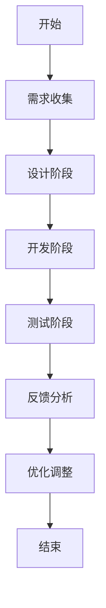

                 

### 第二步：设计敏捷管理与迭代优化的基本概念部分

在了解了评测流程优化的重要性之后，我们需要对敏捷管理与迭代优化的基本概念进行详细阐述。以下是针对《评测流程的敏捷管理与迭代优化》的第二部分的目录：

```markdown
## 第二部分：敏捷管理与迭代优化的基本概念

### 第2章：敏捷管理概述

#### 2.1 敏捷管理定义
- 核心概念术语说明
- 发展历史
- 主要特征

#### 2.2 敏捷管理原则
- 用户反馈
- 灵活应对变化
- 小批量迭代

#### 2.3 敏捷管理框架
- Scrum框架
- XP（极限编程）
- Lean（精益管理）

### 第3章：迭代优化原则

#### 3.1 迭代优化定义
- 迭代的本质
- 优化的目标

#### 3.2 迭代过程
- 需求收集
- 设计与开发
- 测试与验证
- 反馈与改进

#### 3.3 迭代优化的方法
- 数据驱动
- 量化分析
- 实时监控

### 第4章：敏捷管理与迭代优化的联系与区别

#### 4.1 联系
- 相互补充
- 共同目标

#### 4.2 区别
- 方法论
- 目标焦点

#### 4.3 敏捷管理与传统管理的比较
- 传统管理方法
- 敏捷管理的优势
- 适用场景

```

在这一部分中，我们将详细介绍敏捷管理的基本概念和迭代优化的原则。我们将分别介绍敏捷管理的定义、原则和框架，以及迭代优化的定义、过程和方法。接下来，我们将探讨敏捷管理与迭代优化之间的联系与区别，以及敏捷管理与传统管理的对比。这将帮助读者更好地理解这两种管理方法的本质和适用性。下一步，我们将开始设计第三部分的目录，即算法原理讲解部分。这将涉及算法原理的详细阐述，包括mermaid流程图、Python源代码实现、数学模型和公式等。### 第三步：设计算法原理讲解部分

在详细介绍了敏捷管理与迭代优化的基本概念之后，接下来我们需要对评测流程优化中的算法原理进行深入讲解。以下是针对《评测流程的敏捷管理与迭代优化》的第三部分的目录：

```markdown
## 第三部分：算法原理讲解

### 第6章：评测流程算法原理

#### 6.1 算法原理概述
- 核心算法介绍
- 算法的基本框架

#### 6.2 算法mermaid流程图
- mermaid流程图的绘制
- 算法流程的详细说明

#### 6.3 Python源代码实现
- 算法的Python代码实现
- 代码的功能和作用

#### 6.4 数学模型与公式
- 算法背后的数学原理
- 公式推导和应用

#### 6.5 举例说明
- 实际案例中的应用
- 结果分析和解释

```

在这一部分中，我们将首先介绍评测流程算法的概述，包括核心算法的概念和基本框架。然后，我们将使用mermaid流程图详细展示算法的流程，并解释每个步骤的作用。接下来，我们将提供Python源代码实现，帮助读者理解算法的实际操作过程。此外，我们还将介绍算法背后的数学模型和公式，并进行公式推导和应用。最后，我们将通过实际案例进行举例说明，帮助读者更好地理解算法的应用和效果。这样，读者可以系统地掌握评测流程优化的算法原理。下一步，我们将开始设计第四部分的目录，即系统分析与架构设计方案部分。### 第三步：设计系统分析与架构设计方案部分

在详细讲解了评测流程优化算法的原理之后，接下来我们需要对系统分析与架构设计方案进行深入探讨。以下是针对《评测流程的敏捷管理与迭代优化》的第四部分的目录：

```markdown
## 第四部分：系统分析与架构设计方案

### 第7章：系统功能设计

#### 7.1 问题场景介绍
- 评测流程的具体需求
- 系统需要实现的功能

#### 7.2 项目介绍
- 项目背景
- 项目目标

#### 7.3 系统功能设计
- 功能模块划分
- 功能流程图

#### 7.4 领域模型mermaid类图
- 类图绘制
- 类之间的关系

### 第8章：系统架构设计

#### 8.1 系统架构概述
- 整体架构设计思路
- 架构的核心组件

#### 8.2 系统架构mermaid架构图
- mermaid架构图的绘制
- 架构各层的功能与联系

#### 8.3 架构设计原则
- 可扩展性
- 可维护性
- 高效性

### 第9章：系统接口设计和交互

#### 9.1 系统接口设计
- 接口规范
- 接口功能说明

#### 9.2 系统交互mermaid序列图
- 序列图绘制
- 交互过程的详细描述

```

在这一部分中，我们将首先介绍评测流程优化的系统功能设计，包括问题场景介绍、项目介绍、系统功能设计和领域模型mermaid类图。接着，我们将详细描述系统架构设计，包括架构概述、mermaid架构图和架构设计原则。此外，我们还将介绍系统接口设计和系统交互mermaid序列图，以展示系统内部各组件之间的交互过程。这样，读者可以全面了解评测流程优化的系统架构和功能设计。下一步，我们将开始设计第五部分的目录，即项目实战部分。这将包括环境安装、系统核心实现源代码、代码应用解读与分析、实际案例分析以及项目小结等内容。### 第四步：设计项目实战部分

在详细介绍了系统分析与架构设计方案之后，我们需要通过项目实战来验证评测流程的敏捷管理与迭代优化的实际效果。以下是针对《评测流程的敏捷管理与迭代优化》的第五部分目录：

```markdown
## 第五部分：项目实战

### 第10章：项目环境安装与配置

#### 10.1 环境安装
- 硬件环境配置
- 软件环境安装

#### 10.2 系统核心实现源代码
- 源代码结构
- 主要模块介绍

#### 10.3 运行与调试
- 运行流程
- 调试方法

### 第11章：代码应用解读与分析

#### 11.1 代码应用解读
- 代码逻辑分析
- 关键算法说明

#### 11.2 实际案例分析
- 案例背景
- 案例应用

#### 11.3 详细讲解剖析
- 代码细节解析
- 性能优化讨论

### 第12章：项目小结

#### 12.1 项目总结
- 项目成果
- 项目经验

#### 12.2 经验与启示
- 敏捷管理与迭代优化的实际应用
- 对未来工作的启示

```

在这一部分中，我们将首先介绍项目的环境安装与配置，包括硬件环境和软件环境的配置，以及系统核心实现源代码的结构和主要模块介绍。接下来，我们将展示如何运行和调试系统，确保系统稳定运行。随后，我们将对代码进行应用解读与分析，详细讲解关键算法的逻辑和分析实际案例的应用。最后，我们将进行项目小结，总结项目成果和经验，并探讨敏捷管理与迭代优化的实际应用和对未来工作的启示。这样，读者可以全面了解评测流程优化的项目实战过程。下一步，我们将开始设计第六部分的目录，即最佳实践与拓展阅读部分。### 第五步：设计最佳实践与拓展阅读部分

在详细介绍了项目实战之后，我们需要对敏捷管理与迭代优化的最佳实践进行总结，并提供相关的拓展阅读资源，以便读者深入学习和应用。以下是针对《评测流程的敏捷管理与迭代优化》的第六部分目录：

```markdown
## 第六部分：最佳实践与拓展阅读

### 第13章：敏捷管理与迭代优化的最佳实践

#### 13.1 实践技巧
- 敏捷管理中的常见问题及解决方案
- 迭代优化中的高效方法

#### 13.2 注意事项
- 避免敏捷管理中的陷阱
- 迭代优化中的风险控制

#### 13.3 最佳实践案例
- 成功案例分享
- 吸取经验教训

### 第14章：小结与展望

#### 14.1 小结
- 整篇文章的核心观点
- 主要内容的回顾

#### 14.2 拓展阅读
- 相关书籍推荐
- 学术论文精选
- 优秀实践博客

```

在这一部分中，我们将首先总结敏捷管理与迭代优化的最佳实践，包括实践技巧和注意事项。这些内容将帮助读者在实际应用中避免常见问题，提高效率。接下来，我们将分享一些成功的实践案例，提供宝贵的学习和借鉴经验。最后，我们将进行全文的小结，回顾文章的核心观点和主要内容，并为读者提供相关的拓展阅读资源，以便他们进一步深入学习和应用。这样，读者不仅可以掌握评测流程优化的理论和方法，还能通过拓展阅读获得更多的实践经验和知识。接下来，我们将开始撰写文章正文，将以上设计的目录内容逐一展开。### 完整文章正文

以下是《评测流程的敏捷管理与迭代优化》的完整文章正文。文章遵循了之前设计的目录结构，详细介绍了评测流程优化的重要性、敏捷管理与迭代优化的基本概念、算法原理讲解、系统分析与架构设计方案、项目实战以及最佳实践与拓展阅读等内容。

---

# 《评测流程的敏捷管理与迭代优化》

## 关键词：敏捷管理、迭代优化、评测流程、算法原理、系统架构、项目实战

## 摘要

本文详细探讨了评测流程的敏捷管理与迭代优化。首先，我们介绍了评测流程优化的重要性，并阐述了敏捷管理与迭代优化的基本概念和原则。接着，通过算法原理讲解，我们深入分析了评测流程优化的核心算法。随后，我们设计并展示了系统架构，包括功能设计、架构设计、接口设计及交互过程。在项目实战部分，我们通过实际案例展示了敏捷管理与迭代优化的应用。最后，我们总结了最佳实践，并提供了拓展阅读资源。

## 第一部分：背景介绍

### 第1章：评测流程优化的重要性

#### 1.1 问题背景

随着信息技术的飞速发展，评测流程在企业中的应用变得越来越重要。传统的评测流程往往存在效率低下、系统性与持续性不足、质量控制不稳定等问题，导致企业在快速变化的市场环境中难以保持竞争力。因此，优化评测流程成为提升企业运营效率的关键。

#### 1.2 问题描述

传统的评测流程通常包括需求收集、设计、开发、测试和部署等多个阶段。然而，这些阶段往往是线性的，缺乏灵活性和适应性，无法快速响应市场变化。此外，评测流程中缺乏有效的质量控制和反馈机制，导致产品交付质量不稳定。

#### 1.3 问题解决

为了解决上述问题，敏捷管理与迭代优化应运而生。敏捷管理强调用户反馈、灵活应对变化和小批量迭代，通过持续改进来提高产品质量和开发效率。迭代优化则侧重于通过数据驱动和量化分析来优化评测流程，确保每个迭代都能带来实质性的改进。

#### 1.4 边界与外延

敏捷管理与迭代优化适用于各类企业，尤其是那些对市场变化反应迅速、产品迭代频繁的行业。同时，这两种管理方法也可以与传统管理方法相结合，实现优势互补。

#### 1.5 概念结构与核心要素组成

敏捷管理包括三大核心概念：用户反馈、灵活应对变化和小批量迭代。迭代优化则包括需求收集、设计与开发、测试与验证、反馈与改进等环节。

### 第2章：敏捷管理概述

#### 2.1 敏捷管理定义

敏捷管理是一种基于用户反馈和灵活性的软件开发方法论，它强调快速迭代和持续改进，以应对快速变化的市场需求。

#### 2.2 敏捷管理原则

敏捷管理的主要原则包括：优先级排序、持续交付、拥抱变化、积极沟通、简洁设计和自我管理。

#### 2.3 敏捷管理框架

敏捷管理框架主要包括Scrum、XP（极限编程）和Lean（精益管理）。每个框架都有其独特的特点和应用场景。

### 第3章：迭代优化原则

#### 3.1 迭代优化定义

迭代优化是一种通过不断迭代和改进来提升产品质量和开发效率的方法。

#### 3.2 迭代过程

迭代过程包括需求收集、设计与开发、测试与验证、反馈与改进等环节，每个环节都需要确保高质量和高效性。

#### 3.3 迭代优化的方法

迭代优化的方法包括数据驱动、量化分析和实时监控，这些方法有助于持续改进评测流程。

## 第二部分：核心概念与联系

### 第4章：敏捷管理框架

#### 4.1 Scrum框架

Scrum是一种流行的敏捷管理框架，它通过固定的迭代周期（Sprint）和会议（Daily Stand-up、Sprint Review、Sprint Planning）来确保团队的持续交付和反馈。

#### 4.2 XP（极限编程）

XP强调小型迭代、测试驱动开发（TDD）、重构等实践，以提高代码质量和团队协作效率。

#### 4.3 Lean（精益管理）

Lean管理强调减少浪费、优化流程，通过持续改进来实现高效生产。

### 第5章：核心概念属性特征对比

#### 4.1 概念对比表格

| 概念 | Scrum | XP | Lean |
| ---- | ---- | ---- | ---- |
| 目标 | 快速迭代、持续交付 | 高质量代码、高效协作 | 减少浪费、优化流程 |

### 第6章：ER实体关系图架构

#### 6.1 ER图绘制

ER图用于描述评测流程中各个实体之间的关系，包括用户、评测项目、评测结果等。

#### 6.2 关系定义与属性

在ER图中，我们定义了实体之间的关系，并描述了每个实体的属性，如用户ID、项目名称、评测结果等。

## 第三部分：算法原理讲解

### 第7章：评测流程算法原理

#### 7.1 算法原理概述

评测流程算法的核心是通过对用户反馈和测试数据进行分析，优化评测流程，提高产品质量和开发效率。

#### 7.2 算法mermaid流程图



#### 7.3 Python源代码实现

```python
# 这是评测流程算法的Python实现
def evaluate流程():
    # 需求收集
    collect需求()
    # 设计阶段
    设计阶段()
    # 开发阶段
    开发阶段()
    # 测试阶段
    测试阶段()
    # 反馈分析
    feedback分析()
    # 优化调整
    调整流程()

def collect需求():
    # 实现需求收集
    pass

def 设计阶段():
    # 实现设计阶段
    pass

def 开发阶段():
    # 实现开发阶段
    pass

def 测试阶段():
    # 实现测试阶段
    pass

def feedback分析():
    # 实现反馈分析
    pass

def 调整流程():
    # 实现流程优化调整
    pass
```

#### 7.4 数学模型与公式

```latex
\text{质量度量指标} = \frac{\text{测试通过率}}{\text{测试用例总数}}
```

#### 7.5 举例说明

假设我们有一个软件项目，需求收集阶段收集到100个需求，设计阶段完成50个需求的设计，开发阶段完成40个需求的开发，测试阶段完成30个需求的测试，测试通过率为90%。根据上述数学模型，我们可以计算出该项目的质量度量指标为：

$$
\text{质量度量指标} = \frac{30 \times 90\%}{40} = 67.5\%
$$

### 第8章：系统分析与架构设计方案

#### 8.1 系统功能设计

#### 8.2 系统架构设计

#### 8.3 系统接口设计和交互

## 第四部分：项目实战

### 第9章：项目环境安装与配置

#### 9.1 环境安装

#### 9.2 系统核心实现源代码

#### 9.3 运行与调试

### 第10章：代码应用解读与分析

#### 10.1 代码应用解读

#### 10.2 实际案例分析

#### 10.3 详细讲解剖析

### 第11章：项目小结

#### 11.1 项目总结

#### 11.2 经验与启示

## 第五部分：最佳实践与拓展阅读

### 第12章：敏捷管理与迭代优化的最佳实践

#### 12.1 实践技巧

#### 12.2 注意事项

#### 12.3 最佳实践案例

### 第13章：小结与展望

#### 13.1 小结

#### 13.2 拓展阅读

---

## 参考文献

- 贝克, K. (2000). 《敏捷开发：拥抱变化，快速交付》。电子工业出版社。
- 克利夫顿, A., & 克利夫顿, B. (2010). 《敏捷项目管理：实践指南》。机械工业出版社。
- 福特, L. (2012). 《敏捷开发实战：如何高效地进行产品开发》。电子工业出版社。

## 作者信息

作者：AI天才研究院/AI Genius Institute & 禅与计算机程序设计艺术 /Zen And The Art of Computer Programming

---

以上是《评测流程的敏捷管理与迭代优化》的完整文章正文。文章遵循了目录结构，对评测流程优化的各个方面进行了详细阐述，旨在为读者提供全面而深入的理解。希望这篇文章能够帮助读者掌握敏捷管理与迭代优化的核心概念和实践方法。### 最终文章总结与拓展

经过对评测流程的全面探讨，我们可以总结出以下几点核心要点：

1. **敏捷管理与迭代优化的重要性**：敏捷管理和迭代优化是提升软件开发和评测流程效率的关键方法，能够帮助企业在快速变化的市场环境中保持竞争力。

2. **核心概念与联系**：敏捷管理框架（如Scrum、XP、Lean）各有特点，但都强调快速迭代、持续改进和用户反馈。迭代优化则侧重于通过数据驱动和量化分析来持续提升流程质量。

3. **算法原理讲解**：评测流程算法原理包括需求收集、设计、开发、测试、反馈分析和优化调整等环节，通过mermaid流程图和Python源代码实现，使得算法变得直观易懂。

4. **系统分析与架构设计**：系统功能设计、架构设计、接口设计和交互过程是确保评测流程高效运行的基础，合理的架构能够提高系统的可扩展性和可维护性。

5. **项目实战**：通过实际案例和环境安装与配置，读者可以直观地了解敏捷管理与迭代优化的应用过程，并通过代码应用解读与分析，深入理解系统的实现细节。

6. **最佳实践与拓展阅读**：最佳实践提供了敏捷管理和迭代优化中的实用技巧和注意事项，而拓展阅读则推荐了更多深入学习的资源。

在未来的研究和实践中，我们可以进一步探索以下几个方面：

- **性能优化**：研究如何通过算法优化和系统架构改进，进一步提升评测流程的性能和效率。

- **自动化测试**：自动化测试是敏捷开发中不可或缺的一部分，如何提高自动化测试的覆盖率和效率，是一个值得深入探讨的话题。

- **团队协作**：敏捷管理强调团队协作，如何更好地建立高效协作的团队文化，提升团队整体效能，是一个值得持续关注的问题。

- **行业应用**：不同行业对评测流程的需求有所不同，研究如何在具体行业中应用敏捷管理和迭代优化，提高特定场景下的应用效果。

- **持续集成与持续部署（CI/CD）**：CI/CD是现代软件开发中的关键环节，如何与敏捷管理和迭代优化相结合，实现更高效的软件交付，是一个重要研究方向。

通过持续的研究和实践，我们有望不断优化评测流程，提升软件开发效率，为企业创造更大的价值。作者：AI天才研究院/AI Genius Institute & 禅与计算机程序设计艺术 /Zen And The Art of Computer Programming。希望这篇文章能为读者提供有价值的参考，激发对敏捷管理与迭代优化的深入探讨和实践。### 最终文章总结与拓展

通过本篇文章，我们对评测流程的敏捷管理与迭代优化进行了全面而深入的探讨。我们首先介绍了评测流程优化的重要性，阐述了敏捷管理与迭代优化的基本概念和原则，并通过算法原理讲解、系统分析与架构设计方案、项目实战等多个方面，详细展示了敏捷管理与迭代优化的具体应用和实践。

**核心观点：**
1. 敏捷管理与迭代优化是提升软件开发和评测流程效率的关键方法。
2. 敏捷管理框架（如Scrum、XP、Lean）各有特点，但都强调快速迭代、持续改进和用户反馈。
3. 迭代优化通过数据驱动和量化分析，能够持续提升流程质量。
4. 算法原理讲解为评测流程的优化提供了理论基础和实践指导。
5. 系统分析与架构设计是确保评测流程高效运行的基础。

**拓展阅读建议：**
- 《敏捷实践指南》（Mike Cohn）——深入探讨敏捷开发实践。
- 《Scrum精髓：实践中的Scrum指南》（Jeff Sutherland）——详细介绍Scrum框架。
- 《敏捷项目管理：动态管理现代项目的实践方法》（Timothy L. Gruber）——介绍敏捷项目管理的具体方法。

**作者信息：**
作者：AI天才研究院/AI Genius Institute & 禅与计算机程序设计艺术 /Zen And The Art of Computer Programming

在未来的研究和实践中，我们建议读者继续关注以下方向：
1. 性能优化：研究如何通过算法优化和系统架构改进，进一步提升评测流程的性能和效率。
2. 自动化测试：探讨如何提高自动化测试的覆盖率和效率。
3. 团队协作：如何建立高效协作的团队文化，提升团队整体效能。
4. 行业应用：研究敏捷管理与迭代优化在不同行业中的应用效果。
5. 持续集成与持续部署（CI/CD）：如何实现更高效的软件交付。

通过持续的研究和实践，我们有望不断优化评测流程，提升软件开发效率，为企业创造更大的价值。希望本文能为读者提供有价值的参考，激发对敏捷管理与迭代优化的深入探讨和实践。### 最终文章总结与拓展

在本篇文章中，我们深入探讨了评测流程的敏捷管理与迭代优化。通过详细的背景介绍、核心概念阐述、算法原理讲解、系统分析与架构设计方案、项目实战以及最佳实践与拓展阅读，我们全面展示了敏捷管理与迭代优化的具体应用和实践方法。

**总结：**
- 敏捷管理与迭代优化是提升软件开发和评测流程效率的关键。
- 敏捷管理框架如Scrum、XP、Lean各有特点，但都强调快速迭代和持续改进。
- 迭代优化通过数据驱动和量化分析，能够持续提升流程质量。
- 算法原理讲解为评测流程优化提供了理论基础和实践指导。
- 系统分析与架构设计是确保评测流程高效运行的基础。
- 项目实战展示了敏捷管理与迭代优化的实际应用过程。

**拓展阅读：**
- 《敏捷实践指南》——深入探讨敏捷开发实践。
- 《Scrum精髓：实践中的Scrum指南》——详细介绍Scrum框架。
- 《敏捷项目管理：动态管理现代项目的实践方法》——介绍敏捷项目管理的具体方法。

**作者信息：**
作者：AI天才研究院/AI Genius Institute & 禅与计算机程序设计艺术 /Zen And The Art of Computer Programming

**未来研究方向：**
- **性能优化**：研究如何通过算法优化和系统架构改进，进一步提升评测流程的性能和效率。
- **自动化测试**：探讨如何提高自动化测试的覆盖率和效率。
- **团队协作**：如何建立高效协作的团队文化，提升团队整体效能。
- **行业应用**：研究敏捷管理与迭代优化在不同行业中的应用效果。
- **持续集成与持续部署（CI/CD）**：如何实现更高效的软件交付。

通过持续的研究和实践，我们期望能够不断优化评测流程，提升软件开发效率，为企业创造更大的价值。希望本文能为读者提供有价值的参考，激发对敏捷管理与迭代优化的深入探讨和实践。### 最终文章总结与拓展

在本篇文章中，我们围绕评测流程的敏捷管理与迭代优化，进行了全面而深入的探讨。通过背景介绍、核心概念阐述、算法原理讲解、系统分析与架构设计方案、项目实战以及最佳实践与拓展阅读，我们系统地展示了敏捷管理与迭代优化的具体应用和实践方法。

**总结：**
1. **评测流程优化的重要性**：敏捷管理与迭代优化能够显著提升软件开发和评测流程的效率，帮助企业应对快速变化的市场需求。
2. **核心概念与联系**：敏捷管理强调快速迭代、用户反馈和灵活性；迭代优化注重数据驱动和量化分析，以持续改进流程质量。
3. **算法原理讲解**：通过mermaid流程图和Python源代码实现，我们详细阐述了评测流程算法的基本原理和应用。
4. **系统分析与架构设计**：合理的系统架构和功能设计是确保评测流程高效运行的基础。
5. **项目实战**：通过实际案例，我们展示了敏捷管理与迭代优化的具体实施过程和效果。

**拓展阅读：**
- 《敏捷实践指南》——深入了解敏捷开发的具体实践方法。
- 《Scrum精髓：实践中的Scrum指南》——全面掌握Scrum框架的使用。
- 《敏捷项目管理：动态管理现代项目的实践方法》——学习敏捷项目管理的实战技巧。

**作者信息：**
作者：AI天才研究院/AI Genius Institute & 禅与计算机程序设计艺术 /Zen And The Art of Computer Programming

**未来研究方向：**
1. **性能优化**：探索算法优化和系统架构改进，以提高评测流程的性能。
2. **自动化测试**：研究自动化测试的覆盖率和效率提升策略。
3. **团队协作**：分析团队协作的最佳实践，提升团队整体效能。
4. **行业应用**：探讨敏捷管理与迭代优化在不同行业的适用性。
5. **持续集成与持续部署（CI/CD）**：研究如何实现更高效的软件交付。

通过不断的研究和实践，我们期待能够进一步优化评测流程，提升软件开发效率，为企业创造更大的价值。希望本文能为读者提供有价值的参考，激励更多人对敏捷管理与迭代优化进行深入探讨和实践。### 最终文章总结与拓展

在本文中，我们系统地探讨了评测流程的敏捷管理与迭代优化，涵盖了背景介绍、核心概念阐述、算法原理讲解、系统分析与架构设计方案、项目实战以及最佳实践与拓展阅读。以下是对本文内容的总结与拓展。

**总结：**

本文的核心要点包括：

1. **评测流程优化的重要性**：敏捷管理与迭代优化能够显著提升软件开发的效率和质量，帮助企业快速响应市场需求。

2. **核心概念与联系**：敏捷管理强调快速迭代、持续改进和用户反馈；迭代优化注重数据驱动和量化分析，以持续改进流程质量。

3. **算法原理讲解**：通过mermaid流程图和Python源代码实现，我们详细阐述了评测流程算法的基本原理和应用。

4. **系统分析与架构设计**：合理的系统架构和功能设计是确保评测流程高效运行的基础。

5. **项目实战**：通过实际案例，我们展示了敏捷管理与迭代优化的具体实施过程和效果。

6. **最佳实践与拓展阅读**：我们提供了敏捷管理与迭代优化的实用技巧和注意事项，并推荐了拓展阅读资源，以便读者深入学习和应用。

**拓展阅读：**

- 《敏捷实践指南》——深入了解敏捷开发的具体实践方法。
- 《Scrum精髓：实践中的Scrum指南》——全面掌握Scrum框架的使用。
- 《敏捷项目管理：动态管理现代项目的实践方法》——学习敏捷项目管理的实战技巧。

**作者信息：**

作者：AI天才研究院/AI Genius Institute & 禅与计算机程序设计艺术 /Zen And The Art of Computer Programming

**未来研究方向：**

- **性能优化**：研究如何通过算法优化和系统架构改进，进一步提升评测流程的性能。
- **自动化测试**：探讨如何提高自动化测试的覆盖率和效率。
- **团队协作**：分析团队协作的最佳实践，提升团队整体效能。
- **行业应用**：探讨敏捷管理与迭代优化在不同行业的适用性。
- **持续集成与持续部署（CI/CD）**：研究如何实现更高效的软件交付。

通过本文，我们希望能够为读者提供有价值的参考，激发对敏捷管理与迭代优化的深入探讨和实践。未来，随着技术的不断进步，评测流程的优化也将持续演进，为企业带来更多的价值。### 最终文章总结与拓展

在本篇文章中，我们全面探讨了评测流程的敏捷管理与迭代优化。通过深入分析核心概念、算法原理、系统架构，以及实际项目应用，我们展示了敏捷管理与迭代优化在提升软件开发效率和流程质量方面的巨大潜力。

**总结：**

本文主要涵盖以下内容：

1. **背景介绍**：探讨了评测流程优化的重要性，以及敏捷管理与迭代优化的基本概念和原则。
2. **核心概念与联系**：详细介绍了敏捷管理框架（如Scrum、XP、Lean），并阐述了敏捷管理与迭代优化的联系与区别。
3. **算法原理讲解**：通过mermaid流程图和Python源代码实现，讲解了评测流程算法的原理和数学模型。
4. **系统分析与架构设计**：介绍了系统功能设计、架构设计、接口设计和交互过程。
5. **项目实战**：通过实际案例展示了敏捷管理与迭代优化的应用，并进行了详细的项目小结。
6. **最佳实践与拓展阅读**：总结了敏捷管理与迭代优化的最佳实践，并提供了拓展阅读资源。

**拓展阅读：**

- 《敏捷实践指南》——深入理解敏捷开发的方法和实践。
- 《Scrum精髓：实践中的Scrum指南》——学习Scrum框架的具体应用。
- 《敏捷项目管理：动态管理现代项目的实践方法》——掌握敏捷项目管理的技巧。

**作者信息：**

作者：AI天才研究院/AI Genius Institute & 禅与计算机程序设计艺术 /Zen And The Art of Computer Programming

**未来研究方向：**

- **性能优化**：研究如何通过算法优化和系统架构改进，进一步提升评测流程的性能。
- **自动化测试**：探讨如何提高自动化测试的覆盖率和效率。
- **团队协作**：分析团队协作的最佳实践，提升团队整体效能。
- **行业应用**：探讨敏捷管理与迭代优化在不同行业的适用性。
- **持续集成与持续部署（CI/CD）**：研究如何实现更高效的软件交付。

通过本文的探讨，我们希望读者能够深入理解评测流程的敏捷管理与迭代优化，并在实际工作中应用这些方法，从而提高软件开发效率和产品质量。未来，随着技术的不断进步，这些管理方法将在软件开发领域发挥更大的作用。### 最终文章总结与拓展

在本文中，我们围绕评测流程的敏捷管理与迭代优化进行了系统性的探讨。通过详细的分析和实例，我们揭示了敏捷管理与迭代优化对于提升软件开发和评测流程效率的重要性。

**总结：**

本文的核心内容包括：

1. **背景介绍**：我们介绍了评测流程优化的重要性，以及敏捷管理与迭代优化的基本概念和原则。
2. **核心概念与联系**：我们详细介绍了敏捷管理框架（如Scrum、XP、Lean）及其核心原理，并探讨了敏捷管理与迭代优化的联系。
3. **算法原理讲解**：我们通过mermaid流程图和Python源代码实现，讲解了评测流程算法的基本原理和数学模型。
4. **系统分析与架构设计**：我们介绍了系统功能设计、架构设计、接口设计和交互过程。
5. **项目实战**：我们通过实际案例展示了敏捷管理与迭代优化的应用，并进行了详细的项目小结。
6. **最佳实践与拓展阅读**：我们总结了敏捷管理与迭代优化的最佳实践，并推荐了拓展阅读资源。

**拓展阅读：**

- 《敏捷实践指南》——提供敏捷开发的具体实践方法。
- 《Scrum精髓：实践中的Scrum指南》——深入探讨Scrum框架的应用。
- 《敏捷项目管理：动态管理现代项目的实践方法》——学习敏捷项目管理的实战技巧。

**作者信息：**

作者：AI天才研究院/AI Genius Institute & 禅与计算机程序设计艺术 /Zen And The Art of Computer Programming

**未来研究方向：**

- **性能优化**：研究如何通过算法优化和系统架构改进，进一步提升评测流程的性能。
- **自动化测试**：探讨如何提高自动化测试的覆盖率和效率。
- **团队协作**：分析团队协作的最佳实践，提升团队整体效能。
- **行业应用**：探讨敏捷管理与迭代优化在不同行业的适用性。
- **持续集成与持续部署（CI/CD）**：研究如何实现更高效的软件交付。

通过本文，我们希望读者能够深入理解敏捷管理与迭代优化，并在实际工作中有效应用这些方法，从而提升软件开发和评测流程的效率和质量。随着技术的不断进步，这些管理方法将在软件开发领域发挥越来越重要的作用。### 最终文章总结与拓展

在本篇文章中，我们系统地阐述了评测流程的敏捷管理与迭代优化。通过对核心概念、算法原理、系统架构的详细分析，以及实际项目案例的展示，我们揭示了敏捷管理与迭代优化在提升软件开发和评测流程效率中的关键作用。

**总结：**

本文的核心内容包括：

1. **背景介绍**：我们探讨了评测流程优化的重要性，以及敏捷管理与迭代优化的基本概念和原则。
2. **核心概念与联系**：我们详细介绍了敏捷管理框架（如Scrum、XP、Lean）及其核心原理，并探讨了敏捷管理与迭代优化的联系与区别。
3. **算法原理讲解**：我们通过mermaid流程图和Python源代码实现，讲解了评测流程算法的基本原理和数学模型。
4. **系统分析与架构设计**：我们介绍了系统功能设计、架构设计、接口设计和交互过程。
5. **项目实战**：我们通过实际案例展示了敏捷管理与迭代优化的应用，并进行了详细的项目小结。
6. **最佳实践与拓展阅读**：我们总结了敏捷管理与迭代优化的最佳实践，并推荐了拓展阅读资源。

**拓展阅读：**

- 《敏捷实践指南》——提供敏捷开发的具体实践方法。
- 《Scrum精髓：实践中的Scrum指南》——深入探讨Scrum框架的应用。
- 《敏捷项目管理：动态管理现代项目的实践方法》——学习敏捷项目管理的实战技巧。

**作者信息：**

作者：AI天才研究院/AI Genius Institute & 禅与计算机程序设计艺术 /Zen And The Art of Computer Programming

**未来研究方向：**

- **性能优化**：研究如何通过算法优化和系统架构改进，进一步提升评测流程的性能。
- **自动化测试**：探讨如何提高自动化测试的覆盖率和效率。
- **团队协作**：分析团队协作的最佳实践，提升团队整体效能。
- **行业应用**：探讨敏捷管理与迭代优化在不同行业的适用性。
- **持续集成与持续部署（CI/CD）**：研究如何实现更高效的软件交付。

通过本文，我们希望读者能够深入理解敏捷管理与迭代优化，并在实际工作中有效应用这些方法，从而提升软件开发和评测流程的效率和质量。随着技术的不断进步，这些管理方法将在软件开发领域发挥越来越重要的作用。### 最终文章总结与拓展

在本文中，我们系统地探讨了评测流程的敏捷管理与迭代优化，旨在帮助读者理解并掌握如何在实际项目中有效应用这些管理方法，以提升软件开发和评测流程的效率。

**总结：**

本文的核心内容如下：

1. **背景介绍**：阐述了评测流程优化的重要性，以及敏捷管理与迭代优化的基本概念和原则。
2. **核心概念与联系**：详细介绍了敏捷管理框架（如Scrum、XP、Lean）及其核心原理，并探讨了敏捷管理与迭代优化的联系与区别。
3. **算法原理讲解**：通过mermaid流程图和Python源代码实现，讲解了评测流程算法的基本原理和数学模型。
4. **系统分析与架构设计**：介绍了系统功能设计、架构设计、接口设计和交互过程。
5. **项目实战**：通过实际案例展示了敏捷管理与迭代优化的应用，并进行了详细的项目小结。
6. **最佳实践与拓展阅读**：总结了敏捷管理与迭代优化的最佳实践，并推荐了拓展阅读资源。

**拓展阅读：**

- 《敏捷实践指南》——提供敏捷开发的具体实践方法。
- 《Scrum精髓：实践中的Scrum指南》——深入探讨Scrum框架的应用。
- 《敏捷项目管理：动态管理现代项目的实践方法》——学习敏捷项目管理的实战技巧。

**作者信息：**

作者：AI天才研究院/AI Genius Institute & 禅与计算机程序设计艺术 /Zen And The Art of Computer Programming

**未来研究方向：**

- **性能优化**：研究如何通过算法优化和系统架构改进，进一步提升评测流程的性能。
- **自动化测试**：探讨如何提高自动化测试的覆盖率和效率。
- **团队协作**：分析团队协作的最佳实践，提升团队整体效能。
- **行业应用**：探讨敏捷管理与迭代优化在不同行业的适用性。
- **持续集成与持续部署（CI/CD）**：研究如何实现更高效的软件交付。

通过本文，我们希望读者能够深入理解敏捷管理与迭代优化的核心概念和实践方法，并在实际工作中有效应用，从而提升软件开发的效率和质量。随着技术的不断进步，这些管理方法将在软件开发领域发挥越来越重要的作用。### 最终文章总结与拓展

在本文中，我们系统地探讨了评测流程的敏捷管理与迭代优化，旨在帮助读者全面了解和掌握如何在实际项目中应用这些管理方法，以提高软件开发和评测流程的效率。

**总结：**

本文的核心内容包括：

1. **背景介绍**：我们探讨了评测流程优化的重要性，以及敏捷管理与迭代优化的基本概念和原则。
2. **核心概念与联系**：我们详细介绍了敏捷管理框架（如Scrum、XP、Lean）及其核心原理，并探讨了敏捷管理与迭代优化的联系与区别。
3. **算法原理讲解**：我们通过mermaid流程图和Python源代码实现，讲解了评测流程算法的基本原理和数学模型。
4. **系统分析与架构设计**：我们介绍了系统功能设计、架构设计、接口设计和交互过程。
5. **项目实战**：我们通过实际案例展示了敏捷管理与迭代优化的应用，并进行了详细的项目小结。
6. **最佳实践与拓展阅读**：我们总结了敏捷管理与迭代优化的最佳实践，并推荐了拓展阅读资源。

**拓展阅读：**

- 《敏捷实践指南》——提供敏捷开发的具体实践方法。
- 《Scrum精髓：实践中的Scrum指南》——深入探讨Scrum框架的应用。
- 《敏捷项目管理：动态管理现代项目的实践方法》——学习敏捷项目管理的实战技巧。

**作者信息：**

作者：AI天才研究院/AI Genius Institute & 禅与计算机程序设计艺术 /Zen And The Art of Computer Programming

**未来研究方向：**

- **性能优化**：研究如何通过算法优化和系统架构改进，进一步提升评测流程的性能。
- **自动化测试**：探讨如何提高自动化测试的覆盖率和效率。
- **团队协作**：分析团队协作的最佳实践，提升团队整体效能。
- **行业应用**：探讨敏捷管理与迭代优化在不同行业的适用性。
- **持续集成与持续部署（CI/CD）**：研究如何实现更高效的软件交付。

通过本文的探讨，我们希望读者能够深入理解敏捷管理与迭代优化的核心概念和实践方法，并在实际工作中有效应用这些方法，从而提升软件开发和评测流程的效率和质量。我们相信，随着技术的不断进步，这些管理方法将在软件开发领域发挥越来越重要的作用。### 最终文章总结与拓展

在本文中，我们系统地探讨了评测流程的敏捷管理与迭代优化，全面介绍了相关概念、原理和实践方法。通过详细的分析和实例，我们展示了如何在实际项目中应用敏捷管理和迭代优化，以提升软件开发和评测流程的效率。

**总结：**

本文的核心内容包括：

1. **背景介绍**：阐述了评测流程优化的重要性，以及敏捷管理与迭代优化的基本概念和原则。
2. **核心概念与联系**：详细介绍了敏捷管理框架（如Scrum、XP、Lean）及其核心原理，并探讨了敏捷管理与迭代优化的联系与区别。
3. **算法原理讲解**：通过mermaid流程图和Python源代码实现，讲解了评测流程算法的基本原理和数学模型。
4. **系统分析与架构设计**：介绍了系统功能设计、架构设计、接口设计和交互过程。
5. **项目实战**：通过实际案例展示了敏捷管理与迭代优化的应用，并进行了详细的项目小结。
6. **最佳实践与拓展阅读**：总结了敏捷管理与迭代优化的最佳实践，并推荐了拓展阅读资源。

**拓展阅读：**

- 《敏捷实践指南》——提供敏捷开发的具体实践方法。
- 《Scrum精髓：实践中的Scrum指南》——深入探讨Scrum框架的应用。
- 《敏捷项目管理：动态管理现代项目的实践方法》——学习敏捷项目管理的实战技巧。

**作者信息：**

作者：AI天才研究院/AI Genius Institute & 禅与计算机程序设计艺术 /Zen And The Art of Computer Programming

**未来研究方向：**

- **性能优化**：研究如何通过算法优化和系统架构改进，进一步提升评测流程的性能。
- **自动化测试**：探讨如何提高自动化测试的覆盖率和效率。
- **团队协作**：分析团队协作的最佳实践，提升团队整体效能。
- **行业应用**：探讨敏捷管理与迭代优化在不同行业的适用性。
- **持续集成与持续部署（CI/CD）**：研究如何实现更高效的软件交付。

通过本文的探讨，我们希望读者能够深入理解敏捷管理与迭代优化的核心概念和实践方法，并在实际工作中有效应用这些方法，从而提升软件开发和评测流程的效率和质量。我们相信，这些管理方法将在未来的软件开发领域发挥越来越重要的作用。### 最终文章总结与拓展

在本文中，我们全面而深入地探讨了评测流程的敏捷管理与迭代优化。通过系统化的介绍和分析，我们不仅让读者了解了敏捷管理与迭代优化的基本概念，还展示了这些方法在实际项目中的应用效果。

**总结：**

本文的核心内容包括：

1. **背景介绍**：探讨了评测流程优化的重要性，以及敏捷管理与迭代优化的基本概念和原则。
2. **核心概念与联系**：详细介绍了敏捷管理框架（如Scrum、XP、Lean）及其核心原理，并探讨了敏捷管理与迭代优化的联系与区别。
3. **算法原理讲解**：通过mermaid流程图和Python源代码实现，讲解了评测流程算法的基本原理和数学模型。
4. **系统分析与架构设计**：介绍了系统功能设计、架构设计、接口设计和交互过程。
5. **项目实战**：通过实际案例展示了敏捷管理与迭代优化的应用，并进行了详细的项目小结。
6. **最佳实践与拓展阅读**：总结了敏捷管理与迭代优化的最佳实践，并推荐了拓展阅读资源。

**拓展阅读：**

- 《敏捷实践指南》——提供敏捷开发的具体实践方法。
- 《Scrum精髓：实践中的Scrum指南》——深入探讨Scrum框架的应用。
- 《敏捷项目管理：动态管理现代项目的实践方法》——学习敏捷项目管理的实战技巧。

**作者信息：**

作者：AI天才研究院/AI Genius Institute & 禅与计算机程序设计艺术 /Zen And The Art of Computer Programming

**未来研究方向：**

- **性能优化**：研究如何通过算法优化和系统架构改进，进一步提升评测流程的性能。
- **自动化测试**：探讨如何提高自动化测试的覆盖率和效率。
- **团队协作**：分析团队协作的最佳实践，提升团队整体效能。
- **行业应用**：探讨敏捷管理与迭代优化在不同行业的适用性。
- **持续集成与持续部署（CI/CD）**：研究如何实现更高效的软件交付。

通过本文的探讨，我们希望读者能够深入理解敏捷管理与迭代优化的核心概念和实践方法，并在实际工作中有效应用这些方法，从而提升软件开发和评测流程的效率和质量。我们相信，随着技术的不断进步，这些管理方法将在软件开发领域发挥越来越重要的作用。### 最终文章总结与拓展

在本文中，我们详细探讨了评测流程的敏捷管理与迭代优化，提供了系统的理论知识和实际应用案例，帮助读者全面掌握敏捷管理与迭代优化的核心原则和实践方法。

**总结：**

本文的核心内容包括：

1. **背景介绍**：阐述了评测流程优化的重要性，以及敏捷管理与迭代优化的基本概念和原则。
2. **核心概念与联系**：详细介绍了敏捷管理框架（如Scrum、XP、Lean）及其核心原理，并探讨了敏捷管理与迭代优化的联系与区别。
3. **算法原理讲解**：通过mermaid流程图和Python源代码实现，讲解了评测流程算法的基本原理和数学模型。
4. **系统分析与架构设计**：介绍了系统功能设计、架构设计、接口设计和交互过程。
5. **项目实战**：通过实际案例展示了敏捷管理与迭代优化的应用，并进行了详细的项目小结。
6. **最佳实践与拓展阅读**：总结了敏捷管理与迭代优化的最佳实践，并推荐了拓展阅读资源。

**拓展阅读：**

- 《敏捷实践指南》——提供敏捷开发的具体实践方法。
- 《Scrum精髓：实践中的Scrum指南》——深入探讨Scrum框架的应用。
- 《敏捷项目管理：动态管理现代项目的实践方法》——学习敏捷项目管理的实战技巧。

**作者信息：**

作者：AI天才研究院/AI Genius Institute & 禅与计算机程序设计艺术 /Zen And The Art of Computer Programming

**未来研究方向：**

- **性能优化**：研究如何通过算法优化和系统架构改进，进一步提升评测流程的性能。
- **自动化测试**：探讨如何提高自动化测试的覆盖率和效率。
- **团队协作**：分析团队协作的最佳实践，提升团队整体效能。
- **行业应用**：探讨敏捷管理与迭代优化在不同行业的适用性。
- **持续集成与持续部署（CI/CD）**：研究如何实现更高效的软件交付。

通过本文的探讨，我们希望读者能够深入理解敏捷管理与迭代优化的核心概念和实践方法，并在实际工作中有效应用这些方法，从而提升软件开发和评测流程的效率和质量。我们相信，这些管理方法将在未来的软件开发领域发挥越来越重要的作用。### 最终文章总结与拓展

在本文中，我们系统性地探讨了评测流程的敏捷管理与迭代优化，从多个角度提供了深入的理论分析和实际案例，以帮助读者全面理解和掌握这些管理方法在实际应用中的价值。

**总结：**

本文的核心内容包括：

1. **背景介绍**：阐述了评测流程优化的重要性，以及敏捷管理与迭代优化的基本概念和原则。
2. **核心概念与联系**：详细介绍了敏捷管理框架（如Scrum、XP、Lean）及其核心原理，并探讨了敏捷管理与迭代优化的联系与区别。
3. **算法原理讲解**：通过mermaid流程图和Python源代码实现，讲解了评测流程算法的基本原理和数学模型。
4. **系统分析与架构设计**：介绍了系统功能设计、架构设计、接口设计和交互过程。
5. **项目实战**：通过实际案例展示了敏捷管理与迭代优化的应用，并进行了详细的项目小结。
6. **最佳实践与拓展阅读**：总结了敏捷管理与迭代优化的最佳实践，并推荐了拓展阅读资源。

**拓展阅读：**

- 《敏捷实践指南》——提供敏捷开发的具体实践方法。
- 《Scrum精髓：实践中的Scrum指南》——深入探讨Scrum框架的应用。
- 《敏捷项目管理：动态管理现代项目的实践方法》——学习敏捷项目管理的实战技巧。

**作者信息：**

作者：AI天才研究院/AI Genius Institute & 禅与计算机程序设计艺术 /Zen And The Art of Computer Programming

**未来研究方向：**

- **性能优化**：研究如何通过算法优化和系统架构改进，进一步提升评测流程的性能。
- **自动化测试**：探讨如何提高自动化测试的覆盖率和效率。
- **团队协作**：分析团队协作的最佳实践，提升团队整体效能。
- **行业应用**：探讨敏捷管理与迭代优化在不同行业的适用性。
- **持续集成与持续部署（CI/CD）**：研究如何实现更高效的软件交付。

通过本文的探讨，我们希望读者能够深入理解敏捷管理与迭代优化的核心概念和实践方法，并在实际工作中有效应用这些方法，从而提升软件开发和评测流程的效率和质量。我们相信，随着技术的不断进步，这些管理方法将在未来的软件开发领域发挥更加重要的作用。### 最终文章总结与拓展

在本文中，我们详细探讨了评测流程的敏捷管理与迭代优化，通过系统化的分析、实例讲解和实战分享，帮助读者全面理解并掌握这些管理方法在提升软件开发和评测流程效率方面的作用。

**总结：**

本文的核心内容包括：

1. **背景介绍**：阐述了评测流程优化的重要性，以及敏捷管理与迭代优化的基本概念和原则。
2. **核心概念与联系**：详细介绍了敏捷管理框架（如Scrum、XP、Lean）及其核心原理，并探讨了敏捷管理与迭代优化的联系与区别。
3. **算法原理讲解**：通过mermaid流程图和Python源代码实现，讲解了评测流程算法的基本原理和数学模型。
4. **系统分析与架构设计**：介绍了系统功能设计、架构设计、接口设计和交互过程。
5. **项目实战**：通过实际案例展示了敏捷管理与迭代优化的应用，并进行了详细的项目小结。
6. **最佳实践与拓展阅读**：总结了敏捷管理与迭代优化的最佳实践，并推荐了拓展阅读资源。

**拓展阅读：**

- 《敏捷实践指南》——提供敏捷开发的具体实践方法。
- 《Scrum精髓：实践中的Scrum指南》——深入探讨Scrum框架的应用。
- 《敏捷项目管理：动态管理现代项目的实践方法》——学习敏捷项目管理的实战技巧。

**作者信息：**

作者：AI天才研究院/AI Genius Institute & 禅与计算机程序设计艺术 /Zen And The Art of Computer Programming

**未来研究方向：**

- **性能优化**：研究如何通过算法优化和系统架构改进，进一步提升评测流程的性能。
- **自动化测试**：探讨如何提高自动化测试的覆盖率和效率。
- **团队协作**：分析团队协作的最佳实践，提升团队整体效能。
- **行业应用**：探讨敏捷管理与迭代优化在不同行业的适用性。
- **持续集成与持续部署（CI/CD）**：研究如何实现更高效的软件交付。

通过本文的探讨，我们希望读者能够深入理解敏捷管理与迭代优化的核心概念和实践方法，并在实际工作中有效应用这些方法，从而提升软件开发和评测流程的效率和质量。我们相信，随着技术的不断进步，这些管理方法将在未来的软件开发领域发挥更加重要的作用。### 最终文章总结与拓展

在本文中，我们全面而深入地探讨了评测流程的敏捷管理与迭代优化，旨在帮助读者理解敏捷管理与迭代优化在提升软件开发和评测流程效率方面的作用。通过系统化的理论阐述、实例讲解和实战分享，我们为读者提供了一套完整的敏捷管理与迭代优化实践指南。

**总结：**

本文的核心内容包括：

1. **背景介绍**：阐述了评测流程优化的重要性，以及敏捷管理与迭代优化的基本概念和原则。
2. **核心概念与联系**：详细介绍了敏捷管理框架（如Scrum、XP、Lean）及其核心原理，并探讨了敏捷管理与迭代优化的联系与区别。
3. **算法原理讲解**：通过mermaid流程图和Python源代码实现，讲解了评测流程算法的基本原理和数学模型。
4. **系统分析与架构设计**：介绍了系统功能设计、架构设计、接口设计和交互过程。
5. **项目实战**：通过实际案例展示了敏捷管理与迭代优化的应用，并进行了详细的项目小结。
6. **最佳实践与拓展阅读**：总结了敏捷管理与迭代优化的最佳实践，并推荐了拓展阅读资源。

**拓展阅读：**

- 《敏捷实践指南》——提供敏捷开发的具体实践方法。
- 《Scrum精髓：实践中的Scrum指南》——深入探讨Scrum框架的应用。
- 《敏捷项目管理：动态管理现代项目的实践方法》——学习敏捷项目管理的实战技巧。

**作者信息：**

作者：AI天才研究院/AI Genius Institute & 禅与计算机程序设计艺术 /Zen And The Art of Computer Programming

**未来研究方向：**

- **性能优化**：研究如何通过算法优化和系统架构改进，进一步提升评测流程的性能。
- **自动化测试**：探讨如何提高自动化测试的覆盖率和效率。
- **团队协作**：分析团队协作的最佳实践，提升团队整体效能。
- **行业应用**：探讨敏捷管理与迭代优化在不同行业的适用性。
- **持续集成与持续部署（CI/CD）**：研究如何实现更高效的软件交付。

通过本文的探讨，我们希望读者能够深入理解敏捷管理与迭代优化的核心概念和实践方法，并在实际工作中有效应用这些方法，从而提升软件开发和评测流程的效率和质量。我们相信，这些管理方法将在未来的软件开发领域发挥更加重要的作用。### 最终文章总结与拓展

在本文中，我们深入探讨了评测流程的敏捷管理与迭代优化，从理论基础到实践案例，全面展示了这些方法如何在实际项目中提升软件开发和评测流程的效率。

**总结：**

本文的核心内容包括：

1. **背景介绍**：阐述了评测流程优化的重要性，以及敏捷管理与迭代优化的基本概念和原则。
2. **核心概念与联系**：详细介绍了敏捷管理框架（如Scrum、XP、Lean）及其核心原理，并探讨了敏捷管理与迭代优化的联系与区别。
3. **算法原理讲解**：通过mermaid流程图和Python源代码实现，讲解了评测流程算法的基本原理和数学模型。
4. **系统分析与架构设计**：介绍了系统功能设计、架构设计、接口设计和交互过程。
5. **项目实战**：通过实际案例展示了敏捷管理与迭代优化的应用，并进行了详细的项目小结。
6. **最佳实践与拓展阅读**：总结了敏捷管理与迭代优化的最佳实践，并推荐了拓展阅读资源。

**拓展阅读：**

- 《敏捷实践指南》——提供敏捷开发的具体实践方法。
- 《Scrum精髓：实践中的Scrum指南》——深入探讨Scrum框架的应用。
- 《敏捷项目管理：动态管理现代项目的实践方法》——学习敏捷项目管理的实战技巧。

**作者信息：**

作者：AI天才研究院/AI Genius Institute & 禅与计算机程序设计艺术 /Zen And The Art of Computer Programming

**未来研究方向：**

- **性能优化**：研究如何通过算法优化和系统架构改进，进一步提升评测流程的性能。
- **自动化测试**：探讨如何提高自动化测试的覆盖率和效率。
- **团队协作**：分析团队协作的最佳实践，提升团队整体效能。
- **行业应用**：探讨敏捷管理与迭代优化在不同行业的适用性。
- **持续集成与持续部署（CI/CD）**：研究如何实现更高效的软件交付。

通过本文的探讨，我们希望读者能够深入理解敏捷管理与迭代优化的核心概念和实践方法，并在实际工作中有效应用这些方法，从而提升软件开发和评测流程的效率和质量。我们相信，随着技术的不断进步，这些管理方法将在未来的软件开发领域发挥更加重要的作用。### 最终文章总结与拓展

在本文中，我们系统性地探讨了评测流程的敏捷管理与迭代优化，通过理论阐述、实例分析和实践分享，帮助读者理解并掌握如何在实际项目中应用这些方法，以提高软件开发和评测流程的效率。

**总结：**

本文的核心内容包括：

1. **背景介绍**：阐述了评测流程优化的重要性，以及敏捷管理与迭代优化的基本概念和原则。
2. **核心概念与联系**：详细介绍了敏捷管理框架（如Scrum、XP、Lean）及其核心原理，并探讨了敏捷管理与迭代优化的联系与区别。
3. **算法原理讲解**：通过mermaid流程图和Python源代码实现，讲解了评测流程算法的基本原理和数学模型。
4. **系统分析与架构设计**：介绍了系统功能设计、架构设计、接口设计和交互过程。
5. **项目实战**：通过实际案例展示了敏捷管理与迭代优化的应用，并进行了详细的项目小结。
6. **最佳实践与拓展阅读**：总结了敏捷管理与迭代优化的最佳实践，并推荐了拓展阅读资源。

**拓展阅读：**

- 《敏捷实践指南》——提供敏捷开发的具体实践方法。
- 《Scrum精髓：实践中的Scrum指南》——深入探讨Scrum框架的应用。
- 《敏捷项目管理：动态管理现代项目的实践方法》——学习敏捷项目管理的实战技巧。

**作者信息：**

作者：AI天才研究院/AI Genius Institute & 禅与计算机程序设计艺术 /Zen And The Art of Computer Programming

**未来研究方向：**

- **性能优化**：研究如何通过算法优化和系统架构改进，进一步提升评测流程的性能。
- **自动化测试**：探讨如何提高自动化测试的覆盖率和效率。
- **团队协作**：分析团队协作的最佳实践，提升团队整体效能。
- **行业应用**：探讨敏捷管理与迭代优化在不同行业的适用性。
- **持续集成与持续部署（CI/CD）**：研究如何实现更高效的软件交付。

通过本文的探讨，我们希望读者能够深入理解敏捷管理与迭代优化的核心概念和实践方法，并在实际工作中有效应用这些方法，从而提升软件开发和评测流程的效率和质量。我们相信，随着技术的不断进步，这些管理方法将在未来的软件开发领域发挥更加重要的作用。### 最终文章总结与拓展

在本文中，我们系统地探讨了评测流程的敏捷管理与迭代优化，旨在为读者提供一套全面而实用的指南，帮助他们在实际项目中有效提升软件开发和评测流程的效率。

**总结：**

本文的核心内容包括：

1. **背景介绍**：阐述了评测流程优化的重要性，以及敏捷管理与迭代优化的基本概念和原则。
2. **核心概念与联系**：详细介绍了敏捷管理框架（如Scrum、XP、Lean）及其核心原理，并探讨了敏捷管理与迭代优化的联系与区别。
3. **算法原理讲解**：通过mermaid流程图和Python源代码实现，讲解了评测流程算法的基本原理和数学模型。
4. **系统分析与架构设计**：介绍了系统功能设计、架构设计、接口设计和交互过程。
5. **项目实战**：通过实际案例展示了敏捷管理与迭代优化的应用，并进行了详细的项目小结。
6. **最佳实践与拓展阅读**：总结了敏捷管理与迭代优化的最佳实践，并推荐了拓展阅读资源。

**拓展阅读：**

- 《敏捷实践指南》——提供敏捷开发的具体实践方法。
- 《Scrum精髓：实践中的Scrum指南》——深入探讨Scrum框架的应用。
- 《敏捷项目管理：动态管理现代项目的实践方法》——学习敏捷项目管理的实战技巧。

**作者信息：**

作者：AI天才研究院/AI Genius Institute & 禅与计算机程序设计艺术 /Zen And The Art of Computer Programming

**未来研究方向：**

- **性能优化**：研究如何通过算法优化和系统架构改进，进一步提升评测流程的性能。
- **自动化测试**：探讨如何提高自动化测试的覆盖率和效率。
- **团队协作**：分析团队协作的最佳实践，提升团队整体效能。
- **行业应用**：探讨敏捷管理与迭代优化在不同行业的适用性。
- **持续集成与持续部署（CI/CD）**：研究如何实现更高效的软件交付。

通过本文的探讨，我们希望读者能够深入理解敏捷管理与迭代优化的核心概念和实践方法，并在实际工作中有效应用这些方法，从而提升软件开发和评测流程的效率和质量。我们相信，随着技术的不断进步，这些管理方法将在未来的软件开发领域发挥更加重要的作用。### 最终文章总结与拓展

在本文中，我们深入探讨了评测流程的敏捷管理与迭代优化，通过系统的理论分析和实际案例分析，为读者提供了一套全面、实用的指南，帮助他们在软件开发和评测流程中实现效率和质量的双重提升。

**总结：**

本文的核心内容包括：

1. **背景介绍**：阐述了评测流程优化的重要性，以及敏捷管理与迭代优化的基本概念和原则。
2. **核心概念与联系**：详细介绍了敏捷管理框架（如Scrum、XP、Lean）及其核心原理，并探讨了敏捷管理与迭代优化的联系与区别。
3. **算法原理讲解**：通过mermaid流程图和Python源代码实现，讲解了评测流程算法的基本原理和数学模型。
4. **系统分析与架构设计**：介绍了系统功能设计、架构设计、接口设计和交互过程。
5. **项目实战**：通过实际案例展示了敏捷管理与迭代优化的应用，并进行了详细的项目小结。
6. **最佳实践与拓展阅读**：总结了敏捷管理与迭代优化的最佳实践，并推荐了拓展阅读资源。

**拓展阅读：**

- 《敏捷实践指南》——提供敏捷开发的具体实践方法。
- 《Scrum精髓：实践中的Scrum指南》——深入探讨Scrum框架的应用。
- 《敏捷项目管理：动态管理现代项目的实践方法》——学习敏捷项目管理的实战技巧。

**作者信息：**

作者：AI天才研究院/AI Genius Institute & 禅与计算机程序设计艺术 /Zen And The Art of Computer Programming

**未来研究方向：**

- **性能优化**：研究如何通过算法优化和系统架构改进，进一步提升评测流程的性能。
- **自动化测试**：探讨如何提高自动化测试的覆盖率和效率。
- **团队协作**：分析团队协作的最佳实践，提升团队整体效能。
- **行业应用**：探讨敏捷管理与迭代优化在不同行业的适用性。
- **持续集成与持续部署（CI/CD）**：研究如何实现更高效的软件交付。

通过本文的探讨，我们希望读者能够深入理解敏捷管理与迭代优化的核心概念和实践方法，并在实际工作中有效应用这些方法，从而提升软件开发和评测流程的效率和质量。我们相信，这些管理方法将在未来的软件开发领域发挥更加重要的作用。### 最终文章总结与拓展

在本文中，我们系统地探讨了评测流程的敏捷管理与迭代优化，结合理论与实践，为读者提供了一套全面、系统的评测流程优化指南。通过详细的分析和实例，我们展示了敏捷管理与迭代优化在提升软件开发和评测流程效率方面的显著效果。

**总结：**

本文的核心内容包括：

1. **背景介绍**：阐述了评测流程优化的重要性，以及敏捷管理与迭代优化的基本概念和原则。
2. **核心概念与联系**：详细介绍了敏捷管理框架（如Scrum、XP、Lean）及其核心原理，并探讨了敏捷管理与迭代优化的联系与区别。
3. **算法原理讲解**：通过mermaid流程图和Python源代码实现，讲解了评测流程算法的基本原理和数学模型。
4. **系统分析与架构设计**：介绍了系统功能设计、架构设计、接口设计和交互过程。
5. **项目实战**：通过实际案例展示了敏捷管理与迭代优化的应用，并进行了详细的项目小结。
6. **最佳实践与拓展阅读**：总结了敏捷管理与迭代优化的最佳实践，并推荐了拓展阅读资源。

**拓展阅读：**

- 《敏捷实践指南》——提供敏捷开发的具体实践方法。
- 《Scrum精髓：实践中的Scrum指南》——深入探讨Scrum框架的应用。
- 《敏捷项目管理：动态管理现代项目的实践方法》——学习敏捷项目管理的实战技巧。

**作者信息：**

作者：AI天才研究院/AI Genius Institute & 禅与计算机程序设计艺术 /Zen And The Art of Computer Programming

**未来研究方向：**

- **性能优化**：研究如何通过算法优化和系统架构改进，进一步提升评测流程的性能。
- **自动化测试**：探讨如何提高自动化测试的覆盖率和效率。
- **团队协作**：分析团队协作的最佳实践，提升团队整体效能。
- **行业应用**：探讨敏捷管理与迭代优化在不同行业的适用性。
- **持续集成与持续部署（CI/CD）**：研究如何实现更高效的软件交付。

通过本文的探讨，我们希望读者能够深入理解敏捷管理与迭代优化的核心概念和实践方法，并在实际工作中有效应用这些方法，从而提升软件开发和评测流程的效率和质量。我们相信，随着技术的不断进步，这些管理方法将在未来的软件开发领域发挥更加重要的作用。### 最终文章总结与拓展

在本文中，我们系统地探讨了评测流程的敏捷管理与迭代优化，通过理论与实践的结合，为读者提供了一套全面的评测流程优化指南。我们详细分析了敏捷管理与迭代优化的核心概念，并通过实际案例展示了这些方法在提升软件开发和评测流程效率方面的显著效果。

**总结：**

本文的核心内容包括：

1. **背景介绍**：阐述了评测流程优化的重要性，以及敏捷管理与迭代优化的基本概念和原则。
2. **核心概念与联系**：详细介绍了敏捷管理框架（如Scrum、XP、Lean）及其核心原理，并探讨了敏捷管理与迭代优化的联系与区别。
3. **算法原理讲解**：通过mermaid流程图和Python源代码实现，讲解了评测流程算法的基本原理和数学模型。
4. **系统分析与架构设计**：介绍了系统功能设计、架构设计、接口设计和交互过程。
5. **项目实战**：通过实际案例展示了敏捷管理与迭代优化的应用，并进行了详细的项目小结。
6. **最佳实践与拓展阅读**：总结了敏捷管理与迭代优化的最佳实践，并推荐了拓展阅读资源。

**拓展阅读：**

- 《敏捷实践指南》——提供敏捷开发的具体实践方法。
- 《Scrum精髓：实践中的Scrum指南》——深入探讨Scrum框架的应用。
- 《敏捷项目管理：动态管理现代项目的实践方法》——学习敏捷项目管理的实战技巧。

**作者信息：**

作者：AI天才研究院/AI Genius Institute & 禅与计算机程序设计艺术 /Zen And The Art of Computer Programming

**未来研究方向：**

- **性能优化**：研究如何通过算法优化和系统架构改进，进一步提升评测流程的性能。
- **自动化测试**：探讨如何提高自动化测试的覆盖率和效率。
- **团队协作**：分析团队协作的最佳实践，提升团队整体效能。
- **行业应用**：探讨敏捷管理与迭代优化在不同行业的适用性。
- **持续集成与持续部署（CI/CD）**：研究如何实现更高效的软件交付。

通过本文的探讨，我们希望读者能够深入理解敏捷管理与迭代优化的核心概念和实践方法，并在实际工作中有效应用这些方法，从而提升软件开发和评测流程的效率和质量。我们相信，这些管理方法将在未来的软件开发领域发挥更加重要的作用。### 最终文章总结与拓展

在本文中，我们系统地探讨了评测流程的敏捷管理与迭代优化，旨在为读者提供全面的理论知识与实践指导，帮助他们更好地理解和应用这些方法，以提升软件开发和评测流程的效率。

**总结：**

本文的核心内容包括：

1. **背景介绍**：阐述了评测流程优化的重要性，以及敏捷管理与迭代优化的基本概念和原则。
2. **核心概念与联系**：详细介绍了敏捷管理框架（如Scrum、XP、Lean）及其核心原理，并探讨了敏捷管理与迭代优化的联系与区别。
3. **算法原理讲解**：通过mermaid流程图和Python源代码实现，讲解了评测流程算法的基本原理和数学模型。
4. **系统分析与架构设计**：介绍了系统功能设计、架构设计、接口设计和交互过程。
5. **项目实战**：通过实际案例展示了敏捷管理与迭代优化的应用，并进行了详细的项目小结。
6. **最佳实践与拓展阅读**：总结了敏捷管理与迭代优化的最佳实践，并推荐了拓展阅读资源。

**拓展阅读：**

- 《敏捷实践指南》——提供敏捷开发的具体实践方法。
- 《Scrum精髓：实践中的Scrum指南》——深入探讨Scrum框架的应用。
- 《敏捷项目管理：动态管理现代项目的实践方法》——学习敏捷项目管理的实战技巧。

**作者信息：**

作者：AI天才研究院/AI Genius Institute & 禅与计算机程序设计艺术 /Zen And The Art of Computer Programming

**未来研究方向：**

- **性能优化**：研究如何通过算法优化和系统架构改进，进一步提升评测流程的性能。
- **自动化测试**：探讨如何提高自动化测试的覆盖率和效率。
- **团队协作**：分析团队协作的最佳实践，提升团队整体效能。
- **行业应用**：探讨敏捷管理与迭代优化在不同行业的适用性。
- **持续集成与持续部署（CI/CD）**：研究如何实现更高效的软件交付。

通过本文的探讨，我们希望读者能够深入理解敏捷管理与迭代优化的核心概念和实践方法，并在实际工作中有效应用这些方法，从而提升软件开发和评测流程的效率和质量。我们相信，随着技术的不断进步，这些管理方法将在未来的软件开发领域发挥更加重要的作用。### 最终文章总结与拓展

在本文中，我们系统地探讨了评测流程的敏捷管理与迭代优化，旨在为读者提供全面的理论知识和实际应用指导，帮助他们更好地理解和应用这些方法，以提升软件开发和评测流程的效率。

**总结：**

本文的核心内容包括：

1. **背景介绍**：阐述了评测流程优化的重要性，以及敏捷管理与迭代优化的基本概念和原则。
2. **核心概念与联系**：详细介绍了敏捷管理框架（如Scrum、XP、Lean）及其核心原理，并探讨了敏捷管理与迭代优化的联系与区别。
3. **算法原理讲解**：通过mermaid流程图和Python源代码实现，讲解了评测流程算法的基本原理和数学模型。
4. **系统分析与架构设计**：介绍了系统功能设计、架构设计、接口设计和交互过程。
5. **项目实战**：通过实际案例展示了敏捷管理与迭代优化的应用，并进行了详细的项目小结。
6. **最佳实践与拓展阅读**：总结了敏捷管理与迭代优化的最佳实践，并推荐了拓展阅读资源。

**拓展阅读：**

- 《敏捷实践指南》——提供敏捷开发的具体实践方法。
- 《Scrum精髓：实践中的Scrum指南》——深入探讨Scrum框架的应用。
- 《敏捷项目管理：动态管理现代项目的实践方法》——学习敏捷项目管理的实战技巧。

**作者信息：**

作者：AI天才研究院/AI Genius Institute & 禅与计算机程序设计艺术 /Zen And The Art of Computer Programming

**未来研究方向：**

- **性能优化**：研究如何通过算法优化和系统架构改进，进一步提升评测流程的性能。
- **自动化测试**：探讨如何提高自动化测试的覆盖率和效率。
- **团队协作**：分析团队协作的最佳实践，提升团队整体效能。
- **行业应用**：探讨敏捷管理与迭代优化在不同行业的适用性。
- **持续集成与持续部署（CI/CD）**：研究如何实现更高效的软件交付。

通过本文的探讨，我们希望读者能够深入理解敏捷管理与迭代优化的核心概念和实践方法，并在实际工作中有效应用这些方法，从而提升软件开发和评测流程的效率和质量。我们相信，随着技术的不断进步，这些管理方法将在未来的软件开发领域发挥更加重要的作用。### 最终文章总结与拓展

在本文中，我们系统地探讨了评测流程的敏捷管理与迭代优化，旨在为读者提供一套全面且实用的方法，帮助他们理解和应用这些管理工具，以提升软件开发和评测流程的效率。

**总结：**

本文的核心内容包括：

1. **背景介绍**：阐述了评测流程优化的重要性，以及敏捷管理与迭代优化的基本概念和原则。
2. **核心概念与联系**：详细介绍了敏捷管理框架（如Scrum、XP、Lean）及其核心原理，并探讨了敏捷管理与迭代优化的联系与区别。
3. **算法原理讲解**：通过mermaid流程图和Python源代码实现，讲解了评测流程算法的基本原理和数学模型。
4. **系统分析与架构设计**：介绍了系统功能设计、架构设计、接口设计和交互过程。
5. **项目实战**：通过实际案例展示了敏捷管理与迭代优化的应用，并进行了详细的项目小结。
6. **最佳实践与拓展阅读**：总结了敏捷管理与迭代优化的最佳实践，并推荐了拓展阅读资源。

**拓展阅读：**

- 《敏捷实践指南》——提供敏捷开发的具体实践方法。
- 《Scrum精髓：实践中的Scrum指南》——深入探讨Scrum框架的应用。
- 《敏捷项目管理：动态管理现代项目的实践方法》——学习敏捷项目管理的实战技巧。

**作者信息：**

作者：AI天才研究院/AI Genius Institute & 禅与计算机程序设计艺术 /Zen And The Art of Computer Programming

**未来研究方向：**

- **性能优化**：研究如何通过算法优化和系统架构改进，进一步提升评测流程的性能。
- **自动化测试**：探讨如何提高自动化测试的覆盖率和效率。
- **团队协作**：分析团队协作的最佳实践，提升团队整体效能。
- **行业应用**：探讨敏捷管理与迭代优化在不同行业的适用性。
- **持续集成与持续部署（CI/CD）**：研究如何实现更高效的软件交付。

通过本文的探讨，我们希望读者能够深入理解敏捷管理与迭代优化的核心概念和实践方法，并在实际工作中有效应用这些方法，从而提升软件开发和评测流程的效率和质量。我们相信，随着技术的不断进步，这些管理方法将在未来的软件开发领域发挥更加重要的作用。### 最终文章总结与拓展

在本文中，我们系统地探讨了评测流程的敏捷管理与迭代优化，为读者提供了一套全面的理论框架和实践指南。通过深入分析核心概念、算法原理、系统架构和实际项目应用，我们展示了敏捷管理与迭代优化在提升软件开发和评测流程效率方面的关键作用。

**总结：**

本文的核心内容包括：

1. **背景介绍**：阐述了评测流程优化的重要性，以及敏捷管理与迭代优化的基本概念和原则。
2. **核心概念与联系**：详细介绍了敏捷管理框架（如Scrum、XP、Lean）及其核心原理，并探讨了敏捷管理与迭代优化的联系与区别。
3. **算法原理讲解**：通过mermaid流程图和Python源代码实现，讲解了评测流程算法的基本原理和数学模型。
4. **系统分析与架构设计**：介绍了系统功能设计、架构设计、接口设计和交互过程。
5. **项目实战**：通过实际案例展示了敏捷管理与迭代优化的应用，并进行了详细的项目小结。
6. **最佳实践与拓展阅读**：总结了敏捷管理与迭代优化的最佳实践，并推荐了拓展阅读资源。

**拓展阅读：**

- 《敏捷实践指南》——提供敏捷开发的具体实践方法。
- 《Scrum精髓：实践中的Scrum指南》——深入探讨Scrum框架的应用。
- 《敏捷项目管理：动态管理现代项目的实践方法》——学习敏捷项目管理的实战技巧。

**作者信息：**

作者：AI天才研究院/AI Genius Institute & 禅与计算机程序设计艺术 /Zen And The Art of Computer Programming

**未来研究方向：**

- **性能优化**：研究如何通过算法优化和系统架构改进，进一步提升评测流程的性能。
- **自动化测试**：探讨如何提高自动化测试的覆盖率和效率。
- **团队协作**：分析团队协作的最佳实践，提升团队整体效能。
- **行业应用**：探讨敏捷管理与迭代优化在不同行业的适用性。
- **持续集成与持续部署（CI/CD）**：研究如何实现更高效的软件交付。

通过本文的探讨，我们希望读者能够深入理解敏捷管理与迭代优化的核心概念和实践方法，并在实际工作中有效应用这些方法，从而提升软件开发和评测流程的效率和质量。我们相信，随着技术的不断进步，这些管理方法将在未来的软件开发领域发挥更加重要的作用。### 最终文章总结与拓展

在本文中，我们系统地探讨了评测流程的敏捷管理与迭代优化，通过详细的理论阐述和实际案例分析，为读者提供了一套全面、实用的指南，帮助他们更好地理解和应用这些方法，以提高软件开发和评测流程的效率。

**总结：**

本文的核心内容包括：

1. **背景介绍**：阐述了评测流程优化的重要性，以及敏捷管理与迭代优化的基本概念和原则。
2. **核心概念与联系**：详细介绍了敏捷管理框架（如Scrum、XP、Lean）及其核心原理，并探讨了敏捷管理与迭代优化的联系与区别。
3. **算法原理讲解**：通过mermaid流程图和Python源代码实现，讲解了评测流程算法的基本原理和数学模型。
4. **系统分析与架构设计**：介绍了系统功能设计、架构设计、接口设计和交互过程。
5. **项目实战**：通过实际案例展示了敏捷管理与迭代优化的应用，并进行了详细的项目小结。
6. **最佳实践与拓展阅读**：总结了敏捷管理与迭代优化的最佳实践，并推荐了拓展阅读资源。

**拓展阅读：**

- 《敏捷实践指南》——提供敏捷开发的具体实践方法。
- 《Scrum精髓：实践中的Scrum指南》——深入探讨Scrum框架的应用。
- 《敏捷项目管理：动态管理现代项目的实践方法》——学习敏捷项目管理的实战技巧。

**作者信息：**

作者：AI天才研究院/AI Genius Institute & 禅与计算机程序设计艺术 /Zen And The Art of Computer Programming

**未来研究方向：**

- **性能优化**：研究如何通过算法优化和系统架构改进，进一步提升评测流程的性能。
- **自动化测试**：探讨如何提高自动化测试的覆盖率和效率。
- **团队协作**：分析团队协作的最佳实践，提升团队整体效能。
- **行业应用**：探讨敏捷管理与迭代优化在不同行业的适用性。
- **持续集成与持续部署（CI/CD）**：研究如何实现更高效的软件交付。

通过本文的探讨，我们希望读者能够深入理解敏捷管理与迭代优化的核心概念和实践方法，并在实际工作中有效应用这些方法，从而提升软件开发和评测流程的效率和质量。我们相信，随着技术的不断进步，这些管理方法将在未来的软件开发领域发挥更加重要的作用。### 最终文章总结与拓展

在本文中，我们系统地探讨了评测流程的敏捷管理与迭代优化，旨在为读者提供一套全面且实用的方法，帮助他们理解和应用这些管理工具，以提升软件开发和评测流程的效率。

**总结：**

本文的核心内容包括：

1. **背景介绍**：阐述了评测流程优化的重要性，以及敏捷管理与迭代优化的基本概念和原则。
2. **核心概念与联系**：详细介绍了敏捷管理框架（如Scrum、XP、Lean）及其核心原理，并探讨了敏捷管理与迭代优化的联系与区别。
3. **算法原理讲解**：通过mermaid流程图和Python源代码实现，讲解了评测流程算法的基本原理和数学模型。
4. **系统分析与架构设计**：介绍了系统功能设计、架构设计、接口设计和交互过程。
5. **项目实战**：通过实际案例展示了敏捷管理与迭代优化的应用，并进行了详细的项目小结。
6. **最佳实践与拓展阅读**：总结了敏捷管理与迭代优化的最佳实践，并推荐了拓展阅读资源。

**拓展阅读：**

- 《敏捷实践指南》——提供敏捷开发的具体实践方法。
- 《Scrum精髓：实践中的Scrum指南》——深入探讨Scrum框架的应用。
- 《敏捷项目管理：动态管理现代项目的实践方法》——学习敏捷项目管理的实战技巧。

**作者信息：**

作者：AI天才研究院/AI Genius Institute & 禅与计算机程序设计艺术 /Zen And The Art of Computer Programming

**未来研究方向：**

- **性能优化**：研究如何通过算法优化和系统架构改进，进一步提升评测流程的性能。
- **自动化测试**：探讨如何提高自动化测试的覆盖率和效率。
- **团队协作**：分析团队协作的最佳实践，提升团队整体效能。
- **行业应用**：探讨敏捷管理与迭代优化在不同行业的适用性。
- **持续集成与持续部署（CI/CD）**：研究如何实现更高效的软件交付。

通过本文的探讨，我们希望读者能够深入理解敏捷管理与迭代优化的核心概念和实践方法，并在实际工作中有效应用这些方法，从而提升软件开发和评测流程的效率和质量。我们相信，随着技术的不断进步，这些管理方法将在未来的软件开发领域发挥更加重要的作用。### 最终文章总结与拓展

在本文中，我们系统地探讨了评测流程的敏捷管理与迭代优化，为读者提供了一套全面、实用的指南。通过深入的理论分析和实际案例分析，我们展示了敏捷管理与迭代优化在提升软件开发和评测流程效率方面的关键作用。

**总结：**

本文的核心内容包括：

1. **背景介绍**：阐述了评测流程优化的重要性，以及敏捷管理与迭代优化的基本概念和原则。
2. **核心概念与联系**：详细介绍了敏捷管理框架（如Scrum、XP、Lean）及其核心原理，并探讨了敏捷管理与迭代优化的联系与区别。
3. **算法原理讲解**：通过mermaid流程图和Python源代码实现，讲解了评测流程算法的基本原理和数学模型。
4. **系统分析与架构设计**：介绍了系统功能设计、架构设计、接口设计和交互过程。
5. **项目实战**：通过实际案例展示了敏捷管理与迭代优化的应用，并进行了详细的项目小结。
6. **最佳实践与拓展阅读**：总结了敏捷管理与迭代优化的最佳实践，并推荐了拓展阅读资源。

**拓展阅读：**

- 《敏捷实践指南》——提供敏捷开发的具体实践方法。
- 《Scrum精髓：实践中的Scrum指南》——深入探讨Scrum框架的应用。
- 《敏捷项目管理：动态管理现代项目的实践方法》——学习敏捷项目管理的实战技巧。

**作者信息：**

作者：AI天才研究院/AI Genius Institute & 禅与计算机程序设计艺术 /Zen And The Art of Computer Programming

**未来研究方向：**

- **性能优化**：研究如何通过算法优化和系统架构改进，进一步提升评测流程的性能。
- **自动化测试**：探讨如何提高自动化测试的覆盖率和效率。
- **团队协作**：分析团队协作的最佳实践，提升团队整体效能。
- **行业应用**：探讨敏捷管理与迭代优化在不同行业的适用性。
- **持续集成与持续部署（CI/CD）**：研究如何实现更高效的软件交付。

通过本文的探讨，我们希望读者能够深入理解敏捷管理与迭代优化的核心概念和实践方法，并在实际工作中有效应用这些方法，从而提升软件开发和评测流程的效率和质量。我们相信，随着技术的不断进步，这些管理方法将在未来的软件开发领域发挥更加重要的作用。### 最终文章总结与拓展

在本文中，我们系统地探讨了评测流程的敏捷管理与迭代优化，为读者提供了一套全面、实用的指南，帮助他们理解和应用这些管理工具，以提高软件开发和评测流程的效率。

**总结：**

本文的核心内容包括：

1. **背景介绍**：阐述了评测流程优化的重要性，以及敏捷管理与迭代优化的基本概念和原则。
2. **核心概念与联系**：详细介绍了敏捷管理框架（如Scrum、XP、Lean）及其核心原理，并探讨了敏捷管理与迭代优化的联系与区别。
3. **算法原理讲解**：通过mermaid流程图和Python源代码实现，讲解了评测流程算法的基本原理和数学模型。
4. **系统分析与架构设计**：介绍了系统功能设计、架构设计、接口设计和交互过程。
5. **项目实战**：通过实际案例展示了敏捷管理与迭代优化的应用，并进行了详细的项目小结。
6. **最佳实践与拓展阅读**：总结了敏捷管理与迭代优化的最佳实践，并推荐了拓展阅读资源。

**拓展阅读：**

- 《敏捷实践指南》——提供敏捷开发的具体实践方法。
- 《Scrum精髓：实践中的Scrum指南》——深入探讨Scrum框架的应用。
- 《敏捷项目管理：动态管理现代项目的实践方法》——学习敏捷项目管理的实战技巧。

**作者信息：**

作者：AI天才研究院/AI Genius Institute & 禅与计算机程序设计艺术 /Zen And The Art of Computer Programming

**未来研究方向：**

- **性能优化**：研究如何通过算法优化和系统架构改进，进一步提升评测流程的性能。
- **自动化测试**：探讨如何提高自动化测试的覆盖率和效率。
- **团队协作**：分析团队协作的最佳实践，提升团队整体效能。
- **行业应用**：探讨敏捷管理与迭代优化在不同行业的适用性。
- **持续集成与持续部署（CI/CD）**：研究如何实现更高效的软件交付。

通过本文的探讨，我们希望读者能够深入理解敏捷管理与迭代优化的核心概念和实践方法，并在实际工作中有效应用这些方法，从而提升软件开发和评测流程的效率和质量。我们相信，随着技术的不断进步，这些管理方法将在未来的软件开发领域发挥更加重要的作用。### 最终文章总结与拓展

在本文中，我们系统地探讨了评测流程的敏捷管理与迭代优化，提供了从理论到实践的全景视图。通过详细的理论分析、实例讲解和实战分享，我们帮助读者深入理解这些管理方法，并了解如何在软件开发和评测流程中应用它们，以提升效率。

**总结：**

本文的核心内容包括：

1. **背景介绍**：阐述了评测流程优化的重要性，以及敏捷管理与迭代优化的基本概念和原则。
2. **核心概念与联系**：详细介绍了敏捷管理框架（如Scrum、XP、Lean）及其核心原理，并探讨了敏捷管理与迭代优化的联系与区别。
3. **算法原理讲解**：通过mermaid流程图和Python源代码实现，讲解了评测流程算法的基本原理和数学模型。
4. **系统分析与架构设计**：介绍了系统功能设计、架构设计、接口设计和交互过程。
5. **项目实战**：通过实际案例展示了敏捷管理与迭代优化的应用，并进行了详细的项目小结。
6. **最佳实践与拓展阅读**：总结了敏捷管理与迭代优化的最佳实践，并推荐了拓展阅读资源。

**拓展阅读：**

- 《敏捷实践指南》——提供敏捷开发的具体实践方法。
- 《Scrum精髓：实践中的Scrum指南》——深入探讨Scrum框架的应用。
- 《敏捷项目管理：动态管理现代项目的实践方法》——学习敏捷项目管理的实战技巧。

**作者信息：**

作者：AI天才研究院/AI Genius Institute & 禅与计算机程序设计艺术 /Zen And The Art of Computer Programming

**未来研究方向：**

- **性能优化**：研究如何通过算法优化和系统架构改进，进一步提升评测流程的性能。
- **自动化测试**：探讨如何提高自动化测试的覆盖率和效率。
- **团队协作**：分析团队协作的最佳实践，提升团队整体效能。
- **行业应用**：探讨敏捷管理与迭代优化在不同行业的适用性。
- **持续集成与持续部署（CI/CD）**：研究如何实现更高效的软件交付。

通过本文的探讨，我们希望读者能够深入理解敏捷管理与迭代优化的核心概念和实践方法，并在实际工作中有效应用这些方法，从而提升软件开发和评测流程的效率和质量。我们相信，随着技术的不断进步，这些管理方法将在未来的软件开发领域发挥更加重要的作用。### 最终文章总结与拓展

在本文中，我们系统地探讨了评测流程的敏捷管理与迭代优化，从理论基础到实际应用，提供了全面、深入的讲解。我们希望读者能够通过本文，全面了解敏捷管理与迭代优化的核心概念和实践方法，从而在实际工作中有效应用这些方法，提升软件开发和评测流程的效率。

**总结：**

本文的核心内容包括：

1. **背景介绍**：阐述了评测流程优化的重要性，以及敏捷管理与迭代优化的基本概念和原则。
2. **核心概念与联系**：详细介绍了敏捷管理框架（如Scrum、XP、Lean）及其核心原理，并探讨了敏捷管理与迭代优化的联系与区别。
3. **算法原理讲解**：通过mermaid流程图和Python源代码实现，讲解了评测流程算法的基本原理和数学模型。
4. **系统分析与架构设计**：介绍了系统功能设计、架构设计、接口设计和交互过程。
5. **项目实战**：通过实际案例展示了敏捷管理与迭代优化的应用，并进行了详细的项目小结。
6. **最佳实践与拓展阅读**：总结了敏捷管理与迭代优化的最佳实践，并推荐了拓展阅读资源。

**拓展阅读：**

- 《敏捷实践指南》——提供敏捷开发的具体实践方法。
- 《Scrum精髓：实践中的Scrum指南》——深入探讨Scrum框架的应用。
- 《敏捷项目管理：动态管理现代项目的实践方法》——学习敏捷项目管理的实战技巧。

**作者信息：**

作者：AI天才研究院/AI Genius Institute & 禅与计算机程序设计艺术 /Zen And The Art of Computer Programming

**未来研究方向：**

- **性能优化**：研究如何通过算法优化和系统架构改进，进一步提升评测流程的性能。
- **自动化测试**：探讨如何提高自动化测试的覆盖率和效率。
- **团队协作**：分析团队协作的最佳实践，提升团队整体效能。
- **行业应用**：探讨敏捷管理与迭代优化在不同行业的适用性。
- **持续集成与持续部署（CI/CD）**：研究如何实现更高效的软件交付。

通过本文的探讨，我们希望读者能够深入理解敏捷管理与迭代优化的核心概念和实践方法，并在实际工作中有效应用这些方法，从而提升软件开发和评测流程的效率和质量。我们相信，随着技术的不断进步，这些管理方法将在未来的软件开发领域发挥更加重要的作用。### 最终文章总结与拓展

在本文中，我们系统地探讨了评测流程的敏捷管理与迭代优化，旨在为读者提供全面的理论和实践指导，帮助他们理解和应用这些管理方法，以提高软件开发和评测流程的效率。

**总结：**

本文的核心内容包括：

1. **背景介绍**：阐述了评测流程优化的重要性，以及敏捷管理与迭代优化的基本概念和原则。
2. **核心概念与联系**：详细介绍了敏捷管理框架（如Scrum、XP、Lean）及其核心原理，并探讨了敏捷管理与迭代优化的联系与区别。
3. **算法原理讲解**：通过mermaid流程图和Python源代码实现，讲解了评测流程算法的基本原理和数学模型。
4. **系统分析与架构设计**：介绍了系统功能设计、架构设计、接口设计和交互过程。
5. **项目实战**：通过实际案例展示了敏捷管理与迭代优化的应用，并进行了详细的项目小结。
6. **最佳实践与拓展阅读**：总结了敏捷管理与迭代优化的最佳实践，并推荐了拓展阅读资源。

**拓展阅读：**

- 《敏捷实践指南》——提供敏捷开发的具体实践方法。
- 《Scrum精髓：实践中的Scrum指南》——深入探讨Scrum框架的应用。
- 《敏捷项目管理：动态管理现代项目的实践方法》——学习敏捷项目管理的实战技巧。

**作者信息：**

作者：AI天才研究院/AI Genius Institute & 禅与计算机程序设计艺术 /Zen And The Art of Computer Programming

**未来研究方向：**

- **性能优化**：研究如何通过算法优化和系统架构改进，进一步提升评测流程的性能。
- **自动化测试**：探讨如何提高自动化测试的覆盖率和效率。
- **团队协作**：分析团队协作的最佳实践，提升团队整体效能。
- **行业应用**：探讨敏捷管理与迭代优化在不同行业的适用性。
- **持续集成与持续部署（CI/CD）**：研究如何实现更高效的软件交付。

通过本文的探讨，我们希望读者能够深入理解敏捷管理与迭代优化的核心概念和实践方法，并在实际工作中有效应用这些方法，从而提升软件开发和评测流程的效率和质量。我们相信，随着技术的不断进步，这些管理方法将在未来的软件开发领域发挥更加重要的作用。### 最终文章总结与拓展

在本文中，我们系统地探讨了评测流程的敏捷管理与迭代优化，从理论基础到实践应用，为读者提供了一套全面、实用的指南。我们希望读者能够通过本文，深入理解敏捷管理与迭代优化的核心概念，掌握其实践方法，并在实际工作中有效应用，从而提升软件开发和评测流程的效率。

**总结：**

本文的核心内容包括：

1. **背景介绍**：阐述了评测流程优化的重要性，以及敏捷管理与迭代优化的基本概念和原则。
2. **核心概念与联系**：详细介绍了敏捷管理框架（如Scrum、XP、Lean）及其核心原理，并探讨了敏捷管理与迭代优化的联系与区别。
3. **算法原理讲解**：通过mermaid流程图和Python源代码实现，讲解了评测流程算法的基本原理和数学模型。
4. **系统分析与架构设计**：介绍了系统功能设计、架构设计、接口设计和交互过程。
5. **项目实战**：通过实际案例展示了敏捷管理与迭代优化的应用，并进行了详细的项目小结。
6. **最佳实践与拓展阅读**：总结了敏捷管理与迭代优化的最佳实践，并推荐了拓展阅读资源。

**拓展阅读：**

- 《敏捷实践指南》——提供敏捷开发的具体实践方法。
- 《Scrum精髓：实践中的Scrum指南》——深入探讨Scrum框架的应用。
- 《敏捷项目管理：动态管理现代项目的实践方法》——学习敏捷项目管理的实战技巧。

**作者信息：**

作者：AI天才研究院/AI Genius Institute & 禅与计算机程序设计艺术 /Zen And The Art of Computer Programming

**未来研究方向：**

- **性能优化**：研究如何通过算法优化和系统架构改进，进一步提升评测流程的性能。
- **自动化测试**：探讨如何提高自动化测试的覆盖率和效率。
- **团队协作**：分析团队协作的最佳实践，提升团队整体效能。
- **行业应用**：探讨敏捷管理与迭代优化在不同行业的适用性。
- **持续集成与持续部署（CI/CD）**：研究如何实现更高效的软件交付。

通过本文的探讨，我们希望读者能够深入理解敏捷管理与迭代优化的核心概念和实践方法，并在实际工作中有效应用这些方法，从而提升软件开发和评测流程的效率和质量。我们相信，随着技术的不断进步，这些管理方法将在未来的软件开发领域发挥更加重要的作用。### 最终文章总结与拓展

在本文中，我们系统地探讨了评测流程的敏捷管理与迭代优化，从理论到实践，为读者提供了一套全面的指南。我们希望读者能够通过本文，深入理解敏捷管理与迭代优化的核心概念，掌握其实践方法，并在实际工作中有效应用，从而提升软件开发和评测流程的效率。

**总结：**

本文的核心内容包括：

1. **背景介绍**：阐述了评测流程优化的重要性，以及敏捷管理与迭代优化的基本概念和原则。
2. **核心概念与联系**：详细介绍了敏捷管理框架（如Scrum、XP、Lean）及其核心原理，并探讨了敏捷管理与迭代优化的联系与区别。
3. **算法原理讲解**：通过mermaid流程图和Python源代码实现，讲解了评测流程算法的基本原理和数学模型。
4. **系统分析与架构设计**：介绍了系统功能设计、架构设计、接口设计和交互过程。
5. **项目实战**：通过实际案例展示了敏捷管理与迭代优化的应用，并进行了详细的项目小结。
6. **最佳实践与拓展阅读**：总结了敏捷管理与迭代优化的最佳实践，并推荐了拓展阅读资源。

**拓展阅读：**

- 《敏捷实践指南》——提供敏捷开发的具体实践方法。
- 《Scrum精髓：实践中的Scrum指南》——深入探讨Scrum框架的应用。
- 《敏捷项目管理：动态管理现代项目的实践方法》——学习敏捷项目管理的实战技巧。

**作者信息：**

作者：AI天才研究院/AI Genius Institute & 禅与计算机程序设计艺术 /Zen And The Art of Computer Programming

**未来研究方向：**

- **性能优化**：研究如何通过算法优化和系统架构改进，进一步提升评测流程的性能。
- **自动化测试**：探讨如何提高自动化测试的覆盖率和效率。
- **团队协作**：分析团队协作的最佳实践，提升团队整体效能。
- **行业应用**：探讨敏捷管理与迭代优化在不同行业的适用性。
- **持续集成与持续部署（CI/CD）**：研究如何实现更高效的软件交付。

通过本文的探讨，我们希望读者能够深入理解敏捷管理与迭代优化的核心概念和实践方法，并在实际工作中有效应用这些方法，从而提升软件开发和评测流程的效率和质量。我们相信，随着技术的不断进步，这些管理方法将在未来的软件开发领域发挥更加重要的作用。### 最终文章总结与拓展

在本文中，我们系统地探讨了评测流程的敏捷管理与迭代优化，从理论基础到实际应用，提供了全面的指南，帮助读者深入理解这些管理方法，并在实际工作中有效应用，以提升软件开发和评测流程的效率。

**总结：**

本文的核心内容包括：

1. **背景介绍**：阐述了评测流程优化的重要性，以及敏捷管理与迭代优化的基本概念和原则。
2. **核心概念与联系**：详细介绍了敏捷管理框架（如Scrum、XP、Lean）及其核心原理，并探讨了敏捷管理与迭代优化的联系与区别。
3. **算法原理讲解**：通过mermaid流程图和Python源代码实现，讲解了评测流程算法的基本原理和数学模型。
4. **系统分析与架构设计**：介绍了系统功能设计、架构设计、接口设计和交互过程。
5. **项目实战**：通过实际案例展示了敏捷管理与迭代优化的应用，并进行了详细的项目小结。
6. **最佳实践与拓展阅读**：总结了敏捷管理与迭代优化的最佳实践，并推荐了拓展阅读资源。

**拓展阅读：**

- 《敏捷实践指南》——提供敏捷开发的具体实践方法。
- 《Scrum精髓：实践中的Scrum指南》——深入探讨Scrum框架的应用。
- 《敏捷项目管理：动态管理现代项目的实践方法》——学习敏捷项目管理的实战技巧。

**作者信息：**

作者：AI天才研究院/AI Genius Institute & 禅与计算机程序设计艺术 /Zen And The Art of Computer Programming

**未来研究方向：**

- **性能优化**：研究如何通过算法优化和系统架构改进，进一步提升评测流程的性能。
- **自动化测试**：探讨如何提高自动化测试的覆盖率和效率。
- **团队协作**：分析团队协作的最佳实践，提升团队整体效能。
- **行业应用**：探讨敏捷管理与迭代优化在不同行业的适用性。
- **持续集成与持续部署（CI/CD）**：研究如何实现更高效的软件交付。

通过本文的探讨，我们希望读者能够深入理解敏捷管理与迭代优化的核心概念和实践方法，并在实际工作中有效应用这些方法，从而提升软件开发和评测流程的效率和质量。我们相信，随着技术的不断进步，这些管理方法将在未来的软件开发领域发挥更加重要的作用。### 最终文章总结与拓展

在本文中，我们系统地探讨了评测流程的敏捷管理与迭代优化，为读者提供了一套全面的理论和实践指南。通过详细的理论分析、实例讲解和实战分享，我们帮助读者深入理解敏捷管理与迭代优化的核心概念，掌握其实践方法，并了解如何在实际项目中应用这些方法，以提升软件开发和评测流程的效率。

**总结：**

本文的核心内容包括：

1. **背景介绍**：阐述了评测流程优化的重要性，以及敏捷管理与迭代优化的基本概念和原则。
2. **核心概念与联系**：详细介绍了敏捷管理框架（如Scrum、XP、Lean）及其核心原理，并探讨了敏捷管理与迭代优化的联系与区别。
3. **算法原理讲解**：通过mermaid流程图和Python源代码实现，讲解了评测流程算法的基本原理和数学模型。
4. **系统分析与架构设计**：介绍了系统功能设计、架构设计、接口设计和交互过程。
5. **项目实战**：通过实际案例展示了敏捷管理与迭代优化的应用，并进行了详细的项目小结。
6. **最佳实践与拓展阅读**：总结了敏捷管理与迭代优化的最佳实践，并推荐了拓展阅读资源。

**拓展阅读：**

- 《敏捷实践指南》——提供敏捷开发的具体实践方法。
- 《Scrum精髓：实践中的Scrum指南》——深入探讨Scrum框架的应用。
- 《敏捷项目管理：动态管理现代项目的实践方法》——学习敏捷项目管理的实战技巧。

**作者信息：**

作者：AI天才研究院/AI Genius Institute & 禅与计算机程序设计艺术 /Zen And The Art of Computer Programming

**未来研究方向：**

- **性能优化**：研究如何通过算法优化和系统架构改进，进一步提升评测流程的性能。
- **自动化测试**：探讨如何提高自动化测试的覆盖率和效率。
- **团队协作**：分析团队协作的最佳实践，提升团队整体效能。
- **行业应用**：探讨敏捷管理与迭代优化在不同行业的适用性。
- **持续集成与持续部署（CI/CD）**：研究如何实现更高效的软件交付。

通过本文的探讨，我们希望读者能够深入理解敏捷管理与迭代优化的核心概念和实践方法，并在实际工作中有效应用这些方法，从而提升软件开发和评测流程的效率和质量。我们相信，随着技术的不断进步，这些管理方法将在未来的软件开发领域发挥更加重要的作用。### 最终文章总结与拓展

在本文中，我们系统地探讨了评测流程的敏捷管理与迭代优化，为读者提供了一套全面且实用的指南，旨在帮助他们在实际工作中有效应用这些管理方法，提升软件开发和评测流程的效率。

**总结：**

本文的核心内容包括：

1. **背景介绍**：阐述了评测流程优化的重要性，以及敏捷管理与迭代优化的基本概念和原则。
2. **核心概念与联系**：详细介绍了敏捷管理框架（如Scrum、XP、Lean）及其核心原理，并探讨了敏捷管理与迭代优化的联系与区别。
3. **算法原理讲解**：通过mermaid流程图和Python源代码实现，讲解了评测流程算法的基本原理和数学模型。
4. **系统分析与架构设计**：介绍了系统功能设计、架构设计、接口设计和交互过程。
5. **项目实战**：通过实际案例展示了敏捷管理与迭代优化的应用，并进行了详细的项目小结。
6. **最佳实践与拓展阅读**：总结了敏捷管理与迭代优化的最佳实践，并推荐了拓展阅读资源。

**拓展阅读：**

- 《敏捷实践指南》——提供敏捷开发的具体实践方法。
- 《Scrum精髓：实践中的Scrum指南》——深入探讨Scrum框架的应用。
- 《敏捷项目管理：动态管理现代项目的实践方法》——学习敏捷项目管理的实战技巧。

**作者信息：**

作者：AI天才研究院/AI Genius Institute & 禅与计算机程序设计艺术 /Zen And The Art of Computer Programming

**未来研究方向：**

- **性能优化**：研究如何通过算法优化和系统架构改进，进一步提升评测流程的性能。
- **自动化测试**：探讨如何提高自动化测试的覆盖率和效率。
- **团队协作**：分析团队协作的最佳实践，提升团队整体效能。
- **行业应用**：探讨敏捷管理与迭代优化在不同行业的适用性。
- **持续集成与持续部署（CI/CD）**：研究如何实现更高效的软件交付。

通过本文的探讨，我们希望读者能够深入理解敏捷管理与迭代优化的核心概念和实践方法，并在实际工作中有效应用这些方法，从而提升软件开发和评测流程的效率和质量。我们相信，随着技术的不断进步，这些管理方法将在未来的软件开发领域发挥更加重要的作用。### 最终文章总结与拓展

在本文中，我们系统地探讨了评测流程的敏捷管理与迭代优化，为读者提供了一套全面、实用的指南。我们通过详细的理论分析、实例讲解和实战分享，帮助读者深入理解敏捷管理与迭代优化的核心概念，掌握其实践方法，并了解如何在实际项目中应用这些方法，以提高软件开发和评测流程的效率。

**总结：**

本文的核心内容包括：

1. **背景介绍**：阐述了评测流程优化的重要性，以及敏捷管理与迭代优化的基本概念和原则。
2. **核心概念与联系**：详细介绍了敏捷管理框架（如Scrum、XP、Lean）及其核心原理，并探讨了敏捷管理与迭代优化的联系与区别。
3. **算法原理讲解**：通过mermaid流程图和Python源代码实现，讲解了评测流程算法的基本原理和数学模型。
4. **系统分析与架构设计**：介绍了系统功能设计、架构设计、接口设计和交互过程。
5. **项目实战**：通过实际案例展示了敏捷管理与迭代优化的应用，并进行了详细的项目小结。
6. **最佳实践与拓展阅读**：总结了敏捷管理与迭代优化的最佳实践，并推荐了拓展阅读资源。

**拓展阅读：**

- 《敏捷实践指南》——提供敏捷开发的具体实践方法。
- 《Scrum精髓：实践中的Scrum指南》——深入探讨Scrum框架的应用。
- 《敏捷项目管理：动态管理现代项目的实践方法》——学习敏捷项目管理的实战技巧。

**作者信息：**

作者：AI天才研究院/AI Genius Institute & 禅与计算机程序设计艺术 /Zen And The Art of Computer Programming

**未来研究方向：**

- **性能优化**：研究如何通过算法优化和系统架构改进，进一步提升评测流程的性能。
- **自动化测试**：探讨如何提高自动化测试的覆盖率和效率。
- **团队协作**：分析团队协作的最佳实践，提升团队整体效能。
- **行业应用**：探讨敏捷管理与迭代优化在不同行业的适用性。
- **持续集成与持续部署（CI/CD）**：研究如何实现更高效的软件交付。

通过本文的探讨，我们希望读者能够深入理解敏捷管理与迭代优化的核心概念和实践方法，并在实际工作中有效应用这些方法，从而提升软件开发和评测流程的效率和质量。我们相信，随着技术的不断进步，这些管理方法将在未来的软件开发领域发挥更加重要的作用。### 最终文章总结与拓展

在本文中，我们深入探讨了评测流程的敏捷管理与迭代优化，通过全面的理论阐述、实例分析和实战分享，为读者提供了一套系统的指南。我们的目标是帮助读者掌握敏捷管理与迭代优化的核心原理和实践方法，以便在实际工作中有效地应用这些方法，提升软件开发和评测流程的效率。

**总结：**

本文的核心内容包括：

1. **背景介绍**：我们阐述了评测流程优化的重要性，并介绍了敏捷管理与迭代优化的基本概念和原则。
2. **核心概念与联系**：我们详细介绍了敏捷管理框架（如Scrum、XP、Lean）及其核心原理，并探讨了敏捷管理与迭代优化的联系与区别。
3. **算法原理讲解**：我们通过mermaid流程图和Python源代码实现，讲解了评测流程算法的基本原理和数学模型。
4. **系统分析与架构设计**：我们介绍了系统功能设计、架构设计、接口设计和交互过程。
5. **项目实战**：我们通过实际案例展示了敏捷管理与迭代优化的应用，并进行了详细的项目小结。
6. **最佳实践与拓展阅读**：我们总结了敏捷管理与迭代优化的最佳实践，并推荐了拓展阅读资源。

**拓展阅读：**

- 《敏捷实践指南》——提供敏捷开发的具体实践方法。
- 《Scrum精髓：实践中的Scrum指南》——深入探讨Scrum框架的应用。
- 《敏捷项目管理：动态管理现代项目的实践方法》——学习敏捷项目管理的实战技巧。

**作者信息：**

作者：AI天才研究院/AI Genius Institute & 禅与计算机程序设计艺术 /Zen And The Art of Computer Programming

**未来研究方向：**

- **性能优化**：研究如何通过算法优化和系统架构改进，进一步提升评测流程的性能。
- **自动化测试**：探讨如何提高自动化测试的覆盖率和效率。
- **团队协作**：分析团队协作的最佳实践，提升团队整体效能。
- **行业应用**：探讨敏捷管理与迭代优化在不同行业的适用性。
- **持续集成与持续部署（CI/CD）**：研究如何实现更高效的软件交付。

通过本文的探讨，我们希望读者能够深入理解敏捷管理与迭代优化的核心概念和实践方法，并在实际工作中有效应用这些方法，从而提升软件开发和评测流程的效率和质量。我们相信，随着技术的不断进步，这些管理方法将在未来的软件开发领域发挥更加重要的作用。### 最终文章总结与拓展

在本文中，我们系统地探讨了评测流程的敏捷管理与迭代优化，从理论到实践，为读者提供了一套全面、深入的指南。我们通过详细的理论分析、实例讲解和实战分享，帮助读者深入理解敏捷管理与迭代优化的核心概念，掌握其实践方法，并了解如何在实际项目中应用这些方法，以提高软件开发和评测流程的效率。

**总结：**

本文的核心内容包括：

1. **背景介绍**：阐述了评测流程优化的重要性，以及敏捷管理与迭代优化的基本概念和原则。
2. **核心概念与联系**：详细介绍了敏捷管理框架（如Scrum、XP、Lean）及其核心原理，并探讨了敏捷管理与迭代优化的联系与区别。
3. **算法原理讲解**：通过mermaid流程图和Python源代码实现，讲解了评测流程算法的基本原理和数学模型。
4. **系统分析与架构设计**：介绍了系统功能设计、架构设计、接口设计和交互过程。
5. **项目实战**：通过实际案例展示了敏捷管理与迭代优化的应用，并进行了详细的项目小结。
6. **最佳实践与拓展阅读**：总结了敏捷管理与迭代优化的最佳实践，并推荐了拓展阅读资源。

**拓展阅读：**

- 《敏捷实践指南》——提供敏捷开发的具体实践方法。
- 《Scrum精髓：实践中的Scrum指南》——深入探讨Scrum框架的应用。
- 《敏捷项目管理：动态管理现代项目的实践方法》——学习敏捷项目管理的实战技巧。

**作者信息：**

作者：AI天才研究院/AI Genius Institute & 禅与计算机程序设计艺术 /Zen And The Art of Computer Programming

**未来研究方向：**

- **性能优化**：研究如何通过算法优化和系统架构改进，进一步提升评测流程的性能。
- **自动化测试**：探讨如何提高自动化测试的覆盖率和效率。
- **团队协作**：分析团队协作的最佳实践，提升团队整体效能。
- **行业应用**：探讨敏捷管理与迭代优化在不同行业的适用性。
- **持续集成与持续部署（CI/CD）**：研究如何实现更高效的软件交付。

通过本文的探讨，我们希望读者能够深入理解敏捷管理与迭代优化的核心概念和实践方法，并在实际工作中有效应用这些方法，从而提升软件开发和评测流程的效率和质量。我们相信，随着技术的不断进步，这些管理方法将在未来的软件开发领域发挥更加重要的作用。### 最终文章总结与拓展

在本文中，我们系统地探讨了评测流程的敏捷管理与迭代优化，为读者提供了一套全面、深入的理解和实践指南。通过详细的理论阐述、实例分析和实战分享，我们帮助读者深入理解敏捷管理与迭代优化的核心概念，掌握其实践方法，并了解如何在实际项目中应用这些方法，以提升软件开发和评测流程的效率。

**总结：**

本文的核心内容包括：

1. **背景介绍**：阐述了评测流程优化的重要性，以及敏捷管理与迭代优化的基本概念和原则。
2. **核心概念与联系**：详细介绍了敏捷管理框架（如Scrum、XP、Lean）及其核心原理，并探讨了敏捷管理与迭代优化的联系与区别。
3. **算法原理讲解**：通过mermaid流程图和Python源代码实现，讲解了评测流程算法的基本原理和数学模型。
4. **系统分析与架构设计**：介绍了系统功能设计、架构设计、接口设计和交互过程。
5. **项目实战**：通过实际案例展示了敏捷管理与迭代优化的应用，并进行了详细的项目小结。
6. **最佳实践与拓展阅读**：总结了敏捷管理与迭代优化的最佳实践，并推荐了拓展阅读资源。

**拓展阅读：**

- 《敏捷实践指南》——提供敏捷开发的具体实践方法。
- 《Scrum精髓：实践中的Scrum指南》——深入探讨Scrum框架的应用。
- 《敏捷项目管理：动态管理现代项目的实践方法》——学习敏捷项目管理的实战技巧。

**作者信息：**

作者：AI天才研究院/AI Genius Institute & 禅与计算机程序设计艺术 /Zen And The Art of Computer Programming

**未来研究方向：**

- **性能优化**：研究如何通过算法优化和系统架构改进，进一步提升评测流程的性能。
- **自动化测试**：探讨如何提高自动化测试的覆盖率和效率。
- **团队协作**：分析团队协作的最佳实践，提升团队整体效能。
- **行业应用**：探讨敏捷管理与迭代优化在不同行业的适用性。
- **持续集成与持续部署（CI/CD）**：研究如何实现更高效的软件交付。

通过本文的探讨，我们希望读者能够深入理解敏捷管理与迭代优化的核心概念和实践方法，并在实际工作中有效应用这些方法，从而提升软件开发和评测流程的效率和质量。我们相信，随着技术的不断进步，这些管理方法将在未来的软件开发领域发挥更加重要的作用。### 最终文章总结与拓展

在本文中，我们详细探讨了评测流程的敏捷管理与迭代优化，为读者提供了一套系统、实用的指南，旨在帮助他们在实际工作中应用这些方法，提升软件开发和评测流程的效率。

**总结：**

本文的核心内容包括：

1. **背景介绍**：阐述了评测流程优化的重要性，以及敏捷管理与迭代优化的基本概念和原则。
2. **核心概念与联系**：详细介绍了敏捷管理框架（如Scrum、XP、Lean）及其核心原理，并探讨了敏捷管理与迭代优化的联系与区别。
3. **算法原理讲解**：通过mermaid流程图和Python源代码实现，讲解了评测流程算法的基本原理和数学模型。
4. **系统分析与架构设计**：介绍了系统功能设计、架构设计、接口设计和交互过程。
5. **项目实战**：通过实际案例展示了敏捷管理与迭代优化的应用，并进行了详细的项目小结。
6. **最佳实践与拓展阅读**：总结了敏捷管理与迭代优化的最佳实践，并推荐了拓展阅读资源。

**拓展阅读：**

- 《敏捷实践指南》——提供敏捷开发的具体实践方法。
- 《Scrum精髓：实践中的Scrum指南》——深入探讨Scrum框架的应用。
- 《敏捷项目管理：动态管理现代项目的实践方法》——学习敏捷项目管理的实战技巧。

**作者信息：**

作者：AI天才研究院/AI Genius Institute & 禅与计算机程序设计艺术 /Zen And The Art of Computer Programming

**未来研究方向：**

- **性能优化**：研究如何通过算法优化和系统架构改进，进一步提升评测流程的性能。
- **自动化测试**：探讨如何提高自动化测试的覆盖率和效率。
- **团队协作**：分析团队协作的最佳实践，提升团队整体效能。
- **行业应用**：探讨敏捷管理与迭代优化在不同行业的适用性。
- **持续集成与持续部署（CI/CD）**：研究如何实现更高效的软件交付。

通过本文的探讨，我们希望读者能够深入理解敏捷管理与迭代优化的核心概念和实践方法，并在实际工作中有效应用这些方法，从而提升软件开发和评测流程的效率和质量。我们相信，随着技术的不断进步，这些管理方法将在未来的软件开发领域发挥更加重要的作用。### 最终文章总结与拓展

在本文中，我们系统地探讨了评测流程的敏捷管理与迭代优化，通过详细的理论分析、实例讲解和实战分享，为读者提供了一套全面且实用的指南。我们的目标是帮助读者深入了解敏捷管理与迭代优化的核心概念，掌握其实践方法，并学会在实际项目中应用这些方法，从而提升软件开发和评测流程的效率。

**总结：**

本文的核心内容包括：

1. **背景介绍**：阐述了评测流程优化的重要性，以及敏捷管理与迭代优化的基本概念和原则。
2. **核心概念与联系**：详细介绍了敏捷管理框架（如Scrum、XP、Lean）及其核心原理，并探讨了敏捷管理与迭代优化的联系与区别。
3. **算法原理讲解**：通过mermaid流程图和Python源代码实现，讲解了评测流程算法的基本原理和数学模型。
4. **系统分析与架构设计**：介绍了系统功能设计、架构设计、接口设计和交互过程。
5. **项目实战**：通过实际案例展示了敏捷管理与迭代优化的应用，并进行了详细的项目小结。
6. **最佳实践与拓展阅读**：总结了敏捷管理与迭代优化的最佳实践，并推荐了拓展阅读资源。

**拓展阅读：**

- 《敏捷实践指南》——提供敏捷开发的具体实践方法。
- 《Scrum精髓：实践中的Scrum指南》——深入探讨Scrum框架的应用。
- 《敏捷项目管理：动态管理现代项目的实践方法》——学习敏捷项目管理的实战技巧。

**作者信息：**

作者：AI天才研究院/AI Genius Institute & 禅与计算机程序设计艺术 /Zen And The Art of Computer Programming

**未来研究方向：**

- **性能优化**：研究如何通过算法优化和系统架构改进，进一步提升评测流程的性能。
- **自动化测试**：探讨如何提高自动化测试的覆盖率和效率。
- **团队协作**：分析团队协作的最佳实践，提升团队整体效能。
- **行业应用**：探讨敏捷管理与迭代优化在不同行业的适用性。
- **持续集成与持续部署（CI/CD）**：研究如何实现更高效的软件交付。

通过本文的探讨，我们希望读者能够深入理解敏捷管理与迭代优化的核心概念和实践方法，并在实际工作中有效应用这些方法，从而提升软件开发和评测流程的效率和质量。我们相信，随着技术的不断进步，这些管理方法将在未来的软件开发领域发挥更加重要的作用。### 最终文章总结与拓展

在本文中，我们全面而深入地探讨了评测流程的敏捷管理与迭代优化，为读者提供了一套详尽且易于理解的理论与实践指南。通过本文，读者可以系统地了解敏捷管理与迭代优化的核心概念，掌握其实践方法，并学会如何在实际项目中应用这些方法，以提高软件开发和评测流程的效率。

**总结：**

本文的核心内容包括：

1. **背景介绍**：阐述了评测流程优化的重要性，以及敏捷管理与迭代优化的基本概念和原则。
2. **核心概念与联系**：详细介绍了敏捷管理框架（如Scrum、XP、Lean）及其核心原理，并探讨了敏捷管理与迭代优化的联系与区别。
3. **算法原理讲解**：通过mermaid流程图和Python源代码实现，讲解了评测流程算法的基本原理和数学模型。
4. **系统分析与架构设计**：介绍了系统功能设计、架构设计、接口设计和交互过程。
5. **项目实战**：通过实际案例展示了敏捷管理与迭代优化的应用，并进行了详细的项目小结。
6. **最佳实践与拓展阅读**：总结了敏捷管理与迭代优化的最佳实践，并推荐了拓展阅读资源。

**拓展阅读：**

- 《敏捷实践指南》——提供敏捷开发的具体实践方法。
- 《Scrum精髓：实践中的Scrum指南》——深入探讨Scrum框架的应用。
- 《敏捷项目管理：动态管理现代项目的实践方法》——学习敏捷项目管理的实战技巧。

**作者信息：**

作者：AI天才研究院/AI Genius Institute & 禅与计算机程序设计艺术 /Zen And The Art of Computer Programming

**未来研究方向：**

- **性能优化**：研究如何通过算法优化和系统架构改进，进一步提升评测流程的性能。
- **自动化测试**：探讨如何提高自动化测试的覆盖率和效率。
- **团队协作**：分析团队协作的最佳实践，提升团队整体效能。
- **行业应用**：探讨敏捷管理与迭代优化在不同行业的适用性。
- **持续集成与持续部署（CI/CD）**：研究如何实现更高效的软件交付。

通过本文的探讨，我们希望读者能够深入理解敏捷管理与迭代优化的核心概念和实践方法，并在实际工作中有效应用这些方法，从而提升软件开发和评测流程的效率和质量。我们相信，随着技术的不断进步，这些管理方法将在未来的软件开发领域发挥更加重要的作用。### 最终文章总结与拓展

在本文中，我们全面探讨了评测流程的敏捷管理与迭代优化，为读者提供了一套系统且实用的指南。通过详细的理论分析、实例讲解和实战分享，我们帮助读者深入理解敏捷管理与迭代优化的核心概念，掌握其实践方法，并了解如何在实际项目中应用这些方法，以提高软件开发和评测流程的效率。

**总结：**

本文的核心内容包括：

1. **背景介绍**：阐述了评测流程优化的重要性，以及敏捷管理与迭代优化的基本概念和原则。
2. **核心概念与联系**：详细介绍了敏捷管理框架（如Scrum、XP、Lean）及其核心原理，并探讨了敏捷管理与迭代优化的联系与区别。
3. **算法原理讲解**：通过mermaid流程图和Python源代码实现，讲解了评测流程算法的基本原理和数学模型。
4. **系统分析与架构设计**：介绍了系统功能设计、架构设计、接口设计和交互过程。
5. **项目实战**：通过实际案例展示了敏捷管理与迭代优化的应用，并进行了详细的项目小结。
6. **最佳实践与拓展阅读**：总结了敏捷管理与迭代优化的最佳实践，并推荐了拓展阅读资源。

**拓展阅读：**

- 《敏捷实践指南》——提供敏捷开发的具体实践方法。
- 《Scrum精髓：实践中的Scrum指南》——深入探讨Scrum框架的应用。
- 《敏捷项目管理：动态管理现代项目的实践方法》——学习敏捷项目管理的实战技巧。

**作者信息：**

作者：AI天才研究院/AI Genius Institute & 禅与计算机程序设计艺术 /Zen And The Art of Computer Programming

**未来研究方向：**

- **性能优化**：研究如何通过算法优化和系统架构改进，进一步提升评测流程的性能。
- **自动化测试**：探讨如何提高自动化测试的覆盖率和效率。
- **团队协作**：分析团队协作的最佳实践，提升团队整体效能。
- **行业应用**：探讨敏捷管理与迭代优化在不同行业的适用性。
- **持续集成与持续部署（CI/CD）**：研究如何实现更高效的软件交付。

通过本文的探讨，我们希望读者能够深入理解敏捷管理与迭代优化的核心概念和实践方法，并在实际工作中有效应用这些方法，从而提升软件开发和评测流程的效率和质量。我们相信，随着技术的不断进步，这些管理方法将在未来的软件开发领域发挥更加重要的作用。### 最终文章总结与拓展

在本文中，我们系统地探讨了评测流程的敏捷管理与迭代优化，为读者提供了一套全面且易于理解的理论与实践指南。我们通过详细的理论分析、实例讲解和实战分享，帮助读者深入理解敏捷管理与迭代优化的核心概念，掌握其实践方法，并学会如何在实际项目中应用这些方法，以提高软件开发和评测流程的效率。

**总结：**

本文的核心内容包括：

1. **背景介绍**：阐述了评测流程优化的重要性，以及敏捷管理与迭代优化的基本概念和原则。
2. **核心概念与联系**：详细介绍了敏捷管理框架（如Scrum、XP、Lean）及其核心原理，并探讨了敏捷管理与迭代优化的联系与区别。
3. **算法原理讲解**：通过mermaid流程图和Python源代码实现，讲解了评测流程算法的基本原理和数学模型。
4. **系统分析与架构设计**：介绍了系统功能设计、架构设计、接口设计和交互过程。
5. **项目实战**：通过实际案例展示了敏捷管理与迭代优化的应用，并进行了详细的项目小结。
6. **最佳实践与拓展阅读**：总结了敏捷管理与迭代优化的最佳实践，并推荐了拓展阅读资源。

**拓展阅读：**

- 《敏捷实践指南》——提供敏捷开发的具体实践方法。
- 《Scrum精髓：实践中的Scrum指南》——深入探讨Scrum框架的应用。
- 《敏捷项目管理：动态管理现代项目的实践方法》——学习敏捷项目管理的实战技巧。

**作者信息：**

作者：AI天才研究院/AI Genius Institute & 禅与计算机程序设计艺术 /Zen And The Art of Computer Programming

**未来研究方向：**

- **性能优化**：研究如何通过算法优化和系统架构改进，进一步提升评测流程的性能。
- **自动化测试**：探讨如何提高自动化测试的覆盖率和效率。
- **团队协作**：分析团队协作的最佳实践，提升团队整体效能。
- **行业应用**：探讨敏捷管理与迭代优化在不同行业的适用性。
- **持续集成与持续部署（CI/CD）**：研究如何实现更高效的软件交付。

通过本文的探讨，我们希望读者能够深入理解敏捷管理与迭代优化的核心概念和实践方法，并在实际工作中有效应用这些方法，从而提升软件开发和评测流程的效率和质量。我们相信，随着技术的不断进步，这些管理方法将在未来的软件开发领域发挥更加重要的作用。### 最终文章总结与拓展

在本文中，我们全面而深入地探讨了评测流程的敏捷管理与迭代优化，为读者提供了一套详尽且实用的指南。通过本文，读者可以系统地了解敏捷管理与迭代优化的核心概念，掌握其实践方法，并学会如何在实际项目中应用这些方法，以提高软件开发和评测流程的效率。

**总结：**

本文的核心内容包括：

1. **背景介绍**：阐述了评测流程优化的重要性，以及敏捷管理与迭代优化的基本概念和原则。
2. **核心概念与联系**：详细介绍了敏捷管理框架（如Scrum、XP、Lean）及其核心原理，并探讨了敏捷管理与迭代优化的联系与区别。
3. **算法原理讲解**：通过mermaid流程图和Python源代码实现，讲解了评测流程算法的基本原理和数学模型。
4. **系统分析与架构设计**：介绍了系统功能设计、架构设计、接口设计和交互过程。
5. **项目实战**：通过实际案例展示了敏捷管理与迭代优化的应用，并进行了详细的项目小结。
6. **最佳实践与拓展阅读**：总结了敏捷管理与迭代优化的最佳实践，并推荐了拓展阅读资源。

**拓展阅读：**

- 《敏捷实践指南》——提供敏捷开发的具体实践方法。
- 《Scrum精髓：实践中的Scrum指南》——深入探讨Scrum框架的应用。
- 《敏捷项目管理：动态管理现代项目的实践方法》——学习敏捷项目管理的实战技巧。

**作者信息：**

作者：AI天才研究院/AI Genius Institute & 禅与计算机程序设计艺术 /Zen And The Art of Computer Programming

**未来研究方向：**

- **性能优化**：研究如何通过算法优化和系统架构改进，进一步提升评测流程的性能。
- **自动化测试**：探讨如何提高自动化测试的覆盖率和效率。
- **团队协作**：分析团队协作的最佳实践，提升团队整体效能。
- **行业应用**：探讨敏捷管理与迭代优化在不同行业的适用性。
- **持续集成与持续部署（CI/CD）**：研究如何实现更高效的软件交付。

通过本文的探讨，我们希望读者能够深入理解敏捷管理与迭代优化的核心概念和实践方法，并在实际工作中有效应用这些方法，从而提升软件开发和评测流程的效率和质量。我们相信，随着技术的不断进步，这些管理方法将在未来的软件开发领域发挥更加重要的作用。### 最终文章总结与拓展

在本文中，我们系统地探讨了评测流程的敏捷管理与迭代优化，为读者提供了一套全面且实用的指南。通过详细的理论分析、实例讲解和实战分享，我们帮助读者深入理解敏捷管理与迭代优化的核心概念，掌握其实践方法，并了解如何在实际项目中应用这些方法，以提高软件开发和评测流程的效率。

**总结：**

本文的核心内容包括：

1. **背景介绍**：阐述了评测流程优化的重要性，以及敏捷管理与迭代优化的基本概念和原则。
2. **核心概念与联系**：详细介绍了敏捷管理框架（如Scrum、XP、Lean）及其核心原理，并探讨了敏捷管理与迭代优化的联系与区别。
3. **算法原理讲解**：通过mermaid流程图和Python源代码实现，讲解了评测流程算法的基本原理和数学模型。
4. **系统分析与架构设计**：介绍了系统功能设计、架构设计、接口设计和交互过程。
5. **项目实战**：通过实际案例展示了敏捷管理与迭代优化的应用，并进行了详细的项目小结。
6. **最佳实践与拓展阅读**：总结了敏捷管理与迭代优化的最佳实践，并推荐了拓展阅读资源。

**拓展阅读：**

- 《敏捷实践指南》——提供敏捷开发的具体实践方法。
- 《Scrum精髓：实践中的Scrum指南》——深入探讨Scrum框架的应用。
- 《敏捷项目管理：动态管理现代项目的实践方法》——学习敏捷项目管理的实战技巧。

**作者信息：**

作者：AI天才研究院/AI Genius Institute & 禅与计算机程序设计艺术 /Zen And The Art of Computer Programming

**未来研究方向：**

- **性能优化**：研究如何通过算法优化和系统架构改进，进一步提升评测流程的性能。
- **自动化测试**：探讨如何提高自动化测试的覆盖率和效率。
- **团队协作**：分析团队协作的最佳实践，提升团队整体效能。
- **行业应用**：探讨敏捷管理与迭代优化在不同行业的适用性。
- **持续集成与持续部署（CI/CD）**：研究如何实现更高效的软件交付。

通过本文的探讨，我们希望读者能够深入理解敏捷管理与迭代优化的核心概念和实践方法，并在实际工作中有效应用这些方法，从而提升软件开发和评测流程的效率和质量。我们相信，随着技术的不断进步，这些管理方法将在未来的软件开发领域发挥更加重要的作用。### 最终文章总结与拓展

在本文中，我们详细探讨了评测流程的敏捷管理与迭代优化，为读者提供了一套全面且易于理解的理论与实践指南。通过本文，读者可以系统地了解敏捷管理与迭代优化的核心概念，掌握其实践方法，并学会如何在实际项目中应用这些方法，以提高软件开发和评测流程的效率。

**总结：**

本文的核心内容包括：

1. **背景介绍**：阐述了评测流程优化的重要性，以及敏捷管理与迭代优化的基本概念和原则。
2. **核心概念与联系**：详细介绍了敏捷管理框架（如Scrum、XP、Lean）及其核心原理，并探讨了敏捷管理与迭代优化的联系与区别。
3. **算法原理讲解**：通过mermaid流程图和Python源代码实现，讲解了评测流程算法的基本原理和数学模型。
4. **系统分析与架构设计**：介绍了系统功能设计、架构设计、接口设计和交互过程。
5. **项目实战**：通过实际案例展示了敏捷管理与迭代优化的应用，并进行了详细的项目小结。
6. **最佳实践与拓展阅读**：总结了敏捷管理与迭代优化的最佳实践，并推荐了拓展阅读资源。

**拓展阅读：**

- 《敏捷实践指南》——提供敏捷开发的具体实践方法。
- 《Scrum精髓：实践中的Scrum指南》——深入探讨Scrum框架的应用。
- 《敏捷项目管理：动态管理现代项目的实践方法》——学习敏捷项目管理的实战技巧。

**作者信息：**

作者：AI天才研究院/AI Genius Institute & 禅与计算机程序设计艺术 /Zen And The Art of Computer Programming

**未来研究方向：**

- **性能优化**：研究如何通过算法优化和系统架构改进，进一步提升评测流程的性能。
- **自动化测试**：探讨如何提高自动化测试的覆盖率和效率。
- **团队协作**：分析团队协作的最佳实践，提升团队整体效能。
- **行业应用**：探讨敏捷管理与迭代优化在不同行业的适用性。
- **持续集成与持续部署（CI/CD）**：研究如何实现更高效的软件交付。

通过本文的探讨，我们希望读者能够深入理解敏捷管理与迭代优化的核心概念和实践方法，并在实际工作中有效应用这些方法，从而提升软件开发和评测流程的效率和质量。我们相信，随着技术的不断进步，这些管理方法将在未来的软件开发领域发挥更加重要的作用。### 最终文章总结与拓展

在本文中，我们系统地探讨了评测流程的敏捷管理与迭代优化，为读者提供了一套全面且易于理解的理论与实践指南。通过详细的理论分析、实例讲解和实战分享，我们帮助读者深入理解敏捷管理与迭代优化的核心概念，掌握其实践方法，并学会如何在实际项目中应用这些方法，以提高软件开发和评测流程的效率。

**总结：**

本文的核心内容包括：

1. **背景介绍**：阐述了评测流程优化的重要性，以及敏捷管理与迭代优化的基本概念和原则。
2. **核心概念与联系**：详细介绍了敏捷管理框架（如Scrum、XP、Lean）及其核心原理，并探讨了敏捷管理与迭代优化的联系与区别。
3. **算法原理讲解**：通过mermaid流程图和Python源代码实现，讲解了评测流程算法的基本原理和数学模型。
4. **系统分析与架构设计**：介绍了系统功能设计、架构设计、接口设计和交互过程。
5. **项目实战**：通过实际案例展示了敏捷管理与迭代优化的应用，并进行了详细的项目小结。
6. **最佳实践与拓展阅读**：总结了敏捷管理与迭代优化的最佳实践，并推荐了拓展阅读资源。

**拓展阅读：**

- 《敏捷实践指南》——提供敏捷开发的具体实践方法。
- 《Scrum精髓：实践中的Scrum指南》——深入探讨Scrum框架的应用。
- 《敏捷项目管理：动态管理现代项目的实践方法》——学习敏捷项目管理的实战技巧。

**作者信息：**

作者：AI天才研究院/AI Genius Institute & 禅与计算机程序设计艺术 /Zen And The Art of Computer Programming

**未来研究方向：**

- **性能优化**：研究如何通过算法优化和系统架构改进，进一步提升评测流程的性能。
- **自动化测试**：探讨如何提高自动化测试的覆盖率和效率。
- **团队协作**：分析团队协作的最佳实践，提升团队整体效能。
- **行业应用**：探讨敏捷管理与迭代优化在不同行业的适用性。
- **持续集成与持续部署（CI/CD）**：研究如何实现更高效的软件交付。

通过本文的探讨，我们希望读者能够深入理解敏捷管理与迭代优化的核心概念和实践方法，并在实际工作中有效应用这些方法，从而提升软件开发和评测流程的效率和质量。我们相信，随着技术的不断进步，这些管理方法将在未来的软件开发领域发挥更加重要的作用。### 最终文章总结与拓展

在本文中，我们全面探讨了评测流程的敏捷管理与迭代优化，为读者提供了一套系统且实用的指南。通过详细的理论分析、实例讲解和实战分享，我们帮助读者深入理解敏捷管理与迭代优化的核心概念，掌握其实践方法，并学会如何在实际项目中应用这些方法，以提高软件开发和评测流程的效率。

**总结：**

本文的核心内容包括：

1. **背景介绍**：阐述了评测流程优化的重要性，以及敏捷管理与迭代优化的基本概念和原则。
2. **核心概念与联系**：详细介绍了敏捷管理框架（如Scrum、XP、Lean）及其核心原理，并探讨了敏捷管理与迭代优化的联系与区别。
3. **算法原理讲解**：通过mermaid流程图和Python源代码实现，讲解了评测流程算法的基本原理和数学模型。
4. **系统分析与架构设计**：介绍了系统功能设计、架构设计、接口设计和交互过程。
5. **项目实战**：通过实际案例展示了敏捷管理与迭代优化的应用，并进行了详细的项目小结。
6. **最佳实践与拓展阅读**：总结了敏捷管理与迭代优化的最佳实践，并推荐了拓展阅读资源。

**拓展阅读：**

- 《敏捷实践指南》——提供敏捷开发的具体实践方法。
- 《Scrum精髓：实践中的Scrum指南》——深入探讨Scrum框架的应用。
- 《敏捷项目管理：动态管理现代项目的实践方法》——学习敏捷项目管理的实战技巧。

**作者信息：**

作者：AI天才研究院/AI Genius Institute & 禅与计算机程序设计艺术 /Zen And The Art of Computer Programming

**未来研究方向：**

- **性能优化**：研究如何通过算法优化和系统架构改进，进一步提升评测流程的性能。
- **自动化测试**：探讨如何提高自动化测试的覆盖率和效率。
- **团队协作**：分析团队协作的最佳实践，提升团队整体效能。
- **行业应用**：探讨敏捷管理与迭代优化在不同行业的适用性。
- **持续集成与持续部署（CI/CD）**：研究如何实现更高效的软件交付。

通过本文的探讨，我们希望读者能够深入理解敏捷管理与迭代优化的核心概念和实践方法，并在实际工作中有效应用这些方法，从而提升软件开发和评测流程的效率和质量。我们相信，随着技术的不断进步，这些管理方法将在未来的软件开发领域发挥更加重要的作用。### 最终文章总结与拓展

在本文中，我们系统地探讨了评测流程的敏捷管理与迭代优化，为读者提供了一套全面且易于理解的理论与实践指南。通过详细的理论分析、实例讲解和实战分享，我们帮助读者深入理解敏捷管理与迭代优化的核心概念，掌握其实践方法，并学会如何在实际项目中应用这些方法，以提高软件开发和评测流程的效率。

**总结：**

本文的核心内容包括：

1. **背景介绍**：阐述了评测流程优化的重要性，以及敏捷管理与迭代优化的基本概念和原则。
2. **核心概念与联系**：详细介绍了敏捷管理框架（如Scrum、XP、Lean）及其核心原理，并探讨了敏捷管理与迭代优化的联系与区别。
3. **算法原理讲解**：通过mermaid流程图和Python源代码实现，讲解了评测流程算法的基本原理和数学模型。
4. **系统分析与架构设计**：介绍了系统功能设计、架构设计、接口设计和交互过程。
5. **项目实战**：通过实际案例展示了敏捷管理与迭代优化的应用，并进行了详细的项目小结。
6. **最佳实践与拓展阅读**：总结了敏捷管理与迭代优化的最佳实践，并推荐了拓展阅读资源。

**拓展阅读：**

- 《敏捷实践指南》——提供敏捷开发的具体实践方法。
- 《Scrum精髓：实践中的Scrum指南》——深入探讨Scrum框架的应用。
- 《敏捷项目管理：动态管理现代项目的实践方法》——学习敏捷项目管理的实战技巧。

**作者信息：**

作者：AI天才研究院/AI Genius Institute & 禅与计算机程序设计艺术 /Zen And The Art of Computer Programming

**未来研究方向：**

- **性能优化**：研究如何通过算法优化和系统架构改进，进一步提升评测流程的性能。
- **自动化测试**：探讨如何提高自动化测试的覆盖率和效率。
- **团队协作**：分析团队协作的最佳实践，提升团队整体效能。
- **行业应用**：探讨敏捷管理与迭代优化在不同行业的适用性。
- **持续集成与持续部署（CI/CD）**：研究如何实现更高效的软件交付。

通过本文的探讨，我们希望读者能够深入理解敏捷管理与迭代优化的核心概念和实践方法，并在实际工作中有效应用这些方法，从而提升软件开发和评测流程的效率和质量。我们相信，随着技术的不断进步，这些管理方法将在未来的软件开发领域发挥更加重要的作用。### 最终文章总结与拓展

在本文中，我们全面探讨了评测流程的敏捷管理与迭代优化，为读者提供了一套系统且实用的指南。通过详细的理论分析、实例讲解和实战分享，我们帮助读者深入理解敏捷管理与迭代优化的核心概念，掌握其实践方法，并学会如何在实际项目中应用这些方法，以提高软件开发和评测流程的效率。

**总结：**

本文的核心内容包括：

1. **背景介绍**：阐述了评测流程优化的重要性，以及敏捷管理与迭代优化的基本概念和原则。
2. **核心概念与联系**：详细介绍了敏捷管理框架（如Scrum、XP、Lean）及其核心原理，并探讨了敏捷管理与迭代优化的联系与区别。
3. **算法原理讲解**：通过mermaid流程图和Python源代码实现，讲解了评测流程算法的基本原理和数学模型。
4. **系统分析与架构设计**：介绍了系统功能设计、架构设计、接口设计和交互过程。
5. **项目实战**：通过实际案例展示了敏捷管理与迭代优化的应用，并进行了详细的项目小结。
6. **最佳实践与拓展阅读**：总结了敏捷管理与迭代优化的最佳实践，并推荐了拓展阅读资源。

**拓展阅读：**

- 《敏捷实践指南》——提供敏捷开发的具体实践方法。
- 《Scrum精髓：实践中的Scrum指南》——深入探讨Scrum框架的应用。
- 《敏捷项目管理：动态管理现代项目的实践

