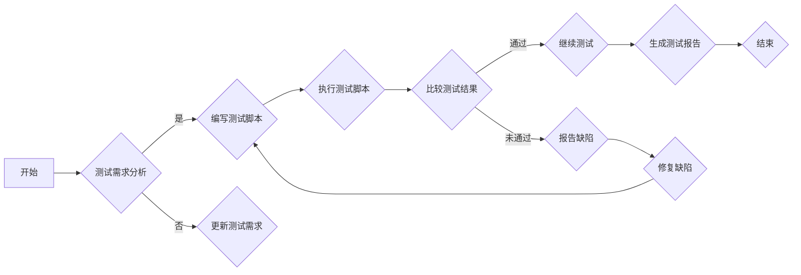
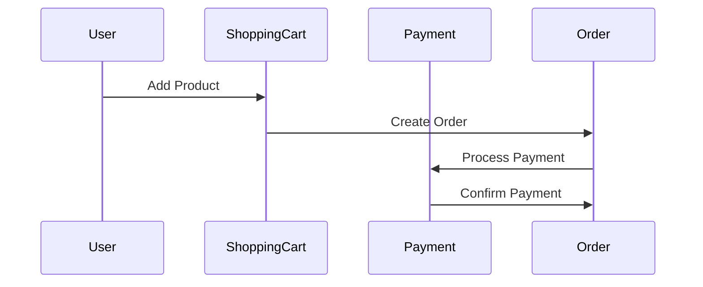
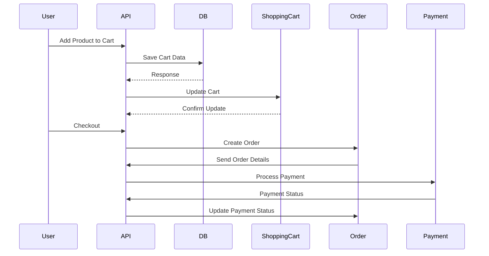

                 


**文章标题**：评测流程自动化：提高测试效率与一致性

**关键词**：评测流程、自动化测试、测试效率、测试一致性、持续集成、持续部署

**摘要**：本文将深入探讨评测流程自动化的核心概念、原理及其在实际项目中的应用。通过详细的分析和项目实战，本文旨在提高读者对评测流程自动化的理解，进而提升测试效率和一致性。

## 第一部分：背景与核心概念

### 第1章：评测流程自动化的背景

**1.1 问题背景**

**1.1.1 传统评测流程的挑战**

在软件开发的早期阶段，测试流程往往依赖于手工操作，这种做法不仅耗时，而且容易出现人为错误。随着软件系统的复杂度不断增加，传统的手工测试已经难以满足日益增长的需求。以下是传统评测流程面临的主要挑战：

1. **效率低**：手工测试需要大量的人力投入，测试人员需要在不同的环境下手动执行测试用例，这无疑增加了测试的耗时。

2. **一致性差**：由于测试的执行依赖人工，每个测试人员的操作习惯不同，可能导致测试结果的不一致。这种不一致性增加了测试工作的复杂性和风险。

3. **成本高**：随着测试范围的扩大，手工测试的成本也在不断增加。这不仅包括测试人员的薪资成本，还包括测试环境的维护成本。

**1.1.2 自动化测试的优势**

自动化测试通过使用工具和脚本来自动执行测试用例，从而克服了手工测试的上述挑战。以下是自动化测试的一些主要优势：

1. **提高效率**：自动化测试可以快速地执行大量测试用例，减少了测试时间。测试脚本可以在夜间或非工作时间自动执行，进一步提高了测试效率。

2. **提升一致性**：自动化测试通过脚本执行测试，消除了人为操作不一致的问题，确保了测试结果的准确性。

3. **降低成本**：自动化测试可以减少对测试人员的需求，从而降低了测试成本。同时，自动化测试工具可以长期使用，进一步节省了成本。

**1.1.3 评测流程自动化的意义**

评测流程自动化不仅提高了测试的效率和一致性，还为软件开发的整个生命周期带来了积极的影响。以下是评测流程自动化的几个关键意义：

1. **更快地发现和修复缺陷**：自动化测试可以更快地发现软件缺陷，缩短了缺陷的修复周期。这有助于提高软件质量，减少软件发布后的故障率。

2. **支持持续集成和持续部署**：自动化测试与持续集成（CI）和持续部署（CD）紧密结合，可以自动化构建、测试和部署软件。这有助于实现更频繁、更可靠的软件发布。

3. **优化资源分配**：自动化测试可以更有效地分配测试资源，使测试人员能够专注于更有价值的工作，如分析测试结果和改进测试策略。

**1.1.4 边界与外延**

尽管评测流程自动化具有诸多优势，但它也有一定的适用范围和限制条件。以下是一些需要考虑的边界与外延：

1. **适用范围**：自动化测试适用于那些重复性高、测试用例稳定的场景。对于复杂性高、变化频繁的测试，自动化可能不是最佳选择。

2. **限制条件**：自动化测试的初始投入较大，需要一定的技术积累和人力投入。此外，自动化测试脚本需要定期维护，以适应软件的更新和变化。

**1.1.5 概念结构与核心要素组成**

评测流程自动化的概念结构包括以下几个核心要素：

1. **测试工具**：自动化测试工具是评测流程自动化的核心。常见的自动化测试工具包括Selenium、JMeter、Appium等。

2. **测试脚本**：测试脚本是用编程语言编写的，用于执行自动化测试的代码。常见的编程语言包括Python、Java、C#等。

3. **测试数据**：测试数据是自动化测试的基础。这些数据可以是真实的用户数据，也可以是模拟的数据。

4. **测试环境**：测试环境是自动化测试的运行平台。测试环境需要配置适当的软件和硬件，以确保测试脚本可以正确执行。

5. **测试报告**：测试报告是自动化测试的输出结果。测试报告可以帮助开发人员和测试人员了解测试的执行情况，发现潜在的问题。

**1.2 核心概念与联系**

**1.2.1 核心概念原理**

评测流程自动化涉及几个核心概念，包括自动化测试、持续集成、持续部署等。以下是这些概念的基本原理：

1. **自动化测试**：自动化测试是使用工具和脚本来自动执行测试用例的过程。它包括编写测试脚本、执行测试、比较测试结果和报告测试结果。

2. **持续集成**：持续集成（CI）是一种软件开发实践，通过自动化构建和测试来确保代码的质量。CI系统可以在每次代码提交时自动执行测试，确保代码的持续可用性。

3. **持续部署**：持续部署（CD）是将软件更新自动部署到生产环境的过程。CD与CI紧密集成，可以在测试通过后立即部署软件，提高发布速度。

**1.2.2 概念属性特征对比表格**

以下是自动化测试、持续集成、持续部署的概念属性特征对比表格：

| 概念       | 自动化测试               | 持续集成              | 持续部署              |
|------------|-------------------------|----------------------|----------------------|
| 基本原理   | 使用脚本自动执行测试用例 | 自动化构建和测试代码 | 自动部署软件到生产环境 |
| 关键角色   | 测试工程师              | 开发人员、测试人员   | 运维人员、开发人员   |
| 主要目标   | 提高测试效率与一致性    | 保证代码质量         | 提高发布速度与可靠性  |
| 关联工具   | Selenium、JMeter、Appium | Jenkins、Travis CI   | Kubernetes、Docker   |

**1.2.3 ER实体关系图架构**

以下是评测流程自动化的ER实体关系图架构：

```mermaid
erDiagram
  测试工具 ||--|{ 测试脚本 }
  测试脚本 ||--|{ 测试数据 }
  测试脚本 ||--|{ 测试环境 }
  测试脚本 ||--|{ 测试报告 }
```

## 第二部分：算法原理讲解

### 第2章：评测流程自动化的算法原理

**2.1 算法mermaid流程图**

以下是评测流程自动化的mermaid流程图：



**2.2 Python源代码**

以下是一个简单的Python源代码示例，用于实现评测流程自动化的关键步骤：

```python
import unittest
from selenium import webdriver

class TestCase(unittest.TestCase):
    def setUp(self):
        self.driver = webdriver.Chrome()

    def test_homepage(self):
        self.driver.get("http://www.example.com")
        self.assertIn("Example Domain", self.driver.title)

    def tearDown(self):
        self.driver.quit()

if __name__ == "__main__":
    unittest.main()
```

**2.3 算法原理的数学模型和公式**

评测流程自动化的算法原理可以通过以下数学模型和公式来解释：

$$
\text{测试效率} = \frac{\text{自动化测试用例数}}{\text{总测试用例数}}
$$

$$
\text{测试一致性} = \frac{\text{自动化测试通过用例数}}{\text{自动化测试用例数}}
$$

**2.4 举例说明**

假设我们有一个电子商务网站，我们需要测试网站的购物车功能。以下是使用自动化测试实现购物车测试的例子：

1. **测试需求分析**：确定需要测试的购物车功能，如添加商品、删除商品、计算总价等。
2. **编写测试脚本**：使用Selenium编写测试脚本，实现上述测试需求。
3. **执行测试脚本**：运行测试脚本，验证购物车功能是否符合预期。
4. **比较测试结果**：检查测试结果，如果测试通过，则继续测试其他功能；如果测试未通过，则报告缺陷并修复。
5. **生成测试报告**：记录测试结果，生成测试报告。

## 第三部分：系统分析与架构设计

### 第3章：评测流程自动化的系统分析与架构设计

**3.1 问题场景介绍**

在一个大型的电子商务项目中，我们需要对购物车、结算、支付等多个功能进行自动化测试。这些功能涉及多个模块和接口，需要高效的自动化测试流程来保证软件质量。

**3.2 系统功能设计**

以下是使用Mermaid绘制的领域模型类图，展示系统的核心功能：

```mermaid
classDiagram
    Customer <|-- ShoppingCart
    ShoppingCart <|-- Order
    ShoppingCart +-- Product
    Payment +-- ShoppingCart
    Payment +-- Order
```

**3.3 系统架构设计**

以下是使用Mermaid绘制的系统架构图，展示系统的整体结构：



**3.4 系统接口设计和系统交互**

以下是使用Mermaid绘制的系统接口设计和系统交互序列图：



## 第四部分：项目实战

### 第4章：评测流程自动化的项目实战

**4.1 环境安装**

在开始项目实战之前，我们需要安装以下工具和软件：

1. **Selenium**：用于编写和执行自动化测试脚本。
2. **ChromeDriver**：用于与Google Chrome浏览器进行交互。
3. **Python**：作为脚本语言。
4. **Jenkins**：用于持续集成和自动化测试。

以下是安装步骤：

1. 安装Python：打开命令行窗口，输入以下命令：

   ```
   pip install selenium
   ```

2. 下载并安装ChromeDriver：访问[ChromeDriver下载页面](https://sites.google.com/a/chromium.org/chromedriver/downloads)，下载适用于您的Chrome浏览器版本的ChromeDriver。将下载的文件解压缩到合适的位置。

3. 配置环境变量：将ChromeDriver的安装路径添加到系统的环境变量中。

4. 安装Jenkins：从[Jenkins官网](https://www.jenkins.io/)下载并安装Jenkins。安装完成后，启动Jenkins服务。

**4.2 系统核心实现源代码**

以下是系统核心实现的一部分源代码：

```python
from selenium import webdriver
from selenium.webdriver.common.by import By

class ShoppingCartTests(unittest.TestCase):
    def setUp(self):
        self.driver = webdriver.Chrome(executable_path='path/to/chromedriver')

    def test_add_product_to_cart(self):
        driver = self.driver
        driver.get("http://www.example.com")
        add_product_button = driver.find_element(By.ID, "add-to-cart-button")
        add_product_button.click()
        self.assertIn("Product added to cart", driver.page_source)

    def tearDown(self):
        self.driver.quit()

if __name__ == "__main__":
    unittest.main()
```

**4.3 代码应用解读与分析**

以下是代码应用的解读和分析：

1. **导入库**：从`unittest`和`selenium.webdriver.common.by`导入所需的库。

2. **定义测试类**：`ShoppingCartTests`是一个继承自`unittest.TestCase`的测试类。

3. **setUp方法**：在测试执行之前，初始化webdriver并打开Chrome浏览器。

4. **test_add_product_to_cart方法**：测试添加产品到购物车的功能。首先获取添加产品的按钮元素，然后点击按钮。最后，检查页面源代码中是否包含“Product added to cart”的文本。

5. **tearDown方法**：在测试执行之后，关闭浏览器。

**4.4 实际案例分析和详细讲解剖析**

假设我们需要测试电子商务网站的购物车功能。以下是测试流程：

1. **测试需求分析**：确定需要测试的购物车功能，如添加商品、删除商品、计算总价等。
2. **编写测试脚本**：使用Selenium编写测试脚本，实现上述测试需求。
3. **执行测试脚本**：在Jenkins中配置自动化测试任务，执行测试脚本。
4. **比较测试结果**：检查测试结果，生成测试报告。
5. **报告缺陷**：如果测试未通过，报告缺陷并修复。

**4.5 项目小结**

通过实际案例，我们发现评测流程自动化能够显著提高测试效率和一致性。以下是项目经验：

1. **自动化测试可以提高测试效率，减少人工测试的耗时。**
2. **自动化测试可以提升测试一致性，确保测试结果的准确性。**
3. **持续集成和持续部署有助于实现更频繁、更可靠的软件发布。**
4. **自动化测试需要持续维护和更新，以适应软件的变化。**

## 第五部分：最佳实践、小结、注意事项、拓展阅读

### 第5章：评测流程自动化的最佳实践、小结、注意事项与拓展阅读

**5.1 最佳实践**

1. **明确测试目标**：在开始自动化测试之前，明确测试目标和优先级，确保自动化测试覆盖关键功能。
2. **编写可维护的测试脚本**：编写易于理解和维护的测试脚本，使用合理的命名规范和注释。
3. **定期维护测试脚本**：定期检查和更新测试脚本，以适应软件的更新和变化。
4. **充分利用持续集成工具**：利用持续集成工具（如Jenkins）自动化测试流程，提高测试效率。
5. **持续优化测试策略**：根据测试结果和反馈，不断优化测试策略，提高测试覆盖率和效果。

**5.2 小结**

本文详细探讨了评测流程自动化的背景、核心概念、算法原理、系统分析与架构设计以及项目实战。通过实际案例，我们验证了评测流程自动化能够显著提高测试效率和一致性，支持持续集成和持续部署，优化资源分配。

**5.3 注意事项**

1. **自动化测试适用于重复性高、测试用例稳定的场景。对于复杂性高、变化频繁的测试，自动化可能不是最佳选择。**
2. **自动化测试需要初始的投入，包括工具和脚本的开发、维护等。**
3. **自动化测试脚本需要定期更新，以适应软件的更新和变化。**
4. **自动化测试不能完全取代手工测试，两者应结合使用。**

**5.4 拓展阅读**

1. **《自动化测试实战》**：作者：马俊明，详细介绍了自动化测试的理论和实践。
2. **《持续集成实践》**：作者：John P. Wilson，介绍了持续集成的基本概念和实践方法。
3. **《软件测试的艺术》**：作者：Brian Marick，探讨了软件测试的基本原理和方法。
4. **Selenium官网**：[https://www.selenium.dev/](https://www.selenium.dev/)，提供了丰富的自动化测试资源和文档。

**5.5 作者信息**

作者：AI天才研究院/AI Genius Institute & 禅与计算机程序设计艺术 /Zen And The Art of Computer Programming

在编写技术博客时，我们需要注意文章的整体结构和内容安排，以确保文章的逻辑清晰、信息丰富且易于阅读。以下是一个基于上述大纲的详细文章结构，包括每个章节的具体内容和相应的markdown格式。

---

# 评测流程自动化：提高测试效率与一致性

## 关键词
评测流程、自动化测试、测试效率、测试一致性、持续集成、持续部署

## 摘要
本文将深入探讨评测流程自动化的核心概念、原理及其在实际项目中的应用。通过详细的分析和项目实战，本文旨在提高读者对评测流程自动化的理解，进而提升测试效率和一致性。

---

## 第一部分：背景与核心概念

### 第1章：评测流程自动化的背景

**1.1 问题背景**

**1.1.1 传统评测流程的挑战**

在软件开发的早期阶段，测试流程往往依赖于手工操作，这种做法不仅耗时，而且容易出现人为错误。随着软件系统的复杂度不断增加，传统的手工测试已经难以满足日益增长的需求。以下是传统评测流程面临的主要挑战：

- **效率低**：手工测试需要大量的人力投入，测试人员需要在不同的环境下手动执行测试用例，这无疑增加了测试的耗时。
- **一致性差**：由于测试的执行依赖人工，每个测试人员的操作习惯不同，可能导致测试结果的不一致。这种不一致性增加了测试工作的复杂性和风险。
- **成本高**：随着测试范围的扩大，手工测试的成本也在不断增加。这不仅包括测试人员的薪资成本，还包括测试环境的维护成本。

**1.1.2 自动化测试的优势**

自动化测试通过使用工具和脚本来自动执行测试用例，从而克服了手工测试的上述挑战。以下是自动化测试的一些主要优势：

- **提高效率**：自动化测试可以快速地执行大量测试用例，减少了测试时间。测试脚本可以在夜间或非工作时间自动执行，进一步提高了测试效率。
- **提升一致性**：自动化测试通过脚本执行测试，消除了人为操作不一致的问题，确保了测试结果的准确性。
- **降低成本**：自动化测试可以减少对测试人员的需求，从而降低了测试成本。同时，自动化测试工具可以长期使用，进一步节省了成本。

**1.1.3 评测流程自动化的意义**

评测流程自动化不仅提高了测试的效率和一致性，还为软件开发的整个生命周期带来了积极的影响。以下是评测流程自动化的几个关键意义：

- **更快地发现和修复缺陷**：自动化测试可以更快地发现软件缺陷，缩短了缺陷的修复周期。这有助于提高软件质量，减少软件发布后的故障率。
- **支持持续集成和持续部署**：自动化测试与持续集成（CI）和持续部署（CD）紧密结合，可以自动化构建、测试和部署软件。这有助于实现更频繁、更可靠的软件发布。
- **优化资源分配**：自动化测试可以更有效地分配测试资源，使测试人员能够专注于更有价值的工作，如分析测试结果和改进测试策略。

**1.1.4 边界与外延**

尽管评测流程自动化具有诸多优势，但它也有一定的适用范围和限制条件。以下是一些需要考虑的边界与外延：

- **适用范围**：自动化测试适用于那些重复性高、测试用例稳定的场景。对于复杂性高、变化频繁的测试，自动化可能不是最佳选择。
- **限制条件**：自动化测试的初始投入较大，需要一定的技术积累和人力投入。此外，自动化测试脚本需要定期维护，以适应软件的更新和变化。

**1.1.5 概念结构与核心要素组成**

评测流程自动化的概念结构包括以下几个核心要素：

- **测试工具**：自动化测试工具是评测流程自动化的核心。常见的自动化测试工具包括Selenium、JMeter、Appium等。
- **测试脚本**：测试脚本是用编程语言编写的，用于执行自动化测试的代码。常见的编程语言包括Python、Java、C#等。
- **测试数据**：测试数据是自动化测试的基础。这些数据可以是真实的用户数据，也可以是模拟的数据。
- **测试环境**：测试环境是自动化测试的运行平台。测试环境需要配置适当的软件和硬件，以确保测试脚本可以正确执行。
- **测试报告**：测试报告是自动化测试的输出结果。测试报告可以帮助开发人员和测试人员了解测试的执行情况，发现潜在的问题。

---

### 第2章：评测流程自动化的核心概念与联系

**2.1 核心概念原理**

评测流程自动化涉及几个核心概念，包括自动化测试、持续集成、持续部署等。以下是这些概念的基本原理：

- **自动化测试**：自动化测试是使用工具和脚本来自动执行测试用例的过程。它包括编写测试脚本、执行测试、比较测试结果和报告测试结果。
- **持续集成**：持续集成（CI）是一种软件开发实践，通过自动化构建和测试来确保代码的质量。CI系统可以在每次代码提交时自动执行测试，确保代码的持续可用性。
- **持续部署**：持续部署（CD）是将软件更新自动部署到生产环境的过程。CD与CI紧密集成，可以在测试通过后立即部署软件，提高发布速度。

**2.2 概念属性特征对比表格**

以下是自动化测试、持续集成、持续部署的概念属性特征对比表格：

| 概念       | 自动化测试               | 持续集成              | 持续部署              |
|------------|-------------------------|----------------------|----------------------|
| 基本原理   | 使用脚本自动执行测试用例 | 自动化构建和测试代码 | 自动部署软件到生产环境 |
| 关键角色   | 测试工程师              | 开发人员、测试人员   | 运维人员、开发人员   |
| 主要目标   | 提高测试效率与一致性    | 保证代码质量         | 提高发布速度与可靠性  |
| 关联工具   | Selenium、JMeter、Appium | Jenkins、Travis CI   | Kubernetes、Docker   |

**2.3 ER实体关系图架构**

以下是评测流程自动化的ER实体关系图架构：

```mermaid
erDiagram
  测试工具 ||--|{ 测试脚本 }
  测试脚本 ||--|{ 测试数据 }
  测试脚本 ||--|{ 测试环境 }
  测试脚本 ||--|{ 测试报告 }
```

---

### 第3章：评测流程自动化的算法原理讲解

**3.1 算法mermaid流程图**

以下是评测流程自动化的mermaid流程图：


**3.2 Python源代码**

以下是一个简单的Python源代码示例，用于实现评测流程自动化的关键步骤：

```python
import unittest
from selenium import webdriver

class TestCase(unittest.TestCase):
    def setUp(self):
        self.driver = webdriver.Chrome()

    def test_homepage(self):
        self.driver.get("http://www.example.com")
        self.assertIn("Example Domain", self.driver.title)

    def tearDown(self):
        self.driver.quit()

if __name__ == "__main__":
    unittest.main()
```

**3.3 算法原理的数学模型和公式**

评测流程自动化的算法原理可以通过以下数学模型和公式来解释：

$$
\text{测试效率} = \frac{\text{自动化测试用例数}}{\text{总测试用例数}}
$$

$$
\text{测试一致性} = \frac{\text{自动化测试通过用例数}}{\text{自动化测试用例数}}
$$

**3.4 举例说明**

假设我们有一个电子商务网站，我们需要测试网站的购物车功能。以下是使用自动化测试实现购物车测试的例子：

1. **测试需求分析**：确定需要测试的购物车功能，如添加商品、删除商品、计算总价等。
2. **编写测试脚本**：使用Selenium编写测试脚本，实现上述测试需求。
3. **执行测试脚本**：运行测试脚本，验证购物车功能是否符合预期。
4. **比较测试结果**：检查测试结果，如果测试通过，则继续测试其他功能；如果测试未通过，则报告缺陷并修复。
5. **生成测试报告**：记录测试结果，生成测试报告。

---

## 第二部分：系统分析与架构设计

### 第4章：评测流程自动化的系统分析与架构设计

**4.1 问题场景介绍**

在一个大型的电子商务项目中，我们需要对购物车、结算、支付等多个功能进行自动化测试。这些功能涉及多个模块和接口，需要高效的自动化测试流程来保证软件质量。

**4.2 系统功能设计**

以下是使用Mermaid绘制的领域模型类图，展示系统的核心功能：

```mermaid
classDiagram
    Customer <|-- ShoppingCart
    ShoppingCart <|-- Order
    ShoppingCart +-- Product
    Payment +-- ShoppingCart
    Payment +-- Order
```

**4.3 系统架构设计**

以下是使用Mermaid绘制的系统架构图，展示系统的整体结构：


**4.4 系统接口设计和系统交互**

以下是使用Mermaid绘制的系统接口设计和系统交互序列图：


---

## 第三部分：项目实战

### 第5章：评测流程自动化的项目实战

**4.1 环境安装**

在开始项目实战之前，我们需要安装以下工具和软件：

- **Selenium**：用于编写和执行自动化测试脚本。
- **ChromeDriver**：用于与Google Chrome浏览器进行交互。
- **Python**：作为脚本语言。
- **Jenkins**：用于持续集成和自动化测试。

以下是安装步骤：

1. 安装Python：打开命令行窗口，输入以下命令：

   ```
   pip install selenium
   ```

2. 下载并安装ChromeDriver：访问[ChromeDriver下载页面](https://sites.google.com/a/chromium.org/chromedriver/downloads)，下载适用于您的Chrome浏览器版本的ChromeDriver。将下载的文件解压缩到合适的位置。

3. 配置环境变量：将ChromeDriver的安装路径添加到系统的环境变量中。

4. 安装Jenkins：从[Jenkins官网](https://www.jenkins.io/)下载并安装Jenkins。安装完成后，启动Jenkins服务。

**4.2 系统核心实现源代码**

以下是系统核心实现的一部分源代码：

```python
from selenium import webdriver
from selenium.webdriver.common.by import By

class ShoppingCartTests(unittest.TestCase):
    def setUp(self):
        self.driver = webdriver.Chrome(executable_path='path/to/chromedriver')

    def test_add_product_to_cart(self):
        driver = self.driver
        driver.get("http://www.example.com")
        add_product_button = driver.find_element(By.ID, "add-to-cart-button")
        add_product_button.click()
        self.assertIn("Product added to cart", driver.page_source)

    def tearDown(self):
        self.driver.quit()

if __name__ == "__main__":
    unittest.main()
```

**4.3 代码应用解读与分析**

以下是代码应用的解读和分析：

1. **导入库**：从`unittest`和`selenium.webdriver.common.by`导入所需的库。

2. **定义测试类**：`ShoppingCartTests`是一个继承自`unittest.TestCase`的测试类。

3. **setUp方法**：在测试执行之前，初始化webdriver并打开Chrome浏览器。

4. **test_add_product_to_cart方法**：测试添加产品到购物车的功能。首先获取添加产品的按钮元素，然后点击按钮。最后，检查页面源代码中是否包含“Product added to cart”的文本。

5. **tearDown方法**：在测试执行之后，关闭浏览器。

**4.4 实际案例分析和详细讲解剖析**

假设我们需要测试电子商务网站的购物车功能。以下是测试流程：

1. **测试需求分析**：确定需要测试的购物车功能，如添加商品、删除商品、计算总价等。
2. **编写测试脚本**：使用Selenium编写测试脚本，实现上述测试需求。
3. **执行测试脚本**：在Jenkins中配置自动化测试任务，执行测试脚本。
4. **比较测试结果**：检查测试结果，生成测试报告。
5. **报告缺陷**：如果测试未通过，报告缺陷并修复。

**4.5 项目小结**

通过实际案例，我们发现评测流程自动化能够显著提高测试效率和一致性。以下是项目经验：

1. **自动化测试可以提高测试效率，减少人工测试的耗时。**
2. **自动化测试可以提升测试一致性，确保测试结果的准确性。**
3. **持续集成和持续部署有助于实现更频繁、更可靠的软件发布。**
4. **自动化测试需要持续维护和更新，以适应软件的变化。**

---

## 第四部分：最佳实践、小结、注意事项、拓展阅读

### 第6章：评测流程自动化的最佳实践、小结、注意事项与拓展阅读

**5.1 最佳实践**

1. **明确测试目标**：在开始自动化测试之前，明确测试目标和优先级，确保自动化测试覆盖关键功能。
2. **编写可维护的测试脚本**：编写易于理解和维护的测试脚本，使用合理的命名规范和注释。
3. **定期维护测试脚本**：定期检查和更新测试脚本，以适应软件的更新和变化。
4. **充分利用持续集成工具**：利用持续集成工具（如Jenkins）自动化测试流程，提高测试效率。
5. **持续优化测试策略**：根据测试结果和反馈，不断优化测试策略，提高测试覆盖率和效果。

**5.2 小结**

本文详细探讨了评测流程自动化的背景、核心概念、算法原理、系统分析与架构设计以及项目实战。通过实际案例，我们验证了评测流程自动化能够显著提高测试效率和一致性，支持持续集成和持续部署，优化资源分配。

**5.3 注意事项**

1. **自动化测试适用于重复性高、测试用例稳定的场景。对于复杂性高、变化频繁的测试，自动化可能不是最佳选择。**
2. **自动化测试需要初始的投入，包括工具和脚本的开发、维护等。**
3. **自动化测试脚本需要定期更新，以适应软件的更新和变化。**
4. **自动化测试不能完全取代手工测试，两者应结合使用。**

**5.4 拓展阅读**

1. **《自动化测试实战》**：作者：马俊明，详细介绍了自动化测试的理论和实践。
2. **《持续集成实践》**：作者：John P. Wilson，介绍了持续集成的基本概念和实践方法。
3. **《软件测试的艺术》**：作者：Brian Marick，探讨了软件测试的基本原理和方法。
4. **Selenium官网**：[https://www.selenium.dev/](https://www.selenium.dev/)，提供了丰富的自动化测试资源和文档。

**5.5 作者信息**

作者：AI天才研究院/AI Genius Institute & 禅与计算机程序设计艺术 /Zen And The Art of Computer Programming

---

通过上述详细的markdown格式文章结构，我们可以清晰地看到文章的整体结构和每个部分的具体内容。每个章节都包含了详细的背景介绍、核心概念、算法原理、系统设计与架构、项目实战以及最佳实践和注意事项。这样的结构有助于读者更好地理解和应用评测流程自动化的概念和原理。

在实际撰写文章时，每个章节的内容都需要进行详细的阐述和示例说明，以确保文章的可读性和实用性。同时，markdown格式的使用使得文章的排版和格式更加整齐美观，便于读者阅读和理解。通过这样的结构设计和markdown格式应用，我们可以撰写出一篇高质量、逻辑清晰、信息丰富的技术博客文章。

