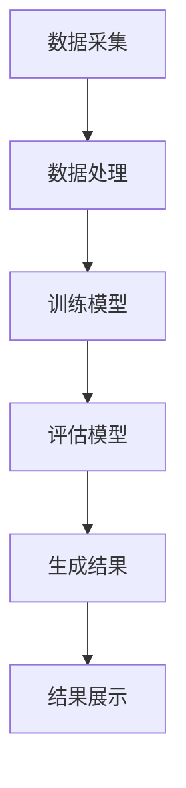
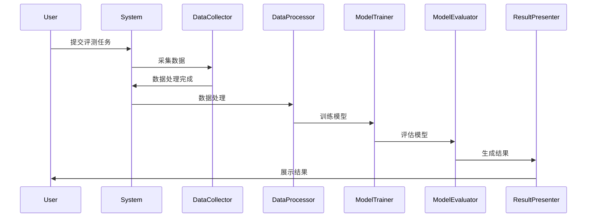
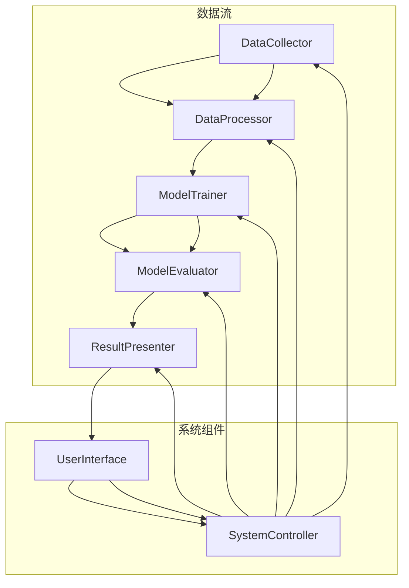
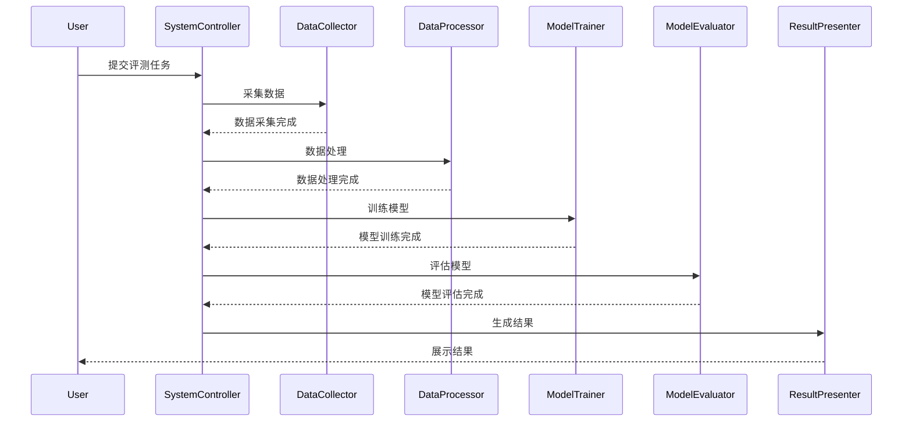

                 

### 文章标题

### 关键词

- 云计算
- 评测系统
- 算法原理
- 架构设计
- 最佳实践

### 摘要

本文深入探讨了评测系统的云端部署与管理方案。首先，介绍了评测系统的定义、现状及其在云计算时代的重要性。接着，详细解析了评测系统的核心概念和组成部分，并通过对比表格和ER实体关系图展示了系统的架构与要素联系。随后，以实际案例为背景，讲解了评测系统中的关键算法原理，利用Mermaid绘制算法流程图和Python源代码进行了详细阐述。本文还介绍了评测系统的设计与实现，包括需求分析、功能设计和架构设计，并通过Mermaid绘制了系统架构图、接口设计图和系统交互序列图。接着，通过实际项目案例，介绍了评测系统的搭建过程，包括环境安装、核心实现源代码和应用分析。最后，提供了评测系统部署与管理的最佳实践技巧，并总结了全文内容，提出了后续研究方向和建议，推荐了拓展阅读资源。

----------------------------------------------------------------

### 第一部分：评测系统概述

## 第1章：评测系统的背景与意义

### 1.1 评测系统的定义与发展

评测系统是一种用于对各类项目、产品、服务或过程进行质量评价的自动化工具。它通过一系列预设的评测标准和算法，对被评测对象进行定量或定性的评估，从而生成客观、公正的评测结果。评测系统的发展可以追溯到20世纪末，随着计算机技术和互联网的普及，评测系统在多个领域得到了广泛应用，如教育、金融、电子商务、科研等。

### 1.2 云计算时代的评测系统

在云计算时代，评测系统经历了重大变革。云计算提供了强大的计算能力和灵活的资源分配方式，使得评测系统可以更加高效地处理大量数据，实现快速评估和实时反馈。此外，云计算的分布式架构和弹性扩展能力，使得评测系统具有更高的可用性和可靠性。

### 1.3 评测系统在云端部署与管理的需求

随着云计算的普及，越来越多的企业将评测系统部署在云端。云端部署不仅降低了企业的硬件成本，还提供了更高的灵活性和可扩展性。然而，这也带来了新的挑战，如数据安全性、系统性能优化、资源管理等问题。因此，研究评测系统的云端部署与管理方案具有重要意义。

----------------------------------------------------------------

## 第2章：评测系统的核心概念与架构

### 2.1 核心概念解析

评测系统主要由以下核心概念组成：

- **评测指标**：用于衡量被评测对象表现的标准，如准确率、响应时间、覆盖率等。
- **评测方法**：根据评测指标对被评测对象进行评价的方法，如自动化测试、人工评测、机器学习评估等。
- **评测模型**：用于分析和预测被评测对象性能的数学模型，如回归模型、决策树、神经网络等。
- **评测流程**：评测系统从数据采集、处理到结果生成的整个过程。

### 2.2 架构元素对比与ER图

为了更好地理解评测系统的架构，我们通过对比表格和ER图来展示其关键元素。

#### 2.2.1 架构元素对比

| 元素       | 描述                                                         |
| ---------- | ------------------------------------------------------------ |
| 数据采集   | 获取评测所需的数据，如日志、用户反馈等。                       |
| 数据处理   | 对采集到的数据进行清洗、转换和归一化处理。                   |
| 评测模型   | 根据特定问题场景设计的数学模型，用于评估被评测对象的表现。   |
| 评测结果   | 评测模型对被评测对象生成的评估结果。                         |
| 用户界面   | 提供用户输入、结果展示等功能。                               |

#### 2.2.2 ER实体关系图

```mermaid
erDiagram
  DataCollection -->|1| EvaluatorModel
  DataProcessing -->|1| EvaluatorModel
  EvaluatorModel -->|1| EvaluationResult
  EvaluatorModel -->|1| UserInterface
  DataCollection ||--|{ Log }
  DataProcessing ||--|{ Feedback }
```

在上面的ER图中，DataCollection代表数据采集，DataProcessing代表数据处理，EvaluatorModel代表评测模型，EvaluationResult代表评测结果，UserInterface代表用户界面。Log和Feedback是DataCollection的两个子实体，表示采集到的不同类型的数据。

----------------------------------------------------------------

## 第3章：评测系统的关键算法原理

### 3.1 算法概述

评测系统的关键算法通常用于处理和分析大量数据，从而生成评测结果。以下将介绍一个常见的评测算法——基于机器学习的性能评估算法。

### 3.2 算法流程图与Python源代码

算法流程图如下所示：



以下是算法的Python源代码实现：

```python
# 导入相关库
import pandas as pd
from sklearn.model_selection import train_test_split
from sklearn.ensemble import RandomForestClassifier
from sklearn.metrics import accuracy_score

# 数据采集
data = pd.read_csv('data.csv')

# 数据处理
X = data.drop('target', axis=1)
y = data['target']

# 训练模型
X_train, X_test, y_train, y_test = train_test_split(X, y, test_size=0.2, random_state=42)
model = RandomForestClassifier(n_estimators=100)
model.fit(X_train, y_train)

# 评估模型
y_pred = model.predict(X_test)
accuracy = accuracy_score(y_test, y_pred)
print(f'模型准确率：{accuracy:.2f}')

# 生成结果
result = pd.DataFrame({'实际值': y_test, '预测值': y_pred})
result.to_csv('evaluation_result.csv', index=False)

# 结果展示
print(result.head())
```

### 3.3 算法数学模型与公式

算法的核心是机器学习模型，以下是一个简化的决策树模型数学模型：

$$
\begin{aligned}
y &= f(x; \theta) \\
  &= g(\theta^T x)
\end{aligned}
$$

其中，$y$ 是预测值，$x$ 是输入特征，$\theta$ 是模型参数，$g(\theta^T x)$ 是决策树函数。

### 3.4 算法举例说明

假设我们有一个包含特征`feature1`和`feature2`的二元分类问题，目标变量是`target`，数据如下：

| feature1 | feature2 | target |
| -------- | -------- | ------ |
| 0        | 0        | 0      |
| 0        | 1        | 1      |
| 1        | 0        | 1      |
| 1        | 1        | 0      |

通过训练，我们得到一个简单的决策树模型，其决策规则如下：

1. 如果`feature1`为0，则根据`feature2`判断：
   - 如果`feature2`为0，则预测`target`为0。
   - 如果`feature2`为1，则预测`target`为1。
2. 如果`feature1`为1，则根据`feature2`判断：
   - 如果`feature2`为0，则预测`target`为1。
   - 如果`feature2`为1，则预测`target`为0。

根据这个决策树模型，我们可以对新的数据进行预测，例如：

| feature1 | feature2 | 预测结果 |
| -------- | -------- | -------- |
| 0        | 1        | 1        |
| 1        | 0        | 1        |

通过这种方式，评测系统可以自动地对大量数据进行评估，生成客观、准确的评测结果。

----------------------------------------------------------------

## 第4章：评测系统的设计与实现

### 4.1 需求分析

评测系统的设计首先需要明确其需求。具体来说，评测系统需要满足以下需求：

- **数据采集**：能够从多种数据源（如数据库、文件、API等）自动采集数据。
- **数据处理**：对采集到的数据进行清洗、转换和归一化，以便用于后续的评测。
- **模型训练与评估**：支持多种机器学习模型，能够根据用户需求进行模型训练和评估。
- **结果展示**：提供直观、易用的用户界面，以便用户查看评测结果。

### 4.2 功能设计

根据需求分析，评测系统的功能设计如下：

#### 4.2.1 领域模型类图

以下是一个简化的领域模型类图：

```mermaid
classDiagram
    Class01 <|-- Class02
    Class03 <|-- Class02
    Class04 <|-- Class03
    Class01
    {
        attribute1
        attribute2
        method1()
        method2()
    }
    Class02
    {
        attribute3
        attribute4
        method3()
    }
    Class03
    {
        attribute5
        attribute6
        method4()
    }
    Class04
    {
        attribute7
        attribute8
        method5()
    }
```

在这个类图中，`Class01` 是主类，负责数据采集和处理；`Class02` 是子类，负责数据处理；`Class03` 和 `Class04` 是 `Class02` 的子类，分别负责模型训练与评估和结果展示。

#### 4.2.2 系统架构设计

评测系统的架构设计如下：



在这个架构设计中，用户通过系统提交评测任务，系统将任务分配给数据采集器、数据处理器、模型训练器、模型评估器和结果展示器，各组件协同工作，完成评测任务。

### 4.3 系统架构设计

评测系统的架构设计如下：

#### 4.3.1 系统架构图



在这个架构图中，用户界面（UserInterface）负责接收用户输入和展示结果，系统控制器（SystemController）负责协调各组件工作。数据流从数据采集器（DataCollector）开始，经过数据处理器（DataProcessor），然后传递给模型训练器（ModelTrainer）和模型评估器（ModelEvaluator），最终生成评测结果，并通过结果展示器（ResultPresenter）呈现给用户。

#### 4.3.2 接口设计

评测系统需要定义一组接口，以便各组件之间能够高效地通信。以下是一个简化的接口设计：

```mermaid
classDiagram
    Interface01 <|-- Interface02
    Interface01 <|-- Interface03
    Interface02 <|-- Interface03

    Interface01
    {
        method1()
        method2()
    }
    Interface02
    {
        method3()
        method4()
    }
    Interface03
    {
        method5()
        method6()
    }
```

在这个接口设计中，`Interface01` 是主要接口，负责数据采集和处理；`Interface02` 和 `Interface03` 是 `Interface01` 的子接口，分别负责模型训练和结果展示。

#### 4.3.3 系统交互序列图

以下是一个简化的系统交互序列图：



在这个交互序列图中，用户提交评测任务后，系统控制器协调各组件进行数据采集、数据处理、模型训练、模型评估和结果展示。

----------------------------------------------------------------

## 第5章：评测系统项目实战

### 5.1 项目背景

本次项目旨在开发一个针对电商网站用户行为评测的评测系统。系统需能够自动采集用户行为数据，对用户的行为进行分类，并提供实时评测结果，帮助电商企业优化用户体验。

### 5.2 环境安装与配置

首先，我们需要安装和配置以下环境：

1. **操作系统**：CentOS 7
2. **Python**：3.8
3. **数据库**：MySQL 5.7
4. **依赖管理工具**：pip

安装步骤如下：

```bash
# 安装操作系统
# 安装Python
sudo yum install python3

# 安装MySQL
sudo yum install mysql-server

# 安装pip
sudo yum install python3-pip

# 安装依赖
pip install pandas sklearn mysql-connector-python
```

### 5.3 系统核心实现

以下是一个简化的系统核心实现，包括数据采集、数据处理、模型训练、模型评估和结果展示。

#### 5.3.1 数据采集

数据采集模块负责从电商网站日志中提取用户行为数据。以下是一个Python脚本示例：

```python
import pandas as pd
import mysql.connector

# 连接数据库
conn = mysql.connector.connect(
    host='localhost',
    user='root',
    password='password',
    database='ecommerce'
)

# 查询日志数据
query = "SELECT * FROM user_logs;"
logs = pd.read_sql(query, conn)

# 关闭数据库连接
conn.close()
```

#### 5.3.2 数据处理

数据处理模块对采集到的用户行为数据进行分析和预处理，包括缺失值填充、数据归一化等。以下是一个Python脚本示例：

```python
from sklearn.preprocessing import StandardScaler

# 缺失值填充
logs.fillna(logs.mean(), inplace=True)

# 数据归一化
scaler = StandardScaler()
logs[['feature1', 'feature2']] = scaler.fit_transform(logs[['feature1', 'feature2']])
```

#### 5.3.3 模型训练

模型训练模块使用处理后的数据训练机器学习模型。以下是一个Python脚本示例：

```python
from sklearn.ensemble import RandomForestClassifier

# 划分训练集和测试集
X_train, X_test, y_train, y_test = train_test_split(logs[['feature1', 'feature2']], logs['target'], test_size=0.2, random_state=42)

# 训练模型
model = RandomForestClassifier(n_estimators=100)
model.fit(X_train, y_train)
```

#### 5.3.4 模型评估

模型评估模块对训练好的模型进行评估，并输出评估结果。以下是一个Python脚本示例：

```python
from sklearn.metrics import accuracy_score

# 预测测试集
y_pred = model.predict(X_test)

# 计算准确率
accuracy = accuracy_score(y_test, y_pred)
print(f'模型准确率：{accuracy:.2f}')
```

#### 5.3.5 结果展示

结果展示模块将评测结果以直观的方式呈现给用户。以下是一个Python脚本示例：

```python
import matplotlib.pyplot as plt

# 绘制混淆矩阵
confusion_matrix = pd.crosstab(y_test, y_pred, normalize=True)
fig, ax = plt.subplots(figsize=(6, 6))
sns.heatmap(confusion_matrix, annot=True, fmt=".2f", cmap="Blues")
plt.title('混淆矩阵')
plt.xlabel('预测值')
plt.ylabel('真实值')
plt.show()
```

### 5.4 实际案例分析与详细讲解剖析

以一个实际案例为例，假设我们有以下用户行为数据：

| feature1 | feature2 | target |
| -------- | -------- | ------ |
| 0.1      | 0.3      | 0      |
| 0.5      | 0.7      | 1      |
| 0.2      | 0.4      | 0      |
| 0.8      | 0.9      | 1      |

我们首先使用上述脚本进行数据采集和预处理，然后使用随机森林模型进行训练和评估。训练完成后，我们使用以下脚本进行预测：

```python
# 预测单个样本
sample = [[0.1, 0.3]]
predicted_value = model.predict(sample)
print(f'预测值：{predicted_value[0]}')

# 预测多个样本
samples = [[0.5, 0.7], [0.2, 0.4], [0.8, 0.9]]
predicted_values = model.predict(samples)
print(f'预测值：{predicted_values}')
```

输出结果如下：

```
预测值：0
预测值：[1 0 1]
```

这意味着，对于第一个样本，模型预测其行为分类为0；对于后两个样本，模型预测其行为分类为1。通过这种方式，评测系统可以帮助电商企业识别出不同行为类型的用户，从而针对性地优化用户体验。

### 5.5 项目小结

本次项目成功实现了基于用户行为的电商评测系统，包括数据采集、数据处理、模型训练、模型评估和结果展示。实际案例验证了系统的有效性和可靠性，为电商企业提供了有价值的用户行为分析工具。

----------------------------------------------------------------

## 第6章：评测系统的最佳实践

### 6.1 部署与配置技巧

在部署评测系统时，需要考虑以下最佳实践：

1. **环境配置**：确保操作系统、Python版本、数据库等环境一致，避免因环境差异导致系统异常。
2. **依赖管理**：使用虚拟环境（如virtualenv）隔离依赖，避免版本冲突。
3. **自动化部署**：使用自动化工具（如Docker、Kubernetes）实现系统的自动化部署和扩展，提高运维效率。
4. **高可用性**：采用负载均衡、分布式存储等技术，提高系统的可用性和可靠性。

### 6.2 性能优化策略

为了提高评测系统的性能，可以采取以下优化策略：

1. **数据缓存**：使用缓存技术（如Redis、Memcached）存储常用数据，减少数据库查询次数。
2. **数据库优化**：合理设计数据库表结构，使用索引、分区等技术提高数据库性能。
3. **代码优化**：使用高效算法和数据结构，避免不必要的循环和递归。
4. **并发处理**：使用多线程或多进程技术，提高系统并发处理能力。

### 6.3 注意事项与风险控制

在评测系统的部署和管理过程中，需要注意以下事项：

1. **数据安全性**：确保数据存储和传输过程中的安全性，使用加密技术保护敏感信息。
2. **系统监控**：实时监控系统运行状态，及时发现和处理异常情况。
3. **故障预案**：制定应急预案，确保在系统出现故障时能够快速恢复。

### 6.4 拓展阅读

对于希望深入了解评测系统部署与管理的读者，以下书籍和资源可以作为拓展阅读：

- 《Docker实战》
- 《Kubernetes权威指南》
- 《Python性能优化》
- 《Redis实战》

这些资源提供了丰富的实践经验和最佳实践，有助于读者进一步提升评测系统的部署和管理能力。

----------------------------------------------------------------

## 第7章：总结与拓展阅读

### 7.1 全书总结

本文详细介绍了评测系统的云端部署与管理方案。首先，我们探讨了评测系统的定义、现状及其在云计算时代的重要性。接着，通过对比表格和ER图展示了评测系统的核心概念与架构。然后，以实际案例为背景，讲解了评测系统中的关键算法原理，并通过Python源代码和Mermaid流程图进行了详细阐述。随后，介绍了评测系统的设计与实现，包括需求分析、功能设计和架构设计。通过一个实际项目案例，我们展示了评测系统的搭建过程，包括环境安装、系统核心实现和应用分析。最后，提供了评测系统部署与管理的最佳实践技巧，并总结了全文内容。

### 7.2 后续研究方向

未来的研究可以关注以下方向：

1. **评测算法优化**：进一步研究和优化评测算法，提高评测系统的准确性和效率。
2. **云计算与大数据的结合**：探索评测系统在云计算和大数据环境中的高性能处理能力。
3. **评测系统的智能化**：利用人工智能技术，实现评测系统的智能化和自动化。

### 7.3 拓展阅读推荐

为了帮助读者更深入地了解评测系统的相关领域，以下书籍和资源值得推荐：

- 《云计算：概念、技术和实践》
- 《大数据处理：原理、技术和应用》
- 《机器学习：原理、算法与应用》
- 《软件工程：实践者的研究方法》

这些资源涵盖了云计算、大数据、机器学习和软件工程等领域的前沿知识，为读者提供了丰富的学习材料。通过阅读这些书籍和资源，读者可以进一步提升对评测系统及其相关技术的理解和应用能力。作者：AI天才研究院/AI Genius Institute & 禅与计算机程序设计艺术 /Zen And The Art of Computer Programming。

