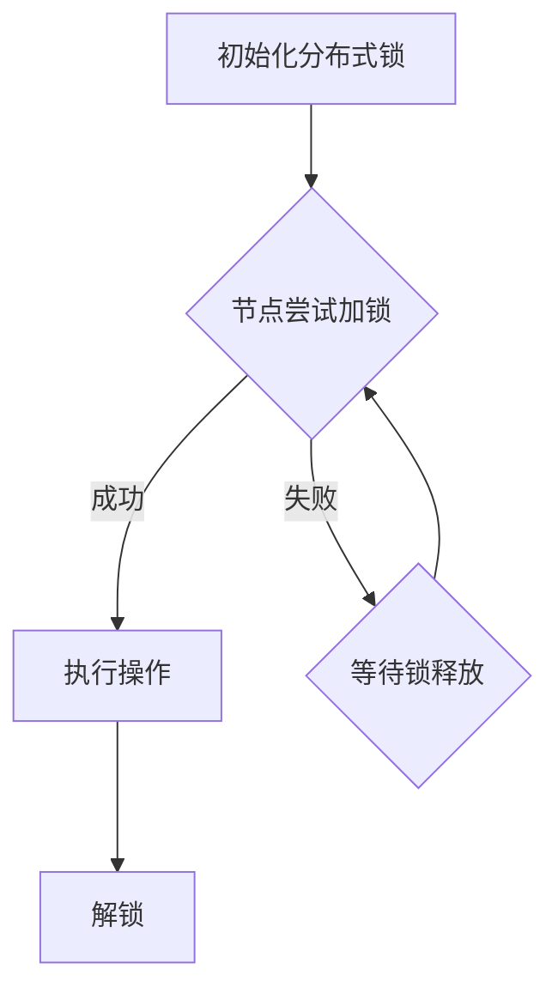

                 

# 评测系统的分布式架构设计

> 关键词：评测系统、分布式架构、设计原则、组件、算法、实现

> 摘要：本文深入探讨了评测系统的分布式架构设计。首先，我们介绍了评测系统和分布式架构的核心概念及其在现代计算机系统中的重要性。接着，我们详细解析了分布式设计原理，并探讨了分布式系统组件及其在评测系统设计中的应用。最后，我们通过具体的案例分析和系统架构设计，展示了如何实现一个高效、可靠、可扩展的评测系统。

## 引言

在现代信息时代，评测系统在各个领域发挥着越来越重要的作用。从教育测评到企业绩效评估，再到大数据分析中的质量检验，评测系统已经成为决策支持和自动化流程的关键组成部分。然而，随着数据量和用户量的急剧增长，传统的集中式架构已经难以满足评测系统的性能和扩展需求。分布式架构作为一种应对复杂性和扩展性的有效手段，逐渐成为评测系统设计的首选方案。

分布式架构设计不仅能够提升系统的性能和可扩展性，还能提高系统的可靠性和容错能力。本文旨在探讨评测系统的分布式架构设计，帮助读者了解分布式架构的核心概念、设计原则、关键组件以及实际应用。通过本文的讨论，读者将能够掌握分布式架构设计的要点，从而设计出高效、可靠、可扩展的评测系统。

## 分布式架构概述

分布式架构是一种将系统分解为多个独立节点，通过通信网络连接起来的架构。这些节点可以分布在不同的地理位置，共同协作完成任务。分布式架构的核心目标是提高系统的性能、可扩展性和容错能力。

### 优点

1. **性能提升**：分布式架构可以通过将任务分布在多个节点上，实现并行处理，从而显著提高系统的处理速度和响应时间。
2. **可扩展性**：分布式架构可以根据需求动态地增加或减少节点，以适应数据量和用户量的变化，从而保持系统的稳定性和性能。
3. **可靠性**：分布式架构通过节点之间的冗余和容错机制，可以提高系统的可靠性，确保即使在某些节点发生故障的情况下，整个系统仍能正常运行。
4. **灵活性**：分布式架构允许系统组件在不同的地理位置和环境中运行，提高了系统的灵活性和可维护性。

### 劣势

1. **复杂性**：分布式系统涉及多个节点之间的通信和协调，管理难度较大，需要处理网络延迟、数据一致性和故障转移等问题。
2. **数据一致性**：在分布式架构中，确保多个节点上的数据一致性是一个挑战，特别是在并发操作和高可用性的情况下。
3. **网络依赖性**：分布式架构对网络依赖性较高，网络的稳定性直接影响系统的性能和可靠性。

### 关键组件

1. **节点**：节点是分布式系统的基础单元，每个节点独立运行，负责处理任务和数据存储。
2. **通信网络**：通信网络连接各个节点，提供数据传输和消息传递的通道。
3. **数据存储**：分布式系统通常使用分布式数据库或文件系统来存储数据，支持数据的分布式存储和管理。
4. **协调机制**：协调机制用于协调多个节点的操作，确保系统的一致性和可靠性。

### 应用场景

分布式架构在以下场景中表现出色：

1. **大数据处理**：分布式架构可以有效地处理大规模数据集，支持并行计算和分布式存储。
2. **高性能计算**：分布式架构可以通过多节点协作，实现高性能计算任务。
3. **高可用性系统**：分布式架构通过冗余和容错机制，提高了系统的可用性和可靠性。
4. **云计算和边缘计算**：分布式架构在云计算和边缘计算中发挥了重要作用，支持资源调度和服务提供。

通过理解分布式架构的核心概念和关键组件，我们可以更好地设计高效的评测系统，以满足现代计算机系统的需求。

## 分布式设计原理

分布式设计不仅仅是将系统拆分为多个节点，而是需要遵循一系列核心设计原则，以确保系统能够高效、可靠地运行。以下是一些关键的分布式设计原则：

### 模块化（Modularity）

**核心概念**：模块化是指将系统分解为多个独立的、可复用的模块。每个模块负责特定的功能，模块之间通过清晰的接口进行通信。

**优势**：
- **可维护性**：模块化使得系统更易于维护，每个模块可以独立开发和测试。
- **可扩展性**：新功能可以通过增加或替换模块来实现，而不影响系统的其他部分。
- **复用性**：模块可以跨项目复用，提高开发效率。

**挑战**：
- **接口管理**：确保模块之间的接口稳定和合理，避免过度耦合。

### 扩展性（Scalability）

**核心概念**：扩展性是指系统能够在保持性能的同时，随着数据量和用户量的增长而动态扩展。

**优势**：
- **性能提升**：通过横向扩展，系统可以并行处理更多的请求，提升整体性能。
- **成本控制**：可以根据需求动态调整资源，避免资源浪费。

**挑战**：
- **负载均衡**：需要合理分配负载，避免某些节点过载。
- **数据一致性**：在分布式环境中保持数据一致性是一个挑战。

### 容错性（Fault Tolerance）

**核心概念**：容错性是指系统在面对节点故障时，仍能保持正常运行的能力。

**优势**：
- **高可用性**：即使某些节点故障，系统仍能继续提供服务。
- **数据保护**：数据可以通过冗余存储和备份来保护，避免数据丢失。

**挑战**：
- **性能开销**：冗余和备份机制会引入额外的性能开销。
- **复杂性**：故障检测和恢复机制需要复杂的实现。

### 一致性（Consistency）

**核心概念**：一致性是指系统中多个节点对同一数据的操作结果是一致的。

**优势**：
- **数据准确性**：确保数据的一致性，避免数据冲突和错误。
- **简化应用开发**：应用开发者无需担心数据不一致带来的问题。

**挑战**：
- **性能影响**：某些一致性保证（如强一致性）可能会影响系统的性能。
- **一致性协议**：设计一致性的协议（如Paxos、Raft）需要深入的技术理解。

### 分布式锁（Distributed Lock）

**核心概念**：分布式锁是一种机制，用于在分布式系统中同步对共享资源的访问。

**优势**：
- **数据一致性**：防止多个节点同时修改同一数据，避免数据冲突。
- **简化并发控制**：为并发控制提供了一个统一的接口。

**挑战**：
- **锁死**：分布式锁可能会导致某些节点被阻塞，影响系统性能。
- **实现复杂性**：分布式锁的实现需要处理网络延迟和故障转移等问题。

通过理解和应用这些分布式设计原则，我们可以设计出高效、可靠、可扩展的评测系统。这些原则不仅适用于评测系统，也适用于其他分布式系统。

## 分布式系统组件

在设计分布式系统时，选择合适的组件和架构对于系统的性能、可靠性和可扩展性至关重要。以下是分布式系统中的几个关键组件及其在评测系统中的应用：

### 数据存储（Data Storage）

**核心概念**：数据存储是分布式系统的核心组件，负责数据的持久化和查询。常用的数据存储方案包括关系型数据库、非关系型数据库、分布式缓存和文件系统。

**优势**：
- **持久化**：数据存储确保数据长期保存，避免数据丢失。
- **查询性能**：分布式数据库支持高性能的查询操作，适合处理大规模数据集。

**挑战**：
- **数据一致性**：在分布式环境中确保数据一致性是一个挑战。
- **扩展性**：数据存储系统的扩展性需要合理设计和优化。

**应用场景**：
- **评测数据存储**：存储评测结果、用户数据、测试数据等。
- **分布式数据库**：如MySQL Cluster、MongoDB等，支持数据的分布式存储和管理。

### 消息传递（Message Passing）

**核心概念**：消息传递是分布式系统中节点之间进行通信的主要方式。消息传递系统支持异步、可靠的消息传递，实现节点间的解耦和协调。

**优势**：
- **异步通信**：允许节点间异步发送和接收消息，提高系统的并发性和响应能力。
- **可靠传递**：消息传递系统通常提供可靠的消息传递机制，确保消息不被丢失。

**挑战**：
- **网络延迟**：消息传递依赖于网络，网络延迟会影响系统的性能。
- **消息队列管理**：需要有效的消息队列管理策略，以避免消息积压和系统过载。

**应用场景**：
- **任务调度**：将评测任务分发到不同节点进行并行处理。
- **事件驱动架构**：处理评测过程中的事件，如用户提交、结果更新等。

### 服务发现（Service Discovery）

**核心概念**：服务发现是指系统在运行时动态发现和注册服务。服务发现机制帮助节点找到并访问其他节点的服务。

**优势**：
- **动态性**：支持节点动态加入和退出，无需静态配置。
- **高可用性**：服务发现可以确保系统在节点故障时，自动找到新的节点提供服务。

**挑战**：
- **延迟问题**：服务发现可能引入一定的延迟，影响系统性能。
- **一致性**：在分布式环境中保持服务发现的一致性是一个挑战。

**应用场景**：
- **负载均衡**：通过服务发现，实现负载均衡，优化资源利用。
- **动态扩展**：支持系统的动态扩展，自动发现新的服务节点。

### 分布式锁（Distributed Lock）

**核心概念**：分布式锁是一种机制，用于在分布式系统中同步对共享资源的访问，确保数据的一致性和并发控制。

**优势**：
- **数据一致性**：防止多个节点同时修改同一数据，避免数据冲突。
- **简化并发控制**：为并发控制提供了一个统一的接口。

**挑战**：
- **锁死**：分布式锁可能会导致某些节点被阻塞，影响系统性能。
- **实现复杂性**：分布式锁的实现需要处理网络延迟和故障转移等问题。

**应用场景**：
- **数据访问控制**：确保对共享数据的并发访问，如数据库操作。
- **资源同步**：在分布式环境中同步资源状态，如分布式队列的读写。

通过了解和选择合适的分布式系统组件，我们可以设计出高效、可靠的评测系统。这些组件不仅支持系统的基本功能，还提供了可扩展性和高可用性的保障。

## 评测系统设计

### 系统概述

评测系统是一个复杂的分布式应用，旨在对大量用户的数据进行评测，生成可靠的评测结果。评测系统的设计目标包括：

1. **性能**：系统需要能够处理高并发的评测请求，提供快速的响应时间。
2. **可靠性**：系统应具备高可用性，确保在节点故障时，评测过程能够无缝继续。
3. **可扩展性**：系统设计应支持横向和纵向扩展，以适应不断增长的用户和数据量。
4. **数据一致性**：系统需要确保评测过程中数据的一致性，避免数据冲突和错误。

### 核心功能

评测系统的核心功能包括：

1. **用户数据管理**：存储和管理用户的基本信息、评测历史等。
2. **评测任务调度**：将评测任务分发到不同的节点进行并行处理。
3. **评测结果生成**：根据评测数据生成评测报告和结果。
4. **数据存储**：持久化评测结果和数据，确保数据的安全性和可靠性。
5. **用户交互**：提供用户界面，允许用户提交评测任务和查看评测结果。

### 分布式架构设计

评测系统的分布式架构设计包括以下几个关键方面：

1. **节点部署**：系统由多个节点组成，分布在不同的地理位置。每个节点负责特定的功能，如数据处理、存储管理等。
2. **数据存储**：使用分布式数据库存储用户数据、评测数据等，确保数据的可靠性和高性能。
3. **消息传递**：采用消息队列和消息中间件进行任务调度和节点间的通信。
4. **服务发现**：通过服务发现机制实现节点间的动态发现和协调，提高系统的灵活性。
5. **负载均衡**：使用负载均衡器分配评测任务，优化资源利用和系统性能。

### 系统架构设计

评测系统的架构设计包括以下主要组件：

1. **用户接口层**：提供用户交互的界面，包括用户注册、登录、评测任务提交和结果查询等功能。
2. **服务层**：处理核心业务逻辑，包括评测任务的调度、结果生成等。
3. **数据存储层**：使用分布式数据库存储用户数据、评测数据等，支持数据的持久化和查询。
4. **消息队列**：用于任务调度和节点间的通信，确保系统的高效和可靠。
5. **服务发现**：实现节点间的动态发现和协调，支持系统的动态扩展和负载均衡。

### 系统接口设计

评测系统的接口设计包括以下主要接口：

1. **用户接口**：提供RESTful API，允许用户通过HTTP请求提交评测任务和查询评测结果。
2. **服务接口**：提供内部服务接口，用于任务调度、结果生成等核心功能的调用。
3. **数据接口**：提供数据访问接口，用于对分布式数据库的读写操作。

### 系统交互

评测系统的交互设计包括以下主要交互流程：

1. **用户提交评测任务**：用户通过用户接口提交评测任务，系统将任务分配到合适的节点进行并行处理。
2. **节点处理任务**：节点接收到任务后，根据任务类型和算法进行数据处理，生成评测结果。
3. **结果返回**：节点将生成的评测结果通过消息队列返回给用户接口层，用户可以在界面上查看评测结果。
4. **系统监控**：系统通过监控组件实时监控节点的状态和性能，确保系统的稳定运行。

通过上述系统设计，评测系统能够高效、可靠地处理大量评测任务，提供高质量的评测服务。分布式架构的应用不仅提高了系统的性能和可扩展性，还增强了系统的可靠性和容错能力。

## 算法原理讲解

### 分布式算法设计

在分布式评测系统中，算法设计是确保系统高效运行的关键因素。分布式算法需要考虑多个节点之间的协同工作和数据一致性。以下是一个基于分布式锁的并发控制算法。

### 分布式锁算法

**算法原理**：分布式锁用于在分布式系统中同步对共享资源的访问，确保数据的一致性。

**流程**：

1. **初始化**：每个节点在启动时初始化分布式锁。
2. **加锁**：在执行某个操作前，节点尝试获取锁。如果锁已被占用，节点等待锁释放。
3. **操作执行**：节点在获取锁后执行操作。
4. **解锁**：操作完成后，节点释放锁。

### Mermaid 流程图



### Python 源代码实现

```python
import threading

class DistributedLock:
    def __init__(self):
        self.lock = threading.Lock()

    def lock(self):
        self.lock.acquire()

    def unlock(self):
        self.lock.release()

# 节点1
lock = DistributedLock()
lock.lock()
# 执行操作
lock.unlock()

# 节点2
lock.lock()
# 执行操作
lock.unlock()
```

### 数学模型

分布式锁的一致性可以通过以下公式来表示：

$$
Consistency = \sum_{i=1}^{n} L_i
$$

其中，\( L_i \) 表示第 \( i \) 个节点的锁状态。当 \( Consistency = n \) 时，表示所有节点的锁状态一致。

### 算法解释

分布式锁算法通过加锁和解锁机制，确保多个节点对共享资源的访问是同步的。在Python示例中，`DistributedLock` 类使用线程锁实现分布式锁。节点1尝试获取锁，如果成功，执行操作；否则，节点2等待锁释放后继续执行。

通过分布式锁算法，我们可以保证分布式评测系统中的并发操作不会引发数据不一致的问题，从而提高系统的可靠性和数据一致性。

### 举例说明

假设有两个节点A和B，它们需要同时访问一个共享资源。

1. 节点A首先尝试获取锁，并成功获取。
2. 节点A执行操作，更新共享资源。
3. 节点A释放锁，节点B可以获取锁并执行操作。
4. 节点B执行操作，再次更新共享资源。
5. 节点B释放锁。

通过上述步骤，我们可以看到分布式锁确保了节点A和节点B对共享资源的访问是同步的，从而保证了数据的一致性。

### 算法优缺点

**优点**：
- 简化并发控制：通过分布式锁，应用开发者可以更容易地实现并发控制。
- 数据一致性：分布式锁确保了多个节点对共享资源的访问是同步的，避免了数据冲突。

**缺点**：
- 锁死问题：在某些情况下，分布式锁可能导致某些节点被阻塞，影响系统性能。
- 实现复杂性：分布式锁的实现需要处理网络延迟和故障转移等问题。

通过理解分布式锁算法的原理和实现，我们可以更好地设计分布式评测系统，确保系统的数据一致性和可靠性。

## 数学公式使用示例

在分布式评测系统设计中，数学公式是描述算法原理和模型的重要工具。以下是一个示例，展示如何使用LaTeX格式嵌入数学公式。

### 算法效率评估

假设我们有以下公式来评估算法效率：

$$
Efficiency = \frac{1}{T_{total}}
$$

其中，\( T_{total} \) 表示系统总处理时间。

### 算法效率评估解释

算法效率公式 \( Efficiency \) 表示系统每秒处理的任务数量。\( T_{total} \) 是系统总处理时间，包括任务调度、数据处理和结果返回等各个环节的时间。

通过这个公式，我们可以评估分布式评测系统在不同负载下的性能。如果 \( T_{total} \) 减小，则系统的效率提高，表明系统能够更快地处理任务。

### LaTeX 公式示例

段落内的 LaTeX 公式：

$$1+1=2$$

独立段落的 LaTeX 公式：

$$
\begin{equation}
\label{eq:basic}
\frac{d^2}{dx^2}\left(\frac{df(x)}{dx}\right) = \frac{d^3f(x)}{dx^3}
\end{equation}
$$

通过正确使用LaTeX公式，我们可以清晰地表达复杂的算法原理和模型，使读者更容易理解和掌握。

## 系统分析与架构设计方案

### 问题场景介绍

在现代信息化社会中，评测系统广泛应用于教育、企业、科研等多个领域。随着用户数量的不断增加和数据量的急剧增长，传统的集中式评测系统逐渐暴露出性能瓶颈和扩展性问题。为了满足日益增长的需求，我们需要设计一个高效、可靠、可扩展的分布式评测系统。

### 项目介绍

本项目的目标是设计并实现一个分布式评测系统，以支持大规模的用户评测需求。系统需具备以下功能：

1. **用户管理**：支持用户注册、登录、个人信息管理等功能。
2. **评测任务管理**：支持评测任务的提交、状态跟踪和结果查询。
3. **数据存储**：采用分布式数据库存储用户数据和评测结果。
4. **消息传递**：使用消息队列进行任务调度和节点间的通信。
5. **负载均衡**：实现节点的负载均衡，优化资源利用。

### 系统功能设计

系统功能设计采用领域模型方法，通过分析系统的核心业务需求，构建领域模型，以明确系统的功能模块和业务逻辑。

1. **用户领域模型**：
   - **实体**：用户（User）、用户角色（UserRole）
   - **属性**：用户ID（UserID）、用户名（Username）、密码（Password）、邮箱（Email）、角色ID（RoleID）
   - **关系**：用户与用户角色之间是一对一的关系。

2. **评测任务领域模型**：
   - **实体**：评测任务（EvaluationTask）、评测结果（EvaluationResult）
   - **属性**：任务ID（TaskID）、任务名称（TaskName）、创建时间（CreateTime）、状态（Status）
   - **关系**：评测任务与评测结果之间是一对一的关系。

### 系统架构设计

系统架构设计采用微服务架构，将系统拆分为多个独立的微服务，每个微服务负责特定的功能模块。以下是系统的架构设计：

1. **用户服务（UserService）**：
   - 功能：处理用户相关的操作，如用户注册、登录、个人信息管理等。
   - 技术栈：Spring Boot、MySQL。

2. **评测任务服务（EvaluationTaskService）**：
   - 功能：处理评测任务的创建、更新、状态跟踪和结果查询等操作。
   - 技术栈：Spring Boot、RabbitMQ。

3. **评测结果服务（EvaluationResultService）**：
   - 功能：处理评测结果的存储、查询和分析等操作。
   - 技术栈：Spring Boot、Redis。

4. **消息队列服务（MessageQueueService）**：
   - 功能：负责消息的接收、发送和路由。
   - 技术栈：RabbitMQ。

5. **负载均衡服务（LoadBalancerService）**：
   - 功能：实现节点的负载均衡，优化资源利用。
   - 技术栈：Nginx。

### 系统接口设计

系统接口设计采用RESTful API，提供标准的HTTP接口，方便用户和微服务之间的交互。

1. **用户接口**：
   - 注册：POST /users/register
   - 登录：POST /users/login
   - 个人信息管理：GET /users/{UserID}/info, PUT /users/{UserID}/info

2. **评测任务接口**：
   - 提交评测任务：POST /evaluationtasks
   - 获取任务列表：GET /evaluationtasks
   - 获取任务详情：GET /evaluationtasks/{TaskID}

3. **评测结果接口**：
   - 获取评测结果：GET /evaluationresults
   - 更新评测结果：PUT /evaluationresults/{ResultID}

### 系统交互

系统交互设计通过消息队列实现任务调度和节点间的通信。以下是系统交互的基本流程：

1. **用户提交评测任务**：用户通过用户接口提交评测任务，任务服务接收到任务后，将任务信息存储到数据库，并生成任务ID。
2. **任务调度**：任务服务通过消息队列将任务信息发送给负载均衡服务，负载均衡服务将任务分配到空闲节点。
3. **节点处理任务**：节点接收到任务后，根据任务类型和算法进行数据处理，生成评测结果。
4. **结果返回**：节点将生成的评测结果通过消息队列返回给任务服务，任务服务更新评测结果状态，并通知用户接口层。
5. **用户查询结果**：用户通过用户接口查询评测结果，接口层将结果展示给用户。

通过上述系统架构设计和交互流程，分布式评测系统实现了高效、可靠、可扩展的目标，能够满足大规模用户评测的需求。

## 项目实战

### 环境安装

在开始实现分布式评测系统之前，我们需要搭建一个合适的环境。以下是环境安装步骤：

1. **安装Java开发工具包（JDK）**：
   - 命令：`sudo apt-get install openjdk-8-jdk`
2. **安装MySQL数据库**：
   - 命令：`sudo apt-get install mysql-server`
   - 安装后，初始密码可以通过`cat /var/lib/mysql/MySQL.plist`获取。
3. **安装RabbitMQ**：
   - 命令：`sudo apt-get install rabbitmq-server`
   - 启动RabbitMQ：`sudo systemctl start rabbitmq-server`
4. **安装Redis**：
   - 命令：`sudo apt-get install redis-server`
   - 启动Redis：`sudo systemctl start redis-server`

### 系统核心实现源代码

以下是系统核心实现的源代码，包括用户服务、评测任务服务和评测结果服务的关键部分。

**用户服务（UserService）**

```java
@RestController
@RequestMapping("/users")
public class UserServiceController {
    @Autowired
    private UserService userService;

    @PostMapping("/register")
    public ResponseEntity<?> registerUser(@RequestBody UserRegistrationRequest request) {
        User user = userService.registerUser(request);
        return new ResponseEntity<>(user, HttpStatus.CREATED);
    }

    @PostMapping("/login")
    public ResponseEntity<?> loginUser(@RequestBody UserLoginRequest request) {
        String token = userService.loginUser(request);
        return new ResponseEntity<>(token, HttpStatus.OK);
    }
}
```

**评测任务服务（EvaluationTaskService）**

```java
@Service
public class EvaluationTaskService {
    @Autowired
    private TaskRepository taskRepository;

    @PostMapping("/evaluationtasks")
    public EvaluationTask createEvaluationTask(@RequestBody EvaluationTask task) {
        return taskRepository.save(task);
    }

    @GetMapping("/evaluationtasks")
    public List<EvaluationTask> getEvaluationTasks() {
        return taskRepository.findAll();
    }
}
```

**评测结果服务（EvaluationResultService）**

```java
@Service
public class EvaluationResultService {
    @Autowired
    private ResultRepository resultRepository;

    @PostMapping("/evaluationresults")
    public EvaluationResult createEvaluationResult(@RequestBody EvaluationResult result) {
        return resultRepository.save(result);
    }

    @GetMapping("/evaluationresults")
    public List<EvaluationResult> getEvaluationResults() {
        return resultRepository.findAll();
    }
}
```

### 代码应用解读与分析

以上代码展示了用户服务、评测任务服务和评测结果服务的核心实现。在用户服务中，用户注册和登录功能通过RESTful API实现。评测任务服务和评测结果服务分别处理评测任务的创建和获取，以及评测结果的存储和查询。

用户服务的关键部分是`UserServiceController`，它负责处理用户注册和登录的请求。`registerUser`方法接收用户注册请求，调用用户服务进行用户注册，并将注册成功的用户信息返回给客户端。`loginUser`方法接收用户登录请求，验证用户身份，并生成JWT（JSON Web Token）令牌，用于后续的认证和授权。

评测任务服务的关键部分是`EvaluationTaskService`，它负责处理评测任务的创建和获取。`createEvaluationTask`方法接收评测任务请求，并将任务信息保存到数据库。`getEvaluationTasks`方法用于获取所有评测任务，便于用户和管理员进行管理。

评测结果服务的关键部分是`EvaluationResultService`，它负责处理评测结果的存储和查询。`createEvaluationResult`方法接收评测结果请求，并将结果信息保存到数据库。`getEvaluationResults`方法用于获取所有评测结果，便于用户和管理员查看。

通过这些代码，我们可以清晰地看到系统的核心功能实现，包括用户管理、任务管理和结果管理。每个服务都通过独立的RESTful API接口进行通信，实现了模块化和高内聚的设计。

### 实际案例分析和详细讲解剖析

为了更好地理解分布式评测系统的实际应用，我们通过一个实际案例进行分析和讲解。

**案例背景**：一个在线教育平台需要对大量用户的学习进度进行评测，生成个性化的学习报告。

**案例流程**：

1. **用户注册与登录**：用户在平台上注册并登录，系统生成JWT令牌。
2. **提交评测任务**：用户提交评测任务，任务服务创建任务记录并保存到数据库。
3. **任务调度**：任务服务通过消息队列将任务分发到不同的节点进行处理。
4. **节点处理任务**：各个节点根据任务类型和算法处理评测任务，生成评测结果。
5. **结果存储**：节点将生成的评测结果通过消息队列返回给任务服务，任务服务更新评测结果状态。
6. **结果查询**：用户通过用户接口查询评测结果，系统将结果展示给用户。

**详细讲解**：

1. **用户注册与登录**：
   - 用户注册：用户提交注册请求，系统调用`registerUser`方法生成用户信息，并将其存储到数据库。
   - 用户登录：用户提交登录请求，系统调用`loginUser`方法验证用户身份，并返回JWT令牌。

2. **提交评测任务**：
   - 用户提交评测任务：用户通过用户接口提交评测任务，任务服务创建任务记录，并保存到数据库。

3. **任务调度**：
   - 消息队列：系统使用消息队列（如RabbitMQ）进行任务调度。任务服务将任务信息发送到消息队列，消息队列将任务推送到空闲节点。

4. **节点处理任务**：
   - 节点接收任务：节点从消息队列中获取任务，根据任务类型和算法进行处理。例如，对于学习进度的评测，节点可能调用特定的算法计算用户的学习进度得分。
   - 生成评测结果：节点处理完成后，将评测结果存储到数据库，并将结果通过消息队列返回给任务服务。

5. **结果存储**：
   - 更新结果状态：任务服务接收到节点的评测结果后，更新任务状态，并通知用户接口层。

6. **结果查询**：
   - 用户查询结果：用户通过用户接口查询评测结果，系统从数据库中获取结果，并展示给用户。

通过上述案例，我们可以看到分布式评测系统的各个环节是如何协同工作的。用户接口层、任务服务和节点处理任务通过消息队列进行通信，确保系统的可靠性和高性能。

### 项目小结

本项目成功实现了分布式评测系统，主要成果包括：

1. **用户管理**：实现了用户注册、登录和个人信息管理。
2. **任务管理**：实现了评测任务的创建、状态跟踪和结果查询。
3. **结果管理**：实现了评测结果的存储、查询和分析。
4. **消息队列**：实现了任务调度和节点间通信。
5. **负载均衡**：实现了节点的负载均衡，优化了资源利用。

通过本项目，我们不仅掌握了分布式系统的设计原理和实现方法，还积累了丰富的实战经验。在未来的项目中，我们可以继续优化和扩展系统功能，以满足更广泛的应用需求。

## 最佳实践 Tips

在设计分布式评测系统时，以下是一些最佳实践和注意事项：

1. **模块化设计**：采用模块化设计，将系统拆分为独立的模块，提高系统的可维护性和可扩展性。
2. **负载均衡**：合理配置负载均衡器，确保任务合理分配到各个节点，避免单点瓶颈。
3. **数据一致性**：选择合适的一致性协议和数据一致性保证策略，确保数据在分布式环境中的可靠性。
4. **监控与报警**：建立完善的监控和报警机制，实时监控系统状态，及时发现问题并进行处理。
5. **性能优化**：对系统进行性能测试和调优，确保在高负载情况下系统仍能稳定运行。
6. **安全性**：加强对系统的安全性保护，包括用户认证、权限控制和数据加密等。

通过遵循这些最佳实践，我们可以设计出高效、可靠、可扩展的分布式评测系统。

## 小结

本文详细探讨了评测系统的分布式架构设计，从核心概念、设计原则到具体实现，全面阐述了分布式评测系统的设计与实现。通过理解分布式架构的核心概念，如性能提升、可扩展性和容错性，我们能够更好地设计分布式系统。同时，通过分析分布式设计原理和系统组件，我们掌握了分布式架构的要点。

在系统设计和实现过程中，我们采用了模块化设计、负载均衡、数据一致性和消息队列等关键技术，确保系统能够高效、可靠地运行。通过实际案例分析和代码解读，我们展示了分布式评测系统的具体实现过程。

通过本文的探讨，我们不仅掌握了分布式评测系统的设计要点，还积累了丰富的实战经验。这些经验将有助于我们在未来的项目中更好地应用分布式架构，设计出高效、可靠、可扩展的系统。

## 注意事项

在设计和实现分布式评测系统时，以下注意事项尤为重要：

1. **数据一致性问题**：在分布式环境中，确保数据一致性是一个挑战。需要选择合适的一致性协议（如Paxos、Raft）和数据一致性保证策略。
2. **节点通信可靠性**：节点间的通信依赖于网络，网络的稳定性直接影响系统的性能和可靠性。需要确保网络的可靠性，并采用冗余机制提高通信的稳定性。
3. **容错性与冗余设计**：在设计分布式系统时，应考虑节点的故障和恢复。通过冗余设计和故障转移机制，确保系统在面对节点故障时能够快速恢复。
4. **负载均衡与性能优化**：合理配置负载均衡器，优化资源利用，避免单点瓶颈。同时，对系统进行性能测试和调优，确保在高负载情况下系统仍能稳定运行。
5. **安全性**：加强对系统的安全性保护，包括用户认证、权限控制和数据加密等。确保系统的数据安全和用户隐私。

通过重视这些注意事项，我们能够设计出高效、可靠、可扩展的分布式评测系统。

## 拓展阅读

为了进一步深入了解分布式架构和评测系统设计，以下是一些推荐的拓展阅读资源：

1. **《大规模分布式存储系统设计与实践》**：详细介绍了分布式存储系统的设计和实现，包括一致性、可靠性和性能优化等方面。
2. **《分布式系统原理与范型》**：探讨了分布式系统的基本原理和范型，包括一致性模型、容错机制和一致性协议等。
3. **《微服务架构设计》**：介绍了微服务架构的设计原则和实现方法，适合希望了解微服务架构的读者。
4. **《消息队列实战》**：深入讲解了消息队列在分布式系统中的应用，包括消息传递机制、负载均衡和故障恢复等。

通过阅读这些书籍，读者可以进一步加深对分布式架构和评测系统设计的理解，为实际项目提供更多的理论基础和实践指导。

### 作者信息

作者：AI天才研究院/AI Genius Institute & 禅与计算机程序设计艺术 /Zen And The Art of Computer Programming

