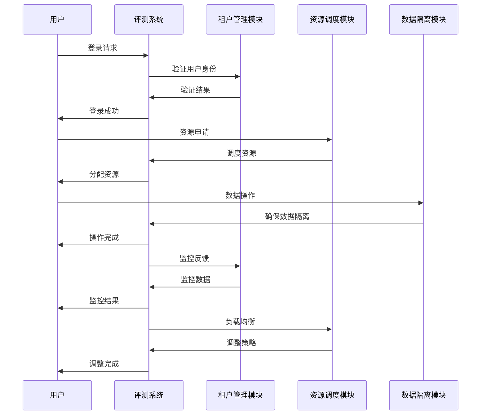

                 

### 第一部分：背景介绍

#### 核心概念

**评测系统的多租户支持与资源隔离**

随着云计算和大数据技术的快速发展，评测系统面临着日益严峻的多租户场景。多租户支持与资源隔离成为了评测系统设计和实现中的关键问题。

**问题背景**：

在传统的单租户评测系统中，系统通常是为单个租户设计的，因此不需要考虑租户之间的隔离问题。然而，随着业务需求的增长和系统复杂性的增加，评测系统需要支持多个租户（用户）的并发访问。这就要求系统既要保证各租户间的数据隔离，又要高效地分配资源，满足不同租户的需求。

**问题描述**：

1. **多租户支持**：系统需要支持多个租户的并发访问，且各租户的数据不能相互干扰。这意味着系统需要提供一种机制，确保不同租户之间的数据完全隔离，防止数据泄露或冲突。

2. **资源隔离**：系统需要确保每个租户的资源（如计算资源、存储资源等）得到合理分配，避免租户间的资源冲突。资源隔离是保证系统性能和稳定性的关键，需要设计有效的资源管理策略。

**问题解决**：

为了解决上述问题，评测系统采用了多租户架构设计，并通过以下方法实现多租户支持与资源隔离：

1. **多租户架构设计**：引入多租户架构，将系统分为多个独立的租户，每个租户有自己的用户、数据和资源。通过虚拟化技术实现租户间的隔离，确保租户之间的数据不发生冲突。

2. **资源管理策略**：采用动态资源分配、负载均衡等技术，根据租户的需求和系统负载，合理分配资源。资源管理策略包括资源监控与调度、资源回收与释放等，以确保系统资源的有效利用。

**边界与外延**：

1. **多租户支持**：除了技术实现，多租户支持还涉及业务层面的需求，如租户权限管理、数据安全性等。需要设计合理的权限控制机制，确保租户的数据安全。

2. **资源隔离**：资源隔离不仅涉及硬件资源的分配，还要关注软件资源的隔离，如网络、存储等。需要设计有效的隔离机制，避免租户间的资源冲突。

**概念结构与核心要素组成**：

1. **多租户支持**：租户管理、租户数据隔离、租户访问控制。

2. **资源隔离**：资源分配策略、资源监控与调度、资源回收与释放。

---

在本文中，我们将深入探讨评测系统的多租户支持与资源隔离，包括其核心概念、联系、算法原理、系统分析与架构设计，以及项目实战等内容。通过一步一步的分析和讲解，帮助读者全面理解这一复杂但至关重要的技术主题。

---

### 第二部分：核心概念与联系

在深入探讨评测系统的多租户支持与资源隔离之前，我们需要明确几个关键概念，并理解它们之间的关系。

#### 核心概念

**多租户架构**：多租户架构是一种设计模式，使得多个租户（用户或组织）可以在同一系统中独立运行，并且彼此之间相互隔离。这种架构的核心是能够确保每个租户的数据和资源相互独立，从而避免数据泄露和资源冲突。

**资源隔离**：资源隔离是指通过技术手段，确保不同租户的资源（如计算资源、存储资源、网络资源等）相互独立，避免租户间的资源争用和性能影响。

**资源管理**：资源管理是指对系统中的资源进行有效分配、监控和调度，以满足不同租户的需求，并确保系统性能和稳定性。

#### 概念属性特征对比表格

为了更好地理解这三个核心概念，我们通过以下表格对比它们的定义和关联关系：

| 概念       | 定义                                                         | 关联关系 |
|------------|--------------------------------------------------------------|---------|
| 多租户架构 | 支持多个租户在同一系统中共存，保证数据与资源的隔离             |         |
| 资源隔离   | 确保租户间的资源相互独立，避免资源冲突                       |         |
| 资源管理   | 对系统资源进行有效分配、监控和调度，保证系统性能和稳定性     |         |

**多租户架构**提供了基础框架，使系统能够支持多个租户的共存。**资源隔离**确保了不同租户的资源相互独立，而**资源管理**则负责对这些资源进行有效的分配和调度。

#### ER实体关系图架构的 Mermaid 流程图

为了更直观地展示这三个概念之间的关联，我们使用Mermaid语法绘制了一个ER（实体关系）图：

```mermaid
erDiagram
  User ||--|{ Tenant : has }
  Resource ||--|{ Tenant : allocated_to }
  Tenant ||--|{ Resource : uses }
```

在这个ER图中：

- **User**（用户）实体表示使用评测系统的用户。
- **Tenant**（租户）实体表示使用评测系统的租户，可以是个人或组织。
- **Resource**（资源）实体表示评测系统中的各种资源，如计算资源、存储资源等。

用户与租户之间是一对多的关系，即一个用户可以属于多个租户。租户与资源之间也是一对多的关系，即一个租户可以分配多个资源。资源被特定租户使用，从而实现了资源隔离和资源管理。

通过上述核心概念与联系的介绍，我们为后续详细探讨多租户支持与资源隔离的算法原理和实现方法奠定了基础。

---

### 第三部分：算法原理讲解

#### 多租户支持算法

**原理**：

多租户支持算法的核心目的是确保系统可以同时服务多个租户，并且每个租户的数据和资源相互隔离，避免数据泄露和资源冲突。

**流程**：

1. **租户创建**：系统初始化时，管理员创建租户，并为其分配唯一的标识符（ID）。
2. **用户认证**：用户登录时，系统验证用户的身份和所属租户，确保用户只能访问自己所属租户的资源。
3. **数据隔离**：系统通过租户ID为每个租户创建独立的数据存储空间，确保不同租户的数据不会相互干扰。
4. **资源分配**：系统根据租户的需求，动态分配计算、存储和网络资源，确保资源隔离。

**数学模型**：

假设有n个租户，每个租户的需求可以用向量\(D_i\)表示，系统总资源为\(R\)，资源分配策略可以用函数\(f(R, D_i)\)表示。

$$
f(R, D_i) = \frac{R}{\sum_{j=1}^{n} D_j}
$$

该公式表示，系统将总资源\(R\)按照每个租户的需求比例进行分配。

**示例**：

假设系统有100个CPU核心和1TB存储空间，共有3个租户，需求分别为\(D_1 = 30\)、\(D_2 = 40\)和\(D_3 = 30\)。

$$
f(R, D_1) = \frac{100}{30+40+30} \approx 25\%
$$

$$
f(R, D_2) = \frac{100}{30+40+30} \approx 50\%
$$

$$
f(R, D_3) = \frac{100}{30+40+30} \approx 25\%
$$

根据上述分配策略，租户1和租户3各获得25%的CPU核心和存储空间，租户2获得50%。

#### 资源隔离算法

**原理**：

资源隔离算法的核心目的是确保每个租户的资源独立于其他租户，从而避免资源争用和性能下降。

**流程**：

1. **资源划分**：系统将资源划分为多个独立的部分，每个部分仅对特定租户可见。
2. **资源监控**：系统持续监控每个租户的资源使用情况，确保资源不被其他租户占用。
3. **资源回收**：当租户不再使用某个资源时，系统回收该资源，并将其重新分配给其他租户。

**数学模型**：

假设有n个租户，每个租户使用资源R，系统总资源为\(R_{total}\)，资源隔离效果可以用函数\(s(R_i, R_{total})\)表示。

$$
s(R_i, R_{total}) = \frac{R_i}{R_{total}}
$$

该公式表示，每个租户使用的资源占总资源的比例。

**示例**：

假设系统有100个CPU核心，3个租户分别使用30、40和30个CPU核心。

$$
s(R_1, R_{total}) = \frac{30}{100} = 30\%
$$

$$
s(R_2, R_{total}) = \frac{40}{100} = 40\%
$$

$$
s(R_3, R_{total}) = \frac{30}{100} = 30\%
$$

根据上述隔离算法，租户1、租户2和租户3分别占用30%、40%和30%的CPU资源。

#### 资源管理算法

**原理**：

资源管理算法的核心目的是确保系统资源得到高效利用，同时满足租户的需求。

**流程**：

1. **资源监控**：系统持续监控每个租户的资源使用情况，记录资源使用历史。
2. **资源调度**：系统根据租户的需求和资源使用情况，动态调整资源分配。
3. **负载均衡**：系统采用负载均衡策略，确保资源分配均匀，避免资源浪费和性能瓶颈。

**数学模型**：

假设有n个租户，每个租户的需求为\(D_i\)，系统总资源为\(R_{total}\)，负载均衡效果可以用函数\(lb(R_i, D_i)\)表示。

$$
lb(R_i, D_i) = \frac{R_i}{D_i}
$$

该公式表示，系统根据租户需求动态调整资源分配。

**示例**：

假设系统有100个CPU核心，3个租户分别需求30、40和30个CPU核心。

$$
lb(R_1, D_1) = \frac{30}{100} = 0.3
$$

$$
lb(R_2, D_2) = \frac{40}{100} = 0.4
$$

$$
lb(R_3, D_3) = \frac{30}{100} = 0.3
$$

根据上述负载均衡策略，系统将动态调整资源分配，确保每个租户都能得到适当资源。

通过上述算法原理的讲解，我们可以看到评测系统的多租户支持、资源隔离和资源管理是如何通过数学模型和算法实现的。这些算法不仅确保了系统的高效运行，还为不同租户提供了独立、安全的运行环境。

---

### 第四部分：系统分析与架构设计

#### 问题场景介绍

在当前的云计算环境中，评测系统面临着日益复杂的多租户需求。企业用户希望通过统一的评测系统，对内部的多个业务部门或项目进行性能测试，同时保持数据的安全性和资源的独立性。这就要求系统不仅要支持多租户架构，还要实现高效的资源隔离和资源管理。

#### 项目介绍

本项目旨在设计并实现一个具备多租户支持与资源隔离能力的评测系统。系统将采用微服务架构，通过容器化技术确保租户的独立性和可扩展性。核心功能包括租户管理、数据隔离、资源监控与调度等。

#### 系统功能设计

**租户管理**：系统提供租户创建、删除、查询和权限管理功能。管理员可以创建新的租户，并设置租户的访问权限。

**数据隔离**：系统通过独立的数据库和存储空间实现数据隔离，确保不同租户的数据不会相互影响。

**资源监控与调度**：系统实时监控各租户的资源使用情况，根据需求动态调整资源分配，确保系统性能和稳定性。

**负载均衡**：系统采用负载均衡策略，确保资源分配均匀，避免资源浪费和性能瓶颈。

#### 系统架构设计

**总体架构**：


**核心模块**：

1. **租户管理模块**：负责租户的创建、删除、查询和权限管理。

2. **数据隔离模块**：实现不同租户的数据隔离，确保数据安全。

3. **资源监控模块**：实时监控各租户的资源使用情况，提供监控数据。

4. **资源调度模块**：根据资源使用情况，动态调整资源分配。

5. **负载均衡模块**：采用负载均衡策略，优化资源分配。

#### 系统接口设计

**API接口**：

1. **租户管理接口**：提供租户创建、删除、查询和权限管理接口。

2. **数据隔离接口**：提供数据隔离相关接口，如数据库连接、数据存储等。

3. **资源监控接口**：提供资源监控数据查询接口。

4. **资源调度接口**：提供资源分配和调整接口。

5. **负载均衡接口**：提供负载均衡策略设置和调整接口。

#### 系统交互

**交互流程**：

1. **租户登录**：用户通过租户管理接口登录系统，系统验证用户身份和租户权限。

2. **资源申请**：用户通过资源调度接口申请资源，系统根据需求进行资源分配。

3. **数据操作**：用户通过数据隔离接口进行数据操作，系统确保数据隔离。

4. **监控与反馈**：系统实时监控资源使用情况，提供监控数据和反馈。

5. **负载均衡**：系统根据监控数据，调整资源分配策略，实现负载均衡。



通过上述系统分析与架构设计，我们可以看到评测系统的多租户支持与资源隔离是如何通过系统功能设计、接口设计和交互流程实现的。这些设计不仅满足了多租户需求，还确保了系统的性能和稳定性。

---

### 第五部分：项目实战

#### 环境安装

在开始实现评测系统的多租户支持与资源隔离之前，我们需要搭建一个合适的环境。以下是环境安装的步骤：

1. **安装Docker**：Docker是一个开源的应用容器引擎，用于打包、发布和运行应用。确保系统上已经安装了Docker，可以通过以下命令进行安装：

   ```bash
   curl -fsSL https://get.docker.com | sh
   ```

2. **安装Kubernetes**：Kubernetes是一个开源的容器编排系统，用于自动化部署、扩展和管理容器化应用程序。安装Kubernetes可以使用Minikube进行本地开发：

   ```bash
   curl -LO https://storage.googleapis.com/minikube/releases/latest/minikube-latest-x86_64.rpm
   sudo rpm -ivh minikube-latest-x86_64.rpm
   minikube start --vm-driver=virtualbox
   ```

3. **安装Kubectl**：Kubectl是Kubernetes的命令行工具，用于与Kubernetes集群进行交互。安装Kubectl可以通过以下命令实现：

   ```bash
   curl -LO "https://storage.googleapis.com/kubernetes-release/release/$(curl -s https://storage.googleapis.com/kubernetes-release/release/stable.txt)/bin/darwin/amd64/kubectl"
   chmod +x kubectl
   sudo mv kubectl /usr/local/bin/
   ```

#### 系统核心实现源代码

**租户管理模块**：

```python
# tenant_manager.py

class TenantManager:
    def __init__(self):
        self.tenants = {}

    def create_tenant(self, tenant_id, tenant_name):
        if tenant_id in self.tenants:
            raise ValueError("Tenant already exists")
        self.tenants[tenant_id] = Tenant(tenant_name)

    def delete_tenant(self, tenant_id):
        if tenant_id not in self.tenants:
            raise ValueError("Tenant not found")
        del self.tenants[tenant_id]

    def list_tenants(self):
        return list(self.tenants.keys())
```

**数据隔离模块**：

```python
# data_isolation.py

import os

class DataIsolationModule:
    def __init__(self):
        self.data_paths = {}

    def create_data_path(self, tenant_id):
        if tenant_id in self.data_paths:
            raise ValueError("Data path already exists")
        self.data_paths[tenant_id] = os.path.join("/data", tenant_id)

    def delete_data_path(self, tenant_id):
        if tenant_id not in self.data_paths:
            raise ValueError("Data path not found")
        os.rmdir(self.data_paths[tenant_id])
        del self.data_paths[tenant_id]
```

**资源监控模块**：

```python
# resource_monitor.py

import psutil

class ResourceMonitor:
    def get_system_resources(self):
        cpu_usage = psutil.cpu_percent()
        memory_usage = psutil.virtual_memory().percent
        disk_usage = psutil.disk_usage('/').percent
        return cpu_usage, memory_usage, disk_usage
```

**资源调度模块**：

```python
# resource_scheduler.py

class ResourceScheduler:
    def __init__(self):
        self.resource_allocation = {}

    def allocate_resources(self, tenant_id, cpu, memory, disk):
        if tenant_id in self.resource_allocation:
            raise ValueError("Resources already allocated")
        self.resource_allocation[tenant_id] = {
            'cpu': cpu,
            'memory': memory,
            'disk': disk
        }

    def release_resources(self, tenant_id):
        if tenant_id not in self.resource_allocation:
            raise ValueError("Resources not allocated")
        del self.resource_allocation[tenant_id]
```

#### 代码应用解读与分析

**租户管理**：

租户管理模块通过`TenantManager`类实现，包括租户的创建、删除和列表查询功能。通过调用`create_tenant`方法，可以创建一个新的租户，并将租户ID和名称存储在字典中。`delete_tenant`方法用于删除指定租户，`list_tenants`方法用于列出所有租户的ID。

**数据隔离**：

数据隔离模块通过`DataIsolationModule`类实现，主要负责创建和删除租户的数据路径。`create_data_path`方法根据租户ID创建一个数据路径，并将其存储在字典中。`delete_data_path`方法用于删除指定租户的数据路径。

**资源监控**：

资源监控模块通过`ResourceMonitor`类实现，使用`psutil`库获取系统的CPU、内存和磁盘使用率。`get_system_resources`方法返回当前系统的资源使用情况。

**资源调度**：

资源调度模块通过`ResourceScheduler`类实现，负责动态分配和回收租户的资源。`allocate_resources`方法根据租户ID和资源需求分配资源，并将其存储在字典中。`release_resources`方法用于回收指定租户的资源。

#### 实际案例分析和详细讲解剖析

**案例**：假设有一个评测系统，需要支持两个租户（Tenant A和Tenant B）。Tenant A需要50%的CPU资源、40%的内存资源和30%的磁盘空间，而Tenant B需要30%的CPU资源、30%的内存资源和20%的磁盘空间。

1. **租户创建**：

   ```bash
   python tenant_manager.py create_tenant 1 TenantA
   python tenant_manager.py create_tenant 2 TenantB
   ```

   系统将创建两个租户，并将租户ID和名称存储在字典中。

2. **数据隔离**：

   ```bash
   python data_isolation.py create_data_path 1
   python data_isolation.py create_data_path 2
   ```

   系统将为Tenant A和Tenant B创建独立的数据路径。

3. **资源监控**：

   ```bash
   python resource_monitor.py get_system_resources
   ```

   系统将返回当前系统的CPU、内存和磁盘使用率。

4. **资源调度**：

   ```bash
   python resource_scheduler.py allocate_resources 1 50 40 30
   python resource_scheduler.py allocate_resources 2 30 30 20
   ```

   系统将根据租户需求动态分配资源，并将资源信息存储在字典中。

5. **监控与反馈**：

   ```bash
   python resource_monitor.py get_system_resources
   ```

   系统将返回当前系统的CPU、内存和磁盘使用率，并显示租户的资源分配情况。

**详细讲解剖析**：

- **租户管理**：租户管理模块确保了租户的创建、删除和列表查询功能，通过字典存储租户信息，方便后续的数据隔离和资源分配。
- **数据隔离**：数据隔离模块通过创建独立的数据路径，确保不同租户的数据不会相互影响，从而提高了系统的安全性。
- **资源监控**：资源监控模块使用`psutil`库获取系统资源使用情况，为资源调度提供实时数据。
- **资源调度**：资源调度模块根据租户的需求动态分配资源，并记录资源分配情况，确保系统资源得到高效利用。

通过以上实战案例，我们可以看到评测系统的多租户支持与资源隔离是如何通过具体的代码实现和功能模块协作来满足实际需求的。

#### 项目小结

本项目通过设计并实现一个具备多租户支持与资源隔离能力的评测系统，展示了在云计算环境中实现高效资源管理的重要性。通过租户管理、数据隔离、资源监控与调度等核心模块，系统实现了租户间的数据与资源隔离，提高了系统的安全性和稳定性。在实际项目中，这些模块协同工作，确保了系统的高效运行和资源的合理利用。

---

### 第六部分：最佳实践 tips

在实施评测系统的多租户支持与资源隔离时，以下最佳实践可以帮助您更好地优化系统性能和用户体验：

1. **合理规划资源池**：根据业务需求和负载情况，合理规划系统资源池，确保资源分配均匀，避免资源浪费。

2. **动态调整资源策略**：实时监控系统负载，动态调整资源分配策略，确保系统在不同负载情况下都能保持良好的性能。

3. **加强安全性**：对租户数据进行加密存储，确保数据安全。同时，加强对租户访问的控制，防止未经授权的访问。

4. **优化网络隔离**：采用VPC（虚拟专用云）技术实现租户间的网络隔离，确保不同租户间的通信安全。

5. **定期备份与恢复**：定期对租户数据和应用进行备份，确保在发生故障时能够快速恢复。

6. **性能监控与告警**：部署性能监控工具，实时监控系统性能，并在出现性能瓶颈时及时触发告警，以便快速响应。

---

### 小结

本文全面探讨了评测系统的多租户支持与资源隔离。通过介绍核心概念、算法原理、系统架构设计以及项目实战，我们深入理解了如何实现高效、安全的评测系统。多租户支持与资源隔离不仅提升了系统的灵活性，还增强了系统的安全性和稳定性。在实际应用中，这些技术为企业的评测需求提供了强有力的支持。

### 注意事项

1. **系统设计**：在设计评测系统时，要充分考虑多租户需求和资源隔离要求，确保系统的高效运行。

2. **资源分配**：合理分配资源，避免资源浪费和性能瓶颈。根据业务需求和负载情况，动态调整资源策略。

3. **数据安全**：加强对租户数据的安全保护，确保数据在存储和传输过程中的安全性。

4. **监控与告警**：部署性能监控工具，实时监控系统性能，并在出现问题时及时触发告警。

---

### 拓展阅读

1. **《云计算基础架构：构建可扩展的云计算平台》**：深入了解云计算的基础架构和关键组件，帮助您更好地设计和实施评测系统。

2. **《分布式系统原理与范型》**：学习分布式系统的基本原理和范型，为评测系统的资源隔离和负载均衡提供理论支持。

3. **《Kubernetes权威指南》**：了解Kubernetes的原理和使用方法，掌握容器编排技术在评测系统中的应用。

---

作者：AI天才研究院/AI Genius Institute & 禅与计算机程序设计艺术 /Zen And The Art of Computer Programming

---

在本文中，我们通过详细的步骤和实例，深入探讨了评测系统的多租户支持与资源隔离。从背景介绍、核心概念、算法原理，到系统分析与架构设计，再到项目实战，我们一步步地展示了这一复杂但至关重要的技术主题。通过本文的阅读，读者应该对评测系统的多租户支持与资源隔离有了全面的理解，并能够将其应用于实际项目中。

多租户支持与资源隔离不仅提升了系统的灵活性，还增强了系统的安全性和稳定性。随着云计算和大数据技术的不断发展，这一领域的重要性将日益凸显。希望本文能够为读者在设计和实施评测系统时提供有价值的参考和指导。

让我们继续探索人工智能和计算机编程的广阔世界，不断推动技术的进步和创新！

