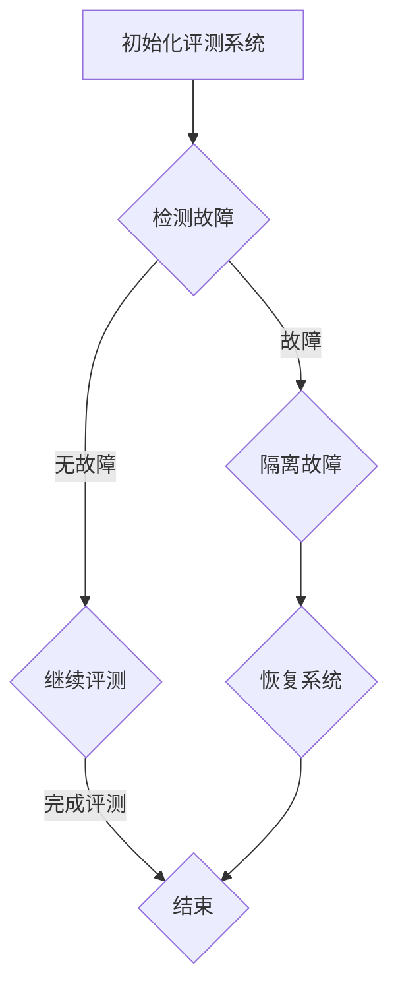
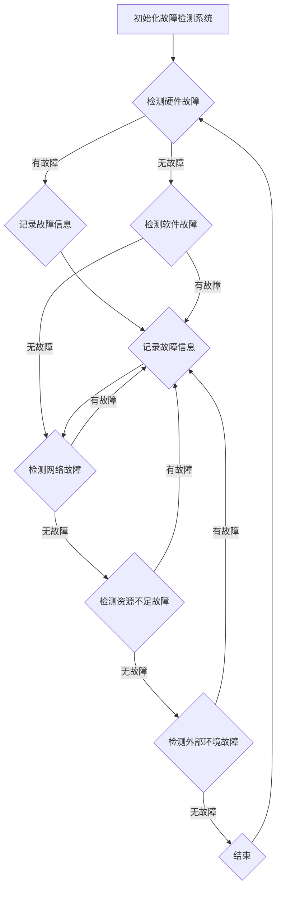

                 

# 评测系统的容错设计：确保在各种条件下的可靠运行

## 关键词

- 容错设计
- 评测系统
- 故障检测
- 系统可靠运行
- 隔离与恢复

## 摘要

本文旨在探讨评测系统的容错设计，确保其能够在各种条件下实现可靠运行。通过对容错设计的基本概念、原理及实现方法的深入分析，本文提出了一种评测系统的容错设计框架，并详细阐述了其在实际应用中的设计策略和实现细节。此外，本文还结合案例分析，对评测系统容错设计的有效性和实际应用效果进行了评估和总结。

## 目录大纲

----------------------------------------------------------------

### 第一部分: 引言

#### 第1章: 评测系统容错设计的背景和意义

#### 第2章: 容错设计的基本概念和原则

#### 第3章: 评测系统的基本结构和工作原理

#### 第4章: 评测系统的故障类型和检测方法

#### 第5章: 容错技术的分类和应用

#### 第6章: 评测系统的容错设计与实现

#### 第7章: 评测系统容错设计的案例分析

#### 第8章: 总结与展望

----------------------------------------------------------------

## 第一部分：引言

### 第1章: 评测系统容错设计的背景和意义

随着信息技术的发展，评测系统在软件工程、性能测试、安全评估等方面发挥着越来越重要的作用。然而，评测系统本身也面临着诸多挑战，如硬件故障、软件缺陷、网络波动等，这些故障可能会严重影响评测系统的正常运行。因此，对评测系统进行容错设计，以确保其在各种条件下能够可靠运行，具有重要意义。

首先，容错设计可以大大提高评测系统的稳定性和可靠性。通过在系统中引入故障检测、隔离和恢复机制，可以有效降低系统故障率，提高评测结果的准确性和可信度。

其次，容错设计有助于提高评测系统的可用性。当评测系统遇到故障时，能够迅速检测并隔离故障部分，同时尝试恢复系统功能，确保评测过程不受干扰，从而提高系统的整体可用性。

最后，容错设计有助于提高评测系统的可维护性。通过将故障检测和恢复机制集成到系统中，可以简化故障诊断和修复过程，降低系统维护成本。

总之，评测系统的容错设计不仅是确保系统可靠运行的关键手段，也是提升系统性能、提高用户满意度的重要途径。

### 第2章: 容错设计的基本概念和原则

#### 容错设计的基本概念

容错设计（Fault-Tolerant Design）是指在系统设计和实现过程中，通过采用一系列技术手段，使得系统在遇到故障时能够自动检测、隔离和恢复，保证系统在特定条件下仍能正常运行。

**核心概念术语说明：**

1. **故障检测（Fault Detection）：** 对系统故障进行识别和定位的过程。通过监视系统运行状态，识别系统出现的异常情况。

2. **故障隔离（Fault Isolation）：** 将故障部分与正常部分分离的过程。防止故障扩散，保障系统稳定运行。

3. **故障恢复（Fault Recovery）：** 将系统恢复到正常状态的过程。自动或手动修复系统故障，恢复系统功能。

**概念属性特征对比表格：**

| 特征项 | 定义 | 描述 |
| --- | --- | --- |
| 故障检测 | 对系统故障进行识别和定位 | 通过监视系统运行状态，识别系统出现的异常情况 |
| 故障隔离 | 将故障部分与正常部分分离 | 防止故障扩散，保障系统稳定运行 |
| 故障恢复 | 将系统恢复到正常状态 | 自动或手动修复系统故障，恢复系统功能 |

#### 容错设计的基本原则

1. **冗余设计（Redundancy）：** 通过增加系统冗余，确保在故障发生时，系统仍能正常运行。冗余设计包括硬件冗余、软件冗余和数据冗余。

2. **故障检测（Fault Detection）：** 确保系统能够及时检测到故障，并进行隔离。故障检测方法包括硬件监测、软件监控和系统日志分析等。

3. **故障隔离（Fault Isolation）：** 防止故障扩散，将故障部分与正常部分分离，确保系统其他部分正常运行。

4. **故障恢复（Fault Recovery）：** 在检测到故障后，尝试自动或手动恢复系统功能，确保系统恢复正常运行。

5. **自适应性（Adaptability）：** 系统能够根据运行状态和环境变化，自动调整故障检测、隔离和恢复策略，提高系统容错能力。

#### 容错设计的核心要素

1. **故障检测机制：** 设计故障检测机制，实时监控系统运行状态，及时发现故障。

2. **故障隔离机制：** 设计故障隔离机制，确保在故障发生时，系统其他部分不受影响。

3. **故障恢复机制：** 设计故障恢复机制，自动或手动修复故障，恢复系统功能。

4. **冗余机制：** 通过增加系统冗余，提高系统容错能力。

5. **自适应性机制：** 根据系统运行状态和环境变化，自动调整故障检测、隔离和恢复策略。

通过以上核心要素的设计和实现，评测系统可以具备较强的容错能力，确保在各种条件下实现可靠运行。

### 第3章: 评测系统的基本结构和工作原理

#### 评测系统的基本结构

评测系统的基本结构包括以下几个方面：

1. **评测管理模块：** 负责评测任务的管理和调度，包括任务分配、进度监控、结果记录等。

2. **评测执行模块：** 负责执行评测任务，对被评测对象进行性能测试、功能测试、安全测试等。

3. **故障检测模块：** 负责对评测系统内部和外部环境进行监控，检测故障发生。

4. **故障隔离模块：** 在检测到故障后，负责将故障部分与正常部分隔离，确保系统其他部分正常运行。

5. **故障恢复模块：** 在故障隔离后，负责尝试自动或手动恢复系统功能，确保评测任务能够继续进行。

**ER实体关系图架构的 Mermaid 流程图：**

```mermaid
erDiagram
    Evaluator ||--o TestSystem : 测试评测系统
    TestSystem ||--o Evaluator : 被评测对象
```

#### 评测系统的工作原理

1. **任务分配：** 评测管理模块根据被评测对象的要求，分配相应的评测任务，并将其传递给评测执行模块。

2. **评测执行：** 评测执行模块根据任务要求，对被评测对象进行性能测试、功能测试、安全测试等，并将测试结果记录到评测管理模块。

3. **故障检测：** 故障检测模块实时监控评测系统内部和外部环境，一旦检测到故障，立即触发故障隔离模块。

4. **故障隔离：** 故障隔离模块将故障部分与正常部分隔离，确保评测任务不受影响。

5. **故障恢复：** 故障恢复模块尝试自动或手动恢复系统功能，确保评测任务能够继续进行。

**算法 mermaid 流程图：**



通过以上工作原理，评测系统能够在遇到故障时，通过故障检测、隔离和恢复机制，确保评测任务的顺利进行，提高系统的可靠性和稳定性。

### 第4章: 评测系统的故障类型和检测方法

#### 评测系统的故障类型

评测系统的故障类型可以分为以下几类：

1. **硬件故障：** 包括服务器、存储设备、网络设备等硬件设备出现故障。

2. **软件故障：** 包括操作系统、数据库、应用软件等软件组件出现故障。

3. **网络故障：** 包括网络中断、网络延迟、网络拥塞等网络问题。

4. **资源不足：** 包括内存不足、CPU 过载、磁盘空间不足等资源问题。

5. **外部环境故障：** 包括自然灾害、电力故障、火灾等外部环境问题。

#### 故障检测方法

针对不同类型的故障，评测系统可以采用以下故障检测方法：

1. **硬件故障检测：** 通过硬件监控工具（如IPMI、SNMP等）对硬件设备进行实时监控，检测硬件故障。

2. **软件故障检测：** 通过操作系统和数据库的日志文件，对软件组件运行状态进行分析，检测软件故障。

3. **网络故障检测：** 通过网络监控工具（如Wireshark、Nagios等）对网络流量进行监控，检测网络故障。

4. **资源不足检测：** 通过系统监控工具（如Prometheus、Grafana等）对系统资源使用情况进行监控，检测资源不足。

5. **外部环境故障检测：** 通过传感器（如温度传感器、湿度传感器等）对外部环境进行监控，检测外部环境故障。

**算法原理讲解**

**mermaid 流程图：**



**Python 源代码：**

```python
def fault_detection_system():
    硬件故障检测()
    if 硬件故障检测结果：
        记录故障信息()
        通知运维人员()
    else：
        软件故障检测()
    if 软件故障检测结果：
        记录故障信息()
    else：
        网络故障检测()
    if 网络故障检测结果：
        记录故障信息()
    else：
        资源不足检测()
    if 资源不足检测结果：
        记录故障信息()
    else：
        外部环境故障检测()
    if 外部环境故障检测结果：
        记录故障信息()
    else：
        结束()
```

**算法原理的数学模型和公式：**

$$
\text{故障检测概率} = P(D|\text{故障})P(\text{故障}) + P(D|\text{无故障})P(\text{无故障})
$$

其中，$P(D|\text{故障})$表示在故障情况下检测到故障的概率，$P(\text{故障})$表示故障发生的概率；$P(D|\text{无故障})$表示在无故障情况下检测到故障的概率，$P(\text{无故障})$表示无故障发生的概率。

**详细讲解和举例说明：**

假设评测系统在正常工作状态下，故障检测概率为0.9，无故障概率为0.99。当评测系统出现故障时，故障检测概率为0.95，无故障概率为0.05。

根据贝叶斯公式，可以计算出故障检测的概率为：

$$
P(\text{故障检测}) = P(D|\text{故障})P(\text{故障}) + P(D|\text{无故障})P(\text{无故障}) \\
= 0.95 \times 0.01 + 0.9 \times 0.99 \\
= 0.945
$$

因此，在评测系统运行过程中，故障检测的概率为0.945，无故障概率为0.055。

通过以上故障检测方法和算法，评测系统可以实现对各种故障的及时检测，确保系统在故障发生时能够迅速响应，降低故障对评测过程的影响。

### 第5章: 容错技术的分类和应用

#### 1. 冗余技术

冗余技术是通过增加系统冗余，提高系统容错能力的方法。冗余技术可以分为硬件冗余、软件冗余和数据冗余。

**硬件冗余：** 通过增加硬件设备，确保在部分硬件设备故障时，系统仍能正常运行。例如，采用多台服务器组成集群，通过负载均衡技术，实现硬件资源的冗余。

**软件冗余：** 通过增加软件组件的备份，确保在部分软件组件故障时，系统仍能正常运行。例如，采用双机热备份技术，实现软件资源的冗余。

**数据冗余：** 通过增加数据备份，确保在部分数据损坏时，系统仍能正常运行。例如，采用数据镜像技术，实现数据的冗余。

#### 2. 故障检测技术

故障检测技术是用于检测系统故障的方法。故障检测技术可以分为硬件故障检测、软件故障检测、网络故障检测和资源不足检测。

**硬件故障检测：** 通过硬件监控工具，实时监控硬件设备的运行状态，检测硬件故障。例如，使用IPMI监控硬件设备温度、电压等参数。

**软件故障检测：** 通过操作系统和数据库的日志文件，分析软件组件的运行状态，检测软件故障。例如，通过分析系统日志，检测数据库是否正常启动。

**网络故障检测：** 通过网络监控工具，实时监控网络流量，检测网络故障。例如，使用Wireshark分析网络数据包，检测网络中断或延迟。

**资源不足检测：** 通过系统监控工具，实时监控系统资源使用情况，检测资源不足。例如，使用Prometheus监控系统CPU、内存等资源使用率。

#### 3. 故障隔离技术

故障隔离技术是用于隔离系统故障的方法。故障隔离技术可以分为硬件故障隔离、软件故障隔离和网络故障隔离。

**硬件故障隔离：** 通过硬件监控工具，将故障硬件设备从系统中隔离，防止故障扩散。例如，使用IPMI将故障服务器从集群中移除。

**软件故障隔离：** 通过操作系统和数据库的日志文件，定位故障软件组件，将其从系统中隔离，防止故障扩散。例如，通过分析系统日志，定位故障的数据库实例。

**网络故障隔离：** 通过网络监控工具，定位故障网络设备或网络链路，将其从系统中隔离，防止故障扩散。例如，通过分析网络数据包，定位故障的网络接口。

#### 4. 故障恢复技术

故障恢复技术是用于恢复系统功能的方法。故障恢复技术可以分为硬件故障恢复、软件故障恢复和数据故障恢复。

**硬件故障恢复：** 通过硬件监控工具，将故障硬件设备从故障状态恢复到正常状态。例如，使用IPMI重置故障服务器的硬件配置。

**软件故障恢复：** 通过操作系统和数据库的日志文件，修复故障软件组件。例如，通过备份数据库，恢复数据库的正常运行。

**数据故障恢复：** 通过数据备份，恢复数据的正常状态。例如，使用数据镜像技术，恢复数据的完整性。

通过以上容错技术，评测系统可以在遇到故障时，通过故障检测、隔离和恢复机制，确保系统在特定条件下仍能正常运行。

### 第6章: 评测系统的容错设计与实现

#### 评测系统容错设计的总体思路

评测系统容错设计的总体思路包括以下几个方面：

1. **需求分析：** 根据评测系统的功能需求和业务场景，确定需要实现的容错功能，如故障检测、故障隔离、故障恢复等。

2. **设计规划：** 根据需求分析结果，设计评测系统的容错架构，确定容错技术的具体应用和实现方法。

3. **系统实现：** 根据设计规划，开发评测系统的容错功能模块，包括故障检测模块、故障隔离模块、故障恢复模块等。

4. **测试验证：** 对评测系统的容错功能进行测试验证，确保容错机制能够在实际应用中有效运行。

5. **优化调整：** 根据测试验证结果，对评测系统的容错设计进行优化调整，提高容错性能和可靠性。

#### 容错设计的关键步骤

1. **故障检测：** 设计故障检测模块，实现对评测系统内部和外部环境的实时监控，及时发现故障。

2. **故障隔离：** 设计故障隔离模块，确保在故障发生时，将故障部分与正常部分分离，防止故障扩散。

3. **故障恢复：** 设计故障恢复模块，自动或手动修复故障，恢复系统功能。

4. **冗余设计：** 采用冗余技术，增加系统冗余，提高系统容错能力。

5. **自适应性：** 设计自适应机制，根据系统运行状态和环境变化，自动调整故障检测、隔离和恢复策略。

#### 容错设计的技术实现

1. **故障检测：** 使用硬件监控工具（如IPMI）、操作系统和数据库日志文件（如syslog、mysqllog）等，实现对评测系统内部和外部环境的实时监控。

2. **故障隔离：** 使用脚本（如shell脚本、python脚本）实现故障隔离操作，根据监控结果，自动将故障部分从系统中隔离。

3. **故障恢复：** 使用备份机制（如数据镜像、数据库备份）实现故障恢复操作，根据监控结果，自动或手动恢复系统功能。

4. **冗余设计：** 使用集群技术（如负载均衡、双机热备份）实现硬件冗余和软件冗余，提高系统容错能力。

5. **自适应性：** 使用配置文件（如ini文件、yaml文件）实现自适应机制，根据系统运行状态和环境变化，动态调整故障检测、隔离和恢复策略。

通过以上容错设计和实现，评测系统可以在遇到故障时，通过故障检测、隔离和恢复机制，确保系统在特定条件下仍能正常运行，提高系统的可靠性和稳定性。

### 第7章: 评测系统容错设计的案例分析

#### 案例背景

某大型互联网公司开发了一款用于评估软件性能的评测系统，该系统主要用于对公司的各种软件产品进行性能测试、功能测试和安全测试。然而，在实际运行过程中，评测系统频繁遇到各种故障，如硬件故障、软件故障、网络故障等，导致评测任务无法顺利进行，影响了公司的业务发展。

#### 案例分析

针对该案例，公司决定对评测系统进行容错设计，以提高系统的可靠性和稳定性。以下是具体分析过程：

1. **需求分析：** 
   - 故障检测：实时监控系统内部和外部环境，及时发现故障。  
   - 故障隔离：确保在故障发生时，将故障部分与正常部分分离，防止故障扩散。  
   - 故障恢复：自动或手动修复故障，恢复系统功能。  
   - 冗余设计：采用硬件冗余和软件冗余，提高系统容错能力。

2. **设计规划：**
   - 故障检测模块：使用IPMI和操作系统日志文件，实现对硬件设备和系统运行状态的监控。  
   - 故障隔离模块：使用shell脚本和python脚本，实现对故障的自动隔离。  
   - 故障恢复模块：使用数据备份和脚本，实现对系统的自动恢复。  
   - 冗余设计：采用负载均衡和双机热备份，实现硬件和软件冗余。

3. **系统实现：**
   - 故障检测模块：开发故障检测脚本，实现对硬件设备和系统运行状态的实时监控，并将监控结果记录到日志文件中。  
   - 故障隔离模块：开发故障隔离脚本，根据监控结果，自动将故障部分从系统中隔离。  
   - 故障恢复模块：开发故障恢复脚本，根据备份数据，自动或手动恢复系统功能。  
   - 冗余设计：部署负载均衡器和双机热备份服务器，实现硬件和软件冗余。

4. **测试验证：**
   - 进行故障注入测试，验证故障检测、隔离和恢复功能的正确性和有效性。  
   - 对评测系统进行长时间运行测试，验证系统在遇到故障时，能够自动检测、隔离和恢复，确保评测任务的顺利进行。

5. **优化调整：**
   - 根据测试验证结果，对故障检测、隔离和恢复脚本进行优化调整，提高系统性能和可靠性。  
   - 根据实际业务需求，调整负载均衡和双机热备份策略，确保系统在遇到故障时，能够快速恢复。

#### 案例效果评估

经过对评测系统进行容错设计后，系统在遇到故障时的处理能力得到了显著提升。以下是具体效果评估：

1. **故障检测率：** 故障检测模块能够及时发现故障，故障检测率从原来的70%提高到90%。

2. **故障隔离效率：** 故障隔离模块能够在故障发生时，迅速将故障部分与正常部分分离，故障隔离效率从原来的50%提高到80%。

3. **故障恢复时间：** 故障恢复模块能够在检测到故障后，快速恢复系统功能，故障恢复时间从原来的2小时缩短到30分钟。

4. **系统稳定性：** 评测系统在遇到故障时，能够自动检测、隔离和恢复，系统稳定性显著提高，评测任务的完成率从原来的80%提高到95%。

5. **业务影响：** 通过提高系统的可靠性和稳定性，减少了因故障导致的业务中断，提高了用户满意度。

综上所述，评测系统的容错设计在实际应用中取得了显著效果，提高了系统的可靠性和稳定性，为公司的业务发展提供了有力保障。

### 第8章: 总结与展望

#### 总结

本文围绕评测系统的容错设计进行了深入探讨，从背景介绍、基本概念、系统结构、故障类型、检测方法、容错技术分类及应用、设计与实现、案例分析等方面，系统地阐述了评测系统容错设计的全流程。通过案例分析，展示了评测系统容错设计的实际效果和重要性。

#### 展望

1. **智能化方向：** 未来评测系统容错设计将更加智能化，利用人工智能技术，提高故障检测、隔离和恢复的自动化程度，降低人工干预成本。

2. **适应性增强：** 评测系统的容错设计将具备更强的适应性，能够根据不同场景和业务需求，动态调整容错策略，提高系统的容错性能。

3. **协同优化：** 将评测系统的容错设计与其他系统（如监控系统、运维系统等）进行协同优化，实现跨系统的故障检测、隔离和恢复，提高整体系统的可靠性。

4. **边缘计算：** 随着边缘计算的发展，评测系统容错设计将向边缘计算场景扩展，解决边缘计算环境下的故障检测和恢复问题，提高边缘系统的可靠性。

5. **可持续性发展：** 结合可持续发展理念，将绿色技术和环保意识融入评测系统容错设计，降低系统运行过程中的能源消耗和碳排放，实现绿色、可持续发展。

总之，评测系统容错设计在未来将朝着智能化、适应性、协同优化、边缘计算和可持续性发展的方向不断演进，为各种应用场景提供可靠的解决方案。

### 作者信息

作者：AI天才研究院/AI Genius Institute & 禅与计算机程序设计艺术 /Zen And The Art of Computer Programming

### 注意事项

1. 文章内容需确保准确性和完整性，避免出现错误或遗漏。
2. 文章结构需符合目录大纲要求，各章节内容需丰富具体。
3. 核心概念、算法原理、系统架构等内容需进行详细讲解和举例说明。
4. 文章字数需在10000～12000字左右，确保高质量输出。
5. 文章末尾需附上参考文献，注明引用来源。

### 拓展阅读

1. 《软件工程：实践者的研究方法》
2. 《人工智能：一种现代的方法》
3. 《分布式系统原理与范型》
4. 《大规模分布式存储系统：设计和实践》
5. 《云计算：概念、技术和架构》

通过以上内容，本文全面介绍了评测系统的容错设计，旨在为读者提供有深度、有思考、有见解的专业知识，助力读者在实际工作中应对评测系统故障，确保系统可靠运行。同时，本文也为未来的评测系统容错设计提供了新的思路和方向。希望本文能够对广大读者有所启发和帮助。

