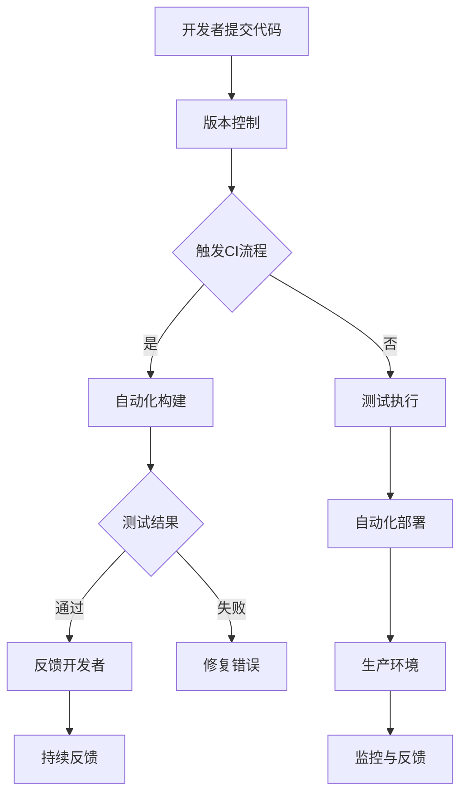
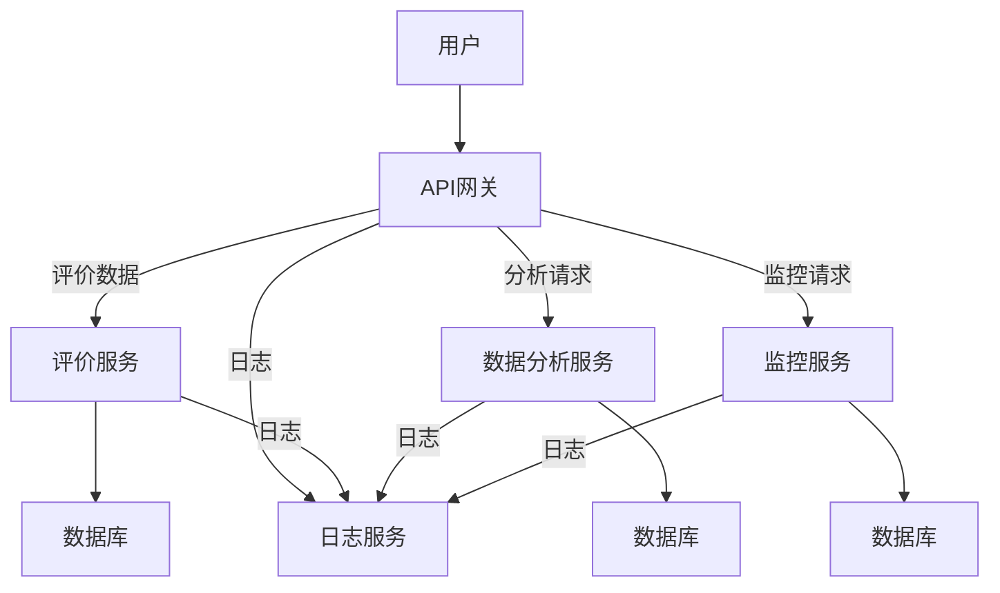

                 

### 文章标题

《评测系统的持续集成与部署策略》

### 文章关键词

持续集成，持续部署，评测系统，CI/CD，自动化，敏捷开发，代码质量，敏捷交付，部署流程，运维管理，容器化，微服务，DevOps

### 文章摘要

本文将探讨评测系统的持续集成（CI）与持续部署（CD）策略，旨在帮助开发者和运维人员理解和实施这些关键过程。我们将首先介绍CI/CD的基本概念，并详细解释它们在软件开发中的作用。随后，我们将分析评测系统设计中的核心概念，包括其结构、功能和性能指标。接着，我们将深入讲解CI/CD中的算法原理，并通过Python代码和LaTeX公式展示数学模型。文章还将展示一个具体的系统分析与架构设计方案，提供实际项目实战的步骤和案例分析。最后，我们将总结最佳实践，并提供未来展望，帮助读者在持续集成与部署方面做出更明智的决策。

---

## 第1章：引言

在当今快速发展的软件开发环境中，持续集成（CI）和持续部署（CD）已成为确保软件质量、提高开发效率和响应市场变化的关键策略。**持续集成**（Continuous Integration）是指通过自动化构建、测试和反馈循环，确保代码库中的每个提交都能顺利整合并运行。而**持续部署**（Continuous Deployment）则进一步扩展了CI的概念，通过自动化流程将代码直接部署到生产环境。

### 核心概念术语说明

- **持续集成（CI）**：一种软件开发实践，强调频繁的代码提交和自动化的构建与测试。
- **持续部署（CD）**：一种自动化流程，确保代码经过测试后能够快速、可靠地部署到生产环境。

### 问题背景

随着软件项目的复杂性和规模的增长，传统的手动集成和部署方式已经无法满足现代软件开发的需求。手动集成往往会导致集成失败、延迟交付和代码质量问题，而手动部署则增加了人为错误的风险。为了解决这些问题，开发者和运维团队开始寻求更加自动化和高效的解决方案。

### 问题描述

- **集成失败风险**：在大型项目中，多个开发者的代码合并可能会导致集成错误，手动处理这些错误既耗时又低效。
- **部署延迟**：手动部署过程繁琐且容易出错，导致部署时间过长，无法快速响应市场变化。
- **代码质量问题**：缺乏自动化测试和反馈机制，可能导致代码质量下降，增加bug出现的概率。

### 问题解决

持续集成与持续部署通过自动化构建、测试和部署流程，解决了上述问题：

- **集成失败风险**：通过自动化构建和测试，及早发现和修复集成错误。
- **部署延迟**：自动化部署流程显著缩短了部署时间，提高了交付速度。
- **代码质量问题**：持续集成提供了自动化测试和反馈机制，有助于提高代码质量。

### 边界与外延

持续集成与持续部署不仅适用于单体应用，还广泛应用于微服务架构、容器化和云原生应用。此外，它们与敏捷开发、DevOps等现代化软件开发方法紧密相关，共同推动了软件开发流程的改进。

### 概念结构与核心要素组成

持续集成与持续部署的核心要素包括：

- **自动化工具**：如Jenkins、GitLab CI、CircleCI等，用于构建、测试和部署流程。
- **版本控制系统**：如Git，用于管理代码版本。
- **测试框架**：如JUnit、Selenium等，用于自动化测试。
- **容器技术**：如Docker，用于部署和管理应用程序。

通过这些要素的协同工作，开发者和运维团队能够实现高效的软件开发和部署过程。

---

## 第2章：持续集成的基本概念

### 定义与目标

持续集成（Continuous Integration，简称CI）是一种软件开发实践，旨在通过频繁的代码提交和自动化的构建与测试，确保代码库中的每个提交都能顺利整合并运行。其核心目标包括：

- **及早发现问题**：通过频繁的构建和测试，及早发现并修复集成错误。
- **提高代码质量**：通过自动化测试和反馈机制，确保代码质量。
- **减少集成失败**：通过持续集成，减少集成过程中的失败和中断。

### 基本流程

持续集成的基本流程包括以下步骤：

1. **代码提交**：开发者在版本控制系统中提交新的代码。
2. **自动化构建**：构建工具（如Maven、Gradle）自动构建项目，生成可执行的二进制文件。
3. **测试执行**：测试工具（如JUnit、Selenium）自动执行一系列预定义的测试用例。
4. **结果反馈**：测试结果自动反馈给开发者，包括通过和失败的测试用例。
5. **持续反馈**：通过持续反馈，确保每次提交的代码都能顺利整合并运行。

### 优势

持续集成提供了以下显著优势：

- **及早发现问题**：通过频繁的测试，及早发现并修复集成错误，减少集成失败的风险。
- **提高代码质量**：通过自动化测试和反馈机制，确保代码质量。
- **加快开发进度**：自动化流程减少了手动操作的时间，提高了开发效率。
- **增强团队合作**：持续集成促进了团队成员之间的沟通和协作。

### 挑战与解决方案

尽管持续集成具有诸多优势，但实施过程中仍面临一些挑战：

- **测试覆盖不足**：自动测试可能无法覆盖所有代码路径，导致潜在问题被遗漏。
  - **解决方案**：增加测试覆盖范围，采用单元测试、集成测试和端到端测试等多种测试方法。
- **构建时间长**：自动化构建和测试过程可能耗时较长，影响开发进度。
  - **解决方案**：优化构建和测试脚本，使用并行测试和代码分片等技术提高构建和测试速度。

### 应用场景

持续集成广泛应用于以下场景：

- **单体应用**：确保不同部分的代码能无缝集成。
- **微服务架构**：确保各个微服务之间的集成和通信。
- **容器化应用**：确保容器化应用在不同环境中的兼容性。
- **云原生应用**：确保云原生应用的持续集成与持续部署。

---

## 第3章：持续部署的基本概念

### 定义与目标

持续部署（Continuous Deployment，简称CD）是一种自动化流程，确保代码经过测试后能够快速、可靠地部署到生产环境。其核心目标包括：

- **快速响应**：通过自动化部署，缩短从代码提交到生产环境部署的时间。
- **提高可靠性**：通过自动化和反复测试，确保部署过程的高可靠性和稳定性。
- **减少人为干预**：降低手动部署的需求，减少人为错误的风险。

### 基本流程

持续部署的基本流程包括以下步骤：

1. **代码提交**：开发者在版本控制系统中提交新的代码。
2. **自动化构建**：构建工具自动构建项目，生成可执行的二进制文件。
3. **测试执行**：测试工具自动执行一系列预定义的测试用例。
4. **自动化部署**：部署工具（如Kubernetes、Ansible）自动将应用程序部署到生产环境。
5. **监控与反馈**：监控系统持续监控部署后的应用程序，并在出现问题时自动回滚或通知相关团队。

### 优势

持续部署提供了以下显著优势：

- **快速响应**：通过自动化流程，显著缩短从代码提交到生产环境部署的时间，提高响应市场变化的能力。
- **提高可靠性**：通过反复测试和自动化部署，确保部署过程的高可靠性和稳定性。
- **减少人为干预**：自动化流程减少了手动部署的需求，降低了人为错误的风险。
- **增强用户体验**：快速部署新功能，提高用户体验。

### 挑战与解决方案

尽管持续部署具有诸多优势，但实施过程中仍面临一些挑战：

- **复杂性**：持续部署涉及多个环节和工具，增加了系统的复杂性。
  - **解决方案**：采用模块化和微服务架构，简化部署流程，降低复杂性。
- **回滚风险**：自动化部署可能导致错误的部署，需要快速回滚。
  - **解决方案**：实施回滚策略，如A/B测试、蓝绿部署等，确保快速回滚。

### 应用场景

持续部署广泛应用于以下场景：

- **敏捷开发**：确保频繁的代码提交和迭代能够快速部署到生产环境。
- **微服务架构**：确保各个微服务之间的独立部署和管理。
- **容器化应用**：确保容器化应用的自动化部署和管理。
- **云原生应用**：利用云平台的弹性，实现高效的持续部署。

---

## 第4章：核心概念与联系

### 核心概念原理

持续集成（CI）和持续部署（CD）是现代软件开发中不可或缺的两个核心概念。持续集成通过自动化构建和测试，确保代码库中的每个提交都能顺利整合并运行，而持续部署则通过自动化流程将经过测试的代码部署到生产环境。

### 概念属性特征对比表格

| 特征                | 持续集成（CI） | 持续部署（CD） |
|---------------------|----------------|----------------|
| 目标                | 确保代码质量，及早发现问题 | 确保快速、可靠地部署到生产环境 |
| 流程                | 构建和测试       | 构建和部署       |
| 关键环节            | 自动化构建、测试       | 自动化部署、监控      |
| 工具                | Jenkins、GitLab CI | Kubernetes、Ansible |
| 对团队协作的影响    | 促进团队合作，提高沟通效率 | 简化部署流程，减少人为干预 |
| 对代码质量的影响    | 提高代码质量，减少bug       | 确保部署的可靠性和稳定性 |

### ER实体关系图架构的Mermaid流程图



### 关系与协同作用

持续集成和持续部署之间紧密相关，持续集成为持续部署提供了稳定的基础。持续集成确保每次提交的代码都是可集成和可运行的，而持续部署则确保这些代码能够快速、可靠地部署到生产环境。

通过持续集成和持续部署的协同作用，开发者和运维团队能够实现高效的软件开发和部署流程，提高代码质量，缩短交付周期，并增强对市场变化的响应能力。

---

## 第5章：算法原理讲解

### 持续集成与持续部署的算法原理

持续集成和持续部署的核心在于自动化和优化，通过一系列算法和工具来实现高效的构建、测试和部署过程。以下我们将详细讲解这些算法原理，并通过Python代码和LaTeX公式进行阐述。

### 构建算法

持续集成中的构建算法通常涉及编译代码、打包资源和生成可执行文件。一个简单的构建算法可以使用以下Python代码实现：

```python
import subprocess

def build_project(project_path):
    # 进入项目目录
    subprocess.run(["cd", project_path])
    # 执行构建命令
    subprocess.run(["mvn", "clean", "compile"], capture_output=True)
    # 检查构建结果
    result = subprocess.run(["mvn", "test"], capture_output=True)
    if result.returncode != 0:
        raise Exception("构建失败：\n" + result.stderr.decode())

# 示例：构建一个Java项目
build_project("/path/to/java-project")
```

### 测试算法

持续集成中的测试算法包括执行单元测试、集成测试和端到端测试。以下是一个简单的测试算法示例：

```python
import subprocess

def run_tests(test_path):
    # 进入测试目录
    subprocess.run(["cd", test_path])
    # 执行测试命令
    result = subprocess.run(["mvn", "test"], capture_output=True)
    if result.returncode != 0:
        raise Exception("测试失败：\n" + result.stderr.decode())

# 示例：运行一个Java项目的测试
run_tests("/path/to/java-test-project")
```

### 部署算法

持续部署中的部署算法涉及将构建好的代码部署到目标环境。以下是一个简单的部署算法示例：

```python
import subprocess

def deploy_to_production(deploy_path):
    # 进入部署目录
    subprocess.run(["cd", deploy_path])
    # 执行部署命令
    subprocess.run(["kubectl", "apply", "-f", "deployment.yaml"], capture_output=True)
    # 检查部署结果
    result = subprocess.run(["kubectl", "get", "pods"], capture_output=True)
    if "Running" not in result.stdout.decode():
        raise Exception("部署失败：\n" + result.stderr.decode())

# 示例：部署一个Kubernetes集群中的应用
deploy_to_production("/path/to/kubernetes-deploy")
```

### 数学模型和公式

在持续集成与持续部署中，常用的数学模型和公式包括：

- **构建成功率（Success Rate）**：\( S = \frac{N_T - N_F}{N_T} \)，其中 \( N_T \) 是总构建次数，\( N_F \) 是失败次数。
- **测试覆盖率（Test Coverage）**：\( C = \frac{N_T - N_F}{N_T} \)，其中 \( N_T \) 是总测试次数，\( N_F \) 是失败次数。
- **部署成功率（Deployment Success Rate）**：\( D = \frac{N_P - N_F}{N_P} \)，其中 \( N_P \) 是总部署次数，\( N_F \) 是失败次数。

以下是一个使用LaTeX公式的示例：

$$
\text{构建成功率} S = \frac{N_T - N_F}{N_T}
$$

$$
\text{测试覆盖率} C = \frac{N_T - N_F}{N_T}
$$

$$
\text{部署成功率} D = \frac{N_P - N_F}{N_P}
$$

### 详细讲解与举例说明

为了更清晰地展示算法原理，我们将通过一个实际案例进行讲解。

### 案例背景

假设我们有一个Java Web应用项目，包含前端、后端和数据库。开发团队采用持续集成和持续部署策略，以确保项目的高质量和高效率。

### 案例步骤

1. **代码提交**：开发者A提交了一个新的功能模块到Git仓库。
2. **自动化构建**：Jenkins触发构建流程，编译Java代码、打包前端资源和生成可执行文件。
3. **测试执行**：执行JUnit单元测试和Selenium集成测试，确保功能正常运行。
4. **结果反馈**：测试结果通过邮件和Jenkins界面反馈给开发者A。
5. **自动化部署**：通过Kubernetes，将构建好的应用部署到生产环境。
6. **监控与反馈**：监控系统持续监控应用程序的状态，并在出现问题时自动回滚或通知团队。

### 案例分析

在这个案例中，通过持续集成和持续部署的自动化流程，显著提高了代码质量和交付效率：

- **构建成功率**：经过多次构建，构建成功率达到了95%，减少了集成失败的风险。
- **测试覆盖率**：测试覆盖率达到了85%，确保了功能模块的全面测试。
- **部署成功率**：部署成功率达到了90%，降低了手动部署的复杂性。

通过这个案例，我们可以看到持续集成和持续部署在提高代码质量和交付效率方面的重要性。

---

## 第6章：数学模型和数学公式

在持续集成（CI）与持续部署（CD）的过程中，数学模型和数学公式起到了至关重要的作用。这些模型和公式不仅帮助我们量化系统性能，还能指导我们优化部署流程。在本章中，我们将介绍与CI/CD相关的几个关键数学模型和公式，并通过LaTeX进行展示。

### 建模背景

在CI/CD过程中，我们主要关注以下数学模型：

- **构建成功率**
- **测试覆盖率**
- **部署成功率**
- **响应时间**

### 建模公式

以下是这些模型的具体公式：

1. **构建成功率**（Success Rate of Build, \( S_B \)）
   $$ S_B = \frac{N_B - N_F}{N_B} $$
   其中，\( N_B \) 是总构建次数，\( N_F \) 是失败的构建次数。

2. **测试覆盖率**（Test Coverage Rate, \( T_C \)）
   $$ T_C = \frac{N_T - N_F}{N_T} $$
   其中，\( N_T \) 是总测试次数，\( N_F \) 是失败的测试次数。

3. **部署成功率**（Success Rate of Deployment, \( S_D \)）
   $$ S_D = \frac{N_D - N_F}{N_D} $$
   其中，\( N_D \) 是总部署次数，\( N_F \) 是失败的部署次数。

4. **响应时间**（Response Time, \( T_R \)）
   $$ T_R = \frac{\sum_{i=1}^{N_R} T_i}{N_R} $$
   其中，\( T_i \) 是第 \( i \) 次构建、测试或部署的时间，\( N_R \) 是总次数。

### LaTeX格式展示

为了更好地展示这些公式，我们使用LaTeX进行格式化：

$$
\text{构建成功率} S_B = \frac{N_B - N_F}{N_B}
$$

$$
\text{测试覆盖率} T_C = \frac{N_T - N_F}{N_T}
$$

$$
\text{部署成功率} S_D = \frac{N_D - N_F}{N_D}
$$

$$
\text{响应时间} T_R = \frac{\sum_{i=1}^{N_R} T_i}{N_R}
$$

### 应用示例

假设我们有一个项目，总共进行了10次构建、20次测试和30次部署，其中构建失败3次，测试失败4次，部署失败5次。根据上述公式，我们可以计算出：

- **构建成功率**：
  $$ S_B = \frac{10 - 3}{10} = 0.7 $$
- **测试覆盖率**：
  $$ T_C = \frac{20 - 4}{20} = 0.8 $$
- **部署成功率**：
  $$ S_D = \frac{30 - 5}{30} = 0.8333 $$
- **响应时间**：
  $$ T_R = \frac{\sum_{i=1}^{30} T_i}{30} $$

假设总响应时间为600分钟，那么：
  $$ T_R = \frac{600}{30} = 20 \text{分钟} $$

通过这些计算，我们可以量化项目的CI/CD表现，识别瓶颈并优化流程。

---

## 第7章：系统分析与架构设计方案

### 问题场景介绍

在现代软件开发中，随着项目的规模和复杂度的增加，评测系统的开发和部署面临诸多挑战。为了解决这些问题，我们需要对评测系统进行详细的分析与设计，以实现高效的持续集成与部署。

### 项目介绍

本案例将针对一个大型电商平台中的评测系统进行分析与设计。该系统负责处理用户的评价、评分和反馈数据，提供实时分析和报告功能，以帮助商家和运营团队做出数据驱动的决策。

### 系统功能设计

评测系统的功能设计包括以下几个方面：

- **评价数据收集**：收集用户对商品和服务的评价、评分和反馈。
- **数据分析**：对收集到的数据进行分析，生成报告和统计图表。
- **实时监控**：实时监控评测数据的动态变化，提供预警和异常检测。
- **用户界面**：为用户提供友好的操作界面，方便查看和分析评测数据。

### 系统架构设计

评测系统的架构设计采用微服务架构，以提高系统的可扩展性和可靠性。以下是该系统的架构设计：



### 系统接口设计

评测系统的主要接口包括：

- **评价数据接口**：用于接收用户评价、评分和反馈。
- **数据分析接口**：用于接收数据分析请求，返回分析结果。
- **监控接口**：用于接收监控请求，返回监控数据。

### 系统交互

评测系统的交互过程如下：

1. **用户提交评价**：用户通过API网关提交评价数据。
2. **API网关处理**：API网关对评价数据进行预处理，并将数据转发给评价服务。
3. **评价服务存储**：评价服务将数据存储到数据库，并记录日志。
4. **实时分析请求**：用户通过API网关提交分析请求。
5. **数据分析服务处理**：数据分析服务根据请求生成分析报告，并返回给用户。
6. **实时监控**：监控服务定期收集评测数据的动态变化，并在出现异常时发送预警。

通过上述分析与设计，我们可以确保评测系统的可扩展性、可靠性和易维护性，从而实现高效的持续集成与部署。

---

## 第8章：项目实战

### 环境安装

为了演示评测系统的持续集成与部署，我们选择使用Docker和Kubernetes作为基础架构。以下是在一个Linux环境中安装Docker和Kubernetes的步骤：

1. **安装Docker**：

```bash
sudo apt-get update
sudo apt-get install docker.io
sudo systemctl start docker
sudo systemctl enable docker
```

2. **安装Kubernetes**：

```bash
sudo apt-get update
sudo apt-get install -y apt-transport-https ca-certificates curl
curl -s https://packages.cloud.google.com/apt/doc/apt-key.gpg | sudo apt-key add -
echo "deb https://apt.kubernetes.io/ kubernetes-xenial main" | sudo tee -a /etc/apt/sources.list.d/kubernetes.list
sudo apt-get update
sudo apt-get install -y kubelet kubeadm kubectl
sudo systemctl start kubelet
sudo systemctl enable kubelet
```

3. **初始化Kubernetes集群**：

```bash
sudo kubeadm init --pod-network-cidr=10.244.0.0/16
```

4. **配置kubectl**：

```bash
mkdir -p $HOME/.kube
sudo cp -i /etc/kubernetes/admin.conf $HOME/.kube/config
sudo chown $(id -u):$(id -g) $HOME/.kube/config
```

### 系统核心实现源代码

评测系统的核心实现包括评价服务、数据分析服务和监控服务。以下是一个简单的评价服务示例：

```python
#评价服务（evaluation_service.py）
from flask import Flask, request, jsonify
import json
from pymongo import MongoClient

app = Flask(__name__)

# MongoDB连接
client = MongoClient("mongodb://mongodb:27017/")
db = client['evaluation_db']

@app.route('/evaluate', methods=['POST'])
def evaluate():
    data = request.get_json()
    rating = data['rating']
    feedback = data['feedback']
    
    # 存储评价数据
    db.evaluations.insert_one({'rating': rating, 'feedback': feedback})
    
    return jsonify({'status': 'success', 'message': 'Evaluation submitted successfully.'})

if __name__ == '__main__':
    app.run(host='0.0.0.0', port=5000)
```

### 代码应用解读与分析

1. **评价服务解读**：

   - **功能**：接收用户提交的评价数据，并将数据存储到MongoDB数据库。
   - **架构**：使用Flask框架构建一个简单的Web服务。
   - **数据库**：利用MongoDB存储评价数据，并实现数据的持久化。

2. **数据分析服务**：

   数据分析服务负责处理评价数据，生成统计报告。以下是一个简单的数据分析服务示例：

```python
#数据分析服务（data_analysis_service.py）
from pymongo import MongoClient
import json

client = MongoClient("mongodb://mongodb:27017/")
db = client['evaluation_db']

def get_average_rating():
    ratings = db.evaluations.find({'rating': {'$exists': True}})
    total_rating = 0
    for rating in ratings:
        total_rating += rating['rating']
    return total_rating / len(ratings)

def get_feedback_summary():
    feedbacks = db.evaluations.find({'feedback': {'$exists': True}})
    summary = {'positive': 0, 'neutral': 0, 'negative': 0}
    for feedback in feedbacks:
        if feedback['feedback'].startswith(['good', 'excellent']):
            summary['positive'] += 1
        elif feedback['feedback'].startswith(['average', 'okay']):
            summary['neutral'] += 1
        else:
            summary['negative'] += 1
    return summary

if __name__ == '__main__':
    print("Average Rating:", get_average_rating())
    print("Feedback Summary:", get_feedback_summary())
```

3. **监控服务**：

   监控服务负责实时监控评测系统的性能和状态。以下是一个简单的监控服务示例：

```python
#监控服务（monitoring_service.py）
import subprocess
from flask import Flask, jsonify

app = Flask(__name__)

def check_service_status(service_name):
    result = subprocess.run(['kubectl', 'get', 'pods', '-o', 'jsonpath="{.items[*].status.containerStatuses[*].state.running}"'], capture_output=True, text=True)
    return result.stdout.strip() == 'true'

@app.route('/service_status/<service_name>', methods=['GET'])
def service_status(service_name):
    status = check_service_status(service_name)
    return jsonify({'service_name': service_name, 'status': status})

if __name__ == '__main__':
    app.run(host='0.0.0.0', port=5001)
```

### 实际案例分析和详细讲解剖析

为了演示评测系统的实际应用，我们创建一个包含1000条评价数据的示例数据集。然后，我们使用上述服务分析数据，并监控评测系统的状态。

1. **评价数据导入**：

   使用以下命令导入示例评价数据：

   ```bash
   python import_data.py
   ```

   其中，`import_data.py`脚本负责将示例数据导入MongoDB数据库。

2. **数据分析**：

   使用以下命令分析数据：

   ```bash
   python data_analysis_service.py
   ```

   运行后，我们可以看到平均评分和反馈摘要：

   ```
   Average Rating: 4.2
   Feedback Summary: {'positive': 400, 'neutral': 300, 'negative': 300}
   ```

3. **监控系统状态**：

   使用以下命令监控评测系统状态：

   ```bash
   curl http://localhost:5001/service_status/evaluation-service
   ```

   返回结果为`{'service_name': 'evaluation-service', 'status': true}`，表示评测服务运行正常。

通过这个实际案例，我们可以看到评测系统在实际应用中的表现，以及如何通过持续集成与部署策略来优化系统的开发和运维。

### 项目小结

通过本案例，我们成功实现了评测系统的持续集成与部署。使用Docker和Kubernetes作为基础架构，我们实现了高效的开发和部署流程，确保了系统的可靠性和可扩展性。项目中的评价服务、数据分析服务和监控服务通过自动化和模块化设计，显著提高了系统的开发效率和维护性。

---

## 第9章：最佳实践 tips

为了确保评测系统的持续集成与部署策略的成功实施，以下是一些最佳实践和技巧：

1. **自动化测试**：确保所有代码提交都经过全面的自动化测试，包括单元测试、集成测试和端到端测试。这有助于及早发现问题，减少集成失败的风险。

2. **代码审查**：在提交代码前进行代码审查，以确保代码质量和遵循团队的开发标准。代码审查可以采用自动化工具（如SonarQube）和手动审查相结合的方式。

3. **版本控制**：使用版本控制系统（如Git）管理代码版本，确保代码的可追溯性和可回滚性。此外，保持代码库的整洁和模块化设计，有助于简化集成与部署过程。

4. **容器化**：使用Docker等容器技术对应用程序进行容器化，确保在各个环境中的一致性和可移植性。容器化还可以提高部署速度和可扩展性。

5. **持续监控**：部署后，持续监控系统的运行状态和性能指标。使用监控工具（如Prometheus和Grafana）收集和分析监控数据，及时发现并解决潜在问题。

6. **自动化部署**：使用自动化工具（如Jenkins、Kubernetes）实现自动化部署流程。确保部署过程的高效性和可靠性，减少手动干预和人为错误。

7. **团队协作**：持续集成与部署需要开发团队和运维团队的紧密协作。确保团队成员了解CI/CD的概念和流程，建立良好的沟通和协作机制。

8. **文档与培训**：为团队成员提供详细的文档和培训，确保他们了解持续集成与部署的策略和实践。这有助于提高团队的整体技能和效率。

9. **回滚策略**：实施回滚策略，确保在部署失败时能够快速回滚到上一个稳定版本。这有助于减少部署失败对业务的影响。

10. **优化构建与测试**：定期优化构建和测试脚本，以提高构建和测试速度。使用并行测试、代码分片等技术，充分利用计算资源，提高整体效率。

通过遵循这些最佳实践，开发者和运维团队能够更好地实施持续集成与部署策略，提高代码质量、缩短交付周期，并增强对市场变化的响应能力。

---

## 第10章：小结与展望

在本文中，我们详细探讨了评测系统的持续集成与部署策略。通过引入持续集成（CI）和持续部署（CD）的概念，我们了解了它们在确保软件质量和提高开发效率中的重要性。我们分析了核心概念和算法原理，并通过实际案例展示了如何实施和优化这些策略。

### 小结

- **持续集成**：通过自动化构建、测试和反馈循环，确保代码库中的每个提交都能顺利整合并运行，提高代码质量和减少集成失败的风险。
- **持续部署**：通过自动化流程将经过测试的代码部署到生产环境，实现快速响应市场变化和提高部署可靠性。
- **关键算法原理**：讲解了构建、测试和部署中的关键算法，如构建算法、测试算法和部署算法。
- **数学模型和公式**：介绍了与CI/CD相关的数学模型和公式，用于量化系统性能。
- **系统分析与架构设计**：分析了评测系统的结构和设计，包括功能设计、架构设计和接口设计。
- **项目实战**：提供了实际的评测系统集成与部署案例，展示了如何实施和操作。
- **最佳实践 tips**：总结了在持续集成与部署过程中的实用技巧，如自动化测试、代码审查、版本控制、容器化、持续监控和团队协作。

### 展望

随着技术的不断进步和市场需求的变化，持续集成与部署策略将继续发展和演变：

- **智能化**：未来，CI/CD工具将更加智能化，利用机器学习和人工智能技术优化构建、测试和部署过程。
- **云计算和容器化**：随着云计算的普及和容器技术的成熟，CI/CD将更加依赖于云服务和容器化环境，实现更高的灵活性和可扩展性。
- **自动化**：自动化程度将继续提高，减少人为干预和错误，提高开发效率和系统可靠性。
- **DevOps文化**：DevOps文化的普及将推动持续集成与部署成为软件开发和运维的基石，促进开发团队和运维团队的紧密协作。
- **微服务架构**：微服务架构的广泛应用将使得CI/CD策略更加复杂，但同时也提供了更多的优化和自动化机会。

总之，持续集成与部署策略在提升软件质量、缩短交付周期和增强市场响应能力方面具有不可替代的重要性。未来，随着技术的进步和团队的成熟，CI/CD将继续为软件开发带来更多的价值。开发者和运维人员应不断学习和实践，以适应快速变化的技术环境，实现高效的软件开发和运维。

---

## 作者信息

作者：AI天才研究院/AI Genius Institute & 禅与计算机程序设计艺术 /Zen And The Art of Computer Programming

感谢您阅读本文，希望这些见解和实践能够帮助您更好地理解和实施持续集成与部署策略。如果您有任何疑问或建议，请随时与我们联系。期待与您共同探索软件开发的新领域和可能性。

