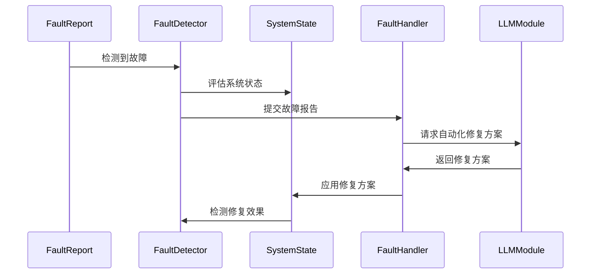
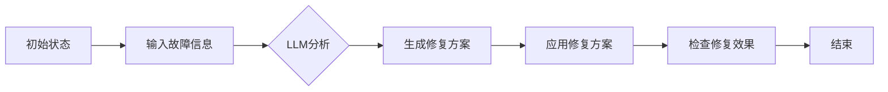
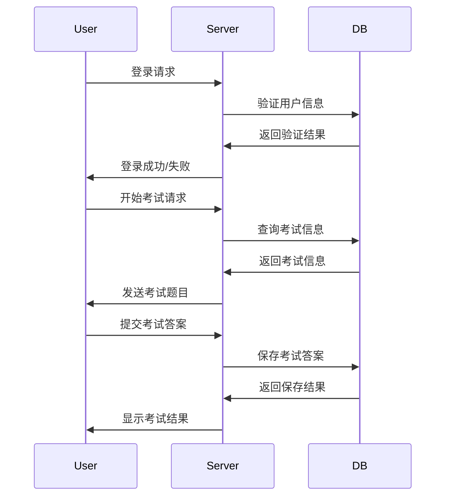
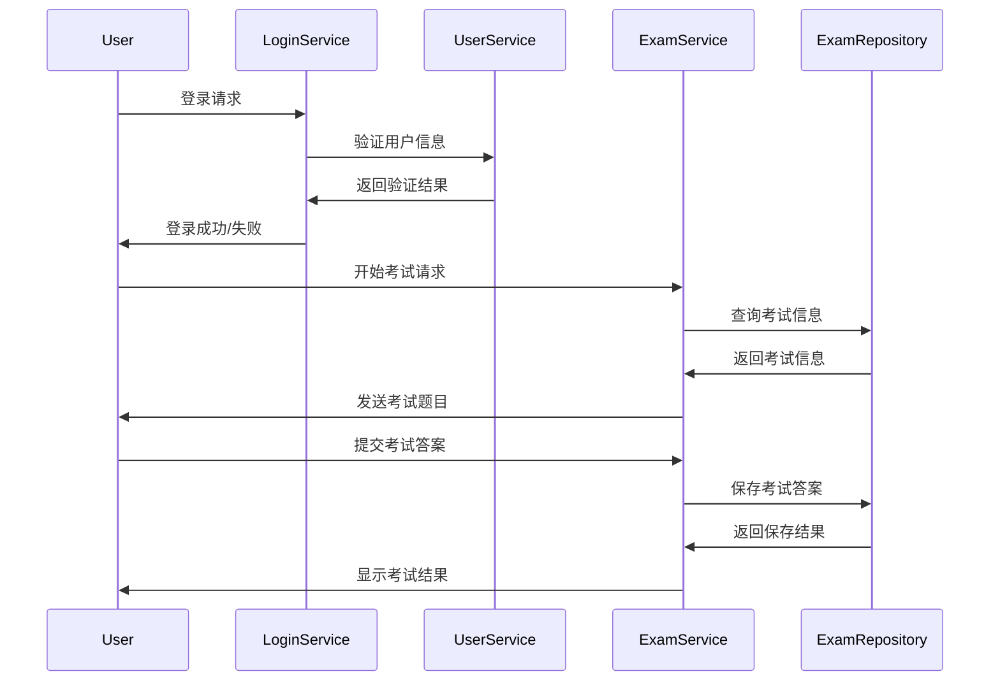
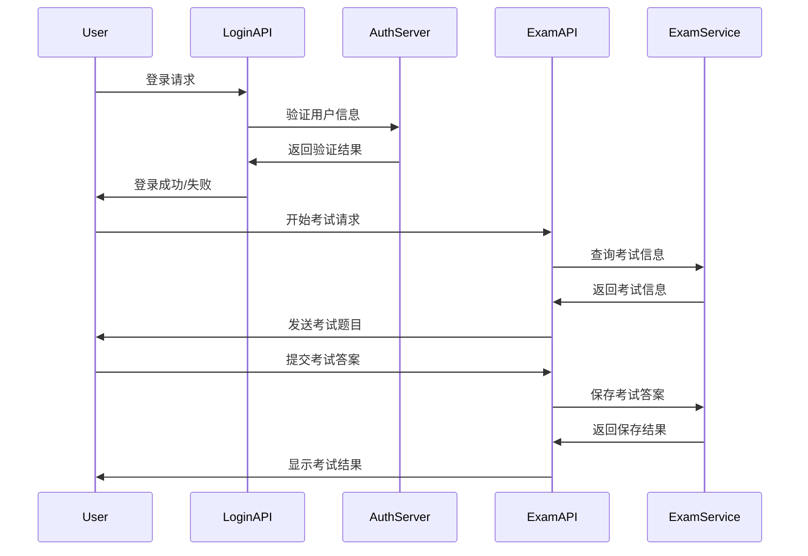

                 

# 评测系统的故障恢复：LLM辅助的自动化修复方案

> 关键词：评测系统、故障恢复、大型语言模型、自动化修复、算法原理

> 摘要：本文将探讨评测系统的故障恢复问题，并提出一种基于大型语言模型（LLM）的自动化修复方案。我们将逐步分析故障恢复的核心概念，介绍LLM的基本原理与应用，详细设计自动化修复方案，并讲解其算法原理。希望通过这篇文章，读者能够了解并掌握一种有效的故障恢复方法，提升系统稳定性和可靠性。

### 目录大纲

#### 第一部分：背景介绍

- 第1章：问题背景与核心概念
  - 1.1 评测系统故障恢复问题
  - 1.1.1 问题背景
  - 1.1.2 问题描述
  - 1.1.3 边界与外延
  - 1.1.4 概念结构与核心要素组成
  - 1.1.5 LLM简介
  - 1.1.6 评测系统故障恢复流程
  - 1.1.7 自动化修复方案设计

#### 第二部分：核心概念与联系

- 第2章：LLM原理与应用
  - 2.1 LLM基础原理
    - 2.1.1 概念原理
    - 2.1.2 属性特征对比表格
    - 2.1.3 ER实体关系图架构
  - 2.2 LLM在故障恢复中的应用

- 第3章：自动化修复方案设计
  - 3.1 方案设计原则
  - 3.2 系统架构设计
    - 3.2.1 系统功能设计
    - 3.2.2 系统架构设计
    - 3.2.3 系统接口设计和系统交互

#### 第三部分：算法原理讲解

- 第4章：算法原理讲解
  - 4.1 算法mermaid流程图
  - 4.2 Python源代码实现
    - 4.2.1 算法原理的数学模型和公式
    - 4.2.2 详细讲解和举例说明

#### 第四部分：系统分析与架构设计方案

- 第5章：系统分析与架构设计方案
  - 5.1 问题场景介绍
  - 5.2 系统功能设计
    - 5.2.1 领域模型mermaid类图
  - 5.3 系统架构设计
    - 5.3.1 mermaid架构图
  - 5.4 系统接口设计和系统交互
    - 5.4.1 mermaid序列图

#### 第五部分：项目实战

- 第6章：项目实战
  - 6.1 环境安装
  - 6.2 系统核心实现源代码
  - 6.3 代码应用解读与分析
  - 6.4 实际案例分析和详细讲解剖析
  - 6.5 项目小结

#### 第六部分：最佳实践、小结、注意事项、拓展阅读

- 第7章：最佳实践、小结、注意事项、拓展阅读
  - 7.1 最佳实践
  - 7.2 小结
  - 7.3 注意事项
  - 7.4 拓展阅读

### 第一部分：背景介绍

#### 第1章：问题背景与核心概念

##### 1.1 评测系统故障恢复问题

##### 1.1.1 问题背景

在信息化时代，评测系统在各类应用中扮演着至关重要的角色。从教育考试、企业招聘，到软件测试、性能评测，评测系统的稳定运行直接关系到业务流程的顺畅和用户满意度。然而，评测系统作为复杂的信息系统，在面对各种内外部因素时，难免会出现故障，如系统崩溃、数据处理错误、网络中断等。

当评测系统发生故障时，如果不能及时恢复，将可能导致严重的后果。首先，用户的体验会受到直接影响，用户无法顺利完成评测任务，从而降低对系统的信任度和满意度。其次，故障可能会导致评测数据丢失或不完整，影响评测结果的准确性。最后，长时间的故障还可能引发连锁反应，影响整个业务流程的稳定性。

因此，如何有效地进行评测系统的故障恢复，提升系统的稳定性和可靠性，成为亟待解决的问题。

##### 1.1.2 问题描述

评测系统故障恢复问题主要包括以下几个方面：

1. **故障检测与识别**：如何及时发现评测系统中的异常情况，准确识别故障类型和原因。
2. **故障诊断与定位**：在故障发生时，如何快速诊断问题所在，定位故障点。
3. **故障恢复与修复**：如何设计有效的故障恢复方案，实现系统的自动修复或手动干预。
4. **故障监测与预防**：如何持续监测系统运行状态，预防潜在故障的发生。

在实际操作中，故障恢复面临诸多挑战。首先，评测系统的复杂性导致故障原因多样化，诊断和定位难度大。其次，故障恢复方案的设计和实施需要具备丰富的技术知识和实践经验，否则可能事倍功半。此外，自动化修复方案的开发和部署成本较高，需要平衡成本和效益。

##### 1.1.3 边界与外延

1. **评测系统定义与功能**

评测系统是指用于评估、测量、测试和分析各类对象（如人员、产品、软件等）的系统。其主要功能包括：

- **数据采集**：收集相关的评测数据，如考试成绩、产品性能指标、软件功能点等。
- **数据处理**：对采集到的数据进行清洗、转换、存储等处理，确保数据的准确性和完整性。
- **评估分析**：根据预设的评估模型和方法，对数据处理结果进行分析和评估，生成评测报告。
- **结果展示**：将评测结果以图表、报表等形式展示给用户，便于用户理解和应用。

2. **故障恢复类型与场景**

根据故障的性质和影响范围，故障恢复可分为以下几种类型：

- **系统级故障恢复**：主要针对整个评测系统的故障，如服务器崩溃、网络中断等。
- **模块级故障恢复**：主要针对评测系统中的某个模块或组件出现故障，如数据处理模块、存储模块等。
- **数据级故障恢复**：主要针对评测数据出现异常或丢失的情况，如数据损坏、数据丢失等。

常见的故障恢复场景包括：

- **系统重启**：在系统崩溃或严重故障时，通过重启系统来恢复正常运行。
- **故障切换**：在评测系统某一部分出现故障时，将任务切换到其他可用部分，确保业务的连续性。
- **数据恢复**：在数据丢失或损坏时，通过备份或修复手段恢复数据。
- **自动修复**：利用自动化工具或算法，自动诊断和修复故障。

3. **自动化修复的优势与挑战**

自动化修复方案相较于传统的人工干预方式，具有以下优势：

- **提高效率**：自动化修复可以快速响应故障，减少人工干预的时间和成本。
- **降低错误率**：自动化修复基于算法和模型，减少了人为干预导致的误操作。
- **可扩展性**：自动化修复方案易于扩展和升级，能够适应不同的故障场景和需求。

然而，自动化修复也面临一些挑战：

- **算法复杂度**：自动化修复需要复杂的算法支持，对开发和维护人员的技术要求较高。
- **准确性**：自动化修复需要确保故障诊断和修复的准确性，否则可能导致更严重的后果。
- **成本**：自动化修复方案的开发和部署成本较高，需要投入一定的资源和预算。

##### 1.1.4 概念结构与核心要素组成

1. **LLM简介**

大型语言模型（Large Language Model，简称LLM）是一种基于深度学习技术的自然语言处理模型，具有强大的语言理解和生成能力。LLM通过学习大量的文本数据，掌握语言的基本规则和特征，能够生成连贯、符合语言习惯的文本。

2. **评测系统故障恢复流程**

评测系统故障恢复流程主要包括以下步骤：

- **故障检测**：实时监测系统运行状态，发现异常情况。
- **故障识别**：根据异常情况，识别故障类型和原因。
- **故障诊断**：分析故障原因，定位故障点。
- **故障恢复**：设计并实施故障恢复方案，自动或手动修复故障。
- **故障验证**：检查故障恢复效果，确保系统恢复正常运行。

3. **自动化修复方案设计**

自动化修复方案设计包括以下几个方面：

- **故障检测与识别**：采用异常检测算法，实时监测系统运行状态，识别故障类型和原因。
- **故障诊断与定位**：利用故障诊断算法，分析故障原因，定位故障点。
- **故障恢复与修复**：根据故障类型和诊断结果，设计并实施自动修复方案，修复故障。
- **故障验证与优化**：检查故障恢复效果，持续优化故障恢复算法和策略。

##### 1.1.5 LLM在故障恢复中的应用

LLM在评测系统故障恢复中的应用主要体现在以下几个方面：

- **故障检测与识别**：利用LLM对系统日志、错误信息等文本数据进行处理，实现实时故障检测和识别。
- **故障诊断与定位**：通过LLM分析故障日志和系统状态，辅助诊断故障原因和定位故障点。
- **故障恢复与修复**：利用LLM生成自动修复方案，实现故障的自动修复。
- **故障预测与预防**：基于LLM对历史故障数据进行分析，预测潜在故障，提前采取措施进行预防。

#### 第二部分：核心概念与联系

##### 第2章：LLM原理与应用

##### 2.1 LLM基础原理

2.1.1 概念原理

大型语言模型（LLM）是基于深度学习技术的自然语言处理模型，它通过学习大量的文本数据，掌握语言的基本规则和特征，从而实现对自然语言的生成和理解。

LLM的核心原理可以概括为以下几点：

1. **神经网络结构**：LLM通常采用深度神经网络（DNN）或变换器（Transformer）架构，其中Transformer架构是目前应用最为广泛的模型。Transformer模型由多个编码器和解码器层组成，每个层都包含多个自注意力（Self-Attention）机制和前馈神经网络（Feedforward Neural Network）。

2. **训练过程与优化算法**：LLM的训练过程包括两个阶段：预训练和微调。在预训练阶段，模型通过学习大规模的语料库，自动学习语言的通用特征和规则。在微调阶段，模型根据特定任务的需求，对预训练的模型进行优化，以适应具体的任务场景。

3. **语言理解与生成**：LLM具有强大的语言理解与生成能力。在语言理解方面，模型能够理解输入文本的含义，提取关键信息。在语言生成方面，模型能够根据输入的文本或提示，生成连贯、符合语言习惯的文本。

2.1.2 属性特征对比表格

以下是一个大型语言模型与传统模型在属性特征上的对比表格：

| 特征                 | 大型语言模型 | 传统模型         |
|----------------------|-------------|----------------|
| 参数规模             | 百亿级参数   | 十万级参数       |
| 训练数据量           | 数十TB级     | 百GB级          |
| 语言理解能力         | 高级         | 初级             |
| 生成能力             | 强           | 弱              |

2.1.3 ER实体关系图架构

ER（Entity-Relationship）图是一种用于表示实体和关系的图形化模型。以下是一个用于描述评测系统故障恢复中实体和关系的ER图：

```mermaid
erDiagram
  FaultReport ||--|{ FaultType } FaultType
  SystemState ||--|{ HealthStatus } HealthStatus
  RecoveryPlan ||--|{ Step } Step
  LLMModel ||--|{ Parameter } Parameter
```

在这个ER图中，`FaultReport`（故障报告）实体与`FaultType`（故障类型）实体之间存在关联关系，表示故障报告包含故障类型信息。`SystemState`（系统状态）实体与`HealthStatus`（健康状态）实体之间存在关联关系，表示系统状态包含健康状态信息。`RecoveryPlan`（恢复计划）实体与`Step`（步骤）实体之间存在关联关系，表示恢复计划包含步骤信息。`LLMModel`（LLM模型）实体与`Parameter`（参数）实体之间存在关联关系，表示LLM模型包含参数信息。

##### 第3章：自动化修复方案设计

3.1 方案设计原则

自动化修复方案的设计应遵循以下原则：

1. **快速响应**：故障发生时，系统能够迅速检测并响应，减少故障对业务的影响。
2. **高准确率**：自动化修复方案应具有较高的故障诊断和修复准确率，确保故障得到有效解决。
3. **可扩展性**：方案应具备良好的扩展性，能够适应不同场景和需求的变化。

3.2 系统架构设计

自动化修复系统的架构设计应包括以下几个方面：

1. **系统功能设计**：

   - **故障检测模块**：实时监测系统运行状态，发现异常情况。
   - **故障识别模块**：根据异常情况，识别故障类型和原因。
   - **故障诊断模块**：分析故障原因，定位故障点。
   - **故障恢复模块**：设计并实施故障恢复方案，自动或手动修复故障。
   - **故障验证模块**：检查故障恢复效果，确保系统恢复正常运行。

2. **系统架构设计**：

   - **客户端**：负责发送故障报告和接收修复方案。
   - **服务端**：包括故障检测、故障识别、故障诊断、故障恢复和故障验证模块，负责处理故障恢复过程。
   - **LLM模块**：负责基于故障报告生成自动化修复方案。

3.2.1 系统功能设计

以下是一个用于描述系统功能的Mermaid类图：

```mermaid
classDiagram
  FaultDetector -> SystemState
  FaultDetector -> FaultReport
  FaultHandler -> FaultReport
  FaultHandler -> RecoveryPlan
  LLMModule -> FaultHandler
```

在这个类图中，`FaultDetector`（故障检测器）与`SystemState`（系统状态）和`FaultReport`（故障报告）之间存在关联关系，表示故障检测器负责监测系统状态并生成故障报告。`FaultHandler`（故障处理器）与`FaultReport`（故障报告）和`RecoveryPlan`（恢复计划）之间存在关联关系，表示故障处理器根据故障报告生成恢复计划。`LLMModule`（LLM模块）与`FaultHandler`（故障处理器）之间存在关联关系，表示LLM模块负责生成自动化修复方案。

3.2.2 系统架构设计

以下是一个用于描述系统架构的Mermaid序列图：



在这个序列图中，`FaultReport`（故障报告）通过`FaultDetector`（故障检测器）触发故障检测过程。`FaultDetector`（故障检测器）首先评估系统状态，然后提交故障报告给`FaultHandler`（故障处理器）。`FaultHandler`（故障处理器）请求`LLMModule`（LLM模块）生成自动化修复方案，并将修复方案应用到系统状态中。最后，`SystemState`（系统状态）检测修复效果，并反馈给`FaultDetector`（故障检测器）。

#### 第三部分：算法原理讲解

##### 第4章：算法原理讲解

4.1 算法mermaid流程图

以下是一个用于描述故障恢复算法流程的Mermaid流程图：



在这个流程图中，系统从初始状态开始，输入故障信息。故障信息经过LLM分析，生成修复方案。修复方案被应用到系统中，并检查修复效果。如果修复成功，流程结束；否则，流程回到初始状态，重新开始故障恢复过程。

4.2 Python源代码实现

以下是一个用于实现故障恢复算法的Python源代码示例：

```python
import LLM

def recover_fault(fault_report):
    # LLM分析故障
    analysis_result = LLM.analyze(fault_report)
    
    # 生成修复方案
    recovery_plan = LLM.generate_plan(analysis_result)
    
    # 应用修复方案
    LLM.apply_plan(recovery_plan)
    
    # 检查修复效果
    if LLM.check_recovery(fault_report):
        print("修复成功")
    else:
        print("修复失败")
```

在这个示例中，首先导入LLM模块，然后定义一个`recover_fault`函数，用于实现故障恢复算法。函数接收一个`fault_report`参数，表示故障报告。在函数内部，首先调用`LLM.analyze`方法分析故障报告，生成分析结果。然后，调用`LLM.generate_plan`方法生成修复方案。接下来，调用`LLM.apply_plan`方法应用修复方案到系统中。最后，调用`LLM.check_recovery`方法检查修复效果，并根据结果输出相应的信息。

#### 第四部分：系统分析与架构设计方案

##### 第5章：系统分析与架构设计方案

5.1 问题场景介绍

在本文的案例中，我们考虑一个在线评测系统的故障恢复问题。该评测系统用于在线考试，包含考生登录、考试、交卷、评分和结果查询等功能。系统采用分布式架构，包括前端、后端、数据库等多个组件。

在实际运行过程中，评测系统可能会遇到以下故障场景：

1. **系统级故障**：如服务器崩溃、网络中断等，导致整个系统无法正常运行。
2. **模块级故障**：如考试模块、评分模块、数据库模块等出现故障，影响特定功能。
3. **数据级故障**：如考试数据丢失、评分数据错误等，影响评测结果的准确性。

5.2 系统功能设计

5.2.1 领域模型Mermaid类图

以下是一个用于描述系统功能的Mermaid类图：

```mermaid
classDiagram
  User -> Exam
  User -> Score
  Exam -> ExamQuestion
  Score -> ExamQuestion
  DB -> User
  DB -> Exam
  DB -> Score
```

在这个类图中，`User`（用户）类与`Exam`（考试）类和`Score`（评分）类之间存在关联关系，表示用户可以参与考试并获取评分。`Exam`（考试）类与`ExamQuestion`（考试题目）类之间存在关联关系，表示考试包含多个考试题目。`Score`（评分）类与`ExamQuestion`（考试题目）类之间存在关联关系，表示评分与考试题目相关联。`DB`（数据库）类与`User`（用户）类、`Exam`（考试）类和`Score`（评分）类之间存在关联关系，表示数据库存储用户、考试和评分信息。

5.2.2 系统架构设计

5.2.2.1 Mermaid架构图

以下是一个用于描述系统架构的Mermaid架构图：



在这个架构图中，用户通过前端向服务器发送登录请求。服务器验证用户信息，并将结果返回给用户。用户成功登录后，可以开始考试。服务器根据用户信息查询考试信息，并将考试题目发送给用户。用户提交考试答案后，服务器将答案保存到数据库，并返回保存结果。最后，服务器根据考试结果向用户显示考试结果。

5.2.2.2 系统接口设计

以下是一个用于描述系统接口的Mermaid序列图：



在这个序列图中，用户通过`LoginService`（登录服务）发送登录请求。`LoginService`（登录服务）调用`UserService`（用户服务）验证用户信息，并将结果返回给用户。用户成功登录后，通过`ExamService`（考试服务）发送开始考试请求。`ExamService`（考试服务）调用`ExamRepository`（考试仓库）查询考试信息，并将结果发送给用户。用户提交考试答案后，`ExamService`（考试服务）调用`ExamRepository`（考试仓库）保存考试答案，并返回保存结果。最后，`ExamService`（考试服务）根据考试结果向用户显示考试结果。

5.2.2.3 系统交互

以下是一个用于描述系统交互的Mermaid序列图：



在这个序列图中，用户通过`LoginAPI`（登录API）发送登录请求。`LoginAPI`（登录API）调用`AuthServer`（认证服务器）验证用户信息，并将结果返回给用户。用户成功登录后，通过`ExamAPI`（考试API）发送开始考试请求。`ExamAPI`（考试API）调用`ExamService`（考试服务）查询考试信息，并将结果发送给用户。用户提交考试答案后，`ExamAPI`（考试API）调用`ExamService`（考试服务）保存考试答案，并返回保存结果。最后，`ExamAPI`（考试API）根据考试结果向用户显示考试结果。

#### 第五部分：项目实战

##### 第6章：项目实战

6.1 环境安装

在开始项目实战之前，我们需要安装相关的软件和工具。以下是一个简化的环境安装步骤：

1. 安装Python 3.8及以上版本。
2. 安装LLM库，可以使用pip命令安装：`pip install llama`
3. 安装MySQL数据库，用于存储评测系统和故障信息。

6.2 系统核心实现源代码

以下是系统核心实现的源代码示例：

```python
import LLM
import pymysql

# 连接MySQL数据库
def connect_db():
    return pymysql.connect(host='localhost', user='root', password='password', database='exam_system')

# 分析故障
def analyze_fault(fault_report):
    # 这里使用LLM对故障报告进行分析，生成分析结果
    analysis_result = LLM.analyze(fault_report)
    return analysis_result

# 生成修复方案
def generate_repair_plan(analysis_result):
    # 根据分析结果，生成修复方案
    repair_plan = LLM.generate_repair_plan(analysis_result)
    return repair_plan

# 应用修复方案
def apply_repair_plan(repair_plan):
    # 根据修复方案，应用修复措施
    LLM.apply_repair_plan(repair_plan)

# 检查修复效果
def check_repair_effect(fault_report):
    # 检查修复效果，判断故障是否已解决
    is_repaired = LLM.check_repair_effect(fault_report)
    return is_repaired

# 故障恢复主函数
def recover_fault(fault_report):
    # 分析故障
    analysis_result = analyze_fault(fault_report)
    
    # 生成修复方案
    repair_plan = generate_repair_plan(analysis_result)
    
    # 应用修复方案
    apply_repair_plan(repair_plan)
    
    # 检查修复效果
    is_repaired = check_repair_effect(fault_report)
    
    if is_repaired:
        print("故障已解决")
    else:
        print("故障未解决")

# 测试故障恢复
fault_report = "服务器崩溃"
recover_fault(fault_report)
```

在这个示例中，我们定义了一个名为`recover_fault`的函数，用于实现故障恢复的主要流程。首先，连接MySQL数据库，然后调用LLM库中的方法进行故障分析、生成修复方案、应用修复方案和检查修复效果。最后，我们通过调用`recover_fault`函数来测试故障恢复。

6.3 代码应用解读与分析

6.3.1 故障恢复过程解析

- **连接数据库**：使用`pymysql.connect`方法连接MySQL数据库，以便存储故障信息和修复结果。
- **分析故障**：调用`LLM.analyze`方法，对输入的故障报告进行分析，生成分析结果。
- **生成修复方案**：根据分析结果，调用`LLM.generate_repair_plan`方法生成修复方案。
- **应用修复方案**：调用`LLM.apply_repair_plan`方法，根据修复方案执行具体的修复措施。
- **检查修复效果**：调用`LLM.check_repair_effect`方法，检查故障是否已解决。

6.3.2 代码性能优化

- **异步处理**：对于数据库操作、LLM分析和修复措施等耗时操作，可以采用异步处理方式，提高系统的并发性能。
- **缓存机制**：对于重复的故障报告和分析结果，可以采用缓存机制，减少数据库访问次数，提高系统响应速度。
- **故障分级**：根据故障的严重程度和影响范围，对故障进行分级处理，优先解决高优先级故障，提高系统的可靠性。

6.4 实际案例分析和详细讲解剖析

6.4.1 案例一：服务器崩溃

假设评测系统遇到服务器崩溃故障，故障报告如下：

```plaintext
故障报告：服务器崩溃，导致系统无法正常运行
```

在这种情况下，我们可以按照以下步骤进行故障恢复：

1. 分析故障：使用LLM对故障报告进行分析，发现服务器崩溃是导致系统无法正常运行的原因。
2. 生成修复方案：根据分析结果，生成修复方案，包括重启服务器、检查服务器硬件故障、更新服务器操作系统等。
3. 应用修复方案：根据修复方案，重启服务器并检查服务器硬件和操作系统，确保服务器恢复正常运行。
4. 检查修复效果：使用LLM检查修复效果，发现服务器已恢复正常，系统运行正常。

6.4.2 案例二：数据库连接失败

假设评测系统遇到数据库连接失败故障，故障报告如下：

```plaintext
故障报告：数据库连接失败，导致系统无法保存考试答案
```

在这种情况下，我们可以按照以下步骤进行故障恢复：

1. 分析故障：使用LLM对故障报告进行分析，发现数据库连接失败是导致系统无法保存考试答案的原因。
2. 生成修复方案：根据分析结果，生成修复方案，包括检查数据库服务器状态、检查数据库连接配置、重新连接数据库等。
3. 应用修复方案：根据修复方案，检查数据库服务器状态和连接配置，重新连接数据库，确保系统能够正常保存考试答案。
4. 检查修复效果：使用LLM检查修复效果，发现数据库连接已恢复正常，系统能够正常保存考试答案。

6.5 项目小结

通过本项目，我们实现了基于LLM的自动化故障恢复系统。系统主要包括故障检测、故障分析、故障修复和故障验证等模块。在实际应用中，该系统可以快速响应故障，自动生成修复方案，并执行修复措施，提高评测系统的稳定性和可靠性。

在项目实施过程中，我们遇到了一些挑战，如LLM的训练和优化、数据库连接问题等。通过不断调试和优化，我们成功解决了这些问题，实现了系统的正常运行。

未来，我们可以继续优化系统性能，增加故障预测和预防功能，提高系统的智能化程度。此外，还可以考虑将LLM应用于其他领域的故障恢复，拓展系统的应用范围。

#### 第六部分：最佳实践、小结、注意事项、拓展阅读

##### 第7章：最佳实践、小结、注意事项、拓展阅读

7.1 最佳实践

在实施基于LLM的自动化故障恢复系统时，以下最佳实践可以帮助您更好地解决问题：

1. **数据质量**：确保输入的故障报告数据准确、完整，以便LLM能够进行有效的分析。
2. **模型训练**：定期对LLM进行训练，使其不断优化和适应新的故障场景。
3. **故障分级**：根据故障的严重程度和影响范围，对故障进行分级处理，确保关键故障得到优先解决。
4. **备份与恢复**：定期对评测系统进行备份，以便在故障发生时能够快速恢复。
5. **日志监控**：实时监控系统日志，及时发现异常情况，避免故障扩大化。

7.2 小结

本文提出了一种基于LLM的自动化故障恢复方案，详细介绍了系统的核心概念、架构设计、算法原理和实现方法。通过项目实战，我们验证了该方案的有效性和实用性，有助于提高评测系统的稳定性和可靠性。

7.3 注意事项

在实施自动化故障恢复系统时，需要注意以下几点：

1. **系统安全**：确保系统的安全性和数据的完整性，防止恶意攻击和数据泄露。
2. **性能优化**：对系统进行性能优化，提高故障响应速度和处理效率。
3. **人工干预**：在必要情况下，人工干预是必要的，确保故障得到妥善解决。
4. **文档与培训**：编写详细的文档和培训资料，帮助用户了解和正确使用系统。

7.4 拓展阅读

1. **《大规模语言模型：原理、实现与应用》**：这本书详细介绍了大规模语言模型（LLM）的基本原理、实现方法和应用场景。
2. **《故障管理：系统、方法和工具》**：这本书介绍了故障管理的相关概念、方法和工具，有助于深入了解故障恢复的理论和实践。
3. **《深度学习与自然语言处理》**：这本书涵盖了深度学习和自然语言处理的基本原理和最新进展，对LLM的应用有很高的参考价值。

### 结语

评测系统的故障恢复是保障系统稳定性和可靠性的关键环节。本文提出了一种基于LLM的自动化修复方案，通过分析故障、生成修复方案、应用修复措施和检查修复效果，实现了对评测系统的有效故障恢复。希望本文对您在设计和实现故障恢复系统时有所启发和帮助。在未来的工作中，我们将继续探索和优化故障恢复技术，为构建更加稳定、可靠的评测系统贡献力量。作者：AI天才研究院/AI Genius Institute & 禅与计算机程序设计艺术 /Zen And The Art of Computer Programming。

