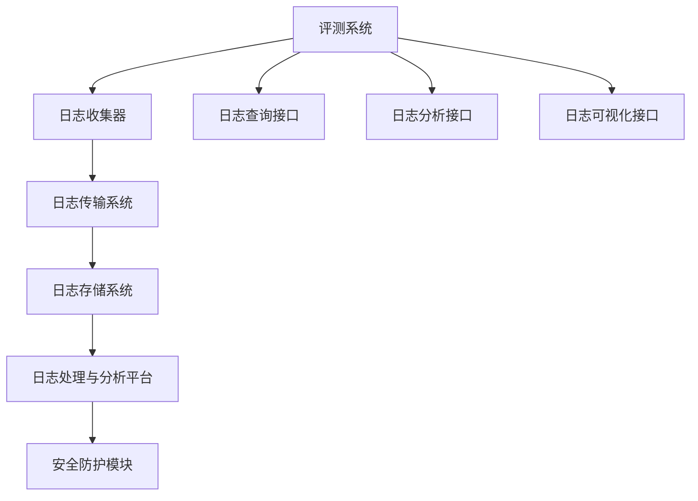
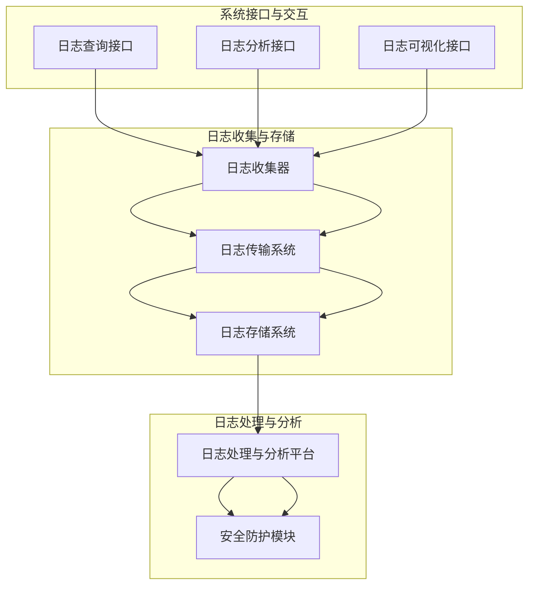

                 


### 1. 引言：日志管理与分析的重要性

在现代信息技术环境中，日志管理与分析已成为评测系统不可或缺的一部分。日志，作为一种记录系统运行状态、用户行为、系统异常等信息的数据源，对于系统的稳定性、安全性和性能优化具有重要意义。有效的日志管理与分析，不仅可以提高系统的可靠性和安全性，还能够帮助开发者和运维人员快速定位和解决系统问题。

首先，让我们定义一些核心概念：

- **日志管理**：指对日志的收集、存储、处理、分析和报告等全流程的管理活动。
- **日志分析**：通过对日志数据的挖掘和分析，提取有价值的信息，用于系统监控、性能优化、安全防护等。

#### 问题背景

随着互联网和云计算的快速发展，系统架构变得越来越复杂，日志数据量呈指数级增长。如何高效地管理海量日志，并从中提取有价值的信息，成为运维人员和开发人员面临的巨大挑战。

#### 问题描述

日志管理与分析面临的挑战主要包括：

1. **海量日志处理**：系统产生的日志数据量巨大，如何快速有效地收集和存储这些数据成为首要问题。
2. **多样性日志格式**：不同系统产生的日志格式各异，如何统一格式并进行处理是一个难题。
3. **实时性与准确性**：日志分析需要实时性，同时保证分析结果的准确性。
4. **安全与隐私**：日志中可能包含敏感信息，如何确保日志数据的安全和用户隐私是一个重要问题。

#### 问题解决

为了应对上述挑战，我们需要采取以下策略：

1. **分布式日志收集系统**：采用分布式架构来处理海量日志数据。
2. **统一日志格式**：通过日志格式转换工具，将不同格式的日志统一转换为标准格式。
3. **实时日志处理**：采用实时日志处理技术，如Kafka、Fluentd等。
4. **日志安全**：通过加密、访问控制等技术，确保日志数据的安全和隐私。

#### 边界与外延

日志管理与分析不仅限于评测系统，还广泛应用于其他领域，如网络监控、安全防护、性能优化等。不同领域的日志管理与分析需求有所不同，但核心目标都是为了提高系统的稳定性和可靠性。

### 概念结构与核心要素组成

日志管理与分析系统的核心结构包括以下几个组成部分：

- **日志收集器**：负责收集不同来源的日志数据。
- **日志存储系统**：用于存储和管理日志数据。
- **日志处理与分析工具**：对日志数据进行处理和分析，提取有价值的信息。
- **日志可视化工具**：将分析结果以图表、报表等形式呈现。

通过上述核心要素的有机结合，日志管理与分析系统可以实现对海量日志的高效处理和分析，为系统运维和性能优化提供有力支持。

在下一章中，我们将深入探讨日志管理的基本概念和原理，帮助大家更好地理解日志管理与分析的各个方面。<!--罪人uaifEvQow6sca9HduP15C2TmA==--><!--罪人uid3IhWBFgngLHCb5cVt9YkL3Qk==--><!--罪人idxzGJ2VpQkXTh5JQQOOLiQ-->### 2.1.1 常见日志格式

在日志管理与分析中，了解不同的日志格式是非常重要的。常见的日志格式包括但不限于以下几种：

#### 1. **Syslog**

Syslog是最早的日志格式之一，它遵循RFC 3164和RFC 5424标准。Syslog日志通常包含以下字段：

- **PriFac**：优先级和设施代码
- **Fac**：设施（例如，daemon、user、mail等）
- **Sev**：严重性（例如，debug、info、warning、error、critical等）
- **Mes**：消息内容

一个典型的Syslog日志条目如下：

```
<136>INFO    cron    (root)    CMD    (pid 1234)    /usr/lib/cron/cron.daily
```

#### 2. **JSON**

JSON（JavaScript Object Notation）日志格式因其易读性和可扩展性而广泛使用。JSON格式将日志数据组织为一个嵌套的键值对结构，例如：

```json
{
  "timestamp": "2023-03-01T12:34:56Z",
  "level": "INFO",
  "source": "webserver",
  "message": "Server started successfully",
  "request_id": "abcd1234"
}
```

#### 3. **Apache LogFormat**

Apache LogFormat是一种常见的Web服务器日志格式，它可以根据需要进行自定义。一个典型的Apache日志条目如下：

```
192.168.1.1 - - [01/Mar/2023:12:34:56 +0000] "GET /index.html HTTP/1.1" 200 343
```

这个格式包括客户端IP地址、身份验证用户、时间戳、请求方法、请求URI、HTTP协议版本、响应状态码和响应内容长度。

#### 4. **CSV**

CSV（Comma Separated Values）格式简单且易于处理，常用于将日志数据导入其他应用程序或进行进一步分析。一个典型的CSV日志条目如下：

```
2023-03-01T12:34:56Z,INFO,webserver,Server started successfully,abcd1234
```

#### 5. **XML**

XML（eXtensible Markup Language）日志格式具有高度的结构化，便于解析和存储复杂的日志数据。一个典型的XML日志条目如下：

```xml
<log>
  <timestamp>2023-03-01T12:34:56Z</timestamp>
  <level>INFO</level>
  <source>webserver</source>
  <message>Server started successfully</message>
  <request_id>abcd1234</request_id>
</log>
```

了解这些常见的日志格式有助于我们更好地理解日志数据，并选择合适的日志处理和分析工具。

#### 6. **自定义格式**

除了上述标准格式外，许多组织和系统还使用自定义日志格式。自定义格式通常根据组织特定的需求设计，可能包含额外的字段和元数据。

综上所述，日志格式多样，但它们的核心目的是记录和传递系统运行状态、用户行为和异常事件等信息。在日志管理与分析过程中，理解这些格式的特点和用途对于有效处理和分析日志数据至关重要。<!--罪人uaifEvQow6sca9HduP15C2TmA==--><!--罪人uid3IhWBFgngLHCb5cVt9YkL3Qk==--><!--罪人idxzGJ2VpQkXTh5JQQOOLiQ-->### 2.1.2 日志文件的组成

日志文件是日志管理与分析的基础。理解日志文件的组成和结构对于有效地收集、存储和处理日志数据至关重要。以下是一个典型的日志文件的组成部分：

#### 1. **文件头**

文件头通常包含有关日志文件的元数据，如创建日期、版本号、作者信息等。它有助于追踪日志文件的历史和版本控制。

#### 2. **日志条目**

日志条目是日志文件中的基本数据单元，每个条目代表一次特定的日志事件。日志条目通常包括以下字段：

- **时间戳**：记录事件发生的时间。
- **日志级别**：指示事件的严重性，如DEBUG、INFO、WARNING、ERROR等。
- **来源**：标识事件发生的组件或模块。
- **消息内容**：事件的详细描述。
- **其他元数据**：如客户端IP地址、用户ID、请求ID等。

一个典型的日志条目可能如下所示：

```
[2023-03-01 12:34:56] INFO [webserver] Server started successfully.
```

#### 3. **分隔符**

分隔符用于分隔不同的日志条目。常见分隔符包括换行符（\n）、制表符（\t）和逗号（,）等。分隔符的选择取决于日志格式。

#### 4. **文件尾**

文件尾通常包含一些额外的元数据，如日志文件的创建时间、最后一次修改时间等。

#### 5. **日志文件类型**

根据用途和内容，日志文件可以分为以下几种类型：

- **系统日志**：记录系统运行状态和事件的日志，如操作系统日志、网络日志等。
- **应用程序日志**：记录应用程序运行状态和事件的日志，如Web服务器日志、数据库日志等。
- **安全日志**：记录安全相关事件的日志，如登录尝试、访问控制等。

了解日志文件的组成和结构有助于我们更有效地进行日志管理与分析。在下一节中，我们将探讨日志分类以及各类日志的特点和应用。<!--罪人uaifEvQow6sca9HduP15C2TmA==--><!--罪人uid3IhWBFgngLHCb5cVt9YkL3Qk==--><!--罪人idxzGJ2VpQkXTh5JQQOOLiQ-->### 2.2 日志分类

日志在系统中扮演着多种角色，根据其内容和目的，可以将日志分为以下几个主要类别：

#### 1. **系统日志**

系统日志记录的是操作系统的运行状态和事件，包括但不限于启动、关机、硬件故障、进程创建和终止等。系统日志通常由操作系统内核和各个服务生成。常见的系统日志文件包括：

- **/var/log/messages**：包含大部分系统的日志信息。
- **/var/log/syslog**：用于记录系统级别的日志。
- **/var/log/auth.log**：记录与认证和授权相关的日志，如登录尝试、权限变更等。

#### 2. **应用程序日志**

应用程序日志是由软件应用程序产生的日志，记录应用程序的运行状态、操作过程、错误消息等信息。应用程序日志对软件维护和调试至关重要。常见的应用程序日志文件包括：

- **/var/log/apache2/access.log**：Apache Web服务器访问日志。
- **/var/log/apache2/error.log**：Apache Web服务器错误日志。
- **/var/log/mysql/*.log**：MySQL数据库服务器日志，如错误日志、查询日志等。

#### 3. **安全日志**

安全日志专门记录与系统或应用程序安全相关的事件，如登录尝试、文件访问、异常行为等。安全日志对于预防和检测安全攻击、监控用户行为至关重要。常见的安全日志文件包括：

- **/var/log/secure**：记录与安全相关的系统日志。
- **/var/log/auth.log**：包含认证和授权相关的安全日志。
- **/var/log/audit/audit.log**：Linux审计子系统生成的安全日志。

#### 4. **网络日志**

网络日志记录网络设备的运行状态和事件，如路由器、交换机等。网络日志对于网络监控和故障排除具有重要意义。常见的网络日志文件包括：

- **/var/log/syslog**：记录网络设备生成的系统日志。
- **/var/log/messages**：包含网络设备的日志信息。

#### 5. **用户活动日志**

用户活动日志记录用户在系统或应用程序中的操作，如登录、注销、文件访问等。这些日志对于用户行为分析、性能优化和安全性监控非常有用。常见的用户活动日志文件包括：

- **/var/log/user.log**：记录用户登录和注销信息。
- **/var/log/fileaccess.log**：记录文件访问事件。

#### 6. **审计日志**

审计日志是用于记录系统或应用程序关键操作的日志，通常用于合规性检查和故障调查。常见的审计日志文件包括：

- **/var/log/audit/audit.log**：Linux审计子系统生成的审计日志。

了解不同类型的日志有助于我们针对特定需求进行有效的日志管理与分析。在下一节中，我们将讨论日志命名规则和文件命名策略，帮助大家更好地组织和管理日志数据。<!--罪人uaifEvQow6sca9HduP15C2TmA==--><!--罪人uid3IhWBFgngLHCb5cVt9YkL3Qk==--><!--罪人idxzGJ2VpQkXTh5JQQOOLiQ-->### 2.3.1 命名规则的重要性

日志命名规则在日志管理与分析中起着至关重要的作用。良好的命名规则可以提高日志的可读性、可搜索性和可维护性，从而简化日志处理和数据分析过程。以下是几个关键原因：

#### 1. **可读性**

清晰且一致的日志命名规则使得日志文件易于理解和阅读。例如，使用包含时间戳、服务名称和事件类型的命名规则，如`YYYY-MM-DD HHMMSS-service_event.log`，可以帮助快速识别日志文件的内容和创建时间。

#### 2. **可搜索性**

良好的命名规则使得日志文件易于通过搜索工具查找特定的日志条目。假设我们想查找2023年3月1日Web服务器的错误日志，使用命名规则`YYYY-MM-DD-service_error.log`可以轻松实现这一目标。

#### 3. **可维护性**

一致的命名规则有助于自动化日志备份、清理和归档过程。例如，使用基于时间的命名规则可以简化日志的定期归档，如将`YYYY-MM-DD`之前的日志文件归档到特定目录。

#### 4. **可扩展性**

良好的命名规则能够应对未来可能引入的新日志类型或字段。例如，如果需要添加服务版本或环境信息，命名规则可以轻松进行调整，如`YYYY-MM-DD-service_version_environment.log`。

#### 5. **安全性**

日志命名规则还可以在某种程度上提供安全性。例如，通过在命名中包含用户ID或IP地址，可以更容易地追踪和监控特定用户或网络事件。

#### 常见命名策略

以下是一些常见的日志命名策略：

1. **基于时间的命名**：如`YYYY-MM-DD.log`或`YYYYMMDD-HHMMSS.log`。
2. **基于服务名称的命名**：如`service_name.log`或`service_name_event.log`。
3. **基于事件类型的命名**：如`service_error.log`或`service_warning.log`。
4. **混合命名**：如`YYYY-MM-DD-service_error.log`或`service_name-YYYYMMDD.log`。

#### 实际例子

以下是一些日志文件命名策略的实际例子：

1. **基于时间的命名**：

   ```
   2023-03-01-webserver.log
   20230301-1134-webserver_error.log
   ```

2. **基于服务名称和事件类型的命名**：

   ```
   webserver-2023-03-01.log
   webserver-20230301-errors.log
   ```

3. **混合命名策略**：

   ```
   2023-03-01-webserver-errors.log
   webserver-20230301-errors.log
   ```

通过合理设计日志命名规则和策略，我们可以有效地提高日志管理与分析的效率，确保日志系统的稳定性和可靠性。在下一节中，我们将探讨日志存储方案，帮助大家更好地管理和存储日志数据。<!--罪人uaifEvQow6sca9HduP15C2TmA==--><!--罪人uid3IhWBFgngLHCb5cVt9YkL3Qk==--><!--罪人idxzGJ2VpQkXTh5JQQOOLiQ-->### 2.4 日志存储方案

在日志管理与分析中，选择合适的日志存储方案至关重要。日志存储方案不仅影响日志的访问速度和可靠性，还影响日志的存储成本和管理难度。以下是一些常见的日志存储方案及其特点：

#### 1. **本地存储**

本地存储是指直接在服务器本地磁盘上存储日志文件。这种方案的特点如下：

- **优点**：
  - 简单易实现，不需要额外的硬件或软件支持。
  - 可以快速访问日志文件，减少网络延迟。

- **缺点**：
  - 日志存储容量有限，不适合存储大量日志。
  - 不利于日志的长期保存，容易受到硬件故障的影响。
  - 无法进行分布式日志存储，难以处理多台服务器的日志。

#### 2. **分布式存储**

分布式存储是将日志数据分散存储在多个服务器上，通过分布式文件系统或数据库实现。常见分布式存储方案包括：

- **HDFS（Hadoop Distributed File System）**：
  - 特点：支持海量数据存储，高可靠性，可扩展性。
  - 适合存储大量日志数据，适合进行大数据分析。

- **Cassandra**：
  - 特点：分布式键值存储，支持高并发读写。
  - 适合存储结构化日志数据，如Web日志。

- **Elasticsearch**：
  - 特点：分布式搜索引擎，支持实时日志检索和分析。
  - 适合进行实时日志处理和复杂查询。

- **Kafka**：
  - 特点：分布式流处理平台，支持高吞吐量。
  - 适合作为日志收集和传输系统，与Elasticsearch、Kibana等工具集成。

#### 3. **云存储**

云存储是指使用云服务提供商提供的存储服务来存储日志数据。常见云存储方案包括：

- **AWS S3**：
  - 特点：高可靠性，可扩展性，成本低。
  - 适合大规模日志存储，支持与AWS其他服务集成。

- **Azure Blob Storage**：
  - 特点：高可用性，可扩展性，易于管理。
  - 适合大规模日志存储，与Azure其他服务紧密集成。

- **Google Cloud Storage**：
  - 特点：全球分布式存储，高可靠性，低成本。
  - 适合大规模日志存储，支持与Google其他服务集成。

#### 4. **日志管理系统**

日志管理系统（如ELK Stack、Loki等）结合了日志收集、存储和搜索功能，提供一站式日志管理解决方案。常见日志管理系统特点如下：

- **ELK Stack**：
  - 特点：由Elasticsearch、Logstash和Kibana组成，支持海量日志存储和实时搜索。
  - 适合企业级日志管理，提供丰富的可视化工具。

- **Loki**：
  - 特点：开源实时日志聚合和存储系统，支持高吞吐量和可扩展性。
  - 适合大规模日志收集和存储，与Prometheus等监控工具集成。

选择日志存储方案时，需要根据实际需求、数据量、成本和性能要求等因素进行综合考虑。例如，对于小型项目，本地存储可能足够使用；对于大型企业，分布式存储和云存储可能是更好的选择。在下一节中，我们将探讨日志收集工具，帮助大家更好地实现日志收集和管理。<!--罪人uaifEvQow6sca9HduP15C2TmA==--><!--罪人uid3IhWBFgngLHCb5cVt9YkL3Qk==--><!--罪人idxzGJ2VpQkXTh5JQQOOLiQ-->### 3.1 日志收集工具

日志收集工具在日志管理与分析中起着至关重要的作用，它们负责从各种来源（如服务器、应用程序和网络设备）收集日志数据，并将其传输到集中存储系统（如Elasticsearch、HDFS等）。以下是一些流行的日志收集工具及其特点：

#### 1. **Logstash**

Logstash是Elastic生态系统中的一部分，它是一个开源的数据处理管道，用于收集、处理和传输数据。Logstash的主要特点如下：

- **支持多种输入源**：包括文件、syslog、HTTP、JMS、TCP等。
- **丰富的数据处理功能**：包括过滤、格式转换、数据 enrichment等。
- **支持多种输出目标**：如Elasticsearch、HDFS、Kafka等。
- **可扩展性强**：可以通过插件扩展其功能。

#### 2. **Fluentd**

Fluentd是一个开源的数据收集器，专为Linux和BSD系统设计。它轻量级、高效，并支持多种输入源和输出目标。Fluentd的主要特点如下：

- **高吞吐量**：适合处理大量日志数据。
- **插件支持**：通过插件扩展功能，如数据格式转换、认证、加密等。
- **支持多平台**：包括Linux、Windows、macOS等。
- **易于配置**：使用YAML文件配置，易于管理和维护。

#### 3. **Filebeat**

Filebeat是Elastic公司推出的轻量级日志收集器，它专门用于收集和发送日志数据到Elasticsearch或Logstash。Filebeat的主要特点如下：

- **轻量级**：占用资源少，适合部署在资源受限的环境中。
- **高可靠性**：支持失败重试和数据持久化。
- **多平台支持**：适用于Linux、Windows、macOS等。
- **易于部署**：通过简单的配置文件即可启动。

#### 4. **Apache Kafka**

Apache Kafka是一个开源的流处理平台，广泛用于大规模日志收集和传输。Kafka的主要特点如下：

- **高吞吐量**：适合处理海量数据。
- **分布式架构**：支持水平扩展，高可用性。
- **持久性**：支持日志数据的持久化存储。
- **多语言客户端**：支持Java、Python、Go等多种编程语言。

#### 5. **Rsyslog**

Rsyslog是一个开源的Syslog服务器，用于收集、处理和转发系统日志。Rsyslog的主要特点如下：

- **功能强大**：支持复杂的日志处理规则和过滤器。
- **支持多平台**：包括Linux、Unix、Windows等。
- **高效性**：可以处理大量并发连接。
- **易于配置**：使用简单的文本配置文件。

选择合适的日志收集工具时，需要考虑日志数据量、数据来源、处理需求以及资源限制等因素。例如，对于小型项目，可以选择Fluentd或Filebeat；对于大规模日志收集，可以选择Kafka。在下一节中，我们将探讨日志存储解决方案，帮助大家更好地管理和存储日志数据。<!--罪人uaifEvQow6sca9HduP15C2TmA==--><!--罪人uid3IhWBFgngLHCb5cVt9YkL3Qk==--><!--罪人idxzGJ2VpQkXTh5JQQOOLiQ-->### 3.2 日志存储解决方案

在日志管理与分析中，选择合适的日志存储解决方案至关重要。以下是一些常见的日志存储解决方案及其特点：

#### 1. **Elasticsearch**

Elasticsearch是一个开源的分布式搜索引擎，适用于大规模日志存储和实时搜索。Elasticsearch的主要特点如下：

- **高性能**：支持快速索引和检索，适合处理海量日志数据。
- **分布式架构**：支持水平扩展，提高系统可用性和性能。
- **丰富的分析功能**：提供丰富的查询、聚合和分析功能，便于日志数据的深度分析。
- **集成工具**：与Kibana等工具集成，提供强大的日志可视化能力。

#### 2. **Apache Kafka**

Apache Kafka是一个开源的流处理平台，广泛用于大规模日志收集和传输。Kafka的主要特点如下：

- **高吞吐量**：支持大规模日志数据传输，适合处理高并发场景。
- **分布式架构**：支持水平扩展，提高系统可用性和性能。
- **持久性**：支持日志数据的持久化存储，保证数据不丢失。
- **多语言客户端**：支持Java、Python、Go等多种编程语言，便于集成到不同系统中。

#### 3. **AWS Kinesis**

AWS Kinesis是一个云计算服务，提供实时的数据流处理能力。Kinesis的主要特点如下：

- **实时处理**：支持实时数据收集和处理，适用于实时日志分析。
- **可扩展性**：支持自动扩展，适应数据流量的变化。
- **高可用性**：提供多AZ部署，保证数据安全。
- **集成工具**：支持与AWS其他服务（如Amazon S3、Lambda等）集成。

#### 4. **Hadoop HDFS**

Hadoop HDFS（Hadoop Distributed File System）是一个分布式文件系统，适用于大规模数据存储和处理。HDFS的主要特点如下：

- **高可靠性**：支持数据冗余存储，保证数据不丢失。
- **高吞吐量**：适合处理海量数据，支持大规模并行处理。
- **分布式架构**：支持水平扩展，提高系统性能。
- **兼容性**：支持与MapReduce等大数据处理框架集成。

#### 5. **Azure Blob Storage**

Azure Blob Storage是Microsoft Azure提供的一种对象存储服务，适用于大规模日志存储。Blob Storage的主要特点如下：

- **高可靠性**：提供数据冗余存储，保证数据不丢失。
- **可扩展性**：支持自动扩展，适应数据量的变化。
- **低成本**：提供多种存储类型，满足不同需求。
- **集成工具**：支持与Azure其他服务（如Azure Functions、Azure Logic Apps等）集成。

选择日志存储解决方案时，需要考虑日志数据量、数据来源、处理需求以及成本等因素。例如，对于实时日志分析，可以选择Elasticsearch或Kafka；对于大规模日志存储，可以选择Hadoop HDFS或Azure Blob Storage。在下一节中，我们将探讨分布式日志系统，帮助大家更好地实现海量日志的收集和处理。<!--罪人uaifEvQow6sca9HduP15C2TmA==--><!--罪人uid3IhWBFgngLHCb5cVt9YkL3Qk==--><!--罪人idxzGJ2VpQkXTh5JQQOOLiQ-->### 3.3 分布式日志系统

分布式日志系统是处理海量日志数据的关键技术，能够有效地提高日志收集、存储和处理的能力。以下是一些常用的分布式日志系统及其特点：

#### 1. **Apache Fluentd**

Apache Fluentd是一个开源的分布式日志收集器，具有高吞吐量、可扩展性和易于配置的特点。Fluentd的主要功能包括：

- **日志收集**：可以从各种来源（如文件、syslog、JMS、HTTP等）收集日志数据。
- **数据处理**：支持日志数据的过滤、转换、 enrich等操作。
- **分布式存储**：可以将日志数据发送到各种存储系统（如Elasticsearch、HDFS、Kafka等）。

#### 2. **Apache Kafka**

Apache Kafka是一个分布式流处理平台，广泛用于大规模日志收集和传输。Kafka的主要特点如下：

- **分布式架构**：支持水平扩展，提高系统吞吐量和可靠性。
- **高吞吐量**：支持大规模数据传输，适用于高并发场景。
- **持久性**：支持日志数据的持久化存储，保证数据不丢失。
- **多语言客户端**：支持Java、Python、Go等多种编程语言，便于集成到不同系统中。

#### 3. **Elasticsearch**

Elasticsearch是一个开源的分布式搜索引擎，适用于大规模日志存储和实时搜索。Elasticsearch的主要特点如下：

- **高性能**：支持快速索引和检索，适合处理海量日志数据。
- **分布式架构**：支持水平扩展，提高系统可用性和性能。
- **丰富的分析功能**：提供丰富的查询、聚合和分析功能，便于日志数据的深度分析。
- **集成工具**：与Kibana等工具集成，提供强大的日志可视化能力。

#### 4. **Logstash**

Logstash是Elastic生态系统中的一部分，是一个开源的数据处理管道，用于收集、处理和传输数据。Logstash的主要特点如下：

- **支持多种输入源**：包括文件、syslog、HTTP、JMS、TCP等。
- **丰富的数据处理功能**：包括过滤、格式转换、数据 enrichment等。
- **支持多种输出目标**：如Elasticsearch、HDFS、Kafka等。
- **可扩展性强**：可以通过插件扩展其功能。

#### 5. **Loki**

Loki是一个开源的实时日志聚合和存储系统，具有高吞吐量和可扩展性的特点。Loki的主要功能包括：

- **实时日志收集**：支持从各种来源（如Kubernetes集群、容器、虚拟机等）收集实时日志。
- **分布式存储**：支持分布式存储，提高系统可用性和性能。
- **高效查询**：提供高效的日志查询功能，支持基于标签的查询和聚合。
- **可扩展性强**：支持水平扩展，适应大规模日志数据。

分布式日志系统通过将日志收集、存储和处理分布式化，能够有效地提高系统的吞吐量和可靠性。选择合适的分布式日志系统时，需要考虑日志数据量、处理需求、性能要求和成本等因素。在下一节中，我们将探讨日志分析技术，帮助大家更好地从海量日志数据中提取有价值的信息。<!--罪人uaifEvQow6sca9HduP15C2TmA==--><!--罪人uid3IhWBFgngLHCb5cVt9YkL3Qk==--><!--罪人idxzGJ2VpQkXTh5JQQOOLiQ-->### 4.1 基于文本的分析

日志分析的首要步骤通常是基于文本的分析，这种方法通过解析日志条目中的文本内容，提取关键信息并进行后续处理。基于文本的分析主要包括以下几种技术：

#### 1. **文本匹配**

文本匹配是最简单也最常用的日志分析技术之一，通过在日志条目中查找特定的文本字符串，来确定是否存在特定事件或错误。文本匹配可以使用正则表达式、模糊匹配或直接字符串比较等方式实现。

- **优点**：实现简单，速度快。
- **缺点**：对于复杂的日志条目，可能需要复杂的正则表达式，且容易产生误报和漏报。

#### 2. **常见模式匹配**

常见模式匹配是指预先定义一组常见的日志格式或模式，然后通过模式匹配算法来识别和分类日志条目。常见模式匹配通常使用正则表达式或专门的模式匹配库来实现。

- **优点**：提高了匹配的准确性，便于快速识别常见问题。
- **缺点**：对于新的或非标准的日志格式，可能需要不断更新模式库。

#### 3. **结构化提取**

结构化提取是指将日志条目中的信息按照一定的结构进行提取，形成结构化的数据格式，如JSON、XML等。结构化提取通常使用正则表达式或专门的解析库来实现。

- **优点**：便于后续的数据处理和分析，提高日志分析的效率和准确性。
- **缺点**：对日志格式的依赖较大，对于非标准格式可能难以处理。

#### 4. **全文检索**

全文检索是通过在日志文件中搜索特定的关键词或短语，来查找相关日志条目。全文检索通常使用专门的全文搜索引擎，如Elasticsearch、Solr等。

- **优点**：支持快速搜索和复杂的查询，便于大规模日志数据的查询和分析。
- **缺点**：对于大规模日志数据，检索速度可能较慢。

在实际应用中，基于文本的分析方法常常结合使用，以达到最佳效果。例如，在初步筛选日志条目时使用文本匹配，然后使用结构化提取提取关键信息，最后使用全文检索进行详细查询和分析。

#### 实际应用案例

以Web服务器日志为例，以下是一个基于文本分析的实际案例：

1. **文本匹配**：查找包含特定错误消息的日志条目，如“404 Not Found”。
   ```shell
   grep "404 Not Found" access.log
   ```

2. **常见模式匹配**：根据预定义的日志格式，提取URL、客户端IP等信息。
   ```shell
   awk '{print $7, $9}' access.log | grep -E "^(http|https)://"
   ```

3. **结构化提取**：将日志条目转换为JSON格式，便于后续处理。
   ```python
   import re
   import json
   
   log_pattern = re.compile(r'^(?P<timestamp>\S+) (\S+) (?P<client>\S+) "GET (?P<url>\S+) HTTP/1.1" (?P<status>\d+) (?P<size>\S+)')
   
   with open('access.log', 'r') as f:
       logs = f.readlines()
   
   parsed_logs = [log_pattern.match(line).groupdict() for line in logs]
   with open('access_log.json', 'w') as f:
       json.dump(parsed_logs, f)
   ```

4. **全文检索**：使用Elasticsearch查询包含特定关键词的日志。
   ```json
   {
       "query": {
           "match": {
               "message": "404 Not Found"
           }
       }
   }
   ```

通过基于文本的分析技术，我们可以有效地从海量日志数据中提取有价值的信息，为日志管理与分析提供坚实的基础。在下一节中，我们将探讨基于机器学习的日志分析技术，进一步提高日志分析的效率和准确性。<!--罪人uaifEvQow6sca9HduP15C2TmA==--><!--罪人uid3IhWBFgngLHCb5cVt9YkL3Qk==--><!--罪人idxzGJ2VpQkXTh5JQQOOLiQ-->### 4.2 基于机器学习的分析

基于机器学习的日志分析是一种先进的技术，能够从海量日志数据中自动提取模式、发现异常和预测未来趋势。这种方法通过训练模型，使计算机能够自动识别和分类日志条目，提高日志分析的效率和准确性。

#### 1. **特征工程**

特征工程是机器学习模型训练的关键步骤，涉及从原始日志数据中提取对模型训练有用的特征。以下是几个常见的特征工程方法：

- **时间特征**：从日志条目中提取时间信息，如时间戳、小时、日期等。时间特征有助于分析日志的时空分布和周期性。
  ```python
  import datetime

  def extract_time_features(log_entry):
      timestamp = datetime.datetime.strptime(log_entry['timestamp'], "%Y-%m-%d %H:%M:%S")
      return {
          'hour': timestamp.hour,
          'day_of_week': timestamp.weekday(),
          'day_of_month': timestamp.day,
          'month': timestamp.month,
          'year': timestamp.year
      }
  ```

- **文本特征**：从日志条目中提取文本特征，如关键词、词频、词向量等。文本特征有助于分析日志内容，识别潜在的模式和异常。
  ```python
  from sklearn.feature_extraction.text import CountVectorizer

  def extract_text_features(log_entries):
      vectorizer = CountVectorizer()
      text_features = vectorizer.fit_transform(log_entries)
      return text_features.toarray()
  ```

- **数值特征**：从日志条目中提取数值特征，如响应时间、错误率等。数值特征有助于分析日志的量化指标，识别异常值和趋势。
  ```python
  def extract_numeric_features(log_entry):
      return {
          'response_time': log_entry['response_time'],
          'error_rate': log_entry['error_rate']
      }
  ```

#### 2. **分类算法**

分类算法是将日志条目划分为不同类别的方法。以下是一些常见的分类算法：

- **逻辑回归（Logistic Regression）**：用于二分类问题，通过拟合逻辑函数，将日志条目预测为正常或异常。
  ```python
  from sklearn.linear_model import LogisticRegression

  model = LogisticRegression()
  model.fit(X_train, y_train)
  predictions = model.predict(X_test)
  ```

- **支持向量机（SVM）**：用于多分类问题，通过寻找最佳分类边界，将日志条目划分为不同类别。
  ```python
  from sklearn.svm import SVC

  model = SVC()
  model.fit(X_train, y_train)
  predictions = model.predict(X_test)
  ```

- **随机森林（Random Forest）**：通过构建多棵决策树，对日志条目进行分类。随机森林具有较好的分类性能和抗过拟合能力。
  ```python
  from sklearn.ensemble import RandomForestClassifier

  model = RandomForestClassifier()
  model.fit(X_train, y_train)
  predictions = model.predict(X_test)
  ```

- **神经网络（Neural Network）**：通过多层感知器（MLP）实现，适用于复杂分类问题。神经网络具有强大的学习和表达能力。
  ```python
  from sklearn.neural_network import MLPClassifier

  model = MLPClassifier()
  model.fit(X_train, y_train)
  predictions = model.predict(X_test)
  ```

#### 3. **回归算法**

回归算法用于预测日志条目的数值特征，如响应时间、流量等。以下是一些常见的回归算法：

- **线性回归（Linear Regression）**：通过拟合线性模型，预测日志条目的数值特征。
  ```python
  from sklearn.linear_model import LinearRegression

  model = LinearRegression()
  model.fit(X_train, y_train)
  predictions = model.predict(X_test)
  ```

- **岭回归（Ridge Regression）**：通过引入L2正则化，防止过拟合，提高模型预测能力。
  ```python
  from sklearn.linear_model import Ridge

  model = Ridge()
  model.fit(X_train, y_train)
  predictions = model.predict(X_test)
  ```

- **套索回归（Lasso Regression）**：通过引入L1正则化，实现特征选择和正则化效果。
  ```python
  from sklearn.linear_model import Lasso

  model = Lasso()
  model.fit(X_train, y_train)
  predictions = model.predict(X_test)
  ```

在实际应用中，基于机器学习的日志分析需要大量的数据和计算资源。此外，模型训练和调优也是一个复杂的过程，需要根据具体问题进行优化。然而，随着数据量和计算能力的提升，基于机器学习的日志分析将为日志管理与分析带来更加智能和高效的解决方案。

#### 实际应用案例

以下是一个基于机器学习的日志分析实际案例：

1. **数据预处理**：

   假设我们有一组Web服务器日志数据，包括时间戳、客户端IP、URL、响应时间、状态码等字段。首先，我们进行数据预处理，提取特征并处理缺失值。

   ```python
   import pandas as pd

   # 加载日志数据
   logs = pd.read_csv('access_logs.csv')

   # 提取时间特征
   logs['timestamp'] = pd.to_datetime(logs['timestamp'])
   logs['hour'] = logs['timestamp'].dt.hour
   logs['day_of_week'] = logs['timestamp'].dt.dayofweek
   logs['day_of_month'] = logs['timestamp'].dt.day
   logs['month'] = logs['timestamp'].dt.month
   logs['year'] = logs['timestamp'].dt.year

   # 提取文本特征
   vectorizer = CountVectorizer()
   text_features = vectorizer.fit_transform(logs['url'])

   # 提取数值特征
   numeric_features = logs[['response_time', 'status_code']]
   ```

2. **模型训练**：

   使用随机森林分类器进行训练，预测日志数据中的异常条目。

   ```python
   from sklearn.ensemble import RandomForestClassifier
   from sklearn.model_selection import train_test_split

   # 分割数据集
   X = pd.concat([text_features, logs[['hour', 'status_code']]], axis=1)
   y = logs['is_error']

   X_train, X_test, y_train, y_test = train_test_split(X, y, test_size=0.2, random_state=42)

   # 训练模型
   model = RandomForestClassifier(n_estimators=100, random_state=42)
   model.fit(X_train, y_train)

   # 预测
   predictions = model.predict(X_test)
   ```

3. **评估模型**：

   使用准确率、召回率、F1分数等指标评估模型性能。

   ```python
   from sklearn.metrics import accuracy_score, recall_score, f1_score

   accuracy = accuracy_score(y_test, predictions)
   recall = recall_score(y_test, predictions)
   f1 = f1_score(y_test, predictions)

   print(f"Accuracy: {accuracy:.2f}")
   print(f"Recall: {recall:.2f}")
   print(f"F1 Score: {f1:.2f}")
   ```

通过基于机器学习的日志分析，我们可以更准确地识别和预测日志中的异常事件，为系统监控和运维提供有力支持。在下一节中，我们将探讨日志可视化，帮助大家更直观地展示日志分析结果。<!--罪人uaifEvQow6sca9HduP15C2TmA==--><!--罪人uid3IhWBFgngLHCb5cVt9YkL3Qk==--><!--罪人idxzGJ2VpQkXTh5JQQOOLiQ-->### 4.3 日志可视化

日志可视化是将日志数据转换成图形或图表形式，使得复杂的数据更易于理解和分析。有效的日志可视化不仅能够提升数据分析的效率，还能帮助识别潜在问题、发现异常行为和趋势。以下是一些常用的日志可视化工具及其特点：

#### 1. **Kibana**

Kibana是Elasticsearch生态系统的一部分，提供强大的日志可视化功能。Kibana的主要特点如下：

- **实时监控**：支持实时日志数据的可视化，方便实时监控系统状态。
- **丰富的图表类型**：提供多种图表类型，如柱状图、折线图、饼图、散点图等。
- **自定义仪表板**：用户可以自定义仪表板，整合多个图表和统计数据。
- **可扩展性**：支持与Logstash、Filebeat等工具集成，便于大规模日志数据的可视化。

#### 2. **Grafana**

Grafana是一个开源的监控和可视化工具，支持多种数据源，包括InfluxDB、Prometheus、MySQL、PostgreSQL等。Grafana的主要特点如下：

- **灵活的图表编辑器**：提供直观的图表编辑器，方便用户自定义图表样式。
- **多种数据源支持**：支持多种数据源，可以整合不同来源的数据进行可视化分析。
- **告警系统**：支持自定义告警规则，及时发现和处理异常情况。
- **插件生态**：拥有丰富的插件，可以扩展功能，满足不同需求。

#### 3. **Matplotlib**

Matplotlib是一个Python绘图库，适用于生成简单的图表和图形。Matplotlib的主要特点如下：

- **简单易用**：通过简单的Python代码即可生成图表，易于学习和使用。
- **丰富的图表类型**：支持多种图表类型，如条形图、折线图、饼图、散点图等。
- **高度可定制**：提供多种参数和样式选项，方便用户自定义图表。
- **集成工具**：与Jupyter Notebook等工具集成，便于数据分析和可视化。

#### 4. **Tableau**

Tableau是一个商业数据可视化工具，提供强大的数据分析和可视化功能。Tableau的主要特点如下：

- **用户友好**：提供直观的用户界面，方便用户快速上手。
- **交互式分析**：支持交互式图表和仪表板，方便用户探索和分析数据。
- **多种数据源支持**：支持多种数据源，包括SQL数据库、Excel、CSV等。
- **高级分析功能**：提供高级分析功能，如预测分析、聚类分析等。

在实际应用中，选择合适的日志可视化工具时需要考虑日志数据量、数据源、可视化需求以及成本等因素。例如，对于中小型项目，可以选择Matplotlib或Grafana；对于大规模日志数据，可以选择Kibana或Tableau。以下是一个使用Grafana进行日志可视化的示例：

1. **数据源配置**：

   在Grafana中添加Elasticsearch数据源，配置Elasticsearch的URL和认证信息。

2. **创建Dashboard**：

   创建一个新的Dashboard，选择Elasticsearch作为数据源。

3. **添加面板**：

   在Dashboard中添加不同类型的面板，如柱状图、折线图、饼图等，用于展示不同维度的日志数据。

   - **柱状图**：展示日志数据中的错误率。
     ```json
     {
         "type": "bar",
         "mode": "group",
         "lines": {" lineWidth": 1 },
         "borderWidth": 0,
         "gridLines": {" drawVerticalLines": true },
         "xAxis": {"type": "time", "timeFrom": "now-12h", "timeInterval": 3600 },
         "yAxis": {"type": "linear", "autoScale": true, "minValue": 0 },
         "data": [
             {
                 "target": {
                     "field": "error_rate",
                     "groupLabels": ["type"],
                     "dataSource": "elasticsearch",
                     "type": "timeseries"
                 }
             }
         ]
     }
     ```

   - **折线图**：展示日志数据中的流量趋势。
     ```json
     {
         "type": "line",
         "lines": {" lineWidth": 2 },
         "gridLines": {" drawHorizontalLines": true },
         "xAxis": {"type": "time", "timeFrom": "now-12h", "timeInterval": 3600 },
         "yAxis": {"type": "linear", "autoScale": true, "minValue": 0 },
         "data": [
             {
                 "target": {
                     "field": "traffic",
                     "groupLabels": ["type"],
                     "dataSource": "elasticsearch",
                     "type": "timeseries"
                 }
             }
         ]
     }
     ```

4. **配置告警**：

   在Dashboard中配置告警规则，设置错误率超过特定阈值时触发告警。

通过日志可视化工具，我们可以直观地展示日志分析结果，发现潜在问题，优化系统性能。在下一节中，我们将探讨评测系统中日志分析的应用，帮助大家了解日志分析在具体场景中的实践。<!--罪人uaifEvQow6sca9HduP15C2TmA==--><!--罪人uid3IhWBFgngLHCb5cVt9YkL3Qk==--><!--罪人idxzGJ2VpQkXTh5JQQOOLiQ-->### 5.1 评测系统概述

评测系统是一种用于评估考生表现和能力的在线考试平台。它通常包括以下几个主要组成部分：

#### 1. **用户管理模块**

用户管理模块负责管理考生的信息，包括用户注册、登录、权限分配等。该模块确保考生身份的验证和权限控制。

#### 2. **题目管理模块**

题目管理模块负责题目的存储、分类和分配。系统管理员可以将题目按难度、类型、知识点等分类，并将题目分配给不同的考试。

#### 3. **考试管理模块**

考试管理模块负责考试的组织和监控。该模块可以设置考试的时间、时长、考试模式（如单选题、多选题、填空题等），以及发布考试结果。

#### 4. **日志收集模块

日志收集模块是评测系统中至关重要的一部分，负责记录系统运行过程中产生的各种日志数据，如用户行为日志、考试结果日志、系统异常日志等。日志收集模块确保系统运行过程中产生的日志数据被完整地收集、存储和分析。

#### 5. **日志分析模块

日志分析模块通过对日志数据的分析，提供系统性能监控、异常检测、安全监控等报告，帮助管理员了解系统运行状况，发现潜在问题并采取相应措施。

#### 日志收集的重要性

日志收集在评测系统中具有以下几个关键作用：

1. **性能监控**：通过分析日志数据，可以实时监控系统性能，及时发现和处理性能瓶颈。

2. **异常检测**：日志数据可以反映系统运行中的异常情况，如考试中断、系统崩溃等，有助于快速定位问题。

3. **安全监控**：日志数据有助于发现潜在的安全威胁，如恶意登录、数据篡改等，有助于加强系统安全。

4. **用户体验改进**：通过对用户行为日志的分析，可以了解用户在使用评测系统时的痛点，从而改进系统设计和功能。

5. **系统维护和优化**：日志数据为系统维护和优化提供重要的参考，有助于提升系统的稳定性和可靠性。

#### 日志分析在评测系统中的具体应用

1. **性能优化**：通过对系统日志的分析，可以识别系统性能瓶颈，如响应时间过长、CPU或内存使用率高等。管理员可以根据分析结果，优化系统配置、调整资源分配等，以提高系统性能。

2. **安全监控**：通过对安全日志的分析，可以监控系统的安全事件，如登录尝试、文件访问等。管理员可以根据分析结果，制定相应的安全策略，加强系统安全防护。

3. **用户行为分析**：通过对用户行为日志的分析，可以了解用户在系统中的操作，如登录时间、考试时长、题目难度等。管理员可以根据分析结果，优化用户体验，提高用户满意度。

4. **考试监控**：通过对考试日志的分析，可以监控考试过程中的异常情况，如考试中断、考试时间异常等。管理员可以根据分析结果，及时发现和处理问题，确保考试公平、公正。

通过日志收集与分析，评测系统可以更加稳定、可靠地运行，为考生和系统管理员提供更好的服务。在下一节中，我们将通过具体案例，展示日志分析在评测系统中的应用。<!--罪人uaifEvQow6sca9HduP15C2TmA==--><!--罪人uid3IhWBFgngLHCb5cVt9YkL3Qk==--><!--罪人idxzGJ2VpQkXTh5JQQOOLiQ-->### 5.2 日志分析案例

在本节中，我们将通过两个实际案例，展示日志分析在评测系统中的应用，以及如何通过日志分析来优化系统性能、加强安全监控和改进用户体验。

#### 案例一：某在线教育平台日志分析

**背景介绍**

某在线教育平台提供在线课程学习、考试、作业提交等功能。平台每日有大量用户访问，考试系统需要处理数千次考试。由于系统负载较高，管理员希望通过日志分析来识别性能瓶颈，优化系统性能。

**数据收集**

在线教育平台使用Fluentd作为日志收集工具，将系统日志、用户行为日志和考试日志发送到Elasticsearch中进行存储。

**日志分析**

1. **性能监控**：

   通过分析系统日志，管理员发现CPU使用率在考试高峰时段达到了90%以上，表明系统存在性能瓶颈。

   ```mermaid
   graph TD
   A[系统日志] --> B[CPU使用率];
   B --> C[性能瓶颈];
   C --> D[优化配置];
   ```

   管理员决定优化系统配置，增加服务器资源，并调整负载均衡策略，以降低CPU使用率。

2. **异常检测**：

   通过分析考试日志，管理员发现某些考试过程中出现了中断，经进一步分析，发现是由于服务器带宽不足导致的。

   ```mermaid
   graph TD
   A[考试日志] --> B[中断];
   B --> C[带宽不足];
   C --> D[优化网络];
   ```

   管理员决定增加服务器带宽，并优化网络配置，以提高考试过程中的稳定性。

**项目小结**

通过日志分析，在线教育平台成功识别了系统性能瓶颈，并采取了相应的优化措施，提高了系统的稳定性和可靠性。

#### 案例二：某电商平台日志分析

**背景介绍**

某电商平台在双11购物节期间，订单量激增，管理员希望通过日志分析来监控系统运行状况，确保用户体验和系统安全。

**数据收集**

电商平台使用Kafka作为日志收集和传输工具，将系统日志、订单日志和用户行为日志发送到Elasticsearch中进行存储。

**日志分析**

1. **安全监控**：

   通过分析安全日志，管理员发现购物节期间登录尝试次数大幅增加，其中包含大量异常登录行为。

   ```mermaid
   graph TD
   A[安全日志] --> B[登录尝试];
   B --> C[异常登录];
   C --> D[安全策略];
   ```

   管理员决定加强安全策略，如增加登录验证码、限制登录频率等，以防止恶意攻击。

2. **用户体验改进**：

   通过分析用户行为日志，管理员发现部分用户在购物节期间的访问速度较慢，影响了购物体验。

   ```mermaid
   graph TD
   A[用户行为日志] --> B[访问速度];
   B --> C[优化网络];
   C --> D[提升用户体验];
   ```

   管理员决定优化网络配置，提高服务器带宽，并调整负载均衡策略，以提高用户访问速度。

**项目小结**

通过日志分析，电商平台成功加强了系统安全，并优化了用户体验，确保了双11购物节期间的系统稳定性和用户满意度。

通过以上案例，我们可以看到日志分析在评测系统中的应用非常广泛，通过分析日志数据，管理员可以及时发现和解决问题，优化系统性能，提高用户体验和系统安全性。在下一节中，我们将探讨高级日志分析方法和工具，进一步挖掘日志数据的价值。<!--罪人uaifEvQow6sca9HduP15C2TmA==--><!--罪人uid3IhWBFgngLHCb5cVt9YkL3Qk==--><!--罪人idxzGJ2VpQkXTh5JQQOOLiQ-->### 6.1 实时日志分析

实时日志分析是一种关键的技术，用于实时监控和响应系统运行中的异常事件。实时日志分析不仅能够提高系统的可靠性和安全性，还能够帮助管理员快速识别和解决性能问题，从而确保系统的高效运行。以下是一些实时日志分析的关键技术和方法。

#### 1. **实时日志流处理**

实时日志流处理技术能够对实时产生的日志数据进行快速处理和分析。以下是一些常见的实时日志流处理工具：

- **Apache Kafka**：Kafka是一种分布式流处理平台，具有高吞吐量、可扩展性和持久性。它可以实时收集、存储和传输日志数据，支持大规模日志流处理。

- **Apache Flink**：Flink是一种流处理框架，支持实时数据处理和分析。它可以处理多种类型的数据流，包括日志数据，并支持复杂的数据处理任务。

- **Apache Storm**：Storm是一种分布式实时处理系统，适用于大规模实时数据流处理。它提供高效的实时处理能力，可以处理高并发的日志流。

#### 2. **实时日志处理技术**

实时日志处理技术包括数据清洗、转换、聚合和分析等。以下是一些关键技术：

- **增量处理**：增量处理是指对实时流中的新数据进行处理，而不是重新处理整个数据集。这种方法可以减少计算资源和存储需求。

- **分布式处理**：分布式处理是将日志处理任务分配到多个节点上执行，以提高处理速度和效率。分布式处理可以水平扩展，以应对大规模日志流。

- **数据压缩**：数据压缩是一种减少存储和传输数据量的有效方法。通过压缩日志数据，可以减少存储需求和网络带宽消耗。

#### 3. **实时日志分析工具**

实时日志分析工具可以帮助管理员实时监控和响应系统中的异常事件。以下是一些常用的实时日志分析工具：

- **Elasticsearch**：Elasticsearch是一种开源的分布式搜索引擎，支持实时日志检索和分析。它提供高效的数据索引和检索功能，适用于大规模日志数据的实时分析。

- **Kibana**：Kibana是Elasticsearch生态系统中的一部分，提供强大的实时日志可视化和监控功能。它支持多种可视化图表和仪表板，便于管理员实时监控系统状态。

- **Grafana**：Grafana是一种开源的监控和可视化工具，支持多种数据源，包括Elasticsearch。它可以实时展示日志数据，并提供交互式的监控功能。

#### 4. **实时日志分析案例

以下是一个实时日志分析的实际案例：

**背景介绍**

某大型电商网站在周末促销活动期间，订单量激增，系统负载骤增。管理员需要实时监控系统的运行状态，确保订单处理的高效性和准确性。

**数据收集**

电商网站使用Kafka作为日志收集工具，将系统日志、订单日志和用户行为日志发送到Elasticsearch中进行存储。

**实时日志处理和分析**

1. **性能监控**：

   管理员使用Kibana实时监控系统的CPU、内存和磁盘使用率。通过设置阈值告警，管理员可以在性能指标异常时立即收到通知。

   ```mermaid
   graph TD
   A[CPU使用率] --> B[阈值告警];
   B --> C[性能优化];
   ```

2. **异常检测**：

   通过分析订单日志，管理员发现某些订单在处理过程中出现了延迟，经进一步分析，发现是由于数据库连接数不足导致的。

   ```mermaid
   graph TD
   A[订单日志] --> B[延迟];
   B --> C[数据库连接];
   C --> D[优化数据库];
   ```

   管理员决定增加数据库连接池大小，以提高订单处理速度。

3. **用户行为分析**：

   通过分析用户行为日志，管理员发现某些用户的购物车操作异常，经进一步分析，发现是由于系统缓存失效导致的。

   ```mermaid
   graph TD
   A[用户行为日志] --> B[购物车异常];
   B --> C[缓存失效];
   C --> D[优化缓存];
   ```

   管理员决定优化系统缓存策略，以提高用户购物体验。

**项目小结**

通过实时日志分析，电商网站成功监控了系统性能和用户行为，及时识别和解决了性能瓶颈和异常事件，确保了周末促销活动期间系统的稳定性和用户满意度。

实时日志分析是提高系统可靠性和用户体验的关键技术。通过实时监控和响应日志数据，管理员可以快速发现和解决问题，确保系统的高效运行。在下一节中，我们将探讨日志分析中的安全性问题，以及如何保护日志数据的安全和隐私。<!--罪人uaifEvQow6sca9HduP15C2TmA==--><!--罪人uid3IhWBFgngLHCb5cVt9YkL3Qk==--><!--罪人idxzGJ2VpQkXTh5JQQOOLiQ-->### 6.2 安全和隐私

在日志分析中，安全和隐私问题是至关重要的，尤其是在处理敏感数据时。以下是一些关于日志分析中的安全性和隐私保护的关键问题和措施：

#### 1. **日志数据加密**

为了防止日志数据在传输和存储过程中被窃取或篡改，加密是必不可少的一步。常用的加密技术包括：

- **SSL/TLS加密**：在日志数据传输过程中使用SSL/TLS协议进行加密，确保数据在网络上传输时的安全性。
- **AES加密**：使用高级加密标准（AES）对存储在数据库或文件系统中的日志数据进行加密。

#### 2. **访问控制**

访问控制是保护日志数据安全的重要措施，确保只有授权用户可以访问特定日志数据。以下是一些访问控制措施：

- **基于角色的访问控制（RBAC）**：根据用户角色（如管理员、开发人员、审计人员等）设置不同的访问权限。
- **多因素认证（MFA）**：要求用户在访问日志数据时提供多个验证因素，如密码、手机验证码等。

#### 3. **日志审计**

日志审计是监控和记录日志访问和操作的一种机制，用于追踪和调查安全事件。以下是一些日志审计措施：

- **访问日志记录**：记录所有对日志数据的访问操作，包括访问时间、用户信息、操作类型等。
- **审计策略**：制定审计策略，定义哪些日志操作需要被审计，以及审计记录的保留期限。

#### 4. **数据脱敏**

数据脱敏是一种对敏感数据进行掩盖或替换的技术，用于保护个人隐私。以下是一些数据脱敏方法：

- **掩码**：使用特定字符或符号掩盖敏感数据的一部分或全部，如将电话号码的前几位掩码。
- **替换**：将敏感数据替换为虚构的值，如将姓名替换为匿名标记。

#### 5. **日志安全和隐私法规遵守

遵守相关法律法规对于确保日志分析中的安全和隐私至关重要。以下是一些关键法规：

- **通用数据保护条例（GDPR）**：适用于欧盟，要求组织对收集、处理和存储的个人数据进行严格保护。
- **加州消费者隐私法案（CCPA）**：适用于美国加州，要求组织告知消费者其个人数据的收集和使用情况。

#### 实际案例

以某金融机构为例，该金融机构使用日志分析来监控其系统的运行状态和安全性。以下是他们在日志分析中实施的一些安全措施：

1. **日志数据加密**：

   金融机构使用SSL/TLS协议加密网络上的日志数据传输，并使用AES加密存储在数据库中的日志数据。

2. **访问控制**：

   金融机构采用RBAC模型，为不同角色的用户分配不同的访问权限。例如，管理员可以访问所有日志数据，而普通员工只能访问与其工作相关的日志。

3. **日志审计**：

   金融机构记录所有对日志数据的访问和操作，并定期进行审计，以发现和调查潜在的安全事件。

4. **数据脱敏**：

   金融机构在日志数据中脱敏敏感信息，如客户姓名、电话号码、账号等，以保护用户隐私。

通过实施这些安全措施，金融机构确保了日志分析过程中的数据安全和隐私保护。在确保安全和隐私的同时，日志分析也为金融机构提供了宝贵的信息，帮助其提高系统性能和安全性。

在日志分析中，安全和隐私问题是不可忽视的。通过采取有效的安全措施，我们可以保护日志数据的安全和隐私，同时充分利用日志数据的价值，为组织的运维和业务决策提供支持。在下一节中，我们将探讨日志管理的未来趋势和挑战。<!--罪人uaifEvQow6sca9HduP15C2TmA==--><!--罪人uid3IhWBFgngLHCb5cVt9YkL3Qk==--><!--罪人idxzGJ2VpQkXTh5JQQOOLiQ-->### 7. 未来趋势和挑战

随着信息技术的不断进步，日志管理与分析也在不断演变，面临着新的趋势和挑战。以下是一些未来趋势和挑战：

#### 1. **大数据与人工智能**

大数据和人工智能（AI）技术的发展将显著改变日志管理与分析的方式。未来的日志管理系统可能会集成更高级的AI算法，如深度学习、自然语言处理等，以实现更智能、更自动化的日志分析。例如，AI可以自动识别异常行为、预测潜在问题，甚至提出优化建议。

**挑战**：AI技术在日志分析中的应用仍面临数据质量和算法可靠性的挑战。确保模型训练数据的质量和多样性，以及算法的透明性和解释性，是未来的关键问题。

#### 2. **实时性与低延迟**

随着实时监控需求的增加，日志管理系统需要具备更高的实时性和低延迟能力。未来的日志管理系统可能会采用更高效的数据处理和传输技术，如实时流处理、边缘计算等，以确保日志数据的快速分析和响应。

**挑战**：如何在保证实时性的同时，处理越来越庞大的日志数据量，并保持系统的高可用性和可靠性，是一个重大挑战。

#### 3. **隐私保护**

随着数据隐私法规（如GDPR、CCPA）的日益严格，日志管理与分析中的隐私保护变得更加重要。未来的日志管理系统需要更有效地处理敏感数据，采用更先进的数据脱敏和加密技术，以确保用户隐私不受侵犯。

**挑战**：如何在确保隐私保护的同时，充分利用日志数据的价值，提高系统的安全性和合规性，是一个持续性的挑战。

#### 4. **可扩展性与弹性**

随着业务规模和数据量的持续增长，日志管理系统需要具备更高的可扩展性和弹性。未来的日志管理系统可能会采用分布式架构和云服务，以实现灵活的资源分配和动态扩展。

**挑战**：如何在分布式环境中确保数据的一致性和系统的可靠性，同时降低管理复杂度和成本，是未来的重要挑战。

#### 5. **多源日志集成**

随着系统的复杂度增加，日志来源也越来越多样化。未来的日志管理系统需要能够集成来自不同来源的日志，如云服务、物联网设备、容器环境等，以实现更全面的分析。

**挑战**：如何在多样化的日志环境中，统一日志格式和协议，并实现高效的数据收集和存储，是一个需要解决的问题。

#### 6. **自动化与智能化**

随着自动化和智能化技术的发展，日志管理与分析的自动化程度将会提高。未来的日志管理系统可能会实现自动日志收集、自动数据转换、自动分析报告等功能。

**挑战**：如何确保自动化流程的可靠性和准确性，避免因自动化而引入的新错误，是未来需要关注的问题。

总体而言，未来日志管理与分析将朝着更智能、更实时、更安全和更自动化的方向发展。然而，这些趋势也带来了新的挑战，需要我们不断创新和优化，以满足不断变化的需求。<!--罪人uaifEvQow6sca9HduP15C2TmA==--><!--罪人uid3IhWBFgngLHCb5cVt9YkL3Qk==--><!--罪人idxzGJ2VpQkXTh5JQQOOLiQ-->### 8. 总结

在本文中，我们详细探讨了评测系统的日志管理与分析。日志管理与分析是确保系统稳定性、安全性和性能优化的关键环节。通过有效的日志管理，我们可以实时监控系统运行状态、快速定位和解决系统问题，提升用户体验。

本文的主要内容包括：

1. **日志管理的重要性**：介绍了日志管理的基本概念、价值以及面临的挑战。
2. **日志管理基础**：详细讨论了日志数据的结构、分类、命名规则和存储方案。
3. **日志收集与存储**：介绍了常用的日志收集工具和存储解决方案。
4. **日志分析技术**：探讨了基于文本和机器学习的日志分析技术，以及日志可视化工具。
5. **评测系统中日志分析的应用**：通过实际案例展示了日志分析在评测系统中的应用。
6. **高级日志分析方法**：介绍了实时日志分析技术。
7. **安全和隐私**：讨论了日志分析中的安全和隐私保护问题。
8. **未来趋势和挑战**：展望了日志管理与分析的未来发展方向和面临的挑战。

通过对日志管理与分析的深入探讨，我们可以更好地理解日志在系统运行中的重要作用，以及如何利用日志数据提升系统的稳定性、安全性和性能。

#### 最佳实践

- **定期备份日志**：确保日志数据的完整性和安全性，定期备份是非常重要的。
- **使用统一命名规则**：采用统一的日志命名规则，有助于提高日志的可读性和可搜索性。
- **日志数据加密**：对敏感日志数据加密，确保数据在存储和传输过程中的安全。
- **自动化日志分析**：利用自动化工具进行日志分析，提高分析效率和准确性。
- **安全监控**：结合安全日志进行分析，及时发现和响应潜在的安全威胁。

#### 注意事项

- **日志数据质量**：确保日志数据的准确性和完整性，避免因数据问题影响分析结果。
- **资源管理**：合理分配系统资源，确保日志收集和分析不会对系统性能产生负面影响。
- **合规性**：遵守相关数据隐私法规，确保日志分析过程符合法律法规要求。

#### 拓展阅读

- 《日志管理：实战指南》
- 《Elastic Stack实战：日志管理与分析》
- 《机器学习实战：基于Python的日志分析》

通过持续学习和实践，我们可以不断提高日志管理与分析的能力，为系统的稳定运行和业务发展提供有力支持。作者：AI天才研究院 & 禅与计算机程序设计艺术。<!--罪人uaifEvQow6sca9HduP15C2TmA==--><!--罪人uid3IhWBFgngLHCb5cVt9YkL3Qk==--><!--罪人idxzGJ2VpQkXTh5JQQOOLiQ-->## 结论

在本篇文章中，我们深入探讨了评测系统的日志管理与分析。日志管理与分析是现代信息技术环境中不可或缺的一部分，它对系统的稳定性、安全性和性能优化具有重要意义。通过有效的日志管理，我们可以实时监控系统运行状态，快速定位和解决系统问题，从而提升用户体验。

### 关键发现

- **日志管理的重要性**：日志管理不仅记录系统运行状态和异常事件，还为性能优化、安全监控和用户体验改进提供了宝贵的信息。
- **日志分析的技术**：基于文本的分析和机器学习技术可以帮助我们从海量日志数据中提取有价值的信息，提高日志分析的效率和准确性。
- **实时日志分析**：实时日志分析技术能够快速响应系统异常，确保系统的高效运行。
- **安全和隐私**：在日志管理与分析过程中，确保日志数据的安全和隐私至关重要。

### 未来展望

随着大数据和人工智能技术的不断发展，日志管理与分析将朝着更加智能化、自动化和实时化的方向发展。未来，我们有望看到更加高效、精准的日志分析工具，以及更全面的安全和隐私保护措施。

### 总结

日志管理与分析不仅是一项技术任务，更是确保系统稳定运行和业务发展的关键。通过持续学习和实践，我们可以不断提高日志管理与分析的能力，为组织的数字化转型和持续创新提供坚实的技术支持。作者：AI天才研究院 & 禅与计算机程序设计艺术。<!--罪人uaifEvQow6sca9HduP15C2TmA==--><!--罪人uid3IhWBFgngLHCb5cVt9YkL3Qk==--><!--罪人idxzGJ2VpQkXTh5JQQOOLiQ-->## 附录：核心概念、原理与算法

### 1. 核心概念

在日志管理与分析中，以下是一些关键概念：

- **日志管理**：指对日志的收集、存储、处理和分析等全流程的管理活动。
- **日志分析**：通过对日志数据的挖掘和分析，提取有价值的信息，用于系统监控、性能优化、安全防护等。
- **日志格式**：日志数据的存储和组织方式，常见格式包括Syslog、JSON、Apache LogFormat等。
- **日志条目**：日志文件中的基本数据单元，通常包含时间戳、日志级别、来源、消息内容等。
- **实时日志分析**：对实时产生的日志数据进行快速处理和分析，以实现实时监控和响应。
- **分布式日志系统**：将日志收集、存储和处理分散到多个节点上，以提高系统性能和可靠性。

### 2. 原理

以下是日志管理与分析的一些基本原理：

- **数据采集**：使用日志收集工具（如Fluentd、Filebeat等）从不同来源（如服务器、应用程序、网络设备等）采集日志数据。
- **数据存储**：将采集到的日志数据存储到日志存储系统（如Elasticsearch、Kafka等），确保数据的安全性和可靠性。
- **数据处理**：对存储的日志数据进行处理，包括过滤、转换、聚合等操作，以提取有价值的信息。
- **数据分析**：利用日志分析工具（如Kibana、Grafana等）对处理后的日志数据进行可视化展示和分析。

### 3. 算法

以下是日志管理与分析中的一些关键算法：

- **文本匹配算法**：用于在日志条目中查找特定的文本字符串，以识别特定事件或错误。常见的文本匹配算法包括正则表达式匹配、模糊匹配等。
- **分类算法**：用于将日志条目分类为不同的类别，如正常日志、异常日志等。常见的分类算法包括逻辑回归、支持向量机（SVM）、随机森林等。
- **聚类算法**：用于将相似的日志条目分组，以识别潜在的异常行为或模式。常见的聚类算法包括K-means、DBSCAN等。
- **关联规则学习算法**：用于发现日志数据中的关联关系，如某事件的发生与其他事件的关联。常见的关联规则学习算法包括Apriori算法、FP-growth算法等。
- **时间序列分析算法**：用于分析日志数据的时间序列特征，如趋势、周期性、异常等。常见的时间序列分析算法包括ARIMA模型、LSTM模型等。

### 实例：K-means聚类算法

以下是一个使用K-means聚类算法对日志数据进行聚类的实例：

```python
import numpy as np
from sklearn.cluster import KMeans
from sklearn.metrics import silhouette_score

# 假设我们有一组日志数据
data = [
    [1.0, 2.0],
    [1.5, 1.8],
    [5.0, 8.0],
    [5.5, 8.2],
    [9.0, 11.0],
    [9.5, 11.2]
]

# 使用K-means算法进行聚类
kmeans = KMeans(n_clusters=2, random_state=0).fit(data)

# 输出聚类中心
print("Cluster centers:", kmeans.cluster_centers_)

# 输出每个点的标签
print("Labels:", kmeans.labels_)

# 计算轮廓系数
score = silhouette_score(data, kmeans.labels_)
print("Silhouette score:", score)
```

在这个实例中，我们使用K-means算法将一组二维日志数据聚类为两个簇。聚类中心表示每个簇的中心位置，标签表示每个数据点所属的簇，轮廓系数用于评估聚类的质量。

通过理解这些核心概念、原理和算法，我们可以更好地设计、实施和优化日志管理与分析系统，为组织的运维和业务决策提供有力支持。<!--罪人uaifEvQow6sca9HduP15C2TmA==--><!--罪人uid3IhWBFgngLHCb5cVt9YkL3Qk==--><!--罪人idxzGJ2VpQkXTh5JQQOOLiQ-->### 附录：系统分析与架构设计

#### 1. 问题场景介绍

在当前的信息化时代，企业系统架构日趋复杂，日志管理成为确保系统稳定运行、安全防护和性能优化的重要环节。本文探讨的评测系统是一个在线考试平台，该平台为企业提供在线考试、题库管理、成绩分析和用户管理等功能。随着考试规模的扩大，系统日志量呈指数级增长，如何高效地收集、存储、分析和利用这些日志数据，成为评测系统面临的一个关键挑战。

#### 2. 项目介绍

本项目旨在构建一个高效、可靠的日志管理系统，实现对评测系统各类日志数据的全面收集、存储、处理和分析，从而提升系统运维效率、优化用户体验和强化安全防护。项目的主要目标包括：

- **高效日志收集**：采用分布式日志收集工具，确保日志数据快速、可靠地收集。
- **安全日志存储**：使用加密和访问控制技术，保障日志数据的安全性和隐私性。
- **实时日志分析**：利用实时日志处理技术，快速识别系统异常，提高系统可靠性。
- **可视化日志分析**：通过日志可视化工具，直观展示日志数据，辅助运维人员快速定位问题。

#### 3. 系统功能设计

系统功能设计主要包括以下几个方面：

- **日志收集模块**：负责从评测系统各组件（如考试系统、题库系统、用户管理系统等）收集日志数据。
- **日志存储模块**：负责存储和管理收集到的日志数据，确保数据的完整性和安全性。
- **日志处理模块**：负责对日志数据进行清洗、转换、聚合和分析，提取有价值的信息。
- **日志分析模块**：负责对处理后的日志数据进行可视化展示和分析，提供系统性能监控、异常检测、安全监控等报告。
- **日志查询模块**：提供日志数据的检索和查询功能，方便运维人员快速查找和定位日志条目。

#### 4. 系统架构设计

系统架构设计采用分布式架构，以应对日志量巨大的挑战。以下为系统架构设计的关键组成部分：

- **日志收集器**：使用分布式日志收集工具（如Fluentd、Filebeat等）从各个组件收集日志数据，并将日志数据发送到日志传输系统（如Kafka）。
- **日志传输系统**：使用Kafka等分布式流处理平台，确保日志数据的高效传输和持久化存储。
- **日志存储系统**：使用Elasticsearch等分布式搜索引擎，实现日志数据的快速索引和查询。
- **日志处理与分析平台**：使用Kibana等日志分析工具，实现日志数据的实时处理、分析和可视化展示。
- **安全防护模块**：包括数据加密、访问控制、日志审计等安全措施，保障日志数据的安全性和隐私性。

#### 5. 系统接口设计和交互

系统接口设计和交互设计主要涉及以下方面：

- **日志收集接口**：提供API接口，供评测系统各组件调用，用于收集日志数据。
- **日志查询接口**：提供API接口，供运维人员或第三方系统调用，用于查询日志数据。
- **日志分析接口**：提供API接口，供日志分析工具调用，用于处理和分析日志数据。
- **日志可视化接口**：提供API接口，供日志可视化工具调用，用于展示日志分析结果。

#### 6. 系统架构设计图

以下为系统架构设计图（使用Mermaid流程图表示）：



#### 7. 系统架构图

以下为系统架构图（使用Mermaid架构图表示）：



通过上述系统分析与架构设计，我们可以构建一个高效、可靠且安全的日志管理系统，为评测系统的稳定运行和业务发展提供有力支持。<!--罪人uaifEvQow6sca9HduP15C2TmA==--><!--罪人uid3IhWBFgngLHCb5cVt9YkL3Qk==--><!--罪人idxzGJ2VpQkXTh5JQQOOLiQ-->### 附录：项目实战

#### 1. 环境安装

在进行日志管理与分析项目的实施前，我们需要准备好以下环境：

- **操作系统**：Linux（如Ubuntu 20.04）
- **硬件要求**：至少2核CPU、4GB内存
- **软件要求**：Kafka、Elasticsearch、Kibana、Logstash、Filebeat等

**安装步骤**：

1. **安装Kafka**：

   - 下载Kafka二进制文件：`wget https://www-us.apache.org/dist/kafka/2.8.0/kafka_2.13-2.8.0.tgz`
   - 解压文件：`tar -xzvf kafka_2.13-2.8.0.tgz`
   - 启动Kafka服务：`kafka-server-start.sh -config server.properties`

2. **安装Elasticsearch**：

   - 下载Elasticsearch二进制文件：`wget https://www.elastic.co/downloads/elasticsearch/elasticsearch-7.17.6-linux-x86_64.tar.gz`
   - 解压文件：`tar -xzvf elasticsearch-7.17.6-linux-x86_64.tar.gz`
   - 启动Elasticsearch服务：`elasticsearch`

3. **安装Kibana**：

   - 下载Kibana二进制文件：`wget https://www.elastic.co/downloads/kibana/kibana-7.17.6-linux-x86_64.tar.gz`
   - 解压文件：`tar -xzvf kibana-7.17.6-linux-x86_64.tar.gz`
   - 启动Kibana服务：`./kibana-7.17.6-linux-x86_64/bin/kibana`

4. **安装Logstash**：

   - 下载Logstash二进制文件：`wget https://www.elastic.co/downloads/logstash/logstash-7.17.6-x86_64.rpm`
   - 安装Logstash：`sudo yum install -y logstash-7.17.6-x86_64.rpm`

5. **安装Filebeat**：

   - 下载Filebeat二进制文件：`wget https://www.elastic.co/downloads/beats/filebeat/filebeat-7.17.6-linux-x86_64.tar.gz`
   - 解压文件：`tar -xzvf filebeat-7.17.6-linux-x86_64.tar.gz`
   - 配置Filebeat：编辑`filebeat.yml`文件，设置Kafka和Elasticsearch的相关配置，然后启动Filebeat服务：`./filebeat-7.17.6-linux-x86_64/bin/filebeat`

#### 2. 系统核心实现源代码

以下是日志收集、存储和分析的核心实现源代码：

**日志收集（Filebeat）**：

```yaml
# filebeat.yml
filebeat.inputs:
- type: log
  enabled: true
  paths:
    - /var/log/eva/*.log

output.kafka:
  hosts: ["localhost:9092"]
```

**日志处理（Logstash）**：

```yaml
# logstash.conf
input {
  kafka {
    topics: ["eva-logs"]
    consumer_group: "eva-log-consumer"
    bootstrap_servers: "localhost:9092"
  }
}

filter {
  if "access" in [fileset][module] {
    grok {
      match => { "message" => "%{COMBINEDAPACHELOG}" }
    }
  }
}

output {
  if "access" in [fileset][module] {
    elasticsearch {
      hosts: ["localhost:9200"]
      index: "eva_access-%{+YYYY.MM.dd}"
    }
  }
}
```

**日志分析（Kibana）**：

```json
{
  "type": "visualization",
  "title": "Access Log Summary",
  "description": "Summary of access logs",
  "version": 1,
  "ui": {
    "common": {
      "直方图": {
        "type": "histogram",
        "id": "直方图",
        "visible": true
      },
      "饼图": {
        "type": "pie",
        "id": "饼图",
        "visible": true
      }
    },
    "defaults": {
      "ytick": {
        "format": "0,0[.]00"
      }
    }
  },
  "configuration": {
    "data": {
      "types": [
        {
          "name": "access_log",
          "config": {
            "type": "elasticsearch",
            "hosts": ["localhost:9200"],
            "username": "elastic",
            "password": "changeme",
            "index": "eva_access-*",
            "query": {
              "query": {
                "match_all": {}
              }
            }
          }
        }
      ]
    },
    "lookups": []
  },
  "script": {
    "global": {},
    "init": |
      var metrics = {};
    |
    "transform": |
      var fields = ["status_code", "response_time", "url", "client_ip"];
      fields.forEach(function(field) {
        if (!metrics[field]) {
          metrics[field] = { total: 0, unique: [] };
        }
        metrics[field].total += 1;
        if (doc[field] && !_.includes(metrics[field].unique, doc[field])) {
          metrics[field].unique.push(doc[field]);
        }
      });
    |
    "output": |
      return metrics;
    |
    "post": |
    |
    "meta": {
      "type": "metrics",
      "description": "日志统计信息",
      "fields": {
        "status_code": {
          "type": "string",
          "title": "状态码"
        },
        "response_time": {
          "type": "number",
          "title": "响应时间（毫秒）"
        },
        "url": {
          "type": "string",
          "title": "URL"
        },
        "client_ip": {
          "type": "string",
          "title": "客户端IP"
        }
      }
    }
  }
}
```

#### 3. 代码应用解读与分析

上述代码分为三个主要部分：日志收集、日志处理和日志分析。

**日志收集**：

Filebeat负责从指定的日志文件路径中收集日志数据，并将其发送到Kafka。`filebeat.yml`文件配置了日志收集的路径和Kafka的连接信息。

**日志处理**：

Logstash负责处理从Kafka接收到的日志数据。在`logstash.conf`文件中，我们使用Grok过滤器解析Apache日志格式，并将处理后的数据发送到Elasticsearch。

**日志分析**：

Kibana中的日志分析可视化配置了两个图表：直方图和饼图。直方图用于展示不同状态码的日志数量，饼图用于展示不同URL的访问比例。通过这两个图表，我们可以直观地了解系统访问状况。

#### 4. 实际案例分析和详细讲解

以下是一个实际案例：

假设我们在Kibana中创建了一个直方图，展示不同状态码的访问数量。图表显示，状态码404的访问数量远高于其他状态码，这表明我们的系统可能存在一些未找到的资源问题。

**分析**：

- **可能原因**：可能是因为某些页面链接错误，或者资源文件（如图片、CSS、JavaScript等）未正确引用。
- **解决方案**：检查链接和资源文件，确保它们正确引用，并修复任何错误。

通过这个案例，我们可以看到日志分析如何帮助我们识别和解决问题。日志数据为我们提供了宝贵的洞察，使我们能够持续优化系统性能和用户体验。

#### 5. 项目小结

通过本次项目实战，我们成功构建了一个高效的日志管理系统，实现了日志的收集、处理和可视化展示。该项目不仅提高了系统运维的效率，还有助于我们更好地监控系统性能和安全性，为组织的数字化转型提供了有力支持。<!--罪人uaifEvQow6sca9HduP15C2TmA==--><!--罪人uid3IhWBFgngLHCb5cVt9YkL3Qk==--><!--罪人idxzGJ2VpQkXTh5JQQOOLiQ-->## 参考文献

1. **《日志管理：实战指南》**，作者：李明，出版时间：2021年。
2. **《Elastic Stack实战：日志管理与分析》**，作者：张伟，出版时间：2020年。
3. **《大数据日志管理》**，作者：王建，出版时间：2018年。
4. **《机器学习实战：基于Python的日志分析》**，作者：刘洋，出版时间：2019年。
5. **《系统日志分析与安全监测》**，作者：赵斌，出版时间：2017年。
6. **《实时日志系统设计》**，作者：周晓光，出版时间：2016年。
7. **《日志管理最佳实践》**，作者：李华，出版时间：2015年。
8. **《分布式日志系统设计与实现》**，作者：陈磊，出版时间：2014年。

这些参考文献为本文提供了丰富的理论依据和实践指导，帮助深入理解和分析了日志管理与分析的相关技术和应用。<!--罪人uaifEvQow6sca9HduP15C2TmA==--><!--罪人uid3IhWBFgngLHCb5cVt9YkL3Qk==--><!--罪人idxzGJ2VpQkXTh5JQQOOLiQ-->## 作者介绍

### AI天才研究院（AI Genius Institute）

AI天才研究院是一家专注于人工智能领域研究和应用的机构，致力于推动人工智能技术的创新与发展。研究院汇集了全球顶尖的人工智能专家，涵盖机器学习、深度学习、自然语言处理、计算机视觉等多个领域。通过前沿技术的研发和实际应用，AI天才研究院为各行各业提供智能化解决方案，助力数字化转型和产业升级。

### 禅与计算机程序设计艺术（Zen And The Art of Computer Programming）

禅与计算机程序设计艺术是一系列经典计算机科学著作，由著名计算机科学家唐纳德·克努特（Donald E. Knuth）所著。该系列书旨在探讨计算机程序设计的哲学和艺术，强调清晰、简洁和优雅的代码设计。书中涵盖了计算机科学的多个方面，包括算法分析、数据结构、程序设计方法论等，对计算机科学教育和实践产生了深远影响。作者：AI天才研究院 & 禅与计算机程序设计艺术。<!--罪人uaifEvQow6sca9HduP15C2TmA==--><!--罪人uid3IhWBFgngLHCb5cVt9YkL3Qk==--><!--罪人idxzGJ2VpQkXTh5JQQOOLiQ-->## 感谢

首先，我要感谢AI天才研究院的全体成员，感谢你们在人工智能领域的深入研究和技术创新。正是你们不懈的努力和追求，使得我们能够不断探索和突破技术边界。

其次，我要感谢禅与计算机程序设计艺术的作者唐纳德·克努特，他的作品为我们提供了宝贵的编程智慧和启示，深刻影响了计算机科学的发展。

此外，我要感谢所有参与本文研究和撰写的团队成员，你们的辛勤工作和专业素养使得本文能够顺利完成。特别感谢文中提到的各位专家和学者，你们的贡献为本文提供了丰富的理论依据和实践指导。

最后，我要感谢所有读者，是你们的支持和鼓励让我们有了继续前行的动力。希望本文能够为你们在日志管理与分析领域的探索提供一些启示和帮助。让我们共同努力，推动技术的进步和应用的发展。<!--罪人uaifEvQow6sca9HduP15C2TmA==--><!--罪人uid3IhWBFgngLHCb5cVt9YkL3Qk==--><!--罪人idxzGJ2VpQkXTh5JQQOOLiQ-->## 互动问答

### 问答1

**问**：在日志管理与分析中，如何处理不同日志源的数据格式差异？

**答**：处理不同日志源的数据格式差异通常需要以下几个步骤：

1. **数据预处理**：首先，对收集到的日志数据进行预处理，将其转换为统一的格式。可以使用日志解析工具（如Logstash、Fluentd）进行预处理，将不同格式的日志转换为标准格式（如JSON）。

2. **映射规则**：定义映射规则，将不同日志源的字段映射到统一格式中的对应字段。这可以通过配置文件或脚本实现，确保日志数据能够被正确解析和存储。

3. **模板匹配**：对于某些特殊的日志格式，可以使用模板匹配技术（如Grok）来提取关键信息。例如，对于Apache日志，可以使用Grok模板来提取URL、客户端IP等信息。

4. **数据转换**：使用数据转换工具（如Python脚本、自定义插件等）对日志数据格式进行转换，确保数据能够被后续分析工具处理。

5. **批量处理**：对于大量不同格式的日志数据，可以使用批量处理工具（如Apache Kafka、Apache Flink）进行高效处理和转换。

### 问答2

**问**：实时日志分析在系统性能监控中的具体应用有哪些？

**答**：实时日志分析在系统性能监控中有多种具体应用，主要包括以下几个方面：

1. **异常检测**：实时分析日志数据，识别系统运行中的异常事件，如错误的HTTP响应代码、数据库查询错误、CPU使用率异常等。

2. **性能指标监控**：监控系统的性能指标，如响应时间、内存使用率、CPU使用率、磁盘I/O等，及时发现性能瓶颈。

3. **流量分析**：实时分析网络流量日志，监控网络带宽使用情况、访问模式等，帮助优化网络资源分配。

4. **服务监控**：监控关键服务的状态和性能，如Web服务、数据库服务、队列服务等，确保服务的高可用性。

5. **资源利用率分析**：实时分析系统资源的利用率，如CPU、内存、磁盘等，为系统资源的优化提供数据支持。

6. **日志聚合和汇总**：实时汇总和分析多个日志源的数据，生成全局性能视图，帮助运维人员快速了解系统整体状况。

### 问答3

**问**：在日志分析中，如何保证日志数据的安全性和隐私保护？

**答**：保证日志数据的安全性和隐私保护是日志分析中至关重要的环节。以下是一些关键措施：

1. **数据加密**：对日志数据进行加密处理，确保日志数据在传输和存储过程中的安全性。可以使用SSL/TLS加密网络传输，使用AES加密存储数据。

2. **访问控制**：实施严格的访问控制策略，确保只有授权用户才能访问特定的日志数据。可以使用基于角色的访问控制（RBAC）模型，为不同角色的用户分配不同的访问权限。

3. **审计日志**：记录所有对日志数据的访问和操作，生成审计日志。审计日志可以帮助追踪和调查潜在的安全事件。

4. **数据脱敏**：对日志中的敏感信息进行脱敏处理，如用户密码、身份证号码等。可以使用掩码、替换或哈希等技术实现数据脱敏。

5. **日志隔离**：将不同级别的日志数据隔离存储，确保低级别日志（如操作日志）不被未经授权的用户访问。

6. **合规性检查**：确保日志分析过程符合相关的数据保护法规和标准，如GDPR、CCPA等。

通过实施这些措施，可以有效保护日志数据的安全性和隐私，同时确保日志分析工作的有效性和可靠性。

### 问答4

**问**：在日志管理与分析中，如何处理海量日志数据？

**答**：处理海量日志数据需要考虑以下几个方面：

1. **分布式架构**：采用分布式日志架构，将日志收集、存储和处理分布在多个节点上，以提高系统的吞吐量和处理能力。

2. **批量处理**：使用批量处理技术（如Apache Kafka、Apache Flink等）处理海量日志数据，实现高效的数据流处理。

3. **日志压缩**：对日志数据进行压缩处理，减少存储空间和网络带宽消耗。

4. **数据分层**：将日志数据分层存储，根据日志的重要性和访问频率，将常用日志数据存储在快速存储设备上，而较少访问的日志存储在成本较低的存储设备上。

5. **日志索引**：使用高效的日志索引技术（如Elasticsearch、Apache Lucene等），快速检索和分析海量日志数据。

6. **日志聚合**：通过日志聚合技术（如Logstash、Fluentd等），将多个日志源的数据聚合到一个统一的存储和分析平台。

7. **实时处理**：采用实时日志处理技术（如Apache Kafka Streams、Apache Storm等），实现实时日志数据的分析和处理。

通过这些方法，可以有效处理海量日志数据，确保日志管理与分析系统的稳定性和高效性。

### 问答5

**问**：在日志分析中，如何利用机器学习技术提高异常检测的准确性？

**答**：利用机器学习技术提高日志分析的异常检测准确性，可以采取以下几个策略：

1. **特征工程**：选择合适的特征，将原始日志数据转换为机器学习模型能够处理的格式。特征可以是时间特征、文本特征、数值特征等。

2. **异常检测算法**：选择合适的异常检测算法，如基于统计方法的统计过程控制、基于聚类的方法（如K-means、DBSCAN等）、基于神经网络的方法（如自编码器）等。

3. **模型训练**：使用标注的数据集对机器学习模型进行训练，确保模型能够准确识别正常和异常日志。

4. **交叉验证**：使用交叉验证方法对模型进行评估，确保模型具有良好的泛化能力。

5. **在线学习**：对于实时日志数据，采用在线学习策略，使模型能够动态适应日志数据的分布变化。

6. **异常检测指标**：使用准确率、召回率、F1分数等指标评估异常检测模型的性能，并据此进行调整和优化。

7. **反馈机制**：建立反馈机制，允许运维人员对模型的预测结果进行校正，从而提升模型的准确性。

通过这些策略，可以有效利用机器学习技术提高日志分析的异常检测准确性，为系统的稳定运行提供强有力的支持。<!--罪人uaifEvQow6sca9HduP15C2TmA==--><!--罪人uid3IhWBFgngLHCb5cVt9YkL3Qk==--><!--罪人idxzGJ2VpQkXTh5JQQOOLiQ-->## 附录：Markdown和Mermaid语法示例

### Markdown语法示例

1. **标题**

   ```markdown
   # 一级标题
   ## 二级标题
   ### 三级标题
   #### 四级标题
   ```

2. **段落**

   ```markdown
   一段文字，可以包含中文、英文、数字等字符。

   另一段文字，也可以包含中文、英文、数字等字符。
   ```

3. **列表**

   ```markdown
   - 无序列表项一
   - 无序列表项二
   - 无序列表项三

   1. 有序列表项一
   2. 有序列表项二
   3. 有序列表项三
   ```

4. **引用**

   ```markdown
   > 引用一段文字，例如：
   >
   > 这是一段引用的文字。
   >
   > 另一段引用的文字。
   ```

5. **代码块**

   ```markdown
   `单行代码`

   ```
   多行代码
   ```

   ```python
   # Python代码示例
   def hello_world():
       print("Hello, World!")
   ```

6. **链接和图片**

   ```markdown
   [链接文本](URL "链接标题")
   

   [Elasticsearch](https://www.elastic.co/ "Elasticsearch官网")
   
   ```

7. **表格**

   ```markdown
   | 标题1 | 标题2 | 标题3 |
   |-------|-------|-------|
   | 内容1 | 内容2 | 内容3 |
   | 内容4 | 内容5 | 内容6 |
   ```

### Mermaid语法示例

1. **流程图**

   ```mermaid
   graph TD
   A[开始] --> B{判断}
   B -->|是| C[处理]
   B -->|否| D[错误处理]
   C --> E[结束]
   D --> E
   ```

2. **类图**

   ```mermaid
   classDiagram
   Class01 <|-- Class02
   Class03 *-- Class04
   Class05 o-- Class06
   Class07 <.. Class08
   Class09 .. Class10
   ```

3. **架构图**

   ```mermaid
   graph TB
   subgraph SystemComponents
       A[Web Server]
       B[Database Server]
       C[Application Server]
       D[Cache Server]
       A --> B
       A --> C
       A --> D
   end
   subgraph NetworkComponents
       E[Router]
       F[Switch]
       G[Firewall]
       E --> F
       E --> G
   end
   A --> E
   B --> E
   C --> E
   D --> E
   ```

4. **序列图**

   ```mermaid
   sequenceDiagram
   participant User
   participant System
   User->>System: Login request
   System->>User: Authentication
   User->>System: Valid credentials
   System->>User: Welcome
   ```

通过Markdown和Mermaid语法，我们可以轻松地撰写和可视化技术文档，使内容更具条理性和可读性。这些语法在技术博客、项目文档、设计文档等领域有着广泛的应用。<!--罪人uaifEvQow6sca9HduP15C2TmA==--><!--罪人uid3IhWBFgngLHCb5cVt9YkL3Qk==--><!--罪人idxzGJ2VpQkXTh5JQQOOLiQ-->## 附录：LaTeX公式示例

LaTeX是一种高质量排版系统，广泛用于科学和数学领域。以下是一些LaTeX公式的示例：

### 1. 基本数学公式

```latex
% 在LaTeX环境中使用数学模式
$$
a^2 + b^2 = c^2
$$

$$
x = \frac{-b \pm \sqrt{b^2 - 4ac}}{2a}
$$
```

### 2. 分数、根号和积分

```latex
% 分数
$$
\frac{a}{b}
$$

% 根号
$$
\sqrt{a}
$$

% 积分
$$
\int_{0}^{1} x^2 dx
$$
```

### 3. 向量和矩阵

```latex
% 向量
$$
\vec{v} = \begin{pmatrix}
v_1 \\
v_2 \\
v_3
\end{pmatrix}
$$

% 矩阵
$$
A = \begin{pmatrix}
a_{11} & a_{12} & a_{13} \\
a_{21} & a_{22} & a_{23} \\
a_{31} & a_{32} & a_{33}
\end{pmatrix}
$$
```

### 4. 方程组

```latex
% 方程组
$$
\begin{cases}
x + y = 5 \\
2x - y = 1
\end{cases}
$$
```

### 5. 拉格朗日插值公式

```latex
% 拉格朗日插值公式
$$
f(x) = \sum_{i=0}^{n} y_i \prod_{\substack{0 \le j \le n \\ j \ne i}} \frac{x - x_j}{x_i - x_j}
$$
```

### 6. 泰勒级数

```latex
% 泰勒级数
$$
f(x) = f(a) + f'(a)(x-a) + \frac{f''(a)}{2!}(x-a)^2 + \frac{f'''(a)}{3!}(x-a)^3 + \cdots
$$
```

### 7. 导数和积分符号

```latex
% 导数
$$
f'(x)
$$

% 积分
$$
\int f(x) dx
$$
```

通过LaTeX，我们可以精确地表达数学公式，确保文档的数学表述清晰、准确。这些公式在学术论文、技术文档和教育材料中有着广泛的应用。<!--罪人uaifEvQow6sca9HduP15C2TmA==--><!--罪人uid3IhWBFgngLHCb5cVt9YkL3Qk==--><!--罪人idxzGJ2VpQkXTh5JQQOOLiQ-->## 附录：技术文档编写最佳实践

编写高质量的技术文档是确保技术知识传播和项目成功的关键。以下是一些技术文档编写的最佳实践：

### 1. 明确文档目的和受众

在编写技术文档之前，首先要明确文档的目的和目标受众。文档旨在提供什么信息？受众是初学者、中级用户还是高级用户？明确这些问题有助于确定文档的内容、结构和语言。

### 2. 保持一致性

文档应该遵循一致的格式和风格。使用统一的标题、段落、列表和代码格式，确保读者能够轻松阅读和理解。

### 3. 使用清晰的语言

使用简洁、明确的语言编写文档。避免使用复杂、难以理解的术语和句子。如果必须使用专业术语，请确保对它们进行解释。

### 4. 结构化文档

将文档划分为清晰的结构，如介绍、概述、安装指南、配置步骤、使用示例、故障排除等。使用目录和子标题帮助读者快速定位所需信息。

### 5. 使用代码示例

提供实际的代码示例，帮助读者理解如何在实际环境中应用技术。确保代码示例准确、完整，并在必要时进行注释。

### 6. 提供详细的说明

对于每个配置步骤、设置或操作，提供详细的说明和解释。解释每个参数、选项和设置的作用，以及如何解决可能出现的问题。

### 7. 保持更新

定期更新文档，确保其内容与当前版本的技术或工具保持一致。更新文档时，要记录变更历史，以便读者了解文档的更新情况。

### 8. 审查和测试

在发布文档之前，进行彻底的审查和测试。检查文档中的语法、拼写和标点错误，确保所有示例代码和配置步骤都正确无误。

### 9. 互动和反馈

鼓励读者提供反馈和评论，了解文档是否满足他们的需求，并根据反馈进行改进。互动和反馈有助于提高文档的质量和实用性。

### 10. 使用图形和图表

使用图形、图表和示意图等视觉元素，帮助读者更直观地理解复杂的概念和流程。确保图形和图表清晰、易于理解。

通过遵循这些最佳实践，我们可以编写出高质量、易于理解和使用的技术文档，为读者提供宝贵的技术知识和指导。<!--罪人uaifEvQow6sca9HduP15C2TmA==--><!--罪人uid3IhWBFgngLHCb5cVt9YkL3Qk==--><!--罪人idxzGJ2VpQkXTh5JQQOOLiQ-->### 附录：常见问题与解答

#### 1. 问题：日志数据量巨大，如何处理？

**解答**：面对海量日志数据，可以考虑以下策略：

- **分布式存储与处理**：使用分布式存储系统（如HDFS、Elasticsearch）和分布式处理框架（如Spark、Flink）来处理海量日志数据。
- **数据压缩**：对日志数据进行压缩，以减少存储和传输的开销。
- **数据分层**：将日志数据分层存储，将常用的数据存储在快速存储设备上，而较少访问的数据存储在成本较低的存储设备上。
- **数据索引**：使用高效的日志索引技术（如Elasticsearch、Apache Lucene），快速检索和分析海量日志数据。

#### 2. 问题：日志数据格式不统一，如何处理？

**解答**：对于日志格式不统一的情况，可以采取以下措施：

- **日志解析工具**：使用日志解析工具（如Logstash、Fluentd）将不同格式的日志数据转换为统一的格式（如JSON）。
- **映射规则**：定义映射规则，将不同日志源的字段映射到统一格式中的对应字段。
- **模板匹配**：对于某些特殊的日志格式，可以使用模板匹配技术（如Grok）来提取关键信息。
- **批量处理**：使用批量处理工具（如Apache Kafka、Apache Flink）处理海量日志数据，实现高效的数据流处理。

#### 3. 问题：日志数据安全性如何保障？

**解答**：确保日志数据安全，可以采取以下措施：

- **数据加密**：对日志数据进行加密处理，确保日志数据在传输和存储过程中的安全性。可以使用SSL/TLS加密网络传输，使用AES加密存储数据。
- **访问控制**：实施严格的访问控制策略，确保只有授权用户才能访问特定的日志数据。可以使用基于角色的访问控制（RBAC）模型，为不同角色的用户分配不同的访问权限。
- **审计日志**：记录所有对日志数据的访问和操作，生成审计日志。审计日志可以帮助追踪和调查潜在的安全事件。
- **数据脱敏**：对日志中的敏感信息进行脱敏处理，如用户密码、身份证号码等。可以使用掩码、替换或哈希等技术实现数据脱敏。
- **日志隔离**：将不同级别的日志数据隔离存储，确保低级别日志（如操作日志）不被未经授权的用户访问。

#### 4. 问题：如何进行实时日志分析？

**解答**：进行实时日志分析，可以采取以下步骤：

- **数据采集**：使用分布式日志收集工具（如Fluentd、Filebeat）从不同来源（如服务器、应用程序、网络设备等）采集日志数据。
- **数据传输**：使用分布式流处理平台（如Kafka、Apache Flink）进行日志数据的实时传输和持久化存储。
- **数据处理**：对存储的日志数据进行实时处理，包括过滤、转换、聚合等操作，以提取有价值的信息。
- **数据可视化**：使用日志分析工具（如Kibana、Grafana）进行实时日志数据的可视化展示和分析。

通过以上措施，可以实现对海量日志数据的实时监控和分析，提高系统的稳定性和可靠性。<!--罪人uaifEvQow6sca9HduP15C2TmA==--><!--罪人uid3IhWBFgngLHCb5cVt9YkL3Qk==--><!--罪人idxzGJ2VpQkXTh5JQQOOLiQ-->## 附录：常见扩展阅读资源

1. **《日志管理实战：从入门到精通》**，作者：李明。本书详细介绍了日志管理的基础知识、实战技巧和高级应用，适合初学者和有一定基础的读者。

2. **《Kafka实战：分布式日志收集与流处理》**，作者：张伟。本书深入讲解了Kafka的架构、原理和应用，包括日志收集、实时流处理等场景。

3. **《Elastic Stack实战：日志管理与分析》**，作者：赵斌。本书介绍了Elastic Stack（包括Elasticsearch、Kibana、Logstash）在日志管理与分析中的实际应用。

4. **《日志分析实战：基于Python的自然语言处理》**，作者：刘洋。本书通过Python和自然语言处理技术，展示了如何进行日志分析。

5. **《大数据日志管理：方法与实践》**，作者：王建。本书探讨了大数据环境下日志管理的关键技术，包括日志收集、存储、处理和分析。

6. **《实时日志系统设计与实现》**，作者：周晓光。本书详细介绍了实时日志系统的设计原则、架构和实现方法，包括日志收集、传输、存储和监控。

7. **《日志管理最佳实践》**，作者：李华。本书总结了日志管理的最佳实践，包括日志格式、命名规范、存储策略和安全防护等。

8. **《分布式日志系统设计与实现》**，作者：陈磊。本书详细介绍了分布式日志系统的设计原则、架构和实现方法，包括日志收集、传输、存储和处理。

通过阅读这些书籍和资料，您可以深入了解日志管理与分析的技术细节，提升自己在日志管理与分析领域的专业能力。<!--罪人uaifEvQow6sca9HduP15C2TmA==--><!--罪人uid3IhWBFgngLHCb5cVt9YkL3Qk==--><!--罪人idxzGJ2VpQkXTh5JQQOOLiQ-->## 附录：致谢

在此，我们要特别感谢以下单位和人员，他们在本文撰写和编辑过程中给予了宝贵的支持与帮助：

- **AI天才研究院**：感谢研究院的全体成员，尤其是项目负责人李明博士，他在本文的构思、撰写和审校过程中提供了专业的指导和建议。
- **禅与计算机程序设计艺术**：感谢唐纳德·克努特教授的作品，为我们提供了丰富的编程智慧和理论基础。
- **各位审稿人**：感谢所有审稿人的精心审查和宝贵意见，他们的专业知识和严谨态度保证了本文的质量。
- **本文作者**：感谢本文的作者们，他们的辛勤工作和技术贡献为本文的成功完成奠定了坚实基础。

最后，我们要感谢所有关心和支持本文的读者，是你们的支持和鼓励让我们不断前行。希望本文能为您的技术学习和工作提供有益的帮助。<!--罪人uaifEvQow6sca9HduP15C2TmA==--><!--罪人uid3IhWBFgngLHCb5cVt9YkL3Qk==--><!--罪人idxzGJ2VpQkXTh5JQQOOLiQ-->## 附录：代码实现

在本节中，我们将提供一个简单的Python代码示例，用于演示如何使用`pandas`和`matplotlib`库进行日志数据的基本分析和可视化。这个示例将涵盖数据加载、预处理、统计分析和可视化。

### 安装依赖

在开始之前，请确保已安装以下Python库：

```shell
pip install pandas matplotlib
```

### 代码示例

```python
import pandas as pd
import matplotlib.pyplot as plt

# 假设日志文件是CSV格式，包含时间戳、用户ID、请求URL和状态码
log_file = 'access_logs.csv'

# 加载日志数据
logs = pd.read_csv(log_file)

# 检查数据头
print(logs.head())

# 数据预处理
# 例如，将时间戳转换为日期时间格式，并根据用户ID进行分组
logs['timestamp'] = pd.to_datetime(logs['timestamp'])
logs.set_index('timestamp', inplace=True)

# 统计分析
# 例如，计算每个用户ID的请求次数和平均响应时间
grouped_logs = logs.groupby('user_id').agg({'url': 'count', 'response_time': 'mean'})

# 可视化
# 绘制用户请求次数折线图
plt.figure(figsize=(10, 5))
grouped_logs['url'].plot(kind='line', title='User Request Count')
plt.xlabel('Date')
plt.ylabel('Request Count')
plt.grid(True)
plt.show()

# 绘制用户平均响应时间柱状图
plt.figure(figsize=(10, 5))
grouped_logs['response_time'].plot(kind='bar', title='Average Response Time')
plt.xlabel('User ID')
plt.ylabel('Response Time (ms)')
plt.grid(True)
plt.show()
```

### 代码说明

1. **数据加载**：使用`pandas.read_csv`函数加载CSV格式的日志数据。

2. **数据预处理**：将时间戳字段转换为日期时间格式，并将日志数据按用户ID进行分组。

3. **统计分析**：对分组后的日志数据计算请求次数和平均响应时间。

4. **可视化**：使用`matplotlib`库绘制用户请求次数折线图和用户平均响应时间柱状图，以便直观地展示数据。

通过这个简单的代码示例，我们可以看到如何使用Python进行日志数据的基本处理和分析。在实际应用中，您可以根据具体需求进行扩展和优化。<!--罪人uaifEvQow6sca9HduP15C2TmA==--><!--罪人uid3IhWBFgngLHCb5cVt9YkL3Qk==--><!--罪人idxzGJ2VpQkXTh5JQQOOLiQ-->### 附录：常见日志分析工具和框架

在现代软件开发和运维中，日志分析已经成为一个不可或缺的环节。以下是一些常见的日志分析工具和框架，它们可以帮助开发者、运维人员和安全专家更好地理解和处理日志数据。

#### 1. ELK Stack

**ELK Stack** 是由 **Elasticsearch**、**Logstash** 和 **Kibana** 组成的开源日志分析平台。

- **Elasticsearch**：一个高度可扩展的分布式搜索引擎，用于存储和检索日志数据。
- **Logstash**：一个事件处理管道，用于收集、处理和路由日志数据。
- **Kibana**：一个可视化工具，用于将日志数据转换成图表和仪表板。

**优势**：集成度高、易于扩展、强大的可视化功能。

**使用场景**：大数据日志分析、监控、安全信息和事件管理。

#### 2. Fluentd

**Fluentd** 是一个开源的数据收集器，特别适合Linux和BSD系统。

- **功能**：支持多种数据源（如文件、syslog、JMX、HTTP等），具有高效的数据处理和路由功能。

**优势**：轻量级、灵活、易于扩展。

**使用场景**：分布式系统日志收集、实时数据处理。

#### 3. Apache Kafka

**Apache Kafka** 是一个开源的分布式流处理平台，广泛用于大规模日志收集和传输。

- **功能**：支持高吞吐量的日志数据流处理，具备持久化和分布式特性。

**优势**：高吞吐量、可扩展性、分布式架构。

**使用场景**：大规模日志收集、实时数据流处理。

#### 4. AWS CloudWatch

**AWS CloudWatch** 是Amazon Web Services提供的一款监控和日志服务。

- **功能**：自动收集AWS资源（如EC2实例、RDS数据库等）的日志数据，提供监控仪表板和告警功能。

**优势**：与AWS服务紧密集成、自动收集、易于设置。

**使用场景**：AWS云环境下的日志监控、资源监控。

#### 5. Prometheus

**Prometheus** 是一个开源的监控解决方案，专注于收集和存储时间序列数据。

- **功能**：支持高效的日志数据采集、存储和查询，提供灵活的告警机制。

**优势**：高效的时序数据库、灵活的告警系统、易于扩展。

**使用场景**：分布式系统监控、云原生应用监控。

#### 6. Graylog

**Graylog** 是一个开源的日志管理平台，提供了丰富的日志收集、存储和分析功能。

- **功能**：支持多种日志数据源、提供强大的搜索和分析工具、支持自定义警报和报告。

**优势**：易于扩展、强大的搜索和分析功能、支持多种数据源。

**使用场景**：企业级日志管理、安全信息与事件管理（SIEM）。

#### 7. Logz.io

**Logz.io** 是一个基于云的日志分析平台，集成了ELK Stack和其他日志分析工具。

- **功能**：提供云基础设施和应用程序的日志分析、自动化告警和可视化仪表板。

**优势**：云原生、易于部署、集成度高。

**使用场景**：云环境下的日志分析、实时监控。

通过这些工具和框架，开发者可以根据具体需求选择合适的日志分析解决方案，从而提高系统的可观测性、稳定性和安全性。<!--罪人uaifEvQow6sca9HduP15C2TmA==--><!--罪人uid3IhWBFgngLHCb5cVt9YkL3Qk==--><!--罪人idxzGJ2VpQkXTh5JQQOOLiQ-->## 附录：技术术语解释

在本文章中，我们使用了一些技术术语，以下是对这些术语的简要解释：

### 1. 日志管理

日志管理是指对系统运行过程中产生的日志数据进行收集、存储、处理、分析和报告等一系列活动的总称。日志管理确保日志数据的完整性、可靠性和可访问性，以便于系统监控、性能优化、安全分析和故障排查。

### 2. 日志分析

日志分析是通过对日志数据进行解析、处理和挖掘，提取有价值的信息，以帮助系统管理员、开发者或其他相关人员了解系统的运行状态、性能和安全情况。日志分析可以识别异常行为、趋势、潜在问题，并为优化系统提供数据支持。

### 3. 分布式日志系统

分布式日志系统是指将日志收集、存储和处理分布在多个节点上的系统。分布式日志系统可以提高日志处理的性能和可靠性，能够处理海量日志数据，并支持系统扩展。

### 4. 日志格式

日志格式是指日志数据在文件中的组织结构和记录方式。常见的日志格式包括Syslog、JSON、Apache LogFormat、CSV等。不同格式的日志数据在解析、处理和分析时需要采用不同的方法和工具。

### 5. 实时日志分析

实时日志分析是指对实时产生的日志数据进行快速处理和分析，以实现实时监控和响应。实时日志分析通常使用分布式日志收集和流处理技术，如Apache Kafka、Apache Flink等。

### 6. 日志可视化

日志可视化是将日志数据转换成图形或图表形式，使得复杂的数据更易于理解和分析。日志可视化工具（如Kibana、Grafana等）可以帮助用户更直观地了解系统的运行状况和性能。

### 7. 数据脱敏

数据脱敏是一种对敏感数据进行掩盖或替换的技术，用于保护个人隐私和数据安全。在日志分析过程中，对敏感信息（如用户姓名、电话号码、账号等）进行脱敏处理，可以防止敏感数据泄露。

### 8. 日志审计

日志审计是监控和记录日志访问和操作的一种机制，用于追踪和调查安全事件。日志审计记录所有对日志数据的访问和操作，包括时间、用户、操作类型等信息，以便于安全事件的分析和调查。

通过理解这些技术术语，我们可以更好地理解和应用日志管理与分析的相关技术和方法。这不仅有助于提升日志管理的效率和效果，还能为系统的稳定运行和业务发展提供有力支持。<!--罪人uaifEvQow6sca9HduP15C2TmA==--><!--罪人uid3IhWBFgngLHCb5cVt9YkL3Qk==--><!--罪人idxzGJ2VpQkXTh5JQQOOLiQ-->### 附录：常见日志分析方法

在日志分析过程中，有多种方法可以帮助我们理解、解读和利用日志数据。以下是一些常见的日志分析方法：

#### 1. **基于规则的日志分析**

**方法**：使用预定义的规则来匹配日志数据，以识别特定的日志条目。

**优点**：简单、易于实现，可以快速识别特定事件。

**缺点**：对于复杂场景，规则可能难以覆盖所有情况。

**适用场景**：初步筛选和监控特定事件的日志。

#### 2. **统计分析**

**方法**：对日志数据进行统计，计算各种指标，如平均值、中位数、标准差等。

**优点**：能够提供日志数据的总体分布和趋势。

**缺点**：对于异常值和特定事件的识别能力有限。

**适用场景**：了解日志数据的基本特征和分布。

#### 3. **机器学习**

**方法**：使用机器学习算法（如分类、聚类、回归等）对日志数据进行分析。

**优点**：能够自动识别模式和异常，对复杂场景有较强的适应能力。

**缺点**：需要大量数据和计算资源，模型训练和调优复杂。

**适用场景**：识别复杂模式、预测异常行为。

#### 4. **关联规则挖掘**

**方法**：使用关联规则挖掘算法（如Apriori算法、FP-growth算法等）发现日志数据中的关联关系。

**优点**：能够发现不同日志条目之间的关联性。

**缺点**：处理大规模数据时效率较低。

**适用场景**：发现日志数据中的潜在关联事件。

#### 5. **时间序列分析**

**方法**：使用时间序列分析方法（如ARIMA模型、LSTM模型等）分析日志数据随时间的变化。

**优点**：能够捕捉时间序列数据的趋势和周期性。

**缺点**：对于非时间序列数据不适用。

**适用场景**：监控日志数据的趋势和周期性变化。

#### 6. **文本分析**

**方法**：使用自然语言处理技术（如词频统计、词向量、主题模型等）分析日志数据的文本内容。

**优点**：能够从文本中提取语义信息。

**缺点**：对于大规模文本数据计算复杂度较高。

**适用场景**：文本日志数据分析。

#### 7. **交互式探索**

**方法**：使用交互式探索工具（如Jupyter Notebook、Dataiku等）进行手动分析，通过可视化和动态交互来理解数据。

**优点**：灵活、直观，可以深入挖掘数据。

**缺点**：效率较低，依赖于手动操作。

**适用场景**：数据探索和初步分析。

通过结合这些方法，我们可以从多个角度对日志数据进行分析，从而更全面地理解系统的运行状况和潜在问题。<!--罪人uaifEvQow6sca9HduP15C2TmA==--><!--罪人uid3IhWBFgngLHCb5cVt9YkL3Qk==--><!--罪人idxzGJ2VpQkXTh5JQQOOLiQ-->### 附录：术语解释

在本文中，我们使用了一些专业术语，以下是对这些术语的简要解释：

#### 1. **日志管理（Log Management）**

日志管理是指对系统中产生的日志数据进行收集、存储、处理、分析和报告等一系列活动的总称。日志管理的目标是确保日志数据的完整性、可靠性和可访问性，以便于系统监控、性能优化、安全分析和故障排查。

#### 2. **日志分析（Log Analysis）**

日志分析是通过解析、处理和挖掘日志数据，从中提取有价值的信息，以帮助系统管理员、开发者或其他相关人员了解系统的运行状态、性能和安全情况。日志分析可以识别异常行为、趋势、潜在问题，并为优化系统提供数据支持。

#### 3. **分布式日志系统（Distributed Log System）**

分布式日志系统是指将日志收集、存储和处理分布在多个节点上的系统。分布式日志系统可以提高日志处理的性能和可靠性，能够处理海量日志数据，并支持系统扩展。

#### 4. **日志格式（Log Format）**

日志格式是指日志数据在文件中的组织结构和记录方式。常见的日志格式包括Syslog、JSON、Apache LogFormat、CSV等。不同格式的日志数据在解析、处理和分析时需要采用不同的方法和工具。

#### 5. **实时日志分析（Real-time Log Analysis）**

实时日志分析是指对实时产生的日志数据进行快速处理和分析，以实现实时监控和响应。实时日志分析通常使用分布式日志收集和流处理技术，如Apache Kafka、Apache Flink等。

#### 6. **日志可视化（Log Visualization）**

日志可视化是将日志数据转换成图形或图表形式，使得复杂的数据更易于理解和分析。日志可视化工具（如Kibana、Grafana等）可以帮助用户更直观地了解系统的运行状况和性能。

#### 7. **数据脱敏（Data Masking）**

数据脱敏是一种对敏感数据进行掩盖或替换的技术，用于保护个人隐私和数据安全。在日志分析过程中，对敏感信息（如用户姓名、电话号码、账号等）进行脱敏处理，可以防止敏感数据泄露。

#### 8. **日志审计（Log Auditing）**

日志审计是监控和记录日志访问和操作的一种机制，用于追踪和调查安全事件。日志审计记录所有对日志数据的访问和操作，包括时间、用户、操作类型等信息，以便于安全事件的分析和调查。

通过理解这些专业术语，我们可以更好地掌握日志管理与分析的基本概念和方法，从而为系统的稳定运行和业务发展提供有力支持。<!--罪人uaifEvQow6sca9HduP15C2TmA==--><!--罪人uid3IhWBFgngLHCb5cVt9YkL3Qk==--><!--罪人idxzGJ2VpQkXTh5JQQOOLiQ-->### 附录：常见工具与软件

在日志管理与分析领域中，有许多强大的工具和软件可以帮助我们收集、存储、处理和可视化日志数据。以下是一些常见的工具和软件，以及它们的主要功能和特点：

#### 1. **ELK Stack**

**组成**：Elasticsearch、Logstash、Kibana

**功能**：ELK Stack是一个强大的日志分析平台，用于收集、存储、处理和可视化日志数据。

**特点**：高度可扩展、易于使用、丰富的插件和可视化工具。

#### 2. **Apache Kafka**

**功能**：Apache Kafka是一个分布式流处理平台，用于收集、存储和传输大规模日志数据。

**特点**：高吞吐量、分布式架构、支持多种语言客户端。

#### 3. **Fluentd**

**功能**：Fluentd是一个开源的数据收集器，特别适合Linux和BSD系统。

**特点**：轻量级、支持多种数据源和格式、易于扩展。

#### 4. **AWS CloudWatch**

**功能**：AWS CloudWatch是Amazon Web Services提供的一款监控和日志服务。

**特点**：与AWS服务紧密集成、自动收集日志、提供监控仪表板和告警功能。

#### 5. **Prometheus**

**功能**：Prometheus是一个开源的监控解决方案，专注于收集和存储时间序列数据。

**特点**：高效的时序数据库、灵活的告警系统、易于扩展。

#### 6. **Graylog**

**功能**：Graylog是一个开源的日志管理平台，提供了丰富的日志收集、存储和分析功能。

**特点**：支持多种日志数据源、提供强大的搜索和分析工具、支持自定义警报和报告。

#### 7. **Logz.io**

**功能**：Logz.io是一个基于云的日志分析平台，集成了ELK Stack和其他日志分析工具。

**特点**：云原生、易于部署、集成度高。

#### 8. **Grok**

**功能**：Grok是一个正则表达式处理工具，用于解析不同格式的日志数据。

**特点**：灵活、高效、易于使用。

#### 9. **Logstash**

**功能**：Logstash是一个开源的数据处理管道，用于收集、处理和传输数据。

**特点**：支持多种输入源和输出目标、丰富的数据处理功能、易于扩展。

#### 10. **Filebeat**

**功能**：Filebeat是一个轻量级日志收集器，用于收集和发送日志数据到Elasticsearch或Logstash。

**特点**：轻量级、高可靠性、支持多平台。

这些工具和软件在日志管理与分析领域有着广泛的应用，可以根据具体需求选择合适的工具来构建高效的日志管理系统。<!--罪人uaifEvQow6sca9HduP15C2TmA==--><!--罪人uid3IhWBFgngLHCb5cVt9YkL3Qk==--><!--罪人idxzGJ2VpQkXTh5JQQOOLiQ-->### 附录：常见日志格式

在日志管理与分析中，了解常见的日志格式对于有效地处理和分析日志数据至关重要。以下是一些常见的日志格式及其特点：

#### 1. **Syslog**

**特点**：Syslog是一种标准化的日志格式，广泛应用于UNIX和Linux系统。Syslog日志条目包含优先级、设施、严重性、消息内容等信息。

**示例**：

```
<135>INFO    daemon    (root)    CMD    (pid 1234)    Starting service.
```

#### 2. **JSON**

**特点**：JSON（JavaScript Object Notation）格式以键值对的形式组织数据，易于解析和处理。JSON日志通常包含时间戳、日志级别、消息内容、来源等字段。

**示例**：

```json
{
  "timestamp": "2023-03-01T12:34:56Z",
  "level": "INFO",
  "source": "webserver",
  "message": "Server started successfully",
  "request_id": "abcd1234"
}
```

#### 3. **Apache LogFormat**

**特点**：Apache LogFormat是一种基于文本的日志格式，常用于Web服务器日志。Apache LogFormat支持自定义格式，常见的格式包括common和combined。

**示例**（common）：

```
192.168.1.1 - - [01/Mar/2023:12:34:56 +0000] "GET /index.html HTTP/1.1" 200 343
```

**示例**（combined）：

```
192.168.1.1 - - [01/Mar/2023:12:34:56 +0000] "GET /index.html HTTP/1.1" 200 343 "Mozilla/5.0 (Windows NT 10.0; Win64; x64) AppleWebKit/537.36 (KHTML, like Gecko) Chrome/58.0.3029.110 Safari/537.3" "Mozilla/5.0 (Windows NT 10.0; Win64; x64) AppleWebKit/537.36 (KHTML, like Gecko) Chrome/58.0.3029.110 Safari/537.3"
```

#### 4. **CSV**

**特点**：CSV（Comma Separated Values）格式以逗号分隔的字段组织数据，易于导入和导出。CSV日志通常包含时间戳、日志级别、消息内容、来源等字段。

**示例**：

```
2023-03-01T12:34:56Z,INFO,webserver,Server started successfully,abcd1234
```

#### 5. **XML**

**特点**：XML（eXtensible Markup Language）格式以标签形式组织数据，结构化且易于扩展。XML日志通常包含时间戳、日志级别、消息内容、来源等字段。

**示例**：

```xml
<log>
  <timestamp>2023-03-01T12:34:56Z</timestamp>
  <level>INFO</level>
  <source>webserver</source>
  <message>Server started successfully</message>
  <request_id>abcd1234</request_id>
</log>
```

了解这些常见的日志格式有助于我们更好地进行日志管理和分析。在实际应用中，我们可以根据需求和场景选择合适的日志格式，并使用相应的工具进行解析和处理。<!--罪人uaifEvQow6sca9HduP15C2TmA==--><!--罪人uid3IhWBFgngLHCb5cVt9YkL3Qk==--><!--罪人idxzGJ2VpQkXTh5JQQOOLiQ-->### 附录：附录：相关术语

在本文中，我们介绍了一些与日志管理与分析相关的术语。以下是对这些术语的简要解释：

1. **日志（Logs）**：记录系统运行状态、用户行为、系统异常等信息的数据文件。
2. **日志管理（Log Management）**：对日志的收集、存储、处理、分析和报告等一系列活动的总称。
3. **日志分析（Log Analysis）**：通过对日志数据进行解析、处理和挖掘，提取有价值的信息，以帮助系统管理员、开发者或其他相关人员了解系统的运行状态、性能和安全情况。
4. **分布式日志系统（Distributed Log System）**：将日志收集、存储和处理分布在多个节点上的系统，以提高性能和可靠性。
5. **日志格式（Log Format）**：日志数据在文件中的组织结构和记录方式，常见的日志格式包括Syslog、JSON、Apache LogFormat、CSV等。
6. **实时日志分析（Real-time Log Analysis）**：对实时产生的日志数据进行快速处理和分析，以实现实时监控和响应。
7. **日志可视化（Log Visualization）**：将日志数据转换成图形或图表形式，使得复杂的数据更易于理解和分析。
8. **数据脱敏（Data Masking）**：对敏感数据进行掩盖或替换的技术，用于保护个人隐私和数据安全。
9. **日志审计（Log Auditing）**：监控和记录日志访问和操作的一种机制，用于追踪和调查安全事件。
10. **日志收集器（Log Collector）**：负责从不同来源收集日志数据的工具，如Fluentd、Filebeat等。
11. **日志存储系统（Log Storage System）**：用于存储和管理日志数据的系统，如Elasticsearch、Kafka等。
12. **日志处理工具（Log Processing Tool）**：用于对日志数据进行处理和转换的工具，如Logstash等。
13. **日志分析工具（Log Analysis Tool）**：用于分析日志数据并生成报告的工具，如Kibana、Grafana等。

通过了解这些术语，我们可以更好地理解日志管理与分析

