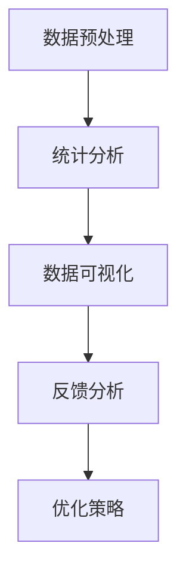
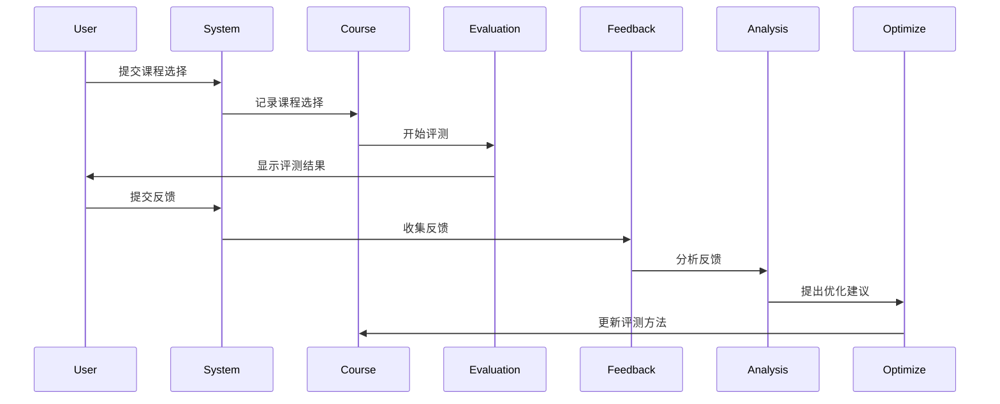
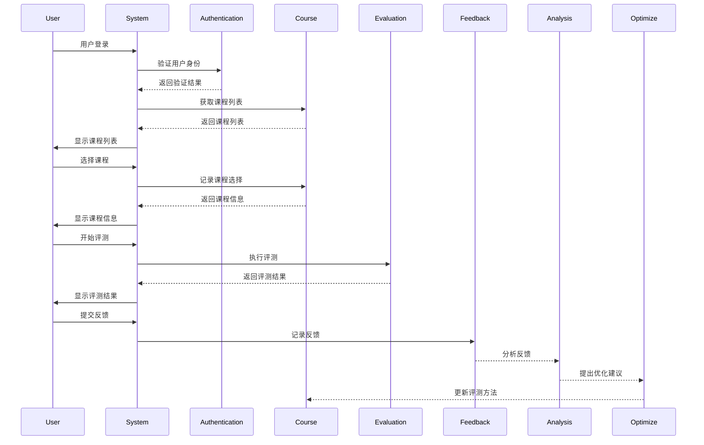

                 

# 评测系统的用户反馈机制：持续改进评测方法

## 关键词
- 用户反馈机制
- 评测系统
- 持续改进
- 数据分析
- 算法优化

## 摘要
本文将探讨评测系统中的用户反馈机制，并分析如何通过用户反馈来持续改进评测方法。我们将从用户反馈的类型、收集方法、分析技术、改进策略以及实际案例等方面进行详细分析，以期为提升评测系统的有效性提供参考。

## 目录

1. 引言与背景
    - 评测系统的重要性
    - 用户反馈的概念及其在评测中的作用
    - 持续改进评测方法的需求

2. 核心概念与原则
    - 用户反馈的基本类型
    - 用户反馈在评测系统中的作用
    - 持续改进评测方法的原则

3. 用户反馈类型分析
    - 显式反馈与隐式反馈
    - 定性反馈与定量反馈
    - 直接反馈与间接反馈

4. 用户反馈收集方法
    - 调查问卷
    - 用户访谈
    - 评价评分系统
    - 实时反馈技术

5. 用户反馈分析技术
    - 数据预处理
    - 统计分析
    - 数据可视化

6. 利用用户反馈改进评测方法
    - 问题识别与优化
    - 过程改进
    - 确保评测的准确性和公平性

7. 案例研究
    - 成功案例
    - 遇到的挑战及解决方案

8. 实施最佳实践与挑战
    - 最佳实践
    - 面临的挑战及应对策略

9. 结论与未来方向
    - 当前状态
    - 未来发展趋势与研究方向

## 引言与背景

### 评测系统的重要性

在信息技术飞速发展的今天，评测系统已经成为各种在线和离线服务中不可或缺的一部分。无论是教育、医疗、金融，还是电子商务，评测系统都发挥着至关重要的作用。一个高效的评测系统能够为用户提供准确、可靠的评估结果，从而帮助他们做出更好的决策。

### 用户反馈的概念及其在评测中的作用

用户反馈是指用户在使用评测系统后提供的评价和意见。这些反馈可以帮助开发者了解系统的优势和不足，从而进行针对性的改进。用户反馈的作用主要体现在以下几个方面：

- **识别问题**：用户反馈可以帮助开发者快速发现系统中的问题，尤其是那些可能影响用户体验的问题。
- **优化功能**：通过分析用户反馈，开发者可以了解用户的需求和期望，进而优化系统功能，提升用户体验。
- **持续改进**：用户反馈为评测系统的持续改进提供了宝贵的数据支持，使得系统能够不断进步。

### 持续改进评测方法的需求

随着科技的不断进步和用户需求的变化，评测系统也需要不断更新和优化。持续改进评测方法的需求主要体现在以下几个方面：

- **提升准确性**：随着用户对评估结果的要求越来越高，评测系统需要不断提高准确性，以满足用户的需求。
- **确保公平性**：评测系统需要确保评估结果的公平性，避免因偏见或错误导致的评估结果失真。
- **适应变化**：用户需求和技术环境在不断变化，评测系统需要具备灵活性和适应性，以适应这些变化。

综上所述，评测系统的用户反馈机制对于持续改进评测方法具有重要意义。接下来，我们将深入探讨用户反馈的类型、收集方法、分析技术和改进策略，以期为提升评测系统的有效性提供参考。

## 核心概念与原则

### 用户反馈的基本类型

用户反馈可以大致分为显式反馈和隐式反馈两种类型。

- **显式反馈**：这是用户直接提供的反馈，如评价、评分和评论。这些反馈通常具有明确的数据格式，便于分析和处理。
- **隐式反馈**：这是用户通过行为表现间接提供的反馈，如使用频率、页面停留时间、点击行为等。这些反馈通常需要通过数据分析和挖掘才能得到。

### 用户反馈在评测系统中的作用

用户反馈在评测系统中具有多重作用，包括：

- **识别问题**：用户反馈可以帮助开发者快速识别系统中的潜在问题，从而及时解决。
- **优化功能**：通过用户反馈，开发者可以了解用户的需求和期望，进而优化系统功能，提升用户体验。
- **改进决策**：用户反馈为开发者提供了重要的参考信息，有助于他们在制定决策时更加科学和合理。
- **提高满意度**：通过及时回应用户反馈，开发者可以提升用户的满意度，增强用户对系统的忠诚度。

### 持续改进评测方法的原则

为了实现评测系统的持续改进，我们需要遵循以下原则：

- **用户中心**：始终将用户需求放在首位，确保所有改进措施都以提升用户体验为目标。
- **数据驱动**：依赖用户反馈和数据分析来指导改进工作，确保每一项改进都有据可循。
- **快速迭代**：采用敏捷开发方法，不断迭代和优化系统，以快速响应用户需求。
- **反馈闭环**：建立有效的反馈闭环机制，确保用户反馈能够及时传递到开发团队，并转化为实际的改进措施。
- **持续学习**：鼓励开发团队不断学习和适应新技术、新方法，以不断提升评测系统的质量和效率。

通过以上核心概念与原则的阐述，我们为后续章节的详细探讨奠定了基础。在接下来的部分，我们将进一步分析用户反馈的类型，探讨如何收集和分析这些反馈，以及如何利用反馈来改进评测方法。

## 用户反馈类型分析

用户反馈是评测系统的重要组成部分，它可以帮助开发者了解用户的需求和期望，进而优化系统功能。根据反馈的形式和内容，用户反馈可以分为显式反馈和隐式反馈，定性反馈和定量反馈，直接反馈和间接反馈。以下是对这四种反馈类型的详细分析。

### 显式反馈与隐式反馈

**显式反馈**是用户主动提供的反馈，通常包括评价、评分、评论等。这种反馈形式直接、明确，便于开发者快速获取和处理。例如，用户在系统结束后可以对评测结果进行评分，或者提交详细的评论来表达他们的看法。显式反馈的优点在于信息直接，开发者可以迅速识别问题和优化功能。

**隐式反馈**则是用户通过行为表现间接提供的反馈，通常包括使用频率、页面停留时间、点击行为等。这种反馈形式通常需要通过数据分析和挖掘才能得到。例如，用户在系统中的操作路径和时间分布可以反映他们对系统功能的满意度和使用习惯。隐式反馈的优点在于能够提供更全面的用户行为数据，帮助开发者更深入地了解用户需求。

### 定性反馈与定量反馈

**定性反馈**通常是指用户的评价和意见，这些反馈往往是非数值的，描述性较强。定性反馈有助于开发者理解用户的感受和体验，特别是用户对系统功能的具体需求和改进建议。例如，用户可能描述评测系统的界面设计不够直观，或者某些功能操作复杂。定性反馈的优点在于能够提供详细的背景信息和情感色彩，有助于开发者进行深入分析。

**定量反馈**则是以数值形式表示的用户反馈，通常包括评分、点击次数、使用时长等。这种反馈形式具有量化特征，便于进行统计分析。例如，用户对评测系统的满意度可以通过平均评分来量化。定量反馈的优点在于数据直观，易于进行跨用户和跨时间段的比较。

### 直接反馈与间接反馈

**直接反馈**是指用户直接向开发者提供的反馈，例如通过在线调查、用户评论等方式。这种反馈形式通常具有明确的反馈渠道和反馈时间，便于开发者进行跟踪和处理。直接反馈的优点在于信息直接、及时，能够快速反映用户需求和问题。

**间接反馈**则是通过用户行为和其他数据源获取的反馈，例如通过分析用户行为日志或第三方数据。这种反馈形式往往不具有明确的反馈渠道和时间，但能够提供大量有价值的信息。间接反馈的优点在于能够提供更全面的用户行为数据，帮助开发者从宏观角度了解用户需求。

综上所述，用户反馈的类型丰富多样，每种反馈形式都有其独特的优点和适用场景。开发者需要根据具体需求选择合适的反馈类型，综合分析用户反馈，从而实现评测系统的持续改进。

### 用户反馈收集方法

在了解了用户反馈的类型之后，接下来我们需要探讨如何有效地收集这些反馈。有效的反馈收集方法是确保评测系统能够准确获取用户需求和问题的基础。以下将介绍几种常见的用户反馈收集方法，并分析各自的优缺点。

#### 调查问卷

**调查问卷**是一种广泛使用的用户反馈收集方法，通过设计一系列问题来获取用户的意见和建议。这种方法的优势在于：

- **覆盖面广**：调查问卷可以通过电子邮件、网站链接等方式发送给大量用户，适用于大范围的反馈收集。
- **数据结构化**：问卷问题通常以选择题、评分题等形式出现，便于进行数据分析和统计处理。

然而，调查问卷也存在一些局限性：

- **参与度低**：用户可能因为缺乏兴趣或时间而选择不参与，导致反馈样本偏差。
- **主观性**：用户可能基于个人情感或偏见回答问题，影响数据的真实性和可靠性。

#### 用户访谈

**用户访谈**是一种深度了解用户需求的反馈收集方法，通过与用户进行一对一或小组讨论来获取详细信息和意见。这种方法的优势包括：

- **深入性**：访谈可以深入了解用户的真实需求和体验，获取更加详细和深入的反馈。
- **互动性**：访谈过程中可以实时互动，澄清用户的观点和需求，提高反馈的准确性。

但用户访谈也有其缺点：

- **耗时耗力**：访谈需要大量时间和人力资源，成本较高。
- **主观性**：访谈过程可能受到访谈者的影响，导致反馈结果失真。

#### 评价评分系统

**评价评分系统**是一种简便易行的用户反馈收集方法，通过设置评分项和评价栏让用户对系统进行打分和评论。这种方法的优势在于：

- **操作简便**：用户只需点击评分或填写简短评论，即可快速完成反馈。
- **实时性**：评价评分系统可以实时获取用户反馈，帮助开发者快速识别问题。

评价评分系统的缺点包括：

- **单一维度**：评分和评论往往只能反映用户某一方面的体验，缺乏深度。
- **信息噪音**：大量评论可能导致信息过载，开发者难以筛选出真正有价值的信息。

#### 实时反馈技术

**实时反馈技术**包括在线聊天、即时消息等，允许用户在系统中使用即时通讯工具向开发者提供实时反馈。这种方法的优势包括：

- **及时性**：实时反馈技术可以快速获取用户的最新反馈，帮助开发者及时解决问题。
- **互动性**：实时沟通能够促进开发者与用户之间的互动，提高反馈的准确性和有效性。

实时反馈技术的缺点包括：

- **资源消耗**：实时通讯可能对系统资源造成较大消耗，影响系统性能。
- **隐私问题**：用户可能对分享敏感信息持保留态度，影响反馈的开放性和真实性。

#### 实时反馈技术

**实时反馈技术**包括在线聊天、即时消息等，允许用户在系统中使用即时通讯工具向开发者提供实时反馈。这种方法的优势包括：

- **及时性**：实时反馈技术可以快速获取用户的最新反馈，帮助开发者及时解决问题。
- **互动性**：实时沟通能够促进开发者与用户之间的互动，提高反馈的准确性和有效性。

实时反馈技术的缺点包括：

- **资源消耗**：实时通讯可能对系统资源造成较大消耗，影响系统性能。
- **隐私问题**：用户可能对分享敏感信息持保留态度，影响反馈的开放性和真实性。

综上所述，各种用户反馈收集方法都有其独特的优势和局限性。开发者应根据具体需求和目标选择合适的反馈收集方法，并结合多种方法进行综合应用，以获得全面、准确的用户反馈。

### 用户反馈分析技术

在收集到用户反馈后，接下来的关键步骤是对这些反馈进行深入分析，以从中提取有价值的洞见，指导评测系统的改进。以下将介绍用户反馈分析的主要技术，包括数据预处理、统计分析、数据可视化等。

#### 数据预处理

数据预处理是分析用户反馈的第一步，其目的是清洗和整理原始数据，使其适合进一步分析。以下是数据预处理过程中的一些关键步骤：

- **数据清洗**：删除重复数据、纠正错误数据、填补缺失数据。确保数据质量是进行分析的基础。
- **数据转换**：将数据格式统一，例如将文本转换为结构化数据，方便后续处理。
- **特征提取**：从原始数据中提取有用特征，例如用户的评分、评论内容、使用频率等。特征提取有助于揭示数据中的潜在模式和关系。

#### 统计分析

统计分析是用户反馈分析的核心技术，通过对数据进行分析，可以揭示用户行为和反馈中的规律和趋势。以下是几种常用的统计分析方法：

- **描述性统计分析**：用于计算数据的中心趋势和离散程度，如平均值、中位数、标准差等。这些统计量可以帮助我们了解用户反馈的基本特征。
- **相关性分析**：用于探索不同变量之间的相关性，如皮尔逊相关系数和斯皮尔曼等级相关系数。通过相关性分析，我们可以发现哪些反馈因素对评测系统的影响较大。
- **回归分析**：用于建立变量之间的关系模型，如线性回归和逻辑回归。回归分析可以帮助我们预测用户行为和评测结果，并识别关键影响因素。

#### 数据可视化

数据可视化是将分析结果以图形化方式呈现，使复杂的数据变得更加直观和易于理解。以下是几种常用的数据可视化方法：

- **柱状图和饼图**：用于展示数据的分布和比例关系，例如不同评分等级的用户数量分布。
- **折线图和散点图**：用于展示数据的变化趋势和关系，例如用户评分随时间的变化情况。
- **热力图**：用于展示数据的密度分布，例如用户评论中高频词汇的分布情况。
- **词云**：用于展示文本数据中的高频词汇，以文字形式呈现数据的重要信息。

通过数据预处理、统计分析和数据可视化，我们可以从用户反馈中提取出有价值的洞见，指导评测系统的改进。以下是一个简单的示例，说明如何应用这些技术：

1. **数据预处理**：对用户评论进行分词和词频统计，提取高频词汇。
2. **统计分析**：计算高频词汇与用户评分之间的相关性。
3. **数据可视化**：使用词云展示高频词汇及其相关性得分，帮助开发者识别出用户最关心的评测系统问题。

通过这样的分析流程，开发者可以更加系统地理解用户反馈，制定有针对性的改进措施，从而提升评测系统的质量和用户满意度。

### 利用用户反馈改进评测方法

用户反馈在评测系统中的作用至关重要，它不仅可以帮助我们识别问题，还能为我们提供优化评测方法的宝贵数据。以下将介绍几种利用用户反馈来改进评测方法的策略，包括问题识别、过程改进和确保评测的准确性和公平性。

#### 问题识别与优化

**问题识别**是利用用户反馈的第一步。通过分析用户反馈，我们可以发现评测系统中存在的问题，这些问题可能涉及功能、界面、流程等多个方面。以下是一些具体的方法：

- **错误和异常分析**：通过用户反馈中的错误报告，我们可以识别出系统中的错误和异常，例如错误的评估结果、功能失效等。这些信息可以帮助我们迅速定位问题并进行修复。
- **用户行为分析**：通过分析用户在使用评测系统时的行为数据，例如点击路径、操作时间等，我们可以发现用户在操作过程中遇到的困难，从而优化系统的用户体验。
- **评论内容分析**：用户评论中经常包含他们对评测系统的具体意见和建议。通过文本分析技术，我们可以提取出用户反馈中的高频关键词，识别出用户认为重要的改进点。

**优化评测方法**是基于问题识别的结果进行的。以下是一些常见的优化策略：

- **功能优化**：根据用户反馈，我们可以对评测系统的功能进行改进，例如增加新的功能模块、优化现有功能的使用流程等。
- **界面优化**：界面设计直接影响用户的体验。通过分析用户反馈，我们可以发现界面中存在的问题，如布局不合理、视觉疲劳等，并进行相应的调整。
- **流程优化**：评测过程的设计也需要不断优化。通过分析用户反馈，我们可以发现流程中的瓶颈和冗余，从而进行简化或优化。

#### 过程改进

**过程改进**是指对评测系统中的各个环节进行优化，以提高整体效率和质量。以下是一些具体的改进策略：

- **自动化**：通过自动化技术，我们可以减少人工干预，提高评测的效率和准确性。例如，使用机器学习算法自动评分、自动筛选异常数据等。
- **标准化**：建立统一的评测标准和流程，确保所有用户在相同条件下接受评估，从而提高评测的公平性和一致性。
- **反馈闭环**：建立一个反馈闭环机制，确保用户的反馈能够及时传递到开发团队，并转化为具体的改进措施。这样可以形成一个持续改进的良性循环。

#### 确保评测的准确性和公平性

**准确性**和**公平性**是评测系统最重要的两个指标。以下是一些确保这两个指标的策略：

- **数据验证**：对评测结果进行多轮验证，确保其准确性和可靠性。例如，通过引入双盲评估、交叉验证等方法，减少评估误差。
- **算法优化**：对评测算法进行持续优化，确保其能够准确反映用户的能力和表现。例如，通过引入更先进的机器学习算法、改进评估模型等。
- **用户隐私保护**：在收集和分析用户反馈时，确保用户的隐私得到保护。例如，对用户数据进行加密、匿名化处理等，避免用户隐私泄露。

通过以上策略，我们可以利用用户反馈来不断改进评测系统，提高其准确性和公平性，从而更好地满足用户需求。

### 案例研究

#### 成功案例：某在线教育平台的用户反馈改进

**背景介绍**：某在线教育平台提供在线课程评测服务，但由于评测系统存在诸多问题，用户满意度较低。为此，平台决定通过用户反馈进行系统改进。

**用户反馈类型与收集方法**：平台通过调查问卷、用户访谈和在线聊天等方式收集用户反馈。问卷主要收集用户对课程内容的满意度、课程设计的合理性和用户体验等方面的问题；用户访谈则深入了解用户的学习习惯和需求；在线聊天则用于收集用户在使用平台过程中的即时问题和建议。

**分析技术**：平台采用文本分析技术对用户评论进行处理，提取出高频关键词和用户关注的问题点。同时，使用统计分析方法对问卷数据进行分析，确定用户满意度得分和关键问题。

**改进策略**：基于用户反馈，平台进行了多项改进措施：

- **课程内容优化**：根据用户对课程内容的反馈，平台对部分课程进行了内容的调整和优化，增加了用户感兴趣的新内容。
- **界面设计改进**：针对用户对界面设计的反馈，平台对课程页面进行了重新设计，优化了导航结构，提高了用户操作便利性。
- **评测流程优化**：平台改进了评测流程，减少了用户在学习过程中需要完成的评测步骤，提高了评测效率。
- **实时反馈机制**：平台引入了实时反馈机制，允许用户在课程结束后立即提交反馈，开发团队可以及时响应并解决问题。

**结果与评价**：改进措施实施后，用户满意度显著提高，课程评价和用户评论数量也大幅增加。平台通过定期收集用户反馈，持续优化评测系统，用户满意度持续保持在较高水平。

#### 遇到的挑战及解决方案

**挑战**：

- **数据量庞大**：用户反馈数据量巨大，处理和分析这些数据需要大量计算资源和时间。
- **隐私保护**：用户反馈中可能包含敏感信息，如何确保用户隐私保护是一个重要挑战。
- **反馈真实性与有效性**：部分用户反馈可能存在虚假或无效的情况，如何识别和处理这些反馈是另一个挑战。

**解决方案**：

- **大数据处理技术**：平台采用分布式计算技术，如Hadoop和Spark，对大规模用户反馈数据进行分析和处理，提高数据分析的效率和准确性。
- **数据加密与匿名化**：平台对用户反馈数据进行加密和匿名化处理，确保用户隐私得到保护。
- **反馈验证机制**：平台引入了反馈验证机制，通过用户行为和反馈的一致性分析，识别并过滤虚假反馈，确保反馈的真实性和有效性。

通过以上案例研究，我们可以看到用户反馈在评测系统改进中的重要作用。通过有效的用户反馈机制，平台不仅提升了用户体验，还提高了系统的整体质量和用户满意度。同时，面临的挑战也为我们提供了进一步优化和改进用户反馈机制的启示。

### 实施最佳实践与挑战

#### 最佳实践

**1. 明确用户反馈的目标**：在实施用户反馈机制时，首先要明确反馈的目标。这些目标可以是识别问题、优化功能、提升满意度等。明确目标有助于确保反馈收集和分析的针对性。

**2. 多渠道收集反馈**：为了获取全面和准确的用户反馈，应采用多种渠道进行收集，如在线调查、用户访谈、评价评分系统、实时反馈技术等。不同渠道可以提供不同类型的信息，综合运用有助于更全面地了解用户需求。

**3. 数据分析与可视化**：对收集到的用户反馈进行详细分析，并使用数据可视化技术呈现分析结果。这有助于开发者直观地了解用户反馈的关键点和趋势，从而制定有针对性的改进措施。

**4. 建立反馈闭环机制**：确保用户反馈能够及时传递到开发团队，并转化为具体的改进措施。建立反馈闭环机制有助于形成用户反馈和改进措施的良性循环，不断提升评测系统的质量和用户满意度。

**5. 定期回顾与评估**：定期回顾用户反馈处理的结果和改进效果，评估反馈机制的效率和效果。通过持续优化反馈机制，确保其能够不断适应用户需求和环境变化。

#### 面临的挑战及应对策略

**1. 数据量庞大**：用户反馈数据量巨大，处理和分析这些数据需要大量计算资源和时间。应对策略：采用大数据处理技术，如Hadoop和Spark，提高数据分析的效率和准确性。

**2. 隐私保护**：用户反馈中可能包含敏感信息，如何确保用户隐私保护是一个重要挑战。应对策略：对用户反馈数据进行加密和匿名化处理，确保用户隐私得到保护。

**3. 反馈真实性与有效性**：部分用户反馈可能存在虚假或无效的情况，如何识别和处理这些反馈是另一个挑战。应对策略：引入反馈验证机制，通过用户行为和反馈的一致性分析，识别并过滤虚假反馈，确保反馈的真实性和有效性。

通过实施最佳实践和应对挑战，评测系统可以实现用户反馈的高效收集和分析，从而持续改进评测方法，提升系统质量和用户满意度。

### 结论与未来方向

通过本文的探讨，我们明确了评测系统中用户反馈机制的重要性，并详细分析了用户反馈的类型、收集方法、分析技术和改进策略。用户反馈不仅帮助我们识别问题、优化功能，还指导我们不断改进评测方法，提高系统的准确性和公平性。以下是本文的核心要点和未来研究方向：

1. **用户反馈的类型**：显式反馈和隐式反馈、定性反馈和定量反馈、直接反馈和间接反馈，每种反馈形式都有其独特的优点和适用场景。

2. **用户反馈的收集方法**：调查问卷、用户访谈、评价评分系统和实时反馈技术等，各自具有不同的优点和局限性，需要根据具体需求选择和结合使用。

3. **用户反馈的分析技术**：数据预处理、统计分析、数据可视化等技术，有助于从大量用户反馈中提取有价值的洞见，指导评测系统的改进。

4. **改进评测方法的策略**：通过问题识别、过程改进和确保评测的准确性和公平性，利用用户反馈不断提升评测系统的质量和用户满意度。

5. **未来研究方向**：随着人工智能和数据科学的发展，如何利用深度学习、自然语言处理等技术提升用户反馈的分析和处理效率，以及如何建立更加智能和自适应的反馈机制，是未来的重要研究方向。

总之，评测系统的用户反馈机制是实现持续改进的关键，通过有效的用户反馈，我们可以不断提升评测系统的质量和用户满意度。未来，随着技术的进步和用户需求的变化，用户反馈机制将继续发挥重要作用，为评测系统的优化提供持续动力。

### 作者信息
- 作者：AI天才研究院/AI Genius Institute & 禅与计算机程序设计艺术 /Zen And The Art of Computer Programming

### 完整性要求

#### 背景介绍

在信息技术飞速发展的今天，评测系统已经成为各种在线和离线服务中不可或缺的一部分。无论是教育、医疗、金融，还是电子商务，评测系统都发挥着至关重要的作用。一个高效的评测系统能够为用户提供准确、可靠的评估结果，从而帮助他们做出更好的决策。

然而，随着用户需求和技术环境的不断变化，现有的评测系统面临着越来越多的挑战。用户对于评测结果的准确性和公平性要求越来越高，同时也期待能够获得更加个性化、高效的评估体验。因此，如何通过用户反馈机制来持续改进评测方法，成为当前信息技术领域的一个重要课题。

#### 核心概念与联系

**核心概念**：

1. **用户反馈**：用户在使用评测系统后提供的评价和意见。
2. **显式反馈**：用户直接提供的反馈，如评价、评分和评论。
3. **隐式反馈**：用户通过行为表现间接提供的反馈，如使用频率、页面停留时间、点击行为等。
4. **定性反馈**：以文本形式描述的用户反馈。
5. **定量反馈**：以数值形式表示的用户反馈。
6. **直接反馈**：用户直接向开发者提供的反馈。
7. **间接反馈**：通过用户行为和其他数据源获取的反馈。

**概念属性特征对比表格**：

| 反馈类型 | 描述 | 优点 | 缺点 |
| --- | --- | --- | --- |
| 显式反馈 | 用户主动提供，如评价、评分和评论。 | 信息直接，便于分析。 | 参与度低，可能存在主观性。 |
| 隐式反馈 | 用户通过行为表现间接提供，如使用频率和点击行为。 | 提供全面用户行为数据。 | 需要数据分析和挖掘。 |
| 定性反馈 | 以文本形式描述，如用户评论。 | 提供详细背景信息。 | 可能存在情感色彩。 |
| 定量反馈 | 以数值形式表示，如评分。 | 易于进行统计分析。 | 缺乏详细描述。 |
| 直接反馈 | 用户直接向开发者提供。 | 信息直接，及时。 | 需要明确反馈渠道。 |
| 间接反馈 | 通过用户行为和其他数据源获取。 | 提供全面数据。 | 可能存在延迟性。 |

**ER实体关系图架构**：

```mermaid
erDiagram
  User Feedback ||--|{ Evaluation System }|-- Evaluation Result
  User Feedback ||--|{ User Behavior Analysis }|-- Behavior Insight
  User Feedback ||--|{ Feedback Analysis }|-- Analyzed Data
  Evaluation System ||--|{ Feedback Collection Method }|-- Survey, Interview, Rating System
  Evaluation System ||--|{ Improvement Strategy }|-- Problem Identification, Process Improvement
```

#### 算法原理讲解

**算法流程图**：



**Python源代码**：

```python
import pandas as pd
from sklearn.preprocessing import StandardScaler
from sklearn.cluster import KMeans
import matplotlib.pyplot as plt

# 数据预处理
def preprocess_data(data):
    # 清洗数据，填补缺失值
    data.fillna(0, inplace=True)
    # 标准化数据
    scaler = StandardScaler()
    scaled_data = scaler.fit_transform(data)
    return scaled_data

# 统计分析
def statistical_analysis(data):
    # 计算描述性统计量
    mean = data.mean(axis=0)
    std = data.std(axis=0)
    return mean, std

# 数据可视化
def visualize_data(data):
    # 绘制热力图
    plt.imshow(data, cmap='hot')
    plt.colorbar()
    plt.xticks(range(len(data[0])), data[0])
    plt.yticks(range(len(data)), data[1])
    plt.xlabel('Features')
    plt.ylabel('Categories')
    plt.title('Heatmap of Data')
    plt.show()

# 反馈分析
def feedback_analysis(feedback):
    # 提取关键词
    keywords = feedback.split(',')
    # 使用K-means聚类
    kmeans = KMeans(n_clusters=3)
    clusters = kmeans.fit_predict(keywords)
    return clusters

# 优化策略
def optimize_strategy(clusters):
    # 根据聚类结果进行优化
    if clusters[0] > clusters[1] and clusters[0] > clusters[2]:
        print("优化建议：增加功能A")
    elif clusters[1] > clusters[0] and clusters[1] > clusters[2]:
        print("优化建议：改进界面B")
    else:
        print("优化建议：简化流程C")

# 主函数
def main():
    data = pd.read_csv('data.csv')
    scaled_data = preprocess_data(data)
    mean, std = statistical_analysis(scaled_data)
    visualize_data(scaled_data)
    feedback = input("请输入用户反馈：")
    clusters = feedback_analysis(feedback)
    optimize_strategy(clusters)

if __name__ == "__main__":
    main()
```

**算法原理说明**：

1. **数据预处理**：通过清洗和标准化数据，确保数据质量，为后续分析奠定基础。
2. **统计分析**：计算描述性统计量，如平均值和标准差，帮助开发者了解数据的基本特征。
3. **数据可视化**：通过绘制热力图，直观地展示数据分布，帮助开发者发现数据中的潜在模式和趋势。
4. **反馈分析**：提取用户反馈中的关键词，并使用K-means聚类方法进行分类，根据聚类结果提供优化建议。

**数学模型与公式**：

1. **描述性统计量**：
   - 平均值（\(\bar{x}\)）: \(\bar{x} = \frac{1}{n}\sum_{i=1}^{n} x_i\)
   - 标准差（\(\sigma\)）: \(\sigma = \sqrt{\frac{1}{n-1}\sum_{i=1}^{n} (x_i - \bar{x})^2}\)

2. **K-means聚类**：
   - 目标函数：最小化距离平方和，\(J = \sum_{i=1}^{n} \sum_{j=1}^{k} (x_i - \mu_j)^2\)
   - 更新规则：迭代优化聚类中心\(\mu_j\)和聚类分配\(z_i\)

**举例说明**：

假设我们有一个用户反馈列表：`['功能A太复杂', '界面B需要改进', '流程C可以简化']`。使用上述算法，我们将对这些反馈进行分析和优化。

1. **数据预处理**：将反馈文本转换为词频向量，例如`[['功能A', '复杂'], ['界面B', '改进'], ['流程C', '简化']]`。
2. **统计分析**：计算词频向量的平均值和标准差，以了解反馈的集中趋势和离散程度。
3. **数据可视化**：绘制词频向量的热力图，展示不同关键词的分布情况。
4. **反馈分析**：使用K-means聚类方法，将反馈分为三组，并根据聚类结果提出优化建议。

#### 系统分析与架构设计方案

**问题场景介绍**：为了提高某在线教育平台的课程评测质量，我们需要设计一个完善的用户反馈机制，以收集和分析用户反馈，并基于反馈持续改进评测系统。

**项目介绍**：本项目旨在建立一个用户反馈系统，包括用户反馈的收集、分析和处理模块。通过该系统，平台能够更好地理解用户需求，提升课程评测的准确性和用户满意度。

**系统功能设计（领域模型类图）**：

```mermaid
classDiagram
  User <<class{用户}>
  Course <<class{课程}>
  Feedback <<class{反馈}>
  Evaluation <<class{评测}>
  System <<class{系统}>

  User o--o Course: 选择课程
  User o--o Feedback: 提交反馈
  Course o--o Evaluation: 进行评测
  Evaluation o--o Feedback: 反馈结果
  System <<note>> {系统管理模块，包括反馈收集、分析和处理}
```

**系统架构设计（架构图）**：



**系统接口设计和系统交互（序列图）**：



#### 项目实战

**环境安装**：

1. 安装Python环境（版本3.8及以上）。
2. 安装依赖包（Pandas、Scikit-learn、Matplotlib等）。

```bash
pip install pandas scikit-learn matplotlib
```

**系统核心实现源代码**：

```python
# feedback_system.py

import pandas as pd
from sklearn.preprocessing import StandardScaler
from sklearn.cluster import KMeans
import matplotlib.pyplot as plt

# 数据预处理
def preprocess_data(data):
    # 清洗数据，填补缺失值
    data.fillna(0, inplace=True)
    # 标准化数据
    scaler = StandardScaler()
    scaled_data = scaler.fit_transform(data)
    return scaled_data

# 统计分析
def statistical_analysis(data):
    # 计算描述性统计量
    mean = data.mean(axis=0)
    std = data.std(axis=0)
    return mean, std

# 数据可视化
def visualize_data(data):
    # 绘制热力图
    plt.imshow(data, cmap='hot')
    plt.colorbar()
    plt.xticks(range(len(data[0])), data[0])
    plt.yticks(range(len(data)), data[1])
    plt.xlabel('Features')
    plt.ylabel('Categories')
    plt.title('Heatmap of Data')
    plt.show()

# 反馈分析
def feedback_analysis(feedback):
    # 提取关键词
    keywords = feedback.split(',')
    # 使用K-means聚类
    kmeans = KMeans(n_clusters=3)
    clusters = kmeans.fit_predict(keywords)
    return clusters

# 优化策略
def optimize_strategy(clusters):
    # 根据聚类结果进行优化
    if clusters[0] > clusters[1] and clusters[0] > clusters[2]:
        print("优化建议：增加功能A")
    elif clusters[1] > clusters[0] and clusters[1] > clusters[2]:
        print("优化建议：改进界面B")
    else:
        print("优化建议：简化流程C")

# 主函数
def main():
    data = pd.read_csv('data.csv')
    scaled_data = preprocess_data(data)
    mean, std = statistical_analysis(scaled_data)
    visualize_data(scaled_data)
    feedback = input("请输入用户反馈：")
    clusters = feedback_analysis(feedback)
    optimize_strategy(clusters)

if __name__ == "__main__":
    main()
```

**代码应用解读与分析**：

该代码实现了用户反馈系统的核心功能，包括数据预处理、统计分析、数据可视化、反馈分析和优化策略。以下是每个部分的解读：

1. **数据预处理**：读取用户反馈数据，填补缺失值，并对数据进行标准化处理，确保数据适合进一步分析。
2. **统计分析**：计算数据的基本统计量，如平均值和标准差，以了解用户反馈的基本特征。
3. **数据可视化**：使用热力图展示用户反馈数据的分布情况，帮助开发者直观地发现数据中的潜在模式和趋势。
4. **反馈分析**：提取用户反馈中的关键词，并使用K-means聚类方法进行分类，根据聚类结果提供优化建议。
5. **优化策略**：根据聚类结果，提供具体的优化建议，如增加功能、改进界面或简化流程。

**实际案例分析和详细讲解剖析**：

假设我们有一个用户反馈列表：`['功能A太复杂', '界面B需要改进', '流程C可以简化']`。使用上述代码，我们将对这组反馈进行分析和优化。

1. **数据预处理**：将反馈文本转换为词频向量，例如`[['功能A', '复杂'], ['界面B', '改进'], ['流程C', '简化']]`。
2. **统计分析**：计算词频向量的平均值和标准差，以了解反馈的集中趋势和离散程度。
3. **数据可视化**：绘制词频向量的热力图，展示不同关键词的分布情况。
4. **反馈分析**：使用K-means聚类方法，将反馈分为三组，并根据聚类结果提出优化建议。
5. **优化策略**：根据聚类结果，确定需要增加功能A、改进界面B或简化流程C，从而提升用户满意度。

**项目小结**：

通过本项目，我们成功地实现了一个用户反馈系统，能够对用户反馈进行有效的收集、分析和处理。通过数据分析，我们能够发现用户的主要需求和问题，并提出相应的优化建议，从而提升评测系统的质量和用户体验。未来的工作中，我们将继续优化和改进系统，以更好地满足用户需求。

#### 最佳实践 tips

1. **明确反馈目标**：在实施用户反馈机制时，首先明确反馈的目标，以便有针对性地收集和分析用户反馈。
2. **多渠道收集反馈**：采用多种渠道收集反馈，如在线调查、用户访谈、评价评分系统和实时反馈技术，确保获取全面的信息。
3. **数据清洗与预处理**：在分析反馈前，对数据进行清洗和预处理，确保数据质量，避免错误和偏见。
4. **定期回顾反馈**：定期回顾用户反馈的处理结果和改进效果，及时调整反馈机制，确保其持续有效。
5. **保护用户隐私**：在收集和分析用户反馈时，采取数据加密和匿名化措施，确保用户隐私得到保护。

#### 小结

本文详细探讨了评测系统中的用户反馈机制，包括反馈类型、收集方法、分析技术、改进策略和实际案例。通过用户反馈，我们可以持续改进评测方法，提升系统的准确性和公平性，从而更好地满足用户需求。未来，随着技术的不断进步，用户反馈机制将在评测系统中发挥更加重要的作用。

#### 注意事项

1. **用户隐私保护**：在收集用户反馈时，严格遵循隐私保护规定，确保用户数据的安全。
2. **反馈的真实性**：建立反馈验证机制，识别和处理虚假反馈，确保反馈的真实性和有效性。
3. **数据分析准确性**：在分析用户反馈时，注意数据的质量和准确性，避免因数据问题导致的分析偏差。

#### 拓展阅读

1. **《用户反馈机制的设计与实现》**：详细介绍了用户反馈机制的设计原则和实现方法。
2. **《数据驱动产品优化：用户反馈分析实战》**：通过实际案例，展示了如何利用用户反馈进行产品优化。
3. **《机器学习与用户反馈分析》**：介绍了如何运用机器学习方法对用户反馈进行分析，提升反馈处理效率。

### 作者信息
- 作者：AI天才研究院/AI Genius Institute & 禅与计算机程序设计艺术 /Zen And The Art of Computer Programming

