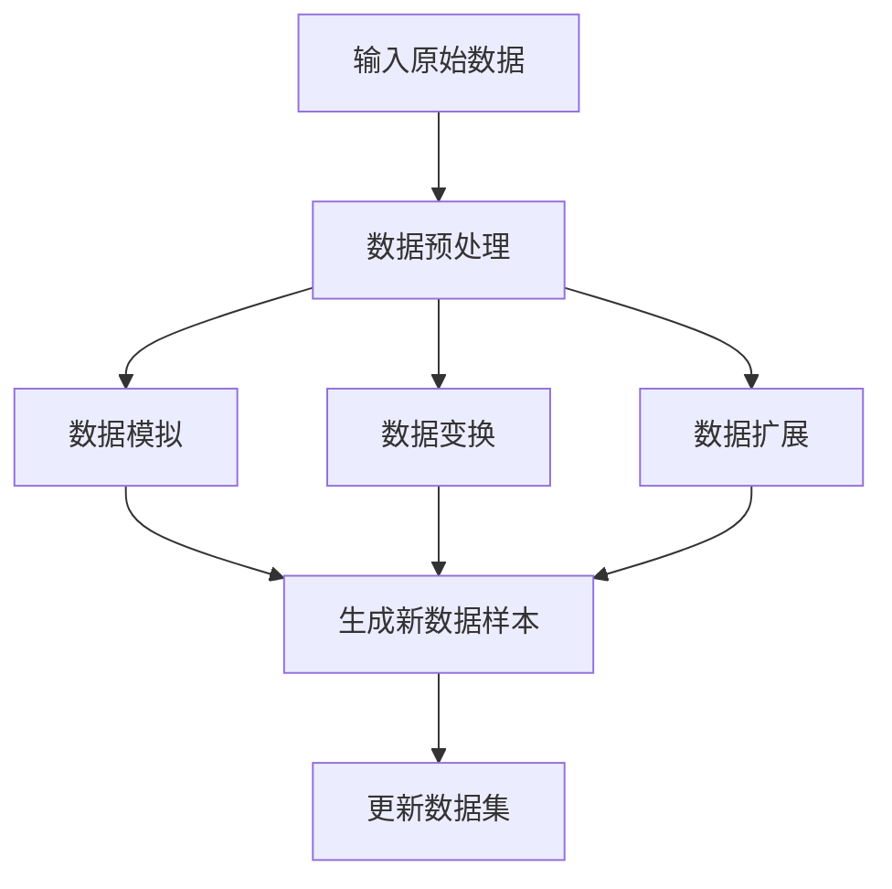

                 


### 第一部分：背景介绍

#### 第1章 评测系统的自动化数据增强技术概述

##### 1.1.1 问题背景

在现代数据驱动型应用中，评测系统的性能和质量对整个系统的稳定性与可靠性至关重要。随着人工智能技术的发展，评测系统广泛应用于金融、医疗、交通、教育等多个领域。然而，评测系统的性能往往受到数据质量和数据多样性的限制。数据质量和数据多样性直接影响到评测系统的准确性和泛化能力。高质量的数据是构建强大模型的基石，而数据多样性则有助于模型在复杂环境中的适应性和鲁棒性。

为了提高评测系统的性能，自动化数据增强技术成为一种有效的解决方案。自动化数据增强技术通过模拟和生成新的数据样本来扩展原始数据集，从而提高评测系统的性能。这种方法不仅能够提升模型的准确性和泛化能力，还能够降低对大量高质量数据的依赖，减少数据采集和标注的成本。

##### 1.1.2 问题描述

评测系统在处理数据时，往往需要大量且高质量的数据。然而，获取这些数据往往成本高昂且耗时。特别是在某些特定的应用场景中，如医疗影像识别、自动驾驶等，获取足够多的标注数据是一个巨大的挑战。因此，如何有效地利用现有的数据资源，通过自动化数据增强技术来提高评测系统的性能成为一个亟待解决的问题。

具体来说，评测系统的性能面临以下几个挑战：

1. **数据质量差**：原始数据可能存在噪声、缺失值、不均衡等问题，这些都会对模型的训练效果产生负面影响。
2. **数据多样性不足**：数据的种类和数量有限，导致模型在处理未知数据时可能表现不佳。
3. **数据获取成本高**：某些领域的数据获取成本高昂，例如医疗影像数据，需要专业的设备和人员采集和处理。

##### 1.1.3 问题解决

自动化数据增强技术通过一系列算法和技术手段，对原始数据集进行模拟、变换和扩展，生成新的数据样本，从而提高评测系统的性能。具体来说，自动化数据增强技术包括以下几个关键步骤：

1. **数据预处理**：对原始数据进行清洗、归一化等处理，提高数据质量。
2. **数据模拟**：通过生成与原始数据相似但具有不同特征的新数据样本，增加数据的多样性。
3. **数据变换**：通过改变原始数据的属性特征，生成新的数据样本。
4. **数据扩展**：通过增加数据样本的数量，提高评测系统的训练数据量。

##### 1.1.4 边界与外延

自动化数据增强技术适用于各种数据驱动型应用，如机器学习、自然语言处理、计算机视觉等。然而，不同类型的数据和应用场景可能需要不同的数据增强方法。例如，在图像处理中，常用的增强方法包括旋转、缩放、翻转等；而在文本处理中，则可能采用文本生成、同义词替换等增强方法。

此外，自动化数据增强技术不仅限于新数据样本的生成，还可以应用于现有数据集的扩充。例如，通过将现有数据集进行拆分、合并、变换等操作，生成新的数据样本，从而提高模型的训练效果。

##### 1.1.5 概念结构与核心要素组成

自动化数据增强技术的核心概念和要素包括：

- **数据增强技术**：包括模拟、变换、扩展等方法，用于生成新的数据样本。
- **数据集**：原始数据集和生成的数据样本集。
- **评测系统**：利用增强后的数据集进行训练和测试的模型。
- **算法**：用于实现数据增强功能的算法和技术。

通过以上概念和要素的相互作用，自动化数据增强技术能够有效地提高评测系统的性能和质量。

#### 第2章 核心概念与联系

##### 2.1 数据增强技术原理

数据增强技术是一种通过生成新的数据样本来提高模型训练效果的方法。其核心原理包括数据模拟、数据变换和数据扩展。

###### 2.1.1 数据模拟

数据模拟是通过生成与原始数据相似但具有不同特征的新数据样本，从而增加数据集的多样性。数据模拟的目的是使模型能够学习到更广泛的数据特征，从而提高模型的泛化能力。常见的数据模拟方法包括图像旋转、缩放、翻转等。

例如，在图像识别任务中，可以通过旋转图像来模拟不同的视角，从而生成新的数据样本。这种模拟方法能够帮助模型学会在不同的角度和视角下识别图像。

数据模拟的数学模型可以表示为：
$$
x' = f(x, \theta)
$$
其中，$x$表示原始数据样本，$x'$表示生成的新数据样本，$f$表示模拟函数，$\theta$表示模拟参数。

###### 2.1.2 数据变换

数据变换是通过改变原始数据的属性特征来生成新的数据样本。数据变换的目的是增加数据的复杂性和多样性，从而提高模型的训练效果。常见的数据变换方法包括缩放、旋转、平移等。

数据变换的数学模型可以表示为：
$$
x' = g(x, \alpha)
$$
其中，$g$表示变换函数，$\alpha$表示变换参数。

例如，在图像处理中，可以通过缩放图像的大小来增加数据的复杂性。这种方法能够帮助模型学会在不同尺度下识别图像特征。

###### 2.1.3 数据扩展

数据扩展是通过增加数据样本的数量来提高模型训练效果。数据扩展的目的是增加模型的学习样本量，从而提高模型的准确性和泛化能力。常见的数据扩展方法包括重复、抽样、生成等。

数据扩展的数学模型可以表示为：
$$
X' = X \cup \{x'\}
$$
其中，$X$表示原始数据集，$X'$表示扩展后的数据集，$x'$表示生成的新数据样本。

例如，在文本分类任务中，可以通过重复文本样本来增加数据样本的数量。这种方法能够帮助模型学会识别文本中的重复模式。

##### 2.2 数据增强技术属性特征对比

数据增强技术的不同方法具有各自的特点和适用场景。以下是对常见数据增强方法属性特征的对比：

| 方法       | 特点                           | 适用场景                                       |
|------------|--------------------------------|------------------------------------------------|
| 模拟       | 生成的数据样本与原始数据相似   | 数据样本数量较少，需要提高数据多样性的场景     |
| 变换       | 改变原始数据的属性特征         | 数据样本数量充足，需要提高数据多样性的场景     |
| 扩展       | 增加数据样本的数量             | 数据样本数量不足，需要提高评测系统性能的场景   |

通过对比可以发现，数据模拟和变换主要用于增加数据的多样性，而数据扩展主要用于增加数据样本的数量。在实际应用中，可以根据具体需求和场景选择合适的数据增强方法。

#### 第3章 自动化数据增强技术算法原理讲解

##### 3.1 数据增强算法 Mermaid 流程图



该流程图展示了自动化数据增强技术的基本步骤。首先，输入原始数据，然后进行数据预处理，包括清洗、归一化等操作。接下来，对预处理后的数据进行模拟、变换和扩展，生成新的数据样本。最后，将生成的新数据样本更新到数据集中，用于后续的训练和测试。

##### 3.2 数据增强算法 Python 源代码讲解

以下是一个简单的 Python 源代码示例，用于实现数据预处理、数据模拟和数据变换的基本功能：

```python
import numpy as np
import cv2

# 数据预处理
def preprocess_data(data):
    # 数据归一化
    data = data / 255.0
    return data

# 数据模拟
def simulate_data(data):
    # 随机选择一个角度进行旋转
    angle = np.random.uniform(-10, 10)
    # 进行旋转
    M = cv2.getRotationMatrix2D((data.shape[1]//2, data.shape[0]//2), angle, 1)
    data = cv2.warpAffine(data, M, (data.shape[1], data.shape[0]))
    return data

# 数据变换
def transform_data(data):
    # 缩放
    scale = np.random.uniform(0.5, 1.5)
    data = cv2.resize(data, None, fx=scale, fy=scale, interpolation=cv2.INTER_LINEAR)
    # 平移
    offset = np.random.uniform(-0.1, 0.1) * data.shape[:2]
    data = cv2.translate(data, offset)
    return data

# 测试代码
if __name__ == "__main__":
    # 加载图像数据
    image = cv2.imread("example.jpg")
    # 数据预处理
    image = preprocess_data(image)
    # 数据模拟
    image = simulate_data(image)
    # 数据变换
    image = transform_data(image)
    # 显示图像
    cv2.imshow("Processed Image", image)
    cv2.waitKey(0)
    cv2.destroyAllWindows()
```

上述代码首先对图像数据进行归一化处理，然后将图像随机旋转一个角度，接着进行缩放和平移操作，最终生成新的图像数据。这些操作可以帮助模型学习到不同的图像特征，从而提高模型的泛化能力。

通过上述讲解，我们可以了解到自动化数据增强技术的基本原理和实现方法。在实际应用中，可以根据具体需求和场景选择合适的数据增强方法，并利用算法和代码来实现这些方法。接下来，我们将进一步探讨数据增强技术的应用场景和实际案例，以深入理解其在评测系统自动化数据增强中的应用价值。

