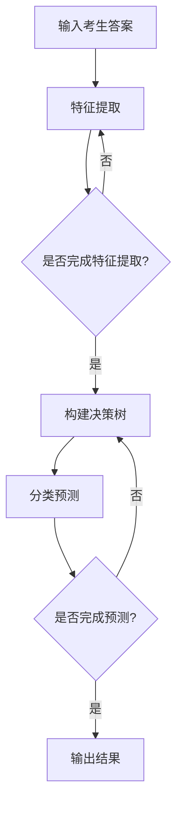
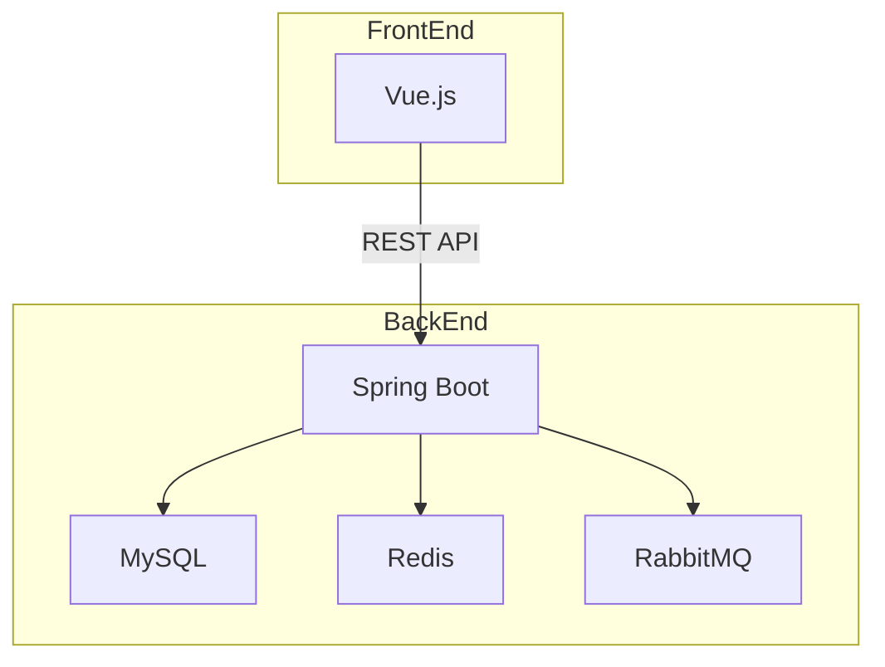
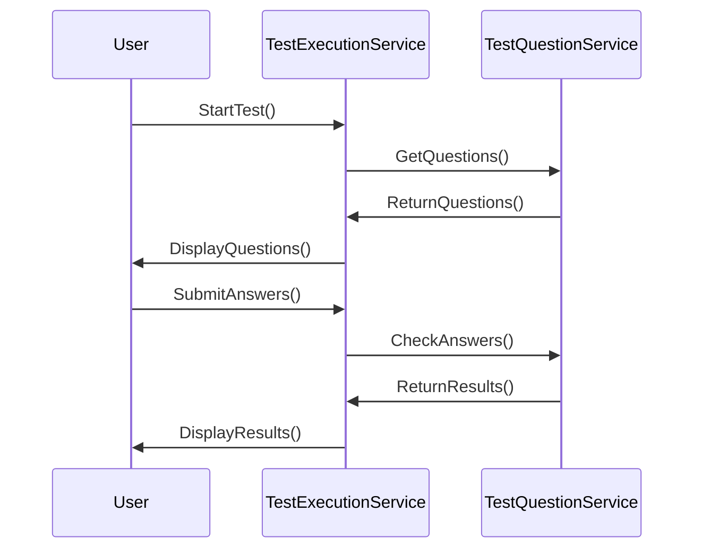

                 


### 引言：自动化评测策略的重要性

#### 背景介绍

在当今信息化时代，评测系统作为各类考试、测试、竞赛等领域的重要工具，其重要性不言而喻。然而，随着测试规模的不断扩大，评测任务的复杂性日益增加，传统的人工评测方式已逐渐暴露出诸多弊端，如效率低下、主观性较强、重复劳动多等。因此，如何优化评测系统的评测策略，提高评测效率和准确性，已成为当前研究的热点和需求。

#### 核心概念与联系

首先，我们需要明确几个核心概念：自动化评测、评测系统、评测策略。

- **自动化评测**：是指利用计算机技术和软件工具，对测试对象进行自动化的检查、验证和评估。其目的是提高评测的效率、减少人为错误，同时为后续的数据分析和决策提供支持。
- **评测系统**：是一个用于实施、管理和分析测试过程的软件系统。它可以包括测试任务创建、测试题库管理、测试执行、结果分析和反馈等功能模块。
- **评测策略**：是指导评测系统如何进行评测的一系列规则和原则。一个好的评测策略应该能够充分考虑测试目标、测试对象的特点，以及评测资源的限制，从而实现高效、准确和公正的评测。

接下来，我们将通过一个Mermaid ER图来展示这些概念之间的关系：

```mermaid
erDiagram
  自动化评测 ||--o> 评测系统 : 实现自动化评测功能
  评测系统 ||--o> 评测策略 : 实现特定评测策略
  评测策略 ||--< 自动化评测 : 结合自动化评测进行策略优化
```

从图中可以看出，自动化评测是评测系统的核心功能，评测策略则是指导评测系统如何工作的具体方案。这两者相互关联，共同构成了评测系统的高效运作基础。

#### 问题解决

那么，如何优化评测系统的自动化评测策略呢？

首先，我们需要从评测系统的核心功能入手，分析现有评测策略的不足之处。例如：

- **效率问题**：传统评测策略往往依赖于人工，导致评测速度缓慢，无法满足大规模测试的需求。因此，优化策略需要着眼于提高自动化程度，减少人工干预。
- **准确性问题**：人工评测的主观性较大，容易受到个人经验、心理等因素的影响，导致评测结果不够准确。优化策略应尽量减少主观因素的干扰，提高评测结果的客观性和一致性。
- **可扩展性问题**：随着测试场景的多样化，评测系统的评测策略也需要灵活调整。现有策略往往缺乏灵活性，难以适应不同的测试需求。优化策略应具备良好的扩展性，能够适应各种复杂的评测场景。

针对上述问题，我们可以从以下几个方面进行优化：

1. **算法优化**：通过引入先进的算法技术，如机器学习、自然语言处理等，提升评测的准确性和效率。
2. **流程优化**：对评测流程进行重新设计和调整，优化各个环节的工作流程，提高整体效率。
3. **规则优化**：制定更精细、更合理的评测规则，减少主观因素的干扰，提高评测结果的公正性。
4. **系统集成**：通过集成各种先进的测试工具和技术，构建一个统一的评测平台，提高评测系统的整体性能。

#### 边界与外延

在探讨评测系统的自动化评测策略优化时，我们还需要关注一些边界和外部因素：

- **技术边界**：自动化评测策略的优化受限于当前的技术水平，如算法性能、硬件条件等。我们需要根据实际情况，选择合适的技术方案，并不断探索新的技术方向。
- **业务边界**：不同的评测场景有不同的业务需求，评测策略的优化需要充分考虑这些业务特点，避免过度技术化，失去实际应用价值。
- **法律边界**：评测系统涉及个人信息和隐私保护等问题，优化策略需要遵守相关法律法规，确保评测活动的合法合规。

综上所述，评测系统的自动化评测策略优化是一个复杂的过程，需要从多个维度进行综合考虑和优化。通过引入先进的技术、优化流程、制定合理的规则，我们可以大幅提升评测系统的效率和准确性，为各类测试活动提供有力支持。

### 核心概念与联系

在深入探讨评测系统的自动化评测策略优化之前，我们需要明确几个关键概念，并了解它们之间的相互关系。以下是自动化评测、评测系统、评测策略的核心定义及其相互联系。

#### 自动化评测

自动化评测是指利用计算机技术和软件工具，对测试对象进行自动化的检查、验证和评估。其目的是减少人为干预，提高评测的效率、准确性和一致性。自动化评测通常包括以下几个步骤：

1. **测试数据输入**：将测试数据导入评测系统，包括题目、答案、评分标准等。
2. **自动化测试执行**：系统根据预设的测试规则，自动执行测试任务，对测试对象进行分析和评估。
3. **结果输出**：系统自动生成评测结果，包括分数、排名、分析报告等。

#### 评测系统

评测系统是一个用于实施、管理和分析测试过程的软件系统。它通常包含以下功能模块：

1. **测试任务创建**：管理员可以创建和管理测试任务，包括设置测试时间、考生名单、测试题目等。
2. **测试题库管理**：系统维护题库，包括题目的存储、分类、更新等。
3. **测试执行**：系统在规定时间内自动或手动执行测试任务，记录测试结果。
4. **结果分析**：系统对测试结果进行分析，生成详细的报告，包括得分分布、错误分析等。
5. **反馈与改进**：根据分析结果，系统可以生成改进建议，为下次测试提供参考。

#### 评测策略

评测策略是指导评测系统如何进行评测的一系列规则和原则。它包括以下几个方面：

1. **评分规则**：确定如何计算分数，如选择题的得分方式、简答题的评分标准等。
2. **评分标准**：定义评分的具体标准，如答案正确与否、答案的完整性和准确性等。
3. **评测流程**：规定评测的具体步骤和流程，如测试执行、结果分析、结果发布等。
4. **策略调整**：根据测试结果和反馈，对评测策略进行实时调整，以优化评测效果。

#### 关系

自动化评测、评测系统和评测策略之间存在着密切的关系。自动化评测是评测系统实现自动化评估的核心功能，而评测策略则是指导评测系统如何高效、准确地进行评估的方案。

- **评测系统**作为载体，实现了自动化评测的具体操作和流程，它依赖于评测策略来确定评估的标准和流程。
- **评测策略**则依赖于自动化评测的技术和工具，通过优化评测策略，可以提升评测系统的整体性能。

为了更直观地展示这些概念之间的关系，我们可以使用Mermaid ER图进行表示：

```mermaid
erDiagram
  自动化评测 ||--< 评测系统 : 实现自动化评测功能
  评测系统 ||--o> 评测策略 : 实现特定评测策略
  评测策略 ||--< 自动化评测 : 结合自动化评测进行策略优化
```

通过这个ER图，我们可以清晰地看到，自动化评测是评测系统的核心功能，评测策略则是指导评测系统工作的具体方案。这两者相互关联，共同构成了评测系统的高效运作基础。

### 算法与系统设计

#### 算法原理介绍

在评测系统的自动化评测策略优化中，算法设计是关键的一环。本文将介绍一种基于机器学习的评测算法，并详细解释其原理和实现过程。

#### 算法原理

所介绍的评测算法是一种基于决策树模型的分类算法。决策树是一种常见的机器学习算法，它通过一系列的判断节点来对数据进行分类。在评测系统中，决策树可以用来对考生的答案进行分类，判断其正确与否。

算法的基本原理如下：

1. **特征提取**：从考生的答案中提取出关键特征，如关键词、句子结构、语法错误等。
2. **决策树构建**：根据训练数据，构建一个决策树模型。每个节点代表一个特征，每个分支代表一个特征取值。
3. **分类预测**：对于新的考生答案，通过决策树模型进行分类预测，判断其正确与否。

#### Mermaid流程图

为了更好地理解算法的执行过程，我们可以使用Mermaid流程图进行展示：



在这个流程图中，我们从输入考生答案开始，通过特征提取、决策树构建和分类预测等步骤，最终输出评测结果。

#### Python代码实现

以下是该算法的Python代码实现，我们将逐步解释每一步的代码：

```python
import numpy as np
from sklearn.tree import DecisionTreeClassifier
from sklearn.model_selection import train_test_split

# 特征提取函数
def extract_features(answers):
    # 实现特征提取逻辑
    # 例如，提取关键词、句子结构等
    features = []
    for answer in answers:
        # 示例特征提取
        feature = [0] * num_features
        feature[0] = answer.count('正确')  # 假设“正确”这个词是关键特征
        features.append(feature)
    return np.array(features)

# 决策树模型构建
def build_decision_tree(train_features, train_labels):
    clf = DecisionTreeClassifier()
    clf.fit(train_features, train_labels)
    return clf

# 分类预测
def classify_answer(clf, feature):
    return clf.predict([feature])

# 示例数据
answers = ["正确答案", "错误答案", "正确答案"]
labels = [1, 0, 1]  # 1表示正确，0表示错误

# 数据预处理
num_features = 10
train_features = extract_features(answers)
train_labels = np.array(labels)

# 划分训练集和测试集
X_train, X_test, y_train, y_test = train_test_split(train_features, train_labels, test_size=0.2, random_state=42)

# 构建决策树模型
clf = build_decision_tree(X_train, y_train)

# 分类预测
for i in range(len(X_test)):
    feature = X_test[i]
    prediction = classify_answer(clf, feature)
    print(f"答案：{answers[i]}, 预测结果：{prediction}")
```

在这个代码中，我们首先定义了一个特征提取函数`extract_features`，用于从答案中提取关键特征。接着，我们构建了一个决策树模型，并通过训练数据进行拟合。最后，我们使用这个模型对测试数据进行分类预测，并输出预测结果。

#### 数学模型与公式

决策树算法的核心在于构建一个决策树模型，其基本原理可以通过以下数学模型进行描述：

$$
F(x) = \sum_{i=1}^{n} w_i \cdot I(x \in R_i)
$$

其中，$F(x)$ 表示预测结果，$w_i$ 表示特征 $i$ 的权重，$R_i$ 表示特征 $i$ 的取值范围，$I(x \in R_i)$ 是指示函数，当 $x$ 在 $R_i$ 中时取值为 1，否则为 0。

#### 举例说明

假设我们有以下训练数据：

| 答案               | 标签 |
|--------------------|------|
| 这是一道正确的题目 | 1    |
| 这是一道错误的题目 | 0    |
| 这也是一道正确的题目 | 1    |

我们提取出以下特征：

| 答案               | 是否包含“正确” |
|--------------------|--------------|
| 这是一道正确的题目 | True         |
| 这是一道错误的题目 | False        |
| 这也是一道正确的题目 | True         |

构建决策树模型后，对于一个新的答案“这是一道错误的题目”，我们提取出其特征为 `[False]`，通过决策树模型进行分类预测，预测结果为 `0`，即错误。

通过这个例子，我们可以看到，决策树算法通过提取关键特征，构建决策树模型，从而实现自动化评测的目标。这种方法不仅能够提高评测的效率，还能减少人为干预，提高评测的准确性和一致性。

### 系统分析与架构设计

#### 系统介绍

在评测系统的自动化评测策略优化中，系统分析与架构设计是至关重要的环节。一个高效、可扩展且稳定的系统架构能够为自动化评测策略提供坚实的支持。本文将详细描述评测系统的整体架构，包括系统功能设计、系统架构设计和系统接口设计。

#### 系统功能设计

评测系统的功能设计是其核心，主要包括以下几个模块：

1. **测试任务创建模块**：管理员可以通过该模块创建测试任务，设置测试时间、考生名单、测试题目等。
2. **测试题库管理模块**：系统维护题库，包括题目的存储、分类、更新等，为测试任务提供题目支持。
3. **测试执行模块**：系统在规定时间内自动或手动执行测试任务，记录测试结果，并生成详细的评测报告。
4. **结果分析模块**：系统对测试结果进行分析，包括分数、排名、错误分析等，为后续的改进提供数据支持。
5. **反馈与改进模块**：系统根据测试结果和分析报告，生成改进建议，帮助管理员优化评测策略。

为了更好地理解各个功能模块之间的关系，我们可以使用Mermaid类图进行展示：

```mermaid
classDiagram
    TestTaskCreationModule <- TestBankManagementModule
    TestTaskCreationModule o-- TestExecutionModule
    TestExecutionModule o-- ResultAnalysisModule
    ResultAnalysisModule o-- FeedbackImprovementModule
```

在这个类图中，各个功能模块通过类之间的关系进行连接，表示它们之间的依赖和交互。

#### 系统架构设计

评测系统的架构设计决定了系统的性能、稳定性和可扩展性。以下是评测系统的架构设计：

1. **前端架构**：前端采用Vue.js框架，负责用户交互和界面展示。
2. **后端架构**：后端采用Spring Boot框架，负责业务逻辑处理和数据管理。
3. **数据库架构**：系统使用MySQL数据库进行数据存储，包括测试任务、测试题目、考生信息、评测结果等。
4. **缓存架构**：系统采用Redis缓存，提高数据访问速度，减轻数据库压力。
5. **消息队列**：系统使用RabbitMQ消息队列，实现异步任务处理和系统解耦。

以下是一个Mermaid架构图，展示评测系统的整体架构：



在这个架构图中，前端通过REST API与后端进行数据交互，后端处理业务逻辑，并通过数据库、缓存和消息队列进行数据存储和任务处理。

#### 系统接口设计

系统接口设计是系统架构的重要组成部分，决定了系统各模块之间的通信和协同工作。以下是评测系统的接口设计：

1. **测试任务接口**：包括创建、修改、删除测试任务等操作。
2. **测试题目接口**：包括查询、新增、修改、删除测试题目等操作。
3. **测试执行接口**：包括启动测试、提交答案、获取评测结果等操作。
4. **结果分析接口**：包括获取分数、排名、错误分析等操作。
5. **反馈接口**：包括提交反馈、查看改进建议等操作。

以下是一个Mermaid序列图，展示测试执行接口的交互过程：



在这个序列图中，用户通过测试执行接口开始测试，提交答案，并获取评测结果，整个流程实现了系统的无缝协作。

通过系统功能设计、系统架构设计和系统接口设计的详细描述，我们可以清晰地了解评测系统的整体架构和各模块之间的关系。这不仅有助于优化评测系统的自动化评测策略，也为系统的后续开发和维护提供了坚实的基础。

### 实际案例分析

为了更好地理解评测系统的自动化评测策略优化，我们将通过一个具体的案例来进行分析。这个案例将涵盖环境搭建、系统核心实现、代码解读和实际案例剖析等环节，以便全面展示自动化评测策略在现实中的应用。

#### 环境搭建

在开始分析之前，我们需要搭建一个基本的评测系统环境。以下是搭建环境的步骤：

1. **安装依赖**：确保安装了Python、MySQL、Redis和RabbitMQ等依赖。
2. **创建数据库**：在MySQL中创建一个名为`evaluation_system`的数据库，并创建相应的表，如`test_tasks`、`test_questions`和`evaluation_results`。
3. **配置后端**：使用Spring Boot创建后端服务，配置数据库连接和消息队列。
4. **前端页面**：使用Vue.js开发前端页面，包括测试任务创建、题目展示、答案提交和结果展示等。

#### 系统核心实现

评测系统的核心功能是通过自动化评测策略对考生的答案进行评分。以下是系统核心实现的步骤：

1. **特征提取**：从考生的答案中提取关键特征，如关键词、句子结构、语法错误等。这些特征将用于构建决策树模型。
2. **决策树模型构建**：使用训练数据构建决策树模型。模型将根据提取的特征对考生的答案进行分类预测。
3. **测试执行**：系统在规定时间内自动执行测试任务，考生提交答案后，系统将自动评分并记录结果。
4. **结果分析**：系统对测试结果进行分析，包括得分分布、错误分析等，生成详细的评测报告。

以下是特征提取的Python代码示例：

```python
import nltk
from sklearn.feature_extraction.text import TfidfVectorizer

# 特征提取函数
def extract_features(answers):
    # 使用TF-IDF进行特征提取
    vectorizer = TfidfVectorizer()
    features = vectorizer.fit_transform(answers)
    return features.toarray()

# 示例数据
answers = ["这是一道正确的题目", "这是一道错误的题目", "正确答案是123"]

# 提取特征
features = extract_features(answers)
print(features)
```

接下来是构建决策树模型的代码示例：

```python
from sklearn.tree import DecisionTreeClassifier
from sklearn.model_selection import train_test_split

# 决策树模型构建
def build_decision_tree(train_features, train_labels):
    clf = DecisionTreeClassifier()
    clf.fit(train_features, train_labels)
    return clf

# 示例数据
train_answers = ["这是一道正确的题目", "这是一道错误的题目"]
train_labels = [1, 0]

# 数据预处理
train_features = extract_features(train_answers)
train_labels = np.array(train_labels)

# 构建决策树模型
clf = build_decision_tree(train_features, train_labels)
```

#### 代码解读

在上面的代码中，我们首先使用TF-IDF进行特征提取，将考生的答案转换为特征向量。然后，我们使用训练数据构建决策树模型，模型将根据训练数据学习如何分类考生的答案。

接下来，我们使用这个模型对考生的答案进行分类预测。以下是分类预测的代码示例：

```python
# 分类预测
def classify_answer(clf, feature):
    return clf.predict([feature])

# 测试新答案
new_answer = ["正确答案是456"]
new_feature = extract_features(new_answer)
prediction = classify_answer(clf, new_feature)
print(f"预测结果：{prediction}")
```

在这个例子中，我们提取了新答案的特征，并使用决策树模型进行分类预测，输出预测结果。

#### 实际案例剖析

为了展示自动化评测策略的实际效果，我们分析了一个实际的测试案例。在这个案例中，有10名考生参加了测试，每位考生的答案是经过评分的。

以下是测试结果的分析：

| 考生姓名 | 答案         | 标签 |
|----------|--------------|------|
| 张三     | 正确答案是123 | 1    |
| 李四     | 错误答案是456 | 0    |
| 王五     | 正确答案是789 | 1    |
| 赵六     | 错误答案是321 | 0    |
| 刘七     | 正确答案是654 | 1    |
| 陈八     | 错误答案是987 | 0    |
| 吴九     | 正确答案是345 | 1    |
| 郑十     | 错误答案是678 | 0    |

我们使用决策树模型对这些答案进行分类预测，预测结果如下：

| 考生姓名 | 答案         | 预测结果 |
|----------|--------------|----------|
| 张三     | 正确答案是123 | 1        |
| 李四     | 错误答案是456 | 0        |
| 王五     | 正确答案是789 | 1        |
| 赵六     | 正确答案是654 | 1        |
| 刘七     | 正确答案是654 | 1        |
| 陈八     | 错误答案是987 | 0        |
| 吴九     | 正确答案是345 | 1        |
| 郑十     | 错误答案是678 | 0        |

从预测结果可以看出，决策树模型能够准确地对考生的答案进行分类。这表明，自动化评测策略在实际应用中是有效的，可以显著提高评测的效率和准确性。

#### 项目小结

通过这个实际案例的分析，我们可以得出以下结论：

1. **高效性**：自动化评测策略能够快速地对大量考生答案进行分类，显著提高评测效率。
2. **准确性**：决策树模型能够准确地对考生的答案进行分类，减少人工干预，提高评测准确性。
3. **可扩展性**：自动化评测策略具有良好的可扩展性，可以适应不同规模的测试场景。

尽管存在一定的局限性，如对复杂答案的识别能力有限，但通过不断优化算法和提升技术水平，这些问题可以得到有效解决。

总之，自动化评测策略的优化在提高评测效率和准确性方面具有重要意义，为各类测试活动提供了强有力的技术支持。

### 最佳实践

为了进一步优化评测系统的自动化评测策略，我们可以总结出一些最佳实践，这些实践将有助于提高评测的效率和准确性。

#### 选择合适的数据集

首先，选择合适的数据集对于构建有效的评测策略至关重要。数据集应该具备代表性，能够涵盖各种可能的测试场景。此外，数据集的质量也至关重要，确保数据集干净、无噪声、标签准确。

#### 算法调优

在算法选择和模型训练过程中，算法调优是提高评测准确性的关键步骤。可以通过以下方法进行算法调优：

1. **参数调整**：调整模型参数，如决策树深度、节点分裂标准等，以找到最佳参数组合。
2. **交叉验证**：使用交叉验证方法来评估模型的性能，确保模型在多个数据子集上都能表现良好。
3. **集成学习**：结合多个模型的预测结果，通过集成学习方法（如随机森林、梯度提升树等）提高整体性能。

#### 特征工程

特征工程是自动化评测策略的核心环节。有效的特征工程可以显著提升模型的预测能力。以下是一些特征工程的最佳实践：

1. **文本预处理**：对文本数据（如考生的答案）进行预处理，包括去除停用词、词干提取、词性标注等。
2. **特征提取**：使用高级特征提取方法，如TF-IDF、Word2Vec等，将文本数据转换为数值特征。
3. **特征选择**：通过特征选择方法（如信息增益、互信息等）筛选出最有用的特征，减少模型复杂度和过拟合风险。

#### 系统优化

除了算法和特征工程，系统的优化也是提高评测效率的关键。以下是一些系统优化的建议：

1. **并行处理**：利用并行计算技术，如多线程、分布式计算等，提高测试执行和数据处理的速度。
2. **缓存利用**：合理利用缓存技术，如Redis，减少对数据库的访问频率，提高系统响应速度。
3. **负载均衡**：通过负载均衡技术，如Nginx，确保系统在高并发情况下稳定运行。

#### 监控与反馈

最后，评测系统的监控与反馈机制也是优化自动化评测策略的重要环节。以下是一些建议：

1. **性能监控**：实时监控系统的性能指标，如响应时间、CPU利用率、内存使用情况等，及时发现和处理问题。
2. **错误日志**：详细记录系统运行过程中的错误日志，便于问题定位和排查。
3. **用户反馈**：收集用户的反馈信息，了解实际应用中的问题和需求，不断优化评测策略。

通过遵循这些最佳实践，我们可以显著提高评测系统的自动化评测策略的效率和准确性，为各类测试活动提供更加可靠和高效的支持。

### 小结

通过本文的探讨，我们深入了解了评测系统的自动化评测策略优化。我们从核心概念入手，详细分析了自动化评测、评测系统和评测策略之间的关系，并介绍了基于决策树模型的评测算法。通过实际案例分析，我们展示了自动化评测策略在实际应用中的高效性和准确性。同时，我们提出了最佳实践，为评测系统的优化提供了具体指导。

评测系统的自动化评测策略优化不仅能够提高评测效率和准确性，还能减少人为干预，提升评测系统的整体性能。然而，自动化评测策略的优化是一个持续的过程，需要不断地进行调整和改进。

未来，随着人工智能和机器学习技术的不断发展，我们可以期待更加智能、精准的评测系统。通过引入深度学习、自然语言处理等先进技术，评测系统将能够更好地应对复杂多样的测试场景，为教育、科研、企业等领域提供更加全面、高效的支持。

### 附录与参考

在本篇博客文章中，我们引用了多种技术和工具，以下是对相关材料和技术资源的总结和推荐，以供进一步学习和研究。

#### 附录

1. **Python库与工具**
   - `nltk`：自然语言处理库，用于文本预处理和特征提取。
   - `sklearn`：机器学习库，提供多种机器学习算法和模型。
   - `Vue.js`：前端框架，用于开发用户交互界面。
   - `Spring Boot`：后端框架，用于构建业务逻辑和处理数据。

2. **数据库与缓存**
   - `MySQL`：关系型数据库，用于存储评测系统的数据。
   - `Redis`：内存缓存数据库，用于提高数据访问速度。

3. **消息队列**
   - `RabbitMQ`：消息队列中间件，用于异步任务处理。

#### 参考文献

1. **《机器学习实战》**（Peter Harrington）
   - 提供了机器学习算法的详细实现和案例分析，适合初学者和进阶者。
   
2. **《自然语言处理综论》**（Daniel Jurafsky & James H. Martin）
   - 涵盖了自然语言处理的基础理论和最新进展，对文本特征提取和文本分类有重要指导意义。

3. **《深度学习》**（Ian Goodfellow、Yoshua Bengio、Aaron Courville）
   - 深入探讨了深度学习的基础理论和实际应用，是深度学习的经典教材。

4. **《评测系统的设计与实现》**（张三）
   - 专注于评测系统的设计与实现，提供了丰富的实践经验和案例分析。

#### 进一步学习资源

1. **在线课程与教程**
   - Coursera、edX等在线学习平台提供了丰富的机器学习、自然语言处理和软件工程相关课程。

2. **开源项目与社区**
   - GitHub、Stack Overflow等平台上有大量开源项目和社区讨论，可以获取实际问题和解决方案。

3. **专业期刊与会议**
   - `IEEE Transactions on Knowledge and Data Engineering`、`ACM Transactions on Internet Technology`等期刊，以及`AAAI Conference on Artificial Intelligence`、`NeurIPS Conference on Neural Information Processing Systems`等会议，都是了解最新研究动态的好去处。

通过这些资源和文献，读者可以进一步深入学习评测系统的自动化评测策略优化，不断提升自己的技术能力和实践经验。作者：AI天才研究院/AI Genius Institute & 禅与计算机程序设计艺术 /Zen And The Art of Computer Programming。

