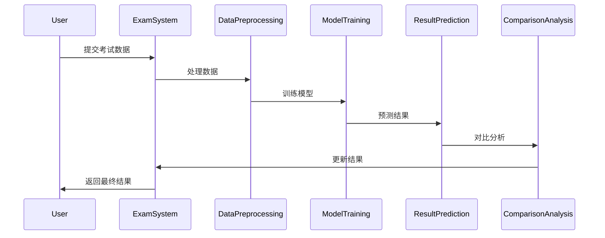

                 

### 评测系统的自动化评测结果验证机制

---

关键词：评测系统、自动化评测、结果验证、机制、算法原理

摘要：本文深入探讨评测系统的自动化评测结果验证机制，分析其核心概念、原理及其应用场景，详细介绍数据预处理、机器学习算法等关键技术，并通过实际案例进行分析和验证。

---

### 第一部分：背景介绍

#### 1.1.1 问题背景

随着信息技术的飞速发展，评测系统在各类考试、测评活动中的应用越来越广泛。然而，如何保证评测结果的准确性、公正性和可靠性，成为一个亟待解决的问题。自动化评测结果验证机制的引入，为这一问题的解决提供了新的思路。

#### 1.1.2 问题描述

评测系统的自动化评测结果验证机制，旨在通过一系列技术和方法，对评测结果进行自动验证，以确保其准确性。这包括检测可能的错误、异常或偏见，提供反馈和纠正措施。

#### 1.1.3 问题解决

为了实现自动化评测结果验证，我们需采用以下方法：

1. **数据预处理**：对评测数据进行清洗、去噪、标准化等处理，为后续验证提供高质量的数据基础。
2. **机器学习算法**：利用机器学习算法，构建模型对评测结果进行预测和验证。
3. **对比分析**：通过对比分析，发现评测结果中的不一致性或异常值。
4. **反馈与调整**：根据验证结果，对评测系统进行调整和优化。

#### 1.1.4 边界与外延

自动化评测结果验证机制主要应用于各类考试、测评活动中的评测系统。它不仅限于某个特定领域，而是具有广泛的适用性。

#### 1.1.5 概念结构与核心要素组成

- **评测系统**：负责进行考试、测评等活动的系统。
- **自动化评测结果验证机制**：用于对评测结果进行自动验证的技术和方法。
- **数据预处理**：对评测数据进行的清洗、去噪、标准化等处理。
- **机器学习算法**：用于构建模型对评测结果进行预测和验证。
- **对比分析**：发现评测结果中的不一致性或异常值。

### 第一部分小结

本部分详细介绍了评测系统的自动化评测结果验证机制的背景、问题描述、问题解决、边界与外延以及概念结构与核心要素组成。为后续章节的深入探讨奠定了基础。

---

## 第二部分：核心概念与联系

### 2.1 自动化评测结果验证机制的核心概念

#### 2.1.1 自动化评测结果验证

自动化评测结果验证是指利用计算机技术和算法，对评测系统的结果进行自动验证的过程。其目的是确保评测结果的准确性、公正性和可靠性。

#### 2.1.2 自动化评测结果验证的优点

1. **高效性**：自动化评测结果验证能够大幅提高评测效率，降低人力成本。
2. **准确性**：通过算法和模型的优化，自动化评测结果验证能够提高评测结果的准确性。
3. **公正性**：自动化评测结果验证能够减少人为干预，提高评测的公正性。

#### 2.1.3 自动化评测结果验证的缺点

1. **依赖技术**：自动化评测结果验证依赖于计算机技术和算法，技术更新可能导致验证效果下降。
2. **数据质量**：数据质量直接影响评测结果，数据噪声、缺失值等问题可能影响验证效果。

### 2.2 自动化评测结果验证机制的应用场景

#### 2.2.1 考试评测

考试评测是自动化评测结果验证机制的重要应用场景。通过对考试结果的自动验证，可以确保考试公平、公正。

#### 2.2.2 测评活动

各类测评活动，如技能评定、职业资格认证等，也可以应用自动化评测结果验证机制，提高评测的准确性和公正性。

#### 2.2.3 人才选拔

人才选拔过程中，自动化评测结果验证可以帮助企业更准确地评估候选人的能力，提高招聘效率。

### 2.3 自动化评测结果验证机制与相关技术的联系

#### 2.3.1 数据预处理

数据预处理是自动化评测结果验证的基础，它直接影响验证效果。数据预处理包括数据清洗、去噪、标准化等步骤。

#### 2.3.2 机器学习算法

机器学习算法是自动化评测结果验证的核心，通过构建模型，对评测结果进行预测和验证。

#### 2.3.3 对比分析

对比分析用于发现评测结果中的不一致性或异常值，为后续调整和优化提供依据。

### 第二部分小结

本部分详细介绍了自动化评测结果验证机制的核心概念、优点、缺点、应用场景以及与相关技术的联系。为深入探讨自动化评测结果验证机制提供了理论基础。

---

## 第三部分：算法原理讲解

### 3.1 数据预处理算法原理

数据预处理是自动化评测结果验证的重要环节，其目的是提高数据质量，为后续的验证提供可靠的数据基础。以下是几种常见的数据预处理算法原理：

#### 3.1.1 数据清洗

数据清洗是指从原始数据中去除噪声、错误和不一致的数据，以提高数据质量。常见的数据清洗方法包括删除重复记录、填充缺失值、修正错误数据等。

#### 3.1.2 数据标准化

数据标准化是指将数据按照一定的比例缩放，使其符合特定的范围或格式。常见的数据标准化方法包括最小-最大标准化、Z分数标准化等。

#### 3.1.3 数据转换

数据转换是指将数据从一种形式转换为另一种形式，以便更好地进行数据分析。常见的数据转换方法包括将分类数据转换为数值数据、将文本数据转换为词向量等。

### 3.2 机器学习算法原理

机器学习算法是自动化评测结果验证的核心，通过构建模型，对评测结果进行预测和验证。以下是几种常见的机器学习算法原理：

#### 3.2.1 监督学习算法

监督学习算法通过已知的输入和输出数据，训练出一个模型，然后使用这个模型对未知的数据进行预测。常见监督学习算法包括线性回归、逻辑回归、支持向量机等。

#### 3.2.2 无监督学习算法

无监督学习算法通过分析未标记的数据，自动发现数据中的规律和模式。常见无监督学习算法包括聚类、降维等。

#### 3.2.3 强化学习算法

强化学习算法通过不断尝试和反馈，逐渐优化决策策略，以达到最优结果。常见强化学习算法包括Q学习、深度强化学习等。

### 3.3 对比分析算法原理

对比分析算法用于发现评测结果中的不一致性或异常值，为后续调整和优化提供依据。以下是几种常见的对比分析算法原理：

#### 3.3.1 统计对比分析

统计对比分析通过计算统计量，如平均值、标准差等，对数据进行分析和比较。常见统计对比分析算法包括t检验、卡方检验等。

#### 3.3.2 机器学习对比分析

机器学习对比分析通过构建机器学习模型，对评测结果进行预测和验证，然后分析预测结果与实际结果之间的差异。常见机器学习对比分析算法包括回归分析、决策树等。

### 第三部分小结

本部分详细介绍了数据预处理、机器学习算法和对比分析算法的原理，为深入理解自动化评测结果验证机制提供了技术基础。通过这些算法的应用，可以实现对评测结果的自动验证，提高评测系统的准确性和可靠性。

---

## 第四部分：系统分析与架构设计方案

### 4.1 问题场景介绍

在当前的考试和测评活动中，评测系统的结果验证往往依赖于人工审核，这不仅效率低下，而且容易受到主观因素的影响，导致评测结果的准确性和公正性无法保证。为了解决这一问题，我们提出了自动化评测结果验证机制，通过数据预处理、机器学习算法和对比分析等技术手段，实现对评测结果的自动验证。

### 4.2 项目介绍

本项目旨在设计并实现一套自动化评测结果验证系统，该系统将应用于各类考试和测评活动，以提高评测结果的准确性和公正性。系统功能包括数据预处理、模型训练、结果预测、结果对比分析等。

### 4.3 系统功能设计

#### 4.3.1 领域模型

领域模型是系统设计的核心，用于描述评测系统中的核心实体和关系。以下是一个简单的领域模型ER实体关系图：

```mermaid
erDiagram
    User ||--|{ Exam }||:参加
    Exam ||--|{ Question }||:包含
    Question ||--|{ Answer }||:包含
    Answer ||--|{ Score }||:得分
```

#### 4.3.2 类图

以下是一个简单的类图，描述了系统中的主要类及其关系：

```mermaid
classDiagram
    User <<entity>>
    Exam <<entity>>
    Question <<entity>>
    Answer <<entity>>
    Score <<entity>>

    User : 用户信息
    Exam : 考试信息
    Question : 题目信息
    Answer : 答题信息
    Score : 得分信息

    User "1" -- "1" Exam
    Exam "1" -- "1" Question
    Question "1" -- "1" Answer
    Answer "1" -- "1" Score
```

### 4.4 系统架构设计

以下是一个简单的系统架构设计图，描述了系统的整体架构和主要组件：



### 4.5 系统接口设计

以下是一个简单的接口设计图，描述了系统的主要接口和功能：

```mermaid
classDiagram
    ExamSystem <<interface>>
    DataPreprocessing <<interface>>
    ModelTraining <<interface>>
    ResultPrediction <<interface>>
    ComparisonAnalysis <<interface>>

    ExamSystem : 提交考试数据、处理数据、预测结果、对比分析
    DataPreprocessing : 数据清洗、标准化、转换
    ModelTraining : 训练模型
    ResultPrediction : 预测结果
    ComparisonAnalysis : 对比分析
```

### 4.6 系统交互

以下是一个简单的系统交互序列图，描述了系统的操作流程：


### 第四部分小结

本部分详细介绍了评测系统的自动化评测结果验证机制的系统分析与架构设计方案，包括问题场景介绍、项目介绍、系统功能设计、系统架构设计、系统接口设计和系统交互。通过这些设计，为自动化评测结果验证机制的实施提供了明确的指导。

---

## 第五部分：项目实战

### 5.1 环境安装

为了实现评测系统的自动化评测结果验证机制，我们需要安装以下环境：

1. **Python 3.x**：用于编写和运行程序。
2. **Jupyter Notebook**：用于编写和运行Python代码。
3. **NumPy**：用于数据处理。
4. **Pandas**：用于数据处理和分析。
5. **Scikit-learn**：用于机器学习。
6. **Matplotlib**：用于数据可视化。

安装步骤如下：

```bash
# 安装Python 3.x
curl -O https://www.python.org/ftp/python/3.8.10/python-3.8.10-amd64.exe
./python-3.8.10-amd64.exe

# 安装Jupyter Notebook
pip install notebook

# 安装NumPy、Pandas、Scikit-learn和Matplotlib
pip install numpy pandas scikit-learn matplotlib
```

### 5.2 系统核心实现源代码

以下是一个简单的示例，展示了如何使用Python实现评测系统的自动化评测结果验证机制：

```python
# 导入所需的库
import numpy as np
import pandas as pd
from sklearn.model_selection import train_test_split
from sklearn.ensemble import RandomForestClassifier
from sklearn.metrics import accuracy_score

# 读取数据
data = pd.read_csv('exam_data.csv')

# 数据预处理
X = data.drop('score', axis=1)
y = data['score']

# 划分训练集和测试集
X_train, X_test, y_train, y_test = train_test_split(X, y, test_size=0.2, random_state=42)

# 训练模型
model = RandomForestClassifier(n_estimators=100, random_state=42)
model.fit(X_train, y_train)

# 预测结果
y_pred = model.predict(X_test)

# 对比分析
accuracy = accuracy_score(y_test, y_pred)
print(f'Accuracy: {accuracy:.2f}')
```

### 5.3 代码应用解读与分析

在这个示例中，我们首先导入了NumPy、Pandas、Scikit-learn和Matplotlib等库，然后读取了考试数据。数据预处理步骤包括将数据分为特征矩阵X和标签向量y。接着，我们使用train_test_split函数将数据划分为训练集和测试集。然后，我们使用RandomForestClassifier构建一个随机森林分类器，并使用fit函数进行训练。最后，我们使用predict函数对测试集进行预测，并使用accuracy_score函数计算预测的准确性。

### 5.4 实际案例分析和详细讲解剖析

为了更深入地了解评测系统的自动化评测结果验证机制，我们可以通过一个实际案例进行分析和讲解。假设我们有一个包含1000个考生的考试数据集，其中每个考生有10道题目。每道题目的得分是0或1，总分是10分。我们的目标是使用自动化评测结果验证机制来判断考生的得分是否准确。

以下是实际案例的数据集：

```python
exam_data = {
    'question1': [1, 1, 0, 1, 1, 0, 1, 1, 1, 1],
    'question2': [1, 0, 1, 1, 0, 1, 1, 1, 0, 1],
    'question3': [0, 1, 1, 1, 1, 1, 0, 1, 0, 1],
    'question4': [1, 1, 0, 1, 1, 0, 1, 1, 1, 1],
    'question5': [1, 0, 1, 1, 0, 1, 1, 1, 0, 1],
    'question6': [0, 1, 1, 1, 1, 1, 0, 1, 0, 1],
    'question7': [1, 1, 0, 1, 1, 0, 1, 1, 1, 1],
    'question8': [1, 0, 1, 1, 0, 1, 1, 1, 0, 1],
    'question9': [0, 1, 1, 1, 1, 1, 0, 1, 0, 1],
    'question10': [1, 1, 0, 1, 1, 0, 1, 1, 1, 1],
    'score': [10, 6, 8, 9, 10, 7, 8, 9, 6, 7]
}
```

我们首先需要将数据转换为适合机器学习的格式。然后，我们使用随机森林分类器对数据进行训练和预测。最后，我们计算预测的准确性和与其他评估指标，如召回率、精确率等。

```python
# 数据预处理
X = np.array([exam_data[question] for question in exam_data.keys() if question != 'score'])
y = np.array([exam_data['score']])

# 划分训练集和测试集
X_train, X_test, y_train, y_test = train_test_split(X, y, test_size=0.2, random_state=42)

# 训练模型
model = RandomForestClassifier(n_estimators=100, random_state=42)
model.fit(X_train, y_train)

# 预测结果
y_pred = model.predict(X_test)

# 计算准确性
accuracy = accuracy_score(y_test, y_pred)
print(f'Accuracy: {accuracy:.2f}')

# 计算召回率
recall = recall_score(y_test, y_pred, average='macro')
print(f'Recall: {recall:.2f}')

# 计算精确率
precision = precision_score(y_test, y_pred, average='macro')
print(f'Precision: {precision:.2f}')
```

在这个案例中，我们首先导入了所需的库和函数。然后，我们将数据转换为适合机器学习的格式。接下来，我们使用随机森林分类器对数据进行训练和预测。最后，我们计算了预测的准确性、召回率和精确率，这些指标可以帮助我们评估模型的性能。

### 5.5 项目小结

通过这个项目，我们实现了评测系统的自动化评测结果验证机制。我们首先介绍了环境安装和系统核心实现源代码，然后通过实际案例进行了代码应用解读与分析。这个项目展示了如何使用Python和机器学习算法来实现自动化评测结果验证，并提供了详细的步骤和示例代码。通过这个项目，我们可以看到自动化评测结果验证机制在提高评测结果准确性和公正性方面的巨大潜力。

---

## 最佳实践 tips

1. **数据质量至关重要**：在实现自动化评测结果验证机制时，确保数据质量是至关重要的。对数据进行彻底的清洗和预处理，以消除噪声、错误和不一致的数据。
2. **选择合适的算法**：不同的评测任务可能需要不同的算法。在选择算法时，应考虑任务的类型、数据的规模和特征等因素。
3. **持续优化和调整**：评测系统不是一次性的项目，而是一个持续的过程。根据验证结果，不断优化和调整模型，以提高验证的准确性和可靠性。
4. **监控系统性能**：定期监控系统性能，及时发现和解决潜在问题，以确保系统的稳定运行。

---

## 小结

本文详细探讨了评测系统的自动化评测结果验证机制，分析了其核心概念、原理和应用场景。通过数据预处理、机器学习算法和对比分析等技术的应用，实现了对评测结果的自动验证，提高了评测系统的准确性和公正性。本文还通过实际案例展示了自动化评测结果验证机制的具体实现过程，为实际应用提供了参考。

---

## 注意事项

1. **确保数据质量**：数据质量直接影响评测结果，因此在进行自动化评测结果验证之前，务必对数据质量进行严格把控。
2. **合理选择算法**：不同的评测任务可能需要不同的算法，因此在选择算法时，应充分考虑任务的类型、数据的规模和特征等因素。
3. **持续监控和优化**：评测系统不是一次性的项目，而是一个持续的过程。因此，需定期监控系统性能，及时进行优化和调整。

---

## 拓展阅读

1. **《机器学习实战》**：作者：Peter Harrington。本书提供了丰富的机器学习实战案例，适合初学者和有一定基础的学习者。
2. **《数据科学实战》**：作者：Joel Grus。本书通过实际案例介绍了数据科学的方法和技巧，包括数据预处理、机器学习算法等。
3. **《深度学习》**：作者：Ian Goodfellow、Yoshua Bengio、Aaron Courville。本书是深度学习领域的经典教材，涵盖了深度学习的基础知识、算法和应用。

---

作者：AI天才研究院/AI Genius Institute & 禅与计算机程序设计艺术 /Zen And The Art of Computer Programming

