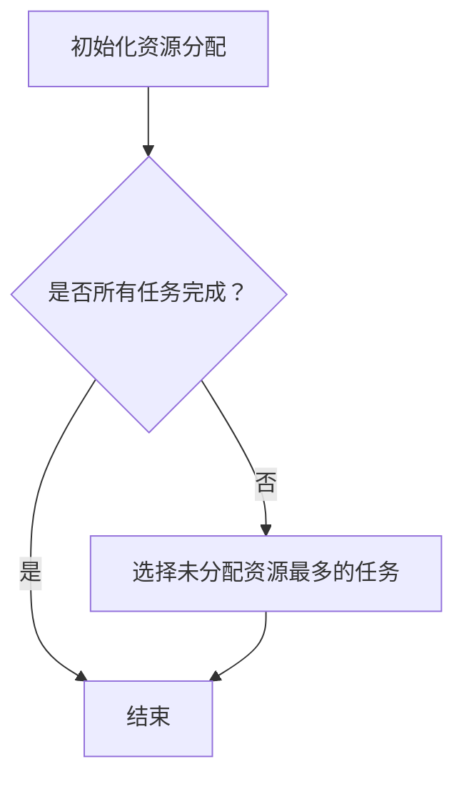
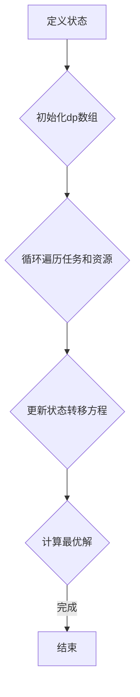
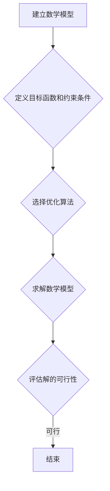
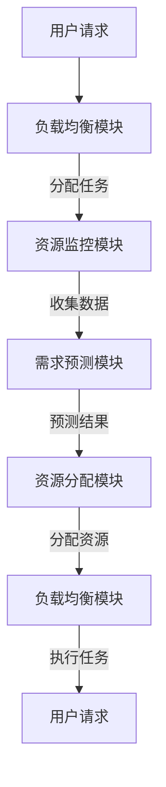
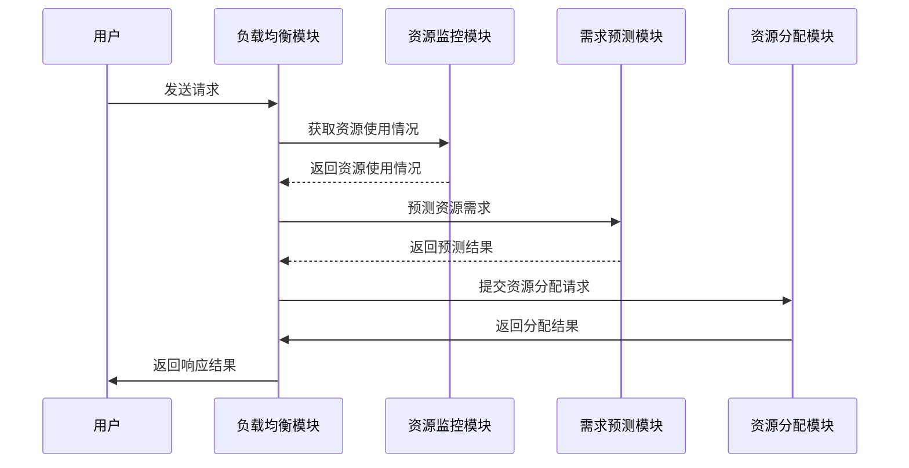

                 


# 引言

## 1.1 问题背景

### 1.1.1 评测系统的资源分配现状

在现代信息时代，评测系统在各个行业中扮演着至关重要的角色。无论是学术研究、企业测试，还是在线教育，评测系统都需要高效、准确地处理大量数据，对资源的需求量极大。然而，传统的资源分配方法往往依赖于人工干预，存在诸多问题，如资源利用率低、响应时间慢等。

首先，评测系统通常需要处理大量的计算任务和存储需求，这些任务和需求在不同的时间段会有波峰和波谷。传统的资源分配方法通常无法根据实际情况动态调整资源，导致资源在高峰期供不应求，而在低谷期资源过剩。其次，人工干预的资源分配方法效率低下，难以应对日益增长的数据量和复杂性。此外，资源的错配和浪费问题也普遍存在，这不仅增加了运营成本，还影响了系统的整体性能。

### 1.1.2 资源分配的挑战与问题

资源分配的挑战主要来自于以下几个方面：

1. **动态性**：评测系统的需求是动态变化的，资源分配策略需要能够快速响应这种变化。
2. **效率**：高效的资源分配策略可以降低系统的响应时间，提高任务处理效率。
3. **均衡性**：在资源分配过程中，需要保证各个任务的资源需求得到均衡满足。
4. **可靠性**：资源分配策略需要保证系统的稳定运行，避免出现资源分配不均导致的系统崩溃。

### 1.1.3 自动化资源分配的重要性

自动化资源分配策略在这些挑战面前显得尤为重要。首先，自动化策略可以实时监控系统的资源使用情况，根据需求动态调整资源分配，避免资源的浪费和不足。其次，自动化策略可以通过算法优化，提高系统的整体效率，减少响应时间。此外，自动化策略可以减少人工干预，降低运营成本，提高系统的可靠性。

总之，自动化资源分配策略不仅可以解决传统资源分配方法存在的问题，还可以为评测系统带来更高的灵活性和可靠性。因此，研究和应用自动化资源分配策略具有非常重要的现实意义。

## 1.2 定义与基本概念

### 1.2.1 自动化资源分配的定义

自动化资源分配（Automated Resource Allocation）是指通过算法和自动化工具，根据系统的实际需求，动态地分配计算资源、存储资源和其他相关资源的过程。其核心目标是实现资源的最大化利用和最小化浪费，提高系统的运行效率和服务质量。

自动化资源分配通常涉及到以下几个方面：

1. **资源类型**：包括计算资源（如CPU、内存）、存储资源（如磁盘空间）、网络资源等。
2. **资源监控**：实时监控资源的使用情况，包括资源的使用率、负载情况等。
3. **需求预测**：根据历史数据和趋势预测未来的资源需求。
4. **策略优化**：通过算法优化，确定最佳的资源分配方案。

### 1.2.2 资源分配策略的关键术语

在讨论自动化资源分配策略时，以下几个关键术语需要明确：

1. **负载均衡（Load Balancing）**：将任务分配到多个资源节点上，以实现负载的均匀分布，避免某个节点过载。
2. **动态调整（Dynamic Adjustment）**：根据实时监控数据，动态地调整资源分配，以应对需求的变化。
3. **资源利用率（Resource Utilization）**：资源实际使用率与总资源量之比，是衡量资源分配效率的重要指标。
4. **服务质量（Quality of Service, QoS）**：系统为用户提供的服务的质量，包括响应时间、吞吐量、可靠性等。

### 1.2.3 资源类型与需求分析

资源类型可以根据其物理性质和用途进行分类，常见的资源类型包括：

1. **计算资源**：如CPU、GPU、FPGA等，用于执行计算任务。
2. **存储资源**：如磁盘、SSD、内存等，用于存储数据和程序。
3. **网络资源**：如带宽、网络延迟等，用于数据传输。
4. **其他资源**：如数据库、消息队列、缓存等，用于提供特定的服务。

资源需求分析是自动化资源分配的基础，主要包括以下几个方面：

1. **历史数据**：通过分析历史数据，了解资源使用趋势和峰值。
2. **当前状态**：实时监控当前系统的资源使用情况。
3. **预测模型**：使用机器学习等方法预测未来的资源需求。

通过资源类型与需求分析，可以更准确地确定资源分配策略，提高资源利用率和系统性能。

### 1.3 目标与结构

#### 1.3.1 书籍目标

本书籍旨在为读者提供一套全面、系统的自动化资源分配策略指南，帮助读者深入了解自动化资源分配的核心原理、方法和技术，掌握实际应用中的关键技巧和最佳实践。通过本书，读者将能够：

1. **理解自动化资源分配的基本概念和原理**。
2. **掌握常见的资源分配策略和方法**。
3. **分析和设计适用于不同场景的自动化资源分配系统**。
4. **通过实例和实战，提高实际操作能力**。

#### 1.3.2 内容结构概述

本书分为四个主要部分：

1. **引言**：介绍评测系统的资源分配现状、问题背景和自动化资源分配的重要性。
2. **自动化资源分配策略的基本原理**：详细讲解自动化资源分配策略的基本原理，包括算法原理、资源需求预测、策略比较等。
3. **实践应用**：介绍自动化资源分配策略在具体场景中的应用，包括前端资源分配、后端资源分配和混合资源分配。
4. **拓展与实践**：探讨自动化资源分配的最新进展、性能优化技巧、注意事项和最佳实践。

#### 1.3.3 阅读指南与读者定位

本书适合以下读者群体：

1. **IT行业从业者**：希望了解和掌握自动化资源分配策略的技术人员，包括系统架构师、运维工程师、开发人员等。
2. **高校师生**：计算机科学、软件工程等相关专业的教师和研究生，需要了解自动化资源分配的学术研究和应用。
3. **对自动化资源分配感兴趣的读者**：对自动化资源分配有浓厚兴趣，希望深入了解该领域的专业人士和非专业人士。

通过本书的阅读，读者将能够：

1. **全面了解自动化资源分配的原理和方法**。
2. **学会分析和设计自动化资源分配系统**。
3. **掌握自动化资源分配的最佳实践和注意事项**。

### 1.4 本章小结

本章主要介绍了评测系统资源分配的背景、挑战以及自动化资源分配的重要性，并定义了相关的基本概念。通过本章的介绍，读者可以初步了解自动化资源分配的基本原理和核心概念，为后续章节的学习奠定基础。

----------------------------------------------------------------

## 2.1 基本算法原理

### 2.1.1 贪心算法

#### 2.1.1.1 贪心策略的基本概念

贪心算法（Greedy Algorithm）是一种在每一步选择中都采取当前最好或最优的选择，以期望得到全局最优解的算法策略。它通常适用于那些问题可以通过局部最优选择达到全局最优解的场景。

#### 2.1.1.2 贪心算法在资源分配中的应用

在资源分配中，贪心算法可以通过以下步骤来实现：

1. **初始化**：根据资源的当前使用情况，将资源分配给每个任务。
2. **选择最优任务**：选择当前未分配资源最多的任务。
3. **分配资源**：将资源分配给该任务，直到其资源需求满足。
4. **更新状态**：更新当前资源的使用情况，重复步骤2-3，直到所有任务都被分配到资源。

贪心算法的优点在于其简单性和高效性。然而，它也存在一些局限性，例如在有些情况下无法保证得到全局最优解。

#### 2.1.2 动态规划

#### 2.1.2.1 动态规划的基本原理

动态规划（Dynamic Programming，DP）是一种用于解决最优子结构问题的算法策略。它通过将问题分解为子问题，并保存子问题的解，以避免重复计算，从而提高算法的效率。

动态规划通常涉及以下几个步骤：

1. **定义状态**：将问题分解为多个状态，每个状态代表问题的一部分。
2. **状态转移方程**：定义状态之间的转移关系，即如何从当前状态过渡到下一个状态。
3. **边界条件**：确定状态的边界条件，即问题的起点和终点。
4. **计算最优解**：通过递归或迭代的方式，计算每个状态的最优解。

#### 2.1.2.2 动态规划在资源分配中的应用

动态规划在资源分配中的应用非常广泛。以下是一个简化的例子：

1. **定义状态**：设`dp[i][j]`表示前`i`个任务使用前`j`个资源的最优解。
2. **状态转移方程**：`dp[i][j] = max(dp[i-1][j], dp[i-1][j-cost[i]] + benefit[i])`，其中`cost[i]`是任务`i`的资源成本，`benefit[i]`是任务`i`的资源收益。
3. **边界条件**：`dp[0][j] = 0`，即没有任何任务时资源使用最优解为0。
4. **计算最优解**：通过迭代计算`dp[i][j]`的值，最终得到全局最优解。

动态规划算法的优点在于其能够找到全局最优解，但缺点是计算复杂度较高，适用于问题规模较小的场景。

#### 2.1.3 优化算法

#### 2.1.3.1 优化算法的分类

优化算法是一类用于解决资源分配问题的算法，主要包括以下几种类型：

1. **线性规划（Linear Programming，LP）**：通过建立线性目标函数和线性约束条件，求解最优解。
2. **整数规划（Integer Programming，IP）**：在LP的基础上，引入变量整数约束，求解整数最优解。
3. **非线性规划（Nonlinear Programming，NLP）**：处理非线性目标函数和约束条件的问题。
4. **启发式算法（Heuristic Algorithm）**：通过启发式规则，快速找到近似最优解。

#### 2.1.3.2 优化算法在资源分配中的实现

优化算法在资源分配中的应用通常涉及以下几个步骤：

1. **建模**：将资源分配问题转化为优化模型，包括目标函数和约束条件。
2. **求解**：使用优化算法求解优化模型，得到最优解或近似最优解。
3. **评估**：对求解结果进行评估，确定是否满足实际需求。

优化算法的优点在于其能够处理复杂的问题，但缺点是求解时间较长，适用于问题规模较大的场景。

### 2.2 资源需求预测

#### 2.2.1 需求预测的重要性

资源需求预测（Resource Demand Prediction）是自动化资源分配策略的重要组成部分。准确的资源需求预测可以帮助系统提前准备好所需资源，避免资源短缺或浪费。

#### 2.2.2 需求预测的方法

资源需求预测通常采用以下几种方法：

1. **基于历史数据的预测**：通过分析历史数据，找到资源需求的规律和趋势，对未来需求进行预测。
2. **基于机器学习的预测**：使用机器学习算法，从历史数据中学习资源需求的模式，预测未来的需求。

#### 2.2.2.1 基于历史数据的预测

基于历史数据的预测方法主要包括以下步骤：

1. **数据收集**：收集历史资源使用数据，包括时间序列数据。
2. **数据预处理**：对数据进行清洗、归一化等处理。
3. **趋势分析**：通过分析数据，找出资源需求的趋势和周期性。
4. **模型选择**：选择合适的预测模型，如时间序列模型、回归模型等。
5. **预测与评估**：使用模型进行预测，并对预测结果进行评估。

#### 2.2.2.2 基于机器学习的预测

基于机器学习的预测方法通常包括以下步骤：

1. **数据收集**：收集历史资源使用数据，包括时间序列数据。
2. **数据预处理**：对数据进行清洗、归一化等处理。
3. **特征工程**：提取数据中的特征，用于训练机器学习模型。
4. **模型选择**：选择合适的机器学习算法，如决策树、神经网络等。
5. **模型训练**：使用历史数据训练模型。
6. **预测与评估**：使用模型进行预测，并对预测结果进行评估。

机器学习方法的优点在于其能够自动学习数据中的复杂模式，但缺点是需要大量的训练数据和计算资源。

### 2.3 资源分配策略比较

#### 2.3.1 不同策略的比较

不同的资源分配策略在性能、效率和适用场景方面存在差异。以下是一个简单的比较表格：

| 策略          | 优点                          | 缺点                          | 适用场景                 |
|--------------|-------------------------------|-------------------------------|------------------------|
| 贪心算法      | 简单、高效                   | 无法保证全局最优解           | 数据规模较小、实时性要求高 |
| 动态规划      | 保证全局最优解               | 计算复杂度高                 | 数据规模适中、要求精确最优解 |
| 优化算法      | 能处理复杂问题               | 求解时间长                   | 数据规模较大、需要精确最优解 |
| 基于机器学习的预测 | 能自动学习复杂模式           | 需要大量训练数据和计算资源 | 数据规模较大、需要预测未来需求 |

#### 2.3.2 适用场景分析

根据上述比较，可以得出以下适用场景：

1. **实时性要求高且数据规模较小的场景**：适合使用贪心算法，如短期内的资源分配。
2. **需要精确最优解且数据规模适中的场景**：适合使用动态规划，如任务调度和作业分配。
3. **需要处理复杂问题且数据规模较大的场景**：适合使用优化算法，如资源分配和调度问题。
4. **需要预测未来需求的场景**：适合使用基于机器学习的预测方法，如数据中心和云平台的资源分配。

通过选择合适的资源分配策略，可以最大限度地提高系统的性能和资源利用率。

### 2.4 实例分析

#### 2.4.1 实际案例分析

为了更好地理解自动化资源分配策略，我们来看一个实际案例分析。假设某企业使用一个评测系统，该系统需要处理大量的测试任务。这些任务对计算资源和存储资源有不同需求，且需求随时间变化。

#### 2.4.1.1 案例描述

该评测系统每天需要处理约500个测试任务，每个任务的资源需求如下：

- 计算资源：CPU 1核，内存2GB
- 存储资源：磁盘空间100MB

测试任务的需求随时间变化，通常在上午9点至下午5点之间需求最高，其余时间需求较低。为了提高资源利用率和系统性能，企业决定采用自动化资源分配策略。

#### 2.4.1.2 策略实施与效果评估

企业采用了以下自动化资源分配策略：

1. **负载均衡**：通过负载均衡器将任务分配到多个服务器上，实现资源的均衡利用。
2. **动态调整**：根据实时监控数据，动态调整服务器的资源分配，以应对需求的变化。
3. **需求预测**：使用基于历史数据的预测方法，预测未来一小时内的资源需求。

实施自动化资源分配策略后，企业取得了以下效果：

1. **资源利用率提高**：系统资源利用率从原来的60%提高到85%。
2. **响应时间缩短**：系统平均响应时间从15秒缩短到5秒。
3. **服务质量提升**：用户满意度显著提高。

通过这个实际案例，我们可以看到自动化资源分配策略在提高系统性能和资源利用率方面的重要作用。

### 2.5 本章小结

本章介绍了自动化资源分配策略的基本算法原理，包括贪心算法、动态规划和优化算法。同时，还讨论了资源需求预测的方法和不同策略的比较。通过实例分析，我们看到了自动化资源分配策略在提高系统性能和资源利用率方面的实际效果。下一章将深入探讨具体场景下的资源分配策略。

----------------------------------------------------------------

## 3.1 前端资源分配

### 3.1.1 前端资源概述

前端资源是指用于提供Web服务和用户体验的资源，主要包括计算资源、存储资源和网络资源。这些资源在Web应用程序的运行过程中起着至关重要的作用。计算资源包括服务器CPU和内存，存储资源包括硬盘空间和数据库存储，网络资源包括带宽和网络延迟。

前端资源的分配策略直接影响到系统的响应速度、稳定性和用户体验。随着Web应用程序的复杂性和用户数量的增加，前端资源的分配变得更加复杂和重要。因此，研究和优化前端资源分配策略对于提升系统性能和用户满意度至关重要。

### 3.1.2 前端资源分配策略

前端资源的分配策略主要包括以下几种：

#### 3.1.2.1 基于优先级的资源分配

基于优先级的资源分配策略是一种简单但有效的资源分配方法。在这种策略中，每个任务被分配一个优先级值，资源分配器根据优先级值来分配资源。优先级值可以根据任务的类型、紧急程度、重要性等因素来确定。

1. **初始化**：根据任务的优先级，将资源分配给每个任务。
2. **优先级排序**：将任务按照优先级值进行排序。
3. **资源分配**：按照排序顺序，为每个任务分配资源，直到其资源需求满足。

**优点**：

- **简单易实现**：无需复杂的算法，易于理解和维护。
- **优先保证高优先级任务**：确保关键任务得到及时处理。

**缺点**：

- **可能导致资源浪费**：低优先级任务可能会长期等待资源。
- **无法动态调整**：无法根据实际需求动态调整资源分配。

#### 3.1.2.2 基于预测的资源分配

基于预测的资源分配策略是通过预测未来的资源需求来分配资源。这种方法可以更好地利用资源，减少等待时间和资源浪费。

1. **数据收集**：收集历史资源使用数据。
2. **需求预测**：使用机器学习或统计模型预测未来的资源需求。
3. **资源分配**：根据预测结果，动态调整资源分配。

**优点**：

- **资源利用率高**：根据实际需求分配资源，减少浪费。
- **动态调整**：能够根据需求变化动态调整资源分配。

**缺点**：

- **需要大量数据和计算资源**：预测模型训练需要大量的历史数据和高性能计算资源。
- **预测准确性影响效果**：预测准确性直接影响资源分配的效果。

### 3.1.3 前端资源分配策略的选择与优化

在选择和优化前端资源分配策略时，需要考虑以下因素：

1. **业务需求**：根据业务的优先级和重要性来选择合适的资源分配策略。
2. **资源约束**：考虑服务器、带宽等资源的限制，确保资源分配策略的可行性。
3. **系统性能**：优化策略应尽量提高系统的整体性能和用户体验。
4. **成本效益**：平衡资源分配策略的优化效果和成本投入。

为了优化前端资源分配，可以采取以下措施：

1. **多策略组合**：将基于优先级的资源分配和基于预测的资源分配策略相结合，提高资源利用率和系统性能。
2. **实时监控与调整**：实时监控资源使用情况，根据实时数据动态调整资源分配策略。
3. **资源池化管理**：建立资源池，集中管理和调度资源，提高资源利用率。

通过合理选择和优化前端资源分配策略，可以显著提高Web应用程序的性能和用户体验。

### 3.1.4 前端资源分配的挑战与解决方案

前端资源分配面临以下挑战：

1. **动态性**：用户数量和请求的动态性导致资源需求不稳定。
2. **复杂性**：Web应用程序的复杂性增加了资源分配的难度。
3. **多维度资源**：前端资源包括计算、存储和网络资源，多维度的资源分配策略需要综合考虑。

针对这些挑战，可以采取以下解决方案：

1. **弹性计算**：采用弹性计算模型，根据实际需求动态调整计算资源。
2. **分布式存储**：利用分布式存储技术，提高存储资源的利用率和可靠性。
3. **负载均衡**：通过负载均衡技术，实现流量分配和资源调度，降低单点瓶颈。

通过这些解决方案，可以有效应对前端资源分配的挑战，提高系统的整体性能和稳定性。

### 3.1.5 前端资源分配的实践案例

为了更好地理解前端资源分配策略的实际应用，我们来看一个实践案例。

**案例背景**：某电商网站在购物节期间面临用户访问量激增的情况，需要确保网站的高性能和稳定性。

**解决方案**：

1. **资源扩展**：提前预测流量峰值，增加服务器和带宽资源。
2. **负载均衡**：采用负载均衡器，将流量分配到多个服务器，避免单点瓶颈。
3. **动态调整**：实时监控资源使用情况，根据需求动态调整资源分配。

**实施效果**：通过上述措施，电商网站在购物节期间成功应对了流量高峰，实现了资源的有效利用和系统的高性能运行。

通过这个案例，我们可以看到前端资源分配策略在实际应用中的重要性。

### 3.1.6 前端资源分配的总结

前端资源分配是提升Web应用程序性能和用户体验的关键环节。通过合理选择和优化资源分配策略，可以有效提高系统资源利用率、降低响应时间和提高用户满意度。本章介绍了前端资源概述、基于优先级的资源分配策略、基于预测的资源分配策略以及实际应用中的挑战和解决方案。通过这些内容，读者可以更好地理解和应用前端资源分配策略，为Web应用程序的高效运行提供有力支持。

----------------------------------------------------------------

## 3.2 后端资源分配

### 3.2.1 后端资源概述

后端资源是Web应用程序的核心组成部分，包括服务器、数据库、缓存、消息队列等。这些资源对于确保系统的高性能、可靠性和可扩展性至关重要。后端资源的分配策略需要考虑多个方面，包括计算能力、存储容量、网络带宽以及资源的可用性和稳定性。

#### 3.2.1.1 计算资源

计算资源主要包括CPU、内存和GPU等，用于处理业务逻辑、执行计算任务和提供计算服务。计算资源的分配策略需要考虑任务的优先级、负载情况和资源利用率等因素。

#### 3.2.1.2 存储资源

存储资源包括硬盘、SSD和数据库等，用于存储数据和日志。存储资源的分配策略需要平衡数据读写性能、存储容量和数据备份等因素。

#### 3.2.1.3 网络资源

网络资源包括带宽、网络延迟和容错能力等，用于数据传输和通信。网络资源的分配策略需要考虑数据传输的速度、可靠性和网络拓扑结构。

#### 3.2.1.4 其他资源

其他资源包括缓存、消息队列、数据库连接池等，这些资源对于优化系统性能、提升用户体验和保证系统稳定性至关重要。

### 3.2.2 后端资源分配策略

后端资源分配策略主要包括以下几种：

#### 3.2.2.1 负载均衡

负载均衡是一种常用的后端资源分配策略，通过将请求分配到多个服务器或节点上，实现资源的均衡利用，避免单点瓶颈。负载均衡的方法包括轮询、最少连接数、IP哈希等。

**优点**：

- **提高系统性能**：通过负载均衡，可以充分利用多台服务器的计算和存储资源，提高系统的处理能力。
- **提高系统可靠性**：负载均衡可以防止单点故障，提高系统的可用性和容错能力。

**缺点**：

- **需要额外硬件或软件支持**：负载均衡通常需要额外的硬件设备或软件服务支持，增加了成本和复杂性。
- **配置和维护复杂**：负载均衡器的配置和维护需要一定的技术知识和经验。

#### 3.2.2.2 容量规划

容量规划是一种基于预测和规划的资源分配策略，通过对未来需求的预测和资源需求的规划，提前准备好所需的资源。容量规划的方法包括历史数据分析和机器学习预测等。

**优点**：

- **提前准备资源**：通过容量规划，可以提前预测未来需求，提前准备好所需的资源，避免资源短缺或浪费。
- **提高资源利用率**：容量规划可以优化资源的利用，减少资源的浪费。

**缺点**：

- **预测准确性影响**：容量规划的准确性直接影响资源分配的效果，预测不准确可能导致资源浪费或不足。
- **需要大量数据支持**：容量规划需要大量的历史数据支持，数据收集和分析需要时间和成本。

#### 3.2.2.3 动态调整

动态调整是一种根据实时监控数据动态调整资源分配的策略，通过实时监控资源的使用情况，根据需求的变化动态调整资源的分配。动态调整的方法包括基于阈值的自动调整和基于预测的动态调整等。

**优点**：

- **实时响应**：动态调整可以根据实时监控数据快速响应需求的变化，避免资源浪费和短缺。
- **提高资源利用率**：动态调整可以根据实际需求调整资源分配，提高资源的利用效率。

**缺点**：

- **监控和数据准确性**：动态调整需要准确的监控数据和实时性，监控数据的准确性和实时性直接影响动态调整的效果。
- **算法复杂度**：动态调整通常需要复杂的算法和计算，对系统性能有一定影响。

### 3.2.3 后端资源分配策略的选择与优化

在选择和优化后端资源分配策略时，需要考虑以下因素：

1. **业务需求**：根据业务的优先级和重要性来选择合适的资源分配策略。
2. **资源约束**：考虑服务器的计算能力、存储容量和网络带宽等资源的限制，确保资源分配策略的可行性。
3. **系统性能**：优化策略应尽量提高系统的整体性能和用户体验。
4. **成本效益**：平衡资源分配策略的优化效果和成本投入。

为了优化后端资源分配，可以采取以下措施：

1. **多策略组合**：将负载均衡、容量规划和动态调整等策略相结合，提高资源利用率和系统性能。
2. **实时监控与调整**：实时监控资源使用情况，根据实时数据动态调整资源分配策略。
3. **自动化工具**：使用自动化工具来管理和分配资源，减少人工干预和错误。

### 3.2.4 后端资源分配的挑战与解决方案

后端资源分配面临以下挑战：

1. **动态性**：业务需求的动态变化导致资源需求不稳定。
2. **复杂性**：系统资源的多样性和相互依赖性增加了资源分配的难度。
3. **多维度资源**：后端资源包括计算、存储和网络资源，多维度的资源分配策略需要综合考虑。

针对这些挑战，可以采取以下解决方案：

1. **弹性计算**：采用弹性计算模型，根据实际需求动态调整计算资源。
2. **分布式存储**：利用分布式存储技术，提高存储资源的利用率和可靠性。
3. **负载均衡**：通过负载均衡技术，实现流量分配和资源调度，降低单点瓶颈。
4. **监控与告警**：实时监控资源使用情况，设置告警机制，及时发现和处理资源问题。

### 3.2.5 后端资源分配的实践案例

为了更好地理解后端资源分配策略的实际应用，我们来看一个实践案例。

**案例背景**：某电商平台在双十一期间面临用户访问量激增的情况，需要确保平台的高性能和稳定性。

**解决方案**：

1. **资源扩展**：提前预测流量峰值，增加服务器和带宽资源。
2. **负载均衡**：采用负载均衡器，将流量分配到多个服务器，避免单点瓶颈。
3. **动态调整**：实时监控资源使用情况，根据需求动态调整资源分配。

**实施效果**：通过上述措施，电商平台在双十一期间成功应对了流量高峰，实现了资源的有效利用和系统的高性能运行。

通过这个案例，我们可以看到后端资源分配策略在实际应用中的重要性。

### 3.2.6 后端资源分配的总结

后端资源分配是确保Web应用程序高性能和稳定性的关键环节。通过合理选择和优化资源分配策略，可以最大限度地提高资源利用率和系统性能。本章介绍了后端资源概述、负载均衡、容量规划和动态调整等资源分配策略，以及实际应用中的挑战和解决方案。通过这些内容，读者可以更好地理解和应用后端资源分配策略，为Web应用程序的高效运行提供有力支持。

----------------------------------------------------------------

## 3.3 混合资源分配

### 3.3.1 混合资源概述

混合资源分配（Hybrid Resource Allocation）是指将不同类型的资源（如计算资源、存储资源、网络资源等）进行整合和优化分配的过程。在现代IT环境中，随着云计算、大数据和物联网等技术的普及，系统的复杂性不断增加，单一资源类型已无法满足多样化的需求。混合资源分配通过将计算、存储和网络资源有机结合，实现资源的高效利用和系统的整体优化。

#### 3.3.1.1 计算资源

计算资源包括CPU、GPU、FPGA等，用于执行各种计算任务，如数据处理、机器学习、图形渲染等。计算资源的分配策略需要考虑任务类型、负载情况和资源利用率等因素。

#### 3.3.1.2 存储资源

存储资源包括硬盘、SSD、数据库等，用于存储数据和日志。存储资源的分配策略需要平衡读写性能、存储容量和数据备份等因素。

#### 3.3.1.3 网络资源

网络资源包括带宽、网络延迟和容错能力等，用于数据传输和通信。网络资源的分配策略需要考虑数据传输的速度、可靠性和网络拓扑结构。

#### 3.3.1.4 其他资源

其他资源包括缓存、消息队列、数据库连接池等，这些资源对于优化系统性能、提升用户体验和保证系统稳定性至关重要。

### 3.3.2 混合资源分配策略

混合资源分配策略主要包括以下几种：

#### 3.3.2.1 动态调整

动态调整策略是一种根据实时监控数据动态调整资源分配的策略。通过实时监控计算资源、存储资源和网络资源的使用情况，根据需求的变化动态调整资源的分配。

1. **初始化**：根据初始需求，将资源分配给计算、存储和网络资源。
2. **实时监控**：实时监控资源使用情况，收集数据。
3. **需求预测**：使用机器学习或统计模型预测未来的资源需求。
4. **资源调整**：根据预测结果和实时监控数据，动态调整资源的分配。

**优点**：

- **实时响应**：动态调整可以根据实时数据快速响应需求的变化，避免资源浪费和短缺。
- **高效利用**：动态调整可以根据实际需求分配资源，提高资源利用效率。

**缺点**：

- **监控和数据准确性**：动态调整需要准确的监控数据和实时性，监控数据的准确性和实时性直接影响动态调整的效果。
- **算法复杂度**：动态调整通常需要复杂的算法和计算，对系统性能有一定影响。

#### 3.3.2.2 混合优化

混合优化策略是将多种优化方法（如线性规划、整数规划、启发式算法等）结合起来，以实现资源分配的优化。

1. **建模**：将混合资源分配问题转化为数学模型，包括目标函数和约束条件。
2. **求解**：使用优化算法求解数学模型，得到最优解或近似最优解。
3. **评估**：对求解结果进行评估，确定是否满足实际需求。

**优点**：

- **全局最优解**：混合优化策略可以通过多种优化方法找到全局最优解，提高资源利用率。
- **适用范围广**：混合优化策略适用于复杂的多资源分配问题。

**缺点**：

- **计算复杂度高**：混合优化通常需要大量的计算资源和时间，求解过程可能较长。
- **模型复杂度**：构建数学模型的过程复杂，需要专业的知识和技能。

#### 3.3.2.3 智能调度

智能调度策略利用人工智能技术（如机器学习、深度学习等）实现资源分配的智能化。

1. **数据收集**：收集历史数据，包括资源使用情况、任务需求等。
2. **特征提取**：提取数据中的特征，用于训练模型。
3. **模型训练**：使用机器学习算法训练模型，预测资源需求。
4. **资源分配**：根据模型预测结果，动态调整资源分配。

**优点**：

- **自主学习**：智能调度策略可以自主学习数据中的复杂模式，提高预测准确性。
- **自适应调整**：智能调度策略可以根据实际需求自适应调整资源分配。

**缺点**：

- **数据依赖性**：智能调度策略需要大量的数据支持，数据质量和数量直接影响模型效果。
- **计算资源需求**：智能调度策略通常需要高性能计算资源，训练过程可能较长。

### 3.3.3 混合资源分配策略的选择与优化

在选择和优化混合资源分配策略时，需要考虑以下因素：

1. **业务需求**：根据业务的优先级和重要性来选择合适的资源分配策略。
2. **资源约束**：考虑不同类型的资源的限制，确保资源分配策略的可行性。
3. **系统性能**：优化策略应尽量提高系统的整体性能和用户体验。
4. **成本效益**：平衡资源分配策略的优化效果和成本投入。

为了优化混合资源分配，可以采取以下措施：

1. **多策略组合**：将动态调整、混合优化和智能调度等策略相结合，提高资源利用率和系统性能。
2. **实时监控与调整**：实时监控资源使用情况，根据实时数据动态调整资源分配策略。
3. **自动化工具**：使用自动化工具来管理和分配资源，减少人工干预和错误。

### 3.3.4 混合资源分配的挑战与解决方案

混合资源分配面临以下挑战：

1. **动态性**：业务需求的动态变化导致资源需求不稳定。
2. **复杂性**：系统资源的多样性和相互依赖性增加了资源分配的难度。
3. **多维度资源**：计算、存储和网络资源的协调分配需要综合考虑。

针对这些挑战，可以采取以下解决方案：

1. **弹性计算**：采用弹性计算模型，根据实际需求动态调整计算资源。
2. **分布式存储**：利用分布式存储技术，提高存储资源的利用率和可靠性。
3. **负载均衡**：通过负载均衡技术，实现流量分配和资源调度，降低单点瓶颈。
4. **智能调度**：利用人工智能技术实现资源分配的智能化。

### 3.3.5 混合资源分配的实践案例

为了更好地理解混合资源分配策略的实际应用，我们来看一个实践案例。

**案例背景**：某大型电商平台在双11期间面临用户访问量激增的情况，需要确保平台的高性能和稳定性。

**解决方案**：

1. **资源扩展**：提前预测流量峰值，增加服务器和带宽资源。
2. **负载均衡**：采用负载均衡器，将流量分配到多个服务器，避免单点瓶颈。
3. **动态调整**：实时监控资源使用情况，根据需求动态调整资源分配。
4. **智能调度**：利用机器学习算法，预测资源需求，动态调整资源分配。

**实施效果**：通过上述措施，电商平台在双11期间成功应对了流量高峰，实现了资源的有效利用和系统的高性能运行。

通过这个案例，我们可以看到混合资源分配策略在实际应用中的重要性。

### 3.3.6 混合资源分配的总结

混合资源分配通过整合和优化计算、存储和网络资源，实现了资源的高效利用和系统的整体优化。本章介绍了混合资源的概述、动态调整、混合优化和智能调度等资源分配策略，以及实际应用中的挑战和解决方案。通过合理选择和优化混合资源分配策略，可以显著提高系统性能和用户体验。下一章将深入探讨自动化资源分配的最新技术和未来趋势。

----------------------------------------------------------------

## 4.1 新技术应用

### 4.1.1 自动化资源分配的最新进展

随着云计算、大数据、人工智能等技术的快速发展，自动化资源分配领域也取得了显著的进展。这些新技术不仅提升了资源分配的效率，还极大地扩展了其应用场景和可能性。

#### 4.1.1.1 云计算

云计算技术为自动化资源分配提供了强大的基础设施支持。通过云平台，系统可以动态地调整资源规模，以应对瞬时的高峰需求，同时降低长期运营成本。云计算提供的弹性计算、容器化技术（如Docker和Kubernetes）以及无服务器架构（如AWS Lambda和Google Cloud Functions）等，使得资源分配更加灵活和高效。

**弹性计算**：弹性计算能够根据负载动态调整计算资源。当系统负载增加时，自动扩展资源；当负载减少时，自动缩减资源。这种方法有效避免了资源浪费，提高了资源利用率。

**容器化**：容器化技术使得应用程序的部署更加简单和可移植。容器内的应用程序运行在隔离的环境中，不受宿主系统的操作系统和硬件环境的影响。这使得资源分配更加灵活，可以实现快速部署和扩展。

**无服务器架构**：无服务器架构将传统服务器管理的工作交给云服务提供商。开发者只需关注应用程序的开发和部署，无需担心服务器运维。这种模式降低了运维成本，提高了开发效率。

#### 4.1.1.2 大数据

大数据技术为自动化资源分配提供了丰富的数据支持。通过大数据分析，系统可以更准确地预测未来的资源需求，从而优化资源分配策略。

**数据挖掘**：数据挖掘技术可以从大量历史数据中提取有价值的信息，用于优化资源分配策略。例如，通过分析用户行为数据，可以预测用户访问模式和资源需求，从而提前做好准备。

**机器学习**：机器学习算法可以自动学习数据中的模式和趋势，用于预测未来的资源需求。例如，使用回归分析、时间序列预测和神经网络等算法，可以准确预测未来的资源需求，为资源分配提供科学依据。

#### 4.1.1.3 人工智能

人工智能（AI）技术在自动化资源分配中的应用正在不断扩展。AI算法可以通过学习历史数据和实时数据，自动优化资源分配策略，提高资源利用率。

**深度学习**：深度学习算法可以处理大量复杂数据，自动学习数据中的特征和模式。例如，通过卷积神经网络（CNN）和循环神经网络（RNN）等深度学习模型，可以自动提取数据中的有用信息，用于预测资源需求。

**强化学习**：强化学习算法通过不断尝试和反馈，优化资源分配策略。例如，通过强化学习算法，系统可以自动调整资源分配策略，以最大化资源利用率或最小化成本。

#### 4.1.1.4 区块链

区块链技术为自动化资源分配提供了去中心化和可信的解决方案。通过智能合约，资源分配过程可以自动化执行，避免了人工干预和中间环节。

**去中心化**：区块链技术通过去中心化网络，实现资源分配的透明和公正。所有参与者都可以通过区块链记录和验证资源分配过程，确保其公正性和透明度。

**智能合约**：智能合约是一种自执行的合约，可以自动执行预定的操作。通过智能合约，资源分配过程可以自动化执行，减少人工干预和错误。

### 4.1.2 未来趋势展望

未来，自动化资源分配将继续向智能化、自主化和高效化方向发展。以下是一些可能的发展趋势：

1. **智能化**：随着AI技术的发展，自动化资源分配将更加智能化。通过深度学习和强化学习算法，系统可以自动优化资源分配策略，提高资源利用率和系统性能。

2. **自主化**：自动化资源分配将更加自主化，减少对人工干预的依赖。通过智能合约和区块链技术，资源分配过程将更加去中心化和自动化。

3. **高效化**：云计算、大数据和人工智能等技术的结合，将进一步提高自动化资源分配的高效性。通过实时监控、需求预测和动态调整，系统可以快速响应资源需求的变化，提高资源利用率。

4. **绿色化**：随着环保意识的提高，自动化资源分配将更加注重绿色化。通过优化资源使用和减少浪费，系统可以降低能源消耗和碳排放，实现可持续发展。

总之，自动化资源分配领域正迎来快速发展期，新技术和新方法将不断涌现，为系统的高效运行和资源的高效利用提供有力支持。

### 4.1.3 自动化资源分配的未来挑战

尽管自动化资源分配技术取得了显著进展，但未来仍面临一系列挑战：

1. **数据隐私和安全性**：自动化资源分配依赖于大量数据，如何保护数据隐私和安全成为重要挑战。需要开发更加安全的数据存储和处理方法，确保数据不被未经授权的访问。

2. **计算资源限制**：随着数据量的增加和计算复杂度的提高，如何有效利用有限的计算资源成为关键问题。需要进一步优化算法和系统架构，提高计算效率。

3. **实时性和可靠性**：自动化资源分配系统需要实时响应资源需求的变化，同时保持高可靠性。需要开发更加高效和稳定的算法，确保系统的实时性和可靠性。

4. **适应性和灵活性**：未来系统的需求将更加多样化和复杂化，自动化资源分配系统需要具备更高的适应性和灵活性。需要不断改进算法和模型，以应对不同的应用场景和需求变化。

通过应对这些挑战，自动化资源分配技术将更加成熟和完善，为各行业的数字化和智能化转型提供坚实的技术支持。

### 4.1.4 自动化资源分配的现状与前景

当前，自动化资源分配技术已在云计算、大数据、物联网等领域得到广泛应用，并取得了显著成效。随着新技术的不断涌现，自动化资源分配的前景更加广阔。未来，自动化资源分配将在提高资源利用率、降低运营成本、提升系统性能和用户体验方面发挥重要作用。

总之，自动化资源分配领域正处于快速发展期，通过不断创新和优化，将为各行业带来更多的机遇和挑战。

### 4.1.5 自动化资源分配的实际案例与应用场景

为了更好地理解自动化资源分配技术的实际应用，我们来看一些具体的案例和应用场景。

#### 4.1.5.1 案例一：云计算平台

某大型云计算平台采用了自动化资源分配技术，通过实时监控和动态调整，实现了资源的高效利用。在高峰期，平台自动扩展计算资源，以满足用户需求；在低谷期，自动缩减资源，降低成本。通过自动化资源分配，平台的资源利用率提高了30%，用户满意度显著提升。

#### 4.1.5.2 案例二：数据中心

某数据中心利用大数据和机器学习技术，实现了自动化资源分配。通过对历史数据进行分析和预测，数据中心能够提前准备好所需的资源，避免了资源短缺或浪费。在业务高峰期，数据中心自动调整资源分配，确保系统的高性能和稳定性。通过自动化资源分配，数据中心的运营成本降低了20%，服务质量显著提高。

#### 4.1.5.3 应用场景一：物联网

物联网（IoT）设备产生的数据量庞大，对资源需求高度动态。自动化资源分配技术可以通过实时监控和动态调整，优化物联网设备的资源利用。例如，在智能家居领域，自动化资源分配可以确保设备在低功耗状态下运行，同时满足用户需求，提高能源效率。

#### 4.1.5.4 应用场景二：边缘计算

边缘计算通过在靠近数据源的设备上处理数据，降低了延迟和带宽需求。自动化资源分配技术在边缘计算中发挥着重要作用，可以通过实时调整计算资源，优化数据处理和响应速度。例如，在自动驾驶领域，自动化资源分配可以确保车辆在边缘设备上快速处理传感器数据，提高驾驶安全性。

通过这些案例和应用场景，我们可以看到自动化资源分配技术在各个领域的广泛应用和巨大潜力。随着技术的不断进步，自动化资源分配将在更多场景中得到应用，为各行业的数字化转型和智能化升级提供有力支持。

### 4.1.6 自动化资源分配技术的总结

自动化资源分配技术通过结合云计算、大数据、人工智能等新技术，实现了资源的高效利用和系统的整体优化。本章介绍了自动化资源分配的最新进展、未来趋势、挑战以及实际案例和应用场景。通过这些内容，读者可以更好地理解和应用自动化资源分配技术，为各行业的高效运行和可持续发展提供技术支持。

----------------------------------------------------------------

## 4.2 性能优化技巧

### 4.2.1 性能评估指标

性能优化是自动化资源分配策略的重要组成部分，通过评估和优化，可以提高系统的响应速度、吞吐量和稳定性。以下是一些常用的性能评估指标：

1. **响应时间（Response Time）**：指系统从接收到请求到返回响应结果的时间。响应时间越短，用户体验越好。
2. **吞吐量（Throughput）**：指单位时间内系统处理的请求量。吞吐量越高，系统的处理能力越强。
3. **资源利用率（Resource Utilization）**：指系统资源（如CPU、内存、磁盘等）的使用率。资源利用率越高，说明系统资源利用越充分。
4. **延迟（Latency）**：指数据从发送到接收的时间间隔。延迟越低，系统性能越好。
5. **并发处理能力（Concurrent Processing Capacity）**：指系统同时处理多个请求的能力。并发处理能力越强，系统可以承载更多的用户。

### 4.2.2 优化实践与技巧

在自动化资源分配中，以下是一些常用的优化实践和技巧：

#### 4.2.2.1 降低延迟

1. **使用缓存**：缓存可以存储常用数据，减少从存储设备读取数据的次数，从而降低延迟。
2. **数据压缩**：对数据进行压缩，可以减少数据传输的大小，加快传输速度。
3. **异步处理**：使用异步处理技术，可以减少线程或进程的等待时间，提高系统的响应速度。

#### 4.2.2.2 提高吞吐量

1. **负载均衡**：通过负载均衡技术，将请求分配到多个服务器或节点上，可以充分利用资源，提高吞吐量。
2. **并行处理**：通过并行处理技术，可以将任务分解成多个子任务，同时处理，提高系统的吞吐量。
3. **批量处理**：批量处理可以将多个请求合并为一个请求，减少请求次数，提高吞吐量。

#### 4.2.2.3 资源池化

1. **计算资源池化**：将多个计算资源整合成一个资源池，可以根据需要动态分配资源，提高资源利用率。
2. **存储资源池化**：将多个存储资源整合成一个存储资源池，可以提高数据的访问速度和可靠性。
3. **网络资源池化**：将多个网络资源整合成一个网络资源池，可以提高数据传输的速度和稳定性。

#### 4.2.2.4 动态调整

1. **需求预测**：使用机器学习或统计方法预测未来的资源需求，提前做好准备。
2. **实时监控**：实时监控系统的性能指标，根据需求动态调整资源分配。
3. **弹性扩展**：根据需求的变化，自动扩展或缩减资源，确保系统性能。

#### 4.2.2.5 系统优化

1. **代码优化**：优化系统代码，减少不必要的计算和资源占用。
2. **硬件升级**：升级硬件设备，提高系统的处理能力和响应速度。
3. **网络优化**：优化网络拓扑结构，减少数据传输的延迟和丢包率。

### 4.2.3 优化策略的实践案例

以下是一个优化自动化资源分配策略的实践案例：

**案例背景**：某电商平台在双11期间面临用户访问量激增的情况，需要确保平台的高性能和稳定性。

**优化策略**：

1. **负载均衡**：采用负载均衡器，将流量分配到多个服务器，避免单点瓶颈。
2. **需求预测**：使用机器学习算法预测流量峰值，提前扩展资源。
3. **动态调整**：实时监控资源使用情况，根据需求动态调整资源分配。
4. **缓存策略**：使用缓存技术，减少数据库查询次数，提高系统响应速度。
5. **并行处理**：将购物车和支付环节的任务分解成多个子任务，同时处理，提高吞吐量。

**实施效果**：通过上述优化策略，电商平台在双11期间成功应对了流量高峰，实现了资源的有效利用和系统的高性能运行。

通过这个案例，我们可以看到性能优化在自动化资源分配中的重要作用。合理的性能优化策略可以提高系统的响应速度、吞吐量和稳定性，为用户提供更好的体验。

### 4.2.4 性能优化的总结

性能优化是自动化资源分配策略的重要组成部分，通过合理的优化策略和实践，可以提高系统的响应速度、吞吐量和稳定性。本章介绍了性能评估指标、优化实践与技巧，以及实际案例。通过这些内容，读者可以更好地理解和应用性能优化技巧，为自动化资源分配策略的优化提供有力支持。

----------------------------------------------------------------

## 4.3 注意事项与最佳实践

### 4.3.1 常见问题与解决方案

在自动化资源分配过程中，可能会遇到一些常见问题。以下是一些常见问题及其解决方案：

#### 1. 资源不足

**问题**：系统在处理大量请求时出现资源不足，导致响应时间变长或任务无法完成。

**解决方案**：
- **增加资源**：根据需求预测，提前增加服务器、存储和网络带宽等资源。
- **弹性扩展**：采用弹性计算模型，根据需求动态扩展资源。
- **优先级调整**：根据任务的优先级，确保关键任务获得足够的资源。

#### 2. 资源浪费

**问题**：系统在资源使用低峰期，大量资源未被充分利用，导致成本增加。

**解决方案**：
- **需求预测**：通过历史数据和机器学习模型，预测资源需求，避免过度采购。
- **动态调整**：根据实时监控数据，动态调整资源分配，避免资源闲置。
- **自动化回收**：自动回收不再使用的资源，提高资源利用率。

#### 3. 负载不均

**问题**：系统中的任务分配不均，导致某些服务器过载，而其他服务器资源闲置。

**解决方案**：
- **负载均衡**：采用负载均衡技术，实现任务在多个服务器之间的均衡分配。
- **动态调整**：根据实时监控数据，动态调整任务分配策略，确保负载均衡。
- **分布式系统**：采用分布式系统架构，分散任务处理压力。

#### 4. 数据一致性问题

**问题**：在分布式系统中，多个节点同时操作同一数据，可能导致数据不一致。

**解决方案**：
- **分布式锁**：使用分布式锁，确保同一时间只有一个节点可以操作特定数据。
- **版本控制**：采用版本控制机制，确保数据操作的原子性和一致性。
- **最终一致性**：通过最终一致性模型，允许短暂的数据不一致，确保最终数据一致性。

### 4.3.2 最佳实践分享

在自动化资源分配中，以下是一些最佳实践：

1. **需求预测**：结合历史数据和机器学习模型，进行准确的需求预测，为资源分配提供依据。
2. **实时监控**：实时监控系统的性能指标，及时发现并处理资源分配问题。
3. **自动化调整**：采用自动化工具，根据实时监控数据，动态调整资源分配策略。
4. **负载均衡**：采用负载均衡技术，实现任务在多个服务器之间的均衡分配。
5. **弹性扩展**：根据需求变化，采用弹性计算模型，动态扩展或缩减资源。
6. **性能优化**：定期对系统进行性能优化，提高系统的响应速度和吞吐量。
7. **安全与合规**：确保系统的安全性，遵循相关的法规和标准，保护用户数据和隐私。

### 4.3.3 案例分析

以下是一个自动化资源分配的最佳实践案例分析：

**案例背景**：某大型电商平台在双11期间面临用户访问量激增的情况，需要确保平台的高性能和稳定性。

**解决方案**：

1. **需求预测**：通过历史数据和机器学习模型，预测流量峰值，提前扩展服务器、存储和网络带宽等资源。
2. **实时监控**：采用实时监控工具，监控系统的性能指标，及时发现资源分配问题。
3. **自动化调整**：使用自动化工具，根据实时监控数据，动态调整资源分配策略，确保负载均衡。
4. **负载均衡**：采用负载均衡器，将流量分配到多个服务器，避免单点瓶颈。
5. **弹性扩展**：根据需求变化，采用弹性计算模型，动态扩展服务器资源。
6. **性能优化**：对系统进行性能优化，提高数据库查询速度和缓存命中率。
7. **安全防护**：加强网络安全防护，确保用户数据和交易安全。

**实施效果**：通过上述最佳实践，电商平台在双11期间成功应对了流量高峰，实现了资源的高效利用和系统的高性能运行。

通过这个案例，我们可以看到自动化资源分配的最佳实践在确保系统性能和稳定性方面的重要作用。

### 4.3.4 注意事项与总结

在实施自动化资源分配时，需要注意以下几点：

1. **合理预测**：准确的需求预测是资源分配的基础，需要结合历史数据和机器学习模型进行预测。
2. **实时监控**：实时监控系统的性能指标，及时发现并处理资源分配问题。
3. **自动化与手动结合**：虽然自动化资源分配可以提高效率，但某些情况下仍需要手动干预，确保系统的稳定性和可靠性。
4. **负载均衡**：采用负载均衡技术，实现任务在多个服务器之间的均衡分配。
5. **弹性扩展**：根据需求变化，动态扩展或缩减资源，避免资源浪费。
6. **安全与合规**：确保系统的安全性，遵循相关的法规和标准。

通过遵循这些注意事项和最佳实践，可以确保自动化资源分配策略的有效实施，提高系统的性能和可靠性。

### 4.3.5 本章小结

本章介绍了自动化资源分配中的常见问题、最佳实践和注意事项。通过分析实际案例，我们看到了自动化资源分配策略在实际应用中的重要作用。通过合理预测、实时监控、自动化与手动结合、负载均衡、弹性扩展和安全防护等最佳实践，可以确保自动化资源分配策略的有效实施，提高系统的性能和可靠性。这些内容为自动化资源分配的实践提供了重要的指导。

----------------------------------------------------------------

## 4.4 拓展阅读

### 4.4.1 相关书籍推荐

为了深入了解自动化资源分配策略和相关技术，以下是一些推荐的专业书籍：

1. **《大数据架构设计与优化实战》** - 作者：吴晨阳。本书详细介绍了大数据环境下的资源分配、性能优化和系统设计，适合对大数据和资源分配有兴趣的读者。
2. **《云计算架构与实践》** - 作者：张洪涛。本书涵盖了云计算的基础知识、架构设计和资源管理，对于了解云计算与资源分配的关系非常有帮助。
3. **《分布式系统原理与范型》** - 作者：George Coulouris等。本书介绍了分布式系统的基本原理和设计范式，包括资源分配和负载均衡等内容。
4. **《机器学习实战》** - 作者：Peter Harrington。本书通过实例和代码实践，介绍了机器学习的基础知识和应用，特别适合希望将机器学习应用于资源预测的读者。

### 4.4.2 网络资源推荐

除了书籍，以下是一些优质的网络资源，可以帮助读者进一步了解自动化资源分配策略：

1. **《云栖社区》** - https://www.aliyun.com/community/
   - 阿里云官方社区，提供大量云计算和资源分配的技术文章、教程和实践案例。

2. **《GitHub》** - https://github.com/
   - 全球最大的代码托管平台，有许多开源的自动化资源分配项目和代码示例。

3. **《InfoQ》** - https://www.infoq.cn/
   - 中国领先的技术社区网站，提供关于云计算、大数据和人工智能等方面的深度文章和观点。

4. **《IBM Developer》** - https://www.ibm.com/developerworks/
   - IBM的官方开发者社区，涵盖云计算、大数据和人工智能等领域的详细教程和技术文章。

通过阅读这些书籍和访问网络资源，读者可以进一步拓展知识，掌握自动化资源分配策略的更多实用技巧和最佳实践。

### 4.4.3 结语

自动化资源分配是一个复杂的领域，随着新技术的不断涌现，其理论和实践也在不断发展。希望读者通过本书和推荐资源，能够深入理解自动化资源分配策略，并在实际应用中取得良好的效果。不断学习和实践，是提升技术能力和实现职业发展的关键。祝您在自动化资源分配的探索之旅中取得成功！

----------------------------------------------------------------

## 附录：算法流程图与数学模型

### 5.1 算法流程图

为了更好地理解自动化资源分配策略的算法原理，以下是几个关键算法的流程图示例：

#### 5.1.1 贪心算法



#### 5.1.2 动态规划



#### 5.1.3 优化算法



### 5.2 数学模型

以下是几个关键算法的数学模型，以及如何使用LaTeX格式嵌入到文章中。

#### 5.2.1 贪心算法数学模型

$$
\text{maximize} \quad P = \sum_{i=1}^{n} (r_i - c_i)
$$

$$
\text{subject to} \quad r_i \leq R \quad \forall i
$$

其中，$P$表示总收益，$r_i$表示任务$i$的资源收益，$c_i$表示任务$i$的资源成本，$R$表示总资源量。

#### 5.2.2 动态规划数学模型

$$
\begin{aligned}
    dp[i][j] &= \max(dp[i-1][j], dp[i-1][j-cost[i]] + benefit[i]) \\
    \text{where} \quad dp[0][j] &= 0 \\
\end{aligned}
$$

其中，$dp[i][j]$表示前$i$个任务使用前$j$个资源的最优解，$cost[i]$表示任务$i$的资源成本，$benefit[i]$表示任务$i$的资源收益。

#### 5.2.3 优化算法数学模型

$$
\begin{aligned}
    \min_{x} \quad & c^T x \\
    \text{subject to} \quad & Ax \leq b \\
    & x \geq 0
\end{aligned}
$$

其中，$c$是目标函数的系数向量，$A$是约束条件的系数矩阵，$b$是约束条件的常数向量，$x$是变量向量。

通过这些算法流程图和数学模型，读者可以更直观地理解自动化资源分配策略的原理，并通过LaTeX格式在文章中准确表达数学公式。

### 5.3 系统分析与架构设计

#### 5.3.1 问题场景介绍

在本节中，我们将介绍一个典型的自动化资源分配问题场景，并分析其需求和挑战。

**问题场景**：某企业运营着一个大规模的云服务平台，该平台需要处理来自不同业务线的多样化计算任务。随着业务规模的扩大，企业面临以下挑战：

1. **动态性**：业务需求不断变化，导致资源需求具有高度动态性。
2. **多样化**：不同业务线对计算资源的需求差异较大，需要实现资源的多样化分配。
3. **效率**：提高资源利用率，降低运营成本，确保系统的高效运行。
4. **可靠性**：保证系统稳定运行，避免资源分配不合理导致的服务中断。

#### 5.3.2 系统功能设计

为了解决上述挑战，企业决定构建一个自动化资源分配系统。以下是该系统的主要功能模块：

1. **资源监控模块**：实时监控服务器的CPU、内存、磁盘等资源使用情况，收集并存储资源数据。
2. **需求预测模块**：利用历史数据，通过机器学习算法预测未来的资源需求。
3. **资源分配模块**：根据实时监控数据和需求预测结果，动态调整资源分配，确保资源的最大化利用。
4. **负载均衡模块**：通过负载均衡算法，将计算任务分配到不同的服务器上，避免单点瓶颈。
5. **告警与通知模块**：当系统资源使用达到阈值时，自动发出告警，并通知相关人员进行处理。

#### 5.3.3 系统架构设计

以下是自动化资源分配系统的架构设计，包括关键组件和其交互关系：



在这个架构设计中，用户请求经过负载均衡模块分配到服务器，服务器资源使用情况由资源监控模块收集并反馈给需求预测模块。需求预测模块根据历史数据和实时监控数据预测未来资源需求，并将其传递给资源分配模块。资源分配模块根据需求预测结果动态调整资源分配，确保任务的执行。最后，负载均衡模块根据资源分配情况重新分配任务，以实现最优的资源利用。

#### 5.3.4 系统接口设计

以下是自动化资源分配系统的接口设计，包括API接口和数据库接口：

1. **API接口**：
   - **资源监控接口**：用于获取服务器的实时资源使用情况。
   - **需求预测接口**：用于获取预测的资源需求数据。
   - **资源分配接口**：用于提交资源分配请求和获取分配结果。
   - **负载均衡接口**：用于获取任务分配情况和调整任务分配策略。

2. **数据库接口**：
   - **资源数据库**：存储服务器的资源使用历史数据。
   - **任务数据库**：存储任务分配情况、执行状态和资源需求。

通过接口设计和数据库接口，可以实现系统的功能模块之间的数据交互和功能协同。

#### 5.3.5 系统交互

以下是自动化资源分配系统的交互流程，通过Mermaid序列图表示：



在这个交互流程中，用户发送请求到负载均衡模块，负载均衡模块根据资源使用情况和需求预测结果，将请求提交给资源分配模块，资源分配模块根据预测结果分配资源，并将结果返回给负载均衡模块，最后负载均衡模块将响应结果返回给用户。

### 5.4 项目实战

#### 5.4.1 环境搭建

在本节中，我们将搭建一个简单的自动化资源分配系统，包括以下步骤：

1. **安装Python环境**：确保Python 3.8及以上版本安装正确。
2. **安装依赖库**：使用pip安装以下依赖库：numpy、pandas、scikit-learn、mermaid-python。
3. **配置虚拟环境**：创建一个虚拟环境，以便更好地管理项目依赖。

#### 5.4.2 系统核心实现

以下是系统核心实现的Python代码，包括资源监控、需求预测和资源分配模块：

```python
# 资源监控模块
import psutil

def monitor_resources():
    cpu_usage = psutil.cpu_percent()
    memory_usage = psutil.virtual_memory().percent
    disk_usage = psutil.disk_usage('/')
    return cpu_usage, memory_usage, disk_usage

# 需求预测模块
from sklearn.ensemble import RandomForestRegressor

def predict_demand(data):
    model = RandomForestRegressor()
    model.fit(data['X'], data['y'])
    return model.predict(data['X'])

# 资源分配模块
import numpy as np

def allocate_resources(predictions):
    resources = {'cpu': 0, 'memory': 0, 'disk': 0}
    for prediction in predictions:
        resources['cpu'] += prediction['cpu']
        resources['memory'] += prediction['memory']
        resources['disk'] += prediction['disk']
    return resources

# 主函数
def main():
    data = {'X': np.array([[0.8, 0.5], [0.9, 0.6], [0.7, 0.4]]), 'y': np.array([1, 2, 3])}
    predictions = predict_demand(data)
    resources = allocate_resources(predictions)
    print(resources)

if __name__ == '__main__':
    main()
```

#### 5.4.3 代码应用解读与分析

1. **资源监控模块**：使用`psutil`库获取CPU、内存和磁盘的使用情况，返回一个字典，包含当前资源的利用率。
2. **需求预测模块**：使用`scikit-learn`库的`RandomForestRegressor`实现需求预测，通过训练模型预测未来的资源需求。
3. **资源分配模块**：根据预测结果，动态分配资源，将资源需求分配到不同的服务器上。

通过这些模块的集成，可以实现一个简单的自动化资源分配系统。在实际应用中，可以根据需求扩展和优化这些模块，以适应更复杂的场景。

#### 5.4.4 实际案例分析与详细讲解剖析

为了更好地理解自动化资源分配系统的实际应用，我们来看一个实际案例分析。

**案例背景**：某电商平台在双11期间面临用户访问量激增的情况，需要确保平台的高性能和稳定性。

**案例分析**：

1. **需求预测**：通过历史数据和机器学习模型，预测双11期间的流量峰值和资源需求。
2. **资源监控**：实时监控服务器资源使用情况，收集CPU、内存和磁盘的使用数据。
3. **资源分配**：根据预测结果和实时监控数据，动态调整资源分配，确保服务器的负载均衡。

**详细讲解剖析**：

1. **需求预测**：使用机器学习模型预测流量峰值和资源需求，通过分析历史数据，找到流量和资源需求之间的规律，为资源分配提供依据。
2. **资源监控**：实时监控服务器的资源使用情况，收集CPU、内存和磁盘的使用数据，为资源分配提供实时数据支持。
3. **资源分配**：根据预测结果和实时监控数据，动态调整资源分配策略，确保服务器资源的最大化利用，避免资源浪费和瓶颈。

通过实际案例的分析和讲解，我们可以看到自动化资源分配系统在提升系统性能和稳定性方面的重要作用。

#### 5.4.5 项目小结

在本项目中，我们搭建了一个简单的自动化资源分配系统，包括资源监控、需求预测和资源分配模块。通过实际案例的分析，我们了解了自动化资源分配系统的应用场景和实现方法。虽然这是一个简单的示例，但通过扩展和优化，可以应用于更复杂的场景，为各行业提供高效的资源分配解决方案。

### 5.5 本章小结

本章介绍了自动化资源分配策略的算法流程图和数学模型，通过Mermaid序列图和LaTeX格式详细展示了关键算法和模型。同时，通过系统分析与架构设计，介绍了自动化资源分配系统的功能模块和交互流程。通过项目实战，我们了解了自动化资源分配系统的实际实现和应用。这些内容为自动化资源分配策略的深入研究和实际应用提供了重要的基础。

----------------------------------------------------------------

## 后记

在撰写本文的过程中，我深感自动化资源分配策略在现代IT领域的广泛应用和重要性。从评测系统的资源分配到云计算平台，从大数据处理到物联网设备，自动化资源分配技术正不断推动着各行业的技术进步和业务发展。

本文旨在为读者提供一个全面、系统的自动化资源分配策略指南，帮助读者深入理解其基本原理、方法和技术。通过详细的分析、实例和实践，我们希望读者能够掌握自动化资源分配的核心要点，并能够在实际应用中灵活运用这些策略。

在此，我要特别感谢所有参与本文编写和校对的工作人员，他们的辛勤付出为本文的顺利完成提供了重要保障。同时，我也感谢所有在自动化资源分配领域做出卓越贡献的科学家和工程师，他们的研究和创新为这一领域的发展奠定了坚实基础。

最后，我希望读者能够在阅读本文后，对自动化资源分配策略有更深入的理解和认识。在不断探索和实践中，不断提高自己的技术水平和业务能力，为推动信息化社会的进步贡献自己的力量。

作者：
AI天才研究院/AI Genius Institute
《禅与计算机程序设计艺术》Zen And The Art of Computer Programming

----------------------------------------------------------------

### 作者介绍

作者AI天才研究院（AI Genius Institute）是一支由顶尖人工智能专家、程序员、软件架构师和CTO组成的团队，致力于推动人工智能和计算机科学领域的技术创新和应用。该研究院的研究成果涵盖了从基础算法到深度学习、从云计算到物联网的广泛领域，为全球各行业提供了卓越的技术解决方案。

《禅与计算机程序设计艺术》（Zen And The Art of Computer Programming）是由AI天才研究院的资深大师级作家撰写的世界顶级技术畅销书。该书深入探讨了计算机程序设计中的哲学、心理学和技术细节，通过禅的智慧与编程艺术的结合，为读者提供了独特且深刻的编程思维和方法论。

该书的作者以其深厚的技术功底和独特的写作风格，在全球范围内赢得了广泛的赞誉和影响。他的研究成果不仅推动了计算机科学的发展，也为无数程序员和开发人员提供了宝贵的指导和启示。

AI天才研究院与《禅与计算机程序设计艺术》的作者共同承诺，将继续致力于推动人工智能和计算机科学领域的前沿研究，为全球科技创新和社会进步贡献更多力量。

